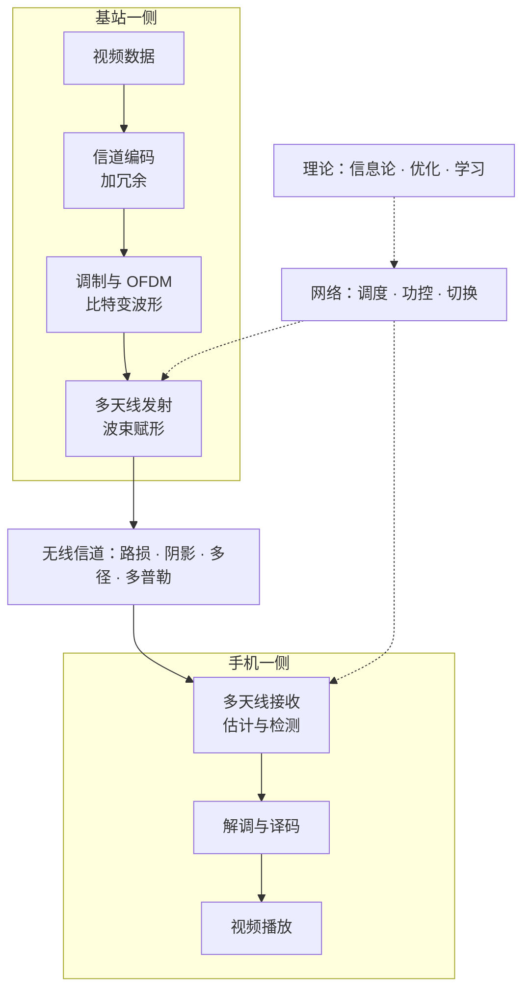
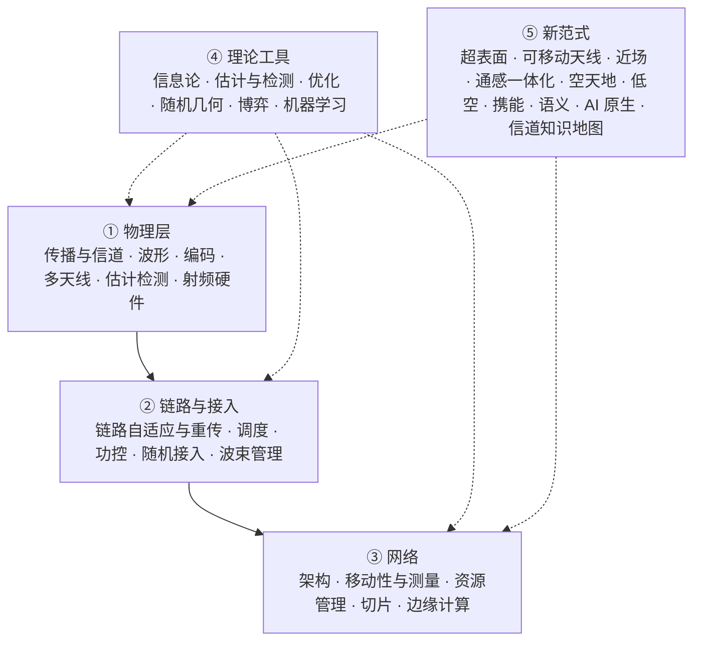

# 无线通信领域地图

刚入门的人最容易迷路的地方，往往不是某个公式推不下去，而是不知道自己站在地图的哪里。翻开一期期刊，同一本里并排放着天线设计、信道编码、强化学习调度、卫星网络和语义通信，它们之间是什么关系，哪些是地基，哪些是正在发生的前沿，很少有人专门讲。

这一页先跟着一条消息走一遍，看清一条无线链路从头到尾要经过哪些环节；再把整个领域分成五层，每层说清它研究什么、成熟到什么程度、在本站哪里讲；然后逐个看当下的前沿方向卡在哪里、往哪里走；最后交代这个领域的人在哪里发表、标准在哪里制定，以及本站讲了什么、没讲什么。

---

## 跟着一条消息走一遍

你坐在咖啡馆里用手机打开一段视频。300 米外的楼顶上有一个工作在 3.5 GHz 的基站，视频数据要从它那里来到你手里。

**第一步，变成电磁波。** 基站天线里的交变电流把能量辐射出去，3.5 GHz 对应的波长约 8.6 cm。电磁波在空旷处走 300 米，功率只剩出发时的约 $5\times10^{-10}$，也就是 93 dB 的损耗。城区里还隔着楼、树和车，按 3GPP 的城区宏站模型，同样 300 米的非视距链路损耗约 121 dB，比空旷处又多付了 28 dB。这一步属于电磁波与天线、无线信道，见[预备篇第 1 章](../part0/01-em-waves-antennas.md)和[第 2 章](../part0/02-wireless-channel-basics.md)。

**第二步，穿过一个会"变脸"的环境。** 信号沿着几十条路径到达你的手机：直射的、楼面反射的、拐角绕射的，它们在手机天线上叠加。手机挪动几厘米，叠加结果就可能从相互加强变成相互抵消；如果你坐在车上，几毫秒信道就换一副面孔。这就是小尺度衰落，[预备篇 2.4 节](../part0/02-wireless-channel-basics.md#24-小尺度衰落从多径相量和到瑞利分布)从几十个相量的加法推出了它的统计规律。

**第三步，比特怎么放进波形里。** 视频数据先加上纠错用的冗余（信道编码），再把每几个比特映射成平面上的一个点（QAM 调制）。OFDM 把 100 MHz 的带宽切成 3276 个窄子载波，每个子载波上的信道近似平坦，于是一条难对付的宽带信道变成了几千条好对付的窄带信道。见[预备篇第 3 章](../part0/03-digital-communications.md)。

**第四步，多根天线一起使劲。** 基站有几十上百根天线，可以把能量对准你，也可以同时给好几个用户各送一路数据。前者是波束赋形，后者是空间复用，合起来就是大规模 MIMO，见[预备篇第 5 章](../part0/05-mimo.md)。

**第五步，网络在背后安排。** 基站每 0.5 ms 决定一次谁用哪些频率和时间（调度）、各用多大功率（功控）。你起身离开时，手机一直在测周围几个基站的信号强弱，一旦邻近小区的信号明显更强，就切换过去。见[预备篇第 6 章](../part0/06-wireless-networks.md)。

**第六步，背后有三套理论撑着。** 信息论告诉你这条链路最多能传多快；优化告诉你有限的功率、频谱、时间该怎么分；决策与学习理论告诉你，在看不清、还会变的环境里怎么一边试一边改。分别见[预备篇第 4 章](../part0/04-information-theory-basics.md)、[第 7 章](../part0/07-optimization-basics.md)和[第 8 章](../part0/08-reinforcement-learning.md)。

*怎么读这张图：实线是一条下行链路上数据经过的环节，虚线表示网络层的决策作用在发射和接收两端，三套理论又支撑着网络层的决策。每个方框都是一个研究方向，有的已经成熟几十年，有的还在快速变化。*

---

## 一代一代换了什么

先把时间轴拉开。移动通信大约十年一代，每一代换掉的核心技术，正好对应"把什么当作资源来分"的观念变化。

| 代 | 首批商用 | 核心技术 | 资源观 |
|---|---|---|---|
| 1G | 1979 年东京 | 模拟调频语音，按频率分用户（FDMA） | 频率 |
| 2G | 1991 年芬兰（GSM） | 数字语音与短信，按时隙（TDMA）或按码（CDMA）分用户 | 频率 × 时间 / 码 |
| 3G | 2001 年日本 | 宽带 CDMA，移动数据起步 | 码 |
| 4G | 2009 年底北欧（LTE） | OFDM 加 MIMO，全 IP 网络 | 频率 × 时间（精细切分）× 少量空间 |
| 5G | 2019 年韩国与美国 | 灵活的子载波间隔、毫米波、大规模 MIMO、低时延高可靠 | 频谱 × 空间 |
| 6G | 目标 2030 年前后 | 仍以 OFDM 为底座（2025 年已定），研究重点含感知、AI 原生、地面与非地面网络融合 | 正在走向"整个电磁环境" |

从 4G 开始，物理层的底座就一直是 OFDM 加 MIMO。3GPP 在 2025 年的 6G 研究中决定，6G 下行继续用带循环前缀的 OFDM（CP-OFDM），上行同时支持 CP-OFDM 与 DFT-s-OFDM，信道编码也大体沿用 5G（截至 2026 年 10 月）。物理层底座一旦形成生态，替换它的代价就极高，所以新想法大多是在这个底座之上加一层进来的。"资源观"一列的演变，[预备篇 9.1 节](../part0/09-new-landscape.md#91-资源观的三次跃迁频谱--空间--电磁环境)有更细的讲法。

---

## 五层地图

整个领域可以粗分成五层。前三层是系统本身，从电磁波一直到网络；第四层是贯穿各层的理论工具；第五层是近十年冒出来的新范式，它们大多横跨好几层。下面每层一张表，"在本站"一列写的是站内讲它的地方，站内没讲的给出站外的入门读物。

*怎么读这张图：①②③自下而上是系统的三层，下层为上层提供服务；④是工具，哪一层都用得上；⑤的新范式一般同时改动物理层和网络层，所以画成同时指向两边。*

### ① 物理层：把比特变成能穿过空气的波

| 方向 | 它在回答什么 | 现状 | 在本站 |
|---|---|---|---|
| 电磁传播与天线 | 波怎么从天线出发、在环境里怎么走、怎么被接住 | 经典部分成熟；超大孔径、近场、高频段带来新问题 | [预备篇第 1、2 章](../part0/01-em-waves-antennas.md)；[第一部第 2 章](../part1/02-maxwell-foundations.md) |
| 信道建模 | 用什么模型描述信道，既要准又要好用 | 统计模型（3GPP TR 38.901）是产业标准；确定性模型与地图化模型正在复兴 | [第一部第 3、5、7 章](../part1/03-statistical-lineage.md) |
| 波形与调制 | 比特怎么放到时间和频率上 | OFDM 统治 4G、5G，6G 已决定继续用 | [预备篇第 3 章](../part0/03-digital-communications.md) |
| 信道编码 | 怎么加冗余，让传错的比特能被纠正 | LDPC、Polar 码已贴近香农极限，6G 大体沿用 5G 编码 | 站内只零星提到；站外读 Richardson–Urbanke《Modern Coding Theory》 |
| 多天线 MIMO | 多根天线怎么换来增益和并行的数据流 | 大规模 MIMO 已商用；超大规模阵列与近场是前沿 | [预备篇第 5 章](../part0/05-mimo.md)、[9.2 节](../part0/09-new-landscape.md#92-近场通信球面波的回归) |
| 估计、检测与同步 | 接收端怎么从带噪信号里找回信道和数据 | 线性方法成熟；大规模下的最优检测仍有悬案 | [预备篇 5.7 节](../part0/05-mimo.md#57-mimo-检测谱系从-ml-到球形译码以及-2026-年的新消息)；[第一部第 6 章](../part1/06-inverse-problem.md) |
| 射频与硬件 | 功放、混频、模数转换的非理想怎么影响系统 | 工程主导；低精度模数转换、硬件损伤建模是交叉研究 | 站内基本不讲；站外读 Razavi《RF Microelectronics》 |

这一层最老，也最"硬"：香农极限、MIMO 自由度这些结论几十年前就有了，新进展多半来自物理条件的变化。阵列做到上千根天线、孔径到米级，平面波假设就不再成立；频段往上走，路损和器件都换了脾气。2026 年 8 月，大规模 MIMO 检测这个二十年的悬案出现了一份候选解（预印本，未经评审），[预备篇 5.7 节](../part0/05-mimo.md#57-mimo-检测谱系从-ml-到球形译码以及-2026-年的新消息)讲了来龙去脉。

### ② 链路与接入：每一毫秒的小决定

| 方向 | 它在回答什么 | 现状 | 在本站 |
|---|---|---|---|
| 链路自适应与重传 | 按信道好坏选调制和码率，传错了怎么重传再合并（HARQ） | 成熟，工程细节丰富 | 站内少；站外读 Dahlman 等《5G NR》 |
| 调度 | 每个时隙把资源分给谁 | 经典理论成熟，工程上大量启发式 | [预备篇 6.4 节](../part0/06-wireless-networks.md#64-调度把资源分给谁)；[第三部第 2、4 章](../part3/02-classical-foundations.md) |
| 功率控制 | 每个用户发多大功率，既要够用又不扰人 | 理论成熟，分布式版本有经典迭代 | [预备篇 6.5 节](../part0/06-wireless-networks.md#65-功率控制从开环闭环到-foschinimiljanic) |
| 随机接入 | 大量设备抢少量资源时怎么不撞车 | 物联网时代重新变热：免授权接入、海量连接 | 站内少 |
| 波束管理 | 毫米波下怎么找到并跟住对的波束 | 已进标准；用 AI 预测波束是 Rel-19 的工作内容 | [预备篇 5.3 节](../part0/05-mimo.md#53-发射波束赋形阵列增益码本与波束管理)、[9.6 节](../part0/09-new-landscape.md#96-数字孪生与-ai-空口标准化走到哪一步了) |

这一层的特点是快。决策以毫秒甚至更短为周期，所以凡是想插进来的新方法，第一个要过的关是时延：推理一次要几百毫秒的模型，放不进一个 0.5 ms 的时隙。这也是为什么这一层的 AI 应用大多是轻量模型，或者只做预测、不直接出控制量。

### ③ 网络：把很多条链路组织起来

| 方向 | 它在回答什么 | 现状 | 在本站 |
|---|---|---|---|
| 接入网架构 | 基站功能怎么拆分、放在哪里（宏站、集中式、开放式接入网 Open RAN） | 演进中，开放接口由 O-RAN 联盟推动 | [预备篇 6.8 节](../part0/06-wireless-networks.md#68-架构演进与边缘计算) |
| 移动性与测量 | 终端测什么、什么时候报、什么时候切换 | 成熟，每个版本都在为新场景（卫星、高速）补规则 | [预备篇 6.6 节](../part0/06-wireless-networks.md#66-移动性管理切换测量与乒乓) |
| 无线资源管理与干扰协调 | 多个小区之间怎么协同，干扰怎么管 | 理论上很多问题是非凸的、分布式的 | [预备篇 6.2 节](../part0/06-wireless-networks.md#62-干扰既是根本约束也是博弈的来源)；[第三部](../part3/index.md)；[第四部第 3、8 章](../part4/03-information-structure-phase-diagram.md) |
| 核心网与网络切片 | 一张物理网络怎么切成多张逻辑网络，各自保证服务质量 | 5G 已有切片框架，调度与定价仍在研究 | [第三部](../part3/01-three-mountains.md#三座山--四大舞台)（切片作为四大舞台之一） |
| 边缘计算 | 把算力放到离用户近的地方，任务交给谁算 | 研究热，产业部署起步 | [预备篇 6.8 节](../part0/06-wireless-networks.md#mec把算力放到网络边缘)；[第三部](../part3/02-classical-foundations.md#27-当代回声数据中心云边定价边缘卸载与联邦学习) |

蜂窝网之外还有 Wi-Fi（IEEE 802.11 系列）。它用的物理层同样是 OFDM 加 MIMO，承载了相当一部分室内流量，但标准组织、频谱规则（免授权频段）和接入方式（先听后发）都和蜂窝不同。本站的讨论以蜂窝为主，结论大多可以平移到 Wi-Fi。

网络层的难点在于"很多个"：很多小区、很多用户、很多决策者，各自只看到一部分信息，信息在网络里传递又要时间和代价。第三部和第四部就是为这一层的理论写的。

### ④ 理论工具：哪一层都用得上

| 工具 | 它回答什么 | 在本站 |
|---|---|---|
| 信息论 | 极限在哪：最多能传多少、最少要说多少 | [预备篇第 4 章](../part0/04-information-theory-basics.md)；全站 |
| 估计与检测理论 | 从带噪观测里能把参数估多准（CRB、MMSE）、判断能多可靠 | [预备篇 4.10 节](../part0/04-information-theory-basics.md#410-条件期望与高斯估计后文最常用的三件工具)、[9.4 节](../part0/09-new-landscape.md#94-isac-通感一体化一段波形两种任务) |
| 优化 | 资源怎么分最好；问题凸不凸、能不能分布式求解 | [预备篇第 7 章](../part0/07-optimization-basics.md)；[第三部](../part3/index.md) |
| 随机几何 | 把基站和用户的位置当成随机点，算整张网络的覆盖率与速率 | 站内不讲；站外读 Haenggi《Stochastic Geometry for Wireless Networks》 |
| 博弈与团队决策 | 多个决策者各有信息、各有目标时会怎样 | [第四部](../part4/index.md) |
| 机器学习与强化学习 | 模型不知道或太复杂时，从数据里学 | [预备篇第 8 章](../part0/08-reinforcement-learning.md)；[第二部第 4 章](../part2/04-environment-generalization.md)；[第三部第 3 章](../part3/03-nonconvex-era.md) |

工具层有一个容易被忽略的分工。算法给出"我能做到多好"（上界侧），极限理论给出"任何人最多做到多好"（下界侧，信息论里叫 converse）。没有后者，一个新方法报出 12% 的增益时，你不知道它是逼近了墙还是离墙还远。本站四部的主线就是补后者，[第四部 9.8 节](../part4/09-research-agenda.md#98-全站收尾四部如何合成一个体系)把这件事说得最完整。

### ⑤ 新范式：这十年冒出来的东西

新范式大致分五组。环境与空间类想把"环境"和"空间"本身变成可设计的资源：智能超表面、可移动天线、超大规模阵列与近场、无蜂窝、电磁信息论、信道知识地图。融合类让一套系统兼做几件事：通感一体化、全双工、携能通信、语义通信、通信与计算融合。疆域类把网络铺到新的地方和频段：空天地一体、低空网络、新频谱、新波形。智能类让网络自己学会决策：AI 原生空口、大模型与智能体、数字孪生。安全类在物理层上保密或隐藏通信的存在。下一节逐个看。

---

## 前沿方向：各自卡在哪里，往哪里走

每个方向写三件事：它许诺了什么，它卡在哪里，眼下的状态和往前走的方向。"卡在哪里"大多可以归到几个反复出现的问题上：时间尺度对不对得上、需要的信息拿不拿得到、自由度够不够、残差会不会把增益吃掉、代价是不是真实、产业会不会接受。这几个问题在[八条线索](05-eight-threads.md)一页里展开。下面关于现状与走向的判断是本站的归纳【本站判断】，标准状态截至 2026 年 10 月。

### 环境与空间类

#### 超大规模 MIMO 与近场

天线阵做到几百上千根、孔径到米级以后，阵列"看到"的不再是平面波，而是带弯曲的球面波。波前的弯曲里藏着距离信息，于是基站不只能选方向，还能按位置聚焦，同一个方向上远近两个用户也能分开。100 GHz、1 米孔径时，近场范围（瑞利距离）约 667 米，几乎整个小区都在近场里（[预备篇算例 9-2](../part0/09-new-landscape.md#92-近场通信球面波的回归)）。

代价是信道参数从"角度"一维变成"角度加距离"二维，估计和码本的开销随之膨胀；阵列大到一定程度，不同部分看到的散射体都不一样，叫空间非平稳。往前走，一个值得想清楚的问题是：近场带来的能力，关键在频段高，还是在孔径相对距离提供了足够多的自由度？答案是后者，所以毫米波甚至更低频段的大孔径、分布式阵列同样能做聚焦。混合近远场的统一模型、利用信道结构的低复杂度估计，都是活跃的方向。数光斑式的自由度计数与空间非平稳见[预备篇 10.2 节](../part0/10-new-phy-dof.md#102-超大规模阵列自由度从孔径里来)。大规模 MIMO 的开篇论文拆解见[开篇之作 · 第 3 篇](03-seminal-papers.md#3-marzetta-2010天线多到无穷时只剩导频污染)，近场信道估计的代表作列在该页的[其他开篇之作](03-seminal-papers.md#四其他开篇之作)。

#### 智能超表面（RIS）

在墙上贴一层由成百上千个可调单元组成的表面，每个单元能改变反射信号的相位，整面墙就成了可编程的反射镜。相位对齐后，接收功率随单元数 $N$ 按 $N^2$ 增长（[预备篇 9.3 节](../part0/09-new-landscape.md#93-ris-智能超表面可编程的反射镜)）。它把"环境"从只能适应的对象变成了可以设计的变量，这是它在学术上迅速走红的原因。

它卡在三处。级联链路要付两次路径损耗，几百个单元的超表面打不过一条健康的直达径（预备篇算例 9-3 算出差约 8 dB），它真正的用武之地是救援被遮挡的链路。无源单元不能自己收发导频，信道估计的开销随 $N$ 增长。相位配置要靠一条控制链路下发，带来时延和部署成本。超表面没有进入 3GPP Rel-19；Rel-18 先标准化的是有源、受网络控制的中继器（NCR）【表述待核】。往前看，最有价值的工作在"用对地方"：覆盖增强、遮挡救援、配合信道知识地图决定装在哪里、装多大；先在最简单的纯相位模型上把核心结论立住，再考虑叠加反射、透射、放大等更多功能。开篇论文及同期几篇平行工作见[开篇之作 · 第 8 篇](03-seminal-papers.md#8-wuzhang-2019-与同期工作让墙面成为可设计的变量)。

#### 可移动天线与流体天线

天线不再固定在一个位置，而是能在一小块区域里移动，或者在多个端口之间切换。信道在空间里本来就有起伏，换一个位置就可能从衰落谷底挪到峰顶，所以天线位置成了一个新的设计自由度。这两年这个方向升温很快，论文数量增长迅速，尚无标准。

它的边界也很清楚。机械移动慢且耗能，只适合跟踪慢变的量，比如用户分布和大尺度遮挡，不适合追瞬时衰落，于是自然的设计是两时间尺度：慢层调位置，快层调预编码。它的增益上限取决于那块区域里信道场有多少独立的变化，视距主导的环境里几乎没什么可挖；这正是[第一部第 4 章](../part1/04-spatial-structure.md)讲的空间自由度问题。和级联信道结合时还要先看秩：只动一端，改变不了另一端卡住的秩。往前走，最需要的是判据：区域多大、天线多少、环境多丰富时才值得动；以及在卫星、无人机这类"平台本身在动"的场景里，利用轨道已知、用户分布有先验这些特点。增益上界与算例见[预备篇 10.1 节](../part0/10-new-phy-dof.md#101-可移动天线与流体天线让天线的位置成为变量)。两条线的开篇论文与先后关系见[开篇之作 · 第 10 篇](03-seminal-papers.md#10-可移动天线与流体天线让天线的位置动起来)。

#### 无蜂窝与分布式 MIMO

不再把区域切成一个个小区，而是让大量分散的接入点共同服务每个用户，小区边缘的问题从根上消失。OFDM 在这里帮了大忙：只要各接入点到用户的时延差落在循环前缀之内，子载波之间仍然正交，分布式的节点也能像一个大阵列那样协同。

卡点在前传和信息汇聚。要做最优的联合处理，就得把所有节点的信道信息集中到一处，前传容量、同步精度和时延都成了问题。产业界以多发送接收点（multi-TRP）协作和分布式 MIMO 试验的形式推进。理论上最值得问的是：只用局部信息、局部协调能做到多好，什么条件下分布式处理不亏多少。这正是[第四部第 3 章](../part4/03-information-structure-phase-diagram.md#35-两小区comp-的工程常识是一条相边界)信息结构相图要回答的问题：回传时延不超过干扰耦合的时间尺度，协作问题才是凸的、好解的。边缘用户的增益怎样算、循环前缀能容下多大的时延差，见[预备篇 10.3 节](../part0/10-new-phy-dof.md#103-无蜂窝与分布式-mimo拆掉小区的边界)。开篇论文见[开篇之作 · 第 9 篇](03-seminal-papers.md#9-ngo-等-2017不要小区了)。

#### 电磁信息论

它从 Maxwell 方程出发问一个朴素的问题：一块给定体积的空间里，电磁场到底能承载多少信息？天线从离散的几根变成连续的一整面孔径、环境里多了可编程的表面以后，数天线个数的老办法失效了，需要从波动方程本身去数自由度。[第一部第 4 章](../part1/04-spatial-structure.md#三位一体λ2-采样相干距离与自由度密度)和[第 8 章](../part1/08-dimension-and-prediction.md#q1-的形式化有效维度与环境等价类)讲了已有的结果和本站提出的有效维度问题。

这个方向现在最缺的是和系统设计的接口。自由度数出来了，但"天线该排多密、孔径多大才值得、超表面该做多大"这些设计问题还很少能直接从理论里读出答案。谁能把它做成别人可以直接拿来用的模型，谁就打开了这扇门。接口问题见[第一部第 10 章](../part1/10-research-agenda.md#q1--静力学的接口电磁信息论)。

#### 信道知识地图与环境感知通信

把"某个位置上的信道大概是什么样"存成一张以位置为索引的地图（channel knowledge map，CKM），基站查图就知道该用哪个波束、该把用户交给谁，不必每次都从头估计信道。导频开销是它最直接的动机：28 GHz 下扫 256 个波束，导频能吃掉一个相干块的 85%（[第一部第 1 章](../part1/01-lie-of-randomness.md#统计范式理性的选择与它的账单)）。

它卡在两件事上。一是还没有一个人人可以直接拿来用的统一模型，射线追踪、数据驱动、虚拟散射体等路线并存，各说各的。二是地图的更新：终端本来就在例行测量并上报周围基站的信号强度，3GPP 的最小化路测（MDT，TS 37.320）还能收集带位置的测量，所以"采集数据"本身往往不是代价，真实代价在汇聚、存储、计算和跨系统的信令上；而"等性能变差了再更新"要求知道真实信道，有了真实信道就不需要地图，这在因果上绕了一个圈。往前走，比较站得住的做法是把地图当作在一段时间内被信任的慢变知识，按环境变化的统计时间尺度定期更新，或者用实际测得到的那部分链路上的预测残差来触发更新；用途上先做好部署规划这类离线任务。[第一部第 7 章](../part1/07-channel-cartography.md#可地图化判据地图是-φ-的边缘化)把地图写成了条件分布的泛函，是统一模型的一个起点；网络里已经在流动的数据和地图的准静态用法见[预备篇 11.5 节](../part0/11-new-network-frontiers.md#115-信道知识地图的工业形态数据已经在流动)。开篇论文见[开篇之作 · 第 11 篇](03-seminal-papers.md#11-zengxu-2021把信道知识存成地图)。

### 融合类

#### 通感一体化（ISAC）

让一段波形同时传数据和探测环境，基站顺便当雷达。它的吸引力在硬件上：6G 的大带宽、大阵列基站本来就很像相控阵雷达，自动驾驶、低空经济又同时需要连接和感知。

卡点是两件事对资源的偏好不同。通信速率靠维度：高信噪比下，带宽、时间或空间自由度翻一倍，速率近似翻一倍，而功率翻倍只多一点。感知精度主要靠总能量：同样的能量，集中在一个短脉冲里还是摊在长时间里，测距精度差不多。所以"合在一起做"比"分时各做各的"到底好多少，是需要证明的事，而且单站感知要一边发一边收，又撞上全双工的自干扰难题。3GPP 在 Rel-19 做了通感信道建模的研究，6G 研究项目也把感知列入了范围【表述待核】。往前走，值得做的是两类工作：一类是给出一体化胜过分时的条件；另一类是真正解决感知本身的难题，比如密集目标的分辨和杂波抑制，而不只是在通信优化里加一个 CRB 约束。见[预备篇 9.4 节](../part0/09-new-landscape.md#94-isac-通感一体化一段波形两种任务)和[第二部第 5 章](../part2/05-cognitive-triangle.md#51-回顾isac-已经把两件事定了价用的是两把不同的尺)。OFDM 雷达的开篇论文见[开篇之作 · 第 12 篇](03-seminal-papers.md#12-sturmwiesbeck-2011让通信信号顺便当雷达)。

#### 全双工与子带全双工

同一频率上同时收和发，理论上频谱效率翻倍。难处在于自己发出的信号比要收的强太多：基站以 46 dBm 发射，而 20 MHz 带宽、噪声系数 5 dB 的接收机噪声底约 −96 dBm，要把自干扰压到噪声底，需要约 142 dB 的抑制（校验：$46-(-174+73+5)=142$）。城区里近处楼面反射回来的回波随环境变化，很难校准消掉；终端只能半双工，全网的实际增益远小于两倍。

产业界给出的回答是换一个提法。Rel-19 写进规范的是子带全双工（SBFD）：只在基站侧同时收发，上下行放在同一个 TDD 载波里互不重叠的子带上，终端仍是半双工。它绕开了同频同时最难的部分，换来上行覆盖和时延的改善。往前看，同频全双工的理论问题仍然有价值，特别是"在不完美消除下，全双工什么时候才胜过半双工"这种带门限的折中；没有近处反射的场景（比如卫星）也是它的机会。全双工胜过半双工的门限推导见[预备篇 10.4 节](../part0/10-new-phy-dof.md#104-全双工与子带全双工一边说一边听的账)。全双工原型的代表作列在[其他开篇之作](03-seminal-papers.md#四其他开篇之作)。

#### 携能通信、无线能量传输与环境物联网

用同一个电磁波既送信息又送能量，让传感器、标签这类小设备不用换电池。困难来自路损：915 MHz、发射功率 1 W（全向天线）时，10 米外一个普通天线只能收到约 6.8 μW，按 30% 这个偏乐观的整流效率，能用的只有约 2 μW（校验：自由空间损耗 $20\log_{10}(4\pi\cdot10/0.328)=51.7$ dB，$30-51.7=-21.7$ dBm）。信息和能量对接收机的要求还互相矛盾，于是有了速率–能量折中。

3GPP 在 Rel-19 立了环境物联网（Ambient IoT）工作项目，面向功耗低至约 1 μW 的终端，正好落在上面算出的量级上。往前走，反向散射通信（设备不自己产生载波，而是调制反射别人的信号）、超低功耗接收机、能量与信息的联合调度都是活跃方向；更重要的是把"手头有多少能量"当作设计的第一约束，而不是事后补充。速率–能量折中与反向散射的链路预算见[预备篇 11.3 节](../part0/11-new-network-frontiers.md#113-携能通信与环境物联网用电磁波送能量)。开篇论文见[开篇之作 · 第 6 篇](03-seminal-papers.md#6-zhangho-2013同一个信号既送信息又送能量)。

#### 语义与任务导向通信

只传完成任务所需的信息，而不是把每个比特都原样搬过去。一张图约 $1.2\times10^6$ 比特，若任务只是分类，答案至多十来个比特（[预备篇算例 9-5](../part0/09-new-landscape.md#95-语义通信传意思不传比特)）。它没有推翻香农，而是把"保真"的对象从信号换成了任务，在数学上是远端信源和间接率失真的推广。

卡点是理论缺口：语义信息还没有公认的度量，也没有"语义容量"的编码定理；端到端学出来的系统，互操作和泛化都难保证。往前走，一条路是用任务充分统计量和间接率失真给它打理论地基（[第二部第 3 章](../part2/03-task-knowledge-lattice.md#32-够用的精确含义任务类充分统计量)），另一条路是先在不受标准约束的封闭系统里落地，比如机器对机器的协作。深度联合信源信道编码的代表作列在[其他开篇之作](03-seminal-papers.md#四其他开篇之作)。

#### 通信与计算融合

网络不只搬比特，还要在边缘算、在网络里算。最有意思的一个现象是空中计算：多个设备同时发送，信号在空中叠加，接收端直接得到它们的和，干扰反而成了加法器（[第三部第 8 章](../part3/08-computing-network-capacity.md#正面反转无线叠加把干扰变成加法器)）。联邦学习、边缘推理、大模型的分布式推理都属于这一类。

卡点是理论不完备：搬比特的网络容量理论是成熟的，"网络能多快地算出一个函数"却连一个小例子上都出现过错了四年的上界。往前走，计算网络的容量与标度律、大模型推理在网络里怎么切分和调度，是理论和工程都缺答案的地方，见[第三部第 4、7、8 章](../part3/08-computing-network-capacity.md#场景落地网内聚合分布式-llm-推理all-reduce)。空中计算的信息论源头见[开篇之作 · 第 13 篇](03-seminal-papers.md#13-nazergastpar-2007让信道替我们做加法)。

### 疆域类

#### 非地面网络与空天地一体

用卫星、高空平台和无人机补上地面网络覆盖不到的地方，手机直接连卫星。困难都来自几何：600 公里高的低轨卫星，正上方时单程时延 2 ms，仰角降到 10° 时超过 6 ms；轨道速度约 7.6 km/s，2 GHz 下多普勒可达几十 kHz；一颗卫星一次过境只有几分钟（最小仰角取 10° 时，正过顶最长约 8.5 分钟）；卫星小区的中心和边缘信号强度差别不大，按信号强度决定切换就不灵了。好消息是轨道是已知的，时延和多普勒的大部分可以预测、预先补偿（[预备篇 2.5 节](../part0/02-wireless-channel-basics.md#相干时间)的卫星提示框）。

3GPP 从 Rel-17 开始标准化 NR 的非地面网络，之后每个版本都在补充，并为卫星场景加入了按终端位置和按时间触发的切换条件；6G 研究把地面与非地面网络的融合列为重点之一【表述待核】。往前走，最容易犯的错误是把地面的方法原样搬上卫星。真正值得做的是用上卫星独有的条件：自身运动和轨道已知，地面用户分布有很强的先验（海上几乎没有用户，城市成簇），以及星地之间的跨系统协同。几何、多普勒与按位置切换的推导见[预备篇 11.1 节](../part0/11-new-network-frontiers.md#111-非地面网络与空天地一体把基站搬上天)。

#### 无人机与低空网络

无人机既可以是用户（物流、巡检、航拍），也可以当空中基站或中继；它的位置和航迹本身成了可以设计的变量，这是无人机通信区别于地面通信的核心。空中用户能"看见"很多基站，下行干扰重、切换频繁；地面基站的天线主要朝下倾，空中覆盖反而差；续航又限制了一切。

国内近年把低空经济列为重点发展方向，3GPP 从 LTE 时代起就研究过对空中终端的支持。往前走，三维覆盖规划、按无线电地图规划航迹（地图对无人机的路径规划很有用，这也是信道知识地图研究的起点之一）、感知与通信结合的低空监管都很活跃。还有一个容易被忽略的问题：用射频识别无人机，对不发信号的无人机就无能为力，这类场景需要真正的感知手段。最优高度和"飞到用户头上"的账见[预备篇 11.2 节](../part0/11-new-network-frontiers.md#112-无人机与低空网络位置和航迹成了设计变量)。无人机轨迹优化的开篇论文见[开篇之作 · 第 7 篇](03-seminal-papers.md#7-zengzhang-2017把无人机的轨迹变成设计变量)。

#### 新频谱：上中频、毫米波与太赫兹

频段越高，可用带宽越大，但路损、穿透和器件也越难。毫米波在 5G 已经商用，但覆盖有限，部署远不如中频广。业界对 6G 新增频谱的主要期待落在 7–15 GHz 一带的上中频，它在带宽和覆盖之间折中；太赫兹（约 0.1–10 THz）带宽极大，但路损、器件和覆盖问题使它仍处在研究阶段，近期更可能用在短距场景，比如数据中心或设备之间。

往前走，上中频上的超大规模阵列与近场、毫米波的覆盖增强（这正是超表面和中继的用武之地）、太赫兹的器件与短距系统，是三条不同节奏的路。"频率越高路损越大"在什么条件下成立，见[预备篇 10.6 节](../part0/10-new-phy-dof.md#106-6g-频谱上中频毫米波与太赫兹)。毫米波可用于蜂窝的实测代表作列在[其他开篇之作](03-seminal-papers.md#四其他开篇之作)。

#### 新波形：OTFS 与 AFDM

OFDM 在高速移动下会因为多普勒而让子载波互相干扰。OTFS 换到时延–多普勒域上放数据，AFDM 用线性调频（chirp）子载波，二者都对高速移动更稳，也天然适合感知。

但 OFDM 有很深的护城河：每个子载波上是一个平坦的 MIMO 信道，多天线处理在频域上可以逐个子载波独立完成；循环前缀能吸收多径时延和分布式节点间的小同步误差；芯片、测试和标准的生态极其成熟。3GPP 已经决定 6G 继续用 CP-OFDM。往前走，新波形更现实的位置是不受蜂窝标准约束的场景（车与车之间、高速移动的点对点链路）、通感一体化里的感知波形，以及与 OFDM 兼容的增强，而不是替换 OFDM 去做多址。多普勒造成的子载波间干扰怎样算、OFDM 的护城河在哪里，见[预备篇 10.5 节](../part0/10-new-phy-dof.md#105-新波形otfsafdm-与-ofdm-的护城河)。OTFS 与 AFDM 的原始论文列在[其他开篇之作](03-seminal-papers.md#四其他开篇之作)。

### 智能类

#### AI 原生空口

用学出来的模块替代或增强人工设计的模块，比如用自编码器压缩 CSI 反馈、用预测减少波束测量、用学习提升定位。它是新概念里离商用最近的一个：Rel-18 做了研究（TR 38.843），Rel-19 的工作项目覆盖波束管理、定位与 CSI 预测，6G 研究在 5G 的 AI/ML 框架上继续推进【表述待核】。

卡点首先是泛化，换个小区、换个城市还灵不灵。[第二部第 4 章](../part2/04-environment-generalization.md#46-相位--结构二分泛化半径-lambda4-对-l)给了一个物理分界：只依赖时延、角度、功率这些"结构级"特征的模型能迁移到米级的环境变化，依赖相位的模型在 $\lambda/4$（3.5 GHz 下约 2 厘米）之外就失效。其次是互操作：编码器在终端、解码器在基站，分属不同厂商时怎么配对、怎么测试。再次是缺少性能保证和上界。往前走，环境相关的轻量模型（与环境无关的前端加随环境微调的后端）、和经典方法的公平比较、给学习型系统立上界，都是有实际价值的方向。3GPP 的 AI/ML 路线与时间尺度的分工见[预备篇 11.6 节](../part0/11-new-network-frontiers.md#116-ai-原生网络大模型与智能体先问时间尺度)。

#### 大模型与智能体用于网络

用大语言模型和智能体做网络规划、运维、配置和故障分析，甚至参与资源分配。卡点首先是时间尺度：大模型推理一次要几百毫秒到数秒，空口决策以毫秒计，二者差了两三个数量级；其次是算力与能耗的账，以及可靠性与可解释性。

所以比较合理的分工是按时间尺度切：大模型做离线的、慢的事，比如部署规划、码本和覆盖区域的设计、运维分析；实时的事交给为具体环境训练的小模型；大模型更适合当调用工具的调度者，而不是直接输出控制量。这个方向起得快、跟风的工作多，选题时尤其要问清楚"不用大模型能不能做、做得更好"。时间尺度的账见[预备篇 11.6 节](../part0/11-new-network-frontiers.md#116-ai-原生网络大模型与智能体先问时间尺度)。

#### 数字孪生

为物理网络建一个同步的虚拟副本，任何调整先在副本里试。卡点是建模精度、算力和实时性三者互相打架：城市级的高保真电磁仿真至今以小时计。网管级的孪生已有试点，电磁级的孪生还在研究，见[预备篇 9.6 节](../part0/09-new-landscape.md#96-数字孪生与-ai-空口标准化走到哪一步了)和[第一部第 5 章](../part1/05-deterministic-revival.md#数字孪生把箭头接成闭环)。

### 安全类

#### 物理层安全与隐蔽通信

物理层安全利用合法用户与窃听者信道的差异保密：在高斯窃听信道里，窃听者的信道更差时，能安全传输的速率是两者容量之差 $[C_B-C_E]^+$。隐蔽通信要求更高，它要让检测者连"有没有人在通信"都判断不出来；这时在 $n$ 次信道使用里能可靠又隐蔽地传的比特数只能按 $\sqrt{n}$ 增长，叫平方根律。

两者都卡在信息上：要知道窃听者或检测者的信道乃至位置，而现实中往往不知道。电磁波在空间里叠加，也不可能把一整片区域里的信号都消掉。比较站得住的提法是"已知它在某个区域内，对区域里最坏的位置设计"，再把对它的不确定性正式写进模型；物理层手段和上层加密怎么分工，也是需要想清楚的问题。保密容量、人工噪声和平方根律的推导见[预备篇 11.4 节](../part0/11-new-network-frontiers.md#114-物理层安全与隐蔽通信不靠密钥的保密)。开篇论文见[开篇之作 · 第 5 篇](03-seminal-papers.md#5-wyner-1975-与-bash-等-2013不用密钥的保密不被发现的通信)。

### 一张表看全部前沿

| 方向 | 一句话 | 标准状态（截至 2026-10） | 在本站 |
|---|---|---|---|
| 超大规模 MIMO 与近场 | 球面波让阵列能按位置聚焦 | 6G 研究中 | [预备篇 9.2 节](../part0/09-new-landscape.md#92-近场通信球面波的回归)、[10.2 节](../part0/10-new-phy-dof.md#102-超大规模阵列自由度从孔径里来) |
| 智能超表面 | 把环境变成可设计的变量 | 未进 Rel-19；Rel-18 标准化 NCR【表述待核】 | [预备篇 9.3 节](../part0/09-new-landscape.md#93-ris-智能超表面可编程的反射镜) |
| 可移动/流体天线 | 天线位置成为新自由度 | 无 | [预备篇 10.1 节](../part0/10-new-phy-dof.md#101-可移动天线与流体天线让天线的位置成为变量)；[第一部第 4 章](../part1/04-spatial-structure.md)（空间自由度） |
| 无蜂窝 | 大量接入点共同服务每个用户 | 以多 TRP 协作的形式部分进入 | [预备篇 10.3 节](../part0/10-new-phy-dof.md#103-无蜂窝与分布式-mimo拆掉小区的边界)；[第四部第 3 章](../part4/03-information-structure-phase-diagram.md) |
| 电磁信息论 | 空间能承载多少信息 | 理论研究 | [第一部第 4、8、10 章](../part1/10-research-agenda.md#q1--静力学的接口电磁信息论) |
| 信道知识地图 | 按位置存储信道知识 | 有数据通道（MDT），无 CKM 本身 | [预备篇 11.5 节](../part0/11-new-network-frontiers.md#115-信道知识地图的工业形态数据已经在流动)；[第一部第 7、9 章](../part1/07-channel-cartography.md) |
| 通感一体化 | 一段波形既通信又感知 | Rel-19 信道建模研究 | [预备篇 9.4 节](../part0/09-new-landscape.md#94-isac-通感一体化一段波形两种任务)；[第二部第 5 章](../part2/05-cognitive-triangle.md) |
| 全双工 | 同频同时收发 | Rel-19 标准化子带全双工 SBFD | [预备篇 10.4 节](../part0/10-new-phy-dof.md#104-全双工与子带全双工一边说一边听的账) |
| 携能与环境物联网 | 电磁波同时送能量和信息 | Rel-19 环境物联网工作项目 | [预备篇 11.3 节](../part0/11-new-network-frontiers.md#113-携能通信与环境物联网用电磁波送能量) |
| 语义通信 | 只传任务需要的信息 | 无 | [预备篇 9.5 节](../part0/09-new-landscape.md#95-语义通信传意思不传比特)；[第二部第 3 章](../part2/03-task-knowledge-lattice.md) |
| 通信与计算融合 | 网络里算、空中算 | 部分进入（边缘计算框架） | [第三部第 8 章](../part3/08-computing-network-capacity.md) |
| 非地面网络 | 卫星补齐覆盖，手机直连卫星 | Rel-17 起持续演进 | [预备篇 11.1 节](../part0/11-new-network-frontiers.md#111-非地面网络与空天地一体把基站搬上天) |
| 无人机与低空 | 位置与航迹成为设计变量 | 有空中终端支持 | [预备篇 11.2 节](../part0/11-new-network-frontiers.md#112-无人机与低空网络位置和航迹成了设计变量) |
| 新频谱 | 上中频、毫米波、太赫兹 | 上中频是 6G 新增频谱的重点 | [预备篇 10.6 节](../part0/10-new-phy-dof.md#106-6g-频谱上中频毫米波与太赫兹) |
| 新波形 | 时延–多普勒域上放数据 | 6G 已定 CP-OFDM | [预备篇 10.5 节](../part0/10-new-phy-dof.md#105-新波形otfsafdm-与-ofdm-的护城河) |
| AI 原生空口 | 学出来的模块替代人工设计 | Rel-19 工作项目 | [预备篇 9.6 节](../part0/09-new-landscape.md#96-数字孪生与-ai-空口标准化走到哪一步了)、[11.6 节](../part0/11-new-network-frontiers.md#116-ai-原生网络大模型与智能体先问时间尺度)；[第二部第 4 章](../part2/04-environment-generalization.md) |
| 大模型与智能体 | 网络规划与运维的助手 | 研究与试点 | [预备篇 11.6 节](../part0/11-new-network-frontiers.md#116-ai-原生网络大模型与智能体先问时间尺度)；[第三部第 4 章](../part3/04-sequential-uncertainty.md#场景落地二llm-推理调度碎片化的当代样本)（作为业务负载） |
| 数字孪生 | 网络的虚拟副本 | 网管级试点 | [第一部第 5 章](../part1/05-deterministic-revival.md#数字孪生把箭头接成闭环) |
| 物理层安全与隐蔽通信 | 利用信道差异保密或隐身 | 无 | [预备篇 11.4 节](../part0/11-new-network-frontiers.md#114-物理层安全与隐蔽通信不靠密钥的保密) |

预备篇的[第 10 章](../part0/10-new-phy-dof.md)和[第 11 章](../part0/11-new-network-frontiers.md)给上表的大部分方向各写了一节，每节有一个关键推导、一个带数字的算例和一张按八条线索排的体检卡。

---

## 这个领域的人在哪里交流

**期刊和会议。** 无线通信的主要阵地在 IEEE 的几个学会。通信学会（ComSoc）的期刊最集中：*IEEE Journal on Selected Areas in Communications*（JSAC，按专题组稿，新方向常在这里首次成规模出现）、*IEEE Transactions on Wireless Communications*（TWC）、*IEEE Transactions on Communications*（TCOM），综述期刊 *IEEE Communications Surveys & Tutorials*，杂志 *IEEE Communications Magazine* 和 *IEEE Wireless Communications*，短文期刊 *IEEE Wireless Communications Letters* 与 *IEEE Communications Letters*；会议有 ICC 和 GLOBECOM。偏信号处理的工作发在 *IEEE Transactions on Signal Processing* 以及 ICASSP、SPAWC；偏信息论的发在 *IEEE Transactions on Information Theory* 和 ISIT；偏网络与系统的发在 *IEEE/ACM Transactions on Networking*、*IEEE Transactions on Mobile Computing* 以及 INFOCOM、MobiCom 等会议。

入门时建议先读杂志文章和综述。杂志文章篇幅短、少公式，专讲一个方向的动机、机会和挑战，很多方向的开篇之作就是一篇杂志文章，读完能很快知道这个方向"开的是哪扇门"。综述适合在决定深入某个方向时通读一遍。读开篇之作时，留意三件事：它的系统模型有多简单，它的第一个结论有多干净，它怎样回答"这个新东西和通信系统在哪里结合"。

**标准和产业。** 移动通信的标准由 3GPP 制定。它下设多个工作组，RAN1 管物理层，RAN2 管无线协议，RAN3 管接入网架构，RAN4 管射频与性能要求，SA1 管业务需求，SA2 管系统架构。工作按版本（Release）推进，一项新技术通常先立研究项目（study item），产出技术报告（TR）；结论积极的再立工作项目（work item），写进技术规范（TS）。截至 2026 年 10 月，Rel-20 在做 6G 研究，Rel-21 将在 2027 年 3 月到 2028 年底写出首批 6G 规范，首批商用目标是 2030 年前后。ITU-R 的 WP 5D 负责 6G（IMT-2030）的需求与评估，各方的技术方案从 2027 年起提交、2029 年截止。Wi-Fi 由 IEEE 802.11 工作组制定，开放接入网的接口由 O-RAN 联盟推动。

学术研究和标准之间隔着一段距离。一个想法在论文里成立，到进入标准，要过时延、代价、兼容性和产业生态好几道关；很多想法以换了一种提法的形式进入标准，比如全双工以子带全双工的形式进入 Rel-19。理解这段距离，是判断一个方向有没有实际意义的重要依据。

**入门读物。** 本站之外，下面几本是这个领域公认的入门与参考书：

- D. Tse、P. Viswanath，*Fundamentals of Wireless Communication*（2005）：无线通信基础，从信道到 MIMO 与多用户，讲法重直觉。
- A. Goldsmith，*Wireless Communications*（2005）：覆盖面更广的教材。
- R. W. Heath Jr.、A. Lozano，*Foundations of MIMO Communication*：MIMO 的系统讲法。
- T. M. Cover、J. A. Thomas，*Elements of Information Theory*：信息论标准教材。
- S. Boyd、L. Vandenberghe，*Convex Optimization*：优化的标准教材。
- R. S. Sutton、A. G. Barto，*Reinforcement Learning: An Introduction*：强化学习入门。
- E. Dahlman、S. Parkvall、J. Sköld，*5G NR* 系列：5G 标准的工程全貌。
- T. Richardson、R. Urbanke，*Modern Coding Theory*：现代信道编码。
- M. Haenggi，*Stochastic Geometry for Wireless Networks*：随机几何。
- B. Razavi，*RF Microelectronics*：射频电路。

---

## 本站在地图上的位置

本站不是一本覆盖全领域的教科书。它的主体（四部）是一个研究纲领：沿着"环境 → 信道 → 任务 → 网络 → 群体"这条线，找出无线智能网络底下还没有定理的地方。预备篇和导览篇负责把读者从本科水平带到能读懂这条线。下表是各部分在五层地图上的覆盖情况。

| 本站 | ① 物理层 | ② 链路与接入 | ③ 网络 | ④ 理论工具 | ⑤ 新范式 |
|---|---|---|---|---|---|
| 预备篇 | 传播、信道、调制、OFDM、MIMO | 调度、功控 | 蜂窝、多址、切换、架构、边缘计算 | 信息论、优化、强化学习 | 近场、超表面、通感、语义、AI 空口 |
| 第一部 · 环境的科学 | 信道从哪里来（深） | — | — | 逆问题、空间自由度 | 信道知识地图、电磁信息论、射线追踪与数字孪生 |
| 第二部 · 链的定理 | 观测与误配 | — | — | 统计决策论、信息论（深） | 任务导向通信、AI 空口泛化、通感 |
| 第三部 · 网络的优化论 | — | 调度、资源分配 | 资源优化、分层架构（深） | 优化、通信复杂度、在线学习 | 边缘计算、大模型推理、联邦学习、切片 |
| 第四部 · 群体的决策论 | — | 分布式功控 | 多小区协作、多智能体（深） | 团队决策、博弈、平均场 | 多智能体网络 |

可以看出，本站讲得深的是④理论工具，以及它在①物理层的信道部分和③网络层上的应用。信道编码、射频电路、协议细节、核心网、随机几何、Wi-Fi，本站基本不讲或只是顺带提到，需要时请看上面列的读物。读本站的同时，最好读一本 Tse–Viswanath 这样的标准教材作对照：教材给你领域的共识，本站告诉你共识的边界在哪里。

怎么在这么大的站里安排阅读，见[学习路径](02-learning-paths.md)。
