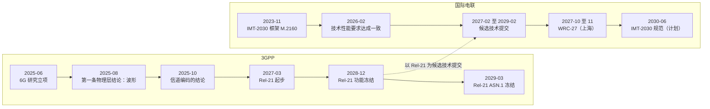

# 从香农到 6G：时间线与标准怎样运作

一个想法从论文走到手机里，要过很多道关。这一页先把无线通信七十多年的历史排成三条并行的线：理论里程碑，一代一代的产品，标准与国际电联的节点；然后讲清标准是怎样制定的，用 AI/ML 空口走一遍完整流程；再看一组"从论文到标准走了多少年"的数；最后交代截至 2026 年 10 月，6G 已经定下来的几件事。

读这一页，目的不是记住年份，而是建立一种判断：一项新技术要进标准，光有论文里的增益不够。这正是[八条线索](05-eight-threads.md#6-采纳产业会不会接受)里"采纳"那一条的具体内容。

---

## 一、三条线

下表按年份排，同一行的三列是同一时期在理论、产品、标准三条线上发生的事。理论一列取开篇论文的发表年份，标准一列尽量写到月份，并注明是哪一种节点：研究立项、功能冻结（规范的功能写完）、还是协议稳定（ASN.1 冻结，终端和网络可以照着实现）。

| 年份 | 理论 | 产品与代际 | 标准与国际电联 |
|---|---|---|---|
| 1948 | 香农《通信的数学理论》 | | |
| 1962 | Gallager 提出 LDPC 码 | | |
| 1966–1971 | Chang 提出正交多载波，Weinstein–Ebert 用 DFT 实现 | | |
| 1975 | Wyner 窃听信道 | | |
| 1979–1983 | | 1G 模拟蜂窝：日本 NTT 车载电话（1979-12）、NMT（1981-09 沙特首开，1981-10 瑞典）、美国 AMPS 首个商用通话（1983-10，芝加哥） | |
| 1991 | | 2G：芬兰 Radiolinja 上的首次正式 GSM 通话（1991-07） | |
| 1993 | Berrou 等提出 Turbo 码 | | |
| 1995 | Knopp–Humblet 多用户分集 | | DAB 数字广播标准首版（1995-02），用 OFDM |
| 1996–1999 | Foschini 的 BLAST、Alamouti 发射分集、Telatar 的 MIMO 容量 | | 3GPP 成立（1998-12）；IEEE 802.11a（1999-09，OFDM）；Rel-99 功能冻结（1999-12），Turbo 码写进 TS 25.212（1999-10） |
| 2000–2003 | Gupta–Kumar 标度律（2000）；Zheng–Tse 分集复用折中（2003） | | ITU IMT-2000 无线接口建议书 M.1457（2000-05） |
| 2001 | | 3G：NTT DOCOMO FOMA 商用（2001-10） | |
| 2005 | | | DVB-S2（2005-03），LDPC 进入卫星广播 |
| 2008–2009 | Zhang–Liang 认知无线电的多天线频谱共享（2008）；Arıkan 极化码（2009） | 4G：首个 LTE 商用网络（2009-12，斯德哥尔摩与奥斯陆） | LTE Rel-8 功能冻结（2008-12）；IEEE 802.11n（2009-09，MIMO） |
| 2010–2011 | Marzetta 大规模 MIMO、Polyanskiy 等有限码长（2010）；Sturm–Wiesbeck OFDM 雷达（2011） | | LTE-Advanced Rel-10 功能冻结（2011-03） |
| 2012 | | | IMT-Advanced 建议书 M.2012（2012-01） |
| 2013 | Rappaport 等毫米波实测；Saito 等非正交多址；Zhang–Ho 携能通信；Bash 等隐蔽通信；Bharadia 等全双工原型 | | |
| 2015–2016 | Zeng 等无人机通信（2016） | | IMT-2020 愿景 M.2083（2015-09）；LTE Rel-13 FD-MIMO（规范 2015-12 写完，版本 2016-03 冻结）；NR 选定 LDPC（2016-10/11）与 Polar（2016-11 起） |
| 2017 | Ngo 等无蜂窝；Hadani 等 OTFS；O'Shea–Hoydis 深度学习物理层 | | NR 非独立组网规范获批（2017-12） |
| 2018 | | | NR 独立组网规范获批（2018-06）；NR 非正交多址研究结束、未立工作项目（2018-12） |
| 2019 | 智能超表面的几篇平行工作 | 5G：首批商用网络（2019-04，韩国与美国） | WRC-19 为 IMT 新增 5 段毫米波（2019-11） |
| 2020–2021 | Zeng–Xu 信道知识地图、Wong 等流体天线（2021） | | Rel-16 冻结（2020-07，条件切换与 DAPS 切换）；IMT-2020 建议书 M.2150（2021-02）；AI/ML 空口、全双工、网络控制中继器的研究在 Rel-18 立项（2021-12） |
| 2022 | | | Rel-17 冻结（2022-03 / 2022-06），非地面网络首版写进规范 |
| 2023 | Bemani 等 AFDM | | IMT-2030 框架 M.2160（2023-11）；Rel-19 立项清单确定（2023-12）：子带全双工、AI/ML、环境物联网、通感信道建模等，没有 RIS；网络控制中继器规范完成（2023-12） |
| 2024 | Zhu–Ma–Zhang 可移动天线 | | Rel-18（5G-Advanced 首版）冻结（2024-03 / 2024-06） |
| 2025 | | | 6G 研究立项（2025-06）；通感信道模型写入 TR 38.901（2025-06）；第一条 6G 物理层结论（2025-08，波形）；Rel-19 冻结（2025-09 / 2025-12） |
| 2026 | | | IMT-2030 技术性能要求在 WP 5D 达成一致（2026-02）；Rel-21 时间表获批（2026-06） |
| 2027–2030 | | 6G 首批商用目标 2030 年前后 | IMT-2030 方案提交（2027-02 至 2029-02）；Rel-21 起步（2027-03）；WRC-27（2027-10 至 11，上海）；Rel-21 ASN.1 冻结（2029-03）；IMT-2030 规范（2030-06，计划） |

几件事从表里看得出来。理论与产品之间常隔十年以上：MIMO 的容量结果在 1990 年代末，进入 Wi-Fi 和 LTE 在 2008–2009 年。标准自己也走得不快：从一个研究项目立项到规范写完，通常要三到五年。国际电联的节奏更慢、更稳：每一代先发愿景，再定指标，最后接受各方提交的技术并写成建议书。

下面这张图只画 6G 这一段，因为它正在发生。

*怎么读这张图：左列是 3GPP 的节点，右列是国际电联的节点，各自从上往下按时间排；虚线表示 3GPP 写出的规范将作为候选技术提交给国际电联评估。2026 年 10 月以后的节点都是计划。*

---

## 二、标准是怎样制定的

### 谁在制定

移动通信的技术规范由 3GPP（第三代合作伙伴计划）制定。它不是政府机构，而是几个地区标准组织联合发起的项目，1998 年 12 月在哥本哈根成立；各国的运营商、设备商、芯片商、终端厂商以成员身份参加。工作按技术规范组（TSG）分：无线接入网（RAN）、业务与系统（SA）、核心网与终端（CT）。每个技术规范组下面有若干工作组，RAN 下面的分工是：RAN1 管物理层（波形、编码、参考信号、多天线），RAN2 管无线协议（MAC、RLC、PDCP、RRC），RAN3 管接入网架构与接口，RAN4 管射频与性能要求，RAN5 管终端一致性测试。

技术方案以文稿的形式提交给工作组，在会上讨论，结论靠协商一致，不靠投票。会议形成的结论分两种：正式结论（agreement），以及暂定、可以推翻的工作假设（working assumption）。工作组一年开五六次会，技术规范组每个季度开一次全会，批准立项、审核进展。

### 研究项目与工作项目

新东西一般先立**研究项目**（study item），产出**技术报告**（TR）：研究它有没有用、怎样评估、可能的方案有哪些。NR 的研究报告编号多为 38.8xx，比如 AI/ML 空口的 TR 38.843、子带全双工的 TR 38.858。研究结论积极，再立**工作项目**（work item），把方案写进**技术规范**（TS）。物理层的几本核心规范是 TS 38.211（物理信道与调制）、38.212（复用与信道编码）、38.213（控制过程）、38.214（数据过程）、38.215（物理层测量）；无线资源控制在 TS 38.331，射频要求在 TS 38.101（终端）和 38.104（基站）。一个工作项目通常分两部分：先写功能（Core），再写性能要求（Perf），后者往往晚半年到一年。

工作按**版本**（Release）推进，一个版本一年半到两年。版本有两个关键日期：功能冻结之后只修错，不加新功能；协议稳定（ASN.1 冻结）之后，消息的编码格式定下来，终端和网络才能照着实现。规范版本号的第一位就是 Release，比如 V18.3.0 属于 Rel-18。

### 国际电联在做什么

国际电联无线电通信部门（ITU-R）的 WP 5D 工作组定义"什么算一代移动通信"：先发愿景与框架，再定最低技术性能要求，然后接受各方提交的候选技术，评估达标后写成建议书。3GPP 把自己的技术作为候选提交上去，5G 就是这样成为 IMT-2020 的（建议书 M.2150，2021 年 2 月）。频谱由世界无线电通信大会（WRC）分配，大约每四年开一次；哪些频段可以用于移动通信，要在那里定。2019 年的 WRC-19 为移动通信新增了 5 段毫米波，下一届 WRC-27 将研究 4.4–4.8 GHz、7.125–8.4 GHz、14.8–15.35 GHz 这几段（各区域范围不同，见[预备篇 10.6 节](../part0/10-new-phy-dof.md#106-6g-频谱上中频毫米波与太赫兹)）。

### 一项技术要过的几道关

论文里的增益和标准里的增益不是一回事。进标准之前，一项技术通常要过这几关：

1. **需求**：它要对应一个真实的性能指标，比如上行覆盖、时延、能耗、频谱效率，而且这个指标是产业当下的痛点。
2. **统一评估**：各家公司按事先约定的评估假设（信道模型用 TR 38.901，系统级与链路级仿真的参数统一约定）各自仿真，结果汇总进研究报告。增益要在别人的仿真里也站得住。
3. **代价**：复杂度、功耗、信令开销、测试方法、与已有终端的兼容。
4. **共识**：几十家公司的产品路线和专利布局各不相同，方案要大家都能接受。

很多在论文里漂亮的方案，过不了第二关或第三关；也有不少换了一个提法过了关，比如全双工以子带全双工的形式进入 Rel-19（[方向的生命周期](06-direction-lifecycle.md#四半开的门产业换了一个提法)）。

### 走一遍：AI/ML 空口

这是离现在最近、过程最完整的一个例子。

**研究阶段（Rel-18，2021-12 至 2023-12）。** 研究项目立项时，问题被收窄成三个用例：CSI 反馈增强（用两侧配对的模型压缩信道信息，或用终端侧的模型做时域预测）、波束管理（用少量波束的测量推断全部波束，或预测未来的波束）、定位精度增强（直接用模型定位，或用模型辅助传统定位）。各公司按统一的评估方法提交结果，汇总在 TR 38.843 里。中间指标普遍改善，最终的吞吐增益却小而参差，不同公司、不同假设下差别很大（[第二部 1.1 节](../part2/01-four-arrows.md#11-一条真实的流水线每一环都是-sota整条链没有账本)讲了这件事意味着什么）。

**规范阶段（Rel-19，2023-12 至 2025-12）。** 工作项目 RP-234039 先把有把握的部分写进规范：单边模型（模型只在终端或只在基站一侧）的通用框架与生命周期管理，波束管理，定位；CSI 预测起初只列为研究，后来也进了规范。双边的 CSI 压缩没有进：编码器在终端、解码器在基站，往往来自不同厂商，两侧模型怎样配对、怎样测试，在 Rel-19 只继续研究。生命周期管理成了规范的重心：数据怎样采集，模型怎样训练、监控、切换，出了问题怎样回退到传统方法。

**下一步。** 双边 CSI 压缩在 Rel-20 立了工作项目，核心部分计划在 2027 年 3 月完成。6G 研究项目里 AI/ML 一项的标题是"沿用 5G 的 AI/ML 框架"，并且要求系统在不用 AI/ML 时也能正常工作。

从这个例子里能看出标准的脾气：先做单侧、可测试、能回退的部分；凡是需要两家厂商的模型互相配合的，都放慢；任何新功能都不能让系统在它失效时瘫掉。一个想进标准的学习型方案，最好一开始就回答这几件事：它在哪一侧，怎样测，坏了怎样回退。

---

## 三、从论文到标准：走了多少年

下表的"论文"一列取开篇论文的年份，"标准"一列取第一次进入某个标准的节点，口径各行已注明。有的技术进标准时已经换了形态，表里照实写。

| 技术 | 论文 | 第一次进入标准 | 约多少年 |
|---|---|---|---|
| Turbo 码 | Berrou 等 1993 | 3GPP Rel-99 的 TS 25.212（1999-10） | 6 |
| LDPC 码 | Gallager 1962，1996 年被重新发现 | DVB-S2（2005-03）；IEEE 802.11n（2009-09）；5G NR 数据信道（RAN1 2016-10/11 决定） | 从重新发现算 9 |
| Polar 码 | Arıkan 2009 | 5G NR 上行控制（RAN1 2016-11），下行控制（2017-01 确认） | 7 |
| OFDM | Weinstein–Ebert 1971 | DAB（1995-02）；IEEE 802.11a（1999-09）；LTE Rel-8（2008-12） | 24 |
| MIMO | Foschini 1996 | LTE Rel-8（2008-12）；IEEE 802.11n（2009-09） | 12 |
| 大规模 MIMO | Marzetta 2010 | LTE Rel-13 FD-MIMO（规范 2015-12 写完）；NR Rel-15（2017–2018） | 5 |
| 毫米波蜂窝 | Rappaport 等 2013 | NR Rel-15 的 FR2（2017-12 非独立组网） | 4 |
| 非正交多址 | Saito 等 2013 | LTE Rel-14 的 MUST（规范改动 2016-12 获批）；NR 研究 2018-12 结束，未立工作项目 | 3（窄版本） |
| 深度学习物理层 | O'Shea–Hoydis 2017 | Rel-19 AI/ML 空口（核心规范 2025-12 完成） | 8 |
| 全双工 | Choi 等 2010、Bharadia 等 2013 | Rel-19 子带全双工（核心规范 2025-09 完成） | 12–15（换了提法） |
| 通感一体化 | Sturm–Wiesbeck 2011 | Rel-19 信道模型写入 TR 38.901（2025-06）；6G 研究范围（2025-06） | 14（只到信道模型） |
| 无人机通信 | Zeng 等 2016 | LTE 空中终端（Rel-15，核心规范 2018-06）；NR（Rel-18，2023-12） | 2 |
| 智能超表面 | 2019 年的几篇平行工作 | 未进；Rel-18 先标准化了网络控制中继器（2023-12） | — |

{ .chart loading=lazy }
{ .chart loading=lazy }

*怎么读这张图：每根横条是上表最后一列的数，从上到下按从短到长排。LDPC 从 1996 年被重新发现算起；全双工取 2010 年的原型到 2025 年子带全双工的核心规范；通感一体化只算到它进入信道模型。*

几条读法【本站整理】：

- **快的往往是"需求急、改动小"的。** 空中终端在 LTE 里只用了两年：无人机用户已经在网里，需要的是测量事件和上报这类协议层的小改动。毫米波和大规模 MIMO 走得快，是因为 5G 正好在找新的容量来源，产业需求和技术成熟撞在了一起。
- **慢的往往在等别的东西成熟。** OFDM 等了二十多年，等的是能便宜地做 FFT 的芯片；LDPC 在 1960 年代因为算不动被搁置，等到 1990 年代的计算能力才被重新发现。
- **进标准的常是换了形态的版本。** 非正交多址只以一个两用户叠加的窄版本进了 LTE；全双工以子带全双工的形式进了 Rel-19；超表面先以中继器的形式进了 Rel-18。
- **标准自己也要三到五年。** 只看标准一侧：NR 从研究立项（2016-03）到独立组网规范（2018-06）约两年多；AI/ML 空口从研究立项（2021-12）到核心规范完成（2025-12）四年；非地面网络从研究立项（2017-03）到核心规范完成（2022-06）五年多。

---

## 四、6G 已经定下来的事（截至 2026 年 10 月）

**研究项目的范围。** 3GPP 的 6G 研究项目 RP-251881 在 2025 年 6 月立项。它明确包含感知（感知的物理层功能、性能评估、与通信的融合）、AI/ML（沿用 5G 的 AI/ML 框架，并要求不用 AI/ML 时系统也能工作）、非地面网络（地面与非地面网络采用统一协调的设计并相互融合）；频率范围最高到 52.6 GHz，包括 FR1、7 GHz 一带和 FR2-1，52.6 GHz 以上不在范围内。智能超表面、网络控制中继器、全双工都没有出现在这份文件里。

**波形。** 2025 年 8 月的 RAN1#122 会议形成了 6G 的第一条结论：NR 的 CP-OFDM 与 DFT-s-OFDM 都作为 6G 上行的基础；同次会议把 CP-OFDM 定为下行的基础，DFT-s-OFDM 或其他基于 OFDM 的波形作为下行可能的补充继续研究。

**信道编码。** 2025 年 10 月的 RAN1#122bis 定下：数据（含系统信息块）用 LDPC，超过 11 比特的物理层控制信息（含广播信道）用 Polar；在 NR 已覆盖的速率与净荷范围内直接复用 NR 的设计，当时还是工作假设；为超出 NR 范围的峰值速率扩展 LDPC 继续研究。

**时间表。** Rel-20 里的 6G 研究从 2025 年中开始，按产业界的估计持续到 2027 年上半年；Rel-21 是第一个 6G 规范版本，2027 年 3 月起步，功能冻结在 2028 年 12 月，ASN.1 冻结在 2029 年 3 月（2026 年 6 月的全会批准）。国际电联一侧，IMT-2030 的技术性能要求在 2026 年 2 月达成一致，候选技术从 2027 年 2 月开始提交、2029 年 2 月截止，规范计划在 2030 年 6 月完成。首批商用的目标是 2030 年前后。

**5G-Advanced 仍在吸收新东西。** 同一时期的 Rel-20 里，5G-Advanced 也在继续：通感有新的研究和工作项目，双边 AI/ML CSI 压缩立了工作项目，环境物联网在研究面向室外的有源设备。很多新技术会先在 5G-Advanced 里试水，再带进 6G。

这些决定合在一起说明一件事：物理层的底座（OFDM 波形、LDPC 与 Polar 编码）几乎原样保留，6G 的新东西多以"在 OFDM 之上加一层"的方式进入，比如感知、AI/ML 和非地面网络的融合。想做 6G 物理层的新方案，最好一开始就想清楚它怎样和这个底座共存。

---

## 参考文献

本页的标准日期取自 3GPP 官网的版本总表与工作计划（2026-09-28 版）、3GPP Portal、RAN1 会议报告和国际电联的建议书页面；产品开通日期多取自运营商与设备商的官方史料或新闻稿。

1. 3GPP, "Releases"（各版本的功能冻结与协议稳定日期），https://www.3gpp.org/specifications-technologies/releases ；3GPP Work Plan, 2026-09-28.
2. 3GPP RP-251881, "Study on 6G Radio," TSG RAN#108, 2025-06.
3. 3GPP TSG RAN WG1 #122 Final Report（2025-08，波形）；#122bis Final Report（2025-10，信道编码）.
4. 3GPP RP-234039, "New WID on AI/ML for NR air interface," TSG RAN#102, 2023-12；3GPP TR 38.843 V19.0.0, 2025-09.
5. ITU-R Recommendations M.1457（2000-05）、M.2012（2012-01）、M.2083（2015-09）、M.2150（2021-02）、M.2160（2023-11）.
6. ITU, "WRC-19 identifies additional frequency bands for 5G," Press release, 2019-11-22；ITU, WRC-27 将于上海举行的新闻稿，2025-12-01.
7. 3GPP TS 25.212 V3.0.0, 1999-10（Turbo 码）；ETSI EN 302 307 V1.1.1, 2005-03（DVB-S2，LDPC）；ETSI ETS 300 401, 1995-02（DAB，OFDM）.
8. Ericsson, "6G standardization: Key milestones and RAN decisions," 2026-06（产业界对 6G 研究进度的估计）.
