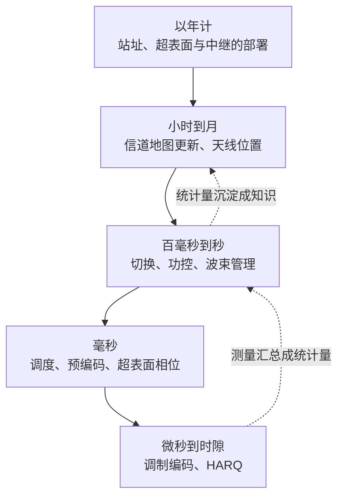
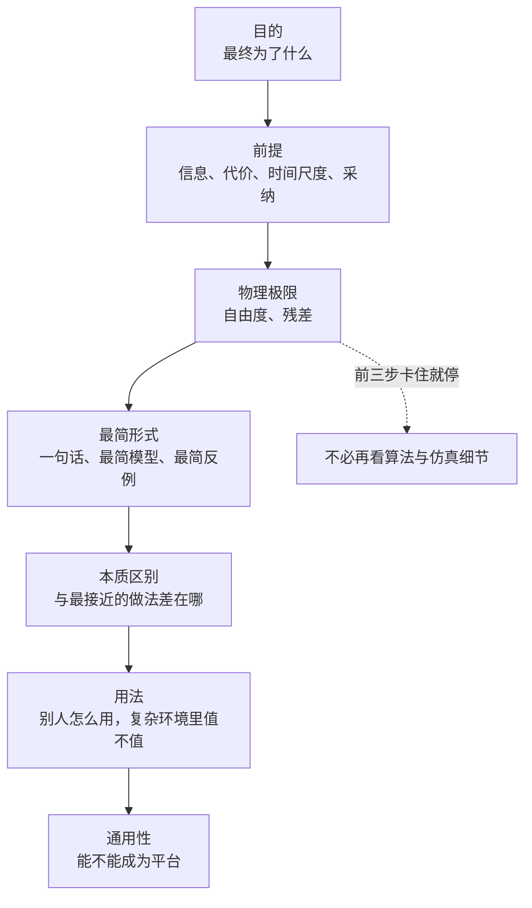

# 八条线索：把全站串起来的八个问题

预备篇第 2 章算过，手机以步行速度移动时，信道大约 26 毫秒换一副面孔。第二部第 5 章估计过，关于墙体的知识可以放心用上几个月，关于行人的知识则根本不值得存。第四部第 3 章证明过，两个小区想把协作控制器设计成一个凸问题，回传时延就不能超过干扰在两个小区之间起作用所需的时间。三处用的是三套记号，问的其实是同一件事：一样东西变得有多快，依赖它的决策跟不跟得上。全站 46 章、约 190 万字，像这样换着名字反复出现的想法还有好几个，按章号顺读时，很容易把它们当成互不相干的知识点。

这一页挑出八个这样的想法，各写成一个问题。它们有两个来历。一是研究者审视一个方案、读一篇论文时反复会问的几件事：这个旋钮该转多快，需要的信息从哪里来，自由度够不够，不完美会不会把结论翻过来，代价是不是真的，产业会不会接受，离极限还有多远，精度到底要多高。二是这几件事恰好也是全站反复出现的概念，每一个都有物理或数学上的底座，都能落到一个具体的数上。所以每条线索有两种读法：当知识线索读，它把预备篇到第四部的相关章节按由浅入深串成一条路；当看问题的方式用，它是遇到任何一个无线方案都可以拿出来问的一句话。[领域地图](01-field-map.md)里逐个方向写了"卡在哪里"，那些卡点大多能归到这八个问题上。

八个问题之间也互相牵连。时间尺度和信息结构合起来，就是第四部的信息结构相图：回传多快、耦合多快，决定一个协作问题能不能解。自由度和残差一起回答"物理上能不能"，代价和采纳一起回答"现实里值不值"。极限与基线是检验其余几条的尺子，任务与价值则说明这把尺子的刻度从哪里来。读下去会发现，同一个例子常在好几条线索里出现，换一个问题去看，它暴露的是不同的东西。

每条线索分四块。"道理"从一个场景或一个数进入，讲清底座；"沿着它读"列一条四到六站的阅读路径；"用它看问题"用一两个一般性的例子，演示这个问题怎样暴露一个方案的前提毛病，重点放在怎样把它重新表述成站得住的问题；"还没解决的"列出这条线上的开放问题。可以从头顺读，也可以读到某一章时回来查它挂在哪条线上。最后一节把八个问题排成审视一个方案时的先后顺序。本页自己的归纳与判断标【本站整理】或【本站判断】；引用各章的结论时沿用原文的状态标签，含义见首页的[诚实声明与状态标签](../index.md#诚实声明与状态标签)。

| 线索 | 它问什么 | 最关键的一个量或一个数 | 站内主要章节 |
|---|---|---|---|
| [1 时间尺度](#1-时间尺度这个旋钮该转多快) | 这个旋钮该转多快 | 3.5 GHz、步行：相干时间约 26 ms，一秒里却有 2000 个时隙 | 预备篇 2、3、6；第二部 5；第三部 4、7；第四部 3 |
| [2 信息结构](#2-信息结构谁在什么时候知道什么) | 谁在什么时候知道什么 | 有限反馈：SNR 每高 3 dB，每个用户多付 $M-1$ 比特 | 预备篇 4；第一部 9；第二部 2；第三部 5；第四部 1、3、9 |
| [3 自由度与秩](#3-自由度与秩先问能不能再问有多好) | 先问能不能，再问有多好 | 同样的信道能量，4×4 富散射 26.6 bit/s/Hz，秩为 1 的视距只有 8.65 | 预备篇 4、5、9；第一部 4、8 |
| [4 残差与失配](#4-残差与失配结论经得起不完美吗) | 结论经得起不完美吗 | 两用户差 30 dB，消除深度 $D$ dB 时弱用户 SINR 上限为 $D-30$ dB | 预备篇 6；第一部 9；第二部 4、6；第四部 5 |
| [5 代价](#5-代价要付的到底是什么) | 要付的到底是什么 | 28 GHz 扫 256 个波束，导频吃掉相干块的 85% | 预备篇 6；第一部 1；第三部 6、7；第四部 2、4、8 |
| [6 采纳](#6-采纳产业会不会接受) | 产业会不会接受 | 6G 下行继续用 CP-OFDM（截至 2026 年 10 月） | 预备篇 3、9；第一部 3；第二部 1、4 |
| [7 极限与基线](#7-极限与基线离墙还有多远) | 离墙还有多远 | Witsenhausen 反例：最好的仿射策略 0.96，一比特的符号策略 0.404 | 预备篇 5；第二部 2；第三部 1、3；第四部 1、3、6、9 |
| [8 任务与价值](#8-任务与价值精度要多高才够用) | 精度要多高才够用 | 一张图约 $1.2\times10^6$ 比特，分类答案约 10 比特 | 预备篇 9；第一部 9；第二部 1、3；第三部 5 |

---

## 1 时间尺度：这个旋钮该转多快

### 道理

设想一部手机以步行速度 1.4 m/s 移动，工作在 3.5 GHz（波长 $\lambda\approx8.57$ cm），子载波间隔 30 kHz。同一秒里，这条链路上有好几样东西在变，快慢差得惊人。

最快的是符号。一个 OFDM（正交频分复用，orthogonal frequency-division multiplexing）符号的有效长度是 33.33 μs，加上 2.34 μs 的循环前缀，约 35.7 μs，一秒大约 28,000 个；每 14 个符号组成一个 0.5 ms 的时隙，一秒 2000 个。小尺度衰落慢得多。终端的最大多普勒频率 $f_m=v/\lambda=16.3$ Hz，相干时间，也就是信道还"像它自己"的那段时长，约为

$$
T_c\approx\frac{0.423}{f_m},
$$

算出来 25.9 ms，一秒里约 40 个。阴影更慢：宏蜂窝的阴影去相关距离按 50 m 算，步行要 36 秒才走出一个遮挡物的影响范围。墙和楼一直在那里，以月和年计。从符号到楼，跨了约十二个数量级。

!!! example "算例：一秒钟里的账"
    取 $v=1.4$ m/s、$f_c=3.5$ GHz、子载波间隔 30 kHz。

    - 符号：$1\ \mathrm{s}\,/\,35.67\ \mu\mathrm{s}\approx2.80\times10^4$ 个；时隙：$1\ \mathrm{s}\,/\,0.5\ \mathrm{ms}=2000$ 个。
    - 相干时间：$f_m=1.4/0.0857=16.3$ Hz，$T_c=0.423/16.3=25.9$ ms，一秒约 $1000/25.9=38.6$ 个。
    - 阴影：$50\ \mathrm{m}\,/\,1.4\ \mathrm{m/s}=35.7$ s。城区微蜂窝的去相关距离只有 5–20 m，也要 3.6–14 s。

    校验：（a）符号数换一条路径算。按帧结构，每个时隙 14 个符号，$2000\times14=28{,}000$，与按符号长度算的 28,035 只差 0.1%，差额来自每个时隙里循环前缀并不完全等长。（b）量纲：$f_m=v/\lambda$ 是 (m/s)/m，单位 1/s；阴影时间是 m 除以 m/s，单位 s。（c）换个速度对照正文：60 km/h 时 $T_c=0.423\times0.0857/16.7=2.2$ ms，与预备篇 2.5 节的表一致；阴影 50 m 只需 3 s，与预备篇 2.1 节表中阴影衰落的时间尺度（秒级）一致。

回到 $T_c\approx0.423/f_m$。它说的是，信道的记忆长度与你穿过空间干涉图样的速度成反比。空间里每隔半个波长就有一次明暗交替，走得越快、载频越高，换得越快。车速到 60 km/h，$f_m$ 涨到 194 Hz，$T_c$ 只剩约 2.2 ms，不到 5 个时隙。预备篇 2.5 节的算例提醒过，"从测到 CSI 到用上它至少要 $4\sim8$ 个 slot"，也就是 2–4 ms。测量与使用之间的闭环，已经和信道的寿命一样长，CSI（信道状态信息，channel state information）送到时就已半过期。

过期的信息也不会一下子作废，它的价值在连续地往下掉。第四部算例 3.6 用一个示意模型算过：被协调的量若按相关系数 $\rho$ 逐时隙演变，且协作增益正比于能抵消掉的方差，那么晚 $d$ 个时隙拿到的信息，能兑现的增益只剩 $\rho^{2d}$。取 $\rho=0.9$（相关时间约 10 个时隙），晚 1 个时隙还值 81%，晚 4 个时隙值 43%，晚 10 个时隙只剩 12%。时间尺度对不上时，亏多少要看这条曲线。

把这些尺度从快到慢排开，再接上环境本身的变化和网络的部署，就是一张阶梯。

| 层 | 典型时间（3.5 GHz） | 在变的东西 | 归这一层的旋钮 |
|---|---|---|---|
| 符号与时隙 | 35.7 μs；0.125–1 ms | 每个符号上的数据，每次调度的资源格子 | 调制编码、HARQ 重传 |
| CSI 闭环 | 2–4 ms（$4\sim8$ 个时隙） | 测到的信道变成可用的信道 | 测量与反馈的周期 |
| 相干时间 | 步行约 26 ms，60 km/h 约 2.2 ms | 小尺度衰落 | 调度、预编码、超表面相位 |
| 切换判决 | TTT 40–640 ms | 哪个小区最强 | 迟滞、TTT、L3 滤波系数 |
| 阴影 | 车速下秒级，步行几十秒 | 大尺度遮挡 | 功控、波束管理 |
| 环境：行人与车辆 | $10^0$ s | 遮挡、门 | 只能靠即时测量应对 |
| 环境：家具 | $10^4$–$10^5$ s | 反射面 | 信道地图更新、天线位置 |
| 环境：墙体与建筑 | $10^7$–$10^8$ s，部署以年计 | 大尺度结构 | 站址、超表面与中继的部署 |

*表中 HARQ 是混合自动重传请求（hybrid automatic repeat request），TTT 是切换判决必须持续满足的时长（time-to-trigger）。前五行的数取自预备篇第 2、3、6 章；环境三层的时间常数是第二部 5.6 节的量级估计，原文标【本站估计】，并无实测依据；最后一列把旋钮归到哪一层，是本页的整理【本站整理】。*

这张表背后只有一条原则：**每个设计变量都应放在与它所依赖的信息变化速度相匹配的那一层。** 放错层有三种后果。旋钮比它依赖的信息慢，就追不上，等它调好，信息已经过期。旋钮比信息快，就白费力，反复去算一个没有变过的答案，还会跟着噪声来回摆。为了跟上而付出的测量、信令和算力超过它带来的收益，就太贵。

三种后果在站内都有现成的数。追不上，就是上面 60 km/h 时的 CSI 闭环。白费力，最好的例子是切换。如果终端一看到邻区比服务小区强就切过去，它其实是在跟着阴影的随机起伏走：两条路径的阴影标准差各为 8 dB 时，两小区功率差的标准差约 11.3 dB，在小区边界上只靠 3 dB 的迟滞，误触发的概率仍有约 40%（[预备篇 6.6 节](../part0/06-wireless-networks.md#乒乓效应三个旋钮的三角折中)）。切换判决本该放在阴影之上的那一层，所以标准里先用 L3 滤波把测量抖动磨平，这一步把误触发压到约 24%，再要求邻区领先的状态持续一个 TTT。太贵，切换也给出了数：一次传统切换中断约 30–50 ms，策略若激进到平均每 256 ms 切一次，近两成的时间都花在中断上。滤波、迟滞、TTT 这三个旋钮故意让判决"慢一点"，做的正是把它放回该在的那一层。

层与层之间并不孤立：慢层给快层划定框架，快层把测量汇总后交回慢层。

*怎么读这张图：实线自上而下，慢层替快层划定框架，比如站在哪里、用哪套码本、接在哪个小区；虚线自下而上，快层的测量汇总成统计量，再沉淀为慢层的知识。每个旋钮只响应与它同一层的变化。*

### 沿着它读

1. [预备篇 2.1 节](../part0/02-wireless-channel-basics.md#21-三层分解一条链路上的三种变暗)与[相干时间](../part0/02-wireless-channel-basics.md#相干时间)一小节：路损、阴影、小尺度衰落按三种尺度分开变；$T_c\approx0.423/f_m$ 从哪来，步行到高铁的相干时间各是多少。
2. [预备篇 3.7 节的 numerology 算例](../part0/03-digital-communications.md#5g-numerology-参数算例)：符号、循环前缀、时隙的长度怎样由子载波间隔一起定下来。
3. [预备篇 6.6 节](../part0/06-wireless-networks.md#66-移动性管理切换测量与乒乓)：切换为什么要用滤波、迟滞和 TTT 故意"慢一点"，慢下来换来什么、付出什么。
4. [第二部 5.6 节](../part2/05-cognitive-triangle.md#56-多时间尺度t_mathrmenv-不止一个知识应分层折旧)：环境的变化分三层，知识应当分层折旧；按本站的量级估计（饱和型汇率等假设下），建筑层一年只需约 7 小时的感知资源，家具层每天约 8 分钟，行人层不值得建任何耐用知识。
5. [第三部第 4 章](../part3/04-sequential-uncertainty.md#一句不知道未来四种严格化)：时间轴上"不知道未来"有四种严格化，你实际知道的那一点（分布、均值、对手、反馈）决定能写哪一套数学。
6. [第四部 3.4 节](../part4/03-information-structure-phase-diagram.md#34-时延定理信息必须跑得比影响快)与 [3.5 节](../part4/03-information-structure-phase-diagram.md#35-两小区comp-的工程常识是一条相边界)：信息必须跑得比影响快；两小区协作里，回传时延与耦合时标之比决定协作设计是不是凸问题。
7. [预备篇 2.5 节末的"两种慢"提示框](../part0/02-wireless-channel-basics.md#相干时间)：一个旋钮该转多快，要拿两把尺子量，一把是符号，一把是相干时间；超表面和可移动天线各自落在哪一段。
8. [预备篇 11.6 节](../part0/11-new-network-frontiers.md#116-ai-原生网络大模型与智能体先问时间尺度)：大模型生成一个 token 要几十到两百毫秒，一个时隙只有 0.5 ms；大模型和小模型的分工只能按时间尺度切。

### 用它看问题

一个常见的提法是用大模型直接为每个时隙算预编码。先按时间尺度对一下账。大模型推理一次通常要几百毫秒到数秒，取 200 ms，就是 400 个时隙，相当于步行时约 8 个相干时间、60 km/h 时约 90 个。预编码要跟着小尺度衰落走，它依赖的信息每 2–26 ms 就换一次；推理结果出来时，它针对的那个信道早已不在。这是"追不上"。

毛病出在层放错了，与大模型本身强不强关系不大。大模型擅长从大量、异构、长时间的数据里归纳规律，这正是慢层需要的能力。重新表述之后，问题变成：让大模型离线设计码本、划分覆盖区域、给出每个区域的候选波束集，在线时由查表或为这片环境专门训练的小模型在毫秒级挑选。这个提法可以检验：在同样的导频开销下，它比固定码本加常规波束训练好多少，又比"按位置查表"这类最简单的做法好多少。

同一种错位还有反方向的版本。靠机械移动的天线去追瞬时衰落：衰落在半个波长（3.5 GHz 时约 4.3 cm）的尺度上起伏，车速下几毫秒就换一次，机械运动比这慢得多，还要耗能，既追不上又太贵。改成两时间尺度的设计就站得住了：天线位置去跟踪用户分布、大尺度遮挡这类以秒、分钟乃至更长时间变化的量，在慢层调；预编码在快层调。可编程超表面也是如此。拿它当调制器用，相位要跟上符号速率，即几十微秒一换；拿它重塑信道，只需跟上相干时间乃至更慢的遮挡变化。从 35.7 μs 放宽到 2–26 ms 是 60 到 700 倍，放宽到秒级的遮挡变化则是数万倍。同一块硬件放在哪一层工作，决定了它要满足什么规格。

判断一个旋钮该放在哪一层，可以问两句话：它依赖的信息多久失效？它自己完成一次调整要多久，测量、计算、下发都算在内？后者长于前者，就追不上；前者远长于后者，就该降频，省下测量与信令。

信道知识地图也该这样定位。它是给慢层用的知识，在一段时间内被信任，按环境变化的统计时间尺度定期更新。这与教科书里"块衰落内信道不变、下一块重新估计"是同一个准静态逻辑，只是块长从毫秒换成了小时或天。

### 还没解决的

- 【开放·本站原创】分层到底亏多少。第三部第 7 章把分层的代价（PoL，price of layering）的来源分成原子性、接口降维、时标分离三类；"快慢分开，所以可以分层"是工程上最常见的辩护；可时标要分开到什么程度、分层才不亏，原文的判断是还没有人量过，"再快一倍刷新值多少时延"这类问题眼下只能拿用例来回争论。同章还猜想，接口携带队列积压时，静态分层相对动态联合的时间平均代价比是 $1+O(1/V)$。见[第三部第 7 章 · 当代现场](../part3/07-price-of-layering.md#当代现场四个正在发生的分层实验)与该章[开放问题](../part3/07-price-of-layering.md#开放问题)。
- 【开放】环境变化的时间尺度缺实测。[第二部 5.6 节](../part2/05-cognitive-triangle.md#56-多时间尺度t_mathrmenv-不止一个知识应分层折旧)的三层时间常数是量级估计，原文明说文献里没有"人员 / 家具 / 建筑"三级的实测分层数字。家具层是每天变还是每周变，直接决定地图多久更新一次。
- 【开放】出了凸区以后亏多少。第四部第 3 章的相边界说的是可解性：回传时延超过耦合时标，协作设计就不再是凸问题，可协作增益并不会在那里归零，它随时延连续衰减。[第四部 9.2 节](../part4/09-research-agenda.md#92-组装逻辑可解性--话费--收敛--均衡质量)的总纲把出界后启发式算法多付的那一项 $\Lambda_{\mathrm{heur}}$ 标为无界且无刻画。

---

## 2 信息结构：谁在什么时候知道什么

### 道理

同一条 20 dB 的瑞利衰落信道，"谁知道信道"换三种答案，容量就是三个数（[预备篇 4.8 节](../part0/04-information-theory-basics.md#三个数放在一起看)）。只有接收端知道信道（CSIR，CSI at the receiver）时，遍历容量是 5.884 bit/s/Hz，是不衰落时 6.658 的 88%。发射端也知道（CSIT，CSI at the transmitter）时，可以按信道好坏分配功率（注水），容量 5.896，只多了 0.2%。把 SNR（信噪比，signal-to-noise ratio）降到 0 dB，账就翻过来：CSIR 时 0.860，CSIT 时 1.029，多了约 20%，甚至超过不衰落时的 1.000，因为发射端可以只在信道好的时候说话。这四个数本页用指数积分重新数值算过一遍，与原文一致；两个比值 $5.896/5.884=1.002$ 与 $1.029/0.860=1.196$，就是上面说的 0.2% 与约 20%。

谁都不知道时，只能先拿出一部分符号发导频，把它变成第一种情况。在块衰落模型里（相干块长 $T$ 个符号、$M$ 根发射天线、训练与数据的功率可以分开分配），最优的训练长度恰好是 $M$ 个符号；高 SNR 下能用的自由度只剩 $M^\star(1-M^\star/T)$，其中 $M^\star=\min(M,N,\lfloor T/2\rfloor)$，$N$ 是接收天线数（[第二部 5.5 节](../part2/05-cognitive-triangle.md#55-同一条律耐用品与易逝品从-t_mathrmcoh-到-t_mathrmenv)转述的最优训练长度与非相干自由度两条经典结果）。"谁都不知道"的代价，取决于要把多少维的信道变成已知：车速 108 km/h、时延扩展 1 μs 时一个相干块约 240 个符号，单天线只需 1 个导频，占 0.4%；要扫 64 个波束，就占 27%（第 5 条线索的导频账单）。

这几组数说的是，同一份信息值多少，要看谁拿着它、工作点在哪里、拿去做什么。高 SNR 时发射端知道信道几乎不值钱，是因为注水的水位远高于"河床"的起伏，最优功率几乎处处相等，知道了也不会改变做法；低 SNR 时水位很低，只有少数好时机露出水面，知道哪一刻是好时机才值钱。这还只是单天线。一旦多个用户共享多根天线，发射端知不知道每个用户的信道方向，就决定了空分复用能不能成立。

这时信息的价格可以算得很具体。$M$ 天线基站用迫零（zero-forcing，ZF）预编码同时服务 $M$ 个单天线用户，每个用户把自己的信道方向量化成 $B$ 比特报上来。方向的量化失真约为 $2^{-B/(M-1)}$，每个用户相对完美 CSIT 的速率损失满足

$$
\Delta R\ \lesssim\ \log_2\!\left(1+P\cdot2^{-\frac{B}{M-1}}\right),
$$

$P$ 是归一化 SNR。式子在说：方向报得不准，波束就对不准，漏到别的用户那里的干扰功率是 $P$ 乘以方向误差。$P$ 一涨，漏出去的干扰跟着涨；要让损失不随 $P$ 增长，量化精度就得跑赢功率，于是 $B\approx(M-1)\log_2P$。换成分贝，SNR 每高 3 dB，每个用户多付 $M-1$ 比特（[第一部第 9 章](../part1/09-exchange-and-universality.md#汇率表的第一行反馈比特换复用增益)的有限反馈定标律【已解决】）。

!!! example "算例：4 根天线，6 比特反馈够不够"
    取 $M=4$、$B=6$。方向失真 $2^{-6/3}=2^{-2}=0.25$（第一部第 9 章报告随机码本实测约 0.22，同一量级）。

    在 20 dB（$P=100$）下，漏出的干扰约为噪声的 $100\times0.25=25$ 倍，速率损失上界 $\log_2 26=4.70$ bit/s/Hz。作个对照：完美 CSI 时，等功率迫零下每个用户的有效信道增益服从均值为 1 的指数分布，每用户速率 $\mathbb{E}\log_2(1+25X)\approx4.0$ bit/s/Hz。损失的上界比整个速率还大，6 比特在这个工作点什么也保证不了。要把损失压到 1 bit/s/Hz 以内，需要 $P\cdot2^{-B/3}\le1$，即 $B\ge3\log_2100=19.9$，约 20 比特；SNR 再高 10 dB，约 30 比特。

    校验：（a）代回去：$B=20$ 时失真 $2^{-20/3}=0.0098$，$P$ 乘上它是 0.98，损失上界 $\log_2 1.98=0.99$。（b）换一条路径：按"每 3 dB 每用户多付 $M-1=3$ 比特"，10 dB 约是 3.3 个 3 dB，应多付约 10 比特，与 20 到 30 比特的跳变一致；第二部 1.4 节的算例 1.2 用同一组参数也得到 10、20、30 比特。（c）极限：$P\to0$ 时上界趋于 0，低 SNR 下漏出的干扰淹没在噪声里，反馈几乎不必要。（d）对照用的 4.0：$X$ 服从均值为 1 的指数分布时，$\mathbb{E}\log_2(1+25X)=e^{0.04}E_1(0.04)\log_2e=4.03$，与高 SNR 近似 $\log_225-0.83=3.81$ 同一量级（$E_1$ 是指数积分，见预备篇 4.8 节）。

天线一多，账单就大。$M=64$、工作点 20 dB 时，每个用户每个相干块要报约 420 比特，相干块一过全部作废。第一部第 9 章把这种按块购买、无法储存的知识叫易逝品，并算了一笔对照账：相干时间取 10 ms，这份反馈每个用户每秒约 $4.2\times10^4$ 比特，1000 个用户一年约 $1.3\times10^{15}$ 比特，第二年还得再付一遍；一栋楼的几何与材质描述约 $8\times10^4$ 比特，一次付清，所有经过它的链路共用。原文也注明这不是同类项对比，环境知识替代不了小尺度的实时测量；它揭示的是两种知识的标度，一种随时间线性增长、不可复用，一种是常数、可以无限复用。用"从哪来、多久能拿到、花多少代价"去标这两种知识，差别一目了然。

信息结构不只改变数值，还会改变问题的性质。[第四部 1.1 节](../part4/01-one-counterexample.md#11-两个人接力开一辆车)那个反例只改了一句话：第二个决策者看不见第一个决策者看见的东西。线性动态、二次代价、高斯噪声一个没动，最优策略就不再是线性的，第一个人的动作同时成了给第二个人发的信号（具体的数见[第 7 条线索](#7-极限与基线离墙还有多远)）。难处在于，第二个人的观测是被第一个人的动作加工过的：第一个人换一种策略，第二个人面对的就是另一个估计问题，两个人的优化互相嵌在对方的问题里。

"什么时候知道"是信息结构的另一半。决策只能用做决定那一刻之前到手的东西，未来是看不见的。第三部第 5 章的先知不等式给了这件事一个干净的价格：一组相互独立、非负、按顺序揭开的收益，分布事先知道，每揭开一个就必须当场决定要不要，那么最好的因果策略在最坏情况下只能保证"事后全知者"的一半，而且这个一半改进不了。多知道一点未来能补回多少，就是该章 $V(I)$ 要回答的问题（第 8 条线索会用到它的一个例子）。所以问题里的每个"已知量"，都要问清它是谁的、什么时候到手的。

**给问题里的每个"已知量"标三样：从哪来，多久能拿到，花多少代价。** 运行期的决策规则只能用运行期拿得到的量。设计期的分析可以对分布取期望，因为它回答的是"平均而言该怎么设计"，不需要知道这一次的真实值。

### 沿着它读

1. [预备篇 4.8 节](../part0/04-information-theory-basics.md#48-衰落信道容量三部曲)：CSIR 遍历容量、CSIT 注水、中断容量三种口径，以及 20 dB 和 0 dB 两组算例。
2. [第一部第 9 章 · 汇率表的第一行](../part1/09-exchange-and-universality.md#汇率表的第一行反馈比特换复用增益)：有限反馈定标律的四环推导；瞬时 CSI 为什么是易逝品。
3. [第二部 2.4 节](../part2/02-blackwell.md#24-blackwell-定理三种说法是同一件事)：Blackwell 定理，"一个信息源至少和另一个一样有信息"等价于"在一切任务上都不更差"。
4. [第三部第 5 章 · 第四级台阶](../part3/05-price-of-prediction.md#第四级台阶vi迈向决策的率失真)：关于未来的 $I$ 比特信息最多值多少，$V(I)$ 的定义与凹性【本站原创】。
5. [第四部 1.1 节](../part4/01-one-counterexample.md#11-两个人接力开一辆车)：两个人接力开车，一个动作同时是控制量和信号。
6. [第四部 3.5 节](../part4/03-information-structure-phase-diagram.md#35-两小区comp-的工程常识是一条相边界)：谁多久能告诉谁，决定协作问题凸不凸；CoMP 的工程常识是一条相边界的三个截面。
7. [预备篇 10.3 节](../part0/10-new-phy-dof.md#103-无蜂窝与分布式-mimo拆掉小区的边界)：无蜂窝把干扰收编成信号，前提是信道信息汇到一处；集中处理还是本地处理，本身就是信息结构问题。
8. [预备篇 11.4 节](../part0/11-new-network-frontiers.md#114-物理层安全与隐蔽通信不靠密钥的保密)：物理层安全的难点全在信息上，被动的窃听者不会上报自己的信道和位置。

### 用它看问题

有一种设计想用"当前地图造成的性能损失"决定什么时候更新信道地图：损失超过门限就重建。给规则里的每个量标一下来历就会发现，"性能损失"是地图预测与真实信道之差造成的，要算它，就得先知道真实信道；可真有了真实信道，这一刻也就不需要地图了。规则在因果上绕回了自己。

站得住的提法有两种。一种是按环境变化的统计时间尺度定期更新，比如家具层按天、建筑层按月，周期由第 1 条线索里那张阶梯决定，不依赖运行期的真值。另一种是找一个运行期拿得到的漂移信号。终端本来就在周期性地测服务小区和邻区的参考信号接收功率（RSRP，reference signal received power，[预备篇 6.6 节](../part0/06-wireless-networks.md#测量rsrpl3-滤波与-a3-事件)），在这部分实际测到的链路上比较"地图预测值"与"实测值"，残差持续变大就触发更新。它只用到测得到的量，代价是看不见测不到的那部分链路，比如没有关联的小区、没人去过的位置。至于站内各章按分布取期望推出的界和量级估计，属于设计期分析，没有这个循环。

物理层安全里有另一种常见的信息结构毛病。窃听者或检测者的位置，假设精确已知不现实，假设一无所知又无从设计。合理的提法是把确实知道的部分写进模型：已知它在某个区域 $\mathcal{R}$ 内，对区域里最坏的位置设计，目标写成

$$
\max_{\text{发射方案}}\ \min_{\mathbf{x}\in\mathcal{R}}\ \bigl[C_B-C_E(\mathbf{x})\bigr]^{+},
$$

$C_B$ 是合法用户的容量，$C_E(\mathbf{x})$ 是位于 $\mathbf{x}$ 的窃听者的容量。式子把"知道什么"（区域）与"不知道什么"（区域里的具体位置）分得清清楚楚，结论对区域里任何位置都成立。区域越小保证越强，而区域能缩到多小，又是一个可以拿感知资源去换的量【本站整理】。

"什么时候知道"也会出毛病，而且藏在最平常的工程默认里。[第四部 8.3 节](../part4/08-network-games.md#83-势博弈什么样的自私会收敛)讲了一个两小区选功率的博弈：每个小区都按"对方上一轮怎么做"选自己的最优动作。若所有基站在同一个调度边界上一起更新，每个人依据的都是对方已经过时的动作，于是两边同时让、同时喊，在两个状态之间来回振荡，永不停下；改成轮流更新，一步就停在均衡上。势博弈"有限步收敛"的保证，前提正是每一步只有一个人在改，同步更新悄悄违反了它。重述后的设计问题是：更新顺序本身是信息结构的一部分，要么轮询，要么随机选一个人更新，要么给更新加惯性。

### 还没解决的

- 【开放·本站提法】信息结构相图。由干扰图、信息图和回传时延，能否算出一个判据，把协作问题分成凸、可近似、难三相？凸区的充分条件已知（二次不变性、时延不等式），"非凸但多项式可近似"的一相是否存在、到凸区的距离怎样与代价差挂钩都不知道。原文建议的第一步很小：在三个节点排成的链上加时延，比较"补一条信息链路"与"把一条链路加快"各要付多少代价，就得到"一条链路值多少"的第一个数字。见[第四部 3.7 节](../part4/03-information-structure-phase-diagram.md#37-信息结构相图)与 [9.3 节](../part4/09-research-agenda.md#93-定理一--信息结构相图结构--可解性)。
- 【开放·本站提法】多方版的知识汇率。谁去探测、探测多密、探完给不给别人看，第一部 Q3 的知识汇率在这个多方版本里连端点都还没有，星形干扰图是唯一能算的一个点：星心探测一次再广播出去，价格是点对点方案的 $1/(K-1)$（第四部命题 9.4）。见[第四部 9.8 节](../part4/09-research-agenda.md#98-全站收尾四部如何合成一个体系)。
- 【开放】信息结构本身随机时的团队理论。回传会丢包，"谁知道什么"本身成了随机变量，"近似部分嵌套"该怎么定义也没有定论。见[第四部第 9 章的开放问题](../part4/09-research-agenda.md#开放问题)。

---

## 3 自由度与秩：先问能不能，再问有多好

### 道理

先看两个场景。第一个是丰富散射环境里的 4×4 MIMO（多输入多输出，multiple-input multiple-output）。第二个是基站经一面超表面服务用户，基站到超表面是一条视距链路。后者无论怎样调超表面的相位、怎样挪动基站天线，最多只能传一路数据流。

预备篇 5.5 节的算例 5-4 把两者放在同样的条件下比：信道总能量相同，SNR 20 dB。富散射时四个特征值一样大，容量 26.6 bit/s/Hz；纯视距、秩为 1 时只有 8.65；单天线是 6.66。再把功率加 3 dB，富散射多出整整 4 比特，秩为 1 的信道只多 1 比特。背后是高 SNR 下的容量公式

$$
C\approx\min(N_t,N_r)\log_2\mathrm{SNR}.
$$

它说速率对自由度是线性的，对功率只是对数的。功率翻倍，每个自由度多 1 比特；自由度翻倍，速率翻倍。为什么取较小的那个？$N_t$ 是能发出多少个独立方向，$N_r$ 是能分辨多少个独立方向，管道数由两头的瓶颈决定。$N_tN_r$ 那个更大的数属于分集，即独立路径的条数，它决定可靠性，不决定速率随 SNR 增长的斜率。两者要从同一副天线里分：[预备篇 5.6 节](../part0/05-mimo.md#56-分集复用折中zhengtse-曲线)的分集–复用折中说，4×4 时全拿去做分集是 16 阶，全拿去复用是 4 条流、分集为零；从纯分集往满复用走，每多要一条流，分集依次少 7、5、3、1 阶，相当于从库存里划走一整行加一整列。$\min(N_t,N_r)$ 还只是丰富散射下的情形，真正起作用的是信道矩阵的秩：散射体只从几个方向来，秩就只有几。

级联信道的秩有一条简单的上限：

$$
\operatorname{rank}\bigl(\mathbf{H}_2\boldsymbol{\Theta}\mathbf{H}_1\bigr)\ \le\ \min\bigl(\operatorname{rank}\mathbf{H}_1,\ \operatorname{rank}\mathbf{H}_2\bigr).
$$

$\mathbf{H}_1$ 是基站到超表面，$\boldsymbol{\Theta}$ 是超表面的对角相位矩阵，$\mathbf{H}_2$ 是超表面到用户。视距时 $\mathbf{H}_1=\mathbf{a}\mathbf{b}^{H}$，于是 $\mathbf{H}_2\boldsymbol{\Theta}\mathbf{H}_1=(\mathbf{H}_2\boldsymbol{\Theta}\mathbf{a})\,\mathbf{b}^{H}$，一个列向量乘一个行向量，秩不超过 1。调相位改的是 $\boldsymbol{\Theta}$，挪动基站天线改的只是基站一侧的阵列响应 $\mathbf{b}$，都改变不了"列乘行"这个形状。随手取一组随机数验证：64 单元的超表面、4 天线的基站和用户、随机相位，乘出来的 4×4 矩阵所有 2×2 子式的模都小于 $10^{-13}$，而矩阵元素平方的量级是 $10^2$，秩确实是 1。

自由度与能量的分工，在"能量固定、时间拉长"时看得最清楚。设一段发送用带宽 $W$、时长 $T$，SNR 20 dB。能量不变，把时长拉到 $kT$：功率摊薄成 $1/k$，可用的符号数却变成 $k$ 倍。能传的比特数（以 $WT$ 个比特为单位）是 $k\log_2(1+100/k)$。检测一个已知波形、估计它的时延，精度只看总能量与噪声谱密度之比 $E/N_0$：匹配滤波的输出信噪比只依赖信号能量（[预备篇 3.3 节](../part0/03-digital-communications.md#匹配滤波把信号从噪声里捞出来)），带宽不变时测距 CRB（克拉美–罗界，Cramér–Rao bound）也只随能量变（[预备篇 9.4 节](../part0/09-new-landscape.md#感知这一侧怎么度量crb-一句话)）。能量没变，精度就不变。

{ .chart loading=lazy }
{ .chart loading=lazy }

*怎么读这张图：横轴是把同一份能量摊开的倍数 $k$，按 1、2、4 直到 64 取点；纵轴是相对 $k=1$ 的倍数。第一条线是可传比特数，绝对值从 6.66 涨到 86.88（以 $WT$ 比特为单位），64 倍的时长换来 13 倍的比特；第二条线是检测与测距的精度，能量不变它就不动。一句话读法：通信要维度，感知要能量。测速度是例外，观测拉长会让多普勒分辨率变好，这张图只说检测与测距。数据按 $k\log_2(1+100/k)$ 逐点计算。*

!!! example "算例：能量固定时比特怎样随维度涨"
    $k=1,2,4,8,16,32,64$ 时，$k\log_2(1+100/k)$ 依次为 6.66、11.34、18.80、30.04、45.73、65.42、86.88。$k\to\infty$ 时趋于 $100\log_2e=144.27$。

    校验：（a）$k=1$ 时就是 $\log_2101=6.658$，与 20 dB 的 AWGN 容量一致。（b）极限：$\ln(1+x)\approx x$，所以 $k\log_2(1+S/k)\to S\log_2e$，$S=100$ 时 144.27；这是预备篇 4.7 节"带宽趋于无穷时容量趋于 $\frac{P}{N_0}\log_2e$"的同一件事。（c）逐点复算 $k=64$：每符号 SNR 为 $100/64=1.5625$，$\log_2 2.5625=1.358$，乘 64 得 86.9。

空间上的自由度有同样的结构。时间上，带宽 $W$、时长 $T$ 的信号约有 $2WT$ 个实自由度，上面拉长时长换来更多符号，用的就是这一条；空间上，带宽由物理定律给定。信道场的空间波数被亥姆霍兹方程限制在半径 $2\pi/\lambda$ 以内，所以 $\lambda/2$ 采样就够，长 $L$ 的线孔径约有 $2L/\lambda$ 个自由度，面积 $A$ 的面孔径约有 $\pi A/\lambda^2$ 个。3.5 GHz 下一平方米只有约 428 个独立维度，按 $\lambda/2$ 栅格却要摆约 545 副天线（第一部第 4 章）。一间 5 m 尺度的会议室，在包围它的观测曲面上看约有 $(ka)^2\approx1.3\times10^5$ 个有效维度，沿一条观测弧线看只有约 730 个，报数时必须同时报观测几何（第一部第 8 章）。近场又把距离变成了一个可分辨的维度：两块平行孔径的自由度约为 $N(d)\approx A_tA_r/(\lambda d)^2$（第一部第 4 章，【部分结果】），随距离连续变化。

**自由度决定能不能做到，优化只决定做得多好。** 自由度不够时，什么算法都没用。近场能不能按位置聚焦也是这样，关键在孔径相对距离与波长提供了多少自由度，频段只是其中一个因子。第一部第 4 章的算例里，28 GHz 下两块 0.5 m × 0.5 m 的孔径相距 10 m，约有 5.5 个自由度；同样的孔径换到 3.5 GHz，公式只给出 0.09，也就是退回远场视距的一个；把两端孔径各放大到 2 m²，3.5 GHz 下又回到约 5.5。校验：$N\propto(A/\lambda)^2$，波长大 8 倍，面积跟着大 8 倍就能保持不变，$0.25\times8=2$ m²。

### 沿着它读

1. [预备篇 5.5 节](../part0/05-mimo.md#55-mimo-容量与自由度从-logdet-到-minn_tn_rlogmathrmsnr)：从 $\log\det$ 推到 $\min(N_t,N_r)\log_2\mathrm{SNR}$；同样的能量三种信道结构三种命运。
2. [预备篇 4.7 节](../part0/04-information-theory-basics.md#47-带宽-功率折中两个渐近区)：带宽受限与功率受限两个区，高 SNR 区要维度，低 SNR 区要功率。
3. [第一部第 4 章 · 三位一体](../part1/04-spatial-structure.md#三位一体λ2-采样相干距离与自由度密度)：$\lambda/2$ 采样、相干距离、自由度密度是同一个事实的三种说法；天线数不等于自由度。
4. [第一部第 8 章 · Q1 的形式化](../part1/08-dimension-and-prediction.md#q1-的形式化有效维度与环境等价类)：有效维度与环境等价类；描述复杂度远大于有效维度，有效维度又远大于单链路切片的维度。
5. [预备篇 9.2 节](../part0/09-new-landscape.md#92-近场通信球面波的回归)：球面波让阵列能按距离聚焦；瑞利距离只是一条相位判据，自由度并不在那里跳变。
6. [预备篇 9.3 节](../part0/09-new-landscape.md#93-ris-智能超表面可编程的反射镜)：超表面的级联信道、$N^2$ 增益与两次路径损耗。
7. [预备篇 5.5 节末的"级联信道的秩"提示框](../part0/05-mimo.md#55-mimo-容量与自由度从-logdet-到-minn_tn_rlogmathrmsnr)：串起来的两段信道里任何一段秩为 1，整条链路就只剩一个自由度。
8. [预备篇 10.1 节](../part0/10-new-phy-dof.md#101-可移动天线与流体天线让天线的位置成为变量)与 [10.2 节](../part0/10-new-phy-dof.md#102-超大规模阵列自由度从孔径里来)：可移动天线的单天线增益不超过路径数；视距 MIMO 的自由度约为 $L_tL_r/(\lambda d)$，关键在孔径相对距离够不够大，不在频段本身。

### 用它看问题

一类常见的问题是"在级联链路的一端加一个新的可调自由度，能不能提升复用或鲁棒性"，比如在用户侧加一副可移动天线，或者给超表面加更多单元。第一步该做的是看秩被哪一段卡住。若基站到超表面是视距，端到端的秩就被这一段卡在 1，不管在用户侧加什么、给超表面加多少单元，复用增益都是零。单元数从 256 加到 1024，$N^2$ 的波束赋形增益确实多了 12 dB，流数却还是一条。何况这份增益本来是拿去补两次路径损耗的：预备篇算例 9-3 的几何下（3.5 GHz，超表面距基站 30 m、距用户 5 m），256 个单元的级联链路仍比一条 35 m 的健康直达径差约 8 dB，超表面真正的用武之地是救援被遮挡的链路。

另一个常见提法是"在固定的孔径里塞进更多天线，提升复用"。按自由度算，3.5 GHz 下一平方米的面孔径只有约 428 个独立维度，$\lambda/2$ 栅格已经要 545 副天线；再加密，多出来的天线测到的只是物理上不存在的空间频率，不添任何自由度（第一部第 4 章）。能复用多少流，还要看散射：散射体只从几个方向来，秩就只有几。

两个例子都可以重新表述成有答案的问题。若目标是鲁棒性，问"在秩为 1 的前提下，这个新自由度能把这一路的信噪比提高多少、把中断概率压低多少"，这是可算的。若目标是复用，旋钮就必须作用在卡住秩的那一段上：在不同方向部署两面超表面，让两条级联路径在基站侧可分；或者让基站与超表面足够近、孔径足够大，使这段视距链路在近场里本身就有不止一个自由度。旋钮放错了段，算法再好也只能在一维里打转。对加密天线的提法，该问的是：在这块孔径和这样的散射环境里，信道场有多少有效维度，现有天线数是否已经把它们采全；采全了，再加天线只换来阵列增益和冗余。

### 还没解决的

- 【开放·本站原创】有效维度猜想。第一部猜想 8.1 断言，通用环境下有效维度与观测域的电尺寸同阶，$d_{\mathrm{eff}}(E;\varepsilon)=\Theta\bigl((ka)^{d-1}\bigr)$，阶数在工程动态范围内一致成立。上界方向由自由度定理保证，下界方向截至 2026 年 8 月没有定理，它要等第一部第 6 章可辨识性理论的进展：哪些环境参数族能从信道里稳定地恢复出来。见[第一部第 8 章](../part1/08-dimension-and-prediction.md#q1-的形式化有效维度与环境等价类)。
- 【本站提法】可移动天线最多能多拿多少。在一块区域里挪天线，相当于在这块区域的信道场上取样；区域里只有几个独立维度，挪来挪去也只能在这几维里挑。所以增益上限应当由区域内信道场的有效维度决定，视距主导的环境里几乎没有可挖的。这还只是提法，没有定理。
- 【开放】近场的距离域到底提供多少独立自由度。已知的是傍轴平行孔径下的标度律，而且它随距离连续变化：28 GHz、两块 0.25 m² 的孔径，自由度掉到 1 的距离约 23 m，按瑞利距离算的近场边界却在约 93 m，两个尺度差了四倍。非傍轴、任意取向几何下的显式公式还是进行中的工作，见[第一部第 4 章 · 两个修正方向](../part1/04-spatial-structure.md#两个修正方向近场增益与角谱稀疏采样)和[预备篇 9.2 节](../part0/09-new-landscape.md#92-近场通信球面波的回归)末尾的理论空白。

---

## 4 残差与失配：结论经得起不完美吗

### 道理

!!! example "算例：消除深度决定弱用户的天花板"
    两个用户同时同频到达接收端，强用户比弱用户高 30 dB。接收端先解出强用户的信号再减掉，这叫串行干扰消除（SIC，successive interference cancellation）。减不干净时，剩下的残差比原来的强信号低 $D$ dB，$D$ 叫消除深度。残差比弱用户的信号高 $30-D$ dB，所以哪怕没有噪声，弱用户的 SINR（信干噪比，signal-to-interference-plus-noise ratio）也不超过 $D-30$ dB：$D=25$ 时是 $-5$ dB，$D=40$ 时才到 10 dB。

    再把弱用户自己 20 dB 的信噪比算进去，$\mathrm{SINR}=1/\bigl(10^{-2}+10^{(30-D)/10}\bigr)$。$D=40$ 时是 9.6 dB，速率 3.33 bit/s/Hz；$D=25$ 时是 $-5.0$ dB，速率 0.40 bit/s/Hz；理想消除时是 $\log_2101=6.66$。

    校验：（a）$D=30$ 时残差与弱信号一样强，SINR 上限 0 dB；代入上式得 $-0.04$ dB，差的那一点来自噪声。（b）$D\to\infty$ 时 SINR 回到 20 dB，即无干扰的情形。（c）$D=40$ 时干扰比噪声高 10 dB，SINR 应略低于 10 dB，算出 9.6 dB。

理想 SIC 的漂亮结论，是在 $D=\infty$ 的假设下算出来的。$D$ 每少 10 dB，弱用户的天花板就低 10 dB；30 dB 的功率差，要求消除深度明显超过 30 dB，弱用户才有像样的速率。

很多小的硬件不完美叠在一起，表现得像一层额外的噪声。相位噪声、IQ 不平衡、功放非线性、量化误差，每一项都不大，合起来近似一个与信号功率成正比的误差，工程上用误差矢量幅度（EVM，error vector magnitude，误差矢量的均方根与信号均方根之比）折算：

$$
\mathrm{SNR}_{\mathrm{eff}}=\frac{1}{1/\mathrm{SNR}+\mathrm{EVM}^2}.
$$

式子说两项噪声相加：热噪声随 SNR 升高而变小，硬件误差却跟着信号一起长。EVM 为 3% 时天花板是 $-20\log_{10}0.03=30.5$ dB；SNR 40 dB 时只剩 30.0 dB（两项分别是 $10^{-4}$ 和 $9\times10^{-4}$，合起来正好 $10^{-3}$）；SNR 20 dB 时是 19.6 dB，几乎没损失。

这是常用的工程近似【本站整理】，结构与[第一部第 9 章](../part1/09-exchange-and-universality.md#知道天气才能定价信道知识的经典价值理论)和[第二部 4.2 节](../part2/04-environment-generalization.md#无线的面孔不完美-csi)里"把估计误差当噪声"的那条下界一样：信道估计误差被发射功率放大，成了自干扰。第二部的算例取估计误差 $-20$ dB，SNR 20 dB 时速率从 6.658 掉到 5.672，再加功率也越不过 6.658 这个天花板。转折点在估计误差被功率放大后与热噪声一样大的地方：误差 $-20$ dB，SNR 一过 20 dB，它就比热噪声还大。"估计误差须相对 $1/\mathrm{SNR}$ 可忽略"这条经验法则，量化下来就是这个位置。

把一堆小误差折叠进一个参数，是正当的做法，前提是残差由许多小而近似独立的分量组成：它们加起来近似高斯，功率是各项之和，这正是第二部 6.1 节误差预算里"方差可加"的前提。结构化的残差不能这样折叠。开头那个算例里，残差正比于强用户的功率，弱用户的天花板 $D-30$ dB 由两用户的功率差决定；若按"自身信号的一个固定比例"去折算，恰好丢掉了这层依赖。误差预算的另一个前提是映射局部线性，它在离散判决处会破：波束选对了损失为零，错一格就是十来 dB 的跳变，误差在这里不再是平滑地传下去。[第二部 6.1 节](../part2/06-error-budget.md#61-两本账db²-的账和比特的账)把混凝土介电常数的不确定一路折算下去，4.5 dB 的增益误差变成 13.5% 的波束错格，期望损失却只有 0.49 dB，最后落成 2.4% 的谱效；错格的代价被平均掉多少，正是那一章最漂亮的一条引理要回答的。

模型错了是另一种不完美。接收机按错的模型译码，叫失配译码。[第二部 4.2 节](../part2/04-environment-generalization.md#42-误配的信息论原型gmi-与-lapidoth-定理)的 Lapidoth 定理说，用高斯码本加最近邻译码的接收机（也就是按高斯噪声设计的接收机），放进任何同功率的噪声里，都能拿到设计时承诺的 $\frac12\log(1+P/N)$；它稳健，但拿不到非高斯噪声真实容量多出来的那部分。稳健与吃亏出自同一个原因：最近邻译码只看距离的平方，可达速率的计算里只出现噪声的二阶矩，所以它对噪声分布的形状不敏感，也就用不上形状里多出来的信息。拉普拉斯噪声下，少拿的这一截在高 SNR 时约 0.104 bit。在这个架构下，用错模型不会崩，只会稳定地少拿一截。

失配的代价也不随"错多少"单调变化。真实的二元对称信道翻转概率是 0.1 时，接收机以为是 0.3，诱导出的译码器与正确的一样，一分不赔；以为是 0.9，判决的序被颠倒，速率损失就是全部（第二部算例 4.2）。要紧的是错误的模型诱导出的决策错了多少，参数本身差多少倒在其次。一般地，用错模型的速率损失等于真实后验与接收机以为的后验之间的平均 KL 散度。信源一侧也是同一种货币：[第四部 5.4 节](../part4/05-shared-world-model.md#54-模型不一致的话费--kl误配编码定理)里，一方认为链路中断概率是 0.1、另一方认为是 0.2，按对方的模型编码每个符号多付 0.0529 比特，是基本话费的 11.3%；对方认为不可能的事，要说清楚需要无穷多话。

做研究时，这条线索给出一个先后。**先在理想条件下找出增益最大的情形，再加入不完美，看结论会不会反转，并给出让它反转的残差门限。** 先算理想情形，是为了知道这个想法最多值多少，也给后面每一种不完美留一个干净的参照；一开始就把所有不完美都放进去，增益缩了，也说不清是哪一项吃掉的。理想条件下增益很干净的想法，比如功率域 NOMA（非正交多址，non-orthogonal multiple access）、同频全双工，一旦计入真实残差，增益常会缩小甚至消失。这大概是它们没有以原始形态进入主流标准的原因之一【本站判断】。

### 沿着它读

1. [预备篇 6.3 节](../part0/06-wireless-networks.md#63-多址接入谱系谁在什么时候用哪块资源)：两用户 MAC 容量域，SIC 怎样把和速率推到边界；下行 NOMA 的增益从哪来。这里的消除都是理想的。
2. [第一部第 9 章 · 信道知识的经典价值理论](../part1/09-exchange-and-universality.md#知道天气才能定价信道知识的经典价值理论)：估计误差为什么是乘性惩罚；很小的估计误差在高 SNR 下也造成不消失的速率损失。
3. [第二部 4.2 节](../part2/04-environment-generalization.md#42-误配的信息论原型gmi-与-lapidoth-定理)：GMI（广义互信息，generalized mutual information）、Lapidoth 定理、拉普拉斯噪声的 0.104 bit，以及"用错尺子只会少不会多"。
4. [第二部 6.1 节](../part2/06-error-budget.md#61-两本账db²-的账和比特的账)：误差预算的两本账，误差沿链传播时在哪里放大、在哪里被平均掉。
5. [第四部 5.4 节](../part4/05-shared-world-model.md#54-模型不一致的话费--kl误配编码定理)：模型不一致的话费等于 KL 散度，它不对称，在对方认为不可能处发散。
6. [预备篇 3.8 节末的"等效噪声底"提示框](../part0/03-digital-communications.md#38-链路预算把整章串成一次真实计算)：硬件失真把有效信噪比钉在 $1/\mathrm{EVM}^2$ 以下；失真在多根天线间相关时，这种折叠就不再可靠。
7. [预备篇 10.4 节](../part0/10-new-phy-dof.md#104-全双工与子带全双工一边说一边听的账)：残余自干扰要低于 $\sqrt{1+\mathrm{SNR}}$ 倍噪声，全双工才胜过半双工；环境回波让残差随环境变。

### 用它看问题

[预备篇 6.3 节](../part0/06-wireless-networks.md#下行-noma叠加编码)有一个下行叠加传输的算例：近端用户 SNR 100，远端 1，近端只分 10% 的功率。近端先解出远端的信号减掉，再解自己的，速率 3.459；远端把近端信号当噪声，速率 0.862。正交接入把带宽和功率各分一半，两者是 3.329 和 0.500。结论是叠加传输在两个坐标上都更好。这个结论默认近端用户的消除是完美的。把消除深度 $D$ 写进去，"谁更好"就变成了一个有门限的问题。

!!! example "算例：叠加传输从哪个消除深度开始不吃亏"
    近端用户收到的远端信号功率是 $0.9\times100=90$（以噪声为单位），自己的信号是 $0.1\times100=10$。消除深度为 $D$ 时，残差是 $90\times10^{-D/10}$，近端速率

    $$
    R_1(D)=\log_2\!\left(1+\frac{10}{1+90\times10^{-D/10}}\right).
    $$

    要求 $R_1\ge3.329$，即 SINR 不低于 $2^{3.329}-1=9.05$，得 $1+90\times10^{-D/10}\le10/9.05=1.105$，残差不超过 0.105，$D\ge10\log_{10}(90/0.105)=29.3$ dB。

    校验：（a）拆成两步看同一个数：远端信号比噪声高 $10\log_{10}90=19.5$ dB，残差要压到噪声以下 $10\log_{10}(1/0.105)=9.8$ dB，合计 $19.5+9.8=29.3$ dB。（b）门限两侧各取一点：$D=30$ 时 $R_1=3.347>3.329$，$D=25$ 时 $R_1=3.135<3.329$。（c）$D\to\infty$ 时 $R_1\to\log_2 11=3.459$，回到理想算例。

重述之后的结论是：近端用户的消除深度高于约 29 dB 时，叠加传输相对正交等分在两个用户上都不吃亏；低于这个门限，近端用户的速率反而低于正交等分，远端用户的增益不受影响。这句话可证伪，前提也可以拿硬件和信道估计去核对。

模型失配也能这样重述。一个在某座城市的数据上训练的学习模型，常被评价为"泛化好"或"泛化差"。TR 38.843 的泛化评估里，同一类 CSI 压缩模型换一种部署场景使用，重建相似度相对就地训练的退化，从不到 2% 到三成多都有（第二部 1.1 节），笼统的"好"或"差"解释不了这么大的离散。按第二部 4.6 节的相位与结构二分，该问的是两件事：模型是通过哪一层特征看环境的，环境的偏移又触及了哪一层。只依赖时延、角度、功率这类结构级特征的模型，偏移不超过米级就能迁移；依赖相位的模型，在 3.5 GHz 下偏移约 2 cm 就可能失效。于是"泛化好不好"变成"偏移有没有越过模型所依赖特征的泛化半径"，这是可以拿几何去算、拿实验去证伪的。该章还据此给出可证伪的预测：跨载频的零样本迁移，对时延、角度这类结构型任务可行，对相位级的 CSI 重建不可行。

同频全双工可以照此办理。基站以 46 dBm 发射，20 MHz 带宽、噪声系数 5 dB 的接收机噪声底约为 $-174+73+5=-96$ dBm，自干扰要压掉约 142 dB 才到噪声底；该问的是"压到多少 dB 时全双工才胜过半双工"，答案同样是一个门限。

### 还没解决的

- 【开放】不完美消除下的基本折中。以全双工通感为例：一体化相对分时到底在什么残差条件下才有增益，没有一般定理。[第二部 5.7 节](../part2/05-cognitive-triangle.md#57-三元-region分时凸包可达内部形状开放)证明了分时的凸包可达，联合设计严格更好还只是猜想 5.5(a)；把残余自干扰写进去之后，连这个猜想的形式都要重写。
- 【开放·本站原创】多散射体下的物理泛化界。第二部猜想 4.5 给出按特征相加的泛化界，单散射体、单特征的情形已证（命题 4.4）；几十条径同时移动时会不会出现交叉项，绕射与遮挡能否并入，都不知道。见[第二部 · 猜想 4.5](../part2/04-environment-generalization.md#猜想-45物理泛化界)。
- 【开放】一般失配容量。离散无记忆信道加最大度量译码的失配容量至今开放，第二部用的 GMI 只是固定架构下的可达速率损失。见[第二部 · 悬案：一般失配容量](../part2/04-environment-generalization.md#悬案一般失配容量)。

---

## 5 代价：要付的到底是什么

### 道理

"代价"有两种，要先分开。一种是资源代价：导频、反馈比特、回传、信令、移动天线耗的能、GPU 与算力。另一种是结构代价：因为分散决策、信息不全、分层设计而损失的性能，比如分散化代价、无政府代价（PoA，price of anarchy）、分层的代价（PoL）。站内讲得最多的是后者；审视一个具体方案时，更常出问题的却是前者。

资源代价最好算的一笔是导频。

!!! example "算例：导频账单"
    车速 108 km/h（30 m/s）、3.5 GHz、时延扩展 1 μs。$f_m=30/0.0857=350$ Hz，$T_c\approx0.423/f_m=1.2$ ms；相干带宽 $B_c\approx1/(5\sigma_\tau)=200$ kHz。一个相干块里的符号数约 $T_cB_c\approx240$，64 个波束各占一个导频符号，就吃掉 $64/240=27\%$。

    换到 28 GHz，散射稀疏，时延扩展取 100 ns：$f_m$ 放大 8 倍到 2800 Hz，$T_c=0.15$ ms；$B_c$ 放大 10 倍到 2 MHz，块长约 300 个符号。但阵列要扫 256 个波束，导频占 85%，留给数据的只剩 15%。

    校验：（a）量纲：$T_cB_c$ 是秒乘赫兹，无量纲，正是符号数。（b）比例：$f_m$ 乘 8 使 $T_c$ 除以 8，$B_c$ 乘 10，块长应乘 $10/8=1.25$，$240\times1.25=300$。（c）这组数与[第一部第 1 章 · 账单](../part1/01-lie-of-randomness.md#账单)一致。

这是能在帧结构里找到出处的代价。算力也是资源代价，而且常常是决定性的那一笔。预备篇算例 5-6 算过，8 个数据流、64QAM 的最大似然检测有 $64^8\approx2.8\times10^{14}$ 个候选，在每秒 $10^{12}$ 次运算的处理器上，一个符号要算 281 秒，而 100 MHz 带宽的 5G 每秒要处理约 $10^8$ 个符号，每个只能分到 $10^{-8}$ 秒。最优性在这里买不起，所以才有了一整条检测算法的谱系。

**一个折中只有在代价真实时才真实。** 代价要能在标准条款、产品形态或能耗账里找到出处。常见的虚构代价，是把终端本来就在例行做的测量当成昂贵动作。终端为了移动性管理，一直在周期性地测服务小区与邻区的参考信号功率（[预备篇 6.6 节](../part0/06-wireless-networks.md#测量rsrpl3-滤波与-a3-事件)），这些数据本来就有。真实的代价往往在别处：上报占用的上行资源和信令次数，网络侧的汇聚、存储与计算，跨系统交换数据的信令，以及测不到的那部分链路，比如终端没有关联的小区、没人去过的位置。

结构代价在站内有几组算到小数点后的数，都带着各自的条件。

- 分散化代价：两个基站各自只看自己对公共干扰的测量去调功率，与集中式相比多付 3.02%（观测噪声方差 0.5、功率价格 0.1）或 8.00%（两者都取 1）；功率免费时两者相等，差距为零（[第四部 2.4 节](../part4/02-team-decision-theory.md#24-算例两基站功控团队的闭式与数字)）。
- 自私的代价：两小区两档功率的干扰博弈，PoA 为 1.3513，稳定代价（PoS，price of stability）为 1.0714，即最坏的均衡多付 35.1%，最好的均衡也差 7.1%（[第四部 8.2 节](../part4/08-network-games.md#82-两小区两档功率把四个数算到底)）。
- 协调的话费：两基站错开发射，允许 10% 的坏时隙，最少要 $1-h(0.1)=0.531$ 比特/时隙的单向链路；要求压到 1%，要 0.919 比特（[第四部 4.3 节](../part4/04-coordination-information-theory.md#43-算例两基站错开发射的协调价签)）。两小区功控协作要达到 0.01 bit/s/Hz 的精度，交换比特数的上界约 56（[第三部第 6 章](../part3/06-communication-lower-bounds.md#把钉子钉进两小区cvarepsilon-的形式化)）。

第一组数里藏着结构代价从哪来的答案。那个算例的代价由两部分组成：两站的功率修正之和 $u_1+u_2$ 有没有抵消掉公共干扰 $\theta$，以及各自的功率开销 $c(u_1^2+u_2^2)$。功率免费（$c=0$）时，集中式的最优做法只是让和等于 $\theta$ 的最优估计 $(y_1+y_2)/(\eta^2+2)$；分散时每站取 $u_i=y_i/(2+\eta^2)$，加起来恰好是同一个数，一点不亏。功率要花钱时，集中式还要把这个和平分给两站，每站的最优动作都同时依赖 $y_1$ 和 $y_2$，可每站只看得到自己那一个，代价就在这里出现。校验：取 $\eta^2=1$、$c=0$，分散与集中的代价都是 $\eta^2/(\eta^2+2)=1/3$。结构代价出现在"最优动作需要别人的信息"的地方【本站整理】。

结构代价是"差了几成"，资源代价是"付了多少"。一个方案要站得住，得把两本账接起来：为了把 8% 的分散化代价买回来，要付多少回传比特，这些比特又能不能在耦合时标之内送到（[第 1 条线索](#1-时间尺度这个旋钮该转多快)）。

### 沿着它读

1. [第一部第 1 章 · 账单](../part1/01-lie-of-randomness.md#账单)：统计范式每个相干块都从零估计信道，导频开销在大阵列、高频段下撞墙。
2. [预备篇 6.6 节](../part0/06-wireless-networks.md#66-移动性管理切换测量与乒乓)：终端例行做哪些测量；切换的信令与 30–50 ms 的中断是怎样计价的。
3. [第三部第 6 章 · 两小区 $C(\varepsilon)$](../part3/06-communication-lower-bounds.md#把钉子钉进两小区cvarepsilon-的形式化)：协同至少要说多少比特；量化误差为什么要付两次。
4. [第三部第 7 章 · PoL](../part3/07-price-of-layering.md#pol定义上界下界与分类纲领)：分层的代价怎样定义，什么时候几乎免费，什么时候可以任意贵【本站原创】。
5. [第四部 2.4 节](../part4/02-team-decision-theory.md#24-算例两基站功控团队的闭式与数字)与 [4.3 节](../part4/04-coordination-information-theory.md#43-算例两基站错开发射的协调价签)：分散化代价的闭式，以及"话费与浪费"的兑换曲线。
6. [第四部 8.8 节](../part4/08-network-games.md#88-价格家族poapospol-排成一族)：PoA、PoS、PoL 排成一族，哪些证法可以搬，哪些不能。
7. [预备篇 10.3 节](../part0/10-new-phy-dof.md#103-无蜂窝与分布式-mimo拆掉小区的边界)：无蜂窝的前传容量与站间同步是真实代价，以用户为中心的分簇是付得起的版本。
8. [预备篇 11.3 节](../part0/11-new-network-frontiers.md#113-携能通信与环境物联网用电磁波送能量)：能量接收机比信息接收机"聋"几十 dB；先收能再发送要付两次路损，远处的用户吃双重亏。

### 用它看问题

设想一个方案宣称在"定位或建图精度"与"终端测量开销"之间做了折中：少测几次，精度降一点。先问这个代价在哪里有出处。终端为切换早就在周期性地测服务小区和邻区，"测"几乎不花额外的钱，这个折中的一端是虚的。把它重述成真实代价，就变成：同样的地图精度下，"定期上报全部邻区"与"只在变化超过门限时上报"各要多少上行比特、多少次信令；对那些终端测不到的链路，又要付出什么才能补上。这样的比较能在协议的上报格式和周期里找到每一项的出处。测不到的那部分链路才是真正贵的：要么让终端或测量车去它本来不去的地方，要么靠模型外推，而外推能走多远，第 7 条线索里有一堵墙。

再看一个把结构代价当成唯一代价的例子：某个协作方案报告"比各自为政好 8%"。这 8% 是真的，但它只是账的一半。重述后的问题是：要买回这 8%，需要多少回传比特，以什么时延送达。第四部第 9 章把"比特换代价"的曲线列为开放问题，第一步恰好就是在第四部 2.4 节那个模型上，把一个基站的测量量化成 $R$ 比特转发，算出代价随 $R$ 的变化。一个看似工程化的追问，落下去正好是一个干净的理论问题。

比特数算清了，还要看这些比特附带什么前提。

!!! example "算例：协调的比特很便宜，前提却不一定"
    两基站错开发射、允许 10% 的坏时隙，最少 0.531 比特/时隙。30 kHz 子载波间隔下一秒 2000 个时隙，合起来约 1062 比特/秒，放在任何回传链路上都微不足道。

    便宜的是比特数。这个速率是块编码的极限：按第四部 4.2 节协调码的定义，基站 1 要事先知道一整块时隙里自己的开关安排，把它压成一条消息发出去，基站 2 收到消息后再安排自己的一整块。块越长越接近 0.531，等待也越长；若业务只能逐时隙临时决定，这个前提就不成立，账要另算。

    校验：$0.531\times2000=1062$，量纲是"比特/时隙"乘"时隙/秒"。坏时隙率趋于 0 时价签趋于 1 比特/时隙，相当于每个时隙把决定原样告诉对方，与第四部算例 4.1 的极限一致。

这个算例把三条线索串在了一起：比特数是第 5 条的资源账，"基站 1 事先知道一整块"是第 2 条的信息结构，"等一整块"是第 1 条的时间尺度。一个代价是否真实，常常要三条一起看才看得清。

### 还没解决的

- 【开放】$C(\varepsilon)$ 的 converse。两小区的上界约 56 比特，下界不知道；更麻烦的是，等权和速率下最优功率常落在角点，问题可能退化成有限候选的判定，话费甚至可能是常数量级。原文的提醒是，下界研究要先判断问题属于"连续输出的 $\varepsilon$-最优点"还是"有限候选的选择"，再动手算，两类问题的话费可以差一个量级。见[第三部第 6 章 · 转折](../part3/06-communication-lower-bounds.md#转折二元功率最优性会掉包问题本身)。
- 【开放·本站原创】PoL 的分类。接口维度不小于耦合资源维度时，分层的代价随任务数摊薄为 $1+O(m/n)$；接口更窄时存在线性受罚的实例，比如 $d$ 种互补资源只向上层汇报一个标量利用率，"显卡满了"就被读成"系统满了"，分层的代价恰好是 $d$。完整的充要刻画未证，分层的代价与自私的代价同时出现时怎样叠加，也没有理论。见[第三部第 7 章](../part3/07-price-of-layering.md#pol定义上界下界与分类纲领)。
- 【开放】环境知识的价格。一栋楼的几何描述约 $8\times10^4$ 比特、一次付清，能买回多少容量是第 8 条线索里那条未知的曲线；成本一侧同样空白：要多少测量样本、多精细的环境模型，才能把预测误差压到给定水平。见[第一部第 9 章 · CKM 的香农曲线](../part1/09-exchange-and-universality.md#ckm-的香农曲线一条尚不存在的曲线)。

---

## 6 采纳：产业会不会接受

### 道理

截至 2026 年 10 月，3GPP（第三代合作伙伴计划）已在 2025 年的 6G 研究中决定：下行用带循环前缀的 OFDM（CP-OFDM），上行同时支持 CP-OFDM 与 DFT 扩展的 OFDM（DFT-s-OFDM）；信道编码大体沿用 5G，帧结构也与 5G 很像。首批 6G 规范在 Rel-21 制定，时间是 2027 年 3 月到 2028 年底，首批商用的目标是 2030 年前后。从 4G 算起，物理层的底座已经是第三代沿用同一种波形。

上行之所以还保留 DFT-s-OFDM，是因为许多子载波叠加后峰值功率可以是平均功率的很多倍，逼着终端的功放退避工作；DFT 扩展把峰均比压下来，换回功放效率和上行覆盖（预备篇 3.7 节）。下行坚持 CP-OFDM 的原因，可以落到一个式子上。加了循环前缀以后，第 $k$ 个子载波上的收发关系是

$$
\mathbf{y}_k=\mathbf{H}_k\mathbf{x}_k+\mathbf{w}_k,\qquad k=1,\dots,N.
$$

它在说：只要多径时延落在循环前缀之内，一条宽带的 MIMO 信道就被拆成 $N$ 个互不干扰的窄带 MIMO 信道，每个子载波上的多天线处理可以各自独立地做。OFDM 与 MIMO 天然解耦，这是第一个理由。第二个理由是循环前缀的余量。30 kHz 子载波间隔的循环前缀长 2.34 μs，对应 702 m 的路程差；若多径时延扩展是 1 μs，还剩 1.34 μs（约 402 m 的路程差）可以吸收分布式节点之间的小同步误差，这样的时间偏差只会在各子载波上表现为一个线性变化的相位，被信道估计一并吃掉。第三个理由在工程之外：芯片、测试仪表、一致性测试和整个产业链都围着这套底座建了起来，替换它的代价极高。所以被采纳的新特性，大多能作为可选项叠加在现有的帧结构上，不要求所有终端同时更换【本站判断】。

读标准进展时要知道它的节奏。3GPP 按版本（Release）推进，一项新技术通常先立研究项目（study item），产出技术报告（TR）；结论积极的再立工作项目（work item），写进技术规范（TS）。"研究过但没有转为工作项目"，就是没被采纳。新想法进入标准，常见的方式是换一种提法。

- 全双工：Rel-19 写进规范的是子带全双工（SBFD，subband full duplex），只在基站侧同时收发，上下行放在同一个 TDD 载波里互不重叠的子带上，终端仍是半双工。它绕开了同频同时收发里最难的自干扰。
- AI 空口：Rel-18 做了研究（技术报告 TR 38.843），Rel-19 的工作项目先做单边模型，即波束管理、定位与 CSI 预测。两侧模型的 CSI 压缩被推迟。TR 38.843 的评估里，中间指标的改善真实可复现：以 Rel-16 的码本为基线，在每层反馈不超过 80 比特的小开销档，秩 1 时重建信道与真实信道的方向相似度（SGCS，squared generalized cosine similarity）的增益多为 2.6%–8.8%；最终指标却小而参差：文件传输类（FTP）业务、资源利用率不超过 39% 时，平均用户感知吞吐（UPT，user perceived throughput）的增益只有 0.2%–2%。管物理层的 RAN1 工作组没能就推荐它进入标准化达成共识，列在首位的理由是性能与复杂度、开销之间的权衡（[第二部 1.1 节](../part2/01-four-arrows.md#11-一条真实的流水线每一环都是-sota整条链没有账本)）。
- 智能超表面没有进入 Rel-19；Rel-18 标准化的是有源、受网络控制的中继器（NCR，network-controlled repeater）【表述待核】。
- 功率域叠加：LTE Rel-14 写进了下行多用户叠加传输（MUST，multi-user superposition transmission），NR 的 NOMA 研究（TR 38.812）没有转为工作项目【表述待核】。

这几个换了提法的版本有一个共同点：把代价挪到产业承受得起的地方，或者干脆绕开最难的那一段【本站判断】。子带全双工把自干扰的难题留在基站侧，终端仍是半双工，不必自己对付同频自干扰；单边 AI 模型只在一侧运行，不需要跨厂商配对编码器和解码器。原始形态里最难的部分没有消失，只是换了提法以后，它不再挡在路上。

评估方法本身也是一道关。3GPP 的信道模型 TR 38.901 是全球统一的评估货币，一个方案的增益要用这套货币报出来；可它的生成方式是逐次投放（drop），相邻位置的两个用户拿到的是重新抽取的独立信道，模型里没有真正的"空间"，空间一致性靠事后的补丁赎回（[第一部第 3 章](../part1/03-statistical-lineage.md#几何时代19962017把散射体请回来一半)）。增益依赖空间连续性的方案，比如信道地图和位置辅助的波束管理，在这套货币里天然难以充分体现。

**采纳是检验前提的现实信号，不是否定理论研究的理由。** 一个技术没被采纳，它的折中关系仍然值得在理论上研究清楚；采纳与否告诉你的是前提在哪里脆弱：要不要替换成熟的基础设施，时间尺度和代价对不对，评估货币能不能体现它的增益。

### 沿着它读

1. [预备篇 3.7 节](../part0/03-digital-communications.md#37-ofdm把一条难走的频选信道切成一堆好走的平坦信道)：OFDM 怎样把频选信道切成平坦信道，循环前缀在防什么，代价又是什么。
2. [第一部第 3 章 · 几何时代](../part1/03-statistical-lineage.md#几何时代19962017把散射体请回来一半)：3GPP 信道模型的谱系，38.901 的生成流水线，以及 drop 模型里为什么没有空间。
3. [预备篇 9.6 节](../part0/09-new-landscape.md#96-数字孪生与-ai-空口标准化走到哪一步了)：AI 空口标准化走到哪一步，双边模型的配对与互操作为什么难。
4. [第二部 1.1 节](../part2/01-four-arrows.md#11-一条真实的流水线每一环都是-sota整条链没有账本)：TR 38.843 的端到端评测，中间指标改善、最终指标增益小而参差；仿真只能逐个场景查表，给不出汇率。
5. [第二部 4.7 节 · 3GPP 泛化测试配置](../part2/04-environment-generalization.md#3gpp-泛化测试配置作为分布偏移参数族)：标准里的四种泛化测试配置，写成分布偏移的参数族之后是什么样子。
6. [导览篇 · 时间线与标准](04-timeline-standards.md)：标准怎样制定，一项技术要过哪几道关，从论文到标准走了多少年。
7. [导览篇 · 方向的生命周期](06-direction-lifecycle.md)：全双工、超表面、非正交多址怎样换了一个提法才进门。
8. [预备篇 10.5 节](../part0/10-new-phy-dof.md#105-新波形otfsafdm-与-ofdm-的护城河)：OFDM 的护城河在哪里，6G 为什么仍以 CP-OFDM 为基础。

### 用它看问题

设想一种新波形，在时延–多普勒域上放数据，论文报告高速场景下比 OFDM 好若干 dB。拿采纳的问题一问，前提就清楚了：它要替换的，正是上面那个与 MIMO 解耦、有循环前缀余量、有整条产业链的底座。直接问"能不能取代 OFDM"，答案几乎注定是否定的。换一个提法，问题就有了用处：在什么多普勒条件下，OFDM 靠加大子载波间隔已经撑不住，新波形在那里比 OFDM 加大间隔、加多普勒预补偿好多少。

!!! example "算例：OFDM 什么时候撑不住"
    预备篇 3.7 节的经验门限是多普勒频移与子载波间隔之比 $f_d/\Delta f\lesssim1\%$，子载波间干扰才可忽略。

    - 3.5 GHz、步行、30 kHz：$f_d=16.3$ Hz，比值 0.05%，换波形无利可图。
    - 28 GHz、350 km/h、120 kHz：$f_d=97.2\times28\times10^9/(3\times10^8)=9074$ Hz，比值 7.6%，远超门限。

    校验：预备篇 3.7 节算过 28 GHz、60 km/h、120 kHz 时比值 1.3%；$f_d$ 与速度成正比，$1.3\%\times350/60=7.6\%$，两条路径一致。

所以新波形更现实的位置，是不受蜂窝标准约束、多普勒又大的场景，比如车与车之间、高速移动的点对点链路，以及通感一体化里的感知波形和与 OFDM 兼容的增强。AI 空口走的也是同一条路：两侧模型需要跨厂商配对，代价落在互操作和训练协作上；先标准化的单边模型只在一侧运行，绕开了这部分代价。理论问题并没有因此消失，"中间指标的一点改善值多少最终吞吐"这个汇率，仍然没有定理（[第二部 1.1 节](../part2/01-four-arrows.md#11-一条真实的流水线每一环都是-sota整条链没有账本)）。

评估货币那一关也可以照此重述。一个方案的增益若依赖空间连续性，比如信道地图或按位置辅助的波束管理，在逐次投放的标准信道模型里报出来的增益天然偏低，这笔账该记在模型头上。站得住的做法是把两件事分开报：在标准模型下的增益是多少，在带空间一致性程序或射线追踪的评估里又是多少，差额从哪来。这样，评审的人能看清这个方案的增益究竟依赖环境的哪一层结构。

### 还没解决的

- 【本站判断】6G 研究阶段的几个大选择里，理论能在哪里给出判据。感知方面，一体化设计胜过分时的条件（[第 3 条](#3-自由度与秩先问能不能再问有多好)、[第 4 条线索](#4-残差与失配结论经得起不完美吗)）；AI 原生方面，两侧模型的接口上至少要传多少信息，这正是 $C(\varepsilon)$ 的问题，第三部第 9 章的说法是标准组织正在用投票解决一个本该用定理解决的问题（[第三部 · 缺失定理二](../part3/09-research-agenda.md#缺失定理二--cεε-最优性的比特成本)）；地面与非地面网络融合方面，轨道已知、用户分布有先验这类条件，怎样转化成可证明的增益。
- 【开放·本站提法】中间指标与最终指标之间的汇率。重建误差低 1 dB、相似度高 0.03，各值多少吞吐，目前只能逐个场景跑仿真去查。第二部要立的"链的 converse"，就是把这类换算写成带汇率的数据处理不等式。见[第二部 1.5 节](../part2/01-four-arrows.md#15-目标形态带汇率的数据处理不等式)。
- 【开放】学习型物理层的链级泛化定理。产业界已经在物理层部署学习模型，标准给的是生命周期管理这类"出了问题怎么办"的流程，学到的模型泛化误差有多大，截至 2026 年 8 月没有任何从环境几何推到部署风险的定理。见[第一部第 10 章 · Q2](../part1/10-research-agenda.md#q2--预测论的接口ai-空口的泛化性缺口)。

---

## 7 极限与基线：离墙还有多远

### 道理

一篇论文说，新算法比已有方法提升 12%。先问两件事：比的是谁？离墙还有多远？

第二个问题能直接筛掉一些说法。若基线已经达到全局最优的 90%，提升 12% 就是 $0.9\times1.12=1.008$，超过了最优，不可能。反过来，凡是基线高于最优的 $1/1.12=89.3\%$，12% 的提升就不可能成立；报出 12% 等于暗示基线不到最优的 89%。这句话有没有信息量，取决于你知不知道最优在哪里。

最强的简单基线，往往比别的新方法更难打败：小规模时的最大似然检测或穷搜，以及分支定界这类能给出最优性证书的全局方法；加权最小均方误差算法（WMMSE，weighted minimum mean square error）；时分；固定周期更新；以及"什么都不做"。和别的学习方法比赢了，不代表比经典方法好。经典方法自己也只保证驻点。[第三部第 1 章](../part3/01-three-mountains.md#证据一最受推崇的算法说不出自己离最优多远)有个对称的两链路例子：信道与初值都对称时，WMMSE 只能收敛到两边都满功率的那个驻点，和速率 0.526，是全局最优 1 的 53%，而算法本身报告不出这个差距。所以"比 WMMSE 好 12%"至少要配上多初值的 WMMSE，以及小规模实例上带证书的全局最优。

"离墙多远"本身可以写成一个可算的数。[第三部第 1 章](../part3/01-three-mountains.md#翻转从怎么解到至少要付多少)把它拆成两侧：上界侧构造一个具体算法，说"我至多付这么多"；下界侧对一类算法或一定的资源证明"谁都至少要付这么多"。两侧都有了，算法离最优多远就是两者之比，"这个方向已经做到头了"才成为一个可判定的命题。两侧相碰，就是极限。香农 1948 年的容量正是这样一个相碰的数：低于它可以做到，高于它谁也做不到。

最简反例，是用一个最简单的例子推翻一个笼统说法。站内有两个。第一个推翻"互信息越大的观测越有用"：二元擦除信道 BEC(0.6) 与二元对称信道 BSC(0.2) 判断同一个比特，互信息 0.400 对 0.278，最小均方误差 0.60 对 0.64，判决错误率 0.30 对 0.20；前两项 BEC 赢，第三项 BSC 赢，两者在 Blackwell（degraded）意义下不可比，尽管在 less noisy 意义下 BEC 严格更好（[第二部 2.5 节](../part2/02-blackwell.md#25-偏序会卡住bec-与-bsc-的三个指标互相打架)）。

第二个推翻"线性、二次、高斯就有线性最优"：Witsenhausen 反例在经典参数 $(k,\sigma)=(0.2,5)$ 下，最好的仿射策略代价恰为 $24/25=0.96$【本站演算】，一个只用一比特信息的非线性符号策略做到 0.404，已知最好的数值策略是 0.1669，真正的最优至今不知道（[第四部 1.3 节](../part4/01-one-counterexample.md#13-仿射能做到多好一个精确的-096)、[1.4 节](../part4/01-one-counterexample.md#14-一个能赢它的策略把动作当信号发出去)）。符号策略赢在哪里，值得看清。第一个人放弃按比例缩放状态，干脆把它推到 $\pm5$ 两个点上，为此付一笔固定的"油钱" 0.404；第二个人面对的问题就从"在噪声里估计一个连续量"变成"在两个相距 10 个噪声标准差的点之间二选一"，判错的概率约 $3\times10^{-7}$，估计误差几乎为零。动作本身成了给对方发的一个比特，而任何仿射策略都做不到这一点。一个反例的分量，就在于它用最少的零件把笼统说法的前提和结论拆开。

第三部 3.7 节还有一个就在手边的例子。"启发式停下的局部解，最坏也不会太坏"是一个流行的朴素说法；两个用户、交叉增益等于直连增益的手算就推翻了它：两边都满功率的那个顶点始终是局部极大，可它的和速率与"只开一条链路"相比只有 $2\log_2\bigl(1+\frac{P}{P+1}\bigr)/\log_2(1+P)$，$P=10$ 时已经只有 0.539，$P$ 再大就趋于零（分子不超过 2，分母随 $P$ 无界增长）。全局最优只会更高，所以这个局部解可以任意坏。

构造最简反例有个朴素的办法：保留笼统说法的全部前提，把规模压到最小，再把每个数算到底。两个用户、两个小区、二元字母表、一维状态，站内大多数承重算例都是这个尺寸。规模小，最优值能精确求出，结论成立与否不靠仿真的运气；而只要在最小的实例上翻了，笼统的说法就已经不成立。

**能告诉你"在什么条件下该怎么设计"的理论最有用。** 一条逆定理（converse）说"资源不超过 $R$ 时，任何方案都做不到 $F(R)$"，反过来读就是判据：目标高于 $F(R)$ 时，别再调算法，去加资源或换架构。这里要分清两种"做不到"：说"这一类算法做不到"的是下界，限定的是算法类；说"用这么多资源，任何方案都做不到"的才是逆定理，限定的是资源（第三部第 9 章的区分）。前者告诉你换一类算法也许有救，后者告诉你别在算法上找出路。站内有几个判据型的例子，各带着自己的限定条件。

- 第四部定理 8.9【已解决】，协作的基本限度：在导频辅助信道估计的蜂窝协作模型里，谱效存在一个与发射功率无关的上界，全协作一般也不能把干扰受限的网络变成噪声受限的网络。原文数值例里，3 个扇区组成的协作簇在高 SNR 下封顶于每用户 2.54 bit/s/Hz，扩到 21 个扇区反而约 2.4；簇内信号与簇外干扰之比 9.2 dB，同时给出了天花板的高度和撞上天花板的 SNR。读成判据就是：撞上天花板以后加功率无用，要动的是簇的划分与导频开销（[第四部 8.9 节](../part4/08-network-games.md#89-协作增益的天花板耦合度-kappa-的第一个候选)）。
- 第四部命题 3.8【本站演算】：两小区干扰耦合团队里，协作控制器的约束集二次不变当且仅当回传时延 $d$ 不超过耦合时标 $p$，此时综合问题是凸的。代入 3GPP 的回传分类：理想回传（单向小于 2.5 μs）落在凸区；非理想回传最快的一档（2–5 ms）对每时隙的协调调度已经出界，对以数十毫秒为周期的半静态协调仍在凸区；联合传输对应 $p=0$，超出命题前提，只能形式外推（[第四部 3.5 节](../part4/03-information-structure-phase-diagram.md#工程常识变成相边界)）。出界说的只是可解性，协作增益并不因此消失。
- 第四部命题 6.11【本站演算】：两个小区用指数权重更新学习选频带，同学习率、同初值时，在对称流形上，步长低于 $\eta^\star=7.4536$ 时内点均衡局部稳定，越过就发生翻转分岔，数值上约在 11.2 进入混沌；同章还算出，离开对称流形的方向对任何步长都不稳定。工程读法是：把原始的 Mb/s 速率直接当代价喂给更新式，阈值降到 0.093，一个再普通不过的学习率就会失稳（[第四部 6.7 节](../part4/06-learning-dynamics.md#67-无线版的分岔点一维映射与它的阈值)）。
- 第一部猜想 8.2【开放·本站原创】：离采样域超过解析性硬墙 $r_{\max}$ 的位置，任何外推算法都给不出信息，提高 SNR 也挪不动这堵墙；室内一组典型几何下 $r_{\max}$ 约 1.5 m。它是猜想（[第一部第 8 章 · Q2](../part1/08-dimension-and-prediction.md#q2-的形式化预测半径与边界曲线)）。
- 第二部猜想 4.5【开放·本站原创】，单散射体情形已证：相位级特征的泛化半径是 $\lambda/4$，3.5 GHz 下 21.4 mm；时延、角度、幅度这类结构级特征是 0.3–1.5 m。模型只有通过半径大于环境偏移的特征看环境，才能迁移（[第二部 4.6 节](../part2/04-environment-generalization.md#46-相位--结构二分泛化半径-lambda4-对-l)）。

反过来，在一个简化到失去结构的模型里算出一个界或一个数，只描述、不指导设计，用处就小得多。

### 沿着它读

1. [预备篇 5.7 节 · 最大似然](../part0/05-mimo.md#最优解最大似然ml)：ML 是检测的墙；8 流 64QAM 有约 $2.8\times10^{14}$ 个候选，小规模时它就是最强的基线。
2. [第三部第 1 章 · 翻转](../part3/01-three-mountains.md#翻转从怎么解到至少要付多少)：上界侧说"我至多付这么多"，下界侧说"你至少要付这么多"，两侧相碰才叫极限。
3. [第三部 3.3 节](../part3/03-nonconvex-era.md#33-第一代--变换wmmse-的两个辅助变量到底在做什么)：WMMSE 的两个辅助变量在做什么，它为什么只保证驻点；分支定界这类带证书的方法为什么只能当基准。
4. [第三部 3.7 节](../part3/03-nonconvex-era.md#37-之谜的形式化三代方法都只保证驻点却都实证很好)：三代方法都只保证驻点，却都被认为实证很好；支撑这个信念的定量证据出奇地稀薄。
5. [第二部 2.5 节](../part2/02-blackwell.md#25-偏序会卡住bec-与-bsc-的三个指标互相打架)：BEC 与 BSC 的三个指标互相打架，"不可比"要限定在哪种序下说。
6. [第四部 9.8 节](../part4/09-research-agenda.md#98-全站收尾四部如何合成一个体系)：四部各立的缺失定理并成一张表；元命题说 AI 原生网络缺的是 converse【本站提法】。
7. [预备篇 3.9 节](../part0/03-digital-communications.md#39-信道编码与-harq一页通)：码长有限时离容量还差多少；32 字节的包在 0 dB、$10^{-5}$ 的要求下，要比按容量算多用约四成的信道。
8. [预备篇 10.4 节](../part0/10-new-phy-dof.md#104-全双工与子带全双工一边说一边听的账)：允许加倍功率的半双工，是全双工必须比的最强简单基线。

### 用它看问题

设想一个学习型功控方案，报告比另一种学习方法好 12%，并称"接近最优"。三个问题依次问下去：和多初值的 WMMSE、全功率、时分这些简单基线比了吗？小规模实例上，有没有用分支定界求出带证书的全局最优当分母？有没有一条逆定理告诉你最多还能好多少？

重述之后，这个说法就变成可以检验的形式：在规模小到能求出全局最优的实例上，分 SNR 报告方案与多初值 WMMSE 各达到全局最优的百分之几；在大规模实例上，报告相对多初值 WMMSE 的差距。第三部 3.7 节说，这样的系统性对照实验据本站检索还没有人做过，它本身就是一项有价值的工作。

另一个例子是信道外推。"只要 SNR 够高，就能把信道预测到更远"，若第一部猜想 8.2 成立，这句话就错了：墙的位置由环境决定，SNR 只决定能走到墙内的几成。站得住的提法是在 $r<r_{\max}$ 的范围里比较外推算法；墙外的区域改成去采样、建地图，把外推问题改写回插值问题。

### 还没解决的

- 【开放·本站原创】启发式为什么在平均情形下好用。第三部猜想 P1 把它写成随机信道上加权和速率景观的分区猜想：低 SNR 时局部极大唯一，高 SNR 时局部极大数目随用户数指数增长，中间区域的结构未知；两用户、交叉增益等于直连增益时，低 SNR（0 dB 以下）那一段已经证出；"坏的局部解也不坏"那个朴素版本已被上面的手算推翻，正确的问法要限制在算法真正会到达的那类驻点上。见[第三部 3.7 节](../part3/03-nonconvex-era.md#37-之谜的形式化三代方法都只保证驻点却都实证很好)。
- 【开放】连续 Witsenhausen 问题。离散版已证 NP 完全，连续版的最优解与复杂度都不知道；仿射最优精确等于 0.96，已知最好的数值策略是 0.1669，没有任何定理说它离真正的最优还有多远。见[第四部第 1 章的开放问题](../part4/01-one-counterexample.md#开放问题)。
- 全站的墙还缺多少。[开放问题总表](../open-problems.md#theorems)第一节把四部各自缺的定理连同两条暗线排成十六行，第二节统计了 35 章章末的 274 条开放问题，其中标【开放】的 223 条。

---

## 8 任务与价值：精度要多高才够用

### 道理

一个 64 元半波长均匀线阵的波束宽约 1.6°，即 0.0277 rad（第二部 4.6 节算例 4.7）。为它选波束时，0.1° 分辨率的角度功率谱地图并不比按波束划分的 1.6° 格子更有用。如果用途只是管理站间干扰，或者把小区再分成几个扇区，5–10° 的粗颗粒也许就够了【本站判断】。精度该多高，由用途决定。

!!! example "算例：一张角度地图值多少比特"
    法向附近半功率波束宽约为 $0.886\times2/N$ 弧度，$N=64$ 时为 0.0277 rad，即 1.59°。0.1° 的分辨率把一个波束切成 16 格，这 16 格要做的动作完全相同：用同一个波束。对波束选择而言，每个位置真正需要的只是最优波束的编号，64 选 1，$\log_2 64=6$ 比特。若按 0.1° 存一个 120° 扇区的角度功率谱、每格 8 比特，每个位置要存 $1200\times8=9600$ 比特，是 6 比特的 1600 倍。空间上也一样，离基站 20 m 处横向走 $20\times0.0277=0.55$ m 才跨过一个波束宽度，地图栅格细到这个尺度就够了。

    校验：（a）$0.0277\times180/\pi=1.587°$，与第二部算例 4.7 的 1.6° 一致。（b）$120/0.1=1200$ 格，$1200\times8/6=1600$。（c）弧长等于半径乘角度，$20\times0.0277=0.554$ m；同样的波束在 100 m 处对应 2.8 m，离得越远，栅格可以越粗。

语义通信把同一个道理推到极端。一张 224×224 的彩色图约 $1.2\times10^6$ 比特；若任务只是 1000 类分类，答案至多 $\log_21000\approx10$ 比特，差了五个数量级（[预备篇 9.5 节](../part0/09-new-landscape.md#95-语义通信传意思不传比特)，算例 9-5）。折中是传中间的语义特征，约 $4\times10^3$ 比特；代价是不可逆、不通用，想换个任务就得重训重传。它在数学上可以写成信息瓶颈：

$$
\min_{p(z\mid x)}\ I(X;Z)-\beta\,I(Z;Y),
$$

$X$ 是原始信号，$Y$ 是任务变量（类别、决策），$Z$ 是要传的表示。第一项要压得狠，第二项要留住与任务有关的信息，$\beta$ 拨动两者的折中。式子说的是把"保真"的对象从信号换成了任务：$Z$ 可以与 $X$ 面目全非，只要关于 $Y$ 的那部分还在。这是间接率失真的一种形式，没有越出香农的框架。

这些例子背后有几块形式化的地基。第一块是任务类充分统计量（[第二部 3.2 节](../part2/03-task-knowledge-lattice.md#32-够用的精确含义任务类充分统计量)）：一个摘要对某一类任务"够用"，当且仅当对这类里的每个任务，只看摘要与看全部观测的贝叶斯风险相等；等价的判据是，摘要把观测切成若干块，每块里的观测本来就该做同一个动作。上面的波束地图正是这条判据，同一个波束覆盖的角度落在同一块里。

第二部算例 3.2 用一个更小的例子说明"够用"离不开任务。二元擦除信道 BEC(0.6) 的读数有 $+1$、擦除、$-1$ 三种，把 $+1$ 和擦除合并成一块。任务若是两种状态等概率的 0-1 判决，合并前后的错误率都是 0.30，这个摘要够用；先验若偏向 $-1$，比如 $+1$ 的先验只有 0.3，合并前的错误率是 0.18，合并后变成 0.30，不够用了。原因正在那条判据里：等先验时，读到 $+1$ 和读到擦除有一个共同的最优动作（报 $+1$）；先验一偏，擦除时该报 $-1$，两者不再共享动作，合并就把本来判对的 $+1$ 也拖下了水。同一个摘要，换个先验就从够用变成不够用，脱离任务谈"这份数据够不够"是没有意义的。

第二块是信息的价值不是熵的函数，这是 Howard 1966 年的经典论断（第二部命题 1.2，第三部第 5 章）。第三部第 5 章的先知例子里，一条只有 0.081 比特的消息，把期望收益从 1 抬到 1.99；第二部 1.4 节在 4 天线迫零、20 dB 的有限反馈里算过，同样把反馈的方向误差改善 1 dB，误差在 $-20$ dB 附近时值 0.157 bit/s/Hz，在 $-40$ dB 附近时只值 0.0029，差 53 倍。第三部把"给定 $I$ 比特关于未来的信息，最优在线策略能做到多好"定义成 $V(I)$【本站原创】，并证明它单调不减且凹：第一批比特最值钱。那一章的单队列数值例子里（算例 C，【本站原创计算】），一个只发一比特、信息量约 0.63 比特的摘要，捕获了先知价值的 20.5%，多于信息量 3.93 比特的朴素前视窗口（19.5%），差别全在于比特花在了决策真正需要的地方。

第三块是 Blackwell 定理：只有对一切任务都不更差的信息源，才算"更多信息"，大多数成对的方案因此根本没有客观赢家，比较时必须先说清任务。第二部第 2 章开头的三场争论就是这样卡住的：一方说"我的重建误差低 2 dB"，另一方说"我的相似度高 0.03"，两个标量各是高维对象的一个投影，可以在这个投影上赢、在另一个投影上输，而那个投影可能正好对应你要做的事。第四块是第一部第 9 章的环境知识汇率：$R_{\mathrm{env}}$ 比特的环境描述最多能买回多少容量，这条曲线只知道两端。

精度还要和时间尺度一起定。第二部 4.6 节把模型看环境的特征分成两类：相位级特征的泛化半径是 $\lambda/4$，3.5 GHz 下约 2 cm，家具挪一下就超出；时延、角度、功率这类结构级特征的泛化半径在 0.3–1.5 m。一张要求相位级精度的地图，按第 1 条线索的阶梯，几乎每次家具变动都得重建；一张只存最优波束编号的地图，能撑过大多数这样的变动。用途决定精度，精度又决定了地图得多久更新一次、更新一次要付多少。

误差预算给了一个反向的例子。[第二部 6.1 节](../part2/06-error-budget.md#直觉先行一个纯数值的故事)里，混凝土介电常数从 3 到 7 的不确定，使反射损耗摆动 4.5 dB，听上去很大；一路折算到波束选择上，只值 2.4% 的谱效。精度上的不确定值多少，同样要按用途去折算。

**指标服务于用途。** 先问"做这件事最终为了什么"，再从用途反推需要的精度、时间尺度和代价。脱离用途去追的精度，往往是花了钱也买不来任何东西。

### 沿着它读

1. [预备篇 9.5 节](../part0/09-new-landscape.md#95-语义通信传意思不传比特)：语义通信与信息瓶颈；它是间接率失真的推广，换了失真度量，没有推翻香农。
2. [第二部 1.4 节](../part2/01-four-arrows.md#14-数据处理不等式只给方向不给汇率)：数据处理不等式只给方向不给汇率；同样 1 dB 的反馈误差改善，汇率能差 53 倍。
3. [第二部 3.2 节](../part2/03-task-knowledge-lattice.md#32-够用的精确含义任务类充分统计量)：任务类充分统计量的三种等价说法，"够用"永远相对于一组问题而言。
4. [第三部第 5 章 · 第四级台阶](../part3/05-price-of-prediction.md#第四级台阶vi迈向决策的率失真)：$V(I)$ 为什么必须对一切编码取上确界；它单调不减且凹，在小 $I$ 处极陡。
5. [第一部第 9 章 · CKM 的香农曲线](../part1/09-exchange-and-universality.md#ckm-的香农曲线一条尚不存在的曲线)：环境知识的汇率曲线，两端已知，中段有三种候选形状。
6. [预备篇 11.5 节](../part0/11-new-network-frontiers.md#115-信道知识地图的工业形态数据已经在流动)：地图存什么、存多细由任务决定；按位置给出候选波束，导频开销能从 85% 降到 2.7%。

### 用它看问题

设想一个信道知识地图方案，要求 0.1° 的角度分辨率和厘米级的栅格，用来做波束选择。按用途一问就能看出，分辨率超过了决策边界：地图里存下的细节，换不来任何一个不同的动作，却要付测量密度、存储和更新的全部代价。重述后的问题是：把地图的分辨率定在任务的决策边界上。波束选择要的是每个位置的最优波束编号，栅格细到最优波束会变的尺度；干扰协调要的是几个主方向上的功率；部署规划要的是覆盖空洞在哪里。三种用途是三张地图，精度、更新周期、代价都不一样。

定位精度也常被脱离用途地追求。预备篇算例 9-4 算过，100 MHz 带宽、20 dB 时，测距的克拉美–罗界约 6 cm。若定位是为了选波束，前面的算例说明，离基站 20 m 处横向走约 0.55 m 才跨过一个波束；厘米级的定位对这个任务是富余的，花在它上面的导频和算力买不来更好的波束。反过来，若用途是按位置聚焦的近场传输，或者相位级的信道重建，厘米级又可能不够。同样的"6 cm"，对不同的用途是浪费或不足。

另一个常见的说法是"语义通信突破了香农极限"。按用途重述，它说的其实是把失真的定义从"信号像不像"换成了"任务做没做对"。站得住的问题是：在这个任务失真度量下，率失真函数是多少，我的方案离它多远；以及当任务换掉时，这套编码还剩多少用处。

### 还没解决的

- 【开放·本站提法】知识汇率曲线的中段。$\Delta C(R_{\mathrm{env}})$ 的左端退回遍历容量，右端由模型误差和动态残余决定，中段是凹增、阈值跳变还是早饱和，截至 2026 年 8 月无人知道。三种形状对应三种不同的投资策略：凹增意味着边际收益递减，先买的比特最值钱；阈值跳变意味着几何精度要跨过某个分辨率，视距与非视距的判断才集体变对，差一点就几乎不值钱；早饱和意味着少量结构信息就吃掉大部分增益。见[第一部第 9 章](../part1/09-exchange-and-universality.md#ckm-的香农曲线一条尚不存在的曲线)。
- 【开放】$V(I)$ 的逆定理与形状。已知的只有凹性与单调性；已有的紧下界绑定在个别特化模型上、以前视窗口为参数，一旦换成"任意 $I$ 比特编码取极值"，现有下界方法全部失效。曲线在哪里饱和、起步有多陡、目标从平均时延换成尾部时延时整张价目表怎样重排，都不知道。见[第三部第 5 章的开放问题](../part3/05-price-of-prediction.md#开放问题)。
- 【开放】语义通信的编码定理。语义信息还没有公认的度量，也没有"语义容量"的可达性与逆定理，现在只有实验曲线。见[预备篇 9.5 节 · 诚实的现状](../part0/09-new-landscape.md#诚实的现状缺编码定理)。

---

## 把八个问题排成一个顺序

八个问题各自都能单独用，面对一个完整的方案时，按顺序问更省力。先问目的：这件事最终为了什么（第 8 条线索）。再问前提：需要的信息从哪来（第 2 条），代价是什么（第 5 条），时间尺度对不对（第 1 条），产业会不会接受（第 6 条）。然后问物理极限：自由度够不够（第 3 条），残差会不会翻转结论（第 4 条）。这三步过了，才轮到方案本身。最简形式：能不能一句话讲清，最简单的模型是什么，最简单的反例能不能推翻它。本质区别：和最接近的已有做法差在哪里，和最强的简单基线比怎样（第 7 条）。用法：别人拿到以后怎么用，设计流程是什么，在复杂环境里是否更有价值。通用性：它能不能成为别人在其上继续工作的平台。**前三步卡住的方案，算法和仿真细节就不必再看了。**

*怎么读这张图：实线是提问的先后。前三个方框对应线索 8、2、5、1、6、3、4，问的是方案的前提与物理底座；后四个方框问方案本身，主要用到线索 7 的基线与反例。虚线表示前三步中任何一步卡住，就没有必要继续往后看。*

后四步没有单独成为线索，因为它们问的是方案本身，答案随方案而变。最简形式问的是能不能把核心主张剥到一句话和一个最小模型，剥不出来，多半是主张本身还没想清楚。本质区别问的是与最接近的已有做法差在哪里，差别若只在参数或场景，就算不上新东西。用法问的是别人拿到以后怎么用：给出的是一套设计流程，还是只有一组仿真曲线；放进复杂环境，它是更有价值还是更脆弱。通用性问的是它能不能成为平台，比如一个别人可以直接拿来算的模型、一个可以在其上继续证明的定理、一个可以复用的数据集。

拿一个一般性的提法走一遍：用大模型为毫米波基站实时选波束。

目的是快速对准波束，省下波束训练的导频；第 5 条线索算过，28 GHz 扫 256 个波束时导频能吃掉相干块的 85%，这个目的是真实的。前提卡在时间尺度上。粗估一下波束能"用多久"：64 元阵的波束宽 0.0277 rad，一辆 60 km/h 的车在 50 m 外横穿，跨过一个波束宽度要 $0.0277\times50/16.7\approx0.083$ s，在 20 m 外只要 0.033 s（按横向运动、视距粗估）【本站估计】。校验：量纲是弧度乘米除以米每秒，得秒；同样 20 m 外的行人走 1.4 m/s，要 0.40 s，与车速差 12 倍，正是速度之比。大模型推理一次要几百毫秒到数秒，对车辆是波束寿命的几倍到几十倍，对行人则是同一量级。车载场景追不上，行人场景勉强。

重述之后的方案是：大模型离线设计码本与覆盖区域划分，告诉每个区域该在哪几个候选波束里挑；在线时由查表或小模型在毫秒级完成选择。这时必须和最强的简单基线比，也就是"按位置查最优波束编号"的表，它几乎不花在线算力。最简形式可以写成一句话：离线知识能把在线波束训练的开销降多少。最简单的反例也立刻浮现：行人遮挡以秒计变化，位置表还停在昨天，查出来的波束可能正被挡住，所以方案必须带一个回退扫描，并把它的开销算进去。本质区别要落在大模型比位置表多给了什么，比如跨站点的迁移、对遮挡的预判；若什么都没多给，查表就以低得多的代价赢了。用法与通用性则看离线设计的码本能否迁移到别的站点，按第 4 条线索，结构级特征的泛化半径是米级，这是它有希望的地方。

回头看八条线索里的重述，形式出奇地一致：把一个"好不好"的问题，改写成"在什么条件下好、好多少"的问题。叠加传输好不好，改写成近端用户的消除深度过了约 29 dB 才不吃亏；新波形值不值得换，改写成多普勒与子载波间隔之比超过百分之几才值得；大模型能不能做预编码，改写成它该在哪一层工作；协作值不值，改写成买回那几个百分点要多少比特、多大时延。改写之前的问题往往没有答案，改写之后都带着一个门限或一个条件，而门限和条件恰好是理论最擅长给出的东西。

审视别人的方案时用得上这个顺序，自己做研究时也一样。有两个习惯与它相辅相成。

第一个习惯是新想法先做减法。回到最简单的模型，把核心结论立住，再一层一层往上加东西。核心结论在最简单的模型里都站不住，加再多细节也只是把问题藏起来；它若站得住，每加一层就可以单独检查这一层会不会让结论反转，这正是第 4 条线索要的那个门限。超表面是个好例子：$N^2$ 增益与两次路径损耗，在单天线、单用户、相位连续可调的最简模型里就能完整推出来（预备篇 9.3 节）；往上加一层"相位只有 1 比特"，平均损失约 $(2/\pi)^2$，即 3.9 dB，结论的量级不变，于是可以放心再加下一层。

第二个习惯是模型要简，验证要难。表述要剥到只剩本质结构，比如秩、时间尺度、残差；验证却要放进复杂的环境里做，用射线追踪，用实测数据。玩具例子的毛病，出在它常常连本质结构也一起剥掉了。拿独立同分布的瑞利信道去仿真一面超表面，模型里的级联信道是满秩的；真实部署里基站到超表面往往是视距，秩是 1。玩具里成立的复用增益，在真实环境里从一开始就不存在。

最后是一张读论文时可以随手对照的清单，每个问题链回本页对应的一节。读系统模型时先问第 1、2、3 条，它们决定这篇文章的前提站不站得住；读仿真时问第 4、7 条，看结论在不完美下还剩多少、比的是谁；读结论与展望时问第 5、6、8 条，看它说的好处在现实里值多少。

1. 这个旋钮跟着什么在变，变得多快？它放对层了吗？（[时间尺度](#1-时间尺度这个旋钮该转多快)）
2. 每个"已知量"从哪来、多久能拿到、花多少代价？运行期的规则有没有用到运行期拿不到的量？（[信息结构](#2-信息结构谁在什么时候知道什么)）
3. 自由度够不够？秩被哪一段卡住？（[自由度与秩](#3-自由度与秩先问能不能再问有多好)）
4. 计入真实的残差和模型失配以后，结论会不会反转？反转的门限在哪里？（[残差与失配](#4-残差与失配结论经得起不完美吗)）
5. 宣称的代价能不能在标准条款、产品形态或能耗账里找到出处？（[代价](#5-代价要付的到底是什么)）
6. 它要不要替换成熟的基础设施？产业会以什么提法接受它？（[采纳](#6-采纳产业会不会接受)）
7. 和最强的简单基线比了吗？离逆定理给出的墙还有多远？（[极限与基线](#7-极限与基线离墙还有多远)）
8. 最终用途是什么？用途需要的精度和方案提供的精度对得上吗？（[任务与价值](#8-任务与价值精度要多高才够用)）
