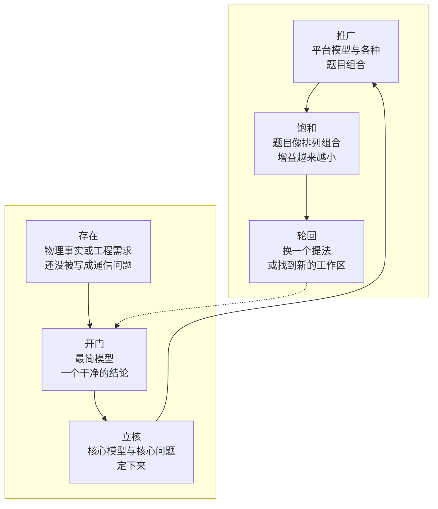

# 研究方向的生命周期：开了的门、半开的门、没开的门

无线通信里的研究方向有涨有落。2013 年前后，非正交多址几乎是每个会议的热门题目，几年后它在 5G NR 里止步于一份研究报告；2019 年智能超表面一出现就席卷各大期刊，3GPP 里先落地的却是另一种设备；可移动天线这两三年才开始升温。看清一个方向走到了哪一步，能帮你判断现在进去该做什么、能做出什么。

这一页先给一个六阶段的模型描述方向的一生【本站整理】，再用论文数的曲线看几个方向的实际走势，然后分三类看：门已经开了的，产业换了一个提法才进门的，至今没开的。最后是一张截至 2026 年 10 月的前沿雷达表【本站判断】。一个方向是怎样被"打开"的，见[开篇之作](03-seminal-papers.md)；一个想法值不值得做，见[八条线索](05-eight-threads.md)。这一页讲门开了以后的事。

---

## 一、六个阶段

下面六个阶段是对许多方向走势的归纳，不是定律；同一个方向的不同分支，也可能处在不同阶段。为了让每个阶段有个具体的样子，用智能超表面从头走一遍。

*怎么读这张图：实线是一个方向通常的走向；虚线表示轮回之后，新的提法要从开门重新走一遍，有新的最简模型和新的第一个结论。*

**存在。** 一个物理事实或工程需求早就在那里，只是还没人把它写成一个能解的通信问题。可编程超材料在电磁学界 2014 年前后已经做出来了，"编码超材料"把每个单元的状态直接写成 0 和 1 [1]，可通信界当时还没有把它和信道联系起来。这个阶段最值得做的，是留意物理与教科书模型之间的错位：教科书模型的哪条假设，在这里已经不成立了。

**开门。** 一篇开篇之作给出最简模型和一个干净的结论，并说清它和通信系统在哪里结合。2019 年前后，关于智能超表面的几篇平行工作几乎同时出现，其中一篇推出了随单元数 $N$ 按 $N^2$ 增长的无源波束赋形增益（[开篇之作第 8 篇](03-seminal-papers.md#8-wuzhang-2019-与同期工作让墙面成为可设计的变量)）。

**立核。** 核心模型和核心问题定下来，别人可以在同一个模型上写自己的问题。超表面的核心问题很快清楚了：有源与无源波束赋形怎样联合优化，级联信道怎样估计，相位只能取几个离散值时损失多少，实际器件的相位与幅度怎样耦合，以及它到底能不能打过一个中继。这个阶段最值得做的，是去攻核心模型里最弱的那条假设，或者给出判据型的结论：在什么条件下值得用。

**推广。** 平台模型被套到各种题目上：超表面加 OFDM，加非正交多址，加通感，加安全，加无人机，加携能，加边缘计算。论文数快速上升。这时最容易做的是"把 A 和 B 组合起来再优化一遍"。值得做的组合，是组合之后出现了新折中的那些；只多了一个优化变量的，价值有限。不管哪种，都要和最强的简单基线比。

**饱和。** 题目越来越像排列组合，增益越来越小，增益的来源越来越多地是更多的假设，而不是新的物理；综述一年出好几篇。这个阶段再写同类论文，回报很低。更值得做的是转向"谁来用、怎么用"：实测、原型、进标准的路径，或者去找下一扇门。

**轮回。** 方向以新的提法重生。可能是产业换了一个绕开难点的形态：超表面在 3GPP 里先落地的是网络控制中继器，一种有源、受基站控制的转发设备（本页第四节）。也可能是物理上找到了新的工作区：近场超表面，带放大的有源超表面，同时透射与反射的超表面，单元之间互相连接的非对角超表面。轮回之后又回到开门：新的提法需要新的最简模型。

| 阶段 | 看得见的信号 | 这时最值得做的事 |
|---|---|---|
| 存在 | 物理上已有现象或器件，通信界还没有对应的模型 | 找教科书模型里已经不成立的那条假设 |
| 开门 | 一两篇开篇之作，模型极简，结论干净 | 给出最简模型下的第一个判据或标度律 |
| 立核 | 大家开始共用同一个模型，核心问题清单成形 | 攻最弱的假设；给"什么时候值得用"的判据 |
| 推广 | 论文数快速上升，平台模型与各种题目组合 | 只做出现新折中的组合；与最强简单基线比 |
| 饱和 | 题目模板化，增益来自更多假设，综述密集 | 转向实测、原型、标准路径，或找下一扇门 |
| 轮回 | 产业换了提法，或物理上出现新工作区 | 为新提法写新的最简模型 |

---

## 二、论文数的曲线

下面三张图是在开放学术数据库 OpenAlex 里按题名与摘要检索关键词、逐年计数的结果（2026 年 10 月 1 日检索；2025 年的数据还在补录，可能小幅上调）。这种计数很粗：预印本和正式版会重复计算，关键词有歧义，有的论文用了别的说法就漏掉了。它只能看大势，不能看细节。

{ .chart loading=lazy }
{ .chart loading=lazy }

*怎么读这张图：第一条线是非正交多址（检索词 "non-orthogonal multiple access"），第二条线是智能超表面（"reconfigurable intelligent surface" 或 "intelligent reflecting surface"），第三条线是通感一体化（"integrated sensing and communication"）。非正交多址 2013 年以前的少量命中多是信息论里的老用法，不是功率域 NOMA；通感一体化 2021 年以前的零星命中与主题无关。*

{ .chart loading=lazy }
{ .chart loading=lazy }

*怎么读这张图：第一条线是语义通信（"semantic communication"，只保留计算机科学与工程领域，2020 年以前的命中多与无线无关），第二条线是 OTFS 与 AFDM 新波形，第三条线是可移动天线与流体天线（2020 年以前的命中是机械可动天线或液态金属天线，不是今天的概念），第四条线是无蜂窝大规模 MIMO（"cell-free massive MIMO"），第五条线是信道知识地图（"channel knowledge map"，2020 年那一篇就是它的开篇之作的预印本）。*

{ .chart loading=lazy }
{ .chart loading=lazy }

*怎么读这张图：第一条线是携能通信（"simultaneous wireless information and power transfer"），第二条线是同频全双工（"in-band full-duplex"；只写"full-duplex"的论文会漏计，所以数偏小）。*

几个可以读出来的事【本站判断】：

- **论文数和产业采纳是两回事。** 非正交多址的论文 2021 年以后每年稳定在一千七百篇上下，可 5G NR 的非正交多址研究在 2018 年底就结束了，没有立工作项目（本页第四节）。学术热度的平台期，和标准里的停步同时存在。
- **智能超表面还在涨，但涨得慢了。** 2023 到 2025 年三年分别比上一年多了约 30%、19%、11%。另一个细节：2021 年以后"intelligent reflecting surface"这个说法本身在减少，是术语逐渐统一到 RIS 的结果，不是方向降温。
- **通感一体化正处在推广期。** 2021 年 49 篇，2025 年 2400 篇，增速仍在 60% 以上，而且它已经在 6G 研究项目的范围里。
- **可移动天线与流体天线在开门之后的快速上升段。** 2022 年起每年翻一倍以上。语义通信涨得同样快，但它的理论缺口（没有编码定理）一直没补上，见第五节。
- **携能通信和同频全双工都进入了平台期。** 携能通信 2019 年前后见顶，之后每年三百篇上下；产业那一边，类似的思路以环境物联网的形态进了 Rel-19。全双工也是这样：论文平稳，标准里落地的是子带全双工。

---

## 三、开了的门

下表是几个门已经开了的方向。"现在的阶段"是本站的判断，依据是上面的曲线和标准状态；"和系统在哪里结合"指它的增益最终要过哪一道关。

| 方向 | 开门之作 | 现在的阶段【本站判断】 | 和系统在哪里结合 | 在本站 |
|---|---|---|---|---|
| 大规模 MIMO | Marzetta 2010 | 已进入 5G 主流 | 导频与相干块长度 | [开篇之作第 3 篇](03-seminal-papers.md#3-marzetta-2010天线多到无穷时只剩导频污染) |
| 认知无线电的多天线频谱共享 | Zhang–Liang 2008 | 轮回（产业以数据库式的频谱共享落地） | 对主用户的干扰功率约束 | [其他开篇之作](03-seminal-papers.md#四其他开篇之作) |
| 携能通信 | Zhang–Ho 2013 | 饱和；以环境物联网的形态轮回 | 能量接收机的灵敏度 | [预备篇 11.3 节](../part0/11-new-network-frontiers.md#113-携能通信与环境物联网用电磁波送能量) |
| 无人机通信 | Zeng 等 2016、Zeng–Zhang 2017 | 推广 | 位置与航迹、续航 | [预备篇 11.2 节](../part0/11-new-network-frontiers.md#112-无人机与低空网络位置和航迹成了设计变量) |
| 无蜂窝 | Ngo 等 2017 | 推广；产业以多 TRP 形式部分进入 | 前传与信息结构 | [预备篇 10.3 节](../part0/10-new-phy-dof.md#103-无蜂窝与分布式-mimo拆掉小区的边界) |
| 智能超表面 | 2019 年的几篇平行工作 | 推广趋于饱和；以中继器形态轮回 | 时间尺度、乘性路损 | 下面专门讲 |
| 通感一体化 | Sturm–Wiesbeck 2011 | 推广；在 6G 研究范围内 | 能量与维度 | [预备篇 9.4 节](../part0/09-new-landscape.md#94-isac-通感一体化一段波形两种任务) |
| 可移动天线、流体天线 | Wong 等 2021、Zhu 等 2024 | 开门之后的上升段 | 机械时间尺度与场的自由度 | [预备篇 10.1 节](../part0/10-new-phy-dof.md#101-可移动天线与流体天线让天线的位置成为变量) |
| 信道知识地图 | Zeng–Xu 2021 | 介于存在与开门之间 | 数据流与更新的因果 | [预备篇 11.5 节](../part0/11-new-network-frontiers.md#115-信道知识地图的工业形态数据已经在流动) |

### 智能超表面：一扇门怎样开、怎样走到今天

智能超表面是看生命周期最好的例子，因为六个阶段它都走过了，而且走得很快。

它开门时抓住的物理事实是孔径增益：$N$ 个单元相位对齐，接收功率按 $N^2$ 增长（[预备篇 9.3 节](../part0/09-new-landscape.md#n2-增益的逐步推导)）。立核以后，两个代价很快浮出来。一是乘性路损：级联链路要付两次路径损耗，几百个单元打不过一条健康的直达径，它的用武之地是救援被遮挡的链路（预备篇算例 9-3）。二是信息：无源单元不能自己收发导频，级联信道估计的开销随单元数增长，相位配置还要靠一条控制链路下发。

时间尺度决定了它在系统里的位置。超表面整面重新配置一次，远慢于一个符号，却比信道变化快（[预备篇 2.5 节的"两种慢"](../part0/02-wireless-channel-basics.md#相干时间)）。所以在蜂窝系统里，它天然的角色是改造信道：在一个相干时间里把信道调好、保持不动，而不是跟着符号去调制数据。

产业给出的回答，正是沿着这几个代价换了提法。Rel-18 标准化的是网络控制中继器（NCR）：它有源，能放大，用功放补回两段路径损耗，不必靠把面积做得很大；它的波束、开关、上下行时序都由基站下发的侧控制信息决定，对终端透明，终端不需要任何改动（TR 38.867、TS 38.300 §4.9）[2]。超表面本身没有进 Rel-19 的立项清单，6G 研究项目的范围里也没有它 [3]。ETSI 的行业规范组 ISG RIS 则从 2023 年起陆续发布研究报告（GR RIS 001–007，讲用例、架构、信道模型、实现与近场建模）[4]，这是标准化之前的"研究性"阶段。

学术这一边，论文数在 2025 年仍有一成以上的增长，新的工作区不断出现：近场超表面、有源超表面、同时透射与反射的超表面、非对角超表面。这正是第一节说的轮回。从这个例子里可以学到一句话：**一个方向在论文里的增益，要经得起它在系统里付的代价；产业换提法的方向，往往就是理论最该补的方向。**这里还缺的，是"什么地方值得装、该装多大"的判据：它需要遮挡概率、单元数、控制开销和信道知识的价值放在一起算，信道知识地图正好可以提供"哪里被遮挡"这份知识。

---

## 四、半开的门：产业换了一个提法

有些方向在论文里很成功，进标准时却换了一个样子。看懂换了什么、为什么换，比记住结论更有用。

**全双工 → 子带全双工。** 论文里的承诺是同频同时收发、频谱效率翻倍。站不住的前提有两个：终端负担不起一百多 dB 的自干扰抑制；即使基站能做，身边的建筑回波随环境变，也很难完全消掉（[预备篇 10.4 节](../part0/10-new-phy-dof.md#104-全双工与子带全双工一边说一边听的账)）。Rel-19 的子带全双工（工作项目 RP-234035，2023 年 12 月立项）换了提法：只在基站侧同时收发，上下行放在同一个 TDD 载波里互不重叠的子带上，终端仍是半双工（TS 38.300 §23.1）[5]。不同频的子带之间多了约 45 dBc 的频率隔离，问题一下子拉进了可实现的范围。它买到的也不再是"吞吐翻倍"，而是上行机会：研究报告里 FR1 宏站场景上行覆盖增益的中位数约 5.4 dB [6]。理论上还没做完的，是不完美抵消下"什么时候值得"的门限，以及小区之间的交叉链路干扰。

**智能超表面 → 网络控制中继器。** 上一节已经讲过：无源、近乎零功耗的承诺，撞上了两次路损、控制链路和估计开销；产业先选了有源、受网络控制的中继器。

**非正交多址 → MUST。** 论文里的承诺是按功率叠加多个用户、接收端串行消除，让同一块资源服务更多用户。LTE Rel-14 把它的一个窄版本写进了规范：下行多用户叠加传输（MUST），两个用户的信号叠加成一个格雷映射的合成星座，靠下行控制信息告诉近端用户干扰在哪里（TS 36.211/36.212/36.213 的 Rel-14 版本）[7]。到了 5G NR，Rel-16 的非正交多址研究（TR 38.812，2018 年 12 月）只留下了技术观察：理想信道估计下各方案差别不大，实际信道估计下性能退化 2–5 dB，系统级仿真里有的来源有增益、有的没有；报告没有建议立工作项目，之后的 Rel-16 特性清单里也没有它 [8]。站不住的前提是"相对设计良好的正交多址加多用户 MIMO，增益足够大"：有了大规模天线和好的调度，剩下的空间不多，而串行消除的误差传播和接收机复杂度是实打实的代价。

三扇半开的门有一个共同点：**产业保留了物理上站得住的那部分，绕开了代价最高的那条前提。**理论论文如果把自己的前提写清楚，并给出"增益在什么门限之上还能活下来"的判据，往往最经得起时间。

---

## 五、没开的门

**用新波形取代 OFDM 做多址。** OTFS 和 AFDM 对高速移动更稳，在时延–多普勒域里做感知也很自然；可 6G 的第一批物理层决定（2025 年 8 月，RAN1#122）把 CP-OFDM 定为下行的基础，CP-OFDM 与 DFT-s-OFDM 定为上行的基础 [9]。OFDM 的护城河是每个子载波上一个平坦的 MIMO 信道、循环前缀对时延差的宽容，以及整个芯片与测试生态（[预备篇 10.5 节](../part0/10-new-phy-dof.md#105-新波形otfsafdm-与-ofdm-的护城河)）。新波形的门没有关死，但位置变了：高速点对点链路、通感，以及骑在 OFDM 之上的增强。上面的曲线里 OTFS 与 AFDM 的论文仍在涨，说明学术上的探索还在继续。

**轨道角动量（OAM）。** 它常被宣传成一个"独立于空间的新维度"，可 OAM 模态包含在空间自由度之内，受孔径的同样限制，远距离传输时模态还会发散（[预备篇 9.1 节](../part0/09-new-landscape.md#电磁频谱空间的多维刻画)）。它的门开不了，原因在物理：没有新的自由度。

**语义通信。** 想法很有吸引力，论文数涨得也快，但它至今没有公认的语义信息度量，也没有"语义容量"的编码定理（[预备篇 9.5 节](../part0/09-new-landscape.md#诚实的现状缺编码定理)），标准里也没有对应的项目。它的一部分正在以"任务导向的联合信源信道编码"和 AI 原生空口的形式被吸收。这扇门要开，先要补上理论的那一块，见[第二部第 3 章](../part2/03-task-knowledge-lattice.md#32-够用的精确含义任务类充分统计量)。

门没开的理由大致三种：新东西没有带来新的自由度；它的增益在最强的简单基线面前消失了；或者替换现有底座的代价太高。前两种是物理与理论的问题，第三种是采纳的问题，见[时间线与标准](04-timeline-standards.md)。

---

## 六、前沿雷达表（截至 2026 年 10 月）

阶段与拥挤度都是本站的判断【本站判断】，依据是第二节的曲线、标准状态和文献的走势；标准状态以 3GPP 的立项与规范为准。

| 方向 | 阶段 | 拥挤度 | 标准状态 | 理论上最缺的 | 本站去处 |
|---|---|---|---|---|---|
| 超大规模阵列与近场 | 推广 | 中 | Rel-19 信道模型加入近场与空间非平稳 | 自由度与系统设计的接口 | [10.2 节](../part0/10-new-phy-dof.md#102-超大规模阵列自由度从孔径里来)、[第一部第 4 章](../part1/04-spatial-structure.md) |
| 智能超表面 | 推广趋于饱和 | 高 | 未进 Rel-19；Rel-18 有 NCR | 部署判据（装在哪、装多大） | [9.3 节](../part0/09-new-landscape.md#93-ris-智能超表面可编程的反射镜) |
| 可移动/流体天线 | 开门后的上升段 | 中，升温快 | 无 | 何时值得动的判据 | [10.1 节](../part0/10-new-phy-dof.md#101-可移动天线与流体天线让天线的位置成为变量) |
| 无蜂窝 | 推广 | 中 | 多 TRP；Rel-18 相干联合传输 | 局部信息下能做多好 | [10.3 节](../part0/10-new-phy-dof.md#103-无蜂窝与分布式-mimo拆掉小区的边界)、[第四部第 3 章](../part4/03-information-structure-phase-diagram.md) |
| 全双工 / SBFD | 轮回 | 低 | Rel-19 SBFD | 不完美抵消下的门限 | [10.4 节](../part0/10-new-phy-dof.md#104-全双工与子带全双工一边说一边听的账) |
| 新波形 | 作为多址没开门；专用场景活跃 | 中 | 6G 定 CP-OFDM | 与 OFDM 公平比较下的优势区 | [10.5 节](../part0/10-new-phy-dof.md#105-新波形otfsafdm-与-ofdm-的护城河) |
| 通感一体化 | 推广 | 高 | Rel-19 信道建模；6G 研究范围内 | 一体化胜过分时的条件 | [9.4 节](../part0/09-new-landscape.md#94-isac-通感一体化一段波形两种任务)、[第二部第 5 章](../part2/05-cognitive-triangle.md) |
| 携能与环境物联网 | 携能饱和；环境物联网推广 | 中 | Rel-19 环境物联网 | 能量约束下的系统设计 | [11.3 节](../part0/11-new-network-frontiers.md#113-携能通信与环境物联网用电磁波送能量) |
| 非地面网络 | 推广 | 中 | Rel-17 起持续演进 | 用好轨道与用户分布的先验 | [11.1 节](../part0/11-new-network-frontiers.md#111-非地面网络与空天地一体把基站搬上天) |
| 无人机与低空 | 推广 | 中 | Rel-18 NR 支持空中终端 | 三维覆盖与感知监管 | [11.2 节](../part0/11-new-network-frontiers.md#112-无人机与低空网络位置和航迹成了设计变量) |
| 物理层安全与隐蔽通信 | 安全饱和；隐蔽推广 | 中 | 无 | 对手信息未知时的保证 | [11.4 节](../part0/11-new-network-frontiers.md#114-物理层安全与隐蔽通信不靠密钥的保密) |
| 信道知识地图 | 存在到开门之间 | 低 | 有数据通道（MDT），无地图本身 | 统一模型与更新的因果 | [11.5 节](../part0/11-new-network-frontiers.md#115-信道知识地图的工业形态数据已经在流动)、[第一部第 7 章](../part1/07-channel-cartography.md) |
| AI 原生空口 | 标准化进行中 | 高 | Rel-19 规范波束管理、定位、CSI 预测 | 泛化与性能保证 | [11.6 节](../part0/11-new-network-frontiers.md#116-ai-原生网络大模型与智能体先问时间尺度)、[第二部第 4 章](../part2/04-environment-generalization.md) |
| 大模型与智能体 | 开门 | 很高 | 研究与试点 | 时间尺度上的分工 | [11.6 节](../part0/11-new-network-frontiers.md#116-ai-原生网络大模型与智能体先问时间尺度) |
| 语义通信 | 理论没开门；论文快速增长 | 高 | 无 | 度量与编码定理 | [9.5 节](../part0/09-new-landscape.md#95-语义通信传意思不传比特)、[第二部第 3 章](../part2/03-task-knowledge-lattice.md) |
| 电磁信息论 | 立核 | 低 | 理论研究 | 与系统设计的接口 | [第一部第 10 章](../part1/10-research-agenda.md#q1--静力学的接口电磁信息论) |

---

## 七、怎样用这一页

拿到一个想做的方向，先在雷达表里找它的阶段，再问那个阶段该问的问题：开门期问"最简模型下第一个干净的结论是什么"，立核期问"核心模型最弱的假设是哪条"，推广期问"这个组合有没有带来新的折中"，饱和期问"谁会用它、要过哪几道关"，轮回期问"新提法的最简模型是什么"。

两件事要分开看。论文数告诉你一个方向有多拥挤，不告诉你它对不对；标准状态告诉你产业接不接受，也不告诉你理论上还缺什么。一个方向拥挤、却在标准里停了步，说明论文里的前提和系统里的代价对不上，这往往正是理论最该去的地方。

---

## 参考文献

1. T. J. Cui, M. Q. Qi, X. Wan, J. Zhao, and Q. Cheng, "Coding metamaterials, digital metamaterials and programmable metamaterials," *Light: Science & Applications*, vol. 3, no. 10, e218, 2014. DOI: 10.1038/lsa.2014.99
2. 3GPP TR 38.867, "Study on NR network-controlled repeaters," V18.0.0, 2022；3GPP TS 38.300 V19.4.0 §4.9；TS 38.106 V19.6.0.
3. 3GPP RP-251881, "Study on 6G Radio," TSG RAN#108, 2025-06；3GPP, "RAN Rel-19 Status and a Look Beyond," 2025-04.
4. ETSI GR RIS 001–007, 2023–2026（GR RIS 001 "Use Cases, Deployment Scenarios and Requirements"；GR RIS 002 "Technological challenges, architecture and impact on standardization"；GR RIS 003 "Communication Models, Channel Models, Channel Estimation and Evaluation Methodology"）.
5. 3GPP RP-234035, "New WID: Evolution of NR duplex operation: Sub-band full duplex (SBFD)," TSG RAN#102, 2023-12；3GPP TS 38.300 V19.4.0 §23.1.
6. 3GPP TR 38.858, "Study on evolution of NR duplex operation," V18.2.0, 2024-12, §13.1.1.
7. 3GPP TR 36.859, "Study on downlink multiuser superposition transmission (MUST) for LTE," V13.0.0, 2015-12；3GPP TR 21.914 V14.0.0 §11.4.1.7；TS 36.211/36.212/36.213 Rel-14.
8. 3GPP TR 38.812, "Study on non-orthogonal multiple access (NOMA) for NR," V16.0.0, 2018-12, §10；3GPP TR 21.916 V16.2.0.
9. 3GPP TSG RAN WG1 #122 Final Report, 2025-08（议程 11.3.1 Waveform）.
