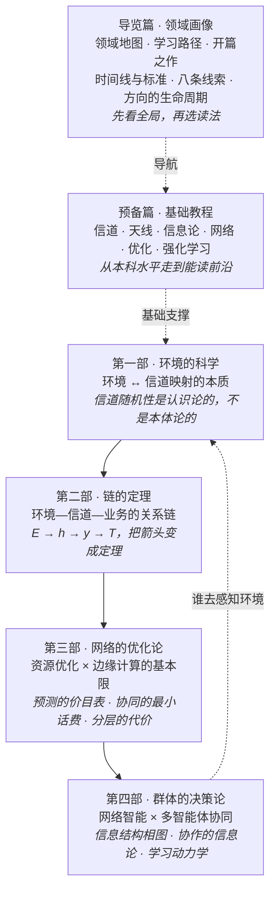

# 理论地基 · 四部曲

**从环境到群体：无线智能网络缺失的四层理论地基。**

作者：Zhang Linghao（National University of Singapore & Nanjing University of Posts and Telecommunications）

这个站点有两层用途。第一层是入门：导览篇画出无线通信领域的全貌和各个前沿方向卡在哪里，预备篇从本科水平讲起，把读懂四部所需的基础讲透。第二层是一个研究纲领：四部沿着"环境 → 信道 → 任务 → 网络 → 群体"这条线，把"AI 原生网络"底下**还没有定理的地方**系统地暴露出来。每一部都由浅入深，先讲清已有的科学（经典定理与谱系），再指出真正的空白（前沿开放问题），最后给出可操作的研究纲领。

## 体系总图

*怎么读这张图：最上面的导览篇不讲新的理论，负责画地图、给读法；实线是四部层层递进的主线；从第四部回到第一部的虚线是全书的闭环。当感知分布在许多节点上，"谁去测环境、测多密、测完给不给别人看"本身就是一个群体决策问题，详见[第四部第 9 章](part4/09-research-agenda.md)末节。*

导览篇画地图，预备篇打基础，四部对应四层追问，层层递进：

| 篇/部 | 追问 | 核心对象 |
|---|---|---|
| [导览篇 · 领域画像](guide/index.md) | 无线通信领域长什么样，前沿卡在哪里？ | 五层地图、前沿方向、学习路径、开篇之作、时间线与标准、八条线索、方向的生命周期 |
| [预备篇 · 基础教程](part0/index.md) | 读懂四部需要哪些基础？ | 信道、天线、信息论、网络、优化、RL |
| [第一部 · 环境的科学](part1/index.md) | 信道从哪里来？ | 环境→信道映射 $\Phi:\mathcal{E}\to\mathcal{H}$ |
| [第二部 · 链的定理](part2/index.md) | 信道知识如何变成业务价值？ | 链 $\mathcal{E}\to h\to y\to T$ |
| [第三部 · 网络的优化论](part3/index.md) | 资源分配的基本限在哪？ | 不确定性、通信复杂度、分层 |
| [第四部 · 群体的决策论](part4/index.md) | 许多智能体如何协同？ | 信息结构、博弈动力学、群体极限 |

## 怎么读

- **零基础起步**：先读导览篇的[领域地图](guide/01-field-map.md)和[学习路径](guide/02-learning-paths.md)，再读预备篇相应章（每章末尾的「通往前沿」会告诉你它接到四部的哪里）。
- **系统学习**：按第一部 → 第四部顺读；每部内部按章号顺读，均为"直觉 → 定义 → 定理 → 前沿 → 开放问题"的坡度。
- **找研究选题**：直接看每部收官章的「研究纲领」与各章的「开放问题」小节；[开放问题总表](open-problems.md)把四部各自缺的定理和 35 章章末的开放问题编成了一张索引，附每章的条数与状态。
- **看概念怎样串起来**：同一个想法常在好几部里换着名字出现。[八条线索](guide/05-eight-threads.md)把贯穿全站的八个问题各自串成一条由浅入深的阅读路径；第一至四部每章末尾的"跨部连线"框也标出了本章在哪几条线索上、接到别的部的哪里。
- **查一个概念**：用顶栏搜索（全站统一索引）；记号与术语另有两张总表——[符号表](notation.md)标出同一字母在各章的不同含义，[术语表](glossary.md)给核心术语一句话解释和首次出现的位置。
- **看四部怎样连成一个体系**：读[第四部第 9 章](part4/09-research-agenda.md)末节"全站收尾"。那里把四部各自缺的定理并成一张表，写出它们共用的元命题（AI 原生网络缺的不是算法，是 converse），并用一张闭环图把环境、链、网络、群体接回"谁去感知环境"。

## 诚实声明与状态标签

全站用方括号标签标明每个结论的来历和把握程度。读一句话之前先看它的标签，就知道它是文献里的定理、本站自己的推导，还是尚待核对的转述。

| 标签 | 含义 | 读者该怎么对待 |
|---|---|---|
| 【已解决】【已解决（经典）】 | 文献中已有定理或公认结果，均给出处 | 可以直接引用，出处见该章参考文献 |
| 【部分结果】 | 文献只解决了部分情形，或只证了一个方向 | 注意限定条件，不能推广成一般结论 |
| 【开放】 | 截至各章写作时（2026 年 8–10 月）没有定理的问题。一部分是文献公认的开放问题，另一部分是**本站原创提出的问题形式化**（如第一部的"四个基本问题"），后者会明确标注 | 研究选题的来源 |
| 【本站演算】 | 本站自己完成的推导或数值计算，已独立复算 | 数字可以复现；它是本站的结果，不是文献结论 |
| 【本站提法】【本站原创】 | 本站提出的概念、问题形式化或组织框架 | 是观点和提问方式，不是定理 |
| 【探索·本站提法】 | 文献很薄之处的探索性提法 | 当作研究假设来读 |
| 【表述待核】 | 引用内容本站未能逐字核对原文，例如只读到摘要或二手转述 | 正式引用前请回原文核对 |
| 【二手已核】【已核实·二手】 | 经可靠的二手来源核对过，未读原文 | 与【表述待核】类似，但把握更大 |
| 【预印本·未评审】 | 出处是尚未经过同行评审的预印本 | 结论可能改变 |

参考文献均经联网核验后引用；如发现错漏，以原文为准。

## 关于这本书

这是一本开放的电子书。预备篇和四部共 46 章，约 61 万汉字，另有导览篇 6 页和符号表、术语表、开放问题总表 3 份附录。它写给学过高数、线性代数、概率和信号与系统的本科高年级学生和研究生，也写给想找研究方向的人。书里不出习题，篇幅都花在三件事上：把概念和推导讲透，把各部分之间的联系讲清楚，把前沿还缺什么摆出来。

全书的源文件、统计图的生成脚本和两张附录表的生成工具都在 [GitHub 仓库](https://github.com/ZLHad/wireless-theory-tutorials)里。发现错误或有建议，欢迎在仓库里提 Issue，也可以点每页正文右上角的编辑按钮直接提交修改。正文与图采用 [CC BY-NC-SA 4.0](https://creativecommons.org/licenses/by-nc-sa/4.0/deed.zh-hans) 许可：转载和改编请署名，不得用于商业目的，改编后的作品须以相同许可发布。

---

*2026-08 起笔，2026-09 四部完稿：源于一场关于"AI 辅助理论证明时代，通信领域还剩哪些本质问题"的对话。*
