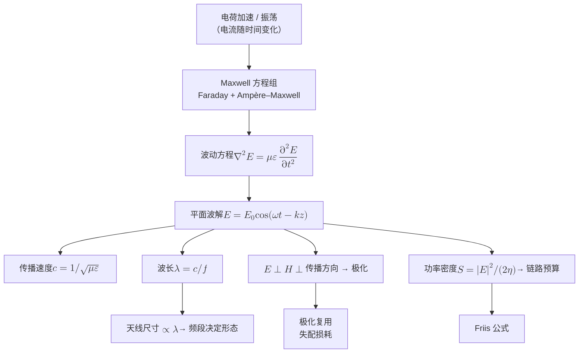
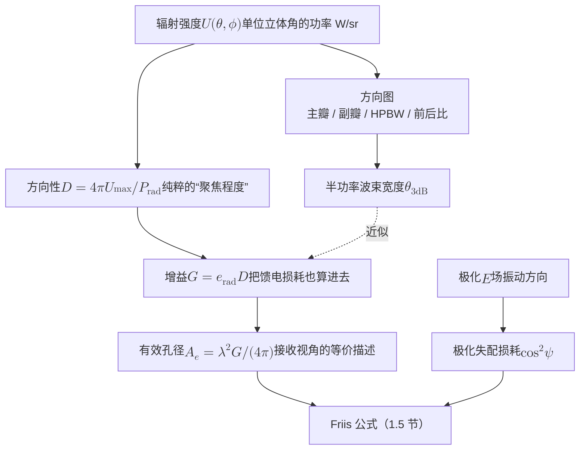
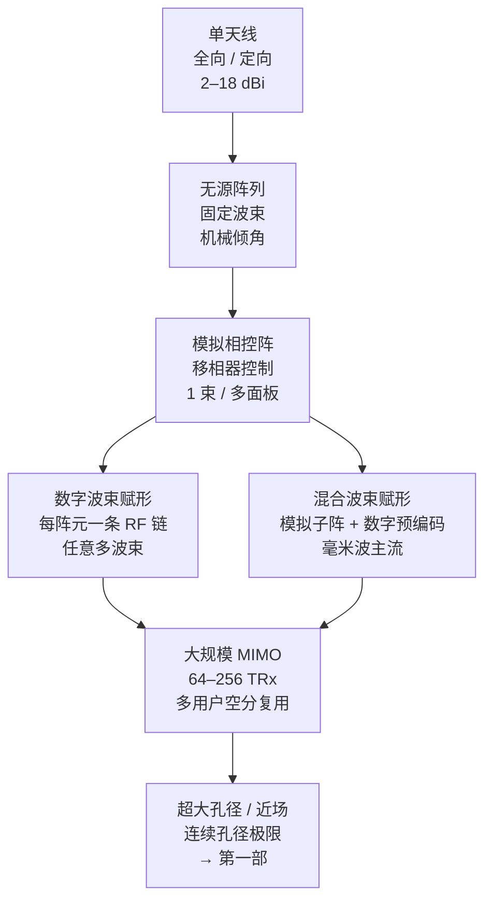

# 1 · 电磁波与天线：从振荡电荷到阵列

无线通信的一切，包括信道建模、链路预算、MIMO、波束赋形，乃至第一部要讨论的"电磁环境是不是随机的"，都建立在一个物理事实上：**加速运动的电荷**会把能量甩进空间，并以光速带走。这一章从这个事实出发，一步步走到 6G 基站上那面插着几百个振子的天线板。

中途我们要过五道关：

- 波是怎么产生的。
- 波长决定了什么。
- 近场与远场的分界在哪。
- 天线的四个基本参数各自量化了什么。
- 把很多天线排成阵列之后，为什么能"把能量捏成一束"。

这一章不要求你会解 Maxwell 方程组，但要求你读完之后，能拿起笔算出"28 GHz、100 米、1 瓦、64 阵元，接收端信噪比是多少 dB"，并且知道每一个 dB 是从哪条物理定律来的。

**你将学会：**

- 用"抖绳子"的直觉理解辐射，并读懂 Maxwell 四方程每一条在说什么，知道位移电流为什么是"波"存在的关键。
- 从方程组推出波动方程与 $c=1/\sqrt{\mu_0\varepsilon_0}$，并用 Larmor 公式解释"为什么频率越高越容易辐射"，顺带解释天为什么是蓝的。
- 记住 $\lambda = c/f$ 之后建立起完整的频段全景：从 700 MHz 到可见光，每个频段的波长量级、天线尺寸、穿透与绕射能力。
- 一步不跳地推出 Fraunhofer 距离 $d_F = 2D^2/\lambda$，并算清手机天线（4 厘米）与超大阵列（数百米）的巨大差别。
- 把天线的方向图、增益（dBi）、有效孔径 $A_e = \lambda^2 G/(4\pi)$、极化四个参数彻底讲透，包括 $A_e$ 里那个"$\lambda^2/(4\pi)$"是从哪来的。
- 从各向同性球面辐射一步步推出 Friis 公式，并完成一份 28 GHz / 100 m 的完整链路预算。
- 推导均匀线阵的阵因子 $\left|\sin(N\psi/2)/\sin(\psi/2)\right|$，得到波束宽度 $\approx 102^\circ/N$ 与阵列增益 $N$，理解波束赋形与栅瓣的由来。
- 看懂大规模 MIMO 天线的工程形态：模拟/数字/混合波束赋形、面板尺寸、双极化子阵。

---

## 1.1 电磁波从哪里来：振荡电荷、Maxwell 与辐射 {#11-电磁波从哪里来振荡电荷maxwell-与辐射}

### 1.1.1 直觉：静电荷有场，加速电荷才有波 {#直觉静电荷有场加速电荷才有波}

想象你抓着一根长绳的一端，另一端固定在远处的墙上。

- 你**静止不动**：绳子是绷直的，有张力（有"场"），但没有任何东西沿绳子跑出去。
- 你**匀速地把手平移**：绳子整体被拉着走，形状变了，但仍然没有"一列波"离开你的手。
- 你**上下抖动手**：一列波沿着绳子跑向远处，带走能量。抖得越快、越猛，跑出去的波越强。

电荷与电磁场的关系几乎是这个画面的逐字翻译：

| 电荷的运动状态 | 产生什么 | 有辐射吗 |
|---|---|---|
| 静止 | 静电场（库仑场），$\propto 1/r^2$ | 无 |
| 匀速直线运动 | 静磁场 + 电场，能量随电荷一起走 | 无 |
| **加速 / 振荡** | 场线"打结"并脱落，形成自持的电磁波，$\propto 1/r$ | **有** |

!!! tip "直觉：场线为什么会"脱落""
    把电场线想成从电荷长出来的橡皮筋。电荷突然一动，靠近它的那一截橡皮筋马上跟着动，但远处的那一截还不知道，因为"消息"只能以光速 $c$ 往外传。于是在电荷附近出现了一个"扭结"。

    电荷来回振荡时，扭结一个接一个地被甩出去，再也回不来，这就是辐射。也就是说，辐射是**场来不及跟随源**的后果。

这里有一个此后会反复出现的量纲线索。静电场随距离按 $1/r^2$ 衰减，而辐射场按 $1/r$ 衰减。功率密度正比于场强平方，所以辐射的功率密度按 $1/r^2$ 衰减，恰好抵消球面面积 $4\pi r^2$ 的增长，总功率守恒。

因此只有辐射场能把能量送到无穷远。其余成分（近场、感应场）在几个波长外就衰减得无影无踪。这是 1.3 节"近场与远场"的物理内核，请先记住。

### 1.1.2 Maxwell 四方程：逐条读懂它在说什么 {#maxwell-四方程逐条读懂它在说什么}

宏观电磁学的全部内容压缩在四个方程里。这里不推导它们，但每一条都要读懂：

$$
\begin{aligned}
\nabla \cdot \mathbf{D} &= \rho, \\
\nabla \cdot \mathbf{B} &= 0, \\
\nabla \times \mathbf{E} &= -\frac{\partial \mathbf{B}}{\partial t}, \\
\nabla \times \mathbf{H} &= \mathbf{J} + \frac{\partial \mathbf{D}}{\partial t}.
\end{aligned}
$$

其中 $\mathbf{E}$ 是电场强度（V/m），$\mathbf{H}$ 是磁场强度（A/m），$\mathbf{D} = \varepsilon \mathbf{E}$ 是电位移，$\mathbf{B} = \mu \mathbf{H}$ 是磁感应强度，$\rho$ 是电荷密度，$\mathbf{J}$ 是电流密度。下面逐条解读。

**第一条（Gauss 电场定律）**：电场线从正电荷出发、到负电荷终止。散度 $\nabla\cdot\mathbf{D}$ 度量"某点是不是场的源头"，等式说源头就是电荷。

**工程含义**：电荷分布决定静电场，这是电容、天线馈电点电压分布的基础。

**第二条（Gauss 磁场定律）**：磁场线永远闭合，没有"磁荷"。

**工程含义**：不存在只发磁场不发电场的天线，任何天线都同时产生两者。

**第三条（Faraday 电磁感应）**：变化的磁场会在周围"卷起"一个电场，旋度不为零意味着场线打圈。

**工程含义**：这是接收天线工作的原理。来波的变化磁场在导体上感生电动势，被送进接收机。

**第四条（Ampère–Maxwell 定律）**：电流会卷起磁场（$\mathbf{J}$ 项，这是 Ampère 原来的定律），变化的电场也会（$\partial \mathbf{D}/\partial t$ 项，Maxwell 补上的"位移电流"）。

!!! success "关键结论：位移电流是"波"能存在的唯一理由"
    没有 $\partial \mathbf{D}/\partial t$ 这一项，第三、四条方程就无法形成闭环。变化的磁场生电场，但电场没法反过来生磁场，链条断了，电磁扰动无法自我维持地向外传播。

    Maxwell 在 1865 年补上这一项，"变 E → 变 B → 变 E → ⋯"才接成无限链条，也就是电磁波。无线通信这个行业，字面意义上建立在这一项之上。

### 1.1.3 从方程组到波动方程：五步推导 {#从方程组到波动方程五步推导}

在无源自由空间中，$\rho = 0$，$\mathbf{J} = 0$，$\varepsilon = \varepsilon_0$，$\mu = \mu_0$。

**第一步：对 Faraday 定律两边取旋度。**

$$
\nabla \times (\nabla \times \mathbf{E}) = -\frac{\partial}{\partial t}\left(\nabla \times \mathbf{B}\right).
$$

右边能把 $\partial/\partial t$ 移到旋度外面，是因为旋度只对空间坐标求导，与时间求导可以交换次序。

**第二步：展开左边。** 左边用矢量恒等式 $\nabla\times(\nabla\times\mathbf{E}) = \nabla(\nabla\cdot\mathbf{E}) - \nabla^2\mathbf{E}$ 展开。

无源区里 $\nabla\cdot\mathbf{E} = 0$。第一条方程给出 $\nabla\cdot\mathbf{D}=\rho=0$，而 $\mathbf{D}=\varepsilon_0\mathbf{E}$ 中 $\varepsilon_0$ 是常数，所以 $\nabla\cdot\mathbf{E}=\nabla\cdot\mathbf{D}/\varepsilon_0=0$。于是左边化简为 $-\nabla^2\mathbf{E}$。

**第三步：右边代入 Ampère–Maxwell 定律。** 在 $\mathbf{J}=0$、$\mathbf{B}=\mu_0\mathbf{H}$、$\mathbf{D}=\varepsilon_0\mathbf{E}$ 时，第四条方程变成 $\nabla\times\mathbf{B} = \mu_0\nabla\times\mathbf{H} = \mu_0\varepsilon_0 \partial\mathbf{E}/\partial t$。右边还要再对时间求一次导，一阶导于是变成二阶导：

$$
-\nabla^2 \mathbf{E} = -\mu_0\varepsilon_0 \frac{\partial^2 \mathbf{E}}{\partial t^2}.
$$

**第四步：整理即得波动方程。**

$$
\nabla^2 \mathbf{E} = \mu_0\varepsilon_0 \frac{\partial^2 \mathbf{E}}{\partial t^2}.
$$

**第五步：与标准波动方程对照，读出传播速度。** 标准波动方程是 $\nabla^2 u = \frac{1}{v^2}\partial^2 u/\partial t^2$。

为什么这里的 $v$ 就是速度：任取一个只随 $z$ 变化的波形 $u=g(z-vt)$，有 $\partial^2u/\partial z^2=g''$、$\partial^2u/\partial t^2=v^2g''$，恰好满足标准波动方程。而 $g(z-vt)$ 正是把波形 $g$ 整体以速度 $v$ 向 $+z$ 平移。对照系数 $1/v^2=\mu_0\varepsilon_0$ 得

$$
v = \frac{1}{\sqrt{\mu_0 \varepsilon_0}} \triangleq c.
$$

**物理意义**

这是物理学史上最漂亮的推论之一。$\mu_0$ 与 $\varepsilon_0$ 是从静电、静磁实验测出来的常数，跟"光"毫无关系，把它们组合起来却得到了光速。

Maxwell 由此断定光就是电磁波，那是在无线电被发明之前二十多年。

**行为分析**

代入 $\mu_0 = 4\pi\times10^{-7}\ \mathrm{H/m}$、$\varepsilon_0 = 8.854\times10^{-12}\ \mathrm{F/m}$：

$$
\mu_0\varepsilon_0 = 1.2566\times10^{-6}\times 8.854\times10^{-12} = 1.1127\times10^{-17},
$$

$$
c = \frac{1}{\sqrt{1.1127\times10^{-17}}} = \frac{1}{3.336\times10^{-9}} = 2.998\times10^{8}\ \mathrm{m/s}.
$$

在介质中 $\varepsilon = \varepsilon_0\varepsilon_r$，$\mu \approx \mu_0$（非磁性材料），于是 $v = c/\sqrt{\varepsilon_r}$。波在介质里变慢，波长变短，这是 1.2 节要用的结论。

同一对常数还给出后面反复要用的**自由空间波阻抗**（wave impedance）$\eta_0=\sqrt{\mu_0/\varepsilon_0}=376.7\ \Omega\approx120\pi\ \Omega$，也可写成 $\eta_0=1/(\varepsilon_0c)$。

平面波中电场与磁场的幅度之比恒为 $|\mathbf{E}|/|\mathbf{H}|=\eta_0$，所以功率密度可以只用电场表示：$S=|\mathbf{E}_0|^2/(2\eta_0)$。这里 $\mathbf{E}_0$ 取峰值，$1/2$ 来自时间平均。流程图里的 $\eta$ 就是它。

### 1.1.4 辐射功率：Larmor 公式与 $f^4$ 定律 {#辐射功率larmor-公式与-f4-定律}

一个电荷量 $q$、加速度 $a$ 的非相对论点电荷，辐射的总功率由 Larmor 公式给出：

$$
P_{\mathrm{rad}} = \frac{q^2 a^2}{6\pi \varepsilon_0 c^3}.
$$

**物理意义**

辐射功率正比于**加速度的平方**。加速度为零（静止或匀速）就完全不辐射，回到本节开头那张表。

**这个公式从哪来**

加速电荷在远处产生的辐射电场大小为 $E_{\rm rad}=\dfrac{qa\sin\Theta}{4\pi\varepsilon_0c^2r}$。其中 $\Theta$ 是观察方向与加速度方向的夹角，推导见 Griffiths [4] 第 11 章。它就是本节开头说的 $1/r$ 场。

瞬时功率密度 $S=E_{\rm rad}^2/\eta_0=\varepsilon_0c\,E_{\rm rad}^2$。在半径 $r$ 的球面上积分，面元 $r^2d\Omega$ 里的 $r^2$ 恰好消掉 $1/r^2$：

$$
P_{\mathrm{rad}}=\varepsilon_0c\left(\frac{qa}{4\pi\varepsilon_0c^2}\right)^2\oint\sin^2\Theta\,d\Omega=\frac{q^2a^2}{16\pi^2\varepsilon_0c^3}\cdot\frac{8\pi}{3}=\frac{q^2a^2}{6\pi\varepsilon_0c^3},
$$

其中 $\oint\sin^2\Theta\,d\Omega=2\pi\int_0^{\pi}\sin^3\Theta\,d\Theta=2\pi\cdot\tfrac{4}{3}=\tfrac{8\pi}{3}$。

**行为分析**

这里藏着无线工程最重要的频率标度律。设电荷做简谐振荡 $x(t) = x_0\cos\omega t$，则 $a = -\omega^2 x_0 \cos\omega t$，峰值加速度 $\omega^2 x_0$，于是

$$
P_{\mathrm{rad}} \propto \omega^4 x_0^2 \propto f^4 x_0^2 .
$$

同样的电荷振幅，频率提高 10 倍，辐射功率暴涨 $10^4 = 10000$ 倍。这解释了两件看似无关的事：

- 低频天线为什么必须做得很大：振幅 $x_0$ 要用尺寸补回来。
- 天空为什么是蓝的：大气分子被阳光驱动振荡，蓝光频率约是红光的 1.56 倍，散射功率高 $1.56^4 \approx 5.9$ 倍。

!!! example "算例 1-1：辐射电阻——把"电荷振荡"翻译成"多少瓦""
    工程上不数电荷，而是用**辐射电阻** $R_r$ 把辐射描述成一个等效电阻消耗的功率：$P_{\mathrm{rad}} = \tfrac{1}{2}I_0^2 R_r$，$I_0$ 为馈电点电流峰值。对长度 $l \ll \lambda$ 的短偶极子（均匀电流近似），可以由 Larmor 公式推出，分三步。

    **第一步：把电流元看成振荡的电偶极矩。** 长 $l$ 的电流元相当于一个电偶极矩 $p$ 在振荡，$\dot p=Il$。把 Larmor 公式里的 $qa$ 换成 $\ddot p=l\,\dot I$。

    **第二步：取时间平均。** 取 $I=I_0\cos\omega t$，则 $\dot I=-\omega I_0\sin\omega t$，$\sin^2$ 的时间平均为 $1/2$，平均辐射功率为

    $$
    \bar P_{\rm rad}=\dfrac{\omega^2I_0^2l^2}{12\pi\varepsilon_0c^3}
    $$

    **第三步：令它等于等效电阻消耗的功率。** 令它等于 $\tfrac12I_0^2R_r$，得 $R_r=\dfrac{\omega^2l^2}{6\pi\varepsilon_0c^3}$。再用 $\omega=2\pi c/\lambda$ 与 $1/(\varepsilon_0c)=\eta_0$，化为 $R_r=\dfrac{2\pi}{3}\eta_0\left(\dfrac{l}{\lambda}\right)^2$。取 $\eta_0\approx120\pi$ 即

    $$
    R_r = 80\pi^2\left(\frac{l}{\lambda}\right)^2 \approx 790 \left(\frac{l}{\lambda}\right)^2 \ \Omega.
    $$

    代入三种情形。注意 $R_r$ 只依赖**电尺寸** $l/\lambda$，与绝对长度无关。

    | 天线 | $l/\lambda$ | $R_r$ |
    |---|---|---|
    | 极短鞭状天线 | 0.02 | $790\times 4\times10^{-4} = 0.32\ \Omega$ |
    | 短偶极子 | 0.1 | $790\times 0.01 = 7.9\ \Omega$ |
    | 半波振子（需精确计算，非上式） | 0.5 | $\approx 73\ \Omega$ |

    **解读**

    $R_r \propto (l/\lambda)^2$ 说明"电小天线"辐射极其无力。0.32 Ω 的辐射电阻要面对 50 Ω 的馈线，反射几乎全部功率，还要与欧姆损耗和巨大的容抗搏斗，必须靠匹配网络硬掰，代价是带宽极窄、效率低。

    而半波振子的 73 Ω 天然接近 50 Ω 同轴电缆，这就是"半波"这个尺寸被选作行业基准的原因。你此后看到的所有天线尺寸，说到底都是在跟 $\lambda$ 讨价还价。

---

## 1.2 频率、波长与频段全景 {#12-频率波长与频段全景}

### 1.2.1 三个量的铁三角 {#三个量的铁三角}

$$
\lambda = \frac{v}{f} = \frac{c}{f\sqrt{\varepsilon_r}}, \qquad k = \frac{2\pi}{\lambda}, \qquad \omega = 2\pi f = kv .
$$

$k$ 叫**波数**（rad/m），后面阵列推导里到处都是它。一个平面波沿 $z$ 传播时写作

$$
\mathbf{E}(z,t) = \mathbf{E}_0\cos(\omega t - kz),
$$

括号里 $-kz$ 的含义是：走过距离 $z$，相位落后 $kz$ 弧度。走一个波长，相位正好落后 $2\pi$。"距离即相位"是整个天线阵列理论的唯一支柱，1.6 节我们就只用它。

**行为分析**

$\lambda \propto 1/f$ 是一条双曲线，跨十个数量级依然成立。这带来一个直接的后果：天线的物理尺寸必须与 $\lambda$ 同量级。半波振子长 $\lambda/2$，阵元间距 $\lambda/2$，抛物面直径几十个 $\lambda$。

频率一变，天线的物理形态就整个换代。这是理解"为什么毫米波才有大规模阵列、为什么低频段基站天线那么大"的钥匙。

### 1.2.2 频段全景表 {#频段全景表}

| 频段 | 代表频率 | 波长 $\lambda$ | 典型可用带宽 | 穿透 / 绕射 | 单站覆盖量级 | 典型用途 |
|---|---|---|---|---|---|---|
| 低频段（sub-1G） | 700 MHz | 42.9 cm | 5–20 MHz | 绕射强，穿墙损耗小（混凝土约 10 dB 量级） | 数 km | 广域覆盖、物联网 |
| 中频段（sub-6G） | 3.5 GHz | 8.57 cm | 100 MHz | 穿墙约 20 dB，绕射尚可 | 数百 m | 5G 主力频段 |
| 高频 sub-6 / 非授权 | 5.8 GHz | 5.17 cm | 80–500 MHz | 穿墙 20–30 dB | 数十 m（室内） | Wi-Fi |
| 毫米波 | 28 GHz | 1.07 cm | 400–800 MHz | 基本不穿墙，人体阻挡即断 | 100–200 m | 5G mmWave、热点 |
| 毫米波（氧吸收峰） | 60 GHz | 5.0 mm | 2 GHz+ | 额外氧吸收约 15 dB/km | 数十 m | WiGig、短距高速 |
| 太赫兹 / sub-THz | 140 GHz–1 THz | 2.14 mm–0.3 mm | 数 GHz–数十 GHz | 只走视距，水汽吸收峰明显 | 10–50 m | 6G 候选、感知成像 |
| 红外（光通信） | 193 THz（1550 nm） | 1.55 μm | 数 THz | 完全不穿墙，受雾/遮挡即断 | 视距点对点 | 光纤、FSO |
| 可见光 | 545 THz（550 nm） | 550 nm | — | 完全不穿墙 | 室内数 m | VLC / LiFi |

!!! note "穿透损耗为什么随频率涨"
    常用工程模型（3GPP TR 38.901 的建筑穿透模型）把材料损耗写成频率的线性函数。例如混凝土约 $5 + 4f$ dB，普通玻璃约 $2 + 0.2f$ dB，$f$ 以 GHz 计。

    代入 $f = 3.5$：混凝土约 19 dB。代入 $f = 28$：混凝土约 117 dB，这个数字的实际含义是"完全不可能"。所以毫米波网络在架构上必须放弃"室外站覆盖室内"，转而依赖室内独立部署。

    绕射能力也随频率衰退，但原因不同。绕射的强弱由**障碍物的电尺寸**决定。一堵 3 m 宽的墙，在 700 MHz 是 $7\lambda$，波能明显绕过去；在 28 GHz 是 $280\lambda$，几何光学基本成立，墙后就是彻底的阴影。

!!! example "算例 1-2：把波长换算成能摸得到的尺寸"
    $\lambda = c/f$，取 $c = 3\times10^8$ m/s。半波振子的实际长度约为 $0.95\times\lambda/2$，端部效应使它略短于理论值。

    | 频率 | $\lambda$ | 半波振子长度 | $\lambda/2$ 阵元间距 | 64 阵元（8×8）面板边长 |
    |---|---|---|---|---|
    | 700 MHz | 42.9 cm | 20.4 cm | 21.4 cm | 1.71 m |
    | 3.5 GHz | 8.57 cm | 4.07 cm | 4.29 cm | 34.3 cm |
    | 28 GHz | 1.07 cm | 5.09 mm | 5.36 mm | 4.29 cm |
    | 140 GHz | 2.14 mm | 1.02 mm | 1.07 mm | 8.6 mm |

    **解读**

    最后一列是整篇 6G 天线故事的浓缩。

    - 3.5 GHz 想装 64 个阵元，要一块 34 cm 见方的板子，这大致就是你在铁塔上看到的 AAU 的尺寸。AAU（active antenna unit，有源天线单元）把射频收发通道与天线阵集成在同一个箱体里。
    - 同样 64 个阵元，在 28 GHz 只要 4.3 cm 见方，一张信用卡上能放好几个。

    毫米波适合做大规模阵列，靠的不是什么特殊物理，只因为 $\lambda$ 小、阵元挤得下。

    再算一个介质中的例子。3.5 GHz 的波进入 $\varepsilon_r \approx 5$ 的干燥混凝土，$v = c/\sqrt{5} = 1.34\times10^8$ m/s，$\lambda_{\rm in} = 8.57/2.24 = 3.83$ cm。波长缩短意味着一堵 20 cm 厚的墙内含 5.2 个波长。这足以形成明显的多次反射与谐振效应，也是穿墙损耗难以用单一常数刻画的原因之一。

    多层墙体内的往返反射，见[第一部第 2 章](../part1/02-maxwell-foundations.md)"反射与透射"一节。[第 2 章](02-wireless-channel-basics.md)讲这类损耗在路损模型里怎样被打包成经验参数。

---

## 1.3 近场与远场：Fraunhofer 距离的推导 {#13-近场与远场fraunhofer-距离的推导}

### 1.3.1 直觉：贴着电视墙看，和站在马路对面看 {#直觉贴着电视墙看和站在马路对面看}

站在一面巨大的 LED 电视墙前 10 厘米处，你的左眼和右眼看到的是屏幕上完全不同的两块区域，光线从各个角度射进眼睛。这时你无法说"这块屏幕在哪个方向"。

退到马路对面 100 米，整块屏幕缩成一个亮点，所有光线几乎平行地射过来。此时"方向"才是一个有意义的概念。

天线完全一样。**远场**（Fraunhofer 区）是"天线已经缩成一个点、来波已经是平面波"的区域，**近场**是这个近似失效的区域。分界线在哪，取决于两件事：天线孔径 $D$ 有多大，波长 $\lambda$ 有多小。

严格来说，天线周围分三个区：

| 区域 | 范围 | 特征 |
|---|---|---|
| 电抗近场（reactive near field） | $r < 0.62\sqrt{D^3/\lambda}$ | 储能场主导，能量在天线与空间之间来回"呼吸"，不构成辐射 |
| 辐射近场（Fresnel 区） | $0.62\sqrt{D^3/\lambda} < r < 2D^2/\lambda$ | 已是辐射场，但波前是**球面**，方向图随距离变化 |
| 远场（Fraunhofer 区） | $r > 2D^2/\lambda$ | 波前近似**平面**，方向图与距离无关，场强严格 $\propto 1/r$ |

### 1.3.2 逐步推导 $d_F = 2D^2/\lambda$ {#逐步推导-d_f--2d2lambda}

设阵列/口径的最大尺寸为 $D$，观察点在法线方向距离 $d$ 处。所谓"平面波近似"，就是假定口径上每一点到观察点的距离都相同。误差最大的是口径边缘（离中心 $D/2$）与口径中心之间的路程差。

**第一步：由勾股定理写出精确路程差。**

$$
\Delta d = \sqrt{d^2 + \left(\frac{D}{2}\right)^2} - d .
$$

**第二步：展开路程差。** 提出 $d$，并用 $\sqrt{1+x}\approx 1+\tfrac{x}{2}$（$x\ll 1$）展开：

$$
\Delta d = d\left(\sqrt{1 + \frac{D^2}{4d^2}} - 1\right) \approx d\cdot\frac{1}{2}\cdot\frac{D^2}{4d^2} = \frac{D^2}{8d}.
$$

**第三步：把路程差折算为相位误差。**

$$
\Delta\varphi = k\,\Delta d = \frac{2\pi}{\lambda}\cdot\frac{D^2}{8d}
$$

**第四步：用相位判据定出最小距离。** 采用天线工程的传统判据：最大相位误差不超过 $\pi/8$。这等价于路程差不超过 $\lambda/16$，此时方向图畸变可忽略：

$$
\frac{2\pi}{\lambda}\cdot\frac{D^2}{8d} \le \frac{\pi}{8} \;\Longleftrightarrow\; \frac{D^2}{4\lambda d} \le \frac{1}{8} \;\Longleftrightarrow\; d \ge \frac{2D^2}{\lambda}.
$$

**第五步：定义 Fraunhofer 距离。** 它又称瑞利距离：

$$
\boxed{\;d_F = \frac{2D^2}{\lambda}\;}
$$

**物理意义**

$d_F$ 是"波前弯曲可以被忽略"的最小距离。它用**相位**判据，不用能量判据。过了 $d_F$，信号强度不会发生任何突变，变的只是我们建模的方式：从"每个阵元看到不同曲率的球面波"简化为"所有阵元看到同一个平面波，只差一个线性相位"。

这个简化是[第 5 章](05-mimo.md)全部阵列响应向量 $\mathbf{a}(\theta)$ 的前提。

**行为分析**

注意 $d_F \propto D^2/\lambda$，即孔径的**平方**除以波长。

- 孔径翻倍，近场范围翻**四**倍。
- 频率翻倍（$\lambda$ 减半），近场范围翻倍。

这个平方关系是 6G"近场通信"话题的全部动力来源。4G 时代 $D$ 小、$\lambda$ 大，$d_F$ 只有几米，工程上根本碰不到。6G 的超大孔径加毫米波把 $d_F$ 推到几百米，整个小区都可能落在近场里。

!!! warning "两个附加条件别忘了"
    $d_F = 2D^2/\lambda$ 只是三个远场条件之一。完整条件是：

    - $d > 2D^2/\lambda$（相位平面性）。
    - $d \gg D$（几何点源性）。
    - $d \gg \lambda$（储能场已衰尽）。

    当天线很小时（$D < \lambda$），第一个条件给出的距离小于波长，此时真正起作用的是后两个条件。工程上常用 $d > 5\lambda$ 兜底。下面算例的第一行就是这种情况。

!!! example "算例 1-3：手机天线 vs 大规模阵列，$d_F$ 差了四个数量级"
    代入 $d_F = 2D^2/\lambda$：

    | 场景 | 频率 | $\lambda$ | 孔径 $D$ | $2D^2/\lambda$ | 实际远场起点 |
    |---|---|---|---|---|---|
    | 手机内置天线 | 2.6 GHz | 11.5 cm | 5 cm | $2(0.05)^2/0.115 = 4.3$ cm | 受 $5\lambda$ 约束 → **约 58 cm** |
    | 3.5 GHz 宏站 AAU | 3.5 GHz | 8.57 cm | 0.5 m | $2(0.5)^2/0.0857 = 5.8$ m | **5.8 m** |
    | 28 GHz 16×16 阵列 | 28 GHz | 1.07 cm | 0.121 m（对角） | $2(0.121)^2/0.0107 = 2.7$ m | **2.7 m** |
    | 6G 超大孔径 / RIS 墙面 | 100 GHz | 3.0 mm | 1 m | $2(1)^2/0.003 = 667$ m | **667 m** |
    | 3.5 GHz 巨型阵列 | 3.5 GHz | 8.57 cm | 2 m | $2(2)^2/0.0857 = 93$ m | **93 m** |

    顺带算第二行的电抗近场边界：$0.62\sqrt{D^3/\lambda} = 0.62\sqrt{0.125/0.0857} = 0.62\times 1.21 = 0.75$ m。也就是说，这面 AAU 板子的 0.75 m 以内是储能场，0.75–5.8 m 是辐射近场（Fresnel 区），5.8 m 之外才是远场。

    **解读**

    - 第一行解释了为什么你学的所有远场公式在手机上一直够用。用户离手机 58 cm 以外时，一切照常。贴着头打电话时确实进了近场，这就是 SAR 比吸收率测试要处理的问题。
    - 第四、五行解释了为什么 6G 教科书必须重写这一节。667 m 意味着整个小区都是近场，"波束指向某个角度"这个概念不再够用，必须升级为"波束聚焦到某个**位置**"（角度 + 距离）。这是[第 9 章](09-new-landscape.md)近场通信一节和[第一部第 4 章](../part1/04-spatial-structure.md)的起点。

---

## 1.4 天线的四个基本参数 {#14-天线的四个基本参数}

天线不是放大器，它不产生能量。它只做一件事：发射时，把能量在方向上重新分配；接收时，从空间中截取一块面积上的能量。这一节的四个参数，就是把这句话量化。

### 1.4.1 参数一：方向图 {#参数一方向图}

把天线放在原点，测量它在各个方向 $(\theta,\varphi)$ 上辐射出去的功率密度，归一化后画成三维曲面，就是**方向图**（radiation pattern）。工程上通常只画两个正交切面（E 面与 H 面）。方向图的关键读数有五个：

- **主瓣（main lobe）**：辐射最强的那一瓣。
- **半功率波束宽度 HPBW / $\theta_{3\rm dB}$**：主瓣上功率降到峰值一半（$-3$ dB）的两点间夹角，是"波束多宽"的标准度量。
- **副瓣电平（SLL）**：最高副瓣比主瓣低多少 dB。典型均匀激励阵列约为 $-13.3$ dB，这是阵元数较多时的值，1.6 节会算出这个数。
- **零点（null）**：方向图为零的方向。干扰抑制就是把零点对准干扰源。
- **前后比（F/B）**：主瓣与正后方的比值。基站天线通常要求 25 dB 以上，以防止背向干扰邻区。

按方向图形状，天线分三类：

- **各向同性**（isotropic）：各方向均等，物理上不存在，仅作参考基准。
- **全向**（omnidirectional）：水平面均匀、垂直面有方向性，如振子天线。
- **定向**（directional）：如抛物面、喇叭、阵列。

### 1.4.2 参数二：方向性与增益，以及 dBi 的准确含义 {#参数二方向性与增益以及-dbi-的准确含义}

定义**辐射强度** $U(\theta,\varphi)$ 为单位立体角内的辐射功率（W/sr）。总辐射功率是它在整个球面上的积分：

$$
P_{\rm rad} = \oint U(\theta,\varphi)\,d\Omega = \int_0^{2\pi}\!\!\int_0^{\pi} U(\theta,\varphi)\sin\theta\, d\theta\, d\varphi .
$$

各向同性天线的辐射强度是 $U_{\rm iso} = P_{\rm rad}/(4\pi)$。**方向性**（directivity）定义为峰值与这个平均值之比：

$$
D = \frac{U_{\max}}{U_{\rm iso}} = \frac{4\pi U_{\max}}{P_{\rm rad}} .
$$

记号提醒：这里的 $D$ 是无量纲的方向性，1.3 节的 $D$ 是口径尺寸，单位是米，二者同名不同物。算例 1-4 因此把抛物面直径另记作 $D_a$。

**增益**（gain）与方向性只差一个辐射效率 $e_{\rm rad} = P_{\rm rad}/P_{\rm in}$，即辐射掉的功率除以馈入的功率，差额是欧姆损耗与介质损耗：

$$
G = e_{\rm rad}\, D = \frac{4\pi U_{\max}}{P_{\rm in}} .
$$

用 dB 表示时，参考基准必须写清楚：

$$
G[\mathrm{dBi}] = 10\log_{10} G, \qquad G[\mathrm{dBd}] = G[\mathrm{dBi}] - 2.15 .
$$

**dBi** 以各向同性天线为基准，**dBd** 以半波振子为基准（半波振子本身是 2.15 dBi）。本书以及绝大多数通信文献一律用 dBi。

换算举例：$G=2$ 是 $10\log_{10}2=3.01$ dBi，$G=1000$ 是 30 dBi。厂家标注 12 dBd 的天线就是 $12+2.15=14.15$ dBi。

**物理意义**

$G$ 度量的是"这根天线把功率往最强方向堆了多少倍"。$G = 100$（20 dBi）意味着主瓣方向上的功率密度是同样发射功率下各向同性天线的 100 倍，代价是别的方向少了，总功率一分不多。

天线是"聚光灯的反光碗"，不是"更亮的灯泡"。

**行为分析**

有一个非常好用的粗略关系。设主瓣近似占据立体角 $\Omega_A \approx \theta_E \theta_H$，即两个正交面的 HPBW 之积，用弧度制，其余方向近似为零。

这样功率近似以强度 $U_{\max}$ 均匀铺满 $\Omega_A$，即 $P_{\rm rad}\approx U_{\max}\Omega_A$。代入 $D=4\pi U_{\max}/P_{\rm rad}$，并在无损耗时取 $G=D$，得

$$
G \approx \frac{4\pi}{\Omega_A} = \frac{4\pi}{\theta_E\theta_H} \quad\text{（弧度）}\qquad\Longleftrightarrow\qquad G \approx \frac{41253}{\theta_E^\circ \theta_H^\circ}\quad\text{（度）}.
$$

其中 $41253 = 4\pi \times (180/\pi)^2$，即整个球面所对应的"平方度"数。

这个式子告诉你，增益与波束宽度是一枚硬币的两面：波束每窄一半，增益涨 6 dB。它也说明了高增益必然带来"对准"的工程负担：25 dBi 的波束大约只有 $12^\circ\times12^\circ$，稍偏一点就掉进副瓣。

!!! example "算例 1-4：三种天线的增益，以及 dBi 的手算"
    **(a) 半波振子。** 其方向性为 $D = 1.64$，故

    $$
    G = 10\log_{10}(1.64) = 2.15\ \mathrm{dBi}\quad(\text{效率取 } 100\%).
    $$

    E 面 HPBW 为 $78^\circ$，H 面全向（$360^\circ$）。用近似式估计：$41253/(78\times 360) = 1.47$，即 1.7 dBi，与真值 2.15 dBi 相差 0.45 dB。对一个只用两个角度就估出来的数，这个精度已经很好，也提醒你近似式只适合窄波束。

    **(b) 抛物面天线。** 口径直径 $D_a$、口径效率 $e_{\rm ap}\approx 0.6$。把有效孔径 $A_e=e_{\rm ap}\cdot\pi D_a^2/4$（圆形口径面积打一个效率折扣）代入 $G=4\pi A_e/\lambda^2$，得到下式。后一个关系式在本节"参数三"证明：

    $$
    G = e_{\rm ap}\left(\frac{\pi D_a}{\lambda}\right)^2 .
    $$

    取 28 GHz（$\lambda = 1.071$ cm）、$D_a = 0.6$ m：$\pi D_a/\lambda = 3.1416\times 0.6/0.01071 = 176.0$，平方得 $30\,976$，乘 0.6 得 $18\,586$：

    $$
    G = 10\log_{10}(18586) = 42.7\ \mathrm{dBi}.
    $$

    对应波束宽度约 $\theta_{3\rm dB}\approx 70^\circ\lambda/D_a = 70\times0.01071/0.6 = 1.25^\circ$。一度多一点，指向精度成了机械结构问题。

    **(c) 8×8 平面阵列（$\lambda/2$ 间距）。** 用本节"参数三"要证的 $G = 4\pi A_e/\lambda^2$，理想均匀口径 $A_e$ 等于物理面积 $64\times(\lambda/2)^2 = 16\lambda^2$：

    $$
    G = \frac{4\pi \cdot 16\lambda^2}{\lambda^2} = 64\pi = 201 \;\Rightarrow\; 23.0\ \mathrm{dBi}.
    $$

    换个角度看同一个数：单个 $\lambda/2\times\lambda/2$ 单元的增益是 $4\pi(\lambda^2/4)/\lambda^2 = \pi = 4.97$ dBi，64 个单元相干合成再加 $10\log_{10}64 = 18.06$ dB，合计 $23.0$ dBi。两条路殊途同归。

    记住这个"$\pi N$"公式：$\lambda/2$ 栅格的平面阵，增益约为 $10\log_{10}(\pi N)$ dBi。

### 1.4.3 参数三：有效孔径 $A_e$ {#参数三有效孔径-a_e}

发射时我们说"增益"，接收时我们说"孔径"。一根接收天线好像在来波的功率密度场里张开了一张面积为 $A_e$ 的网，捞走 $P_r = S \cdot A_e$ 的功率，其中 $S$ 为入射功率密度，单位 W/m²。二者由下式联系：

$$
\boxed{\;A_e = \frac{\lambda^2}{4\pi}G\;}\qquad\Longleftrightarrow\qquad G = \frac{4\pi A_e}{\lambda^2}.
$$

**这个 $\lambda^2/(4\pi)$ 是从哪来的？** 两步论证。

**第一步：用互易性和热力学，说明这个比值是普适常数。** 由互易定理，同一根天线的发射方向图与接收方向图相同，因此比值 $A_e/G$ 只可能是一个与天线类型**无关**的普适常数，记作 $\kappa$。

可以用一个反证看出这必须成立：把两根不同类型的天线放进同一个温度为 $T$ 的黑体腔，并用匹配负载互连。若 $\kappa$ 因天线而异，两者交换的热噪声功率就不相等，会自发建立温差，违反热力学第二定律。

**第二步：用一个已知天线定标。** 既然是普适常数，随便挑一根算得出来的天线代入即可。短偶极子最好算，分三小步：

- **增益**：短偶极子的辐射强度 $U\propto\sin^2\theta$，$\oint\sin^2\theta\,d\Omega=8\pi/3$，故 $D=4\pi U_{\max}/P_{\rm rad}=4\pi/(8\pi/3)=1.5$，无损耗时 $G=1.5$。
- **捕获功率**：峰值 $E_0$、极化与振子平行的来波，在长 $l$ 的振子上感应开路电压 $V=E_0l$。接收天线等效为电压源 $V$ 串联内阻 $R_r$，接匹配负载 $R_L=R_r$ 时，电流峰值 $V/(2R_r)$，负载功率 $P_r=\tfrac12\left(\tfrac{V}{2R_r}\right)^2R_r=\tfrac{V^2}{8R_r}$。
- **相除**：入射功率密度 $S=E_0^2/(2\eta_0)$，代入算例 1-1 的 $R_r=80\pi^2(l/\lambda)^2$ 与 $\eta_0=120\pi$：$A_e=\dfrac{P_r}{S}=\dfrac{\eta_0l^2}{4R_r}=\dfrac{120\pi\lambda^2}{4\times80\pi^2}=\dfrac{3\lambda^2}{8\pi}$。

于是

$$
\kappa = \frac{A_e}{G} = \frac{3\lambda^2/(8\pi)}{1.5} = \frac{\lambda^2}{4\pi}.
$$

**物理意义**

$\lambda^2/(4\pi)$ 就是**各向同性天线的有效孔径**。也就是说，"一根 0 dBi 天线能从空中捞多大一块功率"这件事，完全由波长决定。频率越高，这块"网"越小。

Friis 公式里那个让无数人误会"高频路损天生大"的 $\lambda^2$，来源就在这里。它不是传播损耗，而是接收天线孔径随频率缩小。

**行为分析**

代入数字看看这张网有多大：

- 3.5 GHz、0 dBi：$A_e = \lambda^2/(4\pi) = (0.0857)^2/12.566 = 5.84\times10^{-4}\ \mathrm{m^2} = 5.84\ \mathrm{cm^2}$。
- 28 GHz、0 dBi：$A_e = (0.01071)^2/12.566 = 9.13\times10^{-6}\ \mathrm{m^2} = 0.091\ \mathrm{cm^2}$。

比值恰是 $(28/3.5)^2 = 64$。同样一根"无方向性"的天线，在 28 GHz 上捞到的功率比 3.5 GHz 低 18 dB。

但只要保持天线的物理面积不变（把 64 个 28 GHz 阵元塞进同样的板子），$G$ 就涨 64 倍，$A_e$ 一分不少。这个论证 1.5 节还会以更完整的形式再出现一次。

!!! example "算例 1-5：有效孔径与物理孔径的对账"
    上面算例 1-4(c) 的 28 GHz 8×8 阵列，$G = 23.0$ dBi $= 201$。它的有效孔径：

    $$
    A_e = \frac{\lambda^2 G}{4\pi} = \frac{(0.01071)^2 \times 201}{12.566} = \frac{2.305\times 10^{-2}}{12.566} = 1.84\times10^{-3}\ \mathrm{m^2} = 18.4\ \mathrm{cm^2}.
    $$

    而这块板子的物理面积是 $(8\times 0.536\,\mathrm{cm})^2 = (4.29\ \mathrm{cm})^2 = 18.4\ \mathrm{cm^2}$。两者完全相等，原因是均匀激励、无损耗的理想口径，其有效孔径恰等于物理孔径，口径效率 $e_{\rm ap} = A_e/A_{\rm phys} = 1$。

    实际工程中 $e_{\rm ap}$ 通常在 0.5–0.8。口径场分布不均匀（为压副瓣而做的幅度加权会牺牲增益）、阵元间互耦、馈电网络损耗，都会吃掉一部分。

    取 $e_{\rm ap} = 0.65$，真实增益降到 $23.0 + 10\log_{10}0.65 = 21.1$ dBi。估算天线增益时，"理想值减 1.5–3 dB"是可靠的心算法则。

### 1.4.4 参数四：极化 {#参数四极化}

平面波的电场矢量 $\mathbf{E}$ 垂直于传播方向，但在垂直平面内它指向哪儿、怎么随时间转动，这就是**极化**。常见的有三种：

- **线极化**：$\mathbf{E}$ 始终沿固定方向振动（垂直极化、水平极化、$\pm45^\circ$ 斜极化）。
- **圆极化**：两个正交分量等幅、相差 $90^\circ$，$\mathbf{E}$ 端点画圆（左旋 LHCP / 右旋 RHCP）。卫星通信常用，因为它对收发端的姿态旋转不敏感。
- **椭圆极化**：一般情形。

收发极化不一致时会有**极化失配损耗**（polarization loss factor, PLF）。用单位复向量 $\hat{\boldsymbol{\rho}}_t$、$\hat{\boldsymbol{\rho}}_r$ 表示收发天线的极化方向：线极化是实向量，例如水平极化为 $\hat{\mathbf{x}}$；圆极化是 $(\hat{\mathbf{x}}\pm j\hat{\mathbf{y}})/\sqrt{2}$。PLF 就是二者内积的模平方。

例如圆极化对方向角为 $\alpha$ 的线极化 $\cos\alpha\,\hat{\mathbf{x}}+\sin\alpha\,\hat{\mathbf{y}}$：$|(\cos\alpha+j\sin\alpha)/\sqrt{2}|^2=|e^{j\alpha}|^2/2=1/2$，与 $\alpha$ 无关，这就是下表最后一行的恒定 3 dB。

对两个线极化天线，夹角 $\psi$：

$$
\mathrm{PLF} = |\hat{\boldsymbol{\rho}}_t \cdot \hat{\boldsymbol{\rho}}_r|^2 = \cos^2\psi .
$$

**行为分析**

| 失配角 $\psi$ | PLF | 损耗 |
|---|---|---|
| $0^\circ$ | 1 | 0 dB |
| $30^\circ$ | 0.75 | 1.25 dB |
| $45^\circ$ | 0.5 | 3.0 dB |
| $60^\circ$ | 0.25 | 6.0 dB |
| $90^\circ$ | 0 | 理论 $\infty$，实测受交叉极化鉴别度限制，约 20–30 dB |
| 圆 ↔ 线（任意角） | 0.5 | 恒定 3.0 dB |

**工程含义**

- 坏的一面：手机在用户手里是随机姿态的，平均要计入约 3 dB 的极化失配裕量。
- 好的一面：$90^\circ$ 处那个"理论无穷大"意味着两个正交极化互不干扰，可以承载两路独立数据流。这就是为什么基站天线一律做成 $\pm45^\circ$ 双极化：同一块板子的物理面积，硬生生翻倍成两个空间自由度。

极化是最便宜、最成熟的复用维度（详见[第 5 章](05-mimo.md)与[第一部第 4 章](../part1/04-spatial-structure.md)）。

---

## 1.5 Friis 公式：从球面功率密度一步步推到链路预算 {#15-friis-公式从球面功率密度一步步推到链路预算}

### 1.5.1 完整推导（五步，不跳步） {#完整推导五步不跳步}

**第一步：各向同性辐射的球面功率密度。** 一个天线以功率 $P_t$ 向各方向均匀辐射。能量守恒要求：任何以天线为心、半径 $d$ 的球面上，穿过的总功率都等于 $P_t$。球面积为 $4\pi d^2$，故功率密度

$$
S_{\rm iso}(d) = \frac{P_t}{4\pi d^2} \quad [\mathrm{W/m^2}].
$$

**第二步：加入发射天线增益。** 实际天线把功率往主瓣方向堆了 $G_t$ 倍。由 1.4 节的定义 $G_t=4\pi U_{\max}/P_{\rm in}$，这里馈入功率 $P_{\rm in}$ 就是 $P_t$，主瓣方向单位立体角内的功率为 $U_{\max}=G_tP_t/(4\pi)$。

距离 $d$ 处，单位立体角对应的球面面积是 $d^2$，所以功率密度为 $U_{\max}/d^2$。故主瓣方向上

$$
S(d) = \frac{P_t G_t}{4\pi d^2}.
$$

分子 $P_tG_t$ 有专门的名字：**等效全向辐射功率 EIRP**（Equivalent Isotropically Radiated Power）。它是无线电管理的监管量，法规限制的是 EIRP，不是发射机功率。

**第三步：接收天线截获功率。** 接收天线在此功率密度中张开有效孔径 $A_{e,r}$：

$$
P_r = S(d)\, A_{e,r} = \frac{P_t G_t}{4\pi d^2} A_{e,r}.
$$

**第四步：把 $A_{e,r}$ 换成增益。** 代入 1.4 节的 $A_{e,r} = \lambda^2 G_r/(4\pi)$：

$$
P_r = \frac{P_t G_t}{4\pi d^2}\cdot\frac{\lambda^2 G_r}{4\pi} = P_t G_t G_r \frac{\lambda^2}{16\pi^2 d^2}.
$$

**第五步：整理成经典形式。**

$$
\boxed{\;P_r = P_t\,G_t\,G_r\left(\frac{\lambda}{4\pi d}\right)^2\;}
$$

其中 $\left(\frac{4\pi d}{\lambda}\right)^2$ 被称为**自由空间路径损耗** $L_{\rm FS}$。取对数，并代入 $\lambda=c/f$：

$$
\begin{aligned}
L_{\rm FS}[\mathrm{dB}] &= 20\log_{10}\!\left(\frac{4\pi d}{\lambda}\right) = 20\log_{10}\!\left(\frac{4\pi d f}{c}\right)\\
&= 20\log_{10} d[\mathrm{m}] + 20\log_{10} f[\mathrm{Hz}] - 147.55\\
&= 32.45 + 20\log_{10} d[\mathrm{km}] + 20\log_{10} f[\mathrm{MHz}].
\end{aligned}
$$

上式第二行的常数是 $20\log_{10}(4\pi/c)=20\log_{10}(4.192\times10^{-8})=-147.55$。

第三行把单位换成 km 与 MHz：$d[\mathrm{m}]=10^3d[\mathrm{km}]$、$f[\mathrm{Hz}]=10^6f[\mathrm{MHz}]$，常数加上 $20\times3+20\times6=180$ dB，得 $-147.55+180=32.45$。

链路预算于是变成一行加减法。先认清两种单位：

- **dBm** 是以 1 mW 为基准的绝对功率，$P[\mathrm{dBm}]=10\log_{10}(P/1\,\mathrm{mW})$。例如 1 W $=10\log_{10}1000=30$ dBm，1 mW $=0$ dBm，$-38.4$ dBm $\approx1.4\times10^{-7}$ W。
- **dB**（以及 dBi）是两个功率之比，没有量纲。

乘除在对数域变成加减，所以"dBm ± dB = dBm"，"dBm − dBm = dB"（两功率之比，例如 SNR），而两个 dBm 相加没有意义：

$$
P_r[\mathrm{dBm}] = P_t[\mathrm{dBm}] + G_t[\mathrm{dBi}] + G_r[\mathrm{dBi}] - L_{\rm FS}[\mathrm{dB}] - L_{\rm other}[\mathrm{dB}].
$$

### 1.5.2 物理意义与行为分析 {#物理意义与行为分析}

**物理意义**

Friis 公式说的其实只有一句话：发射功率被摊在一个不断长大的球面上，接收天线捞走其中一小块面积。三个因子各有来源：

- $1/d^2$ 来自球面面积增长。自由空间不吸收任何东西，所以它与"空气吸收"无关。
- $G_tG_r$ 来自两端的"聚焦"。
- $\lambda^2$ 来自接收孔径。

**行为分析之一：距离**

$P_r \propto 1/d^2$，即距离每翻倍，接收功率降 6 dB。这是自由空间的理想值。实际地面移动信道由于地面反射相消，路径损耗指数常在 3–4 之间（距离翻倍降 9–12 dB），见[第 2 章](02-wireless-channel-basics.md)。

**行为分析之二：频率**

这是最重要、也最容易被误读的一条。公式里 $\lambda^2$ 在分子，看上去"频率越高损耗越大"。但这是一个陷阱。

$\lambda^2$ 来自 $A_{e,r} = \lambda^2G_r/(4\pi)$，所以这个结论成立的隐含前提是收发两端增益 $G$ 固定不变。而工程上真正固定的往往是天线的**物理尺寸**。把 $G_t = 4\pi A_t/\lambda^2$、$G_r = 4\pi A_r/\lambda^2$ 代回：

$$
\begin{aligned}
P_r &= P_t \cdot \frac{4\pi A_t}{\lambda^2}\cdot\frac{4\pi A_r}{\lambda^2}\cdot\frac{\lambda^2}{16\pi^2 d^2}\\
&= P_t\,\frac{A_t A_r}{\lambda^2 d^2}.
\end{aligned}
$$

孔径固定时，$P_r \propto 1/\lambda^2 \propto f^2$，频率越高，接收功率越大。

这是毫米波/太赫兹通信在物理上可行的根本原因：同样大小的板子，频率翻倍能塞进 4 倍阵元，增益涨 6 dB，两端各涨 6 dB 共 12 dB，而路损只涨 6 dB，净赚 6 dB。

!!! success "关键结论：$\lambda^2$ 不是"高频的诅咒""
    自由空间本身对任何频率一视同仁。毫米波真正的困难在下面几项，它们都不在 Friis 公式里：

    - **穿透损耗**：混凝土 100 dB 量级。
    - **阻挡**：人体 20–40 dB。
    - **绕射缺失**：阴影区彻底黑。
    - **器件效率与相噪**。

    把"高频难"归咎于 $\lambda^2$ 项，是初学者最常见的错误理解。

**行为分析之三：不在公式里的东西**

Friis 公式假设自由空间、远场、极化匹配、阻抗匹配。真实链路要额外扣这些项：

- 极化失配：$-10\log_{10}\mathrm{PLF}$。
- 馈线与连接器损耗。
- 大气吸收：28 GHz 大雨约 2–3 dB/km，60 GHz 氧吸收约 15 dB/km。注意这些是**每公里**，短链路上可忽略。
- 阻挡与阴影。

!!! example "算例 1-6：28 GHz、100 m 完整链路预算"
    **场景设定**

    - 基站：28 GHz，8×8 = 64 阵元贴片阵，面板 4.3 cm 见方，按算例 1-4(c) 的理想口径值取 $G_t = 23$ dBi，发射功率 1 W（30 dBm）。算例 1-5 说明实际口径效率还会再扣 1.5–3 dB。
    - 终端：4 元子阵，$G_r = 10$ dBi。
    - 链路：带宽 400 MHz，接收机噪声系数 7 dB，视距 100 m。

    **第一步：算路径损耗。** $\lambda = 3\times10^8/2.8\times10^{10} = 1.071\times10^{-2}$ m。

    $$
    \frac{4\pi d}{\lambda} = \frac{4\pi\times 100}{0.01071} = \frac{1256.6}{0.01071} = 1.173\times10^{5}.
    $$

    $$
    L_{\rm FS} = 20\log_{10}(1.173\times10^5) = 20\times 5.069 = 101.4\ \mathrm{dB}.
    $$

    用第二个公式校验：$32.45 + 20\log_{10}(28000) + 20\log_{10}(0.1) = 32.45 + 88.94 - 20 = 101.4$ dB。✓

    **第二步：算接收功率。** EIRP $= 30 + 23 = 53$ dBm。

    $$
    P_r = 30 + 23 + 10 - 101.4 = -38.4\ \mathrm{dBm}.
    $$

    **第三步：算噪声底。** 常温热噪声谱密度 $kT_0 = -174$ dBm/Hz（$T_0 = 290$ K）。

    这个数的来历：$k=1.381\times10^{-23}$ J/K 是 Boltzmann 常数，不是前文的波数 $k$。$kT_0=4.00\times10^{-21}$ W/Hz $=4.00\times10^{-18}$ mW/Hz，取 $10\log_{10}$ 得 $-174.0$ dBm/Hz。

    乘以带宽 $B$，在 dB 域就是加 $10\log_{10}B$。**噪声系数**（noise figure, NF）7 dB 表示接收机自身电路把噪声再抬高 7 dB，所以再加 7：

    $$
    N = -174 + 10\log_{10}(4\times10^{8}) + 7 = -174 + 86.0 + 7 = -81.0\ \mathrm{dBm}.
    $$

    **第四步：算 SNR 与容量。**

    $$
    \mathrm{SNR} = -38.4 - (-81.0) = 42.6\ \mathrm{dB} \;\;(=1.82\times 10^4).
    $$

    $$
    C = B\log_2(1+\mathrm{SNR}) = 4\times10^8 \times \log_2(1.82\times10^4) = 4\times10^8\times 14.15 = 5.7\ \mathrm{Gbps}.
    $$

    完整预算表：

    | 项目 | 符号 | 数值 |
    |---|---|---|
    | 发射功率 | $P_t$ | $+30.0$ dBm |
    | 发射阵列增益（64 元） | $G_t$ | $+23.0$ dBi |
    | 等效全向辐射功率 | EIRP | $+53.0$ dBm |
    | 自由空间路损（28 GHz, 100 m） | $L_{\rm FS}$ | $-101.4$ dB |
    | 接收阵列增益（4 元） | $G_r$ | $+10.0$ dBi |
    | **接收功率** | $P_r$ | $\mathbf{-38.4}$ **dBm** |
    | 热噪声底（400 MHz, NF 7 dB） | $N$ | $-81.0$ dBm |
    | **信噪比** | SNR | $\mathbf{42.6}$ **dB** |
    | 香农容量上界 | $C$ | 5.7 Gbps |

    **对照实验：同样距离换 3.5 GHz 全向天线**

    路径损耗 $L_{\rm FS} = 32.45 + 20\log_{10}(3500) - 20 = 32.45+70.88-20 = 83.3$ dB，比 28 GHz 少 18.1 dB。

    但 $G_t = G_r = 0$ dBi，于是 $P_r = 30 + 0 + 0 - 83.3 = -53.3$ dBm，比 28 GHz 波束链路还差 14.9 dB。这一行数字是对上面那条"关键结论"的实证：只要允许用阵列把孔径填满，高频不但不吃亏，反而占优。

    **别忘了扣的账**

    极化失配 3 dB、馈线 1 dB、实现损耗 3 dB、阴影裕量 8 dB，真实链路 SNR 会落到 27 dB 左右。而一旦有人挡在中间（20–40 dB），链路直接中断。这就是毫米波系统必须依赖多波束、多站点冗余的原因。

    雨衰这一项在这里几乎免费：大雨 2–3 dB/km 在 100 m 上只有 0.2–0.3 dB。

---

## 1.6 天线阵列入门：阵因子、波束宽度与波束赋形 {#16-天线阵列入门阵因子波束宽度与波束赋形}

### 1.6.1 直觉：合唱团与双缝 {#直觉合唱团与双缝}

设想一排歌手同时唱同一个音。站在他们正前方，你到每个人的距离几乎相等，声音同相到达、**相干叠加**，听起来最响。站在侧面，你到不同歌手的距离不同，声波相位错开，部分相消，听起来弱。

歌手越多，"最响的那个角度范围"越窄，正前方也越响。这就是阵列的全部物理。

如果我们还能给每位歌手一个耳机，让他们各自延迟一点点起唱，那么"最响的方向"就可以被电子地转到任意角度。这就是**波束赋形**，无需转动任何机械结构。

### 1.6.2 均匀线阵的阵因子：逐步推导 {#均匀线阵的阵因子逐步推导}

设 $N$ 个相同阵元排成一条直线，间距 $d$，第 $n$ 个阵元位置为 $nd$（$n = 0,1,\dots,N-1$）。远场观察方向与阵列法线（broadside）夹角为 $\theta$，取阵元编号增大的一侧为正。

记号提醒：

- 本节的 $d$ 是阵元间距，不是 1.3、1.5 节的收发距离。
- 下面的 $\psi$ 是相邻阵元的相位差，与 1.4 节的极化失配角 $\psi$ 无关。

**第一步：几何路程差。** 相邻两阵元到远场观察点的路程差为 $d\sin\theta$（远场平面波假设，来自 1.3 节）。

为什么是 $d\sin\theta$：远场里从各阵元射向观察点的射线近似平行，相邻两条射线的长度差就是间距 $d$ 在观察方向上的投影。$\theta$ 从法线量起，所以投影是 $d\sin\theta$。$\theta>0$ 时编号越大的阵元离观察点越近，信号先到，相位超前 $n\,kd\sin\theta$。

**第二步：路程差转相位差。** 由 $k = 2\pi/\lambda$，相邻阵元的到达相位差为 $kd\sin\theta$。

**第三步：加入激励相位。** 若我们人为给第 $n$ 个阵元的激励加上递进相移 $n\beta$，则第 $n$ 个阵元对远场的总贡献相位为

$$
n\psi, \qquad \psi \triangleq kd\sin\theta + \beta .
$$

**第四步：求和得阵因子。** 阵元等幅激励时，远场总场是各阵元场的叠加。各阵元相同、朝向相同，在同一观察方向上的单元方向图 $E_e(\theta)$ 都一样。远场中各阵元到观察点的距离差只影响相位，对 $1/r$ 幅度的影响可以忽略。于是 $E(\theta)=\sum_n E_e(\theta)e^{jn\psi}=E_e(\theta)\sum_n e^{jn\psi}$，即（单元方向图）×（阵因子），其中

$$
\mathrm{AF}(\theta) = \sum_{n=0}^{N-1} e^{jn\psi}.
$$

这就是**方向图乘积定理**：阵列方向图 = 单元方向图 × 阵因子。它把"天线单元长什么样"和"阵元怎么排"这两件事彻底解耦，是阵列分析最有用的一条工具。

**第五步：几何级数求和。** 这是一个公比为 $e^{j\psi}$ 的等比数列：

$$
\mathrm{AF}(\theta) = \frac{1-e^{jN\psi}}{1-e^{j\psi}} .
$$

**第六步：取模并化简。** 分子分母各提出半角因子，$1-e^{jx} = -e^{jx/2}\left(e^{jx/2}-e^{-jx/2}\right) = -e^{jx/2}\cdot 2j\sin(x/2)$。分子取 $x=N\psi$，分母取 $x=\psi$：

$$
\mathrm{AF}(\theta)=\frac{-e^{jN\psi/2}\cdot 2j\sin(N\psi/2)}{-e^{j\psi/2}\cdot 2j\sin(\psi/2)}=e^{j(N-1)\psi/2}\,\frac{\sin(N\psi/2)}{\sin(\psi/2)} .
$$

前面的 $e^{j(N-1)\psi/2}$ 模为 1，它只是把相位参考点从第 0 个阵元挪到阵列中心，取模后消失，于是

$$
\left|\mathrm{AF}(\theta)\right| = \left|\frac{\sin\left(N\psi/2\right)}{\sin\left(\psi/2\right)}\right| .
$$

归一化（除以峰值 $N$）：

$$
\boxed{\;\left|\mathrm{AF}_n(\theta)\right| = \left|\frac{\sin\left(N\psi/2\right)}{N\sin\left(\psi/2\right)}\right|,\qquad \psi = kd\sin\theta + \beta \;}
$$

**物理意义**

这是一个"周期化的 sinc 函数"。当 $\psi = 0$ 时（分子分母同时趋零，用洛必达法则），$|\mathrm{AF}| = N$。所有阵元同相，振幅相加，这就是主瓣。偏离主瓣时相位错开，出现部分相消，形成副瓣与零点。

{ .chart loading=lazy }
{ .chart loading=lazy }

*怎么读这张图：第一条是法线方向（$\beta=0$）：主瓣在 $\theta=0$，两侧第一副瓣约 $-12.8$ dB（下面结论 (3)），零点处截在 $-40$ dB。*

*第二条取递进相移 $\beta=-kd\sin30^\circ=-\pi/2$，同一阵列的主瓣转到 $\theta_0=30^\circ$，而且明显变宽，这是下面结论 (4) 的扫描展宽。每 $2^\circ$ 取一点，按上面的方框公式计算，零点与副瓣峰的位置只画到这个精度。*

**行为分析：五个立即可读出的结论**

**(1) 主瓣指向。** 主瓣在 $\psi = 0$ 处，即 $kd\sin\theta_0 + \beta = 0$，故

$$
\beta = -kd\sin\theta_0 \qquad\Longleftrightarrow\qquad \sin\theta_0 = -\frac{\beta}{kd}.
$$

只要改变馈电相位 $\beta$，波束就转向 $\theta_0$，完全电子控制，微秒级切换。这是相控阵的定义性能力。

**(2) 阵列增益。** 峰值 $|\mathrm{AF}|=N$ 是**振幅**的 $N$ 倍，故功率是 $N^2$ 倍。发射时总功率被 $N$ 个阵元分摊（每个 $P/N$），净得功率增益 $N^2/N = N$。

接收侧同理：$N$ 路信号相干叠加得 $N^2$ 倍信号功率，$N$ 路独立噪声只叠加成 $N$ 倍噪声功率，SNR 增益 $= N$。两侧结论一致：

$$
G_{\rm array}[\mathrm{dB}] = 10\log_{10} N .
$$

**(3) 副瓣电平。** 第一、二零点在 $N\psi/2=\pi$ 与 $2\pi$。$N$ 大时分母在这一段变化很慢，第一副瓣约在两零点正中 $N\psi/2 \approx 3\pi/2$，此时 $|\mathrm{AF}_n|\approx \frac{1}{N\sin(3\pi/(2N))}\approx \frac{2}{3\pi} = 0.212$。第二个 $\approx$ 用了 $\sin x\approx x$。

这个估计略偏低。精确的峰值位置要对 $\sin u/u$（$u=N\psi/2$）求导令其为零，得 $\tan u=u$，解为 $u=4.493\approx1.43\pi$，比 $1.5\pi$ 略靠近主瓣，对应 $|\sin u/u|=0.217$。直接用估计值 0.212 会得到 $-13.5$ dB。于是

$$
\mathrm{SLL} = 20\log_{10}(0.217) \approx -13.3\ \mathrm{dB}.
$$

这个约 $-13.3$ dB 是均匀激励线阵在阵元较多时的普适常数，几乎与 $N$ 无关。精确极限是 $-13.26$ dB，$N=8$ 时约 $-12.8$ dB，$N=16$ 时约 $-13.1$ dB。

想压低副瓣必须做幅度加权（Taylor、Chebyshev 窗），代价是主瓣变宽、增益略降，与数字信号处理里的窗函数取舍完全同构。

**(4) 半功率波束宽度。** 令归一化阵因子降到 $1/\sqrt{2}$，对大 $N$ 用 $\sin x \approx x$，问题化为求 $\mathrm{sinc}$ 函数的半功率点：$\sin(u)/u = 0.707$ 的解是 $u = 1.391$，即 $N\psi/2 = 1.391$，故 $\psi_{3\rm dB} = 2.782/N$。对 broadside（$\beta=0$）：

$$
kd\sin\theta_{3\rm dB} = \frac{2.782}{N} \;\Longrightarrow\; \sin\theta_{3\rm dB} = \frac{2.782}{N}\cdot\frac{\lambda}{2\pi d} = \frac{0.4429\lambda}{Nd}.
$$

总波束宽度是它的两倍（小角度近似）：

$$
\boxed{\;\mathrm{HPBW} \approx \frac{0.886\,\lambda}{N d}\ \mathrm{rad} = 50.8^\circ\cdot\frac{\lambda}{Nd}\;}
$$

取标准间距 $d = \lambda/2$：

$$
\mathrm{HPBW} \approx \frac{101.5^\circ}{N}\approx\frac{102^\circ}{N}.
$$

波束扫描到 $\theta_0$ 时会展宽。扫描时 $\psi=kd(\sin\theta-\sin\theta_0)$，半功率点仍在 $|\psi|=2.782/N$ 处，即 $\sin\theta$ 与 $\sin\theta_0$ 相差 $0.4429\lambda/(Nd)$，这个差与扫描角无关。

把 $\sin\theta$ 在 $\theta_0$ 附近线性化，$\Delta(\sin\theta)\approx\cos\theta_0\,\Delta\theta$。同样的 $\Delta(\sin\theta)$ 对应的角度宽度 $\Delta\theta$ 被放大 $1/\cos\theta_0$ 倍，得 $\mathrm{HPBW}(\theta_0)\approx \mathrm{HPBW}(0)/\cos\theta_0$。扫到 $60^\circ$ 时波束宽一倍。

对平面阵（或阵元方向图近似 $\cos\theta$ 的阵列），扫到 $60^\circ$ 时口径在来波方向上的投影减半，增益降约 3 dB，这就是相控阵"扫描损耗"的来源。若阵元各向同性、间距 $\lambda/2$，线阵的方向性恒为 $N$，不随扫描角变。扫描损耗也是实际系统要用多面板拼接覆盖 $360^\circ$ 的原因。

**(5) 栅瓣（grating lobe）。** $\mathrm{AF}$ 关于 $\psi$ 以 $2\pi$ 为周期，所以 $\psi = \pm2\pi$ 处还有一个和主瓣一样高的瓣。它是否落在可见区（$|\sin\theta|\le1$）取决于间距。

波束扫到 $\theta_0$ 时 $\psi=kd(\sin\theta-\sin\theta_0)$，令 $\psi=\pm2\pi$ 得栅瓣方向 $\sin\theta_g=\sin\theta_0\pm\lambda/d$。最容易进入可见区的是与扫描方向相反的那一个，$|\sin\theta_g|=\lambda/d-|\sin\theta_0|$。要它落在可见区外，需要 $\lambda/d-|\sin\theta_0|>1$。所以避免栅瓣的条件是

$$
\frac{d}{\lambda} < \frac{1}{1+|\sin\theta_0|}.
$$

要支持 $\pm90^\circ$ 全扫描，必须 $d \le \lambda/2$。这就是"半波长间距"这个行业铁律的来历。它来自采样定理在空间域的翻版：空间采样率必须至少每波长两点，否则空间频率混叠，混叠的名字就叫栅瓣。

!!! example "算例 1-7：阵列规模速查（$d=\lambda/2$，均匀激励）"
    | 阵元数 $N$（线阵） | 阵列增益 $10\log_{10}N$ | HPBW $\approx 102^\circ/N$ | 扫到 $60^\circ$ 的 HPBW |
    |---|---|---|---|
    | 4 | 6.0 dB | $25.5^\circ$ | $51^\circ$ |
    | 8 | 9.0 dB | $12.7^\circ$ | $25.5^\circ$ |
    | 16 | 12.0 dB | $6.4^\circ$ | $12.7^\circ$ |
    | 64 | 18.1 dB | $1.6^\circ$ | $3.2^\circ$ |
    | 256 | 24.1 dB | $0.40^\circ$ | $0.80^\circ$ |

    平面阵（$N = N_h\times N_v$，$\lambda/2$ 栅格）的总增益按 1.4 节的 $\pi N$ 公式：

    | 平面阵 | 总阵元 | $G\approx10\log_{10}(\pi N)$ | 28 GHz 面板尺寸 | 3.5 GHz 面板尺寸 |
    |---|---|---|---|---|
    | 4×4 | 16 | 17.0 dBi | 2.1 cm × 2.1 cm | 17 cm × 17 cm |
    | 8×8 | 64 | 23.0 dBi | 4.3 cm × 4.3 cm | 34 cm × 34 cm |
    | 16×16 | 256 | 29.1 dBi | 8.6 cm × 8.6 cm | 69 cm × 69 cm |
    | 32×32 | 1024 | 35.1 dBi | 17 cm × 17 cm | 1.37 m × 1.37 m |

    **解读**

    把两张表放在一起，6G 天线的工程逻辑就清楚了。想要 30 dBi 以上的增益，在 28 GHz 只需一块巴掌大的板子，在 3.5 GHz 则要接近一平方米。

    而波束一旦窄到 $1^\circ$ 以下，"找到用户"本身就成了一个搜索问题。码本设计、波束训练、波束跟踪这些 5G NR 里占了大量标准篇幅的机制，全部源于这张表最后一行的那个 $0.4^\circ$。

### 1.6.3 波束赋形：把阵因子写成向量内积 {#波束赋形把阵因子写成向量内积}

把上面的推导整理成 MIMO 教材的标准记号。定义**阵列响应向量**（steering vector）：

$$
\mathbf{a}(\theta) = \left[1,\; e^{jkd\sin\theta},\; e^{j2kd\sin\theta},\; \dots,\; e^{j(N-1)kd\sin\theta}\right]^{\mathsf{T}} \in \mathbb{C}^{N}.
$$

记号提醒：[第 5 章](05-mimo.md)把同一个向量写成 $e^{-j\pi n\sin\theta_0}$ 的形式（取 $d=\lambda/2$，即 $kd=\pi$），并带 $1/\sqrt{N}$ 归一化。正负号只取决于 $\theta$ 向哪一侧为正，结论都相同。本章不归一化，所以 $\|\mathbf{a}\|^2=N$。

**第一步：写出接收模型。** 接收信号向量为 $\mathbf{x} = \mathbf{a}(\theta)s + \mathbf{n}$，其中 $s$ 是发送符号，$\mathbf{n}\sim\mathcal{CN}(\mathbf{0},\sigma^2\mathbf{I})$。用权向量 $\mathbf{w}$ 做加权合并：

$$
y = \mathbf{w}^{\mathsf{H}}\mathbf{x}=\mathbf{w}^{\mathsf{H}}\mathbf{a}(\theta)\,s+\mathbf{w}^{\mathsf{H}}\mathbf{n}
$$

**第二步：算输出信噪比。** 取符号功率 $\mathbb{E}|s|^2=1$，信号项功率为 $|\mathbf{w}^{\mathsf{H}}\mathbf{a}(\theta)|^2$。噪声项功率为 $\mathbb{E}|\mathbf{w}^{\mathsf{H}}\mathbf{n}|^2=\mathbf{w}^{\mathsf{H}}\,\mathbb{E}[\mathbf{n}\mathbf{n}^{\mathsf{H}}]\,\mathbf{w}=\sigma^2\|\mathbf{w}\|^2$。两者相除得到输出信噪比，下文把来波方向记作 $\theta_0$：

$$
\mathrm{SNR}(\mathbf{w}) = \frac{|\mathbf{w}^{\mathsf{H}}\mathbf{a}(\theta)|^2}{\sigma^2\|\mathbf{w}\|^2}.
$$

**第三步：用 Cauchy–Schwarz 不等式找最优权。** 由 Cauchy–Schwarz 不等式 $|\mathbf{w}^{\mathsf{H}}\mathbf{a}|^2 \le \|\mathbf{w}\|^2\|\mathbf{a}\|^2$，等号当且仅当 $\mathbf{w}\propto\mathbf{a}(\theta)$。取归一化的**匹配滤波波束成形器**

$$
\mathbf{w}^{\star} = \frac{\mathbf{a}(\theta_0)}{\sqrt{N}},
$$

得最优输出信噪比

$$
\mathrm{SNR}^{\star} = \frac{\|\mathbf{a}(\theta_0)\|^2}{\sigma^2} = \frac{N}{\sigma^2}\quad\text{（因为 }\|\mathbf{a}\|^2 = N\text{）}.
$$

**物理意义**

$\mathbf{w}^\star = \mathbf{a}(\theta_0)/\sqrt{N}$ 在做的事情，用一句话说就是给每个阵元配一个恰好抵消其传播相位滞后的共轭相位，让 $N$ 路信号在合并点完全同相。

这与匹配滤波、最大比合并（MRC）在数学上是同一件事，只不过这里的"匹配"发生在空间维度上。

**行为分析**

$\mathrm{SNR}$ 线性正比于 $N$，即每翻倍阵元数得 3 dB。这是**阵列增益**，与后面章节的**分集增益**（对抗衰落）和**复用增益**（并行数据流）是三种性质完全不同的收益，[第 5 章](05-mimo.md)会严格区分。

这里只需记住一句：本章讲的一切都是"一根波束"的故事，MIMO 的故事从"多根波束同时存在"开始。

---

## 1.7 从阵列到 MIMO：工程形态 {#17-从阵列到-mimo工程形态}

三种波束赋形架构的取舍是本节唯一需要记住的东西：

| 架构 | RF 链数量 | 能同时形成几束 | 灵活性 | 功耗 / 成本 | 典型应用 |
|---|---|---|---|---|---|
| 模拟（相控阵） | 1（或每面板 1） | 1 | 只能调相位，幅度受限 | 最低 | 毫米波终端、卫星 |
| 数字 | $N$（每阵元一条） | 最多 $N$ 束 | 幅相全自由，可做任意预编码 | 最高（ADC 功耗 $\propto$ 带宽） | sub-6G 大规模 MIMO |
| 混合 | $N_{\rm RF}\ll N$ | 最多 $N_{\rm RF}$ 束 | 折中 | 中 | 毫米波基站 |

**为什么毫米波必须用混合架构？**

数字架构要求每个阵元配一套 ADC/DAC + 射频链。毫米波阵元数常达 256–1024，带宽 400 MHz 以上，高速 ADC 的功耗大致正比于采样率与 $2^{\rm bit}$，全数字方案的功耗与成本在移动设备上不可接受。

混合架构把 $N$ 个阵元分成 $N_{\rm RF}$ 个子阵，每个子阵内部用模拟移相器合成一束，子阵之间用数字预编码。代价是能同时服务的用户数从 $N$ 降到 $N_{\rm RF}$，换来的是功耗降一个数量级。

**大规模 MIMO 的实体长什么样？**

以商用 3.5 GHz 的 64TR AAU 为例：$\lambda/2 = 4.29$ cm，天线面板上通常排布 192 个双极化振子（$8\times 12\times 2$ 或类似），通过子阵合并成 64 个收发通道（TRx）。

面板尺寸约 0.5 m × 0.3 m，重量 20–40 kg。这两个数字（尺寸、重量）本身就是 sub-6G 无法继续堆阵元的物理约束，也是产业界对更高频段感兴趣的现实动因之一。

!!! example "算例 1-8：同样一块 0.3 m² 的板子，装多少阵元？"
    面板面积取 $A = 0.5\times 0.6 = 0.3\ \mathrm{m^2}$，每个阵元占 $(\lambda/2)^2$。这块板比上文 64TR AAU 的 0.5 m × 0.3 m 大一倍，不是同一块板。"同样"指下面几个频段都用这块板来比较。

    | 频率 | $\lambda/2$ | 单元面积 | 可容纳阵元数 $N = A/(\lambda/2)^2$ | 理论增益 $10\log_{10}(\pi N)$ |
    |---|---|---|---|---|
    | 700 MHz | 21.4 cm | $458\ \mathrm{cm^2}$ | 6.5 | 13.1 dBi |
    | 3.5 GHz | 4.29 cm | $18.4\ \mathrm{cm^2}$ | 163 | 27.1 dBi |
    | 28 GHz | 5.36 mm | $0.287\ \mathrm{cm^2}$ | 10 450 | 45.2 dBi |
    | 140 GHz | 1.07 mm | $0.0115\ \mathrm{cm^2}$ | 261 000 | 59.1 dBi |

    **解读**

    这张表是本章所有物理的汇总。阵元数按 $f^2$ 增长，增益也按 $f^2$ 增长（$+6$ dB/倍频程），而自由空间路损只按 $f^2$ 增长（$+6$ dB/倍频程）。两端各涨 6 dB、路损涨 6 dB，净增益 $+6$ dB/倍频程。物理上，高频段在"孔径受限"的场景里是占便宜的。

    但也请把这张表读到底：

    - 700 MHz 那一行只有 6.5 个阵元，意味着低频段几乎没有空间自由度可挖，只能靠覆盖和穿透吃饭。
    - 140 GHz 那一行的 26 万个阵元，意味着信道估计、码本、校准、散热全部超出现有工程范式。这些问题由[第 9 章](09-new-landscape.md)与[第一部](../part1/index.md)来处理。

    天线阵列的故事不能只讲"越多越好"。真正的问题是：阵元多到什么程度，我们对信道的知识还跟得上。

---

## 1.8 数量级速查表 {#数量级速查表}

本章所有关键数字的汇总，建议记住：

| 量 | 关系式 / 数值 | 出处 |
|---|---|---|
| 光速 | $c = 1/\sqrt{\mu_0\varepsilon_0} = 2.998\times10^8$ m/s | 1.1 节 |
| 波长 | $\lambda[\mathrm{cm}] \approx 30/f[\mathrm{GHz}]$ | 1.2 节 |
| 短偶极子辐射电阻 | $R_r = 80\pi^2(l/\lambda)^2$ | 算例 1-1 |
| 半波振子 | $73\ \Omega$，$1.64 = 2.15$ dBi，HPBW $78^\circ$ | 1.1 / 1.4 节 |
| Fraunhofer 距离 | $d_F = 2D^2/\lambda$；3.5 GHz / 0.5 m → 5.8 m；100 GHz / 1 m → 667 m | 算例 1-3 |
| 增益 ↔ 波束宽度 | $G \approx 41253/(\theta_E^\circ\theta_H^\circ)$ | 1.4 节 |
| 各向同性有效孔径 | $A_e = \lambda^2/(4\pi)$；3.5 GHz → 5.8 cm²，28 GHz → 0.09 cm² | 1.4 节 |
| $\lambda/2$ 栅格平面阵增益 | $G \approx 10\log_{10}(\pi N)$ dBi；$N=64\to23$ dBi | 算例 1-4 |
| 自由空间路损 | $32.45 + 20\log_{10}f_{\rm MHz} + 20\log_{10}d_{\rm km}$；28 GHz / 100 m → 101.4 dB | 算例 1-6 |
| 孔径固定时 | $P_r = P_tA_tA_r/(\lambda^2d^2) \propto f^2$ | 1.5 节 |
| 热噪声底 | $-174 + 10\log_{10}B + \mathrm{NF}$ dBm；400 MHz / 7 dB → $-81$ dBm | 算例 1-6 |
| 均匀线阵 HPBW | $\approx 102^\circ/N$（$d=\lambda/2$） | 1.6 节 |
| 均匀激励副瓣电平 | 约 $-13.3$ dB（阵元多时的极限） | 1.6 节 |
| 阵列增益 | $10\log_{10}N$ dB | 1.6 节 |
| 无栅瓣条件 | $d/\lambda < 1/(1+\lvert\sin\theta_0\rvert)$，全扫描需 $d\le\lambda/2$ | 1.6 节 |
| 极化失配 | $\cos^2\psi$；$45^\circ\to3$ dB；圆↔线恒 3 dB | 1.4 节 |
| 60 GHz 氧吸收 | 约 15 dB/km | 1.2 / 1.5 节 |

---

## 常见误解 {#常见误解}

!!! warning "初学者最容易踩的五个坑"
    **误解一："Friis 公式里有 $\lambda^2$，所以频率越高路损天生越大，毫米波先天不足。"**

    这里把"路损"和"接收功率"混为一谈了。$\lambda^2$ 来自接收天线的有效孔径 $A_e = \lambda^2G/(4\pi)$，成立的前提是**增益固定**。工程上真正固定的是天线的物理面积。

    孔径固定时 $P_r = P_tA_tA_r/(\lambda^2d^2) \propto f^2$，频率越高接收功率越大。算例 1-6 的对照实验里，28 GHz 波束链路比 3.5 GHz 全向链路强 14.9 dB。毫米波真正的困难是穿透、阻挡、绕射缺失和器件，与 Friis 公式无关。

    **误解二："天线增益 = 天线把信号放大了。"**

    天线是无源器件，不产生任何能量。$G = 20$ dBi 的意思是"主瓣方向的功率密度是各向同性辐射的 100 倍"，代价是其他方向少了同样多。被放大的只是**功率密度的空间分布**，总功率没有变。

    顺带一提：dBi 与 dBd 差 2.15 dB，看到不带后缀的"增益 12 dB"要先问清参考基准。

    **误解三："近场就是离天线很近。"**

    近远场的分界是 $d_F = 2D^2/\lambda$，由**孔径与波长共同决定**，与"绝对距离"无关。手机天线在 58 cm 外就是远场（孔径太小），而 100 GHz 的 1 米孔径阵列在 667 米外仍在近场。

    判据用的是相位（波前弯曲程度），不是能量。跨过 $d_F$ 时信号强度不会有任何突变，改变的只是**建模方式**。

    **误解四："波束赋形就是把天线机械地转向用户。"**

    波束赋形靠的是给各阵元施加递进相位 $\beta = -kd\sin\theta_0$，让远场在目标方向相干叠加。整个过程没有任何机械运动，切换耗时在微秒量级。

    因此一套阵列可以在不同时隙指向不同用户，甚至（数字架构下）同时形成多束。这是大规模 MIMO 多用户复用的基础。

    **误解五："阵元排得越密越好，或者随便排都行。"**

    阵元间距 $d$ 有一个上界和一个下界：

    - 上界：$d > \lambda/2$ 会在扫描时出现**栅瓣**。这是空间域的混叠，来自空间采样定理，会把能量泄漏到错误方向，还会造成虚假的到达角估计。
    - 下界：$d$ 远小于 $\lambda/2$ 时阵元间**互耦**严重，方向图畸变、辐射效率下降，且相邻阵元接收的信号高度相关，多出来的阵元并不带来新的空间自由度。

    $\lambda/2$ 是这两个约束之间的最佳点，不是随手定的惯例。

---

## 通往前沿 {#通往前沿}

本章的每一条公式都建立在同一个假设上：电磁场的行为完全由 Maxwell 方程组决定，因此信道原则上是确定的、可算的。把散射体位置、材料参数和天线几何全部给定，波去哪里、相位是多少，就都不再有任何随机性。

但你在[第 2 章](02-wireless-channel-basics.md)会立刻看到，主流无线理论转而用瑞利分布、对数正态阴影这类随机模型来描述信道。这两种世界观的张力，是[第一部·环境的科学](../part1/index.md)的出发点。

第一部对电磁学根基的重新审视，在[第一部第 2 章·确定性根基](../part1/02-maxwell-foundations.md)中展开：那里说明"环境 → 信道"的映射由 Maxwell 方程与边界条件唯一确定，并用射线追踪把它算出来。

"确定性方程为什么会变成统计模型"，以及在什么条件下我们有权利把确定的东西当作随机的，则由[第一部第 1 章·序章](../part1/01-lie-of-randomness.md)与[第 3 章·统计谱系](../part1/03-statistical-lineage.md)追问。

本章 1.3 与 1.6 节埋下的另一条线是**空间**。Fraunhofer 距离告诉我们平面波近似何时失效，阵因子告诉我们 $N$ 个阵元能提供多窄的波束。但当阵元密到趋于连续、孔径大到用户落在近场，"数天线个数"这种自由度计数方式就失效了。一块给定尺寸的孔径究竟能承载多少个独立的空间维度？

这个问题在[第一部第 4 章·空间结构](../part1/04-spatial-structure.md)展开，它是近场通信、超大孔径阵列与电磁信息论的共同起点。想先看一眼这些概念的全景与成熟度，可以跳到[第 9 章](09-new-landscape.md)。想把"多天线"从波束赋形推进到分集与复用，下一站是[第 5 章](05-mimo.md)。

本章所在的线索：[自由度与秩](../guide/05-eight-threads.md#3-自由度与秩先问能不能再问有多好)。在[八条线索](../guide/05-eight-threads.md)一页里，可以顺着这几条线读到四部的相关章节。

---

## 参考文献 {#参考文献}

1. C. A. Balanis, *Antenna Theory: Analysis and Design*, 4th ed. Hoboken, NJ: Wiley, 2016.
2. D. M. Pozar, *Microwave Engineering*, 4th ed. Hoboken, NJ: Wiley, 2011.
3. J. D. Jackson, *Classical Electrodynamics*, 3rd ed. New York: Wiley, 1998.
4. D. J. Griffiths, *Introduction to Electrodynamics*, 4th ed. Cambridge University Press, 2017.
5. D. Tse and P. Viswanath, *Fundamentals of Wireless Communication*. Cambridge University Press, 2005.
6. A. Goldsmith, *Wireless Communications*. Cambridge University Press, 2005.
7. A. F. Molisch, *Wireless Communications*, 2nd ed. Chichester, U.K.: Wiley–IEEE Press, 2011.
8. T. S. Rappaport, *Wireless Communications: Principles and Practice*, 2nd ed. Upper Saddle River, NJ: Prentice Hall, 2002.
9. H. L. Van Trees, *Optimum Array Processing: Part IV of Detection, Estimation, and Modulation Theory*. New York: Wiley, 2002.
10. R. J. Mailloux, *Phased Array Antenna Handbook*, 3rd ed. Norwood, MA: Artech House, 2017.
11. T. L. Marzetta, E. G. Larsson, H. Yang, and H. Q. Ngo, *Fundamentals of Massive MIMO*. Cambridge University Press, 2016.
12. 3GPP TR 38.901, "Study on channel model for frequencies from 0.5 to 100 GHz," 3rd Generation Partnership Project.
