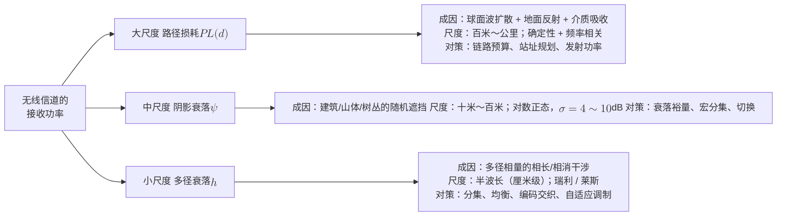
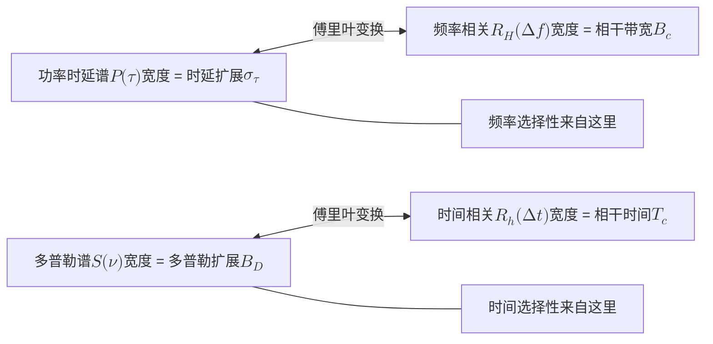
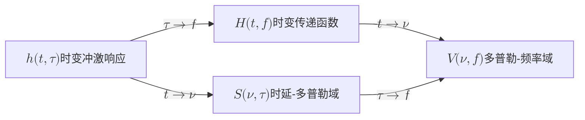

# 2 · 无线信道入门：路径损耗、阴影与衰落

[第 1 章](01-em-waves-antennas.md) 讲了波是怎么发出去的：振荡的电荷、辐射的场、天线的方向图。但发出去之后呢？在真实世界里，波不会乖乖沿着一条直线走到接收机。它撞上楼房，钻过树叶，在水泥地上反射，在楼角处绕射。最后有几十条副本几乎同时到达你的手机，各自带着不同的幅度、时延和相位。

**无线信道**就是对"发出去的波"到"收到的波"这个变换的数学描述。它是无线通信里最难、也最有趣的一环，因为只有它，我们**不能设计，只能测量与适应**。

本章的核心是一个分层的世界观：把信道的随机性拆成三层。

- **路径损耗**：大尺度、确定性，随距离变化。
- **阴影衰落**：中尺度、对数正态，随地形遮挡变化。
- **小尺度衰落**：波长尺度、瑞利/莱斯，随多径相位变化。

这三层各有各的物理成因、空间尺度和对抗手段。理解了它们，你就拿到了读懂本站四部前沿内容的第一把钥匙。

**你将学会：**

- 用一张图和一个乘法式说清信道三层分解，知道每一层在多大的空间尺度上变化、由什么物理机制造成；
- 从 Friis 公式出发推出自由空间路损的 dB 表达式，理解对数距离模型 $PL(d)=PL(d_{0})+10n\log_{10}(d/d_{0})$ 里 $n$ 的物理含义，会代 3GPP 公式算一条真实链路；
- 说清阴影为什么服从**对数正态**分布：从"遮挡损耗连乘"到"取对数变加法"，再到中心极限定理，并会用衰落裕量算覆盖率；
- 一步不跳地推出**瑞利分布**：多径相量和 → 实虚部独立高斯 → 极坐标变换 → 包络 pdf；再加上视距分量得到**莱斯分布**与 $K$ 因子；
- 推导多普勒频移 $f_{d}=v\cos\theta/\lambda$，并从"散射角均匀分布"直接算出 **Jakes 谱**那条浴缸形曲线；
- 把信道的四个特征量两两配对讲透：**时延扩展 ↔ 相干带宽**、**多普勒扩展 ↔ 相干时间**，并用积分推出它们互为倒数的量级关系；
- 用**四象限分类**（平坦/频选 × 快/慢）判断任何一个场景，并在 LTE/5G 真实参数下走一遍判据；
- 写出时变冲激响应 $h(t,\tau)$ 与时变传递函数 $H(t,f)$，理解它们和抽头延迟线模型、OFDM 的关系。

---

## 2.1 三层分解：一条链路上的三种"变暗" {#21-三层分解一条链路上的三种变暗}

### 2.1.1 走夜路的类比 {#走夜路的类比}

设想你晚上沿着一条街走远，回头看路灯。你会观察到三种亮度变化，它们的"节奏"完全不同：

1. **越走越暗**：这是距离造成的，平滑、单调、可预测。走 200 米和走 400 米的差别是确定的。
2. **遮挡**：走到大楼背后，亮度突然暗一截，转过街角又亮回来。这是遮挡造成的，变化的尺度是"几十米"，取决于建筑物有多大。
3. **干涉**：如果光是相干的（比如激光），你还会看到明暗斑纹，走几厘米就从亮点掉进暗点。这是干涉造成的，尺度是波长量级。

无线信道和这个类比一模一样，只是第三种在射频波段无处不在，因为无线电波天然相干。这三种变化就是**路径损耗**、**阴影衰落**、**小尺度衰落**。

### 2.1.2 数学分解：为什么 dB 域是加法 {#数学分解为什么-db-域是加法}

设发射功率 $P_{t}$，接收功率 $P_{r}$。三层效应在**线性功率域**是相乘的：

$$
P_{r}(d) = P_{t} \cdot \underbrace{G(d)}_{\text{路径损耗}} \cdot \underbrace{\Psi}_{\text{阴影}} \cdot \underbrace{|h|^{2}}_{\text{小尺度}}
$$

其中 $G(d) \propto d^{-n}$ 是距离相关的平均增益。$\Psi$ 是中位数为 1（dB 域均值为 0）的随机遮挡因子。$h$ 是归一化复衰落系数（$\mathbb{E}[|h|^{2}]=1$）。取 $10\log_{10}(\cdot)$ 之后，乘法变加法：

$$
P_{r}[\text{dBm}] = P_{t}[\text{dBm}] - PL(d)[\text{dB}] + \psi[\text{dB}] + 10\log_{10}|h|^{2}
$$

**物理意义**

这个式子是整个无线工程的记账格式，三笔账各记一项：

- $PL(d)$ 是"平均每公里要交多少路费"；
- $\psi$ 是"这个位置运气好不好"；
- $10\log_{10}|h|^{2}$ 是"这一瞬间波的干涉是相长还是相消"。

三笔账各自独立、各自建模、各自有对策，这就是分层的价值。

**行为分析**

三者的**时间和空间常数相差好几个数量级**。

- $PL$ 要走出几百米才有明显变化。
- $\psi$ 的相关距离是几十米，也就是一栋楼的尺度。
- $|h|^{2}$ 走半个波长（3.5 GHz 时约 4.3 cm）就可能从峰值掉到谷底。

所以当你以 60 km/h 移动时，小尺度衰落每 2.6 毫秒就换一副面孔，而路径损耗在 1 秒内几乎没变。

这个尺度分离既是建模上的便利，也是系统设计的依据：功率控制的环路速度、CSI 反馈的周期、切换的迟滞门限，全都是照着这三个尺度分别设计的。



| 层 | 空间尺度 | 时间尺度（60 km/h, 3.5 GHz） | 统计模型 | dB 域波动幅度 |
|---|---|---|---|---|
| 路径损耗 | $10^{2}\sim10^{4}$ m | 秒～分钟 | 确定性幂律 | 每十倍距离 $20\sim40$ dB |
| 阴影衰落 | $10\sim10^{2}$ m | 秒级 | 对数正态 $\mathcal{N}(0,\sigma^{2})$ | $\pm(4\sim10)$ dB（$1\sigma$） |
| 小尺度衰落 | $\lambda/2 \approx 4$ cm | 毫秒级 | 瑞利 / 莱斯 | 峰谷可差 $30$ dB 以上 |

!!! example "算例：把三层账一次算清"

    3.5 GHz 宏站，发射功率 $P_{t}=46$ dBm（40 W），用户在 $d=500$ m 处，无视距（NLOS），系统带宽 20 MHz，接收机噪声系数 7 dB。

    **第一层（路损）**：用 3GPP TR 38.901 的 UMa NLOS 公式（2.2 节会详细拆），$PL = 13.54 + 39.08\log_{10}(500) + 20\log_{10}(3.5) = 13.54 + 105.5 + 10.9 \approx 129.9$ dB。

    中值接收功率 $= 46 - 129.9 = -83.9$ dBm。

    **噪声底**：$N = -174 + 10\log_{10}(20\times10^{6}) + 7 = -174 + 73 + 7 = -94$ dBm。所以**中值 SNR** $\approx 10.1$ dB，看起来很舒服。

    **第二层（阴影）**：UMa NLOS 的 $\sigma_{\text{SF}} = 6$ dB。若这个用户运气不好，落在 $-1\sigma$ 处，接收功率降到 $-89.9$ dBm，SNR 掉到 $4.1$ dB。

    **第三层（小尺度）**：瑞利衰落下，约有 10% 的时间瞬时功率低于均值 10 dB。这一瞬间 SNR 变成 $-5.9$ dB，链路直接断。

    **结论**：中值 10 dB 的"健康"链路，在阴影加深衰落的叠加下，会有相当比例的时间不可用。所以链路预算里必须留**衰落裕量**，分集、HARQ、自适应调制也是刚需。

---

## 2.2 路径损耗：从 Friis 到 3GPP {#22-路径损耗从-friis-到-3gpp}

### 2.2.1 自由空间：功率被球面稀释 {#自由空间功率被球面稀释}

[第 1 章](01-em-waves-antennas.md) 已经给出 Friis 传输公式。这里从头再走一遍逻辑，因为它是所有路损模型的原型。

各向同性天线发射 $P_{t}$，功率均匀铺在半径 $d$ 的球面上，功率密度为 $S = P_{t}/(4\pi d^{2})$。接收天线以有效面积 $A_{e}$ 拦截，$A_{e}$ 与增益的关系是 $A_{e} = G_{r}\lambda^{2}/(4\pi)$。于是

$$
\begin{aligned}
P_{r} &= S \cdot A_{e} = \frac{P_{t}G_{t}}{4\pi d^{2}}\cdot\frac{G_{r}\lambda^{2}}{4\pi}\\[4pt]
&= P_{t}G_{t}G_{r}\left(\frac{\lambda}{4\pi d}\right)^{2}
\end{aligned}
$$

定义**自由空间路径损耗**（FSPL）为不含天线增益的那部分的倒数：

$$
\text{FSPL} = \left(\frac{4\pi d}{\lambda}\right)^{2} = \left(\frac{4\pi d f}{c}\right)^{2}
$$

取 dB，并把 $d$ 以米、$f$ 以 GHz 为单位代入（$20\log_{10}(4\pi\times10^{9}/3\times10^{8}) = 32.45$）：

$$
\text{FSPL}[\text{dB}] = 32.45 + 20\log_{10}\!\left(\frac{d}{1\,\text{m}}\right) + 20\log_{10}\!\left(\frac{f}{1\,\text{GHz}}\right)
$$

**物理意义**

两个 $20\log_{10}$ 说的是两件不同的事。

- 距离项来自球面面积 $\propto d^{2}$，是纯几何。功率没有损失，只是被摊薄了。
- 频率项不是因为高频"衰减更快"，自由空间不吸收任何能量。它来自我们把接收天线的**增益**固定住了：增益固定意味着有效面积 $A_{e}\propto\lambda^{2}$ 随频率变小，接收口径缩水，所以收得少。

这个区分很重要。如果保持接收**口径面积**不变（比如毫米波用同样物理尺寸的阵列），频率越高反而收得越多。这是毫米波与太赫兹大规模阵列的立论基础，也是 [第 5 章](05-mimo.md) 与 [第 9 章](09-new-landscape.md) 的伏笔。

**行为分析**

距离翻倍，FSPL 增加 $20\log_{10}2 = 6.02$ dB；距离十倍，增加 20 dB。

频率从 3.5 GHz 升到 28 GHz（8 倍），FSPL 增加 $20\log_{10}8 = 18.1$ dB。毫米波"覆盖差"的账，一大半就在这一项上，另一半来自穿透损耗与雨衰。

### 2.2.2 双径模型：为什么室外指数常常是 4 {#双径模型为什么室外指数常常是-4}

自由空间的 $n=2$ 在真实地面上几乎从不出现。最简单的修正是**双径（two-ray）地面反射模型**：接收信号是直射径与地面反射径之和。设发射/接收天线高 $h_{t}, h_{r}$，水平距离为 $d$。

**第一步：写出两条路径的长度。** 直射径长为

$$
\ell_{1}=\sqrt{d^{2}+(h_{t}-h_{r})^{2}}
$$

反射径可以看成从地面下方的"镜像天线"（高度 $-h_{t}$）直线射来，长为

$$
\ell_{2}=\sqrt{d^{2}+(h_{t}+h_{r})^{2}}
$$

**第二步：求行程差。** 当 $d \gg h_{t},h_{r}$ 时，用 $\sqrt{1+u}\approx1+u/2$（$u\ll1$）展开，得

$$
\ell_{1,2}\approx d+\frac{(h_{t}\mp h_{r})^{2}}{2d}
$$

两式相减，$h_{t}^{2}$、$h_{r}^{2}$ 抵消，只剩交叉项，于是两径的行程差近似为

$$
\Delta \approx \frac{2h_{t}h_{r}}{d}\quad\Longrightarrow\quad \Delta\phi = \frac{2\pi\Delta}{\lambda} = \frac{4\pi h_{t}h_{r}}{\lambda d}
$$

**第三步：写出接收功率。** 地面在掠入射时反射系数近似 $-1$。又因 $\ell_{1}\approx\ell_{2}$，两径幅度几乎相等。所以接收功率近似等于自由空间功率乘以 $|1 - e^{-j\Delta\phi}|^{2}$，而 $|1-e^{-jx}|=2|\sin(x/2)|$。

**第四步：确定近似成立的范围。** "$d$ 很大"的尺度由**临界距离** $d_{c}=4h_{t}h_{r}/\lambda$ 给出，$d=d_{c}$ 时 $\Delta\phi=\pi$。当 $d\ge\pi d_{c}$，即 $\Delta\phi\le1$ 时，下面的近似误差不到 0.4 dB。例如 $h_{t}=20$ m、$h_{r}=1.5$ m、900 MHz 时 $d_{c}=360$ m。频率越高，$d_{c}$ 越远。

在这一区间里用 $\sin(x/2)\approx x/2$，即 $|1-e^{-jx}| \approx |x|$，得到：

$$
\begin{aligned}
P_{r} &\approx P_{t}G_{t}G_{r}\left(\frac{\lambda}{4\pi d}\right)^{2}\cdot\left(\frac{4\pi h_{t}h_{r}}{\lambda d}\right)^{2}\\[4pt]
&= P_{t}G_{t}G_{r}\,\frac{h_{t}^{2}h_{r}^{2}}{d^{4}}
\end{aligned}
$$

**物理意义**

直射与反射两径几乎等长、相位几乎相反，于是**互相抵消**。距离越远抵消得越彻底，功率按 $d^{-4}$ 衰减，而不是 $d^{-2}$。

注意结果里**波长消失了**：远场双径区的路损与频率无关。这个结论漂亮，也反直觉。

**行为分析**

$n=4$ 时距离翻倍要付 12 dB，覆盖半径对功率极不敏感：发射功率翻 16 倍（12 dB）才把半径翻倍。这解释了为什么蜂窝网扩容靠"加站"，而不是"加功率"。

同时 $h_{t}^{2}$ 说明**抬高天线**极其有效：铁塔从 20 m 加到 40 m，理论上多 6 dB。

### 2.2.3 对数距离模型：把所有环境装进一个 $n$ {#对数距离模型把所有环境装进一个-n}

工程上把上述所有机制打包成一个经验幂律。选一个参考距离 $d_{0}$（室外常取 100 m 或 1 km，室内取 1 m），

$$
PL(d)[\text{dB}] = PL(d_{0}) + 10\,n\log_{10}\!\left(\frac{d}{d_{0}}\right)
$$

**物理意义**

这是一条 dB-对数距离平面上的**直线**。截距 $PL(d_{0})$ 由频率和参考距离决定，通常直接取该处的 FSPL。斜率 $10n$ 由环境决定。

$n$ 叫**路径损耗指数**，是整个环境复杂性被压缩成的一个标量。它把绕射、反射、穿透、散射的全部后果，浓缩为"每十倍距离掉多少 dB"。

**行为分析**

$n$ 每增加 1，十倍距离就多掉 10 dB。下表给出典型值。

注意波导效应场景（走廊、街道峡谷）可以出现 $n<2$：能量被墙壁"关"在管道里，不向外扩散，衰减比自由空间还慢。

| 环境 | $n$ 典型值 | 阴影 $\sigma$ (dB) |
|---|---|---|
| 自由空间 / 卫星链路 | 2.0 | 0～2 |
| 城区街道峡谷（视距） | 1.6～2.2 | 3～5 |
| 室内走廊（波导效应） | 1.4～1.8 | 3～6 |
| 郊区宏蜂窝 | 2.7～3.5 | 6～8 |
| 城区宏蜂窝（非视距） | 3.5～4.5 | 6～10 |
| 建筑物内（有隔断） | 4～6 | 8～12 |

**经验模型**

把 $n$ 和截距做成频率、天线高度、城市类型的显式函数，就得到了 Okumura-Hata 一类模型。它源自 Okumura 等人 1968 年在东京的大规模实测，Hata 于 1980 年把曲线拟合成闭式公式，适用于 150–1500 MHz、基站高 30–200 m 的宏蜂窝，长期是蜂窝规划的行业标准。

它今天已被 3GPP 的场景化模型取代，但"把环境拟合进系数"这一方法论完全没变。

### 2.2.4 3GPP 模型：今天真正在用的公式 {#3gpp-模型今天真正在用的公式}

3GPP TR 38.901 为每个场景（UMa 城区宏站、UMi 城区微站、RMa 农村、InH 室内）分别给出 LOS 与 NLOS 两套公式。以 UMa 为例（$f_{c}$ 单位 GHz，$d_{3D}$ 单位 m，近距段）：

$$
PL_{\text{UMa-LOS}} = 28.0 + 22\log_{10}(d_{3D}) + 20\log_{10}(f_{c})
$$

$$
PL_{\text{UMa-NLOS}} = 13.54 + 39.08\log_{10}(d_{3D}) + 20\log_{10}(f_{c}) - 0.6\,(h_{UT} - 1.5)
$$

NLOS 这一式在 TR 38.901 里记作 $PL'_{\text{UMa-NLOS}}$。实际的 NLOS 路损取 $\max(PL_{\text{UMa-LOS}},\,PL'_{\text{UMa-NLOS}})$，保证遮挡只会让路损变大。本章两个算例的 500 m、200 m 下，NLOS 式本来就更大，两种写法结果相同。

**物理意义**

对照对数距离模型，可以读出这几项的含义：

- LOS 的 $n = 2.2$，略高于自由空间，因为有地面反射的部分抵消。
- NLOS 的 $n = 3.908$，接近双径预测的 4。
- $20\log_{10}(f_{c})$ 保留了 Friis 的频率依赖。
- 最后那个 $-0.6(h_{UT}-1.5)$ 是终端高度修正：站得高一点（比如在 10 楼），遮挡少、损耗低，每高 1 m 少 0.6 dB。

**行为分析**

这两套公式的差值就是"有没有视距"值多少钱。

!!! example "算例：LOS 与 NLOS 差了多少"

    $f_{c}=3.5$ GHz，$d_{3D}=200$ m，$h_{UT}=1.5$ m。

    $$
    PL_{\text{LOS}} = 28.0 + 22\times\log_{10}200 + 20\times\log_{10}3.5 = 28.0 + 22\times2.301 + 10.88 = 89.5\ \text{dB}
    $$

    $$
    PL_{\text{NLOS}} = 13.54 + 39.08\times2.301 + 10.88 - 0 = 13.54 + 89.92 + 10.88 = 114.3\ \text{dB}
    $$

    **差 24.8 dB**，相当于发射功率要放大 300 倍才能补回来。

    作为对照，同条件下的自由空间路损是 $32.45 + 20\times2.301 + 10.88 = 89.4$ dB，几乎与 UMa-LOS 重合。这是巧合，但说明视距城区确实接近自由空间。

    再看频率的代价：把 $f_{c}$ 换成 28 GHz，两式都增加 $20\log_{10}(28/3.5) = 18.1$ dB。NLOS 路损变成 132.4 dB。这就是毫米波必须靠密集组网 + 高增益波束（见 [第 5 章](05-mimo.md)）才能立足的原因。

!!! warning "别把模型当真理"

    这些公式是在特定城市、特定频段、特定天线高度下**拟合**出来的。它给的是**某个场景类别的统计平均**，不是你这条链路的真值。同一模型下不同城市可以差 10 dB 以上。

    [统计谱系](../part1/03-statistical-lineage.md) 一章要深挖的，就是这个观念：模型给的是分布，不是实例。

---

## 2.3 阴影衰落：为什么偏偏是对数正态 {#23-阴影衰落为什么偏偏是对数正态}

### 2.3.1 现象与直觉 {#现象与直觉}

站在同一半径的圆周上绕着基站走，路径损耗公式给出的预测值不变，但实测功率会上下起伏十几个 dB：这里被一栋楼挡住，那里是一片开阔广场，再走几十米又钻进树林。这种围绕路损中值、由环境遮挡造成的慢变随机起伏，就是**阴影衰落**（shadow fading / log-normal shadowing）。

它的空间尺度由**遮挡物的尺度**决定。一栋楼几十米宽，所以你要走出几十米，"被挡"这件事才会改变。

### 2.3.2 从连乘到高斯：完整推导 {#从连乘到高斯完整推导}

信号从发端到收端要穿过 $K$ 个独立的衰减环节（一堵墙、一排树、一个楼角绕射……），第 $i$ 个环节把功率乘上一个随机因子 $a_{i} > 0$。总的遮挡因子是

$$
\Psi = \prod_{i=1}^{K} a_{i}
$$

**第一步：取对数，把乘法变加法。**

$$
\psi \triangleq 10\log_{10}\Psi = \sum_{i=1}^{K} 10\log_{10} a_{i} \triangleq \sum_{i=1}^{K} \xi_{i}
$$

**第二步：用中心极限定理。** 各环节的物理成因彼此无关（这堵墙多厚，和那排树多密，没有关系），所以 $\xi_{i}$ 近似独立同分布。只要 $K$ 不太小、每项方差有限，和式就近似高斯：

$$
\psi \sim \mathcal{N}\!\left(\mu_{\text{dB}},\ \sigma_{\text{dB}}^{2}\right),\qquad \mu_{\text{dB}}=\sum_i \mathbb{E}[\xi_i],\quad \sigma_{\text{dB}}^{2}=\sum_i \mathrm{Var}[\xi_i]
$$

**第三步：回到线性域，看它长什么样。** 既然 $\psi$（dB 值）是高斯的，线性功率因子 $\Psi = 10^{\psi/10}$ 就服从**对数正态分布**。其 dB 域 pdf 就是均值 $\mu_{\text{dB}}$、方差 $\sigma_{\text{dB}}^{2}$ 的高斯：

$$
f_{\psi}(x) = \frac{1}{\sqrt{2\pi}\,\sigma_{\text{dB}}}\exp\left(-\frac{(x-\mu_{\text{dB}})^{2}}{2\sigma_{\text{dB}}^{2}}\right)
$$

回到线性域要做一次变量代换：$\psi=10\log_{10}\Psi$ 对 $\Psi$ 求导得 $\mathrm{d}\psi/\mathrm{d}\Psi=10/(\Psi\ln10)$，所以

$$
f_{\Psi}(y)=f_{\psi}\!\left(10\log_{10}y\right)\cdot\frac{10}{y\ln10},\qquad y>0
$$

指数里是 $(10\log_{10}y)^{2}$，而不是 $y^{2}$，衰减得比高斯慢得多，所以曲线向大 $y$ 拖出长尾（右偏）。

工程上还把平均遮挡损耗 $\mu_{\text{dB}}$ 并进路损截距 $PL(d_{0})$，所以 2.1 节的表和后面的算例都写 $\psi\sim\mathcal{N}(0,\sigma_{\text{dB}}^{2})$。这时 $\Psi$ 的**中位数**是 1，均值是 $\exp\!\big(\tfrac12(\sigma_{\text{dB}}\ln10/10)^{2}\big)$，$\sigma_{\text{dB}}=8$ dB 时约为 5.5。

**物理意义**

这个推导的关键动作是"取对数"。中心极限定理管的是**和**，而物理上的多重衰减是**积**。对数正好是把积翻译成和的桥。

所以"对数正态"来自"多个独立乘性效应"这一物理结构，不是拍脑袋选的漂亮分布。凡是多重乘性随机效应叠加的地方（粒子破碎的尺寸分布、收入分布、生物体重），都会冒出对数正态。

**行为分析**

$\sigma_{\text{dB}}$ 是在 **dB 域**度量的，所以它同时描述了"变好"和"变坏"的幅度。但在线性域，它是**不对称**的。

- $\sigma=8$ dB 意味着 $+1\sigma$ 时功率是中值的 6.3 倍，$-1\sigma$ 时只有中值的 0.16 倍。
- 这种不对称是很多"平均 SNR 很好但用户体验很差"现象的根源：线性域的均值被少数好点位拉高了。
- $\sigma$ 越大，说明环境越"参差"：密集城区 $8\sim10$ dB，开阔郊区 $4\sim6$ dB，纯视距近乎 $0$。

### 2.3.3 相关距离：阴影不是白噪声 {#相关距离阴影不是白噪声}

把阴影当成逐点独立的随机数是错的：挡住你的那栋楼，在你走出 5 米之后仍然挡着你。工程上用 **Gudmundson 指数相关模型**描述：

$$
R_{\psi}(\Delta d) = \mathbb{E}[\psi(x)\psi(x+\Delta d)] = \sigma_{\text{dB}}^{2}\,\exp\left(-\frac{\Delta d}{d_{\text{corr}}}\right)
$$

$d_{\text{corr}}$ 称为**去相关距离**（相关系数降到 $1/e \approx 0.37$ 的距离）：城区微蜂窝典型 $5\sim20$ m，宏蜂窝 $50\sim100$ m，农村可达数百米。

**物理意义**

$d_{\text{corr}}$ 反映的是"典型遮挡物的尺寸"。它说明阴影是一个**空间平滑的随机场**，而不是白噪声。

这是[信道制图学](../part1/07-channel-cartography.md)之所以可行的物理基础：如果阴影真是白的，测了这个点也预测不了旁边的点，任何"地图"都无从谈起。

**行为分析**

$d_{\text{corr}}$ 决定了两件工程大事。

- **切换迟滞**：如果迟滞窗口比 $d_{\text{corr}}$ 短，终端会跟着阴影起伏来回乒乓切换。
- **宏分集的收益**：两个基站到同一终端的阴影若高度相关（遮挡物在终端一侧），联合起来也救不了；若不相关（各自路径上的遮挡物不同），宏分集才有意义。3GPP 通常取小区间阴影相关系数 $0.5$ 左右。

!!! example "算例：衰落裕量与边缘覆盖率"

    设计目标：小区边缘 $95\%$ 的位置接收功率高于接收机灵敏度 $P_{\min}$。已知该场景 $\sigma_{\text{dB}} = 8$ dB。

    设中值接收功率为 $\bar{P}$，则位置覆盖概率为

    $$
    \Pr\left(\bar{P}+\psi > P_{\min}\right) = \Pr\left(\psi > P_{\min}-\bar{P}\right) = Q\!\left(\frac{P_{\min}-\bar{P}}{\sigma_{\text{dB}}}\right)
    $$

    要它等于 $0.95$。记 $a=(\bar{P}-P_{\min})/\sigma_{\text{dB}}$，即中值比门限高出几个 $\sigma$，上式就是 $Q(-a)$。由 $Q(-a)=1-Q(a)$（$Q$ 函数及这条对称性见 [第 3 章 3.4 节](03-digital-communications.md)），条件变成 $Q(a)=0.05$，查表得 $a=1.645$，即**衰落裕量** $M = 1.645\times 8 = 13.2$ dB。

    **代价有多大？** 13.2 dB 的裕量若靠缩小小区来换，就是要让边缘路损少 13.2 dB。由对数距离模型，半径从 $r$ 缩到 $r'$ 时路损减少 $10n\log_{10}(r/r')$ dB，令它等于 $M$ 得 $r'/r=10^{-M/(10n)}$。

    在 $n=3.5$ 的环境下，需要把半径缩到原来的 $10^{-13.2/35} = 0.42$ 倍。每站覆盖面积 $\propto r^{2}$，站数 $\propto 1/r^{2}$，所以**站数变成 5.7 倍**（$1/0.42^{2}$）。

    若把目标降到 $90\%$（$M=1.282\times8=10.3$ dB），半径是原来的 $0.51$ 倍，站数 3.9 倍。可见"最后几个百分点的覆盖率"贵得惊人，这也是运营商永远在覆盖率与资本开支之间拉锯的数学原因。

---

## 2.4 小尺度衰落：从多径相量和到瑞利分布 {#24-小尺度衰落从多径相量和到瑞利分布}

### 2.4.1 物理图像：几十个相量的加法 {#物理图像几十个相量的加法}

终端天线收到的是 $N$ 条经历了不同反射/绕射路径的副本。若这些路径的时延差远小于符号周期（**窄带**假设），它们在接收端**同时**到达，只是相位不同。第 $i$ 条径贡献 $a_{i}\cos(2\pi f_{c}t + \phi_{i})$，总和是

$$
s(t) = \sum_{i=1}^{N} a_{i}\cos\left(2\pi f_{c} t + \phi_{i}\right)
$$

关键是相位 $\phi_{i}$ 极其敏感。路径长度变化半个波长（3.5 GHz 时 4.3 cm），相位就翻转 $\pi$，相长干涉变成相消干涉。所以终端只要挪动几厘米，几十个相量的和就完全变了样。

### 2.4.2 复包络：把载波剥掉 {#复包络把载波剥掉}

用 $\cos(A+B)$ 展开并把载波提出来：

$$
\begin{aligned}
s(t) &= \sum_{i} a_{i}\left[\cos\phi_{i}\cos(2\pi f_{c}t) - \sin\phi_{i}\sin(2\pi f_{c}t)\right]\\[4pt]
&= \underbrace{\left(\sum_{i}a_{i}\cos\phi_{i}\right)}_{\triangleq\,X}\cos(2\pi f_{c}t) - \underbrace{\left(\sum_{i}a_{i}\sin\phi_{i}\right)}_{\triangleq\,Y}\sin(2\pi f_{c}t)
\end{aligned}
$$

整个多径信道对窄带信号的作用，浓缩成**一个复数** $h = X + jY$，称为**复包络**或衰落系数：

$$
s(t) = \mathrm{Re}\left\{h\, e^{j2\pi f_{c}t}\right\},\qquad h = X + jY = R e^{j\Theta}
$$

### 2.4.3 第一步：$X,Y$ 是零均值高斯且独立 {#第一步xy-是零均值高斯且独立}

对 $X = \sum_{i} a_{i}\cos\phi_{i}$ 用中心极限定理，需要三条假设：

- 散射体众多（$N$ 大）。
- 各径的 $a_i,\phi_i$ 独立。
- $\phi_{i}$ 在 $[0,2\pi)$ 上均匀分布。这是合理的：路径长度动辄几十米，是波长的几百上千倍，微小的几何差异就把相位搅匀了。

在这些假设下，均值与方差为：

$$
\mathbb{E}[X] = \sum_{i}\mathbb{E}[a_{i}]\,\mathbb{E}[\cos\phi_{i}] = 0,\qquad \mathbb{E}[Y] = 0
$$

$$
\mathbb{E}[X^{2}] = \sum_{i}\mathbb{E}[a_{i}^{2}]\,\mathbb{E}[\cos^{2}\phi_{i}] = \frac{1}{2}\sum_{i}\mathbb{E}[a_{i}^{2}] \triangleq \sigma^{2}
$$

**为什么交叉项为零。** 上面 $\mathbb{E}[X^{2}]$ 那一步省掉了交叉项。把 $X^{2}=\sum_{i}\sum_{k}a_{i}a_{k}\cos\phi_{i}\cos\phi_{k}$ 展开后，$i\ne k$ 的项因各径独立而等于 $\mathbb{E}[a_{i}\cos\phi_{i}]\,\mathbb{E}[a_{k}\cos\phi_{k}]=0$，只剩 $i=k$ 的平方项。

再用 $\cos^{2}\phi=\frac{1+\cos2\phi}{2}$ 和 $\mathbb{E}[\cos2\phi]=0$ 得 $\mathbb{E}[\cos^{2}\phi]=\frac12$。同理 $\mathbb{E}[Y^{2}]=\sigma^{2}$（$\mathbb{E}[\sin^{2}\phi]$ 也等于 $1/2$）。互相关同样只剩 $i=k$ 的项：

$$
\mathbb{E}[XY] = \sum_{i}\mathbb{E}[a_{i}^{2}]\,\mathbb{E}[\cos\phi_{i}\sin\phi_{i}] = \sum_{i}\mathbb{E}[a_{i}^{2}]\cdot\frac{1}{2}\mathbb{E}[\sin 2\phi_{i}] = 0
$$

**为什么不相关就能推出独立。** 由 CLT，$X,Y$ 各自趋于高斯。但"各自高斯且不相关"还推不出独立，需要的是**联合**高斯。对二维随机向量 $(a_{i}\cos\phi_{i},\,a_{i}\sin\phi_{i})$ 用多元中心极限定理，它们的和 $(X,Y)$ 趋于二维高斯。

这里协方差矩阵是对角的 $\sigma^{2}\mathbf{I}$，pdf 的指数里没有 $xy$ 交叉项，于是分解成两个一维 pdf 的乘积，即 $X,Y$ **独立**。于是 $h \sim \mathcal{CN}(0, 2\sigma^{2})$。

记号 $\mathcal{CN}(0,s^{2})$ 表示**循环对称复高斯**（circularly-symmetric complex Gaussian），它有三条性质：

- 实部、虚部独立，各为 $\mathcal{N}(0,s^{2}/2)$；
- $\mathbb{E}[|h|^{2}]=s^{2}$；
- 把 $h$ 乘上任意 $e^{j\alpha}$，分布不变。

联合 pdf 为

$$
f_{X,Y}(x,y) = \frac{1}{2\pi\sigma^{2}}\exp\left(-\frac{x^{2}+y^{2}}{2\sigma^{2}}\right)
$$

### 2.4.4 第二步：极坐标变换得到包络分布 {#第二步极坐标变换得到包络分布}

令 $x = r\cos\theta,\ y = r\sin\theta$，$r\ge0,\ \theta\in[0,2\pi)$。变换的雅可比行列式是

$$
\left|\frac{\partial(x,y)}{\partial(r,\theta)}\right| = \left|\det\begin{pmatrix}\cos\theta & -r\sin\theta\\ \sin\theta & r\cos\theta\end{pmatrix}\right| = r\cos^{2}\theta + r\sin^{2}\theta = r
$$

**为什么要乘这个 $r$。** 变量代换前后，同一小块区域里的概率必须相等，即 $f_{R,\Theta}\,\mathrm{d}r\,\mathrm{d}\theta = f_{X,Y}\,\mathrm{d}x\,\mathrm{d}y$。极坐标里 $\mathrm{d}r\times\mathrm{d}\theta$ 的小块在平面上是一段扇环，面积 $r\,\mathrm{d}r\,\mathrm{d}\theta$，离原点越远越大。雅可比行列式 $r$ 就是这个面积放大倍数。因此

$$
f_{R,\Theta}(r,\theta) = f_{X,Y}(r\cos\theta, r\sin\theta)\cdot r = \frac{r}{2\pi\sigma^{2}}\exp\left(-\frac{r^{2}}{2\sigma^{2}}\right)
$$

**第三步：对 $\theta$ 积分，求边缘分布。** 被积函数与 $\theta$ 无关，积分就是乘 $2\pi$：

$$
f_{R}(r) = \int_{0}^{2\pi} \frac{r}{2\pi\sigma^{2}}e^{-r^{2}/(2\sigma^{2})}\,\mathrm{d}\theta = \frac{r}{\sigma^{2}}\exp\left(-\frac{r^{2}}{2\sigma^{2}}\right),\quad r\ge0
$$

这就是**瑞利分布**。顺带得到 $f_{\Theta}(\theta)=1/(2\pi)$：相位均匀分布，且与幅度独立。独立的依据是联合 pdf 恰好写成 $f_{R,\Theta}(r,\theta)=f_{R}(r)\cdot\frac{1}{2\pi}$，一个只含 $r$ 的因子乘一个只含 $\theta$ 的因子。

**第四步：转成功率。** 令 $Z = R^{2}$（瞬时功率），由 $\mathrm{d}z = 2r\,\mathrm{d}r$：

$$
f_{Z}(z) = f_{R}(r)\left|\frac{\mathrm{d}r}{\mathrm{d}z}\right| = \frac{r}{\sigma^{2}}e^{-z/(2\sigma^{2})}\cdot\frac{1}{2r} = \frac{1}{2\sigma^{2}}e^{-z/(2\sigma^{2})}
$$

即瞬时功率服从**指数分布**，均值 $\bar{P} = 2\sigma^{2}$，CDF 为

$$
F_{Z}(z) = 1 - \exp\left(-\frac{z}{\bar{P}}\right)
$$

**物理意义**

瑞利分布说的是"当没有任何一条径占主导时，几十个随机相量的和有多大"。

$\mathbb{E}[R]=\sigma\sqrt{\pi/2}\approx1.253\sigma$，$\sqrt{\mathbb{E}[R^{2}]}=\sqrt2\,\sigma$，但 $f_{R}(0)=0$。恰好为零的概率密度是零，可幅度落在零附近的概率却不小。这就是**深衰落**的来源：所有相量凑巧几乎抵消。

**行为分析**

指数分布的形状极其"重尾向下"。当 $z \ll \bar{P}$ 时 $F_{Z}(z)\approx z/\bar{P}$，所以衰落深度每加深 10 dB，出现概率恰好降低 10 倍。

这条 $10\times$ 规律是分集阶数概念的直接来源：一重瑞利支路的中断概率 $\propto \mathrm{SNR}^{-1}$，$L$ 重独立分集后 $\propto \mathrm{SNR}^{-L}$，误码率曲线的斜率就是分集阶数（详见 [第 3 章](03-digital-communications.md) 与 [第 5 章](05-mimo.md)）。

!!! example "算例：深衰落到底有多常见"

    瑞利信道，平均接收功率 $\bar{P}$。求瞬时功率低于均值 $x$ dB 的概率：

    | 衰落深度 | $z/\bar{P}$ | $\Pr = 1-e^{-z/\bar{P}}$ |
    |---|---|---|
    | $-3$ dB | 0.501 | 39.4% |
    | $-10$ dB | 0.1 | 9.52% |
    | $-20$ dB | 0.01 | 0.995% |
    | $-30$ dB | 0.001 | 0.0999% |

    以 3.5 GHz、60 km/h 为例，$T_{c}\approx 2.2$ ms（2.5 节会算），一分钟内大约经历 $60/0.0022 \approx 2.7\times10^{4}$ 个独立衰落"面孔"。其中约 $0.995\%$ 会掉进 20 dB 深坑，即约 270 次。若每次深衰落持续几百微秒，那就是几十毫秒的累计中断。

    所以要用**交织 + 信道编码**：把连续的错误打散到不同码字，让每个码字只错几个比特，纠错码就能救回来。

### 2.4.5 有视距时：莱斯分布与 $K$ 因子 {#有视距时莱斯分布与-k-因子}

如果存在一条**主导径**（视距，或一面强反射墙），它的相位是确定的，不该被扔进 CLT。此时

$$
h = \underbrace{\nu e^{j\theta_{0}}}_{\text{确定分量}} + \underbrace{(X+jY)}_{\mathcal{CN}(0,2\sigma^{2})}
$$

包络 $R=|h|$ 服从**莱斯分布**：

$$
f_{R}(r) = \frac{r}{\sigma^{2}}\exp\left(-\frac{r^{2}+\nu^{2}}{2\sigma^{2}}\right) I_{0}\!\left(\frac{r\nu}{\sigma^{2}}\right),\qquad r\ge0
$$

其中 $I_{0}(\cdot)$ 是零阶第一类修正贝塞尔函数，定义为 $I_{0}(a)=\frac{1}{2\pi}\int_{0}^{2\pi}e^{a\cos\theta}\,\mathrm{d}\theta$。推导分三步。

**第一步：确定均值与方差。** $(\mathrm{Re}\,h,\mathrm{Im}\,h)$ 仍是方差各为 $\sigma^{2}$ 的独立高斯，只是均值移到了 $(\nu\cos\theta_{0},\nu\sin\theta_{0})$。

**第二步：化到极坐标。** 把 $x=r\cos\theta,\ y=r\sin\theta$ 代入联合 pdf 的指数 $-[(x-\nu\cos\theta_{0})^{2}+(y-\nu\sin\theta_{0})^{2}]/(2\sigma^{2})$ 并展开，得

$$
-\frac{r^{2}+\nu^{2}}{2\sigma^{2}}+\frac{r\nu}{\sigma^{2}}\cos(\theta-\theta_{0})
$$

**第三步：对 $\theta$ 积分。** 照瑞利那样乘 $r$、对 $\theta$ 积分，与 $\theta$ 无关的部分提出去，剩下

$$
\int_{0}^{2\pi}e^{(r\nu/\sigma^{2})\cos(\theta-\theta_{0})}\mathrm{d}\theta=2\pi I_{0}(r\nu/\sigma^{2})
$$

被积函数以 $2\pi$ 为周期，平移 $\theta_{0}$ 不改变积分。再乘上前面的 $\frac{r}{2\pi\sigma^{2}}$，就得到上式。

定义**莱斯 $K$ 因子**为确定分量功率与散射分量功率之比：

$$
K = \frac{\nu^{2}}{2\sigma^{2}},\qquad K[\text{dB}] = 10\log_{10}K
$$

总平均功率 $\bar{P} = \nu^{2}+2\sigma^{2}$，于是可以写成归一化形式：

$$
h = \sqrt{\frac{K}{K+1}}\,\bar{P}^{1/2}e^{j\theta_{0}} + \sqrt{\frac{1}{K+1}}\,\bar{P}^{1/2}\,g,\qquad g\sim\mathcal{CN}(0,1)
$$

**物理意义**

$K$ 是"信道有多确定"的一把尺子。$K$ 大意味着能量集中在一条可预测的径上，信道近乎确定；$K$ 小意味着能量弥散在大量随机散射里。

**行为分析**

两个极限都很有教益：

- $K\to0$：确定分量消失，$I_{0}(0)=1$，莱斯退化为**瑞利**。
- $K\to\infty$：散射分量可忽略，包络集中在 $\nu$ 附近，信道变成**无衰落的 AWGN 信道**。

中间地带的中断概率对 $K$ 极其敏感。$K$ 从 0 dB 升到 10 dB，同样的深衰落概率会下降两到三个数量级：低于均值 10 dB 的概率从 7.3% 降到 0.074%，低于 20 dB 的从 0.74% 降到约 $8\times10^{-6}$。

典型值如下：

- 城区 NLOS：$K\to 0$（纯瑞利）；
- 城区 LOS 微蜂窝：$K\approx 4\sim9$ dB；
- 室内视距：$K\approx 3\sim10$ dB；
- 毫米波定向波束对准后：可达 $10\sim15$ dB；
- 卫星链路：更高。

{ .chart loading=lazy }
{ .chart loading=lazy }

*怎么读这张图：三条曲线的平均功率都归一到 1。第一条 $K=0$ 是瑞利，峰在 $r\approx0.71$，而且 $r$ 接近 0 处仍有可观的概率，深衰落就来自这里；第二条 $K=1$（0 dB）峰右移、变窄；第三条 $K=10$（10 dB）已是以 $\nu\approx0.95$ 为中心的窄峰，接近无衰落的 AWGN。$K$ 越大，$r$ 贴近 0 的概率越小，这就是"中断概率对 $K$ 极其敏感"的图像。曲线按上面的莱斯密度计算，$K=0$ 时即瑞利。*

**补一句 Nakagami-$m$**

实测包络常常既不是瑞利也不是莱斯，于是有了带一个形状参数 $m$ 的 Nakagami-$m$ 分布。最方便的看法是看功率：Nakagami-$m$ 下 $Z=R^{2}$ 服从均值 $\bar{P}$、形状参数 $m$ 的 Gamma 分布，方差 $\bar{P}^{2}/m$，密度为

$$
f_{Z}(z)=\frac{m^{m}z^{m-1}}{\Gamma(m)\bar{P}^{m}}e^{-mz/\bar{P}}
$$

几个特例如下：

- $m=1$ 时它就是上面的指数分布，即退化为瑞利；
- $m\to\infty$ 时趋于无衰落；
- $m = (K+1)^{2}/(2K+1)$ 时可近似莱斯。

它的价值是**数学上更好积分**（容量、中断概率常有闭式解），代价是物理成因不如前两者清晰。这个"为了可解性牺牲物理性"的取舍，就是 [随机性的谎言](../part1/01-lie-of-randomness.md) 一章要审视的对象。

---

## 2.5 多普勒：信道为什么会随时间变 {#25-多普勒信道为什么会随时间变}

### 2.5.1 频移的推导 {#频移的推导}

设终端以速度 $v$ 运动，某条入射波的到达方向与运动方向夹角为 $\theta$。在时间 $\Delta t$ 内，终端沿运动方向走了 $v\Delta t$，该径的**传播路程缩短**了 $\Delta d = v\Delta t\cos\theta$。路程变化带来相位变化：

$$
\Delta\phi = \frac{2\pi\,\Delta d}{\lambda} = \frac{2\pi v\cos\theta}{\lambda}\,\Delta t
$$

频率就是相位的变化率除以 $2\pi$：

$$
f_{d} = \frac{1}{2\pi}\cdot\frac{\Delta\phi}{\Delta t} = \frac{v\cos\theta}{\lambda} = \frac{v f_{c}\cos\theta}{c}
$$

最大值（迎着波走）为**最大多普勒频率**：

$$
f_{m} = \frac{v}{\lambda} = \frac{v f_{c}}{c}
$$

**物理意义**

多普勒来自**你在空间衰落图案里穿行**，信道自己并没有变。2.4 节说过，空间上每半个波长就有一次明暗交替。你以速度 $v$ 穿过它，每秒钟就会穿过 $v/(\lambda/2)$ 个明暗周期，量级正是 $2f_{m}$。

这个"空间起伏被运动翻译成时间起伏"的观点，是理解相干时间的钥匙，也是 [空间结构](../part1/04-spatial-structure.md) 一章的出发点。

**行为分析**

$f_{m}$ 与载频、速度都成正比。

- 3.5 GHz（$\lambda = 8.57$ cm）下，步行 1 m/s 是 11.7 Hz，60 km/h 是 194 Hz，高铁 350 km/h 是 1134 Hz。
- 频段升到 28 GHz，同样速度下 $f_{m}$ 乘以 8。这就是毫米波高铁场景 CSI 几乎"一测就过期"的物理根源。

### 2.5.2 Jakes 谱：从散射角分布推出浴缸曲线 {#jakes-谱从散射角分布推出浴缸曲线}

多普勒频移不是一个数，而是一**片**：每条径有自己的 $\theta$，就有自己的 $f_{d}$。假设二维各向同性散射（波从水平各方向均匀到来，$\theta\sim\mathcal{U}[0,2\pi)$）且天线全向，我们来推它的功率谱。

**第一步：说清功率谱为什么能用概率密度来求。** 方向落在 $[\theta,\theta+\mathrm{d}\theta]$ 里的那份功率是 $\bar{P}\,p_{\Theta}(\theta)\,\mathrm{d}\theta$，它全部出现在频率 $f_{m}\cos\theta$ 上。

所以频率落在 $[f,f+\mathrm{d}f]$ 里的功率 $S(f)\,\mathrm{d}f$，就是 $\bar{P}$ 乘以"随机频率 $F=f_{m}\cos\Theta$ 落进这个小区间的概率"，即 $S(f)=\bar{P}\,p_{F}(f)$。

**第二步：套用随机变量变换公式。** 变换公式是

$$
p_{F}(f)=\sum_{k}p_{\Theta}(\theta_{k})/|\mathrm{d}f/\mathrm{d}\theta|_{\theta_{k}}
$$

其中 $\theta_{k}$ 取遍方程 $f_{m}\cos\theta=f$ 的所有解。对给定的 $f\in(-f_{m},f_{m})$ 有两个解 $\theta = \pm\arccos(f/f_{m})$，两处的 $|\mathrm{d}f/\mathrm{d}\theta|$ 相同：

$$
\left|\frac{\mathrm{d}f}{\mathrm{d}\theta}\right| = f_{m}|\sin\theta| = f_{m}\sqrt{1-\cos^{2}\theta} = f_{m}\sqrt{1-\left(\frac{f}{f_{m}}\right)^{2}}
$$

**第三步：代入，得到谱。**

$$
S(f) = \sum_{\text{两个解}} \frac{p_{\Theta}(\theta)}{|\mathrm{d}f/\mathrm{d}\theta|}\cdot\bar{P} = 2\cdot\frac{1/(2\pi)}{f_{m}\sqrt{1-(f/f_{m})^{2}}}\cdot\bar{P}
$$

$$
S(f) = \frac{\bar{P}}{\pi f_{m}\sqrt{1-\left(f/f_{m}\right)^{2}}},\qquad |f| < f_{m}
$$

这就是 **Jakes（Clarke）多普勒谱**，形如浴缸/马鞍：中间平坦，两端 $\pm f_{m}$ 处发散。这个发散是可积的软奇点：

$$
\int_{-f_{m}}^{f_{m}}S(f)\,\mathrm{d}f=\frac{\bar{P}}{\pi}\big[\arcsin(f/f_{m})\big]_{-f_{m}}^{f_{m}}=\bar{P}
$$

总功率有限，而且恰好守恒。

**物理意义**

为什么两端最强？因为 $\cos\theta$ 在 $\theta=0,\pi$ 附近**变化最慢**：正对着来和正背着来的一大片角度，都映射到几乎相同的频率上，能量在那里堆积。

而 $\theta=\pm\pi/2$（侧向来波）附近 $\cos\theta$ 变化最快，能量被摊薄到很宽的频率上，所以中间平。

{ .chart loading=lazy }
{ .chart loading=lazy }

*怎么读这张图：纵轴把 $S(f)$ 乘以 $\pi f_m/\bar P$，谱在中间 $f=0$ 处恰好等于 1，往两端单调上升，到 $\pm0.95f_m$ 已是 3.2，在 $\pm f_m$ 处发散（图只画到 $\pm0.95f_m$）。发散可积，总功率仍是 $\bar P$。两端最高，对应上面的物理解释：正对与正背着来的一大片角度都挤到了 $\pm f_m$ 附近。按上面的公式计算。*

**行为分析**

Jakes 谱的时域对应（自相关函数）可以直接算。

**第一步：写出相关函数。** 方向在 $\theta$ 附近的来波带着功率 $\bar{P}\,p_{\Theta}(\theta)\,\mathrm{d}\theta$，以 $e^{j2\pi f_{m}\cos\theta\,t}$ 旋转，各方向互不相关，所以

$$
R_{h}(\Delta t)=\mathbb{E}[h(t+\Delta t)h^{*}(t)]=\int_{0}^{2\pi}\bar{P}\,\frac{1}{2\pi}\,e^{j2\pi f_{m}\cos\theta\,\Delta t}\,\mathrm{d}\theta
$$

**第二步：认出贝塞尔函数。** 记 $x=2\pi f_{m}\Delta t$，积分 $\frac{1}{2\pi}\int_{0}^{2\pi}e^{jx\cos\theta}\mathrm{d}\theta$ 正是零阶贝塞尔函数的积分表示 $J_{0}(x)$。等价地，这就是对上面的 $S(f)$ 做逆傅里叶变换。结果是

$$
R_{h}(\Delta t) = \bar{P}\,J_{0}\!\left(2\pi f_{m}\Delta t\right)
$$

$J_{0}$ 是零阶贝塞尔函数，第一个零点在宗量 $2.405$ 处，即 $\Delta t = 0.383/f_{m}$。这告诉我们信道的"记忆长度"大约就是 $1/f_{m}$ 的量级。

各向同性只是一个方便的理想化。真实场景里散射并不均匀，尤其毫米波定向波束下，能量集中在少数方向，谱会退化成几根尖峰，而不是浴缸。这个偏差是 [第一部](../part1/03-statistical-lineage.md) 追问的重点之一。

### 2.5.3 相干时间 {#相干时间}

**相干时间** $T_{c}$ 定义为信道自相关降到某个门限（常取 0.5）所需的时间间隔。这个数取决于"谁的相关降到 0.5"。

- 看信道系数 $h$ 的相关：用 $J_{0}$ 的解，$J_{0}(x)=0.5$ 在 $x\approx1.52$，得 $T_{c}\approx 0.242/f_{m}$。
- 看功率 $|h|^{2}$ 的相关：要求相关系数降到 0.5。瑞利衰落下它恰好等于 $J_{0}^{2}$，由 $J_{0}^{2}(x)=0.5$ 得 $x\approx1.126$，$T_{c}\approx0.179/f_{m}$。

Rappaport 教材给的 $T_{c}\approx9/(16\pi f_{m})\approx0.179/f_{m}$ 与后一个数在数值上吻合（0.1790 对 0.1793）。不过教材原话只说"时间相关函数高于 0.5 的时长"，没有交代是哪个量的相关。把它读成功率相关 $J_{0}^{2}=0.5$ 的解，是本站的理解。

这个定义偏严，粗略的 $1/f_{m}$ 又偏松。工程上取两者的几何平均 $\sqrt{0.179}/f_{m}$ 作为折中，即

$$
T_{c} \approx \frac{0.423}{f_{m}} \qquad\text{（量级上就是 } T_{c}\sim\frac{1}{f_{m}}\text{）}
$$

同时定义**多普勒扩展** $B_{D}$ 为谱的宽度（Jakes 下 $B_{D} = 2f_{m}$）。二者的对偶关系是

$$
T_{c} \sim \frac{1}{B_{D}}
$$

!!! example "算例：从步行到高铁的相干时间"

    统一取 $f_{c}=3.5$ GHz（$\lambda = 8.57$ cm），$T_{c}=0.423/f_{m}$：

    | 场景 | $v$ | $f_{m}$ | $T_{c}$ | 一个 0.5 ms slot 内信道变了多少 |
    |---|---|---|---|---|
    | 静止/微动 | 0.1 m/s | 1.2 Hz | 360 ms | 完全不变 |
    | 步行 | 1.4 m/s | 16 Hz | 26 ms | 基本不变 |
    | 市区车速 60 km/h | 16.7 m/s | 195 Hz | 2.2 ms | 略变，可容忍 |
    | 高速 120 km/h | 33.3 m/s | 389 Hz | 1.09 ms | 半个 slot 就明显变 |
    | 高铁 350 km/h | 97.2 m/s | 1134 Hz | 0.37 ms | 一个 slot 内换了一副面孔 |

    **系统含义**：5G NR 在 30 kHz 子载波间隔下一个 slot 是 0.5 ms，从测到 CSI 到用上它至少要 $4\sim8$ 个 slot（$2\sim4$ ms）。对比表格：市区车速下 CSI 已经"半过期"，高铁下则完全失效。

    这就是**信道老化**（channel aging）问题，也是[第一部](../part1/08-dimension-and-prediction.md)讨论信道可预测性的动因：如果信道不是纯随机而有结构，"过期"的 CSI 就还有救。

!!! note "卫星是个特例：偏移不是扩展"

    LEO 卫星相对地面的速度约 7.5 km/s，在 S 频段（2 GHz）产生的多普勒可达数十 kHz 量级，比高铁大一两个数量级。但它主要是一个**确定性的频率偏移**（卫星轨道已知、可精确预报），不是随机扩展，因此可以在收发两端做**预补偿**。

    这提醒我们：$f_{m}$ 大不等于信道难，关键在于它**可不可预测**。

!!! note "两种慢：比信号慢，还是比信道慢"

    系统里每个可调的东西都有一个"调一次要多久"：超表面单元的相位、可移动天线的位置、波束方向、资源分配。它算快还是算慢，要看拿什么比。手边有两把尺子。

    - 第一把是信号本身的节奏：30 kHz 子载波间隔下，一个 OFDM 符号含循环前缀约 36 μs，100 MHz 带宽对应的采样间隔约 10 ns。
    - 第二把是信道变化的节奏，也就是上面算的相干时间：3.5 GHz 下步行约 26 ms，车速 60 km/h 约 2.2 ms。

    两把尺子之间隔着两到三个数量级，26 ms 是 36 μs 的七百多倍。

    一个调一次要几十微秒到几毫秒的器件，拿第一把尺子量是慢的，拿第二把量却是快的。它没法跟着符号一个一个地携带信息，却完全来得及在信道变化之前把信道改造好，然后在一个相干时间里保持不动。

    智能超表面（[第 9 章 9.3 节](09-new-landscape.md#93-ris-智能超表面可编程的反射镜)）就落在这个区间。单元本身可以用二极管快速切换，可整面表面要由控制器算出成百上千个相位、再经控制链路下发，一次重配置远慢于一个符号（具体快慢因实现而异）。何况在一个 OFDM 符号中间改变信道，会破坏子载波之间的正交性。

    所以在蜂窝系统里，它的本分是改造信道，不是直接调制数据。也有研究让超表面直接调制信号、当发射机用，那是另一条技术路线。

    可移动天线更慢。机械移动若想追上步行速度下的小尺度衰落，得在约 26 ms 里挪过半个波长（3.5 GHz 下 4.3 cm），滑台速度要 1.65 m/s 以上。所以它更适合跟踪比相干时间还慢的量，比如用户分布和大尺度遮挡（[第 10 章 10.1 节](10-new-phy-dof.md#101-可移动天线与流体天线让天线的位置成为变量)）。

    设计一个新旋钮之前，不妨先把它的速度放到这两把尺子上比一比：

    - 它要控制的量能在多长时间里保持有效；
    - 它能不能在这段时间里调完；
    - 调它所需的信息能不能及时拿到。

    这就是[八条线索](../guide/05-eight-threads.md#1-时间尺度这个旋钮该转多快)里时间尺度那一条。

---

## 2.6 四个特征量与两对傅里叶对偶 {#26-四个特征量与两对傅里叶对偶}

到这里我们已经见到了信道随机性的两个"轴"：**频率轴**上的选择性（不同频率经历不同衰落）与**时间轴**上的选择性（不同时刻经历不同衰落）。每个轴上都有一对互为倒数的量。

### 2.6.1 时延扩展：多径在时间上铺多宽 {#时延扩展多径在时间上铺多宽}

由于各径行程不同，同一个脉冲到达接收端会被"拖尾"成一段。**功率时延谱**（PDP）$P(\tau)$ 描述能量在时延上的分布。定义平均时延与**均方根时延扩展**：

$$
\bar{\tau} = \frac{\int_{0}^{\infty}\tau P(\tau)\,\mathrm{d}\tau}{\int_{0}^{\infty}P(\tau)\,\mathrm{d}\tau},\qquad
\overline{\tau^{2}} = \frac{\int_{0}^{\infty}\tau^{2}P(\tau)\,\mathrm{d}\tau}{\int_{0}^{\infty}P(\tau)\,\mathrm{d}\tau}
$$

$$
\sigma_{\tau} = \sqrt{\overline{\tau^{2}} - \bar{\tau}^{2}}
$$

**物理意义**

$\sigma_{\tau}$ 是 PDP 的标准差，衡量多径"拖尾"有多长。它可以直接换算成几何：$\sigma_{\tau}=1\ \mu$s 对应 300 m 的路程差。在城区，一条绕过两个街区的反射径比直射径多走 300 m 完全正常。

### 2.6.2 相干带宽：推出它与时延扩展互为倒数 {#相干带宽推出它与时延扩展互为倒数}

**相干带宽** $B_{c}$ 是"两个频率上的衰落还算相似"的最大间隔。它与 $\sigma_{\tau}$ 的关系是一个**傅里叶对**：频域相关函数就是 PDP 的傅里叶变换。理由只需两步。

**第一步：写出两个频率的相关。** 把信道写成离散多径 $H(f)=\sum_{l}c_{l}e^{-j2\pi f\tau_{l}}$（$c_{l}$ 是第 $l$ 径的复增益），两个频率的相关为

$$
\mathbb{E}[H(f+\Delta f)H^{*}(f)]=\sum_{l}\sum_{k}\mathbb{E}[c_{l}c_{k}^{*}]\,e^{-j2\pi(f+\Delta f)\tau_{l}}e^{j2\pi f\tau_{k}}
$$

**第二步：用"非相关散射"化简。** 假设不同时延的径互不相关（2.8 节 WSSUS 里的"非相关散射"），$l\ne k$ 的项全为零，剩下 $\sum_{l}\mathbb{E}[|c_{l}|^{2}]\,e^{-j2\pi\Delta f\tau_{l}}$。$f$ 消掉了，只依赖间隔 $\Delta f$，而 $\mathbb{E}[|c_{l}|^{2}]$ 按时延排开就是 PDP。把求和换成积分就是：

$$
R_{H}(\Delta f) = \int_{0}^{\infty} P(\tau)\,e^{-j2\pi\Delta f\,\tau}\,\mathrm{d}\tau
$$

取工程上最常用的**指数型 PDP**（归一化）$P(\tau) = \frac{1}{\sigma_{\tau}}e^{-\tau/\sigma_{\tau}}$，它的均值与标准差都等于 $\sigma_{\tau}$。代入积分：

$$
\begin{aligned}
R_{H}(\Delta f) &= \int_{0}^{\infty}\frac{1}{\sigma_{\tau}}e^{-\tau/\sigma_{\tau}}e^{-j2\pi\Delta f\tau}\,\mathrm{d}\tau\\[4pt]
&= \frac{1}{\sigma_{\tau}}\int_{0}^{\infty}e^{-\left(\frac{1}{\sigma_{\tau}}+j2\pi\Delta f\right)\tau}\,\mathrm{d}\tau\\[4pt]
&= \frac{1}{\sigma_{\tau}}\cdot\frac{1}{\frac{1}{\sigma_{\tau}}+j2\pi\Delta f}
= \frac{1}{1+j2\pi\Delta f\,\sigma_{\tau}}
\end{aligned}
$$

取模：

$$
\left|R_{H}(\Delta f)\right| = \frac{1}{\sqrt{1+\left(2\pi\Delta f\,\sigma_{\tau}\right)^{2}}}
$$

令相关系数等于 $0.5$：

$$
1+\left(2\pi B_{c}\sigma_{\tau}\right)^{2} = 4 \;\Longrightarrow\; 2\pi B_{c}\sigma_{\tau} = \sqrt{3} \;\Longrightarrow\; B_{c} = \frac{\sqrt{3}}{2\pi\sigma_{\tau}} \approx \frac{0.276}{\sigma_{\tau}}
$$

这与流传最广的工程经验式

$$
B_{c} \approx \frac{1}{5\sigma_{\tau}} = \frac{0.2}{\sigma_{\tau}}
$$

在同一量级。经验式更保守一点，因为真实 PDP 常比纯指数更"胖"。若要求相关度 $0.9$ 以上，经验式通常取 $B_{c}\approx 1/(50\sigma_{\tau})$。

**物理意义**

这条推导揭示的是**测不准原理式**的结构：时延域铺得越宽，频域相关得越窄，二者的乘积被常数卡住：$B_{c}\sigma_{\tau}\approx\text{const}$。这在无线之外同样成立，它就是傅里叶变换的时宽-带宽积在信道里的化身。

**行为分析**

这条式子直接决定了 OFDM 的设计，有两个条件：

- 子载波带宽 $\Delta f_{\text{SC}}$ 必须远小于 $B_{c}$，每个子载波上的信道才近似为一个复标量（平坦衰落）。
- 循环前缀长度 $T_{\text{CP}}$ 必须大于多径最大时延（约 $3\sim5$ 倍 $\sigma_{\tau}$），否则符号间干扰逃不掉。

两个条件夹出了子载波间隔的可行区间。

### 2.6.3 多普勒扩展 ↔ 相干时间 {#多普勒扩展--相干时间}

这是完全对偶的一对：多普勒谱 $S(f)$ 的宽度 $B_{D}$ 与时域相关函数 $R_{h}(\Delta t)$ 也是傅里叶对，因此

$$
T_{c}\,B_{D} \approx \text{const} \sim 1
$$

用 Jakes 谱验一下：$B_{D}=2f_{m}$，代入 $T_{c}=0.423/f_{m}$ 得 $T_{c}B_{D}=0.85$；按相关降到 0.5 的 $T_{c}=0.242/f_{m}$ 则是 $0.48$。常数随定义而变，但都是 1 的量级。

把四个量放在一张图里，两对傅里叶关系就一目了然：



| 域 | "扩展"量（谱宽） | "相干"量（相关宽度） | 关系 | 造成的选择性 |
|---|---|---|---|---|
| 时延 ↔ 频率 | 时延扩展 $\sigma_{\tau}$ | 相干带宽 $B_{c}$ | $B_{c}\approx 1/(5\sigma_{\tau})$ | 频率选择性（ISI） |
| 多普勒 ↔ 时间 | 多普勒扩展 $B_{D}=2f_{m}$ | 相干时间 $T_{c}$ | $T_{c}\approx 0.423/f_{m}$ | 时间选择性（CSI 老化） |

### 2.6.4 典型场景数值速查表 {#典型场景数值速查表}

| 场景 | 载频 | $\sigma_{\tau}$ | $B_{c}\approx 1/(5\sigma_\tau)$ | 典型速度 | $f_{m}$ | $T_{c}$ | 主导衰落类型 |
|---|---|---|---|---|---|---|---|
| 室内办公/家庭 | 5 GHz | 20～50 ns | 4～10 MHz | 1 m/s | 17 Hz | 25 ms | 莱斯（$K\approx5$ dB） |
| 室内大厅/工厂 | 3.5 GHz | 50～150 ns | 1.3～4 MHz | 1 m/s | 12 Hz | 36 ms | 瑞利～莱斯 |
| 城区微蜂窝 | 3.5 GHz | 0.2～0.8 μs | 250 kHz～1 MHz | 30 km/h | 97 Hz | 4.4 ms | 瑞利（NLOS） |
| 城区宏蜂窝 | 2 GHz | 0.5～3 μs | 67～400 kHz | 60 km/h | 111 Hz | 3.8 ms | 瑞利 |
| 郊区/农村宏站 | 900 MHz | 0.2～1 μs | 200 kHz～1 MHz | 100 km/h | 83 Hz | 5.1 ms | 瑞利～莱斯 |
| 高铁（专网） | 3.5 GHz | 0.1～0.4 μs | 0.5～2 MHz | 350 km/h | 1134 Hz | 0.37 ms | 莱斯（强 LOS） |
| 毫米波街区 | 28 GHz | 20～100 ns | 2～10 MHz | 3 km/h | 78 Hz | 5.4 ms | 莱斯（波束对准后） |
| LEO 卫星 | 2 GHz | < 50 ns | > 4 MHz | 7.5 km/s（相对） | 约 50 kHz（可预补偿） | — | 莱斯/AWGN |

**读表要点**

$\sigma_{\tau}$ 和 $f_{m}$ 是**两个独立的坐标**：

- 高铁的时延扩展很小（视距为主），但多普勒极大；
- 城区宏站的时延扩展大，多普勒中等；
- 室内两者都小。

四象限分类就是把这两个坐标交叉起来看。

---

## 2.7 四象限分类：判据与系统含义 {#27-四象限分类判据与系统含义}

### 2.7.1 两个独立的比较

现在把两条轴合起来。给定一个信号（符号周期 $T_{s}$、带宽 $B_{s}\approx1/T_{s}$）和一个信道（$\sigma_{\tau}, T_{c}$），有两个独立的比较。

**第一个比较（频率轴）：信号带宽 vs 相干带宽**

$$
B_{s} \ll B_{c}\ \ (\text{等价 } T_{s} \gg \sigma_{\tau}) \;\Longrightarrow\; \textbf{平坦衰落}
$$

$$
B_{s} \gtrsim B_{c}\ \ (\text{等价 } T_{s} \lesssim \sigma_{\tau}) \;\Longrightarrow\; \textbf{频率选择性衰落}
$$

**第二个比较（时间轴）：符号周期 vs 相干时间**

$$
T_{s} \ll T_{c}\ \ (\text{等价 } B_{s} \gg B_{D}) \;\Longrightarrow\; \textbf{慢衰落}
$$

$$
T_{s} \gtrsim T_{c}\ \ (\text{等价 } B_{s} \lesssim B_{D}) \;\Longrightarrow\; \textbf{快衰落}
$$

```mermaid
flowchart TB
    S["给定信号 $$T_s$$ / $$B_s$$<br/>与信道 $$\sigma_\tau$$ / $$T_c$$"] --> Q1{"$$T_s$$ 与 $$\sigma_\tau$$ 比较"}
    Q1 -- "$$T_s \gg \sigma_\tau$$<br/>（$$B_s \ll B_c$$）" --> F["平坦衰落<br/>信道 = 一个复标量"]
    Q1 -- "$$T_s \le \sigma_\tau$$<br/>（$$B_s \ge B_c$$）" --> SEL["频率选择性<br/>出现 ISI，需均衡/OFDM"]
    F --> Q2{"$$T_s$$ 与 $$T_c$$ 比较"}
    SEL --> Q3{"$$T_s$$ 与 $$T_c$$ 比较"}
    Q2 -- "$$T_s \ll T_c$$" --> A["象限 I：平坦 + 慢<br/>最友好<br/>估一次用很久"]
    Q2 -- "$$T_s \ge T_c$$" --> B["象限 II：平坦 + 快<br/>无 ISI<br/>但 CSI 追不上"]
    Q3 -- "$$T_s \ll T_c$$" --> C["象限 III：频选 + 慢<br/>宽带主流<br/>OFDM + 均衡"]
    Q3 -- "$$T_s \ge T_c$$" --> D["象限 IV：频选 + 快<br/>最难<br/>高铁毫米波宽带"]
```

### 2.7.2 四个象限的难点与对策

| 象限 | 条件 | 典型场景 | 主要难点 | 主流对策 |
|---|---|---|---|---|
| I 平坦 + 慢 | $B_{s}\ll B_{c}$，$T_{s}\ll T_{c}$ | 窄带物联网（NB-IoT）静止终端、室内低速 | 深衰落时长时间卡死 | 分集、重传、跳频 |
| II 平坦 + 快 | $B_{s}\ll B_{c}$，$T_{s}\gtrsim T_{c}$ | 极低速率 + 高速运动（车载遥测、部分卫星） | 载波恢复困难、CSI 无从估计 | 差分/非相干调制、增大符号率 |
| III 频选 + 慢 | $B_{s}\gtrsim B_{c}$，$T_{s}\ll T_{c}$ | 绝大多数 4G/5G/Wi-Fi 场景 | ISI | **OFDM**、均衡、Rake 接收 |
| IV 频选 + 快 | $B_{s}\gtrsim B_{c}$，$T_{s}\gtrsim T_{c}$ | 高铁宽带、高动态毫米波、无人机 | ISI + ICI 双重打击 | 大子载波间隔、快速 CSI 追踪、OTFS 类时延-多普勒域方案 |

表中几个缩写的含义如下：

- **ICI**（子载波间干扰）：多普勒扩展把每个子载波的频谱抹宽约 $\pm f_{m}$，漏进相邻子载波，破坏 OFDM 的正交性（OFDM 正交性见 [第 3 章 3.7 节](03-digital-communications.md)）。
- **Rake 接收机**：单载波/CDMA 系统的多径合并器，给每条可分辨径分配一个"指"（finger），对齐时延后按 MRC 合并。
- **OTFS**（正交时频空间调制）：把数据符号直接放在 2.8 节的时延-多普勒平面上调制。

**关键洞察**

象限 IV 是唯一"没有便宜解法"的格子，因为两个对策互相打架：缓解 ISI 想要长符号（小子载波间隔），缓解多普勒想要短符号（大子载波间隔）。

5G NR 用**可变 numerology**（子载波间隔 $15\times2^{\mu}$ kHz，符号长度随之按 $2^{-\mu}$ 缩短，见第 3 章 3.7 节算例），承认了这个矛盾：让运营商按场景在 15/30/60/120 kHz 子载波间隔里选。

**注意这是相对判据**

同一条物理信道，对窄带信号是平坦的，对宽带信号就是频选的；对低速终端是慢衰落，对高速终端就是快衰落。

所以"这个信道是频率选择性的吗"是个不完整的问题，必须问"对哪个信号而言"。

### 2.7.3 算例与块衰落

!!! example "算例：LTE 与 5G NR 场景落在哪个象限"

    **场景 A：LTE，2 GHz，20 MHz 带宽，城区宏站，终端车速 60 km/h。**

    信道侧：$\sigma_{\tau} = 1\ \mu$s $\Rightarrow B_{c}\approx 1/(5\times10^{-6}) = 200$ kHz。$\lambda=0.15$ m，$f_{m}=16.7/0.15=111$ Hz $\Rightarrow T_{c}=0.423/111=3.8$ ms。

    - 信号侧（整体看）：$B_{s}=20$ MHz $\gg B_{c}=200$ kHz $\Rightarrow$ **强频率选择性**（信道在带内起伏约 $20/0.2=100$ 个"相干块"）。
    - 信号侧（单子载波看）：$\Delta f_{\text{SC}}=15$ kHz $\ll 200$ kHz $\Rightarrow$ **每个子载波是平坦的**。这就是 OFDM 的全部魔法：把一个频选信道切成 1200 个平坦子信道。
    - 时间侧：OFDM 符号 $T_{s}=66.7\ \mu$s（不含 CP）$\ll T_{c}=3.8$ ms $\Rightarrow$ **慢衰落**（一个 1 ms 子帧内信道近似不变）。

    **判定：象限 III（频选 + 慢）**，教科书式的 OFDM 主场。

    顺带检查 CP：LTE 普通 CP 为 $4.69\ \mu$s，覆盖 $4.69\ \mu\text{s}\times 3\times10^{8} = 1.4$ km 的路程差，对 $\sigma_{\tau}=1\ \mu$s 的城区足够（约 $4.7\sigma_{\tau}$）。

    **场景 B：5G NR，3.5 GHz，100 MHz，30 kHz 子载波间隔，高铁 350 km/h。**

    信道侧：$\sigma_{\tau}=0.3\ \mu$s $\Rightarrow B_{c}\approx 667$ kHz。$\lambda = 8.57$ cm，$f_{m}=97.2/0.0857 = 1134$ Hz $\Rightarrow T_{c}=0.373$ ms。

    - 信号侧：$\Delta f_{\text{SC}}=30$ kHz $\ll 667$ kHz $\Rightarrow$ 子载波仍平坦（整带 100 MHz 当然是强频选）。
    - 时间侧：OFDM 符号 $T_{s}\approx 33.3\ \mu$s $\ll T_{c}=373\ \mu$s，单符号内尚可视为不变。**但一个 slot（14 符号，0.5 ms）已经超过 $T_{c}$**，而从 CSI 参考信号到实际调度通常隔 $4$ 个 slot（2 ms）$\approx 5.4\,T_{c}$，**CSI 完全过期**。

    **判定：单符号看是象限 III，但从"调度环路"的时间尺度看已滑入象限 IV。**

    量化一下 ICI：归一化多普勒 $f_{m}/\Delta f_{\text{SC}} = 1134/30000 = 0.0378$，由此产生的子载波间干扰功率可按经典近似 $\tfrac{1}{3}\left(\pi f_{m}/\Delta f_{\text{SC}}\right)^{2}$ 估算，得 $\tfrac{1}{3}(0.1188)^{2} = 0.0047$，即 $-23.3$ dB。这直接给 SINR 压了一个约 23 dB 的天花板，64QAM 以上的高阶调制会明显吃力。

    若换成 15 kHz 子载波间隔，归一化多普勒翻倍、ICI 功率变四倍，恶化 6 dB 到 $-17.3$ dB，更不可用。这是高速场景必须用大子载波间隔的定量理由。

!!! note "块衰落：估一次，信一块，下一块再估"

    把相干时间和相干带宽乘起来，$\tau_c=T_cB_c$ 就是一个"相干块"里装得下的时频格子数：在这么多个格子上，信道近似是同一个复数。场景 A 里 $T_c=3.8$ ms、$B_c=200$ kHz，$\tau_c\approx760$；场景 B 里 $T_c=0.373$ ms、$B_c=667$ kHz，$\tau_c\approx250$。

    理论分析常用的**块衰落**（block fading）模型把这件事理想化：信道在一个块内不变，块与块之间独立地换一个值。一个码字只跨一个或很少几个块时，又叫**准静态**（quasi-static）衰落。

    实际系统按同一个节奏工作：在块里放导频，估出信道，在这个块里信任这个估计，拿它去检测和调度，到下一个块重新估。导频要占掉的比例大致是"要估的未知量个数除以 $\tau_c$"。这是[第 5 章算例 5-9](05-mimo.md#导频污染唯一不随-m-消失的损伤)"一个相干块能装几个用户"的出发点，也是[第一部第 1 章](../part1/01-lie-of-randomness.md#统计范式理性的选择与它的账单)算导频账单的方法。

    这个节奏背后有一条容易被忽略的因果准则：系统在运行时做的任何判断，**只能用当时观测得到的量来算**。"信道已经变了，该重估了"这句话本身就要求知道真实信道，系统手里却只有导频测量和译码结果。所以实际的触发条件都是可观测量：定时重估、译码失败（HARQ 的否定应答）、测得的参考信号功率越过门限。

    理论上用真实信道算出的最优更新时刻是设计期的标尺，可以用来评价方案，却不能直接拿来当运行时的触发器。讲信道知识地图怎样更新时（[第 11 章 11.5 节](11-new-network-frontiers.md#115-信道知识地图的工业形态数据已经在流动)），还会再遇到这条准则。

---

## 2.8 信道的统一表示：$h(t,\tau)$ 与 $H(t,f)$ {#28-信道的统一表示httau-与-htf}

### 2.8.1 时变冲激响应 {#时变冲激响应}

前面所有内容都可以收进一个对象：**时变冲激响应** $h(t,\tau)$，含义是"在 $t$ 时刻观测，一个 $\tau$ 秒前发出的冲激现在贡献多少"。输出是卷积：

$$
y(t) = \int_{0}^{\infty} h(t,\tau)\,x(t-\tau)\,\mathrm{d}\tau + n(t)
$$

两个变量各司其职：

- $\tau$ 是**时延**变量，管多径结构，频率选择性从这里来。
- $t$ 是**绝对时间**变量，管信道演化，时间选择性从这里来。

若信道不随时间变，$h(t,\tau)=h(\tau)$，退化为经典 LTI 卷积。

在多径解析的场景下写成**抽头延迟线**（tapped delay line）形式：

$$
h(t,\tau) = \sum_{l=1}^{L}\alpha_{l}(t)\,e^{j\theta_{l}(t)}\,\delta\!\left(\tau-\tau_{l}(t)\right)
$$

每一"抽头"对应一簇几乎同时到达的多径。3GPP 的信道模型（如 TDL-A/B/C、CDL 系列）给的就是这张表：每条抽头的相对时延、相对功率，以及（CDL 里还有）到达/离开角。

**物理意义**

抽头延迟线是"物理几何"与"数字信号处理"的接口：

- $\tau_{l}$ 来自几何（路程差 / 光速）；
- $\alpha_{l}$ 来自反射系数与扩散；
- $\theta_{l}(t)$ 随运动线性变化，这就是多普勒。

把它离散化到采样率 $1/T_{s}$ 上，就得到接收机里真正在跑的 FIR 滤波器系数。

**行为分析**

抽头数 $L \approx \lceil \tau_{\max}/T_{s}\rceil$。这里的 $T_{s}$ 是采样间隔，约为 $1/B$。2.7 节 LTE 算例里的 $T_{s}=66.7\ \mu$s 是整个 OFDM 符号的长度，是 20 MHz 下采样间隔（50 ns）的一千三百多倍，两者不要混。

带宽越大，采样越密，同样的物理多径会被**分辨**成更多抽头：

- 20 MHz 带宽的时延分辨率是 50 ns（15 m）；
- 100 MHz 是 10 ns（3 m）；
- 毫米波 400 MHz 是 2.5 ns（0.75 m）。

这是**分辨率随带宽提升**的直接体现。带宽越大，"看到"的多径结构越精细，信道从"一团随机数"变得越来越像"一张几何图"。这个转变是 [确定性复兴](../part1/05-deterministic-revival.md) 与 [ISAC](../part1/06-inverse-problem.md) 的物理前提。

### 2.8.2 时变传递函数与四个 Bello 函数 {#时变传递函数与四个-bello-函数}

对时延变量 $\tau$ 做傅里叶变换，得到**时变传递函数**：

$$
H(t,f) = \int_{0}^{\infty} h(t,\tau)\,e^{-j2\pi f\tau}\,\mathrm{d}\tau = \sum_{l=1}^{L}\alpha_{l}(t)e^{j\theta_{l}(t)}e^{-j2\pi f\tau_{l}(t)}
$$

**物理意义**

$H(t,f)$ 就是"此刻这个频率上的复增益"。OFDM 接收机对第 $k$ 个子载波做的均衡，就是除以 $H(t, f_{k})$ 这一个复数。

求和式里的 $e^{-j2\pi f\tau_{l}}$ 说明：不同抽头在频率轴上以不同"节拍"旋转，它们的干涉造就了传递函数的起伏。**频域的凹坑就是多径在频率上的拍频**，凹坑的平均间隔就是 $B_{c}$。

再对 $t$ 做傅里叶变换（变量 $\nu$ 为多普勒），得到**时延-多普勒扩展函数** $S_{h}(\tau,\nu)$。四个函数由两次傅里叶变换连成一个环：



四个函数描述同一个信道，区别只在两根轴各自选时域还是频域（Bello 1963）。$h(t,\tau)$ 与 $H(t,f)$ 上面已经讲过，另外两个是：

- $S_{h}(\tau,\nu)$，**时延-多普勒扩展函数**：输出是输入"先延迟 $\tau$、再频移 $\nu$"的各副本的加权和，$y(t)=\iint S_{h}(\tau,\nu)\,x(t-\tau)\,e^{j2\pi\nu t}\,\mathrm{d}\tau\,\mathrm{d}\nu$。一条径就是平面上的一个点。
- $V(\nu,f)$，**多普勒扩展函数**：输入中频率 $f$ 的分量被搬到 $f+\nu$ 的权重。

记号提醒：图中的 $S(\nu,\tau)$ 就是 $S_{h}(\tau,\nu)$，是信道的一次随机**实现**；下面的散射函数 $S(\tau,\nu)$ 不带下标，是它的**平均功率**。多普勒变量本节写 $\nu$，2.5 节写 $f$。

在 **WSSUS**（广义平稳非相关散射）假设下，上述函数的二阶统计浓缩成一个**散射函数** $S(\tau,\nu)$。这个假设有两层含义：

- **广义平稳**：信道的二阶统计在时间上平稳，相关函数 $\mathbb{E}[h(t+\Delta t,\tau)h^{*}(t,\tau)]$ 只依赖间隔 $\Delta t$，不依赖起点 $t$。
- **非相关散射**：不同时延的散射分量互不相关。

散射函数的两个边缘分布恰好是我们熟悉的老朋友：

$$
P(\tau) = \int S(\tau,\nu)\,\mathrm{d}\nu \quad(\text{功率时延谱}),\qquad
S(\nu) = \int S(\tau,\nu)\,\mathrm{d}\tau \quad(\text{多普勒谱})
$$

**行为分析**

WSSUS 是一个**极其方便但并不总成立**的假设。

- "广义平稳"要求统计量不随时间变，可终端一转过街角，整个散射环境就换了。平稳性只在几十个波长的窗口内近似成立。
- "非相关散射"要求不同时延的分量互不相关，可同一栋楼的墙面会同时贡献相邻的几个时延，它们显然相关。

近年 mmWave/太赫兹与超大孔径阵列的测量反复顶到这两条假设的边界，这是[第一部](../part1/03-statistical-lineage.md)要系统清算的账。

!!! success "关键结论：一句话串起全章"

    无线信道 $=$ 距离决定的**中值**（路损）$\times$ 遮挡决定的**慢起伏**（对数正态阴影）$\times$ 多径干涉决定的**快起伏**（瑞利/莱斯）。

    快起伏在**频率**上的相关宽度是 $B_{c}\approx1/(5\sigma_{\tau})$，在**时间**上的相关宽度是 $T_{c}\approx0.423/f_{m}$。把信号的 $B_{s},T_{s}$ 与这两个数一比，就落进四象限中的一格。这一格决定了你该用均衡还是 OFDM，该用相干还是差分，该多久反馈一次 CSI。

---

## 常见误解 {#常见误解}

!!! warning "初学者常踩的坑"

    1. **"路径损耗里的 $20\log_{10}f$ 说明高频信号在空气中衰减更快。"** 自由空间不吸收任何能量，频率项完全来自"接收天线增益固定 $\Longrightarrow$ 有效面积 $\propto\lambda^{2}$ 缩水"。若保持接收**口径面积**不变（大规模阵列就是这么干的），高频反而收得更多。真正让毫米波难做的是穿透损耗、绕射能力弱和降雨吸收，与 Friis 里的那一项无关。

    2. **"瑞利衰落 = 信号很弱。"** 瑞利描述的是**围绕平均值的波动形状**，和平均值本身无关。一个瑞利信道的平均功率可以很高。瑞利真正的坏消息是它的**下尾**：功率低于均值 $x$ dB 的概率约为 $10^{-x/10}$，中断由这条尾巴决定，而不由均值决定。这也是"平均 SNR 高但用户投诉多"的数学解释。

    3. **"信道是平坦的还是频选的，是信道自己的属性。"** 平坦还是频选，取决于**信道与信号的相对关系**。同一条 $B_{c}=200$ kHz 的信道，对 15 kHz 的 OFDM 子载波是平坦的，对 20 MHz 的单载波信号是强频选的。同理"快衰落/慢衰落"取决于你的符号周期。凡是判据里出现比较符号，就必须问清两边分别是谁。

    4. **"阴影衰落是随机的，所以逐点独立、可以当噪声处理。"** 阴影有明确的**空间相关结构**（去相关距离几十米），且与地形地物强相关：同一栋楼后面的所有位置一起变暗。把它当白噪声会低估切换乒乓、高估宏分集收益。它的可预测性正是信道制图与数字孪生的机会所在。

    5. **"多普勒频移只是个频偏，补偿掉就完了。"** 单条径确实如此（卫星就是这么处理的）。但多径场景下每条径有**各自不同**的 $\theta$，因而有**各自不同**的 $f_{d}$。你补掉了平均值，剩下的**扩展**无法用一个标量修正，它会变成子载波间干扰（ICI），并从根本上限制 CSI 的有效期。"频移可补、扩展难消"是两件事。

    6. **"3GPP 的路损公式是标准，所以是准确的。"** 标准化模型的作用是让不同厂商的仿真结果可比，它给的是**某类场景的统计代表**，不是任何一条具体链路的真值。同一公式在两个城市的实测残差常常超过 10 dB。把模型输出当真值，是很多"仿真涨点、外场翻车"的根源。

---

## 通往前沿 {#通往前沿}

本章教给你的是**教科书版本的信道**：一层确定性路损，加两层被"随机化"的起伏。但请注意我们一路上做了多少次同样的动作：用中心极限定理把几十条径抹成一个高斯，用对数正态把一整片城市的几何抹成一个 $\sigma$，用 WSSUS 把环境的演化抹成平稳统计。每一次"抹平"都换来了漂亮的闭式解，也扔掉了环境里的**结构**。

第一部的起点，就是追问这笔交易划不划算：

- [随机性的谎言](../part1/01-lie-of-randomness.md) 追问"信道真的是随机的吗，还是我们只是不知道它"。
- [统计谱系](../part1/03-statistical-lineage.md) 逐层解剖本章这些模型（瑞利、对数正态、Jakes、WSSUS）各自诞生于什么年代、什么测量条件，以及它们把环境的什么信息藏了起来。

当带宽和孔径都增大一个数量级后，被抹掉的结构重新变得可见，于是有了[确定性复兴](../part1/05-deterministic-revival.md)与[信道制图学](../part1/07-channel-cartography.md)。

在预备篇内部，本章的下游是：

- [第 3 章](03-digital-communications.md) 用瑞利分布算误码率与分集增益；
- [第 4 章](04-information-theory-basics.md) 用它算遍历容量与中断容量；
- [第 5 章](05-mimo.md) 把标量 $h$ 升级成矩阵 $\mathbf{H}$；
- [第 6 章](06-wireless-networks.md) 用路损与阴影做小区规划和干扰分析。

本章所在的线索：[时间尺度](../guide/05-eight-threads.md#1-时间尺度这个旋钮该转多快)、[采纳](../guide/05-eight-threads.md#6-采纳产业会不会接受)。在[八条线索](../guide/05-eight-threads.md)一页里，可以顺着这几条线读到四部的相关章节。

---

## 参考文献 {#参考文献}

1. D. Tse and P. Viswanath, *Fundamentals of Wireless Communication*. Cambridge, U.K.: Cambridge University Press, 2005.
2. A. Goldsmith, *Wireless Communications*. Cambridge, U.K.: Cambridge University Press, 2005.
3. A. F. Molisch, *Wireless Communications*, 2nd ed. Chichester, U.K.: Wiley-IEEE Press, 2011.
4. T. S. Rappaport, *Wireless Communications: Principles and Practice*, 2nd ed. Upper Saddle River, NJ: Prentice Hall, 2002.
5. J. G. Proakis and M. Salehi, *Digital Communications*, 5th ed. New York: McGraw-Hill, 2008.
6. R. H. Clarke, "A statistical theory of mobile-radio reception," *Bell System Technical Journal*, vol. 47, no. 6, pp. 957–1000, 1968.
7. W. C. Jakes, Ed., *Microwave Mobile Communications*. New York: Wiley, 1974.
8. P. A. Bello, "Characterization of randomly time-variant linear channels," *IEEE Transactions on Communications Systems*, vol. 11, no. 4, pp. 360–393, 1963.
9. Y. Okumura, E. Ohmori, T. Kawano, and K. Fukuda, "Field strength and its variability in VHF and UHF land-mobile radio service," *Review of the Electrical Communication Laboratory*, vol. 16, no. 9-10, pp. 825–873, 1968.
10. M. Hata, "Empirical formula for propagation loss in land mobile radio services," *IEEE Transactions on Vehicular Technology*, vol. 29, no. 3, pp. 317–325, 1980.
11. M. Gudmundson, "Correlation model for shadow fading in mobile radio systems," *Electronics Letters*, vol. 27, no. 23, pp. 2145–2146, 1991.
12. 3GPP, "Study on channel model for frequencies from 0.5 to 100 GHz," 3GPP TR 38.901.
