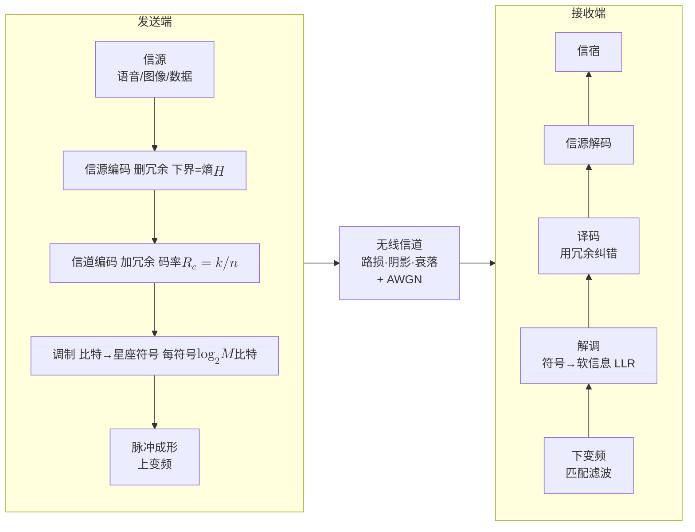
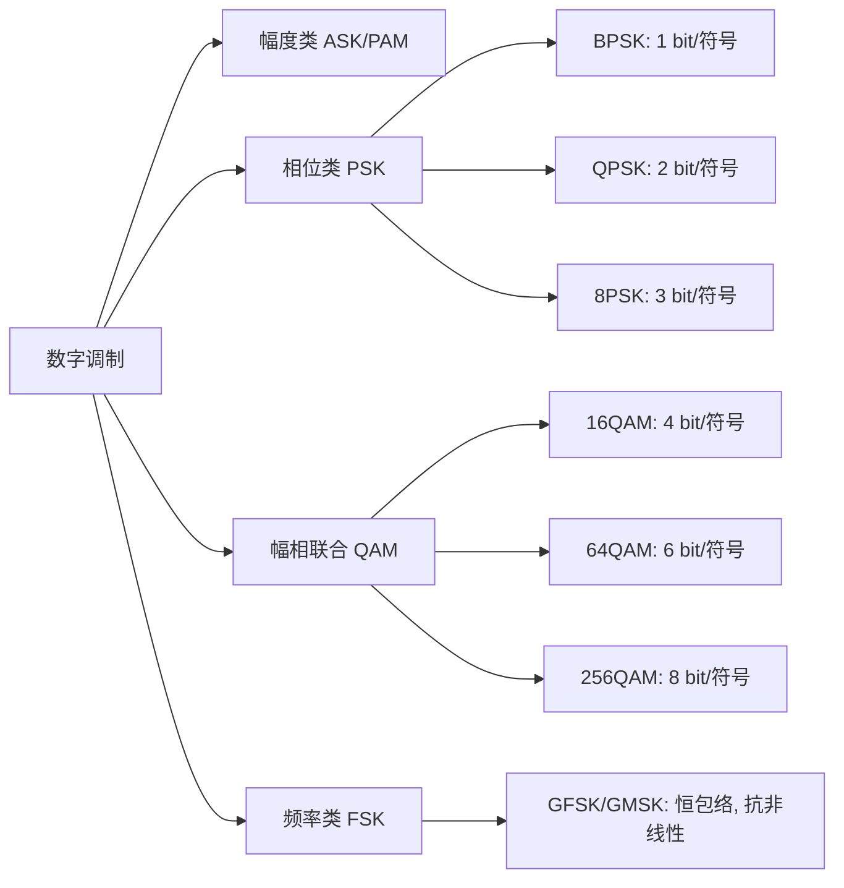
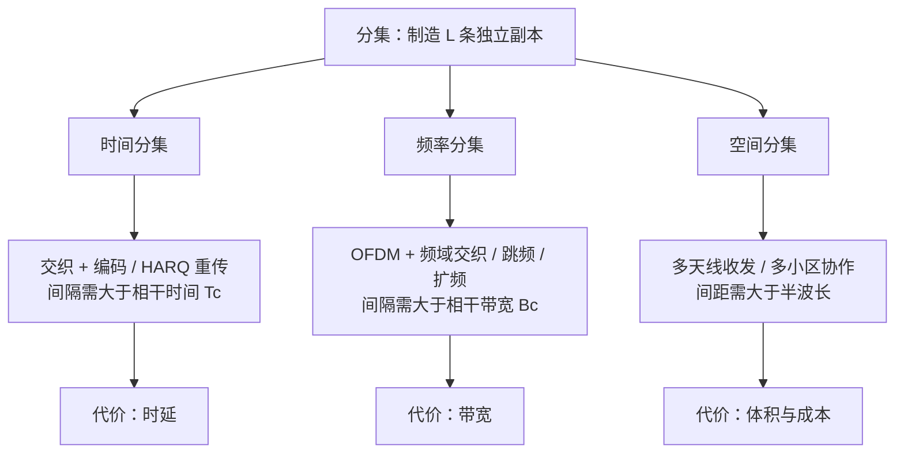

# 3 · 数字通信一页通：从比特到波形

[第 1 章](01-em-waves-antennas.md)讲了电磁波怎么被辐射出去，[第 2 章](02-wireless-channel-basics.md)讲了它在空中会遇到什么。本章接上最后一段：我们真正想送的是比特，可天线只会发波形。从一串 0/1 到一段射频信号，再从被噪声和衰落破坏过的接收信号里把这串 0/1 猜回来，这条链路上的每个环节，都是后面所有理论的共同底座。

本章的主线可以用一句话说完：在 AWGN 信道里，误码率随信噪比指数下降；一旦加上衰落，它就退化成反比关系。这个从指数到反比的退化，是无线通信里最重要的一个坏消息，也是分集、MIMO、OFDM、HARQ 这一整套技术存在的唯一理由。我们会把它一步不跳地推出来。

**你将学会：**

- 画出并解释数字通信系统的分层框图，说清每一层的输入输出与"量纲"；
- 读懂星座图，为 BPSK/QPSK/16QAM 写出符号集、能量归一化系数与判决域；
- 从柯西–施瓦茨不等式推出匹配滤波器，理解它为什么是最优的；
- 完整推导 BPSK 在 AWGN 下的 $P_b = Q\!\left(\sqrt{2E_b/N_0}\right)$，并对 $Q$ 函数建立数值直觉；
- 完整推导瑞利衰落下的平均误码率 $\bar{P}_b = \tfrac{1}{2}\bigl(1-\sqrt{\bar{\gamma}/(1+\bar{\gamma})}\bigr)\approx 1/(4\bar{\gamma})$，并解释"指数塌成反比"的物理根源；
- 说清分集阶数的定义、时间/频率/空间三种实现方式的代价，推导 MRC 的合并增益；
- 讲清 OFDM 为什么能把频选信道拆成一堆平坦信道，CP 到底在防什么，并用 5G numerology 算一遍参数；
- 独立完成一次链路预算：从发射功率一路算到接收 SNR，再判定能用几阶调制、能跑多少 Mbps。
- 说清 5G 为什么数据用 LDPC、控制用 Polar，码长有限时离容量还差多少，HARQ 的两种合并各能收回多少。

## 3.1 一张框图：比特是怎么变成波形又变回来的 {#31-一张框图比特是怎么变成波形又变回来的}

### 3.1.1 直觉：一次跨国快递 {#直觉一次跨国快递}

设想你要把一件易碎的瓷器寄到国外。合理的流程是：

- 先拆掉包装盒里的空气（同样的东西用更小的体积装，省运费），这是**信源编码**。
- 再裹上泡沫和气柱袋（故意增加体积，换来摔一下不碎），这是**信道编码**。
- 然后装上卡车（把包裹放到一个能在公路上跑的载体上），这是**调制**。
- 接着是路况（颠簸、雨水、丢件），这是**信道**。
- 到了对面卸货（把包裹从卡车上取下来），这是**解调**。
- 检查并修复破损（靠泡沫的冗余判断哪里出了问题），这是**译码**。
- 最后还原成原物，这是**信源解码**。

信源编码和信道编码的方向相反，却都必要：信源编码在**删冗余**，信道编码在**加冗余**。

这并不矛盾。前者删的是信源自身没用的冗余（相邻像素高度相关），后者加的是设计过的冗余（校验位放在最能救命的地方）。

香农的**信源–信道分离定理**保证，在足够长的码长下，这两件事分开做不损失最优性（详见[第 4 章](04-information-theory-basics.md)）。

### 3.1.2 每一层的"量纲" {#每一层的量纲}

教科书框图人人会画，真正有用的是记住每一层把什么单位变成了什么单位：

| 层 | 输入 | 输出 | 关键参数 | 理论极限 |
|---|---|---|---|---|
| 信源编码 | 信源符号 | 比特 | 压缩比 | 熵 $H$（bit/符号） |
| 信道编码 | $k$ 个信息比特 | $n$ 个编码比特 | 码率 $R_c=k/n\le 1$ | 容量 $C$ |
| 调制 | $\log_2 M$ 个比特 | 1 个复符号 | 阶数 $M$、符号率 $R_s$ | 星座最小距离 |
| 成形/上变频 | 复符号序列 | 射频波形 | 滚降因子 $\beta$ | 带宽 $B\approx(1+\beta)R_s$ |

表中的**滚降因子**（roll-off factor）$\beta\in[0,1]$ 描述脉冲成形滤波器（通常是根升余弦）比理论最小带宽多占多少。每秒 $R_s$ 个复符号在射频上至少要占 $R_s$ 赫兹（Nyquist 极限）。实际滤波器的边沿不可能无限陡，于是再多占 $\beta R_s$。

把它们串起来，就得到贯穿全章的**速率链**：

$$
R_b = R_s \cdot \log_2 M \cdot R_c \quad [\text{bit/s}], \qquad
\eta = \frac{R_b}{B} = \frac{\log_2 M \cdot R_c}{1+\beta} \quad [\text{bit/s/Hz}]
$$

**物理意义**

比特率是三个"齿轮"相乘：每秒发多少个符号（$R_s$，由带宽决定），每个符号扛多少比特（$\log_2 M$，由调制阶数决定），其中多少比例是真信息（$R_c$，由编码决定）。

频谱效率 $\eta$ 把带宽因素除掉，得到"每赫兹每秒能送几比特"，是全书最重要的量纲。

**行为分析**

想提速有且仅有三条路：

- 加带宽（$R_s\uparrow$），但频谱要花钱买；
- 加调制阶数（$M\uparrow$），但需要更高 SNR，见 3.4 节；
- 减少冗余（$R_c\uparrow$），但抗错能力下降。

三条路各有代价，所有链路自适应算法都在实时权衡这三者。

!!! example "算例：5G 一条 100 MHz 载波能跑多快"

    取 5G NR FR1 的典型配置：子载波间隔 30 kHz，100 MHz 带宽下有 273 个资源块（RB），每个 RB 有 12 个子载波，故占用子载波数

    $$
    N_{\text{sc}} = 273 \times 12 = 3276, \qquad B_{\text{occ}} = 3276 \times 30\ \text{kHz} = 98.28\ \text{MHz}
    $$

    每时隙 14 个 OFDM 符号、时隙长 0.5 ms，故每秒资源单元（RE）数为

    $$
    R_{\text{RE}} = 3276 \times 14 \times 2000 = 9.17\times 10^{7}\ \text{RE/s}
    $$

    扣掉约 14% 的导频与控制开销，剩 $7.9\times10^{7}$ RE/s。若用 256QAM（$\log_2 M = 8$）、码率 $R_c = 0.85$、4 层空间复用：

    $$
    R_b = 7.9\times10^{7} \times 8 \times 0.85 \times 4 \approx 2.15\times 10^{9}\ \text{bit/s} \approx 2.1\ \text{Gbps}
    $$

    这就是运营商宣传的"5G 峰值 2 Gbps"的来历。注意它同时要求 256QAM 可用（SNR 约 22 dB 以上）和 4 层稳定复用，是实验室条件，不是小区边缘的日常。

## 3.2 星座图：把比特画在平面上 {#32-星座图把比特画在平面上}

### 3.2.1 直觉：用"位置"编码信息 {#直觉用位置编码信息}

无线里真正能自由调整的东西只有三样：载波的**幅度**、**相位**、**频率**。把幅度和相位合成一个复数，就得到复基带表示：

$$
s(t) = \Re\left\{\tilde{s}(t)\, e^{j2\pi f_c t}\right\}, \qquad \tilde{s}(t) = \sum_{k} x_k\, g(t - kT_s)
$$

其中 $g(t)$ 是脉冲成形波形（通常是根升余弦），$x_k \in \mathcal{C}$ 是复符号，$\mathcal{C}$ 就是**星座**（constellation），即复平面上 $M$ 个约定好的点。发端把 $\log_2 M$ 个比特映射到某个点，收端在噪声污染后的平面上找"离得最近的点"。

为什么一个复数就能同时管幅度和相位？只看一个符号，记 $x_k=a+jb=Ae^{j\phi}$，则

$$
\Re\{x_k e^{j2\pi f_ct}\}=A\cos(2\pi f_ct+\phi)=a\cos(2\pi f_ct)-b\sin(2\pi f_ct)
$$

模 $A$ 是幅度，辐角 $\phi$ 是相位。实部 $a$ 调在 $\cos$ 上（I 路），虚部 $b$ 调在 $\sin$ 上（Q 路），后文 QPSK 的"I、Q 两路"就是这两项。

于是整个调制/解调问题变成了一个**几何问题**。星座点像撒在纸上的墨点，噪声像给每个点罩上的一团模糊光晕，只要光晕不重叠得太厉害，就能分辨。点之间的最小距离决定抗噪能力，点的个数决定信息量，这对矛盾贯穿全章。

### 3.2.2 三个必须讲透的星座 {#三个必须讲透的星座}

**BPSK（二相移键控）**。星座只有两个点，在实轴上：$\mathcal{C}=\{+\sqrt{E_s},\,-\sqrt{E_s}\}$，每符号 1 比特。判决域就是实轴的正负两半，判决门限在 0。这是最"抗打"的调制：两点相距 $2\sqrt{E_s}$，是同能量下所有二维星座里能拉开的最大距离。

**QPSK（四相移键控）**。四个点均匀分布在半径 $\sqrt{E_s}$ 的圆上，坐标为 $\sqrt{E_s/2}\,(\pm 1 \pm j)$，每符号 2 比特。它的妙处在于，I 路和 Q 路各自独立地承载一个 BPSK，互不干扰（因为 $\cos$ 与 $\sin$ 正交）。判决域是四个象限，看符号落在哪个象限就行：I、Q 两路各自与 0 比较，判决器实现极其简单。

**16QAM**。I、Q 各取 4 个电平 $\{\pm 1,\pm 3\}\cdot d$，组成 $4\times4=16$ 个点，每符号 4 比特。判决域是 16 个矩形格子（边缘的格子无界）。

### 3.2.3 能量归一化：为什么是 $1/\sqrt{10}$ {#能量归一化为什么是-1sqrt10}

不同星座必须在**同等平均功率**下比较才公平，所以要把平均符号能量归一到 1。以 16QAM 为例，设点坐标为 $(a+jb)d$，$a,b\in\{\pm1,\pm3\}$ 且等概。逐步算：

$$
\begin{aligned}
\mathbb{E}[a^2] &= \frac{1}{4}\left(1^2 + 1^2 + 3^2 + 3^2\right) = \frac{20}{4} = 5,\\
E_s &= d^2\left(\mathbb{E}[a^2] + \mathbb{E}[b^2]\right) = 10\,d^2,\\
E_s = 1 &\;\Longrightarrow\; d = \frac{1}{\sqrt{10}} \approx 0.3162,\\
d_{\min} &= 2d = \frac{2}{\sqrt{10}} \approx 0.632
\end{aligned}
$$

**物理意义**

$1/\sqrt{10}$ 这个眼熟的系数（3GPP 标准里 16QAM 映射表上就写着它）不是魔法数，只是"把平均能量拉回 1"的缩放。

同理 64QAM 是 $1/\sqrt{42}$，256QAM 是 $1/\sqrt{170}$。分母分别是 $\mathbb{E}[a^2]+\mathbb{E}[b^2]$ 在 $\{\pm1,\pm3,\pm5,\pm7\}$ 与 $\{\pm1,\dots,\pm15\}$ 上的取值 $42$ 与 $170$。

**行为分析**

把点数翻 4 倍（多 2 bit/符号），最小距离大约减半（16QAM 的 $0.632$ → 64QAM 的 $0.309$），而误码率对最小距离是**指数敏感**的。

这就预告了 3.4 节的结论：每多 2 bit/符号，大约要多花 4~5 dB 的信噪比。

!!! success "关键结论：星座的核心权衡"

    同等平均功率下，星座点越多 → 每符号比特数越多（频谱效率高）→ 最小距离越小（抗噪差）。所有链路自适应（AMC）做的就是：实时测 SNR，在这条权衡曲线上挑一个既跑得快又不出错的工作点。

下表汇总了几种常用调制的参数：

| 调制 | bit/符号 | 归一化系数 | $d_{\min}$（$E_s=1$） | BER $=10^{-5}$ 所需 $E_b/N_0$ |
|---|---|---|---|---|
| BPSK | 1 | 1 | 2.000 | 9.6 dB |
| QPSK | 2 | $1/\sqrt{2}$ | 1.414 | 9.6 dB |
| 16QAM | 4 | $1/\sqrt{10}$ | 0.632 | 13.4 dB |
| 64QAM | 6 | $1/\sqrt{42}$ | 0.309 | 17.8 dB |
| 256QAM | 8 | $1/\sqrt{170}$ | 0.153 | 22.5 dB |

!!! tip "直觉：QPSK 为什么"白送"一倍速率"

    表里最反直觉的一行是 QPSK 与 BPSK 所需的 $E_b/N_0$ **完全相同**，可 QPSK 的频谱效率是两倍。

    原因是 QPSK 的 I、Q 两路是两个**正交**的独立 BPSK：同样的每比特能量 $E_b$，各自独立判决，各自的误比特率就是 BPSK 的。所以从 BPSK 升到 QPSK 是"免费的午餐"，它只是把原来闲置的正交维度用起来了。从 QPSK 再往上，午餐才开始收费。

### 3.2.4 Gray 映射：一个便宜到不该不用的技巧 {#gray-映射一个便宜到不该不用的技巧}

星座点判错时，最可能错成**相邻**的点。若相邻点的比特标号只差 1 位（**Gray 映射**），一次符号错误就只造成 1 个比特错误。于是近似有

$$
P_b \approx \frac{P_s}{\log_2 M}
$$

**行为分析**

不用 Gray 映射，16QAM 一次符号错平均会带出 2 个多比特错，BER 直接差一倍以上。而 Gray 映射的实现成本几乎为零，只是查表顺序不同。所有实际系统都用它。

## 3.3 AWGN 与匹配滤波：噪声从哪来，怎么对付 {#33-awgn-与匹配滤波噪声从哪来怎么对付}

### 3.3.1 噪声模型 {#噪声模型}

接收机里的噪声主要来自**热噪声**（导体中载流子的热运动）。它在极宽的频带上功率谱密度平坦，故称**白**噪声；由中心极限定理，大量微观贡献叠加成**高斯**分布。这就是**加性高斯白噪声**（AWGN）：

$$
r(t) = s(t) + n(t), \qquad S_n(f) = \frac{N_0}{2}\ \ (\text{双边}), \qquad N_0 = k T_0 F
$$

其中 $k=1.38\times10^{-23}$ J/K 是玻尔兹曼常数，$T_0 = 290$ K 是参考温度，$F$ 是接收机噪声系数（线性值，它的 dB 值就是后文的 $NF=10\log_{10}F$）。

$kT_0=4.0\times10^{-21}$ W/Hz（即 $F=1$ 时的 $N_0$）。乘 $10^{3}$ 换算成 mW/Hz 再取 dB，就得到工程上最常用的一个数：

$$
10\log_{10}(kT_0 \times 10^{3}) = -173.98 \approx -174\ \text{dBm/Hz}
$$

**行为分析**

噪声总功率为 $N = -174 + 10\log_{10}B + NF$ (dBm)。

这里用的是 $N_0B$，而不是 $\frac{N_0}{2}B$，原因在于**双边**谱密度把功率同时记在正、负两侧频率上。占宽 $B$ 的带通信号连同它的负频率镜像共占 $2B$，噪声功率为 $\frac{N_0}{2}\times2B=N_0B$。

带宽每翻倍，噪声功率就 +3 dB。这是"带宽不是白拿的"的第一层含义：多要 3 dB 带宽，就多吃 3 dB 噪声。

### 3.3.2 匹配滤波：把信号从噪声里"捞"出来 {#匹配滤波把信号从噪声里捞出来}

**直觉**

你在嘈杂的车站等人，对方约好会喊一句特定的暗号。你的最优策略是在脑子里预存那句暗号，把听到的一切与它逐字比对：与暗号越像的成分被放大，与暗号无关的噪声在比对中互相抵消。这就是匹配滤波。

**严格推导**

设接收 $r(t)=s(t)+n(t)$，$t\in[0,T]$，$s(t)$ 已知、能量 $E_s=\int_0^T s^2(t)\,dt$。用任意线性滤波器 $g(t)$ 做加权积分取判决量：

$$
y = \int_0^T g(t)\, r(t)\, dt = \underbrace{\int_0^T g(t)s(t)\,dt}_{\text{信号}} + \underbrace{\int_0^T g(t)n(t)\,dt}_{\text{噪声}}
$$

逐步算噪声方差与输出信噪比：

$$
\begin{aligned}
\sigma^2 &= \mathbb{E}\left[\left(\int g(t)n(t)dt\right)^2\right] = \int\!\!\int g(t)g(u)\,\mathbb{E}[n(t)n(u)]\,dt\,du,\\
\mathbb{E}[n(t)n(u)] &= \frac{N_0}{2}\delta(t-u) \;\Longrightarrow\; \sigma^2 = \frac{N_0}{2}\int_0^T g^2(t)\,dt,\\
\text{SNR}_{\text{out}} &= \frac{\left(\int g s\,dt\right)^2}{\frac{N_0}{2}\int g^2 dt}
\;\overset{\text{Cauchy–Schwarz}}{\le}\;
\frac{\left(\int g^2 dt\right)\left(\int s^2 dt\right)}{\frac{N_0}{2}\int g^2 dt} = \frac{2E_s}{N_0}
\end{aligned}
$$

第二行用了白噪声的定义：不同时刻的噪声不相关，自相关只在 $t=u$ 处是冲激，对 $u$ 积分时 $\delta$ 把 $g(u)$ "筛"成 $g(t)$，二重积分塌成单重积分。

第三行的不等号是积分形式的**柯西–施瓦茨不等式** $\left(\int gs\,dt\right)^2\le\int g^2dt\int s^2dt$。它的证明很短：对任意实数 $\lambda$ 有 $\int(g-\lambda s)^2dt\ge0$，展开是 $\lambda$ 的二次式，恒非负要求判别式 $\le0$，这就是该不等式。

取等号当且仅当某个 $\lambda$ 使 $g=\lambda s$，即 $g(t) \propto s(t)$：滤波器的冲激响应"匹配"发送波形。

因果实现写成 $h(t)=s(T-t)$，在 $t=T$ 采样得

$$
\int h(T-\tau)r(\tau)\,d\tau=\int s(\tau)r(\tau)\,d\tau
$$

这恰好是与 $s$ 做相关。

**物理意义**

最优接收机做的事，就是与已知模板做相关。输出信噪比 $2E_s/N_0$ 只依赖信号能量，与波形形状无关。

这个结论有点出人意料：不管你把能量摊成一个长方波、一个窄脉冲还是一段扩频序列，只要总能量相同，匹配滤波后的信噪比就相同。扩频通信、脉冲压缩雷达能成立，根本原因就在这里。

**行为分析**

注意 $E_s = P\cdot T_s$，能量是功率乘时间。所以在功率受限时，**延长符号时间**能提高 $E_s$，代价是符号率下降。这个"能量 vs 速率"的兑换关系，就是后面 $E_b/N_0$ 与频谱效率两个坐标系的桥梁。

!!! example "算例：接收机里的噪声到底有多大"

    5G 终端接收机，带宽 $B = 100$ MHz，噪声系数 $NF = 7$ dB：

    $$
    N = -174 + 10\log_{10}(10^{8}) + 7 = -174 + 80 + 7 = -87\ \text{dBm}
    $$

    即 $2\times10^{-12}$ W（$2\times10^{-9}$ mW）。而典型的小区边缘接收功率约 $-100$ dBm，比噪声还低 13 dB。这不是笔误，要靠信道编码的处理增益和窄带才能把它救回来：每个用户只占几个 RB，带宽小则噪声小。

    若该用户只分到 4 个 RB（$4\times12\times30\ \text{kHz}=1.44$ MHz），噪声降为 $-174+61.6+7=-105.4$ dBm，SNR 就回到 $+5.4$ dB。覆盖受限时，调度器要做的正是这件事：分配更少的带宽，反而能连上。

## 3.4 BPSK 在 AWGN 下的误码率：一步不跳的推导 {#34-bpsk-在-awgn-下的误码率一步不跳的推导}

### 3.4.1 $Q$ 函数：先建立数值直觉 {#q-函数先建立数值直觉}

标准高斯尾概率定义为

$$
Q(x) \triangleq \Pr\{Z > x\} = \frac{1}{\sqrt{2\pi}}\int_x^{\infty} e^{-t^2/2}\, dt, \qquad Z\sim\mathcal{N}(0,1)
$$

它没有初等闭式，但有两条极好用的性质：$Q(-x)=1-Q(x)$、$Q(0)=1/2$。此外，大 $x$ 时有渐近式

$$
Q(x) \approx \frac{1}{x\sqrt{2\pi}}\, e^{-x^2/2}
$$

这个渐近式是本章后半段所有数量级估计的来源：$Q$ 的主导项是 $e^{-x^2/2}$，即关于 $x$ 的平方指数衰减。

下表给出几个典型取值：

| $x$ | 1 | 2 | 3 | 4 | 5 | 6 |
|---|---|---|---|---|---|---|
| $Q(x)$ | $1.59\times10^{-1}$ | $2.28\times10^{-2}$ | $1.35\times10^{-3}$ | $3.17\times10^{-5}$ | $2.87\times10^{-7}$ | $9.87\times10^{-10}$ |

记住 $Q(3)\approx 0.13\%$、$Q(4)\approx 3\times10^{-5}$、$Q(6)\approx 10^{-9}$ 这三个锚点，日常估算基本够用：$x$ 每加 1，$Q$ 大约掉 1~2 个数量级。

### 3.4.2 推导 {#推导}

**第 1 步：等效离散模型。** BPSK 发送 $s\in\{+\sqrt{E_b},-\sqrt{E_b}\}$（每符号 1 比特，故 $E_s=E_b$），经匹配滤波并归一化后，判决量为

$$
r = s + n, \qquad n\sim\mathcal{N}\!\left(0,\ \tfrac{N_0}{2}\right)
$$

噪声方差是 $N_0/2$，因为白噪声通过单位能量的匹配滤波器后，输出方差恰为双边谱密度值 $N_0/2$（3.3 节已算过）。

**第 2 步：最优判决。** 两符号等概时，错误概率最小的判决是**最大似然**（maximum likelihood, ML）判决：哪个符号让收到的 $r$ 的概率密度更大，就判哪个。高斯噪声方差为 $N_0/2$，两个似然之比为

$$
\frac{p(r\mid +)}{p(r\mid -)}=\frac{\exp\!\left(-(r-\sqrt{E_b})^2/N_0\right)}{\exp\!\left(-(r+\sqrt{E_b})^2/N_0\right)}=\exp\!\left(\frac{4\sqrt{E_b}\,r}{N_0}\right)
$$

它大于 1 当且仅当 $r>0$。所以 ML 判决就是最小距离判决，门限在 0：$r>0$ 判 $+$，$r<0$ 判 $-$。

**第 3 步：条件错误概率。** 设发的是 $+\sqrt{E_b}$，则错误事件是 $r<0$：

$$
\begin{aligned}
\Pr\left\{\text{error}\mid +\right\}
&= \Pr\left\{\sqrt{E_b} + n < 0\right\}
= \Pr\left\{n < -\sqrt{E_b}\right\}\\
&= \Pr\left\{\frac{n}{\sqrt{N_0/2}} < -\frac{\sqrt{E_b}}{\sqrt{N_0/2}}\right\}
= Q\!\left(\frac{\sqrt{E_b}}{\sqrt{N_0/2}}\right)
\end{aligned}
$$

第三个等号两边同除以噪声标准差 $\sqrt{N_0/2}$，把 $n$ 标准化成 $Z\sim\mathcal{N}(0,1)$。第四个等号用高斯密度关于 0 的对称性：$\Pr\{Z<-x\}=\Pr\{Z>x\}=Q(x)$。

**第 4 步：化简。**

$$
\frac{\sqrt{E_b}}{\sqrt{N_0/2}} = \sqrt{\frac{E_b}{N_0/2}} = \sqrt{\frac{2E_b}{N_0}}
$$

**第 5 步：对称性求平均。** 发 $-\sqrt{E_b}$ 时错误概率完全相同，故总误比特率

$$
\boxed{\ P_b = Q\!\left(\sqrt{\frac{2E_b}{N_0}}\right)\ }
$$

**物理意义**

$Q$ 的自变量是"半个星座间距除以噪声标准差"。这里星座间距 $d_{\min}=2\sqrt{E_b}$，一半是 $\sqrt{E_b}$，噪声标准差 $\sqrt{N_0/2}$，两者相比正是 $\sqrt{2E_b/N_0}$。

所有 AWGN 下的星座误码率公式都是这个模式：$P \sim Q\!\left(d_{\min}/(2\sigma)\right)$。最小距离与噪声标准差之比，是理解一切调制性能的钥匙。

**行为分析**

把渐近式代进去，$P_b \approx \frac{1}{\sqrt{4\pi E_b/N_0}}\exp\!\left(-E_b/N_0\right)$。误码率随 $E_b/N_0$（**线性值**，不是 dB）**指数下降**。

这意味着 SNR 每提高 1 dB，BER 会成倍地下降；在 $10^{-5}$ 附近，大约每 1 dB 掉一个数量级。工程上称之为**瀑布曲线**（waterfall）：SNR 略低于门限时基本不通，略高于门限时几乎全对，中间过渡带只有 2~3 dB。

下表是 BPSK 在 AWGN 下的典型取值：

| $E_b/N_0$ | 0 dB | 4 dB | 6 dB | 8 dB | 10 dB | 12 dB |
|---|---|---|---|---|---|---|
| BPSK BER（AWGN） | $7.9\times10^{-2}$ | $1.25\times10^{-2}$ | $2.4\times10^{-3}$ | $1.9\times10^{-4}$ | $3.9\times10^{-6}$ | $9.0\times10^{-9}$ |

!!! example "算例：6 dB 买回五个多数量级"

    读上表：$E_b/N_0$ 从 6 dB 涨到 12 dB（发射功率翻 4 倍），BER 从 $2.4\times10^{-3}$ 掉到 $9.0\times10^{-9}$，约 5.4 个数量级。反过来说，要把 BER 从 $10^{-3}$ 压到 $10^{-5}$，需要

    $$
    Q(x_1)=10^{-3}\Rightarrow x_1=3.09,\quad Q(x_2)=10^{-5}\Rightarrow x_2=4.265
    $$

    $$
    \frac{E_b}{N_0}\Big|_1 = \frac{x_1^2}{2} = 4.77\ (6.8\ \text{dB}), \qquad
    \frac{E_b}{N_0}\Big|_2 = \frac{x_2^2}{2} = 9.09\ (9.6\ \text{dB})
    $$

    只要 2.8 dB。在 AWGN 世界里，可靠性是一件很便宜的事。这个印象请务必记牢，因为下一节它会被彻底打碎。

### 3.4.3 推广到 QPSK 与 16QAM {#推广到-qpsk-与-16qam}

**QPSK**：I、Q 两路各是独立 BPSK，每路能量 $E_s/2$，每路载 1 比特故 $E_b=E_s/2$。复噪声 $\mathcal{CN}(0,N_0)$ 的实部、虚部各自方差 $N_0/2$，所以每一路看到的正是 BPSK 推导第 1 步的模型：幅度 $\sqrt{E_b}$、噪声方差 $N_0/2$。

一个符号判对要求两路都对，$P_s=1-(1-P_b)^2=2P_b-P_b^2\approx2P_b$。代入得

$$
P_b^{\text{QPSK}} = Q\!\left(\sqrt{\frac{2E_b}{N_0}}\right), \qquad P_s^{\text{QPSK}} \approx 2\,Q\!\left(\sqrt{\frac{2E_b}{N_0}}\right)
$$

**方形 $M$-QAM**（Gray 映射，近似式）：

$$
P_b \approx \frac{4}{\log_2 M}\left(1-\frac{1}{\sqrt{M}}\right) Q\!\left(\sqrt{\frac{3\log_2 M}{M-1}\cdot\frac{E_b}{N_0}}\right)
$$

这个式子可以分三步来看。

**第一步：写出平均能量。** 方形 $M$-QAM 是 I、Q 两路各一个 $\sqrt{M}$ 电平的 PAM，电平为 $\{\pm1,\pm3,\dots\}\cdot d$，平均能量 $E_s=\frac{2(M-1)}{3}d^2$（$M=16$ 时为 $10d^2$，与 3.2 节一致）。

**第二步：求 $Q$ 的自变量。** 每路噪声标准差 $\sigma=\sqrt{N_0/2}$，相邻电平的半间距是 $d$，所以 $Q$ 的自变量是

$$
d/\sigma=\sqrt{2d^2/N_0}=\sqrt{3E_s/((M-1)N_0)}
$$

再代 $E_s=E_b\log_2M$，就得到根号内的式子。

**第三步：数错误的方向。** 中间电平两侧都可能判错（$2Q$），两端电平只错一侧（$Q$），平均每路 $2(1-\frac{1}{\sqrt M})Q$。两路合计符号错误率约 $4(1-\frac{1}{\sqrt M})Q$，按 Gray 映射除以 $\log_2M$ 即为误比特率。

代入 $M=16$：系数 $\frac{4}{4}(1-\frac14)=0.75$，根号内 $\frac{3\times4}{15}=0.8$，故

$$
P_b^{16\text{QAM}} \approx 0.75\, Q\!\left(\sqrt{0.8\,\frac{E_b}{N_0}}\right)
$$

**行为分析**

与 BPSK 的 $Q(\sqrt{2E_b/N_0})$ 相比，根号内系数从 $2$ 降到 $0.8$，功率损失 $10\log_{10}(2/0.8) = 3.98$ dB。这就是上表里 16QAM 比 BPSK 多花约 3.8 dB 的来源：代价的物理载体，正是 3.2 节算出的最小距离缩水。

## 3.5 衰落：为什么误码率从指数塌成反比 {#35-衰落为什么误码率从指数塌成反比}

### 3.5.1 模型 {#模型}

[第 2 章](02-wireless-channel-basics.md)已经建立：在丰富散射、无直射径的环境里，复信道增益 $h$ 服从**复高斯**分布，其模 $|h|$ 服从**瑞利分布**，功率 $|h|^2$ 服从**指数分布**。设归一化 $\mathbb{E}[|h|^2]=1$，则瞬时接收信噪比

$$
\gamma = |h|^2 \frac{E_b}{N_0}, \qquad \bar{\gamma} = \frac{E_b}{N_0}, \qquad p(\gamma) = \frac{1}{\bar{\gamma}}\,e^{-\gamma/\bar{\gamma}},\ \gamma\ge 0
$$

假设接收端已知 $h$（相干检测），则在给定 $\gamma$ 时误码率仍是 AWGN 公式 $Q(\sqrt{2\gamma})$。平均误码率是对 $\gamma$ 的分布求期望：

$$
\bar{P}_b = \int_0^{\infty} Q\!\left(\sqrt{2\gamma}\right) \frac{1}{\bar{\gamma}}\,e^{-\gamma/\bar{\gamma}}\, d\gamma
$$

### 3.5.2 推导 {#推导_1}

**第 1 步：分部积分。** 为什么要分部积分？$Q$ 本身没有闭式，直接积不动，但它的导数是初等函数，分部积分正好把求导挪到 $Q$ 身上。

取 $u=Q(\sqrt{2\gamma})$，$dv=\frac{1}{\bar{\gamma}}e^{-\gamma/\bar{\gamma}}d\gamma$，则 $v=-e^{-\gamma/\bar{\gamma}}$（对它求导即可验证）。代入 $\int u\,dv=[uv]-\int v\,du$，$v$ 自带的负号把减号变成加号：

$$
\bar{P}_b = \Bigl[-Q(\sqrt{2\gamma})\,e^{-\gamma/\bar{\gamma}}\Bigr]_0^{\infty} + \int_0^{\infty} e^{-\gamma/\bar{\gamma}}\,\frac{d}{d\gamma}Q(\sqrt{2\gamma})\, d\gamma
$$

边界项：$\gamma\to\infty$ 时为 0；$\gamma=0$ 时为 $-Q(0)\cdot 1 = -\tfrac12$。故边界项贡献 $0-(-\tfrac12)=\tfrac12$。

**第 2 步：求导。** 用 $Q'(x) = -\frac{1}{\sqrt{2\pi}}e^{-x^2/2}$ 与链式法则（$x=\sqrt{2\gamma}$，$dx/d\gamma = 1/\sqrt{2\gamma}$）：

$$
\frac{d}{d\gamma}Q(\sqrt{2\gamma}) = -\frac{1}{\sqrt{2\pi}}e^{-\gamma}\cdot\frac{1}{\sqrt{2\gamma}} = -\frac{e^{-\gamma}}{2\sqrt{\pi\gamma}}
$$

**第 3 步：合并成 Gamma 积分。**

$$
\bar{P}_b = \frac{1}{2} - \frac{1}{2\sqrt{\pi}}\int_0^{\infty} \gamma^{-1/2}\,e^{-\gamma\left(1+\frac{1}{\bar{\gamma}}\right)}\, d\gamma
$$

**第 4 步：套公式** $\int_0^{\infty}\gamma^{-1/2}e^{-a\gamma}d\gamma = \Gamma(\tfrac12)/\sqrt{a} = \sqrt{\pi/a}$，其中 $a = 1+\frac{1}{\bar{\gamma}} = \frac{1+\bar{\gamma}}{\bar{\gamma}}$。

这个公式不必查表：令 $\gamma=t^2/a$，则 $\gamma^{-1/2}d\gamma=\frac{2}{\sqrt a}dt$，积分变成 $\frac{2}{\sqrt a}\int_0^\infty e^{-t^2}dt=\frac{2}{\sqrt a}\cdot\frac{\sqrt\pi}{2}$。最后一步是高斯积分 $\int_{-\infty}^{\infty}e^{-t^2}dt=\sqrt\pi$ 的一半。代回：

$$
\bar{P}_b = \frac{1}{2} - \frac{1}{2\sqrt{\pi}}\sqrt{\frac{\pi\,\bar{\gamma}}{1+\bar{\gamma}}}
= \boxed{\ \frac{1}{2}\left(1 - \sqrt{\frac{\bar{\gamma}}{1+\bar{\gamma}}}\right)\ }
$$

**第 5 步：高信噪比展开。** 令 $\varepsilon = 1/\bar{\gamma}\ll 1$。根号里分子分母同除以 $\bar{\gamma}$，$\frac{\bar{\gamma}}{1+\bar{\gamma}}=\frac{1}{1+\varepsilon}$；再用 Taylor 展开 $(1+\varepsilon)^{-1/2}\approx 1-\tfrac{\varepsilon}{2}+\tfrac{3\varepsilon^2}{8}$，只保留到一次项：

$$
\sqrt{\frac{\bar{\gamma}}{1+\bar{\gamma}}} = (1+\varepsilon)^{-1/2} \approx 1 - \frac{1}{2\bar{\gamma}}
\;\Longrightarrow\;
\bar{P}_b \approx \frac{1}{2}\cdot\frac{1}{2\bar{\gamma}} = \boxed{\ \frac{1}{4\bar{\gamma}}\ }
$$

### 3.5.3 解读：一个指数被一个概率吃掉了 {#解读一个指数被一个概率吃掉了}

**物理意义**

在 AWGN 下 $P_b\sim e^{-E_b/N_0}$；在瑞利衰落下 $\bar{P}_b\sim 1/(4\bar{\gamma})$，从指数塌成了反比。塌缩的机制可以一句话说清：平均误码率不由"平均情况"决定。决定它的，是"最坏情况出现的概率"。

具体地，出错主要发生在信道处于**深衰落**的那些时刻。设"深衰落"定义为 $\gamma < \gamma_0$（$\gamma_0$ 是让 AWGN 误码率不可忽略的门限），则

$$
\Pr\{\gamma<\gamma_0\} = 1 - e^{-\gamma_0/\bar{\gamma}} \approx \frac{\gamma_0}{\bar{\gamma}} \quad (\bar{\gamma}\gg\gamma_0)
$$

这是一个关于 $\bar{\gamma}$ 的一次反比。而在非深衰落的时刻，误码率被 $e^{-\gamma}$ 压得可以忽略。于是总的平均误码率 $\approx$ 深衰落概率 $\times\, O(1) \sim 1/\bar{\gamma}$。

指数的好处只在"信道正常"时兑现。它兑现得再好，也抵不过"信道偶尔深衰落"这个一次反比项。

这个粗略论证连常数 $\tfrac14$ 也能算出来。$\bar{\gamma}$ 很大时，$Q(\sqrt{2\gamma})$ 只在 $\gamma$ 不超过几的范围内不可忽略，而在那里 $e^{-\gamma/\bar{\gamma}}\approx1$，密度近似平坦，$p(\gamma)\approx1/\bar{\gamma}$。于是

$$
\bar{P}_b\approx\frac{1}{\bar{\gamma}}\int_0^\infty Q(\sqrt{2\gamma})\,d\gamma=\frac{1}{4\bar{\gamma}}
$$

最后的积分这样算：令 $\gamma=x^2/2$（$d\gamma=x\,dx$），它变成 $\int_0^\infty xQ(x)\,dx$。再分部积分，边界项为 0，剩下

$$
\int_0^\infty\frac{x^2}{2}\cdot\frac{1}{\sqrt{2\pi}}e^{-x^2/2}\,dx=\frac12\cdot\frac12=\frac14
$$

这里用到：$x^2$ 乘标准高斯密度在正半轴上的积分，是方差 1 的一半。所以高信噪比下，衰落下的误码率 $\approx$ 深衰落区的概率密度 $\times$ AWGN 误码率曲线下的面积：前者给出 $1/\bar{\gamma}$，后者只贡献常数 $\tfrac14$。

**行为分析**

反比意味着"SNR 每加 10 dB，BER 只掉 1 个数量级"（而 AWGN 是掉好几个）。把两者摆在一起，差距很大：

| $E_b/N_0$ | AWGN BER | 瑞利 BER | 倍数 |
|---|---|---|---|
| 6 dB | $2.4\times10^{-3}$ | $5.3\times10^{-2}$ | 22× |
| 10 dB | $3.9\times10^{-6}$ | $2.3\times10^{-2}$ | 6 000× |
| 12 dB | $9.0\times10^{-9}$ | $1.5\times10^{-2}$ | $1.7\times10^{6}$× |
| 20 dB | $\sim10^{-45}$ | $2.5\times10^{-3}$ | 天文数字 |
| 30 dB | $\approx 0$ | $2.5\times10^{-4}$ | — |

!!! example "算例：34 dB 的天堑"

    要达到 $\text{BER}=10^{-5}$：

    - **AWGN**：$Q(\sqrt{2\gamma})=10^{-5}\Rightarrow \sqrt{2\gamma}=4.265 \Rightarrow \gamma = 9.09 \Rightarrow$ 9.6 dB；
    - **瑞利**：$\frac{1}{4\bar{\gamma}}=10^{-5}\Rightarrow \bar{\gamma}=25\,000 \Rightarrow$ 44.0 dB。

    两者差 34.4 dB，即发射功率要放大 2750 倍。一台 1 W 的终端要换成 2.75 kW，物理上、成本上、监管上都不可能。所以无线通信的历史，可以说就是一部"想办法绕开这 34 dB"的历史。

!!! warning "这不是"信号变弱了"的问题"

    很多初学者以为衰落的危害是"平均信号强度下降"。其实不是。上面的推导里 $\mathbb{E}[|h|^2]=1$，平均功率**丝毫未减**。害人的是**方差**，也就是那些偶尔出现的深衰落时刻。

    加功率对付不了它，因为深衰落的概率 $\gamma_0/\bar{\gamma}$ 只随功率一次反比地减小。要消除它，必须让"所有路径同时完蛋"这件事变得极不可能，这就是分集。

## 3.6 分集：用"多个独立的机会"把指数买回来 {#36-分集用多个独立的机会把指数买回来}

### 3.6.1 一般原理 {#一般原理}

**直觉**

一个人过河，只有一座独木桥，桥断了就完蛋（概率 $p$）。若有 $L$ 座**独立**的桥，全断的概率是 $p^L$。分集的思想就是这么简单：制造 $L$ 条统计独立的信号副本，只有它们同时深衰落时才出错。

形式化：若接收端能获得 $L$ 条独立瑞利支路，则出错概率大致是"$L$ 条全在深衰落"的概率：

$$
\bar{P}_b \sim \left(\frac{\gamma_0}{\bar{\gamma}}\right)^{L} \;\Longrightarrow\;
\bar{P}_b \doteq c\cdot \bar{\gamma}^{-L}
$$

这里的 $\doteq$ 读作"指数意义下相等"：只比较 $\bar{\gamma}\to\infty$ 时 $\bar{\gamma}$ 的幂次，常数 $c$ 不计较。据此，定义**分集阶数**（diversity order）为高 SNR 下误码率曲线在双对数坐标上的斜率：

$$
d \triangleq -\lim_{\bar{\gamma}\to\infty} \frac{\log \bar{P}_b(\bar{\gamma})}{\log \bar{\gamma}}
$$

**物理意义**

$d$ 是"独立的救命机会有几个"。$d=1$ 是无分集的瑞利（每 10 dB 换 1 个数量级），$d=L$ 时每 10 dB 换 $L$ 个数量级，$d\to\infty$ 就退化回 AWGN 的瀑布曲线。

分集不改变平均信号强度，它改变的是分布的尾巴。

### 3.6.2 三种实现方式 {#三种实现方式}

三种分集的"独立性条件"直接来自[第 2 章](02-wireless-channel-basics.md)的三个相干量。记号上要提醒一下：本章的最大多普勒频移 $f_d$ 与均方根时延扩展 $\tau_{\text{rms}}$，在第 2 章分别写作 $f_m$ 与 $\sigma_\tau$。

| 方式 | 独立性条件 | 代价 | 何时不可用 |
|---|---|---|---|
| 时间分集 | 副本间隔 $>$ 相干时间 $T_c\approx 0.423/f_d$ | 时延 | 低时延业务；静止终端（$f_d\to0$，$T_c\to\infty$） |
| 频率分集 | 副本间隔 $>$ 相干带宽 $B_c\approx 1/(5\tau_{\text{rms}})$ | 带宽 | 窄带系统；平坦信道（$\tau_{\text{rms}}$ 极小） |
| 空间分集 | 天线间距 $>\lambda/2$（丰富散射下） | 尺寸、射频链路成本 | 终端太小、频段太低（$\lambda$ 太大） |

!!! example "算例：三种分集各自的"门票价格""

    载频 3.5 GHz（$\lambda = 8.57$ cm），终端时速 30 km/h（$v=8.33$ m/s）：

    - **时间**：多普勒 $f_d = v f_c/c = 8.33\times 3.5\times10^{9}/3\times10^{8} = 97.2$ Hz，相干时间 $T_c \approx 0.423/97.2 = 4.35$ ms。要拿到 2 阶时间分集，交织跨度至少 4.35 ms。对 1 ms 预算的 URLLC 业务，时间分集直接出局。
    - **频率**：城区 $\tau_{\text{rms}}\approx 300$ ns，相干带宽 $B_c \approx 1/(5\times 3\times10^{-7}) = 667$ kHz。100 MHz 载波里约有 $100/0.667 \approx 150$ 个独立频块，所以频率分集在宽带系统里几乎是免费的，只要把编码块散布到整个带宽上。
    - **空间**：$\lambda/2 = 4.3$ cm。手机机身长约 15 cm，塞 2~4 根间距足够的天线可行；但若在 700 MHz（$\lambda=43$ cm，$\lambda/2=21$ cm），手机上就放不下。低频段终端侧空间分集受物理尺寸硬约束。

### 3.6.3 最大比合并（MRC）的推导 {#最大比合并mrc的推导}

有了 $L$ 条支路，怎么合并才最优？设

$$
y_\ell = h_\ell\, x + n_\ell, \qquad \ell = 1,\dots,L, \qquad n_\ell \sim \mathcal{CN}(0, N_0)
$$

线性合并 $z = \sum_{\ell} w_\ell^{*} y_\ell$。

**第 1 步：分离信号与噪声。**

$$
z = x\sum_\ell w_\ell^{*} h_\ell + \sum_\ell w_\ell^{*} n_\ell
$$

**第 2 步：写出合并后信噪比。** 噪声独立，方差相加：

$$
\gamma_{\text{out}} = \frac{E_s \left\lvert \sum_\ell w_\ell^{*} h_\ell \right\rvert^{2}}{N_0 \sum_\ell \lvert w_\ell\rvert^{2}}
$$

**第 3 步：用柯西–施瓦茨不等式给分子封顶。**

$$
\left\lvert \sum_\ell w_\ell^{*} h_\ell \right\rvert^{2} \le \left(\sum_\ell \lvert w_\ell\rvert^{2}\right)\left(\sum_\ell \lvert h_\ell\rvert^{2}\right)
$$

**第 4 步：代回。** 取等号的条件是向量 $(w_1,\dots,w_L)$ 与 $(h_1,\dots,h_L)$ 成比例：$w_\ell = c\,h_\ell$。合并器对第 $\ell$ 路实际乘的是 $w_\ell^{*}=c^{*}h_\ell^{*}$，即信道系数的共轭。

此时分子为 $E_s|c|^2\bigl(\sum_\ell|h_\ell|^2\bigr)^2$，分母为 $N_0|c|^2\sum_\ell|h_\ell|^2$，约分即得等号（$\gamma_\ell=|h_\ell|^2E_s/N_0$）：

$$
\gamma_{\text{out}} \le \frac{E_s}{N_0}\sum_\ell \lvert h_\ell\rvert^{2} = \sum_{\ell=1}^{L}\gamma_\ell
$$

**物理意义**

最优权重正比于**信道系数的共轭**，它同时做了两件事：

- $\arg$ 部分抵消各支路的相位旋转，让信号**同相相加**（相干合并）；
- 模长部分给强支路更大权重、给弱支路更小权重（信噪比高的更可信）。

结论很漂亮：MRC 输出信噪比等于各支路信噪比之和，这也是它名字的由来。

**行为分析**

两种增益要分清。$L$ 条支路平均信噪比相加，得到 $\mathbb{E}[\gamma_{\text{out}}]=L\bar{\gamma}$，这是 $10\log_{10}L$ 的**阵列增益**（$L=4$ 时 6 dB），它只是"收集了更多能量"。

真正救命的是**分集增益**。$\sum_\ell|h_\ell|^2$ 是 $L$ 个独立指数变量之和，服从 Gamma 分布：$\gamma_{\text{out}}=\sum_\ell\gamma_\ell$ 的密度为

$$
p(\gamma)=\frac{\gamma^{L-1}e^{-\gamma/\bar{\gamma}}}{(L-1)!\,\bar{\gamma}^{L}}
$$

它在 0 附近 $\propto \gamma^{L-1}$。从 0 积到 $\gamma_0$ 得

$$
\Pr\{\gamma_{\text{out}}<\gamma_0\}\approx\frac{1}{L!}\left(\frac{\gamma_0}{\bar{\gamma}}\right)^{L}
$$

例如 $\gamma_0/\bar{\gamma}=0.01$ 时，单支路约 $10^{-2}$，$L=2$ 约 $5\times10^{-5}$。深衰落概率从一次反比变成了 $L$ 次方反比。

BPSK + $L$ 阶 MRC 的经典结果是

$$
\bar{P}_b \approx \binom{2L-1}{L}\left(\frac{1}{4\bar{\gamma}}\right)^{L}
$$

$L=1$ 时退回 $1/(4\bar{\gamma})$，自洽。它的来历与 3.5 节的面积论证相同：把平坦密度 $1/\bar{\gamma}$ 换成 0 附近的 $\frac{\gamma^{L-1}}{(L-1)!\,\bar{\gamma}^{L}}$，再对 $Q(\sqrt{2\gamma})$ 积分。可以算出

$$
\int_0^\infty Q(\sqrt{2\gamma})\,\gamma^{L-1}d\gamma=(L-1)!\binom{2L-1}{L}4^{-L}
$$

代入即得上式。

!!! example "算例：每加一根天线省多少 dB"

    目标 $\text{BER}=10^{-5}$，解 $\binom{2L-1}{L}(4\bar{\gamma})^{-L}=10^{-5}$：

    | $L$ | $\binom{2L-1}{L}$ | 所需 $\bar{\gamma}$ | 相对 $L=1$ 节省 |
    |---|---|---|---|
    | 1 | 1 | 44.0 dB | — |
    | 2 | 3 | 21.4 dB | 22.6 dB |
    | 3 | 10 | 14.0 dB | 30.0 dB |
    | 4 | 35 | 10.3 dB | 33.7 dB |
    | AWGN 极限 | — | 9.6 dB | 34.4 dB |

    读三件事：

    - 第二根天线最值钱，一次省下 22.6 dB，比任何功率放大器都划算；
    - 收益急剧递减，第 3、4 根只再省 7.4 和 3.7 dB；
    - $L$ 增大时曲线**收敛到 AWGN**。这是大数定律：支路一多，$\frac{1}{L}\sum|h_\ell|^2\to 1$，信道被"平均"成了确定性的。这就是大规模 MIMO"信道硬化"现象的源头（见[第 5 章](05-mimo.md)）。

{ .chart loading=lazy }
{ .chart loading=lazy }

*怎么读这张图*

- 纵轴是 BER，按对数刻度画；低于 $10^{-10}$ 的部分截在图底。
- 第一条是 AWGN 的 $Q(\sqrt{2\gamma})$，13 dB 左右就跌出图框。
- 第二条是瑞利单支路 $\frac12\big(1-\sqrt{\bar\gamma/(1+\bar\gamma)}\big)$，SNR 每加 10 dB 只掉一个数量级，这就是 3.5 节的"从指数塌成反比"。
- 第三、四条是 2 支路、4 支路 MRC，斜率变成 $-2$、$-4$ 个数量级每 10 dB。

$L\ge2$ 的两条用的是 MRC 的精确式，高信噪比时与上面算例的近似式 $\binom{2L-1}{L}(4\bar\gamma)^{-L}$ 重合。按精确式，$10^{-5}$ 处 $L=2$、$L=4$ 分别需要 21.3 dB 与 10.0 dB，近似式给的是 21.4 dB 与 10.3 dB。

## 3.7 OFDM：把一条难走的频选信道切成一堆好走的平坦信道 {#37-ofdm把一条难走的频选信道切成一堆好走的平坦信道}

### 3.7.1 第一步：难在哪 {#第一步难在哪}

宽带信号面对的是**频率选择性**信道。时域看，多径时延扩展 $\tau_{\max}$ 让相邻符号互相拖尾，形成**符号间干扰**（ISI）：当符号周期 $T_s \lesssim \tau_{\max}$ 时，一个符号的能量会溅到后面好几个符号上。

**数量级**

城区 $\tau_{\max}\approx 1\ \mu$s。若单载波传 100 Msym/s（$T_s = 10$ ns），则拖尾跨越 $1\ \mu\text{s}/10\ \text{ns} = 100$ 个符号，需要一个上百抽头的均衡器。

而最优的最大似然序列检测（Viterbi）复杂度是 $O(M^{L})$，$M=16$、$L=100$ 时是 $16^{100}$，彻底不可行。即便退到线性均衡器，抽头数与信道变化速度的乘积也让实现代价高得离谱。这就是 1990 年代宽带无线的死结。

### 3.7.2 第二步：正交化，把一条宽路拆成 N 条窄路 {#第二步正交化把一条宽路拆成-n-条窄路}

思路反过来：既然宽带信号会遇到频选，那就别发宽带信号。把 $N$ 个符号并行地放到 $N$ 个窄带子载波上，每个子载波的带宽 $\Delta f = B/N$。只要 $\Delta f \ll B_c$（相干带宽），每条子载波看到的信道就是**平坦**的，只是一个复标量。

代价是符号周期变成 $N$ 倍长：$T_u = 1/\Delta f = N/B$。而 $T_u \gg \tau_{\max}$ 恰恰意味着 ISI 相对可忽略。同一个"变长"的动作，既让频域变平坦，又让时域抗拖尾，这是一件事的两面。

关键问题：$N$ 条子载波挤在同一段频谱里，怎么不互相干扰？答案是**正交**。取子载波间隔 $\Delta f = 1/T_u$，则在一个符号周期内：

$$
\frac{1}{T_u}\int_0^{T_u} e^{\,j2\pi k\Delta f t}\, e^{-j2\pi m\Delta f t}\, dt
= \frac{1}{T_u}\int_0^{T_u} e^{\,j2\pi (k-m) t/T_u}\, dt
= \begin{cases} 1, & k=m\\ 0, & k\ne m\end{cases}
$$

**物理意义**

每条子载波的频谱是 $\mathrm{sinc}$ 形，主瓣宽 $2\Delta f$、旁瓣很高，看起来互相重叠得一塌糊涂。但每条子载波的峰值恰好落在其他所有子载波的**零点**上。这是"重叠但不干扰"，频谱利用率因此比传统 FDM 的保护带方案高近一倍。

这组复指数正是 DFT 的基。在一个符号内等间隔取 $N$ 个样点 $t=nT_u/N$，因 $\Delta f\,t=n/N$，发送信号 $\sum_{k} X_k e^{j2\pi k\Delta f t}$ 变成

$$
\sum_{k=0}^{N-1}X_k e^{j2\pi kn/N}
$$

这恰好是 $\{X_k\}$ 的 IDFT（差一个 $1/N$ 因子）。所以调制/解调可以用 IFFT/FFT 实现，复杂度 $O(N\log N)$。OFDM 能从"理论正确"变成"工程可行"，靠的就是 FFT。

### 3.7.3 第三步：循环前缀（CP），最后一块拼图 {#第三步循环前缀cp最后一块拼图}

正交性只在"接收端积分窗内恰好是整数个周期"时成立。多径会让不同时延的副本错位，破坏这个条件，造成**子载波间干扰**（ICI），同时残余的 ISI 也还在。解决方案是**循环前缀**：把每个 OFDM 符号尾部的 $T_{cp}$ 段复制到符号最前面。

它同时解决两个问题：

- **吃掉 ISI**：只要 $T_{cp} \ge \tau_{\max}$，前一个符号的拖尾全部落在 CP 区间内，接收端把 CP 丢掉即可；
- **把线性卷积变成循环卷积**：这是 CP 真正的魔法。信道的作用本来是线性卷积，加了 CP 之后在有效窗内等效为**循环卷积**，而循环卷积的 DFT 是**逐点相乘**：

    $$
    y[n] = \sum_{l=0}^{L-1} h[l]\, x[(n-l) \bmod N] + w[n]
    \;\xrightarrow{\ \text{DFT}\ }\;
    Y_k = H_k X_k + W_k
    $$

**为什么丢掉 CP 后剩下的就是循环卷积**

设离散信道有 $L$ 个抽头 $h[0],\dots,h[L-1]$（这里的 $L$ 是抽头数，不是 3.6 节的分集支路数），CP 长 $N_{\text{cp}}\ge L-1$ 个样点。发端送出 $x[N-N_{\text{cp}}],\dots,x[N-1],\,x[0],\dots,x[N-1]$，即编号 $m=-N_{\text{cp}},\dots,N-1$ 的发送样点等于 $x[m \bmod N]$。

信道照旧做线性卷积，第 $n$ 个输出用到编号 $n-l$ 的样点。接收端只保留 $n=0,\dots,N-1$，此时 $n-l\ge-(L-1)\ge-N_{\text{cp}}$：用到的样点全在本符号及其 CP 之内，碰不到前一个符号，ISI 消失。

$n-l<0$ 时取到的是 CP 样点，其值正是 $x[(n-l)\bmod N]$。所以这 $N$ 个输出与循环卷积逐项相等。

看一个极小的例子。$N=4$，$h=[1,\ 0.5]$，$x=[a,b,c,d]$，CP 取最后 1 个样点，实际发送 $d,a,b,c,d$。丢掉 CP 后收到 $[\,a+0.5d,\ b+0.5a,\ c+0.5b,\ d+0.5c\,]$，其中 $0.5d$ 就是"绕回来"的循环项。不加 CP 时，第一项会是 $a$ 加 0.5 倍的前一符号末样点，既有 ISI，又不再是循环结构。

**循环卷积的 DFT 为何是逐点相乘**

令 $m=(n-l)\bmod N$。由于 $e^{-j2\pi kn/N}$ 以 $N$ 为周期，$e^{-j2\pi kn/N}=e^{-j2\pi kl/N}e^{-j2\pi km/N}$，且 $n$ 走遍 $0,\dots,N-1$ 时 $m$ 也恰好走遍一次，于是

$$
Y_k=\sum_{l=0}^{L-1}h[l]\,e^{-j2\pi kl/N}\sum_{m=0}^{N-1}x[m]\,e^{-j2\pi km/N}+W_k=H_kX_k+W_k
$$

其中 $H_k$ 是信道冲激响应（补零到 $N$ 点）的 DFT，即第 $k$ 个子载波上的复信道增益。

**物理意义**

$Y_k = H_k X_k + W_k$ 是本节最重要的一行公式。它说的是：在频域上，一个复杂的多径信道被彻底对角化成 $N$ 个独立的标量信道。

均衡从"上百抽头的滤波器"退化成"每个子载波除以一个复数"（$\hat{X}_k = Y_k/H_k$，单抽头频域均衡）。4G/5G/Wi-Fi 全都选择 OFDM，根本原因就在这里。

**行为分析**

代价有三个，要老实承认：

- **CP 是纯开销**：$T_{cp}/(T_u+T_{cp})$ 的时间和能量白白扔掉；
- **PAPR 高**：$N$ 个独立子载波叠加，峰值可达平均值的很多倍，逼得功放退避工作、效率下降（这也是 5G 上行保留 DFT-s-OFDM 的原因）；
- **对频偏与相噪敏感**：正交性依赖精确的频率对齐，载波频偏 $\delta f$ 一旦超过 $\Delta f$ 的百分之几，ICI 就爆炸。

### 3.7.4 5G numerology 参数算例 {#5g-numerology-参数算例}

5G NR 把子载波间隔参数化为 $\Delta f = 2^{\mu}\times 15$ kHz：

| $\mu$ | $\Delta f$ | 符号有效长 $T_u = 1/\Delta f$ | 普通 CP | 时隙长度 | 典型用途 |
|---|---|---|---|---|---|
| 0 | 15 kHz | 66.67 μs | 4.69 μs | 1 ms | FR1 大覆盖、兼容 LTE |
| 1 | 30 kHz | 33.33 μs | 2.34 μs | 0.5 ms | FR1 主力（100 MHz） |
| 2 | 60 kHz | 16.67 μs | 1.17 μs | 0.25 ms | 低时延、可选扩展 CP |
| 3 | 120 kHz | 8.33 μs | 0.59 μs | 0.125 ms | FR2 毫米波 |
| 4 | 240 kHz | 4.17 μs | 0.29 μs | 0.0625 ms | 仅用于同步信号块 |

!!! example "算例：为什么毫米波必须用大子载波间隔"

    **CP 开销**：$\mu=1$ 时 $\frac{2.34}{33.33+2.34}=6.6\%$。所有 numerology 的相对开销都约 7%，因为 CP 与 $T_u$ 等比例缩放。

    **CP 能罩住多长的多径**：$\mu=1$ 的 2.34 μs 对应路程差 $c\times 2.34\ \mu\text{s} = 702$ m。城区宏站的多径时延扩展典型值 0.5~2 μs，刚好够用；而 $\mu=3$ 的 0.59 μs 只能罩住 177 m 的路程差。毫米波只能用在小覆盖、少反射的场景，这是 CP 长度带来的硬约束，没有选择余地。

    **为什么毫米波又不得不用大 $\Delta f$**：相位噪声与多普勒都随载频线性增长。28 GHz、时速 60 km/h 时 $f_d = 16.7\times 28\times10^{9}/3\times10^{8} = 1556$ Hz。要让 ICI 可忽略，工程经验是 $f_d/\Delta f \lesssim 1\%$：

    - $\mu=0$ 时 $1556/15000 = 10.4\%$（不可接受）；
    - $\mu=3$ 时 $1556/120000 = 1.3\%$（勉强可用）。

    于是毫米波被夹在两头：$\Delta f$ 必须大才能抗频偏，而 $\Delta f$ 大又会让 CP 变短、覆盖变小。这就是 numerology 设计的真实张力。

    **FFT 尺寸**：100 MHz、$\mu=1$，取 $N=4096$，采样率 $4096\times 30\ \text{kHz} = 122.88$ MHz，占用 3276 个子载波（80% 填充率），其余作保护带。

### 3.7.5 OFDM 与分集的关系

OFDM 把频选信道拆成了平坦子信道，这容易让人误以为它自带频率分集。下面的提示说明实际情况。

!!! note "OFDM 与分集的关系"

    OFDM 本身**不提供分集**，它只是把频选信道拆开。若不加编码，落在深衰落子载波上的比特照样全错，平均 BER 仍是 $1/(4\bar{\gamma})$ 量级。

    必须配合跨子载波的信道编码与交织（即 5G 的 LDPC + 频域交织），把一个码字散布到许多个独立衰落的子载波上，才把频率分集真正兑现出来。"OFDM 抗多径"这句话严格说应该是："OFDM 让多径变得可管理，编码把多径变成好处"。

## 3.8 链路预算：把整章串成一次真实计算 {#38-链路预算把整章串成一次真实计算}

### 3.8.1 从发射机到接收机的 dB 加减法

链路预算就是一条从发射机到接收机的 **dB 加减法**，它是本章所有概念的汇合点。基本恒等式：

$$
\text{SNR}_{\text{dB}} = \underbrace{P_t + G_t - L_t}_{\text{EIRP}} - \underbrace{PL - M_{\text{sh}} - L_{\text{misc}}}_{\text{路径上的损失}} + G_r - \underbrace{\left(-174 + 10\log_{10}B + NF\right)}_{\text{噪声}}
$$

!!! example "算例：3.5 GHz 宏站下行，500 m 处能跑多快"

    **① 发端**：基站发射功率 $P_t = 46$ dBm（40 W），有源天线阵增益 $G_t = 25$ dBi，馈线损耗 $L_t = 2$ dB。

    $$
    \text{EIRP} = 46 + 25 - 2 = 69\ \text{dBm}
    $$

    **② 路径损耗**：用[第 2 章](02-wireless-channel-basics.md)的对数距离模型，参考点 1 m，截距取 1 m 处的自由空间路损。

    下式按 $d$ 以 km、$f$ 以 MHz 代入。第 2 章按 m 与 GHz 代入，写成 $32.45+20\log_{10}(1)+20\log_{10}(3.5)$，常数只差舍入，结果同为 43.3 dB：

    $$
    PL_0 = 32.44 + 20\log_{10}(0.001) + 20\log_{10}(3500) = 32.44 - 60 + 70.88 = 43.3\ \text{dB}
    $$

    取路损指数 $n = 3.5$（城区非视距）：

    $$
    PL(500\ \text{m}) = 43.3 + 35\log_{10}(500) = 43.3 + 94.5 = 137.8\ \text{dB}
    $$

    **③ 余量**：阴影衰落余量 $M_{\text{sh}} = 8$ dB（对应约 90% 位置覆盖率），人体遮挡 $L_{\text{misc}} = 3$ dB，终端天线 $G_r = 0$ dBi。

    **④ 接收功率**：

    $$
    P_r = 69 - 137.8 - 8 - 3 + 0 = -79.8\ \text{dBm}
    $$

    **⑤ 噪声**（$B = 98.28$ MHz，$NF = 7$ dB）：

    $$
    N = -174 + 10\log_{10}(9.828\times10^{7}) + 7 = -174 + 79.9 + 7 = -87.1\ \text{dBm}
    $$

    **⑥ 信噪比**：

    $$
    \text{SNR} = -79.8 - (-87.1) = 7.3\ \text{dB}
    $$

    **⑦ 查 MCS 表定调制**：MCS（modulation and coding scheme，调制与编码方案）表的每一档是一组"调制阶数 + 码率"及其所需 SNR，本节后面的对照表就是它的简化版。7.3 dB 落在 16QAM、码率约 1/2 的档位，频谱效率约 2 bit/s/Hz。

    **⑧ 吞吐**：$7.9\times10^{7}$ RE/s $\times\ 2$ bit/RE $=158$ Mbps/层；4 层复用约 630 Mbps。

    与 3.1 节的 2.1 Gbps 峰值一比就明白了：峰值速率与真实速率之间隔着的，就是这份链路预算表。

### 3.8.2 调制阶数与所需 SNR

调制阶数与所需 SNR 的对照，是链路自适应的查找表。下表为工程数量级，实际数值由 3GPP MCS 表按 10% 的 BLER 目标给出。BLER 是块差错率（block error rate），即一个编码块译码失败的概率；10% 的目标之所以能接受，是因为出错的块会由 HARQ 重传补救。

| 调制 + 码率 | 频谱效率 | 香农下界 $2^{\eta}-1$ | 实测所需 SNR（数量级） | 实现差距 |
|---|---|---|---|---|
| QPSK 1/2 | 1.0 bit/s/Hz | 0.0 dB | ~2 dB | 2 dB |
| QPSK 3/4 | 1.5 | 2.6 dB | ~5 dB | 2.4 dB |
| 16QAM 1/2 | 2.0 | 4.8 dB | ~7 dB | 2.2 dB |
| 16QAM 3/4 | 3.0 | 8.5 dB | ~11 dB | 2.5 dB |
| 64QAM 3/4 | 4.5 | 13.4 dB | ~15.6 dB | 2.2 dB |
| 256QAM 3/4 | 6.0 | 18.0 dB | ~21 dB | 3.0 dB |

**行为分析**

现代 LDPC/Turbo 码把与香农极限的差距压到了 2~3 dB，编码这一环基本"做到头了"。

上表六档的差距都在 2.0–3.0 dB 之间，实测门限的口径不一，只取量级。64QAM 3/4 一行按一组公开的 5G NR 链路级仿真取值：AWGN、单天线、BLER 10% 时，64QAM、码率 772/1024（约 3/4）的门限约 15.6 dB [13]。

这个事实很重要：未来的容量增长几乎不可能再来自编码，只能来自更多的空间自由度（MIMO）、更多的带宽（毫米波/太赫兹）或更好的环境（RIS 等）。这是本站四部前沿内容的出发点。

### 3.8.3 链路预算的敏感度

!!! example "算例：链路预算的敏感度"

    - **距离翻倍**（500 m → 1 km）：路损增加 $35\log_{10}2 = 10.5$ dB，SNR 降到 $-3.2$ dB。连 QPSK 1/2 都不够，用户掉入覆盖空洞，只能靠重复传输或更低 MCS 抢救。
    - **换算成覆盖半径**：在 $n=3.5$ 下，多 3 dB 链路余量换来的距离增益是 $10^{3/35} = 1.22$，即 +22% 覆盖半径、约 +49% 覆盖面积。这解释了为什么运营商愿意为几个 dB 的天线增益付大价钱。
    - **带宽减半**（98.28 → 49.14 MHz）：噪声 $-3$ dB，SNR 升到 10.3 dB，仍够不上上表 16QAM 3/4 所需的约 11 dB。
        - 只能留在 16QAM 1/2，频谱效率不变而带宽减半，吞吐 $158 \to 79$ Mbps/层。
        - 就算乐观地升到 16QAM 3/4（$2\to3$ bit/s/Hz），也只有 118 Mbps/层，净亏。

    理论上减带宽从不增加容量：香农公式 $B\log_2\big(1+P/(N_0B)\big)$ 随带宽单调递增，带宽很大、SNR 很低时只是逐渐饱和，趋于 $P/(N_0\ln 2)$（[第 4 章 4.7 节](04-information-theory-basics.md)）。

    工程上"覆盖受限时窄带更好"来自最低 MCS 门限：SNR 低到连最低一档都解不了时，把功率集中到窄带能把 SNR 抬过门限。高 SNR 段则是宽带更好。这个跷跷板正是功率/带宽联合分配问题的雏形，完整答案在[第 7 章](07-optimization-basics.md)的注水解里。

### 3.8.4 硬件不完美：等效噪声底

!!! note "硬件不完美的折叠：等效噪声底"

    上面的链路预算里，噪声只有热噪声一项。真实的收发机还有自己制造的"噪声"：功放的非线性、本振的相位噪声、数模与模数转换的量化、I/Q 两路的不平衡。

    它们让发出去的星座点偏离理想位置，工程上用误差矢量幅度（error vector magnitude, EVM）来量：偏差矢量的均方根除以理想信号的均方根。最常用的处理是把它当成一份与信号功率成正比的额外噪声，"折叠"进信噪比：

    $$
    \mathrm{SNR}_{\mathrm{eff}}=\frac{1}{1/\mathrm{SNR}+\mathrm{EVM}^2}.
    $$

    **物理意义**

    热噪声与信号无关，加大功率就能把它压下去；EVM 代表的失真随信号一起变大，加大功率压不下去。所以有效 SNR 有一个天花板 $1/\mathrm{EVM}^2$，换成 dB 是 $-20\log_{10}\mathrm{EVM}$：EVM 为 1%、3%、8% 时，天花板分别是 40.0、30.5、21.9 dB。

    以 EVM 3% 为例，SNR 为 20、30、40 dB 时，有效 SNR 分别是 19.6、27.2、30.0 dB。低 SNR 时几乎没有影响，高 SNR 时被天花板钉死。

    这个天花板就是标准要给发射机规定 EVM 上限的原因。具体要求如下：

    - 基站下行（TS 38.104 [21]）：QPSK 17.5%、16QAM 12.5%、64QAM 8%、256QAM 3.5%。
    - Rel-17 引入的 1024QAM：载频 4.2 GHz 及以下为 2.5%，以上为 2.8%。
    - 终端发射（TS 38.101-1 [22]）：从 QPSK 到 256QAM 的要求与基站相同。

    换算成天花板：8% 对应 21.9 dB，3.5% 对应 29.1 dB，2.5% 对应 32.0 dB。对照上面的门限表，64QAM 3/4 要约 15.6 dB，256QAM 3/4 要约 21 dB，天花板给它们各留了 6–8 dB 的余量。调制每升一档，所需 SNR 就高一截，发射机自己的失真也就得再压一档。

    什么时候不能这样折叠？失真在多根天线之间相关的时候。几十根天线的功放被同一路信号驱动，非线性失真会随信号一起被波束赋形；在单用户、视距主导的情形里，它会朝用户方向聚集，而不是均匀地撒向四周。这时把它当成各天线上独立的白噪声，会低估它对目标用户的伤害。

    折叠是一个好用的近似，用之前要先确认失真确实"像噪声"。用错模型要付多少代价，一般原理见[第二部 4.2 节](../part2/04-environment-generalization.md#42-误配的信息论原型gmi-与-lapidoth-定理)。

## 3.9 信道编码与 HARQ：一页通 {#39-信道编码与-harq一页通}

3.4–3.6 节算的都是不编码的误码率：每个符号单独判决，SNR 不够就错。[第 4 章 4.5 节](04-information-theory-basics.md#45-信道容量与香农编码定理)的香农定理说的是另一回事：只要速率低于容量，把很多比特编进一个长码字，错误概率可以任意小。

信道编码就是兑现这个承诺的工程，3.8 节的门限表已经说明兑现到了什么程度：现代码离香农极限只差 2–3 dB。本节讲三件事：5G 为什么同时用两种码，码长有限时要付多少代价，以及没收对的时候怎样补救。

### 3.9.1 编码在做什么 {#编码在做什么}

最朴素的码是重复码，一个比特发三遍，收端多数表决。它的可靠性涨得慢，速率掉得快（[第 4 章 4.5 节](04-information-theory-basics.md#45-信道容量与香农编码定理)的算例算过它离容量有多远）。好的码让每个校验关系牵连好几个比特，每个比特又参与好几个校验，任何一个比特错了，都会在几个校验里同时露出马脚，接收端顺着这些线索反复推断。

LDPC 码（低密度奇偶校验码，Gallager 1962 [14]）把校验关系写成一个很稀疏的矩阵：每个校验只涉及少数比特，每个比特只参与少数校验。译码时，比特节点和校验节点在一张二分图上来回传递"这一位是 0 还是 1 的把握有多大"，叫置信传播；每一轮里所有节点可以同时计算，天然适合并行硬件。它在 1960 年代因为算不动被搁置，1990 年代被重新发现，如今是 Wi-Fi、卫星电视和 5G 数据信道的主力。

Polar 码（极化码，Arıkan 2009 [15]）是第一个被证明能以 $O(N\log N)$ 的编译码复杂度达到二进制输入对称信道容量的构造性码。它把 $N$ 个相同的信道反复"两两组合、再拆开"，拆出来的 $N$ 个虚拟信道会两极分化：一部分几乎没有噪声，一部分几乎全是噪声。信息比特只放在好的那部分上，坏的那部分填上收发双方事先约定的固定值。

最容易看清"极化"的是删除信道：每个比特以概率 $\epsilon$ 被擦掉，收端知道哪些位置被擦掉了。取两个比特 $u_1,u_2$，发送 $x_1=u_1\oplus u_2$ 和 $x_2=u_2$。

- 先译 $u_1$：必须 $x_1$、$x_2$ 都收到才行，被擦掉的概率变成 $1-(1-\epsilon)^2=2\epsilon-\epsilon^2$，信道变差了。
- 再在已知 $u_1$ 的条件下译 $u_2$：$x_2$ 收到了可以直接读，$x_1$ 收到了也能用 $x_1\oplus u_1$ 算出来，两个都被擦掉才失败，概率是 $\epsilon^2$，信道变好了。

两个新信道的容量之和是 $(1-2\epsilon+\epsilon^2)+(1-\epsilon^2)=2(1-\epsilon)$，总量一点没少，只是被重新分配了。

$\epsilon=0.5$ 时，一步之后擦除概率是 0.75 和 0.25，两步之后是 0.9375、0.5625、0.4375、0.0625；递归十次得到 1024 个信道，其中 382 个的擦除概率低于 0.01，382 个高于 0.99，平均容量仍是 0.5。递归次数越多，夹在中间的信道占比越小，好信道的比例趋于容量 $1-\epsilon$。

### 3.9.2 5G 的两套码：数据用 LDPC，控制用 Polar {#5g-的两套码数据用-ldpc控制用-polar}

5G NR 的信道编码分工如下：

- 业务数据（下行与上行共享信道）：LDPC。
- 下行控制信息和广播信道：Polar。
- 上行控制信息超过 11 比特：Polar。
- 上行控制信息 11 比特及以下：用短码。1 比特用重复编码，2 比特用单纯形码，3 到 11 比特用 (32, K) 线性分组码，业界通常叫它 RM 码（TS 38.212 [18]）。

分工的理由在于两类信息的形状不同。

数据块长，要的是每秒几个吉比特的吞吐和低时延，LDPC 的并行译码正合适。它有两张基图，一张对应大块、高码率，一张对应小块、低码率，用同一套结构覆盖从几十到上万比特的块长。

选哪张基图有明确规则：传输块不超过 292 比特，或不超过 3824 比特且码率不超过 0.67，或码率不超过 0.25，用基图 2，其余用基图 1（TS 38.212 §6.2.2、§7.2.2）。

控制信息短，常常只有几十比特，却必须极其可靠：控制信道一错，整个时隙的数据都白发了。Polar 码配合循环冗余校验辅助的列表译码，在这种短块长上表现很好。

### 3.9.3 短包的代价：码长有限时差多少 {#短包的代价码长有限时差多少}

香农容量是码长趋于无穷时的极限。码长为 $n$ 个信道使用、要求错误概率不超过 $\epsilon$ 时，能达到的最高速率由 Polyanskiy–Poor–Verdú 2010 的正态近似刻画 [16]：

$$
R^*(n,\epsilon)\approx C-\sqrt{\frac{V}{n}}\;Q^{-1}(\epsilon),
$$

$Q^{-1}$ 是 [3.4 节](#q-函数先建立数值直觉) $Q$ 函数的反函数，$V$ 叫信道色散（channel dispersion），度量每次信道使用携带的信息量围绕均值 $C$ 起伏有多大。复高斯 AWGN 信道上

$$
C=\log_2(1+\mathrm{SNR}),\qquad V=\frac{\mathrm{SNR}\,(\mathrm{SNR}+2)}{(\mathrm{SNR}+1)^2}\,(\log_2 e)^2 .
$$

**物理意义**

码长有限时，噪声在一个码字里"运气不好"的概率不可忽略，必须留出余量。余量按 $1/\sqrt n$ 缩小，要求越可靠（$\epsilon$ 越小、$Q^{-1}(\epsilon)$ 越大），余量越大。

**行为分析**

SNR 为 0 dB 时 $C=1$、$V=1.561$。要求 $\epsilon=10^{-5}$（$Q^{-1}=4.265$）时：

- $n=100$：$R^*\approx1-\sqrt{1.561/100}\times4.265=0.47$，只有容量的 47%；
- $n=1000$：0.83；
- $n=10000$：0.95。

SNR 为 10 dB 时代价小一些，$n=100$ 时是容量的 82%，$n=1000$ 时 94%。近似式再加一项 $\frac{\log_2 n}{2n}$ 会更准，$n=100$ 时多出 0.03，不改变量级。

低时延高可靠业务（URLLC）的包往往只有几十个字节、要求 $10^{-5}$ 量级的错误概率，恰好落在代价最重的角落。一个 32 字节（256 比特）的包，SNR 0 dB、$\epsilon=10^{-5}$：按容量只需 256 次信道使用，按正态近似要约 357 次，多出四成。

{ .chart loading=lazy }
{ .chart loading=lazy }

*怎么读这张图*

- 第一条线是 SNR 0 dB，第二条线是 SNR 10 dB，都按正态近似的两项式 $C-\sqrt{V/n}\,Q^{-1}(\epsilon)$ 计算。
- 码长每翻十倍，差距大约缩到原来的三分之一（$1/\sqrt{10}$）。
- 低 SNR 时信道色散相对容量更大，短码吃亏更多。

[第 9 章 9.5 节](09-new-landscape.md#诚实的现状缺编码定理)提到深度联合信源信道编码在短块长下表现好，原因也在这里：分离定理"码长趋于无穷"的前提在短包里不成立。

### 3.9.4 HARQ：没收对，就再发一点 {#harq没收对就再发一点}

一次发送总有译不出来的时候。最朴素的办法是自动重传（ARQ）：错了就整包重发，收端把错包扔掉。混合自动重传（HARQ）多做一步：错包不扔，留着它的软信息，和重传的内容合起来再译。合并有两种：

- **Chase 合并** [17]：重传完全相同的编码比特，收端把两次收到的信号按最大比合并（[3.6 节](#最大比合并mrc的推导)），等效 SNR 相加。
- **增量冗余**（incremental redundancy, IR）：重传新的校验比特，码字越拼越长、码率越来越低，相当于把两次收到的互信息相加。

两次传输、每次 SNR 都是 $\gamma$ 时

$$
I_{\mathrm{CC}}=\log_2(1+2\gamma),\qquad I_{\mathrm{IR}}=2\log_2(1+\gamma)=\log_2\!\big(1+2\gamma+\gamma^2\big)\ \ge\ I_{\mathrm{CC}} .
$$

$\gamma=10$ dB 时，单次是 3.46，Chase 合并后 4.39，增量冗余后 6.92 b/s/Hz（按第一次发送的符号数计）。如果第一次按 6 b/s/Hz 发、没译出来，Chase 合并之后仍然不够，增量冗余就够了。$\gamma$ 低时两者接近（0 dB 时 1.58 对 2.00），高时差距拉大。

NR 的 LDPC 用环形缓冲区做速率匹配，每次重传从缓冲区的不同起点取比特，起点由冗余版本号决定，重复传输时按 0、2、3、1 的顺序轮换（TS 38.214 [19]）。

规范要求接收端把重传与缓存里的软信息合并后再译，具体用什么合并算法由实现决定。按默认的冗余版本顺序，每次重传送的多是新的校验比特，所以 NR 实际工作在增量冗余方式。

HARQ 是"停等"式的：发一包，等反馈。为了不让链路干等，同时开几个 HARQ 进程轮流用，进程数要盖住从发出到收到反馈的往返时间。NR 每个小区下行、上行各最多 16 个进程（下行未配置时默认 8 个）。

卫星链路的往返时间长得多（[第 11 章 11.1 节](11-new-network-frontiers.md#111-非地面网络与空天地一体把基站搬上天)）：600 km 低轨透明转发时最大往返时延约 26 ms（TR 38.821 [20]），按 1 ms 的时隙算就要二十几个进程才不会停下来等；高轨约 541 ms，进程再多也盖不住。

所以 Rel-17 为卫星把进程数上限加到 32，同时允许干脆关掉 HARQ 反馈。32 个进程后来也用到了 52.6–71 GHz 频段和 Rel-19 地面网络的下行，前提都是终端声明支持（TS 38.214、38.306）。

### 3.9.5 6G 怎么办 {#6g-怎么办}

6G 研究在 2025 年 10 月的 RAN1#122bis 会议上定下：数据（含系统信息块）用 LDPC，超过 11 比特的物理层控制信息（含广播信道）用 Polar。在 NR 已覆盖的速率和净荷范围内直接复用 NR 的 LDPC 与 Polar 设计，当时还是一条"工作假设"，为超出 NR 范围的峰值速率扩展 LDPC 则继续研究。

这是"采纳"线索的一个好例子：编码离极限只差 2–3 dB，再换一套码，收益抵不上芯片、测试与兼容的代价。编码上真正还有空间的，是短包、低时延、联合信源信道编码这些"码长无穷"不再成立的场景。

## 常见误解 {#常见误解}

!!! warning "初学者常踩的坑"

    1. **"SNR 和 $E_b/N_0$ 是一回事。"** 两者差一个频谱效率因子：$\text{SNR} = \frac{E_b}{N_0}\cdot\frac{R_b}{B} = \frac{E_b}{N_0}\cdot\eta$。

        比较不同调制阶数的性能必须用 $E_b/N_0$，因为它把速率差异折算掉了。做链路预算、判定能否解调必须用 SNR，那是接收机端真实测得的量。混用这两个坐标系，是初学者最常见的算错来源。

    2. **"衰落的危害就是信号平均变弱了，加功率就行。"** 3.5 节的推导里 $\mathbb{E}[|h|^2]=1$，平均功率没有任何损失，误码率却从指数塌成反比。

        真正的杀手是分布的尾巴，也就是偶发的深衰落。加功率只能让深衰落概率一次反比地下降（每 10 dB 换 1 个数量级），而分集能让它 $L$ 次方地下降。要对付方差，靠的是分集，加功率帮不上多少忙。

    3. **"OFDM 天生抗多径，所以 OFDM 系统不怕频选衰落。"** OFDM 只做了"对角化"：把频选信道拆成 $N$ 个平坦子信道，落在深衰落子载波上的符号照样全军覆没。

        必须靠跨子载波的编码+交织，才能真正兑现频率分集。没有编码的裸 OFDM，平均 BER 和单载波瑞利一样差。

    4. **"星座点越多速率越高，所以尽量用高阶调制。"** 高阶调制只在 SNR 足够时才有意义。

        SNR 不够时强上 256QAM，BLER 会飙到接近 1，HARQ 反复重传，有效吞吐反而低于老老实实用 QPSK。链路自适应存在的全部意义，就是选对这个工作点。

    5. **"CP 加得越长越安全。"** CP 是纯开销：加长 CP 直接按比例削减有效吞吐与能量效率。

        $T_{cp}$ 应当匹配实际的时延扩展，这就是 5G 提供多套 numerology、并为特殊场景保留扩展 CP 的原因。"为了保险统一用最长 CP"，是拿全网吞吐去买一个大多数场景用不上的保险。

## 通往前沿 {#通往前沿}

3.8 节的链路预算算例已经暴露了一个问题：功率、带宽、调制阶数三者的组合不能随便挑，它是一个**有约束的最优化问题**。多用户、多子载波场景下它的标准答案是注水（water-filling）。本站第三部会从经典的凸优化视角把它讲透，见[资源分配的经典地基](../part3/02-classical-foundations.md)，其数学准备在[第 7 章](07-optimization-basics.md)。

而 3.5 与 3.6 节的故事有一个更深的续集。我们用"独立支路"这个假设换来了 $\bar{\gamma}^{-L}$，可真实环境里的支路从来不是独立的。它们的相关性由散射体的空间分布决定，是环境的几何属性，不是可以随便假设的统计参数。

当天线数走向成百上千、孔径走向连续，"到底有几个真正独立的自由度"就不再能靠数天线个数回答，必须回到电磁场本身。这是第一部的主线，见[空间结构与自由度](../part1/04-spatial-structure.md)。

本章的多天线合并思想在[第 5 章](05-mimo.md)展开为完整的 MIMO 理论，而"可靠通信的极限究竟在哪"则由[第 4 章](04-information-theory-basics.md)的容量理论回答。

3.9 节的短包代价是另一条线：码长有限时，香农极限本身要打折扣，这是低时延业务与联合信源信道编码的理论入口（[第 9 章 9.5 节](09-new-landscape.md#诚实的现状缺编码定理)）。

本章所在的线索：[采纳](../guide/05-eight-threads.md#6-采纳产业会不会接受)、[残差与失配](../guide/05-eight-threads.md#4-残差与失配结论经得起不完美吗)、[极限与基线](../guide/05-eight-threads.md#7-极限与基线离墙还有多远)。在[八条线索](../guide/05-eight-threads.md)一页里，可以顺着这几条线读到四部的相关章节。

## 参考文献 {#参考文献}

1. D. Tse and P. Viswanath, *Fundamentals of Wireless Communication*. Cambridge, U.K.: Cambridge University Press, 2005.
2. A. Goldsmith, *Wireless Communications*. Cambridge, U.K.: Cambridge University Press, 2005.
3. J. G. Proakis and M. Salehi, *Digital Communications*, 5th ed. New York: McGraw-Hill, 2008.
4. A. F. Molisch, *Wireless Communications*, 2nd ed. Chichester, U.K.: Wiley-IEEE Press, 2011.
5. T. M. Cover and J. A. Thomas, *Elements of Information Theory*, 2nd ed. Hoboken, NJ: Wiley, 2006.
6. B. Sklar, "Rayleigh fading channels in mobile digital communication systems, Part I: Characterization," *IEEE Communications Magazine*, vol. 35, no. 7, pp. 90–100, 1997.
7. R. W. Chang, "Synthesis of band-limited orthogonal signals for multichannel data transmission," *Bell System Technical Journal*, vol. 45, no. 10, pp. 1775–1796, 1966.
8. S. B. Weinstein and P. M. Ebert, "Data transmission by frequency-division multiplexing using the discrete Fourier transform," *IEEE Transactions on Communication Technology*, vol. 19, no. 5, pp. 628–634, 1971.
9. A. Peled and A. Ruiz, "Frequency domain data transmission using reduced computational complexity algorithms," in *Proc. IEEE ICASSP*, 1980, pp. 964–967.
10. D. G. Brennan, "Linear diversity combining techniques," *Proceedings of the IRE*, vol. 47, no. 6, pp. 1075–1102, 1959.
11. C. E. Shannon, "A mathematical theory of communication," *Bell System Technical Journal*, vol. 27, pp. 379–423 and 623–656, 1948.
12. 3GPP TS 38.211, "NR; Physical channels and modulation," 3rd Generation Partnership Project, Release 15 及后续版本.
13. H. Hong, K.-K. Wong, H. Li, H. Xu, H. Xiao, H. Shin, K.-F. Tong, and Y. Zhang, "FAS meets OFDM: Enabling wideband 5G NR," *IEEE Transactions on Communications*, vol. 73, no. 11, pp. 12884–12898, 2025. DOI: 10.1109/TCOMM.2025.3591751（预印本 arXiv:2503.05384，题为 "Fluid antenna system empowering 5G NR"；本章所用门限取自预印本表 II）
14. R. G. Gallager, "Low-density parity-check codes," *IRE Transactions on Information Theory*, vol. 8, no. 1, pp. 21–28, 1962. DOI: 10.1109/TIT.1962.1057683
15. E. Arıkan, "Channel polarization: A method for constructing capacity-achieving codes for symmetric binary-input memoryless channels," *IEEE Transactions on Information Theory*, vol. 55, no. 7, pp. 3051–3073, 2009. DOI: 10.1109/TIT.2009.2021379
16. Y. Polyanskiy, H. V. Poor, and S. Verdú, "Channel coding rate in the finite blocklength regime," *IEEE Transactions on Information Theory*, vol. 56, no. 5, pp. 2307–2359, 2010. DOI: 10.1109/TIT.2010.2043769
17. D. Chase, "Code combining—A maximum-likelihood decoding approach for combining an arbitrary number of noisy packets," *IEEE Transactions on Communications*, vol. 33, no. 5, pp. 385–393, 1985. DOI: 10.1109/TCOM.1985.1096314
18. 3GPP TS 38.212, "NR; Multiplexing and channel coding," V19.4.0, 2026（§5.3.3、§6.2.2、§7.2.2）.
19. 3GPP TS 38.214, "NR; Physical layer procedures for data," V19.5.0, 2026（§5.1、§6.1）.
20. 3GPP TR 38.821, "Solutions for NR to support non-terrestrial networks (NTN)," V16.2.0, Table 4.2-2.
21. 3GPP TS 38.104, "NR; Base Station (BS) radio transmission and reception," V19.6.0, 2026（§6.5.2）.
22. 3GPP TS 38.101-1, "NR; User Equipment (UE) radio transmission and reception; Part 1: Range 1 Standalone," V19.6.0, 2026（§6.4.2.1）.
