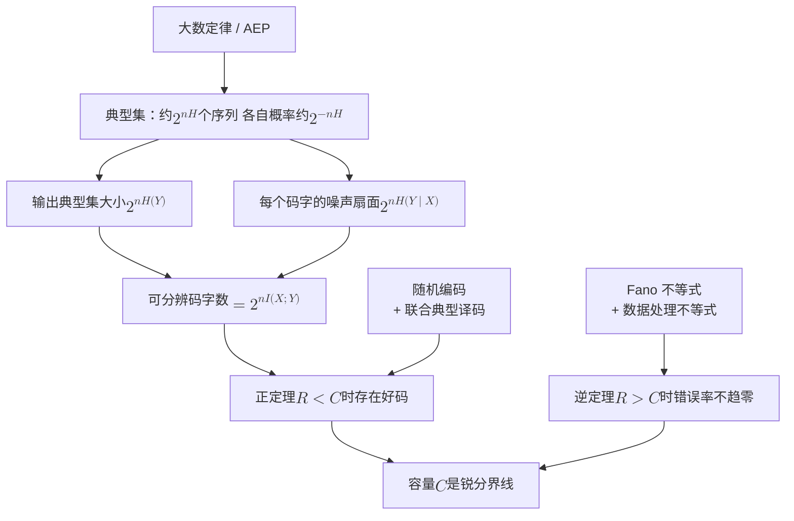
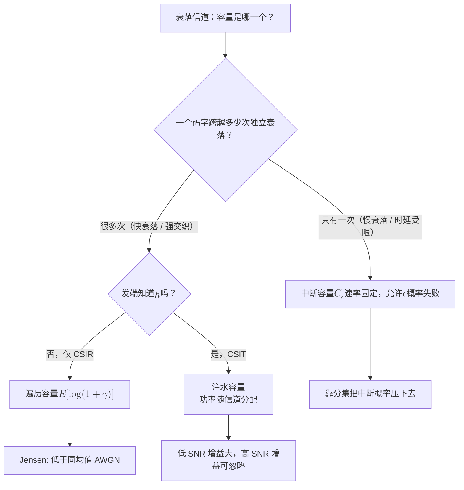
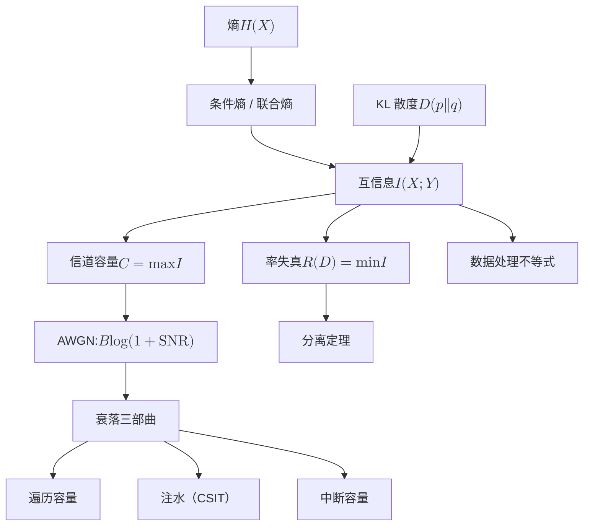

# 4 · 信息论基础：熵、互信息与容量

[第 3 章](03-digital-communications.md)教会了你怎么把比特变成波形、怎么算误码率——那是**工程师的问题**：给定一套调制编码方案，它能跑多快、错多少。本章问一个更根本的**科学家的问题**：不管你用什么方案，这条链路**最多**能跑多快？

1948 年香农给出的答案是通信理论史上最漂亮的一击。他先造了一把尺子（熵），用它量出"两个随机变量共享多少信息"（互信息），再把这个量对输入分布取极大（容量），最后证明：**低于容量的速率，错误概率可以任意接近零；高于容量的速率，错误概率无法压低**。中间没有灰色地带。这条分界线不依赖于任何具体的调制方式、编码方式或接收机结构——它只依赖于信道本身。

本章是全站的**语言课**。第一部要问"环境知识值多少容量"，第二部要问"任务需要环境的哪些信息"，第三部要问"预测未来值多少比特"，第四部要问"协同最少要说多少话"——这四个问题的谓语都是本章教的词。

**你将学会：**

- 从"惊讶程度"的三条公理出发，推出熵的表达式为什么必须是 $-\sum p\log p$，并亲手算几个熵；
- 用链式法则把联合熵拆成条件熵，理解"条件作用永不增加熵"的物理含义；
- 写出互信息的三种等价形式，用一张"信息条形图"看清它与各种熵的几何关系；
- 用 Jensen 不等式四步证明 KL 散度非负，并理解它作为"用错模型的罚款单"的工程意义；
- 说清信道容量的定义、香农编码定理的正逆两半，以及典型序列与随机编码的证明直觉；
- 逐步推出 AWGN 容量 $C=B\log_2(1+\mathrm{SNR})$，并知道高斯输入为什么最优、球填充为什么给出同样的答案；
- 掌握带宽-功率折中的两个渐近区，算出 $E_b/N_0$ 的 $-1.59$ dB 极限；
- 分辨衰落信道容量的三种口径——遍历容量、注水容量、中断容量——并知道它们在 20 dB 瑞利信道下相差多少（答案会吓你一跳）；
- 用一句话说清率失真与信源信道分离定理，以及它们在本站四部中被挑战的位置；
- 掌握后文最常用的三件概率工具：条件期望（塔性质、全方差公式）、高斯条件分布（条件均值是线性的，条件方差不依赖观测）、多个独立观测的精度相加（4.10 节）。

## 4.1 惊讶的度量：自信息与熵

### 从"这算什么新闻"说起

今天早上有人告诉你两件事：

- 甲：**"太阳从东边升起来了。"**
- 乙：**"楼下便利店中了五百万彩票。"**

哪句话让你获得了更多信息？直觉毫无争议：乙。差别不在字数，而在**概率**——甲是必然事件，说了等于没说；乙是罕见事件，一说就颠覆了你对世界的预期。

信息量应当是概率的减函数，这是第一条直觉。第二条：如果两件**互相独立**的稀罕事同时发生（便利店中奖 **且** 老板转行开画廊），你获得的信息应当是两者之和——信息可以累加。第三条：概率为 1 的事件信息量为零。

把这三条写成公理。设事件概率为 $p$，其信息量为 $f(p)$：

1. **单调性**：$p_1 < p_2 \Rightarrow f(p_1) > f(p_2)$；
2. **可加性**：独立事件同时发生，$f(p_1 p_2) = f(p_1) + f(p_2)$；
3. **归一化与连续性**：$f(1) = 0$，且 $f$ 在 $(0,1]$ 上连续。

### 三步定出唯一形式

这三条公理**唯一地**（至多相差一个常数因子）定出了 $f$ 的形式。推导只需三步：

**第一步（换元）**：令 $p = 2^{-x}$，$x \in [0,\infty)$，定义 $g(x) = f(2^{-x})$。可加性 $f(p_1p_2)=f(p_1)+f(p_2)$ 变成

$$
g(x + y) = g(x) + g(y)
$$

**第二步（解函数方程）**：这是柯西函数方程（Cauchy functional equation），分三小步解。(i) 把 $x$ 叠加 $n$ 次，$g(nx)=n\,g(x)$。(ii) 对正整数 $k$，由 (i) 得 $g(x)=g\!\left(k\cdot\frac{x}{k}\right)=k\,g\!\left(\frac{x}{k}\right)$，即 $g(x/k)=g(x)/k$；再乘正整数 $m$，得 $g\!\left(\frac{m}{k}x\right)=\frac{m}{k}\,g(x)$。取 $x=1$：对一切正有理数 $r$ 有 $g(r)=r\,g(1)$。(iii) 任一实数 $x\ge 0$ 都是一列有理数 $r_j$ 的极限，$g$ 又连续（因为 $f$ 连续），所以 $g(x)=\lim_j r_j\,g(1)=x\,g(1)$。于是

$$
g(x) = c\,x, \qquad c = g(1)
$$

**第三步（定标度）**：回代 $x = -\log_2 p$，得 $f(p) = -c\log_2 p$。单调性要求 $c>0$。约定"一次公平抛硬币的结果"携带 **1 比特**，即 $f(1/2) = 1$，于是 $c = 1$：

$$
I(x) = -\log_2 p(x) = \log_2 \frac{1}{p(x)} \quad \text{(bit)}
$$

这就是**自信息**（self-information）。若把底数换成 $e$，单位叫 **nat**，换算关系是 $1\ \text{nat} = \log_2 e = 1.4427\ \text{bit}$。

!!! tip "直觉"
    $\log_2 (1/p)$ 有一个非常具体的读法：**要问多少个"是/否"问题才能确定这件事**。一个从 8 个等概率选项中抽出的结果，$p=1/8$，自信息 $\log_2 8 = 3$ bit——正好是二分查找三次。信息的单位从来不是抽象的，它就是"提问的次数"。

### 熵：平均惊讶度

单个结果的惊讶度是随机的，我们关心它的**平均值**。离散随机变量 $X$ 取值于字母表 $\mathcal{X}$、分布为 $p(x)$，其**熵**（entropy）定义为

$$
H(X) = \mathbb{E}\left[\log_2 \frac{1}{p(X)}\right] = -\sum_{x \in \mathcal{X}} p(x) \log_2 p(x)
$$

约定 $0\log 0 = 0$（因为 $\lim_{p\to 0} p\log p = 0$）。

**物理意义**：$H(X)$ 是"平均而言，要确定 $X$ 的取值需要多少比特"。它有两个完全等价的读法——**不确定性**（观测之前我有多茫然）和**信息量**（观测之后我获得了多少）。这两个读法是同一枚硬币的两面：你从一次观测中获得的信息，恰好等于观测前的不确定性。它还有第三个更硬的读法：**无损压缩的极限**。香农信源编码定理说，$n$ 个 i.i.d. 符号平均至少需要 $nH(X)$ 比特才能无损表示，且这个界可以逼近。所以熵不是一个哲学量，而是一个可以拿硬盘容量去验证的物理量。

**行为分析**：熵有两个铁边界，

$$
0 \le H(X) \le \log_2 |\mathcal{X}|
$$

左边取等当且仅当 $X$ 是确定性的（某个 $p(x)=1$）——完全没有不确定性；右边取等当且仅当 $X$ 均匀分布——最大的不确定性（右边这条的证明留到 4.4 节，用 KL 散度一行搞定）。这解释了一个工程直觉：**均匀分布是"最贵"的信源，也是"最好"的信道输入**。前者难压缩，后者能携带最多信息。

### 两个必须会算的例子

**均匀分布**：$|\mathcal{X}| = M$ 个等概率取值，

$$
H(X) = -\sum_{i=1}^{M} \frac{1}{M}\log_2 \frac{1}{M} = \log_2 M
$$

**二元分布（偏币）**：$X\in\{0,1\}$，$\Pr[X=1]=p$，其熵记作二元熵函数

$$
H_b(p) = -p\log_2 p - (1-p)\log_2 (1-p)
$$

$H_b$ 是 $[0,1]$ 上的凹函数，$H_b(0)=H_b(1)=0$，$H_b(1/2)=1$，且关于 $p=1/2$ 对称。它会在本章反复出现，值得记住几个数值。

!!! example "算例：熵到底有多大"

    **(1) 均匀六面骰子**：$H = \log_2 6 = 2.585$ bit。掷 1000 次的记录，理论上最少需要 2585 bit（而不是朴素的 $1000\times 3 = 3000$ bit）。

    **(2) 偏币 $p=0.9$**：

    $$
    H_b(0.9) = -0.9\log_2 0.9 - 0.1 \log_2 0.1 = 0.9\times 0.1520 + 0.1 \times 3.3219 = 0.469\ \text{bit}
    $$

    一个 90/10 的信源，每个符号平均只值 0.469 bit——1000 个符号可压到 469 bit，压缩比 $1000/469 \approx 2.1$ 倍。**偏斜就是可压缩性**。

    **(3) 半信半疑的偏币 $p=0.11$**：$H_b(0.11) = 0.11\times 3.1844 + 0.89 \times 0.1681 = 0.500$ bit。注意这个数：一个 11/89 的信源恰好等价于"半个公平硬币"。

    **(4) 英文文本**：26 字母加空格共 27 符号，若等概率则 $\log_2 27 = 4.75$ bit/字母；按实际字母频率算降到约 4.1 bit；而香农 1951 年用人类猜字母的实验估计，考虑长程上下文后英文的熵只有 **0.6–1.3 bit/字母**。语言的绝大部分是冗余——这正是 zip 能把文本压到三分之一的原因。

### 连续变量：微分熵

后面推 AWGN 容量时要用到连续变量。对概率密度 $p(x)$，**微分熵**定义为

$$
h(X) = -\int_{-\infty}^{\infty} p(x)\log_2 p(x)\,\mathrm{d}x
$$

高斯分布的微分熵是本章最关键的一个中间结果，我们推一遍。设 $X\sim\mathcal{N}(0,\sigma^2)$，密度 $p(x) = \frac{1}{\sqrt{2\pi\sigma^2}}\exp\left(-\frac{x^2}{2\sigma^2}\right)$：

$$
\begin{aligned}
h(X) &= \mathbb{E}\left[-\log_2 p(X)\right] \\
&= \mathbb{E}\left[\frac{1}{2}\log_2 (2\pi\sigma^2) + \frac{X^2}{2\sigma^2}\log_2 e\right] \\
&= \frac{1}{2}\log_2 (2\pi\sigma^2) + \frac{\mathbb{E}[X^2]}{2\sigma^2}\log_2 e \\
&= \frac{1}{2}\log_2 (2\pi\sigma^2) + \frac{1}{2}\log_2 e \\
&= \frac{1}{2}\log_2 \left(2\pi e\,\sigma^2\right)
\end{aligned}
$$

第二行把指数拿下来（注意 $\log_2 e^{u} = u\log_2 e$），第四行用了 $\mathbb{E}[X^2]=\sigma^2$。

!!! warning "微分熵不是熵"
    $h(X)$ 可以是负的（例如 $\sigma^2$ 很小时），也不是"平均需要多少比特"——连续变量精确描述需要无穷多比特。它只是一个**相对**量：真正有物理意义的是 $h$ 的差（如互信息 $h(Y)-h(Y|X)$），差里那个发散的部分抵消掉了。本章后面用到 $h$ 的地方，全都是以差的形式出现的。

## 4.2 多个变量：联合熵、条件熵与链式法则

### 定义

真实的通信里从来不只有一个随机变量：发的是 $X$，收的是 $Y$。把它们放在一起看：

**联合熵**——同时确定 $X$ 和 $Y$ 需要多少比特：

$$
H(X,Y) = -\sum_{x}\sum_{y} p(x,y)\log_2 p(x,y)
$$

**条件熵**——已知 $X$ 之后，$Y$ 还剩多少不确定性：

$$
H(Y\mid X) = \sum_{x} p(x)\, H(Y \mid X=x) = -\sum_{x}\sum_{y} p(x,y)\log_2 p(y\mid x)
$$

注意条件熵是先对每个 $x$ 算熵、再按 $p(x)$ 加权平均，**不是**先平均再算熵。这个次序差别很要紧：对某个特定的 $x$，$H(Y|X=x)$ 完全可能大于 $H(Y)$（知道了一个坏消息反而更糊涂），但平均之后绝不会。

举个例子。$X=0$ 的概率为 0.9，此时 $Y$ 必为 0；$X=1$ 的概率为 0.1，此时 $Y$ 是一枚公平硬币。于是 $\Pr[Y=1]=0.1\times 0.5=0.05$，$H(Y)=H_b(0.05)=0.286$ bit；可一旦得知 $X=1$，$H(Y\mid X=1)=1$ bit，反而更糊涂。平均起来 $H(Y\mid X)=0.9\times 0+0.1\times 1=0.1$ bit，仍小于 $H(Y)$。

### 链式法则：三步推导

$$
\begin{aligned}
H(X,Y) &= -\sum_{x,y} p(x,y)\log_2 p(x,y) \\
&= -\sum_{x,y} p(x,y)\log_2 \left[p(x)\,p(y\mid x)\right] \\
&= -\sum_{x,y} p(x,y)\log_2 p(x) \;-\; \sum_{x,y} p(x,y)\log_2 p(y\mid x) \\
&= -\sum_{x} p(x)\log_2 p(x) \;+\; H(Y\mid X) \\
&= H(X) + H(Y\mid X)
\end{aligned}
$$

第二行用乘法公式 $p(x,y)=p(x)p(y|x)$，第三行拆开对数，第四行对第一项先把 $y$ 求和掉（$\sum_y p(x,y)=p(x)$）。

**物理意义**：**"先描述 $X$，再在已知 $X$ 的前提下描述 $Y$"** 与 **"一次性描述 $(X,Y)$"** 花的比特数完全一样。信息的记账是可分解的，而且分解方式随你选：由对称性同样有 $H(X,Y)=H(Y)+H(X|Y)$。

推广到 $n$ 个变量（反复应用两变量版本）：

$$
H(X_1, X_2, \ldots, X_n) = \sum_{i=1}^{n} H\!\left(X_i \mid X_1,\ldots,X_{i-1}\right)
$$

**行为分析**：这条公式是理解"时间相关性为什么能压缩"的钥匙。如果 $X_1,\ldots,X_n$ 相互独立，每一项都退化成 $H(X_i)$，总熵是 $n H(X)$——毫无节省。而如果它们高度相关（比如相邻时隙的信道系数），后面的条件熵会大幅小于边缘熵，总熵远小于 $nH(X)$。**这就是信道预测、CSI 压缩反馈能省比特的信息论根源**，第一部[第 8 章](../part1/08-dimension-and-prediction.md)会把这件事推到极致。

### 条件作用永不增加熵

$$
H(Y \mid X) \le H(Y), \qquad \text{等号成立当且仅当 } X \perp Y
$$

（严格证明见 4.4 节，因为 $H(Y)-H(Y|X)=I(X;Y)=D(p_{XY}\Vert p_X p_Y)\ge 0$。）

**物理意义**："多知道一件事，平均而言不会让你更糊涂。" 但请注意"平均"二字——单个 $x$ 上是可能变糊涂的。

!!! example "算例：二元对称信道的全套熵"

    **BSC（Binary Symmetric Channel）**：输入 $X\in\{0,1\}$ 等概率，信道以概率 $\varepsilon = 0.1$ 翻转比特，输出 $Y$。

    - $H(X) = 1$ bit。
    - 给定 $X=0$，$Y$ 服从 $(0.9, 0.1)$；给定 $X=1$ 也是 $(0.1,0.9)$。两种情况熵相同：$H(Y|X) = H_b(0.1) = 0.469$ bit。这就是**噪声本身的熵**。
    - 输出边缘分布：$p(Y=0) = 0.5\times 0.9 + 0.5\times 0.1 = 0.5$，故 $H(Y) = 1$ bit。
    - 联合熵：$H(X,Y) = H(X) + H(Y|X) = 1 + 0.469 = 1.469$ bit。
    - 反向条件熵：$H(X|Y) = H(X,Y) - H(Y) = 1.469 - 1 = 0.469$ bit——收到 $Y$ 之后，关于发送比特仍剩 0.469 bit 的不确定性。

    把这些数记住：一条 10% 误码率的链路，每传 1 bit 只"送达" $1-0.469 = 0.531$ bit。剩下的被噪声吃掉了。

## 4.3 互信息：信息是不确定性的减少量

### 定义与三种等价写法

上面那个 0.531 就是本章的主角。**互信息**（mutual information）定义为

$$
I(X;Y) = H(X) - H(X\mid Y)
$$

读作："观测 $Y$ 之前对 $X$ 的不确定性" 减去 "观测 $Y$ 之后仍剩的不确定性"，即 $Y$ **告诉了你关于 $X$ 的多少比特**。

利用链式法则，它有三种完全等价的写法：

$$
\begin{aligned}
I(X;Y) &= H(X) - H(X\mid Y) &&\text{(1) 接收端视角：不确定性的减少}\\
&= H(Y) - H(Y\mid X) &&\text{(2) 发送端视角：输出熵减噪声熵}\\
&= H(X) + H(Y) - H(X,Y) &&\text{(3) 对称视角：重叠部分}
\end{aligned}
$$

从 (1) 到 (3)：$H(X|Y) = H(X,Y)-H(Y)$ 代入即得；从 (3) 到 (2)：再把 $H(X,Y)=H(X)+H(Y|X)$ 代入。三式互为代数变形，但**工程含义大不相同**：写法 (2) 是计算容量时最常用的（$H(Y|X)$ 往往就是噪声熵，与输入分布无关，于是最大化 $I$ 就退化为最大化 $H(Y)$——4.5 和 4.6 节会反复用这一招）。

还有第四种写法，把它暴露为一个"距离"：

$$
I(X;Y) = \sum_{x,y} p(x,y)\log_2 \frac{p(x,y)}{p(x)p(y)}
$$

即联合分布与"独立化后的乘积分布"之间的 KL 散度（下一节的主题）。这个写法立刻给出 $I(X;Y)\ge 0$：**互信息衡量的是 $X$ 与 $Y$ 偏离独立有多远**。

### 信息条形图（文氏图的一维版本）

教科书常画两个相交的圆。用一条被切成三段的线段来看更清楚：

```text
        <-------------- H(X,Y) ------------->
        <-------- H(X) ------->
                      <-------- H(Y) ------->
        +-------------+-------+-------------+
        |   H(X|Y)    | I(X;Y)|   H(Y|X)    |
        +-------------+-------+-------------+
```

三段的工程名字与含义：

| 区域 | 记号 | 经典名称 | 通信含义 |
|---|---|---|---|
| 左段 | $H(X\mid Y)$ | 含糊度 equivocation | 收到 $Y$ 后关于发送内容仍未解决的不确定性，即**信息的损失** |
| 中段 | $I(X;Y)$ | 互信息 | 真正**穿过**信道的信息量 |
| 右段 | $H(Y\mid X)$ | 散布度 dispersion | 噪声给输出注入的、与消息无关的不确定性 |
| 全长 | $H(X,Y)$ | 联合熵 | 完整描述"发了什么 + 收到什么"的总代价 |

理想无噪信道：左右两段坍缩为零，$I(X;Y)=H(X)=H(Y)$。完全断开的信道：中段坍缩为零，$I=0$，$H(X,Y)=H(X)+H(Y)$。真实信道在两者之间。

### 数据处理不等式：信息不会凭空长出来

设 $X\to Y\to Z$ 构成马尔可夫链（即给定 $Y$ 后 $Z$ 与 $X$ 条件独立——典型情形：$Z$ 是接收机对 $Y$ 做的任何处理）。则

$$
I(X;Y) \ge I(X;Z)
$$

**先补两个工具**。**条件互信息** $I(X;Y\mid Z)$ 是已知 $Z$ 之后，$Y$ 还能额外告诉你多少关于 $X$ 的信息：

$$
I(X;Y\mid Z)=H(X\mid Z)-H(X\mid Y,Z)=\sum_{z}p(z)\,I(X;Y\mid Z=z)
$$

其中 $I(X;Y\mid Z=z)$ 是在条件分布 $p(x,y\mid z)$ 下算出的普通互信息。**互信息的链式法则**：在 $H(X)-H(X\mid Y,Z)$ 中间插入 $H(X\mid Z)$ 再减掉，

$$
I(X;Y,Z)=H(X)-H(X\mid Y,Z)=\underbrace{H(X)-H(X\mid Z)}_{I(X;Z)}+\underbrace{H(X\mid Z)-H(X\mid Y,Z)}_{I(X;Y\mid Z)}
$$

即"先看 $Z$ 得到的"加"再看 $Y$ 额外得到的"；插入 $H(X\mid Y)$ 则得到另一种次序。

**三步证明**。把 $I(X;Y,Z)$ 用两种次序展开：

$$
\begin{aligned}
I(X; Y,Z) &= I(X;Z) + I(X;Y\mid Z) \\
I(X; Y,Z) &= I(X;Y) + I(X;Z\mid Y)
\end{aligned}
$$

马尔可夫性给出 $I(X;Z\mid Y) = 0$：按定义 $I(X;Z\mid Y)=\sum_y p(y)\,I(X;Z\mid Y=y)$，而马尔可夫链的意思正是对每个 $y$ 都有 $p(x,z\mid y)=p(x\mid y)\,p(z\mid y)$，即给定 $Y=y$ 时 $X$ 与 $Z$ 独立，每一项都是零。令两式相等：

$$
I(X;Y) = I(X;Z) + I(X;Y\mid Z) \;\ge\; I(X;Z)
$$

最后的 $\ge$ 用的是条件互信息非负：它是普通互信息 $I(X;Y\mid Z=z)$ 按 $p(z)$ 的加权平均，而每个普通互信息都 $\ge 0$（上文第四种写法，证明见 4.4 节推论 2）。证毕。

**物理意义**：**任何对接收信号的确定性或随机处理——滤波、量化、均衡、译码、神经网络推断——都只可能损失信息，不可能创造信息。** 这是通信工程中最沉重也最有用的一条定律：接收机设计的全部艺术，是把损失压到最小，而不是"增强"信号。

**行为分析**：这条不等式也是本站四部反复引用的工具。第二部用它给"任务只需要环境的部分信息"做形式化（[Blackwell 排序](../part2/02-blackwell.md)本质上是数据处理不等式的加强版）；第三部用它给分布式算法的通信量做下界；第一部用它证明"再聪明的信道估计器也不能超过导频本身携带的信息"。

!!! example "算例：级联信道的信息衰减"

    信号先过一个 $\varepsilon_1 = 0.1$ 的 BSC 得到 $Y$，接收机又做了一次不完美的判决（等价于再过一个 $\varepsilon_2 = 0.1$ 的 BSC）得到 $Z$。

    级联后比特最终被翻转，当且仅当两级中恰好有一级翻了它（两级都翻等于没翻）：

    $$
    \varepsilon_{\text{eq}} = \varepsilon_1(1-\varepsilon_2) + (1-\varepsilon_1)\varepsilon_2 = 0.1\times 0.9 + 0.9\times 0.1 = 0.18
    $$

    于是

    $$
    I(X;Y) = 1 - H_b(0.1) = 0.531\ \text{bit}, \qquad
    I(X;Z) = 1 - H_b(0.18) = 1 - 0.680 = 0.320\ \text{bit}
    $$

    多经一道手，可用信息掉了 40%。这就是为什么现代接收机坚持**软判决**：过早地把软信息（对数似然比）硬化成 0/1，就是在自愿执行一次数据处理不等式。同样 $\varepsilon=0.1$ 的链路，软信息送给译码器和硬比特送给译码器，性能差 2 dB 上下。这 2 dB 与上面的 0.21 bit 是同一个道理（硬判决是一次额外的处理，信息只减不增），但不是同一个数：0.21 bit 算的是多串一级 BSC 的损失。

## 4.4 KL 散度：用错模型的罚款单

### 定义与非负性

**Kullback–Leibler 散度**（相对熵）衡量用分布 $q$ 去描述真实分布 $p$ 的代价：

$$
D(p \Vert q) = \sum_{x} p(x)\log_2 \frac{p(x)}{q(x)}
$$

（约定 $0\log(0/q)=0$；若存在 $x$ 使 $p(x)>0$ 而 $q(x)=0$，则 $D=+\infty$。）

**非负性定理**：$D(p\Vert q)\ge 0$，等号成立当且仅当 $p = q$。

**四步证明（Jensen 不等式）**。**Jensen 不等式**说：对凹函数 $f$ 和任意随机变量 $Z$，有 $\mathbb{E}[f(Z)]\le f(\mathbb{E}[Z])$，即"先取函数再平均"不超过"先平均再取函数"。两点小例子：$Z$ 以各 $1/2$ 的概率取 1 和 4，$\mathbb{E}[\log_2 Z]=\frac{1}{2}(0+2)=1$，而 $\log_2\mathbb{E}[Z]=\log_2 2.5=1.32$。几何上这就是凹函数的弦在曲线下方（凸函数版本见[第 7 章](07-optimization-basics.md) 7.2 节）。$\log$ 是凹函数，故 $\mathbb{E}[\log Z]\le \log \mathbb{E}[Z]$，等号当且仅当 $Z$ 是常数。下面取 $X\sim p$、$Z=q(X)/p(X)$：

$$
\begin{aligned}
-D(p\Vert q) &= \sum_{x} p(x)\log_2 \frac{q(x)}{p(x)} &&\text{(取负号，翻转分式)}\\
&\le \log_2\left(\sum_{x} p(x)\cdot \frac{q(x)}{p(x)}\right) &&\text{(Jensen：期望移进对数)}\\
&= \log_2 \sum_{x:\,p(x)>0} q(x) &&\text{(约掉 } p(x))\\
&\le \log_2 1 = 0 &&\text{(}q\text{ 是概率分布，求和不超过 1)}
\end{aligned}
$$

于是 $D(p\Vert q)\ge 0$。等号需要两处同时取等：Jensen 取等要求 $q(x)/p(x)$ 是常数（在 $p$ 的支撑集上），最后一步取等要求 $q$ 的全部质量都在 $p$ 的支撑集上——两者合起来正是 $p=q$。

**物理意义**：$D(p\Vert q)$ 是**编码的罚款单**。若真实信源是 $p$，你却按 $q$ 设计了霍夫曼/算术编码（码字长度 $\approx \log_2(1/q(x))$），则平均码长为

$$
\sum_x p(x)\log_2\frac{1}{q(x)} = \underbrace{\sum_x p(x)\log_2\frac{1}{p(x)}}_{H(p)} + \underbrace{\sum_x p(x)\log_2\frac{p(x)}{q(x)}}_{D(p\Vert q)} = H(p) + D(p\Vert q)
$$

**模型错了，每个符号多付 $D(p\Vert q)$ 比特**——非负性于是有了最朴素的解释：用错模型只会更亏，不会更赚。

**行为分析**：$D$ 不是距离——它不对称（$D(p\Vert q)\ne D(q\Vert p)$）也不满足三角不等式。不对称是有物理意义的：$D(p\Vert q)$ 里 $q(x)\to 0$ 而 $p(x)>0$ 的地方会爆炸到无穷，意味着"**把真实会发生的事判定为不可能**"是不可饶恕的错误；反过来 $q$ 在 $p$ 为零处有质量，只会带来有限的浪费。工程上这对应两种失败模式：信道估计器认定某方向没有径（实际上有）是灾难性的，而多估了一条不存在的径只是浪费导频。

### 两个立刻能用的推论

**推论 1（熵的上界）**：设 $u$ 为 $\mathcal{X}$ 上的均匀分布，$|\mathcal{X}|=M$，则

$$
D(p\Vert u) = \sum_x p(x)\log_2 \frac{p(x)}{1/M} = \log_2 M - H(X) \ge 0 \;\Longrightarrow\; H(X)\le \log_2 M
$$

这补上了 4.1 节欠的证明：**均匀分布熵最大，而"离均匀有多远"恰好由 KL 散度精确量化**。

**推论 2（互信息非负）**：由 $I(X;Y) = D(p_{XY}\Vert p_X p_Y)\ge 0$ 立得 $H(Y|X)\le H(Y)$——4.2 节欠的第二个证明也还上了。

!!! example "算例：用错信道统计要罚多少"

    真实的比特信源 $p = (0.9, 0.1)$，你误以为它是均匀的 $q = (0.5,0.5)$。罚款：

    $$
    D(p\Vert q) = 0.9\log_2\frac{0.9}{0.5} + 0.1\log_2\frac{0.1}{0.5} = 0.9\times 0.848 + 0.1\times(-2.322) = 0.763 - 0.232 = 0.531\ \text{bit}
    $$

    验算：$H(p) + D(p\Vert q) = 0.469 + 0.531 = 1.000$ bit——正是"每符号用 1 bit 硬编码"的朴素方案，完全吻合。你本可以用 0.469 bit，多付的 0.531 bit 就是无知的价格（**超过一倍的开销**）。

    再看不对称性。反过来算：

    $$
    D(q\Vert p) = 0.5\log_2\frac{0.5}{0.9} + 0.5\log_2\frac{0.5}{0.1} = 0.5\times(-0.848) + 0.5\times 2.322 = 0.737\ \text{bit}
    $$

    $0.531 \ne 0.737$。同一对分布，换个方向罚款差了 39%——**"KL 距离"这个说法从一开始就是误称**。

## 4.5 信道容量与香农编码定理

### 定义

一个**离散无记忆信道**（DMC）由三元组 $(\mathcal{X}, p(y\mid x), \mathcal{Y})$ 描述：输入字母表、转移概率、输出字母表；"无记忆"指 $p(y^n\mid x^n)=\prod_{i=1}^{n} p(y_i\mid x_i)$。

信道的**容量**定义为互信息对输入分布的最大值：

$$
C = \max_{p(x)} I(X;Y) \qquad \text{(bit / 信道使用)}
$$

**物理意义**：信道 $p(y|x)$ 是"上帝给的"，不可更改；输入分布 $p(x)$ 是"你能选的"（用什么星座、各点用多频繁）。容量就是**在你能做的所有选择里，这条信道最多能穿过多少信息**。它是信道的固有属性，与调制方式、编码方式、接收机结构统统无关。

### 两个必会的容量

**BSC（翻转概率 $\varepsilon$）**：用写法 (2) 最省事。因为对任何输入 $x$，$H(Y|X=x)=H_b(\varepsilon)$，所以 $H(Y|X)=H_b(\varepsilon)$ 与输入分布**无关**：

$$
I(X;Y) = H(Y) - H_b(\varepsilon) \;\le\; 1 - H_b(\varepsilon)
$$

上界在 $H(Y)=1$ 即 $Y$ 均匀时取到，而输入均匀恰好使输出均匀。于是

$$
C_{\mathrm{BSC}} = 1 - H_b(\varepsilon)\quad \text{bit/use}
$$

**BEC（删除概率 $\delta$，输出为 $\{0,1,?\}$）**：用写法 (1)，按条件熵的定义逐个输出值算。收到 0 或 1 时 $X$ 就是它，$H(X\mid Y=0)=H(X\mid Y=1)=0$；收到 $?$ 时，因为删除与发了什么无关，$X$ 的后验分布仍等于先验，$H(X\mid Y=?)=H(X)$。而 $\Pr[Y=?]=\delta$，加权平均得 $H(X|Y) = \delta H(X)$：

$$
I(X;Y) = H(X) - \delta H(X) = (1-\delta)H(X) \le 1-\delta \;\Longrightarrow\; C_{\mathrm{BEC}} = 1-\delta
$$

**行为分析**：两个公式的对比极富教益。BEC 的容量线性下降——删除是"诚实的失败"，接收机知道自己不知道；BSC 的容量按 $1-H_b(\varepsilon)$ 下降，在 $\varepsilon$ 小的时候下降**快得多**（$\varepsilon = 0.01$ 时 BEC 容量 0.99，BSC 只有 0.919）。因为翻转是"欺骗性的失败"，接收机被误导却不自知，纠正它要花更多冗余。还有一个反直觉之处：$C_{\mathrm{BSC}}(\varepsilon=0.9) = 1-H_b(0.9)=0.531$，与 $\varepsilon = 0.1$ 时相同——因为你只要把收到的比特全部取反就好。**最坏的信道不是全翻，而是 $\varepsilon = 0.5$**（容量为零，输出与输入独立）。

### 香农信道编码定理

先说清定理里的记号。一个 **$(M,n)$ 码**由三样东西组成：$M$ 条消息 $w\in\{1,\ldots,M\}$；编码器，把每条消息映成长度为 $n$ 的码字 $x^n(w)$；译码器，根据收到的 $y^n$ 给出估计 $\hat{w}$。速率 $R=\frac{1}{n}\log_2 M$ 是每用一次信道送的比特数，所以 $M=2^{nR}$ 的码写成 $(2^{nR},n)$ 码。例如 3 重重复码是 $(2,3)$ 码，$R=1/3$。**最大错误概率** $\lambda^{(n)}=\max_w\Pr[\hat{W}\ne w\mid W=w]$ 是最倒霉的那条消息的出错概率。

!!! success "香农信道编码定理（1948）"

    对任意 DMC，令 $C=\max_{p(x)}I(X;Y)$。

    **正定理（可达性）**：对任意速率 $R < C$，存在一列 $(2^{nR}, n)$ 码，使最大错误概率 $\lambda^{(n)}\to 0$（当 $n\to\infty$）。

    **逆定理**：任何使错误概率 $\to 0$ 的码序列，其速率必满足 $R \le C$。

这条定理有两处石破天惊的地方。其一，**存在一条锐利的分界线**：在 1948 年之前，工程界的共识是"要降错误率就得降速率"，错误率与速率之间是连续的折中；香农说不，在 $R<C$ 的整个区间里，错误率可以压到任意接近零，**不需要牺牲速率**。其二，**定理是非构造性的**：它证明好码存在，却不告诉你怎么造。之后半个世纪的编码理论（卷积码 → Turbo 码 → LDPC → Polar 码）都在填这个坑，直到今天才在几千比特码长下逼近容量到 0.5–1 dB 以内。

### 直觉证明思路：典型序列与随机编码

**第一步：渐近均分性（AEP）**。设 $X_1,\ldots,X_n$ i.i.d. $\sim p$。由大数定律，

$$
-\frac{1}{n}\log_2 p(X_1,\ldots,X_n) = \frac{1}{n}\sum_{i=1}^{n}\left[-\log_2 p(X_i)\right] \;\xrightarrow{\ \text{依概率}\ }\; \mathbb{E}\left[-\log_2 p(X)\right] = H(X)
$$

第一个等号用了独立性：$p(x_1,\ldots,x_n)=\prod_i p(x_i)$，取对数变成和，才轮到大数定律。这个极限是说，长序列几乎必然落在**典型集**里，即"每符号对数概率接近熵"的那些序列（$\epsilon$ 是任取的小正数）：

$$
A_{\epsilon}^{(n)}=\left\{x^n:\ \left|-\frac{1}{n}\log_2 p(x^n)-H(X)\right|\le\epsilon\right\}
$$

它有两条性质。(a) 每个典型序列的概率都约等于 $2^{-nH(X)}$：这就是定义本身，把不等式乘以 $-n$ 再取指数，得 $2^{-n(H+\epsilon)}\le p(x^n)\le 2^{-n(H-\epsilon)}$。(b) 典型序列的个数约为 $2^{nH(X)}$：典型集的总概率接近 1（上面的极限），每条又约 $2^{-nH(X)}$（性质 (a)），条数只能约为 $1/2^{-nH(X)}=2^{nH(X)}$。**长序列的世界是"近似均匀"的**：$|\mathcal{X}|^n$ 个序列中只有 $2^{nH(X)}$ 个真正会出现，其余的概率之和趋于零。

小例子：$\Pr[1]=0.1$ 的偏币抛 $n=100$ 次，$nH_b(0.1)=46.9$。"1"的个数几乎总在 10 附近（标准差 3），而恰有 10 个"1"的序列，每条概率都是 $0.1^{10}\times 0.9^{90}=2^{-46.9}$，正是 $2^{-nH}$。反直觉的是，概率最大的单条序列是全 0（$0.9^{100}=2^{-15.2}$），它却**不典型**："一个 1 都没有"的总概率只有 $2.7\times10^{-5}$。

**第二步：数扇面**。现在做一次计数（这是全部直觉的核心）：

- 接收端所有可能出现的典型 $y^n$ 序列共约 $2^{nH(Y)}$ 个；
- 对于**给定**的发送码字 $x^n$，噪声会把它散布成一个"扇面"——与该 $x^n$ **联合典型**（jointly typical）的 $y^n$ 集合，大小约 $2^{nH(Y\mid X)}$ 个。"联合典型"是把典型集的定义用到成对序列上：$x^n$、$y^n$ 各自典型，并且 $-\frac{1}{n}\log_2 p(x^n,y^n)$ 接近 $H(X,Y)$。这样的序列对约有 $2^{nH(X,Y)}$ 对，分摊到约 $2^{nH(X)}$ 个典型 $x^n$ 上，每个 $x^n$ 分到约 $2^{n[H(X,Y)-H(X)]}=2^{nH(Y\mid X)}$ 个 $y^n$（链式法则）；
- 要让接收端能无歧义地分辨是哪个码字发的，这些扇面必须（近似）互不重叠。因此最多能塞进去的码字数为

$$
M \;\lesssim\; \frac{2^{nH(Y)}}{2^{nH(Y\mid X)}} = 2^{n\left[H(Y)-H(Y\mid X)\right]} = 2^{nI(X;Y)}
$$

速率 $R = \frac{1}{n}\log_2 M \le I(X;Y)$，对输入分布取最优即得 $R\le C$。这就是**球填充**（sphere packing）图像的离散版本：**容量 = 大球的体积 / 小球的体积**。

**第三步：随机编码**。怎么证明真的塞得进去？香农的绝招是**不去设计码，而是随机抽码**：按最优分布 $p^{*}(x)$ 独立同分布地随机生成 $2^{nR}$ 个长度为 $n$ 的码字，构成码本，收发双方共享。译码器用**联合典型性译码**：找唯一一个与收到的 $y^n$ 联合典型的码字。

分析错误概率。出错只有两种方式：真码字与 $y^n$ 不联合典型，由 AEP 其概率趋于零；或者某个**错误**码字碰巧与 $y^n$ 联合典型。后者这样估：错误码字是独立抽的，与实际发送的消息无关，因而与 $y^n$ 独立，这一对序列是按乘积分布 $p(x^n)\,p(y^n)$ 出现的。联合典型的序列对约有 $2^{nH(X,Y)}$ 对，在乘积分布下每对的概率约为 $2^{-nH(X)}\cdot 2^{-nH(Y)}$，所以

$$
\Pr\left[\text{错误码字与 } y^n \text{ 联合典型}\right]\approx 2^{nH(X,Y)}\cdot 2^{-nH(X)}\cdot 2^{-nH(Y)}=2^{-n\left[H(X)+H(Y)-H(X,Y)\right]}=2^{-nI(X;Y)}
$$

最后一步是 4.3 节写法 (3)。对 $2^{nR}-1$ 个竞争者用**联合界**（union bound，$\Pr[A_1\cup\cdots\cup A_k]\le\sum_i\Pr[A_i]$）：

$$
P_e \;\lesssim\; \left(2^{nR}-1\right)2^{-nI(X;Y)} \;<\; 2^{-n\left[I(X;Y)-R\right]} \;\xrightarrow{\ n\to\infty\ }\; 0 \quad \text{当 } R < I(X;Y)
$$

最后一步逻辑最妙：这算出的是**码本集合上的平均**错误概率。既然平均值趋于零，就**必定存在至少一个具体码本**的错误概率趋于零。这里的"平均"还有第二层：对码本里的各条消息也是平均的，而定理要的是最大错误概率。补救办法叫**消去法**（expurgation）：设某码本对消息的平均错误率为 $\bar{P}_e$，则错误率超过 $2\bar{P}_e$ 的码字不可能多于一半，否则光这一半就让平均值超过 $\bar{P}_e$。扔掉最差的一半，剩下每个码字的错误率都不超过 $2\bar{P}_e\to 0$；码字数从 $2^{nR}$ 减到 $2^{nR-1}$，速率只降 $1/n$，$n\to\infty$ 时可忽略。

**逆定理**方向靠 **Fano 不等式**。设消息 $W$ 在 $2^{nR}$ 条中均匀选取，译码结果为 $\hat{W}$，错误概率 $P_e=\Pr[\hat{W}\ne W]$。Fano 不等式说 $H(W\mid \hat{W}) \le 1 + P_e\, nR$，直觉是"已知 $\hat{W}$ 后补全 $W$ 要花的比特"：先用至多 1 bit 说明译对了没有；若译错（概率 $P_e$），再用至多 $\log_2 2^{nR}=nR$ bit 指出正确的是哪一条。另一方面，$W\to X^n\to Y^n\to\hat{W}$ 是马尔可夫链，由数据处理不等式和信道无记忆性，

$$
I(W;\hat{W})\le I(X^n;Y^n)=H(Y^n)-\sum_{i=1}^{n}H(Y_i\mid X_i)\le\sum_{i=1}^{n}\left[H(Y_i)-H(Y_i\mid X_i)\right]\le nC
$$

（等号用了无记忆性；中间一步是链式法则加"条件作用不增熵"；最后每项 $I(X_i;Y_i)\le C$。）把两式代入 $nR=H(W)=H(W\mid\hat{W})+I(W;\hat{W})$：

$$
nR\le 1+P_e\,nR+nC \;\Longrightarrow\; R\le \frac{C+1/n}{1-P_e}
$$

令 $n\to\infty$、$P_e\to 0$ 便有 $R\le C$。



!!! example "算例：重复码离容量有多远"

    BSC，$\varepsilon = 0.1$，容量 $C = 1 - H_b(0.1) = 0.531$ bit/use。

    **朴素方案（3 重重复码）**：速率 $R = 1/3 = 0.333 < C$。多数表决后的错误率为"三次里翻了两次或三次"：

    $$
    P_e = 3\varepsilon^2(1-\varepsilon) + \varepsilon^3 = 3\times 0.01\times 0.9 + 0.001 = 0.028
    $$

    速率只有容量的 63%，错误率却还有 2.8%——而且要把 $P_e$ 继续压低，只能加大重复次数，速率随之趋于零。

    **香农的承诺**：在 $R = 0.5$（比重复码**更高**的速率）下，存在码长 $n$ 足够大的码，使 $P_e < 10^{-6}$ 甚至 $10^{-15}$。差距不在"重复"这个想法不够努力，而在它把冗余用错了地方——它在**符号**层面做保护，而好码在**整个码字**层面做保护。这就是分组码/卷积码/LDPC 的全部动机。

## 4.6 AWGN 容量：$C=B\log_2(1+\mathrm{SNR})$ 的来历

### 模型与推导主线

**加性高斯白噪声信道**：

$$
Y = X + Z, \qquad Z\sim\mathcal{N}(0, N),\quad Z \perp X, \qquad \mathbb{E}[X^2]\le P
$$

容量定义仍是 $C = \max_{p(x):\,\mathbb{E}[X^2]\le P} I(X;Y)$，只是把熵换成微分熵。分五步推：

**第一步（噪声熵与输入无关）**：

$$
I(X;Y) = h(Y) - h(Y\mid X) = h(Y) - h(X+Z\mid X) = h(Y) - h(Z)
$$

最后一个等号分两层。其一，给定 $X=x$ 时 $Y = x + Z$ 只是 $Z$ 平移了 $x$，而微分熵对平移不变：$x+Z$ 的密度是 $p_Z(y-x)$，换元 $u=y-x$ 后积分与 $h(Z)$ 相同。其二，$Z$ 与 $X$ 独立，知道 $x$ 不改变 $Z$ 的分布。所以每个 $h(Y\mid X=x)$ 都等于 $h(Z)$，平均后 $h(Y|X)=h(Z)$。于是**最大化 $I$ 等价于最大化输出熵 $h(Y)$**——这正是 4.3 节写法 (2) 的威力。

**第二步（输出功率受限）**：由 $X\perp Z$ 且均零均值，

$$
\mathbb{E}[Y^2] = \mathbb{E}[X^2] + \mathbb{E}[Z^2] \le P + N
$$

**第三步（最大熵定理）**：在方差不超过 $\sigma^2$ 的所有分布中，高斯分布的微分熵最大。证明只要三行——设 $p$ 是任一方差为 $\sigma^2$ 的密度，$\phi$ 是 $\mathcal{N}(0,\sigma^2)$ 的密度：

$$
\begin{aligned}
0 \le D(p\Vert \phi) &= \int p\log_2 \frac{p}{\phi} = -h(p) - \int p(x)\log_2 \phi(x)\,\mathrm{d}x \\
-\int p(x)\log_2\phi(x)\,\mathrm{d}x &= \frac{1}{2}\log_2(2\pi\sigma^2) + \frac{\mathbb{E}_p[X^2]}{2\sigma^2}\log_2 e = \frac{1}{2}\log_2(2\pi e \sigma^2) = h(\phi) \\
\Longrightarrow\quad h(p) &\le h(\phi) = \frac{1}{2}\log_2\left(2\pi e \sigma^2\right)
\end{aligned}
$$

关键在第二行：$-\log_2\phi(x)$ 是 $x^2$ 的二次函数，所以它的期望**只依赖于二阶矩**，对 $p$ 和 $\phi$ 算出来一模一样。（这里取 $p$ 为零均值，$\mathbb{E}_p[X^2]$ 就是方差 $\sigma^2$。）

接到第二步上还差两环。一是均值：均值非零时先平移成零均值，微分熵和方差都不变，所以总有 $h\le\frac{1}{2}\log_2(2\pi e\,\mathrm{Var})$。二是"不超过"：这个上界随方差递增，而 $\mathrm{Var}(Y)\le\mathbb{E}[Y^2]\le P+N$，于是

$$
h(Y)\le\frac{1}{2}\log_2\left(2\pi e\,\mathrm{Var}(Y)\right)\le\frac{1}{2}\log_2\left(2\pi e\,(P+N)\right)
$$

这就是第四步代入的上界。

**第四步（代入）**：

$$
C = \frac{1}{2}\log_2\left(2\pi e (P+N)\right) - \frac{1}{2}\log_2\left(2\pi e N\right) = \frac{1}{2}\log_2\left(1 + \frac{P}{N}\right) \quad \text{bit/实维度}
$$

**第五步（取等条件）**：第四步只说明 $I(X;Y)$ 不超过这个值，还要找到一个输入让它取到，它才是容量。上界的两处不等号同时取等，要求 $Y$ 恰为方差 $P+N$ 的零均值高斯。取 $X\sim\mathcal{N}(0,P)$ 且与 $Z$ 独立：独立高斯之和仍是高斯、方差相加，$Y\sim\mathcal{N}(0,P+N)$，两处都取等，上界可达。（反过来 $X$ 也只能是高斯，这是 Cramér 分解定理，此处不证。）**高斯输入最优**——注意这与信源编码里的结论正好相反（高斯信源最难压缩）。原因是同一个：高斯是"最大熵"分布。作为信源它最不可预测（最贵），作为信道输入它携带最多信息（最好）。

### 从"每维度"到"每秒"

上式是**每个实数维度**的容量。真实系统的记账要小心：

- 带宽 $B$ 的实信号，按 Nyquist 每秒有 $2B$ 个独立实样本；
- 等价的复基带表示中，每秒有 $B$ 个复符号，每个复符号含 2 个实维度；
- 噪声功率 $N = N_0 B$（$N_0$ 为单边噪声功率谱密度，W/Hz）。

每个实维度的信噪比仍是 $P/N$：每秒 $2B$ 个实样本分摊功率 $P$，每个样本的信号能量是 $P/(2B)$；单边谱密度为 $N_0$ 的白噪声落在每个实样本上的方差是 $N_0/2$。两者之比 $\frac{P/(2B)}{N_0/2}=\frac{P}{N_0B}=\frac{P}{N}$，所以第四步的公式对每个实维度照用。于是每复符号（两个实维度）容量 $2\times\frac{1}{2}\log_2(1+P/N)=\log_2(1+P/N)$，每秒 $B$ 个复符号：

$$
\boxed{\;C = B\log_2\left(1 + \frac{P}{N_0 B}\right) = B\log_2\left(1+\mathrm{SNR}\right)\quad \text{bit/s}\;}
$$

**频谱效率** $\eta = C/B = \log_2(1+\mathrm{SNR})$，单位 bit/s/Hz。

### 球填充：同一个答案的几何读法

把 $n$ 个符号看成 $n$ 维空间中的一个点。发送码字的能量约为 $nP$，噪声把它推开约 $\sqrt{nN}$（大数定律：$\Vert Z\Vert^2 \approx nN$）。因此：

- 所有可能的接收点落在半径 $\sqrt{n(P+N)}$ 的大球内；
- 每个码字对应一个半径 $\sqrt{nN}$ 的"噪声小球"，要可靠译码，小球须互不重叠。

$n$ 维球体积正比于半径的 $n$ 次方，故可容纳的码字数

$$
M \le \frac{\left(\sqrt{n(P+N)}\right)^{n}}{\left(\sqrt{nN}\right)^{n}} = \left(1+\frac{P}{N}\right)^{n/2}
\;\Longrightarrow\;
R = \frac{1}{n}\log_2 M \le \frac{1}{2}\log_2\left(1+\frac{P}{N}\right)
$$

**与代数推导逐字对应**：大球体积 $\leftrightarrow$ $2^{nh(Y)}$，小球体积 $\leftrightarrow$ $2^{nh(Z)}$。这不是巧合——微分熵本来就是"典型集体积"的对数。球填充图像还解释了为什么码长要长：只有在高维空间里，"球"才会因**测度集中**而变得又薄又规整，堆叠效率才逼近理论上限。低维空间（短码）里球堆不紧，这正是短码距离容量远的几何原因。

!!! example "算例：20 MHz、SNR 20 dB 能跑多快"

    这是最该背下来的一组数。$B = 20$ MHz，$\mathrm{SNR} = 20$ dB $= 10^{20/10} = 100$：

    $$
    \eta = \log_2(1+100) = \log_2 101 = 6.658\ \text{bit/s/Hz}
    $$

    $$
    C = 20\times 10^{6}\times 6.658 = 1.332\times 10^{8}\ \text{bit/s} = 133.2\ \text{Mbps}
    $$

    **对照现实**：现代系统在 20 dB 信噪比下典型用 256QAM 配码率 $3/4$，得 $8\times 0.75 = 6$ bit/s/Hz，再扣去导频/控制/循环前缀等约 15% 的开销，落在 5 bit/s/Hz 上下。换算成"实现差距"，大致相当于比香农极限多要 1.5–3 dB 的 SNR——现代 LDPC 的编码增益已经把这个差距压得很小，**剩下的都是协议开销，不是编码不够好**。

    **想再快一倍怎么办？** 要把 133 Mbps 变成 266 Mbps，需要 $\eta = 13.32$，即

    $$
    \mathrm{SNR}' = 2^{13.32} - 1 \approx 1.02\times 10^{4} = 40.1\ \text{dB}
    $$

    功率要涨 **100 倍**（+20 dB）才能换来速率翻倍。这就是下一节要讲的残酷折中。

## 4.7 带宽-功率折中：两个渐近区

### 高 SNR 区：带宽受限

当 $\mathrm{SNR}\gg 1$：

$$
C \approx B\log_2 \mathrm{SNR} = \frac{B}{3.01}\times \mathrm{SNR}_{\mathrm{dB}}
$$

**物理意义**：容量随功率**对数**增长，随带宽**线性**增长。功率每翻倍（+3 dB）只买来 1 bit/s/Hz；带宽翻倍则速率直接翻倍。这个区叫**带宽受限**（bandwidth-limited）区，工程结论只有一句：**去要频谱，别去要功率。** 5G 冲向毫米波、6G 觊觎太赫兹，根子就在这行公式里。

### 低 SNR 区：功率受限

当 $\mathrm{SNR}\ll 1$，用 $\ln(1+u)\approx u$：

$$
C \approx B\cdot \mathrm{SNR}\cdot \log_2 e = \frac{P}{N_0 B}\cdot B\log_2 e = \frac{P}{N_0}\log_2 e = 1.4427\,\frac{P}{N_0}
$$

**物理意义**：容量与**带宽无关**，只与"功率/噪声谱密度"成正比。这个区叫**功率受限**（power-limited）区。深空通信、卫星物联网、NB-IoT 深度覆盖全在这里，工程结论同样只有一句：**去要功率（或增益、或时间），要带宽没用。**

带宽趋于无穷时容量的极限就是上式：

$$
C_{\infty} = \lim_{B\to\infty} B\log_2\left(1+\frac{P}{N_0 B}\right) = \frac{P}{N_0}\log_2 e
$$

（令 $u = P/(N_0B)\to 0$，$B\log_2(1+u) = \frac{P}{N_0}\cdot\frac{\log_2(1+u)}{u}\to \frac{P}{N_0}\log_2 e$。）

### $E_b/N_0$ 与 $-1.59$ dB 极限

比较不同带宽的系统时，用"每比特能量" $E_b = P/C$ 更公平：$P$ 是每秒消耗的能量，$C$ 是每秒送出的比特数，相除就是每比特分到的能量。系统恰好跑在容量上时 $\eta=\log_2(1+\mathrm{SNR})$，反解得 $\mathrm{SNR} = 2^{\eta}-1$，代入：

$$
\frac{E_b}{N_0} = \frac{P}{C N_0} = \frac{P}{N_0 B}\cdot\frac{B}{C} = \frac{\mathrm{SNR}}{\eta} = \frac{2^{\eta}-1}{\eta}
$$

**行为分析**：$(2^\eta-1)/\eta$ 是 $\eta$ 的递增函数。理由是几何的：$g(\eta)=2^\eta-1$ 是凸函数且 $g(0)=0$，而 $g(\eta)/\eta$ 正是从原点连到曲线上点 $(\eta,g(\eta))$ 的弦的斜率，凸曲线上这条弦越往右越陡。所以最小值在 $\eta\to 0$（无限带宽、无限低频谱效率）处取到。这是 $0/0$ 型极限，用 $2^\eta=e^{\eta\ln 2}\approx 1+\eta\ln 2$（或洛必达法则）即得：

$$
\left.\frac{E_b}{N_0}\right|_{\min} = \lim_{\eta\to 0}\frac{2^{\eta}-1}{\eta} = \ln 2 = 0.6931 \;\Longrightarrow\; -1.59\ \text{dB}
$$

换算成分贝：$10\log_{10}0.6931=-1.59$ dB。

**这是通信的绝对底线**：无论用什么编码、什么带宽、什么调制，每比特能量低于噪声谱密度的 0.693 倍就绝无可能可靠通信。它是信息论中最著名的数字之一。

{ .chart loading=lazy }
{ .chart loading=lazy }

*怎么读这张图：第一条是 $(2^{\eta}-1)/\eta$ 换成 dB，曲线上方可达、下方不可达；第二条水平线是 $-1.59$ dB 的绝对底线，第一条在 $\eta\to0$ 时贴上去。左段功率受限：$\eta$ 从 0 到 1，$E_b/N_0$ 只需从 $-1.59$ dB 升到 0 dB；右段带宽受限：每多 1 bit/s/Hz 要多付约 2.4 dB（$\eta$ 从 6 到 7、7 到 8 分别多 2.38 与 2.45 dB），$\eta$ 越大越逼近 3 dB。速查表最后一列就是这条曲线上的几个点。按上面的公式计算。*

!!! success "关键结论：两个区，两种药方"
    - **高 SNR / 带宽受限**：$C \propto B$，$C\propto \log P$。加带宽、加空间自由度（MIMO 空间复用，见[第 5 章](05-mimo.md)）；加功率收益递减。
    - **低 SNR / 功率受限**：$C \propto P/N_0$，与 $B$ 无关。加功率、加天线增益、加重复/扩频/长时间积累；加带宽几乎白费。
    - 分界线粗略在 $\mathrm{SNR}\approx 0$ dB（$\eta\approx 1$ bit/s/Hz）附近。

### 速查表

| $\mathrm{SNR}$ (dB) | $\mathrm{SNR}$ 线性 | $\eta=\log_2(1+\mathrm{SNR})$ (bit/s/Hz) | 20 MHz 下的速率 | $E_b/N_0$ 下限 (dB) | 所在区 |
|---|---|---|---|---|---|
| $-10$ | 0.1 | 0.138 | 2.75 Mbps | $-1.38$ | 功率受限 |
| $0$ | 1 | 1.000 | 20.0 Mbps | $0.00$ | 过渡 |
| $10$ | 10 | 3.459 | 69.2 Mbps | $4.61$ | 带宽受限 |
| $20$ | 100 | 6.658 | 133.2 Mbps | $11.77$ | 带宽受限 |
| $30$ | 1000 | 9.967 | 199.3 Mbps | $20.01$ | 带宽受限 |
| $\to -\infty$ | $\to 0$ | $\to 0$ | — | $-1.59$ | 香农极限 |

!!! example "算例：给低功耗物联网加带宽有用吗"

    某卫星 IoT 链路：$B = 180$ kHz（NB-IoT 单载波带宽量级），$\mathrm{SNR} = -10$ dB $= 0.1$。

    $$
    C = 180\times 10^{3}\times \log_2(1.1) = 180\times 10^{3}\times 0.1375 = 24.75\ \text{kbps}
    $$

    现在把带宽翻倍到 360 kHz，**发射功率不变**。噪声功率 $N_0B$ 也翻倍，故 $\mathrm{SNR}$ 减半到 0.05（$-13$ dB）：

    $$
    C' = 360\times 10^{3}\times\log_2(1.05) = 360\times 10^{3}\times 0.0704 = 25.34\ \text{kbps}
    $$

    **带宽翻倍，速率只涨 2.4%。** 再看理论天花板：

    $$
    C_{\infty} = 1.4427\times \frac{P}{N_0} = 1.4427\times \left(\mathrm{SNR}\cdot B\right) = 1.4427\times 0.1\times 180\times 10^3 = 25.97\ \text{kbps}
    $$

    带宽给到无穷也只有 25.97 kbps。**这条链路已经用掉了理论上限的 95%**——再多的频谱是纯粹的浪费，唯一的出路是加功率或加天线增益。

    **同一件事在高 SNR 区完全相反**：把 4.6 节的 20 MHz / 20 dB 链路带宽翻到 40 MHz，SNR 降到 50（17 dB），得 $40\times 10^6\times\log_2 51 = 226.9$ Mbps，比 133.2 Mbps 涨了 **70%**。同样是"带宽翻倍、功率不变"，一个涨 2%、一个涨 70%——**判断自己在哪个区，是链路设计的第一个问题**。

!!! note "能量与维度：1 秒高功率，还是 10 秒低功率"

    同样一份能量，可以用 10 倍功率在 1 秒里发完，也可以用 1 倍功率慢慢发 10 秒。带宽和噪声谱密度不变时，送出的比特数是 $T\cdot B\log_2\big(1+P/(N_0B)\big)$：

    | 基准 SNR | 甲：10 倍功率发 1 秒 | 乙：1 倍功率发 10 秒 | 乙 / 甲 |
    |---|---|---|---|
    | −10 dB | $1.000\,B$ | $1.375\,B$ | 1.38 |
    | 0 dB | $3.459\,B$ | $10.000\,B$ | 2.89 |
    | 10 dB | $6.658\,B$ | $34.594\,B$ | 5.20 |
    | 20 dB | $9.967\,B$ | $66.582\,B$ | 6.68 |

    校验 0 dB 一行：甲是 $1\times B\log_2(1+10)=3.459\,B$，乙是 $10\times B\log_2(1+1)=10\,B$。

    基准 SNR 越高，乙比甲多得越多。这就是上面说的带宽受限区：容量对功率只按对数涨，对维度（时间、带宽、空间流）却按线性涨，同样的能量摊到更多维度上发最划算。低 SNR 区两者的差距缩到接近 1，因为那里容量只看总能量与噪声谱密度之比，也就是上面的 $C_\infty$。

    检测和感知不一样。判断"有没有信号"、估计一个时延，带宽不变时性能只取决于收到的总能量与噪声谱密度之比 $E/N_0$（[第 3 章](03-digital-communications.md#匹配滤波把信号从噪声里捞出来)匹配滤波输出的信噪比就是它），甲乙两种发法毫无区别。通信要维度，感知要能量：同一段资源分给通信和感知时，两边要的东西不一样，这是通感一体化折中的来源之一，[第二部第 5 章](../part2/05-cognitive-triangle.md#51-回顾isac-已经把两件事定了价用的是两把不同的尺)讲的"两把不同的尺"就是这件事。

## 4.8 衰落信道容量三部曲

到目前为止信道增益是固定的。真实无线信道会衰落（[第 2 章](02-wireless-channel-basics.md)）：

$$
y = h\,x + z, \qquad h \text{ 随机}, \quad \gamma = |h|^2\,\mathrm{SNR} \text{ 为瞬时信噪比}
$$

关键在于：**"容量"这个词在衰落信道里不再唯一**。答案取决于两个问题——**谁知道 $h$**（只有接收端 CSIR，还是收发都知道 CSIT），以及**一个码字能跨越多少次独立衰落**（快衰落还是慢衰落）。不同的答案组合出三个截然不同的量。



### 第一部：CSIR 遍历容量

**场景**：码字足够长、交织足够深，跨越了大量独立衰落（高速移动、跳频、长码块 OFDM）。接收端通过导频知道 $h$，发射端不知道，只能用恒定功率。

此时可以把信道看成一大堆并行的 AWGN 子信道，各自的 SNR 是 $\gamma$，按 $\gamma$ 的分布加权：

$$
C_{\mathrm{erg}} = \mathbb{E}_{h}\left[\log_2\left(1 + |h|^2\,\mathrm{SNR}\right)\right] \quad \text{bit/s/Hz}
$$

**物理意义**：**先算容量，再求平均**——因为每一小段衰落里你都在用逼近该段容量的码率传输，长期平均下来就是逐段容量的平均。"遍历"（ergodic）二字的分量全在这里：只有当一个码字真的"走遍"了信道的统计分布，时间平均才等于系综平均，这个量才有意义。

**行为分析**：由 $\log$ 的凹性与 Jensen 不等式，

$$
C_{\mathrm{erg}} = \mathbb{E}\left[\log_2(1+|h|^2\mathrm{SNR})\right] \le \log_2\left(1+\mathbb{E}[|h|^2]\,\mathrm{SNR}\right) = C_{\mathrm{AWGN}}
$$

**在只有 CSIR 时，衰落一定有害**——同样的平均接收功率，随机起伏比恒定要差。原因是对数的凹性：信道好时多赚的那点，抵不上信道差时亏的。

亏多少？两个极限值得记。注意记号：下面两条里的 $\gamma$ 暂指平均信噪比 $\mathrm{SNR}$，$X=|h|^2$ 是信道功率增益，$\gamma X$ 才是上文的瞬时信噪比；$\gamma_{\mathrm{EM}}$ 是欧拉常数，与信噪比无关。

- **高 SNR**：$\mathbb{E}[\log_2(1+\gamma X)]\approx \log_2\gamma + \mathbb{E}[\log_2 X]$。瑞利衰落下 $X=|h|^2\sim\mathrm{Exp}(1)$，$\mathbb{E}[\ln X] = -\gamma_{\mathrm{EM}} = -0.5772$（欧拉常数），换成比特是 $-0.833$ bit。**衰落在高 SNR 区只造成一个固定的 0.83 bit/s/Hz 常数损失**，不改变斜率（每 3 dB 仍换 1 bit）。
- **低 SNR**：$\mathbb{E}[\log_2(1+\gamma X)]\approx \gamma\,\mathbb{E}[X]\log_2 e$，与 AWGN **完全相同**。衰落在功率受限区几乎无害——因为那里 $\log$ 近似是线性的，凹性无从发作。

### 第二部：CSIT 与时间注水

**场景**：发射端也知道 $h$（通过反馈或 TDD 互易性）。现在可以"看天吃饭"：信道好时多发功率、信道差时少发甚至沉默。

$$
C_{\mathrm{WF}} = \max_{P(\gamma)\,:\,\mathbb{E}[P(\gamma)]\le \bar{P}} \; \mathbb{E}\left[\log_2\left(1 + \frac{\gamma\, P(\gamma)}{\bar{P}}\right)\right]
$$

**解法三步（拉格朗日）**。约束只有一条平均功率约束，所以引入单一乘子 $\lambda$（拉格朗日乘子，与 4.5 节的最大错误概率 $\lambda^{(n)}$ 无关）：

$$
\mathcal{L} = \mathbb{E}\left[\log_2\left(1+\frac{\gamma P(\gamma)}{\bar{P}}\right)\right] - \lambda\left(\mathbb{E}\left[P(\gamma)\right] - \bar{P}\right)
$$

被积函数对每个 $\gamma$ **逐点独立**且关于 $P$ 是凹的，因此可以逐点求导置零：

$$
\frac{\gamma/\bar{P}}{1+\gamma P/\bar{P}}\log_2 e - \lambda = 0
\;\Longrightarrow\;
\frac{P(\gamma)}{\bar{P}} = \frac{\log_2 e}{\lambda} - \frac{1}{\gamma}
$$

功率不能为负，加上 KKT 互补松弛条件得到最终解（记 $\mu = \log_2 e/\lambda$ 为"水位"）：

$$
\frac{P(\gamma)}{\bar{P}} = \left(\mu - \frac{1}{\gamma}\right)^{+}, \qquad \mathbb{E}\left[\left(\mu-\frac{1}{\gamma}\right)^{+}\right] = 1
$$

**物理意义**：把 $1/\gamma$ 画成"河床高度"（信道越差，河床越高），$\mu$ 是水位，注入的功率就是"水深"。河床高出水面的地方（$\gamma < 1/\mu$）**一滴水都不倒**——信道太差时干脆不发。这就是著名的**注水**（water-filling）。它是本站遇到的第一个真正的资源分配最优解，完整的凸优化推导见[第 7 章](07-optimization-basics.md)，它在网络资源分配中的谱系见[第三部第 2 章](../part3/02-classical-foundations.md)。

**行为分析**：CSIT 的价值高度依赖 SNR 区间。

- **低 SNR**：水位低，只有少数极好的信道能"露出水面"，功率被高度集中在这些机会上——**机会主义传输**收益巨大，甚至能让衰落信道容量**超过**同均值的 AWGN 信道（下面的算例会算出这个反直觉的结果）。
- **高 SNR**：水位远高于河床起伏，$P(\gamma)\approx \bar P\mu$ 几乎处处相等——**注水退化为等功率，CSIT 几乎一文不值**。

这个"低 SNR 时 CSI 昂贵、高 SNR 时 CSI 廉价"的规律，正是第一部第 9 章[知识汇率问题](../part1/09-exchange-and-universality.md)的原型：环境知识的价格不是常数，它随工作点剧烈变化。

### 第三部：中断容量

**场景**：码字**来不及**跨越多次衰落——低时延业务、准静态信道、单次传输。这时 $h$ 在整个码字期间是一个固定的随机数。若它抽得太差，无论用什么码都传不过去。此时"错误概率趋于零"的容量**严格等于零**（因为总有 $\gamma$ 任意小的可能）。

必须换一种问法：**允许以概率 $\epsilon$ 失败，能保证多高的速率？**

$$
p_{\mathrm{out}}(R) = \Pr\left[\log_2\left(1+|h|^2\mathrm{SNR}\right) < R\right],
\qquad
C_{\epsilon} = \sup\left\{R : p_{\mathrm{out}}(R)\le \epsilon\right\}
$$

**瑞利衰落下的闭式解**。$|h|^2\sim \mathrm{Exp}(1)$，$\Pr[|h|^2 < t] = 1-e^{-t}$：

$$
p_{\mathrm{out}}(R) = \Pr\left[|h|^2 < \frac{2^{R}-1}{\mathrm{SNR}}\right] = 1 - \exp\left(-\frac{2^{R}-1}{\mathrm{SNR}}\right)
$$

令其等于 $\epsilon$ 反解：

$$
C_{\epsilon} = \log_2\left(1 - \mathrm{SNR}\cdot\ln(1-\epsilon)\right)
$$

**行为分析**：高 SNR 下 $p_{\mathrm{out}}\approx \dfrac{2^R-1}{\mathrm{SNR}}$，即中断概率只按 $\mathrm{SNR}^{-1}$ 衰减——**加功率是极其低效的可靠性手段**（每 10 dB 才降一个数量级）。补救之道是**分集**：$L$ 重独立分集使 $p_{\mathrm{out}}\propto \mathrm{SNR}^{-L}$，斜率变陡 $L$ 倍。这就是[第 3 章](03-digital-communications.md)的分集技术和[第 5 章](05-mimo.md)的 MIMO 分集在信息论上的意义——**它们不是在提高平均速率，而是在把容量的分布"收窄"**，让中断容量向遍历容量靠拢。

### 三个数放在一起看

!!! example "算例：SNR 20 dB 瑞利信道，容量到底是多少"

    统一设定：单天线，瑞利衰落 $|h|^2\sim\mathrm{Exp}(1)$（故 $\mathbb{E}[|h|^2]=1$），$\mathrm{SNR}=20$ dB $=100$，$B=20$ MHz。

    **(a) 若不衰落（AWGN 基准）**：$\eta = \log_2 101 = 6.658$ bit/s/Hz。

    **(b) 遍历容量（CSIR）**：要算 $\mathbb{E}\left[\ln(1+\rho X)\right]$，$X\sim\mathrm{Exp}(1)$。先分部积分（边界项为零），再换元 $t=x+1/\rho$：

    $$
    \int_0^\infty \ln(1+\rho x)\,e^{-x}\,\mathrm{d}x=\int_0^\infty \frac{e^{-x}}{x+1/\rho}\,\mathrm{d}x=e^{1/\rho}\int_{1/\rho}^\infty \frac{e^{-t}}{t}\,\mathrm{d}t=e^{1/\rho}E_1(1/\rho)
    $$

    其中 $E_1(s)=\int_s^\infty \frac{e^{-t}}{t}\,\mathrm{d}t$ 叫**指数积分**（exponential integral）。$s$ 很小时有级数 $E_1(s)=-\gamma_{\mathrm{EM}}-\ln s+s-\frac{s^2}{4}+\cdots$，下面第一式就是 $s=0.01$ 时的前三项（$-\ln 0.01=4.6052$）。$\rho = 100$：

    $$
    E_1(0.01) = -0.5772 + 4.6052 + 0.01 = 4.0379,\qquad
    e^{0.01}E_1(0.01) = 4.0785\ \text{nat}
    $$

    $$
    \eta_{\mathrm{erg}} = 4.0785\times \log_2 e = 5.884\ \text{bit/s/Hz}
    $$

    与高 SNR 近似 $6.658-0.833 = 5.825$ 吻合良好。**衰落的代价：$-0.77$ bit/s/Hz（$-12\%$）。**

    **(c) 注水容量（CSIT）**：数值解水位方程得门限 $\gamma_0/\mathrm{SNR}\approx 0.0095$，代回得 $\eta_{\mathrm{WF}} = 5.896$ bit/s/Hz。**CSIT 只赚了 0.012 bit/s/Hz——0.2%，完全不值得为它设计反馈链路。**

    **(d) 中断容量**：

    $$
    C_{0.1} = \log_2\left(1 - 100\ln 0.9\right) = \log_2(1+10.54) = 3.528\ \text{bit/s/Hz}
    $$

    $$
    C_{0.01} = \log_2\left(1-100\ln 0.99\right) = \log_2(1+1.005) = 1.004\ \text{bit/s/Hz}
    $$

    汇总：

    | 口径 | 前提 | $\eta$ (bit/s/Hz) | 20 MHz 速率 | 相对 AWGN |
    |---|---|---|---|---|
    | AWGN | 无衰落 | 6.658 | 133.2 Mbps | 100% |
    | 遍历容量 | CSIR，码字跨多次衰落 | 5.884 | 117.7 Mbps | 88% |
    | 注水容量 | CSIT，码字跨多次衰落 | 5.896 | 117.9 Mbps | 89% |
    | 10% 中断容量 | 单次衰落，容忍 10% 失败 | 3.528 | 70.6 Mbps | 53% |
    | 1% 中断容量 | 单次衰落，容忍 1% 失败 | 1.004 | 20.1 Mbps | **15%** |

    **这张表是本章最重要的表。** 同一条 20 dB 的链路，"容量"可以是 133 Mbps 也可以是 20 Mbps，相差 6.6 倍——差别不在物理层技术，全在**你对可靠性和时延的要求**。URLLC 之所以难，一句话就说清了：它把系统摁在这张表的最后一行。

!!! example "算例：低 SNR 区 CSIT 的巨大价值（反直觉）"

    同样是瑞利信道，把 $\mathrm{SNR}$ 降到 0 dB（$=1$）：

    - **AWGN 基准**：$\log_2 2 = 1.000$ bit/s/Hz。
    - **遍历容量（CSIR）**：$e^{1}E_1(1)\log_2 e = 2.7183\times 0.2194\times 1.4427 = 0.860$ bit/s/Hz。
    - **注水容量（CSIT）**：解 $e^{-\gamma_0}/\gamma_0 - E_1(\gamma_0) = 1$ 得门限 $\gamma_0 = 0.394$（即只在 $|h|^2 > 0.394$ 时发送，约 67% 的时间），容量 $= \log_2 e\cdot E_1(0.394) = 1.4427\times 0.713 = 1.029$ bit/s/Hz。

    注水那一行的两个式子这样来：门限 $\gamma_0$ 就是水位的倒数 $1/\mu$；$\mathrm{SNR}=1$ 时 $\gamma=|h|^2$，密度为 $e^{-\gamma}$，发送时的瞬时速率是 $\log_2(\gamma\mu)=\log_2(\gamma/\gamma_0)$。于是水位方程与容量分别是

    $$
    \int_{\gamma_0}^\infty\left(\frac{1}{\gamma_0}-\frac{1}{\gamma}\right)e^{-\gamma}\,\mathrm{d}\gamma=\frac{e^{-\gamma_0}}{\gamma_0}-E_1(\gamma_0)=1,\qquad
    \log_2 e\int_{\gamma_0}^\infty \ln\frac{\gamma}{\gamma_0}\,e^{-\gamma}\,\mathrm{d}\gamma=\log_2 e\cdot E_1(\gamma_0)
    $$

    右式由分部积分得到。20 dB 算例做法相同：未知数换成门限 $\gamma_0/\mathrm{SNR}$，方程右端的 1 换成 $100$，解得 $0.00952$，容量 $\log_2 e\cdot E_1(0.00952)=5.896$。

    对比 20 dB 时的结果：CSIT 增益从 **0.2%** 暴涨到 **20%**。更惊人的是 $1.029 > 1.000$——**有衰落且有 CSIT，竟然比没有衰落还好**。衰落在这里不再是敌人而是资源：它制造了"好时机"，而 CSIT 让你只在好时机说话。这个"机会主义"思想是多用户分集、比例公平调度、机会式波束成形的共同源头（见[第 6 章](06-wireless-networks.md)）。

## 4.9 率失真、分离定理与全站索引

### 率失真：容量的镜像

容量问题问"信道最多能送多少"，**率失真**问题问"信源最少要说多少"——如果允许一点失真的话。给定失真度量 $d(x,\hat{x})$ 和容忍度 $D$：

$$
R(D) = \min_{p(\hat{x}\mid x)\,:\,\mathbb{E}\left[d(X,\hat{X})\right]\le D} I(X;\hat{X})
$$

式中的 $p(\hat{x}\mid x)$ 叫**测试信道**（test channel）。它不是物理信道，而是"看到信源值 $x$ 后，以什么概率输出重建值 $\hat{x}$"的一种量化规则（允许带随机性）；把它当成一条信道，就能用互信息 $I(X;\hat{X})$ 给它记账。

**注意这个结构的对称之美**：容量是互信息对**输入分布**取 **max**（在信道给定的约束下），率失真是互信息对**测试信道**取 **min**（在失真给定的约束下）。同一个泛函，两个方向。

**高斯信源的闭式解**：$X\sim\mathcal{N}(0,\sigma^2)$，平方误差失真，

$$
R(D) = \frac{1}{2}\log_2\frac{\sigma^2}{D},\quad 0\le D\le\sigma^2
\qquad\Longleftrightarrow\qquad
D(R) = \sigma^2\, 2^{-2R}
$$

**行为分析**：每多花 1 bit，失真降到 $1/4$，即信噪比改善 $10\log_{10}4 = 6.02$ dB——这就是数字信号处理里人尽皆知的 **"每比特 6 dB"** 定则，它的出处就在这里。$D\to\sigma^2$ 时 $R\to 0$（干脆输出常数 0，失真就是方差本身）；$D\to 0$ 时 $R\to\infty$（连续量的无损表示要无穷多比特，呼应 4.1 节关于微分熵的警告）。

!!! example "算例：CSI 反馈该给几个比特"

    把一个复信道系数建模为 $\mathcal{CN}(0,1)$（两个实分量各方差 $1/2$）。若要求量化后的归一化均方误差 $D/\sigma^2 = 0.01$（$-20$ dB），需要

    $$
    R = 2\times\frac{1}{2}\log_2\frac{1}{0.01} = \log_2 100 = 6.64\ \text{bit/系数}
    $$

    一个 64 天线、32 子带的 CSI 反馈就是 $64\times 32\times 6.64 \approx 13600$ bit——**每次反馈 1.7 KB**。若信道相干时间 5 ms，反馈开销就是 2.7 Mbps。这正是大规模 MIMO 里 CSI 反馈成为瓶颈的算术根源，也是"环境知识值不值这么多比特"这一问题（[第一部第 9 章](../part1/09-exchange-and-universality.md)）的具体形态。

### 信源信道分离定理

!!! success "分离定理（Shannon 1948）"
    对**点对点**信道、**平稳遍历**信源、**无时延约束**的情形：以失真 $D$ 传输信源是可行的，当且仅当

    $$
    R(D) < C
    $$

    并且，**先做最优信源编码、再做最优信道编码**这种两级分离的架构，与任何联合设计的方案性能相同。

**物理意义**：这是现代通信系统**模块化架构**的理论许可证。它允许 JPEG 的设计者完全不管信道、LDPC 的设计者完全不管内容，各自做到最优，合起来还是最优。整个协议栈的分层哲学、整个产业的分工方式，都建立在这一条定理上。

**行为分析（也是它的边界）**：定理的三个前提每一个都是真实的限制。

- **点对点**：多用户场景下分离**不再最优**。相关信源在多址信道上的传输（Cover–El Gamal–Salehi, 1980）就是著名反例。
- **无时延约束**：分离最优性是渐近的（码长 $\to\infty$）。有限码长、低时延下联合信源信道编码确实更好。
- **平稳遍历**：非遍历（慢衰落）信道上，分离方案会在中断时全盘皆输，而联合方案可以做优雅降级（如可扩展视频编码）。

**这三条边界正是"语义通信"叙事的立足点**——它主张针对任务和内容联合设计，绕过分离。要评估这个主张是否成立，靠的不是宣传口径而是上面三条前提是否被真正打破，[第 9 章](09-new-landscape.md)会做这个体检，第二部则把"任务需要什么信息"形式化为[任务-知识格](../part2/03-task-knowledge-lattice.md)。

### 本章概念在全站的角色索引



| 本章概念 | 本站用到它的地方 | 扮演什么角色 |
|---|---|---|
| 互信息 $I(X;Y)$ | [第一部第 9 章 · 知识汇率](../part1/09-exchange-and-universality.md) | 把"环境知识 $R_{\mathrm{env}}$ 比特"兑换成"容量增益"的记账单位 |
| 数据处理不等式 | [第二部第 2 章 · Blackwell 排序](../part2/02-blackwell.md) | 比较两份信息孰优孰劣的基础序关系 |
| 容量 $C=\max I$ | [第一部第 9 章 · 知识汇率](../part1/09-exchange-and-universality.md) | 判定"信道知识是否够用"的终审标准 |
| 遍历 / 中断容量 | [第 2 章](02-wireless-channel-basics.md)、[第 5 章](05-mimo.md) | 统计描述与确定性描述的分水岭；分集技术的目标函数 |
| 注水 | [第 7 章](07-optimization-basics.md)、[第三部第 2 章](../part3/02-classical-foundations.md) | 全部资源分配问题的原型解与直觉母版 |
| 率失真 $R(D)$ | [第三部第 5 章 · 预测的价目表](../part3/05-price-of-prediction.md) | "决策的率失真理论"：预测精度与比特数的兑换曲线 |
| 分离定理 | [第 9 章](09-new-landscape.md)、[第二部第 3 章](../part2/03-task-knowledge-lattice.md) | 语义 / 目标导向通信要挑战的经典教条 |
| 容量的推广形态 | [第三部第 8 章 · 计算容量](../part3/08-computing-network-capacity.md) | 从"送比特"到"算函数"，容量定义本身要重写 |
| 互信息作为协调代价 | [第四部第 4 章 · 协作的信息论](../part4/04-coordination-information-theory.md) | 多智能体"协调容量"与最小通信量 |

## 4.10 条件期望与高斯估计：后文最常用的三件工具

前九节讲的是"信息有多少"。这一节补三件更朴素、却被全站反复调用的工具：**看见一个量之后，对另一个量最好的猜测是什么；高斯变量为什么让这个猜测格外简单；多个独立观测怎么合成一个。**第二部的认知回路与误差预算、第三部的预测价目表、第四部的团队决策与 Witsenhausen 反例，都建立在它们之上。严格说它们属于概率论而不是信息论；放在这里，是因为它们和熵一样，是后文的"计价单位"。

### 条件期望：分组平均

**直觉。**一个班 40 人，想知道全班平均身高。可以把 40 个数加起来除以 40；也可以先按性别分成两组，各求组内平均，再按两组的人数加权平均。两种算法结果一样。"组内平均"就是条件期望，"按组加权再平均"就是下面的塔性质。

**定义（离散情形）。**给定 $Y=y$ 时 $X$ 的条件期望是

$$
\mathbb{E}[X\mid Y=y]=\sum_x x\,p(x\mid y).
$$

它是 $y$ 的一个函数，记为 $m(y)$。把 $y$ 换成随机变量 $Y$，得到的随机变量 $m(Y)$ 记作 $\mathbb{E}[X\mid Y]$。连续情形把求和换成积分。

后文反复用到它的三条性质。

1. **塔性质（全期望公式）**：$\mathbb{E}\big[\mathbb{E}[X\mid Y]\big]=\mathbb{E}[X]$。证明只有一行：

    $$
    \sum_y p(y)\sum_x x\,p(x\mid y)=\sum_{x,y}x\,p(x,y)=\mathbb{E}[X],
    $$

    第一个等号用的是 $p(y)\,p(x\mid y)=p(x,y)$。这正是"先组内平均、再按组加权"。

2. **已知量可以提出**：对任意函数 $h$，$\mathbb{E}[h(Y)\,X\mid Y]=h(Y)\,\mathbb{E}[X\mid Y]$。理由：一旦给定 $Y=y$，$h(y)$ 就是一个常数，常数可以提到求和号外面。

3. **全方差公式**：

    $$
    \operatorname{Var}(X)=\underbrace{\mathbb{E}\big[\operatorname{Var}(X\mid Y)\big]}_{\text{看见 }Y\text{ 后平均还剩的不确定性}}+\underbrace{\operatorname{Var}\big(\mathbb{E}[X\mid Y]\big)}_{Y\text{ 解释掉的那部分}} .
    $$

    推导：由 $\operatorname{Var}(X\mid Y)=\mathbb{E}[X^2\mid Y]-(\mathbb{E}[X\mid Y])^2$，两边取期望并用塔性质，得 $\mathbb{E}[X^2]=\mathbb{E}[\operatorname{Var}(X\mid Y)]+\mathbb{E}\big[(\mathbb{E}[X\mid Y])^2\big]$。再用一次塔性质写 $(\mathbb{E}X)^2=\big(\mathbb{E}[\mathbb{E}[X\mid Y]]\big)^2$。两式相减，左边是 $\operatorname{Var}(X)$，右边后两项合起来正是 $\operatorname{Var}(\mathbb{E}[X\mid Y])$。

### MMSE：为什么最好的猜测就是条件期望

**问题。**只看得见 $Y$，要猜 $X$，用均方误差 $\mathbb{E}[(X-f(Y))^2]$ 评分。在所有可能的猜法 $f$ 里，哪一个最好？

**答案。**$f^\star(Y)=\mathbb{E}[X\mid Y]$。最小均方误差（minimum mean-square error，MMSE）等于 $\mathbb{E}[\operatorname{Var}(X\mid Y)]$。

**证明（三步）。**记 $m(Y)=\mathbb{E}[X\mid Y]$，任取一个猜法 $f(Y)$。

1. **插一项再减一项。**$X-f=(X-m)+(m-f)$，平方后取期望：

    $$
    \mathbb{E}[(X-f)^2]=\mathbb{E}[(X-m)^2]+2\,\mathbb{E}[(X-m)(m-f)]+\mathbb{E}[(m-f)^2].
    $$

2. **交叉项为零。**$m-f$ 只依赖 $Y$，由塔性质和"已知量可以提出"，$\mathbb{E}[(X-m)(m-f)]=\mathbb{E}\big[(m-f)\,\mathbb{E}[X-m\mid Y]\big]=\mathbb{E}[(m-f)\cdot0]=0$。
3. **比较。**于是 $\mathbb{E}[(X-f)^2]=\mathbb{E}[(X-m)^2]+\mathbb{E}[(m-f)^2]\ge\mathbb{E}[(X-m)^2]$，等号当且仅当 $f=m$（几乎处处）。最小值 $\mathbb{E}[(X-m)^2]$ 按塔性质就是 $\mathbb{E}[\operatorname{Var}(X\mid Y)]$。$\blacksquare$

**正交性原理。**第 2 步说的是：最优估计的误差 $X-m(Y)$ 与**任何**只依赖 $Y$ 的量都不相关。几何上，$m(Y)$ 是 $X$ 在"$Y$ 的全体函数"这个子空间上的正交投影，误差垂直于整个子空间。如果只在线性函数 $aY+b$ 里找最好的，得到的是**线性 MMSE**（LMMSE），它的误差只保证与 $Y$ 本身不相关。

### 高斯的特殊之处：猜测是线性的，剩下的不确定性是常数

一般分布下，$\mathbb{E}[X\mid Y=y]$ 可以是 $y$ 的任意曲线，条件方差也随 $y$ 变化。**高斯分布把这两件事都变简单了。**

!!! abstract "高斯条件分布（标量情形）"
    设 $(X,Y)$ 联合高斯，均值 $\mu_X,\mu_Y$，方差 $\sigma_X^2,\sigma_Y^2$，协方差 $\sigma_{XY}$，且 $\sigma_Y^2>0$。则给定 $Y=y$，$X$ 仍服从高斯分布，并且

    $$
    \mathbb{E}[X\mid Y=y]=\mu_X+\frac{\sigma_{XY}}{\sigma_Y^2}\,(y-\mu_Y),\qquad
    \operatorname{Var}(X\mid Y=y)=\sigma_X^2-\frac{\sigma_{XY}^2}{\sigma_Y^2}.
    $$

    条件均值是 $y$ 的**线性**（仿射）函数；条件方差**不依赖** $y$。所以对高斯变量，MMSE 估计本身就是线性的，MMSE 与 LMMSE 重合。

**推导（三步，不用矩阵求逆）。**

1. **把 $X$ 拆成"被 $Y$ 解释的部分"加"剩余"。**令 $a=\sigma_{XY}/\sigma_Y^2$，定义剩余 $W:=X-\mu_X-a\,(Y-\mu_Y)$。直接算协方差：$\operatorname{Cov}(W,Y)=\sigma_{XY}-a\,\sigma_Y^2=0$。选这个 $a$ 的目的，就是让剩余与 $Y$ 不相关。
2. **不相关推出独立，这是高斯才有的性质。**$(W,Y)$ 是 $(X,Y)$ 的线性变换，仍然联合高斯；联合高斯的两个量只要不相关就一定独立。所以 $W$ 与 $Y$ 独立，且 $W\sim\mathcal{N}(0,\sigma_W^2)$，其中 $\sigma_W^2=\sigma_X^2-2a\,\sigma_{XY}+a^2\sigma_Y^2=\sigma_X^2-\sigma_{XY}^2/\sigma_Y^2$。
3. **读出条件分布。**$X=\mu_X+a\,(Y-\mu_Y)+W$。给定 $Y=y$，前两项都是常数，而 $W$ 与 $Y$ 独立、分布不受影响，所以 $X\mid Y=y\sim\mathcal{N}\big(\mu_X+a(y-\mu_Y),\ \sigma_W^2\big)$。$\blacksquare$

第 2 步是全部关键。一般分布下"不相关"推不出"独立"，剩余 $W$ 的分布可以随 $y$ 变化，于是条件均值不再线性，条件方差也不再是常数。

**最常用的特例：信号加噪声。**设 $Y=X+V$，$X\sim\mathcal{N}(0,\sigma_X^2)$ 与 $V\sim\mathcal{N}(0,\sigma_V^2)$ 独立。此时 $\sigma_{XY}=\sigma_X^2$，$\sigma_Y^2=\sigma_X^2+\sigma_V^2$，代入得

$$
\mathbb{E}[X\mid Y]=\frac{\sigma_X^2}{\sigma_X^2+\sigma_V^2}\,Y=\frac{\mathrm{SNR}}{1+\mathrm{SNR}}\,Y,\qquad
\operatorname{Var}(X\mid Y)=\frac{\sigma_X^2\,\sigma_V^2}{\sigma_X^2+\sigma_V^2},
$$

其中 $\mathrm{SNR}=\sigma_X^2/\sigma_V^2$。两条读法。第一，估计值是观测乘一个**收缩系数** $\frac{\mathrm{SNR}}{1+\mathrm{SNR}}$：信噪比越低，越不敢相信观测。第二，剩余方差与两个电阻**并联**的公式同形，比 $\sigma_X^2$、$\sigma_V^2$ 中较小的那个还要小。

**向量情形**只需把除法换成矩阵求逆：$\mathbb{E}[\mathbf{x}\mid\mathbf{y}]=\boldsymbol{\mu}_x+\Sigma_{xy}\Sigma_{yy}^{-1}(\mathbf{y}-\boldsymbol{\mu}_y)$，$\operatorname{Cov}(\mathbf{x}\mid\mathbf{y})=\Sigma_{xx}-\Sigma_{xy}\Sigma_{yy}^{-1}\Sigma_{yx}$。后一个式子在线性代数里叫 $\Sigma_{yy}$ 在联合协方差矩阵中的 **Schur 补**。推导与上面三步完全相同，只是把 $a$ 换成矩阵 $\Sigma_{xy}\Sigma_{yy}^{-1}$。

### 精度相加：多个独立观测怎么合并

**问题。**同一个量 $X\sim\mathcal{N}(0,\sigma_0^2)$ 被 $n$ 个传感器各测一次，$Y_i=X+V_i$，噪声 $V_i\sim\mathcal{N}(0,\eta_i^2)$ 彼此独立、也与 $X$ 独立。合起来能把 $X$ 估多准？

**答案。**把方差的倒数叫作**精度**。后验精度等于先验精度加上各观测的精度：

$$
\frac{1}{v}=\frac{1}{\sigma_0^2}+\sum_{i=1}^{n}\frac{1}{\eta_i^2},\qquad
\hat x=\mathbb{E}[X\mid Y_1,\dots,Y_n]=v\sum_{i=1}^{n}\frac{Y_i}{\eta_i^2},
$$

其中 $v=\operatorname{Var}(X\mid Y_1,\dots,Y_n)$。

**推导（配方）。**由贝叶斯公式，后验密度正比于先验乘以各观测的似然：

$$
p(x\mid y_1,\dots,y_n)\ \propto\ \exp\Big(-\frac{x^2}{2\sigma_0^2}\Big)\prod_{i=1}^{n}\exp\Big(-\frac{(y_i-x)^2}{2\eta_i^2}\Big).
$$

把指数展开，按 $x$ 的幂次整理：$x^2$ 的系数是 $-\frac12\big(\frac{1}{\sigma_0^2}+\sum_i\frac{1}{\eta_i^2}\big)=-\frac{1}{2v}$，$x$ 的一次项系数是 $\sum_i y_i/\eta_i^2=\hat x/v$，其余各项与 $x$ 无关。配方后指数等于 $-\frac{(x-\hat x)^2}{2v}$ 加一个与 $x$ 无关的常数，这正是均值 $\hat x$、方差 $v$ 的高斯密度。$\blacksquare$

**读法。**每个观测按自己的精度"投票"，先验均值 0 也按先验精度 $1/\sigma_0^2$ 投一票，估计值是这些票的精度加权平均（所以下面算例里两个观测的权重合起来是 0.8，不是 1）。噪声大的观测权重小，但**永远不是零**：多一个观测，精度只增不减。这是"信息多不坏"在估计问题里最朴素的形态。

!!! example "算例：两个基站测同一个干扰量"
    干扰强度 $X\sim\mathcal{N}(0,1)$，两个基站各测一次，噪声方差都是 $\eta^2=0.5$。

    - **只用一个观测**：精度 $1+2=3$，$v_1=1/3\approx0.333$；估计 $\hat x=\frac13\cdot\frac{Y_1}{0.5}=\frac23Y_1$。这与"信号加噪声"特例一致：$\mathrm{SNR}=2$，收缩系数 $\frac23$，剩余方差 $\frac{1\times0.5}{1.5}=\frac13$。
    - **两个观测合并**：精度 $1+2+2=5$，$v_2=0.2$；估计 $\hat x=0.2\,(2Y_1+2Y_2)=0.4\,(Y_1+Y_2)=\frac{Y_1+Y_2}{\eta^2+2}$。

    **校验（两条独立途径）。**（i）用高斯条件分布公式。两个噪声方差相等时，和 $S=Y_1+Y_2$ 已包含 $(Y_1,Y_2)$ 里关于 $X$ 的全部信息：差 $Y_1-Y_2=V_1-V_2$ 与 $X$、$S$ 都不相关，联合高斯下就与二者独立，对估计 $X$ 没有帮助。$S=2X+V_1+V_2$，$\operatorname{Cov}(X,S)=2$，$\operatorname{Var}(S)=4+0.5+0.5=5$，于是 $\mathbb{E}[X\mid S]=\frac25S=0.4S$，条件方差 $1-\frac{2^2}{5}=0.2$，与精度相加的结果逐位相同。（ii）用全方差公式。$\operatorname{Var}(\hat x)=\operatorname{Var}(X)-\mathbb{E}[\operatorname{Var}(X\mid Y_1,Y_2)]=1-0.2=0.8$；直接算 $\operatorname{Var}(0.4S)=0.16\times5=0.8$，一致。

    这组数字正是[第四部第 2 章](../part4/02-team-decision-theory.md)算例 2.2 在"集中式"一侧用到的后验均值与后验方差。

### 这些工具在全站的位置

| 工具 | 用到它的地方 | 用来做什么 |
|---|---|---|
| 塔性质、已知量提出 | [第四部第 2 章](../part4/02-team-decision-theory.md)定理 2.1 的证明；[第三部第 5 章](../part3/05-price-of-prediction.md)信息松弛对偶 | 把"对全体求期望"拆成"先在每个观测值上求、再平均"，让交叉项归零 |
| MMSE 与正交性 | [第四部第 1 章](../part4/01-one-counterexample.md)第二个决策者的最优响应；[第二部第 2 章](../part2/02-blackwell.md)用 MMSE 比较两份信息 | 最好的猜测是条件均值，误差等于平均条件方差 |
| 高斯条件分布 | [第四部第 2 章](../part4/02-team-decision-theory.md)定理 2.2（最优规则为什么是仿射的）；[第四部第 1 章](../part4/01-one-counterexample.md)仿射策略的代价；[第一部第 7 章](../part1/07-channel-cartography.md)单邻居预测 | 条件均值是线性的，条件方差是常数 |
| 精度相加 | [第二部第 5 章](../part2/05-cognitive-triangle.md)认知回路的后验方差；[第二部第 6 章](../part2/06-error-budget.md)高斯 CEO 问题；[第四部第 2 章](../part4/02-team-decision-theory.md)算例 2.2 | 多个独立观测合并后的后验方差 |

## 常见误解

!!! warning "初学者常踩的坑"

    1. **"熵是信息量，所以熵越大信息越多，越好。"** 熵同时是"不确定性"和"信息量"，好坏取决于身份。作为**信源**，熵大意味着难压缩（坏事，硬盘要更大）；作为**信道输入**，熵大意味着能携带更多信息（好事）；作为**噪声**，熵大意味着干扰更强（坏事）。看到 $H$ 先问一句：这是谁的熵。

    2. **"$C = B\log_2(1+\mathrm{SNR})$ 是所有信道的容量公式。"** 它**只**属于带宽 $B$、加性高斯白噪声、单输入单输出、发射端功率受限、接收端完美已知信道的情形。换成衰落信道（4.8 节的三个不同答案）、多天线（$\log\det$ 形式，见[第 5 章](05-mimo.md)）、有干扰（干扰信道容量至今**未知**）、峰值功率受限（高斯输入不再最优），公式统统要改。把它当万能公式套，是本科生最常见的错误。

    3. **"中断容量、遍历容量、香农容量差不多，取一个用就行。"** 4.8 节的表已经给出答案：20 dB 瑞利信道下它们是 6.66 / 5.88 / 1.00 bit/s/Hz，**最大相差 6.6 倍**。引用容量数字而不说明是哪一种口径、CSI 假设是什么、码字跨越多少次衰落，这样的数字没有意义。

    4. **"信道估计做得越好，就能超过容量。"** 数据处理不等式说不行。再精妙的接收机算法（包括深度学习接收机）都只是对 $Y$ 的一个函数 $Z=f(Y)$，只可能满足 $I(X;Z)\le I(X;Y)$。接收机的极限是"不损失"，不是"增益"。**唯一能真正提高容量的，是改变物理层的信道本身**（更多天线、更大带宽、更高功率、RIS 改变传播），而不是改变对它的处理。

    5. **"香农证明了好码存在，所以编码问题已经解决了。"** 正定理是**非构造性**的：随机码在数学上完美，在工程上不可用（译码复杂度随码长指数增长）。从 1948 到 1993（Turbo 码）的 45 年，学界都知道好码存在却造不出来。今天 LDPC/Polar 逼近容量的是**中长码长 + 高译码复杂度**的场景；短码（URLLC 需要的 100 比特量级）距离有限码长界仍有明显差距，那里的理论工具是 Polyanskiy 等人的正态逼近而不是香农的渐近容量。

    6. **"互信息 $I(X;Y)$ 和相关系数是一回事。"** 相关系数只捕捉**线性**依赖，$I$ 捕捉**任意**依赖。$Y = X^2$（$X$ 零均值对称）时相关系数为 0，但 $I(X;Y)>0$——它们完全不独立。反过来，$I(X;Y)=0$ 才是独立性的充要条件。非线性信道和机器学习里的特征分析，靠的正是这个区别。

## 通往前沿

本章给出的是全站的**计价单位**。第一部把互信息当作汇率来问一个从未被系统回答的问题：一份用 $R_{\mathrm{env}}$ 比特写成的环境描述，最多能买回多少容量？——这个"知识汇率"问题及其与统计普适性的关系，见[第一部第 9 章](../part1/09-exchange-and-universality.md)；而 4.8 节里"CSIT 在低 SNR 昂贵、在高 SNR 廉价"的算例，正是那一章汇率随工作点浮动的最简版本。

第三部则要把"容量"这个概念本身推广：当网络的目的不是**搬运**比特而是**计算**某个函数（联邦学习的梯度求和、感知融合的目标定位）时，4.5 节的分辨扇面计数还成立吗？答案是不成立——网络函数计算、空中计算（AirComp）、编码计算给出的容量定义与本章不同，见[第三部第 8 章](../part3/08-computing-network-capacity.md)。

此外，4.8 节的注水解会在[第 7 章](07-optimization-basics.md)得到完整的 KKT 推导，衰落容量的三种口径会在[第 5 章](05-mimo.md)推广到 MIMO 的 $\log\det$ 形式，而分离定理的三条边界条件是[第 9 章](09-new-landscape.md)体检"语义通信"这一新概念时的检验标尺。

本章所在的线索：[极限与基线](../guide/05-eight-threads.md#7-极限与基线离墙还有多远)、[信息结构](../guide/05-eight-threads.md#2-信息结构谁在什么时候知道什么)、[任务与价值](../guide/05-eight-threads.md#8-任务与价值精度要多高才够用)。在[八条线索](../guide/05-eight-threads.md)一页里，可以顺着这几条线读到四部的相关章节。

## 参考文献

1. C. E. Shannon, "A mathematical theory of communication," *Bell System Technical Journal*, vol. 27, pp. 379–423 and 623–656, 1948.
2. C. E. Shannon, "Prediction and entropy of printed English," *Bell System Technical Journal*, vol. 30, no. 1, pp. 50–64, 1951.
3. T. M. Cover and J. A. Thomas, *Elements of Information Theory*, 2nd ed. Hoboken, NJ: Wiley, 2006.
4. D. Tse and P. Viswanath, *Fundamentals of Wireless Communication*. Cambridge, U.K.: Cambridge University Press, 2005.
5. A. Goldsmith, *Wireless Communications*. Cambridge, U.K.: Cambridge University Press, 2005.
6. A. J. Goldsmith and P. P. Varaiya, "Capacity of fading channels with channel side information," *IEEE Transactions on Information Theory*, vol. 43, no. 6, pp. 1986–1992, 1997.
7. E. Biglieri, J. Proakis, and S. Shamai, "Fading channels: Information-theoretic and communications aspects," *IEEE Transactions on Information Theory*, vol. 44, no. 6, pp. 2619–2692, 1998.
8. L. H. Ozarow, S. Shamai, and A. D. Wyner, "Information theoretic considerations for cellular mobile radio," *IEEE Transactions on Vehicular Technology*, vol. 43, no. 2, pp. 359–378, 1994.
9. S. Verdú, "Spectral efficiency in the wideband regime," *IEEE Transactions on Information Theory*, vol. 48, no. 6, pp. 1319–1343, 2002.
10. T. M. Cover, A. El Gamal, and M. Salehi, "Multiple access channels with arbitrarily correlated sources," *IEEE Transactions on Information Theory*, vol. 26, no. 6, pp. 648–657, 1980.
11. Y. Polyanskiy, H. V. Poor, and S. Verdú, "Channel coding rate in the finite blocklength regime," *IEEE Transactions on Information Theory*, vol. 56, no. 5, pp. 2307–2359, 2010.
12. A. Molisch, *Wireless Communications*, 2nd ed. Chichester, U.K.: Wiley-IEEE Press, 2011.
