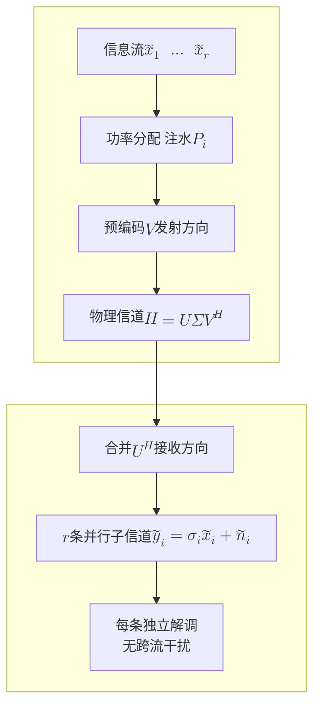
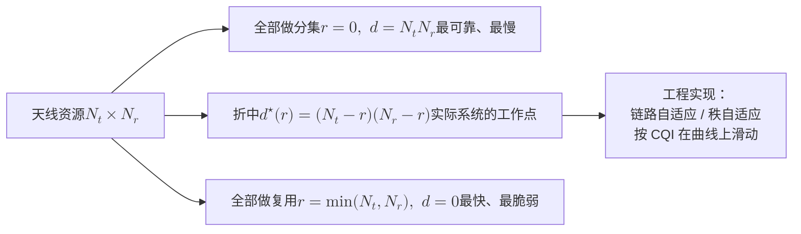

# 5 · 多天线：分集、复用与波束

前四章我们一直活在"一根天线对一根天线"的世界里：[第 1 章](01-em-waves-antennas.md)讲天线怎么把电流变成波，[第 2 章](02-wireless-channel-basics.md)讲这道波在路上遭遇了什么，[第 3 章](03-digital-communications.md)讲怎么把比特塞进波形，[第 4 章](04-information-theory-basics.md)讲这条链路的极限在哪。本章把天线从"一根"变成"一排"，故事立刻分岔成三条：同样的信息发很多遍（**分集**）、不同的信息同时发（**复用**）、把能量拧成一束（**阵列增益**）。这三条线不是三个技巧，而是同一个矩阵 $\mathbf{H}$ 的三种读法——理解了这一点，从 2×2 MIMO 到 256 阵元大规模 MIMO 再到 6G 的全息孔径，就是同一条路上的不同里程碑。

**你将学会：**

- 用一张演进图（SISO → SIMO → MISO → MIMO）把分集增益、复用增益、阵列增益三者的分工与代价一次讲清；
- 从柯西–施瓦茨不等式一步不跳地推出最大比合并（MRC）的 $N$ 倍 SNR 增益与 $N$ 阶分集，并算出它到底省几个 dB；
- 把 $\mathbf{y}=\mathbf{H}\mathbf{x}+\mathbf{n}$ 用 SVD 拆成 $\min(N_t,N_r)$ 条互不干扰的标量子信道，并亲手推出"MIMO 容量 = 特征值上注水"；
- 写出并解读容量公式 $C=\log_2\det\left(\mathbf{I}+\frac{\rho}{N_t}\mathbf{H}\mathbf{H}^H\right)$，从中读出高 SNR 的自由度 $\min(N_t,N_r)$ 与低 SNR 的纯阵列增益；
- 陈述分集–复用折中 $d^{\star}(r)=(N_t-r)(N_r-r)$ 并说清它的几何直觉；
- 排出 MIMO 检测的完整谱系（ML / ZF / MMSE / 球形译码），并知道 2026 年 8 月这条谱系上发生了什么；
- 推导大规模 MIMO 的两块基石——信道硬化与有利传播——并理解导频污染为什么不会随天线数增加而消失。

---

## 5.1 从 SISO 到 MIMO：一张演进图，三种增益

### 直觉：一个人喊话，还是一群人喊话

想象你在嘈杂的广场上对着远处的朋友喊话。

- **SISO**（单发单收）：你一个人喊，他一个人听。风向不对（深衰落）就全完了。
- **SIMO**（单发多收）：你一个人喊，他叫来三个朋友一起听，然后对比各自听到的内容。三个人同时被同一阵风盖住的概率远小于一个人——这是**接收分集**；而且三个人的信息合起来比一个人清楚——这是**阵列增益**。
- **MISO**（多发单收）：你叫来三个人一起喊同一句话，并且事先对好节拍，让声波在朋友那个位置同相叠加。这是**发射波束赋形**，要求你知道朋友在哪（CSIT，发端信道信息）。
- **MIMO**（多发多收）：三个人喊三句**不同**的话，对面三个人根据各自听到的混合声音把三句话分开。这是**空间复用**——真正把速率翻倍的那个增益。

最后这一步是质变：前三种都在提高**同一条**信息流的可靠性或强度，只有 MIMO 在同一段频谱、同一段时间里凭空多开了几条并行的信息管道。

```mermaid
flowchart TB
    S["SISO<br/>1 发 1 收<br/>$$y = h\cdot x + n$$"] --> SI["SIMO<br/>1 发 $$N$$ 收<br/>接收分集 + 阵列增益"]
    S --> MI["MISO<br/>$$M$$ 发 1 收<br/>发射分集 / 波束赋形"]
    SI --> M["MIMO<br/>$$M$$ 发 $$N$$ 收<br/>$$\mathbf{y} = \mathbf{H}\mathbf{x} + \mathbf{n}$$"]
    MI --> M
    M --> G1["分集增益<br/>最高 $$N_tN_r$$ 阶<br/>降低中断概率"]
    M --> G2["复用增益<br/>最高 $$\min(N_t,N_r)$$ 流<br/>提升自由度"]
    M --> G3["阵列增益<br/>最高 $$N_tN_r$$ 倍<br/>提升接收 SNR"]
    G1 -.折中.-> G2
    M --> MU["多用户 MIMO<br/>把复用增益分给不同用户"]
    MU --> MM["大规模 MIMO<br/>$$M \gg K$$，信道硬化"]
```

### 严格定义：三种增益各是什么

设总发射功率 $P$、噪声功率谱密度对应的噪声方差 $N_0$，记名义信噪比 $\rho = P/N_0$。

| 增益 | 严格定义 | 上限 | 需要什么 | 换来什么 |
|---|---|---|---|---|
| 阵列增益 $g_a$ | 平均接收 SNR 相对 SISO 的倍数 | $N_t N_r$（收发都需 CSI） | 收端 CSI 给 $N_r$；发端 CSI 再给 $N_t$ | 覆盖、边缘速率 |
| 分集阶数 $d$ | 高 SNR 下误码率 $P_e \doteq \rho^{-d}$ 中的指数 | $N_t N_r$ | 各链路独立衰落 | 可靠性、误码率斜率 |
| 复用增益 $r$ | 高 SNR 下速率 $R \doteq r\log_2\rho$ 中的系数 | $\min(N_t,N_r)$ | 信道矩阵满秩（丰富散射） | 峰值速率 |

这里的记号 $\doteq$ 表示"指数意义上相等"，即 $\lim_{\rho\to\infty}\frac{\log P_e}{\log \rho} = -d$。这个记号是本章后半段（分集–复用折中）的语言基础，先记住它只关心"斜率"，不关心常数因子。

!!! tip "直觉：三种增益在 BER 曲线上长什么样"
    把误码率曲线画在"横轴 SNR(dB)、纵轴 $\log_{10}P_e$"的图上：

    - **阵列增益**把曲线整体**左移** $10\log_{10} g_a$ dB——形状不变，只是省电；
    - **分集增益**把曲线**压陡**，斜率从 $-1$ 变成 $-d$（每 10 dB 下降 $d$ 个数量级）；
    - **复用增益**根本不在这张图上——它在"速率 vs SNR"图上，表现为高 SNR 直线的**斜率**从 1 变成 $r$。

    很多初学者的困惑源于把三张不同的图叠在一起看。记住：省电、变陡、变快，是三件事。

---

## 5.2 接收分集：最大比合并（MRC）的完整推导

### 模型与问题

考虑 SIMO：1 根发射天线、$N$ 根接收天线。发送符号 $x$，平均能量 $E[\lvert x \rvert^2] = E_s$。第 $i$ 根天线收到

$$
y_i = h_i x + n_i, \qquad i = 1,2,\dots,N,
$$

写成向量形式

$$
\mathbf{y} = \mathbf{h}x + \mathbf{n}, \qquad \mathbf{h} = [h_1,\dots,h_N]^T, \quad \mathbf{n}\sim\mathcal{CN}(\mathbf{0}, N_0\mathbf{I}_N).
$$

接收机做**线性合并**：用一个权向量 $\mathbf{w}\in\mathbb{C}^N$ 把 $N$ 路合成一路

$$
z = \mathbf{w}^H\mathbf{y} = \underbrace{(\mathbf{w}^H\mathbf{h})x}_{\text{信号}} + \underbrace{\mathbf{w}^H\mathbf{n}}_{\text{噪声}}.
$$

问题：$\mathbf{w}$ 怎么选，才能让合并后的 SNR 最大？

### 推导：四步到答案

**第一步，写出合并后的 SNR。** 信号功率为 $E_s\lvert \mathbf{w}^H\mathbf{h}\rvert^2$；噪声项 $\mathbf{w}^H\mathbf{n}$ 是零均值复高斯，方差为

$$
E\left[\lvert \mathbf{w}^H\mathbf{n}\rvert^2\right] = \mathbf{w}^H E[\mathbf{n}\mathbf{n}^H]\mathbf{w} = N_0\,\mathbf{w}^H\mathbf{w} = N_0\lVert\mathbf{w}\rVert^2 .
$$

于是

$$
\mathrm{SNR}(\mathbf{w}) = \frac{E_s\,\lvert \mathbf{w}^H\mathbf{h}\rvert^2}{N_0\,\lVert\mathbf{w}\rVert^2}.
$$

**第二步，用柯西–施瓦茨不等式定上界。** 对任意 $\mathbf{w},\mathbf{h}$，

$$
\lvert \mathbf{w}^H\mathbf{h}\rvert^2 \le \lVert\mathbf{w}\rVert^2\,\lVert\mathbf{h}\rVert^2,
$$

等号当且仅当 $\mathbf{w} = c\,\mathbf{h}$（$c$ 为任意非零复常数）。

**第三步，代回去。** 上界为

$$
\mathrm{SNR}(\mathbf{w}) \le \frac{E_s\lVert\mathbf{w}\rVert^2\lVert\mathbf{h}\rVert^2}{N_0\lVert\mathbf{w}\rVert^2} = \frac{E_s}{N_0}\lVert\mathbf{h}\rVert^2 ,
$$

取 $\mathbf{w}=\mathbf{h}$ 达到。这就是**最大比合并**（Maximal Ratio Combining, MRC）：每一路按其信道增益的共轭加权（$w_i^{*} = h_i^{*}$ 意味着先做相位对齐 $e^{-j\angle h_i}$，再按幅度 $\lvert h_i\rvert$ 加权）。

**第四步，把结果拆开看。** 令第 $i$ 路的瞬时 SNR 为 $\gamma_i = \frac{E_s\lvert h_i\rvert^2}{N_0}$，则

$$
\gamma_{\mathrm{MRC}} = \frac{E_s}{N_0}\sum_{i=1}^{N}\lvert h_i\rvert^2 = \sum_{i=1}^{N}\gamma_i .
$$

**物理意义**：MRC 把各支路的信噪比**直接相加**。这是一个很强的结论——它说明即使某一路信道很差（$\gamma_i$ 很小），把它加进来也只会让总 SNR 变好，绝不会变坏。"相位对齐后按幅度加权"正是最优的软性表决：信道好的支路说话声音大，信道差的支路声音小但不被完全丢弃。

**行为分析**：设各 $h_i$ 独立同分布、$E[\lvert h_i\rvert^2]=1$（归一化瑞利衰落），则

$$
E[\gamma_{\mathrm{MRC}}] = \frac{E_s}{N_0}\sum_{i=1}^{N}E[\lvert h_i\rvert^2] = N\cdot\frac{E_s}{N_0} = N\bar{\gamma},
$$

即**平均 SNR 提高 $N$ 倍**（$10\log_{10}N$ dB），这就是接收阵列增益。注意这份增益来自"多收了 $N$ 份能量"，与信道是否独立无关——哪怕 $N$ 根天线信道完全相同，阵列增益照样是 $N$。

### 分集阶数从哪来：中断概率的幂次

阵列增益只是"曲线左移"。真正让曲线**变陡**的，是 $\lVert\mathbf{h}\rVert^2 = \sum_i \lvert h_i\rvert^2$ 的**分布形状**改变了。

对独立瑞利衰落，$h_i\sim\mathcal{CN}(0,1)$ 的实部、虚部是两个独立的 $\mathcal{N}(0,1/2)$，故 $\lvert h_i\rvert^2$ 服从均值为 1 的指数分布；$N$ 个独立指数变量之和服从形状参数为 $N$ 的 Gamma 分布（其矩母函数 $(1-s)^{-N}$ 正是单个指数变量矩母函数 $1/(1-s)$ 的 $N$ 次方）：

$$
f_{\lVert\mathbf{h}\rVert^2}(u) = \frac{u^{N-1}e^{-u}}{(N-1)!}, \qquad u \ge 0 .
$$

**关键在 $u\to 0$ 处的行为。** 当 $u$ 很小时 $e^{-u}\approx 1$，于是

$$
\Pr\left\{\lVert\mathbf{h}\rVert^2 < \epsilon\right\} = \int_0^{\epsilon}\frac{u^{N-1}e^{-u}}{(N-1)!}\,\mathrm{d}u \approx \int_0^{\epsilon}\frac{u^{N-1}}{(N-1)!}\,\mathrm{d}u = \frac{\epsilon^{N}}{N!} .
$$

**物理意义**：深衰落的概率从 $N=1$ 时的 $\epsilon$（线性）变成了 $\epsilon^N$（$N$ 次幂）。直觉上完全合理：$N$ 条独立支路要**同时**掉进深坑，概率是单条概率的 $N$ 次方。这就是"分集"两个字的全部内容。

**行为分析**：把上式翻译成中断概率。**中断**（outage）指合并后 SNR 低于解调门限 $\gamma_{\mathrm{th}}$ 的事件（信息论口径见[第 4 章 4.8 节](04-information-theory-basics.md)）。每支路平均 SNR 为 $\bar{\gamma}=E_s/N_0$ 时 $\gamma_{\mathrm{MRC}}=\bar{\gamma}\lVert\mathbf{h}\rVert^2$，在上式中取 $\epsilon=\gamma_{\mathrm{th}}/\bar{\gamma}$：

$$
P_{\mathrm{out}} = \Pr\left\{\lVert\mathbf{h}\rVert^2<\frac{\gamma_{\mathrm{th}}}{\bar{\gamma}}\right\} \approx \frac{1}{N!}\left(\frac{\gamma_{\mathrm{th}}}{\bar{\gamma}}\right)^{N} \propto \bar{\gamma}^{-N} ,
$$

高 SNR 下 $\epsilon\to 0$，近似越来越准。取对数得 $\log P_{\mathrm{out}} = -N\log\bar{\gamma} + \text{const}$——在 log-log 图上就是斜率 $-N$ 的直线，分集阶数 $d = N$。相应地，BPSK 在 MRC 下的平均误比特率有闭式高 SNR 近似（Goldsmith 第 7 章）：

$$
P_b \approx \binom{2N-1}{N}\left(\frac{1}{4\bar{\gamma}}\right)^{N},
$$

其中 $\bar{\gamma}$ 是**每支路**平均 SNR。指数 $N$ 是分集阶数，前面的组合数是"编码增益"层面的常数——它随 $N$ 增大，说明分集的边际收益在递减。

!!! example "算例 5-1：分集到底省多少 dB"
    目标误比特率 $P_b = 10^{-3}$，BPSK，独立瑞利衰落，求所需的每支路平均 SNR $\bar{\gamma}$。

    - $N=1$：$\dfrac{1}{4\bar{\gamma}} = 10^{-3} \Rightarrow \bar{\gamma}=250 \Rightarrow 24.0$ dB
    - $N=2$：$\dfrac{3}{(4\bar{\gamma})^2}=10^{-3} \Rightarrow (4\bar{\gamma})^2 = 3000 \Rightarrow \bar{\gamma}=13.7 \Rightarrow 11.4$ dB
    - $N=4$：$\dfrac{35}{(4\bar{\gamma})^4}=10^{-3} \Rightarrow (4\bar{\gamma})^4 = 3.5\times10^{4} \Rightarrow \bar{\gamma}=3.42 \Rightarrow 5.3$ dB

    **读数一**：从 1 支路到 4 支路，每支路需求从 24.0 dB 降到 5.3 dB，省了 **18.7 dB**。其中只有 $10\log_{10}4 = 6.0$ dB 是阵列增益，剩下 **12.7 dB 是纯粹的分集红利**——它不来自多收能量，只来自"概率上不再全军覆没"。

    **读数二**：$N=4$ 时合并后的平均 SNR 为 $4\times 3.42 = 13.7$（11.4 dB）；同样 BPSK 在**无衰落** AWGN 信道达到 $10^{-3}$ 只需 6.8 dB。也就是说，四阶分集之后仍有 4.6 dB 的"衰落罚金"没还清。分集能把衰落信道拉向 AWGN 信道，但收敛得并不快——这正是后面"分集的边际收益递减，不如把资源投到复用上"这一判断的数量依据。

---

## 5.3 发射波束赋形：阵列增益、码本与波束管理

### MISO 的最优发射：最大比发射（MRT）

现在把天线搬到发端：$N_t$ 根发射天线、1 根接收天线。信道为行向量 $\mathbf{h}^H\in\mathbb{C}^{1\times N_t}$，发端用单位范数权向量 $\mathbf{w}$（$\lVert\mathbf{w}\rVert=1$）承载符号 $s$：

$$
y = \mathbf{h}^H\mathbf{w}s + n, \qquad E[\lvert s\rvert^2] = P .
$$

接收 SNR 为 $\dfrac{P\lvert\mathbf{h}^H\mathbf{w}\rvert^2}{N_0}$。同样由柯西–施瓦茨，$\lvert\mathbf{h}^H\mathbf{w}\rvert^2\le\lVert\mathbf{h}\rVert^2\lVert\mathbf{w}\rVert^2 = \lVert\mathbf{h}\rVert^2$，等号取在

$$
\mathbf{w}_{\mathrm{MRT}} = \frac{\mathbf{h}}{\lVert\mathbf{h}\rVert} \quad\Longrightarrow\quad \mathrm{SNR}_{\max} = \frac{P\lVert\mathbf{h}\rVert^2}{N_0}.
$$

**物理意义**：形式上与 MRC 一模一样，但物理过程相反。MRC 是"收到之后对齐相位再相加"，MRT 是"发出去之前预先反转相位，让它们到达接收点时同相"。数学的对称性掩盖了一个关键的工程不对称：**MRC 只需要收端 CSI（收端本来就要估计信道），MRT 需要发端 CSI**——这在 FDD 系统里意味着反馈开销，在 TDD 系统里意味着依赖信道互易性。这个不对称是 5G 大规模 MIMO 选择 TDD 的主要原因之一。

**行为分析**：平均 SNR 为 $\frac{P}{N_0}E[\lVert\mathbf{h}\rVert^2] = N_t\frac{P}{N_0}$——阵列增益 $N_t$，分集阶数也是 $N_t$。**两份增益都拿到了**。

### 没有 CSIT 怎么办：Alamouti 空时码

若发端不知道 $\mathbf{h}$，MRT 无从谈起。Alamouti（1998）给出了 $N_t=2$ 的经典答案：在两个符号周期上发送

$$
\mathbf{X} = \begin{bmatrix} s_1 & -s_2^{*} \\ s_2 & s_1^{*} \end{bmatrix},
$$

（行为天线、列为时隙）。接收端两个时隙分别收到

$$
\begin{aligned}
y_1 &= h_1 s_1 + h_2 s_2 + n_1,\\
y_2 &= -h_1 s_2^{*} + h_2 s_1^{*} + n_2 .
\end{aligned}
$$

**关键一步**：把第二式取共轭，得 $y_2^{*} = h_2^{*}s_1 - h_1^{*}s_2 + n_2^{*}$，未知量又变回 $s_1,s_2$，两式合并为

$$
\begin{bmatrix} y_1 \\ y_2^{*}\end{bmatrix} = \underbrace{\begin{bmatrix} h_1 & h_2 \\ h_2^{*} & -h_1^{*}\end{bmatrix}}_{\mathbf{H}_{\mathrm{eff}}}\begin{bmatrix} s_1 \\ s_2\end{bmatrix} + \begin{bmatrix} n_1 \\ n_2^{*}\end{bmatrix}.
$$

逐元素验算（$\mathbf{H}_{\mathrm{eff}}^H$ 是共轭转置）：

$$
\mathbf{H}_{\mathrm{eff}}^H\mathbf{H}_{\mathrm{eff}} = \begin{bmatrix} h_1^{*} & h_2 \\ h_2^{*} & -h_1\end{bmatrix}\begin{bmatrix} h_1 & h_2 \\ h_2^{*} & -h_1^{*}\end{bmatrix} = \begin{bmatrix} \lvert h_1\rvert^2+\lvert h_2\rvert^2 & h_1^{*}h_2 - h_2h_1^{*} \\ h_2^{*}h_1 - h_1h_2^{*} & \lvert h_2\rvert^2+\lvert h_1\rvert^2\end{bmatrix} = \left(\lvert h_1\rvert^2+\lvert h_2\rvert^2\right)\mathbf{I}_2 .
$$

两个非对角元都是"同一个乘积减去它自己"，无论 $h_1,h_2$ 取什么值都恒为零——码字里 $-s_2^{*}$ 的负号就是为此而设。左乘 $\mathbf{H}_{\mathrm{eff}}^H$ 后，每个符号前的系数为 $g=\lvert h_1\rvert^2+\lvert h_2\rvert^2$，噪声方差为 $N_0g$；每根天线分得功率 $P/2$，故每个符号的 SNR $=\frac{(P/2)g^2}{N_0g}=\frac{P}{2N_0}g$。

**物理意义**：$\mathbf{H}_{\mathrm{eff}}$ 的两列**正交**，所以接收端只需左乘 $\mathbf{H}_{\mathrm{eff}}^H$，两个符号就自动解耦，各自获得 SNR $=\frac{P}{2N_0}\left(\lvert h_1\rvert^2+\lvert h_2\rvert^2\right)$——分集阶数 2，与 MRT 相同。

**行为分析**：注意那个 $\frac{P}{2}$：功率被平分到两根天线上，且因为不知道相位无法相干叠加，**阵列增益为 1 而不是 2**。所以 Alamouti 比 2 天线 MRT 恰好差 3 dB。这是一个干净的定量结论：**发端 CSI 的价值 = 3 dB**（$N_t$ 根天线则是 $10\log_{10}N_t$ dB）。

### 波束的几何：宽度、码本与扫描

均匀线阵（ULA）、阵元间距 $d=\lambda/2$、$N$ 阵元，指向角 $\theta_0$ 的导向矢量为

$$
\mathbf{a}(\theta_0) = \frac{1}{\sqrt{N}}\left[1,\; e^{-j\pi\sin\theta_0},\; \dots,\; e^{-j\pi(N-1)\sin\theta_0}\right]^T .
$$

取 $\mathbf{w}=\mathbf{a}(\theta_0)$ 即"把波束对准 $\theta_0$"。其半功率波束宽度（正侧射方向）近似为

$$
\Theta_{\mathrm{HPBW}} \approx \frac{0.886\lambda}{Nd} \ \text{rad} \approx \frac{102^{\circ}}{N} \quad (d=\lambda/2).
$$

**行为分析**：阵元数 $N$ 一方面把增益抬高 $10\log_{10}N$ dB，一方面把波束宽度压窄成 $1/N$——两者是同一枚硬币：总辐射功率守恒，照得越窄自然越亮。代价也随之而来：波束越窄，**对准**就越难，这就是"波束管理"成为独立工程课题的根源。

实际系统不会为每个角度实时算 $\mathbf{a}(\theta)$，而是预先定义一组**码本**（codebook）。最常见的是 DFT 码本，第 $m$ 个波束为

$$
\mathbf{w}_m[n] = \frac{1}{\sqrt{N}}e^{\,j2\pi mn/N}, \qquad n=0,\dots,N-1,\ m=0,\dots,N-1,
$$

它恰好把整个角度空间用 $N$ 个互相正交的波束铺满。5G NR 的波束扫描机制正是基于此：基站周期性地在不同方向发送同步信号块（SSB），在 FR2（毫米波）频段最多可配置 64 个候选 SSB，终端逐个测量并上报最强的那个。

!!! example "算例 5-2：64 阵元波束的三个数字"
    取 $N=64$、$d=\lambda/2$、载频 28 GHz（$\lambda \approx 10.7$ mm）：

    1. **阵列增益**：$10\log_{10}64 = 18.1$ dB。若单阵元增益 5 dBi，整阵约 23 dBi。
    2. **波束宽度**：$\Theta_{\mathrm{HPBW}} \approx 102^{\circ}/64 \approx 1.6^{\circ}$。在 100 m 处，波束在横向只覆盖 $100\times\tan(1.6^{\circ}) \approx 2.8$ m——**一个走动的行人几步就能走出波束**。
    3. **扫描开销**：若收发两端各 64 个波束，穷举配对需 $64\times64 = 4096$ 次测量。按 SSB 周期 20 ms、每周期扫 64 个发射波束计，穷举一轮需 $64\times 20\ \text{ms} = 1.28$ s——完全不可接受。

    第 3 条解释了为什么工程上必须用**分层搜索**：先用 8 个宽波束粗扫（8 次），锁定扇区后在该扇区内用 8 个窄波束细扫（8 次），共 16 次而不是 64 次，开销降到 $1/4$；两端都分层则从 4096 降到 256。第 2 条则解释了为什么毫米波系统必须有波束失败恢复（BFR）机制。

---

## 5.4 MIMO 信道矩阵与 SVD：把矩阵信道拆成并行子信道

### 模型

$N_t$ 根发射天线、$N_r$ 根接收天线，窄带平坦衰落下

$$
\mathbf{y} = \mathbf{H}\mathbf{x} + \mathbf{n},
$$

其中 $\mathbf{y}\in\mathbb{C}^{N_r}$，$\mathbf{x}\in\mathbb{C}^{N_t}$ 且 $E[\lVert\mathbf{x}\rVert^2]\le P$，$\mathbf{n}\sim\mathcal{CN}(\mathbf{0},N_0\mathbf{I}_{N_r})$，$\mathbf{H}\in\mathbb{C}^{N_r\times N_t}$ 的第 $(i,j)$ 元 $h_{ij}$ 是"第 $j$ 根发射天线到第 $i$ 根接收天线"的复增益。

这个模型看上去平淡无奇，但它是本章后面一切的载体。核心问题只有一个：**$\mathbf{H}$ 把 $N_t$ 维输入搅成了 $N_r$ 维输出，这个"搅"能不能解开？**

### SVD：线性代数给出的答案

任何复矩阵都有奇异值分解（Singular Value Decomposition）：

$$
\mathbf{H} = \mathbf{U}\boldsymbol{\Sigma}\mathbf{V}^H,
$$

其中 $\mathbf{U}\in\mathbb{C}^{N_r\times N_r}$ 与 $\mathbf{V}\in\mathbb{C}^{N_t\times N_t}$ 是酉矩阵（$\mathbf{U}^H\mathbf{U}=\mathbf{I}$，$\mathbf{V}^H\mathbf{V}=\mathbf{I}$），$\boldsymbol{\Sigma}\in\mathbb{R}^{N_r\times N_t}$ 是"对角"矩阵，对角元为奇异值 $\sigma_1\ge\sigma_2\ge\dots\ge\sigma_k\ge 0$，$k=\min(N_t,N_r)$。非零奇异值的个数就是 $\mathbf{H}$ 的秩 $r$。

SVD 的每一列都有几何含义：把 $\mathbf{H}=\mathbf{U}\boldsymbol{\Sigma}\mathbf{V}^H$ 右乘 $\mathbf{V}$ 得 $\mathbf{H}\mathbf{V}=\mathbf{U}\boldsymbol{\Sigma}$，逐列读就是 $\mathbf{H}\mathbf{v}_i=\sigma_i\mathbf{u}_i$——沿 $\mathbf{V}$ 的第 $i$ 列发出的信号，经过信道后恰好沿 $\mathbf{U}$ 的第 $i$ 列到达，只被放大 $\sigma_i$ 倍；各 $\mathbf{u}_i$ 互相垂直，收端用 $\mathbf{u}_i^H$ 一投影就只剩第 $i$ 路。例如下文算例 5-3 的 $\mathbf{H}=\begin{bmatrix}1 & 0.5\\ 0.5 & 1\end{bmatrix}$ 有 $\mathbf{v}_1=\mathbf{u}_1=\frac{1}{\sqrt{2}}[1,1]^T$（$\sigma_1=1.5$）、$\mathbf{v}_2=\mathbf{u}_2=\frac{1}{\sqrt{2}}[1,-1]^T$（$\sigma_2=0.5$）。发 $\mathbf{x}=2\mathbf{v}_1+\mathbf{v}_2$，无噪声时两根天线收到的都是混合信号 $\mathbf{H}\mathbf{x}\approx[2.47,\,1.77]^T$，但 $\mathbf{u}_1^H\mathbf{H}\mathbf{x}=3=1.5\times2$、$\mathbf{u}_2^H\mathbf{H}\mathbf{x}=0.5=0.5\times1$，两路被干净地分开。发端要用 $\mathbf{V}$，所以这个方案要求 CSIT。

**关键操作**：发端不直接发 $\mathbf{x}$，而是先对信息向量 $\tilde{\mathbf{x}}$ 做**预编码** $\mathbf{x}=\mathbf{V}\tilde{\mathbf{x}}$；收端对 $\mathbf{y}$ 做**匹配滤波** $\tilde{\mathbf{y}}=\mathbf{U}^H\mathbf{y}$。逐步代入：

$$
\begin{aligned}
\tilde{\mathbf{y}} &= \mathbf{U}^H\mathbf{y} \\
&= \mathbf{U}^H\left(\mathbf{H}\mathbf{V}\tilde{\mathbf{x}} + \mathbf{n}\right) \\
&= \mathbf{U}^H\left(\mathbf{U}\boldsymbol{\Sigma}\mathbf{V}^H\mathbf{V}\tilde{\mathbf{x}} + \mathbf{n}\right) \\
&= \left(\mathbf{U}^H\mathbf{U}\right)\boldsymbol{\Sigma}\left(\mathbf{V}^H\mathbf{V}\right)\tilde{\mathbf{x}} + \mathbf{U}^H\mathbf{n} \\
&= \boldsymbol{\Sigma}\tilde{\mathbf{x}} + \tilde{\mathbf{n}} .
\end{aligned}
$$

这一步要成立必须核对两件事，缺一不可：

**核对一：噪声没有被放大。** $\tilde{\mathbf{n}}=\mathbf{U}^H\mathbf{n}$ 的协方差为

$$
E\left[\tilde{\mathbf{n}}\tilde{\mathbf{n}}^H\right] = \mathbf{U}^H E[\mathbf{n}\mathbf{n}^H]\mathbf{U} = N_0\,\mathbf{U}^H\mathbf{U} = N_0\mathbf{I}.
$$

循环对称复高斯经酉变换后分布不变——白噪声还是白噪声，这是 SVD 方案免费的好处，也是它与后面 ZF 检测（会放大噪声）的根本区别。

**核对二：功率没有被偷偷加码。** $\lVert\mathbf{x}\rVert^2 = \tilde{\mathbf{x}}^H\mathbf{V}^H\mathbf{V}\tilde{\mathbf{x}} = \lVert\tilde{\mathbf{x}}\rVert^2$。酉预编码保功率，功率约束原样传递到 $\tilde{\mathbf{x}}$。

于是矩阵信道被彻底拆成 $r$ 条**互不干扰的标量信道**：

$$
\tilde{y}_i = \sigma_i\tilde{x}_i + \tilde{n}_i, \qquad i=1,\dots,r .
$$



!!! success "关键结论"
    SVD 的物理含义：$\mathbf{V}$ 的列向量是**发射方向**（激励哪种空间模式），$\mathbf{U}$ 的列向量是**接收方向**（在哪个空间模式上接收），$\sigma_i$ 是这对方向之间的"管道粗细"。MIMO 信道不是"$N_tN_r$ 条纠缠在一起的路径"，而是"$r$ 条粗细不同、互不相扰的空间管道"。**看不见的空间被 SVD 变成了可数的管道。**

### 功率怎么分：注水的完整推导

各子信道的信噪比为 $P_i\sigma_i^2/N_0$，总速率

$$
R = \sum_{i=1}^{r}\log_2\left(1+\frac{P_i\sigma_i^2}{N_0}\right), \qquad \text{s.t.}\ \sum_{i=1}^{r}P_i \le P,\ P_i\ge 0 .
$$

目标函数关于 $P_i$ 是凹的，约束是线性的——这是标准凸问题（[第 7 章](07-optimization-basics.md)）。构造拉格朗日函数

$$
L(\{P_i\},\lambda) = \sum_{i=1}^{r}\log_2\left(1+\frac{P_i\sigma_i^2}{N_0}\right) - \lambda\left(\sum_{i=1}^{r}P_i - P\right).
$$

对 $P_i$ 求偏导并令其为零：

$$
\frac{\partial L}{\partial P_i} = \frac{1}{\ln 2}\cdot\frac{\sigma_i^2/N_0}{1+P_i\sigma_i^2/N_0} - \lambda = 0 .
$$

整理左边：$\frac{\sigma_i^2/N_0}{1+P_i\sigma_i^2/N_0} = \frac{1}{N_0/\sigma_i^2 + P_i}$，代入得

$$
P_i + \frac{N_0}{\sigma_i^2} = \frac{1}{\lambda\ln 2} \;\triangleq\; \mu .
$$

上式默认了 $P_i>0$。给约束 $P_i\ge 0$ 配乘子 $\nu_i\ge 0$，驻点条件变成 $\frac{1}{\ln 2}\cdot\frac{1}{N_0/\sigma_i^2+P_i} = \lambda-\nu_i$，配合互补松弛 $\nu_iP_i=0$ 分两种情形：

- **$P_i>0$**：$\nu_i=0$，得 $P_i=\mu-N_0/\sigma_i^2$，这要求 $\mu>N_0/\sigma_i^2$；
- **$P_i=0$**：$\nu_i=\lambda-\frac{\sigma_i^2}{N_0\ln 2}\ge 0$，等价于 $\mu\le N_0/\sigma_i^2$。

两个判据恰好互补，合写成取正部的形式；速率关于每个 $P_i$ 严格递增，功率必然用满，$\sum_iP_i=P$ 确定水位 $\mu$。最终解为

$$
P_i = \left(\mu - \frac{N_0}{\sigma_i^2}\right)^{+}, \qquad \sum_{i=1}^{r}P_i = P,
$$

其中 $(a)^+=\max(a,0)$。它与[第 7 章 7.5 节](07-optimization-basics.md)的注水定理是同一个结果：那里速率以 nat 计、水位 $\mu=1/\lambda$，这里以 bit 计，多出的 $1/\ln 2$ 并进了 $\mu$。**注意 $\sigma$ 换了含义**：第 7 章的 $\sigma^2$ 是噪声功率，本章的 $\sigma_i$ 是奇异值。

**物理意义**：把 $N_0/\sigma_i^2$ 想成第 $i$ 个池子的**底面高度**（信道越差、$\sigma_i$ 越小，底越高），$\mu$ 是统一的**水面高度**，$P_i$ 是第 $i$ 个池子里的水深。水往低处流：好信道分到更多功率，底比水面还高的差信道分到零功率、直接关闭。这就是"**MIMO 容量 = 在特征值上注水**"这句口诀的完整含义。

**行为分析**：注水解的形态随 SNR 剧变。高 SNR 时 $\mu \gg N_0/\sigma_i^2$，各 $P_i\approx\mu$，注水**退化为等功率分配**；低 SNR 时 $\mu$ 很低，只有最大的那个 $\sigma_1$ 露出水面，注水**退化为单流波束赋形**。下面的算例把这两端都算一遍。

!!! example "算例 5-3：2×2 信道上亲手注一次水"
    取 $\mathbf{H}=\begin{bmatrix}1 & 0.5\\ 0.5 & 1\end{bmatrix}$（对称实矩阵，奇异值即特征值）：$\sigma_1 = 1.5$，$\sigma_2 = 0.5$，故 $\sigma_1^2 = 2.25$，$\sigma_2^2 = 0.25$。令 $N_0=1$。

    **高 SNR：$P = 10$（10 dB）**

    池底高度：$1/2.25 = 0.444$ 与 $1/0.25 = 4$。假设两条都开：

    $$
    (\mu - 0.444) + (\mu - 4) = 10 \;\Rightarrow\; \mu = 7.222 .
    $$

    两者均为正，假设成立：$P_1 = 6.78$，$P_2 = 3.22$。

    $$
    C = \log_2(1+6.78\times 2.25) + \log_2(1+3.22\times 0.25) = 4.02 + 0.85 = 4.87\ \text{bit/s/Hz}.
    $$

    等功率（$P_1=P_2=5$）给出 $\log_2(12.25)+\log_2(2.25) = 3.61+1.17 = 4.79$。**注水只多赚 1.8%**。

    **低 SNR：$P = 0.5$（−3 dB）**

    若两条都开需 $2\mu = 0.5+4.444$，即 $\mu = 2.47 < 4$——第二个池子的底比水面还高，故 $P_2 = 0$。关掉第二条后重算水位：$\mu = 0.5+0.444 = 0.944$，仍低于第二个池底 4，确认它该关；全部功率 $P_1=0.5$ 给第一条：

    $$
    C = \log_2(1+0.5\times 2.25) = 1.09\ \text{bit/s/Hz}.
    $$

    等功率给出 $\log_2(1.5625)+\log_2(1.0625) = 0.64+0.09 = 0.73$。**注水多赚 49%**。

    **结论（很重要）**：注水在高 SNR 几乎无用，在低 SNR 却能决定性地提升速率。这解释了工程惯例——宏站高 SNR 区域直接等功率多流，覆盖边缘则退回单流波束赋形。同一个公式，两种工程形态。

!!! note "OFDM 与 MIMO 为什么是天生一对"

    本节的模型 $\mathbf{y}=\mathbf{H}\mathbf{x}+\mathbf{n}$ 假设窄带平坦衰落。真实的宽带信道是频率选择性的：每对收发天线之间都是一个有多个抽头的冲激响应，信道成了一个矩阵值的卷积 $\mathbf{y}[n]=\sum_{\ell}\mathbf{H}_\ell\,\mathbf{x}[n-\ell]+\mathbf{n}[n]$，前后符号之间、不同天线之间同时串扰。

    OFDM 把这团纠缠一刀切开。[第 3 章 3.7 节](03-digital-communications.md#37-ofdm把一条难走的频选信道切成一堆好走的平坦信道)说过，循环前缀把线性卷积变成循环卷积，DFT 再把循环卷积变成逐个子载波的乘法。这一步对每一对天线各自成立，而所有天线共用同一组子载波，所以第 $k$ 个子载波上

    $$
    \mathbf{y}_k=\mathbf{H}_k\mathbf{x}_k+\mathbf{n}_k,\qquad \mathbf{H}_k=\sum_{\ell}\mathbf{H}_\ell\,e^{-j2\pi k\ell/N},
    $$

    正好是本节的窄带模型，每个子载波一份（$N$ 是子载波数）。于是 SVD、注水、检测、预编码都可以逐个子载波独立地做，计算量随子载波数线性增长；不用 OFDM 而在时域里联合均衡，就得同时对付时延和天线两个维度的纠缠。4G 以来几乎所有多天线系统都建在 OFDM 上，这是原因之一，也是新波形想取代 OFDM 时必须跨过的一道门槛（[第 10 章 10.5 节](10-new-phy-dof.md#105-新波形otfsafdm-与-ofdm-的护城河)）。前提是两条：多径时延扩展落在循环前缀之内，一个 OFDM 符号之内信道不变。

---

## 5.5 MIMO 容量与自由度：从 $\log\det$ 到 $\min(N_t,N_r)\log\mathrm{SNR}$

### 容量公式的推导

设输入 $\mathbf{x}\sim\mathcal{CN}(\mathbf{0},\mathbf{Q})$，$\mathrm{tr}(\mathbf{Q})\le P$（取高斯输入的理由与[第 4 章 4.6 节](04-information-theory-basics.md)相同：协方差给定时，高斯分布的微分熵最大）。由[第 4 章](04-information-theory-basics.md)，互信息为

$$
I(\mathbf{x};\mathbf{y}) = h(\mathbf{y}) - h(\mathbf{y}\mid\mathbf{x}) = h(\mathbf{y}) - h(\mathbf{n}),
$$

第二个等号用了"给定 $\mathbf{x}$ 后 $\mathbf{y}$ 的随机性全部来自 $\mathbf{n}$"。此时 $\mathbf{y}$ 是独立复高斯向量的线性组合，仍是复高斯，协方差为 $\mathbf{H}\mathbf{Q}\mathbf{H}^H+N_0\mathbf{I}$（交叉项因 $\mathbf{x}$、$\mathbf{n}$ 独立且零均值而为零）。复高斯的微分熵 $h = \log_2\det(\pi e\,\mathbf{K})$ 这样来：标量 $\mathcal{CN}(0,s^2)$ 的实部、虚部是两个独立的 $\mathcal{N}(0,s^2/2)$，两份实高斯熵相加得 $2\times\frac{1}{2}\log_2(2\pi e\,s^2/2)=\log_2(\pi e\,s^2)$；向量情形先用酉变换把 $\mathbf{K}$ 对角化（不改变熵），各分量相加得 $\sum_i\log_2(\pi e\,\kappa_i)=\log_2\det(\pi e\,\mathbf{K})$，$\kappa_i$ 为 $\mathbf{K}$ 的特征值。于是

$$
\begin{aligned}
I(\mathbf{x};\mathbf{y}) &= \log_2\det\left(\pi e\left(\mathbf{H}\mathbf{Q}\mathbf{H}^H+N_0\mathbf{I}\right)\right) - \log_2\det\left(\pi e N_0\mathbf{I}\right)\\
&= \log_2\frac{\det\left(\mathbf{H}\mathbf{Q}\mathbf{H}^H+N_0\mathbf{I}\right)}{\det\left(N_0\mathbf{I}\right)}\\
&= \log_2\det\left(\mathbf{I}+\frac{1}{N_0}\mathbf{H}\mathbf{Q}\mathbf{H}^H\right).
\end{aligned}
$$

上式对任何 $\mathbf{Q}$ 都成立，怎么选 $\mathbf{Q}$ 取决于发端知道多少。发端**知道** $\mathbf{H}$（CSIT）时，取 $\mathbf{Q}=\mathbf{V}\,\mathrm{diag}(P_i)\,\mathbf{V}^H$（沿 $\mathbf{v}_i$ 发、功率 $P_i$），则 $\mathbf{H}\mathbf{Q}\mathbf{H}^H=\mathbf{U}\,\mathrm{diag}(P_i\sigma_i^2)\,\mathbf{U}^H$；酉矩阵不改变行列式，上式化为 $\sum_{i=1}^{r}\log_2(1+P_i\sigma_i^2/N_0)$——正是 5.4 节的 $R$。可以证明这样对齐已是最优，所以**有 CSIT 时的容量就是 5.4 节的注水解**。

若发端**不知道** $\mathbf{H}$（无 CSIT），它无从对准任何特征方向，最自然的选择是各天线等功率、互不相关地发，即 $\mathbf{Q}=\frac{P}{N_t}\mathbf{I}$；Telatar（1999）证明对 i.i.d. 瑞利信道这正是使遍历容量 $E_{\mathbf{H}}[I]$ 最大的输入。代入并记 $\rho = P/N_0$（下式对每个 $\mathbf{H}$ 求值，再对 $\mathbf{H}$ 平均就是遍历容量）：

$$
C = \log_2\det\left(\mathbf{I}+\frac{\rho}{N_t}\mathbf{H}\mathbf{H}^H\right) \quad \text{bit/s/Hz}.
$$

**等价的特征值形式**：由 SVD，$\mathbf{H}\mathbf{H}^H=\mathbf{U}\boldsymbol{\Sigma}\boldsymbol{\Sigma}^T\mathbf{U}^H$，其非零特征值为 $\lambda_i = \sigma_i^2$（$i=1,\dots,r$），其余为零（此处 $\lambda_i$ 是特征值，与 5.3 节的波长、5.4 节的乘子 $\lambda$ 无关）。利用 $\det(\mathbf{I}+\mathbf{A}) = \prod(1+\lambda_i(\mathbf{A}))$，零特征值只贡献因子 1：

$$
C = \sum_{i=1}^{r}\log_2\left(1+\frac{\rho}{N_t}\sigma_i^2\right).
$$

**物理意义**：容量是 $r$ 条子信道容量之和，与 5.4 节的 SVD 图像完全吻合。$\log\det$ 只是"把并行子信道求和"写成了矩阵语言。$\det$ 度量的是 $\mathbf{H}$ 张开的"体积"——体积大意味着各方向都通畅，体积塌缩意味着信道退化成低秩。

### 两个极限：自由度与阵列增益

**高 SNR（$\rho\to\infty$）**：

$$
C = \sum_{i=1}^{r}\log_2\left(1+\frac{\rho}{N_t}\sigma_i^2\right) \approx \sum_{i=1}^{r}\log_2\left(\frac{\rho\sigma_i^2}{N_t}\right) = r\log_2\rho + \sum_{i=1}^{r}\log_2\frac{\sigma_i^2}{N_t}.
$$

**物理意义**：斜率是 $r$。秩不超过行数与列数，故 $r\le\min(N_t,N_r)$；而任取一个 $k\times k$ 子矩阵（$k=\min(N_t,N_r)$），其行列式是各元素的一个不恒为零的多项式，元素服从连续分布时它恰好等于 0 的概率为 0。所以丰富散射下 $\mathbf{H}$ 以概率 1 满秩，$r = \min(N_t,N_r)$，于是

$$
C \approx \min(N_t,N_r)\cdot\log_2\rho + O(1).
$$

这就是**空间自由度**（DoF），正式定义为 $\lim_{\rho\to\infty}C(\rho)/\log_2\rho$，$O(1)$ 指不随 $\rho$ 增长的常数项：SNR 每翻一倍（3 dB），容量增加 $\min(N_t,N_r)$ 比特而不是 1 比特。第二项 $\sum\log_2(\sigma_i^2/N_t)$ 是**编码增益**——它把曲线上下平移，但不改斜率。

**行为分析**：DoF 由 $\min$ 而非 $\max$ 决定，也不是 $N_tN_r$。直觉：$N_t$ 是"能发出多少个独立方向"，$N_r$ 是"能分辨多少个独立方向"，管道数由两头的瓶颈决定——就像水管两端接口，细的那端说了算。而 $N_tN_r$ 那个大数字属于**分集**（独立路径的条数），不属于复用。这是初学者最常混淆的一处。

**低 SNR（$\rho\to 0$）**：利用 $\log_2\det(\mathbf{I}+\mathbf{A})\approx\frac{1}{\ln 2}\mathrm{tr}(\mathbf{A})$（因 $\log(1+x)\approx x$）：

$$
C \approx \frac{1}{\ln 2}\cdot\frac{\rho}{N_t}\,\mathrm{tr}\left(\mathbf{H}\mathbf{H}^H\right) = \frac{\rho}{N_t\ln 2}\lVert\mathbf{H}\rVert_F^2 .
$$

代入 $E\left[\lVert\mathbf{H}\rVert_F^2\right] = N_tN_r$：

$$
E[C] \approx \frac{\rho\,N_r}{\ln 2}.
$$

**物理意义**：低 SNR 下容量只随 **$N_r$** 线性增长，与 $N_t$ 无关——**没有复用增益，只有接收阵列增益**。功率受限时，多流是奢侈品：把功率摊到多条流上，每条流都在 $\log(1+x)\approx x$ 的线性区，分不分流总和一样，反倒不如集中功率保证一条流的可靠性。

!!! example "算例 5-4：同样的能量，三种信道结构，三种命运"
    取 $N_t=N_r=4$、$\rho = 20$ dB（即 100），并固定总信道能量 $\lVert\mathbf{H}\rVert_F^2 = \mathrm{tr}(\mathbf{H}\mathbf{H}^H) = N_tN_r = 16$。$\frac{\rho}{N_t} = 25$。

    **(A) 理想丰富散射**（$\mathbf{H}\mathbf{H}^H = 4\mathbf{I}$，四个特征值各为 4）：

    $$
    C = 4\log_2\left(1+25\times 4\right) = 4\times 6.66 = 26.6\ \text{bit/s/Hz}.
    $$

    **(B) 纯视距 / 秩 1**（$\mathbf{H}=\mathbf{a}_r\mathbf{a}_t^H$，唯一特征值 $\lambda_1 = 16$）：

    $$
    C = \log_2\left(1+25\times 16\right) = \log_2 401 = 8.65\ \text{bit/s/Hz}.
    $$

    **(C) SISO 基准**：$C = \log_2(1+100) = 6.66$ bit/s/Hz。

    **读数一**：A 与 B 的信道总能量**完全相同**，容量却差 3.1 倍。MIMO 的复用增益买的不是能量，是**结构**——散射体越丰富，特征值越均匀，容量越高。这个"多径从敌人变成朋友"的翻转，是 MIMO 最反直觉也最深刻的一句话。

    **读数二**：B 相对 C 只多了 $8.65-6.66 = 2.0$ bit/s/Hz，全部来自阵列增益，一点复用增益也没有。这份阵列增益只有 6 dB（$4\times$），而不是 $N_tN_r$ 对应的 12 dB（$16\times$）：唯一特征值 16 要乘上 $\frac{\rho}{N_t}=25$，有效 SNR 为 $400=4\rho$——发端不知道 $\mathbf{H}$，功率均摊到 4 根天线上无法对准，只兑现了接收端的 $N_r=4$ 倍。若发端知道 $\mathbf{H}$ 并做 MRT，才能拿满 16 倍：$\log_2(1+1600)=10.6$ bit/s/Hz。**天线多 $\neq$ 容量高，还得看秩。**

    **读数三**：把 $\rho$ 从 100 提到 200（+3 dB），A 变成 $4\log_2(1+50\times4) = 30.6$，正好 **+4 bit**——自由度 $\min(4,4)=4$ 的直接读数。

!!! note "级联信道的秩：中间那段卡住了，两头加天线也没用"

    不少新架构的信道是两段串起来的：基站经智能超表面到用户（[第 9 章 9.3 节](09-new-landscape.md#级联信道模型)），基站经中继到用户，地面站经卫星到地面。设第一段 $\mathbf{H}_1\in\mathbb{C}^{M\times N_t}$，中间的处理（超表面的相移、中继的放大）是 $\boldsymbol{\Theta}\in\mathbb{C}^{M\times M}$，第二段 $\mathbf{H}_2\in\mathbb{C}^{N_r\times M}$，等效信道 $\mathbf{H}=\mathbf{H}_2\boldsymbol{\Theta}\mathbf{H}_1$。矩阵乘积的秩不超过任何一个因子的秩：

    $$
    \operatorname{rank}(\mathbf{H}_2\boldsymbol{\Theta}\mathbf{H}_1)\le\min\big(\operatorname{rank}\mathbf{H}_1,\ \operatorname{rank}\boldsymbol{\Theta},\ \operatorname{rank}\mathbf{H}_2\big).
    $$

    理由是列空间越乘越小：对任意 $\mathbf{x}$，$\mathbf{H}_2(\boldsymbol{\Theta}\mathbf{H}_1\mathbf{x})$ 都落在 $\mathbf{H}_2$ 的列空间里，所以秩不超过 $\operatorname{rank}\mathbf{H}_2$；对转置 $\mathbf{H}^T=\mathbf{H}_1^T\boldsymbol{\Theta}^T\mathbf{H}_2^T$ 用同样的理由，秩不超过 $\operatorname{rank}\mathbf{H}_1$，中间一项同理。

    按上面的高 SNR 展开，自由度就是秩，所以这条不等式直接决定能并行几路。只要任何一段是视距主导、秩为 1（比如基站到超表面之间只有一条视距径，$\mathbf{H}_1=\mathbf{a}\mathbf{b}^H$），整条链路就只剩一个自由度：两头再加天线、超表面再加单元，买到的都只是阵列增益，就像算例 5-4 的情形 B。单天线用户经超表面接收时更直接，$\mathbf{h}_r^H\boldsymbol{\Theta}\mathbf{H}_t$ 是一个行向量，秩至多为 1。这也给"只动一端"的方案划了边界，比如可移动天线：动一端改变不了另一段卡住的秩（[第 10 章 10.1 节](10-new-phy-dof.md#101-可移动天线与流体天线让天线的位置成为变量)）。

---

## 5.6 分集–复用折中：Zheng–Tse 曲线

### 问题：同一副天线，两种花法

到这里出现了一个真正的两难。$N_t\times N_r$ 的天线阵列既可以全部拿去做分集（最高 $N_tN_r$ 阶），也可以全部拿去做复用（最高 $\min(N_t,N_r)$ 流），还可以折中。**能不能同时拿到两个最大值？** 答案是不能，而且"不能"的程度可以精确刻画。

### 严格陈述

Zheng 与 Tse（2003）在高 SNR 渐近意义下给出定义：若一族方案的速率与误码率满足

$$
\lim_{\rho\to\infty}\frac{R(\rho)}{\log_2\rho} = r, \qquad \lim_{\rho\to\infty}\frac{\log P_e(\rho)}{\log\rho} = -d,
$$

则称其复用增益为 $r$、分集增益为 $d$。"一族方案"指速率随 SNR 按 $r\log_2\rho$ 提升的一串编码调制方案（固定速率即 $r=0$）。注意此处 $r$ 是可取非整数的复用增益，不是 5.4–5.5 节 $\mathbf{H}$ 的秩；$d$ 也不是 5.3 节的阵元间距。对 i.i.d. 瑞利衰落、码块长度 $l\ge N_t+N_r-1$ 的**准静态**信道（码块内 $\mathbf{H}$ 不变，即[第 4 章 4.8 节](04-information-theory-basics.md)中断容量的场景），最优折中为

$$
d^{\star}(r) = (N_t-r)(N_r-r), \qquad r = 0,1,\dots,\min(N_t,N_r),
$$

整数点之间用直线段连接。

**物理意义（几何直觉）**：高 SNR 下的错误几乎全部来自**中断**——信道矩阵"塌"到支撑不了 $r$ 条流。要支撑 $r$ 条流，需要 $\mathbf{H}$ 有 $r$ 个足够大的奇异值。中断事件相当于要求剩下的那个 $(N_t-r)\times(N_r-r)$ 的"自由部分"整体变小，而一个 $m\times n$ 的复高斯矩阵所有元素同时变小的概率按 $\rho^{-mn}$ 衰减：5.2 节算过，单个 $\mathcal{CN}(0,1)$ 元素满足 $\lvert h\rvert^2<\epsilon$ 的概率约为 $\epsilon$，$mn$ 个独立元素同时满足的概率约为 $\epsilon^{mn}$，而"小到撑不住"的门限 $\epsilon$ 大致随 SNR 按 $\rho^{-1}$ 缩小。维度数了几个自由参数，指数就是几。$(N_t-r)(N_r-r)$ 正是这个计数。**每多要一条流，就要从分集的"库存"里划走一整行加一整列。**

**行为分析**：两个端点分别退化为熟悉的结论。$r=0$ 时 $d^{\star}=N_tN_r$——纯分集的最大阶数；$d=0$ 时 $r=\min(N_t,N_r)$——5.5 节的自由度。曲线在中间是凸的。读法是看每一段的降幅：$r$ 从整数 $k$ 增到 $k+1$，$d^{\star}$ 从 $(N_t-k)(N_r-k)$ 降到 $(N_t-k-1)(N_r-k-1)$，降了 $N_t+N_r-2k-1$ 阶。$4\times4$ 时四段降幅依次是 7、5、3、1：在 $r=0$ 附近，复用增益与分集的兑换比最悬殊，让出一点点复用增益就能换回最多的分集；越往满复用一端走，同样让出一个单位复用增益换回的分集越少，用复用换分集越来越贵。



!!! example "算例 5-5：2×2 的折中曲线与两个具体方案"
    $N_t=N_r=2$，则 $d^{\star}(r) = (2-r)^2$，整数点为 $(r,d) = (0,4),\,(1,1),\,(2,0)$，之间连直线。

    - **纯分集工作点** $r=0,d=4$：速率不随 SNR 增长（固定低阶调制），但误码率按 $\rho^{-4}$ 掉。在 30 dB 时若 $\rho^{-4}$ 给出 $10^{-6}$，则 33 dB 时给出约 $10^{-7.2}$。
    - **纯复用工作点** $r=2,d=0$：速率按 $2\log_2\rho$ 增长，30 dB 时约 20 bit/s/Hz，但误码率不再随 SNR 改善——必须靠外层信道编码兜底。
    - **Alamouti 落在哪？** 2×2 Alamouti 每信道使用传 1 个符号，其折中曲线为 $d_{\mathrm{Alamouti}}(r) = 4(1-r),\ 0\le r\le 1$。它在 $r=0$ 处触到最优曲线（$d=4$），但在 $r=1$ 处只给出 $d=0$，而最优值是 $d=1$。**Alamouti 是最优的分集方案，却不是最优的折中方案**——因为它把速率锁死在"每信道使用 1 符号"上，天生放弃了一半复用能力。要在整条曲线上都最优，需要专门设计的空时码（如 2×2 的 Golden 码）。

    **工程读法**：现代系统不会固定在某个点上，而是通过秩自适应（RI）与调制编码自适应（MCS）在这条曲线上**实时滑动**——信道好就往右滑（多流高速率），信道差就往左滑（单流高可靠）。Zheng–Tse 曲线是这套自适应机制的理论边界。

{ .chart loading=lazy }
{ .chart loading=lazy }

*怎么读这张图：第一条是最优折中 $d^{\star}(r)$，过 $(0,4)$、$(1,1)$、$(2,0)$ 三个整数点，中间连直线；第二条是 Alamouti 的 $4(1-r)$：在 $r=0$ 处与最优曲线重合，$r=1$ 处掉到 0（最优是 1）；$r>1$ 时它撑不起那么高的速率，分集为 0。两条线之间的缺口，就是"最优的分集方案"在复用上吃的亏。按算例 5-5 的两个公式画。*

---

## 5.7 MIMO 检测谱系：从 ML 到球形译码，以及 2026 年的新消息

5.4 节的 SVD 方案需要**发端**知道 $\mathbf{H}$。若发端不知道（无 CSIT），就只能各天线独立发不同的流（空间复用 / V-BLAST），把解耦的重担全压给接收机——这就是 **MIMO 检测**问题：已知 $\mathbf{y}$ 与 $\mathbf{H}$，从星座集 $\mathcal{A}$ 中恢复 $\mathbf{x}$。

### 最优解：最大似然（ML）

高斯噪声下最大似然等价于最小距离：

$$
\hat{\mathbf{x}}_{\mathrm{ML}} = \arg\min_{\mathbf{x}\in\mathcal{A}^{N_t}}\left\lVert\mathbf{y}-\mathbf{H}\mathbf{x}\right\rVert^2 .
$$

**行为分析**：这是在一个 $N_t$ 维格点集上找最近点，候选数为 $\lvert\mathcal{A}\rvert^{N_t}$。ML 能拿满分集阶数 $N_r$（每条流），但复杂度随 $N_t$ **指数**增长。一般整数最小二乘问题已被证明是 **NP 难**（NP-hard）的。粗略地说，除非 P = NP（普遍相信不成立），不存在对**所有**输入都能在多项式时间内求出最优解的算法（[第 7 章 7.7 节](07-optimization-basics.md)有同一概念的另一个例子）。所以"更聪明的通用算法"这条路在最坏情形下是堵死的。

### 线性检测：ZF 与 MMSE

**迫零（ZF）**：直接用伪逆强行拆开

$$
\mathbf{W}_{\mathrm{ZF}} = \left(\mathbf{H}^H\mathbf{H}\right)^{-1}\mathbf{H}^H \;\Rightarrow\; \hat{\mathbf{x}} = \mathbf{W}_{\mathrm{ZF}}\mathbf{y} = \mathbf{x} + \left(\mathbf{H}^H\mathbf{H}\right)^{-1}\mathbf{H}^H\mathbf{n}.
$$

干扰被彻底消除，但噪声被放大：残余噪声协方差为 $N_0\left(\mathbf{H}^H\mathbf{H}\right)^{-1}$，第 $i$ 条流的后处理 SNR 为

$$
\mathrm{SNR}_i^{\mathrm{ZF}} = \frac{P/N_t}{N_0\left[\left(\mathbf{H}^H\mathbf{H}\right)^{-1}\right]_{ii}} .
$$

**行为分析**：$\mathbf{H}$ 病态（条件数大）时 $\left(\mathbf{H}^H\mathbf{H}\right)^{-1}$ 的对角元爆炸，SNR 崩塌。可以证明 ZF 每条流的分集阶数只有 $N_r-N_t+1$——$4\times 4$ 系统只剩 1 阶，而 ML 有 4 阶。原因是 $1/\left[\left(\mathbf{H}^H\mathbf{H}\right)^{-1}\right]_{ii}$ 恰好等于 $\mathbf{h}_i$ 在其余 $N_t-1$ 列所张子空间的正交补上投影的长度平方：ZF 只能用 $\mathbf{h}_i$ 中与其他流都垂直的那部分能量。这个正交补只有 $N_r-N_t+1$ 维，i.i.d. 瑞利下相当于 $N_r-N_t+1$ 条支路的 MRC，分集阶数随之确定；5.8 节 ZF 预编码的 $M-K+1$ 同理。**这是线性检测的代价，而且很贵。**

**MMSE**：不追求彻底消干扰，而是最小化 $E\left[\lVert\mathbf{W}^H\mathbf{y}-\mathbf{x}\rVert^2\right]$。由正交性原理（线性估计最优，当且仅当误差与每个观测都不相关；否则还能用观测把误差再修正一次，见[第 4 章 4.10 节](04-information-theory-basics.md)），误差与观测正交：

$$
E\left[\left(\mathbf{W}^H\mathbf{y}-\mathbf{x}\right)\mathbf{y}^H\right] = \mathbf{0} \;\Rightarrow\; \mathbf{W}^H E\left[\mathbf{y}\mathbf{y}^H\right] = E\left[\mathbf{x}\mathbf{y}^H\right].
$$

代入 $E[\mathbf{x}\mathbf{x}^H] = \frac{P}{N_t}\mathbf{I}$，得 $E[\mathbf{y}\mathbf{y}^H] = \frac{P}{N_t}\mathbf{H}\mathbf{H}^H + N_0\mathbf{I}$ 与 $E[\mathbf{x}\mathbf{y}^H] = \frac{P}{N_t}\mathbf{H}^H$，于是

$$
\mathbf{W}_{\mathrm{MMSE}}^H = \mathbf{H}^H\left(\mathbf{H}\mathbf{H}^H+\frac{N_t}{\rho}\mathbf{I}\right)^{-1} = \left(\mathbf{H}^H\mathbf{H}+\frac{N_t}{\rho}\mathbf{I}\right)^{-1}\mathbf{H}^H,
$$

第一个等号：由上式，$\mathbf{W}^H=E[\mathbf{x}\mathbf{y}^H]\left(E[\mathbf{y}\mathbf{y}^H]\right)^{-1}=\frac{P}{N_t}\mathbf{H}^H\left(\frac{P}{N_t}\mathbf{H}\mathbf{H}^H+N_0\mathbf{I}\right)^{-1}$，把括号里的 $\frac{P}{N_t}$ 提出来，与前面的 $\frac{P}{N_t}$ 约掉，剩下 $\frac{N_tN_0}{P}=\frac{N_t}{\rho}$。第二个等号用矩阵求逆引理可以得到，但其实只需要更简单的推移恒等式（push-through identity）：记 $c=N_t/\rho$，$\mathbf{H}^H(\mathbf{H}\mathbf{H}^H+c\mathbf{I}) = (\mathbf{H}^H\mathbf{H}+c\mathbf{I})\mathbf{H}^H$（两边展开都是 $\mathbf{H}^H\mathbf{H}\mathbf{H}^H+c\mathbf{H}^H$），左乘 $(\mathbf{H}^H\mathbf{H}+c\mathbf{I})^{-1}$、右乘 $(\mathbf{H}\mathbf{H}^H+c\mathbf{I})^{-1}$ 即得。

**物理意义**：与 ZF 相比只多了一项 $\frac{N_t}{\rho}\mathbf{I}$——一个随噪声强度增大的"对角加载"，它把矩阵拉离奇异，防止噪声放大。$\rho\to\infty$ 时 MMSE $\to$ ZF（噪声可忽略，可以放心迫零）；$\rho\to 0$ 时 MMSE $\to$ 匹配滤波 $\mathbf{H}^H$（噪声主导，只管收集能量）。**MMSE 是 ZF 与匹配滤波之间的连续插值**，这个"一个正则项连通两个极端"的结构在通信与机器学习里反复出现（见[第 7 章](07-optimization-basics.md)）。

### 球形译码：把指数搜索剪成可行

球形译码（Sphere Decoding）不遍历全部格点，只搜索以 $\mathbf{y}$ 为心、半径 $R$ 的球内的格点：对 $\mathbf{H}=\mathbf{Q}\mathbf{R}$ 做 QR 分解后，$\lVert\mathbf{y}-\mathbf{H}\mathbf{x}\rVert^2$ 变成上三角形式，可逐维递推地剪枝。它给出**精确的 ML 解**，在中等维度、高 SNR 下平均复杂度可接受，工程上是 4×4 LTE 接收机的常见选择。但在维度增大、SNR 逼近门限时，其复杂度回归超多项式。

| 检测器 | 复杂度量级 | 每流分集阶数 | 特点 |
|---|---|---|---|
| ML（穷举） | $\lvert\mathcal{A}\rvert^{N_t}$ | $N_r$ | 最优，不可实现 |
| 球形译码 | 平均次优，最坏超多项式 | $N_r$ | 精确 ML 解，维度受限 |
| MMSE | $O(N_t^3)$ | $N_r-N_t+1$ | 工程主力，低 SNR 稳健 |
| ZF | $O(N_t^3)$ | $N_r-N_t+1$ | 最简单，病态时崩塌 |
| MMSE-SIC | $O(N_t^3)$ | 逐层递增 | 串行干扰消除，有误差传播 |

!!! example "算例 5-6：ML 到底有多贵"
    $N_t=8$ 流、64QAM（$\lvert\mathcal{A}\rvert = 64$）：

    $$
    64^{8} = 2^{6\times 8} = 2^{48} \approx 2.81\times 10^{14}\ \text{个候选}.
    $$

    按每候选 1 次乘加、处理器 $10^{12}$ 次运算/秒计算，**每个符号需要 281 秒**。而 5G NR 在 100 MHz 带宽下每秒要处理约 $10^{8}$ 个符号，即每个符号只能花 $10^{-8}$ 秒；穷举 ML 需要约 $2.8\times10^{22}$ 次运算/秒，是处理器能力的约 $3\times10^{10}$ 倍——差了 10 个数量级以上。

    对照 MMSE：$O(N_t^3) = 512$ 次运算量级，即使算上矩阵求逆的常数因子也在**微秒级**。ML 与 MMSE 每个符号的运算量之比约为 $2.8\times10^{14}/512\approx5.5\times10^{11}$，这近 12 个数量级的鸿沟，就是过去二十年 MIMO 检测研究的全部战场。

### 2026 年 8 月：一个二十年悬案的候选解

上表留下一个尖锐的问题：**性能上，多项式时间算法能不能追上 ML？** 在方形高斯二元 MIMO 模型

$$
\mathbf{y} = \sqrt{\rho/N}\,\mathbf{H}\mathbf{x}^{\star} + \mathbf{w}, \qquad \mathbf{x}^{\star}\in\{\pm 1\}^{N},
$$

中，穷举 ML 在 $\rho > 2\log N$ 时以高概率恢复 $\mathbf{x}^{\star}$；而门限附近球形译码的代价约为 $\exp\{\Theta(N/\log N)\}$。两者之间是否存在**计算–统计鸿沟**，从 2000 年代起悬置了近二十年。

2026 年 8 月出现了一个候选答案：一个"**取整 LMMSE 初始化 + 最陡单比特下降（贪心翻转）**"的两阶段算法，被论证为在同一一阶门限 $\rho>2\log N$ 之上、以 $O(N^3)$ 运算量恢复 $\mathbf{x}^{\star}$——即该模型中一阶意义下不存在计算–统计鸿沟。证明的骨架恰好是本章讲过的两块砖：LMMSE 解（即本节的 MMSE，取整后已落在离真值 $o(N)$ 的范围内）与高斯量的一致集中（保证贪心翻转在球内每一步都有确定幅度的下降，不会卡住）。

!!! warning "读这个结果必须带着的四条边界"
    其一，**状态是候选**：手稿由作者自行发布并人工核验，尚无独立同行评审、无形式化验证。其二，这是**平均情形**（高斯系综）结果，不触碰整数最小二乘的最坏情形 NP 难——后者仍然成立，5.7 节开头那句话没有被推翻。其三，门限是 $\rho=2\log N$ 的**标度**陈述，"一阶意义"指不含二阶修正，不可引申为常数 SNR 下的工程结论。其四，人机分工需要披露：算法由一个模型提出、证明由另一个模型修复并简化、人类出题与核验并署名担责。

    完整的陈述、边界讨论与"诚实报告 AI 证明"的四条规范，见[第一部第 10 章·研究议程](../part1/10-research-agenda.md)。作为教材读者，你现在要带走的是：**这张检测谱系表的最后一行可能正在被改写，而改写它用的工具，你在本章都会学到**：LMMSE 就是本节的 MMSE，高斯量的集中则在 5.9 节的信道硬化与有利传播里有最简单的例子。

---

## 5.8 多用户 MIMO 与预编码

### 从"一个用户多流"到"多个用户各一流"

单用户 MIMO 有个尴尬：手机装不下 8 根天线，$\min(N_t,N_r)$ 的瓶颈卡在终端一侧。基站有 64 根天线、手机只有 2 根，复用增益就只有 2——浪费了 62 根天线的潜力。

**多用户 MIMO（MU-MIMO）**的解法很直接：把 $K$ 个各只有 1 根天线的用户**拼成**一个"虚拟的 $K$ 天线接收阵列"。下行模型（广播信道）为

$$
y_k = \mathbf{h}_k^H\mathbf{x} + n_k, \qquad \mathbf{x} = \sum_{j=1}^{K}\mathbf{w}_j s_j, \quad k=1,\dots,K .
$$

第 $k$ 个用户的 SINR 为

$$
\mathrm{SINR}_k = \frac{\lvert\mathbf{h}_k^H\mathbf{w}_k\rvert^2 p_k}{\sum_{j\ne k}\lvert\mathbf{h}_k^H\mathbf{w}_j\rvert^2 p_j + N_0}.
$$

**关键差异**：单用户 MIMO 的各流可以在同一个接收机里联合处理（所以 SIC、ML 都可用）；MU-MIMO 的用户之间**无法协作**，用户 $k$ 收不到用户 $j$ 的信号也不能与其商量。干扰必须在**发端**就处理干净。

### ZF 预编码

最直接的想法：让 $\mathbf{h}_k^H\mathbf{w}_j = 0$（$j\ne k$）。堆叠 $\mathbf{H} = [\mathbf{h}_1,\dots,\mathbf{h}_K]^H\in\mathbb{C}^{K\times M}$（$M=N_t$），取

$$
\mathbf{W} = \mathbf{H}^H\left(\mathbf{H}\mathbf{H}^H\right)^{-1}\cdot\boldsymbol{\Lambda},
$$

$\boldsymbol{\Lambda}$ 为列归一化对角阵。此时 $\mathbf{H}\mathbf{W}$ 为对角阵，干扰项全为零，SINR 退化为 SNR。存在条件是 $M\ge K$。

**行为分析**：对 i.i.d. 瑞利信道，ZF 后第 $k$ 用户的有效阵列增益服从形状参数 $M-K+1$ 的 Gamma 分布，平均值为

$$
E\left[g_k^{\mathrm{ZF}}\right] = M-K+1 .
$$

**物理意义**：$M$ 根天线里，有 $K-1$ 个自由度被"用来给别的用户挖零点"，剩下 $M-K+1$ 个才用于给自己聚能。这是 MU-MIMO 最重要的一条设计公式：**服务的用户越多，每个用户分到的阵列增益越少**，$K$ 与 $M-K+1$ 之间存在最优点。

### 脏纸编码：一句话与它的分量

若发端**已知**将要施加于某用户的干扰（这正是 MU-MIMO 的情形——干扰是基站自己发出去的），Costa 于 1983 年证明了一个惊人的结论：**容量与完全没有该干扰时相同**，这就是"脏纸编码"（Dirty Paper Coding, DPC）——在一张已有污渍的纸上写字，只要事先知道污渍的位置，读者能读到的信息量与写在白纸上一样多。Weingarten、Steinberg 与 Shamai（2006）进一步证明 DPC 达到高斯 MIMO 广播信道的**整个容量域**。

**工程读法**：DPC 的实现复杂度极高（需要嵌套格码），从未商用。但它的价值在于给出**上界**：高 SNR 下线性 ZF 预编码与 DPC 的自由度相同（都是 $\min(M,K)$），只在编码增益上有常数差距。**知道"最优也就好这么多"，是决定不去追它的前提。**

!!! example "算例 5-7：MU-MIMO 值不值"
    基站 $M=64$ 根天线，总功率满足 $P/N_0 = 10$（10 dB），用户各 1 根天线，$N_0=1$。

    **方案甲：单用户波束赋形**（全部功率给 1 个用户，MRT 阵列增益 $M=64$）

    $$
    \mathrm{SNR} = 10\times 64 = 640 \;\Rightarrow\; R = \log_2(641) = 9.32\ \text{bit/s/Hz}.
    $$

    **方案乙：MU-MIMO 服务 $K=8$ 个用户**（ZF 预编码，功率均分，每用户有效增益 $M-K+1 = 57$）

    $$
    \mathrm{SNR}_k = \frac{10}{8}\times 57 = 71.3 \;\Rightarrow\; R_k = \log_2(72.3) = 6.18\ \text{bit/s/Hz},
    $$

    $$
    R_{\mathrm{sum}} = 8\times 6.18 = 49.4\ \text{bit/s/Hz}.
    $$

    **和速率提升 5.3 倍**，代价是单用户速率从 9.32 降到 6.18（降 34%）。

    **再往前推一步**：若 $K=32$，有效增益 $64-32+1=33$，$\mathrm{SNR}_k = \frac{10}{32}\times 33 = 10.3$，$R_k = 3.50$，和速率 $= 112$ bit/s/Hz——还在涨。若 $K=60$，有效增益 5，$\mathrm{SNR}_k = 0.83$，$R_k = 0.87$，和速率 $= 52$——**掉回来了**。和速率关于 $K$ 是**单峰**的，存在最优用户数，这正是 MU-MIMO 调度器每个 TTI 都在解的问题（见[第 6 章](06-wireless-networks.md)）。

---

## 5.9 大规模 MIMO：信道硬化、有利传播与导频污染

### 两块基石

当基站天线数 $M$ 远大于用户数 $K$（如 $M=128$、$K=8$），信道矩阵的行为发生**质变**。两条性质是全部好处的来源。

**基石一：信道硬化（channel hardening）。** 设 $\mathbf{h}_k\in\mathbb{C}^M$ 各元 i.i.d.，$E[\lvert h_{mk}\rvert^2] = 1$。由大数定律：

$$
\frac{\lVert\mathbf{h}_k\rVert^2}{M} = \frac{1}{M}\sum_{m=1}^{M}\lvert h_{mk}\rvert^2 \xrightarrow[M\to\infty]{\text{a.s.}} E\left[\lvert h_{mk}\rvert^2\right] = 1 .
$$

收敛得多快？对 $h_{mk}\sim\mathcal{CN}(0,1)$，$\lvert h_{mk}\rvert^2$ 服从均值 1、方差 1 的指数分布，故

$$
\mathrm{Var}\left(\frac{\lVert\mathbf{h}_k\rVert^2}{M}\right) = \frac{1}{M^2}\sum_{m=1}^{M}\mathrm{Var}\left(\lvert h_{mk}\rvert^2\right) = \frac{1}{M},
$$

标准差为 $1/\sqrt{M}$。

**物理意义**：**衰落消失了**。$M=1$ 时信道增益是一个上下几十 dB 剧烈起伏的随机变量；$M=100$ 时它是一个"1 ± 10%"的近确定量。所有为对抗衰落而生的机制——分集、深度交织、大余量的链路预算、快速功控——的必要性都随之下降。这是大规模 MIMO 最被低估的好处：**它让无线信道变得像有线信道一样可预测。**

**基石二：有利传播（favorable propagation）。** 两个不同用户的信道向量近似正交：

$$
\frac{\mathbf{h}_1^H\mathbf{h}_2}{M}\xrightarrow[M\to\infty]{}0 .
$$

**逐步推导**：内积 $\mathbf{h}_1^H\mathbf{h}_2 = \sum_{m=1}^{M}h_{1m}^{*}h_{2m}$ 是 $M$ 个零均值独立项之和，故均值为零；其二阶矩为

$$
E\left[\left\lvert\mathbf{h}_1^H\mathbf{h}_2\right\rvert^2\right] = \sum_{m=1}^{M}E\left[\lvert h_{1m}\rvert^2\right]E\left[\lvert h_{2m}\rvert^2\right] = M
$$

其中交叉项是这样消失的：记 $a_m=h_{1m}^{*}h_{2m}$，$E\left[\left\lvert\sum_m a_m\right\rvert^2\right]=\sum_{m,m'}E\left[a_ma_{m'}^{*}\right]$；$m\ne m'$ 时四个因子相互独立且均值为零，该项为零，只剩 $m=m'$ 的 $M$ 项，每项 $E[\lvert h_{1m}\rvert^2]\,E[\lvert h_{2m}\rvert^2]=1$。于是归一化后

$$
E\left[\left\lvert\frac{\mathbf{h}_1^H\mathbf{h}_2}{M}\right\rvert^2\right] = \frac{M}{M^2} = \frac{1}{M} \longrightarrow 0 .
$$

内积本身并没有变小（均方值 $M$ 在增长），趋于零的是它相对信号 $\lVert\mathbf{h}_k\rVert^2\approx M$ 的比值。由切比雪夫不等式，$\Pr\left\{\lvert\mathbf{h}_1^H\mathbf{h}_2\rvert/M>\delta\right\}\le\frac{1}{M\delta^2}$，均方趋零就成了概率意义上的趋零；信道硬化同理，$M=100$ 时 $\lVert\mathbf{h}_k\rVert^2/M$ 偏离 1 超过 30% 的概率不超过 $0.11$（实际约 $0.003$）。

**物理意义**：把 $\mathbf{h}_k/\sqrt{M}$ 看成单位向量，则不同用户的"方向"在高维空间里几乎必然近似垂直——高维空间中随机向量倾向于正交，这是集中不等式的普遍现象，不是无线信道的特权。**结果是：最简单的匹配滤波（MRT/MRC）就已接近最优**，因为 $\frac{\mathbf{H}\mathbf{H}^H}{M}\to\mathbf{I}_K$，用户间干扰自动趋零，不需要求逆、不需要 ZF、不需要迭代检测。5.7 节那近 12 个数量级的复杂度鸿沟，在 $M\gg K$ 的区域被物理本身填平了。

!!! example "算例 5-8：M 要多大才算「大」"
    残余互相关的均方根值为 $1/\sqrt{M}$，相对于自相关（归一化为 1）：

    | $M$ | 硬化波动 $1/\sqrt{M}$ | 用户间残余干扰 | 干扰抑制 |
    |---|---|---|---|
    | 4 | 50% | 0.50 | −6 dB |
    | 16 | 25% | 0.25 | −12 dB |
    | 64 | 12.5% | 0.125 | −18 dB |
    | 256 | 6.25% | 0.0625 | −24 dB |

    **读数**：$M=64$ 时 MRT 已能把用户间干扰压到 −18 dB，对 16QAM（未编码时需约 20 dB SINR）刚好还不够，对 QPSK 绰绰有余；$M=256$ 时 −24 dB，16QAM 也基本够用。这就是"$M=64\sim256$"成为工程甜点区的数量依据——它不是拍脑袋，是 $1/\sqrt{M}$ 与调制阶数需求的交点。注意表中只算了一个干扰用户：同时服务 $K$ 个用户时总干扰约为 $(K-1)/M$，$M=64$、$K=8$ 时约 $-9.6$ dB，16QAM 更不够，QPSK 仍可用但余量小得多。

### 导频污染：唯一不随 $M$ 消失的损伤

上面两条性质说"$M$ 越大越好"。那为什么不做 $M=10000$？因为有一条损伤**不随 $M$ 增大而消失**。

信道估计要靠导频。相干块内可用的正交导频数受限于相干块长度

$$
\tau_c = T_c\,B_c ,
$$

其中 $T_c$ 是相干时间、$B_c$ 是相干带宽（见[第 2 章](02-wireless-channel-basics.md)）。正交导频最多 $\tau_p\le\tau_c$ 个，因此**相邻小区必须复用同一组导频**。

设小区 $j$ 与小区 $l$ 的用户 $k$ 用了同一导频序列，则基站 $j$ 的最小二乘估计为（$\mathbf{h}_{jk}$ 是本小区用户 $k$ 到基站 $j$ 的信道，$\mathbf{h}_{lk}$ 是小区 $l$ 的同导频用户到基站 $j$ 的信道）

$$
\hat{\mathbf{h}}_{jk} \propto \mathbf{h}_{jk} + \sum_{l\ne j}\mathbf{h}_{lk} + \text{噪声}.
$$

**行为分析（为什么致命）**：基站用 $\hat{\mathbf{h}}_{jk}$ 做 MRT，波束就同时对准了本小区用户与邻区的同导频用户——**波束漏了**。关键在于：这份干扰与有用信号一样，都随 $M$ **相干**地增长（都是 $M$ 阶），所以 SINR 的分子分母同步放大，比值**趋于一个有限常数**：

$$
\mathrm{SINR}_{jk}\xrightarrow[M\to\infty]{}\frac{\beta_{jjk}^2}{\sum_{l\ne j}\beta_{jlk}^2},
$$

其中 $\beta$ 为大尺度衰落系数。上式是上行的极限：分子是本用户到基站 $j$ 的链路，分母是各邻区同导频用户到基站 $j$ 的链路，都取平方；下行 MRT 时分母换成各邻区基站到本用户的链路（Marzetta 2010 给出了这两种形式），两种情形的极限都是有限常数。**加天线不再有任何帮助**——这是大规模 MIMO 的渐近天花板，也是它最重要的理论限制。

!!! example "算例 5-9：一个相干块能装几个用户"
    移动速度 100 km/h（27.8 m/s）、载频 2 GHz：多普勒频移 $f_D = vf_c/c = 27.8\times 2\times10^{9}/3\times10^{8} = 185$ Hz。按 Clarke 模型下功率 $|h|^{2}$ 的相关降到 50% 的判据 $T_c\approx\frac{9}{16\pi f_D}$（这是[第 2 章](02-wireless-channel-basics.md) 2.5 节几种口径里最严的一种；按工程常用的 $0.423/f_D$，$T_c\approx2.3$ ms，下面的 $\tau_c$ 约 460 个符号，单个宏站群里也许排得开 24 条正交导频，但全网各站仍须复用导频，结论不变）：

    $$
    T_c \approx \frac{0.179}{185} \approx 0.97\ \text{ms} \approx 1\ \text{ms}.
    $$

    时延扩展 $\sigma_\tau = 1\ \mu$s（典型城区）、按 $B_c\approx\frac{1}{5\sigma_\tau}$：$B_c = 200$ kHz。于是

    $$
    \tau_c = T_c B_c = 10^{-3}\times 2\times 10^{5} = 200\ \text{个符号}.
    $$

    **读数一**：这 200 个符号要分给导频与数据。若拿 20 个做导频（10% 开销），全网最多只有 20 条正交导频——在一个 3 扇区、每扇区 8 用户的宏站群里，导频复用因子必然大于 1，**导频污染无可回避**。

    **读数二**：把速度提到 300 km/h（高铁），$T_c$ 降到约 0.33 ms，$\tau_c$ 降到 66 个符号；同样 10% 开销只剩 6 条导频。**高速场景下大规模 MIMO 的可服务用户数被相干块硬性卡死**，这不是算法问题，是物理问题。

    缓解手段有三类：导频复用规划（把同导频小区拉远，减小 $\beta_{jlk}$）、基于协方差的空间区分（不同用户到达角不同则可分）、多小区联合处理（把干扰变成有用信号）。三者都不能根除它。

### 数量级速查表

| 量 | 表达式 | 典型数值 | 出处 |
|---|---|---|---|
| MRC 阵列增益 | $10\log_{10}N$ | $N=4$：6.0 dB | 5.2 节 |
| 四阶分集省电（$P_b=10^{-3}$） | — | 18.7 dB（其中 12.7 dB 纯分集） | 算例 5-1 |
| CSIT 的价值（MRT vs Alamouti） | $10\log_{10}N_t$ | $N_t=2$：3.0 dB | 5.3 节 |
| 波束宽度（ULA, $d=\lambda/2$） | $102^{\circ}/N$ | $N=64$：1.6° | 算例 5-2 |
| 空间自由度 | $\min(N_t,N_r)$ | $4\times4$：4 bit / 3 dB | 算例 5-4 |
| 分集–复用折中 | $(N_t-r)(N_r-r)$ | $2\times2$：$(0,4),(1,1),(2,0)$ | 算例 5-5 |
| ML 检测复杂度 | $\lvert\mathcal{A}\rvert^{N_t}$ | 8 流 64QAM：$2.8\times10^{14}$ | 算例 5-6 |
| ZF 预编码有效增益 | $M-K+1$ | $M=64,K=8$：57（17.6 dB） | 算例 5-7 |
| 信道硬化波动 | $1/\sqrt{M}$ | $M=64$：12.5% | 算例 5-8 |
| 相干块长度 | $\tau_c = T_cB_c$ | 100 km/h 城区：200 符号 | 算例 5-9 |

---

## 常见误解

!!! warning "初学者最容易踩的五个坑"
    **误解一："天线越多，容量越高。"** 容量由**秩**而非天线数决定。算例 5-4 中的 (B)：4×4 阵列在纯视距下秩为 1，容量只比 SISO 高 2 bit/s/Hz，全部来自阵列增益。天线提供的是**潜在**自由度，散射环境才决定能兑现多少——这也是[第一部第 4 章](../part1/04-spatial-structure.md)要用波数带限重新定义"自由度"的原因。

    **误解二："MIMO 的复用增益是 $N_t\times N_r$。"** 复用增益是 $\min(N_t,N_r)$，$N_tN_r$ 是**分集**阶数的上限。两个数字属于两张不同的图（速率图 vs 误码率图），混用是本章最高频的错误。

    **误解三："分集和复用可以同时拉满。"** Zheng–Tse 曲线 $d^{\star}(r)=(N_t-r)(N_r-r)$ 明确否定了这一点：在 $r=\min(N_t,N_r)$ 处 $d^{\star}=0$。实际系统靠秩自适应在曲线上滑动，而不是站在某个不存在的角点上。

    **误解四："大规模 MIMO 只是把天线数从 4 加到 64，是量变。"** 是质变。$M\gg K$ 触发了信道硬化与有利传播两个渐近性质，导致**算法可以变简单**（MRT 就够）、**衰落几乎消失**（波动 $1/\sqrt{M}$）。同时也引入了小规模系统没有的新瓶颈：导频污染不随 $M$ 消失，成为全新的性能天花板。

    **误解五："ZF 和 MMSE 差不多，反正高 SNR 下一样。"** 高 SNR 下两者的**表达式**趋同，但分集阶数都只有 $N_r-N_t+1$，与 ML 的 $N_r$ 相差甚远。$4\times4$ 系统中线性检测只有 1 阶分集，误码率曲线斜率是 ML 的四分之一——在中断受限的场景里这是数量级的差距，不是"差不多"。

---

## 通往前沿

本章把空间自由度定义为 $\min(N_t,N_r)$——**数天线的个数**。这个定义在天线离散、间距半波长时够用，但一旦孔径连续化（全息 MIMO、超大规模阵列），"数个数"就失效了：自由度到底由什么决定？答案不在天线里，而在物理定律里——信道场是亥姆霍兹方程的解，其空间波数谱被硬性限制在半径 $2\pi/\lambda$ 的球面上，由此得到线孔径 $2L/\lambda$、面孔径 $\pi A/\lambda^2$ 的自由度定理。这正是[第一部第 4 章·信道的空间结构定理](../part1/04-spatial-structure.md)的主线：**$\lambda/2$ 间距、相干距离、空间自由度三者其实是同一条定理的三种说法。**

本章 5.7 节的检测谱系则通向另一个前沿。那张表格的最后一行——"多项式时间能否触到 ML 门限"——在 2026 年 8 月出现了候选答案，而它用的工具（LMMSE 谱分析、高斯集中、联合界）你都已见过：LMMSE 在本章 5.7 节，高斯集中在 5.9 节的信道硬化与有利传播，联合界在[第 4 章 4.5 节](04-information-theory-basics.md)随机编码的错误概率分析里。完整陈述、四条边界与"诚实报告 AI 证明"的规范，见[第一部第 10 章·研究议程](../part1/10-research-agenda.md)。若你想继续往近场、RIS 与全息孔径走，先读[第 9 章·新概念图景](09-new-landscape.md)建立防忽悠的坐标系；若你关心多用户调度与干扰管理的系统形态，接[第 6 章·无线网络](06-wireless-networks.md)；本章反复用到的注水与凸优化工具，在[第 7 章·优化基础](07-optimization-basics.md)有完整推导。

本章所在的线索：[自由度与秩](../guide/05-eight-threads.md#3-自由度与秩先问能不能再问有多好)、[信息结构](../guide/05-eight-threads.md#2-信息结构谁在什么时候知道什么)。在[八条线索](../guide/05-eight-threads.md)一页里，可以顺着这几条线读到四部的相关章节。

---

## 参考文献

1. D. Tse and P. Viswanath, *Fundamentals of Wireless Communication*. Cambridge University Press, 2005.（第 3、5、7、9 章分别对应本章的分集、容量、MIMO、折中）
2. A. Goldsmith, *Wireless Communications*. Cambridge University Press, 2005.（第 7 章分集合并、第 10 章 MIMO）
3. A. F. Molisch, *Wireless Communications*, 2nd ed. Wiley, 2011.
4. T. M. Cover and J. A. Thomas, *Elements of Information Theory*, 2nd ed. Wiley, 2006.
5. S. Boyd and L. Vandenberghe, *Convex Optimization*. Cambridge University Press, 2004.（注水解的 KKT 推导）
6. İ. E. Telatar, "Capacity of multi-antenna Gaussian channels," *European Transactions on Telecommunications*, vol. 10, no. 6, pp. 585–595, 1999.
7. G. J. Foschini and M. J. Gans, "On limits of wireless communications in a fading environment when using multiple antennas," *Wireless Personal Communications*, vol. 6, no. 3, pp. 311–335, 1998.
8. S. M. Alamouti, "A simple transmit diversity technique for wireless communications," *IEEE Journal on Selected Areas in Communications*, vol. 16, no. 8, pp. 1451–1458, 1998.
9. L. Zheng and D. N. C. Tse, "Diversity and multiplexing: A fundamental tradeoff in multiple-antenna channels," *IEEE Transactions on Information Theory*, vol. 49, no. 5, pp. 1073–1096, 2003.
10. M. H. M. Costa, "Writing on dirty paper," *IEEE Transactions on Information Theory*, vol. 29, no. 3, pp. 439–441, 1983.
11. H. Weingarten, Y. Steinberg, and S. Shamai, "The capacity region of the Gaussian multiple-input multiple-output broadcast channel," *IEEE Transactions on Information Theory*, vol. 52, no. 9, pp. 3936–3964, 2006.
12. T. L. Marzetta, "Noncooperative cellular wireless with unlimited numbers of base station antennas," *IEEE Transactions on Wireless Communications*, vol. 9, no. 11, pp. 3590–3600, 2010.
13. T. L. Marzetta, E. G. Larsson, H. Yang, and H. Q. Ngo, *Fundamentals of Massive MIMO*. Cambridge University Press, 2016.
14. E. Björnson, J. Hoydis, and L. Sanguinetti, "Massive MIMO networks: Spectral, energy, and hardware efficiency," *Foundations and Trends in Signal Processing*, vol. 11, no. 3–4, pp. 154–655, 2017.
15. E. Viterbo and J. Boutros, "A universal lattice code decoder for fading channels," *IEEE Transactions on Information Theory*, vol. 45, no. 5, pp. 1639–1642, 1999.（球形译码）
