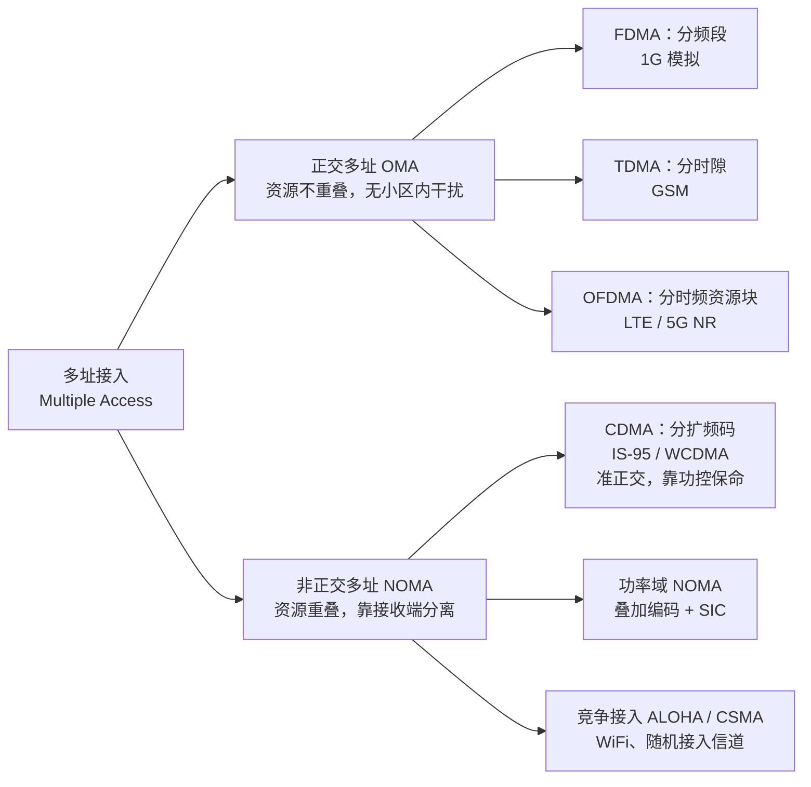
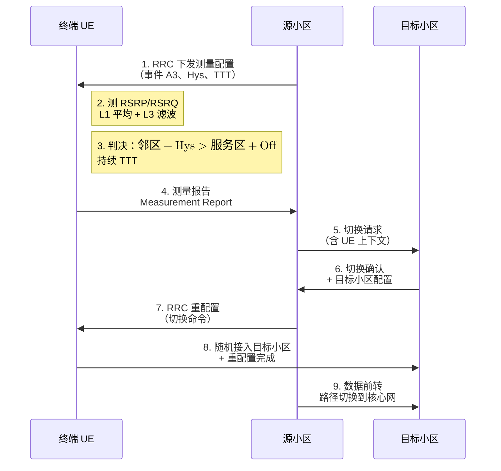
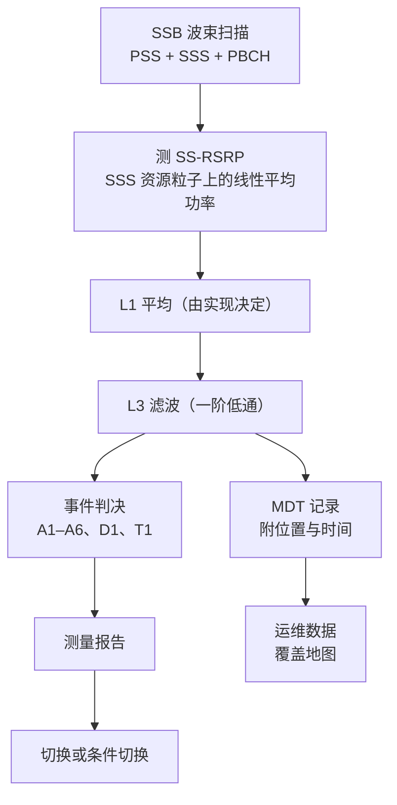
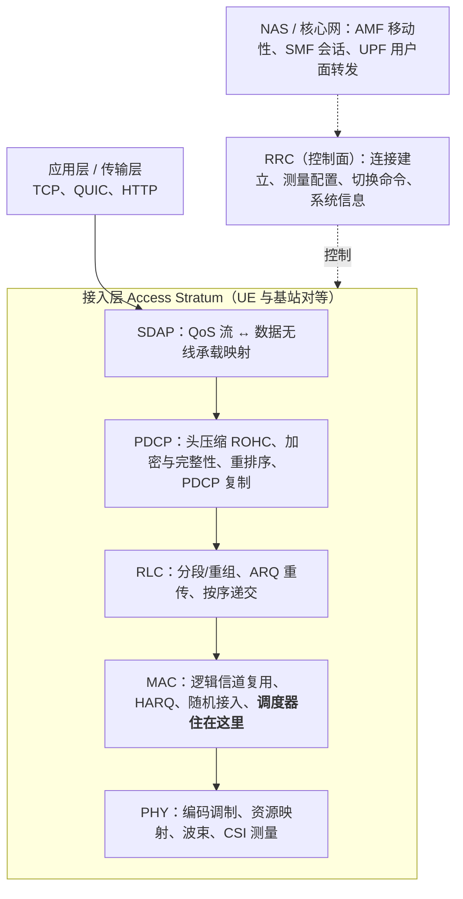

# 6 · 无线网络：从蜂窝到协议栈

前面五章，我们的视野始终停在**一条链路**上：一根天线发、一根天线收（[第 1 章](01-em-waves-antennas.md)），中间隔着一条会衰落的信道（[第 2 章](02-wireless-channel-basics.md)），我们给它设计调制（[第 3 章](03-digital-communications.md)）、算它的容量上限（[第 4 章](04-information-theory-basics.md)）、再用多天线把它撑大（[第 5 章](05-mimo.md)）。

现在把镜头拉远。真实的网络里有成千上万条链路**同时**在同一片频谱上工作。此刻你手机的下行信号，对隔壁小区的用户来说就是噪声；隔壁小区为了压过这份噪声而加大功率，又变成你的干扰。链路不再彼此独立，它们被**干扰**耦合成了一个整体系统——从这一刻起，"我这条链路能跑多快"不再是一个能单独回答的问题。

本章教你用网络的眼光看无线：为什么要把服务区切成蜂窝、干扰为什么既是敌人又是机会、多个用户怎么共享同一块频谱、资源该分给谁、功率该开多大、用户跑动时怎么交接、以及这一切在协议栈的哪一层被实现。

**你将学会：**

- 从"一根大天线 vs 一片小格子"的对比出发，推出频率复用因子 $N$ 与小区边缘 SIR 的闭式关系，并解释为什么现代网络反而走向 $N=1$；
- 写出 SINR 的严格定义，看懂"干扰受限"意味着什么、为什么加功率会撞上天花板；
- 把 FDMA/TDMA/CDMA/OFDMA/NOMA 放进同一张对比表，用两用户 MAC 容量域讲清正交与非正交的本质差别；
- 从 $\sum_k \log \bar{R}_k$ 出发，一步不跳地推出比例公平准则 $\arg\max_k r_k/\bar{R}_k$，并用四时隙算例对比三种调度器；
- 推导 Foschini–Miljanic 功率控制迭代，理解它为什么能分布式收敛、以及什么时候会变成"功率军备竞赛"；
- 读懂切换的测量-判决流程，量化迟滞与 TTT 在"乒乓"与"掉话"之间的折中；
- 跟着一条 RSRP 从同步信号块走到切换和路测记录，知道测量间隙、放松测量各在省什么；
- 画出 PHY/MAC/RLC/PDCP/RRC/核心网的分层地图并说清每层职责与时间尺度；
- 沿宏站→异构→C-RAN→Open RAN 的主线看懂架构演进，并算出 MEC 卸载值不值的门限速率。

## 6.1 为什么要蜂窝：频率复用与复用因子

### 直觉：一根大喇叭，还是一片小音箱

假设你要给一座城市广播。方案 A：在市中心竖一根巨型天线，用尽全部功率覆盖全城。方案 B：每隔几百米放一个小基站，各管一小片。

方案 A 的致命伤不是覆盖，而是**容量**：全城所有人共享同一块频谱、同一套时频资源，每人分到的份额与人口成反比。方案 B 里，两个相隔足够远的小基站可以**同时使用同一段频率**——因为电波随距离衰减得足够快，彼此听不见对方。这就是蜂窝网络的全部秘密：**用空间换频谱**。

!!! tip "直觉"
    频率复用之所以可行，根子在[第 2 章](02-wireless-channel-basics.md)的路径损耗：接收功率按 $d^{-\alpha}$ 衰减，$\alpha \approx 3\sim 4$。距离拉大 3 倍，功率就掉 $10\alpha\log_{10}3 \approx 14\sim 19$ dB。衰减越快，同频小区可以靠得越近——**传播损耗不是敌人，它是蜂窝网络得以存在的物理前提**。

### 定义：复用因子与复用距离

把总带宽 $W$ 切成 $N$ 组，相邻小区分配不同组，每隔一定距离才重复使用同一组。$N$ 称为**频率复用因子**（frequency reuse factor）。每个小区可用带宽是 $W/N$。

在理想六边形蜂窝里，合法的复用因子只能取

$$
N = i^{2} + ij + j^{2}, \qquad i,j \in \{0,1,2,\ldots\}
$$

即 $N = 1, 3, 4, 7, 9, 12, \ldots$。同频小区中心之间的**复用距离** $D$ 与小区半径 $R$ 满足

$$
\frac{D}{R} = \sqrt{3N} \;\triangleq\; Q
$$

$Q$ 叫**同频复用比**。

两个式子都出自六边形几何。$R$ 是小区中心到顶点的距离，相邻小区中心相距 $\sqrt{3}R$。从一个小区中心出发，沿一个方向走过 $i$ 个小区，再转 $60^\circ$ 走过 $j$ 个小区，落点就是一个最近的同频小区中心。两段位移夹角 $60^\circ$，所以 $D^2=(\sqrt{3}R)^2\,(i^2+j^2+2ij\cos 60^\circ)=3R^2(i^2+ij+j^2)$。同频小区排成间距为 $D$ 的六边形格点，每个同频小区分到的面积正比于 $D^2$，单个小区的面积正比于 $(\sqrt{3}R)^2$，两者之比就是一簇里的小区数：$N=D^2/(3R^2)=i^2+ij+j^2$，于是 $D/R=\sqrt{3N}$。例：$i=2$、$j=1$ 给出 $N=7$、$D/R=\sqrt{21}\approx 4.58$。

**物理意义**：$Q$ 是一个纯几何量——它告诉你"干扰源比有用信号远多少倍"。$N$ 越大，同频小区隔得越开，干扰越小，但每个小区分到的带宽 $W/N$ 越少。这就是蜂窝设计的第一个核心折中：**质量（SIR）与数量（带宽份额）之间的兑换**。

**行为分析**：注意 $Q$ 只依赖 $N$，与 $R$ 的绝对大小无关。这意味着把所有小区等比例缩小（**小区分裂**，cell splitting），SIR 分毫不变，而单位面积上的小区数按 $R^{-2}$ 增长——这正是"密集化"能无限提升面积容量的理论依据，也是从宏站走向微微站、飞蜂窝的原动力。

### SINR：网络级性能的唯一度量

对第 $k$ 条链路，设发射功率 $p_k$、从发射机 $j$ 到接收机 $k$ 的信道功率增益为 $g_{kj}$、接收机噪声功率 $\sigma^{2}$，则

$$
\mathrm{SINR}_{k} = \frac{p_{k}\, g_{kk}}{\displaystyle\sum_{j \neq k} p_{j}\, g_{kj} + \sigma^{2}}
$$

**物理意义**：分子是"我要的"，分母是"我不要的"。请特别注意分母里出现了**别人的功率** $p_j$——这一项把原本独立的链路缝合成了一个耦合系统。[第 4 章](04-information-theory-basics.md)的容量公式 $C = W\log_2(1+\mathrm{SNR})$ 在网络里要写成 $C_k = W\log_2(1+\mathrm{SINR}_k)$，而 $\mathrm{SINR}_k$ 是**全网功率向量 $\mathbf{p}$ 的函数**。整本第三部的资源优化难题、整本第四部的博弈问题，源头都在这个分母。

### 推导：小区边缘的 SIR 闭式估计

考虑最坏情形——用户位于小区边缘，距服务基站 $R$，周围第一圈有 6 个同频干扰基站，距离近似都是 $D$（真实距离散布在 $D-R$ 到 $D+R$ 之间，统一取 $D$ 是 $D\gg R$ 时的标准近似，$N$ 越大越准；更远的第二圈 12 个站在 $\alpha=3.5$ 时只让干扰再多约 0.9 dB，故略去）。忽略噪声（干扰远大于噪声），设所有基站等功率 $P_t$、路损模型 $P_r = P_t K d^{-\alpha}$：

**第 1 步**，有用信号功率：

$$
S = P_{t} K R^{-\alpha}
$$

**第 2 步**，第一圈 6 个同频干扰源之和：

$$
I = 6\, P_{t} K D^{-\alpha}
$$

**第 3 步**，相除，$P_t$、$K$ 全部约掉：

$$
\mathrm{SIR} = \frac{S}{I} = \frac{R^{-\alpha}}{6 D^{-\alpha}} = \frac{1}{6}\left(\frac{D}{R}\right)^{\alpha}
$$

**第 4 步**，代入 $D/R = \sqrt{3N}$：

$$
\boxed{\;\mathrm{SIR}_{\text{edge}} \approx \frac{(3N)^{\alpha/2}}{6}\;}
$$

**物理意义**：这个式子把"频谱规划"（$N$）、"传播环境"（$\alpha$）和"链路质量"（SIR）串成了一条线。发射功率不在里面——**同构蜂窝网的 SIR 与绝对功率电平无关**，因为大家一起加功率，信号和干扰同步抬升。

**行为分析**：$\mathrm{SIR}$ 对 $N$ 是 $N^{\alpha/2}$ 的幂律增长，$\alpha=3.5$ 时约为 $N^{1.75}$——$N$ 从 3 加到 7（变为原来的 2.3 倍），SIR 涨 6.5 dB（$(7/3)^{1.75}\approx 4.4$ 倍）。但代价是带宽份额从 $1/3$ 掉到 $1/7$。谁划算？要看**面积频谱效率**

$$
\eta(N) = \frac{1}{N}\log_{2}\bigl(1 + \mathrm{SIR}_{\text{edge}}(N)\bigr)
$$

即"每 Hz 系统带宽、每个小区"能支撑的速率。

!!! example "算例：复用因子该选几"

    取 $\alpha = 3.5$，逐个算：

    | $N$ | $D/R=\sqrt{3N}$ | $\mathrm{SIR}_{\text{edge}}$ | dB | $\log_2(1+\mathrm{SIR})$ | $\eta(N)$ |
    |---|---|---|---|---|---|
    | 1 | 1.73 | 1.14 | 0.6 | 1.10 | **1.10** |
    | 3 | 3.00 | 7.80 | 8.9 | 3.14 | 1.05 |
    | 4 | 3.46 | 12.9 | 11.1 | 3.80 | 0.95 |
    | 7 | 4.58 | 34.4 | 15.4 | 5.14 | 0.74 |

    以 $N=7$ 为例逐步验算：$3N = 21$，$21^{1.75} = e^{1.75\times 3.045} = e^{5.328} = 206.1$，除以 6 得 $34.4$，即 $10\log_{10}34.4 = 15.4$ dB；$\log_2(35.4) = 5.14$；除以 7 得 $0.74$。

    结论有点反直觉：**面积频谱效率在 $N=1$ 时最高**，尽管此时边缘 SIR 只有 0.6 dB。（这个排序依赖"6 个干扰站都取距离 $D$"的近似；按边缘最坏距离 $D-R$ 算，$N=1$ 的 SIR 只有约 $-12.5$ dB，面积频谱效率只剩约 0.08，从最高跌到最低（此时 $N=4$、$N=7$ 最高，约 0.57）。所以全频复用要靠下面说的调度与干扰协调才站得住。）这正是 LTE/NR 采用**全频率复用**（$N=1$）的原因——宁可让边缘用户 SINR 很低，也要把带宽全部给每个小区，再用调度、ICIC（小区间干扰协调）、CoMP 等手段把边缘用户捞回来。经典 GSM 时代用 $N=7$，是因为当时没有这些手段。

!!! success "关键结论"
    1. SIR 只取决于 $D/R$ 这个**比值**，与小区绝对大小无关 → 密集化（小区分裂）可以线性提升面积容量而不损害链路质量。
    2. $N=1$ 的面积效率最高但边缘 SIR 最差 → 现代网络把"频率规划"问题转化成了"干扰管理 + 调度"问题。这正是[第三部](../part3/01-three-mountains.md)要面对的第一座山。

## 6.2 干扰：既是根本约束，也是博弈的来源

### 噪声受限 vs 干扰受限

把 SINR 的分母拆开看：$I + \sigma^{2}$。谁大谁说了算。

- **噪声受限**（$\sigma^{2} \gg I$）：典型于稀疏部署、毫米波高频、卫星链路。此时 $\mathrm{SINR}\approx S/\sigma^{2}$，**加功率就涨速率**，链路预算那套单链路思维完全够用。
- **干扰受限**（$I \gg \sigma^{2}$）：典型于城区蜂窝、密集 WiFi。此时 $\mathrm{SINR}\approx S/I$，加功率**几乎没用**。

推导这个天花板：设全网所有发射机功率同乘一个因子 $c > 1$，

$$
\begin{aligned}
\mathrm{SINR}_{k}(c)
&= \frac{c\,p_{k} g_{kk}}{\sum_{j\neq k} c\, p_{j} g_{kj} + \sigma^{2}}\\[4pt]
&= \frac{p_{k} g_{kk}}{\sum_{j\neq k} p_{j} g_{kj} + \sigma^{2}/c}\\[4pt]
&\xrightarrow[c\to\infty]{}\ \frac{p_{k} g_{kk}}{\sum_{j\neq k} p_{j} g_{kj}} = \frac{S_k}{I_k}
\end{aligned}
$$

**物理意义**：全网一起加功率，唯一被削弱的是热噪声；信号与干扰的比值纹丝不动。SINR 有一个由几何决定的**硬上限** $S/I$，功率放大器再大也翻不过去。

**行为分析**：这正是"负和博弈"的物理原型——每个基站单独看，加功率对自己有利；所有基站都加功率，谁也没得到好处，只是一起多烧了电。任何一门讲无线资源分配的课，讲到这里必然要转向博弈论。

!!! example "算例：加 10 dB 功率换来多少速率"

    某城区用户测得：有用信号 $S = -80$ dBm、总干扰 $I = -90$ dBm、噪声 $N = -100$ dBm（此处 $N$ 是噪声功率，不是 6.1 节的复用因子）。换成毫瓦线性值：$S = 10^{-8}$ mW，$I = 10^{-9}$ mW，$N = 10^{-10}$ mW。

    $$
    \mathrm{SINR} = \frac{10^{-8}}{10^{-9}+10^{-10}} = \frac{10^{-8}}{1.1\times 10^{-9}} = 9.09 \;\;(9.59\ \text{dB})
    $$

    现在全网发射功率统一抬高 10 dB（$S$、$I$ 同步 ×10，噪声不变）：

    $$
    \mathrm{SINR}' = \frac{10^{-7}}{10^{-8}+10^{-10}} = \frac{10^{-7}}{1.01\times 10^{-8}} = 9.90 \;\;(9.96\ \text{dB})
    $$

    **多烧 10 倍的功率，SINR 只涨了 0.37 dB**，速率从 $\log_2(10.09)=3.34$ 涨到 $\log_2(10.90)=3.45$ bit/s/Hz，提升 3%。天花板是 $S/I = 10$（10 dB）。

    对照实验：如果这是个噪声受限场景（$I = -120$ dBm），同样全网加 10 dB（$S$、$I$ 同步 ×10），SINR 从 $10^{-8}/(10^{-12}+10^{-10})=99.0$（19.96 dB）涨到 $10^{-7}/(10^{-11}+10^{-10})=909$（29.6 dB），速率从 $\log_2 100=6.64$ 涨到 $\log_2 910=9.83$ bit/s/Hz，多出 3.19 bit；干扰受限时只多出 $3.45-3.34=0.11$ bit——**同一个动作，在两种 regime 下效果差近 30 倍**。判断自己身处哪个 regime，是网络级问题的第一步。

### 干扰的另一面：它也是可用的结构

初学者容易把干扰当成"必须消灭的坏东西"，但信息论告诉我们：干扰是**已编码的、有结构的信号**，与真正的热噪声有本质区别。这带来三类利用方式：

1. **解掉它**：若干扰足够强，接收机可以先解出干扰信号再减掉——这是串行干扰消除（SIC），NOMA 的基石（见 6.3 节）。
2. **协同它**：多个基站联合发送同一份数据（CoMP 联合传输），原本的干扰源变成了合作的分布式天线阵。
3. **规避它**：在时/频/空/码域给相邻小区正交化（ICIC、eICIC 的 ABS 静默子帧、波束赋形零陷）。

!!! note
    "干扰能不能被完全消除"在信息论上是一个至今未完全解决的问题——两用户干扰信道的容量域至今只有在强干扰、弱干扰等特殊区间有精确刻画，一般情形只有 Etkin–Tse–Wang 的"1 比特之内"近似（给出一个可达方案，其速率离容量上界不超过 1 bit/s/Hz）。这不是工程没做好，而是问题本身极难。第三部会告诉你，即便只求和速率最大化，在干扰信道下也是 NP 难的（Luo & Zhang, 2008）：除非 P = NP，不存在对所有实例都能在多项式时间内求出最优解的算法，链路一多，精确求解的计算量会爆炸式增长。

## 6.3 多址接入谱系：谁在什么时候用哪块资源

### 直觉：一间会议室里怎么让多人同时说话

- 让每人用不同**音高**说话，听者用滤波器分离 → **FDMA**（频分）
- 让大家**轮流**说，每人一小段时间 → **TDMA**（时分）
- 让每人说不同的**语言**（正交码），听者只听懂自己那门 → **CDMA**（码分）
- 把整个频带切成上千个小格子，按需分配格子给不同人 → **OFDMA**（正交频分多址）
- 让大家**同时同频**说，但音量差别很大，听者先听清大嗓门、把它从录音里减掉、再听小嗓门 → **NOMA**（非正交，配合 SIC）

### 对比表

| 方案 | 资源维度 | 小区内干扰 | 关键使能技术 | 对同步/功控的要求 | 代表系统 |
|---|---|---|---|---|---|
| FDMA | 频率 | 无（靠滤波器） | 保护带、锐截止滤波器 | 低 | AMPS（1G） |
| TDMA | 时间 | 无（靠时隙） | 保护间隔、定时提前 | 中（需时隙同步） | GSM（2G） |
| CDMA | 扩频码 | 有（码非完全正交） | 扩频、RAKE、快速功控 | 极高（远近效应） | IS-95、WCDMA（3G） |
| OFDMA | 时频资源块 | 无（子载波正交） | FFT、CP、频域调度 | 中高（需频偏控制） | LTE、5G NR（4G/5G） |
| NOMA | 功率/码域叠加 | 有（设计上就有） | 叠加编码 + SIC | 高（需精确 CSI 与功率分配） | 研究与部分标准选项 |

!!! warning "远近效应"
    CDMA 是"准正交"的：不同用户的扩频码互相关不为零，残留干扰正比于对方功率。如果近端用户功率比远端高 40 dB，残留干扰就能把远端用户彻底淹没。所以 CDMA 必须配 1500 Hz 的**快速闭环功控**——功率控制在 CDMA 里不是优化手段，而是**生存必需品**。这也解释了为什么 6.5 节的功控理论是在 CDMA 时代成熟的。

### OFDMA 的资源格子：一个数量级算例

OFDMA 把资源切成**资源块**（RB）：频域 12 个子载波，时域 1 个时隙。5G NR 的子载波间隔为 $\Delta f = 15 \times 2^{\mu}$ kHz，时隙长度 $1/2^{\mu}$ ms。

!!! example "算例：一个 5G 时隙里有多少比特"

    参数：100 MHz 带宽、$\mu = 1$（$\Delta f = 30$ kHz，时隙 0.5 ms）、273 个 RB、256QAM、码率 0.85、4 层空间复用。

    - 子载波数：$273 \times 12 = 3276$
    - 每时隙资源单元（RE）数：$3276 \times 14 = 45{,}864$（每时隙 14 个 OFDM 符号）
    - 扣除约 14% 的导频与控制开销：$45{,}864 \times 0.86 \approx 39{,}400$ RE
    - 每 RE 携带比特：$\log_2 256 \times 0.85 = 8 \times 0.85 = 6.8$ bit
    - 每时隙每层：$39{,}400 \times 6.8 \approx 268$ kbit
    - 每秒时隙数：$1/0.5\ \text{ms} = 2000$
    - 单层速率：$268 \times 10^{3} \times 2000 = 536$ Mb/s；4 层：**约 2.1 Gb/s**

    这和 5G 单载波峰值速率的官方量级一致。请记住这个"资源格子 → 比特"的换算链条：调度器每 0.5 ms 就要决定这 39,400 个格子归谁——这就是 6.4 节的问题。

### 正交 vs 非正交：两用户 MAC 容量域

现在用信息论把"正交到底损失了什么"讲清楚。考虑**上行多址信道**（MAC）：两个用户同时发给一个基站，接收信噪比分别为 $\mathrm{SNR}_1 = P_1/(N_0W)$、$\mathrm{SNR}_2 = P_2/(N_0W)$。Cover 与 Thomas 给出的容量域是一个**五边形**：

$$
\begin{aligned}
R_{1} &\le \log_{2}(1+\mathrm{SNR}_{1})\\
R_{2} &\le \log_{2}(1+\mathrm{SNR}_{2})\\
R_{1}+R_{2} &\le \log_{2}(1+\mathrm{SNR}_{1}+\mathrm{SNR}_{2})
\end{aligned}
$$

**物理意义**：前两条是"单独看每个用户，别人不存在时的上限"；第三条最关键——**和速率上限等于把两份功率合起来当一个用户发**。也就是说，从"总吞吐"角度看，多用户共享并不损失任何东西，只要接收机足够聪明。

那个"足够聪明"的接收机就是 **SIC**：先把用户 1 当噪声、解出用户 2，减掉它，再在干净背景下解用户 1。按这个顺序，用户 2 面对的噪声加干扰是 $1+\mathrm{SNR}_1$（以 $N_0W$ 为单位），可达 $R_2=\log_2\!\bigl(1+\tfrac{\mathrm{SNR}_2}{1+\mathrm{SNR}_1}\bigr)$；用户 1 独享信道，$R_1=\log_2(1+\mathrm{SNR}_1)$。两者相加：

$$
R_1+R_2=\log_2\Bigl[(1+\mathrm{SNR}_1)\cdot\frac{1+\mathrm{SNR}_1+\mathrm{SNR}_2}{1+\mathrm{SNR}_1}\Bigr]=\log_2(1+\mathrm{SNR}_1+\mathrm{SNR}_2)
$$

恰好落在和速率边界上，这是下文算例的角点 B；反过来的解码顺序给出角点 A。

**为什么是五边形**：只有前两条约束时，区域是长方形 $[0,C_1]\times[0,C_2]$，其中 $C_i=\log_2(1+\mathrm{SNR}_i)$。但 $(1+\mathrm{SNR}_1)(1+\mathrm{SNR}_2)=1+\mathrm{SNR}_1+\mathrm{SNR}_2+\mathrm{SNR}_1\mathrm{SNR}_2$，比第三条的真数多出 $\mathrm{SNR}_1\mathrm{SNR}_2$，所以 $C_1+C_2$ 严格大于和速率上限：两人不能同时拿到各自的单用户上限，长方形的右上角被斜率 $-1$ 的直线切掉。剩下的图形有五个顶点：原点、$(C_1,0)$、角点 B、角点 A、$(0,C_2)$。A、B 之间的线段靠两种解码顺序按时间比例轮换得到。

**正交方案能达到什么？** 设把带宽（或时间）按 $\alpha : (1-\alpha)$ 分给两用户（此处 $\alpha$ 是资源份额；本章 $\alpha$ 在 6.1、6.6 节是路损指数，6.4 节是公平参数，6.5 节是路损补偿因子），各自在自己那份资源上用满功率 $P_i$：

$$
R_{1} = \alpha \log_{2}\!\left(1+\frac{\mathrm{SNR}_{1}}{\alpha}\right),\qquad
R_{2} = (1-\alpha)\log_{2}\!\left(1+\frac{\mathrm{SNR}_{2}}{1-\alpha}\right)
$$

（分母的 $\alpha$ 是因为带宽变窄后噪声功率也按比例减少，等效 SNR 被放大。）

**关键推导**：这条曲线什么时候碰到和容量边界？记两段资源上的等效信噪比 $x_1=\mathrm{SNR}_1/\alpha$、$x_2=\mathrm{SNR}_2/(1-\alpha)$，则 $R_1+R_2=\alpha\log_2(1+x_1)+(1-\alpha)\log_2(1+x_2)$，是凹函数 $\log_2(1+x)$ 在两点上的加权平均。由 Jensen 不等式（[第 4 章](04-information-theory-basics.md)），它不超过 $\log_2\bigl(1+\alpha x_1+(1-\alpha)x_2\bigr)=\log_2(1+\mathrm{SNR}_1+\mathrm{SNR}_2)$；$\log$ 严格凹，等号当且仅当 $x_1=x_2$，即 $\mathrm{SNR}_1/\alpha=\mathrm{SNR}_2/(1-\alpha)$。由此解出唯一的 $\alpha^{\star} = \dfrac{\mathrm{SNR}_{1}}{\mathrm{SNR}_{1}+\mathrm{SNR}_{2}}$，代入验证：

$$
\begin{aligned}
1+\frac{\mathrm{SNR}_{1}}{\alpha^{\star}}
&= 1 + \mathrm{SNR}_{1}\cdot\frac{\mathrm{SNR}_{1}+\mathrm{SNR}_{2}}{\mathrm{SNR}_{1}}
= 1+\mathrm{SNR}_{1}+\mathrm{SNR}_{2}\\[4pt]
1+\frac{\mathrm{SNR}_{2}}{1-\alpha^{\star}}
&= 1 + \mathrm{SNR}_{2}\cdot\frac{\mathrm{SNR}_{1}+\mathrm{SNR}_{2}}{\mathrm{SNR}_{2}}
= 1+\mathrm{SNR}_{1}+\mathrm{SNR}_{2}\\[4pt]
R_{1}+R_{2} &= \bigl[\alpha^{\star}+(1-\alpha^{\star})\bigr]\log_{2}(1+\mathrm{SNR}_{1}+\mathrm{SNR}_{2})
= \log_{2}(1+\mathrm{SNR}_{1}+\mathrm{SNR}_{2})
\end{aligned}
$$

**物理意义**：正交方案**能**达到和容量——但只在唯一一个分配比例上，而且这个比例要求**带宽份额正比于功率份额**。近端用户功率大就该拿走绝大部分带宽，远端用户几乎分不到——这是效率最优点，却是公平性上的灾难。除此之外的任何分配比例，正交都严格次优。

{ .chart loading=lazy }
{ .chart loading=lazy }

*怎么读这张图：参数与下面的算例相同，每隔 0.25 取一点。第一条是 MAC 容量域的外边界：$R_2=1.000$ 的水平段一直延伸到角点 A（$R_1=5.672$），再沿斜率 $-1$ 的和速率边界降到角点 B（$R_1=6.658$）；第二条是正交接入按比例 $\alpha$ 分资源能达到的边界（对每个 $R_1$ 反解 $\alpha$ 再求 $R_2$）。除两个端点外，两条线只在 $\alpha^{\star}=100/101$ 处相切（$R_1=6.606$、$R_2=0.066$），其余处处是正交在下；等分点 $(3.826,\ 0.792)$ 就在第二条上。*

!!! example "算例：等分带宽亏了多少"

    取 $\mathrm{SNR}_1 = 20$ dB $=100$（近端用户）、$\mathrm{SNR}_2 = 0$ dB $=1$（远端用户）。

    **容量域顶点**：

    - $R_1 \le \log_2 101 = 6.658$，$R_2 \le \log_2 2 = 1.000$，$R_1+R_2 \le \log_2 102 = 6.672$
    - 角点 A（先解用户 1、后解用户 2）：$R_1 = \log_2\!\bigl(1+\tfrac{100}{1+1}\bigr) = \log_2 51 = 5.672$，$R_2 = 1.000$，和 $=6.672$ ✓
    - 角点 B（反序）：$R_1 = 6.658$，$R_2 = \log_2\!\bigl(1+\tfrac{1}{101}\bigr) = 0.014$，和 $=6.672$ ✓

    **正交等分**（$\alpha = 0.5$）：

    $$
    R_1 = 0.5\log_2(1+200) = 3.826,\qquad R_2 = 0.5\log_2(1+2) = 0.792
    $$

    和速率 4.62 bit/s/Hz，比容量 6.67 少了 **31%**。更刺眼的是：角点 A 给出的 $(5.672,\ 1.000)$ 在**两个坐标上都严格大于**等分方案的 $(3.826,\ 0.792)$——非正交在这里是帕累托碾压的。

    **正交最优分配** $\alpha^{\star} = 100/101 = 0.990$：$R_1 = 0.990\times 6.672 = 6.606$，$R_2 = 0.0099 \times 6.672 = 0.066$。和速率确实回到 6.672，但远端用户只剩 0.066——效率满分、公平零分。

### 下行 NOMA：叠加编码

下行的对偶做法是**叠加编码**：基站发 $x = \sqrt{a P}\, s_{1} + \sqrt{(1-a)P}\, s_{2}$，把**大部分功率给信道差的远端用户**。

- 远端用户（弱）直接解自己的信号，把近端信号当噪声：

$$
\mathrm{SINR}_{2} = \frac{(1-a)\,\mathrm{SNR}_{2}}{a\,\mathrm{SNR}_{2}+1}
$$

- 近端用户（强）先解出远端信号（它功率大、易解）、减掉，再解自己的。它一定解得出：它解 $s_2$ 时的 SINR 是 $\frac{(1-a)\mathrm{SNR}_1}{a\,\mathrm{SNR}_1+1}$，与上式同形，而这个函数随 SNR 递增、$\mathrm{SNR}_1>\mathrm{SNR}_2$，所以不低于远端用户自己的 $\mathrm{SINR}_2$。解完之后：

$$
\mathrm{SNR}_{1}^{\text{SIC}} = a\,\mathrm{SNR}_{1}
$$

!!! example "算例：下行 NOMA 的增益从哪来"

    仍取 $\mathrm{SNR}_1 = 100$、$\mathrm{SNR}_2 = 1$，NOMA 给近端用户 $a = 0.1$ 的功率：

    - 近端：$R_1 = \log_2(1+0.1\times 100) = \log_2 11 = 3.459$
    - 远端：$R_2 = \log_2\!\left(1+\dfrac{0.9\times 1}{0.1\times 1 + 1}\right) = \log_2(1.818) = 0.862$

    OMA 对照（带宽、功率各等分）：$R_1 = 0.5\log_2(1+0.5\times 100/0.5)=0.5\log_2 101 = 3.329$，$R_2 = 0.5\log_2(1+1) = 0.500$。

    NOMA 的 $(3.459,\ 0.862)$ 在两个坐标上都优于 OMA 的 $(3.329,\ 0.500)$。增益的来源是**信道差异**：近端用户处在高 SNR 区，$\log$ 曲线已经很平，让出 90% 的功率只让它损失 $\log_2(101/11)=3.2$ bit，还少于 OMA 砍掉一半带宽的损失（$6.66-3.33=3.33$ bit）；远端用户处在低 SNR 区，这份功率让它比 OMA 多拿 0.36 bit，相对提升约 72%。若两用户 SNR 相同，NOMA 增益趋近于零——**NOMA 吃的是不对称性的红利**。

## 6.4 调度：把资源分给谁

现在资源格子有了，用户也排好队了，每个传输时间间隔（TTI，LTE 为 1 ms、NR 可低至 0.125 ms）调度器必须回答：**这一格给谁？**

### 三种经典准则

设时隙 $t$ 上用户 $k$ 的**瞬时可达速率**为 $r_{k}(t)$（由其当前 CQI 决定；CQI 即信道质量指示，由终端测量后上报基站），**长期平均吞吐**为 $\bar{R}_{k}(t)$。表中"最大 C/I"的 C/I 是载干比，这里泛指瞬时信道质量。

| 调度器 | 判决准则 | 优点 | 致命缺陷 |
|---|---|---|---|
| 轮询 RR | 按固定顺序轮流 | 绝对时间公平、实现最简单 | 完全无视信道，在深衰落时刻硬发，浪费资源 |
| 最大 C/I | $\arg\max_k r_{k}(t)$ | 系统吞吐最大 | 边缘用户被永久饿死（速率恒为 0） |
| 比例公平 PF | $\arg\max_k \dfrac{r_{k}(t)}{\bar{R}_{k}(t)}$ | 兼顾多用户分集与公平 | 需维护滑动平均，参数敏感 |

### 推导：PF 准则从哪来

PF 不是拍脑袋定的，它是一个**效用最大化问题的解**。为什么用对数？$\log\bar{R}$ 的边际效用是 $1/\bar{R}$：给平均 1 Mb/s 的用户多 0.1 Mb/s，和给平均 10 Mb/s 的用户多 1 Mb/s，效用增量相同。它只看**相对**增幅，天然偏向吃得少的人；某人吞吐趋于 0 时 $\log\to-\infty$，所以谁都不会被饿死。取对数效用（Kelly 1998）：

$$
U(\bar{\mathbf{R}}) = \sum_{k=1}^{K} \log \bar{R}_{k}
$$

**第 1 步**，把平均吞吐用指数遗忘窗更新（$T_c$ 为窗长，典型 100–1000 个时隙）：

$$
\bar{R}_{k}(t+1) = \left(1-\frac{1}{T_{c}}\right)\bar{R}_{k}(t) + \frac{1}{T_{c}}\,r_{k}(t)\,\mathbb{1}\{k \text{ 被调度}\}
$$

**第 2 步**，写出增量。若本时隙选中用户 $k$：

$$
\Delta \bar{R}_{k} = \frac{1}{T_{c}}\bigl(r_{k}(t) - \bar{R}_{k}(t)\bigr),\qquad
\Delta \bar{R}_{j} = -\frac{1}{T_{c}}\bar{R}_{j}(t)\ \ (j\neq k)
$$

**第 3 步**，对效用做一阶泰勒展开（$T_c$ 大，增量小）：

$$
\Delta U \approx \sum_{i} \frac{\partial U}{\partial \bar{R}_{i}}\,\Delta \bar{R}_{i}
= \sum_{i} \frac{\Delta \bar{R}_{i}}{\bar{R}_{i}}
$$

**第 4 步**，代入增量。注意 $j \neq k$ 的项贡献 $-1/T_c$，是与"选谁"无关的常数：

$$
\Delta U \approx \frac{1}{T_{c}}\cdot\frac{r_{k}(t)-\bar{R}_{k}(t)}{\bar{R}_{k}(t)}
\;-\;\frac{K-1}{T_{c}}
= \frac{1}{T_{c}}\left[\frac{r_{k}(t)}{\bar{R}_{k}(t)} - 1\right] - \frac{K-1}{T_{c}}
$$

**第 5 步**，丢掉所有与 $k$ 无关的常数项，最大化 $\Delta U$ 即：

$$
\boxed{\;k^{\star}(t) = \arg\max_{k}\ \frac{r_{k}(t)}{\bar{R}_{k}(t)}\;}
$$

这五步证明的是**单步贪心**：每个时隙挑让 $U$ 涨得最多的用户。它为什么等价于长期最大化 $\sum_k\log\bar{R}_k$？看第 3 步：$\Delta U\approx\nabla U\cdot\Delta\bar{\mathbf{R}}$，梯度 $\nabla U=(1/\bar{R}_1,\ldots,1/\bar{R}_K)$；选用户 $k$ 就是让 $\bar{\mathbf{R}}$ 朝 $r_k\mathbf{e}_k-\bar{\mathbf{R}}$ 方向走 $1/T_c$ 步（$\mathbf{e}_k$ 为第 $k$ 个单位向量）。PF 挑的正是与梯度内积最大的可达方向。它不是沿梯度本身走，而是在可选方向里挑一阶近似下涨得最多的那个，这叫条件梯度法（Frank–Wolfe），整个过程是它步长为 $1/T_c$ 的随机版本。$U$ 是凹函数，可达的平均吞吐向量构成凸集（两种调度按时间比例混用，平均吞吐就是二者的凸组合），凹函数在凸集上局部最优即全局最优（[第 7 章](07-optimization-basics.md) 7.2 节），所以 $T_c$ 足够大时 $\bar{\mathbf{R}}$ 收敛到全局最大点附近。在这个最优点 $\bar{\mathbf{R}}^{\star}$ 上，换成任何其他可达的 $\mathbf{R}'$，都有 $\sum_k (R'_k-\bar{R}^{\star}_k)/\bar{R}^{\star}_k\le 0$：各用户吞吐的**相对**变化之和不可能为正，这正是"比例公平"名字的由来。

**物理意义**：分子是"这一刻我能跑多快"，分母是"我一直以来跑多快"。比值 $r_k/\bar{R}_k$ 衡量的是**相对于自身水平的运气好坏**。PF 因此有一个漂亮的解释：**每个用户都在自己信道最好的时候被调度**。它同时收割了两样东西——多用户分集（总有人在波峰上）与公平（好运的定义是相对自己的）。

**行为分析**：

- 若所有用户衰落统计相同（同分布），PF 给每人**相同的时间份额**，因为分母会自动调节到各自的平均水平；
- 若某用户平均信道差 10 倍，它的分母也小 10 倍，仍能靠"自己的好时刻"抢到份额——不会被饿死；
- $T_c \to 1$：平均窗口只剩一个时隙，没被调度的用户 $\bar{R}_k$ 立刻归零、比值趋于无穷，调度器被迫在用户间轮换，退化为近似轮询；$T_c \to \infty$：分母冻结成常数，退化为加权最大 C/I。**$T_c$ 就是公平性的时间尺度旋钮**。

PF 属于更一般的 **$\alpha$-公平**族（Mo & Walrand, 2000）。效用取

$$
U_{\alpha}(x) = \begin{cases}
\dfrac{x^{1-\alpha}}{1-\alpha}, & \alpha \neq 1\\[6pt]
\log x, & \alpha = 1
\end{cases}
$$

$\alpha = 0$ 给出最大和速率（最大 C/I），$\alpha = 1$ 给出比例公平，$\alpha \to \infty$ 给出最大-最小公平。**"选哪个调度器"本质上是"选 $\alpha$ 的值"，也就是选择一种公平哲学**——这不是技术问题，是策略问题。

!!! example "算例：四时隙、两用户，三种调度器"

    瞬时可达速率（Mb/s）：

    | 时隙 | 1 | 2 | 3 | 4 |
    |---|---|---|---|---|
    | 用户 A（近） | 24 | 36 | 12 | 12 |
    | 用户 B（远） | 2 | 2 | 6 | 6 |

    **最大 C/I**：每个时隙 A 的速率都更高 → A 全拿。A 的平均吞吐 $=(24+36+12+12)/4 = 21$，B $= 0$。

    **轮询**（A 拿奇数时隙 1、3；B 拿偶数时隙 2、4）：A $=(24+12)/4 = 9$，B $=(2+6)/4 = 2$。

    **比例公平**：设已收敛的平均值为 $\bar{R}_A = 15$、$\bar{R}_B = 3$，逐时隙算比值：

    | 时隙 | $r_A/\bar{R}_A$ | $r_B/\bar{R}_B$ | 选谁 |
    |---|---|---|---|
    | 1 | 24/15 = 1.60 | 2/3 = 0.67 | A |
    | 2 | 36/15 = 2.40 | 0.67 | A |
    | 3 | 12/15 = 0.80 | 6/3 = 2.00 | B |
    | 4 | 0.80 | 2.00 | B |

    结果：A $=(24+36)/4 = 15$，B $=(6+6)/4 = 3$——与假设的 $\bar{R}$ 自洽 ✓。

    **三者对比**：

    | 调度器 | A | B | 和吞吐 | $\sum\log\bar{R}$ | Jain 公平指数 |
    |---|---|---|---|---|---|
    | 最大 C/I | 21 | 0 | 21 | $-\infty$ | 0.50 |
    | 轮询 | 9 | 2 | 11 | 2.89 | 0.71 |
    | 比例公平 | 15 | 3 | 18 | **3.81** | 0.69 |

    表中 $\sum\log\bar{R}$ 取自然对数；**Jain 公平指数** $J=(\sum_k x_k)^2/(K\sum_k x_k^2)$，所有人吞吐相等时为 1，只有一人有吞吐时为 $1/K$（本例 $K=2$，即 0.50）。

    读三件事：① PF 在**两个用户上都优于轮询**（15 > 9，3 > 2）——它不是拿效率换公平，而是靠"挑好时刻"把蛋糕本身做大了，这就是**多用户分集**；② PF 拿到最大 C/I 和吞吐的 86%，却没饿死任何人；③ PF 的 $\sum\log\bar{R}$ 确实是三者最大，验证了上面的推导。

!!! note
    多用户分集的极端表达是 Viswanath–Tse–Laroia 的"哑天线机会波束赋形"：当信道太平稳、没有起伏可挑时，就**人为制造快衰落**（随机改变发射相位），让 PF 有波峰可选。这是一个反直觉的漂亮结果——在网络视角下，**衰落是资源而不是灾难**。

## 6.5 功率控制：从开环闭环到 Foschini–Miljanic

### 上行开环功控

上行的第一个难题是**远近效应**：离基站 10 m 和 1 km 的两个终端，若等功率发射，接收功率能差 60 dB 以上。开环功控让终端根据自己测到的下行路损 $PL$ 自行决定发射功率（LTE/NR 的基本形式）：

$$
P_{\text{tx}} = \min\Bigl\{P_{\max},\ P_{0} + \alpha\cdot PL + 10\log_{10}M + \Delta_{\text{MCS}} + f(\cdot)\Bigr\}\ \ [\text{dBm}]
$$

其中 $P_0$ 是每个 RB 上的目标接收电平、$M$ 是分配的 RB 数（占 $M$ 个 RB 要 $M$ 倍功率才能维持每 RB 电平，故加 $10\log_{10}M$ dB）、$\Delta_{\text{MCS}}$ 随调制编码方式调整、$f(\cdot)$ 是闭环修正项，$\alpha \in [0,1]$ 是**部分路损补偿因子**。

**物理意义**：$\alpha = 1$ 表示完全补偿——所有用户在基站处接收功率相同，小区内绝对公平。$\alpha < 1$ 表示"只补一部分"：路损大的用户故意让自己收得弱一些。

**行为分析**：为什么要故意不公平？因为上行用户的发射功率同时是**邻区的干扰**。边缘用户为了打平接收电平必须开大功率，而它离邻区最近，制造的干扰也最大。$\alpha$ 就是"本小区公平"与"邻区干扰"之间的旋钮，实际网络常取 0.7–0.9。

!!! example "算例：$\alpha$ 值怎么影响邻区"

    设 $P_0 = -100$ dBm，两个用户路损分别为 $PL_{\text{近}} = 80$ dB、$PL_{\text{远}} = 120$ dB（忽略其他项）。

    | | $\alpha = 1.0$ | $\alpha = 0.8$ |
    |---|---|---|
    | 近端发射功率 | $-100+80 = -20$ dBm | $-100+64 = -36$ dBm |
    | 远端发射功率 | $-100+120 = +20$ dBm | $-100+96 = -4$ dBm |
    | 近端接收电平 | $-100$ dBm | $-116$ dBm |
    | 远端接收电平 | $-100$ dBm | $-124$ dBm |

    $\alpha$ 从 1.0 降到 0.8，边缘用户的发射功率从 +20 dBm 掉到 −4 dBm——**对邻区的干扰减少了 24 dB**，代价是自己的接收电平低了 24 dB（若仍在噪声受限区，速率会掉）。$\alpha$ 的取舍就是"我的速率"与"全网干扰"之间的定价。

### 闭环功控

开环只看路损，看不见**干扰的实时变化**与阴影/衰落的误差。闭环让基站测量实际 SINR，与目标比较后回发 TPC 命令（典型为 $\pm1$ dB 步进）：SINR 低于目标就加 1 dB，高于就减 1 dB。CDMA 系统的闭环功控速率高达 1500 Hz——每 0.67 ms 修一次。

### Foschini–Miljanic 迭代：分布式功控的经典

现在把问题正式化。$K$ 条链路，链路 $i$ 要求 SINR 至少达到目标 $\gamma_{i}$：

$$
\mathrm{SINR}_{i}(\mathbf{p}) = \frac{p_{i} g_{ii}}{\displaystyle\sum_{j\neq i} p_{j} g_{ij} + n_{i}} \;\ge\; \gamma_{i},\qquad i = 1,\ldots,K
$$

**第 1 步**，整理成线性不等式。两边乘分母、除以 $g_{ii}$：

$$
p_{i} \;\ge\; \gamma_{i}\sum_{j\neq i}\frac{g_{ij}}{g_{ii}}\,p_{j} + \frac{\gamma_{i} n_{i}}{g_{ii}}
$$

**第 2 步**，定义矩阵 $\mathbf{F}$（$F_{ij} = g_{ij}/g_{ii}$ 当 $j\neq i$，$F_{ii}=0$）、对角阵 $\boldsymbol{\Gamma} = \mathrm{diag}(\gamma_i)$、向量 $u_{i} = \gamma_i n_i/g_{ii}$，则约束写成

$$
\mathbf{p} \;\ge\; \boldsymbol{\Gamma}\mathbf{F}\,\mathbf{p} + \mathbf{u}
$$

**第 3 步**，**可行性判据**。由 Perron–Frobenius 定理，存在正功率解当且仅当非负矩阵 $\boldsymbol{\Gamma}\mathbf{F}$ 的谱半径满足

$$
\rho(\boldsymbol{\Gamma}\mathbf{F}) < 1
$$

此时最小功率解为 $\mathbf{p}^{\star} = (\mathbf{I}-\boldsymbol{\Gamma}\mathbf{F})^{-1}\mathbf{u}$。

**谱半径** $\rho(\mathbf{A})$ 是矩阵 $\mathbf{A}$ 全部特征值的模的最大值。记 $\mathbf{A}=\boldsymbol{\Gamma}\mathbf{F}$，它的元素全都非负。判据的两个方向各有一个短论证：

- **$\rho<1$ $\Rightarrow$ 有解**。把约束取等号 $\mathbf{p}=\mathbf{A}\mathbf{p}+\mathbf{u}$ 反复代入自身，得 $\mathbf{p}^{\star}=\mathbf{u}+\mathbf{A}\mathbf{u}+\mathbf{A}^{2}\mathbf{u}+\cdots$：第一项对付噪声，第二项对付"别人为对付噪声而发出的干扰"，依此类推。$\rho<1$ 时 $\mathbf{A}^{n}$ 大致按 $\rho^{n}$ 衰减，级数收敛，和正是 $(\mathbf{I}-\mathbf{A})^{-1}\mathbf{u}$；每项非负、首项 $\mathbf{u}$ 严格为正，所以解为正。它也是最小的：任何可行 $\mathbf{p}$ 满足 $\mathbf{p}\ge\mathbf{A}\mathbf{p}+\mathbf{u}$，把右端的 $\mathbf{p}$ 用这个不等式反复替换（$\mathbf{A}$ 非负，替换不改变不等号方向），得 $\mathbf{p}\ge\mathbf{A}^{n}\mathbf{p}+\sum_{m<n}\mathbf{A}^{m}\mathbf{u}\ge\sum_{m<n}\mathbf{A}^{m}\mathbf{u}\to\mathbf{p}^{\star}$。
- **有解 $\Rightarrow$ $\rho<1$**。Perron–Frobenius 定理说：非负矩阵的谱半径 $\rho$ 本身就是它的一个特征值，并配有非负、非零的左特征向量 $\mathbf{y}$，$\mathbf{y}^{\top}\mathbf{A}=\rho\,\mathbf{y}^{\top}$。用 $\mathbf{y}^{\top}$ 左乘约束：$\mathbf{y}^{\top}\mathbf{p}\ge\rho\,\mathbf{y}^{\top}\mathbf{p}+\mathbf{y}^{\top}\mathbf{u}$，即 $(1-\rho)\,\mathbf{y}^{\top}\mathbf{p}\ge\mathbf{y}^{\top}\mathbf{u}>0$（$\mathbf{u}$ 每个分量都为正）。而 $\mathbf{y}^{\top}\mathbf{p}\ge0$，左边要为正只能 $\rho<1$。

**第 4 步**，Foschini 与 Miljanic（1993）提出的**分布式迭代**：

$$
p_{i}^{(t+1)} = \frac{\gamma_{i}^{\text{target}}}{\gamma_{i}^{(t)}}\; p_{i}^{(t)}
$$

其中 $\gamma_i^{(t)}$ 是第 $t$ 步**实测**的 SINR。

**第 5 步**，证明它就是上面的线性迭代。由定义 $\gamma_i^{(t)} = p_i^{(t)} g_{ii}/I_i^{(t)}$，其中 $I_i^{(t)} = \sum_{j\neq i}g_{ij}p_j^{(t)}+n_i$，于是

$$
\frac{p_{i}^{(t)}}{\gamma_{i}^{(t)}} = \frac{I_{i}^{(t)}}{g_{ii}}
\quad\Longrightarrow\quad
p_{i}^{(t+1)} = \gamma_{i}^{\text{target}}\cdot\frac{I_{i}^{(t)}}{g_{ii}}
= \gamma_{i}^{\text{target}}\sum_{j\neq i}\frac{g_{ij}}{g_{ii}}p_{j}^{(t)} + \frac{\gamma_{i}^{\text{target}} n_{i}}{g_{ii}}
$$

即 $\mathbf{p}^{(t+1)} = \boldsymbol{\Gamma}\mathbf{F}\mathbf{p}^{(t)} + \mathbf{u}$——一个标准线性不动点迭代，误差按 $\|\mathbf{p}^{(t)}-\mathbf{p}^{\star}\| \sim \rho(\boldsymbol{\Gamma}\mathbf{F})^{t}$ **几何收敛**。

理由只需一行：$\mathbf{p}^{\star}$ 满足 $\mathbf{p}^{\star}=\boldsymbol{\Gamma}\mathbf{F}\mathbf{p}^{\star}+\mathbf{u}$，与迭代式相减，$\mathbf{u}$ 抵消，误差 $\mathbf{e}^{(t)}=\mathbf{p}^{(t)}-\mathbf{p}^{\star}$ 满足 $\mathbf{e}^{(t+1)}=\boldsymbol{\Gamma}\mathbf{F}\,\mathbf{e}^{(t)}$，于是 $\mathbf{e}^{(t)}=(\boldsymbol{\Gamma}\mathbf{F})^{t}\mathbf{e}^{(0)}$。$\rho<1$ 时它从任何初值出发都几何地趋于零；$\rho\ge1$ 时根本没有非负的不动点（上面的必要性），迭代无处可收敛。

**物理意义**：这个式子美在**它只需要本地信息**。每个发射机只要知道自己的目标 SINR 和自己测到的 SINR，就能算出下一步功率——不需要知道任何别人的信道、功率或位置。这是无线领域最早、也最优雅的**分布式算法**之一，Yates（1995）后来把它推广成"标准干扰函数"框架，一举证明了一大类功控算法的收敛性。

**行为分析**：

- $\rho(\boldsymbol{\Gamma}\mathbf{F})$ 越接近 1，收敛越慢，功率解越大——系统濒临不可行；
- $\rho(\boldsymbol{\Gamma}\mathbf{F}) \ge 1$ 时**无解**：迭代会让功率单调发散，每人都在加功率追赶别人的加功率，直到全部撞上 $P_{\max}$。这就是**功率军备竞赛**的严格数学形式；
- 目标 $\gamma_i$ 不是天上掉下来的：谁有权要求高 SINR？多高才算"合理"？一旦每条链路自私地选自己的 $\gamma_i$，我们就从优化问题掉进了**博弈问题**——这正是[第四部](../part4/08-network-games.md)的起点。

!!! example "算例：两链路功控，四步收敛"

    参数：直连增益 $g_{11}=g_{22}=1$，交叉增益 $g_{12}=g_{21}=0.2$，噪声 $n_1=n_2=0.1$，目标 $\gamma_1=\gamma_2=1$（0 dB）。

    可行性：$\boldsymbol{\Gamma}\mathbf{F} = \begin{pmatrix}0 & 0.2\\ 0.2 & 0\end{pmatrix}$，$\rho = 0.2 < 1$ ✓。
    不动点：$p^{\star} = 0.2p^{\star}+0.1 \Rightarrow p^{\star} = 0.125$。

    从很不平衡的初值 $\mathbf{p}^{(0)} = (0.05,\ 0.30)$ 开始：

    | $t$ | $p_1$ | $p_2$ | $\mathrm{SINR}_1$ | $\mathrm{SINR}_2$ |
    |---|---|---|---|---|
    | 0 | 0.0500 | 0.3000 | 0.3125 | 2.727 |
    | 1 | 0.1600 | 0.1100 | 1.311 | 0.5000 |
    | 2 | 0.1220 | 0.1320 | 0.9242 | 1.081 |
    | 3 | 0.1264 | 0.1244 | 1.0161 | 0.9840 |
    | 4 | 0.1249 | 0.1253 | 0.9973 | 1.0027 |

    验算第 1 步：$\mathrm{SINR}_1^{(0)} = 0.05/(0.2\times 0.3+0.1) = 0.05/0.16 = 0.3125$，故 $p_1^{(1)} = (1/0.3125)\times 0.05 = 0.16$ ✓（也等于 $0.2\times 0.3+0.1=0.16$）。

    误差每步缩小 5 倍（$\rho=0.2$），4 步内已进入千分之一。

    **换个目标试试**：若把 $\gamma$ 提到 6（7.8 dB），则 $\rho = 6\times 0.2 = 1.2 > 1$——无解。迭代会让两条链路的功率每轮乘以约 1.2 倍，20 轮后放大 38 倍，直到双双顶到 $P_{\max}$ 而**谁都达不到目标**。可行性门槛在 $\gamma < 1/0.2 = 5$（7.0 dB）。

## 6.6 移动性管理：切换、测量与乒乓

### 用户会跑：连接必须能"交接"

蜂窝网的另一半代价，是用户会走出小区。**切换**（handover）就是把一个正在进行的连接从源小区交给目标小区，而用户毫无察觉。

### 测量：RSRP、L3 滤波与 A3 事件

终端周期性测量**参考信号接收功率** RSRP（单参考信号 RE 上的平均功率，典型范围 −44 至 −140 dBm）。原始测量噪声很大，先做 L1 平均，再做 L3 指数滤波：

$$
F_{n} = (1-a)\,F_{n-1} + a\,M_{n},\qquad a = \left(\tfrac{1}{2}\right)^{k/4}
$$

其中 $M_n$ 是本次测量、$F_n$ 是滤波输出、$k$ 是网络配置的滤波系数。

**物理意义**：这是一个一阶低通。等效噪声方差被压缩为原来的 $\dfrac{a}{2-a}$ 倍（对独立测量而言），代价是引入约 $1/a$ 个测量周期的**时延**——又是一个"稳还是快"的折中。

方差这样算：设 $M_n$ 独立、方差 $\sigma^2$，稳态时 $\mathrm{Var}(F_n)=\mathrm{Var}(F_{n-1})=V$；$F_{n-1}$ 只含过去的测量、与 $M_n$ 独立，对递推式两边取方差得 $V=(1-a)^2V+a^2\sigma^2$，解出 $V=\dfrac{a^2}{1-(1-a)^2}\sigma^2=\dfrac{a}{2-a}\sigma^2$。时延：展开得 $F_n=a\sum_{m\ge0}(1-a)^mM_{n-m}$，平均回看 $\sum_m m\,a(1-a)^m=(1-a)/a\approx 1/a$ 个周期。

**行为分析**：$k=0$（$a=1$）不滤波，反应最快但抖动最大；$k=8$（$a=1/4$）方差压到 $0.25/1.75 = 14.3\%$，标准差降到 38%，但响应慢约 4 个周期。高速移动场景要小 $k$，静止场景要大 $k$。

最常用的判决准则是 **A3 事件**（邻区优于服务小区）：

$$
\mathrm{RSRP}_{\text{nbr}} - \mathrm{Hys} \;>\; \mathrm{RSRP}_{\text{srv}} + \mathrm{Off}
\quad\text{且持续}\ \ge \mathrm{TTT}
$$

**Hys** 是迟滞（典型 1–3 dB），**Off** 是小区个性化偏置（用于负载均衡或异构网的小区扩展偏置 CRE），**TTT**（time-to-trigger）是持续时间门限（典型 40–640 ms）。

### 乒乓效应：三个旋钮的三角折中

如果没有迟滞与 TTT，在两小区功率相当的边界上，阴影衰落的随机起伏会让"谁更强"反复翻转，终端在两个小区间来回切换——这就是**乒乓切换**（ping-pong）。每次切换都要付出信令开销与传输中断。

对付乒乓的**三个旋钮**都在上一小节出现过：L3 滤波系数 $k$（先把测量抖动磨平）、迟滞 Hys（邻区要领先多少 dB）、TTT（领先要持续多久）。三者都用"反应慢一点"换"判断稳一点"，下面的算例先算它们压低误触发的收益（①），再算迟到与切换中断的代价（②③）。

!!! example "算例：迟滞、TTT 与乒乓的定量代价"

    **① 迟滞抵挡阴影的能力**。设两小区 RSRP 之差在边界处为 $\Delta \sim \mathcal{N}(0, \sigma_{d}^{2})$，两条路径的对数正态阴影各为 $\sigma = 8$ dB 且独立，则 $\sigma_{d} = \sqrt{2}\times 8 = 11.3$ dB（独立高斯之差的方差是两方差之和，$8^2+8^2=128$）。在边界上两小区平均一样强，阴影把 $\Delta$ 抬过迟滞门限就会误触发，概率是 $\Pr\{\Delta>3\ \text{dB}\}=Q(3/\sigma_d)$（$Q$ 函数见[第 3 章](03-digital-communications.md)）。仅靠 3 dB 迟滞，误触发概率为

    $$
    Q\!\left(\frac{3}{11.3}\right) = Q(0.265) \approx 0.40
    $$

    仍高达四成。加上 $k=8$ 的 L3 滤波（标准差降到 $11.3\times 0.378 = 4.3$ dB），概率降到 $Q(3/4.3)=Q(0.70)\approx 0.24$；再叠加 TTT（要求连续满足数百毫秒），才真正把乒乓压下去。（此估计假设各次测量独立。实际阴影在空间上相关，L3 平均降方差的效果会打折，单次误触发更容易；但相关也让 $\Delta$ 变化更慢、来回翻转更少。两个效应方向相反，量级关系仍成立。）

    **② 迟滞换来的"迟到"**。3 dB 迟滞在路损指数 $\alpha = 3.5$ 下对应的距离裕量为

    $$
    \left(\frac{d_2}{d_1}\right)^{\alpha} = 10^{0.3} \Rightarrow \frac{d_2}{d_1} = 10^{3/(10\times 3.5)} = 10^{0.0857} = 1.22
    $$

    即切换点要走到"离服务站的距离是离邻站的 1.22 倍"处。两站相距 1000 m（小区半径 500 m）时，这一点越过两站中点约 49 m；车速 30 m/s（108 km/h）下需约 1.6 s。**这 1.6 s 里终端一直挂在更弱的小区上**，SINR 持续劣化，严重时触发无线链路失败（RLF）。

    **③ 切换本身的代价**。传统切换的中断时间约 30–50 ms。若策略过于激进、平均每 256 ms 切一次，中断占空比为 $50/256 \approx 19.5\%$——近两成吞吐凭空蒸发。3GPP Rel-16 引入的**条件切换**（CHO，提前下发切换命令、条件满足即执行）与**双激活协议栈切换**（DAPS，切换期间同时保持源与目标链路）正是为把这个数字压向 0 ms。

!!! success "关键结论"
    切换参数是一个**三角折中**：Hys/TTT 太小 → 乒乓（信令与中断开销）；太大 → 迟到（SINR 劣化、掉话）；而最优取值随**用户速度**变化——这是天然的自适应/学习问题，也是 RL 在无线网络中最常见的落地场景之一（见[第 8 章](08-reinforcement-learning.md)）。

### 一条 RSRP 的一生

上面把 RSRP 当成一个现成的数，拿来滤波、比较、触发切换。这个数是怎么来的、算完以后去了哪里，值得完整走一遍：它把物理层、协议和网络运维串在一起，也是第一部"信道知识地图"最现成的原料。

*怎么读这张图：上面四步是这个数怎样测出来、滤出来；左下一支是它在连接管理里的用途，从判决到切换；右下一支是它被记录下来、离开空口之后的去处。*

**先找到小区。** 终端开机后在频点上找同步信号块（SSB）。一个 SSB 里有主同步信号（PSS）、辅同步信号（SSS）和广播信道（PBCH）：PSS 有 3 种、SSS 有 336 种，两者组合出物理小区标识 PCI，共 $3\times336=1008$ 个（TS 38.211 [15]）。基站把 SSB 朝不同方向轮流发一遍，低频段一轮最多 4 或 8 个波束，毫米波最多 64 个，所以终端测到的其实是"某个小区的某个波束"。

**再测出一个数。** SS-RSRP 的定义是：在承载 SSS 的资源粒子上，把功率贡献（以瓦计）取线性平均（TS 38.215 §5.1.1 [16]）。只在同一个 SSB 编号、同一个 PCI 的参考信号之间平均，测量时间限制在网络配置的测量窗口里；FR1 以天线接口为参考点。它度量的是"单个资源粒子上的平均功率"，与带宽无关，这正是它能在不同带宽的小区之间直接比较的原因。小区质量由几个最好的波束合成，测量模型见 TS 38.300 §9.2.4。

**滤波和判决。** 物理层的 L1 平均由实现决定，L3 滤波就是上面推过方差与时延的一阶低通（TS 38.331 §5.5.3.2 [17]）：$k=0$ 表示不滤波，第一个输出直接取第一次测量，$k$ 按物理层测量周期设计。滤波后的值和门限、和邻区比较，满足条件并持续 TTT 就触发事件。常用的事件如下（TS 38.331 §5.5.4）：

| 事件 | 条件 | 典型用途 |
|---|---|---|
| A1 / A2 | 服务小区好于 / 差于门限 | 停止 / 开始测异频邻区 |
| A3 | 邻区比服务小区好一个偏置 | 同频切换（上面那个） |
| A4 | 邻区好于门限 | 负载均衡、异频切换 |
| A5 | 服务小区差于门限 1 且邻区好于门限 2 | 覆盖边缘的切换 |
| A6 | 邻区比辅小区好一个偏置 | 载波聚合里换辅小区 |
| D1 / T1 | 到参考位置的距离 / 到某个时刻 | 卫星网络的条件切换（Rel-17） |

D1 和 T1 是为卫星加的：卫星波束里信号强度在中心和边缘差得很少，按 RSRP 判断该切到哪颗星不灵了，就改用位置和时间（[第 11 章 11.1 节](11-new-network-frontiers.md#111-非地面网络与空天地一体把基站搬上天)）。空中终端另有按高度触发的事件。上面算例③里的条件切换（Rel-16）也用这些事件当执行条件：基站提前把目标小区的配置发给终端，条件一满足，终端自己执行。

**测别的频点要付时间。** 终端通常只有一套射频，要测另一个频点上的邻区，就得暂停接收服务小区，这段时间叫测量间隙。TS 38.133 表 9.1.2-1 [18] 里，间隙长度取 1.5–6 ms，重复周期取 20–160 ms。每 40 ms 停 6 ms，就有 15% 的时间收不到数据；每 160 ms 停 1.5 ms，只占 0.9%。测得勤，切换判断及时；测得少，吞吐高。又是一个"稳还是快"的折中。

**睡着时测得少。** 空闲态的终端也要测，为的是选择驻留小区。Rel-16 起，TS 38.304 §5.2.4.9 [19] 允许"放松测量"：终端判断自己低移动性（信号长时间变化很小），或者不在小区边缘，就可以少测一些，省电。这是用可观测量（自己测到的信号变化）来决定"该不该更新"的标准先例，和[第 2 章块衰落提示框](02-wireless-channel-basics.md#27-四象限分类判据与系统含义)说的因果准则是一回事。卫星场景另有规则：按终端到参考位置的距离、按服务结束时间来决定什么时候开始测邻区（TS 38.304 §5.2.4.2）。

**最后被记下来。** 最小化路测（MDT，TS 37.320 [20]）让网络借用终端做路测：即时 MDT 在连接态测量并立即上报；记录 MDT 让终端在空闲态按配置记下测量，之后再上报。有 GNSS 等详细位置时，测量会附上经纬度。NR 的记录 MDT 除了驻留小区的 RSRP、RSRQ，还记下最好的 SSB 波束编号及其测量值（Rel-16 起）；Rel-19 又加了用即时 MDT 采集波束级测量、供 AI 波束预测训练的方式。MDT 只对核心网指示"允许"的终端启用，这个指示考虑了用户同意与漫游状态。一条 RSRP 就这样从一个滤波器的输入，变成了一张带位置的覆盖地图上的一个点：[第 11 章 11.5 节](11-new-network-frontiers.md#115-信道知识地图的工业形态数据已经在流动)讲这股数据流能拿来做什么，[第一部第 7 章](../part1/07-channel-cartography.md#可地图化判据地图是-φ-的边缘化)讲什么样的地图在理论上做得出来。

## 6.7 协议栈：一张分层地图

前面所有机制都不是凭空运行的，它们住在协议栈的不同楼层。

| 层 | 一句话职责 | 典型时间尺度 | 本章相关内容 |
|---|---|---|---|
| PHY | 把比特变成波形，把波形变回比特 | 符号 $\sim 36\ \mu$s（30 kHz SCS） | 6.1 SINR、6.3 资源格子 |
| MAC | 决定"谁在哪个格子上发什么"，管 HARQ 快速重传 | 时隙 0.125–1 ms；HARQ RTT $\sim 4$ 时隙 | 6.3 多址、6.4 调度 |
| RLC | 分段重组、ARQ 慢速重传、保证按序 | 数 ms–数十 ms | — |
| PDCP | 加密、完整性、头压缩、多链路复制与重排序 | 数十 ms | 双连接、切换数据前转 |
| SDAP | QoS 流到承载的映射（5G 新增） | 配置级 | QoS 保障 |
| RRC | 连接状态机、测量配置、切换命令、系统信息广播 | 数十–数百 ms | 6.6 移动性 |
| NAS/核心网 | 注册、鉴权、会话管理、用户面路由 | 百 ms–秒 | 6.8 架构、MEC |

!!! tip "直觉：为什么要两套重传（HARQ 与 ARQ）"
    MAC 的 HARQ 快（约 4 个时隙 $\approx 2$ ms）但为了快而牺牲可靠性（用有限比特的 ACK/NACK 反馈，会有约 $10^{-3}$ 的反馈误判）；RLC 的 ARQ 慢（数十 ms）但用序号做严格核对，兜住 HARQ 漏掉的那千分之一。**两层重传不是冗余设计，是"快"和"稳"的分工**：HARQ 把误块率从 10% 压到 $10^{-3}$，ARQ 再压到 $10^{-6}$。

!!! warning "分层不等于解耦"
    协议栈的分层是**实现的模块化**，不是**性能的独立性**。经典的跨层耦合案例：MAC 调度器为了追求吞吐把某用户的时延做大 → RLC 缓存膨胀 → TCP 把大缓存误判为"路还很宽"继续加窗 → 时延雪崩（bufferbloat）。第三部讨论的很多"联合优化"问题，本质上就是在承认分层假设已经不成立。

## 6.8 架构演进与边缘计算

### 从宏站到 Open RAN

| 阶段 | 核心动作 | 解决了什么 | 新引入的代价 |
|---|---|---|---|
| ① 宏蜂窝 | 大功率单层覆盖 + 频率规划（$N=7$） | 覆盖与可控干扰 | 面积容量受限，加容量只能加频谱 |
| ② 异构网络 HetNet | 宏站内叠加微/皮/飞小站 | 空间复用度暴涨 | 上下行接入不一致、跨层强干扰 |
| ③ C-RAN | RRH 留塔上、基带集中成 BBU 池 | 集中协作（CoMP）、资源池化 | 前传带宽爆炸（见下方算例） |
| ④ 功能分割 CU/DU/RU | 选择分割点（Option 2 / 7-2x） | 把前传流量压回可承受范围 | 时延预算被切成多段，接口复杂 |
| ⑤ Open RAN | 开放接口 + RIC 智能控制器 | 多厂商互通、策略可编程 | 实时性受限、跨厂商性能责任难界定 |

**① 宏蜂窝**：单层同构，靠频率规划抑制干扰。容量瓶颈明确——只能靠加频谱或加小区。

**② 异构网络**：在宏站覆盖内叠加低功率小站。核心矛盾是**下行按功率选小区、上行按路损选小区**，二者的最优接入点不一致；于是引入小区扩展偏置（CRE，把小站的 RSRP 人为加上 3–9 dB），把更多用户推给小站以均衡负载。但被"骗"进来的用户会承受宏站的强干扰，所以要配 eICIC——让宏站周期性发**几乎空白子帧**（ABS），给小站边缘用户留出干净的时刻。

**③ C-RAN**：把基带处理从铁塔上搬进机房池化，铁塔只剩射频拉远头（RRH）。好处是集中调度、跨小区协作（CoMP）和资源池复用，代价是**前传**（fronthaul）带宽。

!!! example "算例：C-RAN 前传为什么会爆炸"

    100 MHz NR 载波、$\mu=1$，射频采样率 122.88 MHz，I/Q 各量化 15 bit：

    - 单天线：$122.88\ \text{MHz} \times (15+15)\ \text{bit} = 3.686$ Gb/s
    - 4 天线：$3.686 \times 4 = 14.75$ Gb/s
    - 加 10/8 线路编码开销：约 **18.4 Gb/s**

    而这个小区的用户面峰值速率只有约 2.1 Gb/s（见 6.3 算例）——**前传流量是用户数据的 8–9 倍，而且与用户负载完全无关**（哪怕没人用，也要传满量的采样）。这就是纯 CPRI 式 C-RAN（CPRI 即通用公共无线接口，把时域 I/Q 采样原样搬运的前传协议）无法规模化的根本原因。

    解法是**换分割点**：把 FFT、资源映射、甚至部分接收处理下沉到 RU（Option 7-2x），前传只传频域数据，流量正比于实际占用的 RB；或直接采用 Option 2（PDCP 与 RLC 之间分割，F1 接口），前传流量退化到与用户数据同量级。

**④ CU/DU/RU 三级分割**：CU（集中单元，PDCP 及以上）+ DU（分布单元，RLC/MAC/高 PHY）+ RU（射频单元，低 PHY）。分割点的选择就是在"集中化收益"（协作增益、池化增益）与"前传成本 + 时延预算"之间取值。

**⑤ Open RAN**：在功能分割之上再加**接口开放**与**智能化**。开放前传接口让不同厂商设备互通；RIC（RAN 智能控制器）分两层——非实时（>1 s，跑 rApp，做策略与模型训练）与近实时（10 ms–1 s，跑 xApp，做切换、调度策略调整、干扰协调）。**注意 RIC 的时间尺度：它管不了 0.5 ms 的时隙调度，只能下发策略参数**。这是理解"AI 到底能在无线网络的哪一层落地"的关键刻度。

### MEC：把算力放到网络边缘

**多接入边缘计算**（MEC）把计算与存储资源部署在靠近基站的位置（与 CU 合址，或把 UPF 下沉到本地）。动机很直接：往云端跑一趟的往返时延通常在 20–100 ms，而本地边缘只要 1–10 ms。

**卸载判决问题**。设一个任务的输入数据量为 $D$ 比特、所需计算量为 $L$ 个 CPU 周期，终端算力 $f_{l}$（周期/秒）、边缘算力 $f_{e}$、上行速率 $r$（比特/秒）。忽略结果回传：

$$
T_{\text{local}} = \frac{L}{f_{l}},\qquad
T_{\text{offload}} = \frac{D}{r} + \frac{L}{f_{e}}
$$

**卸载有利的条件**（逐步推）：

$$
\begin{aligned}
\frac{D}{r} + \frac{L}{f_{e}} &< \frac{L}{f_{l}}\\[4pt]
\frac{D}{r} &< L\left(\frac{1}{f_{l}} - \frac{1}{f_{e}}\right)\\[4pt]
r &> \frac{D}{L\left(\frac{1}{f_{l}}-\frac{1}{f_{e}}\right)}
= \frac{1}{\lambda\left(\frac{1}{f_{l}}-\frac{1}{f_{e}}\right)}
\end{aligned}
$$

其中 $\lambda \triangleq L/D$ 是任务的**计算密度**（周期/比特）。第二行到第三行：两边先同除以 $D$，得 $1/r<L(1/f_l-1/f_e)/D$；右边为正（即 $f_e>f_l$）时，两边取倒数、不等号反向，得第三行。若 $f_e\le f_l$，右边不为正，而 $1/r>0$，条件永不成立，卸载永远不划算。（记号提醒：本节 $D$ 是数据量，不是 6.1 节的复用距离；$\lambda$ 也不是第 1 章的波长。）当边缘算力远强于本地（$f_e \gg f_l$）时，门限简化为

$$
\boxed{\;r_{\text{th}} \approx \frac{f_{l}}{\lambda}\;}
$$

**物理意义**：这个式子说得很干脆——**门限速率等于"本地每秒能处理多少比特的活"**。如果链路速率比这个还慢，那么把数据搬过去的时间比本地自己算还长，卸载纯属亏本。

**行为分析**：$\lambda$ 是决定性的。计算密集型任务（$\lambda$ 大，如目标检测推理，约 $10^3$ 周期/比特）门限极低，随便什么链路都值得卸载；数据密集型任务（$\lambda$ 小，如原始视频转码，约 10 周期/比特）门限极高，往往还不如本地做。**"该不该卸载"首先是个任务属性问题，其次才是网络问题**。

!!! example "算例：三类任务的卸载门限"

    取终端算力 $f_l = 1$ GHz（$10^{9}$ 周期/秒），边缘 $f_e = 20$ GHz。

    | 任务 | $\lambda$（周期/比特） | $r_{\text{th}} = f_l/\lambda$ | 判断（在 100 Mb/s 链路下） |
    |---|---|---|---|
    | 人脸识别推理（小图、重算） | 1000 | 1 Mb/s | 卸载，大赚 |
    | 语音识别 | 100 | 10 Mb/s | 卸载，有赚 |
    | 4K 视频实时转码 | 10 | 100 Mb/s | 临界，基本白干 |
    | 原始点云滤波 | 1 | 1 Gb/s | 千万别卸载 |

    精确门限（不忽略 $f_e$）以第二行为例：$r_{\text{th}} = 1/[100\times(10^{-9} - 5\times 10^{-11})] = 1/(9.5\times 10^{-8}) = 10.5$ Mb/s，与近似值 10 Mb/s 相差 5%——$f_e \gg f_l$ 的近似很好用。

    再加上能耗视角：本地计算能耗约 $E_{l} = \kappa L f_{l}^{2}$（$\kappa$ 为芯片有效电容系数），卸载能耗约 $E_{o} = p_{\text{tx}} D/r$。注意 $E_l$ 与频率**平方**成正比——这就是为什么降频运行（DVFS）+ 卸载往往在能耗上比"本地全速跑"划算得多。

**为什么卸载问题难**：$r$ 本身由 6.4 的调度和 6.5 的功控决定，而调度又取决于有多少人要卸载——**通信与计算是互相耦合的两个决策**。再叠加多个终端争抢同一台边缘服务器，这就成了一个既有耦合约束、又有多决策者的问题。第三部把它当作优化问题的三座大山之一，第四部把它当作博弈。

## 常见误解

!!! warning "初学者常踩的坑"

    1. **"小区越小，用户的 SINR 就越好。"** 错。6.1 节的推导明明白白：$\mathrm{SIR} = \frac{1}{6}(D/R)^{\alpha}$ 只取决于**比值**。所有小区等比例缩小，干扰源也同步靠近，SIR 分毫不变。密集化提升的是**单位面积容量**，不是链路质量；而且它还带来更频繁的切换与更复杂的干扰几何。

    2. **"信号弱就加功率。"** 只在噪声受限时成立。干扰受限区域里全网一起加功率，SINR 收敛到硬上限 $S/I$（算例中加 10 dB 只换来 0.37 dB）。更糟的是，单方加功率会恶化别人的 SINR，触发对方也加——Foschini–Miljanic 迭代在 $\rho(\boldsymbol{\Gamma}\mathbf{F})\ge 1$ 时的发散，就是这场军备竞赛的数学写照。

    3. **"正交多址是落后的，NOMA 永远更好。"** 两句都不对。6.3 节的推导证明：**正交方案在 $\alpha^{\star} = \mathrm{SNR}_1/(\mathrm{SNR}_1+\mathrm{SNR}_2)$ 处恰好达到和容量**——正交并不天然次优，它只是在你想要的那个公平点上次优。反过来，NOMA 的增益完全建立在"用户信道差异大 + SIC 近乎无误"两个前提上：用户 SNR 相近时增益趋于零，SIC 有误差时误差传播会把弱用户拖垮。

    4. **"调度器只是 MAC 层的一个小模块。"** 调度器是把物理层的随机性翻译成用户体验的枢纽，而且**选择调度准则等于选择一种公平哲学**：$\alpha$-公平族里 $\alpha=0$ 是最大 C/I，$\alpha=1$ 是 PF，$\alpha\to\infty$ 是最大-最小。算例里最大 C/I 让远端用户的吞吐**恒等于零**——这不是参数没调好，是准则本身的必然结果。

    5. **"协议栈分层了，所以每层可以各自优化。"** 分层是实现上的模块化，不是性能上的独立性。HARQ 与 RLC ARQ 的交互、调度时延与 TCP 拥塞窗口的交互（bufferbloat）、PDCP 复制与调度器的资源争抢，都是跨层耦合的典型。凡是"我这层优化到最好"的思路，在网络级问题上都要先验证分层假设是否成立。

    6. **"切换只要选最强的小区就行。"** 阴影衰落让"最强"这件事本身在边界附近抖动 ±11 dB，直接跟随会导致乒乓；而且负载也是变量——最强的小区可能已经挤满了。CRE 偏置的存在，恰恰说明"接入哪个小区"是一个**负载均衡决策**，不只是**信号强度决策**。

## 通往前沿

本章把单链路视角升级成了网络视角，也顺手把后面两部的核心矛盾摆上了台面。

**给第三部的地基**：6.1 的 $\mathrm{SINR}_k(\mathbf{p})$ 里那个"别人的功率在我的分母上"，直接导致和速率最大化问题非凸（一般情形 NP 难）；6.4 的调度是组合爆炸的整数问题；6.8 的 MEC 卸载把通信决策与计算决策绑在一起。非凸、组合、耦合——这就是[资源优化的三座大山](../part3/01-three-mountains.md)，那里会告诉你现代方法（凸松弛、分解、学习）各自能翻过哪一座。工具上，翻山之前请先备好[第 7 章](07-optimization-basics.md)的凸性与对偶，以及[第 8 章](08-reinforcement-learning.md)的序贯决策语言。

**给第四部的地基**：6.2 的干扰耦合、6.5 的 $\gamma_i$ 目标选择、6.8 的边缘服务器争抢，共同点是**存在多个各自为政的决策者**，且一方的动作直接进入另一方的目标函数。当每个基站都想最大化自己的速率时，纳什均衡在哪里？它离社会最优有多远（无政府状态代价）？功率军备竞赛是不是一场囚徒困境？[干扰博弈](../part4/08-network-games.md)会把这些问题逐一形式化。

**横向补充**：本章的干扰几何在密集网络中要用随机几何来做统计刻画（Andrews et al., 2011）；干扰的空间维度处理手段（波束零陷、多用户 MIMO 预编码）在[第 5 章](05-mimo.md)；而 RIS、ISAC、近场等新范式如何重塑"干扰"这个概念，见[第 9 章](09-new-landscape.md)。

本章所在的线索：[时间尺度](../guide/05-eight-threads.md#1-时间尺度这个旋钮该转多快)、[残差与失配](../guide/05-eight-threads.md#4-残差与失配结论经得起不完美吗)、[代价](../guide/05-eight-threads.md#5-代价要付的到底是什么)。在[八条线索](../guide/05-eight-threads.md)一页里，可以顺着这几条线读到四部的相关章节。

## 参考文献

1. D. Tse and P. Viswanath, *Fundamentals of Wireless Communication*. Cambridge, U.K.: Cambridge University Press, 2005.
2. A. Goldsmith, *Wireless Communications*. Cambridge, U.K.: Cambridge University Press, 2005.
3. A. F. Molisch, *Wireless Communications*, 2nd ed. Chichester, U.K.: Wiley, 2011.
4. T. S. Rappaport, *Wireless Communications: Principles and Practice*, 2nd ed. Upper Saddle River, NJ: Prentice Hall, 2002.
5. T. M. Cover and J. A. Thomas, *Elements of Information Theory*, 2nd ed. Hoboken, NJ: Wiley, 2006.
6. G. J. Foschini and Z. Miljanic, "A simple distributed autonomous power control algorithm and its convergence," *IEEE Transactions on Vehicular Technology*, vol. 42, no. 4, pp. 641–646, 1993.
7. R. D. Yates, "A framework for uplink power control in cellular radio systems," *IEEE Journal on Selected Areas in Communications*, vol. 13, no. 7, pp. 1341–1347, 1995.
8. F. P. Kelly, A. K. Maulloo, and D. K. H. Tan, "Rate control for communication networks: Shadow prices, proportional fairness and stability," *Journal of the Operational Research Society*, vol. 49, no. 3, pp. 237–252, 1998.
9. J. Mo and J. Walrand, "Fair end-to-end window-based congestion control," *IEEE/ACM Transactions on Networking*, vol. 8, no. 5, pp. 556–567, 2000.
10. P. Viswanath, D. N. C. Tse, and R. Laroia, "Opportunistic beamforming using dumb antennas," *IEEE Transactions on Information Theory*, vol. 48, no. 6, pp. 1277–1294, 2002.
11. J. G. Andrews, F. Baccelli, and R. K. Ganti, "A tractable approach to coverage and rate in cellular networks," *IEEE Transactions on Communications*, vol. 59, no. 11, pp. 3122–3134, 2011.
12. Z.-Q. Luo and S. Zhang, "Dynamic spectrum management: Complexity and duality," *IEEE Journal of Selected Topics in Signal Processing*, vol. 2, no. 1, pp. 57–73, 2008.
13. Y. Saito, Y. Kishiyama, A. Benjebbour, T. Nakamura, A. Li, and K. Higuchi, "Non-orthogonal multiple access (NOMA) for cellular future radio access," in *Proc. IEEE Vehicular Technology Conference (VTC Spring)*, 2013.
14. Y. Mao, C. You, J. Zhang, K. Huang, and K. B. Letaief, "A survey on mobile edge computing: The communication perspective," *IEEE Communications Surveys & Tutorials*, vol. 19, no. 4, pp. 2322–2358, 2017.
15. 3GPP TS 38.211, "NR; Physical channels and modulation"（§7.4.2.1 物理小区标识）.
16. 3GPP TS 38.215, "NR; Physical layer measurements," V19.4.0, 2026（§5.1.1 SS-RSRP）.
17. 3GPP TS 38.331, "NR; Radio Resource Control (RRC) protocol specification," V19.4.0, 2026（§5.5.3.2 L3 滤波；§5.5.4 测量事件，D1/T1 见 §5.5.4.15–16）.
18. 3GPP TS 38.133, "NR; Requirements for support of radio resource management," V19.5.0, 2026（表 9.1.2-1 测量间隙模式）.
19. 3GPP TS 38.304, "NR; User Equipment (UE) procedures in idle mode and in RRC Inactive state," V19.3.0, 2026（§5.2.4.2、§5.2.4.9）.
20. 3GPP TS 37.320, "Radio measurement collection for Minimization of Drive Tests (MDT); Overall description; Stage 2," V19.4.0, 2026.
