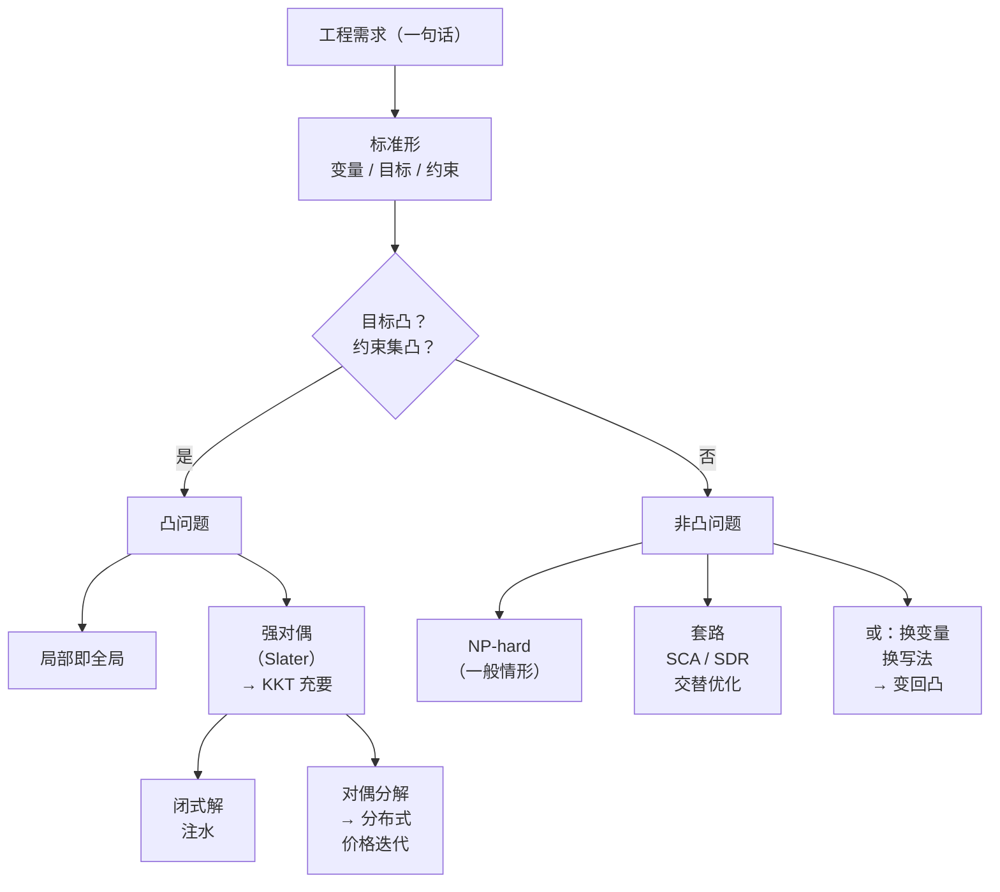
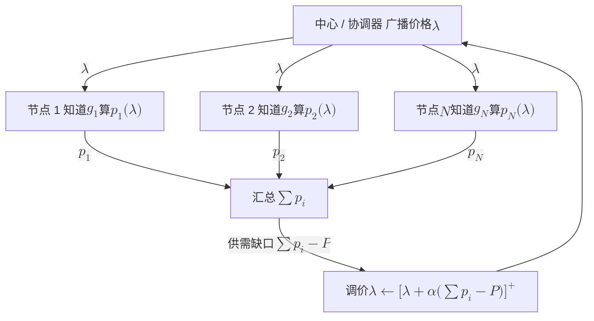
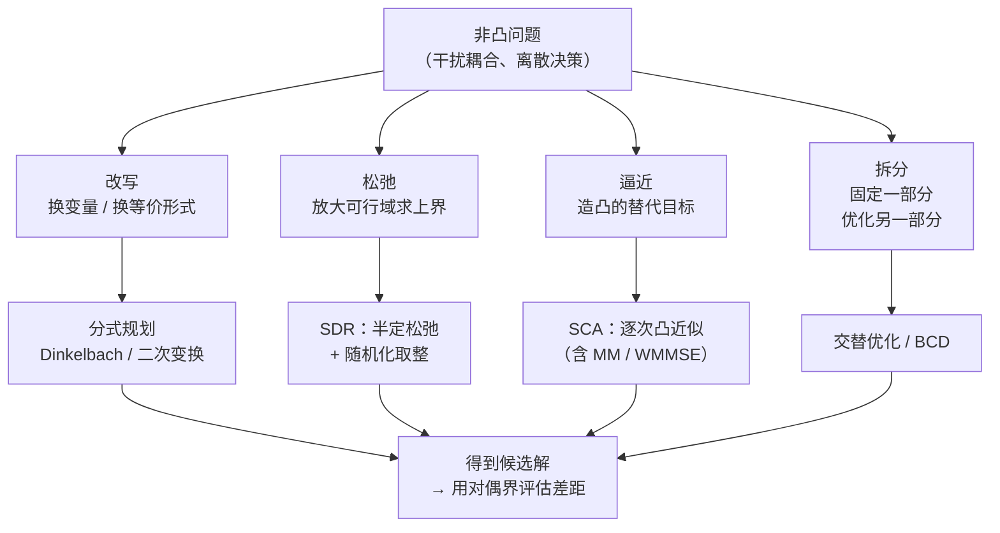

# 7 · 优化基础：凸性、对偶与注水

[第 4 章](04-information-theory-basics.md) 说明了一条链路最多能传多少比特，[第 5 章](05-mimo.md) 说明了多天线能把这个上限抬到多高，[第 6 章](06-wireless-networks.md) 则讨论一堆链路挤进同一片频谱后如何互相干扰。到这一步，问题的性质变了。要解决的是"有限的功率、频谱、时间该怎么分"。这是一个决策问题，工程界描述决策问题的通用语言是**数学优化**。

本章把第三部需要的优化语言一次讲齐。主线只有一条：先问问题凸不凸，再谈怎么解。凸的问题有对偶、有 KKT、有闭式解，还能自动分解成分布式算法，无线通信里最著名的"注水"公式就是这样得出的。非凸的问题（一有干扰耦合就非凸）要另想办法，那是第三部的内容。

**你将学会：**

- 把一个工程需求写成优化问题的标准形，并分清局部最优与全局最优；
- 用二阶条件判断凸性，并亲手证明 $\log(1+x)$ 是凹的，这是整个无线优化的地基事实；
- 说清"凸问题局部即全局"为什么成立（完整反证法，不跳步）；
- 从"约束定价"的直觉出发写出拉格朗日函数，推导弱对偶，理解强对偶与 Slater 条件；
- 逐条解释 KKT 四条件，并从强对偶推出互补松弛；
- 完整推出注水解 $p_i^{\star}=(1/\lambda-\sigma^2/g_i)^{+}$，画出注水图，用三个子载波的真实数字算一遍；
- 用对偶分解把集中式问题变成"价格迭代"的分布式算法，这是第三部 NUM 的种子；
- 用一个两链路反例看清干扰为什么让问题非凸，并掌握 SCA / SDR / 交替优化三大套路的适用场景。

## 7.1 优化问题的标准形：把工程需求翻译成数学 {#71-优化问题的标准形把工程需求翻译成数学}

### 7.1.1 从一句话需求开始 {#从一句话需求开始}

工程师说："在总功率不超过 200 mW 的前提下，把这 1200 个 OFDM 子载波的总速率做到最大，而且每个载波的功率不能是负数。"这句话包含了优化问题的全部零件：

- **要调什么**：每个载波的功率。
- **要多好**：总速率最大。
- **不能越界**：总功率有上限，功率非负。

把它们分别命名，就是标准形。

### 7.1.2 标准形与术语 {#标准形与术语}

一个数学优化问题的**标准形**写作

$$
\begin{aligned}
\min_{\mathbf{x}} \quad & f_{0}(\mathbf{x}) \\
\text{s.t.} \quad & f_{i}(\mathbf{x}) \le 0, \quad i = 1,\ldots,m \\
& h_{j}(\mathbf{x}) = 0, \quad j = 1,\ldots,p
\end{aligned}
$$

其中 $\mathbf{x}\in\mathbb{R}^{n}$ 是**优化变量**（决策），$f_{0}$ 是**目标函数**，$f_{i}\le 0$ 是**不等式约束**，$h_{j}=0$ 是**等式约束**。满足全部约束的点叫**可行点**，全体可行点构成**可行域** $\mathcal{D}$。最优值定义为

$$
p^{\star} = \inf\left\{f_{0}(\mathbf{x}) \;:\; \mathbf{x}\in\mathcal{D}\right\}
$$

**物理意义**

目标函数是"你在乎什么"，约束是"世界不让你干什么"。最优值 $p^{\star}$ 是"世界允许的最好结果"。标准形有三条约定：

- **只写 $\min$**：要最大化 $u(\mathbf{x})$，就改为 $\min -u(\mathbf{x})$。两者最优解相同，最优值相反。
- **不等式一律写成 $\le 0$**：$p_i\ge 0$ 要写成 $-p_i\le 0$。
- **可行域为空时**约定 $p^{\star}=+\infty$，称问题**不可行**；目标无下界时 $p^{\star}=-\infty$，称问题**无界**。

**行为分析**

约束越多，可行域越小，$p^{\star}$ 越大（对 $\min$ 而言不会变好）。这叫**单调性**，也是后面"影子价格"直觉的来源：放松一点约束，最优值能改善多少？那个"多少"就是价格。

### 7.1.3 局部最优 vs 全局最优 {#局部最优-vs-全局最优}

- **全局最优**：$\mathbf{x}^{\star}$ 可行且对一切可行 $\mathbf{y}$ 有 $f_{0}(\mathbf{x}^{\star})\le f_{0}(\mathbf{y})$。
- **局部最优**：存在半径 $R>0$，使 $\mathbf{x}^{\star}$ 在**邻域内**最好，即对一切可行且满足 $\|\mathbf{y}-\mathbf{x}^{\star}\|_{2}\le R$ 的 $\mathbf{y}$ 有 $f_{0}(\mathbf{x}^{\star})\le f_{0}(\mathbf{y})$。

!!! tip "直觉：山谷与登山者"
    把 $f_{0}$ 想象成地形高度，求 $\min$ 就是找最低点。局部最优是"往四面走一小步都会上坡"的坑，全局最优是整片大地的最低处。

    蒙着眼睛只靠脚感（梯度）下山的登山者，只能保证走到某个坑里，除非整片大地只有一个坑。凸性就是"只有一个坑"的数学保证。

### 7.1.4 无线里的原型：三个必须会写的标准形 {#无线里的原型三个必须会写的标准形}

| 工程问题 | 变量 | 目标 | 约束 | 凸性 |
|---|---|---|---|---|
| 单用户多载波功率分配 | $p_{1},\ldots,p_{N}$ | $\max\sum_i\log(1+p_ig_i/\sigma^2)$ | $\sum_i p_i\le P$，$p_i\ge0$ | **凸**（本章 7.5 节） |
| 多用户干扰功控 | $p_{1},\ldots,p_{K}$ | $\max\sum_k\log(1+\mathrm{SINR}_k)$ | $0\le p_k\le P_k$ | **非凸**（本章 7.7 节） |
| 最小功率满足 QoS | $p_{1},\ldots,p_{K}$ | $\min\sum_k p_k$ | $\mathrm{SINR}_k\ge\gamma_k$，$p_k\ge0$ | 凸（可化为线性规划） |

第三行为什么是线性规划？SINR 约束是

$$
p_kg_{kk}/(\sigma^{2}+\sum_{j\ne k}p_jg_{jk})\ge\gamma_k
$$

两边同乘正的分母，得

$$
p_kg_{kk}-\gamma_k\sum_{j\ne k}p_jg_{jk}\ge\gamma_k\sigma^{2}
$$

它关于 $\mathbf{p}$ 是线性的，目标也是线性的。这里 $g_{jk}$ 是 $j$ 发、$k$ 收的增益，见 7.7 节。

同一堆物理量，换一个目标就可能从凸变成非凸。"凸不凸"是问题写法的属性，这一点在 7.7 节和 7.8 节会反复验证。



## 7.2 凸集与凸函数：为什么"碗形"如此重要 {#72-凸集与凸函数为什么碗形如此重要}

### 7.2.1 凸集：两点之间不出界 {#凸集两点之间不出界}

**定义**：集合 $\mathcal{C}\subseteq\mathbb{R}^{n}$ 是**凸集**，若对任意 $\mathbf{x},\mathbf{y}\in\mathcal{C}$ 与任意 $\theta\in[0,1]$，有

$$
\theta\mathbf{x} + (1-\theta)\mathbf{y} \in \mathcal{C}
$$

**物理意义**

集合里任取两点，把它们用一根直线段连起来，线段整个躺在集合里。实心圆、实心方块是凸的，月牙、甜甜圈不是。

**行为分析**

无线里的可行域几乎都是由几块简单的凸集拼出来的：

- 功率预算 $\{\mathbf{p}:\sum_ip_i\le P\}$ 是半空间。
- 非负象限 $\{\mathbf{p}:\mathbf{p}\succeq\mathbf{0}\}$ 是半空间的交。这里向量之间的 $\succeq$ 表示逐分量 $\ge$，同一个符号放在矩阵上表示"半正定"，见下文二阶条件。
- 二者的交（一个单纯形）仍是凸集。

能这样拼，靠的是一条关键性质：任意多个凸集的交仍是凸集，因为线段同时躺在每个集合里。

反过来，"只能选 $K$ 个用户中的 3 个"这种 $\{0,1\}$ 离散约束会把可行域打成一堆孤立点，立刻非凸。这就是调度问题天生难的根源。

### 7.2.2 凸函数：弦在函数图像之上 {#凸函数弦在函数图像之上}

**定义**：函数 $f:\mathbb{R}^{n}\to\mathbb{R}$ 在凸定义域上是**凸函数**，若对任意 $\mathbf{x},\mathbf{y}$ 与 $\theta\in[0,1]$，

$$
f\left(\theta\mathbf{x} + (1-\theta)\mathbf{y}\right) \le \theta f(\mathbf{x}) + (1-\theta)f(\mathbf{y})
$$

若不等号反向，则 $f$ 是**凹函数**（等价地 $-f$ 凸）。严格不等号（$\mathbf{x}\ne\mathbf{y}$，$\theta\in(0,1)$）对应**严格凸/凹**。

**物理意义**

左边是"先平均再取值"，右边是"先取值再平均"。凸函数的图像上任意两点连成的弦，永远在函数曲线的上方，图像像个碗。凹函数则像个倒扣的锅，弦在曲线下方。

这个不等式本身就是概率论里 **Jensen 不等式**的两点版本：$f(\mathbb{E}[X])\le\mathbb{E}[f(X)]$（$f$ 凸）。

**行为分析**

凹函数的经济学名字叫**边际效益递减**：多给一份资源，带来的收益一次比一次小。无线速率函数就是这样，功率从 0 加到 1 收益巨大，从 100 加到 101 几乎没感觉。

这也是"平均分配"在凹世界里常常不吃亏、在凸世界里往往吃大亏的原因，根源是 Jensen 不等式的方向不同。

### 7.2.3 判别法：一阶与二阶条件 {#判别法一阶与二阶条件}

**一阶条件**

设 $f$ 可微。$f$ 凸 $\iff$ 对定义域内任意 $\mathbf{x},\mathbf{y}$，

$$
f(\mathbf{y}) \ge f(\mathbf{x}) + \nabla f(\mathbf{x})^{\mathsf{T}}(\mathbf{y}-\mathbf{x})
$$

**物理意义**

一阶泰勒展开（切平面）是全局下界。这条性质威力极大：只要在一点算出函数值和梯度，就得到了整个函数的一个下界。凸问题里"局部信息决定全局结论"的所有好处，源头都在这里。

**证明思路**

**第一步：先证"凸 $\Rightarrow$ 切平面在下方"。** 凸性定义可写成

$$
f(\mathbf{x}+\theta(\mathbf{y}-\mathbf{x}))\le f(\mathbf{x})+\theta\,[f(\mathbf{y})-f(\mathbf{x})]
$$

移项后除以 $\theta>0$，得

$$
f(\mathbf{y})-f(\mathbf{x})\ge[f(\mathbf{x}+\theta(\mathbf{y}-\mathbf{x}))-f(\mathbf{x})]/\theta
$$

令 $\theta\to0^{+}$，右端趋于方向导数 $\nabla f(\mathbf{x})^{\mathsf{T}}(\mathbf{y}-\mathbf{x})$。

**第二步：反过来证。** 取 $\mathbf{z}=\theta\mathbf{x}+(1-\theta)\mathbf{y}$，在 $\mathbf{z}$ 处对 $\mathbf{x}$、$\mathbf{y}$ 各写一次一阶条件，分别乘 $\theta$、$1-\theta$ 相加。梯度项合成 $\nabla f(\mathbf{z})^{\mathsf{T}}(\theta\mathbf{x}+(1-\theta)\mathbf{y}-\mathbf{z})=0$，剩下的就是凸性定义。

**第三步：一个马上要用的推论。** 若 $\nabla f(\mathbf{x}^{\star})=\mathbf{0}$，一阶条件直接给出 $f(\mathbf{y})\ge f(\mathbf{x}^{\star})$，即**凸函数的驻点就是全局最小点**。

**二阶条件**

设 $f$ 二阶可微。$f$ 凸 $\iff$ Hessian 矩阵处处半正定，

$$
\nabla^{2} f(\mathbf{x}) \succeq \mathbf{0}, \quad \forall \mathbf{x}\in\operatorname{dom} f
$$

其中 $\succeq\mathbf{0}$ 表示"半正定"：对任意 $\mathbf{v}$ 有 $\mathbf{v}^{\mathsf{T}}\nabla^{2}f(\mathbf{x})\mathbf{v}\ge0$。一维情形就退化成中学熟悉的 $f''(x)\ge0$。若对一切 $\mathbf{v}\ne\mathbf{0}$ 严格大于 0，则称**正定**，记作 $\succ\mathbf{0}$。Hessian 处处正定则 $f$ **严格凸**。

实际判别看特征值：

- 对称矩阵半正定当且仅当特征值全 $\ge0$，正定当且仅当全 $>0$。理由是把 $\mathbf{v}$ 按单位正交特征向量展开，$\mathbf{v}=\sum_ic_i\mathbf{u}_i$，则 $\mathbf{v}^{\mathsf{T}}\mathbf{A}\mathbf{v}=\sum_i\kappa_ic_i^{2}$（$\kappa_i$ 为特征值）。
- 对角矩阵的特征值就是对角元。
- 形如 $\mathbf{w}\mathbf{w}^{\mathsf{T}}$ 的矩阵总是半正定，因为 $\mathbf{v}^{\mathsf{T}}\mathbf{w}\mathbf{w}^{\mathsf{T}}\mathbf{v}=(\mathbf{w}^{\mathsf{T}}\mathbf{v})^{2}\ge0$。

**为什么二阶条件成立（思路）**

$f$ 凸当且仅当它在每条直线上都凸，即对任意 $\mathbf{x}$ 与方向 $\mathbf{v}$，$\phi(t)=f(\mathbf{x}+t\mathbf{v})$ 凸。链式法则给出

$$
\phi''(t)=\mathbf{v}^{\mathsf{T}}\nabla^{2}f(\mathbf{x}+t\mathbf{v})\mathbf{v}
$$

Hessian 半正定 $\Rightarrow$ $\phi''\ge0$ $\Rightarrow$ $\phi'$ 不减。由中值定理 $\phi(1)-\phi(0)=\phi'(s)\ge\phi'(0)$，即 $f(\mathbf{x}+\mathbf{v})\ge f(\mathbf{x})+\nabla f(\mathbf{x})^{\mathsf{T}}\mathbf{v}$，这就是一阶条件。反之，若某处 $\phi''<0$，附近的弦就跑到曲线下方。

**行为分析**

Hessian 是"曲率"。半正定意味着沿任何方向切一刀，剖面都是向上弯的碗，没有任何方向能让你从坑里"顺坡溜走"。只要有一个方向的曲率为负（Hessian 有负特征值），那个方向就是鞍点的逃逸方向，全局性保证立刻失效。

### 7.2.4 关键事实：$\log(1+x)$ 是凹的 {#关键事实log1x-是凹的}

这是本章，乃至整个无线资源分配理论的地基。直接求导，两步：

$$
\frac{\mathrm{d}}{\mathrm{d}x}\ln(1+x) = \frac{1}{1+x}, \qquad
\frac{\mathrm{d}^{2}}{\mathrm{d}x^{2}}\ln(1+x) = -\frac{1}{(1+x)^{2}} < 0, \quad \forall x > -1
$$

二阶导处处严格小于 0，故 $\ln(1+x)$ 在 $x>-1$ 上**严格凹**。换底为 $\log_{2}$ 只差一个正常数 $1/\ln2$，凹性不变。

再往前一步：速率函数是 $\log(1+p\,g/\sigma^{2})$，自变量是功率 $p$。这里用到**仿射复合保凸/保凹**规则：若 $f$ 凹，$A$ 是仿射映射，则 $f(A\mathbf{x}+\mathbf{b})$ 仍凹。因为 $p\mapsto p\,g/\sigma^{2}$ 是仿射（乘一个正常数），所以

$$
r(p) = \log_{2}\!\left(1+\frac{p\,g}{\sigma^{2}}\right) \text{ 关于 } p \text{ 严格凹}
$$

最后，**凹函数的非负加权和仍凹**，于是多载波总速率 $\sum_{i}\log_{2}(1+p_ig_i/\sigma^{2})$ 关于功率向量 $\mathbf{p}$ 是凹的。这一句话，就是 7.5 节注水定理成立的全部前提。

!!! example "算例：用 Hessian 验证两载波总速率的凹性"

    取两个子载波，归一化增益 $\gamma_{1}=g_{1}/\sigma^{2}=4$、$\gamma_{2}=1$（单位：每单位功率的 SNR）。目标（以 nat 为单位）

    $$
    f(p_{1},p_{2}) = \ln(1+4p_{1}) + \ln(1+p_{2})
    $$

    梯度与 Hessian：

    $$
    \nabla f = \begin{bmatrix}\dfrac{4}{1+4p_{1}}\\[6pt]\dfrac{1}{1+p_{2}}\end{bmatrix},
    \qquad
    \nabla^{2} f = \begin{bmatrix}-\dfrac{16}{(1+4p_{1})^{2}} & 0\\[6pt] 0 & -\dfrac{1}{(1+p_{2})^{2}}\end{bmatrix}
    $$

    在 $\mathbf{p}=(1,1)$ 处代入：$\nabla^{2}f = \operatorname{diag}(-16/25,\,-1/4) = \operatorname{diag}(-0.64,\,-0.25)$，两个特征值都为负。

    一个点还不够下结论，凹性要求处处成立。好在两个对角元 $-16/(1+4p_{1})^{2}$ 与 $-1/(1+p_{2})^{2}$ 在整个定义域上都严格小于 0，所以 $-f$ 的 Hessian 处处正定（在 $(1,1)$ 处就是 $\operatorname{diag}(0.64,0.25)\succ\mathbf{0}$），$-f$ 严格凸、$f$ 严格凹。

    再用定义直观验证一次：取 $\mathbf{x}=(2,0)$、$\mathbf{y}=(0,2)$，中点 $\mathbf{z}=(1,1)$。

    - $f(\mathbf{x}) = \ln 9 + \ln 1 = 2.197$
    - $f(\mathbf{y}) = \ln 1 + \ln 3 = 1.099$
    - 端点平均 $= 1.648$
    - $f(\mathbf{z}) = \ln 5 + \ln 2 = 1.609 + 0.693 = 2.303 > 1.648$ ✓

    中点值高于端点平均，这就是凹函数的定义。请记住这组数字：7.7 节会做同样的检验，但加上干扰后结果会反过来。

### 7.2.5 常见凸/凹函数速查表 {#常见凸凹函数速查表}

| 函数 | 定义域 | 凸 / 凹 | 判据或备注 |
|---|---|---|---|
| $a x + b$，$\mathbf{a}^{\mathsf{T}}\mathbf{x}+b$ | $\mathbb{R}^{n}$ | 既凸又凹 | $\nabla^{2}f=\mathbf{0}$ |
| $x^{2}$，$\mathbf{x}^{\mathsf{T}}\mathbf{A}\mathbf{x}$（$\mathbf{A}\succeq\mathbf{0}$） | $\mathbb{R}^{n}$ | 凸 | $\nabla^{2}f=2\mathbf{A}\succeq\mathbf{0}$ |
| $e^{ax}$ | $\mathbb{R}$ | 凸 | $f''=a^{2}e^{ax}>0$ |
| $\ln x$ | $x>0$ | 凹 | $f''=-1/x^{2}<0$ |
| $x\ln x$ | $x>0$ | 凸 | $f''=1/x>0$（熵的负号来源） |
| $\log(1+x)$ | $x>-1$ | **凹** | $f''=-1/(1+x)^{2}<0$（**速率函数**） |
| $1/x$ | $x>0$ | 凸 | $f''=2/x^{3}>0$ |
| $x_{1}^{2}/x_{2}$ | $x_{2}>0$ | 凸 | Hessian $=\frac{2}{x_{2}^{3}}\mathbf{v}\mathbf{v}^{\mathsf{T}}\succeq\mathbf{0}$，$\mathbf{v}=[x_{2},-x_{1}]^{\mathsf{T}}$ |
| 任意范数 $\|\mathbf{x}\|$ | $\mathbb{R}^{n}$ | 凸 | 三角不等式 + 齐次性 |
| $\max\{f_{1},\ldots,f_{m}\}$（$f_i$ 凸） | — | 凸 | 逐点最大保凸（**最坏情形设计**） |
| $\log\sum_{i}e^{x_{i}}$ | $\mathbb{R}^{n}$ | 凸 | log-sum-exp，$\max$ 的光滑近似 |
| $\log\det\mathbf{X}$ | $\mathbf{X}\succ\mathbf{0}$ | 凹 | MIMO 容量 $\log\det(\mathbf{I}+\mathbf{H}\mathbf{Q}\mathbf{H}^{\mathsf{H}}/\sigma^{2})$ 关于 $\mathbf{Q}$ 凹 |

最后一行值得单独说。它是 [第 5 章](05-mimo.md) MIMO 容量对协方差矩阵 $\mathbf{Q}$ 优化能得到闭式注水解的原因。本章 7.5 节的标量注水，在 MIMO 里以特征子信道注水的形式重演。

### 7.2.6 为什么凸性重要：局部即全局 {#为什么凸性重要局部即全局}

!!! success "关键结论"
    **凸问题（凸目标 + 凸可行域）的任意局部最优点都是全局最优点。**

**证明（反证法，逐步）**

设 $\mathbf{x}^{\star}$ 是局部最优，即存在 $R>0$ 使得所有可行且 $\|\mathbf{y}-\mathbf{x}^{\star}\|\le R$ 的 $\mathbf{y}$ 满足 $f_{0}(\mathbf{y})\ge f_{0}(\mathbf{x}^{\star})$。反设它不是全局最优，则存在可行点 $\mathbf{z}$ 使 $f_{0}(\mathbf{z}) < f_{0}(\mathbf{x}^{\star})$。

**第一步：构造中间点。** 取 $\theta\in(0,1]$，令

$$
\mathbf{y}_{\theta} = (1-\theta)\,\mathbf{x}^{\star} + \theta\,\mathbf{z}
$$

**第二步：证 $\mathbf{y}_{\theta}$ 可行。** 因为 $\mathbf{x}^{\star},\mathbf{z}$ 都在可行域内，而可行域是凸集，故 $\mathbf{y}_{\theta}$ 可行。

**第三步：选 $\theta$ 让它落进邻域。** 注意 $\|\mathbf{y}_{\theta}-\mathbf{x}^{\star}\| = \theta\|\mathbf{z}-\mathbf{x}^{\star}\|$。取

$$
\theta = \min\left\{1,\ \frac{R}{\|\mathbf{z}-\mathbf{x}^{\star}\|}\right\} > 0
$$

则 $\|\mathbf{y}_{\theta}-\mathbf{x}^{\star}\|\le R$，即 $\mathbf{y}_{\theta}$ 落在局部最优的邻域里。

**第四步：用凸性算它的函数值。**

$$
f_{0}(\mathbf{y}_{\theta}) \le (1-\theta) f_{0}(\mathbf{x}^{\star}) + \theta f_{0}(\mathbf{z}) < (1-\theta) f_{0}(\mathbf{x}^{\star}) + \theta f_{0}(\mathbf{x}^{\star}) = f_{0}(\mathbf{x}^{\star})
$$

第一个 $\le$ 用的是 $f_{0}$ 的凸性，第二个 $<$ 用的是反设 $f_{0}(\mathbf{z})<f_{0}(\mathbf{x}^{\star})$ 与 $\theta>0$。

**第五步：矛盾。** 我们找到了邻域内的可行点 $\mathbf{y}_{\theta}$ 严格优于 $\mathbf{x}^{\star}$，与局部最优矛盾。故反设不成立，$\mathbf{x}^{\star}$ 是全局最优。$\blacksquare$

**这个证明为什么值得逐步看**

它清楚地展示了两个凸性各自在哪一步被用到。可行域的凸性保证第二步（中间点合法），目标的凸性保证第四步（中间点更好）。任何一个失效，结论就断。7.7 节的干扰问题恰恰是目标凹性失效，于是"下山就到底"的承诺立刻作废。

## 7.3 拉格朗日对偶：把约束变成价格 {#73-拉格朗日对偶把约束变成价格}

### 7.3.1 直觉：给约束定个价 {#直觉给约束定个价}

回到那句工程需求："总功率不超过 200 mW。"处理约束有两种态度：

- **硬派**：架一堵墙，越界就是非法。
- **软派**：拆掉墙，改成收费。你想多用 1 mW 也行，交 $\lambda$ 元。

只要 $\lambda$ 定得足够高，理性的用户自己就会把功率压回 200 mW 以内。如果 $\lambda$ 定得太低，大家会疯狂超用。

存在一个恰到好处的价格，使得"自由但收费"的解正好等于"强制限额"的解。这个价格就是拉格朗日乘子，这件事就是对偶理论。

这个视角在无线里格外亲切：功率是资源，$\lambda$ 是它的**影子价格**（shadow price）。7.6 节会看到，这个价格甚至可以由一个中心节点广播、各终端自己算，形成分布式算法。

### 7.3.2 拉格朗日函数与对偶函数 {#拉格朗日函数与对偶函数}

对标准形问题，定义**拉格朗日函数** $L:\mathbb{R}^{n}\times\mathbb{R}^{m}\times\mathbb{R}^{p}\to\mathbb{R}$：

$$
L(\mathbf{x},\boldsymbol{\lambda},\boldsymbol{\nu}) = f_{0}(\mathbf{x}) + \sum_{i=1}^{m}\lambda_{i} f_{i}(\mathbf{x}) + \sum_{j=1}^{p}\nu_{j} h_{j}(\mathbf{x})
$$

$\lambda_{i}\ge0$ 称为不等式约束的**拉格朗日乘子**（价格），$\nu_{j}\in\mathbb{R}$ 是等式约束的乘子。定义**拉格朗日对偶函数**：

$$
g(\boldsymbol{\lambda},\boldsymbol{\nu}) = \inf_{\mathbf{x}\in\mathcal{X}} L(\mathbf{x},\boldsymbol{\lambda},\boldsymbol{\nu})
$$

这里 $\mathcal{X}$ 是问题的定义域（通常是全空间或简单集合），注意它不含那些被定价的约束。

**物理意义**

$L$ 是"违约金账本"：违反第 $i$ 条约束（$f_i(\mathbf{x})>0$）就要罚 $\lambda_i f_i(\mathbf{x})$，遵守（$f_i(\mathbf{x})<0$）反而得奖励。$g(\boldsymbol{\lambda},\boldsymbol{\nu})$ 则是"给定价目表后，市场上最会算账的人能把总成本压到多低"。

**行为分析**

$g$ 有一条免费的好性质：无论原问题凸不凸，$g$ 永远是凹函数。理由分两步：

- 对固定的 $\mathbf{x}$，$L$ 关于 $(\boldsymbol{\lambda},\boldsymbol{\nu})$ 是仿射的（一次函数）。
- 一族仿射函数的逐点下确界是凹函数。

验证：把价格简记为 $\mathbf{w}$，由仿射性和 $L(\mathbf{x},\mathbf{w}_{k})\ge g(\mathbf{w}_{k})$，

$$
L(\mathbf{x},\theta\mathbf{w}_{1}+(1-\theta)\mathbf{w}_{2}) = \theta L(\mathbf{x},\mathbf{w}_{1})+(1-\theta)L(\mathbf{x},\mathbf{w}_{2}) \ge \theta g(\mathbf{w}_{1})+(1-\theta)g(\mathbf{w}_{2})
$$

对左边关于 $\mathbf{x}$ 取下确界，就是 $g$ 的凹性不等式。全程没用到 $f_{0},f_{i}$ 的任何性质。

这意味着"找最优价格"这件事本身总是一个凸优化问题，哪怕原问题是 NP-hard 的。NP-hard 粗略地说，就是不太可能有多项式时间的精确算法。这是对偶方法在非凸世界里仍然有用的根本原因（见 7.7 节）。

### 7.3.3 弱对偶：价格给出的下界 {#弱对偶价格给出的下界}

!!! success "弱对偶定理"
    对任意 $\boldsymbol{\lambda}\succeq\mathbf{0}$ 与任意 $\boldsymbol{\nu}$，有 $g(\boldsymbol{\lambda},\boldsymbol{\nu}) \le p^{\star}$。

**证明（四步，不跳）**

设 $\tilde{\mathbf{x}}$ 是任意**可行点**，即 $f_{i}(\tilde{\mathbf{x}})\le0$ 且 $h_{j}(\tilde{\mathbf{x}})=0$。

**第一步：罚项非正。** 因为 $\lambda_{i}\ge0$ 而 $f_{i}(\tilde{\mathbf{x}})\le0$，每项乘积 $\lambda_{i}f_{i}(\tilde{\mathbf{x}})\le0$。因为 $h_{j}(\tilde{\mathbf{x}})=0$，每项 $\nu_{j}h_{j}(\tilde{\mathbf{x}})=0$。故

$$
\sum_{i=1}^{m}\lambda_{i} f_{i}(\tilde{\mathbf{x}}) + \sum_{j=1}^{p}\nu_{j} h_{j}(\tilde{\mathbf{x}}) \le 0
$$

**第二步：$L$ 不超过目标值。**

$$
L(\tilde{\mathbf{x}},\boldsymbol{\lambda},\boldsymbol{\nu}) = f_{0}(\tilde{\mathbf{x}}) + \underbrace{\sum_{i}\lambda_{i}f_{i}(\tilde{\mathbf{x}}) + \sum_{j}\nu_{j}h_{j}(\tilde{\mathbf{x}})}_{\le\,0} \le f_{0}(\tilde{\mathbf{x}})
$$

**第三步：下确界只会更小。** 由 $g$ 的定义，$g(\boldsymbol{\lambda},\boldsymbol{\nu}) = \inf_{\mathbf{x}}L(\mathbf{x},\boldsymbol{\lambda},\boldsymbol{\nu}) \le L(\tilde{\mathbf{x}},\boldsymbol{\lambda},\boldsymbol{\nu}) \le f_{0}(\tilde{\mathbf{x}})$。

**第四步：对所有可行点取下确界。** 上式对**每一个**可行 $\tilde{\mathbf{x}}$ 都成立，于是

$$
g(\boldsymbol{\lambda},\boldsymbol{\nu}) \le \inf_{\tilde{\mathbf{x}}\in\mathcal{D}} f_{0}(\tilde{\mathbf{x}}) = p^{\star} \qquad\blacksquare
$$

既然任何价目表都给出一个下界，自然要找**最好的下界**，这就是**对偶问题**：

$$
d^{\star} = \max_{\boldsymbol{\lambda}\succeq\mathbf{0},\,\boldsymbol{\nu}} \; g(\boldsymbol{\lambda},\boldsymbol{\nu}) \qquad \Longrightarrow \qquad d^{\star} \le p^{\star}
$$

差值 $p^{\star}-d^{\star}\ge0$ 称为**对偶间隙**（duality gap）。

**行为分析**

弱对偶的实用价值巨大。哪怕你解不出原问题（非凸、NP-hard），只要随便代入一组 $\boldsymbol{\lambda}\succeq\mathbf{0}$ 算出 $g$，就得到了 $p^{\star}$ 的一个**可信的性能下界**。再拿任意一个可行解算出的目标值当上界（可行点的目标值不可能低于最优值），两者一夹，就知道自己的启发式算法离最优还差多远。

对 $\max$ 问题两个角色对调：对偶给上界，可行解给下界。第三部评价启发式算法的"最优性差距"（optimality gap），用的就是这套。

### 7.3.4 强对偶与 Slater 条件 {#强对偶与-slater-条件}

当 $p^{\star}=d^{\star}$（间隙为零）时称**强对偶**成立。它不是免费午餐，需要条件。

!!! note "Slater 条件（凸问题的强对偶充分条件）"
    设原问题是**凸问题**（$f_{0},f_{1},\ldots,f_{m}$ 凸，$h_{j}$ 仿射，于是全部等式约束可以合写成 $\mathbf{A}\mathbf{x}=\mathbf{b}$）。若存在一个**严格可行点** $\mathbf{x}_{0}$，即

    $$
    f_{i}(\mathbf{x}_{0}) < 0 \;\;(i=1,\ldots,m), \qquad \mathbf{A}\mathbf{x}_{0}=\mathbf{b}
    $$

    则强对偶成立，且对偶最优值可达（存在 $\boldsymbol{\lambda}^{\star},\boldsymbol{\nu}^{\star}$ 使 $g(\boldsymbol{\lambda}^{\star},\boldsymbol{\nu}^{\star})=p^{\star}$）。

    **弱化形式**：仿射不等式约束只需 $\le$ 成立，不必严格。

**物理意义**

Slater 条件要求可行域"有厚度"，不能退化成一根针。直觉上，若可行域只剩一个孤点，"松一点约束能改善多少"这个导数就没定义，影子价格自然算不出来。

一个 Slater 失效的最小例子：$\min x$ s.t. $x^{2}\le0$。可行域只有孤点 $x=0$，$p^{\star}=0$。

对 $\lambda>0$，$L=x+\lambda x^{2}$ 在 $x=-1/(2\lambda)$ 处最小，$g(\lambda)=-1/(4\lambda)$，随 $\lambda\to\infty$ 逼近 0 却到不了。所以 $d^{\star}=p^{\star}$，但**对偶最优解不存在**。

原因是影子价格无穷大：约束放松成 $x^{2}\le u$ 后 $p^{\star}(u)=-\sqrt{u}$，在 $u=0$ 处斜率为 $-\infty$。更坏的情形还会留下正的对偶间隙。

**行为分析**

对无线问题，这个条件几乎总是自动满足。以功率分配为例，只要 $P>0$，取 $p_i = P/(2N)$ 就有 $\sum_ip_i = P/2 < P$ 且 $p_i>0$，严格可行点唾手可得。所以本章 7.5 节可以放心大胆地用 KKT 求全局最优。

反过来，$P=0$ 的退化情形找不到严格可行点，上面的严格形式失效。不过这个问题的约束全是线性的，按弱化形式只要可行就够，强对偶其实依然成立。何况那时问题本身也没什么可优化的了。

| 概念 | 原问题 | 对偶问题 |
|---|---|---|
| 变量 | $\mathbf{x}$（物理量：功率、带宽） | $\boldsymbol{\lambda},\boldsymbol{\nu}$（价格：元/瓦） |
| 目标 | $\min f_{0}$ | $\max g$ |
| 凸性 | 视问题而定 | **恒为凸**（$g$ 恒凹） |
| 维度 | $n$（变量个数，可能上千） | $m+p$（约束个数，常常只有几个） |
| 最优值 | $p^{\star}$ | $d^{\star}\le p^{\star}$ |
| 解释 | 该怎么分 | 资源值多少钱 |

!!! example "算例：亲手验证弱对偶与强对偶"

    问题：$\min\; x^{2}$，s.t. $x\ge1$。改写为标准形 $f_{1}(x)=1-x\le0$。

    拉格朗日函数 $L(x,\lambda)=x^{2}+\lambda(1-x)$。对 $x$ 求最小：$\partial L/\partial x = 2x-\lambda=0 \Rightarrow x=\lambda/2$，代回

    $$
    g(\lambda) = \frac{\lambda^{2}}{4} + \lambda\left(1-\frac{\lambda}{2}\right) = \lambda - \frac{\lambda^{2}}{4}
    $$

    这确实是一个**凹**的二次函数。逐点验证弱对偶（真值 $p^{\star}=1$，在 $x=1$ 取到）：

    | $\lambda$ | 0 | 1 | 2 | 3 | 4 |
    |---|---|---|---|---|---|
    | $g(\lambda)$ | 0 | 0.75 | **1.00** | 0.75 | 0 |

    每一格都 $\le p^{\star}=1$ ✓。最好的下界在 $\mathrm{d}g/\mathrm{d}\lambda = 1-\lambda/2=0$ 即 $\lambda^{\star}=2$ 处取得，$d^{\star}=1=p^{\star}$。间隙为零，强对偶成立。Slater 显然满足：$x_{0}=5$ 严格可行。

    再看价格的含义：把约束改成 $x\ge1+u$，则 $p^{\star}(u)=(1+u)^{2}$，于是 $\left.\mathrm{d}p^{\star}/\mathrm{d}u\right|_{u=0}=2=\lambda^{\star}$。乘子就是"约束收紧一个单位，代价上涨多少"的边际价格。这条灵敏度解释会在 7.5 节变成"每瓦功率能换几个比特"。

## 7.4 KKT 条件：最优解必须满足的四条 {#74-kkt-条件最优性的四条戒律}

### 7.4.1 四条件 {#四条件}

设 $f_{0},f_{i},h_{j}$ 可微。若原问题与对偶问题都取到最优且**强对偶成立**，则最优对 $(\mathbf{x}^{\star},\boldsymbol{\lambda}^{\star},\boldsymbol{\nu}^{\star})$ 必满足 **KKT 条件**（Karush–Kuhn–Tucker）：

$$
\begin{aligned}
\textbf{(1) 原始可行:}\quad & f_{i}(\mathbf{x}^{\star})\le0,\quad h_{j}(\mathbf{x}^{\star})=0 \\
\textbf{(2) 对偶可行:}\quad & \lambda_{i}^{\star}\ge0 \\
\textbf{(3) 互补松弛:}\quad & \lambda_{i}^{\star}\, f_{i}(\mathbf{x}^{\star}) = 0,\quad i=1,\ldots,m \\
\textbf{(4) 驻点条件:}\quad & \nabla f_{0}(\mathbf{x}^{\star}) + \sum_{i=1}^{m}\lambda_{i}^{\star}\nabla f_{i}(\mathbf{x}^{\star}) + \sum_{j=1}^{p}\nu_{j}^{\star}\nabla h_{j}(\mathbf{x}^{\star}) = \mathbf{0}
\end{aligned}
$$

逐条读懂它们：

- **(1) 原始可行**：废话，但必须写。解得守规矩。
- **(2) 对偶可行**：价格不能是负的。若 $\lambda_i<0$，等于"你越违规我越奖励你"，那还叫什么约束。
- **(3) 互补松弛**：最漂亮的一条。它说 $\lambda_{i}^{\star}$ 与 $f_{i}(\mathbf{x}^{\star})$ 中至少有一个为零。
    - 要么约束顶死（$f_i=0$，此时价格可以为正）。
    - 要么价格为零（$\lambda_i=0$，此时约束是松的、白送的）。
    - 经济学翻译：没有稀缺就没有价格。功率没用完，多一瓦功率一分钱不值。功率用满了，它才值钱。
- **(4) 驻点条件**：目标的下降方向被约束的法向"顶住"了。$-\nabla f_{0}$ 恰好是各条**起作用约束**梯度的非负组合，想再往下走就必然撞墙。

### 7.4.2 从强对偶推出互补松弛 {#从强对偶推出互补松弛}

互补松弛不是凭空规定的，它是强对偶的直接推论。设 $\mathbf{x}^{\star}$ 原始最优、$(\boldsymbol{\lambda}^{\star},\boldsymbol{\nu}^{\star})$ 对偶最优、$p^{\star}=d^{\star}$。写出一条不等式链：

$$
\begin{aligned}
f_{0}(\mathbf{x}^{\star}) = p^{\star} = d^{\star} = g(\boldsymbol{\lambda}^{\star},\boldsymbol{\nu}^{\star})
&= \inf_{\mathbf{x}}\left\{f_{0}(\mathbf{x}) + \sum_{i}\lambda_{i}^{\star}f_{i}(\mathbf{x}) + \sum_{j}\nu_{j}^{\star}h_{j}(\mathbf{x})\right\} \\
&\overset{(a)}{\le} f_{0}(\mathbf{x}^{\star}) + \sum_{i}\lambda_{i}^{\star}f_{i}(\mathbf{x}^{\star}) + \sum_{j}\nu_{j}^{\star}h_{j}(\mathbf{x}^{\star}) \\
&\overset{(b)}{\le} f_{0}(\mathbf{x}^{\star})
\end{aligned}
$$

$(a)$ 是"下确界 $\le$ 任一点取值"，$(b)$ 用了 $\lambda_{i}^{\star}\ge0,\ f_{i}(\mathbf{x}^{\star})\le0,\ h_{j}(\mathbf{x}^{\star})=0$。

链条首尾都是 $f_{0}(\mathbf{x}^{\star})$，**中间所有不等号必须全部取等**。两个结论随之而来：

1. **驻点条件 (4)**：由 $(a)$ 取等，$L(\cdot,\boldsymbol{\lambda}^{\star},\boldsymbol{\nu}^{\star})$ 在 $\mathbf{x}^{\star}$ 处取到它在全体 $\mathbf{x}$ 上的下确界，即 $\mathbf{x}^{\star}$ 是它的**无约束极小点**，故梯度为零。约束已化作价格进了 $L$，而 $L$ 对 $\mathbf{x}$ 的梯度正是 (4) 的左端。
2. **互补松弛 (3)**：由 $(b)$ 取等，$(b)$ 两边之差是 $\sum_{i}\lambda_{i}^{\star}f_{i}(\mathbf{x}^{\star})+\sum_{j}\nu_{j}^{\star}h_{j}(\mathbf{x}^{\star})$。后一和因 $h_{j}(\mathbf{x}^{\star})=0$ 为零，故 $\sum_{i}\lambda_{i}^{\star}f_{i}(\mathbf{x}^{\star})=0$。而求和中每一项都 $\le0$，一堆非正数之和为零，只能每项都为零。

### 7.4.3 KKT 什么时候是充要的 {#kkt-什么时候是充要的}

!!! success "关键结论"
    - **一般（含非凸）问题**：在适当的约束规范（如 Slater）下，KKT 是最优的**必要条件**。满足 KKT 的点可能是局部最优、鞍点，甚至局部最差。
    - **凸问题 + Slater 条件**：KKT 是最优的**充分必要条件**。任何满足 KKT 的 $(\mathbf{x}^{\star},\boldsymbol{\lambda}^{\star},\boldsymbol{\nu}^{\star})$，其中 $\mathbf{x}^{\star}$ 一定是**全局最优解**。

**为什么凸问题里 KKT 是充分的**

设 $(\mathbf{x}^{\star},\boldsymbol{\lambda}^{\star},\boldsymbol{\nu}^{\star})$ 满足四条件。

**第一步：$L$ 是凸函数。** 因为 $\lambda_{i}^{\star}\ge0$、$f_{i}$ 凸、$h_{j}$ 仿射，$L(\cdot,\boldsymbol{\lambda}^{\star},\boldsymbol{\nu}^{\star})$ 是凸函数。

**第二步：$\mathbf{x}^{\star}$ 是 $L$ 的全局最小点。** 驻点条件说它在 $\mathbf{x}^{\star}$ 处梯度为零，由 7.2 节一阶条件，$\mathbf{x}^{\star}$ 是它的全局最小点，故

$$
g(\boldsymbol{\lambda}^{\star},\boldsymbol{\nu}^{\star})=L(\mathbf{x}^{\star},\boldsymbol{\lambda}^{\star},\boldsymbol{\nu}^{\star})=f_{0}(\mathbf{x}^{\star})
$$

后一个等号用互补松弛与原始可行。

**第三步：夹逼。** 再由弱对偶，

$$
f_{0}(\mathbf{x}^{\star})=g(\boldsymbol{\lambda}^{\star},\boldsymbol{\nu}^{\star})\le p^{\star}\le f_{0}(\mathbf{x}^{\star})
$$

只能全部取等。Slater 管的是反方向：保证最优点处存在 KKT 乘子。

这条区别是本章的枢纽。因为 7.5 节的功率分配问题是凸的且 Slater 成立，我们才敢"解一遍 KKT 就宣布拿到全局最优"。而 7.7 节的干扰问题非凸，同样解 KKT 只能得到一个候选点，好坏未知。

!!! example "算例：用 KKT 秒解一个小问题"

    仍取 $\min x^{2}$ s.t. $1-x\le0$。写出 KKT：

    1. 原始可行：$1-x^{\star}\le0$
    2. 对偶可行：$\lambda^{\star}\ge0$
    3. 互补松弛：$\lambda^{\star}(1-x^{\star})=0$
    4. 驻点：$2x^{\star}-\lambda^{\star}=0$

    **分情况讨论**（这是解 KKT 的标准动作）：

    - **情形 A：$\lambda^{\star}=0$（约束不起作用）**。由 (4) 得 $x^{\star}=0$，但 $1-0=1>0$ 违反 (1)。此情形不成立：功率没用完却还嫌不够，逻辑上矛盾。
    - **情形 B：$1-x^{\star}=0$（约束顶死）**。得 $x^{\star}=1$，由 (4) 得 $\lambda^{\star}=2\ge0$，满足 (2)。✓

    结论 $x^{\star}=1$、$\lambda^{\star}=2$，与 7.3 节的对偶计算完全吻合。这个"先假设某约束松，矛盾则改为紧"的推理模式，就是下一节注水解里"哪些子载波该关掉"的判定逻辑。

## 7.5 注水定理：无线最著名的闭式解 {#75-注水定理无线最著名的闭式解}

### 7.5.1 问题设置 {#问题设置}

考虑一条 OFDM 链路的 $N$ 个子载波（背景见 [第 3 章](03-digital-communications.md)）：

- 第 $i$ 个子载波的信道功率增益为 $g_{i}>0$，噪声功率为 $\sigma^{2}$，分配功率 $p_{i}\ge0$。
- 该子载波的速率为 $\log_{2}(1+p_{i}g_{i}/\sigma^{2})$（[第 4 章](04-information-theory-basics.md) 的 AWGN 容量公式）。
- 总功率预算为 $P$。

为方便求导，以 nat 为单位（结果乘 $1/\ln 2$ 换成 bit），问题写成

$$
\begin{aligned}
\max_{\mathbf{p}} \quad & \sum_{i=1}^{N} \ln\left(1 + \frac{p_{i} g_{i}}{\sigma^{2}}\right) \\
\text{s.t.} \quad & \sum_{i=1}^{N} p_{i} \le P \\
& p_{i} \ge 0, \quad i=1,\ldots,N
\end{aligned}
$$

**凸性核查（必须先做）**

- 目标是凹函数之和（7.2 节已证 $\log(1+\cdot)$ 凹 + 仿射复合 + 非负和），取负后为凸。
- 约束全是线性的，可行域是凸的单纯形。
- 只要 $P>0$，$p_{i}=P/(2N)$ 就是严格可行点，Slater 成立。

因此 KKT 充要，解出 KKT 即得全局最优。

### 7.5.2 逐步推导 {#逐步推导}

**第一步：写成标准形（最小化）。**

$$
\min_{\mathbf{p}} \; -\sum_{i=1}^{N}\ln\left(1+\frac{p_{i}g_{i}}{\sigma^{2}}\right)
\quad \text{s.t.} \quad \sum_{i=1}^{N}p_{i} - P \le 0, \quad -p_{i}\le 0
$$

**第二步：拉格朗日函数。** 给功率约束定价 $\lambda\ge0$，给非负约束定价 $\mu_{i}\ge0$：

$$
L(\mathbf{p},\lambda,\boldsymbol{\mu}) = -\sum_{i=1}^{N}\ln\left(1+\frac{p_{i}g_{i}}{\sigma^{2}}\right) + \lambda\left(\sum_{i=1}^{N}p_{i}-P\right) - \sum_{i=1}^{N}\mu_{i}p_{i}
$$

**第三步：驻点条件（对 $p_{i}$ 求偏导置零）。**

$$
\frac{\partial L}{\partial p_{i}} = -\frac{g_{i}/\sigma^{2}}{1+p_{i}g_{i}/\sigma^{2}} + \lambda - \mu_{i} = 0
$$

**第四步：化简那一项分式。** 分子分母同乘 $\sigma^{2}/g_{i}$：

$$
\frac{g_{i}/\sigma^{2}}{1+p_{i}g_{i}/\sigma^{2}} = \frac{1}{\sigma^{2}/g_{i} + p_{i}}
$$

于是驻点条件变成一个极其干净的形式：

$$
\frac{1}{\dfrac{\sigma^{2}}{g_{i}} + p_{i}} = \lambda - \mu_{i}
$$

**第五步：分情况用互补松弛。**

- **情形 A：$p_{i}^{\star}>0$。** 由互补松弛 $\mu_{i}p_{i}^{\star}=0$ 得 $\mu_{i}=0$，代入第四步：

    $$
    \frac{1}{\sigma^{2}/g_{i}+p_{i}^{\star}} = \lambda \quad\Longrightarrow\quad p_{i}^{\star} = \frac{1}{\lambda} - \frac{\sigma^{2}}{g_{i}}
    $$

    该情形要求右端 $>0$，即 $1/\lambda > \sigma^{2}/g_{i}$。

- **情形 B：$p_{i}^{\star}=0$。** 代入第四步得 $g_{i}/\sigma^{2} = \lambda - \mu_{i}$，即 $\mu_{i} = \lambda - g_{i}/\sigma^{2}$。对偶可行要求 $\mu_{i}\ge0$，即 $\lambda\ge g_{i}/\sigma^{2}$，也就是 $1/\lambda \le \sigma^{2}/g_{i}$。

**第六步：合并两情形。** 两个情形的判据恰好互补（比较 $1/\lambda$ 与 $\sigma^{2}/g_{i}$ 的大小），于是可以合写为一个公式：

$$
\boxed{\;p_{i}^{\star} = \left(\frac{1}{\lambda} - \frac{\sigma^{2}}{g_{i}}\right)^{+}\;}
\qquad\text{其中 } (z)^{+} \triangleq \max\{z, 0\}
$$

**第七步：定水位。** 目标关于每个 $p_i$ 严格递增，所以功率一定会被用光：$\lambda>0$，且功率约束取等（由互补松弛，$\lambda>0 \Rightarrow \sum_i p_i^{\star}=P$）。

用 KKT 可以把"一定会用光"说严格。若 $\lambda=0$，第四步的驻点条件变成 $1/(\sigma^{2}/g_{i}+p_{i})=-\mu_{i}\le0$，而左端恒为正，矛盾。故 $\lambda>0$，第五步里取倒数解出 $p_i^{\star}$ 也因此合法。

记**水位** $\mu \triangleq 1/\lambda$。这个不带下标的 $\mu$ 是水位，与第二步中非负约束的乘子 $\mu_{i}$ 不是同一个量，只是同用了一个字母。$\mu$ 由下式唯一确定：

$$
\sum_{i=1}^{N}\left(\mu - \frac{\sigma^{2}}{g_{i}}\right)^{+} = P
$$

左端是 $\mu$ 的连续、单调不减函数（$\mu\to0$ 时为 0，$\mu\to\infty$ 时趋于 $\infty$），故解存在且在有效区间内唯一。

具体说，$\mu\le\min_{i}\sigma^{2}/g_{i}$ 时每一项都是 0，左端恒为 0。一旦 $\mu$ 超过最低的河床，至少有一项以斜率 1 增长，左端严格递增。$P>0$ 的解必然落在严格递增的这一段，所以只有一个。

### 7.5.3 解读：为什么叫"注水" {#解读为什么叫注水}

**物理意义**

把 $\sigma^{2}/g_{i}$ 看成第 $i$ 个子载波的**河床高度**：信道越好（$g_{i}$ 大），河床越低。现在往这条凹凸不平的河床里倒 $P$ 立方米水，水面自然会找平到统一高度 $\mu=1/\lambda$。

每个位置的**水深** $\mu-\sigma^{2}/g_{i}$ 就是分给它的功率。河床高过水面的位置（差信道）一滴水都分不到，功率为零，载波关闭。

这就是**注水**（water-filling）的名字来源，也是无线通信里最著名的一条闭式解。

**行为分析**（四个极限，每个都值得记住）

1. **高 SNR / 大功率预算**（$P \gg \sum_i\sigma^{2}/g_{i}$）：水位远高于所有河床，$p_{i}^{\star}\approx P/N$，**趋于等功率分配**。此时注水相对均分的增益很小，所以实际系统在高 SNR 常常直接均分功率，把复杂度省下来。
2. **低 SNR / 紧功率预算**：水位刚没过最低的那块河床，功率**几乎全给最好的一个子载波**，其余全关。这是低 SNR 下"选择性"胜过"分散性"的信息论表述。
3. **信道越差给越多？错。** 注水与"补偿弱信道"的直觉相反：它**劫贫济富**，好信道拿更多功率。原因是目标为总速率（效率），不含公平性。若把目标换成 $\sum_i\log(\text{rate}_i)$（比例公平）或加上每用户最低速率约束，结论会变，见 7.6 节与第三部的 NUM。
4. **$\lambda$ 的量纲即价值。** $\lambda$ 的单位是"nat / 单位功率"，是**边际速率**：再多给一瓦功率，总速率能涨 $\lambda$ nat（$\lambda/\ln2$ bit）。下面的算例会用数值验证这一点。

### 7.5.4 注水图 {#注水图}

```
 高度
 4.00 |                          ##############
      |                          ##############
      |                          ##############   <- 载波 3 河床太高
      |                          ##############      水注不进去
 2.125|~~~~~~~~~~~~ ~~~~~~~~~~~~ ##############   <== 水位 mu = 1/lambda = 2.125
      |~~~~~~~~~~~~ ~~~~~~~~~~~~ ##############
 1.50 |~~~~~~~~~~~~ ~~~~~~~~~~~~ ##############
      |~ p1=1.875 ~ ~ p2=1.125 ~ ##############
 1.00 |~~~~~~~~~~~~ ############ ##############
      |~~~~~~~~~~~~ ############ ##############
 0.50 |~~~~~~~~~~~~ ############ ##############
 0.25 |############ ############ ##############
 0.00 +------------+------------+--------------+--> 子载波
        i = 1        i = 2        i = 3
      s2/g = 0.25   s2/g = 1.00  s2/g = 4.00
```

图中 `#` 是河床（噪声-增益比 $\sigma^{2}/g_{i}$），`~` 是水（分到的功率 $p_{i}$）。三个子载波的河床高低不同，但水面是一条**水平直线**。这条水平线就是"所有激活载波的边际速率相等"的几何形象。

!!! example "算例：三个子载波的完整注水"

    **设定**（归一化功率单位，噪声功率 $\sigma^{2}=1$）：总功率预算 $P=3$，三个子载波的归一化增益 $\gamma_{i}=g_{i}/\sigma^{2}$ 为

    | 子载波 | $\gamma_{i}=g_{i}/\sigma^{2}$ | 河床 $\sigma^{2}/g_{i}=1/\gamma_{i}$ |
    |---|---|---|
    | 1（好） | 4.00 | 0.25 |
    | 2（中） | 1.00 | 1.00 |
    | 3（差） | 0.25 | 4.00 |

    **第一步：假设三个载波全部激活。** 由 $\sum_{i}(\mu - 1/\gamma_{i}) = P$ 得

    $$
    3\mu = P + \sum_{i}\frac{1}{\gamma_{i}} = 3 + (0.25+1.00+4.00) = 8.25 \;\Longrightarrow\; \mu = 2.75
    $$

    检验：$p_{3} = 2.75-4.00 = -1.25 < 0$，**不可行**。说明载波 3 不该被激活，把它剔除。

    **第二步：只激活载波 1、2。**

    $$
    2\mu = 3 + (0.25+1.00) = 4.25 \;\Longrightarrow\; \mu = 2.125
    $$

    检验：$p_{1}=2.125-0.25=1.875>0$ ✓，$p_{2}=2.125-1.00=1.125>0$ ✓，$p_{3}=(2.125-4.00)^{+}=0$ ✓。全部 KKT 条件满足，**这就是全局最优解**。

    对应价格 $\lambda = 1/\mu = 0.4706$（nat / 单位功率）。

    **第三步：算速率。**

    $$
    R^{\star} = \log_{2}(1+1.875\times4) + \log_{2}(1+1.125\times1) + 0 = \log_{2}8.5 + \log_{2}2.125 = 3.087 + 1.087 = 4.175 \;\text{bit/s/Hz}
    $$

    **第四步：对比均分功率**（$p_{i}=1$ 各一份）：

    $$
    R_{\text{eq}} = \log_{2}5 + \log_{2}2 + \log_{2}1.25 = 2.322 + 1.000 + 0.322 = 3.644 \;\text{bit/s/Hz}
    $$

    注水增益 $=4.175-3.644=0.531$ bit/s/Hz，约 +14.6%。

    均分方案把 1 个单位的功率扔进了最差的载波，只换回 0.322 bit。而同样这 1 个单位若加给载波 1（$p_1$ 从 1 升到 2），能多换回 $\log_2(9/5)\approx0.848$ bit，加给载波 2 也有 $\log_2(3/2)\approx0.585$ bit。

    单是把它整个挪给载波 1，总速率就从 3.644 升到 4.170，已拿到注水增益的 99%。注水解再把其中 0.125 分给载波 2，补上最后约 0.005 bit。

    **第五步：验证 $\lambda$ 的边际解释。** 把预算从 $P=3$ 加到 $P=3.1$，重算：$\mu=(3.1+1.25)/2=2.175$，$p_{1}=1.925$，$p_{2}=1.175$，

    $$
    R^{\star}(3.1) = \log_{2}8.7 + \log_{2}2.175 = 3.121 + 1.121 = 4.242
    $$

    实际增量 $\Delta R = 4.242-4.175 = 0.067$ bit，理论预测 $\Delta P\cdot\lambda/\ln2 = 0.1\times0.4706/0.6931 = 0.0679$ bit。两者相差约 1%，影子价格名副其实。

    剩下的一点差距来自 $\lambda$ 是 $P=3$ 处的**导数**（切线斜率），而最优速率 $R^{\star}(P)$ 是凹的，越往后斜率越小，用切线外推 $\Delta P=0.1$ 会略微高估。$\Delta P$ 越小，两者越接近。

!!! note "数量级速查：注水在什么时候真的值钱"

    | 场景 | 信道增益离散度 | 注水相对均分的增益 | 工程结论 |
    |---|---|---|---|
    | 高 SNR、平坦信道（视距、小时延扩展） | 小 | < 0.1 bit/s/Hz | 直接均分，省掉 CSI 反馈 |
    | 中 SNR、频选衰落（典型城区 OFDM） | 中 | 0.3–0.8 bit/s/Hz（约 10–20%） | 值得做，且对 CSI 精度不太敏感 |
    | 低 SNR、深度频选（小区边缘） | 大 | 可达 1 bit/s/Hz 以上，且大量载波被关闭 | 增益主要来自"关掉坏载波"，即使粗量化的 CSI 也能拿到大半 |

    经验法则：注水的价值来自"该关的关掉"。这也是实际系统里常用"贪心比特装载"逼近注水的原因：它把比特一个个投给边际代价最低的载波，天然实现了关闭机制。

{ .chart loading=lazy }
{ .chart loading=lazy }

*怎么读这张图：沿用上面算例的三个子载波，横轴是功率预算 $P$，纵轴是注水速率比均分速率高出的百分比。*

*功率预算 $P$ 越小，增益越大。$P\to0$ 时注水把全部功率给 $\gamma=4$ 的载波，而均分只拿到三个增益的平均 1.75，增益的极限是 $4/1.75-1\approx129\%$，图左端 $P=1/16$ 时已是 111%。算例的 $P=3$ 落在 2 与 4 之间，增益 14.6%。$P=64$ 时只剩 0.1%。*

*这对应上面行为分析的第 1、2 条，也是速查表"注水的价值来自该关的关掉"的由来。曲线按注水解与均分逐点计算。*

## 7.6 对偶分解与分布式实现：价格如何自己找到 {#76-对偶分解与分布式实现价格如何自己找到}

### 7.6.1 中心化的死角 {#中心化的死角}

7.5 节的解法有个隐含前提：某个中心节点知道全部 $g_{i}$，才能把水位一次算出来。放在单基站的 OFDM 下行里这没问题。但换成多个基站、多条链路各自握着自己的信道信息，谁也不愿意（或不能）把全部 CSI 交给一个中心，怎么办？

对偶给出了漂亮的答案：中心只需要广播一个数，即价格 $\lambda$。各节点用自己的私有信息算自己的功率。

### 7.6.2 对偶问题的结构 {#对偶问题的结构}

回到功率分配的拉格朗日函数，先把非负约束留在定义域里（不定价）：

$$
L(\mathbf{p},\lambda) = -\sum_{i=1}^{N}\ln\left(1+\frac{p_{i}g_{i}}{\sigma^{2}}\right) + \lambda\left(\sum_{i=1}^{N}p_{i}-P\right)
$$

$L$ 关于 $\mathbf{p}$ 是**可分的**：它等于 $-\lambda P$ 加上 $N$ 个只含单个 $p_{i}$ 的项之和。因此对偶函数的求解自动拆成 $N$ 个**互不相干的一维子问题**：

$$
g(\lambda) = -\lambda P + \sum_{i=1}^{N} \underbrace{\min_{p_{i}\ge0}\left\{\lambda p_{i} - \ln\left(1+\frac{p_{i}g_{i}}{\sigma^{2}}\right)\right\}}_{\text{第 } i \text{ 个节点自己就能解}}
$$

上式左端不带下标的 $g(\lambda)$ 是 7.3 节的对偶函数，右端带下标的 $g_{i}$ 仍是信道增益，两者同用一个字母，含义无关。

每个子问题是一维凸问题：$\lambda p_{i}-\ln(1+p_{i}g_{i}/\sigma^{2})$ 的导数 $\lambda-1/(\sigma^{2}/g_{i}+p_{i})$ 随 $p_{i}$ 递增。

- 若 $1/\lambda>\sigma^{2}/g_{i}$，导数在 $p_{i}=1/\lambda-\sigma^{2}/g_{i}>0$ 处过零。
- 否则它在 $p_{i}=0$ 处已 $\ge0$，最小点是 $p_{i}=0$。

合起来就是 7.5 节第五步算过的

$$
p_{i}(\lambda) = \left(\frac{1}{\lambda} - \frac{\sigma^{2}}{g_{i}}\right)^{+}
$$

**物理意义**

节点 $i$ 面对的问题是"以单价 $\lambda$ 买功率，买多少最划算"。它只需要知道**自己的信道** $g_{i}$ 和**市场价** $\lambda$，不需要知道任何别人的信息。

这就是**对偶分解**（dual decomposition）：耦合约束被价格"买断"，剩下的问题彻底解耦。

### 7.6.3 价格迭代：次梯度上升 {#价格迭代次梯度上升}

现在中心的任务只剩下调价。对偶问题是 $\max_{\lambda\ge0} g(\lambda)$，而 $g$ 的（次）梯度有一个极其直白的形式：

$$
\frac{\partial g}{\partial \lambda} = \sum_{i=1}^{N}p_{i}(\lambda) - P
$$

$p_i(\lambda)$ 自己也随 $\lambda$ 变，为什么不贡献额外的项？不求导也能看清。

记 $\mathbf{p}(\lambda)$ 为价格 $\lambda$ 下各节点的最优选择。对任意另一个价格 $\lambda'$，$g(\lambda')$ 是 $L(\cdot,\lambda')$ 的最小值，不超过它在 $\mathbf{p}(\lambda)$ 处的值。而 $L$ 对价格是一次函数，所以

$$
g(\lambda') \le L\big(\mathbf{p}(\lambda),\lambda'\big) = g(\lambda) + (\lambda'-\lambda)\Big(\sum_{i=1}^{N}p_{i}(\lambda)-P\Big)
$$

即过 $(\lambda,g(\lambda))$、斜率为 $\sum_ip_i(\lambda)-P$ 的直线处处在凹函数 $g$ 上方。满足这个性质的斜率叫**次梯度**（subgradient）：$g$ 可微时就是导数，有折角时是折角处可取的斜率之一。

$g$ 可微时，在该点接触且处处在 $g$ 上方的直线只能是切线，所以 $g'(\lambda)$ 就等于这个斜率。内层解 $p_i(\lambda)$ 的变化不贡献额外的一阶项，这就是包络定理。

于是**次梯度上升**的更新式为

$$
\lambda^{(k+1)} = \left[\lambda^{(k)} + \alpha_{k}\left(\sum_{i=1}^{N}p_{i}\big(\lambda^{(k)}\big) - P\right)\right]^{+}
$$

**物理意义**

- 外层 $[\cdot]^{+}$ 把价格截回 $\lambda\ge0$。
- 括号里是**供需缺口**。若各节点索要的功率总和超过预算（需求 > 供给），缺口为正，价格**上调**。若大家买得不够，价格**下调**。

这就是经济学里的 **tâtonnement（试探摸索）过程**，也是 TCP 拥塞控制中"丢包 = 涨价"的数学原型。

**行为分析**

步长 $\alpha_{k}$ 决定收敛行为。固定步长会在最优价附近震荡（震荡幅度 $O(\alpha)$）。递减步长保证收敛但慢，例如 $\alpha_{k}=\alpha_{0}/\sqrt{k}$，满足 $\alpha_k\to0$、$\sum\alpha_k=\infty$。另一种常用选择 $\alpha_{k}=\alpha_{0}/k$ 还满足 $\sum\alpha_k^2<\infty$。

注意对偶函数一般未必可微。内层最优解不唯一时（例如原目标是线性的），$g$ 会出现折角。本例每个子问题的最优 $p_i(\lambda)$ 唯一且随 $\lambda$ 连续变化，$g$ 其实处处可微，只是在某个 $p_i$ 恰好在 0 处切换时二阶导跳变。

一般情形下用的是**次梯度**方法，收敛速率是 $O(1/\sqrt{k})$ 量级，比中心化直接求水位慢得多，但换来的是不需要集中 CSI。这个"性能换信息"的交换，第三部会系统地追问。



!!! example "算例：价格迭代跑五步"

    仍用 7.5 节的三载波数据（$1/\gamma = 0.25,\,1.00,\,4.00$，$P=3$），初始价格 $\lambda^{(0)}=1.0$，固定步长 $\alpha=0.1$。表中数字都是四舍五入后的值，自己验算时末位可能差 1。

    | $k$ | $\lambda^{(k)}$ | 水位 $1/\lambda$ | $p_{1}$ | $p_{2}$ | $p_{3}$ | $\sum p_{i}$ | 缺口 $\sum p_i - P$ |
    |---|---|---|---|---|---|---|---|
    | 0 | 1.0000 | 1.000 | 0.750 | 0.000 | 0 | 0.750 | $-2.250$ |
    | 1 | 0.7750 | 1.290 | 1.040 | 0.290 | 0 | 1.331 | $-1.669$ |
    | 2 | 0.6081 | 1.645 | 1.395 | 0.645 | 0 | 2.039 | $-0.961$ |
    | 3 | 0.5120 | 1.953 | 1.703 | 0.953 | 0 | 2.656 | $-0.344$ |
    | 4 | 0.4776 | 2.094 | 1.844 | 1.094 | 0 | 2.938 | $-0.062$ |
    | 5 | 0.4714 | 2.121 | 1.871 | 1.121 | 0 | 2.993 | $-0.007$ |
    | $\infty$ | **0.4706** | **2.125** | **1.875** | **1.125** | **0** | **3.000** | **0** |

    **读法**

    初始价格 1.0 太贵，大家只敢买 0.75 单位功率（缺口 $-2.25$，供大于求），于是**降价**。价格一路降到 0.47 附近，需求刚好等于供给 $P=3$，市场出清。

    载波 3 从头到尾没买过一份功率，它的河床 4.00 一直高于水位。"关闭差载波"这个决策是价格机制自动做出的，不需要任何人下命令。

    **步长的代价**

    5 步把缺口从 2.25 压到 0.007，而且越往后收得越快：第 6、7 步的缺口约为 0.0007、0.00007，每步缩小约 10 倍。

    原因可以一行算出。最优价附近只有载波 1、2 在买功率，缺口 $\sum p_i-P=2/\lambda-4.25$。记 $e_k=\lambda^{(k)}-0.4706$，一阶近似下缺口 $\approx-(2/0.4706^{2})\,e_k=-9.03\,e_k$，代入调价公式得 $e_{k+1}\approx(1-9.03\,\alpha)\,e_k$。

    不同步长下的表现：

    - $\alpha=0.1$ 时这个因子约为 0.10，每步缩小约 10 倍。
    - $\alpha=0.01$ 时约为 0.91，要 82 步才能把缺口压到 0.007。
    - 若把 $\alpha$ 加大到 0.2，因子 $1-9.03\alpha\approx-0.81$ 变成负数，价格每步都冲过头、在最优价两侧来回震荡（$1.0\to0.550\to0.427\to0.513\to0.442\to0.496\to\cdots$），要 21 步才把缺口压到 0.007。
    - 加大到 0.5 更糟，第一步 $\lambda^{(1)}=[1.0-0.5\times2.25]^{+}=0$，价格归零，各节点索要的功率 $1/\lambda-\sigma^{2}/g_{i}$ 变成无穷大，迭代直接失控。

    这是分布式算法里"收敛速度 vs 稳定性"的经典折中。

### 7.6.4 这是第三部 NUM 的种子 {#这是第三部-num-的种子}

把上面的故事换三个词：

- "总功率约束"换成"链路带宽约束"。
- "子载波"换成"数据流"。
- "$\log(1+p g/\sigma^2)$"换成用户的效用函数 $U_{k}(x_{k})$。

这样就得到**网络效用最大化**（Network Utility Maximization, NUM）的标准框架：

$$
\max_{\mathbf{x}\succeq\mathbf{0}} \; \sum_{k} U_{k}(x_{k}) \quad \text{s.t.} \quad \mathbf{A}\mathbf{x} \preceq \mathbf{c}
$$

其中 $\mathbf{A}$ 是"哪条流经过哪条链路"的路由矩阵，$\mathbf{c}$ 是链路容量。对每条链路的容量约束定价 $\lambda_{\ell}$，同样的对偶分解给出：链路根据拥塞程度定价，源端根据"路径总价"决定发多快。

Kelly 等人（1998）与 Low、Lapsley（1999）用这套语言证明了：TCP 拥塞控制算法可以看成在分布式地求解一个 NUM 问题。协议对应的是某个优化问题的对偶算法。这条线的完整展开见[第三部 · 经典地基](../part3/02-classical-foundations.md)。

## 7.7 非凸的现实：干扰把碗掀翻了 {#77-非凸的现实干扰把碗掀翻了}

### 7.7.1 一句话诊断 {#一句话诊断}

7.5 节之所以那么顺，是因为每个子载波的噪声是常数，速率关于自己的功率是凹的。一旦引入干扰，分母里出现别人的功率，凹性立刻崩塌。

考虑两条互相干扰的链路（[第 6 章](06-wireless-networks.md) 的经典场景）。链路 $k$ 的接收 SINR 为

$$
\mathrm{SINR}_{k} = \frac{p_{k}g_{kk}}{\sigma^{2} + \sum_{j\ne k} p_{j}g_{jk}}
$$

和速率目标为

$$
f(p_{1},p_{2}) = \log_{2}\left(1+\frac{p_{1}g_{11}}{\sigma^{2}+p_{2}g_{21}}\right) + \log_{2}\left(1+\frac{p_{2}g_{22}}{\sigma^{2}+p_{1}g_{12}}\right)
$$

**物理意义**

每个人的功率同时是自己的"信号"和别人的"噪声"。目标函数不再是各变量的可分凹函数，而是一堆**分式**的对数之和：分子分母都含变量，既非凹也非凸。

!!! example "算例：一个两链路的非凹反例"

    取对称的强干扰设定：$g_{11}=g_{22}=1$，$g_{12}=g_{21}=1$（干扰和信号一样强），$\sigma^{2}=0.1$，每条链路功率上限 $p_{k}\in[0,1]$。

    **端点 A**（只让链路 1 发）：$\mathbf{p}_{A}=(1,0)$

    $$
    f(\mathbf{p}_{A}) = \log_{2}\left(1+\frac{1}{0.1}\right) + \log_{2}(1+0) = \log_{2}11 = 3.459 \;\text{bit/s/Hz}
    $$

    **端点 B**（只让链路 2 发）：$\mathbf{p}_{B}=(0,1)$，由对称性 $f(\mathbf{p}_{B}) = 3.459$。

    **中点 C**（两条一起发一半）：$\mathbf{p}_{C}=(0.5,0.5)$

    $$
    \mathrm{SINR}_{1}=\mathrm{SINR}_{2}=\frac{0.5}{0.1+0.5}=0.833, \qquad
    f(\mathbf{p}_{C}) = 2\log_{2}(1.833) = 2\times0.874 = 1.749
    $$

    **对照凹性的定义**：凹函数要求中点值 $\ge$ 端点平均。这里

    $$
    f(\mathbf{p}_{C}) = 1.749 \;<\; \frac{f(\mathbf{p}_{A})+f(\mathbf{p}_{B})}{2} = 3.459
    $$

    中点值只有端点平均的一半，凹性被彻底违反。这就是干扰功率分配非凸的直接证据。对比 7.2 节那个无干扰的算例：那里中点值 $2.303 >$ 端点平均 $1.648$，方向恰好相反。

    更糟的是，$\mathbf{p}_{A}$ 与 $\mathbf{p}_{B}$ **都是局部最优**。以 $\mathbf{p}_{A}$ 为例，在 $p_{2}=0$ 处对 $p_{2}$ 求导：

    $$
    \left.\frac{\partial f}{\partial p_{2}}\right|_{(1,0)} = \underbrace{\frac{1}{\ln2}\cdot\frac{1}{11}\cdot\left(-\frac{1}{0.1^{2}}\right)}_{\text{链路 1 被干扰的损失}} + \underbrace{\frac{1}{\ln2}\cdot\frac{1}{1.1}}_{\text{链路 2 的新增收益}} = -13.12 + 1.31 = -11.81 < 0
    $$

    两项都来自链式法则

    $$
    \frac{\partial}{\partial p_{2}}\log_{2}(1+\mathrm{SINR}_{k})=\frac{1}{\ln2}\cdot\frac{1}{1+\mathrm{SINR}_{k}}\cdot\frac{\partial\,\mathrm{SINR}_{k}}{\partial p_{2}}
    $$

    - 在 $(1,0)$ 处 $\mathrm{SINR}_{1}=p_{1}/(0.1+p_{2})=10$，对 $p_{2}$ 的导数为 $-1/0.1^{2}$。
    - $\mathrm{SINR}_{2}=p_{2}/(0.1+p_{1})=0$，对 $p_{2}$ 的导数为 $1/1.1$。

    另一个方向 $\partial f/\partial p_{1}=\frac{1}{\ln2}\cdot\frac{1}{11}\cdot\frac{1}{0.1}=1.31>0$，但 $p_{1}$ 已顶到上限。所以从 $\mathbf{p}_{A}$ 出发的任何可行方向（$p_{1}$ 不增、$p_{2}$ 不减）都让 $f$ 下降，$\mathbf{p}_{A}$ 是局部最优。

    让链路 2 开机，自己赚的远不如给对方造成的损失。梯度法从 $\mathbf{p}_{A}$ 出发**永远走不到** $\mathbf{p}_{B}$，反之亦然。下山就到底的承诺失效了。

### 7.7.2 从这个反例能读出的三件事 {#从这个反例能读出的三件事}

**其一：最优解常在顶点。** 强干扰下最优策略是"轮流用"（TDMA 式的正交化）。

事实上，在 $\mathbf{p}_A$ 与 $\mathbf{p}_B$ 之间**时分复用**能得到平均 3.459 bit/s/Hz，恰好达到该函数的凹包络。这解释了**时间共享**（time sharing）为什么天然具有凸化效果，也是许多可达域被画成"凸包"的原因。

**其二：非凸带来的是计算复杂性，不只是"不好看"。** Luo 与 Zhang（2008）证明了多载波干扰信道下的和速率最大化在一般情形是 **NP-hard** 的：不存在（除非 P = NP）多项式时间算法保证求到全局最优。

所以"找不到最优"往往是问题本身就这么难，与工程师笨不笨无关。

**其三：对偶仍然有用，只是有间隙。** 7.3 节说过，对偶函数无论如何都是凹的，弱对偶无论如何都成立。所以在非凸问题上，对偶给出的 $d^{\star}$ 仍是一个可信的性能上界（对 $\max$ 问题），可以用来评估启发式算法离最优有多远。

更妙的是，Yu 与 Lui（2006）指出：多载波频谱管理问题虽然逐载波非凸，但当载波数很多时，**"时频共享"效应使对偶间隙趋于零**，于是对偶方法在实践中给出近乎最优的解。

这类"非凸但对偶几乎紧"的现象，在[第三部 · 非凸时代](../part3/03-nonconvex-era.md) 3.2 节有严格版本（多载波连续极限下对偶间隙为零），也是该章 3.7 节"启发式为什么有效"之谜的一部分。



## 7.8 常用套路速查：SCA、SDR 与交替优化 {#78-常用套路速查scasdr-与交替优化}

面对非凸问题，工程界形成了几套标准招式。它们都不保证全局最优，但都能给出"可算、可证明单调改善、实践中够好"的解。

| 套路 | 一句话原理 | 典型适用场景 | 保证 | 代价 / 陷阱 |
|---|---|---|---|---|
| **SCA**（逐次凸近似，含 MM/WMMSE） | 在当前点造一个**凸的替代函数**（对 $\max$ 是全局下界且在当前点相切），解替代问题得新点，重复 | 干扰功控、波束赋形、和速率最大化 | 目标**单调不降**，收敛到 KKT 点 | 结果依赖初始点；替代函数不好造时收敛极慢 |
| **SDR**（半定松弛） | 把 $\mathbf{x}\mathbf{x}^{\mathsf{H}}$ 换成矩阵变量 $\mathbf{X}\succeq\mathbf{0}$ 并**丢掉 $\operatorname{rank}(\mathbf{X})=1$ 约束**，变成凸的 SDP | 多播波束赋形、MIMO 检测、相移设计（RIS） | 给出**可信上界**；某些结构下秩一自动成立即紧 | 秩大于 1 时要随机化取整，解质量随机；维度 $n$ 时复杂度约 $O(n^{4.5})$，规模一大就吃不消 |
| **交替优化 / BCD** | 变量分组，**固定其他组、只优化一组**（每个子问题是凸的），轮流循环 | 发射-接收联合设计、RIS 相移与波束联合、字典学习 | 每步不劣，收敛到**分块坐标最优点** | 可能卡在非驻点（分块极小值）；分组方式极大影响结果 |
| **分式规划 / Dinkelbach** | 把 $\max\,A(\mathbf{x})/B(\mathbf{x})$ 转成 $\max\,A(\mathbf{x})-t B(\mathbf{x})$ 并外层更新 $t$ | 能效最大化（bit/Joule）、SINR 类目标 | 单比值情形有全局收敛保证 | 多比值和式情形需二次变换等推广 |
| **凸松弛 + 取整** | 把 $\{0,1\}$ 放松成 $[0,1]$ 解连续问题，再取整 | 用户调度、载波分配、AP 关联 | 上界 + 快速可行解 | 取整可能破坏可行性，需修复步骤 |

SDR 可以用一行代数说清：

$$
\mathbf{x}^{\mathsf{H}}\mathbf{A}\mathbf{x}=\operatorname{tr}(\mathbf{A}\mathbf{x}\mathbf{x}^{\mathsf{H}})=\operatorname{tr}(\mathbf{A}\mathbf{X})
$$

它关于 $\mathbf{X}$ 是线性的，而"$\mathbf{X}=\mathbf{x}\mathbf{x}^{\mathsf{H}}$"等价于"$\mathbf{X}\succeq\mathbf{0}$ 且秩为 1"，非凸的只有秩约束。丢掉它，剩下"线性目标 + 线性约束 + 矩阵半正定"，叫**半定规划**（semidefinite program, SDP），是凸问题，有现成的内点法求解器。可行域变大，对 $\max$ 问题得到的是上界。

!!! tip "直觉：三招各自在"骗"什么"
    - **SCA 骗目标**：真目标太难，就换一个**保守但简单**的目标反复优化。因为替代函数是真目标的下界且相切，"骗"出来的每一步都真实不劣。
    - **SDR 骗变量空间**：真变量空间（秩一矩阵）不凸，就搬到更大的凸空间里解，再想办法"落回"原空间。
    - **交替优化骗维度**：全变量一起优化太难，就每次只动一部分，把一个难问题拆成一串容易问题。

    共同点：都是把"求全局最优"降级为"求一个有理论支撑的好解"。降级本身不丢人，丢人的是不知道自己降了级。

!!! example "算例：一步 SCA 的数量级"

    对 7.7 节的两链路问题，用最常见的 SCA 下界（这里 $\gamma$ 是 SINR）：

    $$
    \ln(1+\gamma)\ge \ln(1+\gamma_{0}) + \frac{\gamma_{0}}{1+\gamma_{0}}\left(\ln\gamma - \ln\gamma_{0}\right)
    $$

    它在 $\gamma=\gamma_{0}$ 处相切。

    **为什么它是下界。** 它就是 7.2 节的一阶条件：令 $t=\ln\gamma$，$h(t)=\ln(1+e^{t})$ 的二阶导 $e^{t}/(1+e^{t})^{2}>0$，是凸函数，其在 $t_{0}=\ln\gamma_{0}$ 处的切线即上式右端，故为全局下界。

    **为什么替代目标是凹的。** 换上下界后以 $\ln p_{k}$ 为变量，$\ln\mathrm{SINR}_{k}$ 是线性项减 log-sum-exp，替代目标是凹的。

    从 $\mathbf{p}^{(0)}=(0.5,0.5)$ 出发，$\gamma_{0}=0.833$，$f(\mathbf{p}^{(0)})=1.749$。解一次替代问题会把功率推向不对称（例如 $(1,0.15)$ 附近），目标升到约 $\log_{2}(1+1/0.25)+\log_{2}(1+0.15/1.1)\approx 2.322+0.184 = 2.506$。再迭代几步会收敛到端点 $(1,0)$ 附近的 3.459。

    但换个初始点（如 $(0.5,0.5)$ 上加不同扰动），可能收敛到另一个端点 $(0,1)$。两者速率相同（对称），可**谁被关掉**完全由初始点决定。这就是非凸算法的典型行为：性能可预测，解不可预测。而在有公平性要求的系统里，"谁被关掉"恰恰是最要命的问题。

## 常见误解 {#常见误解}

!!! warning "初学者常踩的坑"

    1. **"目标函数凸，问题就是凸问题。"** 凸问题要求**目标凸 + 可行域凸**两件事都满足。
        - $\min \mathbf{x}^{\mathsf{T}}\mathbf{x}$ 目标再凸，只要约束是 $x_i\in\{0,1\}$，可行域就是一堆孤立点，问题依然是组合难题。
        - 反过来，最大化问题必须是**凹目标 + 凸可行域**才叫凸问题。把 $\max\sum\log(1+\cdot)$ 说成"凸问题"是行话上的简写，严格说是"凹最大化 $\equiv$ 凸最小化"。

    2. **"KKT 点就是最优解。"** 只有在**凸问题 + 约束规范**下 KKT 才充要。非凸问题里，KKT 点可能是局部极小、鞍点甚至局部极大。7.7 节的 $\mathbf{p}_{A}$ 和 $\mathbf{p}_{B}$ 都满足 KKT，可它们只是两个局部最优。看到论文写"算法收敛到 KKT 点"，要读成"收敛到一个候选点"，不要读成"求到了最优"。

    3. **"注水就是给差信道多补点功率。"** 完全相反。注水**劫贫济富**：河床越低（信道越好）水越深。它最大化的是总速率（效率），完全不管公平，差到一定程度的载波会被直接关闭。要公平就得换目标函数（比例公平的 $\sum\log R_k$、最大最小公平），那时的最优解与注水**形状不同**。

    4. **"拉格朗日乘子只是个求解用的辅助变量。"** 它有硬邦邦的物理意义：**影子价格**，量纲是"目标单位 / 约束单位"（本章里是 nat 每单位功率）。它既能告诉你"再多买一瓦功率值不值"，又是分布式算法里真正被广播的那个信号。第三部里"协同要花多少通信量"的讨论，起点就是"能不能只传这个价格"。

    5. **"非凸 = 无解 / 只能碰运气。"** 非凸意味着**没有多项式时间的全局最优保证**，不意味着束手无策。
        - 弱对偶永远给上界。
        - SCA/SDR 给出有单调性保证的好解。
        - 特殊结构（如强干扰的 TDMA 最优性、载波数很多时的对偶间隙消失）还能给出接近最优的结论。
        - 真正该警惕的是**不报告 gap**：只说"我的算法收敛了"，不说离上界还差多少。

## 通往前沿 {#通往前沿}

本章的三样东西是第三部的直接输入：

- **注水与对偶分解**是[第三部 · 经典地基](../part3/02-classical-foundations.md)的开篇。那里会把 7.6 节的价格迭代推广成完整的网络效用最大化（NUM）理论，说明 TCP 拥塞控制、跨层设计、基站间协调如何统统落在同一个对偶框架里，并追问"分层"这件事到底要付多少代价。
- **7.7 节的非凸反例**通向[第三部 · 非凸时代](../part3/03-nonconvex-era.md)。那里会给出 NP-hardness 的严格陈述、WMMSE 与分式规划的完整推导，以及本章只点到为止的开放问题：**为什么这些没有全局最优保证的启发式，在真实信道分布上几乎总是逼近最优？** 这个"平均情形之谜"是第三部最有意思的空白之一。

此外，本章的语言还会在别处出现。[第 8 章](08-reinforcement-learning.md) 的强化学习是在**未知模型**下做优化，Bellman 方程的不动点性质在那里保证收敛，作用和这里的凸性一样。而当多个决策者各自优化互相耦合的目标时，问题从优化变成博弈，那是第四部的主题。

本章所在的线索：[极限与基线](../guide/05-eight-threads.md#7-极限与基线离墙还有多远)、[代价](../guide/05-eight-threads.md#5-代价要付的到底是什么)。在[八条线索](../guide/05-eight-threads.md)一页里，可以顺着这几条线读到四部的相关章节。

## 参考文献 {#参考文献}

1. S. Boyd and L. Vandenberghe, *Convex Optimization*. Cambridge, U.K.: Cambridge University Press, 2004.
2. D. P. Bertsekas, *Nonlinear Programming*, 2nd ed. Belmont, MA: Athena Scientific, 1999.
3. D. Tse and P. Viswanath, *Fundamentals of Wireless Communication*. Cambridge, U.K.: Cambridge University Press, 2005.
4. A. Goldsmith, *Wireless Communications*. Cambridge, U.K.: Cambridge University Press, 2005.
5. T. M. Cover and J. A. Thomas, *Elements of Information Theory*, 2nd ed. Hoboken, NJ: Wiley, 2006.
6. F. P. Kelly, A. K. Maulloo, and D. K. H. Tan, "Rate control for communication networks: Shadow prices, proportional fairness and stability," *Journal of the Operational Research Society*, vol. 49, no. 3, pp. 237–252, 1998.
7. S. H. Low and D. E. Lapsley, "Optimization flow control—I: Basic algorithm and convergence," *IEEE/ACM Transactions on Networking*, vol. 7, no. 6, pp. 861–874, 1999.
8. D. P. Palomar and M. Chiang, "A tutorial on decomposition methods for network utility maximization," *IEEE Journal on Selected Areas in Communications*, vol. 24, no. 8, pp. 1439–1451, 2006.
9. W. Yu and R. Lui, "Dual methods for nonconvex spectrum optimization of multicarrier systems," *IEEE Transactions on Communications*, vol. 54, no. 7, pp. 1310–1322, 2006.
10. Z.-Q. Luo and S. Zhang, "Dynamic spectrum management: Complexity and duality," *IEEE Journal of Selected Topics in Signal Processing*, vol. 2, no. 1, pp. 57–73, 2008.
11. Z.-Q. Luo, W.-K. Ma, A. M.-C. So, Y. Ye, and S. Zhang, "Semidefinite relaxation of quadratic optimization problems," *IEEE Signal Processing Magazine*, vol. 27, no. 3, pp. 20–34, 2010.
12. Q. Shi, M. Razaviyayn, Z.-Q. Luo, and C. He, "An iteratively weighted MMSE approach to distributed sum-utility maximization for a MIMO interfering broadcast channel," *IEEE Transactions on Signal Processing*, vol. 59, no. 9, pp. 4331–4340, 2011.
