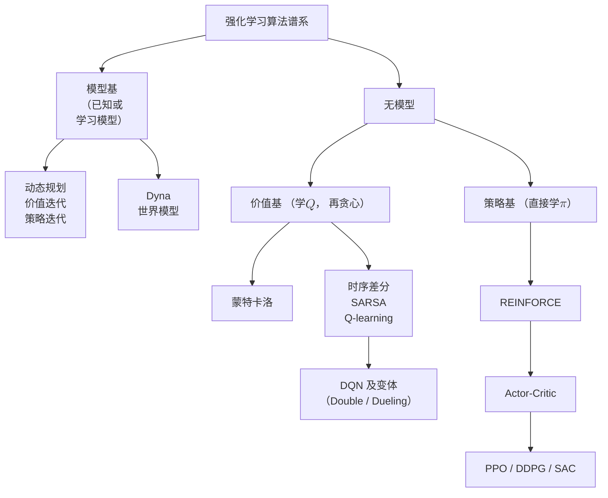

# 8 · 决策与强化学习：从 MDP 到 DRL

前面几章教你的都是"一次性"的本领：给定信道算容量（[第 4 章](04-information-theory-basics.md)）、给定约束解优化（[第 7 章](07-optimization-basics.md)）。但真实的网络控制是**连续剧**而不是**单幕剧**——现在多发一点功率，电池就少一格；现在把任务留在本地，队列就长一截。今天的决策会改变明天的处境，这类问题叫**序贯决策**（sequential decision making）。本章要教会你它的数学母语——马尔可夫决策过程（MDP）与 Bellman 方程——并沿着"已知模型 → 无模型 → 深度化 → 策略化"的主线把强化学习（RL）算法谱系走一遍。

**你将学会：**

- 用探索-利用困境理解"边学边选"为什么难，看懂 UCB 公式与 regret 的含义；
- 把一个无线计算卸载问题逐项写成 MDP 五元组；
- 从期望的定义出发，一步不跳地推出 Bellman 方程，并理解压缩映射为什么保证收敛；
- 写出价值迭代与策略迭代的伪代码，说清各自的收敛性；
- 拆解 Q-learning 更新式的每一项，理解 DQN 三件套各自救的是什么命；
- 推导 REINFORCE，看懂 Actor-Critic 与 PPO 的设计动机；
- 用一张速查表掌握功控/调度/卸载/切换的 RL 建模套路与常见陷阱。

## 8.1 从一台老虎机说起：探索还是利用

### 生活里的两难

想象你到一座新城市出差一个月，楼下有两家餐馆。A 家你去过 9 次，体验不错；B 家只去过 1 次，感觉一般。今晚去哪家？去 A 是**利用**（exploitation）——用已知信息拿稳收益；去 B 是**探索**（exploration）——多攒一次样本，万一 B 其实更好呢？只利用可能一辈子错过更好的选择，只探索则天天当小白鼠。这就是**探索-利用困境**，它是一切"边学边做决策"问题的第一性矛盾。

无线里的原型问题：终端面前有 $K$ 个信道（或波束、或接入点），每次只能选一个发送，成功概率未知且各不相同。这就是**多臂老虎机**（multi-armed bandit）：$K$ 个摇臂，拉第 $a$ 个臂得到随机奖励，均值 $\mu_a$ 未知，目标是 $T$ 轮内总奖励最大。

### regret：给"学得慢"定价

设最优臂均值 $\mu^{*} = \max_a \mu_a$。如果有上帝视角，$T$ 轮能拿 $T\mu^{*}$；实际算法拿到的期望总奖励与它的差距叫**遗憾**（regret）：

$$
R(T) = T\mu^{*} - \mathbb{E}\left[\sum_{t=1}^{T} r_{t}\right]
$$

**物理意义**：regret 是"学费"——因为不知道哪个臂最好而白白损失的收益。它把"学习算法好不好"变成了一个可以定量比较的数字：好算法的 regret 应当随 $T$ **次线性**增长（比如 $O(\ln T)$），意味着平均每轮的损失趋于零，"学费摊薄"；坏算法的 regret 线性增长，意味着永远在按固定比例交学费。

**行为分析**：两个极端都不行。纯利用（贪心）可能在前几轮被噪声骗住、锁死在次优臂上，regret 线性；固定 $\epsilon$ 的 $\epsilon$-贪心每轮总有 $\epsilon$ 的概率乱选，regret 也是线性 $O(\epsilon T)$。Lai 与 Robbins 在 1985 年证明了：只要算法在每个问题实例上的 regret 都比 $T$ 的任何正数次幂增长得慢（对一切 $a>0$ 有 $R(T)=o(T^{a})$，称为"一致好"的算法），它的 regret 就至少按 $\ln T$ 增长，即下界为 $\Omega(\ln T)$——对数学费不可避免，但也确实可以达到。这个限定省不掉：死认第 1 个臂的算法，在第 1 臂恰好最优的问题上 regret 为 0，换一个问题就线性亏损。

### UCB：给不确定性发奖金

达到对数 regret 的经典算法是 **UCB**（Upper Confidence Bound，上置信界）。设臂 $a$ 已被拉 $N_a$ 次、经验均值 $\hat{\mu}_a$，第 $t$ 轮选：

$$
a_{t} = \arg\max_{a}\left[\hat{\mu}_{a} + \sqrt{\frac{2\ln t}{N_{a}}}\right]
$$

**物理意义**：第一项是"已知的好"，第二项是"未知的可能好"——它本质上是置信区间的半宽（源于 Hoeffding 不等式：$N_a$ 个样本的均值估计误差以高概率不超过 $\sqrt{2\ln t / N_a}$ 量级）。UCB 的哲学是**乐观面对不确定性**：按"这个臂最好情况下能有多好"排序。被拉得少的臂 $N_a$ 小、奖金高，自动获得被尝试的机会；随着 $N_a$ 增大奖金衰减为 $1/\sqrt{N_a}$，探索自然退火，不需要手工调 $\epsilon$。

Hoeffding 不等式说：取值在 $[0,1]$ 内的 $N$ 个独立样本，其均值 $\hat{\mu}$ 比真值 $\mu$ 低出 $\varepsilon$ 以上的概率不超过 $e^{-2N\varepsilon^{2}}$。代入 $\varepsilon=\sqrt{2\ln t/N_a}$，得 $\Pr(\mu_a > \hat{\mu}_a+\varepsilon) \le e^{-4\ln t} = t^{-4}$：真值越过 $\hat{\mu}_a+\varepsilon$ 的概率随轮数迅速趋零，这就是"置信上界"的含义。

**行为分析**：分子里的 $\ln t$ 保证没有臂被永久饿死——只要一直不拉某臂，它的奖金会随时间缓慢增长，总有一天翻上来；但增长是对数级的，所以确认过很差的臂只会被极偶尔地复查。Auer 等人（2002）证明 UCB1 的 regret 是 $O\!\left(\sum_{a:\Delta_a>0} \ln T/\Delta_a\right)$，其中 $\Delta_a = \mu^{*}-\mu_a$ 是次优差距：差距越小的臂越难分辨，学费越贵——这符合直觉。

!!! example "算例：UCB 如何决定去探索"

    两个信道，成功率真值 $\mu_A = 0.7$、$\mu_B = 0.5$（算法不知道）。第 $t=100$ 轮时，A 已用 $N_A = 90$ 次、经验均值 $\hat{\mu}_A = 0.68$；B 只用了 $N_B = 10$ 次、$\hat{\mu}_B = 0.50$。计算 UCB 分数（$\ln 100 \approx 4.605$）：

    $$
    \text{UCB}_A = 0.68 + \sqrt{\frac{2\times 4.605}{90}} = 0.68 + 0.32 = 1.00,\qquad
    \text{UCB}_B = 0.50 + \sqrt{\frac{2\times 4.605}{10}} = 0.50 + 0.96 = 1.46
    $$

    虽然 B 的经验均值低得多，UCB 仍会选 B——因为它的不确定性奖金大。若之后 B 被拉到 $N_B = 200$ 次（$t=1000$），奖金缩水为 $\sqrt{2\times 6.908/200} \approx 0.26$，B 的劣势就再也藏不住了。再看总账。regret 可以按臂拆开：$R(T)=\sum_a \Delta_a\,\mathbb{E}[N_a(T)]$。$T=10^6$ 轮、$\Delta = 0.2$ 时，固定 $\epsilon = 0.1$ 的 $\epsilon$-贪心每轮以 $\epsilon$ 概率在两臂间均匀乱选，一半落到 B，regret 约 $\tfrac{\epsilon}{2} T \Delta = 10^{4}$。UCB 里 A 的上界以高概率不低于 $\mu_A$，而 B 的上界 $\hat{\mu}_B+c_B$ 最多比 $\mu_B$ 高出 $2c_B$（估计误差与奖金 $c_B=\sqrt{2\ln t/N_B}$ 各一份），所以只有 $2c_B>\Delta$、即 $N_B<8\ln T/\Delta^{2}$ 时 B 才可能盖过 A，regret 约 $\Delta\times\tfrac{8\ln T}{\Delta^{2}}=\tfrac{8\ln T}{\Delta} \approx 8\times 13.8/0.2 \approx 550$——差了将近 20 倍。

老虎机是"没有状态"的决策：这一轮的选择不影响下一轮的处境。可无线网络里的决策几乎都**有后效**——卸载决策改变队列、功率决策改变干扰。要描述"动作改变状态"的世界，我们需要 MDP。

## 8.2 马尔可夫决策过程：序贯决策的语言

### 五元组定义

**马尔可夫决策过程**（Markov Decision Process, MDP）由五元组 $(\mathcal{S}, \mathcal{A}, P, R, \gamma)$ 定义：

- $\mathcal{S}$：**状态空间**，环境所有可能的处境；
- $\mathcal{A}$：**动作空间**，智能体每步可做的选择；
- $P(s'\mid s,a)$：**转移概率**，在状态 $s$ 做动作 $a$ 后落到 $s'$ 的概率；
- $R(s,a,s')$：**奖励函数**，一步转移获得的标量回报；
- $\gamma \in [0,1)$：**折扣因子**，未来奖励的"汇率"。

核心假设是**马尔可夫性**：

$$
\Pr\left(s_{t+1} \mid s_{t}, a_{t}, s_{t-1}, a_{t-1}, \ldots, s_{0}\right) = \Pr\left(s_{t+1} \mid s_{t}, a_{t}\right)
$$

**物理意义**：状态是对历史的**充分统计量**——知道现在，就不需要知道过去。这不是说历史无关紧要，而是说历史的全部影响都已被"压缩"进当前状态。建模的艺术恰恰在于把状态定义得足够丰富，让马尔可夫性近似成立：如果队列长度影响未来却没放进状态，这个"MDP"就是漏水的。

智能体与环境的交互构成闭环：

```mermaid
flowchart LR
    A["智能体（策略 $$\pi$$）"] -- "动作 $$a_t$$" --> E["环境（转移 $$P$$，奖励 $$R$$）"]
    E -- "新状态 $$s_{t+1}$$" --> A
    E -- "奖励 $$r_{t+1}$$" --> A
```

### 完整示范：把无线计算卸载建成 MDP

终端每时隙产生计算任务，可以本地算，也可以经无线链路**卸载**到边缘服务器。逐项写出五元组：

- **状态** $s = (q, h)$：$q \in \{0,1,\ldots,50\}$ 是任务队列长度（个），$h \in \{\text{好},\text{中},\text{差}\}$ 是量化后的信道状态（[第 2 章](02-wireless-channel-basics.md) 2.5 节的相干时间决定信道状态多久变一次；把衰落幅度量化成几档、档间按马尔可夫链跳转，就是**有限状态马尔可夫信道**，只有两档的特例叫 Gilbert-Elliott 模型）。状态空间大小 $|\mathcal{S}| = 51\times 3 = 153$。
- **动作** $a \in \{0, 1\}$：$a=0$ 本地计算，$a=1$ 卸载到边缘服务器。
- **转移**：队列演化为

    $$
    q_{t+1} = \min\left\{\left[q_{t} - d(a_{t}, h_{t})\right]^{+} + A_{t},\ 50\right\}
    $$

    其中 $d(a,h)$ 是本时隙完成的任务数（本地算力固定，如 $d(0,\cdot)=1$；卸载吞吐随信道变化，如 $d(1,\text{好})=4$、$d(1,\text{中})=2$、$d(1,\text{差})=0$），$A_{t}$ 是新到达任务数（如泊松、均值 $\lambda = 1.5$）。信道自身按马尔可夫链转移，例如"好→好"概率 0.8、"好→中"0.15、"好→差"0.05。队列转移与信道转移的乘积就给出 $P(s'\mid s,a)$。

- **奖励**：把要最小化的代价取负，

    $$
    r_{t+1} = -\left(w_{1}\, q_{t} + w_{2}\, E(a_{t}, h_{t})\right)
    $$

    第一项按 Little 定律代理时延（Little 定律：稳态下平均队长 = 到达率 × 平均时延，$\bar{q}=\lambda\bar{W}$；到达率固定时，压低队长就是压低时延），第二项是能耗：本地计算耗 $E(0,\cdot)=2$ 单位，卸载耗发射能量、信道差时为了可靠传输要花更多，如 $E(1,\text{好})=1$、$E(1,\text{差})=5$。权重 $w_1, w_2$ 表达时延与能耗的相对重要性——**奖励函数就是需求说明书**，写错了奖励，学得再好也是精确地答错题。

这个例子的张力一目了然：信道好时卸载"又快又省"，信道差时卸载"又慢又费"，而队列是记忆——现在偷懒，代价延后支付。这正是 bandit 无法刻画、必须用 MDP 的原因。

### 策略、回报与折扣因子

**策略** $\pi(a\mid s)$ 是从状态到动作分布的映射——智能体的"行为准则"。从 $t$ 时刻起的**回报**（return）是折扣奖励和：

$$
G_{t} = r_{t+1} + \gamma r_{t+2} + \gamma^{2} r_{t+3} + \cdots = \sum_{k=0}^{\infty} \gamma^{k}\, r_{t+k+1}
$$

**物理意义**：$\gamma$ 有三重身份。数学上，它让无穷和收敛（奖励有界 $|r|\le R_{\max}$ 时 $|G_t| \le R_{\max}/(1-\gamma)$，几何级数）；经济上，它是"利率"——明天的 1 块钱只值今天的 $\gamma$ 块；工程上，它定义了**有效视界**：$\gamma^{k}$ 在 $k \approx 1/(1-\gamma)$ 步后衰减到 $1/e$ 量级，所以 $\gamma = 0.9$ 的智能体大约"看得见"未来 10 步，$\gamma = 0.99$ 看得见 100 步。

**行为分析**：$\gamma \to 0$ 时智能体极度短视，退化为逐步贪心（回到 bandit）；$\gamma \to 1$ 时深谋远虑，但价值的数值范围膨胀为 $1/(1-\gamma)$ 倍、算法收敛显著变慢（8.3 节会定量看到）。选 $\gamma$ 不是调参数，而是**定义任务**：卸载问题里队列的后效大约持续几十个时隙，$\gamma = 0.9 \sim 0.95$ 是自然的起点。

!!! example "算例：折扣把无穷变有限"

    每步恒定奖励 $r = 1$。$\gamma = 0.9$ 时回报 $G = 1/(1-0.9) = 10$；$\gamma = 0.99$ 时 $G = 100$。再看视界：$0.9^{22} \approx 0.10$，即 22 步之外的奖励权重不足一成；换成 $\gamma = 0.99$，要到 $0.99^{230} \approx 0.10$，230 步之外才被"淡忘"。同一个环境，换个 $\gamma$，智能体关心的时间尺度差了一个数量级。

{ .chart loading=lazy }
{ .chart loading=lazy }

*怎么读这张图：第一条是 $\gamma=0.9$，第二条是 $\gamma=0.99$，第三条水平线标出 0.1。第一条在 $k\approx22$ 处跌破 0.1，四十多步后已近于 0；第二条要到 $k\approx230$ 才跌破 0.1。同一个 $\gamma^k$ 在 8.3 节还会出现：值迭代 $k$ 步后的误差上界是初始误差的 $\gamma^k$ 倍，所以 $\gamma$ 越接近 1，收敛越慢。每 20 步取一点计算。*

## 8.3 价值函数与 Bellman 方程：一步一步推

### 价值函数：给状态标价

**状态价值函数**是"从这里出发、按策略 $\pi$ 走下去，平均能拿多少回报"：

$$
V^{\pi}(s) = \mathbb{E}_{\pi}\left[G_{t} \mid s_{t} = s\right]
$$

类似地，**动作价值函数** $Q^{\pi}(s,a) = \mathbb{E}_{\pi}[G_{t}\mid s_{t}=s, a_{t}=a]$ 是"先做定动作 $a$、之后按 $\pi$ 走"的期望回报。$V$ 给状态标价，$Q$ 给"状态-动作"标价——后者可以直接用来选动作，无模型学习正是靠这一点：不知道环境模型，也能按 $Q$ 选动作。

### Bellman 期望方程：逐步推导

Bellman 方程说的是：**一个状态的价值 = 即时奖励 + 折扣后的下一状态价值**。我们从定义出发，一步不跳地推出来：

$$
\begin{aligned}
V^{\pi}(s) &= \mathbb{E}_{\pi}\left[G_{t} \mid s_{t}=s\right] \\
&= \mathbb{E}_{\pi}\left[r_{t+1} + \gamma r_{t+2} + \gamma^{2} r_{t+3} + \cdots \mid s_{t}=s\right] \\
&= \mathbb{E}_{\pi}\left[r_{t+1} + \gamma\left(r_{t+2} + \gamma r_{t+3} + \cdots\right) \mid s_{t}=s\right] \\
&= \mathbb{E}_{\pi}\left[r_{t+1} + \gamma G_{t+1} \mid s_{t}=s\right] \\
&= \sum_{a}\pi(a\mid s)\sum_{s'}P(s'\mid s,a)\left[R(s,a,s') + \gamma\, \mathbb{E}_{\pi}\left[G_{t+1}\mid s_{t+1}=s'\right]\right] \\
&= \sum_{a}\pi(a\mid s)\sum_{s'}P(s'\mid s,a)\left[R(s,a,s') + \gamma V^{\pi}(s')\right]
\end{aligned}
$$

每一步用了什么：第 2–4 行只是把回报按定义展开、提出公因子 $\gamma$，得到递归结构 $G_{t} = r_{t+1} + \gamma G_{t+1}$。第 5 行合并了两步。先是

$$
\mathbb{E}_{\pi}\left[r_{t+1} + \gamma G_{t+1} \mid s_{t}=s\right] = \sum_{a}\pi(a\mid s)\sum_{s'}P(s'\mid s,a)\,\mathbb{E}_{\pi}\left[r_{t+1} + \gamma G_{t+1} \mid s_{t}=s,\, a_{t}=a,\, s_{t+1}=s'\right]
$$

这是**全期望公式**，按动作 $a$ 与落点 $s'$ 分情况求期望。再化简条件期望：给定 $(s,a,s')$ 时 $r_{t+1}$ 的均值就是奖励函数 $R(s,a,s')$；$G_{t+1}$ 只由 $s_{t+1}$ 之后的动作和转移决定，**马尔可夫性**保证给定 $s_{t+1}=s'$ 后它与 $s_t, a_t$ 无关，条件于是缩成 $\mathbb{E}_{\pi}[G_{t+1}\mid s_{t+1}=s']$。第 6 行按定义认出它就是 $V^{\pi}(s')$（$\pi$、$P$ 不随时间变，价值函数与出发时刻无关）。写成紧凑形式就是：

$$
V^{\pi}(s) = \mathbb{E}\left[r + \gamma V^{\pi}(s')\right]
$$

**物理意义**：这是价值的**自洽方程**——"现在值多少钱"由"马上赚多少"加"落脚点值多少钱"决定，像多米诺骨牌一样把无穷长的未来折叠成一步。它同时是一个线性方程组：$|\mathcal{S}|$ 个未知数、$|\mathcal{S}|$ 个方程，矩阵形式 $\mathbf{v} = \mathbf{r}^{\pi} + \gamma \mathbf{P}^{\pi}\mathbf{v}$，其中 $r^{\pi}(s)=\sum_{a}\pi(a\mid s)\sum_{s'}P(s'\mid s,a)R(s,a,s')$ 是策略平均后的一步奖励，$P^{\pi}(s,s')=\sum_{a}\pi(a\mid s)P(s'\mid s,a)$ 是策略平均后的转移矩阵。解为 $\mathbf{v} = (\mathbf{I} - \gamma \mathbf{P}^{\pi})^{-1}\mathbf{r}^{\pi}$——$\mathbf{P}^{\pi}$ 是**随机矩阵**（每行非负、行和为 1），特征值都满足 $|\nu|\le 1$（行加权平均不会放大绝对值最大的分量），于是 $\mathbf{I}-\gamma\mathbf{P}^{\pi}$ 的特征值 $1-\gamma\nu$ 的模不小于 $1-\gamma>0$，逆存在。

**行为分析**：方程右边的三个成分正对应三个杠杆——奖励设计（$R$）、环境动力学（$P$）、视界（$\gamma$）。$\gamma$ 越接近 1，$(\mathbf{I}-\gamma\mathbf{P}^{\pi})^{-1}$ 的条件数越差，价值对奖励的微小改动越敏感——这就是"远视的代价"的另一个侧影。

### 最优 Bellman 方程与压缩映射

定义**最优价值** $V^{*}(s) = \max_{\pi} V^{\pi}(s)$。从 $s$ 出发的最优玩法必然是：这一步挑一个动作，落到 $s'$ 后接着按最优方式玩——后半段若不是最优的，把它换成最优的就能让总价值更高（Bellman 的**最优性原理**）。所以最优价值满足**最优 Bellman 方程**——把"按 $\pi$ 平均"换成"挑最好的动作"：

$$
V^{*}(s) = \max_{a}\sum_{s'}P(s'\mid s,a)\left[R(s,a,s') + \gamma V^{*}(s')\right]
$$

对应的 $Q^{*}(s,a) = \sum_{s'}P(s'\mid s,a)\left[R(s,a,s') + \gamma \max_{a'}Q^{*}(s',a')\right]$，而最优策略就是对 $Q^{*}$ 贪心：$\pi^{*}(s) = \arg\max_{a}Q^{*}(s,a)$。

这个方程是非线性的（有 $\max$），不能解线性方程组了。凭什么它有唯一解、而且能迭代求出来？答案是**压缩映射**。定义 Bellman 最优算子 $\mathcal{T}$：

$$
(\mathcal{T}V)(s) = \max_{a}\sum_{s'}P(s'\mid s,a)\left[R(s,a,s') + \gamma V(s')\right]
$$

对任意两个价值函数 $V_1, V_2$，记 $f_{i}(s,a) = \sum_{s'}P(s'\mid s,a)[R(s,a,s') + \gamma V_{i}(s')]$，逐步估计：

$$
\begin{aligned}
\left|(\mathcal{T}V_{1})(s) - (\mathcal{T}V_{2})(s)\right|
&= \left|\max_{a} f_{1}(s,a) - \max_{a} f_{2}(s,a)\right| \\
&\le \max_{a}\left|f_{1}(s,a) - f_{2}(s,a)\right| \\
&= \max_{a}\, \gamma\left|\sum_{s'}P(s'\mid s,a)\left[V_{1}(s') - V_{2}(s')\right]\right| \\
&\le \gamma \max_{a}\sum_{s'}P(s'\mid s,a)\left|V_{1}(s') - V_{2}(s')\right| \\
&\le \gamma\left\|V_{1} - V_{2}\right\|_{\infty}
\end{aligned}
$$

这里 $\|V\|_{\infty}=\max_{s}|V(s)|$ 是**无穷范数**，即各状态上的最大误差。第 2 行用了初等事实 $|\max_x f(x) - \max_x g(x)| \le \max_x|f(x)-g(x)|$：设 $x_1$ 使 $f$ 取最大，则 $\max f - \max g \le f(x_1)-g(x_1) \le \max_x|f(x)-g(x)|$，交换 $f,g$ 的角色得另一侧；第 3 行中 $R$ 项相消；第 4 行是三角不等式；第 5 行用了 $\sum_{s'}P = 1$。对所有 $s$ 取最大，得：

$$
\left\|\mathcal{T}V_{1} - \mathcal{T}V_{2}\right\|_{\infty} \le \gamma\left\|V_{1} - V_{2}\right\|_{\infty}
$$

!!! tip "直觉：会缩小误差的复印机"

    把 $\mathcal{T}$ 想成一台特殊的复印机：无论放进去的两张"价值地图"差多远，复印一次后差距至少缩小到 $\gamma$ 倍。反复复印，任何两张图都会趋于同一张——这就是 Banach 不动点定理的内容：压缩映射存在**唯一**不动点 $V^{*}$（它正是最优 Bellman 方程的解），且从**任意**初始 $V_0$ 出发迭代 $V_{k+1} = \mathcal{T}V_{k}$，误差按几何速率收缩：

    $$
    \left\|V_{k} - V^{*}\right\|_{\infty} \le \gamma^{k}\left\|V_{0} - V^{*}\right\|_{\infty}
    $$

    这一个不等式同时回答了"解存在吗、唯一吗、怎么求、多快收敛"四个问题——这是本章数学上最漂亮的一步。

    唯一性与速率可直接从压缩性读出：因为 $V^{*}=\mathcal{T}V^{*}$，所以 $\|V_{k}-V^{*}\|_{\infty}=\|\mathcal{T}V_{k-1}-\mathcal{T}V^{*}\|_{\infty}\le\gamma\|V_{k-1}-V^{*}\|_{\infty}$，递推 $k$ 次即得上式；另一不动点 $V'$ 同理满足 $\|V'-V^{*}\|\le\gamma\|V'-V^{*}\|$，只能 $V'=V^{*}$。Banach 定理另外保证了不动点**存在**（相邻迭代之差按 $\gamma^{k}$ 缩小，序列必收敛）。

!!! example "算例：亲手做一次 Bellman 备份"

    卸载 MDP 里某状态 $s = (q=10, h=\text{好})$，$\gamma = 0.9$，当前价值估计已知。两个动作：

    本地（$a=0$）：确定性转到 $s_1$，即时奖励 $-4$，$V(s_1) = -10$，备份值 $-4 + 0.9\times(-10) = -13$。

    卸载（$a=1$）：以 0.8 转到信道仍好的 $s_2$（$r=-1$，$V(s_2)=-6$），以 0.2 转到信道变差的 $s_3$（$r=-8$，$V(s_3)=-12$）。0.8 就是 8.2 节的"好→好"，0.2 是"好→中"与"好→差"之和。这里让卸载的即时奖励随落点而变（传输途中信道变差，要多花时延和能量），用的是 8.2 节列出的一般形式 $R(s,a,s')$；8.2 节那个具体奖励只看当前状态与动作，是它不依赖 $s'$ 的特例，备份公式照样适用：

    $$
    0.8\times\left[-1 + 0.9\times(-6)\right] + 0.2\times\left[-8 + 0.9\times(-12)\right] = 0.8\times(-6.4) + 0.2\times(-18.8) = -8.88
    $$

    取最大：$(\mathcal{T}V)(s) = \max\{-13, -8.88\} = -8.88$，贪心动作是卸载。再算收敛速度：初始误差 100、要求精度 0.1，需 $\gamma^{k}\times 100 \le 0.1$，即 $k \ge \ln 1000/\ln(1/\gamma)$。$\gamma=0.9$ 时 $k \approx 6.91/0.105 \approx 66$ 次迭代；$\gamma = 0.99$ 时 $k \approx 687$ 次——视界拉长 10 倍，迭代代价也涨约 10 倍。

## 8.4 动态规划：模型在手时的两把钥匙

如果 $P$ 和 $R$ 完全已知（"模型在手"），求 $\pi^{*}$ 是纯计算问题，动态规划（DP）给出两个经典算法。

**价值迭代**（value iteration）就是反复应用 $\mathcal{T}$：

```text
输入: P, R, γ, 精度阈值 θ
初始化 V(s) ← 0 对所有 s
repeat:
    Δ ← 0
    for 每个 s ∈ S:
        v ← V(s)
        V(s) ← max_a Σ_{s'} P(s'|s,a) [ R(s,a,s') + γ V(s') ]
        Δ ← max(Δ, |v − V(s)|)
until Δ < θ
输出: 贪心策略 π(s) = argmax_a Σ_{s'} P(s'|s,a) [ R(s,a,s') + γ V(s') ]
```

**收敛性陈述**：由压缩性，$V_k$ 以几何速率 $\gamma^{k}$ 收敛到 $V^{*}$；且当相邻两轮变化 $\Delta < \theta$ 时，$\|V - V^{*}\|_{\infty} \le \theta\gamma/(1-\gamma)$。理由：记最后两轮为 $V_{k}$、$V_{k+1}$，由压缩性和三角不等式（范数均为 $\infty$-范数），$\|V_{k+1}-V^{*}\|\le\gamma\|V_{k}-V^{*}\|\le\gamma\left(\|V_{k}-V_{k+1}\|+\|V_{k+1}-V^{*}\|\right)$，移项得 $\|V_{k+1}-V^{*}\|\le\frac{\gamma}{1-\gamma}\Delta$。取 $\theta = \varepsilon(1-\gamma)/\gamma$ 即可保证 $\varepsilon$ 精度。

**策略迭代**（policy iteration）则在"评估"与"改进"之间交替：

```text
初始化任意策略 π
repeat:
    (1) 策略评估: 解线性方程组 V = R^π + γ P^π V, 得 V^π
    (2) 策略改进: π'(s) ← argmax_a Σ_{s'} P(s'|s,a) [ R(s,a,s') + γ V^π(s') ]
    π ← π'
until 策略不再变化
```

**收敛性陈述**：策略改进定理保证每轮 $V^{\pi'}(s) \ge V^{\pi}(s)$ 对所有 $s$ 成立（单调不降），且严格改进直到最优；有限 MDP 的确定性策略只有 $|\mathcal{A}|^{|\mathcal{S}|}$ 个，所以**有限步**必达 $\pi^{*}$——实践中往往几轮到十几轮就停。

为什么单调不降？$\pi'$ 在每个状态挑的是使 $\sum_{s'}P(s'\mid s,a)[R(s,a,s')+\gamma V^{\pi}(s')]$ 最大的动作，最大值不小于按 $\pi$ 加权的平均值 $V^{\pi}(s)$，所以"第一步按 $\pi'$、之后回到 $\pi$"不比一直按 $\pi$ 差；把后续各步逐一换成 $\pi'$，每次都不变差，于是 $V^{\pi'}\ge V^{\pi}$。若策略不再变化，$V^{\pi}$ 就满足最优 Bellman 方程，由不动点唯一性即为 $V^{*}$。

| 维度 | 价值迭代 | 策略迭代 |
|---|---|---|
| 每轮代价 | 低：一次扫描 $O(\lvert\mathcal{S}\rvert^{2}\lvert\mathcal{A}\rvert)$ | 高：解线性方程组 $O(\lvert\mathcal{S}\rvert^{3})$ |
| 收敛轮数 | 多（几何速率 $\gamma^{k}$，$\gamma$ 近 1 时很慢） | 少（单调改进，常常个位数轮） |
| 中间产物 | 价值估计（中途无显式策略） | 每轮都有一个完整可用的策略 |
| 适用 | 状态多、$\gamma$ 不太接近 1 | 状态适中、想要"随时可停" |

!!! example "算例：DP 的可行边界在哪里"

    卸载 MDP：$|\mathcal{S}| = 153$、$|\mathcal{A}| = 2$。价值迭代每轮约 $153^{2}\times 2 \approx 4.7\times 10^{4}$ 次乘加，66 轮共约 $3\times 10^{6}$——笔记本上毫秒级，DP 轻松拿下。但把状态换成"队列 51 档 × CSI 64 档 × 电量 101 档"，$|\mathcal{S}| \approx 3.3\times 10^{5}$，每轮 $|\mathcal{S}|^{2}|\mathcal{A}| \approx 2\times 10^{11}$ 次运算，66 轮就是 $10^{13}$ 量级——单机要跑几个小时到几天，而且这还假设你**写得出** $P$。状态每加一个维度、代价乘一个因子，这就是 Bellman 本人命名的**维数灾难**。更常见的窘境是：真实信道的转移概率根本没人给你。这两堵墙，分别由函数逼近（8.6 节）和无模型学习（8.5 节）来拆。

## 8.5 无模型学习：从经验中直接估价值

没有 $P$ 和 $R$，但可以**与环境交互采样**。核心问题变成：怎么用一条条经验轨迹 $(s, a, r, s')$ 估计价值？

### MC 与 TD：两种估计哲学

**蒙特卡洛**（MC）最朴素：从 $s$ 出发跑完一整条轨迹、算出实际回报 $G_t$，用多条轨迹的平均去估 $V(s)$。它是无偏的（$G_t$ 的期望就是定义中的 $V^{\pi}$），但方差大——一条轨迹上每一步的随机性都累积进 $G_t$——而且必须等**回合结束**才能更新，对无线网络这种"永不落幕"的持续性任务很不友好。

**时序差分**（TD）借用 Bellman 方程的自举思想：不等真实回报，用"一步真实 + 剩下用估计"来更新：

$$
V(s_{t}) \leftarrow V(s_{t}) + \alpha\left[\underbrace{r_{t+1} + \gamma V(s_{t+1})}_{\text{TD 目标}} - V(s_{t})\right]
$$

方括号内叫 **TD 误差** $\delta_t$：新证据（TD 目标）与旧估计的差。**物理意义**：TD 是"用猜测更新猜测"（bootstrap）——听起来危险，实则正是 Bellman 自洽性的采样版：如果估计已经自洽，$\delta$ 的期望为零、更新自动停止。**行为分析**：TD 目标只含一步随机性，方差远小于 MC，但因为用了不准的 $V(s_{t+1})$ 而有偏；步长 $\alpha$ 控制"新证据听几分"——大 $\alpha$ 学得快忘得也快，小 $\alpha$ 稳但慢。

两者是同一个更新式 $V(s_t)\leftarrow V(s_t)+\alpha[\text{目标}-V(s_t)]$，只是目标不同：MC 用实际回报 $G_t$，TD 用 $r_{t+1}+\gamma V(s_{t+1})$。举个数：$\gamma=0.9$，从 $s_t$ 出发依次拿到奖励 $1, 0, 2$ 后回合结束，当前估计 $V(s_{t+1})=1.5$。MC 等回合结束，目标是 $1+0.9\times0+0.9^{2}\times2=2.62$；TD 走一步即可更新，目标是 $1+0.9\times1.5=2.35$，后两步的实际奖励被估计 $V(s_{t+1})$ 代替了。$V(s_{t+1})$ 不准，TD 目标就有偏；$s_{t+1}$ 若概括不了未来（非马尔可夫），这种代替就站不住，即下表最后一行。

| 维度 | 蒙特卡洛 (MC) | 时序差分 (TD) |
|---|---|---|
| 更新时机 | 回合结束后 | 每一步（在线） |
| 偏差 | 无偏 | 有偏（自举） |
| 方差 | 高（整条轨迹的随机性） | 低（一步随机性） |
| 需要回合终止 | 是 | 否——适合持续性任务 |
| 对马尔可夫性的依赖 | 弱 | 强（依赖状态自洽） |

### Q-learning：无模型学习的旗舰

对控制问题，直接学 $Q^{*}$。**Q-learning** 更新式：

$$
Q(s,a) \leftarrow Q(s,a) + \alpha\left[r + \gamma \max_{a'}Q(s',a') - Q(s,a)\right]
$$

逐项读：$Q(s,a)$ 是旧估计；$r$ 是这一步真实拿到的奖励；$\max_{a'}Q(s',a')$ 是"从 $s'$ 起走最优"的当前估计，乘 $\gamma$ 折回当下；$\alpha$ 决定这次修正几成。对固定的 $(s,a)$，TD 目标的期望

$$
\mathbb{E}\left[r+\gamma\max_{a'}Q(s',a')\mid s,a\right]=\sum_{s'}P(s'\mid s,a)\left[R(s,a,s')+\gamma\max_{a'}Q(s',a')\right]
$$

恰是 8.3 节 $Q^{*}$ 方程的右端作用在当前 $Q$ 上。

**物理意义**：这是最优 Bellman 方程的随机逼近版——把 $\mathcal{T}$ 里"对 $P$ 求期望"换成"用一个样本 $(s,a,r,s')$"，把不动点迭代换成带步长的增量更新。关键在 $\max_{a'}$：TD 目标假设"下一步起走最优"，所以无论采样时实际用的什么行为策略（比如 $\epsilon$-贪心），学到的都是 $Q^{*}$——这叫**离策略**（off-policy）。把 $\max_{a'}Q(s',a')$ 换成实际执行动作的 $Q(s',a')$ 就得到**在策略**的 SARSA，它学的是"边探索边执行"的那个策略的价值，行为更保守。

**收敛条件陈述**（Watkins & Dayan, 1992）：表格型 Q-learning 收敛到 $Q^{*}$（以概率 1），需要：① 每个状态-动作对被访问**无穷多次**（探索必须充分，比如 $\epsilon$-贪心且 $\epsilon$ 不衰减到 0 太快）；② 步长满足 Robbins-Monro 条件：

$$
\sum_{t}\alpha_{t} = \infty, \qquad \sum_{t}\alpha_{t}^{2} < \infty
$$

**行为分析**：第一个条件保证"总学习量无穷"——无论初值多离谱都能被纠正过来；第二个条件保证"噪声被平均掉"——更新幅度衰减得足够快，估计最终安定下来。$\alpha_t = 1/t$ 同时满足两者（调和级数 $\sum 1/t$ 发散，$\sum 1/t^{2}=\pi^{2}/6$ 有限；这里 $t$ 按该 $(s,a)$ 被访问的次数计）；工程中常用小常数步长，它不满足条件 ②、理论上只在真值附近震荡，但换来了对**非平稳环境**的跟踪能力——无线信道统计会漂移，这常常是更划算的交换。

!!! example "算例：一次 Q-learning 更新"

    当前 $Q(s, a) = 2.0$，执行 $a$ 后得 $r = 1$、转到 $s'$，且 $\max_{a'}Q(s',a') = 3.0$。取 $\alpha = 0.1$、$\gamma = 0.9$：

    $$
    Q(s,a) \leftarrow 2.0 + 0.1\times\left[1 + 0.9\times 3.0 - 2.0\right] = 2.0 + 0.1\times 1.7 = 2.17
    $$

    TD 目标 3.7 比旧估计 2.0 乐观，说明这一步的体验"好于预期"，于是估计上调——但只调 $\alpha = 10\%$ 的幅度，因为单个样本可能只是运气好。

## 8.6 深度强化学习：函数逼近与 DQN 三件套

### 为什么必须函数逼近

表格法要求每个 $(s,a)$ 独立存一个数、独立访问足够多次。8.4 节算过，状态维度一上来这就没戏了；更根本地，真实 CSI 是连续量，状态空间不可数，"访问每个状态无穷次"在原则上不可能。出路是用参数化函数 $Q(s,a;\boldsymbol{\theta})$（如神经网络）逼近，让**相似状态共享经验**——网络在见过的状态上学到的规律，自动泛化到没见过的邻近状态。

但天下没有免费的午餐。**函数逼近 + 自举 + 离策略**三者同时出现时，更新可能发散——Sutton 与 Barto 称之为"致命三合一"（deadly triad）。朴素地把 Q-learning 的 $Q$ 换成神经网络，训练往往剧烈震荡：TD 目标里的 $Q(s',a';\boldsymbol{\theta})$ 随 $\boldsymbol{\theta}$ 一起动，等于"追着自己的影子回归"；相邻样本高度相关，又违背了随机梯度下降的独立性假设。

### DQN 三件套

DeepMind 的 DQN（Mnih et al., 2015）靠三个工程支柱驯服了这套不稳定系统：

1. **经验回放**（experience replay）：把转移 $(s,a,r,s')$ 存进回放池 $\mathcal{D}$，训练时**随机抽小批量**。作用：打散时间相关性，让样本近似独立同分布；同时每条经验被复用多次，提高样本效率——对"采样很贵"的无线在线学习尤其重要。
2. **目标网络**（target network）：TD 目标改用一份**冻结的**参数 $\boldsymbol{\theta}^{-}$ 计算，每 $C$ 步才同步一次 $\boldsymbol{\theta}^{-} \leftarrow \boldsymbol{\theta}$。作用：把"追影子"变成"追一个固定靶"，回归目标在 $C$ 步内保持平稳。
3. **$\epsilon$-贪心探索**：以 $\epsilon$ 概率随机选动作、否则选 $\arg\max_a Q$，且 $\epsilon$ 从 1 逐步退火到小值（如 0.05）——先广撒网、后精耕作。

损失函数为：

$$
L(\boldsymbol{\theta}) = \mathbb{E}_{(s,a,r,s')\sim\mathcal{D}}\left[\left(r + \gamma\max_{a'}Q(s',a';\boldsymbol{\theta}^{-}) - Q(s,a;\boldsymbol{\theta})\right)^{2}\right]
$$

**物理意义**：DQN 把 RL 问题改造成了监督学习最擅长的样子——固定的目标（靠 $\boldsymbol{\theta}^{-}$）、近似独立的样本（靠 $\mathcal{D}$），然后交给随机梯度下降。**行为分析**：回放池太小则相关性回来了，太大则充斥过时策略的经验；$C$ 太小靶子晃、太大学得慢（典型取几百到几千步）；另外 $\max$ 算子天然高估价值（对噪声取最大是向上偏的）：两个动作真值都是 0，估计各带等概率的 $\pm1$ 噪声且相互独立，四种组合下的最大值为 $1,1,1,-1$，期望 $0.5>0$。Double DQN 用"选动作与评价值分离"缓解之，目标改为 $r+\gamma\,Q\big(s',\arg\max_{a'}Q(s',a';\boldsymbol{\theta});\boldsymbol{\theta}^{-}\big)$，在线网络选动作、目标网络估值。

```mermaid
flowchart TD
    S["与环境交互：$$\epsilon$$-贪心选动作"] --> B["转移 $$(s,a,r,s')$$ 存入回放池 $$\mathcal{D}$$"]
    B --> C["从 $$\mathcal{D}$$ 随机抽小批量"]
    C --> T["目标网络算 $$y = r + \gamma \max Q(s',a';\theta^-)$$"]
    T --> L["梯度下降最小化 $$(y - Q(s,a;\theta))^2$$"]
    L --> U["每 $$C$$ 步同步 $$\theta^- \leftarrow \theta$$"]
    U --> S
```

!!! example "算例：网络比表格小多少"

    卸载问题状态取连续三维向量（归一化队列、信道增益 dB、电量百分比），动作 2 个。用两层各 128 神经元的全连接网络：参数量 $3\times128+128 = 512$，$128\times128+128 = 16512$，$128\times2+2 = 258$，共约 $1.7\times 10^{4}$ 个参数——而 8.4 节的表格要存 $3.3\times 10^{5}\times 2 = 6.6\times 10^{5}$ 个 Q 值，且每个都要单独访问才能学到。网络用约 1/40 的参数覆盖了**连续**状态空间，靠的正是泛化：见过 $(q=20, h=-80\,\text{dB})$，就大致会处理 $(q=21, h=-81\,\text{dB})$。

## 8.7 策略梯度：直接对策略求导

### 换一条路的理由

价值方法选动作要做 $\arg\max_a Q$——动作离散且少的时候轻而易举，可功率控制、波束赋形的动作是**连续**的，对神经网络输出做全局最大化本身就是个优化难题。另一条路：干脆**参数化策略本身** $\pi_{\boldsymbol{\theta}}(a\mid s)$（比如高斯策略输出功率的均值方差），直接对期望回报做梯度上升。这条路还附赠随机策略——在部分可观测或博弈场景里，随机化本身可能就是最优的。

### REINFORCE 推导：对数导数戏法

目标函数是轨迹回报的期望，$J(\boldsymbol{\theta}) = \mathbb{E}_{\tau\sim p_{\boldsymbol{\theta}}}[R(\tau)]$，其中轨迹 $\tau = (s_0, a_0, s_1, a_1, \ldots)$，$R(\tau)$ 是轨迹总回报。逐步求梯度：

$$
\begin{aligned}
\nabla_{\boldsymbol{\theta}}J(\boldsymbol{\theta})
&= \nabla_{\boldsymbol{\theta}}\int p_{\boldsymbol{\theta}}(\tau)\,R(\tau)\,\mathrm{d}\tau \\
&= \int \nabla_{\boldsymbol{\theta}}\,p_{\boldsymbol{\theta}}(\tau)\,R(\tau)\,\mathrm{d}\tau \\
&= \int p_{\boldsymbol{\theta}}(\tau)\,\nabla_{\boldsymbol{\theta}}\log p_{\boldsymbol{\theta}}(\tau)\,R(\tau)\,\mathrm{d}\tau \\
&= \mathbb{E}_{\tau\sim p_{\boldsymbol{\theta}}}\left[\nabla_{\boldsymbol{\theta}}\log p_{\boldsymbol{\theta}}(\tau)\,R(\tau)\right]
\end{aligned}
$$

第 3 行是全部魔法所在——**对数导数戏法** $\nabla p = p\,\nabla\log p$（因为 $\nabla\log p = \nabla p/p$），它把"分布的梯度"变回"分布下的期望"，于是可以用采样估计。再看 $\log p_{\boldsymbol{\theta}}(\tau)$ 的结构：

$$
\log p_{\boldsymbol{\theta}}(\tau) = \log p(s_{0}) + \sum_{t}\log \pi_{\boldsymbol{\theta}}(a_{t}\mid s_{t}) + \sum_{t}\log P(s_{t+1}\mid s_{t}, a_{t})
$$

初始分布与转移概率**不含 $\boldsymbol{\theta}$**，求梯度时消失——所以策略梯度**根本不需要知道环境模型**，这是它天然无模型的原因。代回得 $\nabla J=\mathbb{E}[\sum_{t}\nabla\log\pi_{\boldsymbol{\theta}}(a_{t}\mid s_{t})\,R(\tau)]$。再利用因果性：$t$ 之前的奖励 $r_{k+1}$（$k<t$）在 $a_t$ 抽出之前就已确定，而给定到 $s_t$ 为止的历史，$\mathbb{E}_{a_t}[\nabla\log\pi_{\boldsymbol{\theta}}(a_{t}\mid s_{t})]=\sum_{a}\nabla\pi_{\boldsymbol{\theta}}(a\mid s_t)=\nabla 1=0$（与下文基线的论证相同），这些项期望为零，$R(\tau)$ 只剩 $t$ 之后的部分。（若 $R(\tau)$ 取 8.2 节的折扣回报 $\sum_{k}\gamma^{k}r_{k+1}$，$t$ 之后的部分是 $\sum_{k\ge t}\gamma^{k}r_{k+1}=\gamma^{t}G_t$，所以严格的梯度在第 $t$ 项还多一个因子 $\gamma^{t}$。下式省去了它：对 $\gamma=1$ 的回合任务它是精确的，$\gamma<1$ 时是实践中通用的近似写法。）得 **REINFORCE**（Williams, 1992）：

$$
\nabla_{\boldsymbol{\theta}}J(\boldsymbol{\theta}) = \mathbb{E}_{\pi_{\boldsymbol{\theta}}}\left[\sum_{t}\nabla_{\boldsymbol{\theta}}\log\pi_{\boldsymbol{\theta}}(a_{t}\mid s_{t})\,G_{t}\right]
$$

**物理意义**：$\nabla\log\pi$ 指向"让这个动作更常出现"的参数方向，$G_t$ 是权重——回报高的动作被强化、回报差的被抑制，"趋利避害"被写成了一行梯度。**行为分析**：$G_t$ 方差极大（MC 性质），导致 REINFORCE 出了名地抖。减方差的标准招是减去**基线** $b(s)$，且不引入偏差，因为：

$$
\mathbb{E}_{a\sim\pi_{\boldsymbol{\theta}}}\left[\nabla_{\boldsymbol{\theta}}\log\pi_{\boldsymbol{\theta}}(a\mid s)\, b(s)\right] = b(s)\,\nabla_{\boldsymbol{\theta}}\sum_{a}\pi_{\boldsymbol{\theta}}(a\mid s) = b(s)\,\nabla_{\boldsymbol{\theta}}\,1 = 0
$$

取 $b(s) = V^{\pi}(s)$，权重变成**优势** $A^{\pi}(s,a) = Q^{\pi}(s,a) - V^{\pi}(s)$——"这个动作比平均好多少"。更一般地，**策略梯度定理**（Sutton & Barto, 2018）陈述为：

$$
\nabla_{\boldsymbol{\theta}}J(\boldsymbol{\theta}) \propto \sum_{s}d^{\pi}(s)\sum_{a}Q^{\pi}(s,a)\,\nabla_{\boldsymbol{\theta}}\pi_{\boldsymbol{\theta}}(a\mid s)
$$

其中 $d^{\pi}$ 是策略诱导的状态分布。定理最不平凡之处：右边**没有** $\nabla_{\boldsymbol{\theta}}d^{\pi}$ 这一项——改策略明明会改变去哪些状态，但求梯度时这部分恰好不用算。

### Actor-Critic 与 PPO

**Actor-Critic** 把两条路线合流：**Critic** 用 TD 学 $V(s;\mathbf{w})$，**Actor** 用 TD 误差 $\delta_t = r + \gamma V(s') - V(s)$ 作为优势的即时估计来更新策略（若 $V=V^{\pi}$，则 $\mathbb{E}[\delta_t\mid s,a]=\mathbb{E}[r+\gamma V^{\pi}(s')\mid s,a]-V^{\pi}(s)=Q^{\pi}(s,a)-V^{\pi}(s)$，正好是优势）——用 TD 的低方差替换 MC 回报的高方差，代价是引入自举偏差。这是现代 DRL 的主干架构（A3C、DDPG、SAC 都是变体）。

**PPO**（Schulman et al., 2017）解决另一个痛点：普通策略梯度步子迈大一点，策略可能"一步毁所有"（新策略采到的数据分布全变了，且很难走回来）。PPO 用概率比 $\rho_{t} = \pi_{\boldsymbol{\theta}}(a_{t}\mid s_{t})/\pi_{\text{old}}(a_{t}\mid s_{t})$ 度量新旧策略偏离。因为数据由旧策略采得，$\mathbb{E}_{a\sim\pi_{\text{old}}}[\rho\,\hat{A}]=\sum_{a}\pi_{\boldsymbol{\theta}}(a\mid s)\hat{A}(s,a)$，乘上 $\rho_t$ 就能用旧数据评估新策略（重要性采样）；但 $\rho_t$ 离 1 越远越不可信。于是 PPO **裁剪**目标：

$$
L^{\text{CLIP}}(\boldsymbol{\theta}) = \mathbb{E}\left[\min\left(\rho_{t}\hat{A}_{t},\ \operatorname{clip}\left(\rho_{t},\, 1-\epsilon,\, 1+\epsilon\right)\hat{A}_{t}\right)\right]
$$

直觉：当 $\rho_t$ 超出 $[1-\epsilon, 1+\epsilon]$（典型 $\epsilon = 0.2$；这里的 $\epsilon$ 是裁剪半径，与 $\epsilon$-贪心的探索概率无关）时梯度被截断——"每次更新最多改 20%"，以温和的小步换取稳定。截断是单侧的，由 $\min$ 决定哪一侧。取 $\hat{A}_t=+2$：$\rho_t=1.5$ 时两项为 $3.0$ 与 $1.2\times2=2.4$，取常数 $2.4$、梯度为零——好动作已提够，不再奖励继续提；$\rho_t=0.7$ 时两项为 $1.4$ 与 $0.8\times2=1.6$，取未裁剪的 $1.4$，梯度照常把概率往回推。$\hat{A}_t<0$ 时对称：坏动作压到 $\rho_t<1-\epsilon$ 后不再奖励，往上涨则照常受罚。实现简单、鲁棒性好，PPO 因此成了应用 RL 的默认起手式。

顺带一句**模型基 RL**：与其无模型硬试，不如先从数据学出近似模型 $\hat{P}, \hat{R}$（乃至学一个能在潜空间里"做梦"推演的**世界模型**），再在模型里做规划或生成虚拟经验——样本效率高得多，代价是要承受模型误差被策略利用的风险。

!!! example "算例：高斯策略怎么调功率"

    功率控制用高斯策略 $\pi_{\boldsymbol{\theta}}(p\mid s) = \mathcal{N}\left(\mu_{\boldsymbol{\theta}}(s), \sigma^{2}\right)$，$\sigma = 2$ dB。某状态下网络输出均值 $\mu = 10$ dBm，实际采样到 $p = 12$ dBm。对均值的对数梯度为

    $$
    \frac{\partial \log\pi}{\partial \mu} = \frac{p - \mu}{\sigma^{2}} = \frac{12-10}{4} = 0.5
    $$

    若这步的优势估计 $\hat{A} = +3$（比平均好），更新 $\mu \leftarrow \mu + \alpha\times 0.5\times 3$，取 $\alpha = 0.01$ 得 $\mu = 10.015$ dBm——策略朝"更常发 12 dBm"的方向轻推；若 $\hat{A} = -3$ 则反向。千百次交互累积下来，均值就滑向高优势区域。

### 算法谱系一图流



## 8.8 无线里的 RL：建模速查与陷阱

把前面的语言翻译成四类经典无线控制问题（综述可见 Luong et al., 2019）：

| 问题 | 状态（典型） | 动作 | 奖励（典型） | 常用算法 | 常见陷阱 |
|---|---|---|---|---|---|
| 功率控制 | 本链路与干扰链路 CSI、上一步 SINR | 连续功率值 | $\sum\log(1+\text{SINR}) - \lambda p$（$\lambda$ 为功率单价，不是 8.2 节的到达率） | PPO / DDPG | 不加功率代价会学出"全功率"平凡解；多小区同时学习互为干扰源，环境非平稳 |
| 用户调度 | 各用户队列长度 + 信道质量 | 选哪个/哪组用户 | 吞吐 + 公平项（如比例公平的 $\log$） | DQN 及变体 | 只奖励吞吐会饿死边缘用户；组合动作空间随用户数爆炸 |
| 计算卸载 | 队列、CSI、电量（本章例子） | 本地/卸载、分割比例 | $-(w_{1}\cdot\text{时延} + w_{2}\cdot\text{能耗})$ | DQN / Actor-Critic | 时延与能耗量纲不同，权重敏感；训练负载分布与部署不符（分布漂移） |
| 切换管理 | RSRP 序列、终端速度 | 是否切换、目标小区 | 吞吐 − 切换中断代价 | DQN / 上下文 bandit | 不罚切换 → 乒乓切换；罚太重 → 拖到掉话 |

三个跨问题的共性坑值得单独点名。**其一，部分可观测**：终端拿到的 CSI 是过时、量化过的，真实问题往往是 POMDP（部分可观测 MDP：智能体只看到由状态随机生成的观测 $o_t$，看不到 $s_t$ 本身，单看当前观测不满足马尔可夫性），把最近 $k$ 步观测堆叠进状态是常用补救。**其二，探索的安全性**：真实网络上不能放任 $\epsilon$-贪心乱试（一次乱调功率就是一次事故），所以实践中普遍先在仿真器/数字孪生里训练，再面对**仿真-现实差距**（sim-to-real gap）做域随机化或在线微调。**其三，奖励设计即需求工程**：RL 会以你意想不到的方式钻奖励的空子，凡是没写进奖励的代价，就默认是免费的。

!!! example "算例：乒乓切换的代价"

    每次切换带来约 50 ms 的中断。若策略学歪了、在两个小区间平均每 256 ms 就切一次，中断占空比为 $50/256 \approx 19.5\%$——将近两成吞吐凭空蒸发。在奖励里加一项每次切换 $-c$ 的代价（$c$ 对应 50 ms 能传的比特量），就把这个隐藏成本显式化了。

### 预告：当智能体不止一个

以上都默认"全网只有我一个在学"。真实网络里，多个基站、多个终端**同时**在学习——从任何一个智能体看出去，"环境"里包含了其他正在改变策略的智能体，于是转移概率悄悄地随时间漂移，**马尔可夫性与平稳性双双失效**：Q-learning 的收敛条件不再成立，昨天学会的最优反应今天就过时。此外还有**信用分配**难题：全网和速率涨了 5%，是哪个基站的功劳？平摊奖励会淹没个体贡献的信号，各记各账又可能互相拆台。非平稳性与信用分配，是多智能体 RL 的两座大山——它们不是纯算法问题，而与博弈论、均衡概念纠缠在一起，这正是第四部的主战场。

## 常见误解

!!! warning "初学者常踩的坑"

    1. **"奖励高的动作就是好动作。"** RL 最大化的是**长期回报**而非即时奖励——功控里"这一步开满功率"的即时吞吐最高，但抬高了别人的干扰、耗尽了自己的电池。价值函数存在的意义就是给"延迟的代价"记账。
    2. **"Q-learning 反正会收敛，随便用。"** 收敛保证只属于**表格型** + 充分探索 + Robbins-Monro 步长的组合。换上神经网络（函数逼近 + 自举 + 离策略），保证失效，可能发散——DQN 三件套正是为此发明的，不是可选的装饰。
    3. **"$\gamma$ 只是个数学收敛技巧。"** $\gamma$ 定义了任务的时间视界，改 $\gamma$ 等于改问题本身：$\gamma = 0.5$ 的"最优策略"在 $\gamma = 0.99$ 的世界里可能很糟。它应当由问题的物理时间尺度决定，而非当作普通超参数乱扫。
    4. **"训练曲线收敛了 = 学到最优了。"** 可能只是收敛到局部最优或探索不足的自我强化：策略从没见过更好的区域，自然也不知道自己差。策略梯度类方法尤其如此——多随机种子、多初始化对比是基本素养。
    5. **"仿真里 95 分，上线也差不多。"** 仿真器的信道模型、流量模型与真实网络的差距会被策略无情利用（它只对训练分布负责）。sim-to-real 是部署 RL 的头号工程难题，不是事后补丁。

## 通往前沿

本章的 MDP/Bellman 语言与算法谱系，是后面两部的地基。第三部将把"单智能体在不确定环境中做序贯决策"推向纵深——包括本章按下不表的 POMDP、安全探索与在线学习的 regret 分析，见[时序决策全景](../part3/04-sequential-uncertainty.md)。第四部则正面迎战 8.8 节预告的两座大山：当多个学习者共存时，学习过程本身成为一个动力系统，其收敛性要用博弈论的均衡语言来讨论，见[学习动力学](../part4/06-learning-dynamics.md)。此外，本章策略梯度用到的"沿梯度走一小步、步长决定快慢与稳定"的思路，在[第 7 章](07-optimization-basics.md) 7.6 节的价格迭代里有一个确定性的版本，可以对照着读。

本章所在的线索：[时间尺度](../guide/05-eight-threads.md#1-时间尺度这个旋钮该转多快)、[任务与价值](../guide/05-eight-threads.md#8-任务与价值精度要多高才够用)。在[八条线索](../guide/05-eight-threads.md)一页里，可以顺着这几条线读到四部的相关章节。

## 参考文献

1. R. S. Sutton and A. G. Barto, *Reinforcement Learning: An Introduction*, 2nd ed. Cambridge, MA: MIT Press, 2018.
2. R. Bellman, *Dynamic Programming*. Princeton, NJ: Princeton University Press, 1957.
3. M. L. Puterman, *Markov Decision Processes: Discrete Stochastic Dynamic Programming*. New York: Wiley, 1994.
4. D. P. Bertsekas, *Dynamic Programming and Optimal Control*. Belmont, MA: Athena Scientific, 2005.
5. C. J. C. H. Watkins and P. Dayan, "Q-learning," *Machine Learning*, vol. 8, pp. 279–292, 1992.
6. P. Auer, N. Cesa-Bianchi, and P. Fischer, "Finite-time analysis of the multiarmed bandit problem," *Machine Learning*, vol. 47, pp. 235–256, 2002.
7. T. L. Lai and H. Robbins, "Asymptotically efficient adaptive allocation rules," *Advances in Applied Mathematics*, vol. 6, no. 1, pp. 4–22, 1985.
8. V. Mnih *et al.*, "Human-level control through deep reinforcement learning," *Nature*, vol. 518, pp. 529–533, 2015.
9. R. J. Williams, "Simple statistical gradient-following algorithms for connectionist reinforcement learning," *Machine Learning*, vol. 8, pp. 229–256, 1992.
10. J. Schulman, F. Wolski, P. Dhariwal, A. Radford, and O. Klimov, "Proximal policy optimization algorithms," arXiv preprint arXiv:1707.06347, 2017.
11. N. C. Luong *et al.*, "Applications of deep reinforcement learning in communications and networking: A survey," *IEEE Communications Surveys & Tutorials*, vol. 21, no. 4, pp. 3133–3174, 2019.
