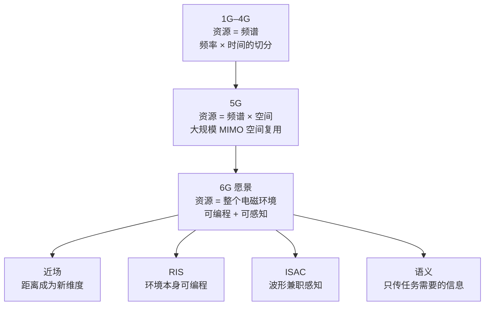
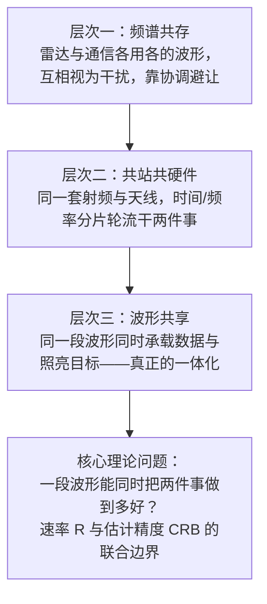
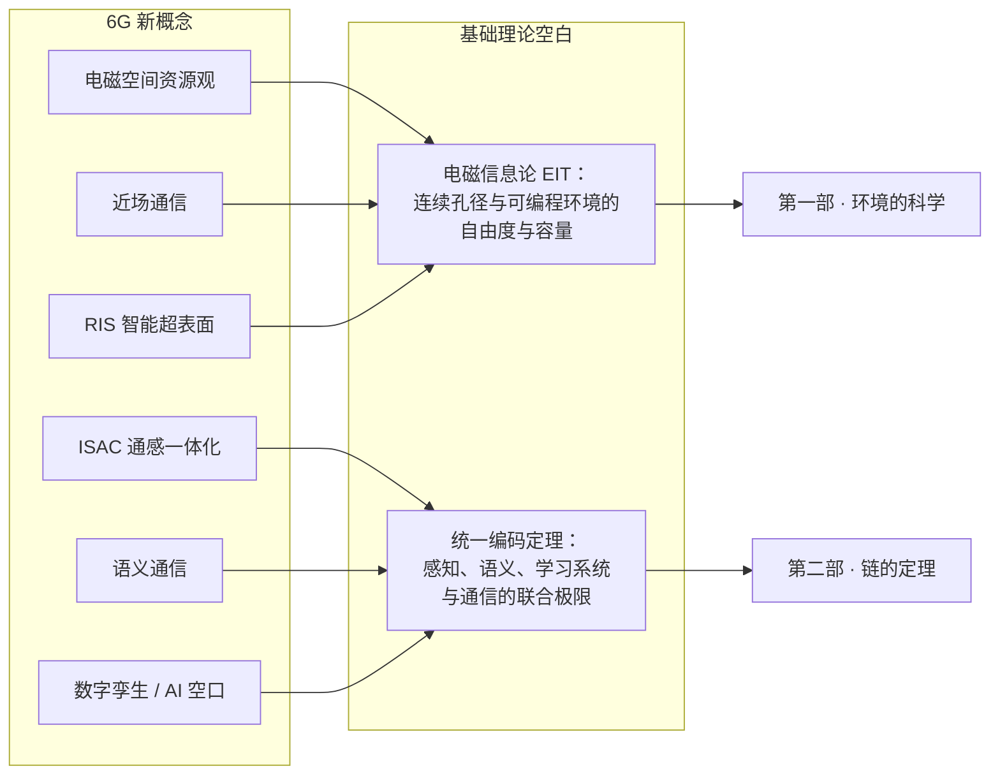

# 9 · 新概念图景：电磁空间、近场、RIS、ISAC 与语义通信

前八章我们把经典无线通信的地基打完了：电磁波与天线（[第 1 章](01-em-waves-antennas.md)）、信道（[第 2 章](02-wireless-channel-basics.md)）、数字传输（[第 3 章](03-digital-communications.md)）、信息论（[第 4 章](04-information-theory-basics.md)）、多天线（[第 5 章](05-mimo.md)）、网络（[第 6 章](06-wireless-networks.md)）、优化（[第 7 章](07-optimization-basics.md)）与决策学习（[第 8 章](08-reinforcement-learning.md)）。本章带你逛一圈"6G 概念博览会"——但不是导游式的走马观花，而是带着工程师的怀疑精神：每个新概念，我们都问三个问题——**它的物理原理是什么？它的关键公式怎么推？它现在到底成熟到什么程度？** 最后用一张"成熟度 × 理论空白"总表告诉你：这些概念背后真正缺的基础理论，分别在本站四部曲的哪一部展开。

**你将学会：**

- 用"资源观演进"这一条主线（频谱 → 空间 → 电磁环境），把看似杂乱的 6G 新概念串成一个整体；
- 一步不跳地推导远近场分界（瑞利距离），并解释近场球面波为什么能带来"按距离聚焦"这个新能力；
- 写出 RIS 的级联信道模型 $\mathbf{h}_r^H \boldsymbol{\Theta} \mathbf{h}_t$，用三行代数推出 $N^2$ 无源波束赋形增益，同时算清"乘性路径损耗"这盆冷水；
- 分清 ISAC 从频谱共存到波形共享的三个层次，理解感知精度（CRB）与通信速率的折中从何而来；
- 说清语义通信与经典率失真理论的关系，以及它"目前还缺编码定理"的诚实现状；
- 对照本章末尾的总表，知道每个概念该去本站第一部还是第二部深挖。

---

## 9.1 资源观的三次跃迁：频谱 → 空间 → 电磁环境

### 直觉：无线资源像土地

把无线通信的"资源"想象成土地。第一代到第四代移动通信（1G–4G）的资源观是**平面的**：全部家当就是频谱这块"耕地"，工程师做的事情是把它切成小块分给用户——按频率切（FDMA）、按时间切（TDMA）、按码切（CDMA）、按子载波精细地切（OFDMA，见[第 3 章](03-digital-communications.md)与[第 6 章](06-wireless-networks.md)）。土地总量有限，所以历史上每一次扩容的主旋律都是"买新地"：往更高的频段搬。

5G 的大规模 MIMO 带来第一次跃迁：**空间本身是资源**。同一块频谱上，只要天线足够多、信道足够散射，就能同时传输多路独立数据流——空间自由度（DoF）约为 $\min(N_t, N_r)$，这是[第 5 章](05-mimo.md)的核心结论。相当于发现耕地上方还能盖楼：不买新地，向立体要产量。

6G 正在酝酿第二次跃迁：**整个电磁环境是资源**。传统观念里，信道是"天给的"——散射体在哪、墙怎么反射，工程师只能被动适应。而 RIS（智能超表面）让环境变得可编程，ISAC 让电磁波在传信息的同时感知环境，近场大孔径让"距离"也成为可分辨的维度。资源的刻画从一个标量（带宽 $B$）逐渐变成一个多维的"电磁频谱空间"。

### 电磁频谱空间的多维刻画

把"电磁空间"拆开看，它至少包含五个可利用的维度，各用一句话概括：

| 维度 | 一句话刻画 | 成熟度 |
|---|---|---|
| 频率 / 时间 | 最经典的正交资源，按赫兹和秒切分，理论与工程都已成熟 | 已商用百年 |
| 空间 | 多天线阵列提供的自由度 $\min(N_t,N_r)$，5G 的主力增益来源 | 已商用 |
| 极化 | 电场振动方向的正交性，水平/垂直双极化默认能翻一倍复用，工程上早已是标配 | 已商用 |
| 轨道角动量（OAM） | 波前绕传播轴螺旋旋转（相位因子 $e^{jl\phi}$）形成的正交模态，本质上是环形阵列的一组空间模式，远距离传输时模态发散严重，目前限于点对点视距试验 | 试验期 |
| 电磁环境结构 | 散射体、反射面本身的可编程性与可感知性——本章后续几节的主角 | 理论期—试验期 |

!!! note
    OAM 常被宣传为"独立于空间维度的全新资源"，这是不准确的：可以证明 OAM 模态包含于一般的空间自由度分析之中，受孔径大小的同样限制。它是空间资源的一种特定"坐标系"，不是额外的新大陆。

!!! example "算例 9-1：空间资源到底值多少频谱"
    在 3.5 GHz、带宽 $B = 100$ MHz、接收 SNR $= 20$ dB（即 100 倍）的条件下，单天线链路的香农容量约为

    $$
    C_{\mathrm{SISO}} = B \log_2(1 + 100) \approx 10^8 \times 6.66 \approx 666 \ \mathrm{Mbps}.
    $$

    换成 $8\times 8$ MIMO、空间复用 8 流、总功率平均分配（每流 SNR 降为 $100/8 = 12.5$）：

    $$
    C_{\mathrm{MIMO}} \approx 8 \times B \log_2(1 + 12.5) = 8 \times 10^8 \times 3.76 \approx 3.0 \ \mathrm{Gbps}.
    $$

    容量提升约 4.5 倍——**没有多用一赫兹频谱**。若想用纯频谱达到同样容量，需要把带宽扩到约 450 MHz（假设 SNR 仍为 20 dB，即功率随带宽同比增加；若总功率不变，SNR 随带宽反比下降，需要约 800 MHz，此时 SNR 恰为 12.5，与 8 流 MIMO 是同一笔账）。这就是"空间是资源"的数量级含义，也是理解后面所有新概念的参照系：每个新维度的价值，最终都要换算成"等效多少频谱"来检验。

**本节的理论空白**：当天线从"离散的几根"走向"连续的一整面孔径"、当环境本身进入信道模型，经典的自由度计数方法（数天线个数）失效了。"一块给定体积的空间里，电磁场到底能承载多少信息？"——这是电磁信息论（EIT）的核心问题，在本站[第一部·环境的科学](../part1/index.md)展开。

---

## 9.2 近场通信：球面波的回归

### 直觉：手电筒与放大镜

远场通信像**手电筒**：光束只能选一个方向照出去，同一方向上远近所有物体都被照亮。近场通信像**放大镜聚焦阳光**：能量汇聚到空间中的一个**点**，焦点前后都不烫。手电筒只能"选方向"（beam steering），放大镜能"选位置"（beam focusing）——多出来的这个"距离维"，就是近场通信的全部新故事。

[第 1 章](01-em-waves-antennas.md)和[第 5 章](05-mimo.md)的阵列分析全部建立在**平面波假设**上：波源足够远，到达阵列的球面波前近似为平面。近场，就是这个假设失效的区域。

### 分界在哪里：瑞利距离的完整推导

考虑一个孔径（最大尺寸）为 $D$ 的天线阵列，工作波长 $\lambda$，观察点在阵列法线方向距离 $d$ 处。平面波假设的误差,可以用"阵列边缘与阵列中心到观察点的路径差"来度量。

**第一步**，写出精确的路径差。阵列边缘离中心 $D/2$，由勾股定理：

$$
\Delta d = \sqrt{d^2 + \left(\frac{D}{2}\right)^2} - d.
$$

**第二步**，提出 $d$ 并做泰勒展开。利用 $\sqrt{1+x} \approx 1 + \frac{x}{2}$（当 $x \ll 1$）：

$$
\Delta d = d\left(\sqrt{1 + \frac{D^2}{4d^2}} - 1\right) \approx d \cdot \frac{D^2}{8d^2} = \frac{D^2}{8d}.
$$

**第三步**，把路径差换算成相位差。相位误差为 $\Delta\varphi = \frac{2\pi}{\lambda}\Delta d$。天线工程的传统判据是：相位误差不超过 $\pi/8$（即路径差不超过 $\lambda/16$）时，平面波近似可接受：

$$
\Delta\varphi = \frac{2\pi}{\lambda}\cdot\frac{D^2}{8d} \le \frac{\pi}{8}.
$$

**第四步**，解出 $d$。左边等于 $\frac{\pi D^2}{4\lambda d}$，两边除以 $\pi$ 得 $\frac{D^2}{4\lambda d}\le\frac{1}{8}$，即 $8D^2\le 4\lambda d$，得到瑞利距离（Rayleigh distance，亦称夫琅禾费距离；[第 1 章](01-em-waves-antennas.md) 1.3 节记作 $d_F$，与这里的 $d_R$ 是同一个量）：

$$
d \ge d_R = \frac{2D^2}{\lambda}.
$$

**物理意义**：$d_R$ 是"波前弯曲程度可以被忽略"的最小距离。距离小于 $d_R$ 时，阵列上不同单元"看到"的波前曲率差异不可忽略，必须用球面波建模——这就是辐射近场区（Fresnel 区；更靠近阵列的电抗近场见[第 1 章](01-em-waves-antennas.md) 1.3 节分区表，本章不涉及）。注意判据用的是**相位**而不是能量：近场边界处信号强度并没有什么突变，变的只是建模方式。

**行为分析**：$d_R \propto D^2/\lambda$——孔径的**平方**除以波长。这个平方关系是 6G 近场热潮的全部来源：孔径翻倍，近场范围翻四倍；频率升高（$\lambda$ 变小），近场范围继续扩大。4G 时代 $D$ 小、$\lambda$ 大，$d_R$ 只有几米，近场无人关心；6G 的超大规模阵列（比如整面墙的 RIS）加上毫米波，$d_R$ 冲到几百米，小区里大量用户都泡在近场里。

!!! example "算例 9-2：三个时代的瑞利距离"
    代入 $d_R = 2D^2/\lambda$：

    | 场景 | 频率 | $\lambda$ | 孔径 $D$ | $d_R$ |
    |---|---|---|---|---|
    | 4G/5G 常规基站 | 3.5 GHz | 8.6 cm | 0.5 m | $2\times 0.25/0.086 \approx 5.8$ m |
    | 毫米波大阵列 | 30 GHz | 1 cm | 0.5 m | $2\times 0.25/0.01 = 50$ m |
    | 6G 超大孔径 / RIS 墙面 | 100 GHz | 3 mm | 1 m | $2\times 1/0.003 \approx 667$ m |

    第一行解释了为什么你此前学的远场模型一直够用；第三行解释了为什么 6G 教科书必须重写这一段——667 米意味着**整个小区都是近场**。

### 近场给了什么新能力：距离域聚焦

设 $N$ 元均匀线阵，阵元间距 $\Delta$，第 $n$ 个阵元坐标 $\delta_n = n\Delta$（$n$ 从阵列中心取正负）。用户位于极坐标 $(r, \theta)$。第 $n$ 个阵元到用户的精确距离由余弦定理给出（$\theta$ 从法线量起，阵列轴与用户方向夹角为 $90^\circ-\theta$，而 $\cos(90^\circ-\theta)=\sin\theta$）：

$$
r_n = \sqrt{r^2 - 2 r \delta_n \sin\theta + \delta_n^2}.
$$

做菲涅耳（Fresnel）展开：令 $x = \frac{-2r\delta_n\sin\theta + \delta_n^2}{r^2}$，用 $\sqrt{1+x} \approx 1 + \frac{x}{2} - \frac{x^2}{8}$，保留到 $\delta_n^2$ 阶：

$$
\begin{aligned}
r_n &= r\sqrt{1+x} \approx r\left(1 + \frac{x}{2} - \frac{x^2}{8}\right)\\[4pt]
&\approx r - \delta_n \sin\theta + \frac{\delta_n^2}{2r} - \frac{\delta_n^2\sin^2\theta}{2r}\\[4pt]
&= r - \delta_n \sin\theta + \frac{\delta_n^2 \cos^2\theta}{2r}.
\end{aligned}
$$

第二行逐项来自：$\frac{x}{2}=-\frac{\delta_n\sin\theta}{r}+\frac{\delta_n^2}{2r^2}$；$x^2=\frac{4\delta_n^2\sin^2\theta}{r^2}+O(\delta_n^3)$，所以 $\frac{x^2}{8}\approx\frac{\delta_n^2\sin^2\theta}{2r^2}$（$\delta_n^3$、$\delta_n^4$ 项因 $|\delta_n|\ll r$ 舍去）。三项乘以 $r$ 即得第二行；第三行用了 $1-\sin^2\theta=\cos^2\theta$。

**物理意义**：远场模型只保留线性项 $-\delta_n\sin\theta$——阵列响应只依赖角度 $\theta$，所以远场波束赋形只能"选方向"。近场必须保留二次项 $\frac{\delta_n^2\cos^2\theta}{2r}$，它**显式地依赖距离 $r$**。于是阵列响应向量变成 $(\theta, r)$ 的二元函数：给第 $n$ 个阵元乘上相位因子 $e^{j2\pi r_n/\lambda}$，正好抵消它到焦点 $(r,\theta)$ 的传播相位（相位共轭补偿），信号只在**特定角度且特定距离**的一个焦点附近相干叠加——这就是波束聚焦。

**行为分析**：二次项随 $r$ 增大而消失（$r \to \infty$ 时退化为远场），所以焦点越远、"焦深"越长，聚焦能力越弱；$r$ 接近并超过 $d_R$ 后，聚焦退化为普通的方向波束。反过来，用户离阵列越近，距离分辨率越好。

以算例 9-2 第三行（$\lambda=3$ mm，$D=1$ m）为例，取法线方向 $\theta=0$、阵列边缘 $\delta_n=0.5$ m，二次项带来的相位为 $\frac{2\pi}{\lambda}\cdot\frac{\delta_n^2}{2r}$：$r=50$ m 时约 5.2 rad，接近一整圈；$r=667$ m 时只剩约 0.39 rad $\approx\pi/8$，正是瑞利距离判据：边缘处的 $\frac{\delta_n^2}{2r}$ 就是瑞利推导里的路径差 $\frac{D^2}{8d}$。

| 对比项 | 波束导向（beam steering，远场） | 波束聚焦（beam focusing，近场） |
|---|---|---|
| 波前模型 | 平面波 | 球面波（菲涅耳近似） |
| 阵列响应自变量 | 角度 $\theta$ | 角度 + 距离 $(\theta, r)$ |
| 能量形状 | 一条射向远方的"光束" | 空间中的一个"光斑" |
| 可区分的用户 | 不同角度 | 同一角度、不同距离也能区分 |
| 新增自由度 | — | 距离域复用、单站定位、聚焦充电 |

### 应用与炒作的边界

真实的应用潜力：同一角度上远近两个用户可以空分复用（远场做不到）；单个基站利用波前曲率直接估计用户距离（远场只能测角）；无线能量传输可以把功率密度聚在接收机上而不是一路撒过去。

诚实的另一面：近场信道估计的参数空间从一维（角度）变成二维（角度 × 距离），码本大小和导频开销显著膨胀；用户一动焦点就偏，移动性管理更难；且 $d_R$ 是**相位判据**，不代表近场增益在整个范围内都显著——距离在 $d_R$ 附近时，聚焦与导向的差别已经很小。把"近场"当成免费的新频谱，是当前宣传中最常见的夸大。

**本节的理论空白**：近场把"数天线个数"的自由度分析逼到极限——孔径连续化之后，距离域到底提供多少**独立的**自由度？这需要从麦克斯韦方程组出发的电磁信息论，见[第一部·环境的科学](../part1/index.md)。

---

## 9.3 RIS 智能超表面：可编程的反射镜

### 直觉与物理原理

想象墙上贴了一层"魔法墙纸"，上面密布成百上千个亚波长尺寸（约 $\lambda/2$ 以下）的小单元。每个单元里有一个 PIN 二极管或变容二极管，改变偏置电压就能改变单元的表面阻抗，从而改变它反射电磁波时附加的**相位**。单元本身不放大信号（无源），只是"掰弯"入射波的波前。把所有单元的相位编排好，整面墙就成了一面**可编程反射镜**：可以把基站的信号反射并聚焦到被遮挡的用户那里。这就是 RIS（Reconfigurable Intelligent Surface，智能超表面/智能反射面）。

### 级联信道模型

设基站单天线发送信号 $s$，RIS 有 $N$ 个单元。基站到 RIS 的信道为 $\mathbf{h}_t \in \mathbb{C}^N$，RIS 到用户的信道为 $\mathbf{h}_r \in \mathbb{C}^N$，直达径为 $h_d$（可能被遮挡为 0）。RIS 的作用用对角矩阵刻画：

$$
\boldsymbol{\Theta} = \operatorname{diag}\left(e^{j\theta_1}, e^{j\theta_2}, \ldots, e^{j\theta_N}\right),
$$

其中 $\theta_n$ 是第 $n$ 个单元的可编程反射相位（理想化假设反射幅度为 1）。接收信号为

$$
y = \left(\mathbf{h}_r^H \boldsymbol{\Theta} \mathbf{h}_t + h_d\right) s + n.
$$

**物理意义**：$\mathbf{h}_r^H \boldsymbol{\Theta} \mathbf{h}_t$ 是一个标量——$N$ 条"基站 → 单元 $n$ → 用户"的二跳路径的相干叠加，每条路径的相位都可以被 $\theta_n$ 单独拨动。RIS 优化的全部内容，就是拨动这 $N$ 个旋钮让各路径在用户处同相相加。

### $N^2$ 增益的逐步推导

**第一步**，把信道写成极坐标形式：$[\mathbf{h}_t]_n = \alpha_n e^{j\psi_n}$，$[\mathbf{h}_r]_n = \beta_n e^{j\chi_n}$。展开级联项（注意 $(\cdot)^H$ 带来共轭）：

$$
\begin{aligned}
\mathbf{h}_r^H \boldsymbol{\Theta} \mathbf{h}_t
&= \sum_{n=1}^{N} \beta_n e^{-j\chi_n}\, e^{j\theta_n}\, \alpha_n e^{j\psi_n}\\[4pt]
&= \sum_{n=1}^{N} \alpha_n \beta_n\, e^{j(\theta_n + \psi_n - \chi_n)}.
\end{aligned}
$$

**第二步**，选最优相位。让每一项的相角为零：$\theta_n^\star = \chi_n - \psi_n \pmod{2\pi}$，则所有项都变成正实数：

$$
\left|\mathbf{h}_r^H \boldsymbol{\Theta}^\star \mathbf{h}_t\right| = \sum_{n=1}^{N} \alpha_n \beta_n.
$$

**第三步**，代入等幅假设 $\alpha_n = \alpha$、$\beta_n = \beta$，比较两种情形的接收**功率**：

$$
P_{\mathrm{opt}} \propto \left(N\alpha\beta\right)^2 = N^2 \alpha^2 \beta^2,
\qquad
P_{\mathrm{rand}} = \mathbb{E}\left|\sum_{n} \alpha\beta e^{j\varphi_n}\right|^2 = N \alpha^2\beta^2,
$$

其中随机相位 $\varphi_n$ 对应"没有优化、相当于一面普通粗糙墙"的情形（$N$ 项功率相加而非幅度相加）。$P_{\mathrm{rand}}$ 的算法是展开模方：$\left|\sum_n e^{j\varphi_n}\right|^2=\sum_n\sum_m e^{j(\varphi_n-\varphi_m)}$。$n=m$ 的 $N$ 项各等于 1；$n\ne m$ 时，$\varphi_n$、$\varphi_m$ 独立且在 $[0,2\pi)$ 上均匀，$\mathbb{E}[e^{j(\varphi_n-\varphi_m)}]=\mathbb{E}[e^{j\varphi_n}]\,\mathbb{E}[e^{-j\varphi_m}]=0$，交叉项全部消失，只剩 $N$。

有源阵列只有 $N$ 倍，是因为总功率 $P$ 要分给 $N$ 根天线：每根幅度 $\sqrt{P/N}$，相干叠加后功率 $(N\sqrt{P/N})^2=NP$；RIS 各单元各自截获入射功率，没有这个 $1/N$ 分摊。

!!! success "关键结论"
    相位对齐后幅度按 $N$ 增长、功率按 $N^2$ 增长；不对齐则功率只按 $N$ 增长。RIS 的无源波束赋形增益是 $N^2$（相对单个散射单元），或者说**相对一面普通墙壁增益为 $N$**。直觉上 $N^2$ 来自两次孔径增益的乘积：$N$ 个单元先"收集" $N$ 倍功率，再相干地"重定向"获得 $N$ 倍阵列增益——收发两头各赚一次。作为对照，有源发射阵列在总功率约束下的波束赋形增益只有 $N$。

### 冷水：乘性路径损耗与工程挑战

$N^2$ 看起来吊打一切，但每一项 $\alpha_n\beta_n$ 是**两段路径损耗的乘积**。自由空间中 $\alpha \propto 1/d_t$、$\beta \propto 1/d_r$，于是级联链路功率 $\propto 1/(d_t d_r)^2$——距离**乘积**的平方反比。换成 dB，两段路径损耗**相加**：级联径要付两次路径损耗，而同样长度的直达径只按总距离 $d_t+d_r$ 付一次。这就是著名的"double fading"（乘性衰落）问题。

!!! example "算例 9-3：256 单元 RIS 打得过 35 米直达径吗"
    频率 3.5 GHz（$\lambda = 8.57$ cm），RIS 距基站 $d_t = 30$ m、距用户 $d_r = 5$ m；作为对照，无遮挡直达径 $d = 35$ m。自由空间路径损耗 $L(d) = 20\log_{10}(4\pi d/\lambda)$ dB：

    $$
    L(30) \approx 72.9 \ \mathrm{dB},\quad L(5) \approx 57.3 \ \mathrm{dB},\quad L(35) \approx 74.2 \ \mathrm{dB}.
    $$

    把每个单元理想化为 0 dB 增益的散射体，单元级联损耗约 $72.9 + 57.3 = 130.2$ dB——比直达径差了 56 dB。这 56 dB 就是多付的那一次路径损耗：$L(d_t)+L(d_r)-L(d_t+d_r)=20\log_{10}\frac{4\pi d_td_r}{\lambda(d_t+d_r)}$，相当于在 $d_td_r/(d_t+d_r)\approx 4.3$ m 上再付一次自由空间损耗。要靠 $20\log_{10}N$ 把它全补回来，需要 $N\approx 630$ 个单元。挂上 $N = 256$ 的无源赋形增益 $10\log_{10} N^2 = 48.2$ dB，RIS 链路的等效损耗约

    $$
    130.2 - 48.2 = 82.0 \ \mathrm{dB},
    $$

    仍比无遮挡直达径**差约 8 dB**。（此为忽略单元方向图与有效孔径的数量级估算。）结论：几百单元的 RIS 打不过一条健康的直达径；它的正确用法是**救援被遮挡的链路**——当直达径被建筑物挡掉 20–30 dB 时，RIS 反射径反而成了最强的路。

{ .chart loading=lazy }
{ .chart loading=lazy }

*怎么读这张图：第一条是 RIS 的级联损耗 $130.2-20\log_{10}N$ dB，$N$ 每翻倍降 6 dB，$N=256$ 时 82.0 dB，与算例一致；第二条是无遮挡直达径的 74.2 dB；第三条是直达径被挡掉 25 dB（取正文 20–30 dB 的中值）后的 99.2 dB。第一条要到 $N\approx630$ 才追平健康的直达径，却在 $N\approx35$ 就压过被遮挡的直达径，"救援被遮挡链路"量化后就是这两个交点。与算例一样忽略单元方向图与有效孔径，是数量级估算。*

工程挑战的诚实清单：

- **信道估计开销**：RIS 无源、不能收发导频，只能估计 $N \times M$ 维的级联信道（$M$ 为基站天线数）。开销随 $N$ 线性增长，$N$ 为数百上千时，导频可能吃掉大量帧结构，信道老化前根本估不完。这是当前最被公认的瓶颈。
- **控制链路**：相位配置要通过一条独立的（有线或低速无线）控制链路下发，带来时延、同步与部署成本问题。
- **相位量化**：工程上单元相位往往只有 1–2 bit。可以证明 1-bit 量化平均带来约 $(2/\pi)^2 \approx -3.9$ dB 的功率损失：1 bit 只能取 $\{0,\pi\}$，每项残留相位误差 $e_n$ 近似均匀分布在 $[-\pi/2,\pi/2]$；$N$ 很大时同相分量之和约为 $N\alpha\beta\,\mathbb{E}[\cos e_n]=N\alpha\beta\cdot\frac{2}{\pi}$，功率就乘上 $(2/\pi)^2$。2 bit 时误差缩到 $\pm\pi/4$，同理损失 $\left[\frac{\sin(\pi/4)}{\pi/4}\right]^2\approx -0.9$ dB。
- **与有源中继的对比**：一个简单的半双工放大转发中继没有乘性路损问题；诚实的对比研究表明，RIS 需要非常大的 $N$ 才能在链路预算上胜过小型有源中继——RIS 的真正卖点是**无源、低功耗、易共形部署**，而不是绝对性能。

**成熟度**：试验期（截至 2026 年 10 月）。已有多家机构完成外场样机试验。ETSI 的行业规范组 ISG RIS 从 2023 年起陆续发布研究报告，GR RIS 001–003 讲用例、架构与信道模型，后续又有实现考虑、近场建模等报告。3GPP 里先落地的是另一种设备：Rel-18 标准化了网络控制中继器（NCR），它有源、能放大，波束、开关和收发时序都由基站控制；Rel-19 的立项清单里没有 RIS，6G 研究项目（RP-251881）的范围里也没有。为什么产业先选了中继器，见导览篇的[方向的生命周期](../guide/06-direction-lifecycle.md)。

**本节的理论空白**：一旦环境（墙面）本身成为可优化变量，"信道容量"的定义就动摇了——容量是对什么求最大？环境自由度怎么计入？这属于"环境的科学"，见[第一部](../part1/index.md)，其与电磁理论的接口见[第一部第 10 章·研究议程](../part1/10-research-agenda.md)。

---

## 9.4 ISAC 通感一体化：一段波形，两种任务

### 直觉：蝙蝠早就会了

蝙蝠用同一套"收发系统"发出叫声：回声用来导航避障（感知），叫声本身也在和同伴交流（通信）。ISAC（Integrated Sensing and Communication，通感一体化）想让基站学会同样的本领：发出去的通信波形，反射回来就是雷达回波——一段波形，两种任务。

驱动力很实际：雷达和通信在毫米波段抢频谱抢了几十年；6G 的大带宽、大阵列基站，硬件形态已经和相控阵雷达高度相似；而自动驾驶、低空经济等场景恰恰同时需要"高速连接 + 高精度感知"。

### 三个层次：从共存到共生

层次一只是干扰管理（第 6 章的老问题换个说法）；层次二是资源分割，没有本质融合；只有层次三出现了真正的新问题：**通信和感知对波形的偏好是矛盾的**。

### 感知这一侧怎么度量：CRB 一句话

感知性能的标尺是估计精度。一句话版本：**克拉美–罗界（CRB）是任何无偏估计器的方差下界，等于费舍尔信息的倒数**——它之于估计，就像香农容量之于传输。

观测 $\mathbf{y}$ 的分布 $p(\mathbf{y};\theta)$ 依赖未知参数 $\theta$。估计器 $\hat{\theta}(\mathbf{y})$ **无偏**指 $\mathbb{E}[\hat{\theta}]=\theta$。**费舍尔信息**（Fisher information）$J(\theta)=\mathbb{E}\left[\left(\frac{\partial}{\partial\theta}\ln p(\mathbf{y};\theta)\right)^2\right]$ 度量对数似然在真值附近有多"尖"：$\theta$ 稍变、数据分布就明显不同，$J$ 就大，参数就好估。CRB 说 $\operatorname{var}(\hat{\theta})\ge 1/J(\theta)$。最简单的例子：$N$ 个独立观测 $y_i=\theta+w_i$，$w_i\sim\mathcal{N}(0,\sigma^2)$，每个观测贡献 $1/\sigma^2$，$J=N/\sigma^2$，CRB $=\sigma^2/N$，样本均值恰好达到。独立观测的费舍尔信息相加，与[第 4 章](04-information-theory-basics.md) 4.10 节的"精度相加"同理。

对时延（测距）估计，经典结果为

$$
\operatorname{var}(\hat{\tau}) \ge \frac{1}{8\pi^2 \beta_{\mathrm{rms}}^2 \cdot \mathrm{SNR}},
$$

其中 $\beta_{\mathrm{rms}}$ 是信号的均方根带宽，即把功率谱 $|S(f)|^2$ 看作频率的分布时的标准差：$\beta_{\mathrm{rms}}^2=\int f^2|S(f)|^2\,df\big/\int|S(f)|^2\,df$（频谱以零频为中心）。谱在 $[-B/2,B/2]$ 内平坦时即为均匀分布的方差 $B^2/12$。SNR 为匹配滤波后的信噪比，按复基带计就是 $E/N_0$（信号总能量除以噪声功率谱密度）；有的教材按实信号把匹配滤波输出写成 $2E/N_0$，式中的 $8\pi^2$ 相应变成 $4\pi^2$，两种写法是同一个界。测距误差则为 $\sigma_R = \frac{c}{2}\sigma_{\tau}$（往返路径除以 2）。

**物理意义**：带宽决定你能把回波的"时间棱角"磨得多锐利——带宽越大，自相关峰越尖，时延越好分辨。SNR 决定噪声把峰"晃动"的幅度。

**行为分析**：精度对带宽是**平方**收益（$\beta_{\mathrm{rms}}^2$），对 SNR 只是线性收益——这就是感知偏爱毫米波大带宽的根本原因；带宽翻倍，测距标准差直接减半，效果与功率翻四倍相同——多花一倍频谱，省下 6 dB 功率。这是在 SNR 不变的前提下比；若功率谱密度不变、总功率随带宽一起翻倍，SNR 也跟着翻倍，标准差会降到原来的 $1/(2\sqrt{2})\approx0.35$，比单纯把功率翻四倍更划算。

!!! example "算例 9-4：100 MHz 能把距离测多准"
    设 OFDM 信号功率谱在 $B = 100$ MHz 内近似平坦，则 $\beta_{\mathrm{rms}}^2 = B^2/12 \approx 8.3\times 10^{14}\ \mathrm{Hz}^2$。取 SNR $= 20$ dB（100 倍）：

    $$
    \operatorname{var}(\hat{\tau}) \ge \frac{1}{8\pi^2 \times 8.3\times 10^{14} \times 100} \approx 1.5\times 10^{-19}\ \mathrm{s}^2
    \Rightarrow \sigma_{\tau} \approx 0.39\ \mathrm{ns}.
    $$

    换算成距离：$\sigma_R = \frac{3\times 10^8}{2} \times 3.9\times 10^{-10} \approx 6$ cm。也就是说，一个普通 5G 载波带宽的信号，理论上就能支撑**厘米级**测距——ISAC 的感知承诺在数量级上是站得住的；难的不是精度极限，而是下面的折中与工程。

### 通信与感知的根本折中

通信希望波形**随机**：信息本身就是不确定性，承载比特的波形必然像噪声（[第 4 章](04-information-theory-basics.md)：高斯输入达到容量）。感知希望波形**确定**：雷达工程师喜欢恒包络、低峰均比、模糊函数图钉状的确定性波形，且最好重复发射便于积累。**模糊函数**（ambiguity function）$|\chi(\tau,\nu)|$ 是波形与它自己经时延 $\tau$、多普勒频移 $\nu$ 后的版本的相关幅度；"图钉状"指它只在原点有一个尖峰、其余地方低平，这样距离和速度都能唯一地分辨。同一段波形不可能同时完全满足两者——这被称为**确定性–随机性折中**，是 ISAC 理论的核心张力。

刻画这个折中的标准图景是"速率–CRB 可达域"：横轴通信速率 $R$，纵轴感知精度（如 $1/\mathrm{CRB}$），所有可达的 $(R, \text{精度})$ 组合构成一个区域。边界上有两个角点（通信最优点、感知最优点），中间是帕累托（Pareto）折中段：沿边界移动，一项变好，另一项必然变差。

这里要把话说准，否则容易被内行一句话证伪。

- **以期望失真为度量的点对点情形已经有单字母刻画**。模型是状态相关信道（目标参数作为信道的随机状态）加广义反馈（发端听得到自己的回波），其容量–失真折中 $C(D)$ 已被完整给出【已解决】。"单字母"指公式只涉及单个符号的分布，不必对码长趋于无穷的序列取极限，因而可以直接计算。
- **没有一般性答案的是另外三块**：以 CRB（而非失真）为纵轴的完整可达域；多用户/组网情形（一般广播与多址 ISAC 只有内界与外界，真实区域夹在两者之间但未确定）；波形受限（实际星座与帧结构）下的边界【开放】。

这三块正是本站[第二部·链的定理](../part2/index.md)要展开的主题之一。

单站通感要不要上全双工，[第 10 章 10.4 节](10-new-phy-dof.md#通感一体化全双工的对手是分时)拿峰值功率分时作对照算了一笔账：近处强目标几乎不亏，远处弱目标才值得做，而那里恰是残余自干扰最难压的地方。

**成熟度**：试验期，标准化已启动（截至 2026 年 10 月）。3GPP 先定义了通感用例，Rel-19 又做了通感信道建模的研究：感知目标的回波要先进信道模型，其余才谈得上。6G 研究项目（RP-251881）把感知明确列入范围，包括感知的物理层功能、性能评估以及与通信的融合。产业样机大量涌现，距离"波形共享"的商用形态仍有明显距离。

---

## 9.5 语义通信：传"意思"，不传比特

### 直觉：着火了喊一声就够

楼里着火，你给消防队打电话说"XX 路 5 号楼三层着火了"——十几个字，任务完成。没有人会传一段火场的 4K 视频再让对方自己看。人类通信天然是**任务导向**的：只传对方完成任务所需的信息。而经典通信系统是"比特搬运工"：源端是猫的照片还是白噪声，物理层一视同仁。语义通信的主张是：让通信系统知道任务是什么，只传"意思"。

这个想法并不新。香农 1948 年论文开篇就声明语义与工程问题无关，而 Weaver 在 1949 年就提出通信的三个层次：技术层（比特对不对）、语义层（意思对不对）、效用层（行为对不对）。经典理论只解决了第一层；语义通信是要向上面两层进军。

### 严格一点：它和率失真理论是什么关系

[第 4 章](04-information-theory-basics.md)讲过率失真理论：允许失真 $D$ 时，压缩极限是

$$
R(D) = \min_{p(\hat{x}\mid x):\ \mathbb{E}[d(X,\hat{X})] \le D} I(X; \hat{X}).
$$

经典失真度量 $d(\cdot,\cdot)$（如均方误差）是**对源本身**定义的：要求重建 $\hat{X}$ 处处像 $X$。语义/任务导向通信的数学本质，是把失真定义搬到**任务变量** $Y$（标签、决策、控制指令）上：$X$ 可以面目全非，只要关于 $Y$ 的信息还在。这个思想的一个标准形式化是**信息瓶颈**（Information Bottleneck）：

$$
\min_{p(z\mid x)}\ I(X; Z) - \beta\, I(Z; Y),
$$

即找一个压缩表示 $Z$：既要压得狠（$I(X;Z)$ 小，第一项），又要保留任务相关信息（$I(Z;Y)$ 大，第二项），$\beta$ 拨动折中。

编码端只看得到 $X$，失真却按任务变量 $Y$ 算，这叫**远端信源**（remote source）或**间接率失真**问题。由于 $Z$ 只由 $X$ 生成，有马尔可夫链 $Y\to X\to Z$。把失真换成"已知 $X=x$ 时对 $Y$ 的平均失真" $\tilde{d}(x,z)=\mathbb{E}[d(Y,z)\mid X=x]$，就回到上面的标准 $R(D)$。信息瓶颈对应其中一种特殊选择：取 $\tilde{d}(x,z)=D_{\mathrm{KL}}\big(p(y\mid x)\,\|\,p(y\mid z)\big)$（KL 散度，见[第 4 章](04-information-theory-basics.md) 4.4 节）。注意 $p(y\mid z)$ 本身随编码器 $p(z\mid x)$ 而变，所以这不是事先固定的失真函数，只在自洽的意义下是特例。利用马尔可夫性 $p(y\mid x,z)=p(y\mid x)$，有 $\mathbb{E}[\tilde{d}(X,Z)]=\mathbb{E}\big[\ln\frac{p(Y\mid X)}{p(Y)}\big]-\mathbb{E}\big[\ln\frac{p(Y\mid Z)}{p(Y)}\big]=I(X;Y)-I(Z;Y)$。$I(X;Y)$ 是常数，所以约束"平均失真 $\le D$"就是"$I(Z;Y)\ge I(X;Y)-D$"，上面的目标函数正是这个约束下最小化 $I(X;Z)$ 的拉格朗日形式。

**物理意义**：语义通信没有跳出香农框架，而是把"保真对象"从信号换成了任务——它是率失真理论在"远端信源/间接失真"设定下的推广，而不是对香农定理的推翻。任何"语义通信突破了香农极限"的说法，都混淆了"换了度量"与"破了定理"。

**行为分析**：$\beta \to \infty$ 时 $Z$ 必须先保住 $X$ 中关于 $Y$ 的全部信息，再压到最小（最小充分统计量），即"只求任务"下的极限压缩；$\beta \to 0$ 时退化为不传输。任务越"窄"（比如只要一个分类标签），可压缩空间越大——下面的算例给出数量级。

!!! example "算例 9-5：从像素到标签差五个数量级"
    一张 $224\times 224\times 3$、每通道 8 bit 的图像，原始数据量为

    $$
    224 \times 224 \times 3 \times 8 \approx 1.2\times 10^{6}\ \mathrm{bit}.
    $$

    若任务是 1000 类图像分类，任务答案的信息量至多 $\log_2 1000 \approx 10$ bit——相差五个数量级。折中方案是传中间语义特征：如 512 维特征向量、每维 8 bit 量化，约 $4\times 10^3$ bit，压缩比约 300:1（对照：JPEG 约 10:1）。代价是**不可逆与不通用**：传特征只能回答"是什么类"，想换个任务（比如数图里有几个人）就得重训重传。语义压缩的收益，本质上是拿"通用性"换来的。

### 诚实的现状：缺编码定理

当前的语义通信系统主流做法是深度联合信源信道编码（deep JSCC）：用神经网络端到端地学习"源 → 波形"的映射，在低 SNR、短块长场景下实验性能确实超过"分离式设计"（[第 4 章](04-information-theory-basics.md) 4.9 节列出了分离定理最优的三条前提：点对点、无时延约束即码长趋于无穷、平稳遍历；短块长正是打破了第二条）。但必须诚实地说：

- **语义信息的度量没有公认定义**——"语义熵"有多种提法，彼此不等价；
- **没有编码定理**——经典理论有"容量 $C$ 可达且不可超越"的双向定理，语义通信目前只有实验曲线，没有"语义容量"的可达性与逆定理；
- 神经网络系统的互操作性、可解释性、对分布漂移的鲁棒性都是开放问题。

**成熟度**：理论期（部分场景概念验证）。**本节的理论空白**——为任务导向通信建立度量与编码定理——属于本站[第二部·链的定理](../part2/index.md)的核心议程。

---

## 9.6 数字孪生与 AI 空口：标准化走到哪一步了

### 数字孪生网络

数字孪生（digital twin）指为物理网络建立一个**实时同步的虚拟副本**：真实小区的建筑、材质、用户分布都在虚拟世界里有映射，网络的任何"如果"（如果把波束这样调、如果在这里加一面 RIS）都可以先在副本里试。它与[第 8 章](08-reinforcement-learning.md)的强化学习天然互补：孪生体就是安全的训练场，避免让 RL 智能体拿真实网络练手。瓶颈同样诚实可见：电磁级的孪生依赖射线追踪 + 实测校准，精度与算力、实时性三者互相打架——城市级场景的高保真信道仿真至今是小时级而非毫秒级的事。**成熟度：概念期向试验期过渡**（网管级孪生已有试点，电磁级孪生仍在研究）。

### 3GPP 的 AI/ML 标准化现状

AI 空口是新概念中**离商用最近**的一个。3GPP 在 R18 完成了"AI/ML 用于 NR 空口"的研究项目（技术报告 TR 38.843），圈定三个用例：**CSI 反馈压缩**（用自编码器替代人工设计的码本反馈）、**波束管理**（用预测减少毫米波波束测量开销）、**定位增强**；并把重心放在生命周期管理（LCM）——模型的训练、监控、切换、回退如何标准化。其中最棘手的是 CSI 压缩这类"双边模型"：编码器在终端、解码器在基站，分属不同厂商，模型配对与互操作测试成为规范化的主要难点。Rel-19 的工作项目（RP-234039）把波束管理和定位写进了规范，CSI 预测起初只列为研究、后来也进了规范，三者都是单边模型（模型只在终端或只在基站一侧）；双边的 CSI 压缩在 Rel-19 只继续研究，到 Rel-20 才立工作项目。6G 研究项目里 AI/ML 一项的标题就是"沿用 5G 的 AI/ML 框架"，并要求系统在不用 AI/ML 时也能正常工作。以上截至 2026 年 10 月。**成熟度：试验期，标准化进行中。**

!!! example "算例 9-6：AI 压缩 CSI 反馈的压缩比"
    32 端口天线、13 个子带的下行 CSI，原始复系数共 $32\times 13 = 416$ 个；若每个复数用两个 16 bit 浮点表示，共约

    $$
    416 \times 2 \times 16 \approx 1.3\times 10^4\ \mathrm{bit}.
    $$

    而上行反馈预算通常只有几百 bit——需要约 50–100 倍压缩。现行码本（如 R16 增强型 Type II）本质是**人工设计的有损压缩**；AI 方案是把这个压缩器换成从数据学出来的自编码器。增益空间是真实的，但要过泛化（换个小区还准吗）与互操作（终端 A 厂的编码器配基站 B 厂的解码器）两道关——这两道关恰恰不是算法问题，而是标准化问题。

---

## 9.7 全景总表：成熟度与理论空白地图

把全章收拢成一张图和两张表。先看概念到理论空白的归属：

**本章的"钱图"——成熟度 × 理论空白索引表**：

| 概念 | 成熟度（截至 2026-10） | 核心承诺 | 最大工程障碍 | 背后的基础理论空白 | 本站去处 |
|---|---|---|---|---|---|
| 大规模 MIMO（对照基准） | 已商用 | 空间复用 | — | 离散阵列理论已成熟 | [第 5 章](05-mimo.md)复习 |
| 电磁空间资源观 | 理论期 | 频/时/空/极化/环境的统一刻画 | 缺统一度量 | 电磁场承载信息的第一性原理 | [第一部](../part1/index.md) |
| 近场通信 | 理论期（样机起步；Rel-19 信道模型已加入近场与空间非平稳） | 距离域自由度 | 二维码本、估计开销、移动性 | 连续孔径的自由度与容量（EIT） | [第一部](../part1/index.md)、接口见[第一部 10 章](../part1/10-research-agenda.md) |
| RIS | 试验期（未进 3GPP 规范；Rel-18 先标准化了 NCR） | 环境可编程 | 级联信道估计、控制链路、乘性路损 | "环境入信道"后的容量定义 | [第一部](../part1/index.md) |
| ISAC | 试验期；Rel-19 信道建模研究，6G 研究范围内 | 一段波形两种任务 | 自干扰、组网感知、隐私 | 速率–CRB 联合可达域无一般定理 | [第二部](../part2/index.md) |
| 语义通信 | 理论期 | 任务导向压缩 | 互操作、泛化、可解释 | 语义度量与编码定理缺失 | [第二部](../part2/index.md) |
| 数字孪生 | 概念期 → 试验期 | 网络的虚拟试验场 | 建模精度 × 算力 × 实时性 | 电磁环境的可计算表征 | [第一部 10 章](../part1/10-research-agenda.md) |
| AI 空口 | Rel-19 已规范波束管理、定位、CSI 预测 | 学习替代模块化设计 | 泛化、互操作、测试方法 | 学习型通信系统的性能保障理论 | [第二部](../part2/index.md)，方法基础见[第 8 章](08-reinforcement-learning.md) |

**数量级速查表**（本章算例汇总，建议记住）：

| 量 | 数值 | 出处 |
|---|---|---|
| 瑞利距离 $d_R = 2D^2/\lambda$，100 GHz / 1 m 孔径 | 约 667 m | 算例 9-2 |
| 8 流空间复用相对 SISO 的容量增益（20 dB SNR） | 约 4.5 倍 | 算例 9-1 |
| RIS 无源赋形增益（$N=256$） | $N^2 \to 48$ dB | 算例 9-3 |
| RIS 1-bit 相位量化损失 | 约 3.9 dB | 9.3 节 |
| 100 MHz / 20 dB SNR 的 CRB 测距极限 | 约 6 cm | 算例 9-4 |
| 图像 → 分类标签的语义压缩空间 | 约 $10^5$ 倍 | 算例 9-5 |
| CSI 反馈所需压缩比 | 50–100 倍 | 算例 9-6 |

---

## 常见误解

!!! warning "初学者最容易踩的五个坑"
    **误解一："近场就是离得近。"** 错。远近场分界 $d_R = 2D^2/\lambda$ 由孔径与波长共同决定：手机连 Wi-Fi 距离 1 米也是远场（孔径太小），而 100 GHz 的米级阵列在 600 米外仍是近场。"近"是相对于阵列的电尺寸而言的。

    **误解二："RIS 有 $N^2$ 增益，所以吊打有源天线。"** $N^2$ 是相对**单个无源散射单元**的增益，且要被乘性路径损耗吃掉一大块（算例 9-3：256 单元仍比健康直达径差 8 dB）。RIS 的定位是低成本救援被遮挡链路，不是替代基站。

    **误解三："ISAC 就是在基站里装个雷达。"** 那只是层次一/二（共存、共硬件）。ISAC 真正的科学内容在层次三：同一段波形上通信随机性与感知确定性的折中——这是理论问题，不是集成问题。

    **误解四："语义通信突破了香农极限。"** 它换掉的是**失真度量**（从重建源换成完成任务），整个框架仍是率失真理论的推广。换了赛道跑出更快的成绩，不等于打破了原赛道的世界纪录。

    **误解五："OAM 是取之不尽的新维度。"** OAM 模态包含于空间自由度之内，受孔径同样的限制，远距离传输还面临模态发散。把它当作"第六种正交资源"是宣传话术。

---

## 通往前沿

本章的每一盆冷水，倒出来的位置就是前沿的入口。近场、RIS 与"电磁空间资源观"共同指向同一个基础问题——连续孔径与可编程环境中，电磁场究竟能承载多少信息——这是[第一部·环境的科学](../part1/index.md)的主线，其与电磁理论的接口在[第一部第 10 章·研究议程](../part1/10-research-agenda.md)展开。ISAC 的速率–CRB 联合边界与语义通信缺失的编码定理，则同属"把新任务纳入信息论定理体系"的努力，在[第二部·链的定理](../part2/index.md)中系统展开。读完本章，你已经具备读懂这两部所需的全部预备概念。本章没有讲到的可移动天线、超大阵列、无蜂窝、全双工、新波形与新频谱在[第 10 章](10-new-phy-dof.md)，卫星与低空、携能、物理层安全、信道知识地图和 AI 原生网络在[第 11 章](11-new-network-frontiers.md)。

本章所在的线索：[采纳](../guide/05-eight-threads.md#6-采纳产业会不会接受)、[自由度与秩](../guide/05-eight-threads.md#3-自由度与秩先问能不能再问有多好)、[任务与价值](../guide/05-eight-threads.md#8-任务与价值精度要多高才够用)。在[八条线索](../guide/05-eight-threads.md)一页里，可以顺着这几条线读到四部的相关章节。

---

## 参考文献

1. D. Tse and P. Viswanath, *Fundamentals of Wireless Communication*. Cambridge University Press, 2005.
2. A. Goldsmith, *Wireless Communications*. Cambridge University Press, 2005.
3. C. A. Balanis, *Antenna Theory: Analysis and Design*, 4th ed. Wiley, 2016.
4. T. M. Cover and J. A. Thomas, *Elements of Information Theory*, 2nd ed. Wiley, 2006.
5. C. E. Shannon and W. Weaver, *The Mathematical Theory of Communication*. University of Illinois Press, 1949.
6. S. M. Kay, *Fundamentals of Statistical Signal Processing, Volume I: Estimation Theory*. Prentice Hall, 1993.
7. Q. Wu and R. Zhang, "Intelligent reflecting surface enhanced wireless network via joint active and passive beamforming," *IEEE Transactions on Wireless Communications*, vol. 18, no. 11, 2019.
8. Q. Wu and R. Zhang, "Towards smart and reconfigurable environment: Intelligent reflecting surface aided wireless network," *IEEE Communications Magazine*, vol. 58, no. 1, 2020.
9. F. Liu et al., "Integrated sensing and communications: Toward dual-functional wireless networks for 6G and beyond," *IEEE Journal on Selected Areas in Communications*, vol. 40, no. 6, 2022.
10. M. Cui and L. Dai, "Channel estimation for extremely large-scale MIMO: Far-field or near-field?" *IEEE Transactions on Communications*, vol. 70, no. 4, 2022.
11. N. Tishby, F. C. Pereira, and W. Bialek, "The information bottleneck method," in *Proc. 37th Annual Allerton Conference on Communication, Control, and Computing*, 1999.
12. E. Bourtsoulatze, D. Burth Kurka, and D. Gündüz, "Deep joint source-channel coding for wireless image transmission," *IEEE Transactions on Cognitive Communications and Networking*, vol. 5, no. 3, 2019.
