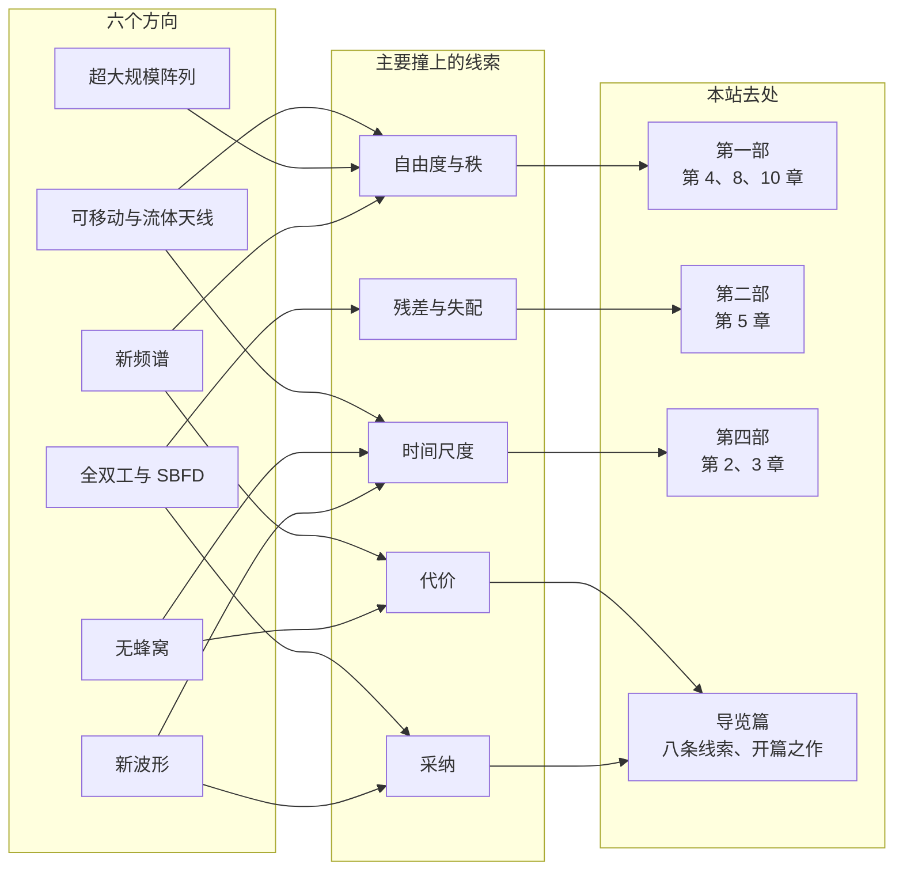

# 10 · 新概念图景（二）：可移动天线、超大阵列、无蜂窝、全双工、新波形与新频谱

[第 9 章](09-new-landscape.md)看的是"环境"怎样变成资源，主角是近场、超表面、通感一体化和语义通信。本章换一个角度，看物理层上这几年新冒出来的六个旋钮：天线放在哪里，阵列开多大的口径，接入点怎样分布，收和发能不能同时进行，数据放在哪个域里，频段往哪里搬。对应的六个方向是可移动天线与流体天线、超大规模阵列、无蜂窝、全双工、新波形和新频谱。

六节用同一套问法：新的自由度从哪里来，什么条件下它归零，要付什么代价，标准走到了哪一步。每节从一个具体的数进入，推一个关键的式子，给一个带校验的算例，再交代理论上还缺什么。

每节末尾有一张体检卡。第一行写这个方向开的是哪扇门；中间八行按[八条线索](../guide/05-eight-threads.md)的顺序逐条过一遍；最后一行给出它在生命周期里所处的阶段（存在、开门、立核、推广、饱和、轮回，阶段是本站的判断）和本站深挖的去处。格子里尽量填数或条件，哪一格填不出具体内容，往往说明这个方向在那条线索上还没想清楚。

**你将学会：**

- 用"路径数"和"调和数"估计可移动天线最多能挣多少，说清它在纯视距下为什么一分不挣；
- 用"数光斑"推出视距链路的自由度 $L_tL_r/(\lambda d)$，看出近场多流靠的是孔径，频段高只是让同样的孔径显得更大；
- 用 Sherman–Morrison 公式算出两个接入点联合接收时边缘用户的信干噪比，找到增益归零的几何条件；
- 推出全双工胜过半双工的门限 $\mathrm{INR}<\sqrt{1+\mathrm{SNR}}$，读懂子带全双工的自干扰预算；
- 推出多普勒造成的子载波间干扰 $(\pi\varepsilon)^2/3$，说清 OTFS 换来什么、付出什么，以及 OFDM 为什么留在了 6G；
- 用 Friis 公式的三种读法判断"频率越高路损越大"何时成立，说出截至 2026 年 10 月的 6G 频谱版图；
- 对照章末总表，知道每个方向该去本站哪一部深挖。

---

## 10.1 可移动天线与流体天线：让天线的位置成为变量

### 直觉：挪几厘米，换一副面孔

3.5 GHz 的波长 $\lambda=8.57$ cm，半波长 4.3 cm。[第 2 章 2.4 节](02-wireless-channel-basics.md#24-小尺度衰落从多径相量和到瑞利分布)讲过，接收信号是几十条路径的相量和，某条路径的路程变化半个波长，它的相位就转过 $\pi$，所以手机挪几厘米，接收功率就可能从深衰落跳到峰值。过去的办法是多装几根固定天线，挑最好的那根用，也就是选择分集。可移动天线（movable antenna，MA）[1][2] 换了思路：只装一根天线，让它在一小块区域里移动，停在信道最好的位置。流体天线（fluid antenna system，FAS）[5] 做的是离散版本：在一段长度里布置许多端口，在端口之间切换。天线的位置于是成了一个设计变量。两条线的来历见[开篇之作第 10 篇](../guide/03-seminal-papers.md#10-可移动天线与流体天线让天线的位置动起来)。

### 场响应模型

只看一维移动。天线在 $x\in[0,A]$ 的区域里移动，环境里有 $L$ 条路径，第 $l$ 条的复增益为 $a_l$，来向与移动轴的夹角为 $\theta_l$。天线挪动 $x$，第 $l$ 条路径的路程缩短 $x\cos\theta_l$，相位跟着变：

$$
h(x)=\sum_{l=1}^{L}a_l\,e^{\,j2\pi x\cos\theta_l/\lambda}.
$$

这是 [2][3] 所用场响应模型的一维形式。它假设移动区域比到散射体的距离小得多，各路径的幅度与来向不随位置变，变的只有相位。固定天线相当于固定一个 $x$，可移动天线在 $[0,A]$ 里挑 $x$，流体天线在 $N$ 个离散端口里挑。

### 推导一：增益的上界是路径数

先定基准。固定天线放在随机位置时，平均功率是

$$
\mathbb{E}_x|h(x)|^2=\sum_{l}|a_l|^2+\sum_{l\ne m}a_la_m^*\,\mathbb{E}_x\Big[e^{\,j2\pi x(\cos\theta_l-\cos\theta_m)/\lambda}\Big].
$$

只要两条路径的来向不同（$\cos\theta_l\ne\cos\theta_m$），位置在许多个波长的范围里变化时，交叉项的相位在 $[0,2\pi)$ 里转了很多圈，平均趋于零，只剩 $\sum_l|a_l|^2$。以它为基准，可移动天线的增益定义为

$$
G=\frac{\max_{x\in[0,A]}|h(x)|^2}{\sum_l|a_l|^2}.
$$

上界分两步。第一步用三角不等式：每一项的模都是 $|a_l|$，所以对任何 $x$ 都有 $|h(x)|\le\sum_l|a_l|$。第二步用柯西–施瓦茨不等式，把 $\sum_l|a_l|$ 看成向量 $(|a_1|,\dots,|a_L|)$ 与全 1 向量的内积，得 $\big(\sum_l|a_l|\big)^2\le L\sum_l|a_l|^2$。两步合起来

$$
G\le\frac{\big(\sum_l|a_l|\big)^2}{\sum_l|a_l|^2}\le L .
$$

第一个不等号取等号，要求区域里存在一个让所有路径同相的位置；第二个取等号，要求各路径等幅。

**物理意义**：挪天线能挣到的，至多是把 $L$ 条路径同相叠加的那一份。纯视距时 $L=1$，$G=1$，一根天线挪到哪里功率都一样。

**行为分析**：路径不等幅时上界更紧。一条视距径加两条弱反射径，功率分别为 1、0.2、0.1，上界是 $(1+\sqrt{0.2}+\sqrt{0.1})^2/1.3=3.110/1.3=2.39$，即 3.8 dB，比三条等幅径的上界 $L=3$（4.8 dB）少 1 dB。强视距加弱散射在室外很常见，可挖的空间本来就不大。

### 推导二：散射丰富时，增益按对数涨

路径很多、来向各异时，$h(x)$ 是一个瑞利衰落场。二维各向同性散射下，相距 $\Delta x$ 的两点相关系数是 $J_0(2\pi\Delta x/\lambda)$，第一个零点在 $\Delta x=0.383\lambda$（[第 2 章](02-wireless-channel-basics.md#jakes-谱从散射角分布推出浴缸曲线)在时间轴上推过同一个函数），相距半波长左右的两点可以近似看作独立。设区域里有 $M$ 个独立位置可挑，每个位置的功率（以平均功率归一）服从均值为 1 的指数分布，挑出最大的那个，期望是调和数

$$
\mathbb{E}\Big[\max_{m\le M}|h_m|^2\Big]=H_M=\sum_{k=1}^{M}\frac1k\approx\ln M+0.577 .
$$

推导用指数分布的无记忆性。把 $M$ 个样本从小到大排。最小值是 $M$ 个独立指数变量的最小值，服从速率为 $M$ 的指数分布，均值 $1/M$。在最小值出现的那一刻，其余 $M-1$ 个样本超出它的部分，由无记忆性，仍是独立的、均值为 1 的指数变量，所以第二小比最小多出的那一段是这 $M-1$ 个变量的最小值，均值 $1/(M-1)$。依此类推，最大值是 $M$ 段之和，期望为 $\frac1M+\frac1{M-1}+\cdots+1=H_M$。把顺序统计量拆成独立间隔之和的这种写法，叫 Rényi 表示。

**物理意义**：独立样本数与区域长度成正比，增益却只随 $\ln M$ 增长，区域每翻一倍，多挣的 dB 越来越少。

### 数值：四种环境，六档区域

下表是本站的蒙特卡罗仿真【本站演算】。散射丰富一列取二维各向同性散射、300 条径、一维连续移动、8000 次平均；其余三列取等幅径，来向在 $[0,\pi]$ 上均匀、初相均匀，3000 次平均。表中是平均增益 $G$ 的线性值。

| 区域长度 $A$ | 散射丰富 | 三条等幅径 | 两条等幅径 | 纯视距 |
|---|---|---|---|---|
| $0.5\lambda$ | 1.84（2.6 dB） | 1.70 | 1.59 | 1.00 |
| $1\lambda$ | 2.27（3.6 dB） | 2.01 | 1.77 | 1.00 |
| $2\lambda$ | 2.81（4.5 dB） | 2.34 | 1.85 | 1.00 |
| $4\lambda$ | 3.46（5.4 dB） | 2.61 | 1.92 | 1.00 |
| $8\lambda$ | 4.17（6.2 dB） | 2.76 | 1.95 | 1.00 |
| $16\lambda$ | 4.90（6.9 dB） | 2.87 | 1.98 | 1.00 |

散射丰富时，区域每翻一倍只多 0.7–0.9 dB。拿调和数对照：若取 $M=4A/\lambda+1$，即每 $\lambda/4$ 一个独立样本，$A=0.5\lambda$、$1\lambda$、$2\lambda$、$4\lambda$ 对应 $M=3$、5、9、17，$H_M=1.83$、2.28、2.83、3.44，与仿真相差不到 0.03；到 $16\lambda$ 时 $H_{65}=4.76$，仿真是 4.90，相差 0.14。若按半波长格点数 $M=2A/\lambda+1$ 估计，结果偏保守（$A=4\lambda$ 时只有 $H_9=2.83$），因为连续移动能停在格点之间的峰上。"每 $\lambda/4$ 一个独立样本"是从仿真里看出的规律，没有定理撑腰。少径的两列，增益向上界 $L$ 爬，越爬越慢：两条径在 $8\lambda$ 时已到 1.95，三条径到 $16\lambda$ 才 2.87。

[开篇之作第 10 篇](../guide/03-seminal-papers.md#10-可移动天线与流体天线让天线的位置动起来)引的"期望最大 SNR 约提高 10 dB"，是二维方形区域（边长 20 个波长）、20 条路径的结果。它比上表一维的数大，因为二维区域里可挑的位置多得多；它也仍在本节的上界之内：20 条路径时 $G\le20$，即 13 dB。增益按对数涨，可挑的位置要多出几个数量级，才能多挣几个 dB。

{ .chart loading=lazy }
{ .chart loading=lazy }

*怎么读这张图：横轴是天线能移动的区域长度，每格翻一倍；纵轴是平均增益的线性倍数，1 即 0 dB。第一条线是散射丰富的环境，看不出饱和，但涨得很慢，区域从 $4\lambda$ 扩到 $16\lambda$（翻两倍）只从 3.46 涨到 4.90，即 1.5 dB；第二、三条线是三条、两条等幅径，分别向上界 3 和 2 爬；第四条线是纯视距，恒为 1。数据即上表。*

### 流体天线：相关端口上的选择

流体天线的端口模型是：长 $W\lambda$ 的一段里排 $N$ 个端口，每次选信道最好的一个用。它本质上是相关分支上的选择分集。端口越密，相邻端口越相关，多加一个端口带来的新信息越少；长 $W\lambda$ 的线段上，信道场本身只有约 $2W$ 个自由度（[第一部第 4 章](../part1/04-spatial-structure.md#三位一体λ2-采样相干距离与自由度密度)的 $2L/\lambda$），端口再多，也只是在这几个维度里挑得更细。早期文献用的端口相关模型偏乐观，算出的中断概率随端口数下降得很快；Khammassi 等 2023 [6] 换用更准确的相关模型，算出的增益明显变小。引用流体天线早期的数字时，要带上这条说明。

流体天线还有一个多址的用法，叫流体天线多址（FAMA）[34]：每个用户各自挑一个端口，那里其他用户的干扰恰好落进深衰落，用户间的干扰就被压了下去。基站不必知道信道，也不做预编码；每个用户只需知道自己各端口上的有用信道。

### 多根天线与多个用户

多根可移动天线时，挪位置改变的是整个信道矩阵的奇异值，Ma 等 [3] 用交替优化刻画了这时的 MIMO 容量。多用户时，可以把天线挪到用户之间信道相关性小的位置，压低用户间干扰（Zhu 等 [4]）。两类位置优化都高度非线性，现有算法只保证局部最优。

### 级联信道的秩

[第 5 章 5.5 节末的提示框](05-mimo.md#55-mimo-容量与自由度从-logdet-到-minn_tn_rlogmathrmsnr)证明过 $\operatorname{rank}(\mathbf{H}_2\boldsymbol{\Theta}\mathbf{H}_1)\le\min(\operatorname{rank}\mathbf{H}_1,\operatorname{rank}\mathbf{H}_2)$。用它看可移动天线：超表面帮一个单天线用户时，等效信道 $\mathbf{h}_r^H\boldsymbol{\Theta}\mathbf{H}_t$ 是一个行向量，秩至多为 1，基站端的天线怎么挪都变不出第二个流；基站到超表面若是视距，$\mathbf{H}_t$ 秩为 1，在用户侧挪天线也一样。只动一端，救不了另一段卡住的秩。

### 时间尺度与信息结构

[第 2 章"两种慢"的提示框](02-wireless-channel-basics.md#相干时间)算过：要追上步行下的小尺度衰落，得在约 26 ms 的相干时间里挪过半个波长，滑台速度要 $0.0428/0.026=1.65$ m/s 以上。机械结构很难又快又省电，自然的设计是两时间尺度：慢层按统计信道或大尺度几何调位置，快层按瞬时信道调预编码。电子切换的流体天线不用搬动任何东西，可以快得多。

信息结构上，选位置要知道整片区域里的 $h(x)$，天线却只能在它当前所在的位置测量。可行的办法是借场响应模型，从少量位置上的测量估出各路径的角度和增益，再外推到整片区域。这是一个逆问题（[第一部第 6 章](../part1/06-inverse-problem.md)）：路径越多、区域越大，要估的参数越多，测量开销越大，可能把增益吃掉一块。

### 算例

!!! example "算例 10-1：在 34 厘米里挪一根天线"
    3.5 GHz，区域长 $4\lambda=34$ cm。散射丰富时平均增益 3.46，即 5.4 dB；换个说法，固定天线要把发射功率提高 $10^{0.54}=3.5$ 倍，才能拿到同样的平均 SNR。三条等幅径时平均 2.61（4.2 dB），上界 $L=3$（4.8 dB），已拿到上界的 87%。一强两弱的三径（功率 1、0.2、0.1），上界只有 3.8 dB。纯视距 0 dB。

    作为基线，同一块区域按半波长能放 9 根固定天线。只用一条射频链、挑最好的一根，按 9 个独立样本估是 $H_9=2.83$，即 4.5 dB，比可移动天线少 0.9 dB；9 根天线做最大比合并，平均 SNR 是单根的 9 倍，即 9.5 dB，但要 9 条射频链。

    校验：散射丰富时取 $M=4\times4+1=17$，$H_{17}=3.44$（5.4 dB），与仿真的 3.46 一致；纯视距由 $G\le L=1$ 直接得 0 dB；9 根天线选一按 $\ln9+0.577=2.77$ 粗估也在 4.4 dB 上下。

### 标准与理论空白

截至 2026 年 10 月，3GPP 没有关于可移动天线或流体天线的研究项目或工作项目，6G 研究项目 RP-251881 的范围里也没有它【本站判断：据 RP-251881 范围】[30]。理论上最缺的是判据：区域多大、天线多少、环境散射多丰富时才值得动。本站把增益上限归到区域里信道场的有效维度【本站提法】，这还没有定理，第一部第 8 章的有效维度问题是它的数学入口。

!!! abstract "体检卡 · 可移动天线与流体天线"

    | 检查项 | 结果 |
    |---|---|
    | 开的是哪扇门 | 天线位置成为设计变量，在一块区域里挑信道最好的点 |
    | 时间尺度 | 追步行下的小尺度衰落需滑台速度 1.65 m/s 以上；机械移动只宜按统计信道调位置（两时间尺度），电子切换的流体天线可快得多 |
    | 信息结构 | 要知道整片区域的信道场，天线只能在当前位置测；靠场响应模型从少量测量外推，是一个逆问题 |
    | 自由度与秩 | 单天线增益不超过径数 $L$；散射丰富时按 $\ln(4A/\lambda)$ 涨，$4\lambda$ 区域 5.4 dB；级联信道里只动一端救不了另一段的秩 |
    | 残差与失配 | 位置误差；场模型失配（径数或角度估错时，外推出的峰不在真峰上）；流体天线的端口相关模型偏乐观 |
    | 代价 | 机械结构、驱动能耗、移动时延，以及为外推整片信道场付出的测量开销 |
    | 采纳（截至 2026-10） | 无 3GPP 研究或工作项目，6G 研究项目 RP-251881 的范围里也没有【本站判断】 |
    | 极限与基线 | 同一块 $4\lambda$ 区域放 9 根固定天线：单射频链选最好的一根约 4.5 dB，9 路最大比合并约 9.5 dB |
    | 任务与价值 | 信道准静态、散射丰富的场景：固定无线接入、物联网、室内；纯视距与高速移动几乎无利可图 |
    | 阶段与去处 | 开门之后的上升段【本站判断】；[第一部第 4 章](../part1/04-spatial-structure.md#三位一体λ2-采样相干距离与自由度密度)（$\lambda/2$ 与自由度密度）、[第一部第 8 章 Q1](../part1/08-dimension-and-prediction.md#q1-的形式化有效维度与环境等价类)（有效维度） |

---

## 10.2 超大规模阵列：自由度从孔径里来

[第 9 章 9.2 节](09-new-landscape.md#92-近场通信球面波的回归)讲了瑞利距离和按距离聚焦；[第一部第 4 章](../part1/04-spatial-structure.md#散射几何的自由度从-buccifranceschetti-到-miller)从 Miller 的算子奇异值分解出发，严格讲过两块孔径之间的自由度 $N\approx A_tA_r/(\lambda d)^2$、Landau 相变，以及"瑞利距离不是自由度跳变点"的陷阱。本节只做本科生的版本：用"数光斑"推出一维的计数，拿一张数值表验证它，再讲阵列做大以后冒出来的空间非平稳。

### 直觉：视距也能多流吗

两块 1 m 长的线阵面对面平行放置，相距 10 m，中间只有视距，能同时传几路数据？[第 5 章 5.5 节](05-mimo.md#55-mimo-容量与自由度从-logdet-到-minn_tn_rlogmathrmsnr)的远场直觉说，视距信道 $\mathbf{H}=\mathbf{a}_r\mathbf{a}_t^H$ 秩为 1，只能传一路。可在 28 GHz 下，答案是 9 路左右。远场直觉在这里失效，原因是 10 m 对 1 m 的孔径而言太近，波前的弯曲不能忽略。

### 推导：数光斑

发射孔径长 $L_t$，发射点坐标 $x\in[-L_t/2,L_t/2]$；接收孔径长 $L_r$，接收点坐标 $y$；两块孔径平行，相距 $d$。用第 9 章 9.2 节的菲涅耳展开，发射点 $x$ 到接收点 $y$ 的距离为

$$
r=\sqrt{d^2+(x-y)^2}\approx d+\frac{(x-y)^2}{2d}=d+\frac{x^2}{2d}-\frac{xy}{d}+\frac{y^2}{2d},
$$

第一步用了 $\sqrt{1+u}\approx1+u/2$（$u=(x-y)^2/d^2\ll1$），第二步把平方展开。

传播相位是 $e^{-j2\pi r/\lambda}$。让发射孔径聚焦：给发射点 $x$ 乘上 $e^{\,j\pi x^2/(\lambda d)}$，正好抵消 $x^2/(2d)$ 那一项（第 9 章的相位共轭）。$d$ 与 $y^2/(2d)$ 两项对所有发射点都一样，只贡献公共相位。剩下同时依赖 $x$ 和 $y$ 的只有交叉项 $-xy/d$，它带来的相位是 $e^{\,j2\pi xy/(\lambda d)}$。孔径上各点等幅发射时，接收面上的场为

$$
E(y)\propto\int_{-L_t/2}^{L_t/2}e^{\,j2\pi xy/(\lambda d)}\,dx=L_t\,\operatorname{sinc}\!\Big(\frac{L_t\,y}{\lambda d}\Big),
$$

其中 $\operatorname{sinc}(u)=\sin(\pi u)/(\pi u)$；积分用了 $\int_{-a}^{a}e^{jbx}\,dx=2\sin(ab)/b$，取 $a=L_t/2$、$b=2\pi y/(\lambda d)$。

这个 sinc 的第一个零点在 $y=\lambda d/L_t$：长 $L_t$ 的孔径在距离 $d$ 处能聚出的最小光斑，宽度约 $\lambda d/L_t$，这就是衍射极限。给发射相位再叠加一个线性项，光斑就平移到接收面上别的位置，形状不变；相邻光斑错开 $\lambda d/L_t$ 时，一个的峰正落在另一个的零点上，两者正交。长 $L_r$ 的接收孔径上能摆下的光斑数为

$$
N\approx\frac{L_r}{\lambda d/L_t}=\frac{L_tL_r}{\lambda d}.
$$

每个光斑是一条可以独立使用的空间通道。换成两块面积为 $A_t$、$A_r$ 的方形孔径，两个方向各数一遍再相乘，得 $A_tA_r/(\lambda d)^2$，回到 Miller 的公式 [7]。

### 数值校验

对精确的球面波视距信道（阵元按 $\lambda/2$ 排，不做菲涅耳近似）做奇异值分解，数占总能量 90% 的奇异值个数【本站演算】：

| 频率 | $L_t=L_r$ | $d$ | $L_tL_r/(\lambda d)$ | 占 90% 能量的奇异值个数 |
|---|---|---|---|---|
| 28 GHz | 1 m | 10 m | 9.34 | 9 |
| 28 GHz | 1 m | 100 m | 0.93 | 2（一个主模式） |
| 3.5 GHz | 1 m | 10 m | 1.17 | 2 |
| 3.5 GHz | 4 m | 10 m | 18.7 | 17 |
| 7 GHz | 2 m | 10 m | 9.34 | 9 |
| 100 GHz | 1 m | 10 m | 33.4 | 31 |

第一行的奇异值分布值得多看一眼：前七个各占约 10.6% 的能量，第八、九个占 10.3% 和 8.7%，之后迅速降到 4.9%、1.5%。先是一段平台，再是一个陡坡，和第一部第 4 章讲的 Landau 相变是一个样子。第二行公式值 0.93，第一个奇异值占 80%，第二个占 19%，是一个主模式加一个弱模式。

### 物理意义与行为分析

**物理意义**：自由度等于一端的孔径在另一端能分出多少个光斑。频率只通过 $\lambda$ 进来：28 GHz 配 1 m 孔径与 7 GHz 配 2 m 孔径的自由度相同，都是 9.34。**近场多流靠的是孔径相对 $\sqrt{\lambda d}$ 足够大，频段高只是让同样的孔径显得更"大"。**

**行为分析**：$N$ 与距离成反比。两端孔径都是 $D$ 时，$N=1$ 出现在 $d=D^2/\lambda$，恰好是第 9 章瑞利距离 $d_R=2D^2/\lambda$ 的一半，所以到了瑞利距离之外，视距信道基本只剩一个自由度。不过 $N(d)$ 是连续变化的，瑞利距离只是相位误差的判据，自由度并不在那里突然跳变（第一部第 4 章的陷阱框）。散射稀疏的多径环境里，自由度还要按角谱占据的方向余弦范围打折扣（Poon 等 2005 [8]，即第一部第 4 章的定理 4.5）。

{ .chart loading=lazy }
{ .chart loading=lazy }

*怎么读这张图：横轴是收发距离，每格翻一倍；纵轴是自由度。第一条线是 28 GHz、两端各 1 m 时公式 $L_tL_r/(\lambda d)$ 的值，第二条线是同一几何下精确球面波信道占 90% 能量的奇异值个数，第三条线是 3.5 GHz、两端各 1 m 的公式值。前两条线在公式值大于 4 时差不到 2；公式值降到 1 附近，按 90% 能量数出的个数比公式多一些，因为第二个弱模式还占着两成上下的能量；公式值跌到 1 以下，实际仍有 1 个模式，那就是视距本身。第三条线在 10 m 处只有 1.17：孔径相同，频率低 8 倍，能分出的光斑就少 8 倍。*

### 比 λ/2 更密不加自由度

光斑宽度 $\lambda d/L_t$ 由孔径决定，与孔径上放多少个阵元无关。阵元间距小于 $\lambda/2$ 以后，多出的阵元只是把同一个光斑描得更细，光斑本身窄不了。第一部第 4 章算过，3.5 GHz 下 1 m² 的面孔径按半波长要 545 个阵元，独立维度只有 428 个。超指向性能在理论上把波束收得比衍射极限更窄，代价是相邻阵元的电流又大又近乎反相，靠剧烈的相互抵消成形，对误差和损耗极其敏感，工程上基本不用。由此得到一个可行性判据：要求一组天线在目标区域合成某个场，场的细节不能小于 $\lambda d/L_t$；能合成的场落在一个约 $L_tL_r/(\lambda d)$ 维的空间里，超出这个维数的要求，加天线也满足不了【本站整理】。

### 空间非平稳

阵列做大还带来另一件事。3.5 GHz 下 10 m 长的线阵（比如铺满一面墙），按半波长约 234 个阵元，瑞利距离 $2\times10^2/0.0857\approx2.3$ km，整个小区都在它的近场里。更麻烦的是，阵列的不同部分"看到"的环境不同：左端看得见的散射体，右端可能被楼挡住；同一个用户的能量主要落在阵列的一段上，这一段叫可视区域（visibility region）。沿着阵列，信道的统计特性不再处处相同，这叫空间非平稳 [9]。

后果有两个。一是处理可以按子阵分开做：每个用户只在自己的可视区域里检测和预编码，既省算力，也合乎物理。二是信道估计变难：远场时每条路径只要一个角度参数，近场里要角度和距离两个；Cui–Dai 2022 [10] 为此提出在角度和距离上同时采样的"极域"码本，码本与导频开销都随之膨胀。

### 算例

!!! example "算例 10-2：两种配置，同一个自由度"
    28 GHz（$\lambda=1.071$ cm），两端各 1 m，相距 10 m：$N=1\times1/(0.01071\times10)=9.34$，精确信道的奇异值分解给出 9 个主模式。7 GHz（$\lambda=4.283$ cm），两端各 2 m，相距 10 m：$N=2\times2/(0.04283\times10)=9.34$，同样是 9 个。频率降到四分之一、孔径加倍，$L_tL_r/\lambda$ 不变，自由度也不变。

    10 m 长的墙面阵，3.5 GHz：阵元数 $10/0.0428\approx234$，瑞利距离约 2.3 km。

    校验：两种配置的 $L_tL_r/\lambda$ 分别是 $1/0.01071=93.4$ m 与 $4/0.04283=93.4$ m，相同，再除以 $d=10$ m 都得 9.34；把距离拉到 $d=D^2/\lambda$（28 GHz、1 m 时为 93.4 m），公式值恰为 1，与上表 100 m 处的 0.93 衔接。

### 标准与理论空白

截至 2026 年 10 月，超大阵列进标准的第一步是信道模型。Rel-19 的 7–24 GHz 信道建模研究（RP-234018）没有单独的技术报告号，结果并入 TR 38.901 的 Rel-19 版本，新增了近场模型（§7.6.13）和空间非平稳模型（§7.6.14）[28]。有了统一的信道模型，各家方案才能拿同一把尺子比较。

理论上，第一部第 4 章列的两个开放问题与本节直接相关：非平稳场的自由度与采样理论，以及非傍轴、任意取向几何下的有效自由度。本节的光斑计数默认两块孔径平行、正对、傍轴；用户偏到一边、孔径斜着放时怎样修正，还没有统一的闭式答案。

!!! abstract "体检卡 · 超大规模阵列"

    | 检查项 | 结果 |
    |---|---|
    | 开的是哪扇门 | 孔径成为自由度的来源：近距离视距也能多流，28 GHz 下 1 m 对 1 m、相距 10 m 约 9 路 |
    | 时间尺度 | 用户的距离与角度随位置慢变，比小尺度衰落慢得多，可按几何跟踪；用户一动焦点就偏，聚焦要跟着位置走 |
    | 信息结构 | 要知道用户的角度与距离，近场码本是角度×距离二维；还要知道每个用户落在阵列的哪段可视区域 |
    | 自由度与秩 | $L_tL_r/(\lambda d)$，随距离反比下降，$d=D^2/\lambda$ 处降到 1；阵元比 $\lambda/2$ 更密不加自由度 |
    | 残差与失配 | 阵列校准误差把光斑抹宽；用平稳模型处理非平稳阵列、用远场码本处理近场用户，都会失配 |
    | 代价 | 射频链数与功耗随阵元数涨（3.5 GHz 下 10 m 墙面阵约 234 个阵元）；二维码本的估计开销 |
    | 采纳（截至 2026-10） | 信道模型先行：TR 38.901 Rel-19 版新增近场（§7.6.13）与空间非平稳（§7.6.14）模型 |
    | 极限与基线 | 同孔径的传统大规模 MIMO（远场码本）；用户在 $d>D^2/\lambda$ 时两者差别很小 |
    | 任务与价值 | 近距离高容量：室内热点、场馆、无线回传；远距离的广域覆盖拿不到多流 |
    | 阶段与去处 | 推广【本站判断】；[第一部第 4 章](../part1/04-spatial-structure.md#两个修正方向近场增益与角谱稀疏采样)、[第一部第 10 章 Q1](../part1/10-research-agenda.md#q1--静力学的接口电磁信息论) |

---

## 10.3 无蜂窝与分布式 MIMO：拆掉小区的边界

### 直觉：站在两个基站中间的人

[第 6 章 6.1 节](06-wireless-networks.md#推导小区边缘的-sir-闭式估计)算过小区边缘的信干比。最不利的位置是正好站在两个基站中间：服务基站的信号与邻站的干扰一样强，信干比约 0 dB，调度再好，也只能在时间或频率上把两个用户错开。无蜂窝（cell-free）的想法是不再划分小区，让许多接入点（access point，AP）一起服务每个用户 [11]。邻站收到的信号也被收进来一起处理，原来的干扰于是成了有用信号的一部分。开篇论文的拆解见[开篇之作第 9 篇](../guide/03-seminal-papers.md#9-ngo-等-2017不要小区了)。

### 模型

最小的例子：两个单天线 AP，两个单天线用户，看上行。用户 $k$ 以功率 $P$ 发送符号 $s_k$，它到两个 AP 的信道收成一个向量 $\mathbf{h}_k\in\mathbb{C}^2$，两个 AP 收到

$$
\mathbf{y}=\sqrt{P}\,\mathbf{h}_1s_1+\sqrt{P}\,\mathbf{h}_2s_2+\mathbf{n},\qquad \mathbf{n}\sim\mathcal{CN}(\mathbf{0},\sigma^2\mathbf{I}).
$$

取边缘的对称情形：四条 AP–用户链路的幅度都是 $a$，每条链路单独的信噪比都是 $\gamma=Pa^2/\sigma^2=100$（20 dB）。

### 推导：联合接收的信干噪比

蜂窝的做法：AP1 只解用户 1，把用户 2 当干扰，

$$
\mathrm{SINR}^{\mathrm{cell}}=\frac{Pa^2}{Pa^2+\sigma^2}=\frac{\gamma}{\gamma+1}.
$$

无蜂窝的集中处理：两个 AP 把收到的信号送到中央处理器（central processing unit，CPU），做线性合并 $\mathbf{w}^H\mathbf{y}$。对用户 1 而言，干扰加噪声的协方差是 $\mathbf{R}=P\mathbf{h}_2\mathbf{h}_2^H+\sigma^2\mathbf{I}$，合并后的信干噪比是 $P|\mathbf{w}^H\mathbf{h}_1|^2/(\mathbf{w}^H\mathbf{R}\mathbf{w})$。令 $\mathbf{v}=\mathbf{R}^{1/2}\mathbf{w}$，它变成 $P|\mathbf{v}^H\mathbf{R}^{-1/2}\mathbf{h}_1|^2/\|\mathbf{v}\|^2$，由柯西–施瓦茨不等式不超过 $P\|\mathbf{R}^{-1/2}\mathbf{h}_1\|^2$，在 $\mathbf{w}\propto\mathbf{R}^{-1}\mathbf{h}_1$ 时取等号，这正是 MMSE 合并的方向 [23]。于是

$$
\mathrm{SINR}_1=P\,\mathbf{h}_1^H\mathbf{R}^{-1}\mathbf{h}_1 .
$$

求逆用 Sherman–Morrison 公式：对可逆矩阵 $\mathbf{A}$ 与向量 $\mathbf{u}$，$(\mathbf{A}+\mathbf{u}\mathbf{u}^H)^{-1}=\mathbf{A}^{-1}-\dfrac{\mathbf{A}^{-1}\mathbf{u}\mathbf{u}^H\mathbf{A}^{-1}}{1+\mathbf{u}^H\mathbf{A}^{-1}\mathbf{u}}$。取 $\mathbf{A}=\sigma^2\mathbf{I}$、$\mathbf{u}=\sqrt{P}\mathbf{h}_2$：分子是 $P\mathbf{h}_2\mathbf{h}_2^H/\sigma^4$，分母是 $1+P\|\mathbf{h}_2\|^2/\sigma^2=(\sigma^2+P\|\mathbf{h}_2\|^2)/\sigma^2$，两者相除再从 $\mathbf{I}/\sigma^2$ 里减去，得

$$
\mathbf{R}^{-1}=\frac{1}{\sigma^2}\Big[\mathbf{I}-\frac{P\mathbf{h}_2\mathbf{h}_2^H}{\sigma^2+P\|\mathbf{h}_2\|^2}\Big].
$$

把它夹在 $\mathbf{h}_1^H$ 与 $\mathbf{h}_1$ 之间，注意 $\mathbf{h}_1^H\mathbf{h}_2\mathbf{h}_2^H\mathbf{h}_1=|\mathbf{h}_2^H\mathbf{h}_1|^2$：

$$
\begin{aligned}
\mathrm{SINR}_1&=\frac{P}{\sigma^2}\Big[\|\mathbf{h}_1\|^2-\frac{P|\mathbf{h}_2^H\mathbf{h}_1|^2}{\sigma^2+P\|\mathbf{h}_2\|^2}\Big]\\[4pt]
&=\frac{P\|\mathbf{h}_1\|^2}{\sigma^2}\left[1-|\rho|^2\,\frac{P\|\mathbf{h}_2\|^2/\sigma^2}{1+P\|\mathbf{h}_2\|^2/\sigma^2}\right],\qquad \rho=\frac{\mathbf{h}_1^H\mathbf{h}_2}{\|\mathbf{h}_1\|\|\mathbf{h}_2\|}.
\end{aligned}
$$

第二行提出了 $\|\mathbf{h}_1\|^2$，把 $|\mathbf{h}_2^H\mathbf{h}_1|^2$ 写成 $|\rho|^2\|\mathbf{h}_1\|^2\|\mathbf{h}_2\|^2$，再把分式的分子分母同除以 $\sigma^2$。$|\rho|$ 是两个用户信道向量夹角的余弦，$|\rho|^2$ 度量它们在空间上有多"共线"。

**物理意义**：联合处理把两个 AP 收到的能量都收了进来，$\|\mathbf{h}_1\|^2=2a^2$，有用信号比单个 AP 多一倍；损失的只是用户 2 与用户 1 共线的那一部分，比例由 $|\rho|^2$ 决定。

**行为分析**：$|\rho|^2\to0$ 时两用户信道正交，方括号趋于 1，信干噪比为 $2\gamma=200$，是单链路的两倍，而且没有干扰。$|\rho|^2\to1$ 时两用户在空间上分不开，方括号趋于 $1/(1+2\gamma)$，信干噪比趋于 $2\gamma/(1+2\gamma)\approx1$，退回蜂窝的 0 dB，这也是推导的一个校验。两用户信道的相位随机时，设 $\mathbf{h}_1=a[e^{j\alpha_1},e^{j\alpha_2}]^T$、$\mathbf{h}_2=a[e^{j\beta_1},e^{j\beta_2}]^T$，则 $|\mathbf{h}_1^H\mathbf{h}_2|^2=a^4|1+e^{j\Delta}|^2=4a^4\cos^2(\Delta/2)$，其中 $\Delta=(\beta_2-\alpha_2)-(\beta_1-\alpha_1)$，所以 $|\rho|^2=\cos^2(\Delta/2)$，$\Delta$ 均匀分布时平均为 1/2。

| 情形 | SINR | 速率（b/s/Hz） |
|---|---|---|
| 蜂窝，边缘用户 | 0.990（−0.04 dB） | 0.99 |
| 无蜂窝，$\lvert\rho\rvert^2=0$ | 200（23.0 dB） | 7.65 |
| 无蜂窝，$\lvert\rho\rvert^2=0.5$ | 100.5（20.0 dB） | 6.67 |
| 无蜂窝，$\lvert\rho\rvert^2=0.9$ | 20.9（13.2 dB） | 4.45 |
| 无蜂窝，$\lvert\rho\rvert^2=1$ | 0.995（−0.02 dB） | 1.00 |
| 无蜂窝，对随机相位平均 | 中位数 20.0 dB | 平均 5.93 |

{ .chart loading=lazy }
{ .chart loading=lazy }

*怎么读这张图：横轴是两用户信道的共线程度 $|\rho|^2$，纵轴是用户 1 的速率。第一条线是无蜂窝的集中 MMSE，第二条线是蜂窝，水平的 0.99。第一条线在 $|\rho|^2\le0.8$ 时都在 5.4 以上，到 0.9 还有 4.45，最后一段才陡落：$|\rho|^2=1$ 时两个用户的信道向量完全平行，MMSE 再也分不开它们，只能退回蜂窝的水平。相位随机时 $|\rho|^2$ 落在 0.9 以上的概率约 20%，所以平均速率 5.93 比 $|\rho|^2=0.5$ 处的 6.67 低一截。*

### OFDM 帮了什么

下行联合发送时，不同 AP 的信号到达用户的时刻不同。只要 AP 之间的时延差加上多径时延扩展落在循环前缀之内，时延差在每个子载波上只表现为一个随频率线性变化的相位，被信道估计一并吸收，每个子载波上看到的仍是一个平坦的合成信道，分布各处的 AP 就能像一个大阵列那样协同（[第 3 章 3.7 节](03-digital-communications.md#第三步循环前缀cp最后一块拼图)，[第 5 章 5.4 节末](05-mimo.md#54-mimo-信道矩阵与-svd把矩阵信道拆成并行子信道)的提示框）。NR 常规循环前缀长 $144\kappa\cdot2^{-\mu}T_c$，其中 $\kappa=64$，$T_c=1/(480000\times4096)$ s，算出来是 $4.6875/2^{\mu}$ μs（TS 38.211 §5.3.1 [32]）。乘以光速换成路程差：

| 子载波间隔 | 循环前缀 | 对应路程差 |
|---|---|---|
| 15 kHz | 4.69 μs | 1405 m |
| 30 kHz | 2.34 μs | 703 m |
| 60 kHz | 1.17 μs | 351 m |
| 120 kHz | 0.59 μs | 176 m |

表中按 $c=2.998\times10^8$ m/s 与精确值 $4.6875/2^{\mu}$ μs 计算；第 3 章取 2.34 μs 与 $3\times10^8$ m/s 得 702 m，差别只在舍入。例如用户距 AP1 100 m、距 AP2 500 m，路程差 400 m，即 1.33 μs，30 kHz 时还剩约 1 μs 留给多径；换到毫米波常用的 120 kHz，整个循环前缀只容得下 176 m 的路程差，AP 必须布得更密，或者按 AP 分别调整发送定时。

### 前传、分簇与信息结构

集中 MMSE 要把所有 AP 收到的信号（或者信道估计加数据）送到中央处理器，前传容量是实打实的代价：[第 6 章 6.8 节](06-wireless-networks.md#从宏站到-open-ran)的 C-RAN 算例里，传原始采样的前传流量是用户数据的 8–9 倍。AP 和用户一多，人人由全部 AP 服务就扩展不下去。可扩展的做法是以用户为中心：每个用户只由附近几个 AP 组成的簇服务，使每个 AP 的计算量和前传负担不随网络里的用户总数增长 [12]；同年的另一篇 [13] 比较了集中处理与各 AP 本地处理，集中式 MMSE 明显更好。

集中还是本地，谁在什么时候知道哪些信道，本身就是信息结构问题。[第四部第 2 章](../part4/02-team-decision-theory.md#21-两个消防队一场火)从团队决策讲起；[第四部第 3 章 3.5 节](../part4/03-information-structure-phase-diagram.md#35-两小区comp-的工程常识是一条相边界)在一个两小区模型里证明，回传时延不超过被协调量的耦合时标，协作设计问题才是凸的（命题 3.8【本站演算】）。

### 算例

!!! example "算例 10-3：边缘用户能多拿多少"
    每条链路 $\gamma=100$。蜂窝：$\mathrm{SINR}=100/101=0.990$，速率 $\log_2(1.990)=0.99$ b/s/Hz。无蜂窝：$\|\mathbf{h}_k\|^2/a^2=2$，$P\|\mathbf{h}_2\|^2/\sigma^2=200$，代入得 $\mathrm{SINR}_1=200\,[1-|\rho|^2\times200/201]$。$|\rho|^2=0$ 时 200，速率 7.65；$|\rho|^2=0.5$ 时 100.5，速率 6.67；相位随机时中位数 20.0 dB，平均速率 5.93，是蜂窝的 6 倍。

    循环前缀：路程差 400 m 即 1.33 μs，30 kHz 的 2.34 μs 余下约 1.0 μs；120 kHz 时 176 m 就是上限。

    校验：$|\rho|^2=0.5$ 时 $200\times(1-0.4975)=100.5$；$|\rho|^2=1$ 时 $200/201=0.995$，与蜂窝的 0.990 几乎相同，两个极限都对。

### 标准与理论空白

截至 2026 年 10 月，产业界以多发送接收点（multi-TRP）的形式部分吸收了这个想法。Rel-16/17 支持多 TRP 传输；Rel-18 把 Rel-16/17 的增强型 Type II 码本扩展到多 TRP 的相干联合传输（coherent joint transmission，CJT），让终端为多个 TRP 联合反馈信道 [14]。

理论上最值得问的是：只用局部信息、局部协调能做到多好，什么条件下分布式处理不比集中处理差多少。命题 3.8 只在两小区、一阶模型里成立，一般拓扑和时延下的完整边界还没有定理（第四部第 3 章的猜想 3.12）。相干联合传输还要求各 AP 的载波相位对齐，同步误差怎样折算成性能损失，是部署的硬约束。

!!! abstract "体检卡 · 无蜂窝与分布式 MIMO"

    | 检查项 | 结果 |
    |---|---|
    | 开的是哪扇门 | 邻站的信号从干扰变成有用信号：边缘用户的 SINR 从约 0 dB 升到中位数 20 dB（算例 10-3） |
    | 时间尺度 | 联合处理要在相干时间内拿到全部信道；回传时延对耦合时标之比决定协作设计能否凸（第四部命题 3.8） |
    | 信息结构 | 集中 MMSE 要所有 AP 的信号汇到一处；以用户为中心的分簇只用局部信息，性能介于集中与各自为政之间 |
    | 自由度与秩 | 空间可分性 $1-\lvert\rho\rvert^2$：两用户信道共线（$\lvert\rho\rvert^2\to1$）时增益归零 |
    | 残差与失配 | AP 间定时差加多径须落在循环前缀内（30 kHz 对应 703 m 路程差）；载波相位同步误差；导频污染 |
    | 代价 | 前传容量（传原始采样是用户数据的 8–9 倍）、同步、站址与布线 |
    | 采纳（截至 2026-10） | Rel-16/17 多 TRP 传输；Rel-18 把增强型 Type II 码本扩展到多 TRP 相干联合传输 |
    | 极限与基线 | 小小区各自为政：Ngo 等 2017 的数值例里，无蜂窝 95% 用户的下行速率约为小小区的 6.7 倍；蜂窝加干扰协调 |
    | 任务与价值 | 均匀的服务质量与边缘速率，不追峰值速率 |
    | 阶段与去处 | 推广，产业以多 TRP 的形式部分吸收【本站判断】；[开篇之作第 9 篇](../guide/03-seminal-papers.md#9-ngo-等-2017不要小区了)、[第四部第 2 章](../part4/02-team-decision-theory.md#21-两个消防队一场火)、[第四部第 3 章](../part4/03-information-structure-phase-diagram.md#35-两小区comp-的工程常识是一条相边界) |

---

## 10.4 全双工与子带全双工：一边说一边听的账

### 直觉：自己的声音太响

对讲机按下按键说话时听不见对方。手机把收和发分到不同的时隙（TDD）或不同的频段（FDD），绕开了这个问题。如果同一频率上同时收发，频谱效率能不能翻倍？难处在于自己的声音太响：发射天线就在接收天线旁边，自己发出的信号比要收的远端信号强一百多个 dB。

### 要压多少

把自干扰压到接收机的噪声底，需要的抑制量是

$$
\text{所需抑制（dB）}=P_{\mathrm{tx}}-\big(-174+10\log_{10}B+\mathrm{NF}\big),
$$

括号里是噪声底（dBm）：$-174$ dBm/Hz 是室温热噪声的功率谱密度，$B$ 是带宽（Hz），NF 是噪声系数（dB）。

| 节点 | 发射功率 | 带宽 / 噪声系数 | 噪声底 | 所需抑制 |
|---|---|---|---|---|
| 宏站 | 46 dBm | 20 MHz / 5 dB | −96.0 dBm | 142 dB |
| 宏站 | 46 dBm | 100 MHz / 5 dB | −89.0 dBm | 135 dB |
| 小站 | 24 dBm | 20 MHz / 7 dB | −94.0 dBm | 118 dB |
| 终端 | 23 dBm | 20 MHz / 9 dB | −92.0 dBm | 115 dB |

142 dB 是 $10^{14.2}=1.6\times10^{14}$ 倍的功率比。

### 为什么要分级抵消

模数转换器（ADC）的动态范围约为 $6.02b+1.76$ dB，$b$ 是位数：12 位约 74 dB，14 位约 86 dB。一百多 dB 的自干扰若不先压下去就进 ADC，要么把 ADC 推进饱和，要么把远端的弱信号埋进量化噪声，数字域再聪明也减不回来。所以抵消必须分级：先靠天线隔离（传播域）压低自干扰，再在模拟域减掉一部分，把剩下的压进 ADC 的动态范围，最后在数字域减掉线性和非线性的残余。

Bharadia 等 2013 [16] 的单天线原型把这条链做通了：一根天线靠环形器收发共用，跑标准 Wi-Fi 物理层，发射 20 dBm、噪底 −90 dBm，需要 110 dB 的抑制。他们论证模拟级至少要约 60 dB，否则 ADC 会饱和；实测在 80 MHz 带宽下达到 110 dB，其中模拟级约 62 dB，数字级的线性抵消约 48 dB，两者合起来正好 110 dB。功放产生的谐波等非线性分量需要约 80 dB 的抑制，模拟级的 62 dB 加上数字级约 16 dB 的非线性抵消，合计约 78 dB，与所需相当【本站整理】。

### 环境回波

传播域的隔离不只取决于天线本身。Sabharwal 等的综述 [15] 引用 Everett 等的实验：同样的天线布置，在消声室里被动隔离可达 74 dB，搬进高反射的室内办公环境只剩 46 dB，差出的 28 dB 来自环境把自己的信号反射了回来。

估一个量级。宏站发 46 dBm，50 m 外的楼墙把信号反射回来，往返 100 m。3.5 GHz 下 100 m 的自由空间损耗是 $20\log_{10}(4\pi\times100/0.0857)=83.3$ dB，再假设反射损耗 8 dB，回波约 $46-83.3-8=-45.3$ dBm，比 20 MHz 的噪声底 −96 dBm 高约 51 dB。车和人在动，回波跟着变，数字抵消器必须持续跟踪；抵消后的残差随环境变化，[残差与失配](../guide/05-eight-threads.md#4-残差与失配结论经得起不完美吗)那条线索说的就是这件事。

### 推导：全双工什么时候胜过半双工

考虑对称的双向链路，两端峰值功率相同。全双工时每个方向的速率是 $\log_2\!\big(1+\frac{\mathrm{SNR}}{1+\mathrm{INR}}\big)$，INR 是抵消后的残余自干扰与噪声之比，残余自干扰当作额外的高斯噪声；半双工分时，每个方向占一半时间，速率为 $\frac12\log_2(1+\mathrm{SNR})$。记 $S=\mathrm{SNR}$、$I=\mathrm{INR}$，要求前者大于后者：

$$
\begin{aligned}
\log_2\!\Big(1+\frac{S}{1+I}\Big)>\frac12\log_2(1+S)
&\iff 1+\frac{S}{1+I}>\sqrt{1+S}\\[4pt]
&\iff 1+I<\frac{S}{\sqrt{1+S}-1}=\frac{S\,(\sqrt{1+S}+1)}{(1+S)-1}=\sqrt{1+S}+1 .
\end{aligned}
$$

第一步两边同取 2 的幂；第二步把 1 移到右边后两边取倒数（两边都为正）；第三步分母有理化。所以

$$
\text{全双工胜出}\iff \mathrm{INR}<\sqrt{1+\mathrm{SNR}} .
$$

**物理意义**：残余自干扰（以噪声为单位）要低于信噪比的平方根。高 SNR 时 $\sqrt{1+S}\approx\sqrt S$，换成 dB 就是：INR 的 dB 数要小于 SNR 的 dB 数的一半。

**行为分析**：SNR 为 10、20、30 dB 时，门限分别是 5.2、10.0、15.0 dB。若半双工允许在自己那一半时间里用两倍功率（平均功率相同），半双工速率变成 $\frac12\log_2(1+2S)$，同样的步骤给出门限 $\mathrm{INR}<(\sqrt{1+2S}-1)/2$，三档分别为 2.5、8.2、13.4 dB，更严。落到宏站上：SNR 20 dB 时 INR 要低于 10 dB，自干扰抑制要达到 $142-10=132$ dB 以上，全双工才不亏。

{ .chart loading=lazy }
{ .chart loading=lazy }

*怎么读这张图：横轴是抵消后的残余自干扰（以噪声为单位，dB），纵轴是每个方向的速率。第一条线是全双工，第二条线是同峰值功率的半双工（3.33），第三条线是允许加倍功率的半双工（3.83）。第一条线与第二条线交于 INR = 10.0 dB，与第三条线交于 8.2 dB，左边全双工占优。即使 INR = −10 dB，全双工也只有 6.52，是半双工的 1.96 倍，翻倍要 INR 趋于 $-\infty$。*

### 通感一体化：全双工的对手是分时

单站通感是同一个基站既发通信波形、又收目标的回波，听上去非全双工不可。可感知并不需要整帧都在听。雷达一直是这么工作的：发一个又短又强的脉冲，然后安静地听回波。所以通感全双工真正要赢的对手，不是"不感知"，而是"拿出一小段时间、用峰值功率发一个感知脉冲，其余时间照常通信"。下面只看能量，把这笔账算出来【本站演算】。

**模型。**帧长归一化为 1，平均发射功率为 $P$，整帧都用来通信时的信噪比为 SNR。功放允许的峰值功率是平均功率的 $r$ 倍（$r\ge1$，即峰均比余量）。目标静止，回波可以在整帧内相干积累，于是感知质量只取决于打到目标上的总能量；记感知需要的能量为整帧能量的 $e$ 倍（$0<e<1$），目标越远、越小，$e$ 越大。两种做法：

- **理想全双工、共享波形**：通信占满整帧，雷达接收机直接处理通信波形的回波，感知拿到整帧能量（$1\ge e$），不额外花资源。通信速率 $R_{\mathrm{FD}}=\log_2(1+\mathrm{SNR})$。前提是残余自干扰压到回波以下，这里先当它做到了。
- **峰值功率分时**：感知时段用峰值功率 $rP$，占时 $\tau=e/r$；通信在剩下的 $1-\tau$ 时间里用剩下的 $(1-e)$ 份能量。

**推导（三步）。**第一步，感知时段送出的能量是功率乘时长：$rP\cdot e/r=eP$，正好是所需。第二步，通信时段的功率是剩余能量除以剩余时间：$\frac{(1-e)P}{1-\tau}$。因为 $r\ge1$ 时 $\tau=e/r\le e$，这个功率不超过 $P$，峰值约束不会被它碰到。第三步，通信速率是时长乘对数：

$$
R_{\mathrm{TS}}=(1-\tau)\log_2\!\Big(1+\mathrm{SNR}\cdot\frac{1-e}{1-\tau}\Big),\qquad \tau=\frac{e}{r}.
$$

两个端点帮着读：$r=1$ 时 $\tau=e$，通信功率仍是 $P$，速率比恰好是 $1-e$，分时损失的就是感知占掉的那段时间；$r\to\infty$ 时 $\tau\to0$，速率比趋于 $\log_2\bigl(1+\mathrm{SNR}(1-e)\bigr)/\log_2(1+\mathrm{SNR})$，高信噪比下只少 $\log_2\frac{1}{1-e}$ 比特。$e=0.1$ 时这只是 0.15 比特，SNR 20 dB 下约为 2.3%。

| 感知所需能量份额 $e$ | $r=1$ | $r=2$ | $r=4$ |
|---|---|---|---|
| 0.05 | 95.0% | 97.0% | 97.9% |
| 0.10 | 90.0% | 93.9% | 95.8% |
| 0.25 | 75.0% | 84.6% | 89.3% |

*怎么读这张表：每格是峰值功率分时的通信速率占理想全双工的比例，SNR 20 dB（$R_{\mathrm{FD}}=6.658$ b/s/Hz）。感知只要 5%–10% 的能量、功放有 4 倍峰均比余量时，分时拿到全双工的 96%–98%，全双工几乎没有可赢的空间。差距只在 $e$ 大、$r$ 小时拉开，最多到 25%。SNR 10 dB 时 $r=1$ 一列不变，其余各格低 0.5–3.4 个百分点，结论不变。*

**再看残余自干扰。**用雷达方程估两个回波，3.5 GHz 宏站发 46 dBm，收发同一副阵列、增益各 17 dBi：100 m 外截面约 1 m² 的行人，回波约 $-54$ dBm，比发射功率低 100 dB，比 20 MHz 的噪声底高 42 dB；500 m 外截面约 0.01 m² 的小型无人机，回波约 $-102$ dBm，比发射功率低 148 dB，已经落在噪声底以下 6 dB。前一种目标近而强，$e$ 很小，分时几乎不亏；全双工也只需把残余压到回波以下，约 100 dB。后一种目标远而弱，$e$ 大，全双工才可能多赢 10%–25%；可这时残余必须压到噪声底以下，等于本节开头那张表里宏站的 142 dB，是最难的情形。

**判据：全双工通感的增益最大的地方，恰好是残余自干扰最难压到回波以下的地方。**值得做全双工通感，要两个条件同时成立：感知要的能量份额大（远、弱目标），而且残余能压到弱回波以下。只满足前一个，抵消做不到位，回波被残余淹没；只满足后一个，分时已经够用【本站判断】。

还有第三条路：**收发分置**（双站、多站）。由另一个站接收通信波形的回波，同样白拿整帧能量，却完全不需要全双工；代价换成了站间的时间与频率同步，以及让接收站知道发了什么（自己解出数据重建波形，或由回传、前传送来）。双站的回波路损按 $1/(d_{\mathrm{t}}^2d_{\mathrm{r}}^2)$ 而不是 $1/d^4$，几何也改变了分辨率和目标的有效截面。三条路并排看：

| | 峰值功率分时 | 单站全双工 | 收发分置 |
|---|---|---|---|
| 通信速率（相对 $\log_2(1+\mathrm{SNR})$） | 75%–98%（上表） | 100% | 100% |
| 感知拿到的能量 | 正好 $e$ | 整帧 | 整帧，由另一站接收 |
| 硬件前提 | 功放峰均比余量 $r$，半双工即可 | 自干扰抑制到回波以下 | 站间同步；接收站要有参考波形 |
| 主要代价 | 感知时段停发数据，还要留出听回波的窗口 | 抵消电路与功耗；近处杂波随环境变化 | 同步误差直接变成距离误差（1 ns 对应 0.3 m）；回传或前传 |
| 适合的场合 | 近处、强目标 | 远处、弱目标，且残余压得下去 | 已有多个协作接入点的网络，例如 [10.3 节](#103-无蜂窝与分布式-mimo拆掉小区的边界)的无蜂窝 |

**局限。**这笔账只看能量，有四处会让它变：运动目标的相干积累时间有限，能量不能无限累加，长时间低功率的全双工因此打折扣；峰均比余量 $r$ 受功放和波形限制，OFDM 的峰均比本来就高；近距离单站要留出听回波的时间，500 m 外的目标往返约 3.3 µs，比一个时隙短得多，但连续扫描时会累积；近处的静止反射体既是杂波又像自干扰，需要另外处理。

### 蜂窝里的现实

到了蜂窝网里，账还要再打折扣。终端是半双工的，全双工基站能做的，是同时给用户 A 发下行、收用户 B 的上行；可 B 发上行时，信号也会打到附近 A 的接收机上，形成终端之间的交叉链路干扰。这份干扰基站的抵消器管不着，只能靠调度把彼此靠近的用户错开，全网的增益因此远小于两倍。

### 子带全双工：换一个提法

产业界的回答是子带全双工（subband full duplex，SBFD）。截至 2026 年 10 月，它已写进 Rel-19 规范：工作项目 RP-234035 在 RAN#102（2023 年 12 月）立项 [25]；TS 38.300 §23.1 写明，SBFD 用于 TDD 载波，基站在互不重叠的子带上同时做下行发送和上行接收，从终端看不支持全双工，每个 SBFD 符号最多 1 个上行子带、2 个下行子带 [26]；TS 38.104 第 12 章规定了支持 SBFD 的基站的射频要求 [27]。比如一个 100 MHz 的载波切成 40、20、40 MHz 三段，中间 20 MHz 收上行，两边发下行，这是 TR 38.858 里射频分析用的配置 [24]。

基站面对的不再是同频自干扰，而是两件事：自己的下行信号泄漏到上行子带里；相邻子带里很强的下行信号把接收机前端推向非线性（阻塞）。Rel-18 的研究报告 TR 38.858 里，负责射频的 RAN4 汇总了各公司给出的 FR1 广域基站自干扰分项（各公司的数，不是 3GPP 的统一假设）[24]：

| 环节 | 各公司给出的量级 |
|---|---|
| 基站发射功率 | 47–54 dBm |
| 发端频率隔离（压低泄漏到上行子带的发射） | 约 45 dBc |
| 天线面板之间的空间隔离 | 65–80 dB |
| 发端波束置零 | 10–15 dB |
| LNA 之前的模拟抵消或子带滤波 | 0–15 dB（多数公司为 0） |
| 数字抵消 | 0–20 dB |

需求一侧：20 MHz 的噪声底 −96 dBm，要求上行灵敏度只恶化 1 dB，残余自干扰须不高于 −102 dBm，所需的总抑制是 149–156 dB；各公司估计的总能力约 122–155 dB。FR1 广域基站这一类，6 家里 3 家认为能做到。

拿它和上面同频全双工的 142 dB 对照。去掉约 45 dBc 的频率隔离，剩下的空间隔离、波束置零、模拟与数字抵消合起来是 $65+10+0+0=75$ 到 $80+15+15+20=130$ dB，离 149–156 dB 还差得远。**子带全双工多出的这约 45 dB 频率隔离，才把问题拉进了可实现的范围**【本站整理】。

负责物理层的 RAN1 做仿真时不逐级建模，而是用一个总的残余自干扰：取值让上行灵敏度恶化 1 dB，相当于 INR $=-6$ dB（校验：$10\log_{10}(1+10^{-0.6})=0.97$ dB）[24]。这与上面推出的门限并不矛盾。SBFD 要保护的是覆盖受限的上行，小区边缘的上行 SNR 常在 0 dB 附近，此时门限 $\sqrt{1+\mathrm{SNR}}$ 只有 $\sqrt2$，即 1.5 dB；若半双工一侧允许加倍功率，门限是 $(\sqrt3-1)/2$，即 −4.4 dB。再留一点余量，就落到 −6 dB 这个量级【本站整理】。

### 它买到的是什么

SBFD 买到的主要是上行机会。以 DDDSU 这种上下行配比为例：30 kHz 子载波间隔下一个时隙 0.5 ms，每 2.5 ms 里三个下行时隙、一个特殊时隙、一个上行时隙。上行数据若恰好在上行时隙开始之后才到，要等将近 2.5 ms 才轮到下一个上行时隙；到达时刻均匀分布时，平均要等 1.25 ms。若每个时隙都带上行子带（特殊时隙也算上），等待不超过 0.5 ms，平均 0.25 ms。这里只算等时隙的时间，没计调度请求与授权的往返。Rel-18 研究给出的量级是：FR1 室内小包业务，半静态 SBFD 的平均上行用户感知吞吐增益约 94%–102%；FR1 城区宏站（UMa）的上行覆盖增益，13 个来源的中位数为 5.41 dB，范围 0–6.75 dB [24]。

### 算例

!!! example "算例 10-4：三本账"
    抑制需求：宏站 46 dBm、20 MHz、噪声系数 5 dB，噪声底 $-174+73.0+5=-96.0$ dBm，需要 142 dB；终端 23 dBm、噪声系数 9 dB，需要 115 dB。

    门限：SNR 为 10、20、30 dB 时，INR 须分别低于 5.2、10.0、15.0 dB；半双工允许加倍功率时为 2.5、8.2、13.4 dB。SNR 20 dB 的宏站，抑制要过 132 dB。

    子带全双工：TR 38.858 的所需总抑制 149–156 dB，对照各公司估计的能力 122–155 dB；DDDSU、30 kHz 下的上行等待，从最坏将近 2.5 ms、平均 1.25 ms，降到最坏 0.5 ms、平均 0.25 ms。

    校验：把 INR = 10 dB 代回 SNR = 20 dB，全双工速率 $\log_2(1+100/11)=3.335$，半双工 $\frac12\log_2101=3.329$，两者几乎相等，10 dB 确是交点；Bharadia 原型的线性链 $62+48=110$ dB，与需求 $20-(-90)=110$ dB 吻合。

### 理论空白

同频全双工在点对点上有了"不完美抵消下何时胜过半双工"的门限，网络层面还没有：终端之间的交叉链路干扰怎样随用户分布变化，全双工基站群的容量增益有多大，都缺一般结论。全双工与通感一体化的交汇处更开放：单站感知若要在整帧通信的同时听回波，就得一边发一边收，把残余自干扰写进速率与感知精度的折中以后，连问题的形式都要重写（[八条线索](../guide/05-eight-threads.md#4-残差与失配结论经得起不完美吗)里列为【开放】）。上面"通感一体化"一小节只算了能量账，运动目标、杂波和峰值功率的真实约束都还没进模型。没有近处强反射的场景，比如卫星，是同频全双工的另一个机会。

!!! abstract "体检卡 · 全双工与子带全双工"

    | 检查项 | 结果 |
    |---|---|
    | 开的是哪扇门 | 同频同时收发，单条链路的时频资源翻倍 |
    | 时间尺度 | 抵消器要跟上环境回波的变化：50 m 外楼墙的回波比噪声底高约 51 dB，车和人一动就要重估 |
    | 信息结构 | 发射机知道自己发了什么，这是能抵消的前提；自干扰信道（含回波）却要实时估计 |
    | 自由度与秩 | 单链路资源翻倍；终端半双工与交叉链路干扰让全网增益远小于两倍 |
    | 残差与失配 | 全双工胜出要求 $\mathrm{INR}<\sqrt{1+\mathrm{SNR}}$，SNR 20 dB 时 INR 须低于 10 dB；被动隔离从消声室的 74 dB 掉到办公室的 46 dB |
    | 代价 | 宏站同频要压 142 dB；天线隔离、模拟抵消电路、功耗、交叉链路干扰管理 |
    | 采纳（截至 2026-10） | Rel-19 规范了基站侧 SBFD（RP-234035；TS 38.300 §23.1；TS 38.104 第 12 章），终端仍是半双工 |
    | 极限与基线 | 半双工；允许加倍功率时门限更严（SNR 20 dB 时 8.2 dB）；通感的基线是峰值功率分时（$e=0.1$、$r=4$ 时达到全双工的 95.8%） |
    | 任务与价值 | 上行覆盖与时延（UMa 上行覆盖增益中位数 5.41 dB），吞吐翻倍并不现实 |
    | 阶段与去处 | 轮回：同频全双工是一扇半开的门，产业以 SBFD 换了提法进入标准【本站判断】；八条线索的[残差与失配](../guide/05-eight-threads.md#4-残差与失配结论经得起不完美吗) |

---

## 10.5 新波形：OTFS、AFDM 与 OFDM 的护城河

### 直觉：一个符号之内信道不能变

OFDM 的正交性有一个前提：一个符号之内信道不变。多普勒扩展破坏的正是这个前提。[第 2 章 2.7 节](02-wireless-channel-basics.md#27-四象限分类判据与系统含义)的高铁场景用一个近似式估过多普勒造成的子载波间干扰（inter-carrier interference，ICI），得 −23.3 dB。这一节先把那个近似式推出来，再看两种想绕开它的新波形，最后看 OFDM 为什么没有被换掉。

### 推导：子载波间干扰

只看一条路径、单一频移 $\nu$。子载波间隔 $\Delta f$，有效符号长 $T=1/\Delta f$，归一化频移 $\varepsilon=\nu/\Delta f$。接收端在第 $k$ 个子载波上做的是与 $e^{j2\pi k\Delta f t}$ 相关、在 $[0,T)$ 上积分；发在第 $k$ 个子载波上的信号多了一个因子 $e^{j2\pi\nu t}$，于是本子载波的增益是

$$
\frac1T\int_0^T e^{\,j2\pi\nu t}\,dt=\frac{e^{\,j2\pi\varepsilon}-1}{j2\pi\varepsilon}=e^{\,j\pi\varepsilon}\,\frac{\sin(\pi\varepsilon)}{\pi\varepsilon}=e^{\,j\pi\varepsilon}\operatorname{sinc}(\varepsilon),
$$

功率为 $\operatorname{sinc}^2(\varepsilon)$。这个子载波的能量在解调后并没有消失，只是有一部分落到了别的子载波上。子载波数很多时，漏出去的总功率就是 $1-\operatorname{sinc}^2(\varepsilon)$，这是能量守恒，严格的写法是恒等式 $\sum_{m}\operatorname{sinc}^2(\varepsilon+m)=1$。由对称性，每个子载波从其他所有子载波收到的干扰也是这么多。小 $\varepsilon$ 时 $\sin u\approx u-u^3/6$，所以 $\operatorname{sinc}(\varepsilon)\approx1-(\pi\varepsilon)^2/6$，平方后保留到二阶：

$$
P_{\mathrm{ICI}}=1-\operatorname{sinc}^2(\varepsilon)\approx\frac{(\pi\varepsilon)^2}{3}.
$$

多径时各路径的频移不同。Jakes 谱下第 $i$ 条路径的频移是 $f_m\cos\alpha_i$（$f_m$ 是最大多普勒频率），$\alpha$ 均匀分布时 $\mathbb{E}[\cos^2\alpha]=1/2$，所以对 $\varepsilon^2$ 取平均正好减半：$P_{\mathrm{ICI}}\approx(\pi f_m/\Delta f)^2/6$。校验：$\varepsilon=0.0378$ 时精确值 $1-\operatorname{sinc}^2(\varepsilon)=0.00469$，近似式给 0.00470。

| 场景 | $f_m$ | $\varepsilon$ | ICI（单一频移） | ICI（Jakes 平均） |
|---|---|---|---|---|
| 3.5 GHz，120 km/h，30 kHz | 389 Hz | 0.0130 | −32.6 dB | −35.6 dB |
| 3.5 GHz，350 km/h，30 kHz | 1135 Hz | 0.0378 | −23.3 dB | −26.3 dB |
| 5.9 GHz，两车相向各 120 km/h，30 kHz | 1312 Hz | 0.0437 | −22.0 dB | −25.0 dB |
| 28 GHz，120 km/h，120 kHz | 3113 Hz | 0.0259 | −26.5 dB | −29.6 dB |
| 28 GHz，500 km/h，120 kHz | 12972 Hz | 0.1081 | −14.2 dB | −17.2 dB |

两车相向一行的最大频移按相对速度 240 km/h 算。

**行为分析**：ICI 像一个与信号同步变大的噪声，加大发射功率，它跟着变大，所以它给信干噪比封了顶，约为 $1/P_{\mathrm{ICI}}$。高铁在中频（3.5 GHz、30 kHz）顶在 23–26 dB，问题不大；毫米波加 500 km/h 时顶在 14–17 dB，256QAM 就用不上了。卫星的多普勒虽大，主要是一个可预测的公共频移，可以预补偿（[第 2 章的卫星提示框](02-wireless-channel-basics.md#相干时间)），难对付的是扩展。

{ .chart loading=lazy }
{ .chart loading=lazy }

*怎么读这张图：横轴是归一化频移 $\varepsilon=\nu/\Delta f$，纵轴是 ICI 功率。第一条线是近似式 $(\pi\varepsilon)^2/3$，第二条线是精确值 $1-\operatorname{sinc}^2(\varepsilon)$。$\varepsilon\le0.1$ 时两者相差不到 0.1 dB，近似式够用；到 0.3 时近似式把 ICI 高估了约 0.5 dB，偏于保守；此时 ICI 已在 −6 dB 上下，OFDM 本来也不能用了。$\varepsilon$ 每翻一倍，ICI 多 6 dB。*

### OTFS：把数据放到信道不变的域里

时间和频率都有选择性的双选信道，可以写成时延–多普勒（delay-Doppler，DD）域上的几个点：

$$
h(\tau,\nu)=\sum_{i=1}^{P}h_i\,\delta(\tau-\tau_i)\,\delta(\nu-\nu_i),
$$

第 $i$ 条路径有自己的时延 $\tau_i$ 和多普勒 $\nu_i$（[第 2 章 2.8 节](02-wireless-channel-basics.md#28-信道的统一表示httau-与-htf)的统一表示）。这些参数由反射体的位置和速度决定，在一帧之内近似不变；同一个信道在时频域上看却是在变的。OTFS（orthogonal time frequency space，正交时频空间调制）[17] 的想法是把数据直接放在 DD 域上：数据符号排成 $M\times N$ 的网格（$l$ 是时延格，$k$ 是多普勒格），先用辛有限傅里叶逆变换（ISFFT）映射到时频网格，再用一个类似 OFDM 的多载波调制器发出去。时延与多普勒都恰好落在格点上时，收发关系是 DD 域上的二维循环卷积

$$
y[k,l]=\sum_{i=1}^{P}h_i'\,x\big[(k-k_i)_N,\,(l-l_i)_M\big]+w[k,l],
$$

$(\cdot)_N$ 表示模 $N$，$h_i'$ 是 $h_i$ 乘上一个相位因子（这里不展开）。

这个式子说了三件事。每个数据符号铺满整帧的时频资源，经历所有路径，因此有潜力拿到全部的路径分集。信道在 DD 域里只有 $P$ 个点，放一个嵌入导频、四周留一圈保护区，收端看导频被"抹"到了哪几个格子上，就估出了整帧的信道。ISFFT 加 OFDM 的结构则说明，**OTFS 可以做成 OFDM 之上的一层预编码**，这是它与现有系统兼容的路。

### 分辨率与时延的账

DD 网格的分辨率由帧的尺寸决定：时延分辨率是 $1/B$（$B=M\Delta f$ 为带宽），多普勒分辨率是 $1/(NT_{\mathrm{s}})$，$NT_{\mathrm{s}}$ 是一帧的时长。NR 30 kHz 下一个符号含循环前缀约 35.68 μs：$N=14$（一个时隙，0.5 ms）分辨 2.0 kHz；$N=28$ 分辨 1.0 kHz；$N=140$（约 5 ms）分辨 200 Hz。3.5 GHz、60 km/h 的车，多普勒 195 Hz，要在多普勒上分辨出它，帧长得有 $1/195\approx5.1$ ms，约 144 个符号，十个多时隙。看清多普勒要等够长的帧，这和低时延的要求正面冲突。多普勒越大，需要的帧反而越短：28 GHz、120 km/h 的多普勒约 3.1 kHz，一个时隙的 2.0 kHz 分辨率就够。OTFS 最有用的地方，恰好是高速场景。

### AFDM：用 chirp 当子载波

AFDM（affine frequency division multiplexing，仿射频分复用）[20] 走的是另一条路：用线性调频（chirp）信号当子载波。它的核心变换叫离散仿射傅里叶变换（DAFT），带两个参数 $c_1$、$c_2$；$c_1=c_2=0$ 时 DAFT 退化为 DFT，AFDM 就是 OFDM。选好 $c_1$，时延–多普勒组合不同的路径在 DAFT 域里落到互不重叠的位置，路径之间分得开，在双色散信道里达到最优的分集阶数。它与 OFDM 的关系比 OTFS 更近：同样是一维的多载波，只是把子载波从单频换成了 chirp。

### OFDM 的护城河

新波形的好处说完，再看 OFDM 凭什么留下来。

第一是与 MIMO 的天然解耦。每个子载波上是一个平坦的 MIMO 信道 $\mathbf{y}_k=\mathbf{H}_k\mathbf{x}_k+\mathbf{n}_k$，多天线检测和预编码可以逐个子载波独立做（[第 5 章 5.4 节末](05-mimo.md#54-mimo-信道矩阵与-svd把矩阵信道拆成并行子信道)的提示框）；OTFS 一帧之内所有符号互相耦合，与大规模 MIMO 结合时，均衡要重得多。第二是循环前缀：它吸收多径，也吸收分布式节点之间的定时差，10.3 节的无蜂窝就靠它。第三是调度的灵活：OFDMA 在时频网格上按资源块分给用户，短符号适合低时延；OTFS 要攒够一帧才能解，多用户复用也没有那么自然。第四是生态：芯片、测试仪表、一致性测试和整个产业链都围着 OFDM 建了起来。

第五是公平比较下的结果。Wei 等 2021 [18] 的杂志综述系统梳理了 OTFS 的优点与挑战；Gaudio、Colavolpe、Caire 2022 [19] 让两者都利用信道在 DD 域的稀疏性，在公平的条件下正面比较，结论偏审慎。新波形的优势要在 OFDM 也用足了手段之后再量，这时剩下的优势往往比最初的宣称小【本站判断】。

标准已经表了态。截至 2026 年 10 月，RAN1#122（2025 年 8 月）的第一条 6G 结论把 NR 的 CP-OFDM 与 DFT-s-OFDM 定为 6G 上行的基础，同次会议把 CP-OFDM 定为下行的基础，DFT-s-OFDM 或其他 OFDM 类波形作为下行可能的附加波形继续研究 [31]。OTFS 和 AFDM 都没有被选为基础波形。新波形的位置因此更清楚：高速的点对点链路，通感一体化（DD 域就是雷达的距离–速度域，见[第 9 章 9.4 节](09-new-landscape.md#94-isac-通感一体化一段波形两种任务)），以及 OFDM 之上的增强。

### 算例

!!! example "算例 10-5：ICI 的天花板与 OTFS 的帧长"
    28 GHz、500 km/h（138.9 m/s）、120 kHz：$f_m=138.9\times28\times10^9/(2.998\times10^8)=12972$ Hz，$\varepsilon=0.1081$，$(\pi\varepsilon)^2/3=0.0385$，即 −14.2 dB；Jakes 平均再降 3 dB，为 −17.2 dB。信干噪比被封在 14–17 dB。3.5 GHz、350 km/h、30 kHz 时为 −23.3 dB，与第 2 章场景 B 一致。

    OTFS：3.5 GHz、60 km/h 的多普勒 195 Hz，帧长至少 $1/195=5.1$ ms，约 144 个 35.68 μs 的符号；一个时隙（$N=14$）只能分辨 2.0 kHz。

    校验：$\varepsilon=0.1081$ 时精确值 $1-\operatorname{sinc}^2(0.1081)$ 为 −14.2 dB，与近似式相差不到 0.1 dB；$144\times35.68\ \mu\mathrm{s}=5.14$ ms，其倒数 194.6 Hz，与所求多普勒一致。

### 理论空白

OTFS 的整数格点模型很干净，可真实的时延和多普勒落在格点之间（分数时延与分数多普勒），能量会在 DD 网格上扩散开，稀疏性变差，导频的保护区要加大；毫米波下相位噪声更重。把 OTFS、AFDM 的增益与"OFDM 加大子载波间隔、加多普勒预补偿"放在同一把尺子上，给出新波形开始划算的多普勒门限，这样的结论还很少。

!!! abstract "体检卡 · 新波形"

    | 检查项 | 结果 |
    |---|---|
    | 开的是哪扇门 | 把数据放到信道近似不变的域里（DD 域、chirp 域），对抗多普勒扩展 |
    | 时间尺度 | DD 域信道在一帧内近似不变；帧长决定多普勒分辨率，分辨 195 Hz 要约 5.1 ms |
    | 信息结构 | 一个嵌入导频加保护区估整帧信道；路径参数比时频域的系数好预测 |
    | 自由度与秩 | 有潜力拿到全部路径分集，但不增加复用自由度 |
    | 残差与失配 | 分数时延与分数多普勒让 DD 域不再稀疏；相位噪声；ICI 近似式在 $\varepsilon\le0.1$ 时误差不到 0.1 dB |
    | 代价 | 帧级时延；均衡复杂度，与 MIMO 结合更重；替换 OFDM 生态的成本 |
    | 采纳（截至 2026-10） | 6G 以 CP-OFDM 为下行基础、CP-OFDM 与 DFT-s-OFDM 为上行基础；OTFS、AFDM 未被选为基础波形 |
    | 极限与基线 | CP-OFDM 加更大子载波间隔或更密导频；28 GHz、500 km/h、120 kHz 时 ICI 封顶 14–17 dB |
    | 任务与价值 | 高速点对点链路、通感一体化（DD 域即距离–速度域） |
    | 阶段与去处 | 作为替换 OFDM 的多址方案，门没有开；作为高速与感知的专用波形处在推广阶段【本站判断】；[第二部第 5 章](../part2/05-cognitive-triangle.md#51-回顾isac-已经把两件事定了价用的是两把不同的尺)（通感的两把尺） |

---

## 10.6 6G 频谱：上中频、毫米波与太赫兹

### 直觉：路损大，要看把什么固定

"频率越高，路损越大"几乎是常识，可它只在一个条件下成立：天线增益固定。换一个条件，结论可以反过来。

### 推导：Friis 公式的三种读法

[第 1 章](01-em-waves-antennas.md#15-friis-公式从球面功率密度一步步推到链路预算)的 Friis 公式是

$$
\frac{P_r}{P_t}=G_tG_r\Big(\frac{\lambda}{4\pi d}\Big)^2,
$$

再用上增益与有效孔径的关系 $G=4\pi A_e/\lambda^2$（[第 1 章 1.4 节](01-em-waves-antennas.md#参数三有效孔径-a_e)），可以有三种读法。

(a) 两端增益固定，比如两端都是全向天线，$G_t=G_r=1$：$P_r/P_t\propto\lambda^2\propto1/f^2$，频率翻倍，损耗多 6 dB。

(b) 基站孔径 $A_t$ 固定、终端增益 $G_r$ 固定：把 $G_t=4\pi A_t/\lambda^2$ 代入，

$$
\frac{P_r}{P_t}=\frac{4\pi A_t}{\lambda^2}\,G_r\,\frac{\lambda^2}{(4\pi d)^2}=\frac{G_rA_t}{4\pi d^2},
$$

$\lambda$ 消掉了，与频率无关。

(c) 两端孔径都固定：再把 $G_r=4\pi A_r/\lambda^2$ 代入，$P_r/P_t=A_tA_r/(\lambda d)^2\propto f^2$，频率越高越好。

**物理意义**：高频的"路损大"，来自全向天线的有效孔径 $\lambda^2/(4\pi)$ 随频率变小，天线越小，截获的功率越少。同样一块面板，频率翻倍能多装四倍的阵元，增益多 6 dB，正好把 (a) 里多出的 6 dB 补回来。

**行为分析**：取 $d=200$ m，基站面板 $0.5\,\mathrm{m}\times0.5\,\mathrm{m}$、孔径效率按 1，终端全向：

| 频率 | 两端全向的损耗 | 面板增益 | 基站用面板时的损耗 | 面板上 $\lambda/2$ 阵元数 |
|---|---|---|---|---|
| 3.5 GHz | 89.3 dB | 26.3 dBi | 63.0 dB | 136 |
| 7 GHz | 95.4 dB | 32.3 dBi | 63.0 dB | 545 |
| 15 GHz | 102.0 dB | 39.0 dBi | 63.0 dB | 2503 |
| 28 GHz | 107.4 dB | 44.4 dBi | 63.0 dB | 8723 |
| 140 GHz | 121.4 dB | 58.4 dBi | 63.0 dB | 218079 |

校验：第四列等于 $10\log_{10}(4\pi d^2/A_t)=10\log_{10}(4\pi\times40000/0.25)=63.0$ dB，与频率无关；每一行第二列减第三列都得 63.0。

140 GHz 那一行要多说一句。面板对角线 0.71 m，瑞利距离 $2D^2/\lambda=2\times0.5/0.00214\approx467$ m，200 m 处在面板的近场里，按远场方式指向的波束兑现不了 58.4 dBi。按第 9 章 9.2 节的办法把波束聚焦到用户所在的距离上，焦点处的功率密度在傍轴近似下是 $P_tA_t/(\lambda d)^2$，乘以全向天线的有效孔径 $\lambda^2/(4\pi)$，正好回到 (b) 的 $P_tA_t/(4\pi d^2)$【本站整理】。

{ .chart loading=lazy }
{ .chart loading=lazy }

*怎么读这张图：横轴是五个频率（不等间隔），纵轴是收发之间的损耗。第一条线是两端全向，从 3.5 GHz 到 140 GHz 多了 32 dB，等于 $20\log_{10}40$；第二条线是基站换成大小固定的面板，五个频率都是 63.0 dB。两条线的差就是面板增益，随频率每翻一倍多 6 dB。*

### 真正随频率变难的东西

路损可以用孔径补回来，下面几件补不回来。第一，阵元多了，波束窄了，要找的波束也多了：[第一部第 1 章](../part1/01-lie-of-randomness.md#统计范式理性的选择与它的账单)算过，28 GHz 下车速 30 m/s、时延扩展 100 ns 时扫 256 个波束，导频吃掉一个相干块的 85%。第二，穿透与遮挡：墙、树叶、人体造成的损耗随频率上升，视距一旦被挡，链路就掉得厉害。第三，硬件：功放效率随频率下降，相位噪声随频率上升，宽带 ADC 的功耗也不低。第四，大气吸收：60 GHz 附近氧气吸收约 15 dB/km（量级），百米级链路只损失几 dB，公里级就很可观。

### 频段版图

截至 2026 年 10 月，版图如下。5G 的两个频率范围由 TS 38.104 定义 [27]：FR1 是 410 MHz–7.125 GHz；FR2 是 24.25–71 GHz，其中 FR2-1 到 52.6 GHz，FR2-2 是 52.6–71 GHz。毫米波 FR2 已经商用，Rappaport 等 2013 [21] 用 28 GHz 与 38 GHz 的实测说明，配上可转向的定向天线，毫米波可以用于蜂窝；但它的部署远不如中频广。

两者之间的 7–24 GHz 叫上中频，业界有时称为 FR3，但这不是 3GPP 的正式术语。3GPP 对它做过两次研究：Rel-16 的 TR 38.820 调研了 7.125–24.25 GHz 的法规情况与基站、终端射频的可行性 [29]；Rel-19 的 7–24 GHz 信道建模研究（RP-234018）把结果并入 TR 38.901 的 Rel-19 版本 [28]，10.2 节提到的近场与空间非平稳模型就在其中。频谱法规一侧，WRC-27 的议题 1.7（依据 Resolution 256 (WRC-23)）研究把三个频段用于 IMT 地面部分，适用区域各不相同：4.4–4.8 GHz 限第一、三区；7.125–8.4 GHz 在第二、三区为全段，第一区只有 7.125–7.25 GHz 与 7.75–8.4 GHz 两段；14.8–15.35 GHz 为全球（据 ITU 区域研讨会材料）[33]。

**3GPP 的 6G 研究项目 RP-251881 把频率范围定在 52.6 GHz 以下，包括 FR1、7 GHz 一带和 FR2-1；太赫兹不在第一版 6G 的研究范围里** [30]。法规上，WRC-19 在无线电规则脚注 5.564A 里把 275–296、306–313、318–333、356–450 GHz 四段共 137 GHz 识别给陆地移动与固定业务 [33]。太赫兹的频谱已经有了，系统还在研究阶段 [22]。

### 自由度的视角

同一块面板，7 GHz 能装的阵元是 3.5 GHz 的四倍（545 对 136）。上中频的思路因此是：在现有站址上换一块大小相近、阵元多得多的面板，按 (b) 的读法覆盖与中频相近，容量却因阵元多、带宽大而更高【本站判断：领域地图称业界对 6G 新增频谱的主要期待落在上中频】。太赫兹带宽极大，近期更适合短距，10.2 节的近场多流在这里最自然：两端各 1 m 的孔径在 100 GHz、相距 10 m 时，按公式约有 33 个自由度。

### 算例

!!! example "算例 10-6：同一块面板，三种读法"
    (a) 两端全向，200 m：3.5 GHz 损耗 89.3 dB，28 GHz 107.4 dB，差 $20\log_{10}8=18.1$ dB。

    (b) 基站 $0.5\times0.5$ m 面板、终端全向：五个频率都是 63.0 dB。

    (c) 两端都用面板，基站 $0.5\times0.5$ m、终端 $2\times2$ cm：$P_r/P_t=A_tA_r/(\lambda d)^2$。28 GHz 时 $=0.25\times4\times10^{-4}/(0.01071\times200)^2=2.18\times10^{-5}$，损耗 46.6 dB；140 GHz 时 32.6 dB。频率高 5 倍，损耗反而少 14 dB。

    校验：(c) 两个频率之差应为 $20\log_{10}5=14.0$ dB，$46.6-32.6=14.0$；(b) 的 63.0 dB 减去终端面板在 28 GHz 的增益 $10\log_{10}(4\pi\times4\times10^{-4}/0.01071^2)=16.4$ dBi，得 46.6 dB，与 (c) 一致。

### 理论空白

频谱本身的账已经很清楚，缺的是频谱与自由度、代价之间的换算：一个新频段带来的带宽和阵元，要扣掉波束训练、遮挡与硬件的开销以后才是净收益，可这笔账至今多靠逐个场景仿真，没有一个能直接拿来用的判据。上中频的大阵列与近场、太赫兹的短距系统与器件，节奏不同，判据也会不同。

!!! abstract "体检卡 · 新频谱"

    | 检查项 | 结果 |
    |---|---|
    | 开的是哪扇门 | 更多带宽与更多阵元：同一块 0.5 m 面板，3.5 GHz 装 136 个阵元，28 GHz 装 8723 个 |
    | 时间尺度 | 遮挡事件以百毫秒计，窄波束的波束管理要跟上这个节奏（量级说法）【本站判断】 |
    | 信息结构 | 波束对准需要方向信息；信道知识地图与感知可以辅助选波束 |
    | 自由度与秩 | 单位面积阵元数随 $f^2$ 涨；同一面板的瑞利距离随频率线性增大（3.5 GHz 12 m，28 GHz 93 m，140 GHz 467 m） |
    | 残差与失配 | 相位噪声随频率增大；波束越窄，对指向误差越敏感 |
    | 代价 | 阵元、射频链与功耗；波束训练开销（28 GHz 扫 256 个波束吃掉相干块的 85%）；更密的站址 |
    | 采纳（截至 2026-10） | FR2 已商用但部署有限；6G 研究范围止于 52.6 GHz（含 7 GHz 一带）；WRC-27 议题 1.7 研究三段候选频段；275–450 GHz 中 137 GHz 已由 RR 5.564A 识别 |
    | 极限与基线 | 在中频加密站点或加大阵列 |
    | 任务与价值 | 热点容量与短距超高速；广域覆盖仍靠中低频 |
    | 阶段与去处 | 上中频处在立核到推广之间，太赫兹处在开门阶段【本站判断】；本章 10.2 节、[第一部第 4 章](../part1/04-spatial-structure.md) |

---

## 10.7 全景总表：六个新自由度的体检结果

六个方向各自主要撞上哪几条线索，又该去本站哪里深挖，先看一张图：

*怎么读这张图：从左往右读。左栏是本章的六个方向，箭头指向它们最先卡住的线索，比如可移动天线卡在自由度（视距下增益归零）和时间尺度（机械移动太慢）；右栏是这些线索在本站的主要去处，自由度去第一部，时间尺度与信息结构去第四部，残差与通感的交汇去第二部，代价与采纳在导览篇的八条线索里汇总。*

| 方向 | 新自由度从哪来、何时归零 | 真实代价 | 标准状态（截至 2026-10） | 阶段【本站判断】 | 本站去处 |
|---|---|---|---|---|---|
| 可移动与流体天线 | 区域里信道场的起伏；增益不超过径数 $L$，纯视距时归零 | 机械、能耗、移动时延、测量开销 | 无 3GPP 研究或工作项目 | 开门之后的上升段 | 10.1 节；第一部第 4、8 章 |
| 超大规模阵列 | 孔径相对 $\sqrt{\lambda d}$ 的大小，$N\approx L_tL_r/(\lambda d)$；$d>D^2/\lambda$ 时只剩 1 | 射频链、功耗、二维码本 | TR 38.901 Rel-19 版加入近场与空间非平稳模型 | 推广 | 10.2 节；第一部第 4、10 章 |
| 无蜂窝 | 多个 AP 联合处理；两用户信道共线（$\lvert\rho\rvert^2\to1$）时归零 | 前传、同步、部署 | Rel-16/17 多 TRP；Rel-18 多 TRP 相干联合传输 | 推广 | 10.3 节；第四部第 2、3 章 |
| 全双工 | 同频同时收发；$\mathrm{INR}\ge\sqrt{1+\mathrm{SNR}}$ 时不如半双工 | 142 dB 级的抑制、交叉链路干扰 | Rel-19 SBFD（基站侧，终端半双工） | 轮回 | 10.4 节；八条线索·残差与失配 |
| 新波形 | DD 域或 chirp 域对抗多普勒扩展；$\varepsilon$ 在 0.01 上下时 ICI 只有 −33 dB，换波形无利可图 | 帧级时延、均衡复杂度、生态 | 6G 定 CP-OFDM（下行）与 CP-OFDM、DFT-s-OFDM（上行） | 替换 OFDM 未开门；专用波形推广 | 10.5 节；第二部第 5 章 |
| 新频谱 | 带宽与单位面积阵元数（$\propto f^2$）；视距被挡时大打折扣 | 波束训练、硬件、站址 | 6G 研究止于 52.6 GHz；WRC-27 议题 1.7；RR 5.564A | 上中频立核到推广；太赫兹开门 | 10.6 节；第一部第 4 章 |

**数量级速查表**（本章算例汇总）：

| 量 | 数值 | 出处 |
|---|---|---|
| 可移动天线，散射丰富，$4\lambda$ 区域的平均增益 | 5.4 dB（纯视距 0 dB） | 算例 10-1 |
| 单天线可移动天线的增益上界 | 径数 $L$ | 10.1 节 |
| 视距自由度，28 GHz、1 m 对 1 m、相距 10 m | 约 9 | 算例 10-2 |
| 无蜂窝边缘用户，相位随机 | SINR 中位数 20 dB（蜂窝约 0 dB） | 算例 10-3 |
| 30 kHz 循环前缀容得下的路程差 | 703 m | 10.3 节 |
| 宏站同频全双工所需抑制（46 dBm、20 MHz） | 142 dB | 算例 10-4 |
| 全双工胜过半双工的门限，SNR 20 dB | INR < 10 dB | 10.4 节 |
| SBFD 所需总抑制（TR 38.858） | 149–156 dB | 10.4 节 |
| ICI，28 GHz、500 km/h、120 kHz | −14.2 dB | 算例 10-5 |
| 0.5 m 面板、200 m，基站侧的损耗 | 63.0 dB，与频率无关 | 算例 10-6 |

---

## 常见误解

!!! warning "初学者最容易踩的六个坑"
    **误解一："可移动天线在哪里都能多挣几 dB。"**单天线时增益不超过径数 $L$；纯视距 $L=1$，挪到哪里都是 0 dB；一强两弱的三径也只有 3.8 dB。它的增益是环境给的。

    **误解二："近场多流只有太赫兹才有。"**自由度是 $L_tL_r/(\lambda d)$，7 GHz 配 2 m 孔径与 28 GHz 配 1 m 孔径一样是 9.34。关键在孔径相对 $\sqrt{\lambda d}$ 够不够大。

    **误解三："无蜂窝就是把所有天线连起来做联合处理。"**前传和可扩展性是硬约束，现实的做法是以用户为中心的分簇；用户在空间上分不开（$|\rho|^2\to1$）时，联合处理也退回 0 dB。

    **误解四："全双工让容量翻倍。"**它要求 $\mathrm{INR}<\sqrt{1+\mathrm{SNR}}$，终端半双工和交叉链路干扰又让全网增益远小于两倍。写进标准的 SBFD，买的是上行机会与覆盖。

    **误解五："OTFS 会取代 OFDM。"**6G 已定 CP-OFDM 为下行基础、CP-OFDM 与 DFT-s-OFDM 为上行基础；OTFS 可以骑在 OFDM 上做增强，或用在高速与感知场景。

    **误解六："频率越高，覆盖必然越差。"**取决于把什么固定：基站孔径固定时，0.5 m 面板在 200 m 处的损耗从 3.5 GHz 到 140 GHz 都是 63.0 dB。真正变难的是遮挡、穿透、波束管理和硬件。

---

## 通往前沿

本章六个方向问的都是同一个问题：新的自由度从哪里来。答案落在三处。一是孔径：可移动天线挑的是区域里信道场的维度，超大阵列与新频谱数的是孔径能分出的光斑。二是几何：无蜂窝的增益取决于用户信道在空间上分不分得开。三是时间尺度：全双工的残差要跟着回波变，新波形的帧长要对上多普勒，可移动天线的位置只能跟着慢变量走。自由度与孔径的严格理论在[第一部第 4 章](../part1/04-spatial-structure.md)，有效维度在[第 8 章](../part1/08-dimension-and-prediction.md)，与电磁理论的接口在[第 10 章](../part1/10-research-agenda.md#q1--静力学的接口电磁信息论)；无蜂窝背后"谁在什么时候知道什么"的问题，去[第四部第 2 章](../part4/02-team-decision-theory.md)和[第 3 章](../part4/03-information-structure-phase-diagram.md)；全双工、新波形与通感一体化的交汇，去[第二部第 5 章](../part2/05-cognitive-triangle.md)。

本章所在的线索：[自由度与秩](../guide/05-eight-threads.md#3-自由度与秩先问能不能再问有多好)、[时间尺度](../guide/05-eight-threads.md#1-时间尺度这个旋钮该转多快)、[残差与失配](../guide/05-eight-threads.md#4-残差与失配结论经得起不完美吗)、[代价](../guide/05-eight-threads.md#5-代价要付的到底是什么)、[采纳](../guide/05-eight-threads.md#6-采纳产业会不会接受)。在[八条线索](../guide/05-eight-threads.md)一页里，可以顺着这几条线读到四部的相关章节。

---

## 参考文献

1. L. Zhu, W. Ma, R. Zhang, "Movable antennas for wireless communication: Opportunities and challenges," *IEEE Communications Magazine*, vol. 62, no. 6, pp. 114–120, 2024. DOI: 10.1109/MCOM.001.2300212
2. L. Zhu, W. Ma, R. Zhang, "Modeling and performance analysis for movable antenna enabled wireless communications," *IEEE Transactions on Wireless Communications*, vol. 23, no. 6, pp. 6234–6250, 2024. DOI: 10.1109/TWC.2023.3330887
3. W. Ma, L. Zhu, R. Zhang, "MIMO capacity characterization for movable antenna systems," *IEEE Transactions on Wireless Communications*, vol. 23, no. 4, pp. 3392–3407, 2024. DOI: 10.1109/TWC.2023.3307696
4. L. Zhu, W. Ma, B. Ning, R. Zhang, "Movable-antenna enhanced multiuser communication via antenna position optimization," *IEEE Transactions on Wireless Communications*, vol. 23, no. 7, pp. 7214–7229, 2024. DOI: 10.1109/TWC.2023.3338626
5. K.-K. Wong, A. Shojaeifard, K.-F. Tong, Y. Zhang, "Fluid antenna systems," *IEEE Transactions on Wireless Communications*, vol. 20, no. 3, pp. 1950–1962, 2021. DOI: 10.1109/TWC.2020.3037595
6. M. Khammassi, A. Kammoun, M.-S. Alouini, "A new analytical approximation of the fluid antenna system channel," *IEEE Transactions on Wireless Communications*, vol. 22, no. 12, pp. 8843–8858, 2023. DOI: 10.1109/TWC.2023.3266411
7. D. A. B. Miller, "Communicating with waves between volumes: Evaluating orthogonal spatial channels and limits on coupling strengths," *Applied Optics*, vol. 39, no. 11, pp. 1681–1699, 2000. DOI: 10.1364/AO.39.001681
8. A. S. Y. Poon, R. W. Brodersen, D. N. C. Tse, "Degrees of freedom in multiple-antenna channels: A signal space approach," *IEEE Transactions on Information Theory*, vol. 51, no. 2, pp. 523–536, 2005. DOI: 10.1109/TIT.2004.840892
9. E. De Carvalho, A. Ali, A. Amiri, M. Angjelichinoski, R. W. Heath, "Non-stationarities in extra-large-scale massive MIMO," *IEEE Wireless Communications*, vol. 27, no. 4, pp. 74–80, 2020. DOI: 10.1109/MWC.001.1900157
10. M. Cui, L. Dai, "Channel estimation for extremely large-scale MIMO: Far-field or near-field?" *IEEE Transactions on Communications*, vol. 70, no. 4, pp. 2663–2677, 2022. DOI: 10.1109/TCOMM.2022.3146400
11. H. Q. Ngo, A. Ashikhmin, H. Yang, E. G. Larsson, T. L. Marzetta, "Cell-free massive MIMO versus small cells," *IEEE Transactions on Wireless Communications*, vol. 16, no. 3, pp. 1834–1850, 2017. DOI: 10.1109/TWC.2017.2655515
12. E. Björnson, L. Sanguinetti, "Scalable cell-free massive MIMO systems," *IEEE Transactions on Communications*, vol. 68, no. 7, pp. 4247–4261, 2020. DOI: 10.1109/TCOMM.2020.2987311
13. E. Björnson, L. Sanguinetti, "Making cell-free massive MIMO competitive with MMSE processing and centralized implementation," *IEEE Transactions on Wireless Communications*, vol. 19, no. 1, pp. 77–90, 2020. DOI: 10.1109/TWC.2019.2941478
14. H. Jin, K. Liu, M. Zhang, L. Zhang, G. Lee, E. Farag, et al., "Massive MIMO evolution toward 3GPP Release 18," *IEEE Journal on Selected Areas in Communications*, vol. 41, no. 6, pp. 1635–1654, 2023. DOI: 10.1109/JSAC.2023.3273768
15. A. Sabharwal, P. Schniter, D. Guo, D. W. Bliss, S. Rangarajan, R. Wichman, "In-band full-duplex wireless: Challenges and opportunities," *IEEE Journal on Selected Areas in Communications*, vol. 32, no. 9, pp. 1637–1652, 2014. DOI: 10.1109/JSAC.2014.2330193
16. D. Bharadia, E. McMilin, S. Katti, "Full duplex radios," in *Proc. ACM SIGCOMM*, pp. 375–386, 2013. DOI: 10.1145/2486001.2486033
17. R. Hadani et al., "Orthogonal time frequency space modulation," in *Proc. IEEE WCNC*, pp. 1–6, 2017. DOI: 10.1109/WCNC.2017.7925924
18. Z. Wei, W. Yuan, S. Li, J. Yuan, G. Bharatula, R. Hadani, L. Hanzo, "Orthogonal time-frequency space modulation: A promising next-generation waveform," *IEEE Wireless Communications*, vol. 28, no. 4, pp. 136–144, 2021. DOI: 10.1109/MWC.001.2000408
19. L. Gaudio, G. Colavolpe, G. Caire, "OTFS vs. OFDM in the presence of sparsity: A fair comparison," *IEEE Transactions on Wireless Communications*, vol. 21, no. 6, pp. 4410–4423, 2022. DOI: 10.1109/TWC.2021.3129975
20. A. Bemani, N. Ksairi, M. Kountouris, "Affine frequency division multiplexing for next generation wireless communications," *IEEE Transactions on Wireless Communications*, vol. 22, no. 11, pp. 8214–8229, 2023. DOI: 10.1109/TWC.2023.3260906
21. T. S. Rappaport et al., "Millimeter wave mobile communications for 5G cellular: It will work!" *IEEE Access*, vol. 1, pp. 335–349, 2013. DOI: 10.1109/ACCESS.2013.2260813
22. T. S. Rappaport, Y. Xing, O. Kanhere, S. Ju, A. Madanayake, S. Mandal, A. Alkhateeb, G. C. Trichopoulos, "Wireless communications and applications above 100 GHz: Opportunities and challenges for 6G and beyond," *IEEE Access*, vol. 7, pp. 78729–78757, 2019. DOI: 10.1109/ACCESS.2019.2921522
23. D. Tse, P. Viswanath, *Fundamentals of Wireless Communication*. Cambridge University Press, 2005.
24. 3GPP TR 38.858, "Study on evolution of NR duplex operation," V18.2.0, 2024-12（§9.2.1.1、§9.2.4、§13.1.1）.
25. 3GPP RP-234035, "New WID: Evolution of NR duplex operation: Sub-band full duplex (SBFD)," TSG RAN#102, 2023-12.
26. 3GPP TS 38.300, "NR; NR and NG-RAN overall description; Stage-2," V19.4.0（ETSI TS 138 300 V19.4.0, 2026-09）, §23.1.
27. 3GPP TS 38.104, "NR; Base Station (BS) radio transmission and reception," V19.6.0（频率范围定义；clause 12 "Requirements for SBFD-capable BS"）.
28. 3GPP TR 38.901, "Study on channel model for frequencies from 0.5 to 100 GHz," V19.5.0, 2026-09（§7.6.13、§7.6.14）；3GPP RP-234018, "Study on channel modelling enhancements for 7-24GHz for NR," TSG RAN#102, 2023-12.
29. 3GPP TR 38.820, "NR; 7 - 24 GHz frequency range," V16.1.0, 2021-03.
30. 3GPP RP-251881, "Study on 6G Radio," TSG RAN#108, 2025-06.
31. 3GPP TSG RAN WG1 #122 Final Report, 2025-08（议程 11.3.1 Waveform）.
32. 3GPP TS 38.211, "NR; Physical channels and modulation," Release 15 及后续版本，§5.3.1（OFDM 基带信号与循环前缀长度）.
33. ITU-R：Resolution 256 (WRC-23)，据 ITU 区域无线电通信研讨会 RRS-24 Asia-Pacific 讲稿 "WRC-23 results and WRC-27 terrestrial"；Report ITU-R SM.2352-1 (07/2022)，转引无线电规则 No. 5.564A.
34. K.-K. Wong, K.-F. Tong, "Fluid antenna multiple access," *IEEE Transactions on Wireless Communications*, vol. 21, no. 7, pp. 4801–4815, 2022. DOI: 10.1109/TWC.2021.3133410
