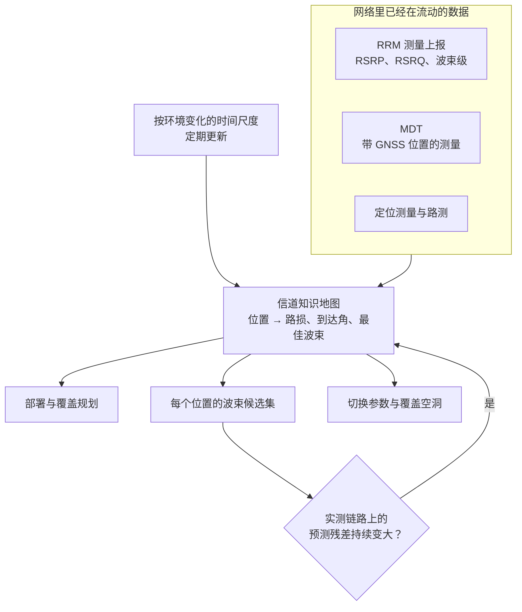
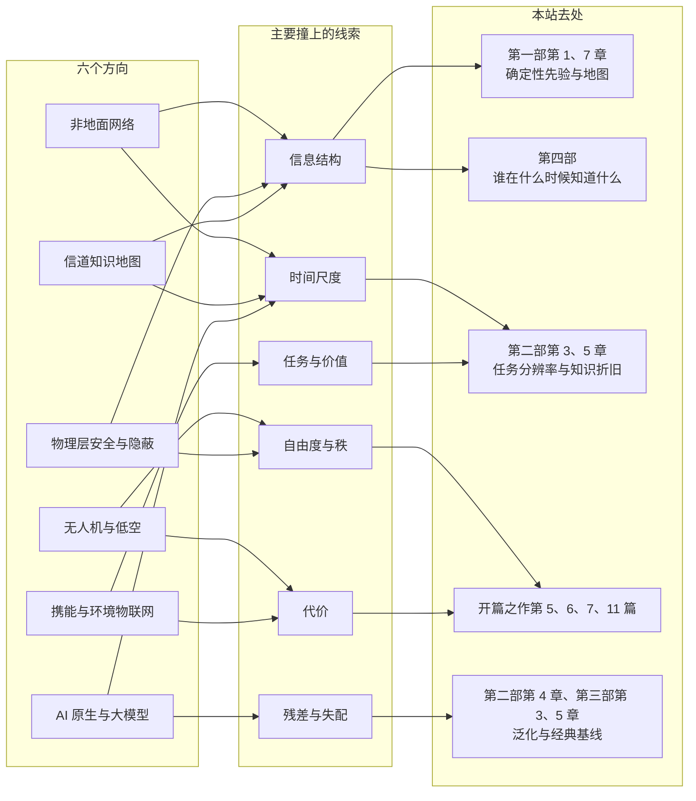

# 11 · 新概念图景（三）：卫星与低空、携能、安全、信道地图与 AI 原生网络

第 9 章看的是"环境"成为资源：近场、超表面、通感与语义。第 10 章回到物理层，数了天线位置、阵列孔径、接入点分布、同时收发、波形与频段六个新旋钮。本章把目光从一条链路移到整张网络，问两件事：网络要铺到哪些新地方，又要扛起哪些新任务。新地方在天上，600 公里高的低轨卫星和几百米高的无人机。新任务有四件：用电磁波给设备送能量；不靠密钥地保密，乃至让人察觉不到你在通信；把信道知识存成一张可以反复查的地图；让网络自己学会决策。

这六个方向表面上各管一摊，背后却反复撞上同一个问题：需要的信息从哪来、什么时候到手。卫星的轨道是事先知道的，窃听者的信道却永远不会主动告诉你；地图要靠终端源源不断地上报，大模型想插手调度，先得问它的推理赶不赶得上一个时隙。写法与第 10 章相同：每节一个关键推导、一个带数字和校验的算例、标准走到了哪一步，节末一张按八条线索排的体检卡，格式与读法见[第 10 章开篇](10-new-phy-dof.md)。

**你将学会：**

- 用余弦定理推出卫星斜距，算出 600 km 低轨卫星的时延、多普勒、路损与过顶时间，说明按信号强度切换为什么在卫星波束里失灵；
- 用空地视距概率模型看出无人机高度的 U 形取舍，并证明最优仰角只由城市形态决定、与路损门限无关；
- 算清无线能量传输在 1–30 m 上能收到多少功率，用对数的凹性说明功率分割处处不差于时间切换，再算一次反向散射的链路预算；
- 推出高斯窃听信道的保密容量，写出人工噪声下 Bob 与 Eve 的接收式，从相对熵推出隐蔽通信的平方根律；
- 认识网络里已经在流动的带位置测量，算一笔信道知识地图省下的导频与要付的存储，说清地图更新的因果准则；
- 用时间尺度表判断大模型和小模型各该放在哪一层，梳理 3GPP 的 AI/ML 从 Rel-18 到 6G 研究的路线；
- 读懂每节末尾的体检卡，知道每个方向该去本站哪里深挖。

---

## 11.1 非地面网络与空天地一体：把基站搬上天

### 直觉：困难几乎都来自几何

一艘远洋货轮离最近的海岸基站几百公里，地面网络在这里无能为力。抬头看，600 公里高处有低轨（LEO，low Earth orbit）卫星飞过，手机要是能直接连上它，海上、沙漠、山区和基站倒塌的灾区就都有了信号。非地面网络（NTN，non-terrestrial network）做的就是这件事：把基站或它的转发器搬到卫星、高空平台和无人机上。

搬上天以后，几何整个变了样。距离从几百米变成上千公里，路损和时延跟着涨；卫星以每秒七公里多的速度掠过，多普勒频移到几十 kHz；一个卫星波束在地面铺开几十公里，波束中心和边缘到卫星的距离几乎一样。下面逐个算清。好消息也来自几何：轨道是事先知道的。

### 斜距：从余弦定理到一个二次方程

取地心 $O$、地面用户 $U$、卫星 $S$ 三点。地球半径 $R=6371$ km，轨道高度 $h$，于是 $|OU|=R$、$|OS|=R+h$，待求的斜距 $d=|US|$。仰角 $\varepsilon$ 是用户看卫星时视线高出地平线的角度。地平线与 $UO$ 垂直，视线又在地平线上方 $\varepsilon$，所以三角形在 $U$ 处的内角是 $\angle OUS=90^\circ+\varepsilon$。对这个角用余弦定理，再用 $\cos(90^\circ+\varepsilon)=-\sin\varepsilon$：

$$
(R+h)^2=R^2+d^2-2Rd\cos(90^\circ+\varepsilon)=R^2+d^2+2Rd\sin\varepsilon .
$$

整理成关于 $d$ 的二次方程 $d^2+2R\sin\varepsilon\cdot d-(2Rh+h^2)=0$。两根之积等于 $-(2Rh+h^2)<0$，一正一负，取正根：

$$
d(\varepsilon)=\sqrt{R^2\sin^2\varepsilon+2Rh+h^2}-R\sin\varepsilon .
$$

两个极限马上可以检验。$\varepsilon=90^\circ$ 时根号里是 $(R+h)^2$，$d=h$，卫星正在头顶；$\varepsilon=0^\circ$ 时 $d=\sqrt{2Rh+h^2}$，是沿地面切线看出去的距离，600 km 轨道上为 2829 km。有了斜距，单程时延是 $d/c$，自由空间损耗是 $20\log_{10}(4\pi d/\lambda)$。

### 速度与多普勒：只看视线方向的那一份

圆轨道上引力提供向心力，$GMm/(R+h)^2=mv^2/(R+h)$，得

$$
v=\sqrt{\frac{GM}{R+h}},\qquad T_{\mathrm{orb}}=\frac{2\pi(R+h)}{v},
$$

$GM=3.986\times10^{14}\ \mathrm{m^3/s^2}$。600 km 时 $v=7.56$ km/s，绕地一圈 96.5 min。

多普勒只认速度在视线方向上的分量。设卫星正好从用户头顶经过（用户在轨道平面内），并忽略地球自转与用户运动。圆轨道的速度垂直于 $OS$；记三角形在 $S$ 处的内角 $\alpha=\angle OSU$，视线 $SU$ 与速度方向的夹角就是 $90^\circ-\alpha$，速度在视线上的投影为 $v\sin\alpha$。$\sin\alpha$ 由正弦定理给出：$\sin\alpha/R=\sin(90^\circ+\varepsilon)/(R+h)$，即 $\sin\alpha=R\cos\varepsilon/(R+h)$。于是

$$
f_D(\varepsilon)=\frac{f_c}{c}\,v\sin\alpha=\frac{f_c}{c}\,v\,\frac{R}{R+h}\cos\varepsilon .
$$

**物理意义**：卫星贴着地平线时几乎正对着你飞来或飞走，多普勒最大；过顶时速度与视线垂直，多普勒为零，并在这一刻改变符号。一次过境里，频偏从 $+f_{D,\max}$ 一路扫到 $-f_{D,\max}$。

**行为分析**：600 km 轨道、10° 仰角时，视线方向速度 6.81 km/s，是光速的 22.7 ppm（百万分之一），2 GHz 下 45.4 kHz，20 GHz 下 454 kHz。NR 在这个频段常用 15 或 30 kHz 的子载波间隔，45.4 kHz 相当于平移 3 个或 1.5 个子载波，不补偿就谈不上正交。频偏与载频成正比，频段越高越难对付。

和权威数对照：3GPP TR 38.821 的参考场景给出 600 km、最小仰角 10° 时地面固定终端的最大多普勒为 24 ppm [1]，TR 38.811 给出 2 GHz 约 ±48 kHz、20 GHz 约 ±480 kHz [2]。近似式在 10° 给 22.7 ppm，在 0° 也只有 23.1 ppm，比权威数小约 5%。差额可以用被忽略的地球自转解释：赤道上的地面以约 0.465 km/s 转动，投到视线上最多再添约 1.55 ppm，$22.7+1.55\approx24.3$【本站演算】。下文以 TR 的数为准，近似式用来看清结构。

### 时延、路损与过顶时间

把上面几个式子代入数（算例 11-1 有全表与校验）：600 km 轨道上，单程时延从过顶的 2.00 ms 涨到 10° 仰角的 6.44 ms；2 GHz 自由空间损耗从 154.0 dB 涨到 164.2 dB。地面上 1 km 链路的 2 GHz 自由空间损耗是 98.5 dB，600 km 卫星链路要多付 55–66 dB，1200 km 轨道在 10° 仰角处多付约 70 dB。3GPP 研究报告里的参考数如下 [1]：

| TR 38.821 Table 4.2-2 的参数 | LEO-600 | LEO-1200 |
|---|---|---|
| 最小仰角 10° 时的最远斜距 | 1932 km | 3131 km |
| 最大往返时延，透明转发（服务链路加馈电链路） | 25.77 ms | 41.77 ms |
| 最大往返时延，再生转发（仅服务链路） | 12.89 ms | 20.89 ms |
| 小区内最大时延差 | 3.12 ms | 3.18 ms |
| 最大多普勒（地面固定终端） | 24 ppm | 21 ppm |
| 最大多普勒变化率 | 0.27 ppm/s | 0.13 ppm/s |

再生转发指卫星上就有基站，只算终端到卫星这一段（服务链路）；透明转发时卫星只是个弯管，信号还要再下到地面信关站（馈电链路），按同样的最远斜距再走一个来回，往返时延就翻倍（算例 11-1 的校验）。作为对照，地球同步轨道卫星透明转发的往返时延是 541.46 ms。往返时延决定了要同时开多少个混合自动重传（HARQ，hybrid automatic repeat request）进程才不必停下来等反馈，[第 3 章 3.9 节](03-digital-communications.md#39-信道编码与-harq一页通)讲过这笔账。

卫星能被看见多久？最小仰角 $\varepsilon_{\min}$ 对应三角形在 $O$ 处的内角 $\psi$，也就是用户与星下点之间的地心角。三内角之和为 $180^\circ$，$\psi=180^\circ-(90^\circ+\varepsilon_{\min})-\alpha$；代入上面的 $\sin\alpha=R\cos\varepsilon_{\min}/(R+h)$，并用 $90^\circ-\arcsin u=\arccos u$：

$$
\psi=\arccos\Big(\frac{R\cos\varepsilon_{\min}}{R+h}\Big)-\varepsilon_{\min},\qquad T_{\mathrm{vis}}=\frac{2\psi}{360^\circ}\,T_{\mathrm{orb}} .
$$

正过顶时，卫星要扫过 $2\psi$ 的地心角，才从一侧的最低可用仰角升起、落到另一侧。600 km、$\varepsilon_{\min}=10^\circ$ 时 $\psi=15.84^\circ$，最长可见约 8.5 min；$\varepsilon_{\min}=0^\circ$ 时 12.8 min；要求 30° 以上只剩 4.1 min。不过顶的弧段更短。文献里的说法是同一量级：600 km 卫星对小区中心维持 10° 以上仰角约 450 s [3]。3GPP 给的是更短的另一个数：卫星以 7.56 km/s 扫过，直径 50 km 的小区（大致一个波束）最多停留约 6.6 s，直径 1000 km 的小区约 132 s [1]。要记住的是两个数量级：一次过境几分钟到十几分钟，单个波束只停几秒到两分钟。

### 确定性的那一块

时延会变，频偏会扫，可它们的大部分是算得出来的。卫星星历（轨道参数）事先已知，终端知道自己在哪，两者一减，斜距和视线速度就都有了。Rel-17 要求终端具备全球导航卫星系统（GNSS，global navigation satellite system）定位能力，并引入公共定时提前量（Common TA，小区里所有终端都一样的那部分时延）与调度时序偏移 $K_{\mathrm{offset}}$、$K_{\mathrm{mac}}$，给大时延留出时序余量 [4]；终端再用自己的 GNSS 位置和网络广播的服务卫星星历，估算服务链路的时延与多普勒，提前调整发射定时、预补偿频率 [4]。剩下的只是星历与定位误差造成的残余定时和频偏，交给闭环去修。

这是"信道里有一块是环境的确定性泛函"（[第一部第 1 章](../part1/01-lie-of-randomness.md#maxwell-的裁决信道是环境的确定性泛函)）的一个干净例子，也呼应了[第 2 章相干时间一节的卫星提示框](02-wireless-channel-basics.md#相干时间)：多普勒大不等于信道难，关键看它可不可预测。**卫星链路的时延与多普勒比地面大几个数量级，却有一大块是轨道几何的已知函数，可以事先算掉。**

### 为什么按信号强度切换不灵了

地面小区里，一个用户离基站 50 m，另一个 500 m，路损指数取 3.5，两人的路损差 $35\log_{10}10=35$ dB，谁近谁远一目了然。按参考信号接收功率（RSRP，reference signal received power）决定切换（[第 6 章 6.6 节](06-wireless-networks.md#66-移动性管理切换测量与乒乓)），在地面上天经地义。

卫星波束里情况完全不同。600 km 高的卫星正下方，一个半径 25 km 的波束，边缘比中心远 $\sqrt{600^2+25^2}-600=0.52$ km，距离带来的路损差只有 $20\log_{10}(600.52/600)=0.008$ dB。中心与边缘的差别几乎全来自波束方向图本身，若按半功率宽度划定波束，边缘比中心低 3 dB。两个相邻波束交叠处，两边的 RSRP 都在各自边缘附近，相差无几，还叠着衰落起伏，已经说不清该切到哪颗星、哪个波束。

信号强度里没有的"该切到哪"，几何和时间里有。Rel-17 在 TS 38.331 里为卫星加了两种触发条件 [5]。D1 按距离：终端到参考位置 1 的距离超过门限 1，同时到参考位置 2 的距离小于门限 2（单位是米，两个参考位置通常分别取服务小区与目标小区的），既可触发测量上报，也可作为条件切换的执行条件。T1 按时间：终端测得的时间进入一个从门限时刻起算的时间窗，只用于条件切换。条件切换指基站提前把目标小区的配置发给终端，条件一满足，终端自己执行。Rel-18 又加了 D2，参考位置随卫星移动，针对随卫星一起在地面上扫过的"地球移动小区"。空闲态也照此办理：TS 38.304 §5.2.4.2 允许终端离服务小区参考位置足够近时不测同频以及同、低优先级的异频邻区，并要求它在服务结束时刻 t-Service 之前开始测量 [6]。

### 标准走到哪一步

截至 2026 年 10 月，3GPP 的 NR 非地面网络已经走过三个版本：

| 版本 | 主要内容 | 出处 |
|---|---|---|
| Rel-17（首版） | 只支持透明转发；低轨约 300–1500 km、中轨 7000–25000 km 与地球同步轨道；终端须有 GNSS；频率范围 1（FR1，7.125 GHz 以下）的 n255（L 频段）与 n256（S 频段）；HARQ 进程可增到 32，可关闭 HARQ 反馈；Common TA、$K_{\mathrm{offset}}$、$K_{\mathrm{mac}}$；D1 与 T1 | TS 38.300 §16.14 [4]，TS 38.331 [5] |
| Rel-18 | 上行覆盖增强；10 GHz 以上的 n510–n512（17.3–30 GHz，下限另有 17.7 GHz 的写法）；网络侧核验终端上报的位置；与地面网络之间、卫星网络之间的移动性和业务连续性；D2 | TR 21.918 [7]，TS 38.300 [4] |
| Rel-19 | 再生式载荷（星上部署基站，可走星间链路）；降低能力（RedCap，reduced capability）终端；上行容量增强；下行覆盖增强；规范仍只用于频分双工（FDD） | 工作项目 RP-234078，TS 38.300 V19.4.0 [4] |
| 6G 研究 | 力求地面与非地面网络采用统一协调的设计并相互融合 | RP-251881 [8] |

标准化的综述可读 Lin 等 2021 [9]。

### 空天地一体

地球同步轨道、中轨、低轨卫星，平流层里的高空平台（HAPS，high-altitude platform station），几百米高的无人机，再加上地面网络，叠成一张分层的网，叫空天地一体化网络（SAGIN，space-air-ground integrated network）[10]。难处有四个。各层时延差几个数量级，高轨往返 541 ms，低轨十几到四十几毫秒，地面是毫秒级，一项业务走哪一层要看它容得下多少时延。星间链路的拓扑随卫星运动不停变化，路由要跟着变，好在这种变化同样可以按轨道预测。卫星与地面系统共享频谱，相邻乃至相同的频段上会互相干扰。最后是跨系统协同：谁掌握哪些信息、什么时候拿到，这正是第四部讲的信息结构问题。

!!! example "算例 11-1：一颗 600 km 低轨卫星的几何账"

    取 $R=6371$ km、$GM=3.986\times10^{14}\ \mathrm{m^3/s^2}$。多普勒用上面的近似式（只取轨道速度在视线方向的投影，忽略地球自转与用户运动），路损只算自由空间：

    | 轨道与仰角 | 斜距 | 单程时延 | 2 GHz 多普勒 | 20 GHz 多普勒 | 2 GHz 自由空间损耗 |
    |---|---|---|---|---|---|
    | 600 km，90° | 600 km | 2.00 ms | 0 | 0 | 154.0 dB |
    | 600 km，30° | 1075 km | 3.59 ms | 39.9 kHz（20.0 ppm） | 399 kHz | 159.1 dB |
    | 600 km，10° | 1932 km | 6.44 ms | 45.4 kHz（22.7 ppm） | 454 kHz | 164.2 dB |
    | 1200 km，90° | 1200 km | 4.00 ms | 0 | 0 | 160.1 dB |
    | 1200 km，10° | 3131 km | 10.44 ms | 40.1 kHz（20.1 ppm） | 401 kHz | 168.4 dB |

    仰角 0° 时多普勒最大，2 GHz 下约 46.1 kHz（23.1 ppm）。正过顶的最长可见时长在最小仰角 10°、0°、30° 时分别为 8.5、12.8、4.1 min。25 km 波束边缘与中心的距离路损差 0.008 dB。

    校验：（a）$h=600$ km、$\varepsilon=10^\circ$：$R\sin\varepsilon=1106.3$ km，$\sqrt{1106.3^2+2\times6371\times600+600^2}=3037.9$ km，$d=3037.9-1106.3=1931.6$ km，与 TR 38.821 的 1932 km 一致；$\varepsilon=90^\circ$ 时公式给 $d=h$。（b）单程时延精确值 6.443 ms，两倍 12.89 ms 是再生转发的最大往返时延，四倍 25.77 ms 是透明转发的，与 TR 38.821 的表一致。（c）多普勒：$7.56\times(6371/6971)\times\cos10^\circ=6.81$ km/s，除以光速得 22.7 ppm，乘 2 GHz 得 45.4 kHz，20 GHz 时再乘 10。（d）路损：$20\log_{10}(1932/600)=10.2$ dB，加到过顶的 154.0 dB 上正是 164.2 dB。（e）过顶时长：$2\times15.84^\circ/360^\circ\times96.5=8.5$ min。

{ .chart loading=lazy }
{ .chart loading=lazy }

*怎么读这张图：第一条线是单程时延（ms），对应斜距依次为 1932、1392、1075、815、683、600 km；第二条线是 2 GHz 多普勒除以 10 的值（单位 10 kHz，4.54 即 45.4 kHz）。两条线都在低仰角处最高：卫星贴着地平线时既最远，又几乎正对着你运动。60° 以后时延已变化不大，多普勒却从 23.1 kHz 一路掉到零，过顶附近是频偏变化最快的地方。*

!!! abstract "体检卡 · 非地面网络"

    | 检查项 | 结果 |
    |---|---|
    | 开的门 | 覆盖地面基站够不着的海面、沙漠、山区与灾区，手机直连卫星 |
    | 时间尺度 | 600 km 卫星一次过境最长约 8.5 min（最小仰角 10°），单个波束只停几秒到两分钟；星历的变化是确定的，可以提前算 |
    | 信息结构 | 轨道已知、终端有 GNSS 位置，时延与多普勒的大部分可预测；地面用户分布有强先验（海上几乎没人，城市成簇）；RSRP 却几乎不含"该切到哪"的信息 |
    | 自由度与秩 | 星上阵列的孔径与波束数决定能同时照亮几片区域；手机天线增益有限，单用户多流基本无望 |
    | 残差与失配 | 星历误差与定位误差留下残余定时与频偏，要靠闭环修正；近似多普勒式比 TR 的 24 ppm 小约 5% |
    | 代价 | 链路预算比地面 1 km 多 55–66 dB；卫星的功率与载荷重量；星地之间、系统之间的信令 |
    | 采纳（截至 2026-10） | Rel-17 首版（透明转发，n255/n256），Rel-18 上行覆盖与 10 GHz 以上频段，Rel-19 再生载荷；6G 研究把地面与非地面的统一设计列入范围 |
    | 极限与基线 | 地面网络加漫游；带大天线的专用卫星终端 |
    | 任务与价值 | 覆盖与应急，单用户速率不是重点 |
    | 阶段与去处 | 推广【本站判断】；[第一部第 1 章](../part1/01-lie-of-randomness.md#maxwell-的裁决信道是环境的确定性泛函)、[第一部第 7 章](../part1/07-channel-cartography.md)（地图与先验）、[第二部 5.5 节](../part2/05-cognitive-triangle.md#55-同一条律耐用品与易逝品从-t_mathrmcoh-到-t_mathrmenv)（耐用品与易逝品） |

---

## 11.2 无人机与低空网络：位置和航迹成了设计变量

### 直觉：飞得越高，离谁都越远

地震震倒了一片城区的基站，救援队放起一架挂着基站的无人机。它该飞多高？飞低了，楼房挡住视线，损耗大；飞高了，视线通了，可离每个人都更远。地面基站的位置在建站时就定死了，无人机基站的位置和航迹却可以每分钟都改，这是无人机通信与地面通信最根本的区别。下面先算"飞多高"，再算"怎么飞"。

### 空地视距概率模型

Al-Hourani 等 2014 用城市的统计几何拟合了一个空地视距（LoS，line of sight）概率模型 [11]。地面用户看无人机的仰角为 $\theta$（以度计）时，

$$
P_{\mathrm{LoS}}(\theta)=\frac{1}{1+a\exp\!\big(-b(\theta-a)\big)} .
$$

这是一条 S 形曲线：仰角小时视线贴着楼顶，多半被挡；仰角大时几乎从头顶往下看，视距概率趋于 1。参数 $a$ 管 S 形的位置，$b$ 管它有多陡。平均路损写成自由空间损耗，加上视距与非视距两种额外损耗按概率的加权：

$$
\mathrm{PL}(h,R)=20\log_{10}\frac{4\pi\sqrt{h^2+R^2}}{\lambda}+\eta_{\mathrm{LoS}}P_{\mathrm{LoS}}(\theta)+\eta_{\mathrm{NLoS}}\big[1-P_{\mathrm{LoS}}(\theta)\big],\qquad \theta=\arctan\frac{h}{R},
$$

$h$ 是无人机高度，$R$ 是用户到无人机投影点的水平距离。四种环境的 $(a,b)$ 取自该文拟合多项式的常用参数，额外损耗 $(\eta_{\mathrm{LoS}},\eta_{\mathrm{NLoS}})$ 引自同组的 Globecom 2014 论文 [12]；最后一列的最优仰角下面会推出来：

| 环境 | $(a,b)$ | $(\eta_{\mathrm{LoS}},\eta_{\mathrm{NLoS}})$ | 最优仰角 $\theta^\star$ |
|---|---|---|---|
| 郊区 | (4.88, 0.43) | (0.1, 21) dB | 20.3° |
| 城区 | (9.61, 0.16) | (1.0, 20) dB | 42.4° |
| 密集城区 | (12.08, 0.11) | (1.6, 23) dB | 54.6° |
| 高楼城区 | (27.23, 0.08) | (2.3, 34) dB | 75.5° |

另有文献按 Globecom 2014 论文把密集城区写成 (11.95, 0.136)，本章统一用拟合多项式的值。以城区为例，仰角 15° 时视距概率只有 0.198，30° 时 0.731，45° 时 0.968，60° 时 0.997。令 $a\,e^{-b(\theta-a)}=1$ 可得 S 形的中点 $\theta=a+(\ln a)/b$，城区是 23.8°，仰角过了这里视距概率才过半【本站演算】。

3GPP 研究空中终端时用的是按终端高度分段的模型 [13]：城区宏站场景（UMa-AV）终端高于 100 m、农村场景（RMa-AV）高于 40 m 时，视距概率直接取 100%。百米以上的空中终端几乎看得见周围所有基站，这正是它干扰重的原因。

### 推导：最优高度的取舍

固定覆盖半径 $R$，看路损怎样随高度 $h$ 变。式里两项在拔河。第一项是自由空间损耗，随 $\sqrt{h^2+R^2}$ 单调上升。后两项合起来是额外损耗

$$
E(\theta)=\eta_{\mathrm{NLoS}}-(\eta_{\mathrm{NLoS}}-\eta_{\mathrm{LoS}})\,P_{\mathrm{LoS}}(\theta),
$$

随仰角升高从接近 $\eta_{\mathrm{NLoS}}$ 降到接近 $\eta_{\mathrm{LoS}}$，城区里是从约 20 dB 降到约 1 dB。低空时第二项主导，升高有利；高空时第一项主导，再升就亏。所以路损对 $h$ 是 U 形。城区、2 GHz、$R=707$ m 时：$h=50$ m 为 114.7 dB，100 m 为 114.1 dB，200 m 为 111.6 dB，400 m 为 103.1 dB，645 m 降到最低的 100.0 dB，再往上 1000 m 为 101.4 dB，2000 m 回到 106.0 dB。

{ .chart loading=lazy }
{ .chart loading=lazy }

*怎么读这张图：只有一条线，是覆盖半径 707 m 处用户的平均路损。横轴各点大致按对数排列，不等距。左段从 50 m 升到 645 m，视距概率从 0.04 升到 0.95，额外损耗从 19 dB 降到 2 dB，路损跟着降了 14.7 dB；右段再往上，额外损耗已经降无可降，斜距变长的代价开始主导，路损回升。最低点在 645 m，对应仰角 42.4°。*

### 最优仰角只由城市决定

换一个问法：给定路损门限 $L_{\mathrm{th}}$，最大能覆盖多大的半径？固定仰角 $\theta$，额外损耗 $E(\theta)$ 就定了，能容忍的最远斜距由 $20\log_{10}(4\pi d/\lambda)+E(\theta)=L_{\mathrm{th}}$ 解出，覆盖半径是它的水平投影：

$$
R(\theta)=d(\theta)\cos\theta=\frac{\lambda}{4\pi}\,10^{L_{\mathrm{th}}/20}\cdot\cos\theta\;10^{-E(\theta)/20}.
$$

门限只出现在第一个因子里，对 $\theta$ 求最大时它是常数。所以最优仰角 $\theta^\star=\arg\max_\theta\cos\theta\,10^{-E(\theta)/20}$ 与门限无关，只由环境参数决定，最优高度 $h^\star=R^\star\tan\theta^\star$。数值寻优给出郊区 20.3°、城区 42.4°、密集城区 54.6°、高楼城区 75.5°，与 Al-Hourani 等报告的最优角一致 [11]。城区门限取 95、100、105、110 dB 时，最优角都是 42.4°，最大半径分别为 397、707、1256、2234 m，对应高度 $h=R\tan42.4^\circ=0.914R$，即 363、646、1149、2043 m。

同一件事还有一个更直观的说法：把几何整体放大 $k$ 倍，仰角不变，视距概率不变，自由空间损耗只多出一个与角度无关的常数，

$$
\mathrm{PL}(kh,kR)=\mathrm{PL}(h,R)+20\log_{10}k .
$$

门限变了，最优几何只是整体缩放，角度不动。

**物理意义**：**路损门限只决定"覆盖多大"，"从多陡的角度往下看最划算"是城市形态的属性。**

**行为分析**：楼越高越密，最优仰角越陡，从郊区的 20° 一路升到高楼城区的 75°，要从更接近头顶的方向往下看才躲得开遮挡。城区最优高度在 600 m 量级，远高于低空飞行器常见的百米量级，所以这条结论更适合高空平台。百米高的无人机基站要守住 42.4° 的最优角，覆盖半径只有约 110 m；硬要覆盖 707 m，就得接受 114.1 dB 的路损，比最优多付 14 dB【本站演算】。

### 航迹也是设计变量

位置之外，时间也能用。两个地面用户相距 1000 m，无人机在 100 m 高度飞行，链路按自由空间视距算，$\mathrm{SNR}=\gamma_0/d^2$。设悬停在某人正上方 100 m 时 SNR 为 30 dB，于是 $\gamma_0=1000\times100^2=10^7\ \mathrm{m^2}$。

第一种做法，停在两人中点，分时服务。到每人的距离 $\sqrt{500^2+100^2}=510$ m，SNR $=10^7/260000=38.5$（15.9 dB），每人分到一半时间，平均速率 $\frac12\log_2(1+38.5)=2.65$ b/s/Hz。第二种做法，轮流飞到每人头顶服务，暂不计飞行时间，每人平均 $\frac12\log_2(1+1000)=4.98$ b/s/Hz，是前者的 1.88 倍。

代价是时延：以 20 m/s 从一人飞到另一人要 50 s。把飞行时间算进去，并保守地假定途中不通信，每次在一人头顶停 $T_s$ 秒，一个来回周期 $2T_s+100$ s，每人平均速率是 $4.98\,T_s/(T_s+50)$，要胜过停在中点，需要 $T_s\ge57$ s【本站演算】。这是用移动性换容量、拿时延付账，和自组织网络里"移动性提升容量"的结论同一个道理（Grossglauser–Tse 2002，见[开篇之作第 4 篇](../guide/03-seminal-papers.md#4-guptakumar-2000节点越多每个人分到的越少)的"打开的门"）。Zeng–Zhang 2017 把推进能耗也写进轨迹优化，得到介于"悬停"与"直飞"之间的能效最优轨迹 [14]，拆解见[开篇之作第 7 篇](../guide/03-seminal-papers.md#7-zengzhang-2017把无人机的轨迹变成设计变量)；无人机通信的全貌可先读 Zeng 等 2016 的杂志文 [15]。

### 无人机当用户

无人机也可以是用户：物流、巡检、航拍都要一条可靠的蜂窝连接（Zeng 等 2019 称为蜂窝连接的无人机 [16]）。麻烦正出在 TR 36.777 那个 100% 上：百米高空看得见很多基站，下行收到的干扰多，切换频繁；地面基站的天线向下倾，空中用户主要落在旁瓣里。3GPP 从 LTE 时代的 TR 36.777 起研究空中终端 [13]，NR 在 Rel-18 的工作项目 NR_UAV（RP-230782）里给出支持 [7]：按高度触发的测量上报（事件 H1、H2，以及 A3H1 这类高度与信号的组合事件），多个小区同时满足条件时上报以发现干扰，上报带时间戳的三维航点，按签约信息识别空中终端，经侧行链路广播远程身份并支持检测避让。Rel-19 又加了按高度触发的条件切换 [4]。

航迹规划也可以反过来利用信道：照着无线电地图避开覆盖空洞飞，这是信道知识地图研究的起点之一（[第一部第 7 章](../part1/07-channel-cartography.md#三个社区三个投影)）。低空监管还有一个容易被忽略的难题：不发信号的无人机，射频识别对它无能为力，需要真正的感知手段，这把问题带回了[第 9 章 9.4 节](09-new-landscape.md#94-isac-通感一体化一段波形两种任务)的通感一体化。

!!! example "算例 11-2：城区无人机基站的三笔账"

    **飞多高。** 城区、2 GHz（$\lambda=0.15$ m）、$R=707$ m。最低点 $h=645$ m：斜距 $\sqrt{645^2+707^2}=957$ m，自由空间损耗 $20\log_{10}(4\pi\times957/0.15)=98.1$ dB；仰角 $\arctan(645/707)=42.4^\circ$，$P_{\mathrm{LoS}}=1/\big(1+9.61e^{-0.16\times(42.4-9.61)}\big)=0.952$，额外损耗 $0.952\times1+0.048\times20=1.9$ dB；合计 100.0 dB。低处 $h=50$ m：仰角 4.0°，$P_{\mathrm{LoS}}=0.041$，额外损耗 19.2 dB，自由空间损耗 95.5 dB，合计 114.7 dB。

    **怎么飞。** 停在中点 2.65 b/s/Hz，飞到头顶 4.98 b/s/Hz，比值 1.88；20 m/s 飞 1000 m 要 50 s；计入飞行时间后，每次停留不短于约 57 s 才划算。

    校验：（a）缩放：把 $(h,R)=(645,707)$ 放大到 $(1290,1414)$，路损多出 $6.02$ dB $=20\log_{10}2$，最优角不变。城区门限 95、100、105、110 dB 的最大半径 397、707、1256、2234 m 相邻两档之比应为 $10^{5/20}=1.778$，实际 $707/397=1.78$、$1256/707=1.78$。（b）极限：$h\to0$ 时仰角趋于 0，$P_{\mathrm{LoS}}\to1/(1+9.61e^{1.54})=0.022$，额外损耗约 19.6 dB；$h\to\infty$ 时额外损耗趋于 1 dB，自由空间损耗却无界增长。两头都比 100.0 dB 高，中间必有最低点。（c）速率比 $\log_2 1001/\log_2 39.5=9.97/5.30=1.88$；停留门槛由 $4.98\,T_s/(T_s+50)=2.65$ 解出 $T_s=56.8$ s。

!!! abstract "体检卡 · 无人机与低空网络"

    | 检查项 | 结果 |
    |---|---|
    | 开的门 | 基站的位置与航迹从给定条件变成设计变量 |
    | 时间尺度 | 航迹以秒到分钟计（20 m/s 飞 1 km 要 50 s），远慢于小尺度衰落；续航决定一次任务能持续多久 |
    | 信息结构 | 要知道地面用户的位置与空地信道；视距概率模型只给统计平均，具体街区要靠地图或实测 |
    | 自由度与秩 | 位置与时间的联合自由度：飞到用户头顶换来 1.88 倍速率，代价是几十秒的时延 |
    | 残差与失配 | 视距概率模型是城市的统计平均，具体街区偏差大；参数随环境分类而变，密集城区就有两套取值 |
    | 代价 | 续航与推进能耗、空域管理、回传链路 |
    | 采纳（截至 2026-10） | LTE 时代的研究 TR 36.777；Rel-18 NR 支持空中终端（高度事件、飞行路径上报、远程身份广播），Rel-19 加按高度的条件切换 |
    | 极限与基线 | 固定的地面基站；固定悬停的无人机 |
    | 任务与价值 | 应急通信、临时热点、巡检与物流；空中终端要的是可靠连接，不是峰值速率 |
    | 阶段与去处 | 推广【本站判断】；[开篇之作第 7 篇](../guide/03-seminal-papers.md#7-zengzhang-2017把无人机的轨迹变成设计变量)、[第一部第 7 章](../part1/07-channel-cartography.md) |

---

## 11.3 携能通信与环境物联网：用电磁波送能量

### 直觉：电池换不过来

一座仓库里有几万件货，每件贴一枚标签；一栋楼的墙里埋着几百个温湿度传感器。给它们全装电池、定期更换，人工和成本都扛不住。能不能让设备从空中的电磁波里取电，再用同一个电磁波把数据带回来？这就是携能通信（SWIPT，simultaneous wireless information and power transfer）与无线能量传输要做的事。

### 能收到多少

自由空间里接收功率 $P_r=P_tG_tG_r\big(\lambda/(4\pi d)\big)^2$。取 915 MHz（$\lambda=0.328$ m）、发射 1 W（30 dBm）、两端都是全向天线（$G_t=G_r=1$，与[领域地图](../guide/01-field-map.md#携能通信无线能量传输与环境物联网)的例子一致）：

| 距离 | 自由空间损耗 | 接收功率 | 30% 整流效率后 |
|---|---|---|---|
| 1 m | 31.7 dB | −1.7 dBm（680 μW） | 204 μW |
| 3 m | 41.2 dB | −11.2 dBm（75.5 μW） | 22.7 μW |
| 10 m | 51.7 dB | −21.7 dBm（6.8 μW） | 2.0 μW |
| 30 m | 61.2 dB | −31.2 dBm（0.76 μW） | 0.23 μW |

距离每乘 10，功率除以 100。10 m 外只剩几微瓦，而 30% 的整流效率（射频功率变成直流功率的比例）已经偏乐观。

更要命的是，能量接收机比信息接收机"聋"得多。信息接收机的灵敏度可以到 −100 dBm 量级，30 m 处 −31.2 dBm 的信号拿来通信绰绰有余。整流电路却要 −20 到 −30 dBm 的输入才能有效工作：Clerckx 等 2019 汇总的数据里，现有较好的整流器在 −20 dBm 时效率约 20%，−30 dBm 时只剩约 2%，再低就几乎收不到能量 [18]。所以上表 30 m 那一行的 30% 效率并不成立，那里的 −31.2 dBm 已经掉出了整流器的工作范围。两种接收机差了七八十 dB；按自由空间的平方律，20 dB 的灵敏度差距对应 10 倍距离，40 dB 对应 100 倍。**能量传输的有效距离远小于通信距离，这是携能通信一切设计的出发点。**

### 推导：速率与能量怎么分

信息与能量对接收机的要求互相矛盾：解码要把信号送进基带，收能要把它送进整流器，同一份功率不能用两次。Zhang–Ho 2013 先给出理想的速率–能量区域，再讨论两种能实现的接收机结构 [17]，拆解见[开篇之作第 6 篇](../guide/03-seminal-papers.md#6-zhangho-2013同一个信号既送信息又送能量)。

时间切换（TS，time switching）：一部分时间 $\alpha$ 全拿去收能，其余时间解码。收到的能量 $E\propto\alpha$，速率 $(1-\alpha)\log_2(1+\mathrm{SNR})$。

功率分割（PS，power splitting）：把接收信号按功率比例分成两路，$\rho$ 那份去整流，$1-\rho$ 那份去解码，$E\propto\rho$。解码支路的信噪比取决于噪声在哪里进来。这里用一个理想化：天线引入的噪声相对射频到基带的处理噪声可以忽略，分路器本身也不添噪声，于是噪声主要在分路之后才加进来，分走的只是信号功率，解码支路的信噪比变成 $(1-\rho)\mathrm{SNR}$。

用能量占最大值的比例 $e$ 统一横轴（时间切换里 $e=\alpha$，功率分割里 $e=\rho$）：

$$
R_{\mathrm{TS}}(e)=(1-e)\log_2(1+\mathrm{SNR}),\qquad R_{\mathrm{PS}}(e)=\log_2\big(1+(1-e)\,\mathrm{SNR}\big).
$$

前者是一条直线；后者是仿射函数取对数，是 $e$ 的凹函数。两者在端点重合：$e=0$ 时都是 $\log_2(1+\mathrm{SNR})$，$e=1$ 时都是 0。凹函数的图像在连接两端点的弦之上，而 $R_{\mathrm{TS}}$ 恰好就是这条弦：

$$
R_{\mathrm{PS}}(e)\ \ge\ (1-e)\,R_{\mathrm{PS}}(0)+e\,R_{\mathrm{PS}}(1)=(1-e)\log_2(1+\mathrm{SNR})=R_{\mathrm{TS}}(e),
$$

只在两端取等。在这个理想化下，功率分割处处不差于时间切换。

**物理意义**：对数的凹性让"少分一点功率"几乎不损失速率，"少分一点时间"却按比例损失。SNR 20 dB、一半能量时，功率分割有 5.67 b/s/Hz，时间切换只有 3.33 b/s/Hz：功率减半，信噪比降 3 dB，只丢 1 比特。

**行为分析**：优势随 SNR 变。高 SNR 下对数饱和，功率分割远胜时间切换；低 SNR 下对数近似线性，两者趋同，SNR 为 0 dB、$e=0.5$ 时功率分割为 $\log_2 1.5=0.585$，时间切换为 0.5，只高 17%【本站演算】。理想化的另一头：若处理噪声可以忽略、天线噪声占主导，分路时信号与天线噪声一起缩小，信噪比不变，功率分割就能逼近"全部收能、照常解码"的理想外界，即开篇之作卡片里说的条件。还有一处要打折扣：实际整流器是非线性的，会饱和，线性模型 $E\propto\rho$ 高估可收能量，最优的波形与输入分布也随之改变 [18]。

{ .chart loading=lazy }
{ .chart loading=lazy }

*怎么读这张图：第一条线是功率分割 $\log_2(1+100(1-e))$，第二条线是时间切换 $(1-e)\log_2 101$。两条线在两端重合，中间第一条线始终在上：分走 80% 的功率去收能，功率分割仍有 4.39 b/s/Hz，时间切换只剩 1.33。第一条线直到最后 10% 才陡然落到零，这就是对数的凹性。*

### 无线供能网络的双重远近效应

另一种用法是先收能、再发信息：基站先向设备下行送能量，设备存起来，再用它向基站上行发数据，这叫无线供能通信网络。Ju–Zhang 2014 指出这里有双重远近效应 [19]：远处的用户收到的能量少，自己发出去的信号又衰减得多，两段路损相乘。设路损指数为 $n$，收能 $\propto d^{-n}$，上行到达基站的功率再乘一个 $d^{-n}$，合起来 $\propto d^{-2n}$。指数为 2 时，距离翻倍，普通链路损失 6 dB，收能再发送损失 12 dB；指数为 3 时是 9 dB 对 18 dB。按总吞吐最大化去分配时间，远处的用户分到的吞吐会很少，该文因此改用让所有用户吞吐相等的目标。

### 反向散射与环境物联网

再往下省，设备连载波都不自己产生，只切换天线的负载，调制反射别人发来的信号，这叫反向散射。不需要振荡器和功放，功耗能降到微瓦量级。射频识别（RFID，radio frequency identification）标签就是这样工作的；Liu 等 2013 更进一步，让设备反射环境里现成的电视与蜂窝信号，连专用阅读器都省了 [20]。

单站反向散射的链路预算很好写：阅读器发出载波，标签反射，回波回到阅读器，路损付两次，

$$
P_{\mathrm{back}}=P_t-2L_{\mathrm{fs}}(d)-L_{\mathrm{mod}}\qquad(\text{dB}),
$$

和[第 9 章超表面的乘性路损](09-new-landscape.md#冷水乘性路径损耗与工程挑战)是同一笔账：距离翻倍，回波降 12 dB。取 915 MHz、阅读器 30 dBm、标签调制损耗 $L_{\mathrm{mod}}=6$ dB（假设值）：1 m 时回波 −39.4 dBm，3 m 时 −58.4 dBm，10 m 时 −79.4 dBm。1 MHz 带宽、噪声系数 10 dB 的噪声底是 −104 dBm，10 m 处 SNR 约 24.6 dB，看起来够用。可阅读器自己的 30 dBm 载波比这个回波强 109 dB，而且就在同一个频点上：要在发的同时听清回波，又回到了[第 10 章 10.4 节](10-new-phy-dof.md#104-全双工与子带全双工一边说一边听的账)全双工的自干扰问题。

3GPP 已经把这类设备带进蜂窝标准，叫环境物联网（Ambient IoT），口径要分清（截至 2026 年 10 月）。Rel-18 的研究报告 TR 38.848 按"有无储能、能否自己产生射频信号"分三类设备 [21]：Device A 没有储能，只能靠反向散射，收发期间的功耗目标是 1 μW 或 10 μW 以内；Device B 有储能，仍靠反向散射，但可以用存下的能量放大反射信号；Device C 有储能，有自己的有源射频，功耗目标 1–10 mW。Rel-19 先做研究（TR 38.769 [22]），再在 RAN#106（2024 年 12 月）立了工作项目 RP-243326 [23]，范围只有一类设备 device 1：峰值功耗约 1 μW、有储能、设备内不做放大、借外部载波反向散射；室内部署；FR1 授权频谱的 FDD；阅读器到设备的方向只用一种通断键控（OOK，on-off keying）方案 OOK-4，设备到阅读器用 OOK 或 BPSK 加曼彻斯特线码；产出物理层规范 TS 38.291 与 MAC 层规范 TS 38.391。

这里有三处容易写错。"约 1 μW"是收发时的峰值功耗，不是平均功耗；Rel-18 的 Device A 与 Rel-19 的 device 1 不能画等号，前者没有储能，后者有；研究评估用的是 TR 38.901 的室内工厂信道模型，"室内工厂"只是评估口径，工作项目写的是室内部署。功耗更高的 device 2a、2b 与室外场景，留给了 Rel-20。

把数对一对：10 m 处整流后约 2 μW，正好落在 device 1 约 1 μW 的峰值预算附近。有储能这一点很关键：收能是细水长流，用能是一次爆发，设备先把微瓦级的收入攒进电容，攒够了再完成一次收发，工作天然是间歇的。

!!! example "算例 11-3：携能的四笔账"

    **收多少。** $\lambda=c/f=0.328$ m；$d=10$ m 时 $L_{\mathrm{fs}}=20\log_{10}(4\pi\times10/0.328)=51.7$ dB，$P_r=30-51.7=-21.7$ dBm $=6.8\ \mu\mathrm{W}$，乘 0.3 得 2.0 μW。

    **怎么分。** SNR 20 dB（100 倍）时两种接收机的速率（b/s/Hz）：

    | $e$ | 0 | 0.25 | 0.5 | 0.75 | 0.9 |
    |---|---|---|---|---|---|
    | 功率分割 | 6.66 | 6.25 | 5.67 | 4.70 | 3.46 |
    | 时间切换 | 6.66 | 4.99 | 3.33 | 1.66 | 0.67 |

    **远近。** 距离翻倍，指数 2 时单程损失 $20\log_{10}2=6$ dB、收能再发送 12 dB，指数 3 时 9 dB 对 18 dB。

    **反向散射。** $P_{\mathrm{back}}(10\ \mathrm{m})=30-2\times51.7-6=-79.4$ dBm；噪声底 $-174+10\log_{10}10^6+10=-104$ dBm；SNR 24.6 dB；载波比回波强 $30-(-79.4)=109.4$ dB。

    校验：（a）1 m 到 10 m，接收功率从 680 μW 降到 6.8 μW，正好 1/100，平方律。（b）$e=0.5$：$\log_2(1+50)=5.67$，$0.5\log_2101=3.33$；$e=0.9$：$\log_2 11=3.46$，$0.1\times6.66=0.67$。（c）反向散射的距离每乘 10，回波降 40 dB：1 m 的 −39.4 dBm 到 10 m 的 −79.4 dBm，四次方律。（d）两端点：$e=0$ 时两行都是 $\log_2 101=6.66$，$e=1$ 时都是 0，与"弦与凹函数共端点"一致。

!!! abstract "体检卡 · 携能通信与环境物联网"

    | 检查项 | 结果 |
    |---|---|
    | 开的门 | 同一个电磁波既带比特又带能量，设备可以不装电池或少换电池 |
    | 时间尺度 | 收能慢、用能快：10 m 外约 2 μW 的收入先存进储能元件，再在一次收发里花掉，工作是间歇的；Rel-19 的 device 1 正是带储能的 |
    | 信息结构 | 能量波束赋形要知道到设备的信道，可设备恰恰最没有能力测量和反馈 |
    | 自由度与秩 | 多天线的能量波束赋形提供阵列增益；单天线下功率分割的速率–能量曲线是凹的，时间切换只是它的弦 |
    | 残差与失配 | 整流器非线性与饱和，线性能量模型高估可收能量；整流电路要 −20 到 −30 dBm 才能有效工作，比信息接收机的 −100 dBm 量级高七八十 dB |
    | 代价 | 发射功率与电磁暴露限制；反向散射时阅读器自己的载波比回波强百余 dB（10 m 时 109 dB） |
    | 采纳（截至 2026-10） | Rel-18 研究 TR 38.848；Rel-19 工作项目 RP-243326 只做 device 1（峰值约 1 μW、有储能、室内、FR1 授权 FDD）；更复杂的设备留给 Rel-20 |
    | 极限与基线 | 电池加定期更换；专用的 RFID 系统 |
    | 任务与价值 | 海量、低速、偶发的传感与盘点，不追求速率 |
    | 阶段与去处 | 携能通信推广后进入饱和，环境物联网正在推广【本站判断】；[开篇之作第 6 篇](../guide/03-seminal-papers.md#6-zhangho-2013同一个信号既送信息又送能量) |

---

## 11.4 物理层安全与隐蔽通信：不靠密钥的保密

### 直觉：三种不同的"保密"

一枚贴在管道上的传感器每分钟把读数发给 30 m 外的网关，墙外 100 m 处有人在听。最常见的回答是加密：安全性建立在"破解要算很久"之上，前提是密钥能安全地分发和管理，这对一枚只有微瓦预算的传感器并不便宜。物理层安全换了一个依据：窃听者 Eve 的信道比合法接收者 Bob 的差，就可以用编码把这份差距换成保密，不需要任何计算难度的假设。隐蔽通信再进一步，连"有人在通信"这件事都不让守卫察觉。

### 保密容量

Wyner 1975 在一个离散模型里证明了保密不一定靠密钥 [24]。高斯情形由 Leung-Yan-Cheong 与 Hellman 1978 给出 [25]：复基带里 Bob 与 Eve 的信噪比分别为 $\mathrm{SNR}_B$、$\mathrm{SNR}_E$ 时，能同时做到可靠与保密的最高速率是两条信道的容量之差。Eve 的信道反而更好时保密容量为零，所以常写成 Bloch 等 2008 用的分段形式 [26]：

$$
C_s=\big[\log_2(1+\mathrm{SNR}_B)-\log_2(1+\mathrm{SNR}_E)\big]^+ .
$$

直觉上，码字里要掺进足够多的随机比特，把 Eve 那条信道的容量整个"填满"，让她听到的全是随机性；Bob 的信道多出来的那一截，才装得下秘密。Wyner 的例子与这段历史见[开篇之作第 5 篇](../guide/03-seminal-papers.md#5-wyner-1975-与-bash-等-2013不用密钥的保密不被发现的通信)。

**物理意义**：保密靠的是两条信道之差，Bob 的信道好不好倒在其次。

**行为分析**：高 SNR 时 $C_s\approx\log_2(\mathrm{SNR}_B/\mathrm{SNR}_E)$，只看两人的 dB 差。Bob 20 dB、Eve 10 dB 时 $C_s=3.20$ b/s/Hz；把发射功率加 10 dB，两人同时升到 30 dB 和 20 dB，$C_s=\log_2 1001-\log_2 101=3.31$，上限是 $\log_2 10=3.32$【本站演算】。加功率救不了保密，要拉开两人的差距，就得在空间上做文章。

### 人工噪声：把噪声发到 Bob 听不见的方向

Goel–Negi 2008 给了一个漂亮的空间办法 [27]。看最简单的情形：发端有 $N$ 根天线，Bob 与 Eve 各一根，发端知道 $\mathbf{h}_B$，却不知道 $\mathbf{h}_E$。信号沿 $\mathbf{h}_B$ 的方向发（最大比发射，MRT，maximum ratio transmission），剩下的功率在 $\mathbf{h}_B$ 的零空间里发噪声：

$$
\mathbf{x}=\sqrt{\phi P}\,\mathbf{w}\,s+\sqrt{\frac{(1-\phi)P}{N-1}}\,\mathbf{Z}\mathbf{v},\qquad \mathbf{w}=\frac{\mathbf{h}_B}{\|\mathbf{h}_B\|},\quad \mathbf{h}_B^H\mathbf{Z}=\mathbf{0},\quad \mathbf{Z}^H\mathbf{Z}=\mathbf{I}_{N-1}.
$$

$\phi$ 是分给信号的功率比例，$\mathbf{Z}$ 的 $N-1$ 列是零空间的一组标准正交基，$\mathbf{v}\sim\mathcal{CN}(\mathbf{0},\mathbf{I}_{N-1})$ 是人工噪声。两人收到的是

$$
\begin{aligned}
y_B&=\mathbf{h}_B^H\mathbf{x}+n_B=\sqrt{\phi P}\,\|\mathbf{h}_B\|\,s+n_B,\\[4pt]
y_E&=\mathbf{h}_E^H\mathbf{x}+n_E=\sqrt{\phi P}\,\mathbf{h}_E^H\mathbf{w}\,s+\sqrt{\frac{(1-\phi)P}{N-1}}\,\mathbf{h}_E^H\mathbf{Z}\mathbf{v}+n_E .
\end{aligned}
$$

第一行里噪声项消失了，用的正是 $\mathbf{h}_B^H\mathbf{Z}=\mathbf{0}$；第一项里 $\mathbf{h}_B^H\mathbf{w}=\|\mathbf{h}_B\|$。噪声功率记为 $\sigma^2$，Bob 的信噪比与 Eve 的信干噪比（SINR，signal-to-interference-plus-noise ratio）分别为

$$
\mathrm{SNR}_B=\frac{\phi P\,\|\mathbf{h}_B\|^2}{\sigma^2},\qquad \mathrm{SINR}_E=\frac{\phi P\,|\mathbf{h}_E^H\mathbf{w}|^2}{\sigma^2+\frac{(1-\phi)P}{N-1}\,\|\mathbf{h}_E^H\mathbf{Z}\|^2}.
$$

**物理意义**：Bob 站在噪声的盲区里，一点也听不到；Eve 的信道只要不与 $\mathbf{h}_B$ 共线（连续分布的衰落下概率为 1），就会被噪声淹没。妙处在信息结构上：发端只需要知道 Bob 的信道，完全不必知道 Eve 在哪、信道如何。

**行为分析**：$\phi$ 是一个旋钮。$\phi=1$ 退回普通的最大比发射，Bob 有 $N$ 倍阵列增益，Eve 的平均信噪比和单天线时一样；$\phi$ 减小，Eve 受到的干扰迅速上升，Bob 只按比例损失信号功率。算例 11-4 用 $N=4$ 的蒙特卡罗给出数：拿一半功率发噪声，平均保密速率从 2.62 升到 6.46 b/s/Hz，噪声再多就开始伤到自己。实际中还有一笔残差：Bob 的信道估计有误差时，零空间就不再"零"，一部分噪声会漏进 Bob。

### 一个物理事实：一片区域压不暗

既然能在 Bob 的方向之外发噪声，能不能干脆把 Eve 可能出现的整片区域都压暗？电磁波线性叠加，置零就是给发射向量加线性约束。$N$ 根天线的发射向量有 $N$ 维，每个零点吃掉一维，扣掉服务 Bob 的那一维，至多在 $N-1$ 个点上同时置零。一片区域里有无数个点，真正需要的约束数，是这片区域在发端孔径看来的自由度，也就是能分辨出的光斑个数。按[第 10 章 10.2 节](10-new-phy-dof.md#102-超大规模阵列自由度从孔径里来)的数光斑，孔径 $L$ 在距离 $d$ 处的光斑宽约 $\lambda d/L$，宽 $W$ 的区域约含 $W/(\lambda d/L)$ 个光斑。

举个数：3.5 GHz 下 64 根半波长间距的天线，孔径约 2.74 m，200 m 外的光斑宽约 6.25 m；Eve 可能出现在一片 50 m 宽的区域里，就要花掉约 8 个自由度才能把它整片压暗【本站演算】。区域宽一倍，约束也多一倍；Bob 若与这片区域落在同一个光斑里，任何置零都会把 Bob 一起压暗。区域一大，自由度就用光了。

所以站得住的提法是：已知 Eve 在某个区域 $\mathcal{R}$ 里，对区域里最坏的位置设计，

$$
\max_{\text{发射方案}}\ \min_{\mathbf{p}\in\mathcal{R}}\ \big[C_B-C_E(\mathbf{p})\big]^+ ,
$$

$C_E(\mathbf{p})$ 是位于 $\mathbf{p}$ 处的窃听者的容量【本站判断】。它把"知道什么"（区域）与"不知道什么"（区域里的具体位置）分开写，和[八条线索里讲信息结构的一节](../guide/05-eight-threads.md#2-信息结构谁在什么时候知道什么)的提法一致。

### 隐蔽通信的平方根律

隐蔽通信里的守卫叫 Willie。他收到 $n$ 个样本，要判断 Alice 有没有在发。Alice 不发时每个样本只是噪声，服从 $\mathcal{CN}(0,\sigma^2)$；Alice 用高斯码本发送、每个样本多出功率 $P$ 时，样本服从 $\mathcal{CN}(0,\sigma^2+P)$。记 $s_0=\sigma^2$，$s_1=\sigma^2+P$，$x=P/\sigma^2$。

第一步，算单个样本两种分布之间的相对熵。[第 4 章 4.4 节](04-information-theory-basics.md#44-kl-散度用错模型的罚款单)的定义对离散分布求和、以 2 为底；这里换成密度的积分、取自然对数（单位是奈特），因为后面要用的 Pinsker 不等式是按奈特写的。复高斯密度为 $p_k(y)=\frac{1}{\pi s_k}e^{-|y|^2/s_k}$，代入定义：

$$
\begin{aligned}
D_1&=\int p_1(y)\ln\frac{p_1(y)}{p_0(y)}\,dy=\mathbb{E}_{p_1}\Big[\ln\frac{s_0}{s_1}-\frac{|y|^2}{s_1}+\frac{|y|^2}{s_0}\Big]\\[4pt]
&=\ln\frac{s_0}{s_1}-1+\frac{s_1}{s_0}\\[4pt]
&=x-\ln(1+x).
\end{aligned}
$$

第二行用了 $\mathbb{E}_{p_1}|y|^2=s_1$，第三行用了 $s_1/s_0=1+x$。实高斯时每个样本只有一个实维度，结果多一个因子 $\frac12$。小 $x$ 时用 $\ln(1+x)\approx x-\frac{x^2}{2}$，得 $D_1\approx\frac{x^2}{2}$。

第二步，$n$ 个独立样本的联合密度是乘积，对数把乘积变成和，相对熵相加：$D=nD_1=n\big[x-\ln(1+x)\big]\approx\frac{nx^2}{2}$。

第三步，把隐蔽写成约束。Willie 无论用什么检验，虚警概率加漏检概率都不低于 1 减去两个联合分布之间的全变差距离 $V$（两个分布在最有区分力的事件上的概率之差）；Pinsker 不等式又给出 $V\le\sqrt{D/2}$。所以只要 $D\le\delta$，就有

$$
P_{\mathrm{FA}}+P_{\mathrm{MD}}\ \ge\ 1-\sqrt{\delta/2}.
$$

瞎猜时两种错误概率之和恰为 1，$\delta$ 越小，Willie 越接近瞎猜。由 $\frac{nx^2}{2}\le\delta$ 得允许的最大信噪比

$$
x\le\sqrt{\frac{2\delta}{n}} .
$$

第四步，数能送多少比特。设 Bob 与 Willie 的噪声相同，Bob 每次使用的速率约 $\log_2(1+x)\approx x/\ln 2$，$n$ 次一共

$$
B\approx n\cdot\frac{x}{\ln 2}=\frac{n}{\ln 2}\sqrt{\frac{2\delta}{n}}=\frac{\sqrt{2\delta n}}{\ln 2},
$$

按 $\sqrt n$ 增长。Bash 等 2013 证明了 $\sqrt n$ 这个量级既做得到、也无法超越，他们的方案还要求 Alice 与 Bob 事先共享一段足够长的秘密 [28]。

**物理意义**：**要让 Willie 的检测接近瞎猜，功率得随 $1/\sqrt n$ 降，总比特数于是只按 $\sqrt n$ 涨，每次使用能送的比特趋于零，"隐蔽容量"为零。** 信道多用 100 倍的时间，能隐蔽送出的比特只多 10 倍。

**行为分析**：平方根律依赖一个前提，Willie 确切知道自己的噪声有多大。他对自己的噪声功率不确定时，Alice 可以把信号藏进这份不确定里；有友好的干扰机故意制造起伏时也一样。两种情形下都能突破平方根律，拿到正的速率【部分结果】。

### 标准与成熟度

截至 2026 年 10 月，蜂窝网的加密与完整性保护放在协议栈上层的 PDCP（[第 6 章 6.7 节](06-wireless-networks.md#67-协议栈一张分层地图)），物理层安全与隐蔽通信都没有 3GPP 的标准化项目【本站判断】。它们更现实的落脚点，是没有密钥基础设施的低功耗设备、上层加密之外的一道附加防线，以及本来就要求不被发现的场景。

!!! example "算例 11-4：保密、人工噪声与隐蔽的三笔账"

    **保密容量。** Bob 20 dB、Eve 10 dB：$C_s=\log_2101-\log_2 11=6.658-3.459=3.20$ b/s/Hz。Eve 降到 0 dB：$6.658-1=5.66$。Eve 为 20 dB 或 25 dB 时不比 Bob 差，$C_s=0$。Bob 升到 30 dB、Eve 仍为 10 dB：$\log_2 1001-\log_2 11=9.967-3.459=6.51$。

    **人工噪声。** $N=4$，总功率对应 20 dB（$P/\sigma^2=100$），各信道独立瑞利衰落，蒙特卡罗 20000 次。平均 SNR 指线性平均后再换算成 dB，平均保密速率指 $\big[\log_2(1+\mathrm{SNR}_B)-\log_2(1+\mathrm{SINR}_E)\big]^+$ 的平均：

    | 发噪声的功率比例 $1-\phi$ | Bob 平均 SNR | Eve 平均 SINR | 平均保密速率（b/s/Hz） |
    |---|---|---|---|
    | 0 | 26.0 dB | 20.0 dB | 2.62 |
    | 1/2 | 23.0 dB | 1.5 dB | 6.46 |
    | 3/4 | 20.0 dB | −3.2 dB | 6.01 |

    把 $\phi$ 细扫一遍，最优在 0.5 到 0.55 之间，平均保密速率约 6.47，0.4 到 0.6 之间曲线很平；另一头，只拿 10% 的功率发噪声，平均保密速率就从 2.62 跳到约 5.45【本站演算】。

    **隐蔽。** 复高斯口径，$\delta=0.01$：

    | 信道使用次数 $n$ | 允许的最大 SNR $x=\sqrt{2\delta/n}$ | 可送比特 $\sqrt{2\delta n}/\ln2$ |
    |---|---|---|
    | $10^4$ | $1.41\times10^{-3}$（−28.5 dB） | 20.4 |
    | $10^6$ | $1.41\times10^{-4}$（−38.5 dB） | 204 |
    | $10^8$ | $1.41\times10^{-5}$（−48.5 dB） | 2040 |

    对照：不要求隐蔽、SNR 20 dB 时，$10^6$ 次使用能送 $6.66\times10^6$ 比特。$10^6$ 次使用大约是 1 MHz 带宽用 1 秒。

    校验：（a）人工噪声表的 Bob 一列：$\mathbb{E}\|\mathbf{h}_B\|^2=N=4$，$10\log_{10}(4\times100\,\phi)$ 在 $\phi=1,\frac12,\frac14$ 时为 26.0、23.0、20.0 dB；$\phi=1$ 时 $\mathbf{w}$ 与 $\mathbf{h}_E$ 独立，$\mathbb{E}|\mathbf{h}_E^H\mathbf{w}|^2=1$，Eve 平均 20.0 dB。（b）细扫用的是精确分布：$\|\mathbf{h}_B\|^2$ 服从形状参数为 4 的伽马分布，$|\mathbf{h}_E^H\mathbf{w}|^2$ 服从均值为 1 的指数分布，$\|\mathbf{h}_E^H\mathbf{Z}\|^2$ 服从形状参数为 3 的伽马分布，三者独立；6 万个样本在 $\phi=1$ 与 $\phi=\frac12$ 处给出 2.62 与 6.47，与上表在蒙特卡罗误差内一致。（c）隐蔽：代回 $D=n[x-\ln(1+x)]$，三行都得 0.0100；比特数改用精确式 $n\log_2(1+x)$，得 20.4、204.0、2040.3，与近似式相同到小数点后一位。（d）$\delta=0.01$ 时，Willie 的虚警加漏检概率不低于 $1-\sqrt{0.005}=0.929$。

!!! abstract "体检卡 · 物理层安全与隐蔽通信"

    | 检查项 | 结果 |
    |---|---|
    | 开的门 | 不靠密钥与计算难度的保密；不被察觉的通信 |
    | 时间尺度 | 保密速率随 Eve 的瞬时信道起伏，可 Eve 的瞬时信道拿不到，实际只能对统计或对区域设计；隐蔽要 $10^6$ 次使用（1 MHz 用 1 秒）才送出约 204 bit |
    | 信息结构 | 核心难点：被动的 Eve 不上报信道与位置；人工噪声的妙处是只需 Bob 的信道 |
    | 自由度与秩 | 人工噪声用掉 Bob 方向之外的 $N-1$ 维；压暗一片区域要花掉它所含的光斑数（64 天线、200 m 外、50 m 宽约 8 个） |
    | 残差与失配 | Bob 的信道估计误差让人工噪声漏进 Bob；对 Eve 区域的估计偏小则保证失效 |
    | 代价 | 发去"污染"Eve 的功率（最优约一半）、多天线、对 Eve 所在区域的感知 |
    | 采纳（截至 2026-10） | 3GPP 的安全由上层 PDCP 负责，物理层安全与隐蔽通信没有标准化项目 |
    | 极限与基线 | 上层加密；高 SNR 下保密容量受两人 dB 差封顶，加功率无用 |
    | 任务与价值 | 无密钥基础设施的低功耗设备、加密之外的附加防线、要求不被发现的场景 |
    | 阶段与去处 | 物理层安全推广后趋于饱和，隐蔽通信推广【本站判断】；[开篇之作第 5 篇](../guide/03-seminal-papers.md#5-wyner-1975-与-bash-等-2013不用密钥的保密不被发现的通信)、[第二部](../part2/index.md)（信息论的工具） |

---

## 11.5 信道知识地图的工业形态：数据已经在流动

### 直觉：地图不必专门去测

信道知识地图（CKM，channel knowledge map）听上去像要开着测量车一条街一条街地去测。其实网络每天都在产生带位置的测量：你的手机在连接态按配置向基站报告服务小区和邻区的信号强度，在空闲态也按规则测周围的小区。概念本身见 Zeng–Xu 2021 的开篇论文 [29] 与[开篇之作第 11 篇](../guide/03-seminal-papers.md#11-zengxu-2021把信道知识存成地图)，系统的教程见 Zeng 等 2024 [30]。

### 现成的数据流

第一股是例行的无线资源管理（RRM，radio resource management）测量：服务小区与邻区的 RSRP、参考信号接收质量（RSRQ，reference signal received quality）和 SINR，以及波束级的测量。它们怎样测、怎样滤波、怎样触发上报，见[第 6 章 6.6 节](06-wireless-networks.md#66-移动性管理切换测量与乒乓)。

第二股是最小化路测（MDT，minimization of drive tests，TS 37.320 [31]），初衷就是让终端代替测量车。即时 MDT 在连接态测量，满足条件就立即上报；记录 MDT 让终端在空闲态或非激活态按配置记下测量，之后再上报。有 GNSS 等详细位置时，测量会附上经纬度，视情况再加高度、不确定度与置信度；即时 MDT 也可以附上邻区测量当作射频指纹。NR 的记录 MDT 除了驻留小区的 RSRP、RSRQ，还记下最好的同步信号块（SSB，synchronization signal block，各波束轮流发送的同步与广播信号）的编号及其测量值，这是 Rel-16 起就有的。Rel-19 又新增一条：用即时 MDT 采集物理层测得的 L1-RSRP 与波束编号，作为 AI 波束预测的网络侧训练数据（TS 37.320 §5.4.1.5）。**标准已经把测量当成训练数据来采了。**

此外还有定位测量和运营商自己的路测。

信道知识地图就是把这些测量按位置组织起来：位置 $\mapsto$ 路损、主导到达角、时延、最佳波束编号。用[第一部第 7 章](../part1/07-channel-cartography.md#可地图化判据地图是-φ-的边缘化)的话说，地图存的是"给定位置时信道条件分布"的某个统计量，不是信道的一次实现。带位置的测量涉及用户隐私，MDT 有用户同意机制：管理型 MDT 只对核心网指示"允许"的终端启用，这个指示考虑了用户是否同意与漫游状态 [31]。

*怎么读这张图：上面三股数据本来就在流动，汇成中间的地图；下面三种用途都在慢层。回到地图的两条箭头是两种站得住的更新方式，一条按固定周期，一条只看实际测得到的链路上的预测残差，两条都用不着真实信道。*

### 准静态的用法

地图存什么、不存什么，由两种知识的寿命决定。路损、阴影、主导方向、最佳波束这些大尺度与几何特征，在环境不变时能活几小时到几个月，是耐用品；小尺度衰落的瞬时复增益只活一个相干块，是易逝品（[第二部 5.5 节](../part2/05-cognitive-triangle.md#55-同一条律耐用品与易逝品从-t_mathrmcoh-到-t_mathrmenv)）。采样密度也站在耐用品一边：[第一部第 4 章](../part1/04-spatial-structure.md#从定理到地图两尺度带限)算过，100 m 见方的街区，大尺度层按 5 m 栅格约 400 个点，相位级的小尺度场按半波长栅格要约 $5.4\times10^6$ 个点，密一万倍。所以地图只存大尺度层，用在慢层的决策上：部署与覆盖规划，给每个位置一份波束候选集，调切换参数，找覆盖空洞。最后一项正是 MDT 的本来目的，少做路测。

!!! example "算例 11-5：地图省下多少导频，又要多少存储"

    **导频。** [第一部第 1 章](../part1/01-lie-of-randomness.md#统计范式理性的选择与它的账单)算过：28 GHz、车速 30 m/s 时一个相干块约 300 个符号，扫 256 个波束要吃掉 85%。若地图按位置给出 8 个候选波束，且最佳波束总在候选里，导频开销降到 $8/300=2.7\%$；给 16 个时为 5.3%。地图会过时：设 10% 的时候最佳波束不在候选里，扫完候选还要回退全扫，平均开销为 $(0.9\times8+0.1\times264)/300=11.2\%$，仍远低于 85%【本站演算】。

    **存储。** 1 km² 按 5 m 栅格是 $200\times200=40000$ 格；20 个小区、每小区 64 个波束、每个 RSRP 存 1 字节，每格 1280 字节，共约 51 MB。换成 2 m 栅格是 250000 格，约 320 MB【本站演算】。

    校验：（a）$256/300=85.3\%$，与第一部的数一致。（b）格数与栅格边长的平方成反比：$(5/2)^2=6.25$，$51.2\times6.25=320$ MB。（c）回退的两个极限：失配率为 0 时回到 2.7%；为 1 时是 $(8+256)/300=88\%$，比不用地图还多约 3 个百分点。地图过时到这个程度，就不如不用。

### 地图的更新与一个因果陷阱

地图什么时候该更新？看似自然的规则是"等性能变差了再更新"。给规则里的量标一下来历就会发现问题：性能变差是地图预测与真实信道之差造成的，要算它，就得先知道真实信道；可有了真实信道，这一刻也就不需要地图了。规则在因果上绕回了自己。这正是[第 2 章 2.7 节末块衰落提示框](02-wireless-channel-basics.md#27-四象限分类判据与系统含义)里那条准则的又一个实例：系统在运行时做的判断，只能用当时观测得到的量。理论上用真实信道算出的最优更新时刻，可以拿来评价方案，却不能拿来当触发器。

站得住的做法有两种。一种是按环境变化的统计时间尺度定期更新，比如家具层按天、建筑层按月，周期不依赖运行期的真值；这也是任何更聪明的方案都必须比较的最强简单基线。另一种是找运行期拿得到的漂移信号：在实际测到的那部分链路上比较地图预测与实测，残差持续变大就触发更新。它只用测得到的量，代价是看不见没被测到的链路，比如没有关联的小区、没人去过的位置。标准里的放松测量是一个先例：TS 38.304 §5.2.4.9 允许空闲态终端在判断自己低移动性、或不在小区边缘时少测一些 [6]，依据正是终端自己测到的信号变化这个可观测量。说法与[领域地图](../guide/01-field-map.md#信道知识地图与环境感知通信)一致。

!!! abstract "体检卡 · 信道知识地图"

    | 检查项 | 结果 |
    |---|---|
    | 开的门 | 把信道知识从每次重新估计的易逝品，变成可以跨时间、跨用户复用的资产 |
    | 时间尺度 | 有效期由环境变化决定，小时到月；"估一次、信一块"的块长从毫秒换成了小时或天 |
    | 信息结构 | 数据来自终端上报，人多的地方密、没人去的地方空；测到的只是被关联、被测量的那部分链路 |
    | 自由度与秩 | 只存大尺度层，自由度低、采样友好：百米街区 5 m 栅格约 400 点，比相位级地图少一万倍 |
    | 残差与失配 | 环境变化使地图过时，定位误差把测量放错格子；10% 失配加回退全扫时，导频从 2.7% 升到 11.2% |
    | 代价 | 汇聚、存储（1 km²、5 m 栅格约 51 MB）、计算与跨系统信令；采集本身往往不是代价 |
    | 采纳（截至 2026-10） | 有 MDT 与 RRM 测量这些数据通道，Rel-19 已能为 AI 波束预测采集 L1-RSRP；地图本身没有标准化 |
    | 极限与基线 | 每次重新估计（全扫 256 个波束占 85%）；按固定周期更新的地图 |
    | 任务与价值 | 地图分辨率应由任务决定：选波束只要波束编号的分片常值，覆盖规划只要路损（[第二部第 3 章](../part2/03-task-knowledge-lattice.md#32-够用的精确含义任务类充分统计量)） |
    | 阶段与去处 | 介于存在与开门之间【本站判断】；[第一部第 7 章](../part1/07-channel-cartography.md#可地图化判据地图是-φ-的边缘化)、[开篇之作第 11 篇](../guide/03-seminal-papers.md#11-zengxu-2021把信道知识存成地图) |

---

## 11.6 AI 原生网络、大模型与智能体：先问时间尺度

### 直觉：先对一笔时间账

"用大模型调度基站"听起来很美：把全网状态交给它，让它决定每个时隙谁用哪块资源。可基站每 0.5 ms 调度一次；大语言模型（LLM，large language model）逐个吐出 token（模型输出的最小单位，大致是一个词或词的一部分），按行业基准设定的服务目标，第一个 token 要 0.45–2 s，此后每个 40–200 ms。两者差了两到三个数量级。时间尺度对不上，后面的一切都无从谈起。

### 时间尺度表

无线系统的决策分好几层：

| 层 | 典型周期 | 在做什么 | 放在哪里 |
|---|---|---|---|
| 时隙 | 0.125–1 ms | 调度、HARQ、链路自适应 | 基站的 MAC 与物理层 |
| 实时回路 | 10 ms 以下 | 波束跟踪、快速功控 | 分布单元（DU，distributed unit）内部 |
| 近实时 | 10 ms 到 1 s | 切换参数、干扰协调、调度策略 | 近实时 RIC |
| 非实时 | 1 s 以上 | 策略、模型训练与管理 | 非实时 RIC |
| 规划与优化 | 小时到月 | 部署、覆盖与容量规划、参数配置 | 网络规划与运维 |

时隙长度随子载波间隔变（[第 3 章的 numerology 算例](03-digital-communications.md#5g-numerology-参数算例)），15 kHz 时 1 ms，120 kHz 时 0.125 ms。中间三层是开放无线接入网（O-RAN，Open RAN）的分法：RAN 智能控制器（RIC，RAN intelligent controller）的非实时一层管 1 s 以上的回路，近实时一层管 10 ms 到 1 s，10 ms 以下的实时回路留在分布单元内部，"实时 RIC"仍是研究中的提法。这一划分据二手资料，与[第 6 章 6.8 节](06-wireless-networks.md#从宏站到-open-ran)一致。

大模型这边的数取自行业基准组织 MLCommons 为 MLPerf Inference 设定的服务目标。Llama 2 70B 的服务器场景要求首个 token 不超过 2 s、此后每个 token 不超过 200 ms，200 ms 一个 token 约合每分钟 240 个词，相当于人的平均阅读速度 [32]；v5.0 新增的交互场景收紧到首 token 450 ms、每 token 40 ms [33]。这些是基准为"可接受的服务"设的门槛，不是实测值。

!!! example "算例 11-6：一个时隙里能生成几个 token"

    每 token 40–200 ms。0.5 ms 的时隙里能生成 $0.5/200=0.0025$ 到 $0.5/40=0.0125$ 个 token；0.125 ms 的时隙里只有 0.000625 到 0.003125 个。首 token 的 0.45–2 s 相当于 900 到 4000 个 0.5 ms 时隙。生成一段 200 个 token 的回答，要 $0.45+200\times0.04=8.45$ s 到 $2+200\times0.2=42$ s。

    拿信道比一比：3.5 GHz 下步行的相干时间约 26 ms，车速 60 km/h 约 2.2 ms（[第 2 章](02-wireless-channel-basics.md#相干时间)），0.45 s 的首 token 时延分别是约 17 个和约 200 个相干时间【本站演算】。

    校验：（a）量纲：秒除以"秒每 token"，得 token 数。（b）倒数：一个 token 最快 40 ms，等于 80 个 0.5 ms 时隙，正是 0.0125 的倒数；最慢 200 ms 合 400 个时隙，与八条线索里的估算一致。

一次空口调度的时间里，大模型连一个词都吐不出来。**所以分工按时间尺度切：大模型做离线的、慢的事，实时的事交给为具体环境训练的小模型。** 大模型适合做部署规划、码本与覆盖区域设计、运维与故障分析、生成配置；它更适合当调用工具的调度者，把具体的数交给优化器、查表或小模型去算，而不是直接输出控制量。

把"离线还是在线"与"大模型还是小模型"交叉，四个格子各有一个例子和一个约束：

| | 大模型 | 为具体环境训练的小模型 |
|---|---|---|
| 离线（小时到月） | 读运维日志与告警，生成配置变更与部署规划的草案。约束：输出要经规则、仿真或人工核验后才能下发 | 为一个站点训练波束预测或 CSI 压缩模型。约束：训练数据要覆盖部署环境，换站点要重训或微调 |
| 在线（毫秒到秒） | 在非实时层当调度者，按运维意图调用优化器、查询地图。约束：首 token 0.45–2 s，只能进 1 s 以上的回路 | 在基站里按测量预测最佳波束。约束：推理要在一个时隙内完成，要被持续监控，出错时回退到传统流程 |

### 3GPP 的 AI/ML 路线

标准化走的是小模型这一格，而且走得很稳。CSI 压缩为什么难见[第 9 章 9.6 节](09-new-landscape.md#96-数字孪生与-ai-空口标准化走到哪一步了)，这里只讲路线与时间尺度（截至 2026 年 10 月）。

Rel-18 的研究 TR 38.843 圈定三个用例 [34]。CSI 反馈增强：用编码器在终端、解码器在基站的双边模型做空频域压缩，用终端侧的单边模型做时域预测。波束管理：用一小组波束（Set B）的测量推断一大组波束（Set A）里哪个最好，叫 BM-Case1；用 Set B 的历史测量预测未来，叫 BM-Case2。定位：模型直接输出位置，或者辅助传统定位算法。

Rel-19 的工作项目 RP-234039（RAN#102，2023 年 12 月）把单边模型的通用框架与生命周期管理、波束管理（终端侧与网络侧模型都有）、定位写进规范 [35]。CSI 预测起初只是研究项，后来也进了规范，TS 38.214 的 V19 版本已有对应条款。双边 CSI 压缩在 Rel-19 只继续研究，到 Rel-20 才立工作项目（修订后的工作项目描述为 2026 年 3 月的 RP-260511），把双边模型的 CSI 反馈与基于标准的终端数据采集写进规范 [36]。Rel-19 还有一项 AI/ML 用于移动性的研究 TR 38.744，建议把 RRM 测量预测与测量事件预测转入规范 [37]。训练数据从哪来，11.5 节已经看到：Rel-19 的 MDT 能为 AI 波束预测采集 L1-RSRP 与波束编号。

到了 6G，研究项目 RP-251881 里 AI/ML 一项的标题写明"沿用 5G 的 AI/ML 框架"（leveraging 5G AI/ML framework），并要求系统在没有 AI/ML 时也能工作 [8]。这句话很能说明标准的态度：AI 是可以插拔的增强，不能成为单点故障。贯穿这几个版本的重心是生命周期管理：数据怎么采，模型怎么训，推理在哪里做，性能怎么监控，出了问题怎么回退到传统流程。把物理层整体交给端到端学习的想法可以追溯到 O'Shea–Hoydis 2017 [38]，把 AI 当作空口设计起点的愿景见 Hoydis 等 2021 [39]；标准走的路比这两篇谨慎得多。

### 必须和经典方法比

学出来的方法，要和同等信息、同等算力下的经典方法比。CSI 反馈的对手是 Type II 码本（[第 9 章算例 9-6](09-new-landscape.md#96-数字孪生与-ai-空口标准化走到哪一步了)），功率分配的对手是 WMMSE（[第三部第 3 章](../part3/03-nonconvex-era.md#33-第一代--变换wmmse-的两个辅助变量到底在做什么)），按位置挑波束的对手是一张几乎不花在线算力的位置查表（算例 11-5）。泛化要说清物理边界：[第二部 4.6 节](../part2/04-environment-generalization.md#46-相位--结构二分泛化半径-lambda4-对-l)的提法是，只依赖时延、角度、功率这类结构级特征的模型能迁移到米级的环境变化，依赖相位的模型在 $\lambda/4$（3.5 GHz 下约 2 cm）之外就失效【本站提法】。报出一个增益之前，先说清它是在哪一类特征上学到的。

!!! abstract "体检卡 · AI 原生网络与大模型"

    | 检查项 | 结果 |
    |---|---|
    | 开的门 | 学出来的模块替代或增强人工设计的模块（CSI 反馈、波束管理、定位、移动性预测）；大模型做规划、运维与配置 |
    | 时间尺度 | 大模型首 token 0.45–2 s，是 0.5 ms 时隙的 900–4000 倍，只能进秒级以上的慢层；空口小模型要在一个时隙里推完 |
    | 信息结构 | 训练数据从哪来（Rel-19 用 MDT 采 L1-RSRP 与波束编号）、是否覆盖部署环境；双边模型还要终端与基站两侧的厂商对齐 |
    | 自由度与秩 | 模型容量不是瓶颈，数据与环境的多样性才是 |
    | 残差与失配 | 分布漂移与泛化误差：依赖相位的特征在 $\lambda/4$（3.5 GHz 约 2 cm）之外失效，结构级特征可迁移到米级变化【本站提法】 |
    | 代价 | 算力与能耗、数据采集、测试与互操作、生命周期管理 |
    | 采纳（截至 2026-10） | Rel-19 规范了单边模型框架、波束管理、定位与 CSI 预测；双边 CSI 压缩在 Rel-20 立项；6G 研究沿用 5G 框架，并要求没有 AI/ML 也能工作 |
    | 极限与基线 | 经典算法：Type II 码本、WMMSE、规则与位置查表 |
    | 任务与价值 | 空口用小模型做窄任务，规划与运维用大模型 |
    | 阶段与去处 | AI 空口推广（标准化进行中），大模型用于网络处在开门期且非常拥挤【本站判断】；[第二部第 4 章](../part2/04-environment-generalization.md)、[第三部第 3 章](../part3/03-nonconvex-era.md)、[第 5 章](../part3/05-price-of-prediction.md) |

---

## 11.7 全景总表：网络新疆域的体检结果

先看六个方向主要撞上哪些线索、该去哪里深挖：

*怎么读这张图：左列是本章六个方向，中列是它们最常撞上的线索，右列是本站深挖的地方。信息结构和时间尺度各被三个方向撞上，是本章的主线；代价与自由度各被两个方向撞上，通向开篇之作里那几个最简模型。*

再看一张总表，列名与第 10 章相同：

| 方向 | 新自由度从哪来、何时归零 | 真实代价 | 标准状态（截至 2026-10） | 阶段【本站判断】 | 本站去处 |
|---|---|---|---|---|---|
| 非地面网络 | 高度换覆盖，已知轨道换可预测性；在地面网络覆盖内、或要高单用户速率时归零 | 多付 55–66 dB 路损；卫星功率与载荷；跨系统信令 | Rel-17 起持续演进，Rel-19 再生载荷；6G 研究求地面与非地面统一 | 推广 | [11.1 节](#111-非地面网络与空天地一体把基站搬上天)；[第一部第 7 章](../part1/07-channel-cartography.md) |
| 无人机与低空 | 基站位置与航迹可设计；时延要求紧、停留短于约一分钟时，移动换容量不划算 | 续航与推进能耗、空域管理、回传 | Rel-18 支持空中终端，Rel-19 按高度的条件切换 | 推广 | [11.2 节](#112-无人机与低空网络位置和航迹成了设计变量)；[开篇之作第 7 篇](../guide/03-seminal-papers.md#7-zengzhang-2017把无人机的轨迹变成设计变量) |
| 携能与环境物联网 | 同一电磁波携带能量；距离到十米量级、功率低于整流门槛时归零 | 发射功率与暴露限制；反向散射的自干扰 | Rel-19 环境物联网工作项目（device 1） | 携能饱和，环境物联网推广 | [11.3 节](#113-携能通信与环境物联网用电磁波送能量)；[开篇之作第 6 篇](../guide/03-seminal-papers.md#6-zhangho-2013同一个信号既送信息又送能量) |
| 物理层安全与隐蔽 | 两人信道之差与发端零空间；Eve 不比 Bob 差、或其区域超出孔径的置零能力时归零；隐蔽的每次使用比特本就趋于零 | 发去污染的功率、多天线、对 Eve 区域的感知 | 无标准化项目 | 安全趋于饱和，隐蔽推广 | [11.4 节](#114-物理层安全与隐蔽通信不靠密钥的保密)；[开篇之作第 5 篇](../guide/03-seminal-papers.md#5-wyner-1975-与-bash-等-2013不用密钥的保密不被发现的通信) |
| 信道知识地图 | 环境的耐用知识跨时间复用；环境变得比更新周期快、或定位误差大于大尺度相关长度时归零 | 汇聚、存储、计算与信令 | 有 MDT 与 RRM 数据通道，无地图本身 | 介于存在与开门之间 | [11.5 节](#115-信道知识地图的工业形态数据已经在流动)；[第一部第 7 章](../part1/07-channel-cartography.md) |
| AI 原生与大模型 | 数据里的环境结构；部署环境超出训练分布、或时间尺度对不上时归零 | 算力与能耗、数据、测试与互操作 | Rel-19 规范单边模型、波束管理、定位与 CSI 预测；双边压缩 Rel-20 立项 | AI 空口推广，大模型开门且拥挤 | [11.6 节](#116-ai-原生网络大模型与智能体先问时间尺度)；[第二部第 4 章](../part2/04-environment-generalization.md) |

**数量级速查表**（本章算例汇总）：

| 量 | 数值 | 出处 |
|---|---|---|
| 600 km 低轨、10° 仰角的斜距与单程时延 | 1932 km，6.44 ms | 算例 11-1 |
| 600 km、2 GHz 的最大多普勒 | 约 46 kHz（近似式 23.1 ppm，TR 38.821 取 24 ppm） | 算例 11-1 |
| 600 km 卫星链路比地面 1 km 多付的路损（2 GHz） | 55–66 dB | 11.1 节 |
| 城区无人机基站的最优仰角 | 42.4°，$h=0.914R$ | 算例 11-2 |
| 915 MHz、1 W、10 m 外整流后的功率 | 约 2 μW | 算例 11-3 |
| 人工噪声：一半功率发噪声的平均保密速率（$N=4$、20 dB） | 6.46 对 2.62 b/s/Hz | 算例 11-4 |
| 隐蔽通信 $10^6$ 次信道使用能送的比特（$\delta=0.01$） | 约 204 bit | 算例 11-4 |
| 地图给 8 个候选波束时的导频开销（28 GHz、30 m/s） | 2.7%（全扫 85%） | 算例 11-5 |
| 一个 0.5 ms 时隙里大模型能生成的 token | 0.0025–0.0125 个 | 算例 11-6 |

---

## 常见误解

!!! warning "初学者最容易踩的六个坑"

    **误解一："卫星就是挂在天上的基站。"** 600 km 低轨卫星的单程时延 2–6.4 ms，2 GHz 多普勒到 46 kHz，路损比地面 1 km 多 55–66 dB；波束中心与边缘的距离路损只差 0.008 dB，按 RSRP 切换失灵。但轨道已知，时延和多普勒的大部分可以事先算掉。

    **误解二："无人机飞得越高，覆盖越好。"** 路损对高度是 U 形：城区覆盖 707 m 半径时，100 m 高为 114.1 dB，645 m 高才降到 100.0 dB，再往上又涨。最优仰角由城市形态决定，郊区 20.3°，高楼城区 75.5°。

    **误解三："无线充电能像 Wi-Fi 一样覆盖整个房间。"** 915 MHz、1 W 全向发射，10 m 外整流后只剩约 2 μW，整流电路还比信息接收机"聋"七八十 dB。它适合微瓦级、间歇工作的设备，给手机充电指望不上。

    **误解四："物理层安全能让窃听者完全收不到。"** 人工噪声只要 Bob 的信道，可要把 Eve 可能在的整片区域压暗，约束数等于区域的光斑数，区域一大自由度就用光；Eve 的信道通常未知，站得住的提法是对区域里最坏的位置设计。

    **误解五："隐蔽通信不过是低功率通信。"** 它要求功率随 $1/\sqrt n$ 下降，总比特只按 $\sqrt n$ 增长：$10^6$ 次使用只能隐蔽地送约 204 bit，不要求隐蔽时能送 $6.66\times10^6$ bit。

    **误解六："大模型可以直接做实时调度。"** 每 token 40–200 ms，一个 0.5 ms 时隙里只能生成 0.0025–0.0125 个 token，首 token 要等 900–4000 个时隙。大模型该放在秒级以上的慢层，当调用工具的调度者。

---

## 通往前沿

本章六个方向的共同点，是"信息从哪来、什么时候到"。卫星与地图问的是确定性先验和它的更新：轨道事先知道，几乎不会过时；地图一点点攒出来，要按环境的节奏折旧，深挖去[第一部第 1 章](../part1/01-lie-of-randomness.md)、[第 7 章](../part1/07-channel-cartography.md)与[第二部第 5 章](../part2/05-cognitive-triangle.md)。安全问的是对手的信息：被动的窃听者不会上报信道，保证只能建立在对它的不确定性之上，这是[第二部](../part2/index.md)信息论工具的用武之地。AI 问的是时间尺度与泛化，见[第二部第 4 章](../part2/04-environment-generalization.md)、[第三部第 3 章](../part3/03-nonconvex-era.md)与[第 5 章](../part3/05-price-of-prediction.md)。携能与无人机把代价写在最前面，能量与续航是第一约束。很多个决策者各自只掌握一部分信息、信息传递又要花时间时，问题就进入了[第四部](../part4/index.md)的信息结构。

本章所在的线索：[信息结构](../guide/05-eight-threads.md#2-信息结构谁在什么时候知道什么)、[时间尺度](../guide/05-eight-threads.md#1-时间尺度这个旋钮该转多快)、[代价](../guide/05-eight-threads.md#5-代价要付的到底是什么)、[任务与价值](../guide/05-eight-threads.md#8-任务与价值精度要多高才够用)、[采纳](../guide/05-eight-threads.md#6-采纳产业会不会接受)。在[八条线索](../guide/05-eight-threads.md)一页里，可以顺着这几条线读到四部的相关章节。

---

## 参考文献

1. 3GPP TR 38.821 V16.2.0, "Solutions for NR to support non-terrestrial networks (NTN)," Release 16.
2. 3GPP TR 38.811 V15.4.0, "Study on New Radio (NR) to support non-terrestrial networks," Release 15, 2020-09.
3. O. Liberg 等, "Narrowband Internet of Things for non-terrestrial networks," *IEEE Communications Standards Magazine*, vol. 4, no. 4, pp. 49–55, 2020. DOI: 10.1109/MCOMSTD.001.2000004
4. 3GPP TS 38.300, "NR; NR and NG-RAN overall description; Stage-2," V17.0.0（2022-05）与 V19.4.0（2026-09）.
5. 3GPP TS 38.331, "NR; Radio Resource Control (RRC); Protocol specification," V17.0.0（2022-05）与 V19.4.0.
6. 3GPP TS 38.304, "NR; User Equipment (UE) procedures in idle mode and in RRC Inactive state," V16.1.0（2020-07）、V17.0.0（2022-05）与 V19.3.0（2026-08）.
7. 3GPP TR 21.918 V18.0.0, "Release 18 description; Summary of Rel-18 work items," 2025-03.
8. 3GPP RP-251881, "Study on 6G Radio," TSG RAN#108, 2025-06.
9. X. Lin 等, "5G from space: An overview of 3GPP non-terrestrial networks," *IEEE Communications Standards Magazine*, vol. 5, no. 4, pp. 147–153, 2021. DOI: 10.1109/MCOMSTD.011.2100038
10. J. Liu 等, "Space-air-ground integrated network: A survey," *IEEE Communications Surveys & Tutorials*, vol. 20, no. 4, pp. 2714–2741, 2018. DOI: 10.1109/COMST.2018.2841996
11. A. Al-Hourani, S. Kandeepan, S. Lardner, "Optimal LAP altitude for maximum coverage," *IEEE Wireless Communications Letters*, vol. 3, no. 6, pp. 569–572, 2014. DOI: 10.1109/LWC.2014.2342736
12. A. Al-Hourani, S. Kandeepan, A. Jamalipour, "Modeling air-to-ground path loss for low altitude platforms in urban environments," in *Proc. IEEE GLOBECOM*, pp. 2898–2904, 2014. DOI: 10.1109/GLOCOM.2014.7037248
13. 3GPP TR 36.777 V15.0.0, "Study on enhanced LTE support for aerial vehicles," Release 15, 2017-12.
14. Y. Zeng, R. Zhang, "Energy-efficient UAV communication with trajectory optimization," *IEEE Transactions on Wireless Communications*, vol. 16, no. 6, pp. 3747–3760, 2017. DOI: 10.1109/TWC.2017.2688328
15. Y. Zeng, R. Zhang, T. J. Lim, "Wireless communications with unmanned aerial vehicles: Opportunities and challenges," *IEEE Communications Magazine*, vol. 54, no. 5, pp. 36–42, 2016. DOI: 10.1109/MCOM.2016.7470933
16. Y. Zeng, J. Lyu, R. Zhang, "Cellular-connected UAV: Potential, challenges, and promising technologies," *IEEE Wireless Communications*, vol. 26, no. 1, pp. 120–127, 2019. DOI: 10.1109/MWC.2018.1800023
17. R. Zhang, C. K. Ho, "MIMO broadcasting for simultaneous wireless information and power transfer," *IEEE Transactions on Wireless Communications*, vol. 12, no. 5, pp. 1989–2001, 2013. DOI: 10.1109/TWC.2013.031813.120224
18. B. Clerckx 等, "Fundamentals of wireless information and power transfer: From RF energy harvester models to signal and system designs," *IEEE Journal on Selected Areas in Communications*, vol. 37, no. 1, pp. 4–33, 2019. DOI: 10.1109/JSAC.2018.2872615
19. H. Ju, R. Zhang, "Throughput maximization in wireless powered communication networks," *IEEE Transactions on Wireless Communications*, vol. 13, no. 1, pp. 418–428, 2014. DOI: 10.1109/TWC.2013.112513.130760
20. V. Liu 等, "Ambient backscatter: Wireless communication out of thin air," in *Proc. ACM SIGCOMM*, pp. 39–50, 2013. DOI: 10.1145/2486001.2486015
21. 3GPP TR 38.848 V18.0.0, "Study on Ambient IoT (Internet of Things) in RAN," Release 18, 2023-09.
22. 3GPP TR 38.769 V20.0.0, "Study on solutions for Ambient IoT (Internet of Things) in NR," 2026-03.
23. 3GPP RP-243326, "New Work Item: Solutions for Ambient IoT (Internet of Things) in NR," TSG RAN#106, 2024-12.
24. A. D. Wyner, "The wire-tap channel," *Bell System Technical Journal*, vol. 54, no. 8, pp. 1355–1387, 1975. DOI: 10.1002/j.1538-7305.1975.tb02040.x
25. S. K. Leung-Yan-Cheong, M. E. Hellman, "The Gaussian wire-tap channel," *IEEE Transactions on Information Theory*, vol. 24, no. 4, pp. 451–456, 1978. DOI: 10.1109/TIT.1978.1055917
26. M. Bloch 等, "Wireless information-theoretic security," *IEEE Transactions on Information Theory*, vol. 54, no. 6, pp. 2515–2534, 2008. DOI: 10.1109/TIT.2008.921908
27. S. Goel, R. Negi, "Guaranteeing secrecy using artificial noise," *IEEE Transactions on Wireless Communications*, vol. 7, no. 6, pp. 2180–2189, 2008. DOI: 10.1109/TWC.2008.060848
28. B. A. Bash, D. Goeckel, D. Towsley, "Limits of reliable communication with low probability of detection on AWGN channels," *IEEE Journal on Selected Areas in Communications*, vol. 31, no. 9, pp. 1921–1930, 2013. DOI: 10.1109/JSAC.2013.130923
29. Y. Zeng, X. Xu, "Toward environment-aware 6G communications via channel knowledge map," *IEEE Wireless Communications*, vol. 28, no. 3, pp. 84–91, 2021. DOI: 10.1109/MWC.001.2000327
30. Y. Zeng 等, "A tutorial on environment-aware communications via channel knowledge map for 6G," *IEEE Communications Surveys & Tutorials*, vol. 26, no. 3, pp. 1478–1519, 2024. DOI: 10.1109/COMST.2024.3364508
31. 3GPP TS 37.320, "Radio measurement collection for Minimization of Drive Tests (MDT); Overall description; Stage 2," V16.1.0（2020-07）与 V19.4.0（2026-09）.
32. MLCommons, "Llama 2 70B: An MLPerf Inference benchmark for large language models," 2024-03-27. https://mlcommons.org/2024/03/mlperf-llama2-70b/
33. MLCommons, "MLPerf Inference v5.0 advances language model capabilities for GenAI," 2025-04-02. https://mlcommons.org/2025/04/llm-inference-v5/
34. 3GPP TR 38.843 V19.0.0, "Study on Artificial Intelligence (AI)/Machine Learning (ML) for NR air interface," 2025-09.
35. 3GPP RP-234039, "New WID on Artificial Intelligence (AI)/Machine Learning (ML) for NR Air Interface," TSG RAN#102, 2023-12.
36. 3GPP RP-260511, Rel-20 工作项目 NR_AIML_air_Ph2 的修订版 WID（RP-253340 的修订）, TSG RAN#111, 2026-03.
37. 3GPP TR 38.744 V19.0.1, "Study on Artificial Intelligence (AI)/Machine Learning (ML) for Mobility in NR," 2025-11.
38. T. O'Shea, J. Hoydis, "An introduction to deep learning for the physical layer," *IEEE Transactions on Cognitive Communications and Networking*, vol. 3, no. 4, pp. 563–575, 2017. DOI: 10.1109/TCCN.2017.2758370
39. J. Hoydis 等, "Toward a 6G AI-native air interface," *IEEE Communications Magazine*, vol. 59, no. 5, pp. 76–81, 2021. DOI: 10.1109/MCOM.001.2001187

3GPP 文件的标题、版本号与日期经本站核对。
