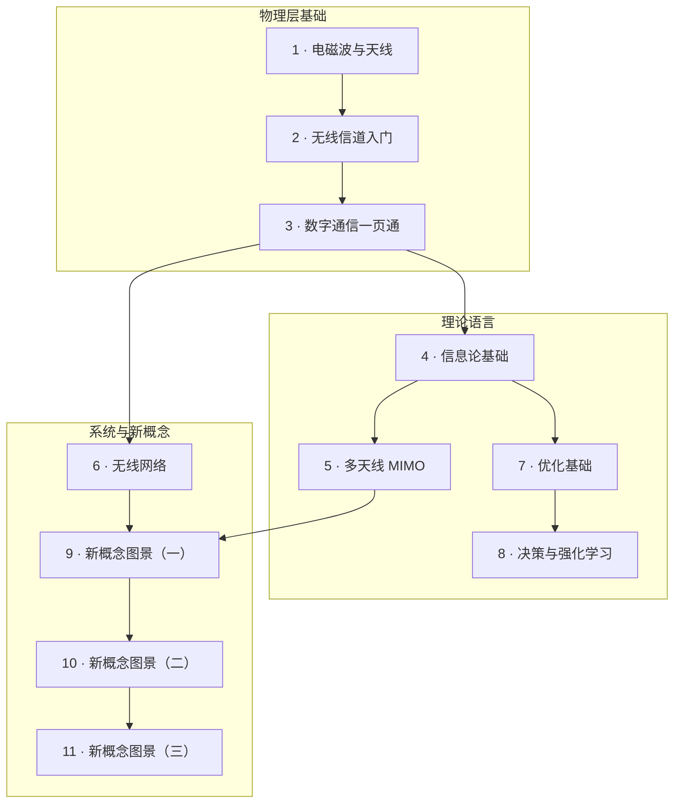

# 预备篇 · 基础教程

**使命：把四部前沿内容所需的全部基础概念，用由浅入深的教科书方式讲透——从本科水平走到能读前沿。**

每章都按同一套教学法写：**物理直觉 → 严格定义 → 逐步推导（不跳步）→ 带真实数字的算例**，章末固定有「常见误解」清单和「通往前沿」指路牌（告诉你这一章的知识在四部的哪里被用到、被挑战）。

## 本篇地图

| 章 | 你将学会 | 支撑哪几部 |
|---|---|---|
| [1 · 电磁波与天线](01-em-waves-antennas.md) | 波长/频段、近远场、增益、Friis、阵列 | 第一部 |
| [2 · 无线信道入门](02-wireless-channel-basics.md) | 路损/阴影/衰落三层、瑞利推导、四象限分类 | 第一部 |
| [3 · 数字通信一页通](03-digital-communications.md) | 调制、BER、分集、OFDM、链路预算 | 第一/三部 |
| [4 · 信息论基础](04-information-theory-basics.md) | 熵、互信息、容量、衰落容量三部曲、率失真；后文最常用的条件期望与高斯估计（4.10） | 全部 |
| [5 · 多天线 MIMO](05-mimo.md) | 分集/复用/阵列增益、SVD、大规模 MIMO | 第一部 |
| [6 · 无线网络](06-wireless-networks.md) | 蜂窝、干扰、多址、调度、协议栈、MEC | 第三/四部 |
| [7 · 优化基础](07-optimization-basics.md) | 凸性、对偶、KKT、注水完整推导 | 第三部 |
| [8 · 决策与强化学习](08-reinforcement-learning.md) | MDP、Bellman、Q-learning、DRL 谱系 | 第三/四部 |
| [9 · 新概念图景（一）](09-new-landscape.md) | 电磁空间、近场、RIS、ISAC、语义通信的真实成熟度 | 第一/二部 |
| [10 · 新概念图景（二）](10-new-phy-dof.md) | 可移动天线、超大阵列、无蜂窝、全双工、新波形、新频谱：新自由度从哪来、何时归零 | 第一/四部 |
| [11 · 新概念图景（三）](11-new-network-frontiers.md) | 卫星与低空、携能、物理层安全、信道知识地图、AI 原生网络：网络的新疆域 | 第一/二/三部 |

!!! tip "使用建议"
    预备篇不必顺读。想读第一部先补 1、2、5 章；想读第二部先补第 4 章（尤其 4.10）；想读第三部先补 4、7、8 章；想读第四部先补 4、6、8 章；第 9–11 章适合任何时候读，它们是新概念的"防忽悠指南"：每个方向一个关键推导、一个带数字的算例，第 10、11 章每节还有一张按八条线索排的体检卡。
