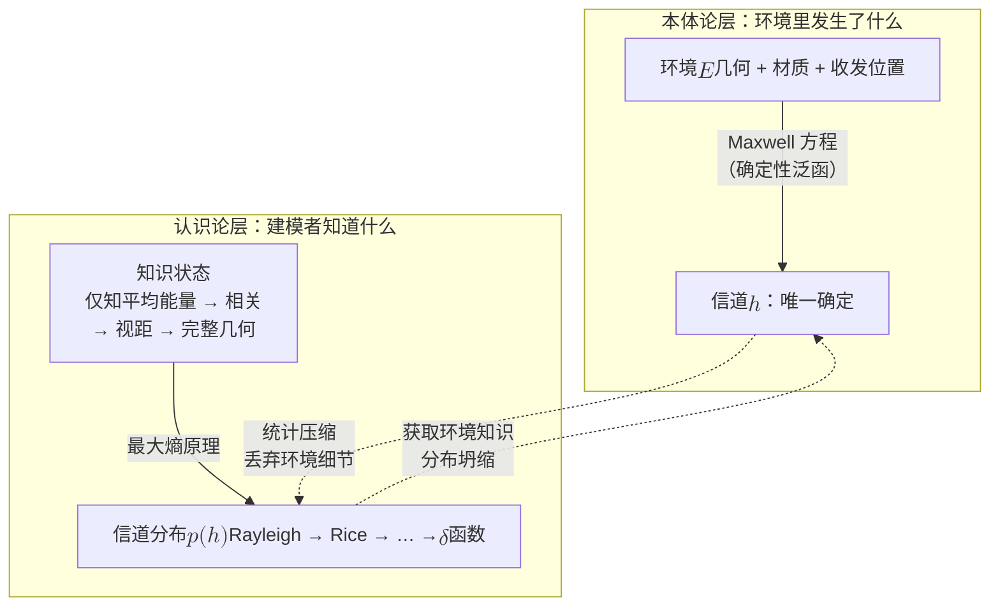
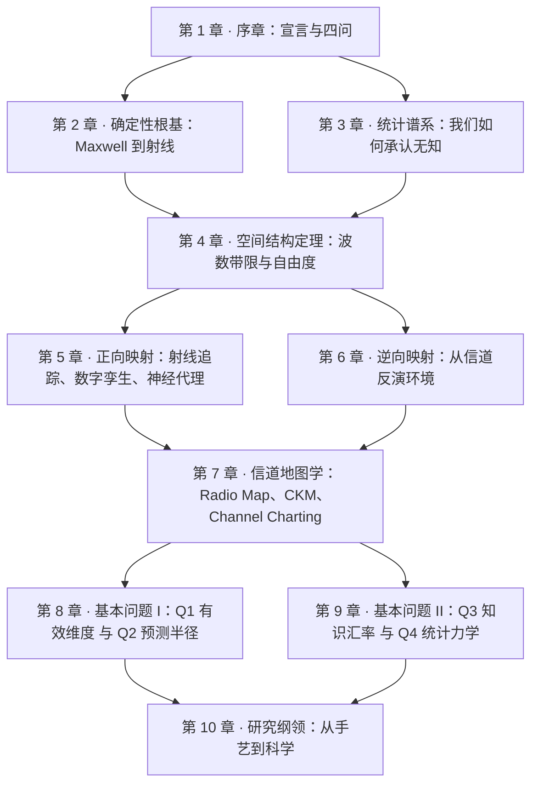

# 1 · 序章：信道随机性是一个谎言

无线通信的教科书在第一章就告诉你：信道是随机的。衰落服从 Rayleigh 分布，相位均匀，多普勒谱呈 U 形——仿佛环境里住着一位掷骰子的神。本部要做的第一件事，就是把这位神请下神坛：Maxwell 方程不掷骰子。给定环境的几何、材质与收发位置，信道被完全确定；所谓"随机"，度量的从来不是环境，而是我们对环境的无知。这是一份宣言，也是全部十章的导读。

!!! note "本章预备知识"
    本章是第一部的序章，只需电磁波与衰落的入门图像；后面九章的内容在这里只作预告，不必先读。用到的内容：

    - 天线的基本参数与极化：[预备篇 1.4](../part0/01-em-waves-antennas.md#14-天线的四个基本参数)。
    - 瑞利、莱斯衰落与 $K$ 因子：[预备篇 2.4](../part0/02-wireless-channel-basics.md#24-小尺度衰落从多径相量和到瑞利分布)；多普勒、相干时间与相干带宽：[预备篇 2.5](../part0/02-wireless-channel-basics.md#25-多普勒信道为什么会随时间变)、[预备篇 2.6](../part0/02-wireless-channel-basics.md#26-四个特征量与两对傅里叶对偶)。
    - 时变冲激响应与 WSSUS：[预备篇 2.8](../part0/02-wireless-channel-basics.md#28-信道的统一表示httau-与-htf)。
    - 最大熵原理：[预备篇 4.6](../part0/04-information-theory-basics.md#46-awgn-容量cblog_21mathrmsnr-的来历) 讲过它最简单的形式（方差给定时高斯的熵最大）；Debbah–Müller 的信道建模版本在本章定理处给出。

## 从一枚硬币说起

掷硬币是概率论第一课的标准道具——"公平硬币，正反各半"。但 Diaconis、Holmes 与 Montgomery 在 2007 年的分析给了这个直觉一记温和而致命的修正 [1]：硬币离手的瞬间，它的初始条件——上抛速度、自旋角速度、法线方向与角动量矢量的夹角——一旦确定，落地朝向就由 Euler 刚体动力学方程（约 1750 年的力学成果）完全决定。他们用高速摄影测量真实的抛掷，结论是：用力抛出的硬币倾向于以初始朝上的那一面落地，概率约为 0.51，而这个偏差的大小由一个参数唯一控制——法线与角动量的夹角。【已解决】

措辞必须小心：这不是说"硬币落哪面可以算出来"——初始条件的测量精度不允许任何人做这种预言。正确的表述是：**硬币不是随机装置，它是一个我们看不清初始条件的确定性装置**。确定性动力学，加上不可知的初始条件，产出了近似等概率的表象和一个微小但可测的系统性偏差。"随机"不在硬币里，在我们的眼睛里。

!!! tip "直觉"
    骰子、硬币、轮盘——经典物理世界里所有"随机装置"的轨迹都由牛顿力学定死。概率是我们为"看不清初始条件"这件事发明的记账方法。本部的全部论证，就是把这句话一字不改地搬到无线信道上。

本部的第一个论点，也是最激进的论点：**无线信道与硬币完全同构**。衰落不是信道的本体论属性，而是建模者知识状态的属性。这个命题断言什么、不断言什么，需要在序章就划清：它断言"随机衰落"是认识论的权宜；它不断言统计模型无用——恰恰相反，统计模型是给定无知程度下的最优选择（见下文"Rayleigh 衰落是最大无知模型"一节）；它不断言信道可以随意预测——确定与可预测之间隔着一条真实的鸿沟（见"随机性从哪里进来"一节的陷阱框）；它更不涉及热噪声——那是真随机（同一节的红线框）。

!!! note "备注（表述的出处与边界）"
    "信道随机性是一个谎言"是本站的强命题式表述。文献的措辞要谨慎得多：例如 Alkhateeb 组在信道预测工作（arXiv:2207.00934）中的立论是——给定散射环境、散射体与收发机的位置和速度，信道的输入输出响应本质上是确定性的；Debbah 与 Müller 则把信道模型定位为建模者知识状态的一致性表达 [4]。本站把这两条谨慎的陈述推到修辞的极限，但每一步论证都站在这些有出处的结果上。

## Maxwell 的裁决：信道是环境的确定性泛函

把论点变成物理，只需要写下方程。时谐场（约定 $e^{j\omega t}$）下的 Maxwell 旋度方程组为

$$
\nabla \times \mathbf{E} = -j\omega\mu_0 \mathbf{H}, \qquad \nabla \times \mathbf{H} = \mathbf{J} + j\omega\varepsilon(\mathbf{r})\,\mathbf{E}
$$

其中复介电常数 $\varepsilon(\mathbf{r}) = \varepsilon'(\mathbf{r}) - j\sigma(\mathbf{r})/\omega$ 把环境的介电与导电性质逐点编码：介质里的传导电流 $\sigma\mathbf{E}$ 与位移电流 $j\omega\varepsilon'\mathbf{E}$ 相加，恰好是 $j\omega(\varepsilon'-j\sigma/\omega)\mathbf{E}$，把损耗并进介电常数之后，$\mathbf{J}$ 只剩发射天线上的源电流。对第一式取旋度、代入第二式，三步消去磁场：

$$
\begin{aligned}
\nabla \times \nabla \times \mathbf{E}
&= -j\omega\mu_0\, \nabla \times \mathbf{H} \\
&= -j\omega\mu_0 \left( \mathbf{J} + j\omega\varepsilon(\mathbf{r})\,\mathbf{E} \right) \\
&= \omega^2 \mu_0\, \varepsilon(\mathbf{r})\, \mathbf{E} - j\omega\mu_0 \mathbf{J},
\end{aligned}
$$

得到非均匀介质中的矢量波动方程

$$
\nabla \times \nabla \times \mathbf{E} - k^2(\mathbf{r})\,\mathbf{E} = -j\omega\mu_0 \mathbf{J}, \qquad k^2(\mathbf{r}) = \omega^2 \mu_0\, \varepsilon(\mathbf{r}).
$$

记号提醒：$k(\mathbf{r})$ 是介质中的局部波数，在自由空间里就是 $k_0=2\pi/\lambda$。第一部各章给自由空间波数用了不同字母（第 2、5 章 $k_0$，第 4 章 $\kappa$，第 6、8 章 $k$，本章 Q1 的 $\beta$），都指 $2\pi/\lambda$；第 8、9 章里出现的 $\kappa$ 则另有所指，不是波数。下文的 $\hat{\mathbf{k}}$（来波方向的单位矢量）与 Rice 的 $K$ 因子也不是波数。

引入并矢 Green 函数 (dyadic Green's function) $\bar{\bar{\mathbf{G}}}(\mathbf{r},\mathbf{r}')$——它是同一方程、同一边界条件下把源换成点源的解，即满足

$$
\nabla \times \nabla \times \bar{\bar{\mathbf{G}}}(\mathbf{r},\mathbf{r}') - k^2(\mathbf{r})\, \bar{\bar{\mathbf{G}}}(\mathbf{r},\mathbf{r}') = \bar{\bar{\mathbf{I}}}\,\delta(\mathbf{r}-\mathbf{r}')
$$

（$\bar{\bar{\mathbf{I}}}$ 为单位并矢）。**并矢**可以直接读成 $3\times3$ 矩阵值函数：第 $i$ 列乘以 $-j\omega\mu_0$，就是 $\mathbf{r}'$ 处沿第 $i$ 个坐标轴的单位点电流在 $\mathbf{r}$ 处产生的电场矢量。它同样满足**辐射条件**：场在无穷远处只向外传播并衰减，不从无穷远处射入，这条要求排除了非物理的解。方程对 $\mathbf{E}$ 是线性的，任意电流分布可写成点源的叠加，于是由叠加原理，接收点的场是源电流经环境 Green 函数的确定性泛函：

$$
\mathbf{E}(\mathbf{r}) = -j\omega\mu_0 \int \bar{\bar{\mathbf{G}}}(\mathbf{r},\mathbf{r}';\,\mathcal{E})\cdot \mathbf{J}(\mathbf{r}')\, d\mathbf{r}',
$$

其中 $\mathcal{E}$ 代表环境——全部几何边界、逐点材质分布、以及辐射条件。

**物理意义**：$\bar{\bar{\mathbf{G}}}$ 就是环境的"冲激响应"——墙在哪里、墙是什么材料、窗户开在哪、桌椅怎么摆，全部信息都被压进这一个并矢函数里。经典电磁理论的唯一性定理保证：给定源、介质与边界条件，解唯一。【已解决，经典结果】

### 从场到端口：把电磁量翻译成通信量

上式给的是空间中的**场**，而通信工程处理的是端口上的**复基带系数**。这座桥必须走一遍，否则"信道是环境的确定性泛函"这句话在通信语言里没有落点。三步：

**第一步（接收天线的等效长度）。** 由互易定理，接收天线对入射场的响应可以用它自己作为发射天线时的方向图刻画。定义**矢量等效长度** $\mathbf{h}_{\mathrm{eff}}(\hat{\mathbf{k}})$（单位：米；$\hat{\mathbf{k}}$ 是来波传播方向的单位矢量，天线对不同方向的来波响应不同），则一列沿 $\hat{\mathbf{k}}$ 入射的平面波产生的开路端口电压是入射场在该矢量上的投影（多列来波从不同方向到达时，逐列投影再相加，这就是下文多径求和的来源）：

$$
V_{\mathrm{oc}}(f) = \mathbf{h}_{\mathrm{eff}}\!\left(\hat{\mathbf{k}}\right) \cdot \mathbf{E}\!\left(\mathbf{r}_{\mathrm{rx}}; f\right).
$$

**第二步（归一化成传递函数）。** 发射端把馈电电流 $I_0$ 经天线电流分布 $\mathbf{J}$ 辐射出去，接收端经匹配网络取出功率。把两端的端口量按各自的参考阻抗归一化（$|V|^2/Z$ 具有功率的量纲，所以 $V/\sqrt{Z}$ 是"根号功率"，$|H|^2$ 与收发功率比只差一个常数因子），得到与幅度约定无关的传递函数

$$
H(f;\,\mathbf{r}_{\mathrm{tx}},\mathbf{r}_{\mathrm{rx}};\,\mathcal{E}) \;=\; \frac{V_{\mathrm{oc}}(f)}{\sqrt{Z_{\mathrm{rx}}}}\cdot\frac{\sqrt{Z_{\mathrm{tx}}}}{V_{\mathrm{in}}(f)} .
$$

**第三步（回到时域）。** 对整个工作频带做逆 Fourier 变换：

$$
h(\tau) = \int H(f)\, e^{\,j2\pi f\tau}\, df .
$$

**为什么要专门走这三步**：链条上的每一环都是**确定性映射**——Green 函数由环境定、投影由天线几何定、归一化由电路定、变换是线性算子。**从环境到复基带信道系数，全程没有任何一步引入过随机变量。** 这就是本部论题在通信语言里的精确形式：信道不是随机过程的样本，它是环境的确定性泛函。（顺带一提：$\mathbf{h}_{\mathrm{eff}}$ 是矢量，$\mathbf{E}$ 也是矢量——两者的内积一步就把**极化失配**写进了信道系数，这解释了为什么极化在[预备篇第 1 章](../part0/01-em-waves-antennas.md)里是天线的一等参数。）

**行为分析**：环境变，$\bar{\bar{\mathbf{G}}}$ 变——挪动一面墙，就换了一个 Green 函数；频率升高，$k$ 增大，场对几何细节的相位敏感度按 $2\pi/\lambda$ 线性增长，这为后文"高频下几何重新可见"埋下伏笔。在射线光学近似下（从 Maxwell 到射线的完整推导链见[第 2 章](02-maxwell-foundations.md)），上述积分坍缩为 $L$ 条传播路径的求和：

$$
h(\tau) = \sum_{\ell=1}^{L} a_\ell\, e^{-j 2\pi f_c \tau_\ell}\, \delta(\tau - \tau_\ell), \qquad \tau_\ell = \frac{d_\ell}{c},
$$

窄带信道系数则是各径的相干叠加。这一步做了两件事：信号带宽 $B$ 满足 $B(\tau_{\max}-\tau_{\min})\ll1$ 时，各径时延差在一个符号内分辨不出，所有 $\delta(\tau-\tau_\ell)$ 并成一个抽头；载波相位则化为 $2\pi f_c\tau_\ell = 2\pi f_c d_\ell/c = 2\pi d_\ell/\lambda$（因为 $\lambda=c/f_c$）：

$$
H = \sum_{\ell=1}^{L} a_\ell\, e^{-j 2\pi d_\ell / \lambda}.
$$

**物理意义**：这就是"衰落"的全部真相——多条确定性路径的相干干涉。每条径的相位等于路径长度以波长为单位的度量再乘 $2\pi$；所有 $a_\ell, d_\ell$ 由环境几何与材质定死。空间中的衰落图样是一幅**刻在环境里的驻波干涉图案**：接收机移动时经历的起伏，是在读取这张图，不是在抽取随机数。

**行为分析**：敏感度是关键。路径长度差变化 $\lambda/2$，对应相位翻转 $\pi$——在 3.5 GHz（$\lambda \approx 8.6$ cm）下，只需约 4 cm 的移动。这解释了衰落为什么"看起来"随机：厘米级的位置不确定就足以把所有相位彻底打乱。而当路径数 $L$ 很大、相位近似均匀分布时，中心极限定理接管一切——这正是下文"Rayleigh 衰落是最大无知模型"一节里 Rayleigh 的物理来源，也是"四个基本问题"一节中 Q4（衰落的统计力学）的种子。

!!! example "算例（双径干涉：随机的表象，确定的内核）"
    取两条径，$a_1 = 1$，$a_2 = 0.9$，相位差 $\Delta\varphi = 2\pi (d_2 - d_1)/\lambda$。则 $|H|^2 = a_1^2 + a_2^2 + 2 a_1 a_2 \cos\Delta\varphi = 1.81 + 1.8\cos\Delta\varphi$。同相时 $|H| = 1.9$（$+5.6$ dB），反相时 $|H| = 0.1$（$-20$ dB）——总摆幅约 25.6 dB。在 3.5 GHz 下，路径长度差改变 $\lambda/2 \approx 4.3$ cm 就足以从峰值跌进深衰落。若你不知道 $d_1, d_2$，逐点测量像抽奖；若你知道，每个测量值都是一条余弦曲线上的确定点。深衰落不是坏运气，是几何。

## 随机性从哪里进来：三重无知与一条红线

既然 Maxwell 方程里没有随机变量，工程实践中的"随机性"从哪里进来？答案是三种无知 (ignorance)，各自对应一条获取知识后可以消除的通道：

1. **环境无知**：不知道环境的几何与材质。楼在哪里、墙是砖还是玻璃、$\varepsilon(\mathbf{r})$ 逐点是多少——这是最大的一块，也是本部"环境的科学"要正面处理的对象。
2. **位置无知**：不知道自己在波长尺度上的精确位置。GPS 给米级精度，而相位在厘米尺度上就翻天覆地；米级定位下，驻波图样上的读数等效于均匀抽样。数量级：设沿传播方向的位置误差 $\delta\sim\mathcal{N}(0,\sigma_d^2)$，单条径的相位误差就是 $2\pi\delta/\lambda$，用它预测出的系数与真值的平均相干度为 $|\mathbb{E}[e^{j2\pi\delta/\lambda}]| = e^{-2\pi^2\sigma_d^2/\lambda^2}$（高斯特征函数 $\mathbb{E}[e^{jX}]=e^{-\sigma^2/2}$）。要保住 0.9 的相干度，3.5 GHz 下需 $\sigma_d\approx 6.3$ mm，28 GHz 下约 0.8 mm；3.5 GHz 下 $\sigma_d = 1$ m 时相干度约 $e^{-2700}$，与零无异。
3. **动态无知**：环境中存在未被跟踪的动态散射体——走动的人、驶过的车。环境本身在时间轴上是个变量，而我们没有它的实时状态。

{ .chart loading=lazy }
{ .chart loading=lazy }

*怎么读这张图：横轴是沿传播方向的位置误差标准差 $\sigma_d$（毫米），纵轴是用它预测出的单径系数与真值的平均相干度 $e^{-2\pi^2\sigma_d^2/\lambda^2}$。第一条是 3.5 GHz（$\lambda\approx8.6$ cm），第二条是 28 GHz（$\lambda\approx1.07$ cm），第三条标出 0.9。要保住 0.9 的相干度，第一条只容许约 6.3 mm 的定位误差，第二条只容许约 0.8 mm；28 GHz 下误差到 4 mm 时相干度只剩 0.06。米级定位远在图的右边之外：3.5 GHz 下 $\sigma_d=1$ m 时相干度约 $e^{-2700}$，与零无异。按上面第 2 条的公式逐点计算，每 0.5 mm 一点。*

现代文献用一对术语区分两类不确定性：**偶然不确定性 (aleatoric uncertainty)**——对象固有的随机性，任何知识都无法消除；**认知不确定性 (epistemic uncertainty)**——模型或知识的缺陷，可通过获取信息消除。本部的核心论断用这对术语可以一句话说完：**衰落属于认知不确定性，不属于偶然不确定性**。三重无知都是可以还债的债务，不是自然律的税收。

!!! warning "红线：热噪声不在被告席上"
    "谎言"的指控范围仅限衰落/多径。接收机的热噪声是真随机——它源于载流子的热运动，是量子/热力学层面的偶然不确定性，任何环境知识都不能把它消除。把热噪声也说成"认识论的"，是会被内行一眼抓住的错误。本部通篇维持这条边界：环境决定信道系数 $h$，物理决定噪声 $n$；我们清算前者的随机性神话，向后者致以统计力学的敬意。

!!! warning "陷阱：确定不等于可预测"
    从"信道被环境唯一确定"推不出"信道可以被预测"。波长尺度的位置敏感性意味着环境模型的毫米级误差就可能毁掉相位预测；动态散射体意味着环境状态本身在漂移。混沌系统（初值的微小误差随时间指数放大的确定性系统，天气是典型例子）同样是确定性的，却实际不可长期预测。本部不掩盖这个张力——它恰恰是基本问题 Q2（预测半径）的存在理由：确定性告诉我们预测**原则上**有根基，敏感性告诉我们预测**实际上**有边界，而这条边界在哪里，是一个截至 2026-08 没有统一定理的开放问题。

把本体论与认识论两层画在一张图上，本部十章的全部内容都在这张图的四个箭头上：

## Rayleigh 衰落是最大无知模型

通往 Rayleigh 分布有两条路。第一条是**物理路线**：Clarke 在 1968 年把移动接收建模为大量随机相位平面波的各向同性叠加，中心极限定理给出零均值复高斯的复包络，于是包络服从 Rayleigh 分布、空间自相关为 $J_0(2\pi d/\lambda)$、多普勒谱呈 U 形 [2]；Jakes 随后把它工程化为仿真标准 [3]。【已解决，教科书标准】

第二条是**认识论路线**，也是本章的定理级支点。Debbah 与 Müller 在 2005 年提出：信道建模应当遵循 Jaynes 的最大熵原理——模型不是对物理的描述，而是对建模者**知识状态 (state of knowledge)** 的一致性表达；分布应该在"与已知信息一致"的前提下最大化熵，即对未知之事不做任何隐含承诺 [4]。这条路线上，Rayleigh 是一道三步变分题。

设对信道系数 $h \in \mathbb{C}$ 仅知平均能量 $\mathbb{E}[|h|^2] = E_0$。求在此约束下最大化微分熵的分布：

$$
\max_{p}\; -\int_{\mathbb{C}} p(h) \ln p(h)\, dh
\quad \mathrm{s.t.} \quad \int p(h)\, dh = 1,\;\; \int |h|^2 p(h)\, dh = E_0.
$$

第一步，写出 Lagrange 泛函：

$$
\mathcal{L}[p] = -\int p \ln p\, dh \;+\; \lambda_0 \left( \int p\, dh - 1 \right) \;+\; \lambda_1 \left( \int |h|^2 p\, dh - E_0 \right).
$$

第二步，对 $p$ 求变分并令其为零。没学过变分法也能这样理解：把复平面切成小格，积分变成对每格取值 $p_i$ 的求和，$\mathcal{L}$ 就是普通的多元函数；对某一个 $p_i$ 求偏导，只有含 $p_i$ 的项有贡献，$\frac{d}{dp}(-p\ln p)=-\ln p-1$，两个约束项分别贡献 $\lambda_0$ 与 $\lambda_1|h_i|^2$（公共的格面积因子约掉）。令每个偏导为零，就是下式逐点成立：

$$
\frac{\delta \mathcal{L}}{\delta p} = -\ln p(h) - 1 + \lambda_0 + \lambda_1 |h|^2 = 0
\quad \Longrightarrow \quad
p(h) = e^{\lambda_0 - 1}\, e^{\lambda_1 |h|^2}.
$$

第三步，把两个常数真正定出来。记 $C := e^{\lambda_0-1}$，可积性要求 $\lambda_1 < 0$。在复平面上用极坐标 $h = re^{j\theta}$（面元 $dh = r\,dr\,d\theta$）算两个积分：

$$
\begin{aligned}
\text{归一化：}&\quad \int_{\mathbb{C}} C e^{\lambda_1|h|^2} dh = C\int_0^{2\pi}\!\!\int_0^{\infty} e^{\lambda_1 r^2} r\,dr\,d\theta = \frac{\pi C}{-\lambda_1} = 1,\\[4pt]
\text{能量约束：}&\quad \int_{\mathbb{C}} |h|^2 p(h)\, dh = \frac{1}{-\lambda_1} = E_0 .
\end{aligned}
$$

两个积分的算法：令 $u=r^2$，$\int_0^\infty e^{\lambda_1 r^2} r\,dr = \frac{1}{-2\lambda_1}$，乘 $2\pi C$ 得第一式；能量约束多一个 $r^2$，$2\pi C\int_0^\infty r^3 e^{\lambda_1 r^2}dr = \pi C/\lambda_1^2$，再用第一式的 $\pi C=-\lambda_1$ 化成 $1/(-\lambda_1)$。又因 $-p\ln p$ 是凹函数、约束都是线性的，这个驻点是最大值而非最小值。第二式直接给 $\lambda_1 = -1/E_0$，代回第一式给 $C = 1/(\pi E_0)$，于是

$$
p(h) = \frac{1}{\pi E_0} \exp\!\left( -\frac{|h|^2}{E_0} \right).
$$

这正是零均值复高斯 $\mathcal{CN}(0, E_0)$：写 $h=x+jy$，密度恰好分解为两个 $\mathcal{N}(0,E_0/2)$ 密度之积，所以实部虚部独立同方差高斯；密度只依赖 $|h|$、与相位无关，所以相位均匀。再走一步就得到包络分布——对相位积分并用同一个雅可比 $r$：

$$
p(r) = \int_0^{2\pi} p(re^{j\theta})\, r\, d\theta = \frac{2r}{E_0}\, e^{-r^2/E_0},\qquad r \ge 0,
$$

即 Rayleigh 分布（与[第 3 章](03-statistical-lineage.md)从多径相量和推出的形式一致，只需记 $E_0 = 2\sigma^2$）。推广到 MIMO 矩阵：在"仅知平均能量"的约束下，最大熵解是各元素独立同分布的复高斯——教科书的 i.i.d. Rayleigh MIMO 模型 [4]。【已解决】

!!! abstract "定理（最大熵信道建模，Debbah–Müller 2005 [4]）"
    在仅知信道平均能量的约束下，使微分熵最大的信道分布是独立同分布零均值复高斯，即 Rayleigh 衰落。每增加一条可验证的先验知识（空间相关、方向性、视距分量、协方差结构……），最大熵原理都给出相应的、唯一的、更结构化的分布；例如协方差矩阵在平均迹约束下的最大熵分布为 Wishart 分布。

**物理意义**：熵是无知的度量，最大熵是诚实的纪律——只承认知道的，不虚构不知道的。于是这个定理说的是一句惊人的话：**Rayleigh 衰落是最大无知模型**。它不是对环境的陈述（环境里没有高斯分布的骰子），而是对建模者知识状态的陈述——"除了平均能量我一无所知"这句话的概率论翻译。教科书第一章教的不是信道的物理，而是我们无知的几何。

**行为分析**：把知识当作一个旋钮。多知道一个视距分量的功率比（Rice $K$ 因子，即视距径功率与散射分量功率之比，见[预备篇 2.4 节](../part0/02-wireless-channel-basics.md)），最大熵解变成 Rice 型；$K$ 趋于无穷意味着散射部分相对视距径可以忽略，分布收缩到确定信道。多知道空间相关，得到相关高斯。知识增加到完整环境几何与材质，分布连续地坍缩到 $\delta(h - h_{\mathrm{true}})$——随机性**蒸发殆尽**。反方向拧到底：富散射 sub-6 GHz 环境、对环境一无所知时，Rayleigh 与实测惊人地吻合——它没有错，它是给定无知程度下的最优模型。批评 Rayleigh"不符合物理"是弄错了它的度量对象。

!!! success "关键结论"
    Rayleigh 衰落度量的对象是我们的无知，不是环境。两条路线——物理的（多径 + 中心极限定理）与认识论的（最大熵）——殊途同归于同一个分布，这既解释了它为何如此稳健，也预言了它何时崩塌：路径数不再多（毫米波稀疏散射）或知识不再少（环境感知网络）时，Rayleigh 的两个前提各断一条。这个"殊途同归 + 双重崩塌"的结构，就是 Q4「衰落的统计力学」的出发点。

## 统计范式：理性的选择与它的账单

如果信道确定论在物理上如此显然，教科书为什么六十年只教统计衰落？答案不是愚蠢，而是理性——在当时的约束下，统计范式几乎是唯一可能的科学策略。[第 3 章](03-statistical-lineage.md)将完整梳理这个谱系，这里给出三条历史原因与一张账单。

### 三个历史原因

**测量技术**。1960 年代的移动电台只能记录"信号电平随时间的变化"——没有宽带信道探测仪，没有厘米级定位，没有环境三维扫描。测得到统计量，测不到几何，于是科学只能建立在测得到的东西上。Okumura 1968 年的东京大规模路测经验曲线与 Hata 1980 年的经验公式化（此处仅作历史提及）是"把测量压缩成统计规律"路线的代表；Bello 1963 年建立了随机时变信道的系统函数与 WSSUS（广义平稳非相关散射：统计量不随时间变、不同时延的散射分量互不相关，见[预备篇 2.8 节](../part0/02-wireless-channel-basics.md)）数学框架 [5]；Clarke 与 Jakes 把散射建为随机相位平面波叠加 [2][3]；Turin 等 1972 年做了城市多径的统计建模；Saleh 与 Valenzuela 1987 年发现室内多径以"簇"到达——簇与簇内射线各为 Poisson 过程、功率双指数衰减 [6]。这条线上每一步都是对"测不到几何"这一约束的最优响应。

**计算力**。城市尺度上求解 Maxwell 方程在当时完全不可行。射线追踪 (ray tracing) 直到 1991 年才被 McKown 与 Hamilton 引入无线网络设计工具箱 [7]，且受制于建筑数据库精度与算力，只用于覆盖预测，不敢碰链路级设计。

**系统设计需求**。工程师要的不是"这个环境的信道"，而是"这一类环境的性能保证"——中断概率、衰落裕量、分集增益全是系综概念；标准化更需要可复现、站点无关的公共模型供各厂商公平对比。3GPP TR 38.901 的几何随机信道模型 (Geometry-based Stochastic Channel Model, GSCM；文献中也写作 GBSM，两者同指，本站统一用 GSCM，见[第 3 章](03-statistical-lineage.md)) 是这一逻辑的当代产物，覆盖 0.5–100 GHz，至今持续演进（V19 版本更新至 2026 年）——统计范式今天仍然活得很好。作为回报，Rayleigh/Rice 假设换来了一整套闭式理论：误码率、遍历容量、分集-复用折中。

### 账单

理性的选择也有账单。统计压缩把环境知识**整体丢弃**了：同一个基站在同一栋楼前服务了十年，系统对这栋楼的了解仍然是零——每个相干块都要从零开始估计 CSI，像一位顺行性遗忘症患者每天重新自我介绍。这笔开销在 4G 时代尚可忍受；到大规模天线 × 大带宽 × 密集组网的 6G 场景，导频开销撞墙。算一笔粗账：相干块约含 $\tau_c\approx T_cB_c$ 个符号，取车速 30 m/s（108 km/h）、$T_c\approx0.423/f_m$、$B_c\approx1/(5\sigma_\tau)$（见[预备篇 2.6 节](../part0/02-wireless-channel-basics.md)）。3.5 GHz、时延扩展 1 μs 时，$f_m=350$ Hz，$T_c\approx1.2$ ms，$B_c=200$ kHz，$\tau_c\approx240$；64 个波束各占一个导频符号，就吃掉 27%。28 GHz 散射稀疏，时延扩展取 100 ns，$B_c$ 放大十倍而 $f_m$ 放大八倍，$\tau_c\approx300$；但阵列要扫 256 个波束，导频占 85%，留给数据的只剩 15%。这正是信道知识地图 (Channel Knowledge Map, CKM) 被提出的动机：Zeng 与 Xu 2021 年将其定义为位置标记的站点特定信道知识数据库，其作用是 "facilitate or even obviate"（促进乃至免除）实时 CSI 获取 [8]——注意措辞是补充与替代的谱系，不是宣布 CSI 估计死亡 [8][9]。

### 钟摆回摆

确定性视角的复兴不是一篇论文，而是一条三十年的证据链：1991 年射线追踪进入网络设计 [7]；2005 年最大熵框架把随机性认识论化 [4]；2013 年 Rappaport 等的 28/38 GHz 实测宣告毫米波可用——信道稀疏、少数簇主导、定向波束必需，**几何重新变得可见、可用** [10]；2015 年射线追踪综述标志工程化成熟 [11]；2021 年 CKM 概念提出 [8]；2022 年 radio map 估计综述集大成 [12]、ISAC 综述宣告"感知即环境获取"——通信网络自己长出了眼睛 [13]；2023 年 Sionna RT 把射线追踪做成可微分算子，环境到信道的映射第一次可以求梯度、可以训练 [14]，同年 Alkhateeb 等提出实时数字孪生愿景 [15]；2024 年 CKM tutorial 系统化了从 environment-unaware 到 environment-aware 的范式转移 [9]，Zhang Jianhua 组定义了数字孪生信道的五级演进并提出无线环境信息论 (WEIT) 的理论化尝试 [16]；2025 年 CKM 第二波综述与专用数据集生态成型 [17]。前沿还在加速：大模型生成数字孪生信道（ChannelGPT, arXiv:2410.13379）、射线追踪实时性基准（arXiv:2406.05042）、稀疏测量下传播一致的环境孪生（arXiv:2605.22361）——这些都是 2024–2026 年进行中的工作，详见[第 5 章](05-deterministic-revival.md)与[第 7 章](07-channel-cartography.md)。

6G 逼出这个转向的物理逻辑有两条。其一，**高频稀疏散射**：毫米波/太赫兹下路径数少、几何主导，"大量路径"这个中心极限定理的前提崩塌，同时大带宽大阵列使导频开销不可承受——环境先验从奢侈品变成刚需。其二，**感知通信一体化**：ISAC 让网络免费获得环境几何，"环境无知"从技术约束变成主动选择。当无知不再是被迫的，为无知设计的模型就该退居二线了。

## 四个基本问题

宣言喊完，账单看完，剩下的是科学问题。本部把"环境的科学"组织为四个基本问题，序章对每问只给一个直觉与一个悬念，定量内容全部留给后续章。

!!! note "备注（框架的原创性声明）"
    以下四问的名称——有效维度、预测半径、知识汇率、衰落的统计力学——均为本站为组织材料提出的原创框架，不是文献共识术语。各问对应的真实文献研究线分别为：Q1 对应 Bucci–Franceschetti 散射场自由度理论 [18]；Q2 对应空间相关距离、信道外推与 radio map 估计误差分析；Q3 对应 CSI 价值与 CKM 增益量化的零散结果 [8][9][17]；Q4 对应最大熵建模 [4] 与 CLT 涌现分析。引用本部时请将四问表述归于本站，勿归于上述文献。

### Q1 环境的信道有效维度

环境是无穷维的——$\varepsilon(\mathbf{r})$ 在每一点都是自由度。但信道泛函真的依赖这无穷维吗？Bucci 与 Franceschetti 的经典结果给出否定答案：被半径 $a$ 的最小球包围的散射体，其散射场在观测域上是近似空间带限函数，有效空间带宽与 $\beta a$ 同量级（$\beta = 2\pi/\lambda$ 为波数），自由度约等于相应的 Nyquist 数，超出后表示误差指数级下降 [18]。这与时域采样定理同理：带宽 $W$、时长 $T$ 的信号约有 $2WT$ 个自由度；这里被限定的是场沿观测线起伏的快慢，上限由散射体的电尺寸 $\beta a$ 决定，所以沿观测线取与 $\beta a$ 同量级个样本就能恢复整条场，这个样本数就是 Nyquist 数。【已解决；精细常数此处从略】数量级感受（注意它敏感依赖**观测几何**）：$\lambda = 10$ cm、$a = 5$ m 时 $\beta a \approx 314$——沿一条一维观测弧线看，这栋楼是"几百维"的对象；若在完整的二维观测面上看，自由度按 $(\beta a)^2$ 计，量级升到十万维。但无论哪种几何，结论的骨架不变：**有限维，且远小于环境的原始描述维度**——不是无穷维，也不是十维。悬念：一条街道峡谷的**信道有效维度**到底是多少？知道这个数，就知道 CKM 该存多少字节、传感该测多少样本。波数带限的严格理论见[第 4 章](04-spatial-structure.md)，维度问题的完整处理见[第 8 章](08-dimension-and-prediction.md)。

### Q2 信道场的预测半径

知道此处的信道，能外推多远？最大无知模型给出的答案短得残酷。Clarke 模型下，各向同性到达的平面波在相距 $d$ 的两点产生的信道相关为

$$
\rho(d) = \mathbb{E}\!\left[ e^{\,j \frac{2\pi d}{\lambda} \cos\theta} \right]
= \frac{1}{2\pi} \int_0^{2\pi} e^{\,j \frac{2\pi d}{\lambda} \cos\theta}\, d\theta
= J_0\!\left( \frac{2\pi d}{\lambda} \right),
$$

第一个等号的来历：从与两点连线成 $\theta$ 角的方向来的平面波，到两点的波程差是 $d\cos\theta$，相位只差 $\frac{2\pi d}{\lambda}\cos\theta$；许多等功率、相位相互独立的平面波叠加时，不同波之间的交叉项平均为零，归一化相关就只剩这个相位因子按到达角的平均。其中第二个等号用了到达角 $\theta$ 在 $[0, 2\pi)$ 上均匀分布，第三个等号是 Bessel 函数的积分表示。$J_0$ 的第一个零点在宗量 $\approx 2.405$ 处，即 $d \approx 0.38\lambda$ [2]。【已解决】

**物理意义**：在"对环境一无所知"的世界里，走出不到半个波长，此处的信道知识就变得毫无用处——3.5 GHz 下约 3 厘米。这就是统计范式给预测能力判的刑期。

**行为分析**：注意这里的零点是 $0.38\lambda$ 而不是常被顺口说出的 $\lambda/2$——两个数都对，差别在**谱的维度**：本式假设到达角分布在**水平面内**（Clarke 的二维各向同性），投影到直线上得到 arcsine 型谱（$\theta$ 均匀时，$u=\cos\theta$ 的密度为 $1/(\pi\sqrt{1-u^2})$，两端高、中间低，与多普勒 U 形谱是同一条曲线），相关函数是 $J_0$，首零点 $0.38\lambda$；若散射在**三维**球面上各向同性，投影是均匀谱（球面上均匀分布的方向，其 $\cos\theta$ 在 $[-1,1]$ 上均匀），相关函数变成 $\mathrm{sinc}(2r/\lambda)$（这里 $\mathrm{sinc}(x)=\sin(\pi x)/(\pi x)$，即 $\sin(2\pi r/\lambda)/(2\pi r/\lambda)$），零点严格落在 $m\lambda/2$（[第 4 章](04-spatial-structure.md)定理 4.2）。引用"相干距离"时必须同时交代场景维度与定义（首零点还是相关阈值）。更重要的是这个数的**条件性**：它是最大无知下的相关距离。环境已知时，预测半径可以大幅扩张——radio map 在数十米尺度上插值路径增益，环境感知的信道外推在文献中反复展示了远超 $0.4\lambda$ 的有效预测（radio map 估计误差与采样密度关系的理论分析见 IEEE TWC 2024，arXiv:2310.15106，部分结果；部分可观测环境下的信道预测见 arXiv:2207.00934）。悬念：**预测半径作为环境知识量的函数**——这条曲线的形状，截至 2026-08 没有统一定理。【开放】见[第 7 章](07-channel-cartography.md)与[第 8 章](08-dimension-and-prediction.md)。

### Q3 环境知识的汇率

一比特环境知识，能换回多少比特每秒每赫兹的容量？直觉上这个汇率存在：知道"视距/非视距"这一个比特，波束训练的搜索空间就塌缩一半以上；知道完整几何，导频开销趋于零。CKM 文献里散落着大量增益的实测与仿真 [8][9][17]，WEIT 主张无线环境信息可以像统计通信信息一样被量化 [16]——但"汇率"作为一个信息论对象（环境知识的比特数 ↔ 容量增益的换算定理）尚不存在。悬念：存在 Shannon 式的换算定理吗？还是汇率本质上依赖环境类别、不存在普适常数？【开放】见[第 9 章](09-exchange-and-universality.md)。

### Q4 衰落的统计力学

Rayleigh 是一个涌现现象：微观上是确定性的多径相位，宏观上涌现出高斯统计——与理想气体从确定性分子动力学涌现出 Maxwell–Boltzmann 分布结构相同，且同样有两条推导路线（系综平均与最大熵）殊途同归。这个类比暗示一门尚不存在的学科：**衰落的统计力学**——从环境的系综第一性地推导衰落分布族，并预言其失效条件。失效已经被观测到：毫米波下路径数只有几条，CLT 前提崩塌，实测分布偏离 Rayleigh [10]。最大熵给了纲领的起点 [4]，确定性与随机电磁信息论的统一数学框架刚有辛几何方向的尝试（arXiv:2508.16601，进行中）。悬念：给定一个环境类别的统计描述（建筑高度分布、材质分布），衰落分布族能否被**推导**而非**假设**？【开放】见[第 9 章](09-exchange-and-universality.md)。

**四问一览**（本站框架，见上方原创性声明；锚点与状态取自以上四小节）：

| 问题 | 问的是什么 | 经典结果给的锚点 | 悬而未决的是什么 | 状态 | 展开 |
|---|---|---|---|---|---|
| Q1 有效维度 | 信道泛函实际依赖环境的多少个自由度 | Bucci–Franceschetti：散射场近似空间带限，自由度约为 Nyquist 数，与 $\beta a$ 同量级（完整二维观测面按 $(\beta a)^2$ 计） | 一条街道峡谷的信道有效维度是多少 | 锚点【已解决】；具体环境类【开放】 | [第 4 章](04-spatial-structure.md)、[第 8 章](08-dimension-and-prediction.md) |
| Q2 预测半径 | 知道此处的信道，能外推多远 | 二维各向同性散射下相关首零点 $0.38\lambda$（3.5 GHz 约 3 cm） | 预测半径作为环境知识量的函数 | 锚点【已解决】；函数形状【开放】 | [第 7 章](07-channel-cartography.md)、[第 8 章](08-dimension-and-prediction.md) |
| Q3 知识汇率 | 一比特环境知识换回多少比特每秒每赫兹 | CKM 文献中散落的增益实测与仿真 [8][9][17] | 是否存在 Shannon 式的换算定理，汇率是否依赖环境类别 | 【开放】 | [第 9 章](09-exchange-and-universality.md) |
| Q4 衰落的统计力学 | 能否从环境系综推导出衰落分布族 | 富散射下 CLT 与最大熵给出瑞利；毫米波少径时实测偏离瑞利 [10] | 给定环境类别的统计描述，衰落分布族能否被推导而非假设 | 【开放】 | [第 9 章](09-exchange-and-universality.md) |

## 本部的阅读地图

十章的逻辑是一条完整的认识论回路：先立确定性根基（第 2 章），再理解统计范式如何以及为何承认无知（第 3 章），然后建立信道空间结构的数学（第 4 章），沿正向映射（环境到信道，第 5 章）与逆向映射（信道到环境，第 6 章）走一个来回，把两个方向的知识沉淀为地图（第 7 章），最后在四个基本问题（第 8、9 章）与研究纲领（第 10 章）中收束。

按需取用的三条路径：**理论线**——[第 2 章](02-maxwell-foundations.md) → [第 4 章](04-spatial-structure.md) → [第 8 章](08-dimension-and-prediction.md) → [第 9 章](09-exchange-and-universality.md)，适合想直取数学核心的读者；**工程线**——[第 5 章](05-deterministic-revival.md) → [第 6 章](06-inverse-problem.md) → [第 7 章](07-channel-cartography.md)，适合做系统与算法的读者；**历史与纲领线**——[第 3 章](03-statistical-lineage.md) → [第 10 章](10-research-agenda.md)，适合想理解"这个领域往哪里去"的读者。无论走哪条线，建议最后都回到[第 10 章](10-research-agenda.md)：那里把四问装配成一个可执行的研究纲领。

!!! info "跨部连线"
    本章所在的线索：[信息结构](../guide/05-eight-threads.md#2-信息结构谁在什么时候知道什么)、[自由度与秩](../guide/05-eight-threads.md#3-自由度与秩先问能不能再问有多好)、[任务与价值](../guide/05-eight-threads.md#8-任务与价值精度要多高才够用)。

    - [第二部 1.2 节](../part2/01-four-arrows.md#12-把链写成算子复合四个箭头四种互不换算的度量)：本部研究链上的第一根箭头"环境 → 信道"；第二部把它接上"信道 → 观测 → 任务"，问环境知识怎样一路变成业务价值。
    - [第三部第 1 章「一个调度器的一天」](../part3/01-three-mountains.md#一个调度器的一天三个不知道)：本章把信道的随机性拆成三重无知；第三部把调度器的困难拆成三个"不知道"，两边面对的都是"缺少知识时最多能做到多好"。
    - [第四部 9.8 节](../part4/09-research-agenda.md#98-全站收尾四部如何合成一个体系)：四个基本问题在全站四部合成表里的位置。Q3 的多方版本（许多节点一起感知、一起分享环境知识）是全站闭环上唯一还完全空白的一段。

## 开放问题

序章立场鲜明，因此更有义务把"还不知道的"列清楚。以下状态截至 2026-08：

1. **实时数字孪生的构建与校准**：材质电磁参数获取、动态物体跟踪、孪生与现实的漂移控制——被文献明确列为开放问题 [15]，稀疏测量下传播一致的孪生构建（arXiv:2605.22361）是最新尝试。【开放】
2. **学习型 radio map / CKM 的泛化性、精度与可扩展性**：跨环境泛化与大规模部署的鲁棒性被综述明确列为三大挑战 [17]。【开放】
3. **Radio map 估计的基本极限**：采样密度与重构误差的关系已有理论分析（IEEE TWC 2024, arXiv:2310.15106），但距离"基本极限"意义上的紧界尚远。【部分结果】
4. **确定性与随机建模的统一数学框架**：辛几何方向的统一尝试刚起步（arXiv:2508.16601）。【开放】
5. **环境信息的信息论度量**：WEIT 提出无线环境信息可量化并主张以环境确定性消解信道不确定性 [16]，但严格的量化定义及其与容量的关系远未完成。【开放】
6. **本站四问本身**：Q1 有效维度在一般环境类别下的计算、Q2 预测半径作为知识量的函数、Q3 知识汇率的存在性定理、Q4 衰落分布族的第一性推导——均无定理级答案，它们构成[第 10 章](10-research-agenda.md)研究纲领的骨架。【开放】

## 参考文献

1. P. Diaconis, S. Holmes, R. Montgomery, 《Dynamical Bias in the Coin Toss》, SIAM Review, 49(2):211–235, 2007. https://epubs.siam.org/doi/10.1137/S0036144504446436
2. R. H. Clarke, 《A Statistical Theory of Mobile-Radio Reception》, Bell System Technical Journal, 47(6):957–1000, 1968. https://onlinelibrary.wiley.com/doi/abs/10.1002/j.1538-7305.1968.tb00069.x
3. W. C. Jakes (ed.), 《Microwave Mobile Communications》, Wiley, 1974（IEEE Press 重印 1994）.
4. M. Debbah, R. R. Müller, 《MIMO Channel Modeling and the Principle of Maximum Entropy》, IEEE Transactions on Information Theory, 51(5):1667–1690, 2005. https://www.eurecom.fr/en/publication/1316/download/cm-debbme-050501.pdf
5. P. A. Bello, 《Characterization of Randomly Time-Variant Linear Channels》, IEEE Transactions on Communication Systems, 11(4):360–393, 1963. DOI: 10.1109/TCOM.1963.1088793
6. A. A. M. Saleh, R. A. Valenzuela, 《A Statistical Model for Indoor Multipath Propagation》, IEEE Journal on Selected Areas in Communications, 5(2):128–137, 1987. https://doi.org/10.1109/JSAC.1987.1146527
7. J. W. McKown, R. L. Hamilton, 《Ray Tracing as a Design Tool for Radio Networks》, IEEE Network, 5(6):27–30, 1991.
8. Y. Zeng, X. Xu, 《Toward Environment-Aware 6G Communications via Channel Knowledge Map》, IEEE Wireless Communications, 28(3):84–91, 2021. https://dl.acm.org/doi/10.1109/MWC.001.2000327
9. Y. Zeng, J. Chen, J. Xu, D. Wu, X. Xu, S. Jin, X. Gao, D. Gesbert, S. Cui, R. Zhang, 《A Tutorial on Environment-Aware Communications via Channel Knowledge Map for 6G》, IEEE Communications Surveys & Tutorials, 26(3):1478–1519, 2024. https://arxiv.org/abs/2309.07460
10. T. S. Rappaport et al., 《Millimeter Wave Mobile Communications for 5G Cellular: It Will Work!》, IEEE Access, 1:335–349, 2013. https://doi.org/10.1109/ACCESS.2013.2260813
11. Z. Yun, M. F. Iskander, 《Ray Tracing for Radio Propagation Modeling: Principles and Applications》, IEEE Access, 3:1089–1100, 2015. https://www.semanticscholar.org/paper/7836e558038a5a0fa22a5e5e9eb4c4c749f05aac
12. D. Romero, S.-J. Kim, 《Radio Map Estimation: A Data-Driven Approach to Spectrum Cartography》, IEEE Signal Processing Magazine, 39(6):53–72, 2022.
13. F. Liu, Y. Cui, C. Masouros, J. Xu, T. X. Han, Y. C. Eldar, S. Buzzi, 《Integrated Sensing and Communications: Toward Dual-Functional Wireless Networks for 6G and Beyond》, IEEE Journal on Selected Areas in Communications, 40(6):1728–1767, 2022. https://dl.acm.org/doi/abs/10.1109/JSAC.2022.3156632
14. J. Hoydis et al., 《Sionna RT: Differentiable Ray Tracing for Radio Propagation Modeling》, arXiv:2303.11103, 2023. https://arxiv.org/abs/2303.11103
15. A. Alkhateeb et al., 《Real-Time Digital Twins: Vision and Research Directions for 6G and Beyond》, IEEE Communications Magazine, 61(11), 2023. https://arxiv.org/abs/2301.11283
16. J. Zhang et al., 《Digital Twin Channel for 6G: Concepts, Architectures and Potential Applications》, arXiv:2403.12467, 2024（https://arxiv.org/abs/2403.12467）；同组《Wireless Environmental Information Theory (WEIT)》, arXiv:2412.11479, 2024. https://arxiv.org/abs/2412.11479
17. X. Liu, S. Sun, M. Tao, A. Kaushik, H. Yan, 《Channel Knowledge Maps for 6G Wireless Networks: Construction, Applications, and Future Challenges》, arXiv:2505.24151, 2025. https://arxiv.org/abs/2505.24151
18. O. M. Bucci, G. Franceschetti, 《On the Spatial Bandwidth of Scattered Fields》, IEEE Transactions on Antennas and Propagation, 35(12):1445–1455, 1987；及《On the Degrees of Freedom of Scattered Fields》, IEEE Transactions on Antennas and Propagation, 37(7):918–926, 1989. https://ui.adsabs.harvard.edu/abs/1987ITAP...35.1445B/abstract
