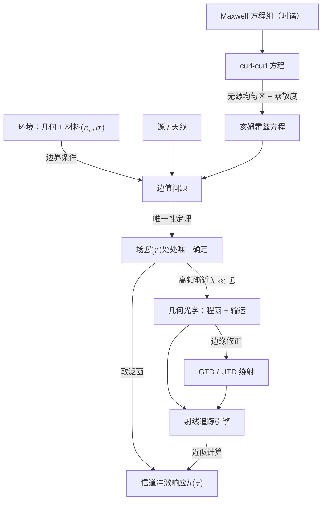
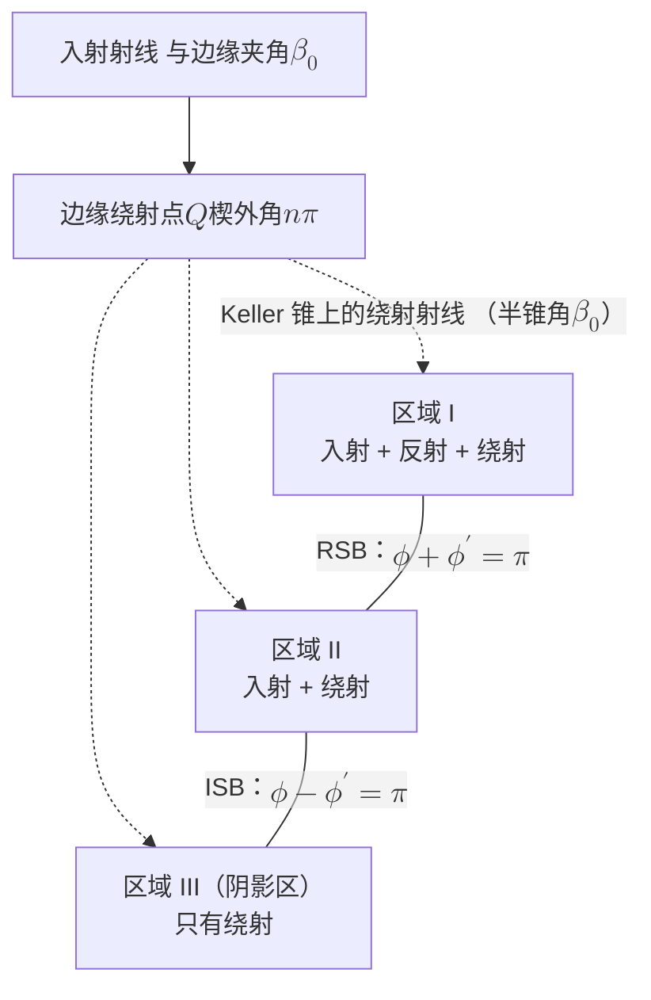

# 2 · 确定性根基：从 Maxwell 到射线

!!! note "本章预备知识"
    需要：矢量微积分（散度、旋度）、复数相量与平面波。用到的内容：

    - Maxwell 方程组与波动方程：[预备篇 1.1](../part0/01-em-waves-antennas.md#11-电磁波从哪里来振荡电荷maxwell-与辐射)；频率、波长与频段：[预备篇 1.2](../part0/01-em-waves-antennas.md#12-频率波长与频段全景)。
    - 双径模型与 $1/d^4$ 衰减：[预备篇 2.2](../part0/02-wireless-channel-basics.md#22-路径损耗从-friis-到-3gpp)。
    - "信道是环境的确定性泛函"这一论题与三重无知：[第 1 章](01-lie-of-randomness.md)。本章给它补上数学根基。

## 2.1 冻结的城市：一个思想实验 {#冻结的城市一个思想实验}

想象把一座城市在某个瞬间冻结：每一面墙、每一片树叶、每一辆公交车都停在原处，空气的温湿度、地面的积水、行人手里的手机全部凝固。现在从基站发射一段探测波形，在某个位置记录信道冲激响应；然后时光倒流，把同样的波形再发一遍。

两次记录会有任何差别吗？不会，一个比特都不会差。信道里没有掷骰子的环节：给定环境、材料与收发位置，Maxwell 方程组把场的每一点、每一时刻都确定了。

[第 1 章](01-lie-of-randomness.md) 论证了"随机衰落"只是认识上的权宜说法。本章补上这个论断的物理地基：环境到信道的映射**存在且唯一**，并且在高频下可以逐条射线地计算。

本章回答两个问题。

- 第一，"环境 → 信道"这个映射为什么**存在且唯一**？答案分三步：
    1. Maxwell 方程组给出场的演化规律。
    2. 环境的几何与材料以边界条件的身份进入方程。
    3. 唯一性定理保证解不多不少恰好一个，信道冲激响应只是这个唯一场的一个泛函。
- 第二，这个映射为什么**可以计算**？严格解只在极少数几何下存在。但当波长远小于环境的几何特征尺度时，波动问题渐近退化为几何问题：场分解为沿射线传播的局部平面波，反射、透射、绕射、散射各自获得确定性的系数刻画。

全章还有第三条线索：**波长与几何特征尺度之比 $\lambda/L$** 决定环境的哪些细节被信道"看见"。比波长小得多的粗糙度是镜面，比波长小得多的物体近乎透明，只有波长量级以上的结构才作为独立传播机制进入信道。这个想法在本章末尾会整理成一个明确的命题，也是 [第 8 章](08-dimension-and-prediction.md) 有效维度问题的物理伏笔。



## 2.2 从 Maxwell 到亥姆霍兹：环境藏在哪个位置 {#从-maxwell-到亥姆霍兹环境藏在哪个位置}

全书统一采用工程时谐约定：瞬时场与复相量的关系为 $E(\mathbf{r},t)=\mathrm{Re}\{\mathbf{E}(\mathbf{r})\,e^{j\omega t}\}$。

!!! warning "陷阱（时谐约定）"
    工程文献用 $e^{+j\omega t}$，物理与光学文献常用 $e^{-i\omega t}$。两种约定使所有含 $j$ 的公式互为复共轭：Fresnel 系数的虚部符号、UTD 过渡函数、Sommerfeld 辐射条件里的 $+jk$ 全部镜像翻转。

    本书从此处起固定 $e^{+j\omega t}$。引用光学文献的公式时必须逐个核对符号，这是确定性建模中最常见的低级错误来源之一。

**第一步：写出时谐 Maxwell 方程组。** 在无源、线性、均匀、各向同性的区域内，方程组为

$$\nabla\times\mathbf{E}=-j\omega\mu\mathbf{H},\qquad \nabla\times\mathbf{H}=j\omega\varepsilon\mathbf{E},\qquad \nabla\cdot\mathbf{E}=0,\qquad \nabla\cdot\mathbf{H}=0$$

**第二步：对第一式取旋度，并把第二式代入。**

$$\begin{aligned}
\nabla\times(\nabla\times\mathbf{E}) &= -j\omega\mu\,\nabla\times\mathbf{H} \\
&= -j\omega\mu\,(j\omega\varepsilon\,\mathbf{E}) \\
&= \omega^2\mu\varepsilon\,\mathbf{E}
\end{aligned}$$

**第三步：用矢量恒等式与零散度条件化简左边。**

$$\nabla\times(\nabla\times\mathbf{E})=\nabla(\nabla\cdot\mathbf{E})-\nabla^2\mathbf{E}=-\nabla^2\mathbf{E}$$

**第四步：两式相等，得到矢量亥姆霍兹方程。** 这是【已解决】的教科书标准结果，见 Harrington、Balanis 等研究生教材。一条可公开获取的推导线索见 [1]。

$$\nabla^2\mathbf{E}+k^2\mathbf{E}=\mathbf{0},\qquad k=\omega\sqrt{\mu\varepsilon}=\frac{2\pi}{\lambda}$$

直角坐标下每个分量满足标量亥姆霍兹方程 $(\nabla^2+k^2)u=0$。介质有耗时，只需把介电常数换成复数 $\varepsilon_c=\varepsilon'-j\sigma/\omega$，波数 $k$ 随之变复，虚部对应指数衰减。

**物理意义**

这个方程很干净：它不含任何环境信息。同一个算子 $(\nabla^2+k^2)$ 统治着写字楼、隧道与麦田。环境只通过两个渠道进入问题：

- **材料参数** $(\varepsilon_r,\sigma)$：决定各区域内的 $k$。
- **边界条件**：介质界面上切向场连续，写成下式。

$$\hat{\mathbf{n}}\times(\mathbf{E}_1-\mathbf{E}_2)=\mathbf{0},\qquad \hat{\mathbf{n}}\times(\mathbf{H}_1-\mathbf{H}_2)=\mathbf{J}_s$$

其中表面电流 $\mathbf{J}_s$ 仅在理想导体等极限情形非零。

所谓"环境 → 信道映射"，数学上就是**同一个亥姆霍兹算子，配上不同的边界条件族与材料分布**。

**行为分析**

$k=2\pi/\lambda$ 给出感受环境的标尺。3.5 GHz 时 $\lambda\approx 8.6$ cm，28 GHz 时 $\lambda\approx 1.07$ cm，140 GHz 时 $\lambda\approx 2.1$ mm。同一面墙的"电尺寸" $ka$ 随频率线性增大。所以同一个物理环境，在不同频率下是**不同的边值问题**。

两个极限情形：

- $\sigma\to\infty$：场不穿透导体，边界条件退化为切向电场为零。
- $\sigma$ 中等：复 $k$ 的虚部使透射波按 $e^{-\alpha z}$ 衰减，且衰减率随频率上升。材料的频率模型见后文 ITU-R P.2040 一节。

!!! tip "直觉"
    把亥姆霍兹方程看作映射的"引擎"，把边界条件与材料分布看作映射的"自变量"。引擎从不改变；每换一个环境，只是给同一台引擎换一组输入。

## 2.3 唯一性定理：映射为什么存在且唯一 {#唯一性定理映射为什么存在且唯一}

上一节给出了方程，但"有方程"不等于"有唯一确定的答案"。支撑信道确定性的，是电磁场唯一性定理【已解决】。这是教科书标准结果，Harrington《Time-Harmonic Electromagnetic Fields》1961、Balanis《Advanced Engineering Electromagnetics》均有完整证明。

!!! abstract "定理（时谐场唯一性）"
    设有界区域 $V$ 内填充有耗介质。则 $V$ 内的时谐电磁场由以下数据唯一确定：

    - $V$ 内的源分布；
    - 边界 $\partial V$ 上的切向 $\mathbf{E}$、或切向 $\mathbf{H}$、或部分边界上的切向 $\mathbf{E}$ 与其余边界上的切向 $\mathbf{H}$。

    无耗介质情形取损耗趋于零的极限。无界域中需补充 Sommerfeld 辐射条件

    $$\lim_{r\to\infty} r\left(\frac{\partial u}{\partial r}+jku\right)=0$$

    以排除从无穷远汇入的解。

**物理意义**

辐射条件是无界域的"边界条件"，它在数学上挑出"只向外传播"的解。几何与材料、源、辐射条件这三样东西一旦给定，空间中每一点的场就没有第二种可能。

**定理为什么要假设"有耗"？**

两组场若源与边界切向数据相同，它们的差场在 $V$ 内无源，在 $\partial V$ 上切向分量为零。对差场用复 Poynting 定理取实部，边界通量为零，于是损耗功率 $\int_V\sigma|\delta\mathbf{E}|^2dV=0$。$\sigma>0$ 就逼出 $\delta\mathbf{E}=\mathbf{0}$。

无耗时这一步失效：无耗金属腔在谐振频率上存在无源的非零场，即谐振模。

**把定理翻译成本书的语言**

**第一步：场唯一。** 设发射天线在 $\mathbf{r}_{\mathrm{T}}$ 以单位激励、频率 $f$ 发射，唯一性定理保证场解 $\mathbf{E}(\mathbf{r};f)$ 唯一。

**第二步：得到传递函数。** 接收天线在 $\mathbf{r}_{\mathrm{R}}$ 对场做一次线性采样（对天线口径与方向图的加权积分），得到传递函数 $H(f;\mathbf{r}_{\mathrm{T}},\mathbf{r}_{\mathrm{R}})$。

**第三步：逆 Fourier 变换。** 对整个频带做逆 Fourier 变换：

$$h(\tau;\mathbf{r}_{\mathrm{T}},\mathbf{r}_{\mathrm{R}})=\int_{-\infty}^{\infty}H(f;\mathbf{r}_{\mathrm{T}},\mathbf{r}_{\mathrm{R}})\,e^{j2\pi f\tau}\,df$$

每一步都是唯一确定的运算。于是映射

$$\mathcal{M}:\ (\text{几何},\ \varepsilon_r,\ \sigma,\ \mathbf{r}_{\mathrm{T}},\ \mathbf{r}_{\mathrm{R}})\ \longmapsto\ h(\tau)$$

是**良定义**的：环境到信道是一个单值函数，没有"倾向""分布""系综"的余地。

!!! note "备注（本站视角）"
    电磁教科书中的唯一性定理从来不被这样使用。"唯一性定理 = 环境→信道映射良定义"这个桥接是本站的组织方式，不是文献共识的表述。

    另须分清方向：唯一性保证**正向**映射单值，完全不保证**逆向**单射。不同的环境可以产生难以区分的信道观测，逆向可辨识性是 [第 6 章](06-inverse-problem.md) 的主题。

**行为分析**

唯一性定理很强：它对频率、几何复杂度、材料分布不设任何条件，写字楼和峡谷一视同仁。但它只说"解唯一"，没说"解好算"。从"唯一"走到"可算"，需要牺牲一部分严格性，这就是下一节高频渐近要做的交易。

## 2.4 高频渐近：波怎样退化为射线 {#高频渐近波怎样退化为射线}

### 2.4.1 Luneburg–Kline 展开与程函、输运方程

严格求解边值问题只在极少数典型几何（平面、楔、圆柱、球）下可行。让确定性建模真正落地的是一个渐近观察：当 $\lambda\ll L$（$L$ 为环境几何特征尺度）时，波的行为局部像平面波，全局像一族沿射线传播的能量管。

这一观察由 Sommerfeld 与 Runge 于 1911 年首次从波动方程严格导出。这是常见史料的记载，原始文献本站未直接核实。后经 Luneburg（1944 讲义）与 Kline（1951）系统化，成为 **Luneburg–Kline 渐近展开**（【已解决】）：

$$\mathbf{E}(\mathbf{r})\sim e^{-jk_0\psi(\mathbf{r})}\sum_{m=0}^{\infty}\frac{\mathbf{E}_m(\mathbf{r})}{(j\omega)^m}$$

其中 $k_0$ 为自由空间波数，$\psi(\mathbf{r})$ 称为**程函**（eikonal）。

记号提醒：前文的 $k$ 是介质中的波数，$k_0=\omega/c$ 是自由空间波数，$k=nk_0$；空气中二者相等，下文直接写 $k$。分母写 $(j\omega)^m$ 或 $(jk_0)^m$ 因文献而异，只差常数 $c^m$（并入 $\mathbf{E}_m$），都表示每高一阶多一个 $1/k_0$ 量级的小因子。

推导的骨架用标量首项即可看清。

**第一步：设试探解。** 设 $u=A(\mathbf{r})\,e^{-jk_0\psi(\mathbf{r})}$，折射率 $n(\mathbf{r})$ 缓变。

**第二步：逐阶求导。**

$$\nabla u=\left(\nabla A-jk_0A\,\nabla\psi\right)e^{-jk_0\psi}$$

$$\nabla^2u=\left(\nabla^2A-2jk_0\,\nabla A\cdot\nabla\psi-jk_0A\,\nabla^2\psi-k_0^2A\,|\nabla\psi|^2\right)e^{-jk_0\psi}$$

**第三步：代入方程，按 $k_0$ 的幂次整理。** 代入 $(\nabla^2+k_0^2n^2)u=0$，消去公共指数因子：

$$k_0^2A\left(n^2-|\nabla\psi|^2\right)-jk_0\left(2\nabla A\cdot\nabla\psi+A\,\nabla^2\psi\right)+\nabla^2A=0$$

**第四步：令各阶系数分别为零。** 高频下 $k_0\to\infty$，$A$、$\psi$ 不随 $k_0$ 变，$k_0$ 的不同幂次无法互相抵消，所以各阶系数必须分别为零。其中 $\nabla A\cdot\nabla\psi=(\nabla\psi\cdot\nabla)A$，对 $\mathbf{E}_0$ 的每个分量照做，即得下面的矢量形式。

!!! abstract "定理（程函方程与输运方程）"
    $O(k_0^2)$ 阶给出**程函方程**

    $$|\nabla\psi|^2=n^2(\mathbf{r})$$

    $O(k_0)$ 阶给出**输运方程**（矢量形式）

    $$2(\nabla\psi\cdot\nabla)\mathbf{E}_0+(\nabla^2\psi)\,\mathbf{E}_0=\mathbf{0}$$

    残余的 $\nabla^2A$ 是 $O(1)$ 项，被舍弃。因此几何光学的误差在 $O(1/k_0)$ 意义下渐近消失。【已解决】

### 2.4.2 射线管中的振幅与 GO 的失效点

**物理意义**

程函方程是 Hamilton–Jacobi 型方程，即只含未知函数一阶导数的非线性偏微分方程。分析力学里同型方程决定粒子轨迹，这里决定的"轨迹"就是射线。所以波动问题在最高阶退化为力学/几何问题。

$\psi$ 的等值面是等相位面，**射线就是等相位面的法线族**。Fermat 原理、反射与折射定律全部由程函方程导出。

输运方程则说振幅沿射线管按功率守恒演化：对波前主曲率半径为 $\rho_1,\rho_2$ 的射线管，传播距离 $s$ 后

$$A(s)=A(0)\sqrt{\frac{\rho_1\rho_2}{(\rho_1+s)(\rho_2+s)}}$$

**推导**

**第一步：化简输运方程。** 自由空间 $\nabla\psi=\hat{\mathbf{s}}$ 是射线单位切向量，输运方程化为 $2\,dA/ds+(\nabla\cdot\hat{\mathbf{s}})A=0$。

**第二步：代入波前的曲率。** 波前法向场的散度等于两个主曲率之和 $\frac{1}{\rho_1+s}+\frac{1}{\rho_2+s}$。于是

$$
\frac{d\ln A}{ds}=-\frac{1}{2}\left(\frac{1}{\rho_1+s}+\frac{1}{\rho_2+s}\right)
$$

积分即得上式。射线管截面积正比于 $(\rho_1+s)(\rho_2+s)$，所以上式就是"振幅平方 × 截面积"守恒。

**行为分析**

三个极限自检：

- **平面波** $\rho_{1,2}\to\infty$：振幅不变，符合直觉。
- **球面波** $\rho_1=\rho_2=\rho$：$A\propto\rho/(\rho+s)$，即熟悉的 $1/r$ 场衰减。自由空间路径损耗只是输运方程的一个特例。
- **焦散**（caustic）$s\to-\rho_1$：分母为零，振幅发散并伴随 $+\pi/2$ 相位跳变。这是几何光学自己报告失效位置的方式。

GO 的失效点清单：**焦散、阴影边界、边缘与尖顶**。每一处都是波长量级现象压过几何直觉的地方，也是下文 GTD/UTD 的出生地。

!!! warning "陷阱（GO 不是收敛级数的第一项）"
    Luneburg–Kline 级数一般是**发散的渐近级数**。"高频下 GO 精确"的正确表述是：固定几何，$k\to\infty$ 时误差以 $O(1/k)$ 渐近消失；固定 $k$ 多取几项**不**保证更准。

    对复杂场景，"取前几项误差多大"至今没有全局误差界（见「开放问题」）。

!!! note "备注（通往第 3 章的暗门）"
    射线表示下场是各路径贡献之和，每条路径的相位为 $kL_i$。环境微扰 $\Delta L$ 使相位旋转 $k\Delta L$：

    - 28 GHz 下（$k\approx 587$ rad/m），1 cm 的路径变化就是约 5.9 rad，几乎整整一圈。
    - 3.5 GHz 下，同样 1 cm 只有 0.73 rad。

    映射完全确定，却对微扰极端敏感：**确定性不可知 $\neq$ 物理不确定**。这是统计建模合法性的来源，[第 3 章](03-statistical-lineage.md) 从这里出发。

**映射语言**

高频渐近把"环境 → 信道"映射分解为**可枚举的射线路径求和**：每条路径携带确定的几何长度、扩散因子，以及下面两节赋予的机制系数。

## 2.5 反射与透射：边界条件的闭式推论 {#反射与透射边界条件的闭式推论}

### 2.5.1 Fresnel 反射系数

射线打到光滑界面时发生什么，完全由 2.2 节的边界条件决定。设平面波从自由空间入射到相对复介电常数 $\varepsilon_r$ 的半空间，入射角 $\theta_i$ 从法线量起。注意约定：Rappaport 等传播教材常从表面量掠角，公式形式不同但等价，抄公式前先核对。

把场按垂直极化（TE，电场垂直于入射面）与平行极化（TM）分解。以 TE 为例，分三步推出反射系数。

**第一步：相位匹配。** 界面上相位匹配给出 Snell 定律 $\sin\theta_t=\sin\theta_i/\sqrt{\varepsilon_r}$。

**第二步：切向电场连续。** 给出 $1+\Gamma_{\perp}=T_{\perp}$。

**第三步：切向磁场连续。** 给出 $(1-\Gamma_{\perp})\cos\theta_i=\sqrt{\varepsilon_r}\,T_{\perp}\cos\theta_t$。

联立消去 $T_{\perp}$，并用 $\sqrt{\varepsilon_r}\cos\theta_t=\sqrt{\varepsilon_r-\sin^2\theta_i}$，得

$$\Gamma_{\perp}=\frac{\cos\theta_i-\sqrt{\varepsilon_r-\sin^2\theta_i}}{\cos\theta_i+\sqrt{\varepsilon_r-\sin^2\theta_i}}$$

同理可得平行极化：

$$\Gamma_{\parallel}=\frac{\varepsilon_r\cos\theta_i-\sqrt{\varepsilon_r-\sin^2\theta_i}}{\varepsilon_r\cos\theta_i+\sqrt{\varepsilon_r-\sin^2\theta_i}}$$

这就是 Fresnel 反射系数（【已解决】教科书标准结果）。

记号提醒：这里的 $\Gamma_{\parallel}$ 等于反射与入射**磁场**之比（三个磁场取同一参考方向），所以正入射时 $\Gamma_{\parallel}=-\Gamma_{\perp}$。同一个反射波，负号只来自参考方向的约定，功率反射率相同。有的教材以电场之比并取另一套参考方向定义 $\Gamma_{\parallel}$，结果与上式差一个负号，掠入射极限为 $+1$。

**物理意义**

Fresnel 系数不是新物理，它只是切向场连续性在最简单几何（无限大平面）上的闭式解。

$\varepsilon_r$ 为复数时 $\Gamma$ 也是复数：反射不仅改变幅度，还注入确定的相位。每一次反射，环境的材料属性就以一个复数因子的形式被"盖章"进信道。

**行为分析**

三个极限值得记住：

- **(i) 正入射**：$\Gamma=(1-\sqrt{\varepsilon_r})/(1+\sqrt{\varepsilon_r})$。取 $\varepsilon_r=5$（量级上接近常见混凝土）得 $\Gamma\approx-0.38$，功率反射率约 15%。
- **(ii) Brewster 角**：无耗 TM 极化在 $\tan\theta_B=\sqrt{\varepsilon_r}$ 处反射恰好为零（$\varepsilon_r=5$ 时 $\theta_B\approx 65.9^\circ$）；有耗时零点变成极小值。这意味着反射路径带有确定的**极化选择性**。
- **(iii) 掠入射** $\theta_i\to90^\circ$：两种极化的 $\Gamma$ 都趋于 $-1$。这是地面反射的经典结论，也是双径模型中 $1/d^4$ 衰减律的直接来源（推导见[预备篇 2.2](../part0/02-wireless-channel-basics.md)）。

{ .chart loading=lazy }
{ .chart loading=lazy }

*怎么读这张图：按上面两式逐点计算，每 $2^\circ$ 一点，符号约定与正文相同（$\Gamma_\parallel$ 取磁场之比）。第一条是垂直极化 $\Gamma_\perp$，从正入射的 $-0.38$（功率反射率约 15%）单调降到掠入射的 $-1$；第二条是平行极化 $\Gamma_\parallel$，正入射时为 $+0.38$，在 Brewster 角 $65.9^\circ$ 处穿过第三条零线，此后变负，掠入射时同样趋于 $-1$。上面行为分析的三个极限，就是这张图的左端、零点与右端。有耗材料的零点会变成极小值，图里没有画。*

### 2.5.2 材料参数与墙体透射

材料参数从哪里来？ITU-R P.2040-4（2025-09 版）给出建筑材料的频率模型 [2]：

$$\varepsilon_r'=a f^{b},\qquad \sigma=c f^{d},\qquad \varepsilon_r=\varepsilon_r'-j\frac{\sigma}{2\pi f\varepsilon_0}$$

前两式的 $f$ 以 GHz 计，常数 $(a,b,c,d)$ 按材料查表。第三式的 $f$ 须用 Hz；用 GHz 时，P.2040 把虚部写成 $17.98\,\sigma/f$。这张表是全球射线追踪引擎共用的"材料数据库"基础设施。

**透射**要多说几句。建筑墙体是**多层平板**，不是单个界面，层内往返多次反射相干叠加。正确做法是分层介质的传输矩阵（ABCD）方法，P.2040 给出了标准平板模型 [2]。只抄单界面 Fresnel 透射系数是常见错误。

行为上，透射损耗随频率上升（$\sigma(f)$ 增大、电厚度增大），毫米波以上墙体透射常可忽略。环境的连通拓扑在高频下"变硬"，室内与室外趋于两个近乎独立的传播世界。下面用数字把这一点钉死。

!!! example "算例：同一面 20 cm 混凝土墙，两个频段两种物件"
    取 P.2040 混凝土参数（与[第 5 章](05-deterministic-revival.md)算例同一套）：$\varepsilon'=5.24$、$\sigma=0.0462\,f^{0.7822}$ S/m（$f$ 以 GHz 计）。有耗介质中的场衰减常数

    $$
    \alpha \;\approx\; \frac{\sigma}{2}\sqrt{\frac{\mu_0}{\varepsilon_0\varepsilon'}} \;=\; \frac{\sigma}{2}\cdot\frac{377}{\sqrt{\varepsilon'}}\ \ \mathrm{Np/m},
    $$

    它来自低损耗展开。记 $\varepsilon''=\sigma/(\omega\varepsilon_0)$，由 $\sqrt{1-x}\approx1-x/2$ 得 $k\approx\omega\sqrt{\mu_0\varepsilon_0\varepsilon'}\,\left(1-j\frac{\varepsilon''}{2\varepsilon'}\right)$，$\alpha=-\mathrm{Im}\,k$ 即上式。条件 $\varepsilon''/\varepsilon'\ll1$ 在此成立（两频段约 0.12、0.08）。

    穿过厚度 $d$ 的板内损耗为 $8.686\,\alpha d$ dB（$8.686=20\log_{10}e$）。两个频段的结果如下表。

    | 频段 | $\sigma$ (S/m) | $\alpha$ (Np/m) | 20 cm 板内损耗 | 加界面失配后 |
    |---|---|---|---|---|
    | 3.5 GHz | 0.123 | 10.1 | 17.6 dB | 约 19 dB |
    | 28 GHz | 0.626 | 51.5 | 89.5 dB | 约 90 dB |


    同一面 20 cm 混凝土墙，3.5 GHz 下像纱窗，28 GHz 下像铅墙。

    再对照实测：毫米波穿墙损耗多在 40–80 dB，**低于**理想均匀板算出的 90 dB。差距不是算错了。真实墙体是多层结构（抹灰/空腔/砖），层间往返反射与非均匀性给出了理想均匀模型没有的"漏光"通道。这也印证了本节开头强调的"必须用传输矩阵而非单界面 Fresnel"。

**映射语言**

反射与透射是映射在光滑界面族上的**解析分支**：每个分支由边界条件闭式确定，不含任何拟合参数。

```mermaid
flowchart LR
    CH["四大传播机制"] --> R["反射"]
    CH --> T["透射"]
    CH --> D["绕射"]
    CH --> S["散射"]
    R -->|"光滑面 $$\sigma_h \ll \lambda$$"| R2["Fresnel 系数：边界条件闭式解"]
    T -->|"多层平板"| T2["传输矩阵：逐层闭式解"]
    D -->|"波长可比的边缘"| D2["GTD/UTD：典型问题渐近系数"]
    S -->|"$$\sigma_h$$ 或 $$a$$ 与 $$\lambda$$ 可比"| S2["粗糙度判据 + ER 模型（半唯象）"]
```

## 2.6 绕射：几何光学的失效与两次修复 {#绕射几何光学的失效与两次修复}

### 2.6.1 GO 的跳变与 Keller 的 GTD

几何光学有一个致命缺陷：在阴影边界上，它预言场从有限值**跳变**到零。波动方程的解是光滑的，跳变解在物理上不存在。阴影区内场不为零，能量绕过障碍物边缘渗入，这就是绕射。GO 在这里犯的是定性错误，而不只是误差偏大。

修复的历史分两步。

**第一步：确认绕射可以被严格计算。** 1896 年 Sommerfeld 给出理想导体半平面绕射的严格精确解（Riemann 面上的镜像法 + Sommerfeld 积分）[3]。但这个方法无法推广到一般几何，**精确解稀缺**从此成为此后一切近似理论的总动机。

**第二步：Keller 的几何绕射理论。** Keller 于 1953–1962 年创立**几何绕射理论**（Geometrical Theory of Diffraction, GTD）[4]（【已解决】理想导体楔情形）。它包含两个思想：

- 把 Fermat 原理推广到经过边缘的路径。与边缘切线成 $\beta_0$ 角入射的射线，激发出位于以边缘为轴、半锥角同为 $\beta_0$ 的 **Keller 锥**上的一族绕射射线。
- 绕射场写成下式。

$$E_d=E_i(Q)\,D\,A(s)\,e^{-jks}$$

其中 $Q$ 是边缘上的绕射点，$s$ 是 $Q$ 到观察点的距离，$A(s)$ 是扩散因子。边缘本身是绕射射线管的焦散线，在 2.4 节的振幅公式里取 $\rho_1\to0$（常数并入 $D$），平面波照射直边时得 $A(s)=1/\sqrt{s}$，即柱面波。

绕射系数 $D$ 从**典型问题**（半平面、楔、柱）的严格解中渐近提取，不靠猜测。对外角为 $n\pi$ 的理想导体楔，Keller 系数形式如下（符号与因子约定随文献略有差异）：

$$D_{s,h}=\frac{e^{-j\pi/4}\sin(\pi/n)}{n\sqrt{2\pi k}\,\sin\beta_0}\left[\frac{1}{\cos\frac{\pi}{n}-\cos\frac{\phi-\phi'}{n}}\mp\frac{1}{\cos\frac{\pi}{n}-\cos\frac{\phi+\phi'}{n}}\right]$$

soft（Dirichlet）边界取 $-$，hard（Neumann）边界取 $+$；$\phi',\phi$ 分别为入射与观察方位角，都从楔的同一个面量起。

记号提醒：

- $n$ 是楔的外角参数而非折射率（半平面 $n=2$，$90^\circ$ 墙角 $n=3/2$）。
- $\beta_0$ 是角度，不是有些教材里的相位常数 $\beta$。

**物理意义**

"canonical problem → 系数"是一种方法论范式：局部看，任何边缘都近似于一个楔，因此楔的严格解可以"移植"到一般几何的边缘上。

$D\propto k^{-1/2}$ 是关键的定量结论：绕射场比 GO 场低一个 $\sqrt{\lambda/L}$ 量级，所以**频率越高，绕射越弱**。

**行为分析**

- **频率效应**：从 3.5 GHz 升到 28 GHz（8 倍频），$k^{-1/2}$ 使绕射场幅度再降 $\sqrt{8}\approx 2.8$ 倍（约 9 dB）。这是毫米波"绕不过弯"的定量根源。
- **自洽性检查**：$n\to1$ 时楔退化为整张平面、边缘消失，此时 $\sin(\pi/n)=0$，$D=0$，绕射如期归零。
- **内在缺陷**：在阴影边界与反射边界上，方括号内的分母趋于零，系数**发散**。恰恰是最需要绕射的地方，GTD 给出了无穷大。



*怎么读这张图：区域 I → II → III 是观察方向绕边缘从被照亮的面转向阴影的顺序（取 $\phi'<\pi$）。跨过反射阴影边界（RSB）反射场消失，跨过入射阴影边界（ISB）入射场消失；Keller 方括号第一项恰在 ISB、第二项恰在 RSB 分母为零，所以 GTD 正好在 GO 场跳变处发散。图据 [4][5] 的标准楔几何整理。*

### 2.6.2 UTD 与过渡函数

1974 年 Kouyoumjian 与 Pathak 给出**一致绕射理论**（Uniform Theory of Diffraction, UTD）[5]（【已解决】理想导体楔情形）：把每个奇异项乘以过渡函数

$$F(X)=2j\sqrt{X}\,e^{jX}\int_{\sqrt{X}}^{\infty}e^{-j\tau^2}\,d\tau$$

其中 $X=kLa^{\pm}$ 含距离参数 $L$ 与角度函数 $a^{\pm}$。四个余切项与 $a^{\pm}$ 的完整表达式见原文 [5]，此处不逐项抄写。

记号提醒：

- $L$ 是距离参数（平面波照射时 $L=s\sin^2\beta_0$），不是开篇 $\lambda/L$ 里的几何尺度。
- $F(X)$ 与下文刃峰模型的 $F(\nu)$ 是两个不同的函数。

$X\to\infty$ 时 $F\to1$，退化回 Keller。在过渡区，$F$ 的幅度恰好抵消余切的奇异性，使**总场跨越阴影边界与反射边界连续**。UTD 至今是几乎所有射线追踪引擎绕射模块的理论内核。

**乘上 $F$ 为什么就不发散？**

以入射阴影边界（ISB）为例。按原文 [5] 的写法，Keller 方括号每一项拆成两个余切之和，"四个余切项"由此而来。余切前的系数为 $-e^{-j\pi/4}/(2n\sqrt{2\pi k}\sin\beta_0)$。在 ISB 发散的是 $\cot\frac{\pi-(\phi-\phi')}{2n}$，UTD 给它乘上 $F(kLa^-)$。

**第一步：边界处 $X\to0$。** 记偏离 ISB 的角度 $\delta=\pi-(\phi-\phi')$（$\delta>0$ 在照明一侧），则 $a^-=2\sin^2\frac{\delta}{2}\approx\frac{\delta^2}{2}$，$X\approx kL\delta^2/2\to0$，而余切 $\approx2n/\delta\to\infty$。

**第二步：求 $F$ 在 $X\to0$ 时的行为。** 积分下限趋于零，由 $\int_0^\infty e^{-j\tau^2}d\tau=\frac{\sqrt{\pi}}{2}e^{-j\pi/4}$ 与 $j\,e^{-j\pi/4}=e^{j\pi/4}$ 得 $F(X)\approx\sqrt{\pi X}\,e^{j(\pi/4+X)}$，随 $\sqrt{X}\propto|\delta|$ 线性趋零。

**第三步：相乘。**

$$\cot\frac{\delta}{2n}\,F(X)\approx\frac{2n}{\delta}\cdot|\delta|\sqrt{\frac{\pi kL}{2}}\,e^{j\pi/4}=\operatorname{sgn}(\delta)\,n\sqrt{2\pi kL}\,e^{j\pi/4}$$

$1/\delta$ 被 $|\delta|$ 抵消，乘积有限。

**第四步：乘上前置系数，取平面波正入射。** 取 $\beta_0=\pi/2$，$L=s$，$A(s)=1/\sqrt{s}$，得 $E_d\approx-\operatorname{sgn}(\delta)\,E_i/2$（$E_i$ 为观察点的入射场）。

GO 场在 ISB 上从 $E_i$ 跳到 $0$，绕射场恰好反向跳 $E_i$，两侧总场都趋于 $E_i/2$：绕射场恰为 GO 跃变量的一半。场幅减半即 6 dB，对应下文刃峰"$\nu=0$ 时 6 dB"。RSB 上的反射项同理。

!!! warning "陷阱（UTD 修复了什么）"
    UTD 修复的是过渡区的连续性，并**不**自动提升远离边界处的精度。在过渡区之外，UTD 与 GTD 一致。

    另外两者的严格根基都只覆盖理想导体楔；建筑材料那样的**可穿透介质楔**至今没有严格解（见「开放问题」）。

### 2.6.3 工程上的刃峰模型

与 GTD/UTD 平行，工程界早在 1947 年就把绕射装进了链路预算：Bullington 的刃峰（knife-edge）模型 [6]，今天以 ITU-R P.526-16（2025-11 版）[7] 的形式标准化。障碍物顶端相对视线高 $h$、距两端 $d_1,d_2$ 时，定义 Fresnel–Kirchhoff 绕射参数与场强比：

$$\nu=h\sqrt{\frac{2(d_1+d_2)}{\lambda\,d_1 d_2}},\qquad F(\nu)=\frac{1+j}{2}\int_{\nu}^{\infty}e^{-j\pi t^2/2}\,dt$$

绕射损耗 $J(\nu)=-20\log_{10}|F(\nu)|$，P.526 的工程近似（$\nu>-0.78$）为

$$J(\nu)\approx 6.9+20\log_{10}\!\left(\sqrt{(\nu-0.1)^2+1}+\nu-0.1\right)\ \ \mathrm{dB}$$

!!! warning "陷阱（掠射不是无损）"
    $\nu=0$（刃峰恰好擦过视线）时损耗是 **6 dB 而非 0 dB**，因为半个第一 Fresnel 带被挡住了。由 $\int_0^\infty e^{-j\pi t^2/2}dt=\frac{1-j}{2}$，$F(0)=\frac{1+j}{2}\cdot\frac{1-j}{2}=\frac{1}{2}$，$J(0)\approx6.02$ dB。第一 Fresnel 带半径

    $$r_1=\sqrt{\frac{\lambda\,d_1 d_2}{d_1+d_2}}$$

    本身就是一个 $\sqrt{\lambda L}$ 尺度的量：链路"感受"到的空间通道粗细，是波长与几何距离的几何平均。

!!! example "算例（同一座楼，两个频段）"
    设 $d_1=d_2=500$ m，障碍物高出视线 $h=10$ m。

    - 3.5 GHz（$\lambda\approx8.57$ cm）：$r_1\approx4.6$ m，$\nu\approx3.1$，$J\approx22.6$ dB。
    - 28 GHz（$\lambda\approx1.07$ cm）：$r_1\approx1.6$ m，$\nu\approx8.6$，$J\approx31.6$ dB。

    频率升 8 倍，同一障碍物多"吃"掉约 9 dB，与 $D\propto k^{-1/2}$ 的渐近预言一致。多刃峰场景的工程方法（Bullington 等效单峰、Epstein–Peterson、Deygout、Vogler 严格积分）见 [7]。

**映射语言**

绕射是映射在几何奇异集（边缘）上的**正则化**：UTD 保证"环境 → 信道"映射作为几何与频率的函数，在阴影边界处依然连续。

## 2.7 散射：波长作为环境细节的低通滤波器 {#散射波长作为环境细节的低通滤波器}

### 2.7.1 粗糙表面与 Rayleigh 判据

前两节假设"光滑表面 + 理想边缘"。真实的墙面有砂浆颗粒，真实的环境里有树叶、路牌和雨滴。散射是否让确定性图景破产？答案取决于两把尺子：表面粗糙度 $\sigma_h$ 与波长之比，物体尺寸 $a$ 与波长之比。

先看粗糙表面。高度起伏为 $\sigma_h$ 的两处表面反射的子波，程差为 $\Delta l=2\sigma_h\cos\theta_i$，对应相位差

$$\Delta\phi=\frac{2\pi}{\lambda}\cdot 2\sigma_h\cos\theta_i=\frac{4\pi\sigma_h\cos\theta_i}{\lambda}$$

**Rayleigh 判据**取 $\Delta\phi<\pi/2$ 作为"光滑"的阈值，即

$$\sigma_h<\frac{\lambda}{8\cos\theta_i}$$

必须强调：这是**约定而非定理**。更严格的 Fraunhofer 判据用 $\lambda/(32\cos\theta_i)$。

对高斯粗糙面，镜面反射的相干衰减因子（Ament 型）为 [8]

$$\rho_s=\exp\!\left[-8\left(\frac{\pi\sigma_h\cos\theta_i}{\lambda}\right)^2\right]=e^{-\Delta\phi^2/2}$$

修正形式还要乘一个零阶修正 Bessel 因子，系数约定随文献版本略有差异 [8]。

**物理意义**

第二个等号说明了 $\rho_s$ 的来历：它恰是高斯随机相位的特征函数 $\langle e^{j\phi}\rangle=e^{-\mathrm{Var}(\phi)/2}$。推导分两步。

**第一步：写出相位的分布。** 设表面高度 $h\sim\mathcal{N}(0,\sigma_h^2)$，高度 $h$ 处的子波多走 $2h\cos\theta_i$（入、出各一次），相位 $\phi=\frac{4\pi\cos\theta_i}{\lambda}h$ 是零均值高斯，标准差恰为 $\Delta\phi$。

**第二步：代入特征函数。** 代入即得 $\rho_s$。

镜面分量是"相位一致性的存活率"。粗糙度打乱相位，相干求和中被抵消的那部分并没有消失，它改道成了漫散射。

!!! example "算例（一面砖墙，两个频段）"
    取表面起伏 $\sigma_h=2$ mm，正入射。

    - 3.5 GHz（$\lambda=85.7$ mm）：Rayleigh 阈值 $\lambda/8\approx10.7$ mm，远大于 2 mm，表面是镜面，$\rho_s\approx0.96$（仅 $-0.4$ dB）。
    - 28 GHz（$\lambda=10.7$ mm）：阈值 $\approx1.3$ mm，已小于 2 mm，表面算粗糙，$\rho_s\approx0.06$（$-24$ dB），镜面分量几乎报废，能量大头转入漫散射。

    同一面墙，3.5 GHz 的信道把它看成镜子，28 GHz 的信道把它看成磨砂玻璃。

### 2.7.2 孤立物体与散射截面

再看孤立物体。定义尺寸参数 $x=2\pi a/\lambda$，球的严格解来自 Mie（1908）[9]。散射行为分三区：

- $x\ll1$，**Rayleigh 区**（与粗糙度的 Rayleigh 判据同名不同事）：散射截面 $\propto a^6/\lambda^4$，物体近乎不可见。散射截面是散射总功率除以入射功率密度，即物体"截走"的等效面积。
- $x\sim1$，**Mie 共振区**：截面随 $x$ 振荡。
- $x\gg1$，**几何光学区**：截面趋于几何投影的量级。

这一分区是成熟结果。【已解决】

**行为分析**

$a^6/\lambda^4$ 是极陡的标度律：

- 半径减半，散射截面缩为 $1/64$。
- 频率减半，缩为 $1/16$。

雨滴例：半径 1 mm 的雨滴在 3.5 GHz（$x\approx0.07$）处深居 Rayleigh 区，整场雨对信道近乎透明；在 100 GHz（$\lambda=3$ mm，$x\approx2.1$）进入 Mie 区，雨衰成为链路预算的主角。同一场雨，在两个频段分别是"不存在的环境"与"主要的环境要素"。

### 2.7.3 绕射与散射的此消彼长，及自由度伏笔

把绕射与散射的频率行为放在一起，出现一个耐人寻味的翻转：频率升高时绕射按 $k^{-1/2}$ **变弱**，而 $\sigma_h/\lambda$ 增大使漫散射**变强**。毫米波与太赫兹频段四大机制的相对权重整体换位。

这解释了为什么 2025–2026 年的文献密集打磨漫散射而非绕射：

- 射线引擎中的主流漫散射模型是 Degli-Esposti 的 Effective Roughness（ER）模型 [10]。它是**唯象**模型，能量参数 $S$ 靠测量拟合，并非从 Maxwell 导出。
- 8/12/28 GHz 典型建筑表面的漫散射实测与机理分析 [11] 则把"THz 多尺度粗糙度的第一性原理建模"明确列为未解问题。

最后埋一枚指向后文的伏笔。Bucci 与 G. Franceschetti 证明，有界散射体（电尺寸 $ka$）的散射场在观察域上是**准带限**的，空间带宽约为 $ka$ 量级，自由度数目有限并随电尺寸增长。出处是 1987/1989 两篇 TAP 经典，经 M. Franceschetti《Wave Theory of Information》书目确认 [12]；精确常数的陈述随文献而异。

白话地说：把观察曲线上的散射场看成空间信号，其空间频率基本不超过 $ka$ 量级（超出部分指数衰减，故称"准"带限）。按采样定理，约 $ka$ 量级个样本就能恢复它，这个数就是**自由度**（degrees of freedom）。

!!! warning "陷阱：两个 Franceschetti 不是同一个人"
    **Giorgio Franceschetti**（与 Bucci 合作，1987/1989 TAP，散射场空间带宽与自由度）与 **Massimo Franceschetti**（《Wave Theory of Information》2017、Landau 特征值定理与信息割集、随机行走传播模型）是两位学者。本站在跨章引用时一律加首字母区分，否则读者几乎必然把两条独立的研究线误认成一个人的连续工作。

    一句话：环境能写进场里的"信息量"被它的**电尺寸**封顶。这条线在 [第 4 章](04-spatial-structure.md) 展开为空间自由度定理，在 [第 8 章](08-dimension-and-prediction.md) 发展成有效维度问题。

!!! success "关键结论（本站视角）：波长是环境细节的低通滤波器"
    $\sigma_h\ll\lambda$ 的粗糙度不可见（镜面反射），$a\ll\lambda$ 的物体近乎透明（$\propto a^6/\lambda^4$），只有 $\gtrsim\lambda$ 量级的结构才作为独立传播机制进入信道。因此"环境 → 信道"映射对环境细节**不是单射**：波长决定了映射的有效分辨率，进而决定了它的**有效维度**。

    把 Rayleigh 判据、Mie 分区与 Bucci–Franceschetti 空间带宽合并成"映射可辨识维度"，这一提法是**本站的原创组织方式**。文献中与之最接近的是空间带宽理论 [12]。[第 8 章](08-dimension-and-prediction.md) 将把它形式化。

**四种机制一览**（数量级取自本章算例）：

| 机制 | 何时起作用 | 刻画工具与严格程度 | 从 3.5 GHz 到 28 GHz | 映射语言 |
|---|---|---|---|---|
| 反射 | 光滑界面：起伏低于 Rayleigh 阈值 $\lambda/(8\cos\theta_i)$ | Fresnel 系数，边界条件的闭式解【已解决】；材料参数查 ITU-R P.2040 | $\sigma_h=2$ mm 的砖墙正入射：镜面分量 $\rho_s$ 从 0.96（$-0.4$ dB）降到 0.06（$-24$ dB） | 解析分支 |
| 透射 | 多层墙体 | 分层介质的传输矩阵，逐层闭式；只抄单界面 Fresnel 透射系数是常见错误 | 20 cm 混凝土：约 19 dB 到约 90 dB（理想均匀板；实测毫米波穿墙多在 40–80 dB） | 解析分支 |
| 绕射 | 与波长可比的边缘、阴影边界 | GTD/UTD，理想导体楔【已解决】，可穿透介质楔无严格解；工程上用刃峰模型 ITU-R P.526 | 绕射系数 $\propto k^{-1/2}$，场幅再降约 9 dB；刃峰算例 22.6 dB 到 31.6 dB | 正则化：阴影边界处依然连续 |
| 散射 | 粗糙度或物体尺寸与 $\lambda$ 可比 | 粗糙面：Rayleigh 判据（约定而非定理）与 Ament 因子；孤立物体：Mie 分区，Rayleigh 区截面 $\propto a^6/\lambda^4$；工程上 ER 模型（唯象） | 同一面砖墙从镜子变成磨砂玻璃；1 mm 雨滴在 3.5 GHz 近乎透明，到 100 GHz 进入 Mie 区 | 低通滤波：映射对环境细节不是单射（本站视角） |

## 2.8 从精确解稀缺到可微射线追踪 {#从精确解稀缺到可微射线追踪}

把本章的理论链放回历史，是一条清晰的单行道：

- **精确解稀缺**：Sommerfeld 1896 只解得了半平面 [3]。
- **高频渐近**：1911 程函方程，1944/1951 渐近级数系统化。
- **修补失效区**：Keller 1962 的 GTD [4]，再到 Kouyoumjian–Pathak 1974 的 UTD [5]。
- **工程化**：Bullington 1947 把绕射装进链路预算 [6]；1988–1994 年城市微蜂窝兴起，GO+UTD 从天线与雷达界移植到蜂窝传播预测。
- **标准化**：ITU-R P.526 绕射模型 [7] 与 P.2040 材料数据库 [2] 成为公共基础设施。

每一步的交易都相同：用更少的波动计算，换取更多的几何直觉。

这条链的现代形态是射线追踪引擎。方法论上分两大族：镜像法精确找路径，复杂度随反射阶数爆炸；弹射法 SBR 让大量射线正向弹射，配合空间加速结构。系统盘点见 Yun 与 Iskander 的综述 [13]。

这里要拆一个一词两义的地雷。"ray tracing"在本章指 GO/UTD 的**渐近射线**：每条射线携带复振幅、极化与扩散因子，是有物理量纲的对象。图形学的 ray tracing 是采样射线。但现代引擎确实借用了图形学的外壳：NVIDIA Sionna RT 构建在 Mitsuba 3 / Dr.Jit 生态之上，用 BVH 与 GPU 做几何求交 [14][15]。所以现代射线引擎的分工是**物理内核 + 图形学外壳**。

2023 年的范式转折是**可微性**：Sionna RT 让梯度贯通材料参数、几何与天线方向图 [14][15]。"环境 → 信道"映射从此不仅可以算，还可以**求导**。于是映射的反问题（用实测信道校准材料与几何）从手工调参变成一阶梯度优化 [16]。围绕它生长出数字孪生信道体系，例如 MART-6G 的"环境孪生 + RT 引擎 + 信道孪生"三模块架构 [17]。本章只陈述事实，其方法论意义留给 [第 5 章](05-deterministic-revival.md) 与 [第 6 章](06-inverse-problem.md)。

值得记录的共识是：射线追踪的精度瓶颈公认在**输入**（几何与材料数据），算法本身不是瓶颈。一个 2025 年的标定数据点：NYURay 在 FR3 中频段做站点级校准后，18 个收发位置上路径损耗指数的偏差小于 0.14 [18]。输入喂对之后，确定性引擎在真实城市环境中达到了统计模型原则上无法企及的**位置级**预测精度。

从 1896 年"只有半平面能严格算"，到 2026 年"整座城市可以带着梯度算"，环境到信道的映射完成了从数学存在物到工程可操作对象的转变。

!!! info "跨部连线"
    本章所在的线索：[自由度与秩](../guide/05-eight-threads.md#3-自由度与秩先问能不能再问有多好)、[残差与失配](../guide/05-eight-threads.md#4-残差与失配结论经得起不完美吗)。

    - [第二部 4.4 节](../part2/04-environment-generalization.md#44-让-maxwell-说话两径像法的灵敏度表)：用本章的反射与像法，算出墙挪动一点时相位、时延、角度、幅度各变多少，由此得到 AI 模型的泛化半径。
    - [第二部 6.3 节](../part2/06-error-budget.md#63-环一材质-varepsilon--反射系数--路径增益)：本章的反射系数是误差预算链的第一环：材质参数估错多少，路径增益就错多少。

## 开放问题 {#开放问题}

- **可穿透介质楔的严格绕射解**【开放】：理想导体楔（Sommerfeld–Keller 线）与阻抗楔（Maliuzhinets 1958）有严格解，但建筑材料那样的可穿透介质楔至今只有启发式绕射系数，无严格误差界。射线引擎在材料楔缘上的绕射精度因此缺乏理论保证。截至 2026-08 无定理。
- **漫散射的第一性原理建模**【开放】：ER 模型是唯象的（能量参数 $S$ 靠测量拟合）[10]；THz 频段材料微结构与几何粗糙度耦合的多尺度问题如何从 Maxwell 出发系统推导，2025 年的实测研究明确列为未解 [11]。
- **GO/UTD 渐近级数的误差控制**【开放】：Luneburg–Kline 级数一般发散，"取前几项误差多大"仅在个别典型几何有严格结果，对复杂场景截至 2026-08 无全局误差界。
- **环境参数的可辨识性**【开放】：可微射线追踪把校准变成优化 [16]，但"从有限信道观测能唯一反推哪些环境参数"（逆问题的适定性）没有一般理论，2024–2026 年的校准文献均以经验正则化处理；此问题在 [第 6 章](06-inverse-problem.md) 正面展开。
- **动态场景实时射线追踪的精度–时延权衡**【开放】：数字孪生信道文献的公开清单项 [17]。

## 参考文献 {#参考文献}

1. "A Tutorial on the Classical Theories of Electromagnetic Scattering and Diffraction", arXiv:2009.06706, 2020, https://arxiv.org/pdf/2009.06706
2. ITU-R, 《Recommendation P.2040-4: Effects of Building Materials and Structures on Radiowave Propagation》, ITU-R, 2025-09, https://www.itu.int/dms_pubrec/itu-r/rec/p/R-REC-P.2040-4-202509-I!!PDF-E.pdf
3. A. Sommerfeld, 《Mathematische Theorie der Diffraction》(1896)；现代解读见 A. Merzon, 《The Sommerfeld Theory of Diffraction by Half-Plane》, Springer, 2020, https://link.springer.com/chapter/10.1007/978-3-030-26699-8_5
4. J. B. Keller, 《Geometrical Theory of Diffraction》, J. Opt. Soc. Am., 52(2):116–130, 1962, https://opg.optica.org/josa/abstract.cfm?uri=josa-52-2-116
5. R. G. Kouyoumjian, P. H. Pathak, 《A Uniform Geometrical Theory of Diffraction for an Edge in a Perfectly Conducting Surface》, Proc. IEEE, 62(11):1448–1461, 1974, https://ui.adsabs.harvard.edu/abs/1974IEEEP..62.1448K/abstract
6. K. Bullington, 《Radio Propagation at Frequencies above 30 Megacycles》, Proc. IRE, 35(10):1122–1136, 1947；及《Radio Propagation Fundamentals》, Bell Syst. Tech. J., 36(3), 1957, https://onlinelibrary.wiley.com/doi/abs/10.1002/j.1538-7305.1957.tb03855.x
7. ITU-R, 《Recommendation P.526-16: Propagation by Diffraction》, ITU-R, 2025-11, https://www.itu.int/dms_pubrec/itu-r/rec/p/R-REC-P.526-16-202511-I!!PDF-E.pdf
8. P. Beckmann, A. Spizzichino, 《The Scattering of Electromagnetic Waves from Rough Surfaces》, Pergamon Press, 1963, https://books.google.com/books/about/The_Scattering_of_Electromagnetic_Waves.html?id=QBEIAQAAIAAJ
9. G. Mie, 《Beiträge zur Optik trüber Medien》, Annalen der Physik, 25(3):377–445, 1908（百年回顾：Hergert, Mie Theory 1908–2008）, https://scattport.org/files/mie-halle/Hergert-Mie-Theory-1908-2008-Booklet_Uni-Bremen-2008.pdf
10. V. Degli-Esposti et al., 《An Advanced Field Prediction Model Including Diffuse Scattering》, IEEE Trans. Antennas Propag., 52(7):1717–1728, 2004, https://www.semanticscholar.org/paper/700ed00cad0cf1d3863c0a8ec14fbdd3bcac6a25
11. 《Diffuse Scattering Measurements and Mechanism Analysis at 8, 12, and 28 GHz for Typical Building Surfaces》, npj Wireless Technology, 2025, https://www.nature.com/articles/s44459-025-00016-9
12. M. Franceschetti, 《Wave Theory of Information》, Cambridge University Press, 2017（其书目确认 Bucci & Franceschetti 1987/1989 两篇 IEEE TAP）, https://www.cambridge.org/core/books/wave-theory-of-information/8F3C47FFABA1A7F274026C812D117EA4
13. Z. Yun, M. F. Iskander, 《Ray Tracing for Radio Propagation Modeling: Principles and Applications》, IEEE Access, 3:1089–1100, 2015, doi:10.1109/ACCESS.2015.2453991
14. J. Hoydis et al., 《Sionna RT: Differentiable Ray Tracing for Radio Propagation Modeling》, arXiv:2303.11103（IEEE Globecom Workshops 2023）, 2023, https://arxiv.org/abs/2303.11103
15. 《Sionna RT: Technical Report》(v1.2), arXiv:2504.21719, 2025, https://arxiv.org/pdf/2504.21719
16. 《Learning Radio Environments by Differentiable Ray Tracing》, arXiv:2311.18558, 2023, https://arxiv.org/pdf/2311.18558
17. 《Road to 6G Digital Twin Networks: Multi-Task Adaptive Ray-Tracing as a Key Enabler (MART-6G)》, arXiv:2502.14290, 2025, https://arxiv.org/abs/2502.14290
18. 《Site-specific Location Calibration and Validation of Ray-Tracing Simulator NYURay at Upper Mid-Band Frequencies》, npj Wireless Technology, 2025, https://www.nature.com/articles/s44459-025-00014-x
