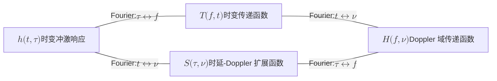
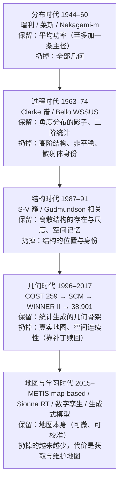

# 3 · 统计建模百年谱系：我们如何承认无知

把一台接收机放在城市街角，它收到的不是"一个"信号，而是同一份电磁波经幕墙反射、楼角衍射、树冠散射后的成百上千个副本，各自带着幅度、时延与相位，在天线口叠加成一个相量和。[第 2 章](02-maxwell-foundations.md)已经确立：只要给定每栋楼的位置、每面墙的介电常数、每片树叶的姿态，Maxwell 方程会把这个相量和唯一地确定下来——信道是环境的确定性泛函，没有任何骰子参与。

但我们不知道那些边界条件。1960 年代的工程师不知道，2026 年的数字孪生也只知道一部分。统计信道建模的百年历史，本质上是一部**承认无知的历史**：把不知道的几何参数化为随机变量，然后诚实地推演后果。所谓"随机衰落"，随机不住在信道里，而住在我们的无知里——是贝叶斯式的认识论随机，不是环境的本体论属性。

!!! note "本章预备知识"
    需要：概率论（中心极限定理，随机过程的平稳性与自相关）。用到的内容：

    - 瑞利与莱斯包络分布的逐步推导：[预备篇 2.4](../part0/02-wireless-channel-basics.md#24-小尺度衰落从多径相量和到瑞利分布)。本章换一个角度读它们：分布是"承认无知"的结果。
    - 阴影衰落与相关距离：[预备篇 2.3](../part0/02-wireless-channel-basics.md#23-阴影衰落为什么偏偏是对数正态)；多普勒与 Jakes 谱：[预备篇 2.5](../part0/02-wireless-channel-basics.md#25-多普勒信道为什么会随时间变)；时延扩展与相干带宽：[预备篇 2.6](../part0/02-wireless-channel-basics.md#26-四个特征量与两对傅里叶对偶)。
    - 时变冲激响应 $h(t,\tau)$ 与四个 Bello 函数：[预备篇 2.8](../part0/02-wireless-channel-basics.md#28-信道的统一表示httau-与-htf)。
    - 三重无知与"衰落是认知不确定性"：[第 1 章](01-lie-of-randomness.md)。

## 随机是无知的度量，不是信道的属性

本章用一个统一视角重讲这段谱系（**本站视角**，文献中无此统一提法）：

!!! success "关键结论（本章主命题·本站视角）"
    每一个统计信道模型，都等价于对环境信息做了一次**有损压缩**。模型之间的区别不在"谁对谁错"，而在"各自决定扔掉什么"。百年谱系是一部压缩率单调递减的历史：后一代模型总在赎回前一代扔掉的信息。

因此，本章讲每个经典模型时固定回答三问：

1. **它保留了环境的什么？**
2. **它藏起（扔掉）了环境的什么？**
3. **这个取舍在什么条件下合法？**

按这个尺子量下去，谱系自然分成五个时代：**分布**（1944–1960）、**过程**（1963–1974）、**结构**（1987–1991）、**几何**（1996–2017）、**地图与学习**（2015– ）。每个时代的开山之作，都是对上个时代"扔得太多"的一次纠偏。

## 分布时代（1944–1960）：在一个点上承认无知

### 相量和与中心极限定理：瑞利分布的真正出身

物理图像从多径叠加开始。设接收信号是 $N$ 条路径的相量和

$$
z=\sum_{n=1}^{N} a_n e^{j\phi_n}=x+jy,\qquad
x=\sum_{n=1}^{N} a_n\cos\phi_n,\quad
y=\sum_{n=1}^{N} a_n\sin\phi_n,
$$

其中 $a_n$ 是第 $n$ 条路径的幅度，$\phi_n$ 是它的相位。关键物理输入只有一条：波长远小于路径长度差。2 GHz 下 $\lambda=15$ cm，而路径长度差是米到百米量级——相位 $\phi_n=2\pi d_n/\lambda$ 转过成百上千圈，模 $2\pi$ 后我们对它一无所知；"一无所知"的贝叶斯编码就是 $\phi_n\sim U[0,2\pi)$ 独立。四步纯概率推演：

**第一步（均值）**：$\mathbb{E}[\cos\phi_n]=\mathbb{E}[\sin\phi_n]=0$，故 $\mathbb{E}[x]=\mathbb{E}[y]=0$。

**第二步（方差）**：$\mathbb{E}[\cos^2\phi_n]=\mathbb{E}[\sin^2\phi_n]=\tfrac12$，故

$$
\mathrm{Var}(x)=\mathrm{Var}(y)=\frac{1}{2}\sum_{n=1}^{N}\mathbb{E}[a_n^2]\triangleq\sigma^2 .
$$

**第三步（去相关）**：$\mathbb{E}[\cos\phi_n\sin\phi_n]=\tfrac12\mathbb{E}[\sin 2\phi_n]=0$，故 $x$ 与 $y$ 不相关。

**第四步（CLT）**：若没有单项主导（Lindeberg 条件：没有哪条路径的功率占比不可忽略），则 $N\to\infty$ 时 $(x,y)$ 联合趋于两个独立的 $\mathcal N(0,\sigma^2)$——即圆对称复高斯。"独立"来自两点：二维 CLT 保证极限 $(x,y)$ 是联合高斯的，而联合高斯的分量不相关就等价于独立，不相关已由第三步给出。换到极坐标 $x=r\cos\theta,\ y=r\sin\theta$，雅可比行列式为 $r$：

$$
p(r,\theta)=r\cdot\frac{1}{2\pi\sigma^2}\exp\!\Big(-\frac{r^2}{2\sigma^2}\Big),
$$

上式不含 $\theta$，可以写成 $\frac{r}{\sigma^2}e^{-r^2/2\sigma^2}$ 与 $\frac{1}{2\pi}$ 的乘积，所以 $\theta$ 均匀分布且与 $r$ 独立；对 $\theta$ 在 $[0,2\pi)$ 上积分就是乘以 $2\pi$，得到下面定理中的包络分布（逐步推导见[预备篇 2.4](../part0/02-wireless-channel-basics.md)）。

!!! abstract "定理（瑞利极限：富散射把几何洗成瑞利）【已解决】"
    设 $z=\sum_{n=1}^{N}a_n e^{j\phi_n}$，诸 $\phi_n\sim U[0,2\pi)$ 独立，幅度满足 Lindeberg 无主导条件。则 $N\to\infty$ 时 $z$ 依分布收敛于圆对称复高斯，包络 $r=|z|$ 的概率密度为

    $$
    p(r)=\frac{r}{\sigma^2}\exp\!\Big(-\frac{r^2}{2\sigma^2}\Big),\qquad r\ge 0,
    $$

    相位 $\theta\sim U[0,2\pi)$ 且与 $r$ 独立。分布形式可上溯到 Rayleigh（1880，随机相位振动合成问题）；作为信道模型成形于 1940–60 年代，高斯过程包络统计的完整数学出自 Rice [1]。

**物理意义**：这个定理最重要的读法是反着读——瑞利分布**不是被测量"发现"的信道属性，而是"均匀无知 + 中心极限定理"的必然输出**。只要承认相位均匀无知、散射足够"富"，CLT 就像一台洗衣机，把千姿百态的城市几何全部洗成同一个分布：输入端千差万别的楼宇布局，输出端只剩一个参数 $\sigma^2$。这正是[第 9 章](09-exchange-and-universality.md)基本问题 Q4——"什么几何洗出什么分布"——的第一个已解样本：富散射几何 $\xrightarrow{\mathrm{CLT}}$ 瑞利。

**行为分析**：平均功率 $\mathbb{E}[r^2]=2\sigma^2$。把 $p(r)$ 从 $0$ 积到 $r_0$ 得 $\Pr\{r<r_0\}=1-e^{-r_0^2/2\sigma^2}$，即功率 $r^2$ 服从均值 $2\sigma^2$ 的指数分布。记 $\gamma$ 为门限相对平均功率的比例，取 $r_0^2=\gamma\cdot2\sigma^2$ 即得深衰落概率 $\Pr\{r^2<\gamma\cdot 2\sigma^2\}=1-e^{-\gamma}\approx\gamma$（$\gamma\ll 1$）：低于均值 20 dB（$\gamma=0.01$）的概率约 1%，低于 10 dB（$\gamma=0.1$）约 9.5%。小 $r$ 处密度按 $p(r)\approx r/\sigma^2$ 线性起步——深衰落不罕见，这是分集技术全部理论的出发点。条件失效的方向同样清楚：某条径占优则向莱斯偏移；径数太少（毫米波稀疏信道、走廊波导），CLT 根本不启动，实测包络可呈双峰。

!!! warning "陷阱：瑞利不是普适真理"
    "瑞利衰落"常被写得像物理定律，其实是认识论选择的后果。街道峡谷、走廊、隧道等波导环境实测经常**不是**瑞利（等效 Nakagami 参数 $m>1$ 甚至双峰），因为几何没被"洗干净"——少数强径主导了相量和。当默认值没问题，当真理就会系统性算错链路预算。

    **错多少？一行不完全 Gamma 函数就能说清。** Nakagami-$m$ 分布（下文专节介绍）用形状参数 $m$ 调节衰落轻重，$m=1$ 即瑞利，$m$ 越大衰落越轻。它的功率 $R^2$ 服从形状参数 $m$、均值 $\Omega$ 的 Gamma 分布，累积分布函数为 $\Pr\{R^2<u\}=\gamma(m,\,m u/\Omega)/\Gamma(m)$，其中 $\gamma(m,x)=\int_0^x t^{m-1}e^{-t}\,\mathrm{d}t$ 是下不完全 Gamma 函数；$m=1$ 时它就是瑞利的 $1-e^{-u/\Omega}$。取 $u=0.01\Omega$，功率低于均值 20 dB 的概率为 $\Pr\{R^2<0.01\Omega\}=\gamma(m,0.01m)/\Gamma(m)$：

    | 环境 | $m$ | 20 dB 深衰概率 |
    |---|---|---|
    | 富散射（瑞利） | 1 | $9.95\times10^{-3}$ |
    | 走廊/峡谷（实测典型） | 3 | $4.4\times10^{-6}$ |

    **差 2000 倍**。在走廊里按瑞利给 1% 中断留衰落裕量，要留约 20 dB；按实测的 $m=3$ 只需约 8.4 dB。多出的约 11.6 dB，是在为一个实际概率只有 $4.4\times10^{-6}$ 的深衰事件付功率预算——这不是保守，是把功放和覆盖白白扔掉。反过来，在真富散射环境里按 $m=3$ 设计，中断率会比预期高三个数量级。**模型选错的代价，两个方向都是灾难性的。**

> **它保留了什么**：平均功率 $2\sigma^2$——一个实数。
>
> **它藏起了环境的什么**：全部几何——散射体在哪、有几个、什么材质，一概压缩殆尽。
>
> **取舍何时合法**：多径数目大、无主导分量、相位可视为均匀独立——即"富散射"条件成立时。

### 莱斯：赎回一条视距径

给瑞利散射叠加一条确定的主导径（幅度 $A$，通常是视距 (Line-of-Sight, LOS) 分量），即 $x\sim\mathcal N(A,\sigma^2)$、$y\sim\mathcal N(0,\sigma^2)$。只加在实部上，是因为把主导径的相位取作参考零相位：它是一个确定的相量 $A$，只平移均值，不改变散射部分的方差。极坐标变换后对 $\theta$ 积分：

$$
\begin{aligned}
p(r)&=\frac{r}{2\pi\sigma^2}\int_{0}^{2\pi}\exp\!\Big(-\frac{(r\cos\theta-A)^2+r^2\sin^2\theta}{2\sigma^2}\Big)\,\mathrm{d}\theta\\[2pt]
&=\frac{r}{2\pi\sigma^2}\,e^{-(r^2+A^2)/2\sigma^2}\int_{0}^{2\pi}\exp\!\Big(\frac{Ar\cos\theta}{\sigma^2}\Big)\,\mathrm{d}\theta\\[2pt]
&=\frac{r}{\sigma^2}\,e^{-(r^2+A^2)/2\sigma^2}\,I_0\!\Big(\frac{Ar}{\sigma^2}\Big),
\end{aligned}
$$

第二行把指数中的 $(r\cos\theta-A)^2+r^2\sin^2\theta$ 展开为 $r^2+A^2-2Ar\cos\theta$，再提出与 $\theta$ 无关的因子，第三行用零阶修正贝塞尔函数的积分定义 $I_0(u)=\frac{1}{2\pi}\int_0^{2\pi}e^{u\cos\theta}\mathrm{d}\theta$。这就是莱斯分布，出自 Rice 对正弦波加噪声包络的分析 [1]。莱斯因子

$$
K=\frac{A^2}{2\sigma^2}
$$

是主导径功率与散射功率之比。

**物理意义**：$K$ 是一只**"承认多少几何"的旋钮**。$K=0$ 表示继续全盘无知，退回瑞利；$K$ 增大表示从环境里赎回了一条信息——存在一条可辨认的主导径及其强度。赎回的只是"存在且多强"；方向、时延与剩余散射的模样仍被藏着。

**行为分析**：$K\to 0$ 时 $I_0\to 1$，退化为瑞利；$K\to\infty$ 时分布向 $r=A$ 附近的高斯集中，衰落"消失"，信道趋近 AWGN。工程量级：视距微蜂窝的 $K$ 常在几 dB 到十几 dB，足以把 20 dB 深衰概率从约 1% 压到近乎可忽略（$K$ 的 dB 值是 $10\log_{10}K$，$K=10$ dB 即主导径功率是散射功率的 10 倍；按总功率 $A^2+2\sigma^2$ 取门限，$K=6$ dB 时 20 dB 深衰概率约 $1.0\times10^{-3}$，$K=10$ dB 时约 $7.8\times10^{-6}$）——巨大的行为差异只来自"承认一条径"这一点点几何信息，是"环境信息值多少信噪比"（[第 9 章](09-exchange-and-universality.md)的"汇率"问题）最早的暗示。

> **它保留了什么**：平均散射功率 $2\sigma^2$，加一条主导径的功率 $A^2$——两个实数。
>
> **它藏起了环境的什么**：主导径的方向与时延、散射体的一切几何。
>
> **取舍何时合法**：存在单一稳定主导分量、其余多径仍满足富散射条件时（典型：视距微蜂窝、开阔地）。

### Nakagami-m：连机理都放弃的拟合

第三种姿势最彻底：不做机理假设，直接找一族形状灵活的分布拟合实测直方图。Nakagami 基于 1940 年代日本高频 (HF) 长距离传播测量提出 m 分布 [2]：

$$
p(r)=\frac{2m^m r^{2m-1}}{\Gamma(m)\,\Omega^m}\exp\!\Big(-\frac{m r^2}{\Omega}\Big),\qquad
m=\frac{\big(\mathbb{E}[R^2]\big)^2}{\mathrm{Var}(R^2)}\ge\frac12,\quad \Omega=\mathbb{E}[R^2].
$$

$m$ 由功率的前两阶矩定义——它就是"功率归一化方差的倒数"，衰落越剧烈 $m$ 越小。举例：瑞利的功率服从指数分布，均值 $\Omega$、方差 $\Omega^2$，归一化方差为 1；把两路独立瑞利支路的功率取平均（二重分集），均值不变、方差减半，$m=2$。一般地，$m$ 路独立瑞利功率的平均恰好服从 Nakagami-$m$ 的功率分布，所以整数 $m$ 可以粗读成"等效分集路数"。$m=1$ 精确退化为瑞利；$m=\tfrac12$ 为单边高斯（最剧烈衰落）；$m>1$ 近似莱斯，常用换算 $m=(1+K)^2/(1+2K)$ 只是矩匹配近似——两族尾部行为不同，深衰落概率估计可差出量级。例如 $K=10$ dB 匹配出 $m\approx5.76$，20 dB 深衰概率莱斯约 $7.8\times10^{-6}$，Nakagami 约 $1.5\times10^{-10}$，相差四个多数量级；$K=6$ dB（$m\approx2.77$）时也差约 100 倍（$1.0\times10^{-3}$ 对 $1.1\times10^{-5}$）。

!!! warning "陷阱：Nakagami-m 不是机理分布"
    m 分布常被误当作有散射机理支撑。它本质是**矩拟合**：保留前两阶矩，把"为什么是这个形状"整个扔掉。拟合优度常好于瑞利/莱斯，恰恰因为它不受机理约束——是灵活性也是空洞性；外推到没测过的区域（尤其尾部）没有物理依据。

> **它保留了什么**：实测包络的前两阶矩（$\Omega$ 与 $m$）。
>
> **它藏起了环境的什么**：不止几何，连"分布从何而来"的机理都藏了——三个姿势就此齐备：全弃（瑞利）、留一条（莱斯）、只留拟合优度（Nakagami）。
>
> **取舍何时合法**：只需要对单点包络统计做插值式描述、不做机理外推时。

**三种姿势一览**（全弃、留一条、只留拟合优度；深衰概率按总平均功率取门限，已独立复算）：

| | 瑞利 | 莱斯 | Nakagami-$m$ |
|---|---|---|---|
| 出身 | 均匀相位无知 + 中心极限定理（定理级） | 瑞利散射之上加一条确定的主导径 | 矩拟合，不含机理 |
| 保留了什么 | 平均功率 $2\sigma^2$ | 散射功率 $2\sigma^2$ 与主导径功率 $A^2$，即 $K$ 因子 | 前两阶矩 $\Omega$ 与 $m$ |
| 藏起了什么 | 全部几何 | 主导径的方向与时延、散射体的几何 | 几何，连"分布从何而来"的机理也藏了 |
| 低于均值 20 dB 的深衰概率 | $9.95\times10^{-3}$ | $K=6$ dB：$1.0\times10^{-3}$；$K=10$ dB：$7.8\times10^{-6}$ | $m=3$：$4.4\times10^{-6}$ |
| 取舍何时合法 | 多径数目大、无主导分量、相位可视为均匀独立 | 单一稳定主导分量，其余多径仍满足富散射 | 只对单点包络统计做插值式描述，不做机理外推 |

{ .chart loading=lazy }
{ .chart loading=lazy }

*怎么读这张图：横轴是门限相对平均功率的 dB 数，纵轴是信号功率低于门限的概率，按对数刻度画（$10^{-2}$ 即 1%）。四条线依次是瑞利、莱斯 $K=6$ dB、莱斯 $K=10$ dB、Nakagami $m=3$。$-20$ dB 这一列读出的就是上表的四个数：$9.95\times10^{-3}$、$1.0\times10^{-3}$、$7.8\times10^{-6}$、$4.4\times10^{-6}$。斜率说明尾部从哪里来：瑞利每 10 dB 降一个数量级，莱斯的两条在深处斜率与瑞利接近，只是整体被压低，Nakagami $m=3$ 每 10 dB 降三个数量级。所以第三、四条在约 $-18.4$ dB 处交叉：比这更深，$m=3$ 的尾巴更薄；比这更浅，反而是莱斯 $K=10$ dB 更少跌破门限。沿纵轴 $10^{-2}$（1% 中断）横着看，瑞利需要约 20 dB 的衰落裕量，$m=3$ 只需约 8.4 dB。按各分布的累积分布函数计算，每 2 dB 一点。*

## 过程时代（1963–1974）：无知获得动力学

分布时代回答"此刻多强"，却回答不了"下一毫秒还相关吗"——而均衡、交织深度、反馈时延容忍度问的全是后者。1960 年代的两项工作给这份无知装上了动力学：Clarke 用一条几何假设推出整个 Doppler 谱；Bello 干脆为"随机时变线性信道"立宪。

### Clarke 谱定理：一个几何假设锁死整个谱

Clarke (1968) 只添加**一条**几何假设：散射均匀分布在移动台四周的方位面——到达角 $\alpha$（相对运动方向）服从 $p(\alpha)=\frac{1}{2\pi}$，二维各向同性 [3]。移动台以速度 $v$ 前行，波长 $\lambda$，则来自方向 $\alpha$ 的径经历 Doppler 频移

$$
\nu(\alpha)=f_m\cos\alpha,\qquad f_m=\frac{v}{\lambda}.
$$

频移之所以是 $f_m\cos\alpha$，是因为只有速度在该径方向上的分量 $v\cos\alpha$ 改变路程，推导见[预备篇 2.5](../part0/02-wireless-channel-basics.md)。

Doppler 谱的推导是一次干净的**概率测度前推 (pushforward)**，也就是概率论里的"求随机变量函数的分布"：已知 $\alpha$ 的分布，求 $f=f_m\cos\alpha$ 的分布，只不过这里被搬运的是功率而不是概率。四步：

**第一步（角度域功率）**：来自 $[\alpha,\alpha+\mathrm{d}\alpha)$ 的功率为 $P\,G(\alpha)p(\alpha)\,\mathrm{d}\alpha$，$G(\alpha)$ 是天线方位增益，$P$ 为总功率。

**第二步（变量代换）**：映射 $f=f_m\cos\alpha$ 把角度送到频率；每个 $|f|<f_m$ 有两个原像 $\alpha=\pm\arccos(f/f_m)$。

**第三步（雅可比）**：$|\mathrm{d}f|=f_m|\sin\alpha|\,\mathrm{d}\alpha=f_m\sqrt{1-(f/f_m)^2}\,\mathrm{d}\alpha$。

**第四步（功率守恒）**：谱密度 = 落进 $[f,f+\mathrm{d}f)$ 的功率除以 $|\mathrm{d}f|$，对两个原像求和。写成式子：$S(f)\,|\mathrm{d}f|=\sum P\,G(\alpha)p(\alpha)\,\mathrm{d}\alpha$，两边除以第三步的 $|\mathrm{d}f|$ 即得下面定理中的求和式。各向同性、全向时每个原像贡献 $\frac{P}{2\pi f_m\sqrt{1-(f/f_m)^2}}$，两个相加即 U 形谱；由 $\int_{-1}^{1}\frac{\mathrm{d}u}{\sqrt{1-u^2}}=\pi$，它在 $(-f_m,f_m)$ 上积分恰为 $P$，功率守恒。

!!! abstract "定理（Clarke 谱：Doppler 谱是角度分布的像）【已解决】"
    二维水平传播、到达角分布 $p(\alpha)$、方位增益 $G(\alpha)$、最大 Doppler $f_m=v/\lambda$，则 Doppler 功率谱为

    $$
    S(f)\propto \sum_{\alpha=\pm\arccos(f/f_m)}\frac{G(\alpha)\,p(\alpha)}{f_m\sqrt{1-(f/f_m)^2}},\qquad |f|<f_m .
    $$

    各向同性（$p=\frac{1}{2\pi}$）加全向天线（$G\equiv 1$）时得 U 形谱

    $$
    S(f)=\frac{P}{\pi f_m\sqrt{1-(f/f_m)^2}},\qquad |f|<f_m,
    $$

    对应时间自相关与空间自相关

    $$
    \rho(\tau)=J_0(2\pi f_m\tau),\qquad \rho(d)=J_0\!\Big(\frac{2\pi d}{\lambda}\Big).
    $$

    出处：Clarke, BSTJ, 1968 [3]。自相关的推导很短：来自方向 $\alpha$ 的径随时间旋转 $e^{j2\pi f_m t\cos\alpha}$，相隔 $\tau$ 的两个时刻共轭相乘只剩相位差 $e^{j2\pi f_m\tau\cos\alpha}$；不同径的交叉项因初相独立均匀而平均为零，于是$\rho(\tau)=\mathbb{E}_\alpha\big[e^{j2\pi f_m\tau\cos\alpha}\big]=\frac{1}{2\pi}\int_0^{2\pi}e^{j2\pi f_m\tau\cos\alpha}\,\mathrm{d}\alpha=J_0(2\pi f_m\tau)$，用的是零阶贝塞尔函数的积分表示 $J_0(x)=\frac{1}{2\pi}\int_0^{2\pi}e^{jx\cos\alpha}\,\mathrm{d}\alpha$。空间版只需把时间间隔换成移动距离 $d=v\tau$：$2\pi f_m\tau=2\pi v\tau/\lambda=2\pi d/\lambda$。

**物理意义**：这是全书"几何 → 分布"映射最干净的标本——**谱是角度分布经 $f=f_m\cos\alpha$ 前推的影子**。U 形两端的发散不是病态，而是几何：$\cos\alpha$ 在 $\alpha=0,\pi$ 附近变化最慢，正对/背对运动方向的一整片角度区间被压进 $\pm f_m$ 附近的极窄频带，雅可比 $1/\sqrt{1-(f/f_m)^2}$ 的爆掉正是"堆积"的定量表达（可积）。一条几何假设锁死了整个谱形状与整条时空相关曲线——这是[第 9 章](09-exchange-and-universality.md) Q4 的第二个已解样本，也是它的原型：正问题"给定角度几何求分布"在此被完整解出，第 9 章问一般化与逆问题。

**行为分析**：代入数量级：$v=30$ m/s、载频 2 GHz、$\lambda=15$ cm，得 $f_m=200$ Hz。$J_0$ 首零在宗量 $\approx 2.405$ 处：时间相关首次过零在 $\tau=2.405/(2\pi f_m)\approx 1.9$ ms——"高速移动下相干时间毫秒量级"的出处；空间相关首次过零在 $d\approx 0.38\lambda\approx 5.7$ cm——"天线隔半波长近似独立"口诀的来源（仅在各向同性下成立；系统展开见[第 4 章](04-spatial-structure.md)）。假设一旦松动结论立即变形：街道峡谷里到达角集中在街道轴向，$p(\alpha)$ 塌成两个尖峰，U 形谱退化成两根谱线，相干时间可比 $1/f_m$ 长得多——谱形状忠实地出卖了几何。

!!! note "备注：一桩命名公案"
    工程界口中的"Jakes 谱"其实是 Clarke 1968 年推导的 [3]；Jakes 1974 年的著作《Microwave Mobile Communications》普及了它并给出正弦波叠加 (sum-of-sinusoids) 仿真方法，谱遂以普及者命名。优先权应还给 Clarke。

> **它保留了什么**：到达角分布这一条几何假设（各向同性版只留"均匀"二字），加上速度 $v$。
>
> **它藏起了环境的什么**：散射体的距离、数目、材质，以及角度分布"为什么"各向同性——真实城市几乎从不各向同性。
>
> **取舍何时合法**：移动台被丰富散射包围、无主导到达方向、观察时段内几何近似不变时。

### Bello 与 WSSUS：统计信道的宪法

Clarke 解决了窄带包络的动力学；Bello (1963) 一步到位，把"随机时变线性信道"整个公理化 [4]。任何时变线性信道由时变冲激响应 $h(t,\tau)$ 完全刻画：输出 $y(t)=\int h(t,\tau)\,x(t-\tau)\,\mathrm{d}\tau$，时延 $\tau$ 表示"这份输入是多久之前发出的"，$t$ 表示"此刻"的绝对时间；信道不随时间变时 $h$ 与 $t$ 无关，退回信号与系统里的 $h(\tau)$（详见[预备篇 2.8](../part0/02-wireless-channel-basics.md)）。对两个变量分别做 Fourier 变换，得到四个等价的系统函数，构成一个变换正方形：

随机性进入后，完整刻画需要所有阶联合分布——不可操作。Bello 的宪法性动作是砍到二阶，加两条公理：**WSS**（时间广义平稳：统计量只依赖时间差）与 **US**（不相关散射：不同时延贡献不相关），合称 WSSUS：

!!! abstract "定理（WSSUS 刻画）【已解决】"
    WSSUS 假设下，信道二阶统计满足

    $$
    \mathbb{E}\big[h(t,\tau)\,h^{*}(t',\tau')\big]=P_h(t'-t;\tau)\,\delta(\tau-\tau'),
    $$

    从而全部二阶信息被一张二维图——散射函数 (scattering function)——完全刻画：

    $$
    P_S(\tau,\nu)=\int_{-\infty}^{\infty}P_h(\Delta t;\tau)\,e^{-j2\pi\nu\Delta t}\,\mathrm{d}\Delta t .
    $$

    且 WSS 与 US 互为时频对偶：WSS $\Leftrightarrow$ 不同 Doppler 分量不相关；US $\Leftrightarrow$ 不同时延分量不相关 $\Leftrightarrow$ 频率域 WSS。出处：Bello, 1963 [4]。

定理最后一句的时频对偶可以直接验证。固定时延，记 $H(\nu)=\int h(t)e^{-j2\pi\nu t}\,\mathrm{d}t$，则 $\mathbb{E}[H(\nu)H^{*}(\nu')]=\iint\mathbb{E}[h(t)h^{*}(t')]\,e^{-j2\pi\nu t}e^{j2\pi\nu' t'}\,\mathrm{d}t\,\mathrm{d}t'$。WSS 使期望只依赖 $\Delta t=t'-t$；令 $t'=t+\Delta t$，对 $t$ 的积分只剩 $\int e^{-j2\pi(\nu-\nu')t}\,\mathrm{d}t=\delta(\nu-\nu')$，所以不同 Doppler 分量不相关；反过来，若 $\mathbb{E}[H(\nu)H^{*}(\nu')]$ 只在 $\nu=\nu'$ 处非零，逆变换回去得到的 $\mathbb{E}[h(t)h^{*}(t')]$ 只依赖 $t'-t$，即 WSS。在 $\tau$ 与 $f$ 之间反方向做同样的计算，就得到 US 与频率域 WSS 的等价。

**物理意义**：散射函数 $P_S(\tau,\nu)$ 是"环境的二阶剪影"——告诉你"距离-径向速度"平面上散射能量的分布，却不告诉你哪个散射体在哪。两大色散尺度从它的边缘分布读出：时延扩展与 Doppler 扩展；相干带宽与相干时间分别是二者的 Fourier 共轭（时延扩展 1 μs 量级的城市宏蜂窝，按经验式 $B_c\approx1/(5\sigma_\tau)$ 相干带宽约 200 kHz，即几百 kHz 量级，经验式的来历见[预备篇 2.6](../part0/02-wireless-channel-basics.md)；最大 Doppler 频移 200 Hz（按预备篇 2.6 的口径，Doppler 扩展 $B_D=2f_m=400$ Hz）对应相干时间约 $0.423/200\approx2$ ms，即毫秒级）。整个 OFDM 参数设计本质上是在这张图的两个边缘上做预算。

**行为分析**：WSSUS 的"平稳"是广义（二阶）平稳，且 Bello 原文就明说它只是局部近似——同文提出的 Quasi-WSSUS 承认真实信道只在有限时频窗内近似平稳（移动台绕过街角，散射函数就换一张）。这不是后人打的补丁，是宪法自带的日落条款。失效方向看两条公理被什么破坏：大孔径阵列上不同天线看到不同散射体集合——空间非平稳，WSS 破；确定性强径之间存在相位关系——US 破。V2V、高铁与大阵列把两条都破了，这正是"beyond WSSUS"至今开放的原因（见本章开放问题）。

> **它保留了什么**：环境的全部**二阶**统计——压缩成一张散射函数图。
>
> **它藏起了环境的什么**：所有高阶统计、所有非平稳性、散射体的身份与位置（只留"距离-速度"平面上的匿名功率）。
>
> **取舍何时合法**：观察窗远短于环境几何的变化尺度、且系统只关心二阶量时。

## 结构时代（1987–1991）：环境的轮廓开始显形

过程时代的模型有共同盲区：它们眼中的环境是"均匀的雾"——散射连续、无结构。1987–1991 年两项测量驱动的工作，第一次把"环境里有离散的东西"写进统计模型。

### 对数正态阴影与 Gudmundson 相关：大尺度获得空间记忆

先看大尺度。信号从基站到用户要穿过或绕过一串遮挡物，总损耗是各段损耗的**连乘** $L=\prod_i l_i$。取 dB：

$$
L_{\mathrm{dB}}=10\log_{10}L=\sum_i 10\log_{10} l_i ,
$$

乘性级联在对数域变成求和，CLT 再次登场——洗出来的是 dB 域高斯，即线性域对数正态，阴影衰落 $X_\sigma\sim\mathcal N(0,\sigma^2)$（dB 域）由此得名【已解决，机理为启发式论证】。注意 $\sigma$ 是**对数域标准差**（量级若干 dB），与小尺度衰落的线性域方差不可混写。

但"每个位置独立抽一个 $X_\sigma$"显然荒谬：造成阴影的是同一栋楼，用户挪一米，楼还在那里。Gudmundson (1991) 用一条指数自相关把这个事实补进模型 [5]：

$$
R(\Delta x)=\sigma^2\,e^{-|\Delta x|/d_{\mathrm{cor}}},
$$

（原文为离散形式 $R(k)=\sigma^2 a^{|k|}$，对市区微蜂窝与郊区宏蜂窝分别拟合了参数；具体数值本站未核，故不引。$k$ 是相隔的采样点数；相邻采样点相距 $\delta$ 时取 $a=e^{-\delta/d_{\mathrm{cor}}}$，$a^{|k|}=e^{-|k|\delta/d_{\mathrm{cor}}}$ 就回到上式。）3GPP TR 38.901 沿用同型指数相关至今 [10]。

**物理意义**：$d_{\mathrm{cor}}$ 是**遮挡物尺寸在统计模型中的投影**——阴影相关距离量级上就是"一栋楼有多长"。这是统计模型第一次承认：无知不是空间白噪声，无知本身有几何结构。小尺度与大尺度的复合，则有 Suzuki (1977) 的瑞利-对数正态混合分布处理（细节从略）。

**行为分析**：用户移动 $d_{\mathrm{cor}}$，相关降到 $e^{-1}\approx 0.37$；移动 $3d_{\mathrm{cor}}$ 剩约 5%。指数相关意味着阴影是 dB 域的一阶 Gauss–Markov 过程——只有"上一步"的记忆。具体说，用上面的 $a=e^{-\delta/d_{\mathrm{cor}}}$，阴影可以沿路线逐点递推生成：$X_{k+1}=aX_k+\sqrt{1-a^2}\,\sigma w_k$，$w_k$ 为独立标准高斯。下一个值只由当前值加一份新噪声决定，这就是"一阶 Markov"；可以验证方差保持 $\sigma^2$，相隔 $k$ 步的协方差为 $\sigma^2a^{|k|}$。真实城市的阴影场当然不止一阶记忆，这个单指数是把环境结构压缩成单一标量 $d_{\mathrm{cor}}$ 的又一次有损压缩。它同时是[第 8 章](08-dimension-and-prediction.md)"预测半径"问题最朴素的祖先：相关距离就是"从一次测量能外推多远"的第一个答案。

> **它保留了什么**：阴影的方差 $\sigma^2$ 和一个空间记忆长度 $d_{\mathrm{cor}}$。
>
> **它藏起了环境的什么**：究竟是哪栋楼挡住了谁——遮挡物的位置、形状、材质，以及超出一阶 Markov 的一切空间结构。
>
> **取舍何时合法**：只需链路预算与切换层面的大尺度统计、无须指认具体遮挡物时。

### Saleh–Valenzuela：多径是成簇到达的

小尺度这边，Saleh 与 Valenzuela (1987) 在一栋中型办公楼用 1.5 GHz、10 ns 类雷达脉冲测量，给出结构时代最著名的发现：多径**不是**均匀撒落在时延轴上，而是**成簇 (cluster) 到达**——先来一团，衰减，再来一团 [6]：

!!! abstract "模型（Saleh–Valenzuela 双 Poisson 簇模型）【已解决（经验模型）】"
    冲激响应为双重求和

    $$
    h(t)=\sum_{l=0}^{\infty}\sum_{k=0}^{\infty}\beta_{kl}\,e^{j\theta_{kl}}\,\delta(t-T_l-\tau_{kl}),
    $$

    其中簇到达时刻 $T_l$ 与簇内射线到达时刻 $\tau_{kl}$ 是两个独立 Poisson 过程，速率分别为 $\Lambda$ 与 $\lambda$，且 $\Lambda\ll\lambda$。Poisson 过程指相邻两次到达的间隔相互独立、都服从指数分布；速率 $\Lambda$ 是单位时间平均到达的簇数，平均簇间隔为 $1/\Lambda$。**记号提醒**：这里的 $\lambda$ 是射线到达率（单位 1/ns），不是前文 $f_m=v/\lambda$ 里的波长。幅度平方的期望服从双指数衰减

    $$
    \overline{\beta_{kl}^{2}}=\overline{\beta^{2}}(0,0)\,e^{-T_l/\Gamma}\,e^{-\tau_{kl}/\gamma},
    $$

    $\Gamma$ 为簇间衰减常数、$\gamma$ 为簇内衰减常数（两者都是以 ns 计的时间常数，与 Nakagami 小节的 Gamma 函数 $\Gamma(m)$、不完全 Gamma 函数 $\gamma(m,x)$ 无关），相位 $\theta_{kl}$ 均匀、幅度瑞利。原测量时延扩展约 200 ns、均方根约 50 ns、动态范围 60 dB；拟合参数量级：簇衰减常数数十 ns、簇内约二十 ns、簇间隔数百 ns、簇内射线间隔数 ns（具体数值本站未复核，以量级表述）。出处：Saleh & Valenzuela, IEEE JSAC, 1987 [6]。

**物理意义**：簇是**环境离散大结构**——一面墙、一组家具、一栋邻楼——的统计投影：每个大结构贡献一团时延相近的射线，结构间距造成簇间隔。S-V 的历史地位在于第一次把"环境由离散物体组成"写进统计模型的**骨架**（双重求和的形式本身），而不只是参数。但它承认的方式仍是统计式的——Poisson 过程说"有结构，但不知道在哪"，把结构的**存在性**与**位置**分离：保留前者，扔掉后者。

**行为分析**：$\Lambda\ll\lambda$ 是尺度分离条件——簇间隔远大于簇内射线间隔，模型才"看得见"簇。若 $\Gamma\to\gamma$ 且 $\Lambda\to\lambda$，双指数退化为单指数，簇结构消失——S-V 与"均匀雾"的距离恰好是这两组参数的分离度。原因是：$\Gamma=\gamma$ 时 $e^{-T_l/\Gamma}e^{-\tau_{kl}/\gamma}=e^{-(T_l+\tau_{kl})/\gamma}$ 只依赖射线的绝对到达时刻 $T_l+\tau_{kl}$，功率随时延平滑衰减；$\Lambda=\lambda$ 时簇与射线到达得一样密，时延轴上分不出"一团一团"。后续工作把簇推广到时延-角度联合域，成为超宽带与毫米波簇模型的直系祖先；而"一个统计簇对应几个真实物体"的身份问题，要等 ISAC 时代才被逼到台前（见下文）。

> **它保留了什么**：环境有离散结构这个事实，以及结构（$\Gamma,\Lambda$）与微观纹理（$\gamma,\lambda$）的两组统计尺度。
>
> **它藏起了环境的什么**：每个簇对应哪个物体、在哪个方向（原始模型无角度域）、结构之间的空间关系。
>
> **取舍何时合法**：评估对时延色散敏感、对"具体是哪面墙"不敏感的系统（均衡、OFDM 保护间隔等）时。

## 几何时代（1996–2017）：把散射体请回来一半

结构时代承认"有结构"，几何时代更进一步：**随机生成一个几何，再在其上确定性地算传播**。这是几何随机信道模型 (Geometry-based Stochastic Channel Model, GSCM) 的范式反转——不再直接假设统计量，而是撒散射体/簇，让统计量作为几何的**后果**涌现。谱系：COST 259 完成方向域体系化 [7]，2003 年进入标准成为 3GPP SCM [8]，经 WINNER II [9] 定型为 drop-based 流水线，演化为覆盖 0.5–100 GHz 的 TR 38.901（当前版本 V19.2.0，2026-02）[10]；完整标准化史见 [13]。

38.901 的生成流水线是 GSCM 的标准形态【已解决（工程标准）】：

1. **场景选择**（UMi/UMa/RMa/InH/InF，依次为城区微蜂窝、城区宏蜂窝、农村宏蜂窝、室内热点、室内工厂）与链路几何；
2. **大尺度参数 (Large-Scale Parameter, LSP)**：时延扩展 DS、角度扩展 AS、阴影 SF、莱斯因子 K 等，按场景相关矩阵联合对数正态生成，沿位置服从指数空间自相关（Gudmundson 的直系后代）；
3. **簇生成**：按 LSP 抽出 $N$ 个簇的时延、功率、到达/离开角（S-V 的直系后代）；
4. **射线叠加**：每簇 $M$ 条子径，带极化与初相位，叠加成信道系数——这一步是纯几何的确定性计算。

**物理意义**：GSCM 是统计与几何的和解——用统计生成几何，用几何生成信道。扔掉的东西被赎回了一半：簇有了角度、功率、极化，阵列看到的空间结构第一次"像真的"。容量、波束赋形增益、秩全都依赖角度域结构——MIMO 评估离不开它，纯统计模型喂不出。

但 drop 范式有出生缺陷。**Drop（一次投放）的语义：drop 内 LSP 冻结、信道对时间平稳；drop 之间一切重抽。** 于是相邻位置的两个用户得到**相互独立**的信道——

!!! warning "陷阱：drop-based 模型里不存在'空间'"
    把用户从 $(x,y)$ 挪到一米外，信道不是"连续变化"而是"重新掷骰子"——模型里没有任何机制保证邻近位置的信道相似，**空间这个维度根本不存在**。链路级仿真无妨；波束管理、移动性预测、定位、信道知识地图（[第 7 章](07-channel-cartography.md)）这类以空间连续性为生命线的问题，drop 范式在概念层面就失效了。

38.901 §7.6.3 的空间一致性 (spatial consistency) 补丁【部分结果/仍在演化】给出两套并存程序 [10]（本站记作 SC-I、SC-II，即原文 §7.6.3.2 的 Procedure A、Procedure B）：**SC-I** 沿轨迹递推——时刻 $t_k$ 的簇时延/角度/功率由 $t_{k-1}$ 的值加用户位移更新，每次递推的位移限制在 1 m 以内，使簇参数随位置平滑变化；**SC-II** 改造参数生成本身——用空间相关的随机场生成时延与角度，使邻近位置抽到相近的实现（各场景的相关距离见原文表 7.6.3.1-2）。批评是明确的：计算复杂、簇生灭 (birth-death) 不连续、只保证**统计**连续而非**物理**一致——NYUSIM 团队给出替代的时变一致性程序 [12]。

**本站的修辞判断**（本站视角，文献只说 limitation）：spatial consistency 补丁本身就是一份**供词**——统计模型出生时就把空间扔掉了，如今只能事后用相关函数一寸寸赎回；而相关函数只能保证"邻近位置统计相似"，永远给不出"这两个位置看到的是同一栋楼"。

> **它保留了什么**：环境的几何骨架——以统计方式生成的簇位形、角度结构、极化、LSP 的空间相关。
>
> **它藏起了环境的什么**：真实的地图。簇是抽出来的，不对应任何真实物体；空间连续性靠补丁近似，物理一致性原则上缺失。
>
> **取舍何时合法**：做统计意义的系统级评估（吞吐分布、覆盖概率）而非站点级预测时——这正是它作为全球评估货币的本职。

## 地图与学习时代（2015– ）：赎回的终点是地图本身

统计模型找不回空间，就有人干脆把地图放回来。METIS 项目 (2015) 的 D1.4 交付了三轨并行的模型体系 [11]：**map-based**（简化三维几何 + 光线追踪，反射/绕射/散射/阻挡内生，空间一致性天然成立）、**stochastic**（WINNER 系延续）与 **hybrid**（地图算大尺度与主径、统计补小尺度）。这是确定性回归的第一枪：对 massive MIMO、D2D/V2V 等空间结构敏感的评估，标准化团体也承认统计轨道不够用了。

这条回归线在 2020 年代加速。Sionna RT 把光线追踪做成**可微分**的 [14]：传播输出对材质参数、物体位置、天线方向图可求梯度，"地图"从静态输入变成可被数据校准、被优化器搜索的对象——确定性建模的机器学习化（系统展开见[第 5 章](05-deterministic-revival.md)；用信道反演地图的逆问题见[第 6 章](06-inverse-problem.md)）。数字孪生随之把同步地图变成网络运营的常规组件。另一条线是生成式模型：用 GAN/扩散模型直接学信道分布，2026 年已有显式处理多用户空间一致性的工作 [18]——接力棒部分交给了神经网络，但"如何保证不违反互易性、能量守恒、空间连续性"随即成为新开放题【开放】。

与此同时，统计框架被新应用逼到假设的边界。3GPP Rel-19 对 38.901 的 7–24 GHz 增强 [15] 不得不引入**近场传播**（球面波取代平面波，见[预备篇 9.2](../part0/09-new-landscape.md)）与**空间非平稳 (Spatial Non-Stationarity, SNS)** 建模——超大孔径阵列 (ELAA) 下，"平面波"与"阵列各处看到同一环境"两个百年默认假设双双失效；什么分布取代瑞利/莱斯，测量与理论都在进行时 [17]【开放】。更釜底抽薪的是 Rel-19 的 ISAC 信道模型（2023-12 立项，2025-05 定稿）[16]：通信感知一体化 (Integrated Sensing and Communication, ISAC) 要求显式刻画感知目标（雷达散射截面、移动性）与背景杂波——**散射体必须对应真实物体**。通信仿真可以撒假散射体，感知不行：不能用统计抽取的幽灵簇去测角测距。"把环境藏起来"的百年策略在 ISAC 面前正面破产；E-GBSM 等统一框架是候选而非定论 [16]【开放】。其中 GBSM（Geometry-Based Stochastic Model）与前文的 GSCM 指同一类"先随机生成几何、再在几何上算传播"的模型，文献中两个缩写混用；E-GBSM 是它面向 ISAC 的扩展版本。

当应用开始要求散射体是真实物体时，"承认无知"就走到了它的边界——接力棒交还给确定性映射，以及本书后半部要建立的信道-环境双向地图学。

## 谱系总览：一条信息保留量轴

把百年谱系放到"保留了多少环境信息"这根轴上，历史呈现罕见的单调性：

三点收束：

**第一，谱系是压缩率递减史**（本站视角）。每个时代都在赎回上个时代扔掉的信息：莱斯赎回一条径，Clarke 赎回角度分布，WSSUS 赎回二阶动力学，S-V 赎回结构存在性，GSCM 赎回几何骨架，map-based 赎回地图本身。方向从未逆转——应用对环境信息的需求（误码率 → MIMO → 定位 → 感知）只增不减。

**第二，"承认无知"不是错误，而是当时测量与算力下的最优停止。** 瑞利用一个参数覆盖无穷多种几何，且在富散射条件下**可证明地**足够好。错的从来不是压缩，而是忘记自己压缩过——把瑞利当物理定律、把 WSSUS 当永真、把 drop 当空间，都是把认识论权宜误记成本体论事实的同一种失忆。

**第三，两个已解样本在手，一般理论还没有。** 本章给出"几何 → 分布"映射的两个完整标本：富散射几何经 CLT 洗成瑞利，角度分布经 $f=f_m\cos\alpha$ 前推成 Doppler 谱。[第 9 章](09-exchange-and-universality.md)的 Q4 问它们的一般化：什么几何族在 CLT 洗衣机里是不变量？哪些几何信息注定被洗掉、哪些可以从分布反演回来？截至 2026-08，正反问题均无一般定理——这是本书研究纲领（[第 10 章](10-research-agenda.md)）的核心条目之一。

!!! info "跨部连线"
    本章所在的线索：[信息结构](../guide/05-eight-threads.md#2-信息结构谁在什么时候知道什么)、[时间尺度](../guide/05-eight-threads.md#1-时间尺度这个旋钮该转多快)、[采纳](../guide/05-eight-threads.md#6-采纳产业会不会接受)。

    - [第二部 4.2 节](../part2/04-environment-generalization.md#42-误配的信息论原型gmi-与-lapidoth-定理)：按统计模型设计的接收机放进真实信道里会怎样：按错的模型译码仍能拿到多少速率，由 GMI 衡量。
    - [第二部 4.7 节](../part2/04-environment-generalization.md#47-前沿与方法盘点)：3GPP 评估 AI 空口的泛化能力时，数据多由本章谱系末端的标准统计信道模型生成；那里介绍了标准定义的四种泛化测试配置。

## 开放问题

- **Beyond WSSUS**【开放】：高速移动、V2V、大孔径阵列下的非平稳信道没有公认的系统刻画框架。Bello 的 Quasi-WSSUS 只是权宜 [4]，后续局部散射函数等提案未成标准。截至 2026-08 无统一框架。
- **空间一致性的"正确"数学**【开放】：SC-I/SC-II 是工程补丁 [10]，簇生灭的连续处理、空间连续随机信道场的严格构造仍无定论；Rel-19 讨论中反复出现 [15]。
- **近场 + 空间非平稳的统计建模**【开放】：ELAA 下什么分布取代瑞利/莱斯？Rel-19 只给了初步程序 [15]，测量与理论均在进行时 [17]。截至 2026-08 无定理。
- **ISAC 的目标-杂波统一建模**【开放】：通信信道可以容忍"假散射体"，感知信道要求散射体真实——两者如何共用一个模型？E-GBSM 是候选而非定论 [16]。
- **生成式信道模型的物理一致性**【开放】：如何保证神经网络学出的信道不违反互易性、能量守恒、空间连续性 [18]？截至 2026-08 无一般方法。
- **混合建模的边界定理**【开放】：hybrid 模型中"哪一半交给地图、哪一半交给随机"没有理论指导 [11]——直觉上应存在由测量精度与环境复杂度决定的最优切分，截至 2026-08 无定理。
- **本站原创提法（待检验，勿引为文献共识）**：（i）"每个统计模型 = 环境信息的有损压缩，谱系 = 压缩率递减史"的统一史观；（ii）"spatial consistency 是统计模型找回空间的供词"的修辞框架；（iii）"什么几何在 CLT 洗衣机里是不变量"——即[第 9 章](09-exchange-and-universality.md) Q4 的逆问题式表述。

## 参考文献

1. S. O. Rice, 《Mathematical Analysis of Random Noise》, *Bell System Technical Journal*, 23: 282–332, 1944 及 24: 46–156, 1945. https://onlinelibrary.wiley.com/doi/10.1002/j.1538-7305.1944.tb00874.x ; https://onlinelibrary.wiley.com/doi/10.1002/j.1538-7305.1945.tb00453.x
2. M. Nakagami, 《The m-Distribution—A General Formula of Intensity Distribution of Rapid Fading》, in W. C. Hoffman (ed.), *Statistical Methods in Radio Wave Propagation*, Pergamon, pp. 3–36, 1960. https://www.semanticscholar.org/paper/8cd33c5982b89b756e50a30704e2f1342b545ab2
3. R. H. Clarke, 《A Statistical Theory of Mobile-Radio Reception》, *Bell System Technical Journal*, 47(6): 957–1000, 1968. https://onlinelibrary.wiley.com/doi/abs/10.1002/j.1538-7305.1968.tb00069.x
4. P. A. Bello, 《Characterization of Randomly Time-Variant Linear Channels》, *IEEE Transactions on Communications Systems*, CS-11(4): 360–393, 1963. https://cir.nii.ac.jp/crid/1363388843473109760
5. M. Gudmundson, 《Correlation Model for Shadow Fading in Mobile Radio Systems》, *Electronics Letters*, 27(23): 2145–2146, 1991. https://digital-library.theiet.org/doi/abs/10.1049/el:19911328
6. A. A. M. Saleh, R. A. Valenzuela, 《A Statistical Model for Indoor Multipath Propagation》, *IEEE Journal on Selected Areas in Communications*, SAC-5(2): 128–137, 1987. DOI: 10.1109/JSAC.1987.1146527
7. A. F. Molisch, H. Asplund, R. Heddergott, M. Steinbauer, T. Zwick, 《The COST 259 Directional Channel Model—Part I: Overview and Methodology》, *IEEE Transactions on Wireless Communications*, 5(12): 3421–3433, 2006. https://www.merl.com/publications/docs/TR2006-111.pdf
8. 3GPP TR 25.996, 《Spatial Channel Model for MIMO Simulations》, 3GPP 技术报告, 2003. https://www.tech-invite.com/3m25/tinv-3gpp-25-996.html
9. P. Kyösti, J. Meinilä, L. Hentilä, X. Zhao, et al., 《WINNER II Channel Models》, IST-4-027756 WINNER II Deliverable D1.1.2 v1.2, 2007. https://www.researchgate.net/publication/259900906_IST-4-027756_WINNER_II_D112_v12_WINNER_II_channel_models
10. 3GPP TR 38.901, 《Study on Channel Model for Frequencies from 0.5 to 100 GHz》, V19.2.0（ETSI TR 138 901）, 2026-02. https://www.etsi.org/deliver/etsi_tr/138900_138999/138901/19.02.00_60/tr_138901v190200p.pdf
11. METIS Project, 《METIS Channel Models》, Deliverable D1.4, 2015. https://www.researchgate.net/publication/282807948_METIS_Channel_Models_D14
12. S. Ju, T. S. Rappaport et al., 《Simulating Motion—Incorporating Spatial Consistency into the NYUSIM Channel Model》, arXiv:1807.04392, 2018. https://arxiv.org/abs/1807.04392
13. T. S. Rappaport et al., 《Standardization of Propagation Models: 800 MHz to 100 GHz—A Historical Perspective》, arXiv:2006.08491, 2020. https://arxiv.org/abs/2006.08491
14. J. Hoydis et al., 《Sionna RT: Differentiable Ray Tracing for Radio Propagation Modeling》, arXiv:2303.11103, 2023. https://arxiv.org/abs/2303.11103
15. H. Poddar, D. Gold, D. Lee, N. Zhang, G. Sridharan, H. Asplund, M. Shafi, 《Overview of 3GPP Release 19 Study on Channel Modeling Enhancements to TR 38.901 for 6G》, arXiv:2507.19266, 2025. https://arxiv.org/abs/2507.19266
16. 《A Comprehensive Survey of 3GPP Release 19 ISAC Channel Modeling: From Empirical Features to Unified Methodology and Standardized Simulator》, arXiv:2512.03506, 2025. https://arxiv.org/abs/2512.03506
17. 《Near-Field Fading Channel Modeling for ELAAs: From Communication to ISAC》, arXiv:2401.17014, 2024. https://arxiv.org/abs/2401.17014
18. 《Physics-Aware Conditional SetGAN for Spatially Consistent Multi-User TR 38.901 Channel Generation》, arXiv:2607.11429, 2026. https://arxiv.org/abs/2607.11429
