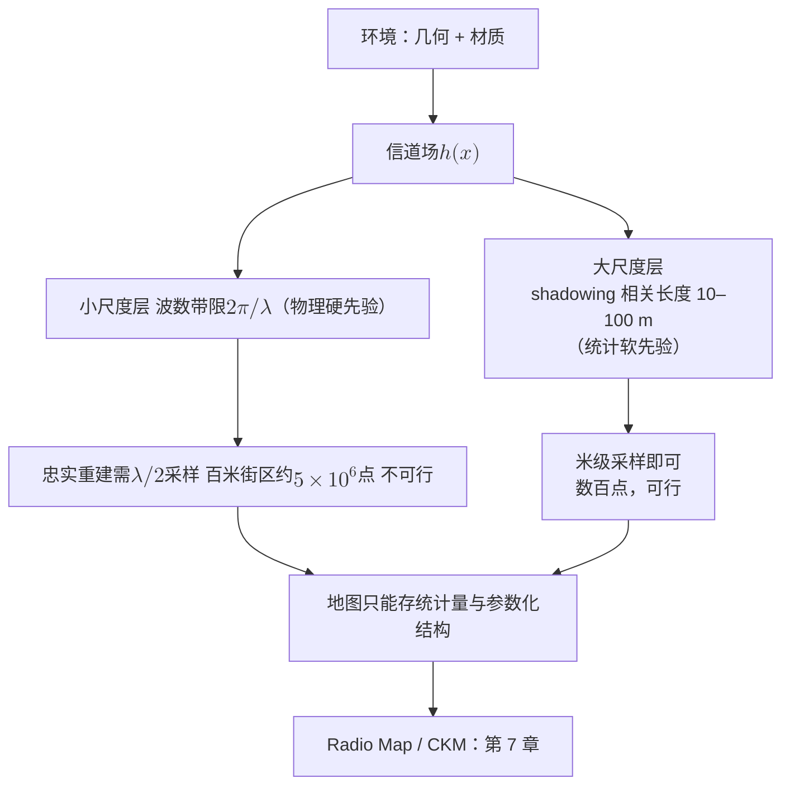

# 4 · 信道的空间结构定理：波数带限与空间自由度

每一个装配过天线阵列的工程师都听过同一条铁律：阵元间距取半波长。追问一句"为什么"，通常会得到两个版本的答案——做阵列信号处理的人说"为了避免栅瓣"，做信道建模的人说"为了让各天线经历独立衰落"。两个理由听上去毫不相干，却指向同一个数字 $\lambda/2$，这不是巧合。本章要展示它们共同的根：**信道场不是任意函数，而是亥姆霍兹方程的解，其空间波数 (wavenumber) 谱被物理定律硬性限制在半径 $2\pi/\lambda$ 的球面上**。从这一条事实出发，$\lambda/2$ 采样定理、相干距离 (coherence distance)、空间自由度 (spatial degrees of freedom, DoF) 的整套定理可以像多米诺骨牌一样逐一推倒。

[第 3 章](03-statistical-lineage.md) 讲统计建模如何"承认无知"；本章要划出无知的边界——无论环境多复杂、散射多混乱，信道场的空间结构都逃不出一个带限先验。这是全部里已有定理最密集的一章，也是第 8、9 章两个基本问题的数学起点。

!!! note "本章预备知识"
    需要：傅里叶变换、采样定理与平面波的波矢；本章是第一部定理最密集的一章，推导都在章内完成。用到的内容：

    - 带宽 $B$ 的信号每秒 $2B$ 个独立实样本（2WT 计数的来历）：[预备篇 4.6](../part0/04-information-theory-basics.md#46-awgn-容量cblog_21mathrmsnr-的来历)。
    - 均匀线阵、半波长间距与栅瓣：[预备篇 1.6](../part0/01-em-waves-antennas.md#16-天线阵列入门阵因子波束宽度与波束赋形)。
    - Jakes 谱与 $J_0$ 相关函数：[预备篇 2.5](../part0/02-wireless-channel-basics.md#25-多普勒信道为什么会随时间变)。本章把它从时间搬到空间。
    - 矩阵的奇异值分解与并行子信道：[预备篇 5.4](../part0/05-mimo.md#54-mimo-信道矩阵与-svd把矩阵信道拆成并行子信道)。本章的算子奇异值分解是它的连续版。
    - 亥姆霍兹方程与 Bucci–Franceschetti 空间带宽的伏笔：[第 2 章](02-maxwell-foundations.md)；Clarke 谱定理：[第 3 章](03-statistical-lineage.md)。

## 从 2WT 到 2L/λ：时间的定理在空间重演

通信人最熟悉的自由度定理来自时间维：带宽 $W$、时长 $T$ 的波形约有 $2WT$ 个实自由度。Slepian、Landau 与 Pollak 在 1961–62 年用长椭球波函数 (prolate spheroidal wave functions) 给出了它的严格版本，Landau 1967 年进一步证明：带限函数要稳定重建，采样密度不能低于 Nyquist 密度——这是一个硬下界，不是工程近似。这条线索后来被 Franceschetti 整理成一整套"信息的波动理论"[1]。

本章的全部内容可以压缩成一句话：**空间维度上存在与 $2WT$ 完全平行的定理，而空间的"带宽"不需要滤波器来定义——它由波动方程免费给出，等于 $\kappa = 2\pi/\lambda$**。两者的对照如下：

| | 时间信号 | 空间信道场 |
|---|---|---|
| 带宽来源 | 工程约束（滤波器、频谱管制） | 物理定律（亥姆霍兹方程） |
| 带宽数值 | $2\pi W$（可协商） | $\kappa = 2\pi/\lambda$（不可协商） |
| Nyquist 间隔 | $1/(2W)$ | $\lambda/2$ |
| 自由度 | $2WT$ | $2L/\lambda$（线孔径）、$\pi A/\lambda^2$（面孔径） |
| 数学工具 | 长椭球波函数、Landau 定理 | 同一套，换到波数域 |

差别只有一处，但正是这一处支撑了全书的论题：时间带限是我们对信号做的事，空间带限是物理对信道做的事。"信道场有物理先验"这句话，在本章获得它最锋利的形式。

## 亥姆霍兹方程：物理白送的低通滤波器

[第 2 章](02-maxwell-foundations.md) 已从 Maxwell 方程组导出：无源均匀介质中，单频（沿用全书时谐约定 $e^{+\mathrm{j}\omega t}$；本章结论只涉及波数支撑，与约定符号无关）标量场分量 $h(\mathbf{x})$ 满足亥姆霍兹方程

$$
\left(\nabla^2 + \kappa^2\right) h(\mathbf{x}) = 0, \qquad \kappa = \frac{2\pi}{\lambda}.
$$

记号提醒：第 2 章的标量波数 $k$ 本章写作 $\kappa$，字母 $\mathbf{k}$ 留给波数向量（指向平面波的传播方向，单位 rad/m）。这个方程在波数域的含义一望即知。把场写成三维傅里叶积分

$$
h(\mathbf{x}) = \frac{1}{(2\pi)^3} \int_{\mathbb{R}^3} H(\mathbf{k})\, e^{\mathrm{j}\mathbf{k}\cdot\mathbf{x}}\, \mathrm{d}^3 k,
$$

利用 $\nabla^2 e^{\mathrm{j}\mathbf{k}\cdot\mathbf{x}} = -\lVert\mathbf{k}\rVert^2 e^{\mathrm{j}\mathbf{k}\cdot\mathbf{x}}$ 逐项作用，方程变为

$$
\frac{1}{(2\pi)^3} \int_{\mathbb{R}^3} \left(\kappa^2 - \lVert\mathbf{k}\rVert^2\right) H(\mathbf{k})\, e^{\mathrm{j}\mathbf{k}\cdot\mathbf{x}}\, \mathrm{d}^3 k = 0, \quad \forall\, \mathbf{x}.
$$

由傅里叶表示的唯一性，被积函数必须恒为零：

$$
\left(\kappa^2 - \lVert\mathbf{k}\rVert^2\right) H(\mathbf{k}) = 0.
$$

于是 $H(\mathbf{k})$ 只能在 $\lVert\mathbf{k}\rVert = \kappa$ 处非零——它不是普通函数，而是集中在球面上的分布。球内不行，球外也不行：一个平方公里的城市、上万个散射体、任意复杂的多径，其合成场的波数谱仍然被压在这张半径 $\kappa$ 的球壳上。这就是"物理白送的低通滤波器"。

!!! abstract "定理 4.1（波数球面支撑）【已解决】"

    无源均匀介质中满足亥姆霍兹方程的空间平稳、单位方差随机场 $h(\mathbf{x})$，其功率谱密度为

    $$
    S_h(k_x, k_y, k_z) = \frac{4\pi^2}{\kappa}\, \delta\!\left(k_x^2 + k_y^2 + k_z^2 - \kappa^2\right),
    $$

    即波数支撑是半径 $\kappa = 2\pi/\lambda$ 的球面。将场分解为上行/下行波 $h = h_+ + h_-$ 后，限制在平面 $z = \mathrm{const}$ 上的二维谱为

    $$
    S_h(k_x, k_y) = \frac{\pi}{\kappa}\cdot\frac{1}{\gamma(k_x,k_y)}, \qquad \gamma = \sqrt{\kappa^2 - k_x^2 - k_y^2},
    $$

    支撑于圆盘 $k_x^2 + k_y^2 \le \kappa^2$，倏逝波（$\gamma$ 为虚数）被排除。出处：Pizzo–Marzetta–Sanguinetti，IEEE JSAC 2020 [2]。

**两个谱公式的来历。** 本章的谱约定是方差 $=\frac{1}{(2\pi)^d}\int S\,\mathrm{d}^d k$，计算要用 $\delta$ 函数的复合规则 $\delta(g(u))=\sum_{g(u_0)=0}\delta(u-u_0)/\lvert g'(u_0)\rvert$。（i）三维：$\int\delta(\lVert\mathbf{k}\rVert^2-\kappa^2)\,\mathrm{d}^3k=4\pi\kappa^2\cdot\frac{1}{2\kappa}=2\pi\kappa$，乘前因子 $4\pi^2/\kappa$ 得 $(2\pi)^3$，方差恰为 1。（ii）平面：对 $k_z$ 积分再除以 $2\pi$，其中 $\delta(k_z^2-\gamma^2)=[\delta(k_z-\gamma)+\delta(k_z+\gamma)]/(2\gamma)$。两个根 $k_z=\pm\gamma$ 就是上行、下行两支，每支得 $\frac{1}{2\pi}\cdot\frac{4\pi^2}{\kappa}\cdot\frac{1}{2\gamma}=\frac{\pi}{\kappa\gamma}$。所以定理中的 $\pi/(\kappa\gamma)$ 是**每一支**的谱，在圆盘上积分给出方差 $1/2$；两支叠在同一个圆盘上，合起来 $2\pi/(\kappa\gamma)$，还原单位方差。下文所说的雅可比 $1/\gamma$，就来自这里的 $\lvert\mathrm{d}(k_z^2)/\mathrm{d}k_z\rvert=2\gamma$。

**物理意义。** 球面上每一点是一个传播方向的平面波：信道场是"方向连续统"上平面波的叠加，除此之外什么都不是。二维谱里的 $1/\gamma$ 因子是球面往圆盘投影的雅可比——把球面上均匀分布的功率压到圆盘上，掠射方向（$\gamma \to 0$，波几乎平行于观测平面传播）的谱密度被挤得发散（但可积）。圆盘边缘的"亮环"不是奇异性的病态，而是几何投影的必然。

**行为分析。** 支撑集是二维球面而非三维球体——这个"薄壳"结构马上会解释为什么体积孔径不比面孔径多自由度。圆盘外的分量呢？当 $k_x^2 + k_y^2 > \kappa^2$ 时 $\gamma = \mathrm{j}\lvert\gamma\rvert$ 变成纯虚数，对应的波沿 $z$ 按 $e^{-\lvert\gamma\rvert z}$ 指数衰减，即倏逝波 (evanescent wave)。衰减有多快？取横向波数 $2\kappa$（即想携带比传播极限细一倍的空间细节），则 $\lvert\gamma\rvert = \sqrt{3}\,\kappa$，走过一个波长衰减 $e^{-2\sqrt{3}\pi} \approx 1.9\times 10^{-5}$，约 $-94\ \mathrm{dB}$。所以"带限"的适用域是离散射体几个波长之外——那里倏逝波已死透，场是严格意义上的空间带限函数。

!!! warning "陷阱：带限先验的适用域"

    定理 4.1 的前提是"无源区域 + 离散射体几个 $\lambda$ 以上"。贴着天线或散射体表面几个波长以内（reactive 近场），倏逝波未衰尽，场**不带限**——原则上携带超分辨信息，但被噪声与损耗以指数速率惩罚。这一区域的信息量至今没有干净定理（见本章开放问题 2）。

## 三位一体：λ/2 采样、相干距离与自由度密度

球面支撑确立后，剩下的定理都是投影与计数。

**采样观点。** 沿一条直线（取 $x$ 轴）观测场，一维波数谱是三维谱对 $k_y, k_z$ 的积分，支撑为球面在该轴上的投影区间 $[-\kappa, \kappa]$。支撑总宽 $2\kappa$，按 Nyquist 定理采样间隔为

$$
\Delta = \frac{2\pi}{2\kappa} = \frac{\pi}{\kappa} = \frac{\lambda}{2}.
$$

这就是 $\lambda/2$ 采样定理的全部来历——天线阵列的半波长法则，本质是空间维的 Nyquist 准则。

!!! tip "直觉：阿基米德帽盒定理"

    球面上的均匀测度投影到任意直径上是**均匀**分布（阿基米德约两千年前的结果）。理由：垂直于该直径、相距 $\mathrm{d}k$ 的两张平行平面从半径 $\kappa$ 的球面上切下的环带，面积恒为 $2\pi\kappa\,\mathrm{d}k$，与切在哪个高度无关——靠近两极的环带半径小，但坡度大，环带沿球面的宽度被拉长，两者恰好抵消。因此各向同性散射下线上观测的一维波数谱是 $[-\kappa,\kappa]$ 上的平坦谱——空间维的"白谱"，其逆变换正是下面的 sinc 相关。

**统计观点。** 由 Wiener–Khinchin 定理，空间自相关是谱的逆傅里叶变换。对球面上均匀的谱（三维各向同性散射），取 $\mathbf{r}$ 方向为极轴：

$$
\begin{aligned}
c_h(r) &= \frac{1}{4\pi} \int_{\mathbb{S}^2} e^{\mathrm{j}\kappa \hat{\mathbf{k}}\cdot\mathbf{r}}\, \mathrm{d}\Omega(\hat{\mathbf{k}})
= \frac{1}{4\pi} \int_0^{2\pi}\!\!\int_0^{\pi} e^{\mathrm{j}\kappa r\cos\theta} \sin\theta\, \mathrm{d}\theta\, \mathrm{d}\varphi \\
&= \frac{1}{2} \int_{-1}^{1} e^{\mathrm{j}\kappa r u}\, \mathrm{d}u
= \frac{\sin(\kappa r)}{\kappa r}.
\end{aligned}
$$

第一行的第一个表达式，是把定理 4.1 的谱代入 Wiener–Khinchin 公式、用 $\delta$ 消去径向积分的结果，前因子 $1/(4\pi)$ 保证 $c_h(0)=1$；同一行的下一个等号只是在以 $\mathbf{r}$ 为极轴的球坐标里写出 $\mathrm{d}\Omega=\sin\theta\,\mathrm{d}\theta\,\mathrm{d}\varphi$ 与 $\hat{\mathbf{k}}\cdot\mathbf{r}=r\cos\theta$。第二行开头的等号先对 $\varphi$ 积分得 $2\pi$，再换元 $u=\cos\theta$（$\mathrm{d}u=-\sin\theta\,\mathrm{d}\theta$，负号正好把上下限 $1\to-1$ 翻回来）；最后一步是 $\frac12\cdot\frac{e^{\mathrm{j}\kappa r}-e^{-\mathrm{j}\kappa r}}{\mathrm{j}\kappa r}=\frac{\sin\kappa r}{\kappa r}$。

!!! abstract "定理 4.2（各向同性散射的空间相干函数）【已解决】"

    三维各向同性散射下，信道场的空间自相关为

    $$
    c_h(r) = \mathrm{sinc}\!\left(\frac{2r}{\lambda}\right) = \frac{\sin(2\pi r/\lambda)}{2\pi r/\lambda},
    $$

    零点位于 $r = m\lambda/2$——间隔 $\lambda/2$ 的样本严格不相关。二维各向同性（入射集中于水平面，即 Clarke 模型）时退化为

    $$
    \rho(d) = J_0\!\left(\frac{2\pi d}{\lambda}\right),
    $$

    首个零点在 $d \approx 0.38\lambda$。出处：Clarke 1968 [3]；sinc 形式见 Pizzo 等 [2]。

**物理意义。** Clarke 在 1968 年写下 $J_0$ 相关时，实际上已经"用相关函数说出了空间带限"——只是当时无人把它与采样定理相连。$J_0$ 是定理 4.1 的二维退化：谱从球面塌缩到赤道圆上。

{ .chart loading=lazy }
{ .chart loading=lazy }

*怎么读这张图：横轴是两点间距 $d$（以波长 $\lambda$ 为单位），纵轴是信道场在这两点的相关系数。第一条是三维各向同性散射的 $\mathrm{sinc}(2d/\lambda)$，零点恰好落在 $d=\lambda/2,\ \lambda,\ 3\lambda/2,\ 2\lambda$，也就是 $\lambda/2$ 采样格点；第二条是二维 Clarke 场景的 $J_0(2\pi d/\lambda)$，首个零点提前到约 $0.38\lambda$（图上在 $0.35\lambda$ 与 $0.40\lambda$ 两个采样点之间过零），到 $d=\lambda/2$ 时是 $J_0(\pi)\approx-0.30$，平方后的功率相关约 0.09；第三条是零线，方便读零点。两条曲线出自同一张球面谱，只是投影到直线上的谱形不同（原因见下一段），所以变的是相关零点，采样间隔两种场景都是 $\lambda/2$。按定理 4.2 的两个公式逐点计算，步长 $0.05\lambda$。*

**为什么二维给 $J_0$、三维给 sinc——一句话就能说清，而这句话几乎从不被写出来**：区别只在**投影出来的谱形状不同**。三维球面上的均匀测度投影到任意直径上是**均匀分布**（上面的帽盒定理），均匀谱的逆变换是 sinc；而二维赤道圆上的均匀角度投影到直径上是 **arcsine 分布** $p(u)=\dfrac{1}{\pi\sqrt{1-u^2}}$（两端发散、中间平坦），它的逆变换正是 $J_0$。**同一个球面，投影方式差一个维度，零点就从 $\lambda/2$ 挪到 $0.38\lambda$。** 记住这一句，两个数字就再也不会混。

```mermaid
flowchart TD
    S["源头：波数谱支撑在半径 $$\kappa=2\pi/\lambda$$ 的球面上<br/>（亥姆霍兹方程强制，定理 4.1）"]
    S -->|"三维各向同性<br/>沿直线观测：投影到直径"| P1["均匀谱 $$[-\kappa, \kappa]$$<br/>（阿基米德帽盒定理）"]
    S -->|"二维各向同性（Clarke，入射集中于水平面）<br/>沿直线观测：赤道圆投影到直径"| P2["arcsine 谱<br/>$$p(u)=1/(\pi\sqrt{1-u^2})$$"]
    S -->|"投影到观测平面<br/>雅可比 $$1/\gamma$$（掠射亮环，可积）"| P3["圆盘谱<br/>$$k_x^2+k_y^2 \le \kappa^2$$"]
    P1 --> C1["相关 $$\mathrm{sinc}(2r/\lambda)$$<br/>零点 $$m\lambda/2 \Longrightarrow$$ Nyquist 间隔 $$\lambda/2$$<br/>$$\eta_1 = 2L/\lambda$$"]
    P2 --> C2["相关 $$J_0(2\pi d/\lambda)$$<br/>首零点 $$0.38\lambda$$"]
    P3 --> C3["$$\eta_2 = \pi A/\lambda^2$$；上下行两支<br/>$$\Longrightarrow \eta_3 = 2\pi A/\lambda^2$$，与厚度无关"]
    C1 -.->|"$$0.38\lambda$$ 与 $$\lambda/2$$ 不是谁对谁错，<br/>是两种投影的差别"| C2
```

所谓"相干距离"，不过是带限谱的相关函数表述：谱、采样、相关是同一事实的三种语言。[第 1 章](01-lie-of-randomness.md)与[第 3 章](03-statistical-lineage.md)从 Clarke 模型读出的 $0.38\lambda$ 与本章的 $\lambda/2$ 由此对上号，但要分清两件事。**采样间隔**在两种场景下都是 $\lambda/2$：赤道圆和球面投影到直线上都占满 $[-\kappa,\kappa]$，Nyquist 只看支撑宽度，不看谱形。**相关零点**才随谱形变：三维时零点恰好落在 $\lambda/2$ 格点上（下图的"相关零点恰为采样格点"只对三维成立）；二维 Clarke 场景下，相距 $\lambda/2$ 的两点相关系数为 $J_0(\pi)\approx-0.30$，功率相关约 $0.09$——"半波长近似独立"的"近似"就在这里。$0.38\lambda$ 只是首个零点，并不要求更密的采样。引用"相干距离"数值时必须先讲清定义（首零点还是相关阈值）与场景维度（2D 还是 3D），两套数字不可混用。

```mermaid
flowchart TD
    SPEC["谱观点：波数支撑为半径 $$2\pi/\lambda$$ 的球面<br/>（亥姆霍兹方程强制）"]
    SAMP["采样观点：Nyquist 间隔 $$\lambda/2$$，<br/>孔径 $$L$$ 含 $$2L/\lambda$$ 个样本"]
    STAT["统计观点：空间相关 $$\mathrm{sinc}(2r/\lambda)$$（3D）<br/>或 $$J_0(2\pi d/\lambda)$$（2D）"]
    SPEC -- "支撑投影 + Nyquist 定理" --> SAMP
    SPEC -- "Wiener–Khinchin 逆变换" --> STAT
    STAT -- "相关零点恰为采样格点" --> SAMP
    SAMP -- "稳定重建的密度下界（Landau）" --> SPEC
```

**计数观点。** 自由度 = 支撑测度 × 观测域大小 ÷ $(2\pi)^d$。逐维计算：线孔径 $L$，支撑宽 $2\kappa$，得 $L \cdot 2\kappa / 2\pi = 2L/\lambda$；面孔径 $A$，支撑为圆盘面积 $\pi\kappa^2$，得 $A\, \pi\kappa^2 / (2\pi)^2 = \pi A / \lambda^2$。

这个配方只适用于支撑在 $d$ 维波数空间里**测度为正**的情形（线上是长 $2\kappa$ 的区间，面上是面积 $\pi\kappa^2$ 的圆盘；定理 4.6 的 Nyquist 数公式有同样的前提）。到 $d=3$ 它失灵：球面在三维波数空间里体积为零，照搬只会得到 $0$。球面是圆盘上的两张"曲面图"$k_z=\pm\gamma(k_x,k_y)$，正号是上行波 $h_+$，负号是下行波 $h_-$；横向波数 $(k_x,k_y)$ 一旦给定，$k_z$ 只剩这两个取值，不是独立的第三个维度。所以体内的场由两个圆盘上的二维谱完全确定，按面孔径的算法各贡献 $\pi A/\lambda^2$，合计 $\eta_3=2\pi A/\lambda^2$。单个平面只能得到 $\pi A/\lambda^2$，是因为两支投影到同一个圆盘上，叠在一起分不开；厚度的作用只是让 $k_z$ 符号相反的两支可以区分，区分之后再加厚也不会出现新的 $k_z$ 取值，所以 $\eta_3$ 与厚度无关。

!!! abstract "定理 4.3（各向同性散射下的空间自由度密度）【已解决】"

    长 $L$ 的线孔径、面积 $A$ 的面孔径、底面积 $A$ 的体孔径，空间自由度分别为

    $$
    \eta_1 = \frac{2L}{\lambda}, \qquad
    \eta_2 = \frac{\pi A}{\lambda^2}, \qquad
    \eta_3 = \frac{2\pi A}{\lambda^2},
    $$

    且 $\eta_3$ 与厚度 $L_z$ 无关。出处：Pizzo–Marzetta–Sanguinetti，SPAWC 2020 [4]。

**物理意义。** $\eta_2 = \pi A/\lambda^2$ 而非 $4A/\lambda^2$：波数支撑是圆盘不是方块，$\lambda/2$ 矩形栅格采样带有 $4/\pi \approx 1.27$ 倍冗余。**采样密度与自由度密度是两回事**——前者是重建所需的样本数（由外接方块决定），后者是场的本征维数（由圆盘面积决定），差一个 $\pi/4$。而 $\eta_3$ 与厚度无关是"薄壳谱"的直接推论（计数见上）：球面只有上、下两个半球的行波方向，体孔径只比面孔径多一倍，继续加厚不再添任何东西——**体积不增加自由度**，这一反直觉结论已核对原文 [4]。

!!! example "算例：3.5 GHz 的一平方米"

    $f = 3.5\ \mathrm{GHz}$，$\lambda \approx 8.57\ \mathrm{cm}$。$1\ \mathrm{m}^2$ 平面孔径：自由度 $\eta_2 = \pi/\lambda^2 \approx 428$；而 $\lambda/2$ 栅格需要 $(2/\lambda)^2 \approx 545$ 个阵元。545 副天线，只有 428 个独立维度——多出的 117 个阵元测到的是圆盘外的"空谱"。若再把阵列做成 1 m 厚的立方体：$\eta_3 = 2\pi/\lambda^2 \approx 856$，只翻一倍，与厚度无关。**孔径固定时，把天线加密到 $\lambda/2$ 以下不增加任何自由度**——天线数不等于自由度，这是物理先验的力量，也是本章的核心结论。

## 散射几何的自由度：从 Bucci–Franceschetti 到 Miller

定理 4.1–4.3 是"平稳随机场"语言下的现代表述，但同样的结论早在天线测量与光学界被证明过一遍——而且是从确定性散射体出发的，这对本书"信道是环境的泛函"的叙事更贴身。

1987–89 年，Bucci 与 Franceschetti 在两篇 TAP 论文中证明：**散射场的空间带宽由散射体的几何尺寸决定，与它的材质无关** [5][6]。数学根源是柱谐/球谐展开的截断性质：把半径 $a$ 的散射体产生的场展成柱面谐波 $H_n(\kappa\rho)e^{\mathrm{j}n\varphi}$（$H_n$ 是汉克尔函数，代表向外传播的柱面波），其系数由 $J_n(\kappa a)$ 控制，而贝塞尔函数 $J_n(x)$ 在阶数 $n$ 超过宗量 $x$ 后陡然塌落（超指数衰减）——阶数超过 $\kappa a$ 的谐波实际上不存在。以 $x=10$ 为例：$J_{10}(10)\approx0.21$，$J_{15}(10)\approx4.5\times10^{-3}$，$J_{20}(10)\approx1.2\times10^{-5}$，阶数每加 5，幅度掉的数量级越来越多。

!!! abstract "定理 4.4（散射场的有效空间带宽，Bucci–Franceschetti）【已解决】"

    半径 $a$ 的球（圆）内的任意源或散射体，其辐射场沿外部观测曲线是准带限的：有效空间带宽

    $$
    W \approx \chi\, \kappa a, \qquad \chi \to 1^+ \ (\kappa a \to \infty),
    $$

    带外谐波超指数衰减。由此自由度即 Nyquist 数：二维闭合观测曲线上 $N \approx 2\kappa a$；三维球面观测时球谐截断 $l \lesssim \kappa a$ 给出标量模式数 $\approx (\kappa a)^2$、双极化 $\approx 2(\kappa a)^2$。带限性与散射体介电常数无关，只依赖 $\kappa a$。出处：[5][6]；教学化推导与数值验证见 Khankhoje–Shah [7]。

**物理意义。** 这是范式级的论断：自由度是电磁场的**几何属性**。环境里换什么材料、怎么摆散射体，都只在带宽 $\kappa a$ 之内重新分配能量，变不出新维度。两个模式数的差别来自谐波计数：二维谐波 $e^{\mathrm{j}n\varphi}$ 取 $\lvert n\rvert\le\kappa a$，约 $2\kappa a$ 个；三维球谐函数每个阶数 $l$ 有 $2l+1$ 个，截断到 $l\le\kappa a$ 共 $\sum_{l=0}^{\kappa a}(2l+1)=(\kappa a+1)^2\approx(\kappa a)^2$ 个。**行为分析**：$a = 2\lambda$ 的圆柱散射体，$2\kappa a = 8\pi \approx 25.1$，按上面的计数，有效谐波约 25 个（$\lvert n\rvert\le12$）。Khankhoje–Shah 对同样尺寸的散射体做了二维有限元数值实验，报告第 26 阶以后的谐波系数可以忽略 [7]；但他们记作 $\eta=\lceil 2\kappa a\rceil=26$ 的是单边截断阶数，来自对贝塞尔函数取的保守阈值（$\lvert n\rvert\ge\lceil 2\lvert x\rvert\rceil$ 时 $J_n(x)\approx0$），比这里 $\lvert n\rvert\le\kappa a$ 的口径宽一倍。同一个 $2\kappa a$ 在这里是谐波个数，在他们那里是单边阶数，不能拿来互相印证。前因子层面各文献的口径确实不一：Bucci–Franceschetti 用带宽略大于有效带宽 $W$ 的函数表示散射场，对大散射体只需略大、误差就降到可忽略，定理 4.4 里的 $\chi$ 就是这点余量 [5]；自由度按有效带宽与观测域范围对应的 Nyquist 数计，观测域只是一段曲线时随其范围而变 [6]；Khankhoje–Shah 的口径如上所述宽出一倍，照他们的结论，等间隔测量要取约 $4\kappa a$ 个点 [7]。可靠的是渐近标度 $N \sim \kappa a$（曲线）与 $(\kappa a)^2$（曲面）。

2000 年，Miller 在光学一侧把问题彻底算子化 [8]：任意两个体积之间的波通信由格林算子 $G$ 描述，它把发射体积里的源映射成接收体积里的场，是连续版的 MIMO 信道矩阵。对 $G$ 做奇异值分解，奇异函数就是最优的正交"通信模式"，奇异值是耦合强度；两组奇异函数分别是 $G^{\dagger}G$ 与 $GG^{\dagger}$ 这两个厄米特征值问题的解（物理上等价于双相位共轭谐振腔的模式）。耦合强度的平方和满足求和规则：它等于 $\lvert G\rvert^2$ 在两个体积上的双重积分，是有限数，所以强耦合模式只有有限多个。傍轴极限下，面积 $A_t, A_r$、相距 $d$ 的两平行孔径的强耦合模式数是菲涅耳数 (Fresnel number)

$$
N \approx \frac{A_t A_r}{(\lambda d)^2},
$$

回收了 Toraldo di Francia 与 Gabor 在 1950 年代的光学自由度结果【定理层面已解决，见 [8]】。它有一个衍射极限的直观读法：边长 $\sqrt{A_t}$ 的发射孔径在距离 $d$ 处能聚出的最小光斑边长约 $\lambda d/\sqrt{A_t}$，面积约 $(\lambda d)^2/A_t$；接收孔径上能摆下的互不重叠的光斑数，就是 $A_r\big/\big[(\lambda d)^2/A_t\big]$。**行为分析**：$d$ 增大时 $N$ 单调下降，降到 1 以下即远场——只剩一条 LoS 模式；$d$ 缩小则模式数持续增长，上限是孔径自身的 $\pi A/\lambda^2$。这个公式是下文"两个修正方向"一节中近场增益的种子。

## 波数–孔径–角谱乘积定理与 Landau 相变

各向同性散射给出的 $\pi A/\lambda^2$ 是**上界**：真实环境的散射体只占据有限立体角，波数支撑随之收缩。2005 年 Poon–Brodersen–Tse 把这一修正写成信息论定理 [9]，宣告"i.i.d. 统计 MIMO 模型不足以回答自由度问题"——天线理论自此正式并入信息论。

推导要点只需三步（以线阵为例）：物理长度 $\ell$ 的孔径在方向余弦 (direction cosine) 域的分辨率为 $\lambda/\ell$（瑞利分辨极限）——方向余弦 $\psi$ 是传播方向与阵列轴夹角的余弦，这种平面波在阵列位置 $x$ 处的相位是 $2\pi\psi x/\lambda$，所以 $x/\lambda$ 与 $\psi$ 是一对傅里叶变量，长 $\ell/\lambda$ 个波长的"时窗"在"频域"的分辨率就是其倒数 $\lambda/\ell$；散射环境的入射角谱在方向余弦域占据测度 $\lvert\Omega_\psi\rvert \subseteq [-1,1]$ 的支撑；可分辨且被占据的"方向格子"数即自由度

$$
\mathrm{DoF} \approx \frac{\lvert\Omega_\psi\rvert}{\lambda/\ell} = \frac{\ell}{\lambda}\,\lvert\Omega_\psi\rvert.
$$

!!! abstract "定理 4.5（波数–孔径–角谱乘积，Poon–Brodersen–Tse）【已解决】"

    设收/发阵列的有效孔径（投影面积按 $\lambda^2$ 归一）为 $\mathcal{A}_t, \mathcal{A}_r$，散射簇在两端张成的立体角测度为 $\lvert\Omega_t\rvert, \lvert\Omega_r\rvert$，则单极化空间自由度为

    $$
    \mathrm{DoF} = \min\left\{ \mathcal{A}_t \lvert\Omega_t\rvert,\; \mathcal{A}_r \lvert\Omega_r\rvert \right\},
    $$

    使用三正交极化时为 $2\,\mathcal{A}\lvert\Omega\rvert$（$\times 2$ 而非 $\times 3$）。线阵（长 $\ell$，角谱由 $M$ 个方向余弦子区间构成）的信号空间维度为

    $$
    \frac{\ell}{\lambda}\lvert\Omega_\psi\rvert + O\!\left(M \ln\!\left(\frac{\ell}{\lambda}\lvert\Omega_\psi\rvert\right)\right).
    $$

    加上双极化与时–频维（带宽 $W$、时长 $T$），总自由度为 $4WT\mathcal{A}\lvert\Omega\rvert$。出处：[9]，公式已逐条核对原文。

**物理意义。** 自由度是"孔径能分辨多少方向"与"环境实际占据多少方向"的乘积——环境的角谱稀疏性直接折算成维数折扣。极化为什么是 $\times 2$：沿方向 $\hat{\mathbf{k}}$ 传播的远场电场必须横向，极化投影矩阵 $\mathbf{I} - \hat{\mathbf{k}}\hat{\mathbf{k}}^{\mathsf{T}}$ 的秩为 2——第三副正交偶极子测到的是前两副的线性组合。

**行为分析。** 三个一致性检验与一个陷阱。其一，全散射（$\lvert\Omega\rvert = 4\pi$）的半径 $a$ 球阵：$\mathcal{A} = \pi a^2/\lambda^2$，$\mathcal{A}\lvert\Omega\rvert = 4\pi^2 a^2/\lambda^2 = (\kappa a)^2$，与定理 4.4 严丝合缝。其二，各向同性平面孔径回收 $\eta_2$ 的标度。其三，$\min$ 结构说明瓶颈端决定一切——加大基站孔径救不了角谱贫瘠的终端侧。陷阱：$\lvert\Omega_\psi\rvert$ 是**方向余弦测度不是角度测度**。同样 $30^\circ$ 的角展布，边射方向（正对阵列）的方向余弦测度为 $2\sin 15^\circ \approx 0.52$，端射方向（沿阵列轴）只有 $1 - \cos 30^\circ \approx 0.13$——$10\lambda$ 孔径分别给出约 5 个与 1 个自由度，同样的"角展布"差四倍。把 $\Omega$ 写成角度域是引用此定理最常见的错误。

上面所有"自由度 = 某个数"的表述还欠一个严格性说明：有限孔径上的带限算子没有硬截断。这就是 Landau 特征值定理的角色。定理里的复合算子是三步操作：把函数截断到观测域，滤掉支撑外的波数，再截断回观测域。它的本征函数局限在观测域内，第 $n$ 个特征值 $\mu_n$ 就是第 $n$ 个本征函数落在波数支撑内的能量比例；一维时间版本的本征函数正是开头提到的长椭球波函数。Kolmogorov n-width 是"用最好的 $n$ 维子空间逼近这类函数时的最坏误差"，由这串特征值决定。割集 (cut-set) 指隔开收发两端、信息必经的一张曲面。

!!! abstract "定理 4.6（Landau 特征值相变）【已解决（渐近阶）】"

    空间限制在观测域、波数限制在支撑集的复合算子，其特征值 $\mu_1 \ge \mu_2 \ge \cdots$ 在 Nyquist 数

    $$
    N_0 = \frac{\lvert\mathrm{观测域}\rvert \cdot \lvert\mathrm{波数支撑}\rvert}{(2\pi)^d}
    $$

    处发生相变：前 $N_0$ 个特征值接近 1，随后陡降，过渡区宽度仅 $O(\ln N_0)$。自由度因此应理解为有效维数（Kolmogorov n-width）而非硬整数。Franceschetti 以此统一时间与空间自由度，并证明穿过空间割集的电磁信息量的阶由割集面积 $/\lambda^2$ 决定 [10]（专著见 [1]）；Pizzo–Lozano 用同一定理重新导出 LoS MIMO 的自由度公式 [11]。Landau 1967 与 Landau–Widom 1980 的原始出处本站未直接核对，此处仅叙述不列参。

{ .chart loading=lazy }
{ .chart loading=lazy }

*怎么读这张图：横轴是特征值序号 $n$，纵轴是第 $n$ 个特征值 $\mu_n$，即第 $n$ 个本征函数落在波数支撑内的能量比例。第一条是长 $L=10\lambda$ 的线孔径（$N_0=2L/\lambda=20$），第二条是 $L=5\lambda$（$N_0=10$），两个 $L$ 都是为对照而设的假设值；第三条是 0.5 的水平线。两条都先贴着 1 走平台，再在各自的 $N_0$ 处陡降：大于 0.5 的特征值恰好 20 个与 10 个；夹在 0.01 与 0.99 之间的过渡区只有 6 个与 5 个，孔径翻倍，平台跟着加倍，过渡带几乎不变宽；过了过渡带特征值迅速变小，$N_0$ 之后第 5 个已是 $10^{-4}$ 量级。按定理 4.6 的复合算子（截断到孔径、滤到 $[-\kappa,\kappa]$、再截断）离散化后数值求特征值。*

!!! success "关键结论"

    自由度不是"第 $N$ 个模式忽然消失"，而是"第 $N_0$ 个模式之后奇异值以对数窄的过渡带塌落"。工程含义：略过 $N_0$ 之外的模式付出的容量代价指数小；反过来想靠"挖掘过渡带"逆天改命，收益至多对数级。$d=1$ 时 $N_0 = L\cdot 2\kappa/2\pi = 2L/\lambda$，与定理 4.3 完全一致——Landau 相变是全章计数公式的严格性背书。

## 两个修正方向：近场增益与角谱稀疏采样

以上定理默认远场平面波。两个现实修正方向在 2020 年代成为热点，也各自松动了"$\lambda/2$ + 平面波"的教科书图像。

**修正一：近场自由度增益【部分结果】。** 远场 LoS 链路只有 1 个自由度；但进入瑞利距离 (Rayleigh distance) $d_R = 2D^2/\lambda$（$D$ 为孔径尺寸）以内，球面波前的曲率使两端孔径互相"看见"对方的形状，傍轴平行孔径的自由度回到 Miller 公式

$$
N(d) \approx \frac{A_t A_r}{(\lambda d)^2},
$$

随距离缩小持续增长，上限为孔径自身的 $\pi A/\lambda^2$。XL-MIMO 与 RIS 把瑞利距离推进到实际部署尺度，近场因此成为自由度的富矿；系统综述见 Lu–Zeng 等的 XL-MIMO tutorial [13] 与近场通信综述 [14]；连续孔径阵列 (Continuous-Aperture Array, CAPA) 视角的闭式自由度分析见 [15]，最新的一站式算子理论综述见 [16]。

!!! warning "陷阱：瑞利距离不是自由度的跳变点"

    $d_R = 2D^2/\lambda$ 是相位误差判据（孔径边缘相位偏差 $\pi/8$：边缘离中心 $D/2$，球面波到边缘比平面波多走约 $(D/2)^2/(2d)=D^2/(8d)$，相位差 $\pi D^2/(4\lambda d)$，令它等于 $\pi/8$ 即得 $d=2D^2/\lambda$），不是自由度相变点：$N(d)$ 随 $d$ **连续**变化。算例：$28\ \mathrm{GHz}$（$\lambda \approx 10.7\ \mathrm{mm}$），两块 $0.5\ \mathrm{m}\times 0.5\ \mathrm{m}$ 孔径，对角线 $D=\sqrt{0.5}\approx 0.71\ \mathrm{m}$，$d_R = 2D^2/\lambda \approx 93\ \mathrm{m}$；而 $N(d) = 1$ 的真正交越点在 $d = \sqrt{A_t A_r}/\lambda \approx 23\ \mathrm{m}$——两个尺度差四倍。$d = 10\ \mathrm{m}$ 时 $N \approx 5.5$，$d = 5\ \mathrm{m}$ 时 $N \approx 22$。非傍轴/任意取向几何的显式公式与"有效自由度 (Effective DoF, EDoF)"的统一解析框架，截至 2026-08 仍是进行中的工作（近两年多篇预印本推进中，含"距离域自由度"等新刻画），此处只给标度律【部分结果】。

**修正二：非各向同性散射的欠 $\lambda/2$ 采样【已解决（框架）/部分结果（一般几何）】。** 定理 4.5 说角谱稀疏折扣自由度，对偶地它也折扣采样密度：散射角选择性使波数支撑缩为圆盘的子集，Nyquist 密度随支撑测度同步下降——**$\lambda/2$ 是各向同性上界，不是普适要求**。给定角谱支撑，可以设计比 $\lambda/2$ 稀疏的最优采样格；完整的"电磁场 Nyquist 采样"信号处理框架由 Pizzo 等在 TSP 2022 建立 [12]。反方向的警告同样成立：reactive 近场（几个 $\lambda$ 以内）倏逝波未衰尽，场不带限，$\lambda/2$ 反而不够。$\lambda/2$ 法则的完整表述必须带上适用域：**离源几个波长之外、各向同性散射封顶**。

## 从定理到地图：两尺度带限

本章的定理链最终要落到一个工程问题上：[第 7 章](07-channel-cartography.md) 的信道知识地图 (Channel Knowledge Map, CKM) 想把"位置 $\to$ 信道"存成一张图，那么这张图**能存什么、需要采多密**？答案由两个尺度的带限性共同决定。

**小尺度层：物理硬先验，但密度绝望。** 相干合成的多径场受定理 4.1–4.3 支配，忠实重建需要 $\sim\lambda/2$ 采样。算例：$100\ \mathrm{m} \times 100\ \mathrm{m}$ 的街区，$3.5\ \mathrm{GHz}$，自由度 $\pi A/\lambda^2 \approx 4.3\times 10^6$，$\lambda/2$ 栅格约 $5.4\times 10^6$ 个采样点——而且这是**单频点、单发射机位置**的数字。城市尺度的相位级信道地图在测量意义上不可行，这不是工程懒惰，是 Nyquist 密度下界（Landau 意义上的硬下界）。

**大尺度层：统计软先验，密度友好。** 对小尺度取局部平均后剩下的路径损耗与阴影 (shadowing)，其空间相关长度 $d_c$ 从室内的几米到室外的几十米（经典的 Gudmundson 模型：相距 $d$ 的两点阴影相关系数为 $e^{-d/d_c}$，$d_c$ 即相关长度），等效"带宽"约 $1/d_c$，比 $\kappa$ 小两到四个数量级（3.5 GHz 时 $\kappa\approx73$ rad/m，$d_c=10$ m、$100$ m 分别对应 $\kappa d_c\approx730$、$7300$）。二维采样点数之比是它的平方量级，所以下一句会差到一万倍。同一个街区按 5 m 栅格只需约 400 个采样点——与小尺度层相差一万倍。CKM、Radio Map 之所以可能存在，正因为它们建的是**大尺度层或统计量层**，而不是场本身。



这条含义链目前只有零散的定理部件。Xu–Zeng 在自回归相关 shadowing 模型下解析给出了信道增益地图的平均 MSE 与采样密度的关系 [17]——这是**统计模型特定**的结果，不是定理 4.1 那种物理硬定理【部分结果】；CKM 构建方法从插值到生成式模型的演进见综述 [18]。前沿的一个信号是：2026 年已有预印本开始把空间相关矩阵本身做成地图（"CKM beyond channel gain"，arXiv:2604.20684）——恰好是定理 4.2 的地图化。把两个尺度的带限性合成一条统一的"地图采样密度定理"，是本站为第 8 章（有效维度与预测半径）与[第 9 章](09-exchange-and-universality.md)（环境知识的汇率）设置的靶子，详见下方开放问题。另外值得预告：定理 4.5 的乘积 $\mathcal{A}\lvert\Omega\rvert$ 在[第 8 章](08-dimension-and-prediction.md)会被重新读作"环境对信道的压缩率"——一个环境允许的信道自由度越少，地图需要学习的参数就越少。

!!! info "跨部连线"
    本章所在的线索：[自由度与秩](../guide/05-eight-threads.md#3-自由度与秩先问能不能再问有多好)。

    - [第二部 4.6 节](../part2/04-environment-generalization.md#46-相位--结构二分泛化半径-lambda4-对-l)：本章的半波长采样与相干距离，在第二部变成 AI 模型的泛化半径：只依赖相位的模型在 $\lambda/4$ 之外失效。
    - [第二部 3.5 节](../part2/03-task-knowledge-lattice.md#35-顶与底q1-天花板与任务地板)：信道能分辨的环境自由度给出任务知识的天花板，第二部把它换算成比特。


## 开放问题

以下前五条为文献共识的开放问题，后两条为本站原创提法。

1. **非平稳场的自由度与采样理论【开放】**：XL 阵列上可视区域 (Visibility Region, VR) 随位置变化导致空间非平稳，定理 4.1 的平稳谱框架失效；统一的非平稳带限刻画被近场综述 [13][14] 列为公认开放方向。
2. **倏逝波与 reactive 近场的信息量【开放】**：倏逝波原则上携带超分辨信息但被噪声/损耗指数惩罚，其对容量的贡献截至 2026-08 没有干净定理（电磁信息论 (Electromagnetic Information Theory, EIT) 社区的标志性开放问题 [16]）。
3. **连续孔径容量的物理一致定义【开放】**：功率约束应写成辐射功率还是电流范数、互耦与超方向性的能耗代价如何入账——文献结论互相冲突，尚无共识 [15][16]。
4. **多维 Landau 相变的非渐近精细化【开放】**：一维的对数过渡区已知；一般三维几何加随机散射下特征值相变的锐利常数仍未解决 [10][11]。
5. **CKM 最低测量密度的信息论下界【开放】**：Xu–Zeng [17] 是特定统计模型下的部分结果；一般环境下"给定精度目标的必要采样密度"没有下界定理。

!!! note "本站原创提法（非文献共识，为第 8 章的 Q1 有效维度、Q2 预测半径设靶）"

    6. **"信道地图 = 两尺度带限场重建"定理猜想【开放】**：把定理 4.1–4.3（小尺度、$\lambda/2$、物理硬先验）与 shadowing 相关长度（大尺度、统计软先验）合成一个统一的地图采样密度定理。文献只有部件（[12][17]），合成命题截至 2026-08 无定理，是本站为第 8 章准备的核心猜想。

    7. **把 $\mathcal{A}\lvert\Omega\rvert$ 读作环境对信道的压缩率【开放】**：将 Poon–Tse 乘积用作地图可学习性与参数量的先验上界。此表述为本站原创视角，文献未见。

## 参考文献

1. M. Franceschetti, 《Wave Theory of Information》, Cambridge University Press, 2017. https://www.cambridge.org/core/books/wave-theory-of-information/8F3C47FFABA1A7F274026C812D117EA4
2. A. Pizzo, T. L. Marzetta, L. Sanguinetti, 《Spatially-Stationary Model for Holographic MIMO Small-Scale Fading》, IEEE Journal on Selected Areas in Communications, 38(9), 2020. https://arxiv.org/abs/1911.04853
3. R. H. Clarke, 《A Statistical Theory of Mobile-Radio Reception》, Bell System Technical Journal, 47(6):957–1000, 1968. https://onlinelibrary.wiley.com/doi/abs/10.1002/j.1538-7305.1968.tb00069.x
4. A. Pizzo, T. L. Marzetta, L. Sanguinetti, 《Degrees of Freedom of Holographic MIMO Channels》, IEEE SPAWC, 2020. https://arxiv.org/abs/1911.07516
5. O. M. Bucci, G. Franceschetti, 《On the Spatial Bandwidth of Scattered Fields》, IEEE Transactions on Antennas and Propagation, 35(12):1445–1455, 1987. https://ui.adsabs.harvard.edu/abs/1987ITAP...35.1445B/abstract
6. O. M. Bucci, G. Franceschetti, 《On the Degrees of Freedom of Scattered Fields》, IEEE Transactions on Antennas and Propagation, 37(7):918–926, 1989. https://scispace.com/papers/on-the-degrees-of-freedom-of-scattered-fields-br9m2pgcwr
7. U. K. Khankhoje, K. Shah, 《Spatial Bandlimitedness of Scattered Electromagnetic Fields》, tutorial, arXiv:1505.00886, 2015. https://arxiv.org/abs/1505.00886
8. D. A. B. Miller, 《Communicating with Waves Between Volumes: Evaluating Orthogonal Spatial Channels and Limits on Coupling Strengths》, Applied Optics, 39(11):1681–1699, 2000. https://opg.optica.org/ao/abstract.cfm?uri=ao-39-11-1681
9. A. S. Y. Poon, R. W. Brodersen, D. N. C. Tse, 《Degrees of Freedom in Multiple-Antenna Channels: A Signal Space Approach》, IEEE Transactions on Information Theory, 51(2):523–536, 2005. https://web.stanford.edu/~dntse/papers/mea_dof_final.pdf
10. M. Franceschetti, 《On Landau's Eigenvalue Theorem and Information Cut-Sets》, IEEE Transactions on Information Theory, 61(9), 2015. https://arxiv.org/abs/1405.1761
11. A. Pizzo, A. Lozano, 《On Landau's Eigenvalue Theorem for Line-of-Sight MIMO Channels》, IEEE Wireless Communications Letters, 2022/2023. https://arxiv.org/abs/2210.05631
12. A. Pizzo, A. de Jesus Torres, L. Sanguinetti, T. L. Marzetta, 《Nyquist Sampling and Degrees of Freedom of Electromagnetic Fields》, IEEE Transactions on Signal Processing, vol. 70, 2022. https://arxiv.org/abs/2109.10040
13. H. Lu, Y. Zeng, C. You, Y. Han, J. Zhang, Z. Wang, Z. Dong, S. Jin, C.-X. Wang, T. Jiang, X. You, R. Zhang, 《A Tutorial on Near-Field XL-MIMO Communications Towards 6G》, IEEE Communications Surveys & Tutorials, 2024（卷期待核）. https://arxiv.org/abs/2310.11044
14. 《Near-Field Communications: A Comprehensive Survey》, arXiv:2401.05900, 2024（作者名单待核）. https://arxiv.org/abs/2401.05900
15. C. Ouyang, B. Zhao, X. Zhang, Y. Liu, 《A Concise Tutorial for Analyzing Electromagnetic Degrees of Freedom for CAPA Systems》, arXiv:2502.14404, 2025. https://arxiv.org/abs/2502.14404
16. Z. Wang, C. Ouyang, K. R. R. Ranasinghe, S. S. A. Yuan, G. T. F. de Abreu, E. Björnson, Y. Liu, 《Electromagnetic Signal and Information Theory: A Continuous-Aperture Array Perspective》, arXiv:2605.12910, 2026. https://arxiv.org/abs/2605.12910
17. X. Xu, Y. Zeng, 《How Much Data is Needed for Channel Knowledge Map Construction?》, IEEE Transactions on Wireless Communications, 2024, DOI: 10.1109/TWC.2024.3397964. https://arxiv.org/abs/2312.06966
18. 《Channel Knowledge Map Construction: Recent Advances and Open Challenges》, arXiv:2511.04944, 2025（作者待核）. https://arxiv.org/abs/2511.04944
