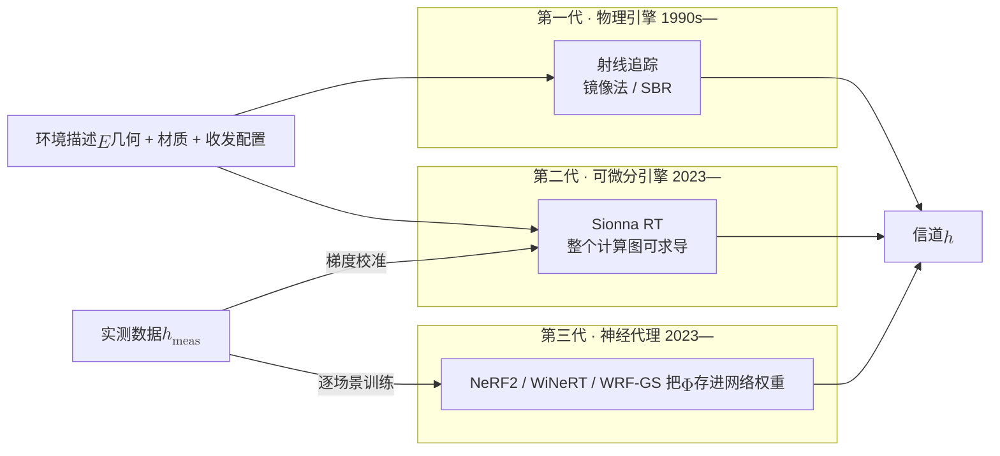
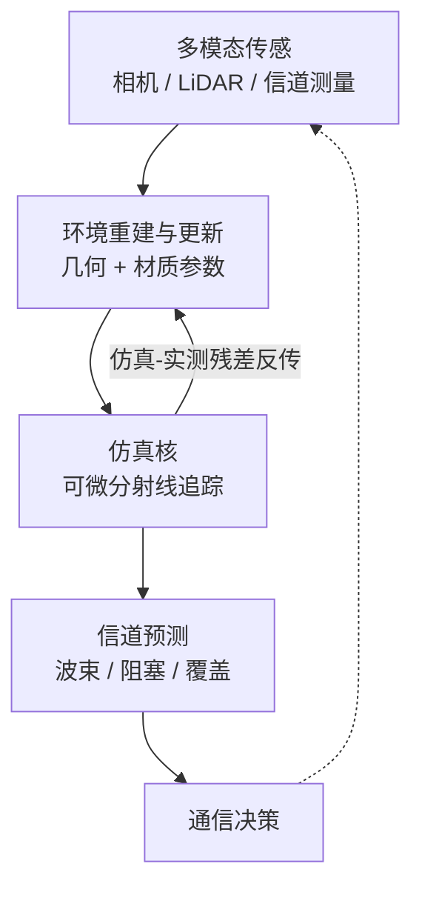

# 5 · 确定性映射的复兴：射线追踪、数字孪生与神经代理

2023 年春，NVIDIA 发布 Sionna RT 时做了一个耐人寻味的工程决定：把无线信道仿真器直接构建在图形学渲染器 Mitsuba 3 之上[6][7]。

对图形学来说，渲染是"给定场景的几何、材质与光源，算出相机看到的像素"。对无线通信来说，信道预测是"给定场景的几何、材质与发射机，算出接收机看到的场"。这两件事在数学上同构：都是把环境这个自变量送进一个确定性的物理泛函。同一家公司同时做这两件事，这不是巧合，说明工程上已经承认了这种同构。

[第 2 章](02-maxwell-foundations.md)已经建立了这个泛函的存在性：环境 $E$ 给定，信道 $h$ 由 Maxwell 方程唯一决定，记作 $h = \Phi(E)$。本章讲这个正向箭头 $\Phi: E \to h$ 的工程史，分三代引擎：物理引擎（射线追踪）、可微分物理引擎（Sionna RT）、神经代理（NeRF2 / WiNeRT / 高斯泼溅）。

这段三十五年的历史反复撞上同一堵墙：引擎的精度上限不由引擎决定，取决于你对环境知道多少。引擎再准，不知道墙是什么做的也白搭。这堵墙是本部第三个基本问题 Q3（知识汇率，即环境知识的价值）的工程侧证据。

!!! note "本章预备知识"
    需要：几何光学的射线图像、最小二乘与梯度下降。用到的内容：

    - Friis 公式与自由空间损耗：[预备篇 1.5](../part0/01-em-waves-antennas.md#15-friis-公式从球面功率密度一步步推到链路预算)。
    - 路径损耗与阴影衰落的典型值：[预备篇 2.2](../part0/02-wireless-channel-basics.md#22-路径损耗从-friis-到-3gpp)、[预备篇 2.3](../part0/02-wireless-channel-basics.md#23-阴影衰落为什么偏偏是对数正态)。
    - 高频渐近、Fresnel 系数、ITU-R P.2040 材料模型与刃峰绕射公式：[第 2 章](02-maxwell-foundations.md)。
    - 统计模型的谱系，作为确定性方法的参照：[第 3 章](03-statistical-lineage.md)。
    - 自动微分：预备篇没有讲，第二代引擎一节就地解释。

## 5.1 从渲染画面到渲染电磁场 {#从渲染画面到渲染电磁场}

先把"环境"写成一个明确的数学对象。本章所说的环境描述是一个五元组：

$$
E = \left( \mathcal{G},\ \{\eta_m\}_{m=1}^{M},\ \mathbf{x}_{\mathrm{tx}},\ \mathbf{x}_{\mathrm{rx}},\ \mathcal{A} \right)
$$

其中各项含义如下：

- $\mathcal{G}$ 是场景几何（三角网格及其面片归属）。
- $\eta_m$ 是第 $m$ 类材质的复电磁参数。
- $\mathbf{x}_{\mathrm{tx}}, \mathbf{x}_{\mathrm{rx}}$ 是收发位置与朝向。
- $\mathcal{A}$ 是天线配置（方向图、阵列几何、极化）。

$\Phi$ 把这个五元组映到信道冲激响应 (channel impulse response, CIR)。

原则上，$\Phi$ 可以用全波方法逐点求出，有两种做法：

- **时域有限差分** (Finite-Difference Time-Domain, FDTD)：把空间切成小网格，在每个格点上存电场和磁场，按 Maxwell 方程一步步推进时间。
- **矩量法** (Method of Moments, MoM)：把物体表面的感应电流展开成有限个基函数，解一个稠密线性方程组。

两者都直接离散求解 Maxwell 方程，不做高频近似，只有离散化误差。代价是计算量随场景的电尺寸（以波长计的尺寸）急剧增长。

看一下量级就知道这条路走不通。在 3.5 GHz（$\lambda \approx 8.6$ cm），对一个 $100 \times 100 \times 30\ \mathrm{m}^3$ 的街区以 $\lambda/10$ 网格离散，需要约 $(100/0.0086)^2 \times (30/0.0086) \approx 5 \times 10^{11}$ 个网格单元。每个单元存六个场分量，单精度内存就要 10 TB 量级，还没开始迭代时间步。全波求解适合芯片封装与天线近场，不适合城市。

工程史因此成了一部"用越来越聪明的近似逼近 $\Phi$"的历史。我们把它分成三代。这个"三代"分期是本站的叙事框架，不是文献里的共识术语。三代的关系如下图：

- **第一代**只会正向算：$E$ 进，$h$ 出。
- **第二代**物理不变，但整条计算链对材质、几何、天线参数可求导。引擎从"只能正向算"变成"可以反向学"。
- **第三代**不要显式物理引擎，用神经网络从测量数据里直接学出 $\Phi$ 的近似。它快几个数量级，但学到的是"这个场景的 $\Phi$"，不是普适物理。

三代的差别在于环境知识以什么形态进入引擎：显式给定、梯度买回、隐式存权重。这条线索贯穿全章。

## 5.2 第一代：物理引擎，把 Maxwell 折叠成路径和 {#第一代物理引擎把-maxwell-折叠成路径和}

射线追踪 (ray tracing) 的做法是：把发射机辐射的波看成许多条细射线，按几何规则（直线传播、镜面反射、边缘绕射、穿透）找出从发射机到接收机的每一条路径，给每条路径配上幅度和相位，最后叠加。

这不是启发式做法，它的物理合法性有一条经典定理支撑。

### 5.2.1 几何光学：Maxwell 方程的高频渐近解

!!! abstract "定理（几何光学是 Maxwell 方程的高频渐近解）【已解决·经典理论】"
    在无源、分段均匀介质中，时谐场满足亥姆霍兹方程

    $$
    \nabla^2 \mathbf{E} + k_0^2 n^2 \mathbf{E} = \mathbf{0},
    $$

    其中 $k_0 = 2\pi/\lambda$ 为自由空间波数，$n$ 为折射率。按 Luneburg–Kline 级数作高频拟设

    $$
    \mathbf{E}(\mathbf{r}) = e^{-j k_0 \psi(\mathbf{r})} \sum_{m=0}^{\infty} \frac{\mathbf{E}_m(\mathbf{r})}{(j k_0)^m},
    $$

    代入方程并按 $k_0$ 的幂次逐阶配平（逐项求导的过程见[第 2 章](02-maxwell-foundations.md)「高频渐近：波怎样退化为射线」一节），得

    $$
    \begin{aligned}
    \mathcal{O}(k_0^2):&\quad |\nabla \psi|^2 = n^2 \quad &&\text{（程函方程，eikonal equation）}\\
    \mathcal{O}(k_0^1):&\quad 2\,(\nabla\psi\cdot\nabla)\,\mathbf{E}_0 + (\nabla^2\psi)\,\mathbf{E}_0 = \mathbf{0} \quad &&\text{（输运方程）}
    \end{aligned}
    $$

    记号提醒：第 2 章里级数分母写作 $(j\omega)^m$。因 $j\omega = jk_0 c$，两种写法只差常数因子 $c^m$，可吸收进 $\mathbf{E}_m$。第 2 章部分公式还把 $k_0$ 简写为 $k$。

    程函方程说：等相位面的法线族构成"射线"，在均匀介质中是直线。输运方程沿射线管积分，给出首项场的振幅演化，其解形如

    $$
    \mathbf{E}(s) = \mathbf{E}(0)\, \sqrt{\frac{\rho_1 \rho_2}{(\rho_1 + s)(\rho_2 + s)}}\; e^{-j k_0 s},
    $$

    其中 $\rho_1, \rho_2$ 为波前两个主曲率半径，$s$ 为沿射线的弧长。曲率符号约定各书不同，此处仅示形式。

    首项即几何光学 (geometrical optics, GO) 场；边缘与尖劈处的场由几何绕射理论及其一致性版本 (Uniform Theory of Diffraction, UTD) 补全。综述见 [3]。

**物理意义**

这条定理把"电磁波像光线"从直觉升格为渐近数学。当波长远小于环境特征尺度（墙面、楼宇都是米级，而载波波长是厘米级）时，能量沿射线管传播，场强由波前扩展决定。根号里的因子叫扩展因子 (spreading factor)：波前面积沿传播膨胀多少，功率密度就稀释多少。

射线管是一束相邻射线围成的细管，能量只沿管走，不从管壁漏出，所以管内功率守恒。扩展因子可以分三步推出来：

**第一步：写出曲率半径的变化。** 波前在两个主方向上的曲率半径称为主曲率半径。在均匀介质中走过弧长 $s$ 后，它们从 $\rho_1,\rho_2$ 变成 $\rho_1+s,\rho_2+s$。

**第二步：算管截面放大多少倍。** 管截面在每个主方向上的宽度与该方向的曲率半径成正比，两个方向分别放大 $(\rho_1+s)/\rho_1$ 与 $(\rho_2+s)/\rho_2$ 倍，面积放大 $(\rho_1+s)(\rho_2+s)/(\rho_1\rho_2)$ 倍。

**第三步：换成场强。** 功率密度正比于 $|\mathbf{E}|^2$，按同一倍数缩小，开方就是上式的根号。

射线追踪引擎追踪的正是这些射线管。

**行为分析**

- **点源球面波**：取 $\rho_1 = \rho_2 = d_0$，其中 $d_0$ 是点源到参考点 $s=0$ 的距离，$d = d_0 + s$ 是到点源的总距离。扩展因子退化为 $\sqrt{d_0^2/(d_0+s)^2} = d_0 / (d_0 + s) \propto 1/d$，振幅按距离反比衰减，功率按平方反比。Friis 公式就是渐近电磁学的这个特例。
- **失效的地方**：当 $\rho_i + s \to 0$（焦散面）根号发散，GO 崩溃；在阴影边界 GO 场不连续。这两处正是 UTD 打补丁的地方。
- **误差的阶**：固定几何、$k_0 \to \infty$ 时首项的相对误差按 $O(1/k_0)$ 渐近消失。要注意这是误差趋零，不是级数收敛：Luneburg–Kline 级数一般是**发散的**渐近级数，多取几项不保证更准，见[第 2 章](02-maxwell-foundations.md)的陷阱框。

**发散的级数为什么还有用**

"收敛"和"渐近"是两个不同的极限。收敛问的是频率固定、项数 $N \to \infty$ 时和式是否趋于真值；渐近问的是项数固定、$k_0 \to \infty$ 时误差是否趋零。

$O(1/k_0)$ 的意思是：存在只依赖几何、不依赖频率的常数 $C$，使 $k_0$ 足够大时首项相对误差不超过 $C/k_0$。补齐量纲，真正的小参数是 $1/(k_0 L)$，$L$ 是曲率半径、路径长度这类几何尺度。3.5 GHz 下 $k_0 \approx 73$ rad/m，取 $L = 5$ m 得 $1/(k_0 L) \approx 0.003$，只要 $C$ 不异常大，首项就足够准。但复杂场景里 $C$ 多大，至今没有全局估计。

经典例子是

$$
f(x) = \int_0^\infty \frac{e^{-t}}{1+t/x}\,\mathrm{d}t \sim 1 - \frac{1!}{x} + \frac{2!}{x^2} - \cdots
$$

$m!/x^m$ 终究会变大，所以这个级数对任何 $x$ 都发散。但 $x = 10$ 时只取首项误差 0.084，取 3 项误差 0.0044，取到 10 项左右误差最小（约 $1.8 \times 10^{-4}$），再往后反而变差。

在焦散和阴影边界附近，常数 $C$ 无界增大，所以 GO 在那里失效，要靠 UTD 补丁。

{ .chart loading=lazy }
{ .chart loading=lazy }

*怎么读这张图：横轴是截断项数 $N$（只取首项记作 $N=1$），纵轴是误差，按对数刻度画。*

*第一条是 $x=10$ 时前 $N$ 项部分和与真值 $f(10)\approx0.9156$ 之差的绝对值：首项 0.084，3 项 0.0044，到 10 项降到最低，约 $1.8\times10^{-4}$，此后反而回升，20 项时已回到约 0.008。第二条是被舍去的下一项 $N!/x^N$ 的大小，它在 $N=9$、10 处最小，此后越来越大，这就是"$m!/x^m$ 终究会变大"。级数对任何 $x$ 都发散，但截在最小项附近，误差已经很小。真值按上面的积分式数值积分，部分和按展开式逐项累加。*

毫米波频段的 $\lambda$ 只有几毫米，比几乎一切环境结构都小，所以频率越高，射线追踪越"合法"。但表面粗糙度相对波长变大，漫散射变强，GO/UTD 框架外的经验修正占比反而上升。近似的两头都要看。

### 5.2.2 路径和与信道冲激响应

引擎的输出是路径和。设找到 $P$ 条传播路径（直射、反射、绕射、透射、散射的组合），CIR 写作

$$
h(\tau) = \sum_{p=1}^{P} a_p\, \delta(\tau - \tau_p), \qquad \tau_p = \frac{d_p}{c},
$$

每条路径的复增益是一串因子的乘积：

$$
a_p = \frac{\lambda}{4\pi d_p} \cdot \sqrt{G_{\mathrm{tx}}(\Omega_p^{\mathrm{tx}})\, G_{\mathrm{rx}}(\Omega_p^{\mathrm{rx}})} \cdot \left( \prod_{i=1}^{B_p} \Gamma_i \right) e^{-j 2\pi d_p / \lambda},
$$

其中各量含义如下：

- $d_p$ 为路径总长。$\lambda/(4\pi d_p)$ 是 Friis 公式（[预备篇 1.5](../part0/01-em-waves-antennas.md)）里功率因子 $(\lambda/4\pi d)^2$ 的平方根。$e^{-j2\pi d_p/\lambda} = e^{-jk_0 d_p}$ 是沿路径累积的传播相位。
- $B_p$ 为交互（弹射）次数，$\Gamma_i$ 为第 $i$ 次交互的系数：反射用菲涅耳系数，绕射用 UTD 系数，漫散射用经验散射模型。
- $G_{\mathrm{tx}}, G_{\mathrm{rx}}$ 为天线方向图在路径离开/到达角上的增益。

这是射线追踪输出 CIR 的标准形态，也是 Sionna RT 文档中的表示[6][7]。

**物理意义**

$\Phi$ 被折叠成了"找路径 + 算系数"两个子问题。找路径是纯几何问题（可见性、镜像、求交），算系数是纯电磁问题（每次交互乘一个复因子）。信道的一切结构，包括时延谱、角度谱、多普勒，都从这有限条路径里长出来。[第 4 章](04-spatial-structure.md)讲的空间自由度，在这里表现为路径的角域分布。

**行为分析**

注意乘积结构 $\prod_i \Gamma_i$，它是本章后面一切误差分析的关键。在对数域，乘积变求和：每次交互的系数误差（dB 计）沿路径**累加**。一条 3 次反射的路径，每次反射系数错 2 dB，路径增益就错约 6 dB。

交互次数越多的路径（典型地：非视距路径）对材质知识越敏感。这个推论马上会在实测数据里得到验证。

### 5.2.3 找路径的两种范式与这一代的历史

找路径的两大范式决定了三十年的引擎架构。

**镜像法 (image method)**：对指定收发点，把发射机对反射面逐阶做镜像，枚举出所有镜面反射路径。

一阶的例子：发射机在 $(0,1)$、接收机在 $(4,1)$、墙面是直线 $y=0$。把发射机对墙做镜像得 $(0,-1)$，镜像点到接收机的连线与墙交于 $(2,0)$，这就是反射点，反射路径长等于这条连线的长度 $\sqrt{4^2+2^2} \approx 4.47$。二阶反射就把镜像点再对第二面墙做一次镜像，依此类推。

这样找到的路径精确无遗漏，但候选镜像数随反射阶数按面数的幂次组合增长。面数 $N$、阶数 $k$ 时量级在 $N^k$ 上下，100 个面、3 阶就是约 $10^6$ 个候选，精确表述见 [3]。这里的 $k$ 是反射阶数，不是波数。所以镜像法只适合低阶反射、小场景。

**弹射法 (shooting and bouncing rays, SBR)**：从发射机向全空间发射大量射线逐次弹射，落入接收球者记为一条路径。

离散射线几乎不可能恰好穿过接收点，所以在接收机周围放一个小球，穿过球的射线都算到达。球太小会漏掉路径，球太大会让同一条物理路径被相邻几条射线重复计入。SBR 的复杂度对射线数线性、天然并行（GPU 友好），代价是接收球带来的漏径与重复路径问题。

SBR 思想源自雷达散射截面计算（1980 年代末，Ling 等人）。现代引擎是混合体：Sionna RT 用 SBR 找候选路径、镜像法精化、哈希去重[7]。

这一代的历史值得记三个年份：

- **1991 年**：McKown 与 Hamilton 首次把射线追踪定位为"无线网络的设计工具"[1]。
- **1994 年**：Seidel 与 Rappaport 建立室内 site-specific 预测范式[2]。"site-specific"（特定场址）一词从此成为领域旗帜，它的对立面是[第 3 章](03-statistical-lineage.md)的统计模型：统计模型回答这**类**环境的 $h$ 长什么样，确定性模型回答这**个**环境的 $h$ 是多少。
- **2015 年**：此前二十年是工程化与商用化，Wireless InSite、WinProp、Volcano 等商用引擎借加速结构与并行化把城市级预测做到可行。2015 年的两篇综述 [3][4] 是这一时期的总结碑。[3] 展望的"智能、准确、实时"的传播预测，十年后回看几乎是 Sionna 的需求文档。

!!! warning "陷阱：射线追踪 ≠ 精确解"
    "确定性"指**输入确定则输出确定**，不指与实测吻合。GO/UTD 是 $\lambda \to 0$ 的渐近近似；漫散射、穿透损耗、粗糙面修正全靠附加的经验模型。

    把商用引擎的输出当"电磁真值"用，是整个领域反复交学费的错误。下文「数字孪生」一节讲到 DeepMIMO 时还会回到这一点。

## 5.3 材质的入口：Fresnel 系数与"全世界的墙" {#材质的入口fresnel-系数与全世界的墙}

上一节把材质藏在了符号 $\Gamma_i$ 里。现在打开它，这是本章核心张力的物理入口。

考虑平面波以入射角 $\theta_i$ 从空气打到材质半空间的界面。在界面两侧写出入射、反射、透射平面波，施加切向 $\mathbf{E}$、$\mathbf{H}$ 连续的边界条件。相位匹配对界面上一切点成立，逼出 Snell 定律；振幅匹配解出反射系数。对两种极化分别有

$$
\Gamma_{\mathrm{TE}} = \frac{\cos\theta_i - \sqrt{\eta - \sin^2\theta_i}}{\cos\theta_i + \sqrt{\eta - \sin^2\theta_i}}, \qquad
\Gamma_{\mathrm{TM}} = \frac{\eta\cos\theta_i - \sqrt{\eta - \sin^2\theta_i}}{\eta\cos\theta_i + \sqrt{\eta - \sin^2\theta_i}},
$$

这就是菲涅耳系数 (Fresnel coefficients)，入射角 $\theta_i$ 从界面法线量起。逐步推导见[第 2 章](02-maxwell-foundations.md)「反射与透射」一节。

记号提醒：本章的 $\eta$ 即第 2 章的 $\varepsilon_r$，$\Gamma_{\mathrm{TE}}, \Gamma_{\mathrm{TM}}$ 即那里的 $\Gamma_{\perp}, \Gamma_{\parallel}$。电磁学教材常用 $\eta$ 记波阻抗，这里不是它。

全部材质信息浓缩在一个复数 $\eta$ 里，即复相对介电常数。它从哪来？

!!! abstract "标准（ITU-R P.2040：材质进入信道的显式通道）【已解决·国际标准】"
    ITU-R P.2040（现行 P.2040-4，2025-09）对常见建材给出频率相关的电磁参数拟合[17]：

    $$
    \varepsilon'(f) = a f^b, \qquad \sigma(f) = c f^d \quad (\mathrm{S/m},\ f\ \text{以 GHz 计}),
    $$

    复相对介电常数为

    $$
    \eta(f) = \varepsilon'(f) - j\,\frac{\sigma(f)}{2\pi f \varepsilon_0} \approx \varepsilon'(f) - j\,\frac{17.98\,\sigma(f)}{f},
    $$

    末式中 $f$ 以 GHz 计。

    虚部来自导电电流。按本站 $e^{+j\omega t}$ 约定，Ampère 定律右端为

    $$
    j\omega\varepsilon_0\varepsilon'\mathbf{E} + \sigma\mathbf{E} = j\omega\varepsilon_0\big(\varepsilon' - j\sigma/(\omega\varepsilon_0)\big)\mathbf{E}
    $$

    括号里的量就是 $\eta$。$f$ 以 GHz 计时，$1/(2\pi \times 10^{9}\,\varepsilon_0) \approx 17.98$。代入菲涅耳公式即得反射/透射系数。

    标准明确其适用上限约 100 GHz。再往上，材料不均匀性与表面粗糙度带来标准未预测的效应。2024 年已有工作把测量扩展到 2–260 GHz，并检验了 P.2040 的外推 [19]。

这张 $(a, b, c, d)$ 表值得细看：全世界的墙，被压缩成了十几行参数。混凝土一行，砖一行，玻璃一行，石膏板一行。

真实建筑并不服从表格。混凝土的配方、含水率、墙内钢筋、表面涂层，都会改变 $\varepsilon'$ 与 $\sigma$，而没人会为你的每面墙做介电谱测量。

表格是对"材质无知"的标准化封装，正如[第 3 章](03-statistical-lineage.md)的统计模型是对"环境无知"的统计化封装，只是封装的层级更深了一层。

!!! example "算例：一面混凝土墙在 3.5 GHz 的反射，以及它有多敏感"
    取 P.2040 表中混凝土参数 $a \approx 5.24,\ b = 0,\ c \approx 0.0462,\ d \approx 0.7822$（1–100 GHz 适用）[17]。在 $f = 3.5$ GHz：

    第一步，电导率 $\sigma = 0.0462 \times 3.5^{0.7822} \approx 0.123\ \mathrm{S/m}$。

    第二步，虚部 $17.98 \times 0.123 / 3.5 \approx 0.63$，故 $\eta \approx 5.24 - j\,0.63$。

    第三步，$\sqrt{\eta} \approx 2.29 - j\,0.14$，垂直入射时 $\Gamma = (1-\sqrt{\eta})/(1+\sqrt{\eta})$，得 $|\Gamma| \approx 0.40$，即单次反射损耗约 $-8$ dB。

    现在做敏感性实验。为简洁起见忽略虚部，取 $\eta \approx \varepsilon'$；保留 $-j\,0.63$ 时各数最多相差约 0.3 dB。

    - 若这面墙实际偏干、偏轻（等效 $\varepsilon' \approx 3$），则 $|\Gamma| \approx 0.27$，反射损耗约 $-11.4$ dB。
    - 若含钢筋、偏潮（等效 $\varepsilon' \approx 7$），则 $|\Gamma| \approx 0.45$，约 $-6.9$ dB。

    同一面"混凝土墙"，参数的合理波动就让单次反射差出约 4.5 dB；一条两三次反射的路径，差出约 9–13 dB。这与下一节的实测数字（材质扰动造成约 7–10 dB 的 RMSE 摆动）在量级上吻合，原因就是乘积结构。

## 5.4 精度的天花板：误差分解与实证证据 {#精度的天花板误差分解与实证证据}

### 5.4.1 误差分解：求解器误差与环境知识误差

现在可以陈述本章的核心论断。先声明：下面这个分解的形式化表述是**本站观点**。文献中有大量支持性证据，但截至 2026-08，还没有人这样形式化地陈述过它。

把引擎记作 $\hat{\Phi}$（对真泛函 $\Phi$ 的近似），把我们手里的环境描述记作 $\hat{E}$（对真环境 $E$ 的近似）。

**第一步：把误差拆成两项。** 预测误差恒等地分解，加减同一项 $\Phi(\hat{E})$ 即得：

$$
\hat{\Phi}(\hat{E}) - \Phi(E) = \underbrace{\left[ \hat{\Phi}(\hat{E}) - \Phi(\hat{E}) \right]}_{\text{求解器误差}} + \underbrace{\left[ \Phi(\hat{E}) - \Phi(E) \right]}_{\text{环境知识误差}},
$$

**第二步：取范数，并对第二项作局部灵敏度假设。** 先取范数并用三角不等式。再假设 $\Phi$ 在 $E$ 附近对环境扰动局部 Lipschitz，常数为 $L_{\Phi}$：只要 $\hat{E}$ 离 $E$ 足够近，就有 $\|\Phi(\hat{E}) - \Phi(E)\| \le L_{\Phi}\|\hat{E} - E\|$，即信道偏差至多与环境偏差成正比。这里 $\|\hat{E} - E\|$ 可理解为把材质参数、墙面位置等连续参数排成向量后的距离。于是得

$$
\left\| \hat{\Phi}(\hat{E}) - \Phi(E) \right\| \le \underbrace{\left\| \hat{\Phi}(\hat{E}) - \Phi(\hat{E}) \right\|}_{\text{GO/UTD 近似、路径截断}} + \underbrace{L_{\Phi} \left\| \hat{E} - E \right\|}_{\text{几何缺失、材质未知}}.
$$

**物理意义**

第一项是"引擎不够好"，第二项是"喂给引擎的环境不够真"。

三十年的工程史就是第一项持续下降的历史：GPU 并行、混合寻径、UTD 补全，把求解器误差压到了次要位置。第二项却纹丝不动。家具、行人、车辆通常不在几何模型里；在模型里的每面墙，材质参数也只是表格值。于是主要矛盾换位了。

### 5.4.2 几何缺失的价签：一个没被建模的行人值多少 dB

材质误差刚才已经标过价：约 4.5 dB / 单次反射，多次反射累加到 9–13 dB。几何缺失的价签更贵，而且从来没人贴过。

!!! example "算例：一个没被建模的行人值多少 dB"
    用[第 2 章](02-maxwell-foundations.md)的 P.526 刃峰绕射公式。设一个行人高出视线 $h=0.5$ m，站在离接收端 $d_2=19$ m、离发射端 $d_1=1$ m 处，即挡在链路上、靠近发射侧。这里的 $h$ 是障碍物高度，沿用 P.526 的记号，与本章的信道 $h$ 无关。绕射参数为

    $$
    \nu = h\sqrt{\frac{2(d_1+d_2)}{\lambda\,d_1 d_2}} .
    $$

    再用第 2 章的 P.526 近似换成损耗：

    $$
    J(\nu) \approx 6.9 + 20\log_{10}\big(\sqrt{(\nu-0.1)^2+1} + \nu - 0.1\big)
    $$

    单位为 dB。以 3.5 GHz 为例：$\nu = 0.5\sqrt{2 \times 20/(0.0857 \times 1 \times 19)} \approx 2.48$，括号内约 4.96，$J \approx 6.9 + 13.9 \approx 21$ dB。

    - 3.5 GHz（$\lambda=8.57$ cm）：$\nu\approx 2.5$ $\Longrightarrow$ 绕射损耗 $J\approx 21$ dB。
    - 28 GHz（$\lambda=1.07$ cm）：$\nu\approx 7.0$ $\Longrightarrow$ $J\approx 30$ dB。

    一个未建模的行人 = 21–30 dB，而校准后的引擎整体只停在 3–6 dB RMSE。两个数放在一起看：只要场景里有一个没进模型的人，几何误差项就是校准后整体 RMSE 的三到十倍（按 dB 数相比：21–30 对 3–6）。所以"引擎再准也白搭"有数字支撑，它是一道减法。

    这也解释了后文一个看似消极的选择：未校准的数字孪生只报统计量，不报逐点场。环境描述里缺着几个 20 dB 量级的物体时，逐点预测的精度承诺根本兑现不了，退回统计量是唯一诚实的输出粒度。

### 5.4.3 校准后的引擎停在哪里：三组实证数字

**行为分析**

$L_{\Phi}$ 不是普适常数，它随场景与观测量剧烈变化。这是乘积结构的推论：交互次数 $B_p$ 越多，材质误差被放大越多倍（对数域累加）。

可检验的预言是：视距 (LOS) 场景（$B_p = 0$ 的直射路径主导）对环境知识误差最不敏感，非视距 (NLOS) 恒差于 LOS。实测正是如此，见下面第二条证据。

实证数字【部分结果】有三组，构成本章的证据核心：

- 商用引擎 Wireless InSite 的室内验证中，2.4/5 GHz 接收功率预测的平均 RMSE 约 5 dB（4.97/5.09 dB）[20]。同一篇文献只把混凝土的介电常数/电导率换成文献里的其他几组取值，平均 RMSE 就升到约 8–10.5 dB（原文图 5 读数：2.4 GHz 为 8.3–10.6 dB，5 GHz 为 7.8–9.5 dB）。而在 Full 3D 模型下改反射、透射、绕射次数或换射线算法，RMSE 只在 4.95–5.88 dB 之间变。材质项的影响超过了求解设置之间的差别。
- NYU 的毫米波/亚太赫兹射线追踪器 NYURay 在上中频段（6.75 / 16.95 GHz）经实测校准后：路径损耗 RMSE 为 LOS 3.2 dB、NLOS 5.8 dB[16]。
- 综合各家结果，校准后的确定性引擎大致停在 3–6 dB RMSE 量级，且 NLOS 恒差于 LOS。残差的主体是环境描述误差，求解器误差已经退居其次。

作为参照系，统计模型对"这面墙背后某一点"的预测只能给出均值，逐点误差就是阴影衰落标准差本身，见[第 3 章](03-statistical-lineage.md)；[预备篇 2.2](../part0/02-wireless-channel-basics.md) 的典型值表中，城区非视距为 6–10 dB。

校准后的 3 dB 已远优于此，确定性方法确实有效。但天花板也确实卡死在环境描述上：材质项大于求解器项。同一组数字同时证明了这两件事。

!!! success "关键结论（本站表述）"
    确定性方法并没有消灭不确定性，它把"信道不确定性"**改写**成了"环境知识不确定性"。每一 dB 的预测精度，都要用一份环境知识去换。

    这是 Q3（环境知识的价值）的工程侧证据链；"知识换精度"的显式汇率，在[第 9 章](09-exchange-and-universality.md)展开。而第二代引擎的全部意义，就是让这场交换可以用梯度自动进行。

## 5.5 第二代：可微分引擎，用梯度购买环境知识 {#第二代可微分引擎用梯度购买环境知识}

既然瓶颈是 $\hat{E} \ne E$，自然的问题是：能否用信道测量反过来修正 $\hat{E}$？这在数学上是个反问题，系统性讨论见[第 6 章](06-inverse-problem.md)。2023 年之后，它有了一个工程上很顺手的求解形态：让整个引擎可微。

### 5.5.1 可微分射线追踪与梯度回传

!!! abstract "定理（可微分射线追踪的工程实现）【已解决·工程实现，2023】"
    Sionna RT 把从环境参数到 CIR 的整条计算链实现为自动微分 (automatic differentiation) 计算图。对任意参数 $\theta$，梯度 $\partial h / \partial \theta$ 可精确回传[6]。这里的参数包括材质电磁参数 $(\varepsilon', \sigma$、散射系数$)$、天线方向图、阵列几何、收发位置与朝向。

    自动微分的做法是：程序记下每一步基本运算，再按链式法则从输出往回逐步相乘，得到精确导数，不是有限差分近似。深度学习的反向传播就是一例。

    因此任意可微损失 $L(h)$ 都可对环境参数做梯度下降。Sionna 1.0 基于 Mitsuba 3 + Dr.Jit 重写，CIR 用 SBR + 镜像法混合寻径（哈希去重），全程保持可微[7]。

梯度长什么样？路径增益的乘积结构给出干净的答案。由 $a_p = c_p \prod_i \Gamma_i$（$c_p$ 集合了扩展损耗、天线增益与相位），对材质 $m$ 的参数 $\eta_m$ 求导。

**第一步：取对数。** 把乘积变成求和：$\ln a_p = \ln c_p + \sum_i \ln\Gamma_i$。$c_p$ 与材质无关，不与材质 $m$ 交互的 $\Gamma_i$ 也不含 $\eta_m$，它们的导数都是零。其余每项的导数是 $\frac{1}{\Gamma_i}\frac{\partial\Gamma_i}{\partial\eta_m}$。

**第二步：乘回去。** 再用 $\partial a_p/\partial\eta_m = a_p\,\partial\ln a_p/\partial\eta_m$ 乘回去，得

$$
\frac{\partial a_p}{\partial \eta_m} = a_p \sum_{i \in \mathcal{I}_p(m)} \frac{1}{\Gamma_i} \frac{\partial \Gamma_i}{\partial \eta_m},
$$

其中 $\mathcal{I}_p(m)$ 是路径 $p$ 上与材质 $m$ 发生交互的位置集合，$\partial \Gamma_i / \partial \eta_m$ 由菲涅耳公式解析可得。

**第三步：写成最小二乘。** 校准问题于是写成一个普通的最小二乘：

$$
\theta^{\star} = \arg\min_{\theta}\ \sum_{k=1}^{K} \left\| h_{\mathrm{meas}}^{(k)} - \Phi_{\theta}\!\left(\hat{E};\ \mathbf{x}^{(k)}\right) \right\|_2^2,
$$

其中 $\Phi_{\theta}$ 表示材质等参数取 $\theta$ 时的引擎，$k$ 是测量编号（不是波数），$\mathbf{x}^{(k)}$ 是第 $k$ 次测量的收发位置。用随机梯度下降迭代求解，环境参数就变成了可训练的权重。

**物理意义**

每一次墙面交互都是计算图中的一个可导节点。实测与仿真的残差沿着射线路径**反向流回**到每面墙的材质参数上：哪面墙贡献了误差，哪面墙就收到梯度。

第一代校准的实际形态是逐场景人工调参，这里把它自动化为端到端优化。

### 5.5.2 校准的三个结构性性质与研究现状

**行为分析**

三个结构性性质值得写明：

- **可观测性由路径覆盖决定。** 没有任何测量路径触碰的材质，梯度恒为零，参数不可辨识：该参数取什么值，预测的测量都一样，数据无从确定它。这解释了为什么 [8] 要用分布式 MIMO 信道探测仪采数据：收发位置多样性就是环境参数的"照明"。
- **相位项使损失面剧烈振荡。** $e^{-j2\pi d_p/\lambda}$ 对几何位移的周期是波长量级，厘米级几何误差就让相位失锁，直接对复 CIR 做最小二乘极易陷入局部极小。实践中常退到幅度/时延域损失，或先做相位误差校准（arXiv:2312.12625 即此线）。
- **路径拓扑对几何不连续。** 墙移动一寸，某条路径可能突然消失（可见性是阶跃函数），对材质参数则处处光滑。所以"学材质"比"学几何"良定得多，这也解释了全行业的分工：几何靠传感重建，材质靠梯度校准。

!!! warning "陷阱：可微 ≠ 更准"
    可微性本身不改变正向精度：同样的 GO/UTD、同样的路径截断，$\hat{\Phi}$ 一点没变准。它改变的是**校准成本**：环境知识从"要么先验给定、要么没有"，变成"可以用测量数据按梯度买回来"。

    评价第二代引擎，应该看获取环境知识的边际成本，不看精度。

实证上，Hoydis 等在 IEEE TMLCN 2024 的工作[8]把材质、散射与天线方向图做可微参数化，用室内实测做梯度校准，在合成与实测数据上均验证有效，并开源了代码与数据集。他们的立场是：几何容易得到，材质难得到，校准是必需品，不是可选项。

此后校准迅速长成独立研究线（2024–2026），目前有五条管线：

- 局部相位误差校准（arXiv:2312.12625）。
- 代理模型辅助的电磁参数校准（arXiv:2608.12872）。
- 视觉-语言模型"看图猜材质"作先验，再可微精调（arXiv:2601.18242）。
- 自动重建几何并指派材质的 HoRAMA（arXiv:2602.12942）。
- 噪声鲁棒的场景校准 mmDiff（arXiv:2605.26406）。

一个领域为同一件事造出五条管线，说明行业已经承认，"材质不可知"是第一性问题。

!!! note "备注（本站解读）"
    把可微 RT 读作"用梯度购买环境知识"，把测量数据读作支付的货币。这一统一视角是本站提法。

    它的好处是让 Q3 变得可计算：校准前后的预测误差之差，除以所耗测量量，就是环境知识的边际汇率。[第 9 章](09-exchange-and-universality.md)将把这个汇率作为正式研究对象。

## 5.6 数字孪生：把箭头接成闭环 {#数字孪生把箭头接成闭环}

可微引擎解决了"一次性校准"。数字孪生 (digital twin) 的目标是把校准变成持续过程。

!!! warning "陷阱：数字孪生 ≠ 射线追踪"
    数字孪生信道 (Digital Twin Channel, DTC) 是一个闭环系统概念：多模态传感 → 环境重建与更新 → 仿真预测 → 通信决策，RT 只是其中的仿真核[13][15]。把"跑了个射线追踪"称作"建了数字孪生"，是当前文献里最普遍的概念通胀。

这个闭环的愿景由 Alkhateeb 等在 2023 年系统提出，用实时数字孪生辅助 6G 通信决策[13]。张建华团队进一步给出 DTC 概念与五级演进分级[15]。

它的范式意义在于箭头掉头：引擎不再只做 $E \to h$，还要持续用 $h$ 的测量反演并更新 $E$。本章与[第 6 章](06-inverse-problem.md)在此汇合。国内综述[18]把"复杂环境多介质电磁参数获取"与"高性能射线追踪仿真"并列为 DTC 关键技术，与本章的张力完全一致。

这条路线上有两个刻意"退一步"的结果值得记录：

- **sim-to-real 的可用性验证**【部分结果】：Jiang 与 Alkhateeb 用近似 3D 模型加射线追踪合成信道训练波束预测模型，部署到真实测量。结论是数字孪生训练可逼近真实数据训练的性能，少量真实数据微调可基本弥合差距[14]。具体差距数字因场景而异，此处不给定值。
- **未校准孪生的价值**【部分结果】：与其在校准不足时硬报逐点场，不如只预测信道**统计量**。未校准的数字孪生对统计量仍有可用精度（arXiv:2411.13360）。

第二个结果的谱系学意味值得注意：当环境知识不足时，明智的输出粒度自动从"逐点"退回"统计"。这也是[第 3 章](03-statistical-lineage.md)整个统计谱系存在的理由，只不过这次是在确定性引擎内部重演了一遍。逐点与统计是环境知识多寡对应的两个工作点，不是两种信仰。

数据侧还有一段必须诚实记录的历史。2019 年，DeepMIMO 用商用引擎离线跑好射线追踪、参数化生成信道数据集[5]，成为毫米波/大规模 MIMO 深度学习研究的事实基准。

这个范式有两面。RT 从"网络规划工具"变成"机器学习的数据工厂"，合成信道第一次成为学术共同体的公共品。但它也把 RT 的系统性偏差注入了整整一代论文：完美几何、表格材质、静态场景。

!!! warning "陷阱：在 RT 数据上验证 ≠ 在真实信道上验证"
    在 DeepMIMO 上跑到 SOTA 的算法，学到的可能恰是引擎的理想化偏差。引用这类成果时必须写明验证数据的来源；sim-to-real 差距的系统量化（而非零散个案）截至 2026-08 仍是开放问题，见章末。

## 5.7 第三代：神经代理，把 Φ 写进权重 {#第三代神经代理把-φ-写进权重}

### 5.7.1 NeRF2 与 WiNeRT：物理先验放多少

2023 年，两条平行路线同时出现，把 $\Phi$ 本身变成了学习对象。

第一条是 NeRF2（MobiCom 2023，Best Paper Runner-Up）[9]：把图形学神经辐射场 (Neural Radiance Field, NeRF) 的体渲染搬到射频域。它用一个衰减网络与一个辐射网络表示连续体积场，接收信号写成沿射线的体渲染积分，形如

$$
S(\mathbf{d}) = \int_{0}^{R} T(r)\, \alpha\big(\mathbf{x}(r)\big)\, c\big(\mathbf{x}(r), \mathbf{d}\big)\, \mathrm{d}r, \qquad T(r) = \exp\!\left( - \int_{0}^{r} \alpha\big(\mathbf{x}(u)\big)\, \mathrm{d}u \right),
$$

其中各量含义如下：

- $\mathbf{x}(r)$ 是从接收机出发、沿方向 $\mathbf{d}$ 的射线上距接收机 $r$ 处的点，$R$ 为积分的最大距离。
- $\alpha$ 是学出的衰减场（光学中的不透明度换成了射频衰减）。
- $c$ 是学出的方向性辐射（不是光速）。
- $T(r)$ 是累积透过率。

读法：距离 $r$ 处长 $\mathrm{d}r$ 的一小段贡献 $\alpha c\,\mathrm{d}r$ 的信号，穿过它与接收机之间的介质后只剩比例 $T(r)$（$\alpha$ 为常数时 $T(r) = e^{-\alpha r}$），积分把整条射线上各段的贡献加起来。

从信号测量中训练这两个场，即可预测新位置的空间频谱、辅助定位与 MIMO。其 turbo-learning（真实+合成数据混合训练）在摘要中报告了"约 50% 的性能提升"，但没有写明是哪一项指标（论文的应用涉及室内定位与 5G MIMO）【部分结果】[9]。

**物理意义与行为分析**

这个积分是对 $\Phi$ 的**无路径**近似：不再枚举离散路径，而是把环境的电磁响应摊成连续介质场。物理先验被压到最低（只保留"沿射线积分衰减"这一层），换来的是表示的完全灵活，多径、散射、衍射统统被 $\alpha$ 与 $c$ 隐式吸收。

代价同样明确：学到的场没有"墙"的概念，环境一变，权重作废。它是"这个场景的 $\Phi$"，不是物理定律。

第二条是 WiNeRT（ICLR 2023，Qualcomm AI Research）[10]，设计哲学相反：保留射线追踪的路径结构，把每次交互的算子神经化，反射/透射不再查菲涅耳公式，而是过一个学出的小网络。物理骨架多，学习自由度少，可微且快。反向传播即可做定位，在两个室内场景中位误差 0.58 m 与 1.21 m【部分结果】。

两条路线立起了第三代的**设计轴：物理先验放多少**。WiNeRT 在多的一端，NeRF2 在少的一端，此后所有工作都可以放到这根轴上。

### 5.7.2 高斯泼溅与泛化账本

2024–2025 年，表示层发生更替：三维高斯泼溅 (3D Gaussian Splatting, 3DGS) 以显式基元取代隐式场成为主流。

3DGS 把场景表示成大量三维高斯"椭球团"，每个带位置、形状（协方差矩阵）和辐射属性，渲染时把它们投影（"泼溅"）到接收端加权叠加。NeRF 把场藏在网络权重里（隐式），这些基元的参数则可以直接读出和编辑（显式）。

WRF-GS（INFOCOM 2025）用 3D 高斯基元加电磁泼溅重建无线辐射场，CSI 预测超此前方法 2.43 dB 以上、毫秒级合成新频谱[11]。扩展版进入 IEEE TWC 2025，衍生出跨频段（arXiv:2605.11432）、接收机可泛化（arXiv:2605.24290）等变体。

物理引导的中间路线同样成型：Photon Splatting 在表面附着携带方向波签名的"光子"，测地光栅化泼溅到接收机角域，约 30 ms 推理，且免重训练地泛化到新发射机位置、波束与移动接收机[12]。物理结构负责泛化，学习负责残差。

但要对第三代保持清醒，必须直视泛化的账本【部分结果】：

- 数据驱动信道预测器从标准环境换到密集环境，预测误差可增至约 37.5%。
- 仅改变天线倾角/间距/极化，即导致约 34% 的误差。
- 改载频或阵列间距，使 NMSE 恶化 15–30%。

以上数字来自连续学习信道预测综述 arXiv:2506.22471 及相关工作。

神经代理类默认**逐场景训练**，跨场景不迁移。2025–2026 年出现一批以"generalizable"为卖点的工作：

- arXiv:2502.05708。
- RadTwin（arXiv:2604.23310）。
- ChannelLM（arXiv:2604.18021），主张"从统计建模到数字孪生预测"的范式迁移。

新卖点恰好反证了此前不泛化是常态，且这批工作多在仿真数据上验证。

!!! warning "陷阱：NeRF2 类工作不是通用信道模型"
    它们学的是"这个场景的 $\Phi$"。换环境重训是默认设定，不是实现瑕疵。与"可泛化"新线（2025–2026）必须分开表述：后者是正在进行的研究方向，不是已交付的能力。

### 5.7.3 三代引擎的统一账本与一览表

!!! note "备注（本站解读）：三代引擎的统一账本"
    把三代放回"环境知识以什么形态进入引擎"这根轴上：

    - 第一代要求环境知识**显式给定**（几何库 + 材质表），缺了就错。
    - 第二代允许环境知识**用梯度买回**（测量数据是货币）。
    - 第三代把环境知识**隐式存进权重**：训练集本身就是一次环境测绘，逐场景训练就是逐场景测绘。

    三代都没有逃出天花板：$\left\| \hat{E} - E \right\|$ 这一项只是换了记账科目，从"表格误差"变成"校准数据量"，再变成"训练数据量"。

    这也为后面的章节留好了接口：[第 7 章](07-channel-cartography.md)的信道知识地图 (Channel Knowledge Map, CKM) 可视为 $\Phi$ 的查表化代理，NeRF2/WRF-GS 是其连续化版本；而"预测半径能有多大"，就是[第 8 章](08-dimension-and-prediction.md)的基本问题。

下表汇总三代引擎。全波方法 FDTD/MoM 只有离散化误差，是三代共同的参照；表中数字取自本章。

| | 第一代 · 物理引擎（1990s—） | 第二代 · 可微分引擎（2023—） | 第三代 · 神经代理（2023—） |
|---|---|---|---|
| 代表 | 射线追踪（镜像法、SBR） | Sionna RT | NeRF2、WiNeRT、WRF-GS |
| 环境知识如何进入 | 显式给定：几何加材质表格值 | 显式给定，再用实测按梯度校准 | 逐场景训练，写进网络权重 |
| 对 $\Phi$ 的近似 | GO/UTD 高频渐近、路径截断 | 同第一代：可微不改变正向精度 | 无路径的连续介质场，物理先验压到最低 |
| 能做什么 | 正向 $E\to h$ | 正向之外还能反向：残差沿射线流回每面墙的材质参数 | 比显式引擎快几个数量级的正向预测 |
| 瓶颈 | 校准后约 3–6 dB RMSE，残差主体是环境描述误差；一个未建模的行人就值 21–30 dB | 评价坐标是获取环境知识的边际成本，不是精度；没有任何路径触碰的材质不可辨识 | 学到的是"这个场景的 $\Phi$"，环境一变权重作废 |

!!! info "跨部连线"
    本章所在的线索：[残差与失配](../guide/05-eight-threads.md#4-残差与失配结论经得起不完美吗)、[代价](../guide/05-eight-threads.md#5-代价要付的到底是什么)。

    - [第二部 6.3 节](../part2/06-error-budget.md#63-环一材质-varepsilon--反射系数--路径增益)：射线追踪里材质参数的误差怎样传到路径增益，再传到波束选择与谱效。
    - [第二部 4.7 节](../part2/04-environment-generalization.md#47-前沿与方法盘点)：用射线追踪数据训练的模型能否迁移到实网：依赖结构级特征的可以，依赖相位的除非几何标定到毫米级。

## 开放问题 {#开放问题}

- **材质电磁参数的规模化获取**【开放】。P.2040 表格不等于真实建筑；逐场景梯度校准需要测量且结果不可迁移；100 GHz 以上标准本身失效。校准线、VLM 先验线、免校准线（只报统计量）三路并进，截至 2026-08 无一给出"免测量、可迁移"的方案。
- **几何保真度的分级理论**【开放】。多细的几何模型才够？误差对几何细节层次 (LOD) 的依赖没有定量理论；非均匀细化（"Fidelity Where it Matters"，arXiv:2605.08772）刚起步。它与[第 8 章](08-dimension-and-prediction.md)的有效维度问题同构：环境描述里哪些自由度真正进入了 $h$。
- **动态环境的闭环延迟**【开放】。人、车、门窗状态实时变化，孪生的"传感 → 重建 → 仿真"闭环延迟尚无公认方案与指标体系；截至 2026-08，实时更新环节仍是 DTC 分级中最薄弱的一环[15][18]。
- **神经代理的跨环境泛化**【开放】。逐场景训练是常态，"generalizable"工作刚出现且多在仿真数据上验证；跨环境泛化的理论刻画（什么环境分布下可迁移、需要多少物理先验）截至 2026-08 无定理。
- **漫散射建模**【开放】。GO/UTD 框架外的粗糙面散射仍依赖有效粗糙度类经验模型；频率越高占比越大，恰与射线近似"越高频越合法"的趋势对冲，两者的净效应缺乏系统刻画。
- **sim-to-real 差距的系统量化**【开放】。RT 训练的模型部署到真实网络掉多少点，只有零散个案[14]，无成体系的公开基准；在此之前，"数字孪生可用"的每一次宣称都只能是逐案验证。

## 参考文献 {#参考文献}

1. J. W. McKown, R. L. Hamilton, 《Ray Tracing as a Design Tool for Radio Networks》, IEEE Network, vol. 5, no. 6, pp. 27–30, 1991.（IEEE Xplore 可查）
2. S. Y. Seidel, T. S. Rappaport, 《Site-Specific Propagation Prediction for Wireless In-Building Personal Communication System Design》, IEEE Transactions on Vehicular Technology, 43(4):879–891, 1994.（IEEE Xplore 可查）
3. Z. Yun, M. F. Iskander, 《Ray Tracing for Radio Propagation Modeling: Principles and Applications》, IEEE Access, 3:1089–1100, 2015. DOI: 10.1109/ACCESS.2015.2453991
4. F. Fuschini et al., 《Ray Tracing Propagation Modeling for Future Small-Cell and Indoor Applications: A Review of Current Techniques》, Radio Science, 2015. https://agupubs.onlinelibrary.wiley.com/doi/full/10.1002/2015RS005659
5. A. Alkhateeb, 《DeepMIMO: A Generic Deep Learning Dataset for Millimeter Wave and Massive MIMO Applications》, 2019. https://arxiv.org/abs/1902.06435
6. J. Hoydis, F. Aït Aoudia et al., 《Sionna RT: Differentiable Ray Tracing for Radio Propagation Modeling》, 2023. https://arxiv.org/abs/2303.11103
7. F. Aït Aoudia, J. Hoydis et al., 《Sionna RT: Technical Report》, 2025. https://arxiv.org/abs/2504.21719
8. J. Hoydis et al., 《Learning Radio Environments by Differentiable Ray Tracing》, IEEE Transactions on Machine Learning in Communications and Networking, 2024. https://arxiv.org/abs/2311.18558
9. X. Zhao et al., 《NeRF2: Neural Radio-Frequency Radiance Fields》, ACM MobiCom 2023（Best Paper Runner-Up）. https://arxiv.org/abs/2305.06118
10. T. Orekondy et al., 《WiNeRT: Towards Neural Ray Tracing for Wireless Channel Modelling and Differentiable Simulations》, ICLR 2023. https://openreview.net/forum?id=tPKKXeW33YU
11. C. Wen, J. Tong, Y. Hu, Z. Lin, J. Zhang, 《WRF-GS: Wireless Radiation Field Reconstruction with 3D Gaussian Splatting》, IEEE INFOCOM 2025. https://arxiv.org/abs/2412.04832
12. G. Cao, G. Gradoni, Z. Peng, 《Photon Splatting: A Physics-Guided Neural Surrogate for Real-Time Wireless Channel Prediction》, 2025. https://arxiv.org/abs/2507.04595
13. A. Alkhateeb, S. Jiang, G. Charan, 《Real-Time Digital Twins: Vision and Research Directions for 6G and Beyond》, IEEE Communications Magazine, vol. 61, 2023.（IEEE Xplore 可查）
14. S. Jiang, A. Alkhateeb, 《Digital Twin Based Beam Prediction: Can We Train in the Digital World and Deploy in Reality?》, IEEE ICC 2023 Workshops. https://arxiv.org/abs/2301.07682
15. 张建华（J. Zhang）团队, 《Digital Twin Channel for 6G: Concepts, Architectures and Potential Applications》, 2024. https://arxiv.org/abs/2403.12467
16. 《Site-Specific Location Calibration and Validation of Ray-Tracing Simulator NYURay at Upper Mid-Band Frequencies》, npj Wireless Technology, 2025. https://www.nature.com/articles/s44459-025-00014-x
17. Recommendation ITU-R P.2040-4, 《Effects of Building Materials and Structures on Radiowave Propagation Above About 100 MHz》, ITU-R, 2025. https://www.itu.int/dms_pubrec/itu-r/rec/p/R-REC-P.2040-4-202509-I!!PDF-E.pdf
18. 《无线信道数字孪生关键技术现状及展望》, 电波科学学报, 2024. DOI: 10.12265/j.cjors.2024178, http://www.cjors.cn/article/doi/10.12265/j.cjors.2024178
19. J.-M. Conrat, M. A. Aliouane, J.-C. Cousin, X. Begaud, 《Material Permittivity and Conductivity Estimation From 2 to 260 GHz and Extension of the ITU-R P.2040 Model at Frequency Above 100 GHz》, IEEE PIMRC, pp. 1–6, 2024. DOI: 10.1109/PIMRC59610.2024.10817451
20. H. Obeidat, O. Obeidat, M. Mosleh, A. Abdullah, R. Abd-Alhameed, 《Verifying Received Power Predictions of Wireless InSite Software in Indoor Environments at WLAN Frequencies》, Applied Computational Electromagnetics Society (ACES) Journal, 35(10):1119–1126, 2020. DOI: 10.47037/2020.aces.j.351003
