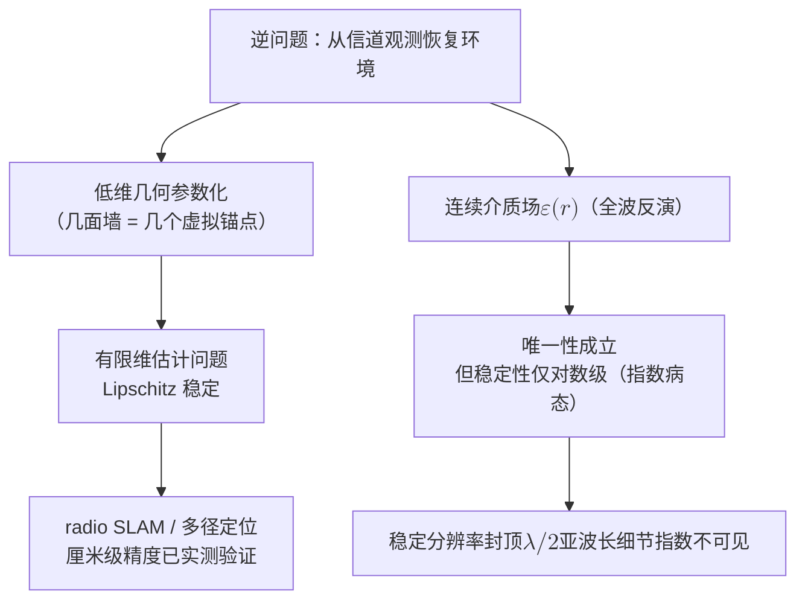
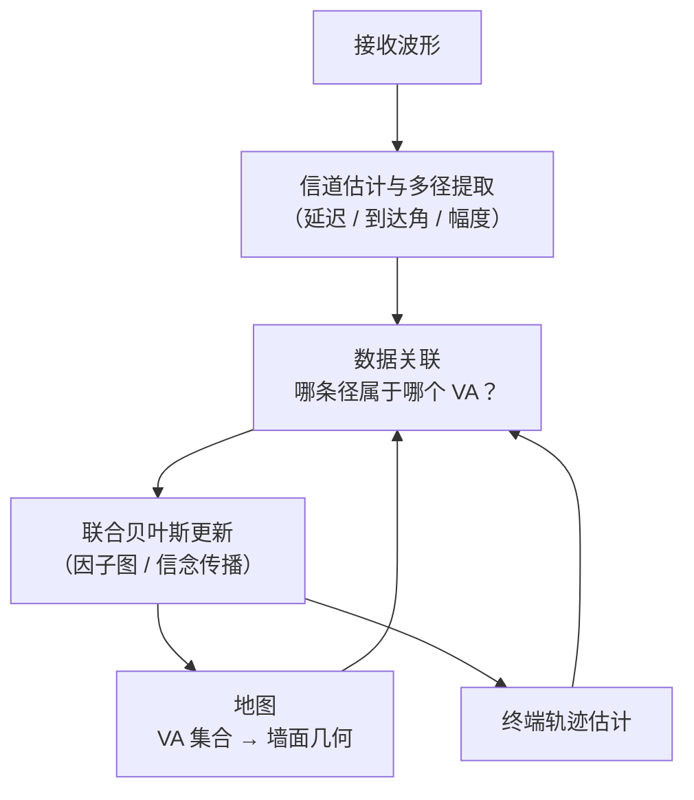

# 6 · 逆向箭头：从信道反演环境

一只蝙蝠在完全黑暗的洞穴里疾飞，靠喉部发出的超声脉冲与耳朵收到的回波，实时重建出岩壁、钟乳石与飞虫的位置。它每秒都在解本章的问题：**从波的观测反推环境的结构**。前几章建立的是正向映射 $\Phi$：环境——几何加材质，抽象为介电常数分布 $\varepsilon(\mathbf{r})$ 或散射势 $q(\mathbf{r})$——通过 Maxwell 方程确定性地决定信道 $H(f;\mathbf{p}_{\mathrm{tx}},\mathbf{p}_{\mathrm{rx}})$（[第 2 章](02-maxwell-foundations.md)、[第 5 章](05-deterministic-revival.md)）。本章把箭头反过来，问逆映射 $\Phi^{-1}$：给定有限频带、有限个收发位置上的信道观测，环境能被恢复到什么程度？

答案的结构相当戏剧化。数学上，唯一性有漂亮的定理——无限精度的数据唯一决定环境；但稳定性只有对数级——数据精度提高十个数量级，重建误差大约只减半，而且这个对数级被证明是不可改进的。这不是算法不够聪明，而是被定理钉死的本质病态。与此同时，工程上的 radio SLAM、多径成像、通感一体化 (Integrated Sensing and Communication, ISAC) 却在实测中拿到了厘米级的环境几何。两件事并不矛盾：工程成功的每一个案例，都是在解逆问题中一个被强先验正则化的**良态切片**。理解良态切片的边界在哪里，就是理解"能从信道免费学到的环境知识"的上限在哪里——这条上限将在[第 8 章](08-dimension-and-prediction.md)以"外推为什么难"的形式再次现身。

先交代贯穿全章的一组词。Hadamard 称一个问题**适定 (well-posed)**，要求解**存在**、**唯一**、且**稳定**（数据差一点，重建也只差一点）；任何一条不成立就是**不适定 (ill-posed)**。存在性在工程上用最小二乘绕开，所以本章只谈后两条：本章的"病态"主要指稳定性失败，"良态"指三条都成立且稳定性好。

!!! note "本章预备知识"
    需要：傅里叶分析（空间频率）、偏微分方程边值问题的基本概念。用到的内容：

    - 克拉美–罗界与定位误差界：[预备篇 9.4](../part0/09-new-landscape.md#94-isac-通感一体化一段波形两种任务)。
    - 镜像法与反射几何：[第 2 章](02-maxwell-foundations.md)。
    - 波数带限与自由度：[第 4 章](04-spatial-structure.md)。
    - 正向映射、可微射线追踪与神经代理：[第 5 章](05-deterministic-revival.md)。
    - Calderón 问题与倏逝波：预备篇没有讲，本章从零给出。

## 三层递进：回声、镜像与全波

### 第一层：回声直觉——一切良态

蝙蝠与声呐的逻辑只有两条：回波延迟给距离，回波方向给方位。带宽为 $B$ 的脉冲，其时间分辨率约 $1/B$，往返路径折半后得到距离分辨率

$$
\Delta r = \frac{c}{2B}
$$

孔径为 $D$ 的接收阵列，其角分辨率约 $\Delta\theta \approx \lambda/D$。代入数量级：5G 毫米波 $B=400\ \mathrm{MHz}$ 给 $\Delta r \approx 37.5\ \mathrm{cm}$；UWB 或太赫兹的 $B=2\ \mathrm{GHz}$ 给 $\Delta r \approx 7.5\ \mathrm{cm}$。这一层一切良态：待估参数少（距离、方位），映射近似线性，误差随信噪比平方根下降。这也是雷达一百年来的舒适区。

### 第二层：镜像几何——墙是镜子，反演墙等于反演虚拟锚点

室内环境对电磁波而言首先是一组"镜子"。设墙面为平面 $W=\{\mathbf{x}:\hat{\mathbf{n}}^{\top}\mathbf{x}=d\}$（$\hat{\mathbf{n}}$ 为单位法向），基站（锚点）位于 $\mathbf{a}$。锚点到墙的有符号距离是 $d-\hat{\mathbf{n}}^{\top}\mathbf{a}$；沿法向把锚点"推过墙"两倍距离，得到**虚拟锚点 (virtual anchor, VA)**：

$$
\mathbf{a}' = \mathbf{a} + 2\,(d-\hat{\mathbf{n}}^{\top}\mathbf{a})\,\hat{\mathbf{n}}
$$

三步可以验证：镜面反射路径的总长恰等于从虚拟锚点直射的距离。第一步，对墙上任意一点 $\mathbf{r}\in W$（即 $\hat{\mathbf{n}}^{\top}\mathbf{r}=d$），利用 $\hat{\mathbf{n}}^{\top}(\mathbf{a}-\mathbf{r})=\hat{\mathbf{n}}^{\top}\mathbf{a}-d=-(d-\hat{\mathbf{n}}^{\top}\mathbf{a})$ 展开：

$$
\begin{aligned}
\|\mathbf{a}'-\mathbf{r}\|^2 &= \|\mathbf{a}-\mathbf{r}\|^2 + 4\,(d-\hat{\mathbf{n}}^{\top}\mathbf{a})\,\hat{\mathbf{n}}^{\top}(\mathbf{a}-\mathbf{r}) + 4\,(d-\hat{\mathbf{n}}^{\top}\mathbf{a})^2 \\
&= \|\mathbf{a}-\mathbf{r}\|^2 - 4\,(d-\hat{\mathbf{n}}^{\top}\mathbf{a})^2 + 4\,(d-\hat{\mathbf{n}}^{\top}\mathbf{a})^2 \\
&= \|\mathbf{a}-\mathbf{r}\|^2
\end{aligned}
$$

即墙上每一点到锚点与到虚拟锚点等距。第二步，任何经墙面一点 $\mathbf{r}$ 反射、终到终端 $\mathbf{p}$ 的路径长满足三角不等式

$$
\|\mathbf{a}-\mathbf{r}\|+\|\mathbf{r}-\mathbf{p}\| = \|\mathbf{a}'-\mathbf{r}\|+\|\mathbf{r}-\mathbf{p}\| \;\ge\; \|\mathbf{a}'-\mathbf{p}\|
$$

第三步，Fermat 原理选取最短路径，等号在 $\mathbf{r}$ 落于线段 $\mathbf{a}'\mathbf{p}$ 与墙面交点时取得。于是镜面反射分量的延迟为

$$
\tau = \frac{\|\mathbf{p}-\mathbf{a}'\|}{c}
$$

**物理意义**：多径分量携带的不是"关于墙的模糊信息"，而是"从一个确定虚拟位置直射而来"的精确几何信息。反演 VA 的位置等价于反演墙面——墙面正是锚点与 VA 连线的垂直平分面。一间有五面主要反射面的房间，环境的"镜面骨架"只有五个 VA、约十五个实参数。这就把病态的连续介质反演，**退化成了良态的低维几何参数估计**——radio SLAM 的全部数学核心就在这一步。

**行为分析**：注意这个公式的适用边界。它只对**镜面反射**成立：$\hat{\mathbf{n}}$ 与 $d$ 是常数意味着墙是无限大理想平面。墙面起伏超过一定程度，反射瓣展宽，"一面墙对应一个点状 VA"的参数化开始失配——这不是数值误差，而是模型类不再包含真实环境。这个门槛远小于波长，由 **Rayleigh 粗糙度判据**给出：入射角 $\theta_i$（与法向的夹角）照射起伏高度为 $h$ 的表面，从凸起顶部与底部反射的两条射线程差为 $2h\cos\theta_i$，相位差 $\Delta\varphi=4\pi h\cos\theta_i/\lambda$；当 $\Delta\varphi>\pi/2$，即 $h>\lambda/(8\cos\theta_i)$ 时，各点反射不再同相叠加，镜面反射开始失效。垂直入射下代入 $\lambda=c/f$：

| 频段 | 波长 $\lambda$ | 粗糙度门槛 $\lambda/8$ |
|---|---|---|
| 3.5 GHz | 8.6 cm | 约 1.1 cm |
| 28 GHz | 1.07 cm | 约 1.3 mm |

常见墙面的毫米级起伏在 3.5 GHz 下仍是好镜子，到 28 GHz 就正好骑在门槛上；斜入射时门槛按 $1/\cos\theta_i$ 放宽（$60^\circ$ 时翻倍）。后文会看到，这正是当前多径 SLAM 前沿的主战场，也是良态切片边界的具体位置。

### 第三层：全波反演——撞上两堵墙

如果想要的不只是几面镜子，而是整个 $\varepsilon(\mathbf{r})$ 场——粗糙度、材质、遮挡体内部结构——就进入了**逆散射 (inverse scattering)** 理论的领地。这里立着两堵墙：唯一性（有定理，好消息）与稳定性（只有对数级，坏消息）。本章的主体就是把这两堵墙看清楚。

## 数学母体：Calderón 问题与唯一性的胜利

### 从信道观测到边界数据

逆散射的边值原型是 **Calderón 问题**（电阻抗成像 EIT 的数学形式），由 A. P. Calderón 于 1980 年正式提出，动机是石油勘探 [1]。设有界域 $\Omega\subset\mathbb{R}^n$ 内电导率 $\gamma>0$，电位 $u$ 满足 $\nabla\cdot(\gamma\nabla u)=0$。**Dirichlet-to-Neumann（DtN）映射**定义为

$$
\Lambda_{\gamma}:\; u|_{\partial\Omega} \;\longmapsto\; \gamma\,\partial_{\nu} u|_{\partial\Omega}
$$

即"在边界上施加一切可能的激励、记录一切响应"：Dirichlet 数据 $u|_{\partial\Omega}$ 是边界电位，Neumann 数据 $\gamma\,\partial_{\nu}u|_{\partial\Omega}$ 是穿过边界的法向电流密度（$\partial_{\nu}$ 为外法向导数；因电流 $\mathbf{J}=-\gamma\nabla u$，其正值表示电流流入 $\Omega$）。问：$\Lambda_{\gamma}$ 是否唯一决定内部的 $\gamma$？频域波动方程（Helmholtz / Schrödinger 势 $q$）的版本与之等价互通——把"边界激励-响应对"换成"全部收发位置对上的信道"，这正是"环境 $\to$ 信道"逆问题的数学母体：DtN 映射就是"上帝视角的完备信道知识"。

### 唯一性定理及其证明骨架

!!! abstract "定理（Sylvester–Uhlmann 全局唯一性，1987）【已解决】"
    设 $n\ge 3$，$\gamma_1,\gamma_2$ 为光滑正电导率。若 $\Lambda_{\gamma_1}=\Lambda_{\gamma_2}$，则 $\gamma_1=\gamma_2$ [2]。即：边界上全部"激励-响应"数据唯一决定内部电导率。光滑性要求后被一路降低至 Lipschitz 电导率 [3]；二维情形由 Nachman（1996）与 Astala–Päivärinta（2006）以不同技术解决（精确条件见综述 [1]）。

证明的骨架值得写出来，因为它同时解释了"为什么唯一性成立"和"为什么这不等于能算出来"。工具是**复几何光学解 (complex geometrical optics, CGO)**，四步：

1. 代换 $u=\gamma^{-1/2}v$ 把电导率方程化为 Schrödinger 形式 $(\Delta-q)v=0$，其中 $q=\Delta\sqrt{\gamma}/\sqrt{\gamma}$。验证：记 $g=\sqrt{\gamma}$，则 $\gamma\nabla u=g^2\nabla(v/g)=g\nabla v-v\nabla g$；取散度时两个 $\nabla g\cdot\nabla v$ 项相消，得 $\nabla\cdot(\gamma\nabla u)=g\Delta v-v\Delta g=g\,(\Delta-q)v$，又 $g>0$，故两方程等价；

2. 若 $\Lambda_{\gamma_1}=\Lambda_{\gamma_2}$，则两个 Schrödinger 方程的 DtN 映射也相同（还需先证边界数据决定 $\gamma$ 在边界上的值与法向导数，从略）。对 $(\Delta-q_j)v_j=0$ 的解，Green 第二恒等式给出 $\int_{\Omega}(q_1-q_2)v_1v_2=\int_{\Omega}(v_2\Delta v_1-v_1\Delta v_2)=\oint_{\partial\Omega}(v_2\partial_{\nu}v_1-v_1\partial_{\nu}v_2)$。取 $(\Delta-q_2)w=0$、边界值与 $v_1$ 相同的解，DtN 相同意味着边界上 $\partial_{\nu}w=\partial_{\nu}v_1$，所以面积分里可把 $v_1$ 换成 $w$，再用一次 Green 恒等式变回 $\int_{\Omega}(v_2\Delta w-w\Delta v_2)=\int_{\Omega}(q_2-q_2)wv_2=0$。于是得到正交恒等式：对两个方程的一切解 $v_1,v_2$，

    $$
    \int_{\Omega} (q_1-q_2)\, v_1 v_2\, \mathrm{d}\mathbf{x} = 0
    $$

3. 构造 CGO 解 $v_j=e^{\boldsymbol{\zeta}_j\cdot\mathbf{x}}(1+\psi_j)$，其中复向量 $\boldsymbol{\zeta}_j\in\mathbb{C}^n$ 满足 $\boldsymbol{\zeta}_j\cdot\boldsymbol{\zeta}_j=0$（因为 $\Delta e^{\boldsymbol{\zeta}\cdot\mathbf{x}}=(\boldsymbol{\zeta}\cdot\boldsymbol{\zeta})\,e^{\boldsymbol{\zeta}\cdot\mathbf{x}}$，这保证它调和。点积不取共轭：如 $\boldsymbol{\zeta}=s(1,\mathrm{i},0)$ 有 $\boldsymbol{\zeta}\cdot\boldsymbol{\zeta}=s^2-s^2=0$，对应 $e^{sx_1}e^{\mathrm{i}sx_2}$——沿 $x_2$ 的振荡频率有多高，沿 $x_1$ 的指数增长就有多快），且 $|\boldsymbol{\zeta}_j|\to\infty$ 时余项 $\psi_j\to 0$；

4. 对每个目标频率 $\boldsymbol{\xi}\in\mathbb{R}^n$，选 $\boldsymbol{\zeta}_1+\boldsymbol{\zeta}_2=\mathrm{i}\boldsymbol{\xi}$，则乘积 $v_1v_2\to e^{\mathrm{i}\boldsymbol{\xi}\cdot\mathbf{x}}$，正交恒等式化为 $\widehat{q_1-q_2}(\boldsymbol{\xi})=0$ 对一切 $\boldsymbol{\xi}$ 成立，故 $q_1=q_2$，进而 $\gamma_1=\gamma_2$。

**物理意义**：CGO 解是"人造的指数增长探针"——它在普通传播波之外，人为注入了沿某复方向指数增长/衰减的场分量，恰好补上了远场观测缺失的高空间频率。第 4 步说明：只要允许探针的"增长率"任意大，环境的**每一个**傅里叶系数都能被边界数据钉住。$n\ge3$ 时满足 $\boldsymbol{\zeta}\cdot\boldsymbol{\zeta}=0$ 的复方向足够多，能同时满足"增长方向"与"目标频率"两个约束；$n=2$ 时自由度不够，这正是二维问题拖到 1996/2006 年才解决的原因 [1]。

**行为分析**：注意证明在哪里"作弊"了——第 3 步的探针增长率 $|\boldsymbol{\zeta}|$ 要多大有多大，而恢复 $\boldsymbol{\xi}$ 处的傅里叶系数所需的探针幅度 $\sim e^{|\boldsymbol{\xi}|\,\mathrm{diam}(\Omega)}$。真实测量中激励能量有限、噪声有底，指数大的探针不可实现。唯一性定理的每一分优雅，都在为稳定性的灾难埋单。

!!! warning "陷阱：别把唯一性当可行性"
    "Sylvester–Uhlmann 证明了环境可以从信道恢复"是**错误**表述。正确表述是：无限精度、完备激励的数据唯一决定环境；有限精度下能恢复多少，由稳定性理论回答——而那是另一个故事。工程上，"唯一确定"几乎是安慰剂。

## 病态性的定理化：对数稳定性与它的最优性

### Alessandrini：数据误差换重建误差的汇率

!!! abstract "定理（Alessandrini 对数稳定性，1988）【已解决】"
    在先验光滑性约束（$\|\gamma_i\|_{H^s}\le M$，$s$ 足够大）下，存在 $C,\delta>0$ 使

    $$
    \|\gamma_1-\gamma_2\|_{L^{\infty}(\Omega)} \;\le\; C\,\Big|\log \|\Lambda_{\gamma_1}-\Lambda_{\gamma_2}\|_{H^{1/2}\to H^{-1/2}}\Big|^{-\delta}
    $$

    其中 $\delta$ 依赖于维数与光滑度先验 [4]。

**物理意义**：左边是环境重建误差，右边是信道数据误差 $\epsilon$ 的函数——但不是 $\epsilon$ 的幂，而是 $|\log\epsilon|^{-\delta}$。数据与重建之间的"汇率"是对数级的：这是所有反问题稳定性谱系中最差的一档（Lipschitz 级：重建误差 $\le C\epsilon$；Hölder 级：$\le C\epsilon^{\alpha}$，$0<\alpha<1$；两者都远好于它）。定理里的记号：$\|\gamma_i\|_{H^s}\le M$（Sobolev 范数，连同前 $s$ 阶导数一起计平方积分）是先验"环境不能任意粗糙"；$\|\cdot\|_{H^{1/2}\to H^{-1/2}}$ 可理解为"最坏激励下两组边界响应差多少"；$L^{\infty}$ 是逐点误差的最大值。

**行为分析**：代入数字感受一下。取 $\delta=1/2$：数据误差 $\epsilon=10^{-3}$（约 60 dB 信噪比量级）给出重建误差 $\propto |\ln 10^{-3}|^{-1/2}\approx (6.9)^{-1/2}\approx 0.38$；把数据精度狂提十个数量级到 $\epsilon=10^{-13}$，重建误差 $\propto (29.9)^{-1/2}\approx 0.18$——**十个数量级的数据精度，只换来重建误差减半**（具体倍数依赖 $\delta$ 与起点）。反过来读更震撼：想把重建误差线性地改善 $m$ 倍，所需数据精度按 $\exp(m^{1/\delta})$ 增长——误差 $\propto|\ln\epsilon|^{-\delta}$ 缩小 $m$ 倍，要求 $|\ln\epsilon|$ 放大 $m^{1/\delta}$ 倍。取 $\delta=1/2$、$m=2$：$|\ln\epsilon|$ 要从 6.9 变成 27.6，$\epsilon$ 从 $10^{-3}$ 降到 $10^{-12}$，与上面的算例吻合。任何"再堆一点信噪比就能看清环境"的直觉，在这个不等式面前失效。

{ .chart loading=lazy }
{ .chart loading=lazy }

*怎么读这张图：横轴是数据误差 $\epsilon$ 的数量级 $-\log_{10}\epsilon$（3 即 $\epsilon=10^{-3}$，约 60 dB 信噪比），越往右数据越准；纵轴是重建误差，比例常数取 1，只比形状。第一条是 $\delta=1/2$ 的对数稳定性 $|\ln\epsilon|^{-1/2}$：$10^{-3}$ 处 0.38，$10^{-13}$ 处 0.18；第二条是 0.19 的水平线，即 $10^{-3}$ 处误差的一半，第一条要到 $10^{-12}$ 才碰到它，对应上面行为分析里 $|\ln\epsilon|$ 从 6.9 变成 27.6 的算例。第三条是 Lipschitz 级的 $C\epsilon$（$C=1$ 是为对照而设的假设值）：数据每准一个数量级，它就缩小十倍，到 $10^{-2}$ 已贴着横轴；第一条却几乎是平的。按行为分析里的式子逐点计算。*

### Mandache：对数级是最优的，病态是定理不是借口

自然的希望是：对数稳定性只是估计技术不够精细。2001 年 Mandache 掐灭了这个希望。

!!! abstract "定理（Mandache 指数不稳定性，2001）【已解决】"
    存在势函数族使得任何形如上式的稳定性估计中，对数型模量不可改进（$\delta$ 有上界）。等价的直观表述：存在相距 $\varepsilon$ 的两个环境 $q_1,q_2$，其边界数据之差

    $$
    \|\Lambda_{q_1}-\Lambda_{q_2}\| \;\lesssim\; e^{-c\,\varepsilon^{-\beta}},\qquad \beta>0
    $$

    即 Calderón / Schrödinger 逆问题**本质上指数病态** [5]（$\beta$ 的精确值依赖维数与先验类；分数阶方程的同类结果见 [6]）。

**物理意义**：这条定理说的是，环境空间里存在成片的"近似隐形方向"——沿这些方向把环境改动 $\varepsilon$，信道的改变量是 $\varepsilon$ 的**指数小量**。（这里的 $\varepsilon$ 是两个环境之间的距离，既不是开篇的介电常数分布 $\varepsilon(\mathbf{r})$，也不是上一节的数据误差 $\epsilon$。）反演算法无论多聪明，都必须在噪声里分辨这个指数小量，否则这两个环境就是不可区分的。病态性从此不是工程师的借口，而是与唯一性定理平起平坐的数学事实。

**行为分析**：取 $\beta=1$、$c=1$ 粗算：分辨 $\varepsilon=0.1$ 的环境差异需要看到 $\sim e^{-10}\approx 5\times10^{-5}$ 的数据差，约需 90 dB 动态范围，紧张但可行；分辨 $\varepsilon=0.01$ 需要 $\sim e^{-100}\approx 3.7\times10^{-44}$，对应约 870 dB——超出任何物理接收机、也超出热噪声极限允许的范围几十个数量级。指数病态的含义是：**精度每前进一小步，代价乘一个指数**，很快撞上物理不可实现。

两条方向性的补充。其一，Mandache 的构造是**最坏情形**：它不排除在特定先验类（稀疏、分段常数、低维参数化）上恢复 Lipschitz 稳定——这条理论缝隙正是 radio SLAM 的栖身之所，后文详述。其二，波数 $k$ 增大时稳定性估计可分解为"Lipschitz 项 + Hölder 项 + 对数项"，对数项的权重随 $k$ 按负幂衰减——高频照射下问题的条件数在实质改善，对数病态退守亚波长细节（Isakov 的 increasing stability 纲领，定量版本见 [7]）【部分结果】。工程含义：毫米波与太赫兹感知的价值不只是"分辨率高"，而是**逆问题本身在变好**——但对固定的亚波长细节，病态性永远存在。

## 病态性的物理来源：倏逝波与信息的指数压缩

定理的机制可以在物理上看得非常透彻。核心是一句话：**散射体的亚波长细节编码在倏逝波中，而倏逝波指数衰减。**

### 三步推导：为什么亚波长细节到不了接收机

考虑 Helmholtz 方程 $\nabla^2 u+k^2u=0$（$k=2\pi/\lambda$），取环境细节所在平面为 $z=0$，接收机在 $z>0$ 一侧。第一步，把 $z=0$ 上的场按空间频率分解（角谱分解）：

$$
u(x,0)=\int \tilde{u}(k_x)\, e^{\mathrm{i}k_x x}\,\frac{\mathrm{d}k_x}{2\pi}
$$

第二步，每个分量 $e^{\mathrm{i}(k_x x+k_z z)}$ 代入 Helmholtz 方程得色散约束 $k_x^2+k_z^2=k^2$，即

$$
k_z=\sqrt{k^2-k_x^2}\;\;(|k_x|\le k),\qquad k_z=\mathrm{i}\sqrt{k_x^2-k^2}\;\;(|k_x|>k)
$$

第三步，传播到距离 $z$ 处，各分量乘上 $e^{\mathrm{i}k_z z}$。$|k_x|\le k$ 的分量（传播波）只改相位、不减幅度；$|k_x|>k$ 的分量（**倏逝波，evanescent waves**）幅度按

$$
e^{-z\sqrt{k_x^2-k^2}} \;\approx\; e^{-|k_x| z}\quad (|k_x|\gg k)
$$

指数衰减。空间尺度 $\ell$ 的环境细节对应 $|k_x|\sim 2\pi/\ell$：细节越细（$\ell$ 越小于 $\lambda$），衰减指数越大。

!!! example "算例：一厘米的细节，二十七个数量级的衰减"
    取 $f=3\ \mathrm{GHz}$，$\lambda=10\ \mathrm{cm}$，$k\approx 62.8\ \mathrm{rad/m}$。想分辨 $\ell=1\ \mathrm{cm}$（即 $\lambda/10$）的表面细节，需要 $|k_x|\approx 2\pi/0.01\approx 628\ \mathrm{rad/m}$，衰减率 $\sqrt{k_x^2-k^2}\approx 625\ \mathrm{m}^{-1}$。接收机哪怕近到 $z=10\ \mathrm{cm}$，该分量的**幅度**已衰减 $e^{-62.5}\approx 7\times10^{-28}$——二十七个数量级，折算成功率约 $-543$ dB（$20\log_{10}$），需要五百多 dB 的信噪比才能从噪声里捞出来——而热噪声物理允许的动态范围不过一二百 dB。分辨 $\ell=\lambda/2=5\ \mathrm{cm}$ 则只需传播波，零衰减。病态与良态之间隔着的不是渐变，是一道指数悬崖。

**物理意义**：正向映射 $\Phi$ 是一个"指数强度的低通滤波器"——它把环境的亚波长空间频率指数压缩后才交给信道。反演就是把被指数压缩的分量除回来，等价于**指数放大噪声**。这就是 Alessandrini–Mandache 对数稳定性的物理本质；数学定理与角谱物理在此严丝合缝。

### 衍射极限：传播波窗口有多宽

留在传播波窗口内，能稳定看到的极限是什么？Born（弱散射）近似给出干净的答案。散射场满足 **Lippmann–Schwinger 方程**：被总场 $u$ 照亮的每个散射点作为点源，经自由空间 Green 函数传到观测点，再叠加：

$$
u_s(\mathbf{x}) = k^2\int \frac{e^{\mathrm{i}k\|\mathbf{x}-\mathbf{y}\|}}{4\pi\|\mathbf{x}-\mathbf{y}\|}\, q(\mathbf{y})\, u(\mathbf{y})\,\mathrm{d}\mathbf{y}
$$

弱散射（Born）时把 $u$ 换成入射平面波 $u_i=e^{\mathrm{i}k\mathbf{d}\cdot\mathbf{y}}$；远场时相位用 $\|\mathbf{x}-\mathbf{y}\|\approx\|\mathbf{x}\|-\hat{\mathbf{x}}\cdot\mathbf{y}$ 展开，缓变的分母只取 $\|\mathbf{x}\|$。两个相位因子合并为 $e^{\mathrm{i}k\|\mathbf{x}\|}e^{-\mathrm{i}k(\hat{\mathbf{x}}-\mathbf{d})\cdot\mathbf{y}}$，即得：

$$
u_s(\mathbf{x}) \;\approx\; \frac{e^{\mathrm{i}k\|\mathbf{x}\|}}{4\pi\|\mathbf{x}\|}\, k^2 \int q(\mathbf{y})\, e^{-\mathrm{i}k(\hat{\mathbf{x}}-\mathbf{d})\cdot\mathbf{y}}\, \mathrm{d}\mathbf{y} \;=\; \frac{e^{\mathrm{i}k\|\mathbf{x}\|}}{4\pi\|\mathbf{x}\|}\, k^2\, \hat{q}\big(k(\hat{\mathbf{x}}-\mathbf{d})\big)
$$

即：入射方向 $\mathbf{d}$、观测方向 $\hat{\mathbf{x}}$ 的单频远场数据，是散射势傅里叶变换 $\hat{q}$ 在点 $\boldsymbol{\xi}=k(\hat{\mathbf{x}}-\mathbf{d})$ 处的采样——这是 Wolf 1969 年衍射层析的奠基图景【已解决，Born 框架内】。

**行为分析**：$|\hat{\mathbf{x}}-\mathbf{d}|\le 2$，故全方位收发也只能覆盖傅里叶球 $|\boldsymbol{\xi}|\le 2k$（Ewald 极限球）。可稳定恢复的最细空间周期为 $2\pi/(2k)=\lambda/2$——经典半波长衍射极限。有限孔径/单站配置只覆盖 Ewald 球上一个帽区，退化为工程公式：距离向 $\Delta r=c/(2B)$，交叉距离向 $\approx R\lambda/(2L)$（距离 $R$、孔径 $L$）。代入：$R=10\ \mathrm{m}$、$\lambda\approx1.1\ \mathrm{cm}$（28 GHz）、$L=10\ \mathrm{cm}$，交叉向分辨率仅约 $55\ \mathrm{cm}$——毫米波"高分辨率"的宣传语，在小孔径下要打对折再打对折。

!!! warning "陷阱：衍射极限不是绝对极限"
    $\lambda/2$ 是"**稳定**重建"的极限（Born + 远场 + 有噪声）。超分辨在数学上不被唯一性禁止——它被稳定性禁止：超得越多，需要除回来的倏逝分量越深，噪声放大越指数（与 Mandache 同根）。近场探测或强先验可以买回一些超分辨，但每一分都在按指数价格付费。

### 有限自由度：信道携带环境信息的硬上界

还有一条独立的封顶线。被限制在尺寸 $a$ 的区域内的散射体，其散射场在包围观测面上是**有效空间带限**的，独立数据维数（自由度）渐近为 $\mathcal{O}\big((ka)^{d-1}\big)$（$d$ 是空间维数，即 Calderón 部分的 $n$，不是第二层墙面方程里的 $d$）——这是天线与散射理论中的经典渐近结果（Bucci–Franceschetti 一系工作；本站未逐字核对原文常数，此处仅作定性陈述，不进定理框），与[第 4 章](04-spatial-structure.md)的波数带限定理同源。超出这个数目的观测位置只增加冗余，不增加信息。代入数量级：$a=5\ \mathrm{m}$ 的房间、$\lambda=10\ \mathrm{cm}$，$ka\approx314$，三维自由度 $\sim(ka)^2\approx10^5$；而以 $\lambda/2$ 体素离散化同一房间需要 $(2a/\lambda)^3\approx10^6$ 个未知数——**观测自由度比未知数少一个数量级**，还没算噪声。环境参数超出自由度的部分，原则上仍被唯一性定理"确定"，实际上淹没在指数小的信号分量里。

## 不可辨识的暗区：规范自由与非散射构型

病态性说的是"看得见但看不清"；还有更彻底的暗区——**原理上看不见**。

其一，**规范不可辨识性**【部分结果，3D 一般情形开放】。对各向异性电导率（$\gamma$ 是正定矩阵，各方向导电能力不同），任何保持边界不动的微分同胚 $\Phi$ 的推前 $\Phi_*\gamma$ 给出**完全相同**的 DtN 映射。这里的 $\Phi$ 不是开篇的正向映射，而是一次光滑可逆（逆也光滑）的内部坐标变形，即微分同胚；推前 $\Phi_*\gamma$ 是介质随坐标一起拉伸、挤压后的新电导率。所以边界/远场数据至多决定环境到"坐标变形等价类" [8]。这是变换光学隐身斗篷（Greenleaf–Lassas–Uhlmann 的不唯一性构造与 Pendry/Leonhardt 的隐身设计）的数学根源——不可辨识性从缺陷变成了设计工具。工程翻译：**信道观测原理上无法区分"介质各向异性形变"与"几何形变"**；任何声称从信道恢复了"唯一环境"的系统，都隐式地用先验选掉了一整个等价类。

其二，**非散射构型**【部分结果】。存在"非散射波数"：特定频率、特定入射波下，某些非平凡不均匀体完全不产生散射（数学上对应内透射特征值问题，近期例子汇总见 [9]）；反面结果是带角的散射体在一切频率下都散射（corner scattering 定理系列）。工程翻译：**单频信道对某些环境扰动可以严格零响应**；宽带扫频不只是提分辨率，更是打破"隐形构型"的手段——这为 ISAC 波形设计里"感知为什么天然要宽带"补了一条数学理由。

## 工程的良态切片：radio SLAM 与虚拟锚点

现在回到工程的成功案例，用前面的理论解释它**为什么被允许成功**。

### 从"多径是干扰"到"多径是免费传感器"

2010 年代中期，Graz 与 MIT 等团队系统提出：室内定位里的镜面多径分量不是要抑制的干扰，而是携带几何信息的免费测量——口号是把多径"从敌变友" [10]。其估计论基础【已解决，模型内】：多径信道下位置的 Fisher 信息是各分量贡献之和，

$$
\mathbf{J}(\mathbf{p}) \;=\; \sum_{l} \frac{8\pi^2 B_{\mathrm{eff}}^2}{c^2}\,\mathrm{SINR}_l\;\, \mathbf{e}_l \mathbf{e}_l^{\top}
$$

其中 $B_{\mathrm{eff}}$ 为有效带宽，$\mathrm{SINR}_l$ 为第 $l$ 条可分辨路径的信干噪比，$\mathbf{e}_l$ 为该路径（对其 VA）的单位方向向量；位置误差界 $\mathrm{PEB}=\sqrt{\mathrm{tr}\{\mathbf{J}^{-1}(\mathbf{p})\}}$ [10]：由克拉美–罗界（[预备篇 9.4](../part0/09-new-landscape.md)），无偏估计的误差协方差不小于 $\mathbf{J}^{-1}$，取迹即均方位置误差的下界。预备篇的时延界 $1/(8\pi^2\beta_{\mathrm{rms}}^2\,\mathrm{SNR})$ 是下面第三步的单径版本，$\beta_{\mathrm{rms}}$ 即 $B_{\mathrm{eff}}$。

这个系数不是从天上掉下来的，四步就能推出来，而且每一步都解释了公式里的一个因子：

**第一步（似然）。** 单条可分辨径的接收信号为 $\alpha_l\, s(t-\tau_l)$ 加复白噪声（谱密度 $N_0$），对数似然（这里的 $\Lambda$ 是对数似然，与前文的 DtN 映射无关）

$$
\Lambda(\tau_l) \;=\; -\frac{1}{N_0}\int \big| r(t) - \alpha_l s(t-\tau_l) \big|^2\, dt + \mathrm{const}.
$$

**第二步（对时延求 Fisher 信息）。** 记 $e(t)=r(t)-\alpha_l s(t-\tau_l)$（真值处即噪声）。对 $\tau_l$ 求两次导：$\partial_{\tau}^2\Lambda=-\frac{2}{N_0}\int|\alpha_l s'(t-\tau_l)|^2dt+\frac{2}{N_0}\mathrm{Re}\int e^{*}(t)\,\alpha_l s''(t-\tau_l)\,dt$。第二项含噪声，期望为零——这就是消失的交叉项；于是 $J_{\tau_l}=-\mathbb{E}[\partial_{\tau}^2\Lambda]=\frac{2|\alpha_l|^2}{N_0}\int|s'(t)|^2dt$，只剩波形导数的能量。时域求导在频域是乘 $\mathrm{i}2\pi f$，由 Parseval 定理得

$$
J_{\tau_l} \;=\; \frac{2|\alpha_l|^2}{N_0}\int (2\pi f)^2 \big|S(f)\big|^2\, df .
$$

**第三步（定义有效带宽）。** 令 $B_{\mathrm{eff}}^2 := \dfrac{\int f^2|S(f)|^2 df}{\int |S(f)|^2 df}$（信号功率谱的二阶矩），则 $\int(2\pi f)^2|S(f)|^2df=4\pi^2B_{\mathrm{eff}}^2E_s$（$E_s=\int|S(f)|^2df$ 为波形能量）。定义 $\mathrm{SINR}_l:=|\alpha_l|^2E_s/N_0$（噪声中计入其他径的残余干扰即为信干噪比），代回第二步得

$$
J_{\tau_l} \;=\; 8\pi^2 B_{\mathrm{eff}}^2\,\mathrm{SINR}_l .
$$

**第四步（换到位置坐标）。** 时延由几何决定：$\tau_l = \lVert \mathbf{p}-\mathbf{a}'_l\rVert / c$（$\mathbf{a}'_l$ 是该径的虚拟锚点），故

$$
\frac{\partial \tau_l}{\partial \mathbf{p}} = \frac{1}{c}\cdot\frac{\mathbf{p}-\mathbf{a}'_l}{\lVert \mathbf{p}-\mathbf{a}'_l\rVert} = \frac{\mathbf{e}_l}{c},
$$

由 Fisher 信息的链式法则 $\mathbf{J}(\mathbf{p}) = \sum_l J_{\tau_l}\,\frac{\partial\tau_l}{\partial\mathbf{p}}\frac{\partial\tau_l}{\partial\mathbf{p}}^{\!\top}$ 即得上式。**这一步同时解释了 $\mathbf{e}_l$ 为什么是"对其虚拟锚点的单位方向向量"**——它就是时延对位置的梯度方向，而虚拟锚点的身份来自本节第二层的镜像几何。

**物理意义**：每条镜面路径等价于一个从 VA 处发射的"虚拟基站"，其测距信息与 $\mathrm{SINR}$ 成正比、与有效带宽平方成正比。单物理基站 + 四面墙 = 五锚点定位系统——环境几何直接兑换成定位增益。

**行为分析**：带宽翻倍，每条路径的信息乘四；一条比直射径弱 10 dB 的反射径仍贡献直射径十分之一的测距信息，远非可忽略。更关键的是方向外积 $\mathbf{e}_l\mathbf{e}_l^{\top}$：不同方向的路径把 $\mathbf{J}$ 撑成良条件矩阵——单基站场景下直射径只约束一个方向，正是多径补上了横向约束。算个数：$B_{\mathrm{eff}}=100\ \mathrm{MHz}$ 时系数 $8\pi^2B_{\mathrm{eff}}^2/c^2\approx8.8\ \mathrm{m}^{-2}$。只有 20 dB 的直射径时，它在自身方向给出约 $880\ \mathrm{m}^{-2}$（标准差下界 3.4 cm），横向为零，$\mathbf{J}$ 奇异、PEB 无穷大；加一条垂直方向、弱 10 dB 的反射径（$88\ \mathrm{m}^{-2}$），$\mathrm{PEB}=\sqrt{1/880+1/88}\approx11\ \mathrm{cm}$。多径丰富的环境反而定位更准，这与"多径 = 衰落 = 坏事"的传统直觉完全相反，呼应[第 1 章](01-lie-of-randomness.md)的主题。

### Channel-SLAM 到信念传播：范式的成形

把 VA 从"已知地图"变成"待估状态"，就是 radio SLAM。里程碑：2016 年 DLR 的 Channel-SLAM 把每条多径分量视为"虚拟发射机"，用递归贝叶斯滤波同时估计接收机轨迹与虚拟发射机位置，无需先验地图 [11]；2019 年信念传播 (belief propagation, BP) 多径 SLAM 把"哪条径属于哪个 VA"的概率数据关联纳入因子图，成为该领域的标准范式 [12]；同期 5G 毫米波单基站定位+建图被系统理论化（PHD 滤波与地图融合）[13]。综述见 [14]。到 2024 年，端到端毫米波 radio SLAM 处理链已完成实测闭环验证 [15]，亚米级定位与分米级墙面几何在真实场景中稳定复现。

### 为什么它被允许成功：良态切片的解剖

radio SLAM 没有违抗 Mandache 定理——它换了一个问题。对照三个条件：

1. **有限维参数化**：$M$ 面墙 = $M$ 个 VA $\approx 3M$ 个实参数（对比全波反演的 $10^6$ 体素）。未知数远少于散射场自由度 $(ka)^{d-1}$，观测是超定的；
2. **强结构先验**：分段平面、镜面反射——先验直接把 Mandache 构造的"隐形方向"排除在模型类之外。限制在这类先验上，逆问题恢复 Lipschitz 稳定（这正是 Mandache 最坏情形构造留下的理论缝隙——它只说"存在"难分辨的环境对，不说"所有"环境对都难分辨）；
3. **只用传播波**：VA 几何完全由路径延迟与角度决定，全部编码在传播分量里，不碰倏逝波悬崖。

!!! success "关键结论"
    radio SLAM 的厘米级精度与全波反演的对数病态并不矛盾：前者解的是逆问题在"分段平面镜面世界"这个低维流形上的限制，后者面对的是完整的 $\varepsilon(\mathbf{r})$ 场。**工程能从信道免费拿到的环境知识，恰好是数学划定的良态子集：亚波长以上的、镜面的、低维参数化的几何骨架。**

!!! note "备注：文献里两种'环境重建'必须区分"
    radio SLAM 重建的是**分段平面几何**（有限维、良态、厘米级实测精度）；"环境成像/重构"重建的是**反射率或占据场**（病态、分辨率受衍射极限封顶）。两者在文献中都叫 environment reconstruction，混用会得出互相矛盾的"精度"结论。

良态切片的边界也清晰可见：漫散射与粗糙表面在 VA 模型中表现为系统性失配，多测量数据关联在非理想反射面下的可辨识性是当前 BP-SLAM 前沿的公认难题【开放】——工程正从良态切片向病态区试探，每一步都要重新付先验的价钱。

## 神经代理、ISAC 与免费知识的上限

### 学到的是 Φ 的代理，不是环境

2023 年的 NeRF² 把神经辐射场搬进射频域：从稀疏信道测量学出一个能预测任意收发位置信道的隐式场 [16]；ISAC 侧则有多节点上下行协作的深度学习 4D 环境重建 [17] 等系统工作，通感一体化已列入 IMT-2030 六大场景。这些工作与[第 5 章](05-deterministic-revival.md)的神经代理一脉相承，但必须说清一个区别：**它们学到的是正向映射 $\Phi$ 的代理（能预测信道），不等于恢复了环境本身**。规范不可辨识性（同一信道可由一整类"形变环境"解释）与非散射构型不因换成神经网络而消失——网络只是被训练先验隐式地在等价类里选了一个代表元。

!!! warning "陷阱：深度学习没有'突破'病态性"
    NeRF²/PINN 类方法的本质是用强先验换取有效自由度压缩——把解限制在网络架构与训练分布诱导的低维流形上，与 radio SLAM 用平面先验是同一逻辑，只是先验从显式几何换成了隐式分布。在先验成立的域内表现优异；先验失效处（新频段、新环境类型），对数稳定性立刻收回定价权。评价此类工作，问的不该是"精度多高"，而是"先验是什么、何时失效"。

信息论侧，ISAC 的 capacity–distortion 权衡刻画了通信最优波形能携带多少**参数**信息 [18]；但对**环境重建**（场级对象而非有限参数）的 rate–distortion 刻画，截至 2026-08 基本空白【开放】。

### 免费环境知识的上限（本站观点）

!!! note "备注：以下为本站综合性提法，文献中无此定理"
    把本章三块结果组装起来——散射场自由度 $\sim(ka)^{d-1}$（可稳定观测的维数）、每维在信噪比 $\mathrm{SNR}$ 下携带 $\sim\log(1+\mathrm{SNR})$ 比特（良态部分）、超出部分被对数稳定性指数压制（病态部分）——得到一条启发式上限：

    $$
    N_{\mathrm{env}} \;\lesssim\; \mathcal{O}\big((ka)^{d-1}\big)\cdot \mathcal{O}\big(\log(1+\mathrm{SNR})\big)
    $$

    即**从信道可稳定提取的环境比特数，受"良态自由度 × 每自由度对数比特"封顶**；先验不能创造这些比特，只能决定把它们花在哪些环境参数上。这是本站把上述三块结果组装起来的表述，作为[第 9 章](09-exchange-and-universality.md)"环境知识汇率"的定价基准，其严格化列入开放问题。

### 通向第 8 章：病态性如何变成外推困难

最后一块拼图，也是本部叙事的关键连接（**本站原创联结**，文献中仅有零散呼应）：预测半径问题与本章是同一个问题。把信道模型外推到新位置/新频段，逻辑上等价于"先从旧观测隐式反演环境（或其代理），再对新配置重新正向预测"——即 $\Phi\circ\Phi^{-1}$ 的复合。第一步的误差被对数稳定性下界钉住：观测中未编码（或指数弱编码）的环境细节，恰恰是换频段、换位置后可能变得重要的细节。外推误差因此继承了逆问题的病态结构——这就是[第 8 章](08-dimension-and-prediction.md)"预测半径为什么存在、为什么难以扩大"的同源根源。逆问题的病态性不只是感知工程的烦恼，它是整个"从数据学信道"纲领的物理边界。

!!! info "跨部连线"
    本章所在的线索：[自由度与秩](../guide/05-eight-threads.md#3-自由度与秩先问能不能再问有多好)、[残差与失配](../guide/05-eight-threads.md#4-残差与失配结论经得起不完美吗)。

    - [第二部 5.1 节](../part2/05-cognitive-triangle.md#51-回顾isac-已经把两件事定了价用的是两把不同的尺)：从信道里感知环境，在第二部成为通感一体化的一条轴，它和通信用的是两把不同的尺子。
    - [第二部 2.8 节](../part2/02-blackwell.md#28-无线实验族的第一张排序图)：比较不同感知手段、不同信道知识的好坏时，应当用 Blackwell 序这种对一切任务都成立的语言，那里给出了无线实验族的第一张排序图。

## 开放问题

1. **3D 各向异性 Calderón 问题**【开放】：唯一性（up to 边界不动的微分同胚）在三维一般情形是否成立——公认开放 [8]。
2. **部分数据的最优稳定性**【部分结果】：仅在边界一部分激励/观测（对应实际系统的有限孔径）时，最优稳定性指数如何——部分结果，一般情形开放。
3. **强散射区的全波反演**【开放】：不做 Born 近似、大对比度多次散射下的稳定性刻画——截至 2026-08 无系统定理。
4. **漫散射表面的可辨识性**【开放】：粗糙/非平面反射面在多径 SLAM 中的严格可辨识性条件与数据关联的可扩展性——工程界公认未解。
5. **环境重建的 rate–distortion 理论**【开放】：ISAC 波形对场级环境对象（而非有限参数）的信息-失真权衡——capacity–distortion 框架 [18] 之外基本空白。
6. **【本站提法】免费环境知识上限的严格化**：将 $N_{\mathrm{env}}\lesssim (ka)^{d-1}\log(1+\mathrm{SNR})$ 从启发式升级为在明确先验类上的定理，并刻画良态/病态分量的相变边界——本站原创问题，截至 2026-08 无定理。
7. **【本站提法】病态性到外推误差的定量传导**：把对数稳定性下界形式化地传导为信道预测/外推误差的下界（$\Phi\circ\Phi^{-1}$ 复合的误差分析）——本站原创联结，详见[第 8 章](08-dimension-and-prediction.md)。

## 参考文献

1. G. Uhlmann, 《30 Years of Calderón's Problem》, Séminaire Laurent Schwartz — EDP et applications, 2012–2013, https://eudml.org/doc/275764
2. J. Sylvester, G. Uhlmann, 《A Global Uniqueness Theorem for an Inverse Boundary Value Problem》, Annals of Mathematics, 125:153–169, 1987, https://www.semanticscholar.org/paper/9d73377ad05f5cfde65a77268383298c3bda04da
3. P. Caro, K. Rogers, 《Global Uniqueness for the Calderón Problem with Lipschitz Conductivities》, Forum of Mathematics, Pi, 4:e2, 2016, https://arxiv.org/abs/1411.8001
4. G. Alessandrini, 《Stable Determination of Conductivity by Boundary Measurements》, Applicable Analysis, 27:153–172, 1988, https://scispace.com/papers/stable-determination-of-conductivity-by-boundary-4hg1humnjp
5. N. Mandache, 《Exponential Instability in an Inverse Problem for the Schrödinger Equation》, Inverse Problems, 17(5):1435–1444, 2001, https://iopscience.iop.org/article/10.1088/0266-5611/17/5/313
6. A. Rüland, M. Salo, 《Exponential Instability in the Fractional Calderón Problem》, Inverse Problems, 34, 2018, https://arxiv.org/abs/1711.04799
7. 《Increasing Stability Estimates for the Inverse Potential Scattering Problems》, arXiv preprint, 2023, https://arxiv.org/abs/2306.10211
8. 《A Survey of Non-uniqueness Results for the Anisotropic Calderón Problem with Disjoint Data》, arXiv preprint, 2018, https://arxiv.org/abs/1803.00910
9. 《Examples of Non-scattering Inhomogeneities》, arXiv preprint, 2024, https://arxiv.org/abs/2406.17527
10. K. Witrisal, P. Meissner, E. Leitinger, Y. Shen, C. Gustafson, F. Tufvesson, K. Haneda, D. Dardari, A. F. Molisch, A. Conti, M. Z. Win, 《High-Accuracy Localization for Assisted Living: 5G Systems Will Turn Multipath Channels from Foe to Friend》, IEEE Signal Processing Magazine, 33(2):59–70, 2016, https://wides.usc.edu/Updated_pdf/witrisal2016.pdf
11. C. Gentner, T. Jost, W. Wang, S. Zhang, A. Dammann, 《Multipath Assisted Positioning with Simultaneous Localization and Mapping》, IEEE Transactions on Wireless Communications, 2016, https://www.researchgate.net/publication/303872493
12. E. Leitinger, F. Meyer, F. Hlawatsch, K. Witrisal, F. Tufvesson, M. Z. Win, 《A Belief Propagation Algorithm for Multipath-Based SLAM》, IEEE Transactions on Wireless Communications, 2019, https://arxiv.org/abs/1801.04463
13. H. Kim, K. Granström, et al., H. Wymeersch, 《5G mmWave Cooperative Positioning and Mapping Using Multi-Model PHD Filter and Map Fusion》, IEEE Transactions on Wireless Communications, 19(6):3782–3795, 2020, https://arxiv.org/abs/1908.09806
14. B. Amjad, Q. Z. Ahmed, P. Lazaridis, M. Hafeez, F. Khan, Z. Zaharis, 《Radio SLAM: A Review on Radio-based Simultaneous Localization and Mapping》, IEEE Access, 11:9260–9278, 2023, https://ieeexplore.ieee.org/document/10018231/
15. Tampere University 团队, 《Millimeter-Wave Radio SLAM: End-to-End Processing Methods and Experimental Validation》, IEEE Journal on Selected Areas in Communications, 2024, https://ieeexplore.ieee.org/document/10556695/
16. X. Zhao, et al., 《NeRF²: Neural Radio-Frequency Radiance Fields》, ACM MobiCom 2023, 2023, https://arxiv.org/abs/2305.06118
17. 《Deep Learning Based Multi-Node ISAC 4D Environmental Reconstruction with Uplink-Downlink Cooperation》, arXiv preprint, 2024, https://arxiv.org/abs/2404.14862
18. A. Liu, et al., 《A Survey on Fundamental Limits of Integrated Sensing and Communication》, IEEE Communications Surveys & Tutorials, 2022, https://arxiv.org/abs/2104.09954
