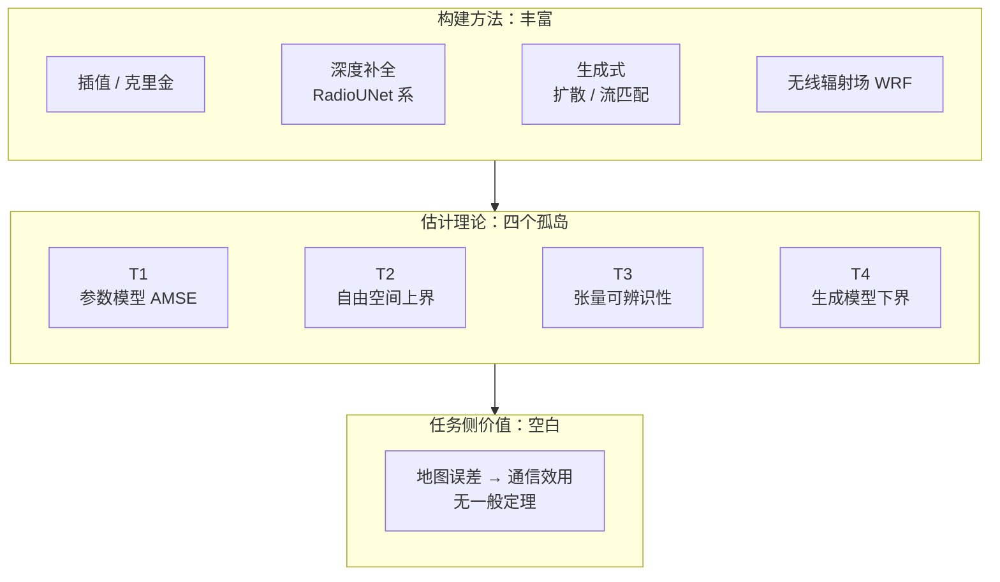

# 7 · 信道知识的地图学：Radio Map、CKM 与 Channel Charting

!!! note "本章预备知识"
    需要：统计估计（条件期望、线性最小均方误差）。用到的内容：

    - 高斯条件分布与 LMMSE，即克里金"最优"的含义：[预备篇 4.10](../part0/04-information-theory-basics.md#410-条件期望与高斯估计后文最常用的三件工具)。
    - 阴影衰落与相关距离：[预备篇 2.3](../part0/02-wireless-channel-basics.md#23-阴影衰落为什么偏偏是对数正态)。
    - 三重无知：[第 1 章](01-lie-of-randomness.md)。本章开头"同一个街角每天掉线"由此解释。
    - 空间带限与两尺度带限：[第 4 章](04-spatial-structure.md)。
    - 正向映射与数字孪生：[第 5 章](05-deterministic-revival.md)；反问题与 radio SLAM：[第 6 章](06-inverse-problem.md)。

## 7.1 同一个街角，每天掉线 {#同一个街角每天掉线}

如果衰落真的是随机的，有些日常经验就很难解释。通勤电话总在同一个街角掉线，家里的 Wi-Fi 死角十年不挪窝，老练的网优工程师闭着眼睛就能报出小区里哪几栋楼是覆盖黑洞。

[第 1 章](01-lie-of-randomness.md)已经论证过，"随机衰落"是认识论上的权宜之计：在固定环境 $E$ 中，信道由 Maxwell 方程唯一确定。本章关心这个论断的一个工程推论：既然信道的大尺度行为是位置的（近似光滑的）函数，它就可以被测量、存储、查表。

具体来说，下面这些量都可以预先制成地图：

- 路径损耗随距离按幂律衰减；
- 阴影在几米到几十米的尺度上空间相关；
- 主径角度与最优波束随位置缓变。

这些"可预测的部分"不必每次实时估计。可以预先制成一张地图，用离线制图代替在线估计。

这个朴素的想法在三个几乎不相往来的社区各自长成了一个研究方向：

- 信号处理社区叫它无线电地图估计 (radio map estimation, RME) 或频谱制图 (spectrum cartography) [3]；
- 通信系统社区叫它信道知识地图 (Channel Knowledge Map, CKM) [1]；
- 机器学习与 MIMO 的交叉社区叫它信道图卡 (channel charting) [2]。

三个名字、三套文献、三种数学语言。本书的观点是，它们是同一个对象（信道律 $\Phi$）的三种边缘化或投影。

本章先回答"什么能被地图化"，再逐一检视三个投影，最后诚实盘点理论现状。盘点的结论可以提前说：构建方法丰富，估计理论零散，任务侧价值理论几乎空白。这三句话通向后续基本问题各章。

## 7.2 可地图化判据：地图是 Φ 的边缘化 {#可地图化判据地图是-φ-的边缘化}

先交代记号。[第 5 章](05-deterministic-revival.md)里的 $\Phi$ 是确定性映射：环境与收发位置一给定，信道 $h$ 就唯一确定。

本章说"信道律 $\Phi$"，指的是它的统计版本。厘米级的环境细节与位置误差我们掌握不了，同一个标称位置对应的信道只能写成一个分布。[第 1 章](01-lie-of-randomness.md)把分布读作建模者的知识状态，说的就是这件事。于是环境 $E$ 与收发位置共同决定信道的条件律 $P_{h\mid \mathbf{x}_{\mathrm{tx}},\mathbf{x}_{\mathrm{rx}};E}$。一张**信道地图**是这个条件律的某个泛函随位置的取值：

$$
m_T(\mathbf{x}) \;=\; T\!\left[\,P_{h\mid\mathbf{x};E}\,\right], \qquad \mathbf{x}\in\mathcal{X}\subset\mathbb{R}^{d},\;\; d=2,3,
$$

其中发射端固定，条件律简写为 $P_{h\mid\mathbf{x};E}$。$T$ 是作用在**分布**上的泛函 (functional)，也就是输入一整个分布、输出一个数的映射，"取均值""取某事件的概率"都是泛函。取不同的 $T$，得到不同的地图：

- $T[P] = 10\log_{10}\mathbb{E}\,\lvert h\rvert^2$：信道增益图 (Channel Gain Map, CGM)；
- $T[P]$ 取角功率谱的峰值位置：到达角 (Angle of Arrival, AoA) 图；
- $T[P] = \arg\max_b \mathbb{E}\,\lvert \mathbf{f}_b^{\mathsf{H}}\mathbf{h}\rvert^2$（$\mathbf{f}_b$ 是预先设计好的波束码本中第 $b$ 个波束的权向量）：波束索引图 (Beam Index Map, BIM)；
- $T[P] = \Pr(\mathrm{LoS})$：视距概率图。

**物理意义**

地图存的是条件分布的统计泛函，不是信道的一次实现。这划定了"地图"与"信道估计"的分界：估计追的是一次实现，地图记的是一族分布的骨架。因此"建图"在数学上是一个**函数估计**问题：从稀疏含噪的样本恢复 $\mathbf{x}\mapsto m_T(\mathbf{x})$。

!!! tip "直觉（可地图化的两个判据）"
    什么样的 $T$ 配得上一张地图？本书总结了两个判据：

    - **空间光滑**：$m_T$ 的空间变化尺度必须远大于可实现的采样间距，否则地图在采样网格之间"看不见"真实起伏。
    - **时间持久**：环境不动则 $m_T$ 不动，地图的保质期由环境时变尺度决定。

    信道律中同时通过两关的，只有大尺度结构。

用这两个判据检验，小尺度衰落的瞬时复增益两关都过不了：

- [第 3 章](03-statistical-lineage.md)的 Clarke 模型给出复增益的空间自相关 $J_0(2\pi d/\lambda)$，第一个零点在 $d\approx 0.38\lambda$，是厘米量级。
- [第 4 章](04-spatial-structure.md)更进一步：瞬时场是波数带限于 $2\pi/\lambda$ 的场，按 Nyquist 重构需要约 $(\lambda/2)^{-2}$ 的采样面密度。

!!! example "算例（为什么没人给瞬时相位画地图）"
    **瞬时复增益的地图。** 取 3.5 GHz，$\lambda\approx 8.6$ cm。要为一个 $100\ \mathrm{m}\times 100\ \mathrm{m}$ 的小区绘制瞬时复增益地图，需要约 $(100/0.043)^2\approx 5\times 10^{6}$ 个采样点。而一扇门开合、一个行人经过，全部多径相位就重排了，这张五百万点的地图寿命以秒计。

    **阴影的地图。** 阴影的相关距离 $\beta$ 约为几米到几十米（Gudmundson 模型，见第 3 章）。取 $\beta=20$ m，同一小区按 10 m 间距采一百个点，就能抓住大部分相关结构。按下文算例的参数，目标点离最近测点平均不到 4 m，用周围测点做克里金预测，阴影方差七成以上能被预测掉。

    下文算例里"目标点离测点 10 m"，比这张网格上任何位置离最近测点都远（最远约 7 m）。那里的"地图几乎白建"，对应的是更稀疏的采样。

    两张"地图"的采样代价差四到五个数量级，保质期差得更多。

于是得到本章的叙事锚点：任何现实的信道地图，都是对完整信道律 $\Phi$ 先做**边缘化**（把小尺度相位积掉），再取泛函的结果。可地图化的不是信道本身，而是信道律中随位置缓变、随时间持久的那一层结构。

下文会看到，这个说法不只是直觉：Xu–Zeng 的分析 [4] 把"多径不可学"变成了一块定理化的误差地板。

!!! warning "陷阱（CKM 不存瞬时 CSI）"
    "CKM 里存的是每个位置的瞬时 CSI"是常见误读。半波长去相关加环境微动，使这件事在物理上不可行。CKM 的官方定位也是"辅助甚至免除实时 CSI 获取"[1]：它提供先验、压缩实时估计的开销，不替代瞬时估计本身。

## 7.3 三个社区，三个投影 {#三个社区三个投影}

### 7.3.1 Radio map：函数估计的视角

这条谱系最老，大致经过四个阶段：

- **认知无线电时代**："无线电环境地图 (Radio Environment Map, REM)"的概念在频谱感知社区流行。2008 年 Orange Labs 在 PIMRC 上提出干扰制图 (interference cartography)，服务于次级频谱接入 [5]。
- **2010–2011 年**：Giannakis 学派把频谱制图确立为标准的信号处理问题，用到样条上的 Group-Lasso [6]、克里金 (kriging，高斯过程回归在地统计学中的名字) 和 kriged Kalman 滤波。范式定型为"稀疏测量 + 空间平滑先验 → 插值/回归"。
- **2019 年起**：深度学习接管。RadioUNet [7] 用 U-Net 从城市地图与发射机位置直接预测路损图，把 RME 变成图像到图像的任务，并带动了 RadioMapSeer 数据集与路损预测挑战赛。
- **2023 年之后**：生成式浪潮，包括扩散、流匹配，以及无线辐射场 (Wireless Radiance Field, WRF，即 NeRF 与高斯泼溅进入无线传播) [8]。

Romero–Kim 的信号处理杂志教程 [3] 是整个谱系的权威入口。生成模型作为地图先验属于本章；其训练细节归神经代理一线，见[第 5 章](05-deterministic-revival.md)。

### 7.3.2 CKM：通信辅助的视角

2021 年，曾勇与徐晓丽提出 CKM：站点级 (site-specific) 数据库，以收发机位置为标签，提供位置相关的信道先验，服务于"环境感知通信"范式 [1]。

2024 年的 COMST 教程 [10] 给出了 CKM 与 REM/radio map 的官方区分，共三点：

- (i) CKM 以**双端**位置对 $(\mathbf{x}_{\mathrm{tx}},\mathbf{x}_{\mathrm{rx}})$ 为索引，传统 radio map 多为单端且面向频谱占用；
- (ii) CKM 存的是**面向通信决策**的知识类型，如波束索引、AoA，而不止功率；
- (iii) CKM 的目标是辅助甚至免除实时 CSI 获取，免训练 (training-free) 波束对准是标志性应用。

用本章记号，CKM 是一族任务泛函的集合：

$$
\mathrm{CKM}(\mathbf{x}_{\mathrm{tx}},\mathbf{x}_{\mathrm{rx}}) \;=\; \Big\{\, T_k\!\left[\,P_{h\mid\mathbf{x}_{\mathrm{tx}},\mathbf{x}_{\mathrm{rx}};E}\,\right] \Big\}_{k=1}^{K_{\mathrm{task}}}.
$$

举一个查表的例子。基站固定在楼顶，用户上报自己的位置 $(35, 60)$ m。CKM 以这对收发位置为键，返回一行记录，例如"信道增益 $-95$ dB、最优波束为码本第 12 号、主径到达角 $30^\circ$、视距概率 0.8"（数字仅为示意）。

基站拿到这行记录，可以直接用第 12 号波束开始通信，省掉逐个波束扫描的训练开销，这就是免训练波束对准。记录里的每一项都是条件分布的一个统计泛函，分别对应上面的 CGM、BIM、AoA 图与视距概率图。它们不是某一时刻的瞬时信道。

构建方法在 [10] 中分为环境模型无关 (environment model-free) 与模型辅助 (model-assisted) 两类。后者是[第 5 章](05-deterministic-revival.md)正向映射（射线追踪、数字孪生、神经代理）的直接下游。

谱系仍在扩张：

- CKMImageNet 数据集 [9]；
- 引入时变散射体的动态 CKM [11]；
- 2025 年的综述 [8] 把构建方法归为经典插值、图像处理与生成式 AI、WRF、环境感知四类，并把实时构建、跨域构建、低成本部署列为开放挑战。

### 7.3.3 Channel charting：流形学习的视角

2018 年 Studer 等奠基 [2]。固定环境中 CSI 特征随用户位置连续变化，所以所有 CSI 样本落在一个由物理位置参数化的低维流形上。对 CSI 做保邻近的降维（PCA、Sammon 映射、自编码器，后续的 Siamese 与 triplet 网络），得到 2–3 维嵌入，也就是一张"伪位置图"。

它只保证局部几何（近者恒近），全局坐标系有旋转、平移、伸缩、弯折的规范自由度。规范自由度 (gauge freedom) 指对整张图卡做某种整体变换后，训练目标的取值完全不变，算法因此无从分辨变换前后哪个"对"。例如把所有伪坐标整体旋转 90°，任意两点间的距离一个不变，只看成对距离的损失函数也就一个不变。

要落到真实坐标，需要锚点或双边定位损失 (bilateration loss) [13]。2023 年通信杂志的领域自述 [12] 与社区资源站 [15]（收录 2018–2026 逾 80 篇文献及 DICHASUS、ESPARGOS 实测数据集）标志其成熟。基于模型的构造 [14] 则用 AoA 与距离估计把图卡显式几何化。

与[第 6 章](06-inverse-problem.md)对照：charting 是一个**弱逆问题**。它不试图重建环境 $E$，只从 $\Phi$ 的值域样本恢复其定义域的内在几何。

### 7.3.4 三个投影的并排对照

三条线并排放好，投影关系一目了然：

| | Radio Map（无线电地图） | CKM（信道知识地图） | Channel Charting（信道图卡） |
|---|---|---|---|
| 社区源头 | 信号处理：认知无线电、频谱感知 | 通信系统设计：6G 环境感知通信 | 机器学习 × MIMO |
| 数学视角 | 函数估计/空间插值：坐标已知，估函数值 | 通信辅助知识库：双端位置索引，存决策知识 | 流形学习：坐标未知，从 CSI 反推低维几何 |
| 典型输出 | 功率/PSD/路损地图 | CGM、BIM、AoA 图等一族地图 | 2–3 维图卡（伪位置） |
| 监督信号 | 带定位标签的稀疏测量 | 位置标签 + 信道测量（或射线追踪/环境模型） | 无监督（仅 CSI，可加锚点半监督） |
| 统一表述 | 估 $\Phi$ 的矩泛函 $\mathbf{x}\mapsto T[P_{h\mid\mathbf{x}}]$ | 估任务泛函族 $\{T_k\}$ | 估 $\Phi$ 定义域的流形结构/坐标卡 |

```mermaid
flowchart TD
    PHI["信道律 $$\Phi$$：环境 $$E$$ 与收发位置 $$\mapsto$$ 条件分布 $$P(h)$$"]
    PHI -->|"坐标已知，取矩泛函 $$T$$，估函数值"| RM["Radio Map<br/>空间函数估计 / 插值"]
    PHI -->|"双端位置索引，任务泛函族"| CKM["CKM<br/>面向通信决策的知识库"]
    PHI -->|"值域采样，反推定义域几何"| CC["Channel Charting<br/>无监督流形学习"]
```

!!! success "关键结论（统一表述，本书观点）"
    - Radio map：坐标已知，估函数值。
    - Channel charting：值已知，估坐标（几何）。
    - CKM：坐标与值都有，问的是"这些知识对通信决策有多大用"。

    三者估计的都是 $\Phi$ 的某种边缘化/投影。对象相同，差别在条件方向与评价准则。文献中没有这样的统一表述（COMST 教程 [10] 只做了 CKM 与 REM 的概念区分），此提法属本书观点。

!!! warning "陷阱（三个名字既非同义词，也非三门学科）"
    把 radio map、REM、CKM 混为同义词，会抹掉 CKM 的差异化设计：双端索引、决策导向的知识类型、免训练目标。这是曾勇组反复强调的口径 [10]。

    反过来，把 CKM 夸大成全新学科也不成立，它的函数估计内核与 RME 一脉相承。准确的说法是：同一内核，三种问法。

## 7.4 四个理论孤岛：关于"地图有多准"我们知道什么 {#四个理论孤岛关于地图有多准我们知道什么}

构建方法已经琳琅满目：四类方法、成套数据集、专门的挑战赛。但换一个问题："给我 $N$ 个测量点，地图误差是多少？至少要测多少才够？"文献能给出的答案，只有四块互不相通的孤岛。

### 7.4.1 孤岛一：参数化统计模型下的数据需求（T1）

Xu 与 Zeng 首次正面回答了"建一张 CKM 需要多少数据"[4]【已解决（在其统计模型下）】。模型沿用 [4] 的记号：位置记作 $\mathbf{q}$，基站放在原点，所以 $\lVert\mathbf{q}\rVert$ 就是收发距离；$K_{\mathrm{dB}}$ 是常数项。它把 dB 域信道增益分解为

$$
\gamma_{\mathrm{dB}}(\mathbf{q}) \;=\; K_{\mathrm{dB}} \;-\; 10\, n_{\mathrm{PL}} \log_{10} \lVert \mathbf{q} \rVert \;+\; v(\mathbf{q}) \;+\; \omega(\mathbf{q}),
$$

其中：

- $v$ 是阴影：零均值高斯、方差 $\alpha$，空间相关取 Gudmundson 形式 $\mathbb{E}[v(\mathbf{q}_1)v(\mathbf{q}_2)]=\alpha\, e^{-\lVert\mathbf{q}_1-\mathbf{q}_2\rVert/\beta}$（$\beta$ 为去相关距离）；
- $\omega$ 是多径残差：零均值、方差 $\sigma^2$、空间不相关。

构建方式是分区估计路损参数，再用邻近 $K$ 个数据点做贝叶斯预测。

**玩具情形：单邻居预测**

在给出一般结果之前，先完整推导最小的玩具情形，因为误差地板在这里已经现形。设路损趋势已扣除，在 $\mathbf{q}_1$ 处有去趋势观测 $y_1 = v(\mathbf{q}_1)+\omega_1$，要预测距离 $d$ 处新位置 $\mathbf{q}$ 的阴影 $v(\mathbf{q})$。

**第一步：在线性预测里挑均方误差最小的。** 线性最小均方 (LMMSE) 预测，是在所有线性预测 $\hat{v}=a\,y_1$ 里挑均方误差最小的一个。展开得

$$
\mathbb{E}[(v(\mathbf{q})-a\,y_1)^2]=\alpha-2a\,\mathrm{Cov}(v(\mathbf{q}),y_1)+a^2\,\mathrm{Var}(y_1)
$$

这是 $a$ 的开口向上的二次函数。对 $a$ 求导置零，得 $a^{\star}=\mathrm{Cov}/\mathrm{Var}$，代回得最小误差 $\alpha-\mathrm{Cov}^2/\mathrm{Var}$。

**第二步：算出协方差、方差、最优预测与最小误差。** 下面四行依次给出这四个量。第一行里 $\omega_1$ 与阴影独立，不贡献协方差：

$$
\begin{aligned}
\mathrm{Cov}\big(v(\mathbf{q}),\, y_1\big) &= \alpha\,\rho(d), \qquad \rho(d) := e^{-d/\beta},\\
\mathrm{Var}(y_1) &= \alpha + \sigma^2,\\
\hat{v}(\mathbf{q}) &= \frac{\alpha\,\rho(d)}{\alpha+\sigma^2}\; y_1,\\
\mathbb{E}\big[(v(\mathbf{q})-\hat{v}(\mathbf{q}))^2\big] &= \alpha \;-\; \frac{\alpha^2\rho^2(d)}{\alpha+\sigma^2}.
\end{aligned}
$$

**第三步：说明线性预测已经够好。** 只在线性预测里挑最好的，会不会漏掉更好的非线性预测？当 $v$ 与 $\omega$ 联合高斯时不会。高斯条件分布的条件均值恰好是观测的线性函数，所以这个 LMMSE 预测就是所有预测里均方误差最小的一个。克里金所说的"最优"就是这个意思，推导见[预备篇 4.10](../part0/04-information-theory-basics.md)。

**第四步：加上新位置自己的多径残差。** 预测 $\gamma_{\mathrm{dB}}(\mathbf{q})$ 还要加上新位置自身的多径残差 $\omega(\mathbf{q})$。它空间白，任何别处的测量都帮不上忙。总误差是 $(v-\hat{v})+\omega(\mathbf{q})$，其中 $\omega(\mathbf{q})$ 与阴影、与 $\omega_1$ 都不相关，所以两项的方差直接相加：

$$
\mathrm{MSE}(d) \;=\; \sigma^2 \;+\; \alpha \;-\; \frac{\alpha^2\rho^2(d)}{\alpha+\sigma^2}.
$$

**第五步：读出两个极限。** 两个极限立刻读出全部物理：

- 采样点很远（$d\gg\beta$，$\rho\to 0$）：$\mathrm{MSE}\to\alpha+\sigma^2$，地图退化为纯路损预测，测了等于没测；
- 采样点就在脚下（$d\to 0$，$\rho\to 1$）：代入 $\rho=1$ 并通分，$\alpha-\frac{\alpha^2}{\alpha+\sigma^2}=\frac{\alpha(\alpha+\sigma^2)-\alpha^2}{\alpha+\sigma^2}=\frac{\alpha\sigma^2}{\alpha+\sigma^2}$，于是

    $$
    \mathrm{MSE}(0) \;=\; \sigma^2 \;+\; \frac{\alpha\,\sigma^2}{\alpha+\sigma^2} \;>\; \sigma^2 .
    $$

哪怕在完全相同的位置测过，误差也不归零。这就是**误差地板**。

!!! abstract "定理（CKM 构建的平均误差与数据需求；Xu–Zeng 2024，在其统计模型下）【已解决】"
    在上述路损 + Gudmundson 阴影 + 空间白多径模型下，用邻近 $K$ 点做贝叶斯预测、采样密度为 $\lambda$（随机或网格布点）时，平均均方误差 (AMSE) 有解析表达，形如

    $$
    \mathrm{AMSE} \;\approx\; \alpha + \sigma^2 \;-\; \frac{K\alpha^2}{K\alpha+\sigma^2}\;\zeta(\lambda),
    $$

    其中 $\zeta(\lambda)\in(0,1)$ 随采样密度单调上升（系数的精确形式此处按原文定性转述）。

    记号提醒：本定理里 $\lambda$ 是单位面积的采样点数，不是前文的波长；$\alpha$ 是阴影方差，不是第 3 章的到达角。

    三个推论：

    - (i) $\lambda\to 0$：$\mathrm{AMSE}\to\alpha+\sigma^2$，退化为纯路损预测；
    - (ii) $\lambda\to\infty$：$\zeta\to 1$，而 $\alpha-\frac{K\alpha^2}{K\alpha+\sigma^2}=\frac{\alpha\sigma^2}{K\alpha+\sigma^2}$，所以 $\mathrm{AMSE}\to\sigma^2+\alpha\sigma^2/(K\alpha+\sigma^2)$，存在由多径方差决定的误差地板。$K=1$ 时与上文玩具推导的 $\mathrm{MSE}(0)$ 完全一致；
    - (iii) 对 $K$ 的边际收益急剧递减，$K\approx 3$ 之后改进很小。

    小结：阴影可学，多径不可学。采样加密有极限，地板高度由 $\sigma^2$ 决定。[4]

**物理意义**

这块地板就是"地图是边缘化"的定理化。地图能记住的只有空间相关的成分（阴影，相关尺度 $\beta$）；空间白的成分在任何采样密度下都漏网。地板有两项：

- 第一项 $\sigma^2$ 是新位置自己的多径，原理上不可预测；
- 第二项 $\alpha\sigma^2/(K\alpha+\sigma^2)$ 是邻居测量中的多径污染了对阴影的估计。增大 $K$ 能压掉第二项（用 $K$ 个**不同位置**的邻居取平均，它们的 $\omega$ 相互独立），但永远压不掉第一项。

**行为分析**

误差对间距的依赖完全通过 $\rho(d)=e^{-d/\beta}$ 进入，所以 $\beta$ 是这张地图的"货币单位"。采样间距必须以 $\beta$ 为尺子来衡量，间距明显小于 $\beta$ 才开始真正赚钱。

!!! example "算例（8 dB 阴影、3 dB 多径的小区）"
    取 $\alpha=64\ \mathrm{dB}^2$（阴影标准差 8 dB）、$\sigma^2=9\ \mathrm{dB}^2$（多径残差 3 dB）、$\beta=20$ m。各种情形的均方根误差如下：

    - 不建地图（纯路损）：均方根误差 $\sqrt{73}\approx 8.5$ dB。
    - 单邻居、目标点离测点 10 m（$\rho^2=e^{-1}$）：$\mathrm{MSE}\approx 52.4$，即 7.2 dB。采样稀疏时，地图几乎白建。
    - 单邻居、间距 2 m：5.2 dB。
    - 单邻居、同点测量（$d=0$）：4.1 dB。
    - 近邻数加到 $K=3$（三个**不同位置**的邻居都紧贴目标点，即采样无限加密的极限，见下面的陷阱框）：3.4 dB。
    - $K=10$：3.1 dB。
    - $K\to\infty$：3.0 dB。

    从 $K=3$ 到 $K=\infty$ 只再赚 0.4 dB，边际收益递减肉眼可见。结论：这张地图最多把 8.5 dB 的不确定性压到 3 dB，然后撞上地板。

{ .chart loading=lazy }
{ .chart loading=lazy }

*怎么读这张图：横轴是唯一那个测点到目标点的距离 $d$，纵轴是预测误差的均方根（dB），参数取上面算例的 $\alpha=64\ \mathrm{dB}^2$、$\sigma^2=9\ \mathrm{dB}^2$、$\beta=20$ m。图中有三条线：*

- *第一条是单邻居预测的 $\sqrt{\mathrm{MSE}(d)}$：同点测量 4.1 dB，2 m 处 5.2 dB，10 m 处 7.2 dB，到 $d=\beta$ 已是 8.1 dB，此后贴向第二条。*
- *第二条是不建地图、纯路损预测的 $\sqrt{\alpha+\sigma^2}\approx8.5$ dB，即 $\rho\to0$ 的极限。*
- *第三条是多径地板 $\sigma=3$ dB，即算例里 $K\to\infty$ 的极限。*

*第一条在 $d=0$ 处比第三条高出约 1.1 dB，那是邻居自己的多径污染了阴影估计，多找几个紧贴目标点、位置各不相同的邻居就能压下去（$K=3$ 时 3.4 dB，$K=10$ 时 3.1 dB）；第三条谁也压不掉。间距要明显小于 $\beta$，第一条才明显离开第二条。按上面的 $\mathrm{MSE}(d)$ 式逐点计算，步长 2 m。*

!!! warning "陷阱：这里的"$K$ 个近邻"不能读成"在同一点测 $K$ 次""
    公式里的 $\sigma^2+\alpha\sigma^2/(K\alpha+\sigma^2)$ 隐含 $K$ 个观测的残差项 $\omega$ **相互独立**。但模型设定 $\omega$ 是**空间不相关**的多径残差。若真在同一点重复测量，$\omega$ 是**同一个实现**，取平均压不掉它，公式不适用。

    两种读法必须分清，而且工程含义完全不同：

    - **多找几个邻居**（$K$ 个不同位置）：$\omega$ 独立、可平均，公式成立；代价是这些邻居离目标点更远，$\rho<1$，上面的 3.4/3.1 dB 要相应放大；
    - **在同一点多测几次**：只能压掉**接收机热噪声**，压不掉该位置固有的多径残差。

    严格的做法是把 $\omega$ 拆成"位置固有的多径残差 + 与测量次数独立的观测噪声"两项，只有后者随重复测量按 $1/K$ 衰减。本站沿用原模型的记法，但读者须知："$K\approx3$ 之后收益递减"说的是邻居数，不是测量次数。

### 7.4.2 孤岛二：自由空间函数类的插值误差上界（T2）

Romero 等 [16] 问的是更"函数论"的问题：radio map 作为一个函数类到底有多"皱"？【部分结果】他们引入邻近系数 (proximity coefficient)，这是一个随发射机到被测区域距离递减的量，用来刻画函数类的空间变化率（给出上、下界）。

对自由空间功率图，他们证明了零阶/线性插值器的重构误差上界：误差随测点间距变小而变小，随发射机靠近被测区域而变大。这个结论的一维影子可以两行推出来。

**第一步：写出沿射线的场强。** 沿一条从发射机出发的射线看，自由空间 dB 域场强为 $f(x)=C-(20/\ln 10)\ln x$，其中 $x$ 为到发射机的距离。

**第二步：用线性插值的经典误差界。** 在相邻测点 $a$ 与 $b=a+\Delta$ 之间，插值误差可写成

$$
f(x)-\tilde{f}(x)=\tfrac12 f''(\xi)(x-a)(x-b)
$$

其中 $\xi$ 在 $a,b$ 之间。而 $\lvert(x-a)(x-b)\rvert$ 在中点取最大值 $\Delta^2/4$，所以误差不超过 $\tfrac{\Delta^2}{8}\max\lvert f''\rvert$。

**第三步：代入 $f''$ 并解出 $\Delta$。** 这里 $f''(x)=\frac{20/\ln 10}{x^2}$，在离发射机最近处 $x=d_{\min}$ 最大。代入并解出 $\Delta$（系数 $\sqrt{8\ln 10/20}\approx 0.96$）：

$$
\max_x \big|f(x)-\tilde{f}(x)\big| \;\le\; \frac{\Delta^2}{8}\,\max_x |f''(x)|
\;=\; \frac{\Delta^2}{8}\cdot\frac{20/\ln 10}{d_{\min}^{2}} \;\le\; \varepsilon
\quad\Longrightarrow\quad
\Delta \;\lesssim\; 0.96\, d_{\min}\sqrt{\varepsilon\,},
$$

其中 $\Delta$ 为采样间距，$d_{\min}$ 为被测网格到发射机的最近距离。

**物理意义**

允许的采样间距与"到最近源的距离"成正比：源越近、场越皱、需要越密的采样。这就是邻近系数的定性内容。

**行为分析**

- $\varepsilon=1$ dB 时 $\Delta\approx 0.96\,d_{\min}$，自由空间的地图在远离源处光滑得惊人。
- 真实城市地图的"皱"主要来自阴影与衍射边缘，而这恰恰是该理论没有覆盖的部分。一般传播环境下的极小极大 (minimax) 理论截至 2026-08 仍是空白【开放】。

极小极大理论要回答的是：对一整类可能的地图，任何建图方法在最坏情形下都躲不开多大的误差，这个误差又随测点数怎样下降。

### 7.4.3 孤岛三：多源分解的可辨识性（T3）

同一片频段里常有几台发射机同时工作，传感器只量得到它们叠加后的总功率，频谱管理想知道的却是每台发射机各自覆盖哪里、占哪些频率。于是先要问一个代数问题：只凭总功率，这种拆分是否唯一？可辨识性 (identifiability) 说的就是"数据能唯一确定要找的量"。

!!! abstract "定理（频谱制图的耦合块项张量分解可辨识性；Zhang–Fu 等 2020，定性转述）【已解决（可辨识性）】"
    将多发射机、多频段的功率场离散化为三维张量（两维空间 × 一维频率），并设每个发射机贡献可分结构

    $$
    Y(i,j,k) \;\approx\; \sum_{r=1}^{R} S_r(i,j)\, c_r(k),
    $$

    其中 $S_r$ 为发射机 $r$ 的空间损耗场（建为低秩）、$c_r$ 为其功率谱密度，这就是 LL1 块项分解 (block-term decomposition)。则在温和条件与多种现实采样模式（包括系统性采样）下，各发射机的个体地图 $S_r$ 与谱 $c_r$ 本质唯一可恢复（至置换与尺度歧义）。[17]

**物理意义**

- 可分结构的含义：每个发射机的谱形不随空间变，空间衰减不随频率变（窄带内近似成立）。
- 定理的含义：即使只在稀疏位置观测各源叠加后的总功率，也能把每个源单独"拆"出来。
- "至置换与尺度歧义"指两种无害的不唯一：发射机的编号可以互换；把 $S_r$ 乘以非零常数 $s$、同时把 $c_r$ 除以 $s$，乘积不变。除此之外解唯一，这就叫本质唯一。
- LL1 这个名字说的是每一项的秩结构：$S_r$ 是秩为 $L$ 的矩阵，所以每一项在两个空间方向上的秩都是 $L$，在频率方向上的秩是 1。

这是 RME 谱系里最干净的可辨识性结果。

!!! warning "陷阱（可辨识性不等于统计效率）"
    可辨识性是代数命题：回答"解是否唯一"，不回答"$N$ 个含噪样本下误差多大"。[17] 没有（也不试图给出）收敛速率或有限样本界。把"唯一可恢复"写成"小样本就能恢复"，是综述写作中常见的混淆。同理，克里金的"最优"是高斯过程 + 已知协方差假设下的 LMMSE 最优，不是分布无关最优。

### 7.4.4 孤岛四：生成式地图的误差下界（T4）

2026 年出现了第四块孤岛【部分结果，按摘要级结论转述】。Liu 等 [18] 把扩散模型做 RME 形式化为非线性矩阵补全，给出估计误差的理论下界。这个下界由"部署环境分布与真实传播规律之间的失配"支配，并识别出扩散模型性能收敛所需的临界采样率阈值。

**物理意义**

生成式地图的误差不再只由采样密度决定，还由"先验对不对"决定。这与 T1 的地板有相似之处，但性质不同：

- T1 是物理的地板：空间白的多径原理上不可学。
- T4 是认识论的地板：训练分布与部署环境的偏移。先验错了，采样再密也会被失配项卡住。

这也提醒我们：仿真数据集（多由射线追踪生成）上的 SOTA 数字不能当作真实环境的保证，实测驱动的工作正是冲着这个缺口去的 [8]。

把四块孤岛摆进同一张表，不兼容性就不用靠记忆去拼了：

| | 假设类 | 误差度量 | 结论类型 | 覆盖的地图 | 失效于 |
|---|---|---|---|---|---|
| **T1** [4] | 路损 + Gudmundson 阴影 + 空间白多径 | AMSE（dB²） | 带地板的解析式 | 信道增益图 | 非参数化环境 |
| **T2** [16] | 自由空间函数类 | $L^\infty$ 上界 | 插值器误差上界 | 功率图 | 阴影 / 衍射边缘 |
| **T3** [17] | 可分低秩、无噪 | 无（代数） | 本质唯一性 | 多源 PSD 图 | 有限样本 |
| **T4** [18] | 扩散先验 + 分布失配 | 估计误差下界 | 下界 + 临界采样率 | 生成式 RME | 先验失配主导 |

读表：

- T1 假设参数化统计模型；
- T2 假设自由空间函数类；
- T3 是无噪声的代数可辨识性；
- T4 绑定生成模型与分布失配。

四种假设、四种误差度量、四套证明技术，彼此不引用、不覆盖、不可比。"一个覆盖三视角的统一样本复杂度/极小极大理论"在文献中不存在。本书把它提炼为纲领性问题（本书提法，见[第 8 章](08-dimension-and-prediction.md)）。

## 7.5 Channel Charting：有度量，无定理 {#channel-charting有度量无定理}

三条谱系中，channel charting 的理论现状最值得单独解剖，因为它把"缺什么"暴露得最彻底。

### 7.5.1 嵌入问题与评价指标

先形式化【文献共识的表述】：给定 $N$ 个 CSI 样本（真实位置未知），charting 求嵌入

$$
\psi:\ \mathcal{H}\to\mathbb{R}^{d},\quad d\in\{2,3\},\qquad
\min_{\psi}\ \sum_{i<j}\ \ell\Big(d_{\mathcal{H}}\big(\mathbf{H}_i,\mathbf{H}_j\big),\ \lVert\mathbf{z}_i-\mathbf{z}_j\rVert\Big),\quad \mathbf{z}_i=\psi(\mathbf{H}_i),
$$

其中 $d_{\mathcal{H}}$ 是 CSI 特征失配度，$\ell$ 是保序/保比损失（Sammon 应力、triplet 损失皆是特例）：

- Sammon 应力要求嵌入距离逼近失配度本身，每一对的平方误差再除以该对的失配度，所以同样大小的误差落在近处点对上罚得更重，这是"保比"；
- triplet 损失只看顺序，取三元组（锚点、近样本、远样本），要求嵌入里锚点离近样本比离远样本更近，至少差一个间隔，这是"保序"。

评价用信赖度 (trustworthiness, TW)、连续性 (continuity, CT) 与 Kruskal 应力 (Kruskal stress)，由奠基文引入该领域 [2]。以 TW 为例：

$$
\mathrm{TW}(K) \;=\; 1 \;-\; \frac{2}{NK(2N-3K-1)} \sum_{i=1}^{N}\ \sum_{j\in\mathcal{U}_K(i)} \big(r(i,j)-K\big),
$$

其中 $\mathcal{U}_K(i)$ 是"在嵌入空间挤进 $i$ 的 $K$ 近邻、但在原始空间不是"的假邻居集合，$r(i,j)$ 是 $j$ 在原始空间中相对 $i$ 的近邻排名。

这里的"原始空间"有两种取法：

- 奠基文取发射端的真实空间位置，拿它和特征几何或学到的图卡比较，所以评估时需要位置真值 [2]；
- 综述 [12] 也指出参考空间可以换成 CSI 特征所在的高维原空间（ambient space），那样不需要位置真值，衡量的就只是降维本身保住了多少邻域结构。

$r(i,j)-K$ 量的是假邻居"插队"插了多远：原本排第 $r$ 名，却被拉进了前 $K$ 名。

??? note "TW 的归一化系数是怎么定出来的"
    归一化系数由最坏情形定出。若每个点在嵌入里的 $K$ 个近邻恰好是原空间里最远的 $K$ 个（排名 $N-K,\dots,N-1$），单点罚分为 $\sum_{m=N-K}^{N-1}(m-K)=K(2N-3K-1)/2$，$N$ 个点合计乘上系数恰好为 1，TW 取 0。

所以（$K<N/2$ 时）TW 介于 0（最坏）与 1（没有假邻居）之间。

**物理意义**

TW 惩罚"把远处的点拉到身边"，CT 对称地惩罚"把真邻居推走"。

**行为分析**

- 这是纯粹的秩统计量，只看排序、不看度量，对全局形变既完全免疫也完全失明。
- TW 与 CT 双双接近 1，仍不承诺嵌入与物理位置之间有任何度量关系。

它们是经验度量，不是理论保证。

### 7.5.2 理论保证应当是什么

那什么才算理论保证？本书认为应当是这样一个命题：位置到 CSI 特征的正向映射 $\mathbf{F}$（即 $\Phi$ 的特征投影）在什么条件下是双利普希茨 (bi-Lipschitz) 的：

$$
c_1\,\lVert\mathbf{x}-\mathbf{x}'\rVert \;\le\; d_{\mathcal{H}}\big(\mathbf{F}(\mathbf{x}),\mathbf{F}(\mathbf{x}')\big) \;\le\; c_2\,\lVert\mathbf{x}-\mathbf{x}'\rVert,
$$

只有 bi-Lipschitz 才同时排除"折叠"（下界）与"撕裂"（上界），使从成对失配度恢复几何在原则上可行。用这副眼镜看，charting 的两类失效模式立刻清晰：

- **上界失效**：若特征直接取瞬时 CSI，位置移动半个波长相位即完全重排（第 3、4 章），$d_{\mathcal{H}}$ 在 $\lVert\mathbf{x}-\mathbf{x}'\rVert\sim\lambda/2$ 处就饱和，等效的 $c_2$ 在短波长下发散。所以可行的 charting 特征必然先做大尺度化：功率时延谱、空间协方差、波束域幅值。charting 与 radio map、CKM 一样，第一步都是对 $\Phi$ 做投影，殊途同归于本章锚点。
- **下界失效**：对称环境（镜像走廊、对称大厅）里相距很远的两点可以有几乎相同的特征，$c_1\approx 0$，图卡在此折叠。基于模型的构造 [14] 用 AoA 与距离估计显式几何化来缓解；bilateration 损失 [13] 用多基站几何锚定规范自由度，把伪坐标拉回真实坐标系。

### 7.5.3 理论真空与伪坐标

!!! warning "『反定理』：charting 的理论真空（截至 2026-08）【开放】"
    "CSI 流形到物理位置流形的嵌入在何种信道模型下是 bi-Lipschitz 的、样本复杂度如何"，文献中没有一般定理。已知最接近的两项：

    - (i) 把 charting 重述为欧氏距离矩阵 (Euclidean Distance Matrix, EDM) 补全的路线（ICASSP 2020 一线），可在其表述下借用低秩恢复的 RIP 型保证；
    - (ii) 基于模型的 charting [14]，性能优于纯无监督方法且可硬件化，但同样没有端到端统计保证。

    关于 (i) 的两点说明：EDM 的元素是点对距离的平方，$d$ 维点集的 EDM 秩不超过 $d+2$，补全它就是低秩矩阵恢复。RIP 即受限等距性质 (restricted isometry property)，指测量算子对所有低秩矩阵近似保持长度，满足它时凸松弛能以有保证的精度恢复原矩阵。

    领域自述 [12] 明确承认理论根基薄弱。TW/CT 与下游定位、通信指标之间的定理化联系：无。

!!! warning "陷阱（伪坐标不是定位）"
    Channel chart 输出的是**伪坐标**：TW/CT 高只说明近邻结构保持得好，不说明定位准。全局的旋转、平移、伸缩、弯折都是目标函数的不变量。要真实坐标，必须付出额外信息：锚点标签、bilateration [13]，或数字孪生对齐。

    实测侧（DICHASUS/ESPARGOS 一线 [15]）已报告 90% 分位亚米级的定位精度，与 3GPP 的 AI 原生定位讨论合流。但这是"经验上做到了"，不是"理论上保证了"。与后续"定位与 ISAC"主题存在天然交叉，此处不展开。

## 7.6 诚实盘点：三句话与三个基本问题 {#诚实盘点三句话与三个基本问题}



!!! success "关键结论（本章的三句话）"
    **构建方法丰富**：插值/克里金、图像式深度补全、生成式扩散与流匹配、无线辐射场四类齐备，数据集与挑战赛成体系 [8][9]。

    **估计理论零散**：四块孤岛（T1 参数模型 [4]、T2 自由空间 [16]、T3 可辨识性 [17]、T4 生成下界 [18]）互不兼容，无统一极小极大理论。

    **任务侧价值理论几乎空白**：地图误差如何折算成通信效用损失，文献只有零散仿真与定性表述，没有一般定理。

第三句话值得展开，因为它最致命。地图终究是拿来用的：选波束、定功率、排轨迹、免导频。工程上真正的问题是"这张地图能帮我多赚多少谱效、少掉多少中断"，而不是"$\mathrm{AMSE}$ 是多少"。

把它形式化，这是**本书自定义概念**，文献中没有统一定义。最接近的只有应用论文里"CKM 效能受分辨率与定位精度约束"一类定性表述。设 $\pi^{\star}$ 是把地图映射为通信决策的最优策略，$U$ 是效用（谱效、中断、波束增益），定义**地图效能损失**：

$$
\Delta U(\varepsilon) \;=\; \mathbb{E}\,U\big(\pi^{\star}(m_T)\big)\;-\;\inf_{\lVert \hat{m}_T - m_T\rVert\le\varepsilon}\ \mathbb{E}\,U\big(\pi^{\star}(\hat{m}_T)\big),
$$

即：地图带着 $\varepsilon$ 的构建误差去做决策，最坏损失多少效用。

**行为分析**

- 同一个 $\varepsilon$ 在不同任务下的价值天差地别：增益图差 1 dB 几乎不伤功控；波束索引图错一格，损失可达主瓣与旁瓣之差，10 dB 量级；免导频波束对准对定位误差的敏感度又是另一条曲线。
- 所以任何有意义的地图质量理论必须按任务加权，均方误差作为通用指标在任务侧根本不够用。

而 $\Delta U(\varepsilon)$ 的一般上界？截至 2026-08，没有定理【开放，本书提法】。

三个空白，三个去向：

- 四块理论孤岛的统一：信道地图作为函数类，其复杂度（有效维度）与可预测范围（预测半径）应有统一刻画，见[第 8 章](08-dimension-and-prediction.md)；
- 地图误差与通信效用之间的"汇率"：$\Delta U(\varepsilon)$ 型定理，见[第 9 章](09-exchange-and-universality.md)；
- 在哪测、测多少、何时更新：把测量当作稀缺资源做最优分配，进入[第 10 章](10-research-agenda.md)的研究纲领。

地图学的现状可以这样概括：制图术先于测地学成熟了。人类在没有测地学的年代也画了几百年航海图。那些图能用，但没人能保证哪里会翻船。下面几章开始补测地学。

!!! info "跨部连线"
    本章所在的线索：[任务与价值](../guide/05-eight-threads.md#8-任务与价值精度要多高才够用)、[时间尺度](../guide/05-eight-threads.md#1-时间尺度这个旋钮该转多快)、[信息结构](../guide/05-eight-threads.md#2-信息结构谁在什么时候知道什么)。

    - [第二部 3.1 节](../part2/03-task-knowledge-lattice.md#31-三个任务三个比特数与一个陷阱)：同一张地图，波束管理、切换、中断预测三个任务从中取走的部分完全不同，相差好几个数量级。
    - [第二部 2.8 节](../part2/02-blackwell.md#28-无线实验族的第一张排序图)：嵌套栅格的地图在 Blackwell 序下全序：细地图对一切任务都不差于粗地图（引理 2.5）。
    - [第二部 5.6 节](../part2/05-cognitive-triangle.md#56-多时间尺度t_mathrmenv-不止一个知识应分层折旧)：地图里的知识按寿命分层折旧，墙体层、家具层、行人层值得花的感知资源相差几个数量级。
    - [第四部 8.10 节](../part4/08-network-games.md#810-场景与方法盘点谁解决了什么谁答不上来)：两个运营商共建地图时要不要交换测量，是一个重复博弈问题。


## 开放问题 {#开放问题}

以下第 1–5 条为文献共识的开放问题（有出处可引），第 6–7 条为本书提法。

1. **实时与动态构建**【开放】：环境时变、散射体移动下 CKM 的更新机制与新鲜度管理；动态 CKM 刚起步 [8][10][11]。
2. **跨域泛化**【开放】：在 A 城训练的深度 RME 模型到 B 城无性能保证；仿真到实测的分布偏移是挑战赛与实测驱动工作的核心动机 [8]。
3. **采样与实验设计**【开放】：在哪测、测多少。T1 只回答了特定统计模型下的密度问题 [4]；主动采样与最优实验设计理论缺失。
4. **深度与生成式 RME 的理论保证**【开放】：泛化误差、超低采样率下的可恢复性；下界分析刚刚出现 [18]。
5. **Charting 的端到端保证**【开放】：bi-Lipschitz 成立条件、规范自由度的固定、TW/CT 与下游任务指标的定理化联系 [12]。
6. **统一的估计理论**【开放，本书提法】：覆盖函数估计、任务泛函、流形三视角的样本复杂度/极小极大框架，即四块孤岛的合并同类项（[第 8 章](08-dimension-and-prediction.md)）。
7. **任务侧价值定理**【开放，本书提法】：$\Delta U(\varepsilon)$ 的一般界；地图分辨率、定位误差、更新周期到通信效用的换算表（[第 9 章](09-exchange-and-universality.md)）。

## 参考文献 {#参考文献}

1. Y. Zeng, X. Xu, 《Toward Environment-Aware 6G Communications via Channel Knowledge Map》, IEEE Wireless Communications, 28(3):84–91, 2021, DOI: 10.1109/MWC.001.2000327
2. C. Studer, S. Medjkouh, E. Gönültaş, T. Goldstein, O. Tirkkonen, 《Channel Charting: Locating Users Within the Radio Environment Using Channel State Information》, IEEE Access, 6:47682–47698, 2018, https://ieeexplore.ieee.org/document/8444621
3. D. Romero, S.-J. Kim, 《Radio Map Estimation: A Data-Driven Approach to Spectrum Cartography》, IEEE Signal Processing Magazine, vol. 39, no. 6, 2022, https://arxiv.org/abs/2202.03269
4. X. Xu, Y. Zeng, 《How Much Data Is Needed for Channel Knowledge Map Construction?》, IEEE Transactions on Wireless Communications, 2024, https://arxiv.org/abs/2312.06966
5. A. B. H. Alaya-Feki, S. Ben Jemaa, B. Sayrac 等, 《Informed Spectrum Usage in Cognitive Radio Networks: Interference Cartography》, IEEE PIMRC, 2008
6. J. A. Bazerque, G. Mateos, G. B. Giannakis, 《Group-Lasso on Splines for Spectrum Cartography》, IEEE Transactions on Signal Processing, 2011, https://arxiv.org/abs/1010.0274
7. R. Levie, Ç. Yapar, G. Kutyniok, G. Caire, 《RadioUNet: Fast Radio Map Estimation With Convolutional Neural Networks》, IEEE Transactions on Wireless Communications, 20(6):4001–4015, 2021, https://arxiv.org/abs/1911.09002
8. Z. Ren, J. Zhou, J. Xu, L. Qiu, Y. Zeng, H. Hu, J. Zhang, R. Zhang, 《Channel Knowledge Map Construction: Recent Advances and Open Challenges》, arXiv:2511.04944, 2025, https://arxiv.org/abs/2511.04944
9. 曾勇研究组, 《CKMImageNet: A Dataset for AI-Based Channel Knowledge Map Towards Environment-Aware Communication and Sensing》, arXiv:2504.09849, 2025, https://arxiv.org/abs/2504.09849
10. Y. Zeng, J. Chen, J. Xu, D. Wu, X. Xu, S. Jin, X. Gao, D. Gesbert, S. Cui, R. Zhang, 《A Tutorial on Environment-Aware Communications via Channel Knowledge Map for 6G》, IEEE Communications Surveys & Tutorials, 26(3):1478–1519, 2024, https://arxiv.org/abs/2309.07460
11. W. Jiang, X. Yuan, 《Dynamic Channel Knowledge Map: Fundamentals, Construction, and Applications》, arXiv:2607.17133, 2026, https://arxiv.org/abs/2607.17133
12. P. Ferrand, M. Guillaud, C. Studer, O. Tirkkonen, 《Wireless Channel Charting: Theory, Practice, and Applications》, IEEE Communications Magazine, 2023, https://arxiv.org/abs/2304.08095
13. S. Taner, V. Palhares, C. Studer, 《Channel Charting in Real-World Coordinates》, IEEE GLOBECOM 2023；分布式 MIMO 扩展版 IEEE Transactions on Wireless Communications, 2025, https://arxiv.org/abs/2308.14498
14. A. Aly, E. Ayanoglu, 《Model-Based Approaches to Channel Charting》, IEEE Transactions on Communications, 72(2):1207–1222, 2024, https://arxiv.org/abs/2206.14330
15. Channel Charting 社区资源站（DICHASUS/ESPARGOS 数据集与 2018–2026 文献目录）, https://channelcharting.github.io/
16. D. Romero, T. N. Ha, R. Shrestha, M. Franceschetti, 《Theoretical Analysis of the Radio Map Estimation Problem》, arXiv:2310.15106, 2023/2024, https://arxiv.org/abs/2310.15106
17. G. Zhang, X. Fu, J. Wang, X.-L. Zhao, M. Hong, 《Spectrum Cartography via Coupled Block-Term Tensor Decomposition》, IEEE Transactions on Signal Processing, 68:3660–3675, 2020, https://arxiv.org/abs/1911.12468
18. Z. Liu, Q. Liu, S. Zhang, H. Zhang, L. Song, 《Theoretical Analysis of Diffusion Models for Radio Map Estimation with Ultra-low Sampling Rates》, arXiv:2606.25310, 2026, https://arxiv.org/abs/2606.25310
