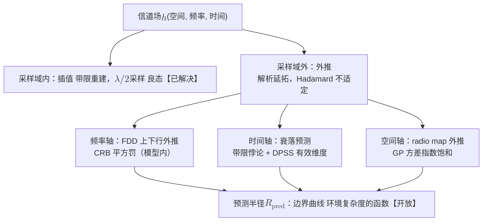

# 8 · 基本问题 I：有效维度与预测半径

前面七章立起了两条箭头：正向的"环境 → 信道"（[第 5 章](05-deterministic-revival.md)）与逆向的"信道 → 环境"（[第 6 章](06-inverse-problem.md)），再加上把二者工程化的地图学（[第 7 章](07-channel-cartography.md)）。但这三章其实都默认了两件没有被追问的事。

- 第一，环境的信息里究竟有多大比例真正进入了信道。如果绝大部分环境细节对信道毫无影响，正逆两条箭头实际工作的空间就比想象中小得多。
- 第二，从有限的信道观测出发，信道场能外推到多远。如果答案是"几乎不能"，那么一切"预测式"的信道知识系统都有一条不可逾越的边界。

本章把这两件事提炼成本部的前两个基本问题：**Q1 有效维度**与 **Q2 预测半径**。两个问题各自走"物理直觉 → 证据链 → 精确形式化 → 猜想"的路线，并对每个论断诚实标注其状态。

!!! note "本章预备知识"
    需要：线性代数（奇异值）、复变函数的基本概念（解析函数）、高斯随机变量的条件分布。用到的内容：

    - 矩阵的奇异值分解：[预备篇 5.4](../part0/05-mimo.md#54-mimo-信道矩阵与-svd把矩阵信道拆成并行子信道)。本章的灵敏度算子奇异值是它的推广。
    - 克拉美–罗界：[预备篇 9.4](../part0/09-new-landscape.md#94-isac-通感一体化一段波形两种任务)；高斯条件分布（高斯过程回归的后验方差）：[预备篇 4.10](../part0/04-information-theory-basics.md#410-条件期望与高斯估计后文最常用的三件工具)。
    - 空间带限、自由度与 Landau 相变：[第 4 章](04-spatial-structure.md)；可微射线追踪：[第 5 章](05-deterministic-revival.md)。
    - 反问题的对数稳定性与倏逝波：[第 6 章](06-inverse-problem.md)；radio map 的采样与插值：[第 7 章](07-channel-cartography.md)。
    - 两常数定理与调和测度：预备篇没有讲，定理 8.1 处就地给出陈述。

## 8.1 一间会议室值多少比特 {#一间会议室值多少比特}

先做一道数量级算术。一间 8 m × 5 m × 3 m 的会议室，工作频率 3.5 GHz，波长 $\lambda \approx 8.6$ cm。要写下这间房间的完整电磁描述，需要记录每件家具的几何轮廓、介电常数，以及每面墙的粗糙度与含水率。

按 $\lambda/10$ 的空间分辨率体素化，需要约 $120\,\mathrm{m}^3 / (8.6\,\mathrm{mm})^3 \approx 1.9\times 10^{8}$ 个体素。每个体素要记录复介电常数，占若干字节（例如实部、虚部各一个 32 位浮点数，共 8 字节）。总量约 $1.5\times10^{9}$ 字节，即 $10^{10}$ bit 量级，一两个 GB。

而一条链路看到的是什么？一个 64 天线、1000 子载波的 CSI 快照，约 $64\times 1000$ 个复数。每个复数按 64 bit 记（实部、虚部各一个 32 位浮点数），原始观测就是 $64\times1000\times64\approx4\times 10^6$ bit，已经比环境描述少了三个数量级。

第三级压缩还要大得多。Channel Charting 的实证发现 [1]：把成千上万个这样的高维 CSI 快照放进一个几千维的空间里，它们并不散布填满，而是聚在一个**内在维度约 2–3 的低维流形**附近，流形的参数恰好是用户的物理位置。

三级压缩合起来是这样一串量级：

$$
10^{10} \to 10^6 \to 10^{0.5}
$$

这串箭头只示意压缩的量级。前两项是比特数，末项是维数，$10^{0.5}\approx3$ 对应内在维度 2–3 的量级。

信道是环境经过**波动方程**与**观测孔径**双重压缩后得到的**有损投影**，它不是环境的忠实副本。Q1 问的就是：这个投影的像，维度到底是多少？哪些环境信息被投影核（null space）吞掉了？

!!! tip "直觉：信道是环境的商空间"
    [第 1 章](01-lie-of-randomness.md)说"随机衰落是认识论的权宜"，本章给出它的几何版本。

    信道观测把环境空间按"不可分辨"的关系分成等价类。把每个等价类粘成一个点，得到的空间叫商空间。我们叫作"随机性"的东西，很大程度上是对**等价类内部差异**的放弃。

    有效维度回答"商空间有多大"。预测半径回答"在商空间里已知一片区域后，能推知多大的邻域"。

## 8.2 证据链：信道为什么远比环境"小" {#证据链信道为什么远比环境小}

"信道低维"不是一句口号，它有三层彼此独立、由浅入深的证据。

**第一层：稀疏性（参数化视角）【已解决】。** Saleh–Valenzuela 在 1987 年就发现室内多径以"簇"的形式出现（IEEE JSAC 1987）。后经 Sayeed 的虚拟信道表征，到 Bajwa 等人的《Compressed Channel Sensing》[3]，这成了标准范式：$N$ 维信道向量在角度–时延字典下实际由 $S \ll N$ 个显著系数决定，训练开销可以从 $O(N)$ 压到 $O(S \log N)$。

一条路径约贡献 4 个实参数（复增益 2、时延 1、角度 1，宽带情形再加 Doppler），$S$ 条路径也就是 $\sim 4S$ 个实数，远小于 $2N$。

**第二层：流形性（几何视角）【已解决（实证）】。** Channel Charting [1] 及其教程化总结 [2] 表明：固定环境、移动终端时，CSI 样本聚集在低维流形附近，无监督降维就能从纯 CSI 恢复用户运动轨迹的拓扑结构。这是"信道 $\approx$ 环境位置的低维连续函数"最直接的实验证据。它不依赖任何射线模型假设，纯从数据几何读出来。

**第三层：物理必然性（波动方程视角）【已解决】。** 前两层可能被质疑为"恰好这些场景稀疏/低维"，第三层回答这个质疑。Bucci 与 Franceschetti 证明，半径 $a$ 内的源或散射体产生的场是空间**准带限**的，有效空间带宽 $\sim ka$（$k = 2\pi/\lambda$）。因此任何有限观测域上的场，自由度有限，约为电尺寸量级。

这是[第 4 章](04-spatial-structure.md)空间自由度（DoF）定理的经典源头，常数细节见该章，此处只用其结论：无论环境多复杂，信道观测的秩存在一个由电尺寸决定的物理上界。

!!! note "备注：稀疏 ≠ 低内在维度"
    第一层与第二层说的不是同一件事，混写会出错。

    - **稀疏**是特定字典下的参数计数：$S$ 条路径给出 $\sim 4S$ 个实参数，$S$ 可以是几十。
    - **流形内在维度**是几何概念：CC 观测到的 $2$–$3$ 维，对应"环境冻结、只有位置在变"时像集的维度，它是完整观测像的一个低维切片。

    二者相关（稀疏参数是位置的光滑函数，所以切片低维），但不相等。本章 Q1 的 $d_{\mathrm{eff}}$ 指的是**环境整体可变**时的像维度，比 2–3 大得多，但仍被 DoF 上界压住。

## 8.3 Q1 的形式化：有效维度与环境等价类 {#q1-的形式化有效维度与环境等价类}

### 8.3.1 观测算子与有效维度的定义

现在把直觉变成算子语言。设 $\mathcal{E}$ 为环境状态空间，即所有几何、材质、姿态配置的集合。严格说它是无穷维函数空间，其"维度"要在 $\varepsilon$-熵或有限参数化的意义下理解。下文的线性化秩语言，就是这种理解的严格化。

给定收发配置，正向映射（[第 5 章](05-deterministic-revival.md)）与观测装置共同定义**观测算子** (observation operator)：

$$
\Phi: \mathcal{E} \to \mathbb{C}^{N}, \qquad \mathbf{h} = \Phi(E) + \mathbf{n},
$$

其中 $N$ 为天线 × 子载波 × 快照的观测总数，$\mathbf{n}$ 为噪声。在工作点 $E$ 处线性化，得 Fréchet 导数 $\mathrm{D}\Phi[E]$（Born 近似意义下的灵敏度算子）。

Fréchet 导数是雅可比矩阵在函数空间上的推广，线性算子 $\mathrm{D}\Phi[E]$ 满足

$$
\Phi(E+\delta E)\approx\Phi(E)+\mathrm{D}\Phi[E]\,\delta E
$$

Born 近似（只保留一次散射，见[第 6 章](06-inverse-problem.md)）就是这种线性化。

这里有一个陷阱，不处理的话定义会自相矛盾。不能把有效维度定义成"环境维数减去核的维数"，理由有两条：

- $\mathcal{E}$ 是无穷维的，秩–零化度定理根本不适用。
- 更致命的是，[第 6 章](06-inverse-problem.md)的 Sylvester–Uhlmann 唯一性定理说，完备数据下 $\Phi$ 是单射。通用情形核是平凡的，这样定义出来的"有效维度"立刻发散到无穷，与本章的全部直觉正面冲突。

出路是把**噪声写进定义**。唯一性说的是"无限精度下可分辨"，而工程只关心"在噪底之上可分辨"。两者的差距，正是本章要度量的东西。

设 $\sigma_1 \ge \sigma_2 \ge \cdots$ 为 $\mathrm{D}\Phi[E]$ 的奇异值。与矩阵的 SVD（[预备篇 5.4](../part0/05-mimo.md)）相同，沿第 $j$ 个奇异方向改动单位大小的环境，$\mathbf{h}$ 改变 $\sigma_j$。

这里的 $\varepsilon$ 是相对噪声水平，即观测动态范围的倒数，按幅度计，60 dB 对应 $\varepsilon=10^{-3}$。本章的 $\varepsilon$ 全用这一口径，见 Q2 形式化一节的约定框。在噪声水平 $\varepsilon$ 下，定义**有效维度** (effective dimension) 为 $\varepsilon$-秩：

$$
d_{\mathrm{eff}}(E;\varepsilon) := \#\left\{\, j \;:\; \sigma_j\big(\mathrm{D}\Phi[E]\big) > \varepsilon\,\sigma_1 \,\right\}.
$$

**小例子**

设奇异值依次为 $1,\ 0.2,\ 0.03,\ 4\times10^{-4},\ 10^{-6}$。

- 60 dB 观测（$\varepsilon=10^{-3}$）的门槛是 $10^{-3}$，前三个过线，$d_{\mathrm{eff}}=3$。
- 提到 120 dB（$\varepsilon=10^{-6}$），只多捞回 $4\times10^{-4}$ 这一个方向，$d_{\mathrm{eff}}=4$。$10^{-6}$ 等于门槛，按严格大于号不计入。

### 8.3.2 数值核与环境等价类

**物理意义**

- 奇异值低于 $\varepsilon\sigma_1$ 的那些方向构成**数值核**。沿这些方向改动环境（挪动被完全遮死的柜子、改变亚波长粗糙度），$\mathbf{h}$ 的变化被噪声吞掉。
- $d_{\mathrm{eff}}$ 数的是剩下的方向，也就是环境自由度中真正被信道"感知"的那部分。

两个环境若只差数值核方向的扰动，则对这条链路在给定噪声水平下不可分辨。由此得到**环境等价类** (environment equivalence class) 的提法：

$$
[E]_\varepsilon := \{E' : \lVert\Phi(E')-\Phi(E)\rVert \le \varepsilon\}
$$

通信只关心这个商，不关心 $\mathcal{E}$ 本身。"环境等价类"为本站原创提法。

**关于这个定义的几点说明**

- 它是**数值纤维**，即像落在 $\Phi(E)$ 的 $\varepsilon$ 邻域内的全部原像。
- 小扰动下它近似为 $\{E+\delta E:\lVert\mathrm{D}\Phi[E]\,\delta E\rVert\le\varepsilon\}$：沿第 $j$ 个奇异方向只能走约 $\varepsilon/\sigma_j$，沿数值核方向可以走很远。扰动一大，线性化失效，两者就不再一致。
- 严格说，"距离不超过 $\varepsilon$"没有传递性（$E_1$ 近 $E_2$、$E_2$ 近 $E_3$，不保证 $E_1$ 近 $E_3$），所以它不是数学意义上的等价关系，"等价类"是借用的叫法。
- 这里的 $\varepsilon$ 与 $d_{\mathrm{eff}}$ 定义里的 $\varepsilon\sigma_1$ 同一口径，只差一个归一化常数。

!!! success "关键结论：唯一性与有限维度不矛盾，它们说的是同一件事的两面"
    - 第 6 章：无限精度下环境**唯一确定**（$\Phi$ 单射）。
    - 本章：有限精度下环境只有 $d_{\mathrm{eff}}(E;\varepsilon)$ 个方向**可分辨**。

    两句话能共存，靠的是第 6 章的对数稳定性：奇异值以指数速率塌向零，于是"唯一但不稳定"在数值上就等于"有效维度有限"。$\varepsilon$ 写进定义不是技术上的妥协，它把这两个结论接在了一起。

    举例：设 $\sigma_j=2^{-(j-1)}\sigma_1$。每个 $\sigma_j$ 都大于零，没有真正的核，这是"唯一"。

    但 $\varepsilon=10^{-3}$ 时只有 10 个过线，$\varepsilon=10^{-6}$ 时也只有 20 个，$d_{\mathrm{eff}}\approx\log_2(1/\varepsilon)$，这是"有限"。真实 $\mathrm{D}\Phi$ 的奇异值为何指数塌缩，见[第 6 章](06-inverse-problem.md)的 Mandache 指数不稳定性。

### 8.3.3 孔径、频率、带宽与亚波长细节

**行为分析**

三个旋钮如何影响 $d_{\mathrm{eff}}$：

- **孔径增大**，数值核收缩。更大的阵列从更多角度"看"环境，此前简并的扰动变得可分辨。但由[第 4 章](04-spatial-structure.md)，秩至多涨到 DoF 上界 $\sim (ka)^{d-1}$，再加天线只是过采样。这里 $d$ 为观测流形维数加一：沿一条观测曲线看是 $\sim 2ka$，在包围散射体的观测曲面上看是 $\sim (ka)^2$。
- **频率升高**，$k$ 增大，可见细节变细。尺度小于 $\lambda/2$ 的结构对远场近乎不可见（见下面算例），所以毫米波"看见"的环境维度天然高于 sub-6G。这也解释了为什么高频信道对环境细节更敏感、更难用粗糙地图预测。
- **带宽与快照数**增大 $N$，但 $d_{\mathrm{eff}} \le \min\{N, N_{\mathrm{DoF}}\}$。观测数超过物理 DoF 后，多出的观测只是同一低维像的冗余坐标。

```mermaid
flowchart TB
    E["环境空间 $$\mathcal{E}$$<br/>几何 + 材质 + 姿态<br/>约 $$10^{9}$$–$$10^{10}$$ bit"] -->|"第一重压缩：波动方程<br/>空间准带限，$$\mathrm{DoF} \lesssim 2ka$$"| W["可传播场<br/>约 $$10^3$$ 复自由度"]
    W -->|"第二重压缩：孔径/带宽<br/>有限天线、有限频带"| H["CSI 观测 $$\in \mathbb{C}^N$$"]
    E -.->|"$$\ker D\Phi$$：亚波长粗糙度、<br/>被遮蔽区域、深阴影细节"| Z["环境等价类 $$[E]$$<br/>对通信不可分辨"]
```

!!! example "算例：亚波长粗糙度为什么落进核里"
    设墙面有一个横向空间频率为 $\kappa$ 的起伏扰动。按平面波展开，它把入射波耦合到横向波数 $\approx \kappa$ 的散射阶。正入射时恰为 $\kappa$。本例 $\kappa>2k$，斜入射平移 $k\sin\theta$ 后仍大于 $k$。

    该阶的法向波数 $k_z=\sqrt{k^2-\kappa^2}$ 在 $\kappa > k$ 时是纯虚数，$e^{\mathrm{j}k_z d}$ 变成指数衰减，这就是倏逝波。推导同[第 4 章](04-spatial-structure.md)定理 4.1 后的行为分析，只是那里 $\kappa$ 是波数、$\gamma$ 是法向波数，与此处记号不同。

    离墙距离 $d$ 处的幅度衰减为

    $$
    \exp\left(-\sqrt{\kappa^2 - k^2}\, d\right).
    $$

    这里的 $d$ 是距离，不是 $(ka)^{d-1}$ 里的维数。

    代入数字：$f = 3.5$ GHz（$k \approx 73\ \mathrm{rad/m}$），起伏空间周期 2 cm（$\kappa \approx 314\ \mathrm{rad/m}$），则 $\sqrt{\kappa^2-k^2} \approx 305\ \mathrm{m}^{-1}$。在 $d = 5$ cm 处衰减已达 $e^{-15.3} \approx 2\times 10^{-7}$，远低于任何实际噪底。

    于是"2 cm 周期的墙面纹理"这一整族环境参数，在数值意义上整体落入 $\ker \mathrm{D}\Phi$：环境描述里的海量高频细节，信道一个比特都收不到。这就是开篇第一级压缩（$10^{10}$ bit 的环境描述里只有一小部分能进入信道）的微观机制。

### 8.3.4 有效维度猜想与 DoF 数字

于是 Q1 获得双侧工具：

- **上界**来自[第 4 章](04-spatial-structure.md)的 DoF 定理（$\operatorname{rank}\mathrm{D}\Phi \le N_{\mathrm{DoF}}$，物理硬上限）。
- **下界**来自[第 6 章](06-inverse-problem.md)的可辨识性分析：构造性地展示哪些环境参数族可以从 $\mathbf{h}$ 稳定恢复，即证明它们在 $\ker$ 之外。

夹在中间的，是本章的第一个猜想：

!!! abstract "猜想 8.1（有效维度猜想）【开放·本站原创】"
    对通用位置的环境 $E$ 与充分孔径的观测配置，有效维度与观测域的电尺寸同阶：

    $$
    d_{\mathrm{eff}}(E;\varepsilon) = \Theta\big((ka)^{d-1}\big),
    $$

    其中 $d-1$ 由**观测几何**决定：

    - 沿一条观测曲线，$d=2$，给 $\Theta(ka)$。
    - 在包围散射体的观测曲面上，$d=3$，给 $\Theta\big((ka)^2\big)$。

    该阶数对工程动态范围 $\varepsilon\in[10^{-6},10^{-3}]$ 一致成立。

    进一步断言 $d_{\mathrm{eff}} \ll$ 环境描述复杂度（体素计数意义）：波动方程压缩是主要的，孔径压缩只在孔径不足时才是瓶颈。

    上界方向由 DoF 定理保证【已解决】。下界方向（"通用环境下 $\varepsilon$-秩确实达到电尺寸量级"）截至 2026-08 无定理，是[第 6 章](06-inverse-problem.md)可辨识性纲领要攻的目标。

!!! warning "陷阱：报 DoF 数字必须同时报观测几何"
    同一间房间会给出相差百倍的数。$a=5$ m、$\lambda=8.6$ cm（3.5 GHz）时 $ka\approx365$：

    - 沿一条观测弧线是 $2ka\approx730$。
    - 在包围它的观测曲面上是 $(ka)^2\approx1.3\times10^5$，这也是[第 6 章](06-inverse-problem.md)"信道携带环境信息的硬上界"一节用的口径。

    两个数都对，对应的是不同的观测流形。引用时不写几何就是错的。

**对照算例（统一到曲面观测口径）**

会议室 $a = 5$ m、3.5 GHz，$d_{\mathrm{eff}}\sim(ka)^2\approx1.3\times10^5$。同一间房间按 $\lambda/10$ 体素化需要约 $1.9\times10^8$ 个环境参数（本章开篇的数字）。所以有效维度比环境描述复杂度低约三个数量级。

而 Channel Charting 观测到的"位置切片 2–3 维"，又比有效维度低四到五个数量级。

三个数字各居其位：描述复杂度 $\gg$ 有效维度 $\gg$ 单链路切片维度。注意三者的量纲：前者是参数个数，后两者是维数，不宜与"多少比特"混写。

## 8.4 插值与外推：一步之遥的数学相变 {#插值与外推一步之遥的数学相变}

Q2 从一个看似平淡的事实出发：信道预测问题在"采样区域内"和"采样区域外"，数学性质完全不同，虽然物理上只差一步。

**域内：插值，良态，【已解决】。** [第 4 章](04-spatial-structure.md)已证：无源区域内的场在空间上准带限于 $\lvert \mathbf{k} \rvert \le 2\pi/\lambda$（倏逝分量指数衰减出不了近场）。因此在以 $\lambda/2$ 密度采过样的区域内部重建场，是经典的带限信号插值。Nyquist–Landau 理论完整覆盖，误差被噪声水平线性控制，稳定、可靠、无惊喜。

**域外：外推 = 解析延拓，不适定。** Helmholtz 方程的解在无源区域是实解析函数，因此采样域外的场由域内的值**唯一确定**，唯一性没有任何问题。

问题出在稳定性。从带误差的局部数据延拓解析函数，是 Hadamard 意义下的经典不适定问题。Hadamard 要求适定 (well-posed) 问题的解存在、唯一、且连续依赖于数据。对精确数据，解析延拓满足前两条，败在第三条：误差随延拓深度**指数放大**。

唯一但不稳定，是逆问题理论里最容易误导人的组合，因为它给人"原则上可以"的幻觉。

!!! warning "陷阱：不要用'精度连续退化'糊弄这个相变"
    常见的含糊说法是"离采样点越远精度越差"。这个说法在量级上就错了：

    - 域内误差 $\sim \varepsilon$（噪声水平，与位置基本无关）。
    - 域外误差 $\sim \varepsilon^{\alpha(r)}$，$\alpha$ 随距离衰减到 0。

    从"线性受控"到"指数失控"是**相变**，不是渐变。一切把插值成功经验（radio map 在采样网格内很准）外推为"预测也行"的论证，都死在这一步。

## 8.5 指数病态的骨架：从两常数定理到稳定外推 {#指数病态的骨架从两常数定理到稳定外推}

外推的病态不是经验现象，它有百年的定量数学。这套数学在数值分析界是常识，在通信文献里却几乎无人引用。本节把它搬进来，作为 Q2 的地基。

定理 8.1 回答的是：两个候选延拓都与数据吻合到 $\varepsilon$ 以内、且都不超过先验上界 $M$，它们在远处一点 $z$ 最多差多少？$M$ 在本章还表示定理 8.2 的多项式次数和时间轴一节的窗口长度。

### 8.5.1 两常数定理

!!! abstract "定理 8.1（两常数定理，Nevanlinna–Ostrowski 学派，经典）【已解决】"
    设 $f$ 在域 $\Omega$ 内解析且 $\lvert f \rvert \le M$，在边界子集 $\Gamma \subset \partial\Omega$ 上 $\lvert f \rvert \le \varepsilon$。则对 $z \in \Omega$：

    $$
    \lvert f(z) \rvert \le \varepsilon^{\omega(z)}\, M^{1-\omega(z)},
    $$

    其中 $\omega(z) = \omega(z; \Gamma, \Omega) \in [0,1]$ 为 $\Gamma$ 相对 $\Omega$ 的调和测度。现代定量处理见 Trefethen [10]。调和测度的具体写法随文献约定略有差异。

推导只需五步，值得写全，因为每一步都有物理对应：

1. 令 $u(z) := \ln \lvert f(z) \rvert$。$f$ 解析 $\Rightarrow$ $u$ 次调和（subharmonic）：在 $f\ne0$ 处 $u=\operatorname{Re}\log f$ 调和，在零点 $u=-\infty$ 只会更小。次调和函数在区域内的值不超过它在边界上的最大值（极值原理）。
2. 边界条件：在数据集 $\Gamma$ 上 $u \le \ln\varepsilon$；在其余边界上 $u \le \ln M$。
3. 令 $\omega(z)$ 为 Dirichlet 问题的解：在 $\Omega$ 内调和，边值在 $\Gamma$ 上为 1、其余为 0。这就是调和测度，可读作"从 $z$ 出发的布朗运动首次击中边界时落在 $\Gamma$ 上的概率"。
4. 构造调和强函数 $v(z) := \omega(z)\ln\varepsilon + (1-\omega(z))\ln M$，其边值逐点 $\ge u$ 的边值（$\Gamma$ 上 $v=\ln\varepsilon$，其余边界上 $v=\ln M$）。$v$ 调和，故 $u-v$ 次调和且边界上 $\le 0$。由极值原理，$\Omega$ 内处处 $u \le v$。
5. 两边取指数即得结论。把定理用于两个候选延拓之差 $f_1 - f_2$（它们在数据上相差 $\le 2\varepsilon$），就得到延拓误差的先验界。

**物理意义**

把 $D_0 := \log_{10}(M/\varepsilon)$ 读作数据的有效数字位数（60 dB 观测信噪比 $\approx$ 3 位有效数字）。则定理说，延拓到 $z$ 点时只剩 $\omega(z)\, D_0$ 位。定理两边除以 $M$，相对误差满足

$$
\lvert f(z)\rvert/M \le (\varepsilon/M)^{\omega(z)} = 10^{-\omega(z) D_0}
$$

$\omega(z)$ 是一个纯几何量，它只依赖数据区域相对整个解析域的位形，与算法无关。任何算法、任何深度网络，都不能比这个界做得更好。这是信息的界，与方法无关。

**行为分析**

- $z$ 紧贴 $\Gamma$ 时 $\omega \to 1$，全部数字保留（回到插值情形）。
- $z$ 深入域外时 $\omega \to 0$，有效数字清零。
- 数据占边界比例越大、延拓点越"被数据包围"，$\omega$ 越大。这解释了为什么**双侧外推**（内插补洞）远比**单侧外推**（往外走）稳定。

60 dB 的数据在 $\omega = 1/3$ 处只剩 1 位有效数字。指数病态的含义是：每深入一步，有效数字就按比例蒸发，多花点算力补不回来。

### 8.5.2 解析函数的稳定外推

两常数定理给的是抽象几何界。Demanet 与 Townsend 把它做成了可操作的算法版本，并回答了"最优能到多少"：

!!! abstract "定理 8.2（解析函数的稳定外推，Demanet–Townsend 2019 [9]）【已解决】"
    设 $f$ 在参数 $\rho > 1$ 的 Bernstein 椭圆 $\mathcal{B}_\rho$（焦点 $\pm 1$、半轴和为 $\rho$ 的椭圆）内解析有界，样本取自 $[-1,1]$ 上 $N$ 点等距网格、扰动水平 $\varepsilon$。则最小二乘多项式外推元 $e(x)$ 满足，对 $x \in [1, (\rho+\rho^{-1})/2)$：

    $$
    \lvert f(x) - e(x) \rvert = O\!\left(\varepsilon^{\alpha(x)}\right), \qquad \alpha(x) = 1 - \frac{\ln\left(x + \sqrt{x^2-1}\right)}{\ln \rho},
    $$

    且稳定性要求多项式次数 $M \lesssim \sqrt{N}/2$（过采样条件）。最优次数的显式表达式见原文。

$\alpha(x)$ 从哪来？四步推导给出全部直觉。先交代记号：

- $T_n$ 是 Chebyshev 多项式，$T_n(\cos\theta)=\cos n\theta$，在 $[-1,1]$ 上幅度不超过 1。
- 记 $B(x) := x + \sqrt{x^2-1}$（$x$ 点的 Bernstein 半径）。它满足 $\tfrac12\big(B+B^{-1}\big)=x$，即参数为 $B(x)$ 的 Bernstein 椭圆恰好穿过 $x$，所以 $x$ 越过 $(\rho+\rho^{-1})/2$ 等价于 $B(x)>\rho$。
- 在 $x>1$ 处 $T_n(x)=\tfrac12\big(B^n+B^{-n}\big)$，这就是下面步骤 (ii) 的来源。

四步如下：

$$
\begin{aligned}
&\text{(i) 解析性给系数衰减：} && f = \sum_n a_n T_n, \quad \lvert a_n \rvert \lesssim \rho^{-n};\\[2pt]
&\text{(ii) 外推点上基函数爆长：} && \lvert T_n(x) \rvert \sim B(x)^{n}, \quad x > 1;\\[2pt]
&\text{(iii) 截断到次数 } M \text{ 的两项误差：} && \underbrace{\left(B(x)/\rho\right)^{M}}_{\mathrm{截断}} + \underbrace{\varepsilon\, B(x)^{M}}_{\mathrm{噪声放大}};\\[2pt]
&\text{(iv) 令两项平衡，取 } M^\ast \approx \frac{\ln(1/\varepsilon)}{\ln\rho}: && \varepsilon\, B(x)^{M^\ast} = \varepsilon^{\,1 - \ln B(x)/\ln\rho} = \varepsilon^{\alpha(x)}.
\end{aligned}
$$

**步骤 (iii)(iv) 展开**

- 截断误差是尾巴 $\sum_{n>M}\lvert a_n T_n(x)\rvert\lesssim\sum_{n>M}(B/\rho)^n$，$B<\rho$ 时由首项 $(B/\rho)^M$ 主导。
- 噪声项是每个拟合系数约 $\varepsilon$ 的误差被 $\lvert T_M(x)\rvert\sim B^M$ 放大。

前者随 $M$ 减、后者随 $M$ 增，令两者相等得 $\rho^{-M}=\varepsilon$，解出的正是 $M^\ast$。代回 $B^{M^\ast}=\varepsilon^{-\ln B/\ln\rho}$，两项都等于 $\varepsilon^{1-\ln B/\ln\rho}$（略去常数因子）。

**物理意义**

这是两常数定理的显式化：$\alpha(x)$ 就是这个几何位形下的调和测度。

更重要的是参数 $\rho$ 的身份：解析域的大小。对信道场而言，解析延拓的奇点由真实的源与散射体贡献。环境越杂乱、散射体离采样域越近，$\rho$ 越小，$\alpha$ 衰减越快。$\rho$ 是"环境复杂度"的数学化身，这是本章后面把预测半径写成环境复杂度函数的依据。

**行为分析**

代入数字感受一下这堵墙的坡度。取 $\rho = 2$（解析域边缘在 $x = (\rho+\rho^{-1})/2 = 1.25$）：

- 在 $x = 1$（采样域边界）$\alpha = 1$，全精度。
- 在 $x \approx 1.06$ 处 $B(x) = \sqrt{2}$，$\alpha = 1/2$。只往外走了采样域长度的 3%，有效数字已经蒸发一半。
- 到 $x = 1.25$，$\alpha = 0$，一位也不剩。

60 dB 数据（$\varepsilon = 10^{-3}$）在 $x = 1.06$ 处只剩 $10^{-1.5}$ 的精度。还要注意过采样条件 $M \lesssim \sqrt{N}/2$：样本加密只能按 $\sqrt{N}$ 换取多项式次数，数据量的收益也被开方压制。

## 8.6 三条外推轴：频率、时间、空间 {#三条外推轴频率时间空间}

信道预测在文献里沿三条轴分别发展，彼此很少互引。放进上一节的坐标系里看，三条轴讲的是同一个故事。



### 8.6.1 频率轴：平方罚与指数罚的缝合 {#频率轴平方罚与指数罚的缝合}

FDD 系统想从上行频段的测量推断下行信道（频偏 $\Delta f$），这是频率轴外推。Rottenberg 等人给出了镜面多径、路径良好分离模型下的 Cramér–Rao 下界 (CRB) [4]，并做了消声室实验验证 [5]。CRB 是任何无偏估计器方差的下界，见[预备篇 9.4](../part0/09-new-landscape.md)"感知这一侧怎么度量"。外推 MSE 满足

$$
\mathrm{MSE}_{\mathrm{extra}} \;\propto\; \frac{1}{N_{\mathrm{rx}}}\left(1 + c\,\frac{\Delta f^2}{W_{\mathrm{train}}^2}\right),
$$

即外推罚随（频偏/训练带宽）的平方增长，随接收天线数反比下降。

推导骨架分三步：

- (i) 稀疏模型下 $h(f) = \sum_s a_s e^{-\mathrm{j}2\pi f \tau_s}$，外推就是把每条路径的相位斜率 $\tau_s$ 延长到 $\Delta f$ 之外。
- (ii) 带宽 $W$ 内估计 $\tau_s$ 的误差 $\sigma_\tau \propto 1/(W\sqrt{\mathrm{SNR}})$。
- (iii) 外推相位误差 $2\pi \Delta f\, \sigma_\tau$ 进入 MSE，即得平方律。

第 (iii) 步的细节如下。以训练带中心为参考频率，初相误差与时延误差不相关，$\Delta f$ 处相位误差方差为 $\sigma_\phi^2+(2\pi\Delta f)^2\sigma_\tau^2$。又 $\sigma_\phi^2\propto1/\mathrm{SNR}$、$\sigma_\tau^2\propto1/(W^2\mathrm{SNR})$，提出 $\sigma_\phi^2$ 即得 $1+c\,\Delta f^2/W^2$。

等一下。上一节刚证明外推是**指数**病态，这里怎么变成温和的**平方**罚了？这并不矛盾，下面这个结构是本章最想让读者看清的：

!!! success "关键结论：先验信息的价值以'病态阶数'计【本站原创视角】"
    解析延拓的指数病态是**非参数**结论：不知道 $f$ 除解析性外的任何结构。而 CRB 的平方罚是**模型内**结论：假定信道恰由 $S$ 条可分离镜面路径生成，无穷维延拓问题被压缩成 $4S$ 个参数的外推，病态从指数阶降到多项式阶。

    代价是模型失配风险。漫散射占比上升、路径不可分离、校准误差存在时，平方律失效，指数律回归。

    通信文献（Rottenberg 系 [4][5]）与数值分析文献（Demanet–Townsend [9]、Trefethen [10]）至今互不引用。把两者放进同一坐标系，是"环境知识值多少 dB"这一汇率问题的入口，[第 9 章](09-exchange-and-universality.md)将把它展开成 Q3。

!!! warning "陷阱：频率轴 CRB 的平方罚是乐观下界"
    引用平方罚时必须带上前提：favorable propagation（稀疏、可分离）+ 精确校准。CRB 是模型内的下界：模型对了它是极限，模型错了它连参考价值都存疑。

    漫散射占比多大时 FDD 外推彻底失效，截至 2026-08 无定量刻画（见开放问题 2）。

工程侧的呼应恰好印证"先验买阶数"：R2-F2（SIGCOMM 2016）、深度学习信道映射的存在性论证 [6]、FIRE 的端到端学习 [7]、HORCRUX 的跨频段预测 [8]。每个系统都在往外推问题里注入结构先验（路径几何、环境统计、训练分布），用先验换取把指数病态压成可工程化的问题。

### 8.6.2 时间轴：带限悖论与有效维度的重逢 {#时间轴带限悖论与有效维度的重逢}

时间轴上有一个必须正面处理的悖论。Kolmogorov–Szegő 预测理论给出平稳过程一步预测的最小误差方差。下式是离散时间形式，归一化常数随傅里叶约定不同：

$$
\sigma_{\min}^{2} = \exp\left\{ \frac{1}{2\pi} \int_{-\pi}^{\pi} \ln S(\omega)\, \mathrm{d}\omega \right\}.
$$

衰落过程的 Doppler 谱是带限的（Jakes 谱支撑于 $\lvert f \rvert \le f_D$）。谱在正测度集合上为零，也就是在总长度不为零的频带上为零。于是 $\ln S = -\infty$，积分发散，$\sigma_{\min}^{2} = 0$。这里的 $\omega$ 是归一化角频率，不是定理 8.1 的调和测度。

结论是：带限过程从无噪的无限过去可以完美预测。理论上信道似乎可以无限预测下去。【已解决，经典】

!!! warning "陷阱：'带限 ⇒ 可完美预测'的正确读法"
    $\sigma_{\min}^2 = 0$ 的前提是无噪声、无限长过去、允许无界预测器三者同时成立。而最优预测器的系数范数发散，对任意小的观测噪声无穷敏感。

    正确表述是：带限衰落是确定性但病态的，噪声把"无限可预测性"压缩为有限预测半径。这与"解析延拓唯一但不稳定"是同一枚硬币：确定性（[第 1 章](01-lie-of-randomness.md)的论题）从来不等于可预测性。

噪声如何压缩？下面做一个初等但很说明问题的计算。这是本站推演，不是文献定理，分带近似要求带内 $S \gg \eta$。给谱加噪底 $\eta$，记归一化带宽 $\beta := f_D / f_{\mathrm{Nyq}}$，则

$$
\sigma_{\min}^{2}(\eta) = \exp\left\{ \frac{1}{2\pi}\int_{\mathrm{带内}} \ln (S+\eta) + \frac{1}{2\pi}\int_{\mathrm{带外}} \ln \eta \right\} \approx C \cdot \eta^{\,1-\beta}.
$$

中间的约等号这样得到：

- $\omega\in[-\pi,\pi]$ 对应 $[-f_{\mathrm{Nyq}},f_{\mathrm{Nyq}}]$（$f_{\mathrm{Nyq}}$ 为采样率之半），Doppler 带占其中比例 $\beta$。
- 带外积分 $\frac{1}{2\pi}\cdot2\pi(1-\beta)\ln\eta$ 取指数得 $\eta^{1-\beta}$。
- 带内 $\ln(S+\eta)\approx\ln S$ 与 $\eta$ 无关，并入 $C$。

两边都是功率量，换成幅度口径同时开方，指数 $1-\beta$ 不变。

**物理意义**

预测误差随噪底按幂律 $\eta^{1-\beta}$ 缩放，又是 $\varepsilon^{\alpha}$ 的形态。慢变信道（$\beta \ll 1$）保留几乎全部有效数字，快变信道（$\beta \to 1$）一位也不剩。三条轴上病态的签名函数是同一个。

**行为分析与有效维度的重逢**

时间轴的"Q1"由 Slepian 理论给出：长度 $M$、归一化最大 Doppler $\nu_D$ 的信道快照，其本质维度 $\approx 2\nu_D M + 1$（$\nu_D=f_D T_s$）。

离散长球序列 (DPSS) 是长度为 $M$ 的序列中能量最集中于频带 $[-\nu_D,\nu_D]$ 的一组正交基。其集中度（prolate 特征值）在第 $2\nu_D M+1$ 个附近从接近 1 陡降到接近 0，这就是 Q1 的 $\varepsilon$-秩在时间轴上的样子。Zemen–Mecklenbräuker 把它做成了实用信道估计器 [11]。

代入数字：$f_D = 50$ Hz（3.5 GHz 载频、约 15 km/h）、$T_s = 1$ ms（$\nu_D=0.05$）、$M = 100$ 的窗口，本质维度 $\approx 2 \times 0.05 \times 100 + 1 = 11 \ll 100$，观测被压缩九倍。这是 Q1 在时间轴的严格版本。因为维度低，窗口内插值极准，窗口外外推极险。

经验数据与此一致：长程衰落预测的可靠范围通常只有**零点几个波长**的移动距离（Duel-Hallen 等 [12]），具体数字随场景与 SNR 变化。MIMO 预测的性能界由 Svantesson–Swindlehurst 给出 [13]。

### 8.6.3 空间轴：相关长度设定信息半径 {#空间轴相关长度设定信息半径}

空间轴上最干净的定量工具是高斯过程（GP）回归。把信道场（如 dB 域的阴影衰落）看成高斯随机场，协方差由核函数 $k(\mathbf{x},\mathbf{x}')$ 给定（此 $k$ 不是波数）。测量后用高斯条件分布（[预备篇 4.10](../part0/04-information-theory-basics.md)）求后验。

其中 $\mathbf{k}_\ast$ 是待测点与各测量点的协方差向量，$\mathbf{K}$ 是测量点之间的协方差矩阵。后验方差为

$$
\sigma^{2}(\mathbf{x}_\ast) = k(\mathbf{x}_\ast, \mathbf{x}_\ast) - \mathbf{k}_\ast^{\mathsf{T}} \left( \mathbf{K} + \sigma_n^2 \mathbf{I} \right)^{-1} \mathbf{k}_\ast.
$$

下面看单测量点的玩具情形。设阴影衰落服从 Gudmundson 指数相关模型 $R(d) = \sigma^2 e^{-d/d_c}$（Electron. Lett. 1991），在 $\mathbf{x}_0$ 处有一次含噪测量，信噪比 $\gamma = \sigma^2/\sigma_n^2$。

**第一步：写出协方差。** $\mathbf{k}_\ast = \sigma^2 e^{-d/d_c}$，$\mathbf{K} = \sigma^2$。

**第二步：代入后验方差公式。** 得

$$
\sigma^{2}(\mathbf{x}_\ast) = \sigma^{2}\left[ 1 - \frac{e^{-2d/d_c}}{1 + \gamma^{-1}} \right];
$$

**第三步：读数。**

- $d = 0$ 时方差压到 $\approx \sigma^2/(1+\gamma)$（噪声限）。
- $d = d_c$ 时测量只消去 $e^{-2} \approx 13.5\%$ 的不确定性。
- $d = 3 d_c$ 时只能消去约 $e^{-6}\approx 0.25\%$，后验退回先验，测量等于没做。

以上结果属于【已解决，教科书级（Rasmussen–Williams 2006）】。

**物理意义与行为分析**

空间外推的信息半径由**环境自相关长度** $d_c$ 设定，而 $d_c$ 物理上正比于遮挡物的尺寸：城市宏蜂窝几十米，室内几米。

这是"预测半径是环境的函数、不是算法的函数"在空间轴上最直白的体现。换任何回归器，只要环境相关结构如此，超出 $\sim d_c$ 的外推就只能输出先验。[第 7 章](07-channel-cartography.md)的 radio map / CKM 之所以强调采样密度而非模型花样，根源在此 [14]。

下表把三条外推轴放在一起对照。

**三条外推轴一览**

| 外推轴 | 典型场景 | 工具与先验 | 病态的签名 | 本章读数 |
|---|---|---|---|---|
| 频率 | FDD 由上行推下行（频偏 $\Delta f$） | 稀疏、可分离的镜面多径模型下的 CRB [4][5] | 外推 MSE 按 $(\Delta f/W_{\mathrm{train}})^2$ 增长：平方罚，是模型内的乐观下界 | 结构先验把指数病态压成多项式阶；漫散射增多、路径不可分离时指数律回归 |
| 时间 | 衰落预测 | Kolmogorov–Szegő 预测理论；Slepian 与 DPSS 基 | 无噪时带限过程可完美预测；加噪底 $\eta$ 后误差 $\propto\eta^{1-\beta}$（本站推演） | 确定性但病态；本质维度 $\approx2\nu_DM+1$ |
| 空间 | radio map 外推 | 高斯过程回归，Gudmundson 指数相关 | 后验方差随距离指数退回先验 | 信息半径由环境自相关长度 $d_c$ 设定：$d=d_c$ 处测量只消去约 13.5% 的不确定性，$3d_c$ 处只剩约 0.25% |

## 8.7 Q2 的形式化：预测半径与边界曲线 {#q2-的形式化预测半径与边界曲线}

### 8.7.1 预测半径的定义

三条轴的证据可以合流了。把空间、频率、时间的外推距离统一为无量纲坐标 $r$：

- 空间：除以 $\lambda$ 或 $d_c$。
- 频率：取 $\Delta f / W_{\mathrm{train}}$。
- 时间：取 Doppler 归一化间隔。

再设采样域 $\mathcal{D}$、观测相对噪声水平 $\varepsilon$，误差按信道先验功率归一化（即 RMS 误差除以先验 RMS 幅度）。下面反复在 $\varepsilon$、$\delta$ 与 dB 之间换算，先定口径：

!!! note "约定（$\varepsilon$ 与 $\delta$ 的量纲，全章统一）"
    本章的 $\varepsilon$（从 Q1 的 $\varepsilon$-秩起）与本节的 $\delta$ **一律是相对幅度误差**，与定理 8.2 的 $|f-e|\sim\varepsilon^{\alpha}$ 保持同一量纲。换算关系：观测信噪比 $\mathrm{SNR}_{\mathrm{dB}}$（功率）对应

    $$
    \varepsilon = 10^{-\mathrm{SNR}_{\mathrm{dB}}/20},
    $$

    故 60 dB $\Rightarrow \varepsilon = 10^{-3}$、120 dB $\Rightarrow \varepsilon = 10^{-6}$（这与前文"60 dB 约 3 位有效数字"的读法一致）。精度要求同理：$\delta = 10^{-2}$ 指幅度 1%，即功率 $-40$ dB。

    混用幅度与功率会让下面的分数差一倍，这是本节最容易踩的坑。

有了这个口径，定义**预测半径** (prediction radius)：

$$
R_{\mathrm{pred}}(\delta; \varepsilon, E) := \sup\left\{ r \ge 0 \;:\; \sup_{\mathbf{x}\,:\, \mathrm{dist}(\mathbf{x}, \mathcal{D}) \le r} \inf_{\hat{h}} \sqrt{\mathbb{E}\left| \hat{h}(\mathbf{x}) - h(\mathbf{x}) \right|^{2}} \le \delta \right\},
$$

即"以幅度精度 $\delta$ 为标准，最优预测器能守住的最大外推深度"。这个提法为本站原创。$\inf_{\hat{h}}$ 使它成为信息量，而不是算法量。

### 8.7.2 猜想 8.2：预测半径的边界曲线

三条轴的病态签名（定理 8.2 的 $\varepsilon^{\alpha(x)}$、时间轴的 $\eta^{1-\beta}$、空间轴的指数信息衰减）共同指向一个统一形态，我们把它立为本章第二个猜想：

!!! abstract "猜想 8.2（预测半径边界曲线）【开放·本站原创】"
    存在环境复杂度泛函 $C(E)$ 与由它决定的解析性硬墙 $r_{\max}(C(E))$，使最优外推误差呈

    $$
    \sqrt{\mathbb{E}\left|\hat{h} - h\right|^{2}} \sim \varepsilon^{\alpha(r)}, \qquad \alpha(r) = \max\left\{ 0,\; 1 - \frac{r}{r_{\max}(C(E))} \right\},
    $$

    从而预测半径为：

    $$
    R_{\mathrm{pred}} \approx r_{\max}(C(E)) \cdot \left( 1 - \frac{\ln \delta}{\ln \varepsilon} \right).
    $$

    这里 $\varepsilon < \delta < 1$，两者均为按先验幅度归一化的相对误差。

    每个组件都有文献支撑：

    - $\alpha$ 的线性衰减来自定理 8.2 [9]。
    - 调和测度来自定理 8.1 [10]。
    - 轴上实例来自 [4][11][12]。

    但"三轴统一的边界曲线 + $r_{\max}$ 作为环境复杂度的函数"这一整体，截至 2026-08 无定理。

框里第二式由第一式得出：令 $\varepsilon^{\alpha(r)}=\delta$，取对数得 $\alpha(r)=\ln\delta/\ln\varepsilon$，代入 $\alpha(r)=1-r/r_{\max}$ 解出 $r$。

线性的 $\alpha(r)$ 取自定理 8.2 的结构：$\alpha(x)=1-\ln B(x)/\ln\rho$ 是"外推深度 $\ln B(x)$ 与解析域大小 $\ln\rho$ 之比"的线性函数，猜想把这个比值抽象成 $r/r_{\max}$。

注意它对 $\ln B(x)$ 线性，对物理坐标 $x$ 并不是直线：上文 $\rho=2$ 时，$x\approx1.06$ 处 $\alpha$ 已降到 $1/2$，而这里离墙 $x=1.25$ 只走了约四分之一。下文用米数读 $r_{\max}$ 的算例，是这一抽象下的粗略估计。

猜想的形状只需一张图：两条曲线的差别，就是"把观测质量翻一倍"能买到什么。

{ .chart loading=lazy }
{ .chart loading=lazy }

*上线为 120 dB 观测（$\varepsilon=10^{-6}$），下线为 60 dB（$\varepsilon=10^{-3}$）。纵轴是误差的十进制位数 $\alpha(r)\cdot\log_{10}(1/\varepsilon)$。两条线在同一点 $r=r_{\max}$ 落地：SNR 抬高只是把三角形整体拉高，墙的位置不动。要求幅度精度 $\delta=10^{-2}$（图上纵坐标 2）时，60 dB 只能走到 $r/r_{\max}=1/3$，120 dB 走到 $2/3$：观测质量翻倍，外推距离只多三分之一个硬墙。*

### 8.7.3 信噪比因子与解析性硬墙

**物理意义**

公式把预测半径拆成两个因子。

- 第二个因子 $1 - \ln\delta/\ln\varepsilon$ 是**信噪比因子**：观测质量（dB）与精度要求（dB）之比，决定你能用掉硬墙的几分之几。SNR（按 dB）越高进展越多，但边际递减：$\delta=10^{-2}$ 时这个因子等于 $1-40/\mathrm{SNR}_{\mathrm{dB}}$，60 dB 给 $1/3$、120 dB 给 $2/3$，之后逐渐饱和。
- 第一个因子 $r_{\max}$ 是**解析性硬墙**：由环境决定，与 SNR 无关。

$r_{\max}$ 的物理候选，正是定理 8.2 里 $\rho$ 的角色：延拓奇点到采样域的距离。粗糙地说，就是离采样域最近的有效散射体有多远。

自由空间 LoS 信道的奇点在无穷远，$r_{\max} = \infty$，外推近乎全局可行。这解释了 FDD 外推为何恰在稀疏镜面条件下可用 [4][5]。

!!! example "算例：$r_{\max}$ 到底是几米——顺带拆掉一个常见的误接"
    按定理 8.2 的几何反推，分四步：

    1. 把长 $2L$ 的采样段缩放到 $[-1,1]$，离段中心 $s$ 处对应 $x=s/L$。
    2. 最近奇点在采样段延长线上、离中心 $D$，对应 $x=D/L$（同样距离下这是最坏情形）。
    3. 解析域是穿过该奇点的 Bernstein 椭圆，$\rho = B(D/L) = D/L + \sqrt{(D/L)^2-1}$。
    4. 延拓上限 $x=(\rho+\rho^{-1})/2=D/L$ 即物理位置 $s=D$，减去半长 $L$，越过采样边缘的距离 $r_{\max}\sim D-L$。

    室内取 $L = 0.5$ m（孔径）、最近散射体离孔径中心 $D = 2$ m（$\rho\approx7.87$），得

    $$
    r_{\max}\;\approx\;1.5\ \mathrm{m}\;\approx\;17\lambda\quad(3.5\ \mathrm{GHz}),
    $$

    这是米级，不是波长级。

    这里要澄清一处很容易误接的引用。文献中"衰落预测只有零点几个波长"[12] 是**时间轴**沿轨迹的序列预测极限。其机制在本章框架里是时间轴的 $\eta^{1-\beta}$（Doppler 谱估计误差与非平稳），不是空间轴解析延拓的硬墙。

    用同一个 $r_{\max}$ 同时解释两者，等于预先假定了三轴统一，而三轴统一恰恰是猜想 8.2 待证的内容。

    正确的读法是：空间轴的硬墙由几何设定在米级，而实测之所以只走出零点几个波长，是被**信噪比因子**（下面的行为分析）与模型失配吃掉的。把这两笔账分开，猜想 8.2 才是可证伪的。

**行为分析**

代入数字（按上面的约定，$\varepsilon,\delta$ 均为幅度）：要求 $\delta = 10^{-2}$（幅度 1%）。

- 观测 60 dB（$\varepsilon = 10^{-3}$）时 $\ln\delta/\ln\varepsilon = 2/3$，$R_{\mathrm{pred}} = \tfrac{1}{3} r_{\max}$。
- 观测翻倍到 120 dB（$\varepsilon = 10^{-6}$）也只到 $\tfrac{2}{3} r_{\max}$。
- 再翻到 180 dB 才 $\tfrac{7}{9}$。
- SNR $\to \infty$ 时 $R_{\mathrm{pred}} \to r_{\max}$，永远穿不过硬墙。

代入上面的 $r_{\max}\approx1.5$ m：60 dB 只能外推 0.5 m，120 dB 也才 1 m。观测质量翻倍，外推距离只多半米，这就是"对数进展"的实感。

这两个米数是猜想 8.2 线性形式的预言。直接用定理 8.2 在物理坐标下算，同样的几何 $L=0.5$ m、$D=2$ m 只能越过采样边缘约 0.12 m（60 dB）与 0.55 m（120 dB）。定理给出的数更保守，猜想断言的是曲线的形态。

反过来固定 SNR 提高精度要求：$\delta \to \varepsilon$ 时 $R_{\mathrm{pred}} \to 0$，想要噪声级精度就寸步难行。这条"对数进展 + 硬墙"的形态意味着，在硬墙内工作的任何算法改进，都只是逼近这条曲线，移动不了它。

### 8.7.4 天气预报的类比与前沿路线

!!! example "算例：天气预报的同款曲线"
    大气预报是这条曲线最著名的先例。Lorenz 混沌意味着初始误差随时间指数增长，可预报性存在约两周的固有极限。

    Zhang 等人 2019 年做了定量化 [17]：初始误差缩小一个数量级（相当于观测系统的代际升级），中纬度预报也只能推进到约 15 天，对数进展、硬墙清晰。

    2025 年气象界用 ML 天气模型重测这一极限（arXiv:2504.20238），结论是数据驱动模型并未突破固有极限。极限是物理的，与算法无关。

!!! warning "陷阱：这是结构类比，不是机制同一"
    大气的墙源于**混沌**：动力系统对初值敏感，误差随时间指数增长（Lyapunov 时间）。信道外推的墙源于**不适定性 + 模型失配**：推断问题的误差随外推距离指数增长，信道场本身并不混沌，是静态确定的。

    机制不同，现象同构（都呈"对数进展 + 硬墙"）。用 Lyapunov 语言描述信道预测是修辞，不是数学，本章类比仅取其结构。

前沿的两条路线，恰好可以用这条曲线读懂。

- **基础模型**：LLM4CP [15] 微调大模型做 CSI 预测，WiFo [16] 用 160K 异构仿真信道预训练出空-时-频统一模型，都在分布内报出 SOTA，且零样本跨配置。用本章语言，预训练是在把海量环境先验注入预测器，压低有效 $\varepsilon$、抬高曲线内侧。但跨环境泛化仍是公认短板（2025 年综述明确指认 [18]）：分布外的环境改变了 $r_{\max}$ 本身，先验反而失配。
- **CKM 路线** [14]：与其外推，不如把采样域铺满目标区域，把外推问题整个改写回插值问题。这是"用数据库买预测半径"，买到的不是半径，而是把墙外变成墙内。"建库需要多少数据"（IEEE TWC 2024 已开始回答）于是就是本章曲线的工程对偶。

两条路线殊途同归，承认的是同一件事：没有人试图正面穿墙。

至此，本部的前两个基本问题立靶完毕。Q1 问信道从环境拿到多少维度，Q2 问拿到的知识能推多远。两问共享同一个数学骨架：观测算子的秩与其解析延拓的病态。它们的汇合点是下一个问题：环境知识与信道知识之间的**汇率**。[第 9 章](09-exchange-and-universality.md)接着立 Q3/Q4，[第 10 章](10-research-agenda.md)给出攻靶的研究纲领。

!!! info "跨部连线"
    本章所在的线索：[自由度与秩](../guide/05-eight-threads.md#3-自由度与秩先问能不能再问有多好)、[极限与基线](../guide/05-eight-threads.md#7-极限与基线离墙还有多远)。

    - [第二部 3.5 节](../part2/03-task-knowledge-lattice.md#35-顶与底q1-天花板与任务地板)：本章会议室约 $1.3\times10^{5}$ 维的有效维度，在第二部换算成任务知识的比特天花板。
    - [第二部 5.4 节](../part2/05-cognitive-triangle.md#54-认知回路的最小模型与认知平衡点)：认知回路里知识池的饱和值，取的就是这个天花板。
    - [第三部第 5 章「第四级台阶」](../part3/05-price-of-prediction.md#第四级台阶vi迈向决策的率失真)：预测能走多远受本章预测半径的限制；预测值多少钱，是第三部 $V(I)$ 要回答的问题。

## 开放问题 {#开放问题}

1. **三轴统一的外推极限理论【开放】。** 频率轴有模型内 CRB [4]、时间轴有预测理论、空间轴有 GP 饱和，但截至 2026-08 不存在统一刻画"可外推范围"的定理。猜想 8.2 给出了候选形态；证明或证伪它需要把调和测度框架 [9][10] 搬到 Helmholtz 解空间上。
2. **漫散射与模型失配下的外推界【开放】。** 现有下界全部建立在稀疏镜面模型上；漫散射功率占比多大时外推从平方罚退化为指数罚，无定量结果。这也是"先验买阶数"观点最需要的定理。
3. **$r_{\max}$ 与环境复杂度泛函 $C(E)$ 的显式关系【开放】。** "$r_{\max} \sim$ 最近有效散射体距离"目前只是物理直觉；把 $C(E)$ 定义成可计算量（散射体密度？延拓奇点分布？）并证明单调关系，是猜想 8.2 的核心缺口。
4. **有效维度下界【开放】。** 猜想 8.1 的上界侧有 DoF 定理护法，下界侧（通用环境下 $\operatorname{rank}\mathrm{D}\Phi$ 确实达到 $\Theta(ka)$）无定理；这取决于[第 6 章](06-inverse-problem.md)可辨识性理论的进展。
5. **CSI 流形内在维度的失配【开放】。** CC 观测到内在维度 $\approx$ 位置维度 2–3 [1][2]，但动态环境、极化、超宽带下维度何时、为何超过位置维度，CC 文献承认而未系统研究；这关系到 Q1 的"切片维度"与全维度之间的插值结构。
6. **学习式预测器的泛化边界【开放】。** 基础模型的 SOTA 均在训练分布内取得 [15][16]，跨环境泛化是公认难题 [18]。用本章语言：预训练分布定义了一个隐式先验环境类，泛化半径应是该类与目标环境"距离"的函数——这个距离如何度量，与 [第 9 章](09-exchange-and-universality.md)的汇率问题直接相通。

## 参考文献 {#参考文献}

1. C. Studer, S. Medjkouh, E. Gönültaş, T. Goldstein, O. Tirkkonen, 《Channel Charting: Locating Users within the Radio Environment using Channel State Information》, IEEE Access, vol. 6, pp. 47682–47698, 2018, https://arxiv.org/abs/1807.05247
2. P. Ferrand, M. Guillaud, C. Studer, O. Tirkkonen, 《Wireless Channel Charting: Theory, Practice, and Applications》, IEEE Communications Magazine, 2023, https://arxiv.org/abs/2304.08095
3. W. U. Bajwa, J. Haupt, A. M. Sayeed, R. Nowak, 《Compressed Channel Sensing: A New Approach to Estimating Sparse Multipath Channels》, Proceedings of the IEEE, vol. 98, no. 6, pp. 1058–1076, 2010, https://dblp.org/rec/journals/pieee/BajwaHSN10.html
4. F. Rottenberg et al., 《Performance Analysis of Channel Extrapolation in FDD Massive MIMO Systems》, IEEE Transactions on Wireless Communications, 2020（会议版 GLOBECOM 2019）, https://arxiv.org/abs/1904.00798
5. F. Rottenberg et al., 《Channel Extrapolation for FDD Massive MIMO: Procedure and Experimental Results》, IEEE VTC-Fall, 2019, https://arxiv.org/abs/1907.11401
6. M. Alrabeiah, A. Alkhateeb, 《Deep Learning for TDD and FDD Massive MIMO: Mapping Channels in Space and Frequency》, Asilomar Conference on Signals, Systems, and Computers, 2019, https://arxiv.org/abs/1905.03761
7. Z. Liu, G. Singh, C. Xu, D. Vasisht, 《FIRE: Enabling Reciprocity for FDD MIMO Systems》, ACM MobiCom, 2021, https://dl.acm.org/doi/abs/10.1145/3447993.3483275
8. 《HORCRUX: Accurate Cross Band Channel Prediction》, ACM MobiCom, 2024, https://dl.acm.org/doi/10.1145/3636534.3649343
9. L. Demanet, A. Townsend, 《Stable Extrapolation of Analytic Functions》, Foundations of Computational Mathematics, vol. 19, pp. 297–331, 2019, https://arxiv.org/abs/1605.09601
10. L. N. Trefethen, 《Quantifying the ill-conditioning of analytic continuation》, BIT Numerical Mathematics, vol. 60, pp. 901–915, 2020, https://arxiv.org/abs/1908.11097
11. T. Zemen, C. F. Mecklenbräuker, 《Time-Variant Channel Estimation Using Discrete Prolate Spheroidal Sequences》, IEEE Transactions on Signal Processing, vol. 53, no. 9, pp. 3597–3607, 2005, https://ieeexplore.ieee.org/document/1495893/
12. A. Duel-Hallen, S. Hu, H. Hallen, 《Long-Range Prediction of Fading Signals》, IEEE Signal Processing Magazine, vol. 17, no. 3, pp. 62–75, 2000, https://www.semanticscholar.org/paper/516a40280465c1c7072c292172784cf368e5aa41
13. T. Svantesson, A. L. Swindlehurst, 《A Performance Bound for Prediction of MIMO Channels》, IEEE Transactions on Signal Processing, vol. 54, no. 2, pp. 520–529, 2006
14. Y. Zeng, J. Chen, J. Xu, et al., 《A Tutorial on Environment-Aware Communications via Channel Knowledge Map for 6G》, IEEE Communications Surveys & Tutorials, vol. 26, no. 3, pp. 1478–1519, 2024, https://arxiv.org/abs/2309.07460
15. B. Liu et al., 《LLM4CP: Adapting Large Language Models for Channel Prediction》, Journal of Communications and Information Networks, 2024, https://arxiv.org/abs/2406.14440
16. B. Liu et al., 《WiFo: Wireless Foundation Model for Channel Prediction》, Science China Information Sciences, 2025, https://arxiv.org/abs/2412.08908
17. F. Zhang et al., 《What Is the Predictability Limit of Midlatitude Weather?》, Journal of the Atmospheric Sciences, vol. 76, no. 4, 2019, https://journals.ametsoc.org/view/journals/atsc/76/4/jas-d-18-0269.1.xml
18. H. Kim, J. Choi, D. J. Love, 《Machine Learning for Future Wireless Communications: Channel Prediction Perspectives》, 2025, https://arxiv.org/abs/2502.18196
