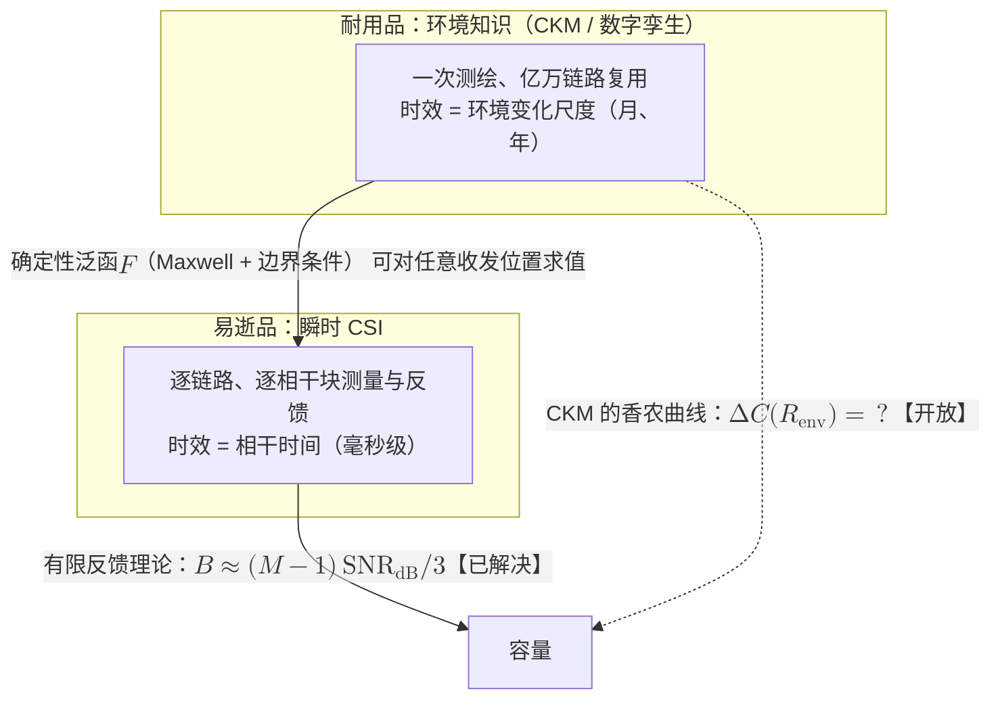

# 9 · 基本问题 II：环境知识的汇率与衰落的统计力学

[第 8 章](08-dimension-and-prediction.md)把信道知识放进了几何坐标系：它住在多少维的空间里，能向外预测多远。本章处理下半场的两个基本问题：

- **Q3（汇率问题）**：经济学式的问题。一份用 $R_{\mathrm{env}}$ 比特写成的环境描述，最多能买回多少容量？
- **Q4（统计力学问题）**：物理学式的问题。信道既然是环境的确定性泛函（[第 2 章](02-maxwell-foundations.md)），"瑞利衰落"这样的统计规律究竟从哪里冒出来？

两个问题的答案会收束到同一个结论：统计普适性决定环境知识的汇率。普适性成立的地方，统计信息几乎免费，几何知识贬值。普适性破缺的地方，每一比特几何知识都在升值。毫米波与太赫兹的稀疏散射区就是这样的地方，而它恰是 6G 部署的主战场。这不是巧合，两者是同一枚硬币的两面。

!!! note "本章预备知识"
    需要：信息论（容量、互信息）与 MIMO 的基本概念。用到的内容：

    - 衰落信道容量三部曲（CSIR 遍历容量、CSIT 时间注水）：[预备篇 4.8](../part0/04-information-theory-basics.md#48-衰落信道容量三部曲)；MMSE 与正交性原理：[预备篇 4.10](../part0/04-information-theory-basics.md#410-条件期望与高斯估计后文最常用的三件工具)。
    - 复用增益与自由度：[预备篇 5.1](../part0/05-mimo.md#51-从-siso-到-mimo一张演进图三种增益)、[预备篇 5.5](../part0/05-mimo.md#55-mimo-容量与自由度从-logdet-到-minn_tn_rlogmathrmsnr)；导向矢量：[预备篇 5.3](../part0/05-mimo.md#53-发射波束赋形阵列增益码本与波束管理)。
    - 瑞利极限与 Clarke 谱定理：[第 3 章](03-statistical-lineage.md)；确定性引擎与数字孪生：[第 5 章](05-deterministic-revival.md)；有效维度与预测半径：[第 8 章](08-dimension-and-prediction.md)。
    - 随机矩阵理论：预备篇没有讲，Marchenko–Pastur 律在本章就地给出陈述。

## 9.1 知道天气才能定价：信道知识的经典价值理论 {#知道天气才能定价信道知识的经典价值理论}

衰落信道的容量是一族数，取决于**谁知道信道**。接收端知道（Channel State Information at Receiver, CSIR）是基线。发射端也知道（CSIT）之后，就可以"看天吃饭"：信道好时多发，信道差时少发甚至沉默。信息论花了半个世纪，为这份"天气预报"精确定价。

### 9.1.1 Shannon 策略与 Gelfand–Pinsker：边信息的两种形态

定价的谱系始于 Shannon 1958 年的发端因果边信息信道。状态 $S$ 因果地告知编码器时，容量为

$$
C = \max_{p(t)} I(T;Y)
$$

其中 $T$ 是"Shannon 策略"，即从状态到输入的映射空间上的随机变量。记号从简，原始表述见 Shannon 1958 年 IBM J. Res. Develop. 论文【已解决】。

这个结果的意思是：编码器每个时刻按码字选一张"对照表" $t:\mathcal{S}\to\mathcal{X}$，用此刻的状态 $s$ 查表，发出 $x=t(s)$。接收端看不到 $s$，所以系统等价于以"对照表"为输入的普通信道，$C$ 即其容量。

非因果情形由 Gelfand–Pinsker（1980）解决：

$$
C = \max_{p(u|s),\; x = f(u,s)} \bigl[ I(U;Y) - I(U;S) \bigr],
$$

其中 $U$ 是辅助随机变量。高斯情形就是 Costa 脏纸编码：已知的加性干扰可以被预编码完全消除【已解决】。

!!! warning "陷阱（两种边信息不是一回事）"
    Gelfand–Pinsker/脏纸编码处理的是**加性状态**（已知干扰的预编码消除），衰落信道的 CSIT 处理的是**乘性状态**（功率与速率对衰落系数的自适应）。两者的问题结构不同，只在"边信息有价"这个层面上同族。把"脏纸编码"当作"发端知道衰落系数"的理论依据，是常见的张冠李戴。

### 9.1.2 Goldsmith–Varaiya 水填充容量

对衰落信道本身，标杆是 Goldsmith–Varaiya 的结果 [1]（一般状态信道的统一框架见 Caire–Shamai [2]）。

!!! abstract "定理（Goldsmith–Varaiya 水填充容量，1997）"
    设平坦衰落信道的瞬时等效 SNR 为 $\gamma$，分布 $p(\gamma)$，收发两端均已知 $\gamma$，平均功率约束 $\bar{P}$，带宽 $B$。则容量为

    $$
    C = \max_{P(\gamma):\; \mathbb{E}[P(\gamma)] \le \bar{P}} \int_0^{\infty} B \log_2\!\left(1 + \frac{\gamma P(\gamma)}{\bar{P}}\right) p(\gamma)\, \mathrm{d}\gamma ,
    $$

    最优功率分配是时间维水填充。仅 CSIR 时 $C = \mathbb{E}\bigl[B \log_2(1+\gamma)\bigr]$。【已解决】出处：[1]。

水填充解只需三步。

**第一步：写出拉格朗日函数。** 对每个 $\gamma$ 逐点自由的 $P(\gamma)$ 引入拉格朗日乘子 $\lambda$：

$$
\mathcal{L} = \int_0^{\infty} \left[ B \log_2\!\left(1 + \frac{\gamma P(\gamma)}{\bar{P}}\right) - \lambda P(\gamma) \right] p(\gamma)\, \mathrm{d}\gamma .
$$

**第二步：逐点求导置零。** 被积函数对每个 $\gamma$ 独立凹，所以逐点求导置零即可：

$$
\frac{B}{\ln 2} \cdot \frac{\gamma / \bar{P}}{1 + \gamma P(\gamma)/\bar{P}} = \lambda ,
$$

由上式得 $1+\gamma P(\gamma)/\bar{P} = B\gamma/(\lambda\bar{P}\ln 2)$，即 $P(\gamma)/\bar{P} = B/(\lambda\bar{P}\ln 2) - 1/\gamma$。记常数 $1/\gamma_0 := B/(\lambda\bar{P}\ln 2)$，它由 $\mathbb{E}[P(\gamma)] = \bar{P}$ 唯一确定。

**第三步：补上功率非负的约束。** $\gamma<\gamma_0$ 时右端为负，而功率非负，KKT 条件令其取 0。这里的水位 $\mu$ 就是 $1/\gamma_0$，见[预备篇 4.8](../part0/04-information-theory-basics.md)。结果是

$$
\frac{P(\gamma)}{\bar{P}} = \left( \frac{1}{\gamma_0} - \frac{1}{\gamma} \right)^{+} .
$$

**物理意义**

这是"知识变成功率调度"的最纯形态。$\gamma$ 低于门限就彻底沉默，高于门限则信道越好灌越多水。这与频选信道的频域水注对偶，只是这里注水的维度是时间。信道知识的价值因此被翻译成一个可计算的容量差 $C_{\mathrm{CSIT}} - C_{\mathrm{CSIR}}$。

**行为分析**

- 低 SNR：水位很低，功率集中倾泻在少数衰落峰值上（机会主义传输），CSIT 的相对增益显著。
- 中高 SNR：水位远高于绝大多数谷底，$P(\gamma) \approx \bar{P}$ 几乎恒定，水填充与恒功率的差别微乎其微。这是论文 [1] 自己强调的结论。

[预备篇 4.8](../part0/04-information-theory-basics.md) 的瑞利算例：20 dB 时 CSIT 只比 CSIR 多 0.2%，0 dB 时多约 20%。因此不要写"CSIT 大幅提高容量"：单天线遍历容量下它几乎不提高容量。

CSIT 从"锦上添花"变成"生死攸关"的场景是另外三个：

- 低 SNR。
- 时延受限/中断容量。
- 多天线多用户空分复用，需要方向信息才能造波束、消干扰。

第三个场景正是下一节汇率表的舞台。

### 9.1.3 知识的残缺与成本：估计误差与训练开销

知识的价值之外，还有知识的**残缺**与**成本**。

Médard [3] 量化了估计误差的代价。信道估计 $\hat{h}$ 带误差方差 $\sigma_e^2$ 时，把误差当噪声，可达速率下界，形态大致如下（记号从简，精确条件见原文 [3]）：

$$
R \ge \mathbb{E}\left[ \log_2\!\left( 1 + \frac{P |\hat{h}|^2}{N_0 + P \sigma_e^2} \right) \right] ,
$$

分母里的 $P\sigma_e^2$ 来自把接收信号改写成 $y = \hat{h}x + (h-\hat{h})x + n$。第二项是估计误差被 $x$ 放大后的自干扰，功率为 $P\sigma_e^2$。它与有用项不相关，这是 MMSE 的正交性原理（[预备篇 4.10](../part0/04-information-theory-basics.md)），所以可以和 $n$ 一并当作噪声。高 SNR 下自干扰随功率一同增长，因此不完美知识造成的是乘性惩罚，不是加性惩罚。

Lapidoth–Shamai [4] 进一步表明：用为完美 CSI 设计的高斯码本加最近邻译码时，即使很小的估计误差也可造成显著速率损失，且高 SNR 下损失不消失。"完美边信息"对精度的要求苛刻得反直觉【已解决】。

Hassibi–Hochwald [5] 定价了知识的**获取成本**。块衰落 MIMO 中，每个相干块花 $T_{\mathrm{train}}$ 个符号做训练，最优训练长度在高 SNR 下恰等于发射天线数 $M$，这也是可辨识所需的最小值【已解决】。训练太少，信道学不会。训练太多，又会挤占数据时间。这是"块内汇率"，也是本章与[第 8 章](08-dimension-and-prediction.md)获取成本设问的天然铰链。

## 9.2 汇率表的第一行：反馈比特换复用增益 {#汇率表的第一行反馈比特换复用增益}

多用户 MIMO 把 CSIT 的价值推到极致，也把它的价格标到明处。设 $M$ 天线基站做零迫（Zero-Forcing, ZF）波束成形，服务 $M$ 个单天线用户，每用户把自己的信道方向量化成 $B$ 比特反馈回来。

记号提醒：本节的 $B$ 是反馈比特数，不是上一节的带宽；$P$ 是归一化 SNR，即定理里的 $P/N_0$。**复用增益**指和速率随 $\log_2 P$ 增长的斜率（[预备篇 5.1](../part0/05-mimo.md)），完美 CSIT 下为 $M$。

量化码本设计等价于 Grassmann 流形上的球堆积问题 [7]。CSI 反馈由此被表述为信道状态的**有损源编码**。

### 9.2.1 四步推导：从球覆盖计数到反馈比特数

汇率的推导链条只有四环。

**第一步：方向向量的量化失真。** 单位范数方向向量 $\mathbf{h}/\lVert\mathbf{h}\rVert$ 生活在复投影空间（Grassmann 流形）上，实维度为 $2(M-1)$。$\mathbb{C}^M$ 有 $2M$ 个实维度，减去单位范数与不影响方向的整体相位，各减 1 个。方向误差记 $\sin^2\angle(\mathbf{h},\hat{\mathbf{h}}) = 1 - |\hat{\mathbf{h}}^{\dagger}\mathbf{h}|^2/\lVert\mathbf{h}\rVert^2$，其平方根就是弦距离。

标准高维量化论证（失真按码本大小的 $-2/\mathrm{dim}$ 次幂缩）只需三行球覆盖计数：

- $B$ 比特给出 $2^B$ 个码字。
- 离某个码字弦距离不超过 $r$ 的"帽"，占全体方向的比例恰为 $r^{2(M-1)}$。
- 要让 $2^B$ 顶帽盖满流形，需 $2^B r^{2(M-1)} \approx 1$，即失真 $r^2 \approx 2^{-B/(M-1)}$。$M=4$、$B=6$ 时为 $0.25$，随机码本实测 $0.22$。

于是，码字在球面上独立均匀抽取的随机向量量化，方向失真的量级为（量级表述，精确常数见 [6][7]）

$$
\mathbb{E}\!\left[ \sin^2 \angle(\mathbf{h}, \hat{\mathbf{h}}) \right] \sim 2^{-\frac{B}{M-1}} .
$$

**第二步：残余干扰。** ZF 波束基于量化方向 $\hat{\mathbf{h}}$ 设计，真实方向与之有夹角，每用户因此漏进与 $\sin^2$ 成正比的残余干扰，总干扰功率量级为 $P \cdot 2^{-B/(M-1)}$。

??? note "细算：为什么平均干扰恰为 P·E[sin²θ]"
    用户 $k$ 的信道方向垂直于 $\hat{\mathbf{h}}_k$ 的分量长 $\sin\theta_k$，方向记 $\mathbf{e}_k$。其他用户的 ZF 波束 $\mathbf{v}_j$ 与 $\hat{\mathbf{h}}_k$ 正交，只有这一分量漏入，即 $|\mathbf{h}_k^{\dagger}\mathbf{v}_j|^2 = \lVert\mathbf{h}_k\rVert^2 \sin^2\theta_k\, |\mathbf{e}_k^{\dagger}\mathbf{v}_j|^2$。

    随机码本下，$\mathbf{e}_k$ 在 $M-1$ 维正交补里方向均匀，$|\mathbf{e}_k^{\dagger}\mathbf{v}_j|^2$ 均值为 $1/(M-1)$。乘上 $M-1$ 个干扰用户、每人功率 $P/M$、$\mathbb{E}\lVert\mathbf{h}_k\rVert^2=M$，平均干扰恰为 $P\,\mathbb{E}[\sin^2\theta_k]$。

**第三步：速率损失。** 与完美 CSIT 相比，每用户速率损失被干扰项控制：

$$
\Delta R \;\lesssim\; \log_2\!\left( 1 + P \cdot 2^{-\frac{B}{M-1}} \right) .
$$

**第四步：反推需要多少比特。** 要让 $\Delta R$ 有界，必须让 $P \cdot 2^{-B/(M-1)}$ 不随 $P$ 增长。损失有界，和速率的斜率就仍是 $M$，也就保住了全部复用增益。条件即 $2^{B/(M-1)} \approx P$。取 $\log_2$，再用 $\log_2 P = \mathrm{SNR}_{\mathrm{dB}}/(10\log_{10}2) \approx \mathrm{SNR}_{\mathrm{dB}}/3$ 换成分贝，得

$$
B \approx (M-1) \log_2 P \;\approx\; (M-1) \cdot \frac{\mathrm{SNR}_{\mathrm{dB}}}{3} .
$$

### 9.2.2 Jindal 定标律的含义

!!! abstract "定理（Jindal 有限反馈定标律，2006）"
    $M$ 天线 MISO 广播信道、每用户 $B$ 比特反馈的零迫波束成形：要达到复用增益 $\alpha M$（$0 < \alpha \le 1$），每用户反馈比特按 $B = \alpha (M-1) \log_2 (P/N_0)$ 定标即足够；等价地，保全复用增益需**每 3 dB SNR、每用户多付 $M-1$ 比特**。$B$ 固定则系统进入干扰受限区，和速率随 SNR 饱和。【已解决】出处：[6]。

**物理意义**

这是"比特买容量"的第一条明码标价。信道知识不再是抽象的"边信息"，而是一份随 SNR 线性增长的比特账单。

- 指数 $M-1$ 来自方向流形的维度：要描述的自由度越多，同等精度就越贵。
- "每 3 dB 付 $M-1$ 比特"说的是，干扰必须与信号同步压低，量化精度必须跑赢功率增长。

**行为分析**

$B$ 固定时，残余干扰功率随 $P$ 线性增长，信干比封顶，和速率曲线在高 SNR 拉平。花不起反馈的系统买不到复用增益，这就是干扰受限饱和的机制。

数量级感受：$M = 64$、工作点 20 dB，则 $B \approx 63 \times 20/3 \approx 420$ 比特/用户/相干块。而且相干块一过，这些比特全部作废。瞬时 CSI 是一种**易逝品**：按链路、按相干块购买，无法储存，无法复用。这个观察是通往 Q3 的门。

## 9.3 环境知识：压缩形态的信道知识 {#环境知识压缩形态的信道知识}

现在换一种商品。本部的中心命题（[第 2 章](02-maxwell-foundations.md)、[第 5 章](05-deterministic-revival.md)）是：信道是环境的确定性泛函，

$$
h = F\!\left( E;\; \mathbf{x}_{\mathrm{t}}, \mathbf{x}_{\mathrm{r}}, f \right),
$$

其中 $E$ 是环境描述（几何、材质、散射体），$F$ 由 Maxwell 方程与边界条件给定。所有链路的 CSI 都是**同一个** $F$ 在不同收发位置上的取值。它们不是独立的信息源，而是同一份底层描述的亿万次读出。知道一栋楼的位置与材质，等于同时知道所有经过它的链路的遮挡状态。

环境知识因此是**压缩形态的信道知识**。压缩比不来自任何编码技巧，而来自物理世界自身的结构性：环境自由度远小于所有链路 CSI 自由度之和，[第 8 章](08-dimension-and-prediction.md)的有效维度正是对前者的度量。

信道知识地图 (Channel Knowledge Map, CKM) 就是这一想法的信息论读法：它是以收发位置为标签的站点专属信道知识数据库，用环境感知减免实时 CSI 获取。2021 年由 Zeng–Xu 提出，2024 年教程 [14] 将其构建（模型驱动/数据驱动）与利用系统化【范式已提出，理论开放】。

!!! tip "直觉（易逝品与耐用品）"
    瞬时 CSI 是牛奶：按份购买，保质期一个相干时间，过期作废。环境知识是房产：一次测绘，长期持有，向所有租户（链路）同时出租。两者的会计制度完全不同：前者计入每块的流量成本，后者按摊销计价。

!!! example "算例（摊销经济学：一栋楼值多少比特）"
    **瞬时 CSI 的账单。** 取 $M = 64$、工作点 20 dB，定标律给出约 420 比特/用户/相干块。相干时间 10 ms（低速移动）即每用户每秒约 $4.2 \times 10^4$ 比特。1000 个用户一年的账单约 $4.2 \times 10^4 \times 3.15 \times 10^7 \times 1000 \approx 1.3 \times 10^{15}$ 比特，而且全部过期作废，明年还得再付一遍。

    **环境知识的账单。** 一栋楼的几何与材质描述（顶点坐标加材质标签）约 10 KB $\approx 8 \times 10^4$ 比特，一次性支付。它影响的链路数随用户数与时间无限增长，摊销到每条链路的成本趋于零。

    **诚实的注脚。** 这不是同类项对比：环境知识并不能完全替代瞬时 CSI（小尺度残余仍需实时测量，见下文可分离性猜想）。对比揭示的是两种知识形态的**标度结构**：一个随时间线性增长且不可复用，一个是常数且无限复用。

环境知识与经典 side information 理论的区别，比表面上大得多，至少有三点：

- **标签空间不同。** 经典状态信息按时隙标注："第 $k$ 个信道使用时状态是 $s_k$"。环境知识按位置标注，而且能回答**反事实查询**：从未测量过的收发位置组合，$F$ 照样能求值。CSI 是记录，环境知识是模型。
- **时间结构不同。** 状态过程的知识随过程演化贬值。环境几乎静态，其知识可跨相干块、跨用户、跨年份复用，这是摊销经济学成立的前提。
- **失真几何不同。** 量化 $\mathbf{h}$ 的失真度量是流形上的弦距离，理论已经完备 [7]。而"环境描述差 $\delta$"如何映射为容量损失，要穿过波动方程这个高度非线性的算子：一堵墙的位置差 10 cm，可能让一整条街的链路集体翻转 LoS/NLoS 判断，也可能毫无影响，取决于它在几何中的位置。环境失真度量的正确定义，目前完全空白。

## 9.4 "CKM 的香农曲线"：一条尚不存在的曲线 {#ckm-的香农曲线一条尚不存在的曲线}

### 9.4.1 曲线的定义与已知的两端

把 Q3 说到底，是要一条曲线。设环境被编码为 $R_{\mathrm{env}}$ 比特的描述（一个大小为 $2^{R_{\mathrm{env}}}$ 的环境码本），定义

$$
\Delta C(R_{\mathrm{env}}) \;=\; \sup_{\mathrm{env}\ \mathrm{codes}} \; \Bigl[ C\bigl(\mathrm{prior} + \mathrm{env}\ \mathrm{code}\bigr) - C\bigl(\mathrm{prior}\bigr) \Bigr] ,
$$

即 $R_{\mathrm{env}}$ 比特环境描述在统计先验之上最多买回的容量增益。prior 指只知信道统计分布的基线。这条曲线是率失真曲线的环境版，称为"CKM 的香农曲线"。

它与[第三部第 5 章](../part3/05-price-of-prediction.md)的 $V(I)$ 同属"对所有编码取上确界、给比特定价"的构造。区别在坐标轴：这里横轴是静态环境的描述长度，纵轴是容量。$V(I)$ 中的 $I$ 是消息与未来的互信息，$V(I)$ 本身是在线决策性能。

必须明确：这是本站的原创提法，文献里还没有共识。截至 2026-08，不存在刻画这条曲线的任何定理【开放】。已知的只有两个端点的碎片：

- **左端点附近**（$R_{\mathrm{env}}$ 很小）：退化为纯统计先验，容量即经典遍历容量，也就是[第 3 章](03-statistical-lineage.md)的世界。
- **右端点**（$R_{\mathrm{env}} \to \infty$）：完整环境加确定性求解器（射线追踪、数字孪生，[第 5 章](05-deterministic-revival.md)）给出近乎确定性的信道，剩余不确定性由模型误差与真正的动态残余决定。
- **另一条轴上的已知结果**：limited feedback 定标律 [6][7] 精确刻画了"$B$ 比特**瞬时 CSI**值多少容量"。但那是对易逝品的定价，不是对耐用品的定价，两者失真度量与复用结构都不同。

### 9.4.2 空白的中段与汇率表

把已知与未知画在同一张图上，空白的位置就一目了然：

{ .chart loading=lazy }
{ .chart loading=lazy }

*图中画了三条虚拟中段，共用同一对端点，代表三种可能的形状：*

- **凹增**：边际收益递减，最"温和"的猜测。
- **阈值跳变**：几何精度跨过 LoS/NLoS 判据后，价值集体兑现。
- **早饱和**：少量结构信息就吃掉大部分增益。

三条线的两端都被钉死：左端 $\Delta C\to0$ 是遍历容量（[第 3 章](03-statistical-lineage.md)的世界），右端趋于确定性上限（完整环境 + 射线追踪，[第 5 章](05-deterministic-revival.md)）。中段走哪条，截至 2026-08 无人知道。

!!! warning "对照：有定理的那条曲线长什么样"
    同一张图上本可以画第四条**实线**：limited feedback 的 $B$ 比特瞬时 CSI 与复用增益的关系（[6][7]，本章第二节）。它有精确定标律 $B\approx(M-1)\log_2 P$，斜率、截距、失效点全都算得出来。实线与虚线的差别，就是"易逝品已有定价理论、耐用品还没有"。这也是为什么本章要把 $\Delta C(R_{\mathrm{env}})$ 单独立为 Q3。

以下几点全部未知：

- 中段的曲线形状。
- 正确的环境失真度量。
- $\Delta C$ 对 $R_{\mathrm{env}}$ 是否有相变式的阈值行为，即几何描述精度跨过某个分辨率后，LoS/NLoS 判断集体正确，价值发生跳变。

CKM 文献中目前只有仿真与实测的量级证据，没有定理 [14]。

同样开放的还有它的对偶问题，即 CKM 构建的基本极限：多少测量样本、多精细的环境模型，才能把信道预测误差压到给定水平。CKM 构建综述明确将其列为 open challenge，见 [14] 及其后续综述【开放】。

**汇率表：已经写出的两行与空着的一行**

| 知识形态 | 买到什么 | 价码 | 保质期 | 状态 |
|---|---|---|---|---|
| 发端知道瞬时 SNR（完整 CSIT） | 时间维注水，容量差 $C_{\mathrm{CSIT}}-C_{\mathrm{CSIR}}$ | 低 SNR 相对增益显著；中高 SNR 与恒功率几乎没有差别 [1] | 一个相干时间 | 【已解决】 |
| 每用户 $B$ 比特方向反馈（$M$ 天线零迫） | 复用增益 | 每 3 dB SNR、每用户多付 $M-1$ 比特；$M=64$、20 dB 时约 420 比特/用户/相干块 [6] | 一个相干块，过期作废 | 【已解决】 |
| $R_{\mathrm{env}}$ 比特的环境描述 | 容量增益 $\Delta C(R_{\mathrm{env}})$ | 只知两端：$R_{\mathrm{env}}\to0$ 退回经典遍历容量，$R_{\mathrm{env}}\to\infty$ 由模型误差与动态残余决定；一栋楼约 $8\times10^4$ 比特，一次付清 | 环境变化的尺度（月、年），所有链路共用 | 【开放·本站提法】 |

## 9.5 衰落的统计力学：确定几何如何洗出统计规律 {#衰落的统计力学确定几何如何洗出统计规律}

现在转向 Q4。它是 Q3 的镜像：Q3 问确定性知识值多少钱，Q4 问为什么在过去六十年里，我们**不买**这份知识也活得很好。

答案与统计力学同构。气体分子每一次碰撞都是牛顿力学的确定性事件，但 $10^{23}$ 个分子的宏观行为只需要温度与压强两个数。微观确定，宏观统计。

无线信道的对应物是这样：每条多径的幅度与相位由确定几何严格决定，但当路径足够多、相位被"洗匀"之后，合成场只需要一个方差参数。扮演热化机制的，是中心极限定理 (Central Limit Theorem, CLT)。

### 9.5.1 四步推导：从多径求和到瑞利包络

推导只需四步，值得完整走一遍。合成信道为

$$
h = \sum_{n=1}^{N} a_n e^{j\phi_n}, \qquad \phi_n = -\frac{2\pi d_n}{\lambda} \bmod 2\pi ,
$$

其中 $d_n$ 是第 $n$ 条路径的路程。

**第一步：相位对几何极端敏感。** 载频 3.5 GHz 时 $\lambda \approx 8.6$ cm，路程变化半个波长，相位就翻转。从这里起 $\lambda$ 是波长，与前文水填充里的拉格朗日乘子 $\lambda$ 无关。城市环境中各路径路程差远大于 $\lambda$，于是 $\phi_n$ 对几何细节极端敏感。

它是确定的，但对观察者而言，与均匀分布于 $[0, 2\pi)$ 的独立随机变量无法区分。这就是[第 1 章](01-lie-of-randomness.md)所说的认识论随机性：随机性是我们对相位的无知，它不是世界的属性。

**第二步：在相位均匀独立的假设下算矩。** 取实部虚部 $X = \sum_n a_n \cos\phi_n$、$Y = \sum_n a_n \sin\phi_n$，则

$$
\begin{aligned}
\mathbb{E}[X] &= \sum_{n} a_n\, \mathbb{E}[\cos\phi_n] = 0 , \\
\mathrm{Var}(X) &= \sum_{n} a_n^2\, \mathbb{E}[\cos^2\phi_n] = \frac{1}{2} \sum_{n=1}^{N} a_n^2 \equiv \sigma^2 , \\
\mathbb{E}[XY] &= \sum_{n} a_n^2\, \mathbb{E}[\cos\phi_n \sin\phi_n] = 0 .
\end{aligned}
$$

上式只剩 $n=m$ 的对角项：

- $n\ne m$ 时相位独立，交叉项如 $\mathbb{E}[\cos\phi_n\cos\phi_m] = \mathbb{E}[\cos\phi_n]\,\mathbb{E}[\cos\phi_m] = 0$。
- 对角项由 $\cos^2\phi = (1+\cos 2\phi)/2$、$\cos\phi\sin\phi = \tfrac12\sin 2\phi$ 平均，分别得 $\tfrac12$ 与 $0$。
- $\mathrm{Var}(Y) = \sigma^2$ 同理。

**第三步：用中心极限定理。** 若诸项数量大且无单项主导，CLT 给出 $(X, Y)$ 联合趋于独立同方差高斯，即 $h$ 趋于圆对称复高斯。

**第四步：从复高斯到瑞利包络。** 联合密度为

$$
p(x, y) = \frac{1}{2\pi\sigma^2} \exp\!\left( -\frac{x^2 + y^2}{2\sigma^2} \right)
$$

换极坐标 $x = r\cos\theta$、$y = r\sin\theta$，雅可比为 $r$，得

$$
p(r, \theta) = \dfrac{r}{2\pi\sigma^2} e^{-r^2/2\sigma^2}
$$

再对 $\theta$ 积分：

$$
p(r) = \frac{r}{\sigma^2} \exp\!\left( -\frac{r^2}{2\sigma^2} \right), \qquad r \ge 0 .
$$

瑞利分布没有被假设进来，它是被确定几何**洗**出来的。

### 9.5.2 普适性的含义与收敛条件

**物理意义**

结论对 $a_n$ 的具体取值、散射体的材质与位置细节全部不敏感，只剩一个 $\sigma^2$。这是普适性 (universality)：宏观规律对微观细节免疫。

还有一层更深的解读：给定平均功率约束，圆对称复高斯恰是最大熵分布。瑞利衰落是信道的"热平衡态"，是相位信息被彻底热化后剩下的最无知描述。统计建模六十年的成功（[第 3 章](03-statistical-lineage.md)），靠的是普适性替我们兜底：对微观无知不受惩罚。

**行为分析**

- 收敛需要"大量同量级贡献"。等幅情形 $a_n = a/\sqrt{N}$ 时，十几条路径已相当接近瑞利。
- 若一条路径（如 LoS）携带不可忽略的能量占比，极限变为莱斯 (Rician)，K 因子即主导径与漫散射的功率比。
- 波长越短，相位越容易洗匀（对 CLT 有利），但路径本身越稀疏（对 CLT 致命）。这对张力决定了普适性的疆界，也是下一节的主题。

严格化这件事的是 Taricco [9]。

!!! abstract "定理（瑞利收敛的条件，Taricco 2015）"
    多径合成增益趋于复高斯（包络趋于瑞利）并非只要 $N \to \infty$ 就自动成立：收敛要求路径增益满足特定条件——方向上即"无主导路径"（任何单条路径的能量占比渐近可忽略；论文批判性讨论了 Lindeberg 型条件何时不成立，精确数学形式见原文 [9]），并给出了路径数目趋于无穷但**不**收敛于瑞利的显式反例。极限成立时，幅度与相位渐近独立、相位均匀于 $[0, 2\pi)$。【已解决】

!!! warning "陷阱（两个流行的错误）"
    - "路径多就是瑞利"是错的。Taricco 的反例表明，少数路径携带绝大部分能量时普适性破缺，路径计数不能替代能量占比条件 [9]。
    - "毫米波没有小尺度衰落"也是错的。毫米波有小尺度衰落，只是偏向高 K 因子的莱斯/双射线型结构，而不是瑞利 [12]。破缺的是瑞利普适性，衰落本身还在。

## 9.6 普适性类及其破缺：从随机矩阵到毫米波 {#普适性类及其破缺从随机矩阵到毫米波}

### 9.6.1 Marchenko–Pastur 普适性与容量的自平均

普适性在 MIMO 时代有一个更强的版本。单链路的 CLT 洗出瑞利。把整个信道矩阵放进大维极限，随机矩阵理论洗出的结果更惊人：连**容量本身**都变成确定性的。

先说明定理里的几个术语：

- **经验特征值分布**：$\mathbf{H}\mathbf{H}^{\dagger}$ 的 $M$ 个特征值的归一化直方图。
- **几乎必然收敛**：除去概率为零的例外，每一次随机实现的直方图都收敛到同一条曲线。
- **零点处的尖峰项**：$c>1$ 时 $\mathbf{H}\mathbf{H}^{\dagger}$ 的秩至多为 $N$，至少 $1-1/c$ 的特征值为 0，这部分就是 $\delta(x)$ 项。

一个例子：$400\times400$ 的随机符号矩阵，元素为 $\pm1/20$，完全不是高斯。SNR 为 10 时，单次实现的每天线容量约 2.72 bit/s/Hz，换随机种子只在第三位小数上变动。定理积分为 2.723。

!!! abstract "定理（Marchenko–Pastur 普适性，见 Tulino–Verdú 2004）"
    设 $\mathbf{H} \in \mathbb{C}^{M \times N}$ 元素独立同分布、零均值、方差 $1/N$（**不必高斯**），$M/N \to c$。则 $\mathbf{H}\mathbf{H}^{\dagger}$ 的经验特征值分布几乎必然收敛于 Marchenko–Pastur 律

    $$
    f_c(x) = \left( 1 - \frac{1}{c} \right)^{+} \delta(x) + \frac{\sqrt{(x-a)^{+}(b-x)^{+}}}{2\pi c x}, \qquad a = (1 - \sqrt{c})^2, \; b = (1 + \sqrt{c})^2 ,
    $$

    与元素的具体分布无关；相应地每天线容量收敛于确定性积分

    $$
    \frac{1}{M} \log_2 \det\!\left( \mathbf{I} + \mathrm{SNR} \cdot \mathbf{H}\mathbf{H}^{\dagger} \right) \;\longrightarrow\; \int \log_2 (1 + \mathrm{SNR}\, x)\, f_c(x)\, \mathrm{d}x .
    $$

    【已解决】出处：[8]。

**物理意义**

这是自平均 (self-averaging)：维度足够大时，单次信道实现的容量几乎必然等于系综平均，随机性把自己平均掉了。

瑞利普适性说单链路增益不依赖散射细节，MP 普适性说整个矩阵的谱（因而容量）不依赖元素分布。两者是同一现象的两个尺度。统计范式在 2004 年前后达到顶峰，凭的正是这两层普适性：工程师可以对物理世界保持体面的无知。

**行为分析**

注意定理的前提：元素**独立、同量级**。这不是单纯的技术性条件，它是"富散射"的数学化身：每对收发天线之间都有大量独立同量级的传播贡献。前提被破坏时定理如何失效，恰好构成本章论点的最佳证据，见下文。

### 9.6.2 介观层与毫米波实测

在纯统计与逐条射线之间还存在一个介观层。Franceschetti–Bruck–Schulman [10] 把城市杂波建模为随机散射介质中的光子随机行走，仅用两个参数（杂波密度、吸收率）就解析导出功率衰减从近距 $1/r^2$ 到远距指数衰减的平滑过渡，与实测一致【已解决】。延伸工作进一步用逾渗理论闭合了无线网络容量的标度间隙。

这提示统计力学纲领有三层，每一层用更少的参数换更粗的分辨率：

- 微观：Maxwell/射线。
- 介观：随机行走/逾渗。
- 宏观：瑞利/MP 律。

然后是实测给出的普适性边界。Rappaport 等 2013 年在纽约做的 28 GHz 测量证明了毫米波蜂窝可行 [11]。Akdeniz 等 2014 年的统计建模给出了更冷峻的数字：28/73 GHz 下空间簇数量拟合为泊松随机变量，均值约为 2，是个位数 [12]。作为对照，为 sub-6 GHz 富散射设计的统计模型动辄设定二十个簇。

个位数的簇远达不到 CLT 的"大量独立同量级贡献"，小尺度衰落偏向高 K 莱斯/双射线型分布。而"正确"的稀疏信道衰落分布族（高 K 莱斯、双波加漫散射、FTR 等模型并存）至今没有公认答案【开放】。

### 9.6.3 稀疏信道里 MP 律为什么失效

MP 律在这里失效的机制值得说清楚，它比"随机矩阵论不适用"具体得多。稀疏信道矩阵是少数几条路径的秩一贡献之和：

$$
\mathbf{H} \approx \sum_{\ell=1}^{L} g_{\ell}\, \mathbf{a}_{\mathrm{r}}(\theta_{\ell})\, \mathbf{a}_{\mathrm{t}}^{\dagger}(\phi_{\ell}), \qquad L \ll \min(M, N) ,
$$

其中 $g_\ell$ 是第 $\ell$ 条径的复增益，$\theta_\ell$、$\phi_\ell$ 是到达角与离开角，$\mathbf{a}_{\mathrm{r}}$、$\mathbf{a}_{\mathrm{t}}$ 是导向矢量（[预备篇 5.3](../part0/05-mimo.md)）。每项都是秩一矩阵。此处 $\phi$ 是角度，与上一节的相位 $\phi_n$ 不是一回事。

于是 $\mathrm{rank}(\mathbf{H}) \le L$：无论阵列做到多大，非零特征值只有 $L$ 个，经验谱退化为少数尖峰加一堆零。独立同量级的前提被几何稀疏性摧毁，**有效自由度坍缩**到路径参数的维度。这是[第 4 章](04-spatial-structure.md)波数带限观点的矩阵版本。

矩阵不再"随机得足够均匀"，它变得"几何得足够结构化"。同一时期，位置信息辅助通信进入主流视野 [13]。位置正是最廉价的环境知识，统计范式的裂缝处开始渗入几何。

## 9.7 收束：普适性相图与知识的价格地图 {#收束普适性相图与知识的价格地图}

现在可以把 Q3 与 Q4 收束到一起了。

!!! success "关键结论（Q3 与 Q4 是同一枚硬币）"
    统计普适性决定环境知识的汇率。

    - 瑞利/MP 普适区：宏观规律对微观几何免疫，一个 $\sigma^2$ 或一条 MP 曲线就是全部可用信息。环境知识买不回多少容量，因为统计信息几乎免费。
    - 普适性破缺区：信道由个位数的几何参数主导，统计先验大幅失准，每一比特几何知识都直接翻译为波束方向、遮挡预测与容量。统计普适性失效的地方，确定性环境知识的汇率最高。

    频率越高、带宽越大、阵列越大，系统越深入破缺区。6G 恰好在把自己推向环境知识最值钱的地方。

### 9.7.1 普适性相图与序参量 N_eff 的定义

这个论断可以整理成一张相图，称为**普适性相图**。它以"每分辨单元内的有效路径数 $N_{\mathrm{eff}}$"为序参量，横轴取散射体密度，纵轴取系统分辨率（带宽 × 孔径 ÷ 波长的适当组合），标出瑞利普适区、莱斯过渡区、几何确定区。

这是本站的原创提法【开放】：文献已备齐全部原料，包括收敛条件 [9]、矩阵普适性 [8]、稀疏实测 [12]、介观模型 [10]。但没有人把它们拼成一张定量的相图，相边界的位置与序参量的正确定义均无定理。

先把序参量定义下来，否则相图只是修辞：

- **序参量**（order parameter）是统计物理用语，指取值就能区分不同"相"的宏观量。
- **分辨单元**是系统在时延和角度上分不开的格子：时延分辨约为带宽的倒数，角度格数约等于阵元数。同一格里的各径只表现为一个合成复增益，也就是前文"衰落的统计力学"一节里 CLT 求和的对象。

对分辨单元内的各径幅度 $\{a_n\}$，定义**参与比**

$$
N_{\mathrm{eff}} \;=\; \frac{\big(\sum_n a_n^2\big)^2}{\sum_n a_n^4},
$$

它是 Taricco [9]"无主导路径"条件的连续化：$N$ 条等幅路径给 $N_{\mathrm{eff}}=N$，一条独大时 $N_{\mathrm{eff}}\to1$。（本站提法。）

**它在数什么**

记能量占比 $q_n = a_n^2/\sum_m a_m^2$，则 $N_{\mathrm{eff}} = 1/\sum_n q_n^2$。

- $k$ 条径平分能量、其余为零时，$\sum_n q_n^2 = 1/k$，$N_{\mathrm{eff}}=k$。
- 它数的是能量真正摊在几条径上。例如占比 0.7、0.1、0.1、0.1 给出 $N_{\mathrm{eff}} = 1/(0.49+0.03) \approx 1.9$，而不是 4。

又因

$$
(\max_n q_n)^2 \le \sum_n q_n^2 \le \max_n q_n \sum_n q_n = \max_n q_n
$$

所以 $N_{\mathrm{eff}}\to\infty$ 当且仅当最大单径能量占比趋于 0，即 CLT 所需的无单项主导（本模型下等价于[第 3 章](03-statistical-lineage.md)的 Lindeberg 条件）。

[第四部第 7 章 7.7 节](../part4/07-mean-field.md)（定义 7.3）把同一构造用在干扰耦合权重上，数的是"真正起作用的邻区有几个"。

### 9.7.2 相边界的数与两代硬件的对比

**行为分析（相边界的数）**

设主径能量占比 $\kappa$、其余 $N-1$ 条等幅，则莱斯因子 $K=\kappa/(1-\kappa)$。其余每条占比 $(1-\kappa)/(N-1)$，能量占比平方和为 $\kappa^2 + (N-1)\big[(1-\kappa)/(N-1)\big]^2$，取倒数即

$$
N_{\mathrm{eff}}\;=\;\Big[\kappa^2+\tfrac{(1-\kappa)^2}{N-1}\Big]^{-1}.
$$

代入数值：

- $\kappa=0.5$（$K=0$ dB，瑞利/莱斯边界）、$N=20$ 时，$N_{\mathrm{eff}}\approx3.8$。
- $\kappa=0.3$ 时，$N_{\mathrm{eff}}\approx8.6$，在这条边界的瑞利一侧。
- $\kappa=0.9$（$K\approx9.5$ dB）时，$N_{\mathrm{eff}}\approx1.2$，已经落进几何确定区。

**验证本节自己的论断**

按总时延扩展约 100 ns 估算：

- **20 MHz 单天线**：时延分辨 50 ns，与室内 RMS 时延扩展同量级，角度不可分。约 2 个（$100/50$）分辨单元装下 ~30 条径，$N_{\mathrm{eff}}\sim15$，稳居瑞利区。
- **400 MHz + 256 阵元**：时延分辨 2.5 ns、角度 256 格，约 $10^4$ 个（$40\times256$）分辨单元装 30 条径。绝大多数单元里 $N_{\mathrm{eff}}<1$（空单元，无路径，按约定记 0）或 $=1$（独径），属于几何确定区。

同一条街道，两代硬件看到的是两个相。

{ .chart loading=lazy }
{ .chart loading=lazy }

**怎么读这张图**

- 横轴向左是环境变稀疏，纵轴向上是系统看得更清。两条路都通向几何确定区，这说明 $N_{\mathrm{eff}}$ 是环境与系统的联合属性。
- 四个系统点连起来是一条从右下到左上的轨迹：6G 的每一次代际升级，都在把自己推向环境知识最值钱的区域。这条轨迹是硬件自己走出来的，不是谁选的。
- 相边界（$N_{\mathrm{eff}}=$ 常数的等值线）的精确位置至今无定理【开放】。

相图上有一个容易被忽略的要点：$N_{\mathrm{eff}}$ 是**环境与系统分辨率的联合属性**，不是环境的内禀属性。同一条街道：

- 20 MHz 单天线终端看到的是瑞利：几十条路径挤在一个分辨单元里互相干涉。
- 400 MHz 加 256 阵元的基站看到的是一条条可分辨的离散射线：每条路径独占分辨单元，上面的算例里 30 条径摊进约 $10^4$ 个单元。

分辨率提高，会把统计"解析"成几何。[第 4 章](04-spatial-structure.md)的空间自由度理论说的就是这件事。所以相图的边界不是固定的地理边界，而是随硬件代际移动的战线。统计与确定性之争没有终局裁决，只有随分辨率移动的分界线。

### 9.7.3 环境知识与瞬时 CSI 的分工

最后是环境知识与瞬时 CSI 的分工。工程直觉很清楚 [14]：环境知识（CKM）提供慢变的大尺度增益、遮挡状态与方向结构，残余的小尺度相位仍需实时测量。前者管"往哪指、指多准"，后者管"此刻相位是多少"。

把这个直觉升格为定理，即两种知识在信息论意义上的正交分解，称为**可分离性猜想**。目前没有任何结果，它同样是本站的原创提法【开放】。若它成立，6G 的 CSI 获取架构将有清晰的理论分层：耐用品走地图，易逝品走导频，两者互不赎买。这些悬而未决之处，是[第 10 章](10-research-agenda.md)研究纲领的起点。

!!! info "跨部连线"
    本章所在的线索：[任务与价值](../guide/05-eight-threads.md#8-任务与价值精度要多高才够用)、[信息结构](../guide/05-eight-threads.md#2-信息结构谁在什么时候知道什么)、[时间尺度](../guide/05-eight-threads.md#1-时间尺度这个旋钮该转多快)。

    - [第二部 5.4 节](../part2/05-cognitive-triangle.md#54-认知回路的最小模型与认知平衡点)：知识汇率曲线的形状直接决定认知平衡点，即该拿多少资源去认识环境。
    - [第二部 3.6 节](../part2/03-task-knowledge-lattice.md#36-给格元素定价间接率失真)：任务真正需要的那部分环境知识怎样定价（间接率失真）。
    - [第三部第 5 章「第四级台阶」](../part3/05-price-of-prediction.md#第四级台阶vi迈向决策的率失真)：第三部的 $V(I)$ 给"预测"定价，与本章给"环境知识"定价是同一类逆定理在两种资源上的实例。
    - [第四部 9.8 节](../part4/09-research-agenda.md#98-全站收尾四部如何合成一个体系)：许多节点一起感知时的多方版汇率，连端点都还没有。

## 开放问题 {#开放问题}

1. **CKM 的香农曲线**【开放·本站提法】：环境描述率 $R_{\mathrm{env}}$ 与容量增益 $\Delta C(R_{\mathrm{env}})$ 的最优权衡曲线。两个端点已知碎片（统计先验极限；完整环境的确定性极限），中段形状、是否存在阈值/相变行为，截至 2026-08 无定理。
2. **环境失真度量**【开放·本站提法】：几何误差如何映射为容量损失？该映射穿过波动方程，非线性且场景相关（同样 10 cm 的墙面误差可能致命也可能无关紧要），连"正确的失真定义"都尚未建立。没有它，率失真式的理论无从谈起。
3. **CKM 构建的基本极限**【开放·文献共识】：达到给定信道预测精度需要多少测量样本、多精细的环境模型；动态环境下的更新时效与跨场景泛化。CKM 综述明确列为 open challenge [14]。
4. **稀疏信道的"正确"衰落分布族**【开放·文献共识】：毫米波/太赫兹小尺度衰落用高 K 莱斯、双波加漫散射还是 FTR 描述，无公认普适类 [12]。对应的普适性分类定理（何种几何条件洗出何种分布）不存在。
5. **有限精度 CSIT 的 DoF 崩塌与环境知识的补救**【开放】：网络信息论中，有限精度 CSIT 会导致自由度崩塌（Jafar 学派 aligned image sets 系列结果，奠基结果见[第三部第 6 章](../part3/06-communication-lower-bounds.md)文献 [12]）。
    - 同一系列的 Davoodi–Jafar 2018 [15]（arXiv:1705.02775）进一步表明，即使接收端信道信息完美、发射端信道信息是瞬时的有限精度，网络相干时间也会影响 DoF。
    - DoF 即第二节的复用增益。"有限精度"指 CSIT 误差不随 SNR 缩小，正与 Jindal 定标律"每 3 dB 多付 $M-1$ 比特"相反，此时多用户空分复用的额外自由度会丢失。
    - 环境知识作为"另一种形态的 CSIT"能否绕开该崩塌、在何种条件下等效于高精度 CSIT，完全未知。
6. **普适性相图的定量化与可分离性猜想**【开放·本站提法】：序参量 $N_{\mathrm{eff}}$ 的严格定义、相边界的定理刻画；以及环境知识与瞬时 CSI 的信息论正交分解。文献只有工程直觉 [14]，没有定理。

## 参考文献 {#参考文献}

1. A. J. Goldsmith, P. P. Varaiya, 《Capacity of fading channels with channel side information》, IEEE Transactions on Information Theory, 43(6):1986–1992, 1997. [https://web.stanford.edu/class/ee359/pdfs/fading_capacity.pdf](https://web.stanford.edu/class/ee359/pdfs/fading_capacity.pdf)
2. G. Caire, S. Shamai, 《On the capacity of some channels with channel state information》, IEEE Transactions on Information Theory, 45(6):2007–2019, 1999. [https://www.eurecom.fr/fr/publication/305](https://www.eurecom.fr/fr/publication/305)
3. M. Médard, 《The effect upon channel capacity in wireless communications of perfect and imperfect knowledge of the channel》, IEEE Transactions on Information Theory, 46(3):933–946, 2000. [https://www.semanticscholar.org/paper/c6bb8736bdac606793d46d6af494540c3984211a](https://www.semanticscholar.org/paper/c6bb8736bdac606793d46d6af494540c3984211a)
4. A. Lapidoth, S. Shamai, 《Fading channels: how perfect need "perfect side information" be?》, IEEE Transactions on Information Theory, 48(5):1118–1134, 2002.
5. B. Hassibi, B. M. Hochwald, 《How much training is needed in multiple-antenna wireless links?》, IEEE Transactions on Information Theory, 49(4):951–963, 2003. [https://authors.library.caltech.edu/records/y6rsb-e9851](https://authors.library.caltech.edu/records/y6rsb-e9851)
6. N. Jindal, 《MIMO broadcast channels with finite-rate feedback》, IEEE Transactions on Information Theory, 52(11):5045–5060, 2006. [https://ita.ucsd.edu/workshop/06/papers/79.pdf](https://ita.ucsd.edu/workshop/06/papers/79.pdf)
7. D. J. Love, R. W. Heath Jr., V. K. N. Lau, D. Gesbert, B. D. Rao, M. Andrews, 《An overview of limited feedback in wireless communication systems》, IEEE Journal on Selected Areas in Communications, 26(8):1341–1365, 2008.
8. A. M. Tulino, S. Verdú, 《Random Matrix Theory and Wireless Communications》, Foundations and Trends in Communications and Information Theory, 1(1):1–182, 2004. [https://www.nowpublishers.com/article/Details/CIT-001](https://www.nowpublishers.com/article/Details/CIT-001)
9. G. Taricco, 《On the Convergence of Multipath Fading Channel Gains to the Rayleigh Distribution》, IEEE Wireless Communications Letters, 4(5):549–552, 2015. [https://ieeexplore.ieee.org/abstract/document/7155505/](https://ieeexplore.ieee.org/abstract/document/7155505/)
10. M. Franceschetti, J. Bruck, L. J. Schulman, 《A random walk model of wave propagation》, IEEE Transactions on Antennas and Propagation, 52(5):1304–1317, 2004. [https://www.paradise.caltech.edu/~massimo/homepage/papers/APrevision.pdf](https://www.paradise.caltech.edu/~massimo/homepage/papers/APrevision.pdf)
11. T. S. Rappaport et al., 《Millimeter Wave Mobile Communications for 5G Cellular: It Will Work!》, IEEE Access, 1:335–349, 2013. [https://ui.adsabs.harvard.edu/abs/2013IEEEA...1..335R](https://ui.adsabs.harvard.edu/abs/2013IEEEA...1..335R)
12. M. R. Akdeniz, Y. Liu, M. K. Samimi, S. Sun, S. Rangan, T. S. Rappaport, E. Erkip, 《Millimeter wave channel modeling and cellular capacity evaluation》, IEEE Journal on Selected Areas in Communications, 32(6), 2014. [https://arxiv.org/abs/1312.4921](https://arxiv.org/abs/1312.4921)
13. R. Di Taranto, S. Muppirisetty, R. Raulefs, D. Slock, T. Svensson, H. Wymeersch, 《Location-Aware Communications for 5G Networks》, IEEE Signal Processing Magazine, 31(6):102–112, 2014. [https://www.semanticscholar.org/paper/42e896ff3e3373cb43b531c0d8d675f34b21e699](https://www.semanticscholar.org/paper/42e896ff3e3373cb43b531c0d8d675f34b21e699)
14. Y. Zeng, J. Chen, J. Xu, D. Wu, X. Xu, S. Jin, X. Gao, D. Gesbert, S. Cui, R. Zhang, 《A Tutorial on Environment-Aware Communications via Channel Knowledge Map for 6G》, IEEE Communications Surveys & Tutorials, 2024. [https://arxiv.org/abs/2309.07460](https://arxiv.org/abs/2309.07460)（CKM 概念的最初提出见 Y. Zeng, X. Xu, "Toward Environment-Aware 6G Communications via Channel Knowledge Map," IEEE Wireless Communications, 28(3):84–91, 2021；构建方向的后续综述见 arXiv:2511.04944）
15. A. G. Davoodi, S. A. Jafar, 《Network Coherence Time Matters—Aligned Image Sets and the Degrees of Freedom of Interference Networks With Finite Precision CSIT and Perfect CSIR》, IEEE Transactions on Information Theory, 64(12):7780–7791, 2018. [https://doi.org/10.1109/TIT.2018.2837880](https://doi.org/10.1109/TIT.2018.2837880)（预印本 arXiv:1705.02775）
