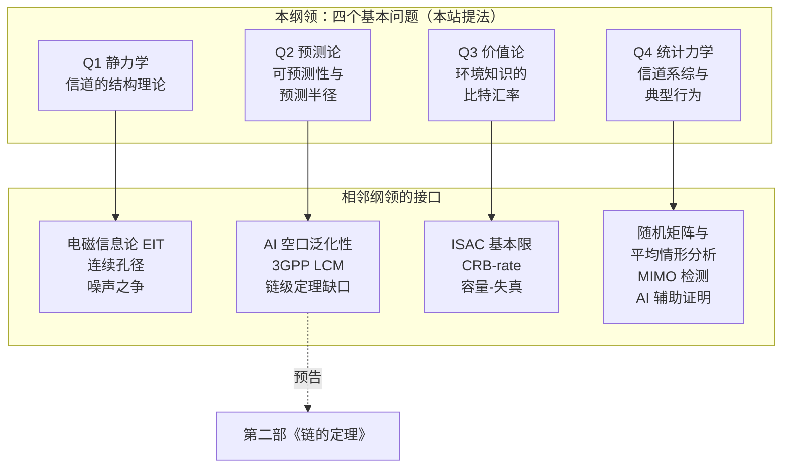

# 10 · 研究纲领：把信道建模从手艺变成科学

!!! note "本章预备知识"
    本章是第一部的研究纲领，默认读过第 1–9 章，尤其是提出四个基本问题的[第 1 章](01-lie-of-randomness.md)，以及把它们形式化的[第 8 章](08-dimension-and-prediction.md)与[第 9 章](09-exchange-and-universality.md)。另外用到：

    - 克拉美–罗界：[预备篇 9.4](../part0/09-new-landscape.md#94-isac-通感一体化一段波形两种任务)；高斯线性模型里 MMSE 与 CRB 的关系：[预备篇 4.10](../part0/04-information-theory-basics.md#410-条件期望与高斯估计后文最常用的三件工具)。
    - MIMO 检测谱系（ML、ZF/MMSE、球形译码）与"整数最小二乘最坏情形 NP 难"：[预备篇 5.7](../part0/05-mimo.md#57-mimo-检测谱系从-ml-到球形译码以及-2026-年的新消息)。
    - BPSK 误码率与 $Q$ 函数：[预备篇 3.4](../part0/03-digital-communications.md#34-bpsk-在-awgn-下的误码率一步不跳的推导)。

## 开放问题清单是一种研究基础设施

1900 年 8 月，希尔伯特在巴黎第二届国际数学家大会上宣读了 23 个问题。一百多年后回头看，这场演讲最深远的遗产不是其中任何一个问题的解，而是一种**体裁**：一份好的开放问题清单，本身就是研究基础设施。它把一个领域从"各自摸索的手艺"推成"有公共议程的科学"——清单规定了什么算进展、什么算工具、什么算解决。

信息论恰好有自己的谱系来对接这个体裁。香农 1948 年的工作本身就是"把手艺变成科学"的原型事件：在他之前，通信工程是滤波器、调制格式与经验规则的集合；在他之后，它有了单一的度量（比特）、单一的极限（容量）与单一的问题格式（给定资源，可靠传输速率的上确界是什么）。四十年后，Cover 与 Gopinath 把散落的未解问题编成《Open Problems in Communication and Computation》[1]——广播信道容量域、单纯形猜想、two-helper 问题——其中不少至今未解，但它们定义了几代研究者的议程。

一份合格的清单条目必须带三件套：**(a) 精确的问题陈述**——不含"更好地理解"这类含混动词；**(b) 已知工具箱**——哪些现成定理与方法可以直接搬来；**(c) 第一步**——一个强度上肯定能做出来、做出来就有信息量的引理或特例。2026 年之后，我们认为还应加上第四件：**(d) 适合 AI 辅助证明的子问题清单**——把问题分解到"陈述清晰、工具经典、但需要长链条估计"的粒度。为什么这一件在今天才有资格入列，本章压轴一节给出实证。

本章按这个纪律为第一部收官：把 [第 8 章](08-dimension-and-prediction.md) 与 [第 9 章](09-exchange-and-universality.md) 陈述的四个基本问题 Q1–Q4 组装成一个研究纲领，并为每一问补齐四件套。读下文时注意两点。其一，每一问先落到相邻领域最尖锐的形态：Q1 落到电磁信息论的噪声模型，Q2 落到 AI 空口的跨场景泛化，Q3 落到 ISAC 的折中边界，Q4 落到 MIMO 检测。其二，每份清单在 (a)–(d) 之外还多列一条"猜想"，即本站押注的方向。需要事先声明学术产权：Q1–Q4 的"静力学 / 预测论 / 价值论 / 统计力学"四位一体框架、"把信道建模从手艺变成科学"的纲领命题、以及把电磁信息论、ISAC、AI 空口划为"相邻纲领的接口"而非本纲领内部问题的划界方式，均为本站提法，不是文献共识。

## 四位一体：纲领的组装逻辑

四个基本问题各自对应经典物理课程表里的一门课。这不是修辞巧合，而是问题类型的同构：

- **Q1 是静力学**。环境冻结在某一瞬间，信道作为 Maxwell 方程的确定性泛函（[第 2 章](02-maxwell-foundations.md)）有什么结构：自由度是多少、空间相关长什么样、作为算子的谱如何衰减（[第 4 章](04-spatial-structure.md)、[第 8 章](08-dimension-and-prediction.md)）。
- **Q2 是预测论**。已知此处此刻的信道，彼处彼刻的信道能预测到什么精度——有效维度与预测半径（[第 8 章](08-dimension-and-prediction.md)）。
- **Q3 是价值论**。一比特环境知识值多少通信容量、值多少估计精度——环境知识的汇率（[第 9 章](09-exchange-and-universality.md)）。
- **Q4 是统计力学**。对环境取系综平均后，衰落分布、普适类与算法的典型行为如何涌现（[第 3 章](03-statistical-lineage.md)、[第 9 章](09-exchange-and-universality.md)）。系综 (ensemble) 指全体可能环境连同其概率；普适类指不依赖散射细节的统计规律，如瑞利衰落；典型行为指绝大多数实现上的表现，与最坏情形相对。

接口的划界原则（本站提法）：接口领域不是本纲领要吞并的对象，而是**双向翻译的界面**——本纲领向它们输出问题格式，它们向本纲领输出已被打磨的工具与阶段性定理。

!!! success "关键结论"
    四个基本问题不是四篇综述的目录，而是同一纲领的四个投影：Q1 问结构，Q2 问外推，Q3 问定价，Q4 问系综。每个接口领域恰好是其中一问被推到极限的形态：EIT 是 Q1 在孔径连续化极限下的形态；AI 空口泛化性是 Q2 的工程镜像；ISAC 基本限把 Q3 的"感知价值"变成可计算对象；随机矩阵系综上的平均情形 (average-case) 分析是 Q4 的做题方式。

## Q1 · 静力学的接口：电磁信息论

### 信道不是矩阵，是算子

天线阵越来越密——全息 MIMO (Holographic MIMO) 把阵元间距压到半波长以下，连续孔径阵列 (Continuous-Aperture Array, CAPA) 干脆让孔径趋于连续。当"第 $i$ 根天线"的编号失去意义时，$\mathbf{H}$ 矩阵是什么？电磁信息论 (Electromagnetic Information Theory, EIT) [2] 的回答：信道从来不是矩阵，而是 Maxwell 方程约束下的格林算子 (Green's operator)，把发射孔径上的电流分布映射为接收孔径上的场：

$$
\mathbf{E}(\mathbf{r}') = \int_{V_{\mathrm{T}}} \mathbf{G}(\mathbf{r}', \mathbf{r})\, \mathbf{J}(\mathbf{r})\, \mathrm{d}\mathbf{r}, \qquad \mathbf{r}' \in V_{\mathrm{R}}
$$

**物理意义**：这就是 [第 2 章](02-maxwell-foundations.md) 的"信道是环境的确定性泛函"在孔径连续化极限下的形态——$\mathbf{G}$ 由环境（边界条件、散射体）唯一决定，离散 MIMO 的 $\mathbf{H}$ 只是它在两组采样点上的截影。三个经典问题于是重现为算子问题：自由度是算子的有效秩（奇异值谱的"膝盖"在哪里）；容量是算子谱上的注水；噪声是接收场随机分量的自相关算子。

**行为分析**：矩阵语言里被归一化约定藏起来的问题，在算子语言里全部暴露。阵元数 $n$ 增大时 $\mathbf{H}$ 的维度发散，但 $\mathbf{G}$ 不变——所以任何"$n \to \infty$ 时容量发散"的结论都必须先问：发散的是物理量，还是离散化伪影？这正是后文噪声之争的伏笔。

!!! tip "直觉：双相位共轭谐振腔"
    Miller 2000 [3] 给出最早也最物理的图像：两个体积之间用波通信，其最优正交信道（"通信模式"）由两个耦合的本征值问题给出——等价于在两个体积间来回相位共轭的谐振腔的腔模；耦合强度的平方和受体积对几何约束（sum rule）。【已解决】信道模式不是数学装饰，它们是这个虚拟谐振腔里真实"驻"着的场型。

### 自由度为什么可数

三步台阶，时间顺序恰好是逻辑顺序。Miller 2000 [3] 在光学侧建立体积间通信模式；Poon–Brodersen–Tse 2005 [4] 在信息论侧证明受几何约束的多天线系统，其空间自由度 (Degrees of Freedom, DoF) 由"有效孔径 × 角谱展宽"决定【已解决；线阵情形量级为孔径长度乘角谱支撑，归一化常数各文献不一致】；这一思想可上溯到 1980 年代末散射场空间带宽有限性的工作，系统整合见 Franceschetti 的《Wave Theory of Information》[5]。第三步是 Pizzo–Marzetta–Sanguinetti 2020 [6] 的波数域 (wavenumber-domain) 范式。三步共用同一个直觉：**空间带宽有限的场，其自由度像时间带宽有限的信号一样可数**。

波数域的计数只需三行。第一步，传播平面波的波矢满足色散关系 $\|\mathbf{k}\| = 2\pi/\lambda$，对平面孔径而言，可观测的横向波数 $(k_x, k_y)$ 被限制在圆盘内，支撑面积为

$$
S_k = \pi \left(\frac{2\pi}{\lambda}\right)^2 = \frac{4\pi^3}{\lambda^2}
$$

第二步，二维带限场的模式计数（Landau 型论证，严格版见 [第 4 章](04-spatial-structure.md) 定理 4.6）：面积 $A$ 的孔径上，每个正交模式在波数平面上占据面积 $(2\pi)^2/A$。这来自傅里叶分辨率：时长 $T$ 的信号能分辨的角频率间隔是 $2\pi/T$，同理长度 $L$ 的孔径能分辨的波数间隔是 $2\pi/L$；边长 $L_x$、$L_y$ 的矩形孔径两个方向各占一格，一个模式占据 $(2\pi/L_x)(2\pi/L_y)=(2\pi)^2/A$。一维时波数区间长 $4\pi/\lambda$，除以 $2\pi/L$ 得 $2L/\lambda$，正是第 4 章的线孔径自由度。第三步，两者相除：

$$
\mathrm{DoF} \approx \frac{S_k}{(2\pi)^2 / A} = \frac{4\pi^3/\lambda^2}{4\pi^2/A} = \frac{\pi A}{\lambda^2}
$$

**物理意义**：孔径是"空间时长"，波数圆盘是"空间带宽"，DoF 是二者乘积——时频分析里 $2WT$ 定理的空间孪生。远场各向同性散射下，孔径上的小尺度衰落是空间平稳高斯场，其全部二阶结构由这个圆盘上的谱决定 [6]。

**行为分析**：$\mathrm{DoF} \propto A/\lambda^2$ 说明自由度随载频平方增长——毫米波不只带宽多，空间模式也多。注意两点：其一，归一化常数（$\pi A/\lambda^2$ 还是别的系数）各文献约定不一，只有量级可靠；其二，这是远场各向同性散射的上限，真实环境角谱支撑更窄，DoF 只会更少——这正是 [第 4 章](04-spatial-structure.md) 有效维度远小于名义维度的原因。

!!! example "算例：一块 0.25 平方米的墙贴阵列"
    取载频 28 GHz（$\lambda \approx 1.07$ cm）、孔径 $A = 0.5\,\mathrm{m} \times 0.5\,\mathrm{m} = 0.25\,\mathrm{m}^2$，则 $\pi A/\lambda^2 \approx 3.14 \times 0.25 / (1.07 \times 10^{-2})^2 \approx 6.9 \times 10^3$。量级上：一块茶几大小的连续孔径，在理想散射下承载约七千个空间模式；若把载频提高到 100 GHz，同样孔径的模式数增至约 10 倍于此的量级。自由度不稀缺，稀缺的是环境提供的角谱展宽。

### 互信息的算子表示

有了算子观点，容量问题的正确形态是：给定信号与噪声的自相关**算子**，互信息是多少。推导要点三步（Wan–Zhu–Zhang–Dai–Chae 2023 [7]，【已解决（模型内）】）：第一步，对接收场信号分量的自相关核作 Mercer 展开，$K\phi_i = \lambda_i \phi_i$，得到一组正交场型 $\{\phi_i\}$ 与本征值 $\{\lambda_i\}$；第二步，把连续场投影到 $\{\phi_i\}$ 上，展开系数互不相关，高斯场情形下相互独立；第三步，每个模式成为一条标量高斯信道，白噪声谱密度 $\sigma^2$ 下互信息逐模式相加：

$$
I = \sum_{i=1}^{\infty} \log\left(1 + \frac{\lambda_i}{\sigma^2}\right) = \log \det\left(\mathrm{Id} + \frac{1}{\sigma^2} K\right)
$$

其中第二个等号把无穷和写成 Fredholm 行列式，即"行列式等于特征值之积"的无穷维版（$\mathrm{Id}$ 为恒等算子）；有色噪声情形则以噪声自相关算子白化后同理（括号内算子的精确归一化各文献约定不同，此处取结构性写法）。

Mercer 展开是协方差矩阵特征分解的连续版：$K(\mathbf{r},\mathbf{r}')=\sum_i\lambda_i\phi_i(\mathbf{r})\phi_i^{*}(\mathbf{r}')$。系数 $a_i=\langle E,\phi_i\rangle$ 互不相关，因为 $\mathbb{E}[a_i a_j^{*}]=\langle K\phi_j,\phi_i\rangle=\lambda_j\delta_{ij}$（代入本征方程，再用 $\{\phi_i\}$ 正交归一）。记号提醒：$\lambda_i$ 是本征值，不是波长 $\lambda$。

**物理意义**：这就是"$\log\det$ 容量公式"的连续极限——MIMO 的 $\log\det(\mathbf{I} + \mathbf{H}\mathbf{Q}\mathbf{H}^{\mathsf{H}}/\sigma^2)$ 是它在有限采样下的截影。无限长空间模型与经典时域信息论有强对应 [7]：空间轴完全可以当"时间轴"用，波数就是"频率"。EIT 不是要推翻香农，而是给香农理论加上 Maxwell 约束后的细化。

**行为分析**：一切都压在谱 $\{\lambda_i\}$ 的衰减律上。若谱在有效秩（上一小节的 DoF）之后指数塌缩，则求和实际截断在 $\pi A/\lambda^2$ 项附近，容量随孔径线性增长、随功率对数增长；若错误地假设谱不衰减（等价于假设自由度无限），就会得到发散的容量——发散永远出在假设里，不在物理里。

### 噪声模型之争：Q1 最尖锐的开放问题

发散的病灶可以一行算出来。$n$ 个阵元、最大比合并后：

$$
\mathrm{SNR}_n = \frac{P\,\big|\mathbf{h}^{\mathsf{H}}\mathbf{h}\big|^2}{\sigma^2\, \mathbf{h}^{\mathsf{H}}\mathbf{h}} = \frac{P\,\|\mathbf{h}\|^2}{\sigma^2}
$$

**物理意义**：在"每阵元噪声独立同分布 (i.i.d.)、方差固定"的教科书归一化下，固定孔径内加密阵元使 $\|\mathbf{h}\|^2 \propto n$——信号相干叠加（能量随 $n^2$）、噪声非相干叠加（能量随 $n$），SNR 无界增长，容量发散。但孔径能截获的物理功率有限，发散违背能量守恒。结论【物理论证已共识】：不是物理出了错，是"i.i.d. 噪声 + 亚波长间距"这对假设不相容——阵元一旦靠得比半波长近，它们浸泡在同一个电磁噪声场里，噪声必然相关。改用空间相关的电磁噪声场建模，发散即消失 [2]。

**行为分析**：真正难的是两头都要。宏观上（$\lambda/2$ 间隔）几十年的 i.i.d.-噪声 MIMO 理论运转良好，新模型必须与之兼容；微观上（亚波长）必须有足够相关性保证容量有限。构造一个同时满足两头的噪声模型——"桥接宏微观噪声"——被 EIT 综述明确列为开放问题 [2]，【开放】截至 2026-08 无公认构造。一个自然的候选值得写出来：各向同性电磁噪声场的空间相关是 sinc 型的，在半波长间隔处恰好过零——宏观 i.i.d. 兼容性并非奢望；难点在同时满足容量有限性与互耦、天线效率等物理约束的完整论证。

**数值锚点**：1 m 线阵孔径、3.5 GHz（$\lambda\approx 8.57$ cm），信号法向入射、各阵元信道系数取 1。$\lambda/2$ 间距放 24 个阵元，$\lambda/10$ 间距放 117 个。按 i.i.d. 噪声，$\mathrm{SNR}_n\propto n$，加密凭空"白赚" $10\log_{10}(117/24)\approx 6.9$ dB；孔径与截获功率都没变，这是离散化伪影。改用 sinc 相关 $\sin(kd)/(kd)$（$k=2\pi/\lambda$，$d$ 为阵元间距）：$\lambda/2$ 间距下相关全部过零，协方差就是单位阵，与 i.i.d. 一致；$\lambda/10$ 间距下，$117\times117$ 相关矩阵的本征值在第 24 个前后陡降（第 26 个已不足最大值的 4%），噪声只有约 $2L/\lambda\approx 23$ 个独立自由度（[第 4 章](04-spatial-structure.md) 的线孔径自由度）。合并分母随之变为 $\sigma^2\mathbf{h}^{\mathsf{H}}\mathbf{R}\mathbf{h}$（$\mathbf{R}$ 为归一化相关矩阵），117 阵元增益约 23.6 倍（13.7 dB），与 24 阵元的 24 倍（13.8 dB）几乎相同，SNR 饱和。

!!! abstract "定理（CAPA 容量有限，Zhao–Ouyang–Zhang–Liu 2025）【已解决（模型内）】"
    连续孔径阵列的单用户容量有闭式表达；孔径面积增大时容量收敛到有限上界而非发散；上行有容量域刻画并存在上下行对偶 [8]。这为"合理噪声模型下容量必须有限"提供了模型内的严格样板。

!!! warning "陷阱：两句不能写的话"
    第一句，"连续孔径容量无穷大"——发散是 i.i.d. 噪声假设的离散化伪影，CAPA 在合理模型下容量有限 [8]。第二句，"EIT 推翻了香农"——EIT 是香农理论加物理约束的细化，问题格式（互信息、注水、行列式）原封不动，被替换的只是对信号与噪声空间结构的建模。

方法论上，这个领域正处在"活的争论"里：以随机场互信息为纲的一派 [2][7] 与主张多端口网络、互耦、物理一致性建模的一派 [9] 分歧未收口；2026 年出现的 CAPA 视角整合教程 [10] 作者横跨两派，可读作合流信号，但不能断言已统一。该方向已建制化（专刊、系列研讨会），正是清单条目最好的孵化环境。

**Q1 四件套（本站整理）**

- 精确陈述：构造噪声场自相关核族，使 (i) 在 $\lambda/2$ 采样下协方差趋于对角（宏观 i.i.d. 兼容）；(ii) 给定孔径与功率时，容量关于阵元密度一致有界（不能靠加密阵元无限增长）；(iii) 与互耦、天线效率约束物理一致。【开放】[2][9] 白话：(i) 半波长阵列的老理论照常成立；(ii) 给定孔径与功率时，容量不能靠加密阵元无限增长；(iii) 模型能由真实天线实现。
- 已知工具箱：Mercer/Fredholm 谱方法 [7]；波数域平面波展开 [6]；多端口网络与互耦建模 [9]；CAPA 闭式容量 [8]。
- 猜想（本站提法）：动机来自上面的数值锚点。sinc 相关在 $\lambda/2$ 下给出单位阵，管住 (i)；加密时把噪声自由度锁在约 $2L/\lambda$，管住 (ii) 的主体。但纯 sinc 核加密后近乎奇异，最优合并会钻进噪声极弱的方向（超方向性），逐阵元独立的器件热噪声正好垫底。据此猜想：以各向同性噪声场的 sinc 型相关为微观结构、叠加器件级独立噪声的两成分核，可同时满足 (i)(ii)；主要障碍在 (iii)。
- 第一步可做的定理：对给定亚波长相关长度 $\delta$ 的噪声核族，证明孔径面积固定时容量关于阵元密度一致有界，且 $\delta \to 0$ 时逐点恢复 i.i.d. 极限的经典结论。
- AI 可攻子问题：线阵、圆环等特殊几何下 Fredholm 行列式的本征值衰减率闭式界；[8] 的闭式容量在非均匀功率约束下的推广。

## Q2 · 预测论的接口：AI 空口的泛化性缺口

Q2 问：信道可预测到什么程度、在哪个半径内可预测（[第 8 章](08-dimension-and-prediction.md)）。它的工程镜像不在论文里，在标准会场里。3GPP Rel-18（2022–2023）开启第一个 AI/ML 空口研究项目，结题报告 TR 38.843 [11] 覆盖三个用例——CSI (Channel State Information) 反馈压缩、波束管理、定位——而报告点名的核心难题不是"模型准不准"，是**换个场景、换个厂商之后还准不准**：泛化性与互操作性。

标准的应对方式很诚实：不给理论保证，给逃生通道。Rel-19（2024–2025）规范化单侧模型（波束管理、定位、UE 侧 CSI 预测）并落地生命周期管理 (Life Cycle Management, LCM) 信令——监测、切换、回退；Rel-20（2025–2026）进攻最难的两侧模型 CSI 压缩的跨厂商训练协作，同时启动 6G 研究 [12]。单侧模型只在终端或基站一侧运行；两侧模型把网络拆成两半，编码器在终端压缩 CSI、解码器在基站还原，两半常来自不同厂商，必须配套训练才能对上。

!!! note "备注：LCM 是保险丝，不是定理"
    LCM 规范的是"泛化失败发生时怎么办"的信令流程，不是"泛化不会失败"的保证。把 Rel-19/20 读成"标准已解决泛化"是常见误读。真实状况是：产业界已经在物理层大规模部署学习模型，而学习到的物理层模型的泛化误差，截至 2026-08 没有任何"链级"定理护航（"链级"指从环境几何一路推到模型部署风险的端到端界）。Q2 问信道可预测到什么程度——标准化实践证明，我们连"在哪些分布上可预测"都还没有定理。这正是本部接给第二部《链的定理》的活扣。

把工程痛点翻译成 Q2 的问题格式（本站提法）。设环境类 $\mathcal{E}$，每个环境 $e$ 经正向映射（[第 5 章](05-deterministic-revival.md)）诱导数据分布 $P_e$：$\mathbf{x}$ 是学习器的输入（导频观测或历史 CSI），$\mathbf{s}$ 是预测目标（CSI、最佳波束编号或终端位置）。学习器在源环境 $e$ 上训练出 $f$，部署到目标环境 $e'$，以损失函数 $\ell$ 衡量预测误差，风险为

$$
R_{e'}(f) = \mathbb{E}_{(\mathbf{x}, \mathbf{s}) \sim P_{e'}}\big[\ell\big(f(\mathbf{x}), \mathbf{s}\big)\big]
$$

我们要找的是一个**环境间的度量** $d(e, e')$——可由信道知识地图 (Channel Knowledge Map, CKM)（[第 7 章](07-channel-cartography.md)）与实测数据估计——使得形如

$$
R_{e'}(f) \le R_{e}(f) + C \cdot d(e, e')
$$

的界对物理层学习任务成立。读法：新环境的风险不超过老环境的风险加上"两环境相距多远"的代价，$C$ 把距离折算成风险。【开放】截至 2026-08，不存在任何以物理环境参数为变量的此类定理。领域自适应 (domain adaptation) 研究"此分布上训练、彼分布上部署"，已有形状相近的一般性界，但其距离是 $P_e$、$P_{e'}$ 之间的统计距离，没有利用信道的电磁结构，因而在物理层任务上通常空洞 (vacuous)：右端比"随便猜"的风险还大，什么也没保证。

**Q2 四件套（本站整理）**

- 精确陈述：构造可由 CKM 数据估计的环境度量 $d$，使上式对 CSI 压缩、波束预测、定位三类任务成立且非空洞。【开放】
- 已知工具箱：波数域谱表示（[第 4 章](04-spatial-structure.md)）；射线追踪正向映射与神经代理（[第 5 章](05-deterministic-revival.md)）；3GPP 的跨场景泛化测试数据协议 [11]。
- 猜想（本站提法）：动机来自 [第 4 章](04-spatial-structure.md) 与 [第 8 章](08-dimension-and-prediction.md)：信道场被角谱支撑压进约 DoF 维的子空间；两环境角谱支撑相近，学习器面对的就近似是同一个子空间。据此猜想：泛化差距由源、目标环境在波数域的谱差异与有效维度差控制；角谱支撑相近的环境之间可迁移，反之不可。
- 第一步可做的定理：在"单反射面、位置参数化"的玩具环境族上，证明线性 CSI 预测器的风险关于反射面位移满足 Lipschitz 型界——环境连续形变对应风险连续变化。
- AI 可攻子问题：该玩具族 Lipschitz 常数的显式计算；两径模型族上核回归预测器的泛化界；把 [11] 的泛化测试配置形式化为分布偏移的参数族。

## Q3 · 价值论的接口：ISAC 的双重折中

Q3 问：环境知识值多少（[第 9 章](09-exchange-and-universality.md)）。通感一体化 (Integrated Sensing and Communication, ISAC) 把这个哲学问题变成了硬指标：一个波形打两份工。张力是本质的——通信要信号**随机**，随机性即信息；感知要信号**确定**，确定才能当好尺子。同一份功率、同一段频谱，两种用途在拔河。

!!! warning "陷阱：两条路径，不要混写"
    ISAC 基本限有两条平行路径，指标不同构。**信息论路径**：Ahmadipour–Kobayashi–Wigger–Caire 的容量–失真框架 [13]，感知性能用估计失真度量；**估计论路径**：CRB–rate 框架 [14][15]，感知性能用克拉美–罗界 (Cramér–Rao Bound, CRB) 度量（无偏估计方差的下界，见[预备篇 9.4](../part0/09-new-landscape.md)）。两组人马、两套指标，统一它们本身被十大开放挑战综述列为问题 [16]。本节分开陈述，不做未经证明的合并。

!!! abstract "定理（ISAC 容量–失真折中，Ahmadipour 等 2022）【单用户已解决；广播信道部分结果】"
    状态依赖无记忆信道（输出由输入 $X$ 与随机"状态" $S$ 共同决定，$S$ 即待感知参数，逐符号独立同分布）加广义反馈（发端听到自己的回波）下，"以失真不超过 $D$ 感知状态、同时可靠通信"的最大速率 $C(D)$ 被完全刻画，形如

    $$
    C(D) = \max_{p(x) \in \mathcal{P}(D)} I(X; Y \mid S)
    $$

    其中 $\mathcal{P}(D)$ 是使最优估计器（可逐符号地由输入与回波给出）的期望失真不超过 $D$ 的输入分布集合（精确表达式与条件以原文 [13] 为准）。物理退化广播信道的折中域已刻画，一般广播信道只有内外界。

**物理意义**：$C(D)$ 是一条价格曲线——横轴是你要求的感知质量，纵轴是通信速率的上确界。$D \to \infty$ 时退回普通容量；$D$ 收紧时可行输入分布收缩，速率下降。感知从"免费副产品"变成"有标价的商品"。

估计论路径则揭示了折中的双层结构。Xiong–Liu–Cui–Yuan–Han–Caire 2023 [14]【部分结果】以 CRB–rate 区域刻画高斯信道下的 ISAC 折中，主定理分离出两个机制：**子空间折中 (Subspace Tradeoff, ST)**——功率与自由度在感知子空间与通信子空间之间的分配；**确定–随机折中 (Deterministic–Random Tradeoff, DRT)**——数据调制的随机性本身损害感知精度。DRT 的机制值得写透：随机码本下，实际发出的样本协方差

$$
\hat{\mathbf{R}}_x = \frac{1}{T} \sum_{t=1}^{T} \mathbf{x}_t \mathbf{x}_t^{\mathsf{H}}
$$

围绕设计协方差起伏，量级 $O(1/\sqrt{T})$；而 Fisher 信息依赖于实际实现 $\hat{\mathbf{R}}_x$ 而非设计值，起伏经由估计精度的非线性依赖抬升期望意义下的 CRB——确定性波形能精确坐在设计协方差上，随机码本不能。零均值的起伏为何抬高平均 CRB，看单天线玩具例子：回波 $y_t=\theta x_t+n_t$，$n_t\sim\mathcal{CN}(0,\sigma^2)$，估计复幅度 $\theta$，则 $\mathrm{CRB}=\sigma^2/(T\hat{r})$，$\hat{r}=\frac{1}{T}\sum_t|x_t|^2$ 是实际发出的平均功率。恒模波形 $\hat{r}\equiv1$；高斯码本（$x_t\sim\mathcal{CN}(0,1)$ 独立）下 $\hat{r}$ 均值仍是 1，但 $1/\hat{r}$ 是凸函数，由 Jensen 不等式 $\mathbb{E}[1/\hat{r}]\ge1$，精确值为 $T/(T-1)$。在这个玩具里，$T=10$ 时平均 CRB 被抬高约 11%；起伏是 $O(1/\sqrt{T})$，损失是它的平方量级 $O(1/T)$。这个 11% 只属于单天线玩具。这就是"随机性损害感知"的定量骨架（具体损失因子依赖场景，此处不给数）。MIMO ISAC 情形下，点目标与扩展目标的发射协方差最优解有"SVD 加注水"的半闭式，给出 CRB–rate 区域的 Pareto 边界（沿这条边界，想再降 CRB 就得让出速率，反之亦然）[15]【部分结果】；2025 年已推广到相关信道与部分输入分布，但一般输入分布的完整刻画未收口。

把 Pareto 边界记为 $\epsilon^{\star}(R)$（速率 $R$ 下可达的最小 CRB），[第 9 章](09-exchange-and-universality.md) 的"汇率"在这里获得字面意义（本站提法）：

$$
\nu(R) = \frac{\mathrm{d}\, \epsilon^{\star}(R)}{\mathrm{d} R} \ \ge\ 0
$$

**物理意义**：$\nu(R)$ 是边界上的边际价格——在当前工作点再买一单位速率，需要支付 $\nu(R)$ 的估计方差。感知价值第一次与比特进入同一坐标系，成为可交易量。

**行为分析**：边界通常有两个角点——感知最优点（确定性信号、最小 CRB）与通信最优点（高斯码本、容量）。凸边界情形下，$\nu$ 在感知最优角点附近小（低速率区加通信几乎免费），趋近容量时陡增（最后一比特最贵）。系统设计的全部艺术，是在 $\nu(R)$ 曲线上选驻点。

**Q3 四件套（本站整理）**

- 精确陈述：一般输入分布下 CRB–rate Pareto 边界的完整刻画；一般（非退化）广播与多址 ISAC 信道的折中域。【开放】[14][13]
- 已知工具箱：SVD 加注水的半闭式 [15]；DRT/ST 分解 [14]；容量–失真框架与逐符号估计器 [13]。
- 猜想（本站提法）：动机是高斯线性观测模型里，最优估计的均方误差恰好等于相应版本的 CRB（确定参数由最小二乘、高斯随机参数由 MMSE 估计达到，见[预备篇 4.10](../part0/04-information-theory-basics.md)），两种度量可以直接互译；非线性参数（时延、角度）没有这种重合。据此猜想：两条路径在高斯线性观测模型上存在换算字典——失真度量取为 CRB 的单调函数时，两套 Pareto 边界一一对应；一般情形无此对应。
- 第一步可做的定理：单目标、秩一发射协方差的特例下，写出任意输入分布的 CRB–rate 边界并验证与 [14] 高斯极限一致。
- AI 可攻子问题：扩展目标三种 CRB 矩阵度量下协方差优化的闭式推导核对；相关信道特例的边界计算；离散星座输入下边界的数值—解析夹逼。

## Q4 · 统计力学的接口：MIMO 检测与 AI 辅助证明

Q4 的做题方式是统计力学式的：把信道矩阵当作系综，问算法的**典型**行为而非最坏行为（[第 9 章](09-exchange-and-universality.md)）。2026 年 8 月，这一问上了新闻头条——不是因为一个新模型，而是因为一个二十年悬案的候选解，以及解出它的方式。

模型是教科书级的。方形高斯二元 MIMO：

$$
\mathbf{y} = \sqrt{\rho/N}\,\mathbf{H}\,\mathbf{x}^{\star} + \mathbf{w}, \qquad \mathbf{x}^{\star} \in \{\pm 1\}^{N}
$$

其中 $\mathbf{H}$ 为 $N \times N$ i.i.d. 高斯，$\mathbf{w}$ 为单位方差高斯噪声。已知穷举最大似然 (Maximum Likelihood, ML) 在 $\rho > 2\log N$ 时以高概率恢复 $\mathbf{x}^{\star}$（ML、ZF/MMSE、球形译码这条检测谱系，以及"整数最小二乘最坏情形 NP 难"的含义，见[预备篇 5.7](../part0/05-mimo.md)）。门限从哪来？一阶启发式三步可见。第一步，翻转第 $i$ 位得到最近的错误假设，两个信号点的距离平方为

$$
d_i^2 = \left\| 2\sqrt{\rho/N}\,\mathbf{h}_i \right\|^2 = \frac{4\rho}{N}\,\|\mathbf{h}_i\|^2 \approx 4\rho
$$

（因 $\mathbf{h}_i$ 有 $N$ 个单位方差元素，$\mathbb{E}\|\mathbf{h}_i\|^2 = N$）。第二步，单位方差高斯噪声下该两点错误概率约为 $Q(d_i/2) = Q(\sqrt{\rho}) \le e^{-\rho/2}$。"约为 $Q(d_i/2)$"：噪声在两点连线上的投影越过中点才判错，即[预备篇 3.4](../part0/03-digital-communications.md) 的 $Q$ 函数。不等号是 Chernoff 界：对标准高斯 $Z$ 与任意 $s>0$，$\Pr\{Z>x\}\le\mathbb{E}[e^{sZ}]e^{-sx}=e^{s^2/2-sx}$，取 $s=x$ 得 $Q(x)\le e^{-x^2/2}$。第三步，对 $N$ 个单比特错误事件取联合界：

$$
P_{\mathrm{err}} \lesssim N e^{-\rho/2} = e^{\log N - \rho/2} \longrightarrow 0 \quad (\rho > 2\log N)
$$

**物理意义**：门限 $2\log N$ 是随维度增长的标度，不是常数 SNR——维度越高，最近邻错误事件越多，需要的能量越高，但只以对数速度增长。**行为分析**：难点从来不在 ML 的统计极限，而在计算——门限附近球译码的代价约为 $\exp\{\Theta(N/\log N)\}$，超多项式。多项式算法能否触到同一门限，是 2000–2010 年代无线通信界的著名开放问题；"计算–统计鸿沟 (computational-statistical gap)"是否存在，悬置了近二十年。

!!! abstract "候选定理（多项式时间 MIMO 检测达到 ML 门限，Papailiopoulos 与 GPT-5.6、Claude Fable 5，2026-08）【候选结果，未经同行评审】"
    上述模型中，"取整 LMMSE (Linear Minimum Mean Square Error) 初始化 + 最陡单比特下降（贪心翻转）"的两阶段算法（先把 LMMSE 估计逐分量取符号作初值，再每步翻转使 $\|\mathbf{y}-\sqrt{\rho/N}\,\mathbf{H}\mathbf{x}\|^2$ 下降最多的那一位，直到翻哪一位都不再下降），在同一一阶门限 $\rho > 2\log N$ 之上，以 $O(N^3)$ 运算量、对所有发送字一致地、以趋于 1 的概率恢复 $\mathbf{x}^{\star}$——即该模型中一阶意义下**不存在**计算–统计鸿沟 [17]。

!!! warning "如何诚实地读这个结果"
    四条边界，缺一不可。其一，这是平均情形（高斯系综）结果，不触碰整数最小二乘的最坏情形 NP 难——后者仍然成立。其二，门限是 $\rho = 2\log N$ 的标度陈述，"一阶意义"指不含二阶修正，勿引申为常数 SNR 下的结论。其三，状态是候选：46 页手稿发布于作者 GitHub（2026-08-08），作者人工核验约 5 天，无独立评审、无形式化验证。其四，分工：Claude Fable 5 提出算法，GPT-5.6 修复并简化证明，人类出题、导演简化、核验、担责。此前研究过该问题的学者的反应（"从没想过会被解决"）说明其分量，但分量不能替代评审。

这个案例对本纲领的意义超出结果本身：它标定了当前 AI 辅助证明的**甜点区**——陈述清晰、工具经典（LMMSE 分析、高斯集中、联合界）、但需要长链条估计的问题。旁证并非孤例：2025 年 Bubeck 将一个凸优化开放问题交给推理模型，17 分钟得到把已知界从 $1/L$ 推进到 $1.5/L$ 的正确证明，后被人类进一步收紧；系统性记录见 [18]。可复制的工作流也已清晰：人类出题、模型出初证、人机多日打磨简化、人类核验并担责。据此本站提出"诚实报告 AI 证明"的四条规范（本站提法）：标注候选状态与评审情况；限定模型与阶数边界；披露人机分工；人类署名担责。本章各 Q 的"AI 可攻子问题"，就是按甜点区粒度切好的清单。

**Q4 四件套（本站整理）**

- 精确陈述：[17] 的非方形（$N \times M$）、非二元星座、相关信道版本；以及候选结果本身的同行评审与形式化。【开放】
- 已知工具箱：LMMSE 谱分析；高斯集中不等式；联合界与一阶门限计算；随机矩阵系综技术（[第 9 章](09-exchange-and-universality.md)）。
- 猜想（本站提法）：动机是 [17] 的主要工具（LMMSE 分析、高斯集中、联合界）在非方形高斯系综上都有现成的对应物：[第 9 章](09-exchange-and-universality.md) 的 Marchenko–Pastur 律对任意固定宽高比都成立，LMMSE 的误差可以照样用它刻画。据此猜想：宽高比固定的非方形高斯系综下，同类两阶段算法在相应的一阶门限上同样无计算–统计鸿沟。
- 第一步可做的定理：QPSK 星座情形——复高斯模型按实虚部分解为两个实二元问题，验证门限与算法保证的搬运。
- AI 可攻子问题：贪心翻转步的能量下降引理在相关 $\mathbf{H}$（给定条件数界）下的重证；$M/N \to \alpha \ne 1$ 时 LMMSE 初始化误码率的精确一阶渐近。

**四个接口一览**（定理与状态照录以上四节）：

| 基本问题 | 同构的物理课 | 接口领域 | 接口处的已有结果 | 最尖锐的缺口 | 路线图上的位置 |
|---|---|---|---|---|---|
| Q1 结构 | 静力学 | 电磁信息论（连续孔径） | CAPA 单用户容量有限（Zhao–Ouyang–Zhang–Liu 2025）【已解决（模型内）】 | 噪声模型之争：桥接噪声模型的构造与物理一致性 | 中线：桥接噪声模型；长线：连续孔径算子理论教科书化 |
| Q2 外推 | 预测论 | AI 空口泛化性（3GPP Rel-18/19/20） | 标准只给逃生通道：LCM 的监测、切换、回退，"是保险丝，不是定理" | 以物理环境参数为变量的泛化界 $R_{e'}(f)\le R_e(f)+C\cdot d(e,e')$【开放】 | 中线：两侧模型互操作的理论化；长线：链级泛化定理（第二部） |
| Q3 定价 | 价值论 | ISAC 基本限 | 容量–失真折中（Ahmadipour 等 2022）【单用户已解决】 | ISAC 两条路径的换算字典 | 短线：CRB–rate 推广收口；中线：换算字典 |
| Q4 系综 | 统计力学 | 随机矩阵与平均情形分析 | 多项式时间 MIMO 检测达到 ML 门限（2026-08）【候选结果，未经同行评审】 | 非方形、非二元、相关信道版本，以及候选结果本身的评审与形式化 | 短线：AI 可攻子问题清单落地 |

## 路线图：短线、中线、长线

**短线（1–2 年）**：把本章四份"AI 可攻子问题"清单变成可执行条目——每条按"模型、已知、求证、工具"四栏写成自包含问题页，交给人机工作流；同时收口 CRB–rate 的相关信道与一般输入分布推广 [14][15]。这一段的产出主要是引理与特例，价值在于把四个 Q 的"第一步"真正走出去。

**中线（3–5 年）**：三场硬仗。桥接噪声模型的完整构造与物理一致性证明（Q1）；两侧 AI/ML 模型跨厂商互操作的理论化——把 3GPP 的测试协议升级为可证明的兼容性判据（Q2）[11][12]；ISAC 两条路径的换算字典（Q3）[16]。中线的标志是：接口领域开始反向引用本纲领的问题格式。

**长线（5–10 年）**：连续孔径的算子理论沉淀为教科书内容——像今天的 $\log\det$ 公式一样成为默认语言（Q1）；以及链级泛化定理——从环境几何到学习模型风险的端到端界（Q2），那是第二部《链的定理》的主题。

判据从头到尾只有一条，也是本章标题的本义：手艺的进步表现为论文数量，科学的进步表现为清单状态的迁移——一个个条目从【开放】改成【部分结果】，再改成【已解决】。第一部到此为止的全部工作，就是把清单写到可以开工的精度。

!!! info "跨部连线"
    本章所在的线索：[极限与基线](../guide/05-eight-threads.md#7-极限与基线离墙还有多远)、[自由度与秩](../guide/05-eight-threads.md#3-自由度与秩先问能不能再问有多好)。

    - [第二部 7.7 节](../part2/07-research-agenda.md#77-接口打分路线图与第四部的入口)：第二部三条定理与本部知识汇率的接口表。
    - [第三部第 9 章「一个模板，四次实例化」](../part3/09-research-agenda.md#一个模板四次实例化)：四部共用的逆定理模板："资源不超过 $R$，任何方案的性能不超过 $F(R)$"。
    - [第四部 9.8 节](../part4/09-research-agenda.md#98-全站收尾四部如何合成一个体系)：四部合成表与全站闭环图。

## 开放问题

1. **EIT 桥接噪声模型**：宏观 i.i.d. 兼容、微观相关、容量一致有界的噪声场构造。【开放】文献明示 [2]。
2. **物理约束下的电磁容量**：含互耦、超方向性、天线效率约束的连续孔径容量；现有闭式解均在简化模型内。【开放】[2][9]
3. **一般输入分布的 CRB–rate Pareto 边界**完整刻画；一般广播、多址 ISAC 信道的折中域（现仅内外界）。【开放】[14][13]
4. **ISAC 两条路径的统一**：容量–失真与 CRB–rate 指标不同构，统一被列为十大开放挑战之首。【开放】[16]
5. **两侧 AI/ML 模型的跨厂商泛化与互操作**：工程开放问题，非定理化；Rel-20 仍在攻 [11][12]。与之配套的理论问题——物理层学习的链级泛化定理——截至 2026-08 无定理。【开放】
6. **MIMO 检测候选结果的收口**：[17] 的同行评审与形式化；非方形、非二元星座、相关信道推广。【开放】
7. **Q1–Q4 的组装本身**：四个基本问题之间的定量关系（如有效维度如何同时控制预测半径与汇率）是本站提法的纲领性猜想，截至 2026-08 无定理。【开放】

## 参考文献

1. T. M. Cover, B. Gopinath (eds.), 《Open Problems in Communication and Computation》, Springer, 1987, https://link.springer.com/book/10.1007/978-1-4612-4808-8
2. J. Zhu, Z. Wan, L. Dai, M. Debbah, H. V. Poor, 《Electromagnetic Information Theory: Fundamentals, Modeling, Applications, and Open Problems》, arXiv:2212.02882, 2022, https://arxiv.org/abs/2212.02882
3. D. A. B. Miller, 《Communicating with waves between volumes: evaluating orthogonal spatial channels and limits on coupling strengths》, Applied Optics 39(11):1681, 2000, https://opg.optica.org/ao/abstract.cfm?uri=ao-39-11-1681
4. A. S. Y. Poon, R. W. Brodersen, D. N. C. Tse, 《Degrees of Freedom in Multiple-Antenna Channels: A Signal Space Approach》, IEEE Trans. Inf. Theory 51(2), 2005, https://web.stanford.edu/~dntse/papers/ada_mea_dof.pdf
5. M. Franceschetti, 《Wave Theory of Information》, Cambridge University Press, 2017, https://www.cambridge.org/core/books/wave-theory-of-information/8F3C47FFABA1A7F274026C812D117EA4
6. A. Pizzo, T. L. Marzetta, L. Sanguinetti, 《Spatially-Stationary Model for Holographic MIMO Small-Scale Fading》, IEEE JSAC 38(9), 2020, https://www.researchgate.net/publication/342023388
7. Z. Wan, J. Zhu, Z. Zhang, L. Dai, C.-B. Chae, 《Mutual Information for Electromagnetic Information Theory Based on Random Fields》, IEEE Trans. Commun., 2023, https://arxiv.org/abs/2111.00496
8. B. Zhao, C. Ouyang, X. Zhang, Y. Liu, 《Continuous-Aperture Array (CAPA)-Based Wireless Communications: Capacity Characterization》, IEEE Trans. Wireless Commun. 24(12), 2025, https://arxiv.org/abs/2406.15056
9. M. Di Renzo, M. D. Migliore, 《Electromagnetic Signal and Information Theory — Electromagnetically Consistent Communication Models for the Transmission and Processing of Information》, arXiv:2311.06661, 2023, https://arxiv.org/abs/2311.06661
10. Z. Wang, C. Ouyang, K. R. R. Ranasinghe, S. S. A. Yuan, G. T. F. de Abreu, E. Björnson, Y. Liu, 《Electromagnetic Signal and Information Theory: A Continuous-Aperture Array Perspective》, arXiv:2605.12910, 2026, https://arxiv.org/abs/2605.12910
11. 3GPP, 《TR 38.843 v2.0.1: Study on Artificial Intelligence (AI)/Machine Learning (ML) for NR air interface》, Rel-18, 2024, https://www.tech-invite.com/3m38/tinv-3gpp-38-843.html
12. X. Lin（作者名以原文为准）, 《A Tale of Two Mobile Generations: 5G-Advanced and 6G in 3GPP Release 20》, arXiv:2506.11828, 2025, https://arxiv.org/abs/2506.11828
13. M. Ahmadipour, M. Kobayashi, M. Wigger, G. Caire, 《An Information-Theoretic Approach to Joint Sensing and Communication》, IEEE Trans. Inf. Theory, 2022, https://arxiv.org/abs/2107.14264
14. Y. Xiong, F. Liu, Y. Cui, W. Yuan, T. X. Han, G. Caire, 《On the Fundamental Tradeoff of Integrated Sensing and Communications Under Gaussian Channels》, IEEE Trans. Inf. Theory 69(9):5723–5751, 2023, https://arxiv.org/abs/2204.06938
15. H. Hua, T. X. Han, J. Xu, 《MIMO Integrated Sensing and Communication: CRB-Rate Tradeoff》, IEEE Trans. Wireless Commun., 2024, https://arxiv.org/abs/2209.12721
16. S. Lu, F. Liu, et al., 《Integrated Sensing and Communications: Recent Advances and Ten Open Challenges》, IEEE Internet of Things Journal, 2024, https://ieeexplore.ieee.org/document/10418473
17. D. Papailiopoulos（与 GPT-5.6、Claude Fable 5）, 《Polynomial-Time MIMO Detection at the Maximum-Likelihood Threshold》, arXiv:2609.19405, 2026（2026-09-16 上线；此前为作者站点手稿）. https://arxiv.org/abs/2609.19405
18. 《Early science acceleration experiments with GPT-5》, arXiv:2511.16072, 2025, https://arxiv.org/pdf/2511.16072
