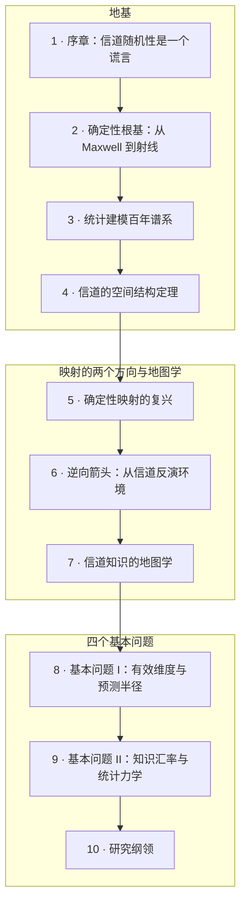

# 第一部 · 环境的科学

**总论题：无线信道是环境的确定性泛函，"随机衰落"是认识论的权宜而非本体论的事实。**

Maxwell 方程是确定性的：给定环境的几何与材质、收发的位置，信道完全确定。教科书把信道教成"随机过程"，只是因为我们不知道环境——随机性度量的是无知，不是世界。本部把这个视角展开成一门科学：环境→信道映射 $\Phi:\mathcal{E}\to\mathcal{H}$ 的正问题、逆问题、地图学，以及四个基本问题：

- **Q1 有效维度**：环境里有多少信息是信道真正"看得见"的？
- **Q2 预测半径**：信道场从部分观测外推的边界在哪里？
- **Q3 知识汇率**：一比特环境知识，值多少比特容量？
- **Q4 统计力学**：什么样的几何"洗出"什么样的衰落分布，普适性何时破缺？

## 本部地图

| 章 | 主题 | 性质 |
|---|---|---|
| [1 · 序章](01-lie-of-randomness.md) | 为什么说随机性是谎言；四问总览 | 观点与导读 |
| [2 · 确定性根基](02-maxwell-foundations.md) | Maxwell→亥姆霍兹→射线；四大传播机制 | 经典物理 |
| [3 · 统计谱系](03-statistical-lineage.md) | 从 Clarke 到 3GPP：每个模型藏起了什么 | 经典谱系 |
| [4 · 空间结构](04-spatial-structure.md) | 波数带限、$\lambda/2$ 采样、空间自由度 | 定理密集 |
| [5 · 确定性复兴](05-deterministic-revival.md) | 射线追踪→可微分引擎→神经代理 | 工程前沿 |
| [6 · 逆向箭头](06-inverse-problem.md) | 逆散射、radio SLAM、可辨识性 | 数学+前沿 |
| [7 · 地图学](07-channel-cartography.md) | Radio Map / CKM / Channel Charting 统一观 | 前沿评估 |
| [8 · 基本问题 I](08-dimension-and-prediction.md) | Q1 有效维度 · Q2 预测半径 | 原创问题 |
| [9 · 基本问题 II](09-exchange-and-universality.md) | Q3 知识汇率 · Q4 统计力学 | 原创问题 |
| [10 · 研究纲领](10-research-agenda.md) | 四问组装；接口；路线图 | 纲领 |

!!! tip "一句话版本"
    第 1–4 章告诉你**信道从哪里来**（确定性物理 + 我们为何选择遗忘），第 5–7 章告诉你**领域正在如何找回环境**（正向、逆向、地图），第 8–10 章提出**这门科学缺的四个定理**。
