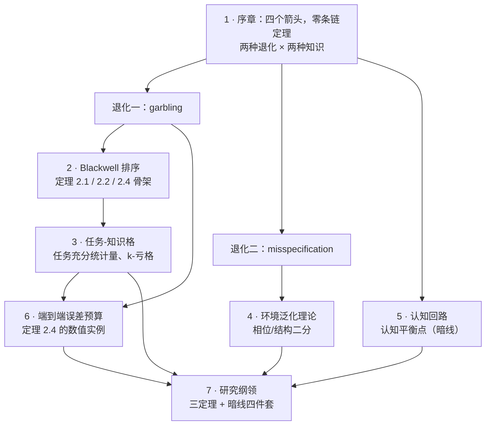

# 1 · 序章：四个箭头，零条链定理

一条链上有四个箭头。每个箭头都有人做到了最好，整条链却没有人能算账。

这句话可以写成一个具体场景：一位工程师面前摆着六份报告，来自信道建模组、信道估计组、CSI 压缩组、反馈协议组、预编码组、调度组。每份报告的数字都在变好——建模误差降 3 dB，估计 NMSE 降 2 dB，反馈开销降 80%，波束对准精度升到 92%……他要回答的问题只有一个：**用户的吞吐量会涨多少？**

没有人能回答。不是因为仿真不够快，而是因为**从来没有人写下过那条把六个数字连起来的定理**。

本部就是关于这条缺失的定理的。序章的任务是把"缺失"说清楚：缺的到底是什么，为什么现有的四门理论加不出来，以及——这是本部真正的赌注——**骨架其实已经存在，只是没有人把无线的数字填进去。**

!!! note "本章预备知识"
    本章只需要概率论、线性代数、信号与系统的本科内容。用到的预备篇章节：

    - 条件概率与贝叶斯公式、熵 $H(\cdot)$、互信息 $I(\cdot;\cdot)$、二元熵函数 $h(\cdot)$、数据处理不等式：[预备篇 4](../part0/04-information-theory-basics.md)。
    - 二元对称信道 BSC 与二元擦除信道 BEC：[预备篇 4.5](../part0/04-information-theory-basics.md)。记号提醒：预备篇把二元熵写作 $H_b(\cdot)$、BSC 的翻转概率写作 $\varepsilon$、BEC 的删除概率写作 $\delta$；本章分别改写作 $h(\cdot)$、$q$ 与 $\epsilon$（本章的 $\epsilon$ 是 BEC 的擦除概率，不是 BSC 的翻转概率），因为本部用 $\delta$ 表示 Le Cam 亏格（§1.5）。
    - 条件期望、MMSE 估计等于条件均值：[预备篇 4.10](../part0/04-information-theory-basics.md)。
    - 信道、CSI、导频与信道估计：[预备篇 2](../part0/02-wireless-channel-basics.md)。
    - MIMO 预编码与有限速率反馈：[预备篇 5](../part0/05-mimo.md)。
    - 语义通信、信息瓶颈、AI 空口的当代图景：[预备篇 9](../part0/09-new-landscape.md)。

    **不需要测度论。**全部"马尔可夫核"在本部一律读作"一张条件概率表"；字母表有限时，它就是一个每行加起来等于 1 的矩阵。本章出现的所有实验、退化、模拟，都可以只用矩阵乘法理解。

---

## 1.1 一条真实的流水线：每一环都是 SOTA，整条链没有账本

先把抽象的"链"换成一件真事：**AI 空口的 CSI 压缩反馈**。

大规模 MIMO 的基站要做预编码，就必须知道下行信道 $\mathbf{h}$。终端（UE）通过导频测出 $\mathbf{h}$ 的一个带噪估计，但 $\mathbf{h}$ 是几百上千维的复向量，不可能原样送回基站——上行反馈的容量只有几十到几百比特。于是有了这条流水线：

1. **终端测量**：导频 → 信道估计 $\hat{\mathbf{h}}$。度量是 **NMSE**（归一化均方误差）。
2. **终端压缩**：$\hat{\mathbf{h}}$ → 一个短码字。2018 年 Wen–Shih–Jin 的 **CsiNet** [12] 首次把自编码器用在这里，此后七年论文数以千计。度量是 NMSE 与 **SGCS**（squared generalized cosine similarity，重建向量与真信道方向的余弦相似度平方）。
3. **反馈传输**：码字经上行送到基站。度量是**比特数**与**时延**。
4. **基站解码与决策**：重建 $\tilde{\mathbf{h}}$ → 预编码 → 选 MCS → 调度。度量是**谱效 SE** 与 **UPT**（user perceived throughput，3GPP 的"最终 KPI"）。

四个环节，四类度量，每类都有成熟的优化方法，每环都有人做到了当前最好。

然后 3GPP 在 Release 18 的研究项目里，把整条链端到端评测了一遍。结果写进了 **TR 38.843** [18]：

- 中间 KPI 普遍改善：以 Rel-16 eType II 码本为基线，秩 1 第 1 层的 **SGCS 增益**在小开销（每层 $\le 80$ 比特）时多为 **2.6%–8.8%**，在大开销（$\ge 230$ 比特）时多为 **0.9%–7%**；
- 同等平均 UPT 下，反馈开销能省下一截：4 个来源给出秩 1/2/4 分别省 **10.24%–60%**、**10%–58.33%**、**8%–79%**（FTP 业务），个别来源用特定的矢量量化码本在中等开销档省到约 **83%**；
- 但最终 KPI 的增益小而参差：FTP 业务、资源利用率 $\le 39\%$ 时，**平均 UPT** 增益在秩 1/2/4 分别只有 **0.2% 至 2%**、**−0.3% 至 6%**、**−4% 至 6%**，利用率 $\ge 70\%$ 时也只有 **0.23% 至 9%**、**−0.2% 至 15%**、**−1% 至 17%**。结论章写的是：**RAN1 没能就"推荐 CSI 压缩进入标准化工作"达成共识，列在首位的理由正是性能与复杂度/开销之间的权衡**，另一条是跨厂商联合训练的问题。

以上数字均出自 TR 38.843 V18.0.0（2023-12）第 6.2.2.1、6.2.2.8 节与第 8 章结论 [18]。同一份 TR 的泛化评估（第 6.2.2.2 节）还有更刺眼的一组：模型在一种部署场景训练、拿到另一种场景使用（UMi→UMa、UMa→UMi、UMa→InH）时，13 个来源报告 **SGCS** 相对"就地训练"退化 $-1.69\%$ 到 $-31.6\%$，另有 14 个来源报告退化不到 1.6% 甚至略有提升；[第 2 章 §2.1](02-blackwell.md) 引用的综述转述的正是这组数。要看清它是**中间 KPI 本身**的退化，不是吞吐：**同一个模型在一处测得的改善，换个场景可能几乎不掉，也可能掉三成。**

标准组织的反应很诚实：Rel-19 立项了 CSI 预测、波束预测、定位三个 AI/ML 工作项，**唯独把 CSI 压缩推迟了**；到 Rel-20 才重新推进两侧模型，核心议题变成跨厂商训练协作与互操作。

!!! warning "陷阱：这不是“AI 不行”，也不是“仿真不准”"
    别把上面的故事读成"深度学习被证伪了"。恰恰相反，中间 KPI 的改善**真实且可复现**；问题出在别处——**没有人知道 SGCS 的 0.03 值多少 Mbps。**这个"不知道"不是精度问题而是**类型**问题：SGCS 是余弦相似度，UPT 是速率，换算需要一条定理，而定理不存在。通行做法是跑仿真，但仿真只对**这一组参数**给答案，换个场景就要重跑，且不告诉你为什么。**仿真是查表，不是汇率。**

顺带说明学术产权：**"NMSE 改善不蕴含吞吐改善"是文献共识，不是本站发现。**TR 38.843 的评估是它的官方版本；2024 年 Guo 等 [19]【预印本·未评审】直接用下行 SE 替代 MSE 做训练损失，并报告"以最终任务为目标训练出的、重建更差的模型，可以胜过 NMSE 更优的重建"。本站的新意只在一件事上：**把这些散落各处的"换不了算"现象统一成一条组织原则，并指出它对应哪一条缺失的定理。**

**到此为止我们得到了什么：一个可以被数字钉死的空白。四个环节各有度量、各有 SOTA，而"上一环的一个单位改善值下一环多少"这个换算，在整条链上一次也没有被写下来过。**

---

## 1.2 把链写成算子复合：四个箭头，四种互不换算的度量

现在把故事抽象成记号——目的是让"哪一环缺定理"这句话有地方落脚。

!!! abstract "定义 1.1（链与四个箭头）"
    本部研究的对象是下面这条**算子复合链**：

    $$
    \mathcal{E}\ \xrightarrow{\ \Phi\ }\ h\ \xrightarrow{\ \mathcal{C}\ }\ y\ \xrightarrow{\ \mathcal{D}\ }\ \tilde{h}\ \xrightarrow{\ \pi\ }\ a ,
    $$

    紧凑写法（本部统一约定：本部各章都沿用这里的写法与下面逐个解释的记号）为

    $$
    T=\pi\circ\mathcal{D}\circ\mathcal{C}\circ\Phi(\mathcal{E}) .
    $$

    **记号逐个解释：**

    - $\mathcal{E}$：**环境**（environment）——房间的几何、材质、家具、人；第一部的研究对象。
    - $\Phi$：**传播算子**（propagation operator）——Maxwell 方程把环境映成信道，$h=\Phi(\mathcal{E})$（第一部第 2 章）。
    - $\mathcal{C}$：**观测与编码**（observation and encoding）——导频、前端、量化、压缩，把 $h$ 变成手上的 $y$。
    - $\mathcal{D}$：**译码与重建**（decoding）——把 $y$ 变成基站手上的 $\tilde{h}$。
    - $\pi$：**决策规则**（decision rule / policy）——把 $\tilde{h}$ 变成动作 $a$（选哪个波束、什么 MCS、调度谁）。
    - $T=(A_T,L_T)$：**任务**（task）——动作集 $A_T$ 与损失 $L_T(\theta,a)$，$\theta$ 是决策者关心的未知状态（例如"链路通还是被挡"）；记 $\|L_T\|:=\sup L_T-\inf L_T$，称损失的**振幅**。

    **记号提醒**：字母 $T$ 身兼两职。上面的紧凑写法里，$T$ 指整条链的输出，也就是动作 $a$；这一条里，$T$ 指这条链要完成的任务。凡是 $T$ 出现在下标里（$A_T$、$L_T$、$r_T$），都指任务。

    与本部统一记号的对应：$\mathcal{E}_0$（环境全知）$\to\mathcal{E}_1$（信道 $h$）$\to\mathcal{E}_2$（观测 $y$）$\to\mathcal{E}_3$（译码输出 $\tilde{h}$）。这里带下标的 $\mathcal{E}_k$ 不再是环境本身，而是"决策者只能看到链上第 $k$ 个节点"这样一种观测方案，统计上叫**实验**（白话定义见 §1.2 算例 1.1 之后）：$\mathcal{E}_0$ 直接看到环境，$\mathcal{E}_3$ 只看到译码输出 $\tilde{h}$。

四个箭头，四种度量，四门理论。它们各自都很成熟，问题是**它们互相不说话**：

| 环 | 箭头 | 主流理论 | 该环的度量 | 对下一环说得上话吗 |
|---|---|---|---|---|
| 环境 → 信道 | $\Phi$ | 电磁与逆问题（第一部） | 有效维度 $d_{\mathrm{eff}}(E;\varepsilon)$（$\varepsilon$-秩）、DoF、可辨识性 | 不能。$\varepsilon$-秩不告诉你容量 |
| 信道 → 观测 | $\mathcal{C}$ | 香农信息论 | 容量 $C$、率失真 $R(D)$、互信息 $I(h;y)$ | 不能。比特数不告诉你 MSE |
| 观测 → 重建 | $\mathcal{D}$ | 估计论 | MSE / NMSE、CRB、SGCS | 不能。MSE 不告诉你决策错多少 |
| 重建 → 动作 | $\pi$ | 统计决策论 / 控制 | Bayes 风险 $r_T$、后悔 regret | 只有它直接对着效用 |

*第一部第 8 章的 $d_{\mathrm{eff}}(E;\varepsilon):=\#\{j:\sigma_j(\mathrm{D}\Phi[E])>\varepsilon\sigma_1\}$ 与会议室算例 $1.3\times10^{5}$，就是第一行那个度量的具体形态。*

"互相不说话"是很强的指控，需要证据。最干净的证据是一个**两台仪器、三个度量、三种排序**的例子——它是第 2 章的承重算例，本章原样引用。

!!! example "算例 1.1（承重反例：三个度量给出三种排序）"
    两台"仪器"，都用来观测同一个二元状态 $\theta\in\{+1,-1\}$（例如"链路通 / 链路被挡"），先验等概。**星座约定 $\theta=\pm1$ 必须写明**：若改用 $\{0,1\}$，下面所有 MSE 数字都要除以 4。

    **仪器 A：BEC(0.6)**（二元擦除信道，擦除概率 $\epsilon=0.6$）。输出取值于 $\{+1,\ \mathrm{e},\ -1\}$，$\mathrm{e}$ 表示"什么也没看到"。条件概率表（行 = 状态，列 = 读数，顺序 $(+1,\mathrm{e},-1)$）：

    $$
    \mathbf{P}^{\mathrm{BEC}(0.6)}=\begin{pmatrix}0.4&0.6&0\\0&0.6&0.4\end{pmatrix}.
    $$

    **仪器 B：BSC(0.2)**（二元对称信道，交叉概率 $q=0.2$）。输出取值于 $\{+1,-1\}$：

    $$
    \mathbf{P}^{\mathrm{BSC}(0.2)}=\begin{pmatrix}0.8&0.2\\0.2&0.8\end{pmatrix}.
    $$

    一句话对照：**BEC 从不骗你但经常什么都不说，BSC 总说点什么但有时是假的。**

    **度量一：互信息（信息论）。**BEC 的擦除事件与 $\theta$ 独立，没擦除时完全知道 $\theta$，故 $H(\theta\mid y)=\epsilon H(\theta)+(1-\epsilon)\cdot 0=\epsilon$，于是

    $$
    I_{\mathrm{BEC}}=H(\theta)-H(\theta\mid y)=1-\epsilon=\mathbf{0.400}\ \text{bit}.
    $$

    BSC 输出等概故 $H(y)=1$；给定 $\theta$ 时输出是伯努利($q$)，$H(y\mid\theta)=h(q)$。代入 $q=0.2$：$h(0.2)=0.2\times2.3219+0.8\times0.3219=0.7219$，于是

    $$
    I_{\mathrm{BSC}}=1-h(0.2)=\mathbf{0.2781}\ \text{bit}.
    $$

    **BEC 赢 0.122 比特。**

    **度量二：MMSE（估计论）。**BEC：没擦除时估计值即真值、误差 0；擦除时最优估计 $\mathbb{E}[\theta\mid\mathrm{e}]=0$、误差 $\theta^2=1$。故 $\mathrm{MMSE}_{\mathrm{BEC}}=\epsilon=\mathbf{0.60}$。

    BSC：MMSE 估计就是条件均值 $\mathbb{E}[\theta\mid y]$（[预备篇 4.10](../part0/04-information-theory-basics.md)）。先验等概，由贝叶斯公式 $\Pr\{\theta=+1\mid y=+1\}=\frac{0.5(1-q)}{0.5(1-q)+0.5q}=1-q$，故 $\mathbb{E}[\theta\mid y=+1]=(1-q)-q=1-2q$；由对称性 $\mathbb{E}[\theta\mid y=-1]=-(1-2q)$，合写为 $\mathbb{E}[\theta\mid y]=(1-2q)y$。又因 $\theta y=+1$（读数正确）的概率是 $1-q$、$\theta y=-1$ 的概率是 $q$，得 $\mathbb{E}[\theta y]=1-2q$。展开平方并用 $\theta^2=y^2=1$：

    $$
    \begin{aligned}
    \mathrm{MMSE}_{\mathrm{BSC}}
    &=\mathbb{E}[\theta^2]-2(1-2q)\mathbb{E}[\theta y]+(1-2q)^2\mathbb{E}[y^2]\\
    &=1-2(1-2q)^2+(1-2q)^2\\
    &=1-(1-2q)^2=4q(1-q)=4(0.2)(0.8)=\mathbf{0.64}.
    \end{aligned}
    $$

    **BEC 又赢 0.04。**

    **度量三：最优硬判决错误概率（决策论）。**BEC：没擦除判对，擦除只能猜、错一半，$P_{\mathrm{e}}^{\mathrm{BEC}}=\epsilon/2=\mathbf{0.30}$。BSC：最大后验判决就是"照读数报"，$P_{\mathrm{e}}^{\mathrm{BSC}}=q=\mathbf{0.20}$。

    **这一次 BSC 赢 0.10。**

    **校验：**（a）三个闭式各自代入 $\epsilon=0.6$、$q=0.2$ 独立复算：$1-\epsilon=0.400$、$\epsilon=0.60$、$\epsilon/2=0.30$；$1-h(0.2)=0.2781$、$4q(1-q)=0.64$、$q=0.20$ ✓。（b）恒等式检验：$1-(1-2q)^2=1-0.36=0.64=4\times0.2\times0.8$，两种参数化给出同一个数 ✓。（c）极限退化：$\epsilon\to0$ 时三项 $\to(1,\,0,\,0)$（完美观测），$\epsilon\to1$ 时 $\to(0,\,1,\,0.5)$（一无所知）；$q\to0$ 与 $q\to1/2$ 时 BSC 三项退化到同样这两组 ✓。（d）与第 2 章交叉核对：本例的三组数字与 [第 2 章算例 2.2](02-blackwell.md) 逐位一致 ✓。

这个例子说明的不是"某个度量算错了"，而是：

> **NMSE、互信息、判决错误率都是合法的度量，但它们不是同一个序。**在同一对方案上，它们会给出互相冲突的排名。

第 2 章把这句话推到极限形态：**Blackwell 序**（Blackwell order）——"$\mathcal{E}$ 在一切任务上都不输于 $\mathcal{F}$"——是**偏序**（partial order）而非全序，绝大多数成对方案根本不可比。算例 1.1 的两台仪器就是一对不可比的实验：MMSE 任务上 BEC 赢，硬判决任务上 BSC 赢，谁都做不到"在一切任务上不输"。详见 [第 2 章 §2.5](02-blackwell.md)，那里还给出了它在 less noisy 意义下仍可比的精确边界。less noisy 是比 Blackwell 序弱的一种比较：只要求对任何由 $\theta$ 派生出的随机变量 $U$，$\mathcal{E}$ 的读数保留的关于 $U$ 的互信息都不少于 $\mathcal{F}$ 的读数。

上段的 $\mathcal{E},\mathcal{F}$ 就是两台"仪器"，统计决策论叫它们**实验**（statistical experiment），记作 $\mathcal{E}=(P_\theta)_{\theta\in\Theta}$：对每个可能的状态 $\theta$，给出读数的一个概率分布 $P_\theta$。字母表有限时，它就是算例 1.1 那样的条件概率表，第 $\theta$ 行就是 $P_\theta$。例如 BEC(0.6) 这个实验由 $P_{+1}=(0.4,\,0.6,\,0)$ 与 $P_{-1}=(0,\,0.6,\,0.4)$ 组成（正式定义见[第 2 章定义 2.1](02-blackwell.md)）。**记号提醒**：定义 1.1 里不带下标的 $\mathcal{E}$ 是环境；从这里起，谈 Blackwell 序与亏格时的 $\mathcal{E},\mathcal{F}$ 都指实验，带下标的 $\mathcal{E}_k$ 也是实验。

**到此为止我们得到了什么：一个记号和一个反例。链被写成了 $T=\pi\circ\mathcal{D}\circ\mathcal{C}\circ\Phi(\mathcal{E})$，四环四度量各归其位；而算例 1.1 用六个数字证明了这四种度量不能相互替代——不是精度不够，是它们排的根本不是同一个序。**

---

## 1.3 两种退化，两种知识：本部的组织原则

链上会出什么事？看着千头万绪：量化误差、压缩失真、反馈时延、CSI 老化、跨场景失配、两家厂商的编解码器对不上……本部的第一个主张是：**这些事只有两类。**

!!! abstract "定义 1.2（链上知识的两种退化）【本站提法】"
    设某一环的知识由条件概率表（行随机矩阵）$\mathbf{P}$ 描述，决策者据此行动。

    **退化一 · garbling（信息丢了）。**存在一个**不含 $\theta$** 的行随机矩阵 $\mathbf{K}$，使新的表变成

    $$
    \mathbf{Q}=\mathbf{P}\mathbf{K}.
    $$

    观测之后再过一道核：量化、压缩、译码、加噪、丢包，全在此列。把以 $\mathbf{P}$ 为表的实验记作 $\mathcal{E}$、以 $\mathbf{Q}$ 为表的记作 $\mathcal{F}$，此时记 $\mathcal{E}\succeq\mathcal{F}$，读作"$\mathcal{E}$ 至少与 $\mathcal{F}$ 一样有信息"（Blackwell 序；正式定义见[第 2 章定义 2.2](02-blackwell.md)）。

    **白话**：garbling 直译"搅乱"，中文也叫乱化 / 后处理——拿到读数之后，只凭读数本身再做一次（可以带随机性的）加工，不回头偷看 $\theta$。$\mathbf{K}$ 的第 $(y,z)$ 格是"读数 $y$ 被加工成 $z$"的概率，所有状态共用同一个 $\mathbf{K}$。例如给算例 1.1 的 BEC(0.6) 加一道"遇到擦除就扔硬币报 $\pm1$"的加工（$\mathbf{K}$ 的三行依次对应读数 $+1,\mathrm{e},-1$）：

    $$
    \mathbf{P}^{\mathrm{BEC}(0.6)}\mathbf{K}
    =\begin{pmatrix}0.4&0.6&0\\0&0.6&0.4\end{pmatrix}
    \begin{pmatrix}1&0\\ \tfrac12&\tfrac12\\0&1\end{pmatrix}
    =\begin{pmatrix}0.7&0.3\\0.3&0.7\end{pmatrix}
    =\mathbf{P}^{\mathrm{BSC}(0.3)} .
    $$

    所以 BSC(0.3) 是 BEC(0.6) 的一个 garbling。它的硬判决错误率是 0.30，与算例 1.1 里 BEC(0.6) 的 0.30 相同：擦除时扔硬币，本来就是 BEC 做硬判决的最优做法。

    **退化二 · misspecification（模型错了）。**表**没有**变成 $\mathbf{P}\mathbf{K}$；变的是决策者**以为**的表：他手上是 $\tilde{\mathbf{P}}\ne\mathbf{P}$，并据此算后验、设计译码器与策略。换城市、换厂商、仿真到实网、两侧模型不一致，全在此列。

    **一句话记住差别：garbling 改的是矩阵本身，misspecification 改的是"你以为的矩阵"。**

先用一个 $2\times2$ 的最小数字例子把两者摆在一起。真实的表是 $\mathbf{P}=\mathbf{P}^{\mathrm{BSC}(0.1)}$。

**garbling 的样子。**再串一个 BSC(0.2)，即 $\mathbf{K}=\mathbf{P}^{\mathrm{BSC}(0.2)}$：

$$
\mathbf{P}\mathbf{K}
=\begin{pmatrix}0.9&0.1\\0.1&0.9\end{pmatrix}
\begin{pmatrix}0.8&0.2\\0.2&0.8\end{pmatrix}
=\begin{pmatrix}0.74&0.26\\0.26&0.74\end{pmatrix}
=\mathbf{P}^{\mathrm{BSC}(0.26)} .
$$

（左上角 $=0.9\times0.8+0.1\times0.2=0.74$，右上角 $=0.9\times0.2+0.1\times0.8=0.26$；另一行由对称性左右互换。）**表真的变差了**：判决错误率从 0.10 升到 0.26。

**misspecification 的样子。**表还是 $\mathbf{P}^{\mathrm{BSC}(0.1)}$，但决策者以为它是 $\mathbf{P}^{\mathrm{BSC}(0.9)}$（比如两根天线的标号接反了）。他会把每个读数**反过来**解释，判决错误率从 0.10 跳到 **0.90**——比任何 garbling 都糟。可若他只是以为交叉概率是 0.3 而不是 0.1，最优判决规则**一点没变**（二元对称下只要 $q<1/2$，MAP 都是"照读数报"），错误率仍是 0.10——**模型错了，代价却是零。**

这个小例子已经把两种退化的差别说尽了：

!!! success "关键结论：两种退化的数学性质完全不同"
    - **garbling 是单调的**：只会让信息变少，方向确定。下一节的数据处理不等式管得住它，Blackwell 与 Le Cam 的整套理论也管得住它。
    - **misspecification 不是单调的**：可以造成任意大的损失（上例 0.90），也可以毫发无伤（上例 0.10），甚至在决策者受限时用错的模型反而更好（稳健统计的常见现象）。**没有任何数据处理不等式管得住它。**

    这就是本部用两条线索组织的原因：第 2、3、6 章处理 garbling（第 3 章用间接率失真给任务格定价），第 4 章处理 misspecification。

链上还有第二个二分，与第一个正交。第一部第 9 章已指出："**易逝品已有定价理论、耐用品还没有。**"

!!! tip "直觉：牛奶与冰箱"
    - **易逝品（perishable）：观测。**这一帧的 CSI、这一次的雷达回波，价值随时间迅速归零（工程名字叫 CSI 老化），用一次就没了。统计决策论里它叫**实验**（experiment）。
    - **耐用品（durable）：环境知识。**信道知识地图、场景模型、训练好的编解码器。一次建库反复使用，成本可摊销到成千上万次决策。统计决策论里它叫**先验**（prior）或**核**（kernel）。

    香农理论对易逝品有完整定价（容量、率失真），对耐用品几乎无话可说——第一部第 9 章的"知识汇率"$\Delta C(R_{\mathrm{env}})$【开放·本站提法】就是这张缺失的价目表。

两个二分交叉，得到本部的组织矩阵：

| | **garbling（信息丢了）** | **misspecification（模型错了）** |
|---|---|---|
| **易逝品**（观测 / CSI / 回波） | CSI 量化、压缩、丢包、SNR 下降 → **第 2 章**（序与亏格）、**第 6 章**（误差预算） | CSI 老化、错误信道模型、失配译码 → **第 4 章**（Lapidoth 最坏噪声、GMI） |
| **耐用品**（地图 / 模型 / 先验） | 地图分辨率粗化、码本比特数下降、模型压缩 → **第 2 章**引理 2.5、**第 3 章**（任务充分统计量） | 跨城市部署、仿真到实网、两侧模型不一致 → **第 4 章**（物理泛化界、相位/结构二分） |

**产权声明。**两个退化概念在文献里各自成熟（garbling 是 Blackwell 1953 [3]，misspecification 是失配译码与分布偏移学习论）；耐用品/易逝品是经济学的老比喻。**把二者交叉成一张 $2\times2$ 表来组织无线链上的知识退化，是本站提法【本站提法】**，不是文献共识。

{ .chart loading=lazy }
{ .chart loading=lazy }

*怎么读这张图：横轴是"痛点更像信息被后处理掉了，还是更像模型描述错了对象"；纵轴是"受影响的知识更像用一次就没的观测，还是更像可摊销的模型"。坐标是本站按定义 1.2 对七个场景做的定性定位【本站提法】，不是测量值，用途是**指出该去本部的哪一章**：左下去第 2、6 章，左上去第 2、3 章，右侧去第 4 章。3GPP 两侧模型落在右上角最远处——它同时是耐用品问题和模型错误问题，这就是它最难的原因。*

**到此为止我们得到了什么：一张组织表。链上千头万绪的故障被归成两类退化（信息丢了 / 模型错了）与两类知识（易逝品 / 耐用品），四个格子分别对应本部的四章。这张表不是分类学趣味——它决定了一个具体的工程问题该用哪套数学。**

---

## 1.4 数据处理不等式：只给方向，不给汇率

信息论里确实有一条"链上的定理"，而且是第一门课就教的那条：**数据处理不等式**（data processing inequality，DPI）。本节把它老实写一遍，再指出它为什么不够用。

!!! abstract "定理 1.1（数据处理不等式）【已解决（经典）】"
    设 $\theta\to y\to z$ 构成马尔可夫链，即给定 $y$ 之后 $z$ 与 $\theta$ 条件独立（$z$ 只由 $y$ 生成，不偷看 $\theta$）。则

    $$
    I(\theta;z)\ \le\ I(\theta;y).
    $$

    出处：香农信息论的标准结果，见 [预备篇 4](../part0/04-information-theory-basics.md)。

**证明（四步，不跳步）。**

**第一步（把两条链式分解写出来）。**互信息的链式法则说：把 $(y,z)$ 一起观测所得到的关于 $\theta$ 的信息，可以按两种顺序拆开——先算 $z$ 再补 $y$，或者先算 $y$ 再补 $z$：

$$
\begin{aligned}
I(\theta;y,z)&=I(\theta;z)+I(\theta;y\mid z),\\
I(\theta;y,z)&=I(\theta;y)+I(\theta;z\mid y).
\end{aligned}
$$

*这一步只用了链式法则本身，两式左端是同一个量，所以右端相等。*

**第二步（用马尔可夫性杀掉一项）。**马尔可夫性 $\theta\to y\to z$ 的意思正是"给定 $y$ 时 $z$ 与 $\theta$ 独立"，而条件互信息为零与条件独立是等价的：$I(\theta;z\mid y)$ 等于"给定 $y$ 时的联合分布 $p(\theta,z\mid y)$"与"两个条件边缘之积 $p(\theta\mid y)\,p(z\mid y)$"之间 KL 散度按 $y$ 的平均（KL 见[预备篇 4.4](../part0/04-information-theory-basics.md)）；条件独立时两者处处相等，KL 为零：

$$
I(\theta;z\mid y)=0 .
$$

*这一步是全证明唯一用到物理假设的地方：$z$ 是由 $y$ 生成的，生成过程不许偷看 $\theta$。这与定义 1.2 中 garbling 要求"$\mathbf{K}$ 里不含 $\theta$"是同一句话。*

**第三步（代入并整理）。**把第二步代进第一步的两个等式，得

$$
I(\theta;z)+I(\theta;y\mid z)=I(\theta;y).
$$

**第四步（丢掉一个非负项）。**互信息永远非负，$I(\theta;y\mid z)\ge0$，故

$$
I(\theta;z)=I(\theta;y)-I(\theta;y\mid z)\ \le\ I(\theta;y).\qquad\blacksquare
$$

链 $\mathcal{E}\to h\to y\to\tilde{h}\to a$ 上每一环的输出只由上一环的输出生成，不回头看环境，所以"环境、第 $k$ 环、第 $k+1$ 环"总构成定理 1.1 要求的马尔可夫链（$\theta$ 取环境 $\mathcal{E}$）。逐环用三次，就得到教科书版的"链上定理"。式中 $\mathcal{E}$ 是环境；最左边的 $T$ 按定义 1.1 的紧凑写法指整条链的输出，即动作 $a$：

$$
I(\mathcal{E};T)\ \le\ I(\mathcal{E};\tilde{h})\ \le\ I(\mathcal{E};y)\ \le\ I(\mathcal{E};h).
$$

**物理意义。**这条链说的是一件符合直觉的事：**环境的信息只可能在传递中损耗，不可能凭空增加。**自编码器再聪明，也不能让重建的 $\tilde{h}$ 比原始观测 $y$ 含有更多关于环境的信息。这是链上唯一一条被普遍承认的定理，它保证了"箭头的方向"。

**行为分析。**关键在于它**没有**说什么。第四步丢掉的 $I(\theta;y\mid z)$ 正是"丢了多少信息"，DPI 把它整个扔掉，只留一个不等号。于是：

- 它不说**丢了多少**——掉 0.1 比特可能无关痛痒，也可能是灾难；
- 它不说**丢的那部分值多少**——比特是信息的单位，不是价值的单位；
- 更要命的是**它只在链上有效**：两个方案若不是彼此的后处理（不构成马尔可夫链），DPI 一句话都说不出来。算例 1.1 的 BEC 与 BSC 正是如此——互信息高 0.122 比特，判决错误率却高 0.10。**互信息大的那台仪器，在判决任务上更差。**

第三条是本章标题"零条链定理"的技术含义，也是历史上最早被点破的一件事。

!!! abstract "命题 1.2（决策的价值不是熵的函数）【已解决（经典）】"
    信息的**决策价值**（value of information）由不确定性的概率结构与其**经济后果**共同决定，不能表示为不确定性的熵（或任何单一信息度量）的函数。

    出处：R. A. Howard, "Information Value Theory," *IEEE Trans. Systems Science and Cybernetics*, vol. 2, no. 1, pp. 22–26, 1966 [5]。**本章的当场演示**：算例 1.1 给出一对反例：

    | | 互信息（bit） | 判决错误率 |
    |---|---|---|
    | BEC(0.6) | 0.400 | 0.30 |
    | BSC(0.2) | 0.278 | 0.20 |

    互信息高 0.122 比特，判决**多错 10 个百分点**。若价值是熵的函数，这不可能发生。**状态**：Howard 的论断是 1966 年的经典结论，本站只是演示了它的无线版本【已解决（经典）·本站搬运】。

那么工程上究竟有没有汇率？有——但它是**浮动的**，浮动幅度大到不能当常数用。下面这个算例把"浮动"变成一个具体的倍数。

!!! example "算例 1.2（1 dB 的 NMSE 到底值多少 bps/Hz）"
    **场景**：$M=4$ 根发射天线的 MU-MIMO 下行，ZF 预编码（[预备篇 5](../part0/05-mimo.md)），用户用 $B$ 比特随机矢量量化（random vector quantization，RVQ）码本反馈信道方向。RVQ 的码本是 $2^B$ 个随机生成的单位向量，用户只回传其中与自己信道方向夹角最小那一个的 $B$ 比特编号；比特越多，码本越密，方向误差越小。Jindal 2006 [8] 的定标律给出每用户速率损失上界形如

    $$
    \Delta R\ \le\ \log_2\bigl(1+P\cdot D\bigr),\qquad D\approx 2^{-B/(M-1)} ,
    $$

    其中 $P$ 是 SNR（线性值；Jindal 的设定里信道各元素与噪声的方差都是 1，$P$ 就是总发射功率），$D$ 是量化引入的方向误差（在这里充当"NMSE"的角色）。上式就是 [8] 的定理 1：$\Delta R$ 是每个用户相对完美 CSI 迫零的速率差；引理 1 给出 $D<2^{-B/(M-1)}$ 这一严格上界，原文称它在数值上非常准确。

    **第一问：要把速率损失压在 1 bps/Hz 以内，需要多少反馈比特？**令 $\log_2(1+PD)\le1$，即 $PD\le1$，即 $2^{-B/(M-1)}\le1/P$，取对数：

    $$
    B\ \ge\ (M-1)\log_2 P .
    $$

    这正是 [8] 定理 3 取 $b=2$ 的情形：定理 3 说，要把每用户速率差压在 $\log_2 b$ 以内，只需 $B=(M-1)\log_2 P-(M-1)\log_2(b-1)$，$b=2$ 时第二项为零。它也与第一部第 9 章的口径 $B\approx(M-1)\log_2 P$ 一致。代入 $M=4$：

    - $P=10$ dB：$\log_2 10=3.32$，$B\ge 3\times3.32=\mathbf{9.97}\approx10$ 比特；
    - $P=20$ dB：$B\ge 3\times6.64=\mathbf{19.93}\approx20$ 比特；
    - $P=30$ dB：$B\ge 3\times9.97=\mathbf{29.90}\approx30$ 比特。

    **SNR 每升 10 dB，反馈开销就要增加约 10 比特**——这正是 Jindal 那条已核实的定性结论："反馈速率必须随 SNR(dB) 线性增长，才能保住完整的复用增益。"

    **第二问（本章真正要问的）：同样 1 dB 的 NMSE 改善值多少速率？**记 $D=10^{d/10}$，对 $\Delta R(d)=\log_2(1+P\cdot10^{d/10})$ 求导（链式法则，$\mathrm{d}D/\mathrm{d}d=D\ln10/10$）：

    $$
    \frac{\mathrm{d}\,\Delta R}{\mathrm{d}d}
    =\frac{P}{(1+PD)\ln 2}\cdot\frac{D\ln 10}{10}
    =\underbrace{\frac{\ln 10}{10\ln 2}}_{=\,0.3322}\cdot\frac{PD}{1+PD} .
    $$

    式子把答案写在脸上：**边际汇率只依赖乘积 $PD$，从 0 连续变到 0.3322。**取 $P=20$ dB（$P=100$）：

    - 若 $D=-20$ dB（$PD=1$）：把 NMSE 从 $-20$ 改善到 $-21$ dB，$\Delta R$ 从 $\log_2 2=1.0000$ 降到 $\log_2(1+100\times10^{-2.1})=\log_2 1.7943=0.8434$，**省下 0.1566 bps/Hz**。
    - 若 $D=-40$ dB（$PD=0.01$）：从 $-40$ 改善到 $-41$ dB，$\Delta R$ 从 $\log_2 1.01=0.014355$ 降到 $\log_2 1.0079=0.011414$，**只省下 0.00294 bps/Hz**。

    **同样的 1 dB，值 53 倍的差别**（$0.1566/0.00294=53.2$）。而这还只是**同一任务、同一公式**内的浮动；换成 64 波束的离散选择任务，1 dB 可能一分不值（没跨过决策边界），也可能值 10 dB（错格）——第一部第 7 章的口径是"增益图差 1 dB 几乎不伤功控，BIM 错一格损失 10 dB 量级"。

    **校验：**（a）**导数与有限差分对照**：$D=-20$ 与 $-21$ dB 的几何中点处 $PD=\sqrt{1\times0.7943}=0.8912$，导数公式给 $0.3322\times0.8912/1.8912=0.1565$，与有限差分 $0.1566$ 相符 ✓；$-40/-41$ dB 处中点 $PD=0.008912$，公式给 $0.002934$，有限差分 $0.002941$ ✓。（b）**两个极限**：$PD\to\infty$ 时汇率 $\to0.3322$，恰等于 $1/(10\log_{10}2)=1/3.01$，即"3 dB 换 1 比特"的高 SNR 法则 ✓；$PD\to0$ 时汇率 $\to0.3322\,PD\to0$ ✓。（c）**两问自洽**：$B\ge(M-1)\log_2 P$ 的临界点正是 $PD=1$，而该处汇率 $0.3322/2=0.1661$ 恰是最大值的一半——门限就落在汇率下跌的中点 ✓。

{ .chart loading=lazy }
{ .chart loading=lazy }

*怎么读这张图：两条曲线是同一个式子 $0.3322\,PD/(1+PD)$ 在 $P=20$ dB（下方那条）与 $P=30$ dB（上方那条）下的取值，数据点由算例 1.2 的有限差分逐点算出。**这张图就是"没有汇率"的图像证据**：如果 NMSE 与吞吐之间存在一个固定汇率，这两条曲线应当是两条水平直线；实际上它们从 0.0003 一路爬到 0.33，跨越三个数量级，而且随 SNR 整体平移 10 dB。工程含义：在曲线平坦的左端拼命优化 NMSE 是浪费，在陡峭的中段每 1 dB 都值钱。*

**到此为止我们得到了什么：一条真定理和它的边界。DPI 是链上唯一现成的定理，它给出了方向——信息只减不增——但它丢掉的恰恰是我们要的那一项。而且它只在链上有效：一旦两个方案不是彼此的后处理，连方向都没有了（算例 1.1）。Howard 1966 早就说过，价值不是熵的函数；算例 1.2 则量化了这句话——同样 1 dB，汇率能差 53 倍。**

---

## 1.5 目标形态：带汇率的数据处理不等式

缺的那条定理长什么样？答案出人意料地朴素：**骨架已经写好了 60 年，只是没人把无线的数字填进去。**要把 DPI 从"方向"升级成"汇率"，得换一个量：不再问"丢了几比特"，而问**"用退化后的知识去冒充退化前的知识，在最坏的任务上会输多少"**。这个量就是 **Le Cam 亏格**（deficiency）。

!!! abstract "定义 1.3（Le Cam 亏格，本部统一约定）"
    总变差距离取**半 $L_1$** 约定：$\|P-Q\|_{\mathrm{TV}}:=\tfrac12\sum_z|P(z)-Q(z)|\in[0,1]$。白话：它等于两个分布给同一个事件的概率最多能差多少。例如 $(0.9,\,0.1)$ 与 $(1,\,0)$ 的总变差是 $\tfrac12(0.1+0.1)=0.1$，恰是两者给"读数为 $+1$"这件事的概率之差。

    亏格定义为

    $$
    \delta(\mathcal{E},\mathcal{F})\ :=\ \inf_{\mathbf{K}}\ \sup_{\theta\in\Theta}\ \bigl\|\mathbf{K}^{\!\top}P_\theta-Q_\theta\bigr\|_{\mathrm{TV}},
    $$

    其中 $\mathbf{K}$ 遍历一切行随机矩阵（把 $\mathcal{E}$ 的观测翻译成 $\mathcal{F}$ 的观测），读作"**用 $\mathcal{E}$ 模拟 $\mathcal{F}$ 差多少**"。**Le Cam 距离** $\Delta=\max\{\delta(\mathcal{E},\mathcal{F}),\delta(\mathcal{F},\mathcal{E})\}$。

    $\delta(\mathcal{E},\mathcal{F})=0\iff\mathcal{E}\succeq\mathcal{F}$：亏格是 Blackwell 序的**连续化**——序只说"是"或"否"，亏格说"差多少"。出处：Le Cam 1964 [4]，系统论述见 Torgersen 1991 [6]；完整定义与线性规划算法见 [第 2 章 §2.6](02-blackwell.md)。

    **半 $L_1$ 约定必须一次讲清**：有些文献省略那个 $\tfrac12$，此时所有亏格数值整体翻倍。本部全站用半 $L_1$。

**怎么读定义 1.3 的式子。**$P_\theta$ 是 $\mathcal{E}$ 的表的第 $\theta$ 行（写成列向量），$\mathbf{K}^{\!\top}P_\theta$ 就是矩阵 $\mathbf{P}\mathbf{K}$ 的第 $\theta$ 行，即"把 $\mathcal{E}$ 的读数按 $\mathbf{K}$ 翻译之后"的分布。对每个候选的 $\mathbf{K}$，先看最坏的 $\theta$ 下翻译结果离 $\mathcal{F}$ 的真实分布 $Q_\theta$ 有多远，再挑最好的 $\mathbf{K}$。所以任取一个 $\mathbf{K}$ 算出来的数都是亏格的上界。

**小例子：用 BEC(0.6) 模拟 BSC(0.2)。**取 §1.3 那个"擦除就扔硬币"的 $\mathbf{K}$，翻译结果是 BSC(0.3)，两行各与 BSC(0.2) 相差 $\tfrac12(|0.7-0.8|+|0.3-0.2|)=0.10$，故 $\delta(\mathrm{BEC},\mathrm{BSC})\le0.10$。[第 2 章算例 2.3](02-blackwell.md) 用线性规划证实 0.10 就是精确值，反方向 $\delta(\mathrm{BSC},\mathrm{BEC})=0.08$。两个方向都不为零，这就是"两台仪器不可比"的定量版本：谁也不能完美模拟谁，而各差多少也有了数。

亏格能当汇率，靠的是第 2 章的两条性质（原样引用，不改口径）：

- **定理 2.2（风险界）**：损失振幅为 $\|L_T\|$ 时，对 $\mathcal{F}$ 上的任何决策规则，存在 $\mathcal{E}$ 上的规则，使每一个 $\theta$ 处的风险至多差 $\|L_T\|\cdot\delta(\mathcal{E},\mathcal{F})$。
- **引理 2.3（三角不等式与两条单调性）**：$\delta(\mathcal{E},\mathcal{G})\le\delta(\mathcal{E},\mathcal{F})+\delta(\mathcal{F},\mathcal{G})$；目标端后处理更容易，$\delta(\mathcal{E},\mathbf{R}\mathcal{F})\le\delta(\mathcal{E},\mathcal{F})$；源端后处理更困难，$\delta(\mathbf{R}\mathcal{E},\mathcal{F})\ge\delta(\mathcal{E},\mathcal{F})$。这里 $\mathbf{R}\mathcal{F}$ 指把 $\mathcal{F}$ 的读数再过一道行随机矩阵 $\mathbf{R}$ 得到的实验（表为 $\mathbf{Q}\mathbf{R}$）：要模拟的对象变差了，自然更好模拟；自己手上的仪器变差了，就更难模拟别人。**注意**：看似自然的"对源与目标做同一次后处理亏格不增"$\delta(\mathbf{R}\mathcal{E},\mathbf{R}\mathcal{F})\le\delta(\mathcal{E},\mathcal{F})$ **是假的**（[第 2 章 §2.6](02-blackwell.md) 给出四符号反例），本部各章不使用它。

这里的"风险"要分清两种。定理 2.2 说的是**逐 $\theta$ 风险**：真实状态为 $\theta$ 时，某条决策规则的期望损失。下面定理 2.4 里的 $r_T(\mathcal{E})$ 是 **Bayes 风险**：拿实验 $\mathcal{E}$ 的读数做任务 $T$，先按先验对 $\theta$ 平均得到期望损失，再在所有决策规则里取最小值。算例 1.1 的硬判决（0-1 损失，$\|L_T\|=1$）就是一例：$r_T(\mathrm{BEC}(0.6))=0.30$，$r_T(\mathrm{BSC}(0.2))=0.20$。把定理 2.2 用在 $\mathcal{F}$ 的 Bayes 最优规则上、再对先验取平均，逐 $\theta$ 的界就变成 $r_T(\mathcal{E})\le r_T(\mathcal{F})+\|L_T\|\,\delta(\mathcal{E},\mathcal{F})$。拿上面的小例子验一下：$0.30\le0.20+1\times0.10$，恰好取等。

两条一拼，就是本部反复要用的骨架：

!!! abstract "定理 2.4（链定理骨架）【已解决（经典）·本站搬运】"
    对链 $\mathcal{E}_0\succeq\mathcal{E}_1\succeq\mathcal{E}_2\succeq\mathcal{E}_3$ 与任务 $T=(A_T,L_T)$，

    $$
    r_T(\mathcal{E}_3)-r_T(\mathcal{E}_0)\ \le\ \|L_T\|\cdot\delta(\mathcal{E}_3,\mathcal{E}_0)\ \le\ \|L_T\|\sum_{k=1}^{3}\delta(\mathcal{E}_k,\mathcal{E}_{k-1}).
    $$

    编号与陈述沿用 [第 2 章 §2.7](02-blackwell.md)（该处给出两行证明）。

    **学术产权声明。**风险界是 Le Cam 1964 [4] 的近似充分性，三角不等式与沿链线性累积是 Le Cam–Torgersen 的标准性质 [4][6]（同类结果在预印本 arXiv:2512.23617 定理 4.2 中亦独立出现【预印本·未评审】）。**本站在此不主张任何新定理。**

**物理意义。**把它和定理 1.1 并排放：

$$
\underbrace{I(\mathcal{E};\tilde h)\le I(\mathcal{E};h)}_{\text{DPI：只说方向}}
\qquad\longrightarrow\qquad
\underbrace{r_T(\mathcal{E}_3)-r_T(\mathcal{E}_0)\le\|L_T\|\sum_k\delta_k}_{\text{链定理：说了多少}}
$$

左边说"信息只减不增"，右边说"每一环丢掉的东西按 $\|L_T\|$ 折算成任务损失，且最多**线性相加**"。这正是本章标题所欠的那条定理，本站称之为**带汇率的数据处理不等式**。

**行为分析。**其一，注意**方向**：链上 $\delta(\mathcal{E}_{k-1},\mathcal{E}_k)=0$（后一环本就是前一环的 garbling），真正花钱的是**反向**亏格 $\delta(\mathcal{E}_k,\mathcal{E}_{k-1})$——"退化之后再想装回去差多少"，这才是每一环的价签。其二，**线性累积**使精度预算可以像功率预算一样分摊到各环（第 6 章主题）。其三，它**通常很松**：三角不等式把各环各自的最坏情形叠加，而各环的最坏任务往往不是同一个。第 2 章算例 2.3 量化过——同一个 $\delta=0.08$ 在 MMSE 任务上松了 8 倍。

下面这个算例把骨架跑一遍，并且让它**恰好取等**——好让读者看见这条界不是空的。

!!! example "算例 1.3（三环链上的误差预算：0.10 + 0.16 = 0.26）"
    **链的三环**（$\theta\in\{+1,-1\}$ 等概）：$\mathcal{E}_0$ 完美观测，表为单位阵 $\mathbf{I}_2$；$\mathcal{E}_1$ 经第一道退化 BSC(0.1)（导频噪声）；$\mathcal{E}_2$ 再经第二道退化 BSC(0.2)（量化与反馈），由 §1.3 的矩阵乘法得 $\mathbf{P}^{\mathrm{BSC}(0.26)}$。这是一条合法的 garbling 链 $\mathcal{E}_0\succeq\mathcal{E}_1\succeq\mathcal{E}_2$。**任务**：0-1 硬判决，$\|L_T\|=1$。

    **第一步：算三个 Bayes 风险。**二元对称等概下最优判决就是"照读数报"，风险即交叉概率：

    $$
    r_T(\mathcal{E}_0)=0,\qquad r_T(\mathcal{E}_1)=0.10,\qquad r_T(\mathcal{E}_2)=0.26 .
    $$

    **端到端任务后悔** $=r_T(\mathcal{E}_2)-r_T(\mathcal{E}_0)=\mathbf{0.26}$。

    **第二步：算第一环的亏格 $\delta(\mathcal{E}_1,\mathcal{E}_0)$。**用 $\mathcal{E}_1$ 的读数去伪造 $\mathcal{E}_0$ 的读数，取最朴素的翻译矩阵 $\mathbf{K}=\mathbf{I}_2$（原样转发）：$\theta=+1$ 时得分布 $(0.9,0.1)$，目标 $(1,0)$，半 $L_1$ 距离

    $$
    \tfrac12\bigl(|0.9-1|+|0.1-0|\bigr)=\tfrac12(0.1+0.1)=0.10 .
    $$

    $\theta=-1$ 由对称性同值，故 $\delta\le0.10$。**反过来卡下界**：定理 2.2 对 0-1 任务给出 $r_T(\mathcal{E}_1)-r_T(\mathcal{E}_0)\le\|L_T\|\,\delta$，即 $0.10\le\delta$。两头一夹：

    $$
    \delta(\mathcal{E}_1,\mathcal{E}_0)=\mathbf{0.10}\ \text{（精确值，不是上界）}.
    $$

    **第三步：算第二环的亏格 $\delta(\mathcal{E}_2,\mathcal{E}_1)$。**同样取 $\mathbf{K}=\mathbf{I}_2$：$(0.74,0.26)$ 对 $(0.9,0.1)$，半 $L_1$ 距离 $\tfrac12(0.16+0.16)=0.16$；下界由 0-1 任务 $0.26-0.10=0.16$。故

    $$
    \delta(\mathcal{E}_2,\mathcal{E}_1)=\mathbf{0.16}.
    $$

    **第四步：把定理 2.4 用上。**

    $$
    \underbrace{0.26}_{\text{实际后悔}}\ \le\ \|L_T\|\sum_{k=1}^{2}\delta(\mathcal{E}_k,\mathcal{E}_{k-1})\ =\ 1\times(0.10+0.16)\ =\ \mathbf{0.26}.
    $$

    **界恰好取等。**这条链上的误差预算可以精确分摊：导频噪声吃掉 0.10，量化与反馈吃掉 0.16。

    **校验：**（a）**独立途径复算 $\mathcal{E}_2$**：串联两 BSC 的总错误概率 $q=p+r-2pr=0.1+0.2-0.04=0.26$，与 §1.3 的矩阵乘法一致 ✓；相关系数恒等式 $1-2q=(1-2p)(1-2r)=0.8\times0.6=0.48\Rightarrow q=0.26$，第三条路径同样得 0.26 ✓。（b）**三角不等式自洽**：$\mathbf{K}=\mathbf{I}_2$ 给 $\delta(\mathcal{E}_2,\mathcal{E}_0)\le\tfrac12(0.26+0.26)=0.26$，0-1 任务下界也是 0.26，故 $\delta(\mathcal{E}_2,\mathcal{E}_0)=0.26=0.10+0.16$，引理 2.3(a) 在此**取等** ✓。（c）**换个任务，界仍成立但变松**：取归一化二次损失 $L=(\theta-a)^2/4\in[0,1]$，风险为 $q(1-q)$，三环分别是 $0$、$0.09$、$0.1924$；后悔 $0.1924\le0.26$ ✓，松了 0.068，与第 2 章算例 2.3(d) 同源 ✓。（d）**极限退化**：令 $r\to0$，则 $\delta(\mathcal{E}_2,\mathcal{E}_1)\to0$、$q\to0.1$，预算退化为单环 0.10 ✓。

那么，如果骨架早就有了，本部还剩什么可做？三件事，一件比一件难：

1. **把每一环的亏格算成数。**算例 1.3 是 $2\times2$ 玩具；真实的一环是"$10^5$ 维信道经几十比特的码字"（TR 38.843 评估的小开销档是每层不超过 80 比特），$\delta$ 是高维优化问题。**这是本部的主要工作量**（第 6 章）。
2. **紧化。**任务无关的亏格对一切任务取最坏，必然松。Torgersen 的 **$k$-亏格** $\delta_k$ 只对动作数 $\le k$ 的问题取最坏：把定理 2.2 里的"一切任务"换成"只有 $k$ 个动作可选的任务"（两边的决策规则都只能在这 $k$ 个动作里选，损失仍取值于 $[0,1]$），能保证的最小风险差就是 $\delta_k$。无线里 $k$ 有直接读数——**切换 $k=2$、64 波束 $k=64$、MCS 档位 $k=29$**。$\delta_k\le\delta$ 是定理 2.2 的直接推论（动作数不超过 $k$ 的问题也在定理 2.2 管辖之内，风险差都不超过 $\delta$），能紧多少是第 3 章的主题。还要分清一点：定义 1.3 用**一个**翻译矩阵 $\mathbf{K}$ 写出的 $\delta$，恰好等于"对一切任务取最坏的风险差"，这条等价叫 Le Cam 的**随机化准则** [4]；$\delta_k$ 的定义不要求共用一个矩阵，$\mathcal{F}$ 上每一条 $k$ 动作规则都可以在 $\mathcal{E}$ 上单独配一条模仿规则，紧化的余地正来自这里【表述待核：$\delta_k$ 的定义按二手综述核对，Torgersen [6] 第 6 章原文未读到】。
3. **找出它失效的地方。**定理 2.4 的前提是决策者 Bayes 最优。现实里译码器固定、算力有限、模型是训练出来的；决策者一旦次优，Blackwell 定理的等价链就断了，**garbling 甚至可能有益**（第 2 章 §2.8 的"发原始 CSI 还是发波束建议"悖论）。它在离散判决环节如何失效，是第 6 章的落点。

**到此为止我们得到了什么：本部的目标形态，以及一次诚实的产权划界。带汇率的 DPI 不是本站要证的新定理——它是 Le Cam 1964 的直接推论。本站要做的是把无线链上每一环的 $\delta$ 算成数、把任务限制版紧化、找出它在离散判决上失效的地方。算例 1.3 给了这条路的最小完整样本：0.10 + 0.16 = 0.26，界取等。**

---

## 1.6 四个场景，四张缺失的价目表

组织原则要接得住工程才不算空谈。本节把四个当代场景摆进去，逐个指出：链是哪四环、现在在哪一环优化、缺哪根箭头的汇率、属于哪种退化。

| 场景 | 链的四环 | 目前在优化哪一环 | 缺的那张价目表 | 主导退化 |
|---|---|---|---|---|
| **AI 空口 CSI 压缩**（两侧模型） | 信道 → CSI 估计 → 码字（几十到上百比特）→ 预编码 / UPT | 第 2、3 环（NMSE、SGCS、比特数） | **NMSE / SGCS → UPT** | 同厂商同场景：garbling；跨厂商跨场景：misspecification |
| **ISAC 感知辅助波束管理** | 目标状态 → 回波观测 → 感知估计（CRB）→ 波束选择 / 谱效 | 第 3 环（CRB、检测概率） | **感知精度 → 通信增益** | garbling 为主（波形受限、量化） |
| **数字孪生驱动的网络运维** | 真实网络 → 孪生模型 → 仿真预测 → 控制动作 / SLA | 第 2 环（孪生保真度） | **孪生保真度 → 控制性能** | misspecification 为主（孪生 $\neq$ 实网） |
| **语义 / 目标导向通信** | 信源语义 → 特征 → 信道传输 → 任务执行 / 成功率 | 第 2、3 环（语义相似度、特征维度） | **语义相似度 → 任务成功率** | 两者兼有（有损表示 + 共享背景知识不一致） |

*这张表是本章的骨架：四个场景的困难长得完全不一样，缺的却是同一类东西——**一张把中间量换算成最终量的价目表**。定理 2.4 给出的正是这张表的通用（且保守）版本。*

三个补充说明，各自钉住一个文献事实。**ISAC 的两条路径不得混写**：第一部第 10 章已写明，信息论路径给容量–失真折中 $C(D)=\max_{p(x)\in\mathcal{P}(D)}I(X;Y\mid S)$（点对点已解决，广播只有内外界），估计论路径给 CRB–rate 折中，两条路径**不同构**（综述见 Liu 等 2022 [16]）。**语义通信的合法边界**：Gündüz 等 2023 [17] 整理了"超越比特传输"的图景，但预备篇第 9 章的口径是**"换了度量不是破了定理"**——换了度量，**原来那张价目表也一起作废**，而新的还没有。**耐用品那一栏最空**：CKM 建库是纯耐用品问题，第一部第 7 章的地图 $m_T(\mathbf{x})=T[P(h\mid\mathbf{x})]$ 有四块互不兼容的理论孤岛，$\Delta U(\varepsilon)$【开放·本站提法】完全空白；第 2 章引理 2.5 是第一块砖——**嵌套的分辨率族在 Blackwell 序下全序**，非嵌套的（5 m 对 7 m）一般不可比。

### 方法谱系：各自解决了什么、回答不了什么

工程上并非没人试图跨环。四类方法逐个盘点：

| 方法 | 解决了什么 | 回答不了什么 | 落点 |
|---|---|---|---|
| **信息瓶颈** IB（Tishby 1999 [7]） | 给定任务变量 $Y$，刻画 $X$ 的最优有损表示：$\min I(X;Z)-\beta I(Z;Y)$ | 需**预先指定** $Y$；是一条曲线不是一个序；**操作意义有条件**（见下） | 第 3 章任务格 |
| **端到端学习**（O'Shea–Hoydis 2017 [11]、deep JSCC [13]、CsiNet 一脉 [12]） | 把整条链当自编码器联合训练，实证上优雅退化、无悬崖效应 | 联合优化**无最优性保证**；训练分布外行为未知；不给汇率只给一个数 | 第 4 章泛化 |
| **可微分仿真**（第一部第 5 章） | 物理模型接进梯度回路，校准后射线追踪 3–6 dB RMSE | 只换一组材质参数，实测 RMSE 就从约 5 dB 升到 8–10.5 dB；一个未建模行人 = 21–30 dB | 第 4 章 misspecification |
| **率–失真–感知折中**（Blau–Michaeli 2019 [14]） | 严格证明：固定码率下改善感知质量一般必然恶化失真 | 只覆盖"失真 + 感知"两个度量，不覆盖任务族 | 本章 §1.2 的**文献内先例** |

!!! warning "陷阱：不要说“信息瓶颈没有编码定理”"
    这句话流传很广，但它**过头了**。准确的说法是：

    - **在对数损失（log-loss）下**，IB 曲线确有操作意义。对数损失是指译码器输出一个概率分布，按它给真值的概率取负对数计损失。Courtade–Weissman 2014 [9] 给出了两编码器多端信源编码与 $m$-编码器 CEO 问题（$m$ 个编码器各自看到同一信源的带噪版本，分别压缩后汇报给一个中心译码器，见[第 6 章 §6.6](06-error-budget.md)）在对数损失下的**单字母率失真区域**，IB 曲线正是可达区域的边界。综述见 Goldfeld–Polyanskiy 2020 [15]。
    - **在一般损失下**，没有这样的刻画。把 $I(X;Z)$ 当成任意任务下反馈开销的普适代理，是越界的。

    这是"信息箭头"的精确边界：它在自己的损失函数下是定理，出了这个损失函数就只是一个正则项。变分实现（VIB，Alemi 等 2017 [10]）解决的是可计算性，不改变这条边界。

最后把产权说清楚：**"同一条链上两个度量互不换算"不是本站的发现**——Blau–Michaeli 2019 [14] 就是文献内既有的严格先例（那里是失真与感知，这里是 NMSE 与 UPT）。本站只是把这类点状先例**统一成一条组织原则，并指出它们缺的是同一条定理**。

**到此为止我们得到了什么：四个场景、四张缺失的价目表、四类现有方法的边界。IB 只在对数损失下是定理，端到端学习没有保证，可微仿真被材质误差卡住（只换材质参数，RMSE 就从约 5 dB 升到 8–10.5 dB），率–失真–感知只覆盖两个度量。它们回答不了的那部分，正好拼成本部要立的三条定理。**

---

## 1.7 本部地图、三张价目表，与怎么读这一部

先把历史摆上——本部要用的每一件工具都比读者以为的老。

**从"信息"到"信息的价值"：本部工具的谱系**

| 年份 | 工作 | 要点 |
|---|---|---|
| 1948 | 香农 | 信息量与语义、价值显式解耦 |
| 1953 | Blackwell | 实验比较与 garbling 判据，得到的是偏序 |
| 1960 | Feldbaum | 对偶控制，动作既调节又探测（第 5 章的母体） |
| 1964 | Le Cam | 近似充分性，亏格 $\delta$ 与实验距离 $\Delta$ |
| 1966 | Howard | 信息价值理论，价值不是熵的函数 |
| 1991 | Torgersen | 亏格理论系统化，$k$-亏格 |
| 1999 | Tishby–Pereira–Bialek | 信息瓶颈 |
| 2006 | Jindal | 反馈比特须随 $\mathrm{SNR}_{\mathrm{dB}}$ 线性增长 |
| 2014 | Courtade–Weissman | 对数损失下 IB 获得操作意义 |
| 2018 | Wen–Shih–Jin CsiNet | 深度学习进入 CSI 反馈 |
| 2019 | Blau–Michaeli | 率–失真–感知，度量互不换算的严格先例 |
| 2024 | 3GPP TR 38.843 | 中间 KPI 普遍改善、最终 KPI 增益有限 |
| 2026 | 本站第二部 | 把亏格算成无线链上的数 |

*怎么读这张表：上半段（1948–1966）是统计决策论建立"信息的价值"这门语言的十八年；中段（1991–2014）理论定型与操作化；下半段（2018–2024）是无线工程独立地、以纯经验方式撞上同一堵墙。**本部做的事就是把上半段接到下半段。**Feldbaum 1960 一条是第 5 章对偶控制的母体，本章不展开，故未列入参考文献。*

本部七章的分工如下。

*怎么读这张图：序章分出两条退化线索，左线（garbling）走第 2 → 3 → 6 章，是"骨架 → 紧化 → 算数"三步；右线（misspecification）走第 4 章，工具完全不同（失配译码与分布偏移）。第 5 章是暗线（认知平衡点），第 7 章收口。第 2 章与第 6 章是**同一条定理的两个分辨率**：第 2 章给任务无关的粗档，第 6 章给任务相关的细档。*

本部要立的三条定理与一条暗线，各一句话：

- **知识排序定理**（第 2 章猜想 2.6）：无线实验族（CSI 方案、感知模态、地图分辨率）在 Blackwell / Le Cam 结构下的排序图长什么样——目前只有五个节点确定。
- **任务格与任务充分统计量**（第 3 章）：任务构成一个格；对任务类 $\mathcal{T}$，$\delta_{\mathcal{T}}=0$ 定义了"该任务类的充分统计量"。
- **物理泛化界**（第 4 章）：换环境时性能退化多少，由物理量控制——相位对 $\lambda/4$、结构对特征尺度 $L$，即相位/结构二分。
- **暗线：认知平衡点**（第 5 章）：该花多少资源去"知道"、多少去"做"，位置由第一部 Q3 曲线的形状决定。Q3 曲线即[第一部第 9 章](../part1/09-exchange-and-universality.md)的知识汇率曲线 $\Delta C(R_{\mathrm{env}})$，也就是下表第一行。

最后，把本部放回全站的坐标里。全站有三张价目表，本部是其中一张：

| 价目表 | 记号与出处 | 定价的是什么 | 状态 |
|---|---|---|---|
| **知识汇率**（第一部第 9 章） | $\Delta C(R_{\mathrm{env}})=\sup[C(\text{prior}+\text{env code})-C(\text{prior})]$ | **关于环境的信息**值多少容量 | 【开放·本站提法】两端点已知，中段形状未知（凹增 / 阈值跳变 / 早饱和三条候选） |
| **预测的价目表**（第三部第 5 章） | $V(I)=\sup_{q:\,I(\xi;M)\le I}\sup_{\pi}J(\pi,q)$ | **关于未来的信息**值多少效用 | 【本站原创】单调不减且凹，小 $I$ 处极陡 |
| **退化的价目表**（本部） | $\|L_T\|\cdot\delta(\mathcal{E},\mathcal{F})$，Le Cam 1964 [4] | **知识退化**要赔多少任务风险 | 骨架【已解决（经典）】，无线链上的数值【开放】 |

*三者是同一件事的三个切面：第一部问"多知道一点环境值多少"，第三部问"多知道一点未来值多少"，本部问"少知道一点会赔多少"。第 2 章 Q2.5 猜想三者存在夹逼关系，目前完全空白。*

### 怎么读本部

**缺的是语言（多数无线工程师）**：从第 2 章开始，把它当一门课读完——只用矩阵、不用测度论，Blackwell 定理有完整初等证明。读完你会得到三样东西：一个判据（$\mathbf{Q}=\mathbf{P}\mathbf{K}$ 有没有解）、一个数（亏格，是个小线性规划）、一条界（定理 2.2）；然后跳到第 6 章看它在真实链上怎么算数。

**关心 AI 空口可信性**：主线是第 4 章。跨厂商、跨场景、仿真到实网全是 misspecification，而 3GPP Rel-19 的 LCM（生命周期管理）——按第一部第 10 章的口径——**是保险丝，不是定理**。

**关心 ISAC 或数字孪生**：主线是第 5 章（认知回路与平衡点）加第 3 章（任务格），因为你的问题本质是"感知这个动作既花资源又赚信息"。

**只想知道本部有没有新东西**：答案在第 6、7 章——新东西不是那条不等式，是那些数。

**到此为止我们得到了什么：一张地图和一次定位。本部的七章沿两条退化线索展开；本部在全站三张价目表中负责"退化的定价"；而"怎么读"这一节告诉你，按你的工程问题该从哪一章进。**

!!! info "跨部连线"
    本章所在的线索：[任务与价值](../guide/05-eight-threads.md#8-任务与价值精度要多高才够用)、[极限与基线](../guide/05-eight-threads.md#7-极限与基线离墙还有多远)。

    - [第三部第 1 章「翻转」](../part3/01-three-mountains.md#翻转从怎么解到至少要付多少)：第三部在资源优化里遇到同样的缺口：方法越来越多，"至少要付多少"的逆定理缺席。
    - [第四部 1.5 节](../part4/01-one-counterexample.md#15-信息结构把谁知道什么写成划分)：决策者不止一个时，"谁看见什么"本身成了变量，单决策者的链条就不够用了。

---

## 开放问题

**Q1.1（把亏格算成无线链上的数）【开放·本站提法】。精确陈述**：给定 CSI 压缩链的参数（天线数、子带数、码字比特数、SNR），求 $\delta(\mathcal{E}_{\text{码字}},\mathcal{E}_{\text{原始 CSI}})$ 的上下界。**第一步可证引理**：在第一部第 10 章的单反射面参数化玩具族上把信道离散化成有限字母表，用第 2 章 §2.6 的线性规划算出第一组数。**AI 可攻子问题**：在公开 CSI 数据集上把这个 LP 跑成一张数值排序图。

**Q1.2（中间 KPI 与最终 KPI 的一致性判据）【开放·文献共识】。**什么条件下 NMSE 或 SGCS 的改善**保证** UPT 的改善？这是 3GPP 明写的未决问题，也是算例 1.2 那条"汇率浮动 53 倍"曲线的正面版本。猜想形态：一致性成立当且仅当任务损失落在某个由链结构决定的锥内——目前连这个锥的定义都没有。

**Q1.3（两种退化的二分是否完备）【开放·本站提法】。**定义 1.2 把退化分成两类，但没有证明这个分类**穷尽**。

!!! abstract "猜想 1.3（链退化二分的完备性与可加性）【开放·本站提法】"
    设决策者实际达到的风险为 $r_T^{\mathrm{act}}$，链首端的 Bayes 风险为 $r_T(\mathcal{E}_0)$。猜想存在"误配半径" $\rho$（度量真实条件概率表与决策者所用表的差距），使得

    $$
    r_T^{\mathrm{act}}-r_T(\mathcal{E}_0)\ \le\ \|L_T\|\Bigl(\sum_{k}\delta(\mathcal{E}_k,\mathcal{E}_{k-1})\ +\ \rho\Bigr),
    $$

    即**任何**链上的性能损失都可分解为"信息丢了"与"模型错了"两项之和，分别由亏格与误配半径控制。

    **状态**：第一项已由定理 2.4 给出【已解决（经典）】；第二项的形式、$\rho$ 的正确定义（GMI 型？$\mathcal{H}\Delta\mathcal{H}$ 型？TV 型？）与可加性是否成立**完全开放**。第 4 章会给出 $\rho$ 的两个候选（Lapidoth 1996 的失配译码半径、Ben-David 的分布偏移散度），但不证明可加性。

**Q1.4（$k$-亏格能紧多少）【部分结果】。**无线里动作数 $k$ 通常很小（切换 2、波束 64、MCS 29），而 $\delta_k\le\delta$ 是定理 2.2 的直接推论。问：$\delta_k/\delta$ 在什么样的实验族上显著小于 1？第 2 章 Q2.3 已给出 BEC/BSC 对的具体版本；[第 3 章 Q3.1](03-task-knowledge-lattice.md) 补了一个必要条件：被模拟的实验读数不超过 $k$ 种时 $\delta_k=\delta$，比值要小于 1，被模拟的一方必须比 $k$ 分得更细【本站演算】。$\delta_k$ 的定义见 §1.5 第 2 条【表述待核：Torgersen [6] 第 6 章原文未读到】。

**Q1.5（三张价目表的接口）【开放·本站提法】。**$\Delta C(R_{\mathrm{env}})$、$V(I)$ 与本部的 $\|L_T\|\delta$ 分别是"最优 / 最优 / 最坏"三个方向的定价。第 2 章 Q2.5 猜想三者存在夹逼关系；若成立即得知识汇率的第一个可算上界。目前三条曲线之间没有任何已知定量关系。

**Q1.6（离散判决环节上骨架为何失效）【开放】。**定理 2.4 假设决策者 Bayes 最优；波束索引这类环节上译码器固定、算力受限，"发原始 CSI 还是发波束建议"的悖论（第 2 章 §2.8）说明 garbling 可能有益。**精确陈述**：给定受限决策者类 $\Pi$，是否存在"$\Pi$-亏格"使定理 2.4 的形式保持？第 6 章给出失效的数值样本，但不给一般理论。

---

## 参考文献

1. C. E. Shannon, "A Mathematical Theory of Communication," *Bell System Technical Journal*, vol. 27, pp. 379–423, 623–656, 1948.
2. D. Blackwell, "Comparison of Experiments," *Proc. Second Berkeley Symp. on Math. Statist. and Probability*, pp. 93–102, 1951.
3. D. Blackwell, "Equivalent Comparisons of Experiments," *Annals of Mathematical Statistics*, vol. 24, no. 2, pp. 265–272, 1953.
4. L. Le Cam, "Sufficiency and Approximate Sufficiency," *Annals of Mathematical Statistics*, vol. 35, pp. 1419–1455, 1964.
5. R. A. Howard, "Information Value Theory," *IEEE Trans. Systems Science and Cybernetics*, vol. 2, no. 1, pp. 22–26, 1966. https://doi.org/10.1109/TSSC.1966.300074
6. E. Torgersen, *Comparison of Statistical Experiments*, Cambridge University Press, 1991.
7. N. Tishby, F. C. Pereira, W. Bialek, "The Information Bottleneck Method," *Proc. 37th Allerton Conf.*, pp. 368–377, 1999. https://arxiv.org/abs/physics/0004057
8. N. Jindal, "MIMO Broadcast Channels with Finite-Rate Feedback," *IEEE Trans. Information Theory*, vol. 52, no. 11, pp. 5045–5060, Nov. 2006. https://arxiv.org/abs/cs/0603065 （算例 1.2 用到其定理 1 与定理 3）
9. T. A. Courtade, T. Weissman, "Multiterminal Source Coding Under Logarithmic Loss," *IEEE Trans. Information Theory*, vol. 60, no. 1, pp. 740–761, 2014.
10. A. A. Alemi, I. Fischer, J. V. Dillon, K. Murphy, "Deep Variational Information Bottleneck," *ICLR* 2017. https://arxiv.org/abs/1612.00410
11. T. O'Shea, J. Hoydis, "An Introduction to Deep Learning for the Physical Layer," *IEEE Trans. Cognitive Communications and Networking*, vol. 3, no. 4, pp. 563–575, Dec. 2017. https://doi.org/10.1109/TCCN.2017.2758370
12. C.-K. Wen, W.-T. Shih, S. Jin, "Deep Learning for Massive MIMO CSI Feedback," *IEEE Wireless Communications Letters*, 2018. https://ieeexplore.ieee.org/document/8322184/
13. E. Bourtsoulatze, D. Burth Kurka, D. Gündüz, "Deep Joint Source-Channel Coding for Wireless Image Transmission," *IEEE Trans. Cognitive Communications and Networking*, vol. 5, no. 3, pp. 567–579, 2019. https://doi.org/10.1109/TCCN.2019.2919300
14. Y. Blau, T. Michaeli, "Rethinking Lossy Compression: The Rate-Distortion-Perception Tradeoff," *ICML* 2019, PMLR v97, pp. 675–685. http://proceedings.mlr.press/v97/blau19a.html
15. Z. Goldfeld, Y. Polyanskiy, "The Information Bottleneck Problem and Its Applications in Machine Learning," *IEEE JSAIT*, vol. 1, no. 1, pp. 19–38, 2020. https://doi.org/10.1109/JSAIT.2020.2991561
16. F. Liu et al., "Integrated Sensing and Communications: Toward Dual-Functional Wireless Networks for 6G and Beyond," *IEEE JSAC*, vol. 40, no. 6, pp. 1728–1767, Jun. 2022.
17. D. Gündüz, Z. Qin, I. E. Aguerri, H. S. Dhillon, Z. Yang, A. Yener et al., "Beyond Transmitting Bits: Context, Semantics, and Task-Oriented Communications," *IEEE JSAC*, vol. 41, no. 1, pp. 5–41, 2023. https://arxiv.org/abs/2207.09353
18. 3GPP TR 38.843 V18.0.0, "Study on Artificial Intelligence (AI)/Machine Learning (ML) for NR Air Interface," Release 18, Dec. 2023（Rel-19 的续研并入 V19.0.0，2025-09）. https://www.3gpp.org/ftp/Specs/archive/38_series/38.843/ （§1.1 的数字按 V18.0.0 第 6.2.2.1、6.2.2.2、6.2.2.8 节与第 8 章核对）
19. Y. Guo, W. Chen, F. Sun, J. Cheng, M. Matthaiou, B. Ai, "Deep Learning for CSI Feedback: One-Sided Model and Joint Multi-Module Learning Perspectives," arXiv:2405.05522, 2024.【预印本·未评审】

*未单列的备查条目*：Feldbaum 1960（对偶控制，第 5 章展开）；链式亏格累积的近期预印本 arXiv:2512.23617【预印本·未评审】；第 2 章 §2.1 引用的 TR 38.843 评估综述（arXiv:2407.10984）——本章仅转述其结论，编号引用见 [第 2 章参考文献 17](02-blackwell.md)。
