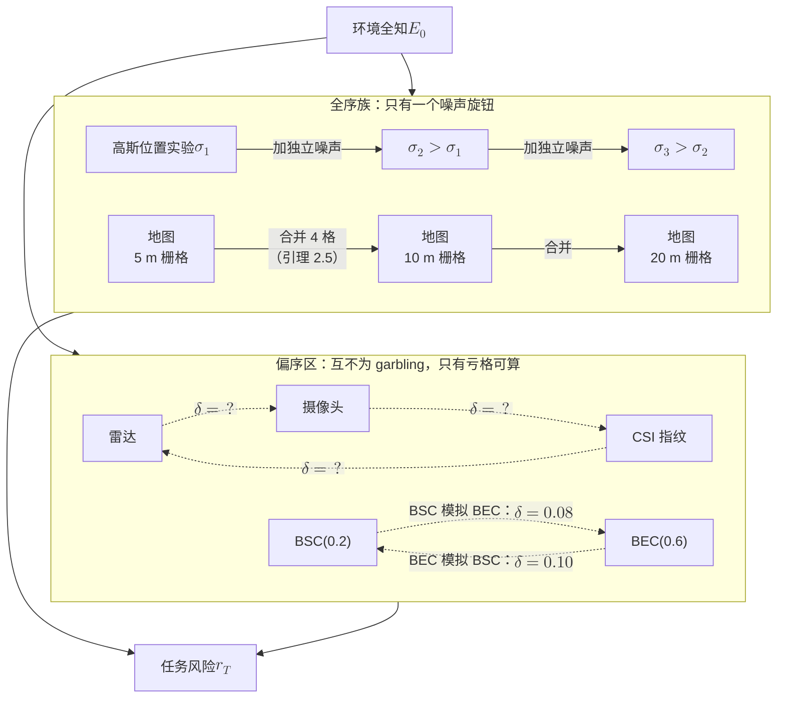

# 2 · Blackwell 排序：比较知识的正确语言

三个真实的工程争论，长得一模一样。

第一个发生在 3GPP 的会议室里。两家公司各带来一套 AI 空口的 CSI 压缩方案，一家说"我的 NMSE 低 2 dB"，另一家说"我的 SGCS 高 0.03"。第二个发生在 ISAC 的项目评审上：雷达组说"我的 CRB 更小"，视觉组说"我的定位误差更小"，CSI 指纹组说"我不需要额外硬件"。第三个发生在信道知识地图（CKM）的建库讨论里：5 米栅格的地图比 10 米栅格"更好"，好多少？多花的存储和采样值不值？

三场争论都卡在同一个地方：**没有人能说清"更有信息"到底是什么意思。**NMSE、SGCS、CRB、互信息，都是把一个高维对象压成一个标量的**投影**。投影会丢序：A 在这个投影上赢，可以在另一个投影上输，而"另一个投影"可能正好对应你真正要做的那件事。

这不是疏忽，而是一门语言的缺席。1949–1953 年间统计决策论已经把"什么叫一份知识比另一份更有信息"彻底解决，答案叫 **Blackwell 序**（Blackwell order）。无线圈其实用过它：**degraded**（退化）广播信道 [10] 与 **less noisy**（更不噪）[11] 就是**信道**上的 Blackwell 序及其松弛。没被用过的，是把 **CSI 反馈方案、感知模态、环境地图**这些"知识"本身当作**统计实验**（statistical experiment）来排序——据本站检索未见此类工作，检索到的跨平台 CSI 比较都是实验测量式横评，不是序理论。

本章做三件事：把这门语言从零教会（2.2–2.4 节，只用矩阵）；展示它在哪里卡住、卡住之后怎么办（2.5–2.6 节，Le Cam 亏格）；用它证出本部反复要用的**链定理骨架**（2.7 节）并画出无线实验族的第一张排序图（2.8 节）。

!!! note "本章预备知识"
    只需概率论、线性代数与一点信号与系统。用到的预备篇内容：

    - 熵与互信息、二元熵函数 $h(\cdot)$（预备篇记作 $H_b(\cdot)$）：[预备篇 4.1–4.3](../part0/04-information-theory-basics.md)。条件概率与贝叶斯公式属概率论基础，不另链接。
    - 条件期望、"最好的均方猜测是条件均值"（算例 2.2 的 MMSE 用到）：[预备篇 4.10](../part0/04-information-theory-basics.md)。
    - BSC 与 BEC 这两个玩具信道：[预备篇 4.5](../part0/04-information-theory-basics.md)。记号提醒：预备篇把 BSC 翻转概率记作 $\varepsilon$、BEC 擦除概率记作 $\delta$；本章 BSC 翻转概率写 $p,q,r$ 或 $\alpha$，BEC 擦除概率写 $\epsilon$ 或 $\beta$，字母 $\delta$ 留给 2.6 节的 Le Cam 亏格。
    - 凸函数、Jensen 不等式：[预备篇 7.2](../part0/07-optimization-basics.md)。线性规划与分离超平面定理预备篇没有专门讲，本章在用到处（2.4、2.6 节）各用一句话交代。
    - 本部的链图景与记号 $\mathcal{E}\to h\to y\to T$：[第 1 章](01-four-arrows.md)。

    不需要测度论：文中"马尔可夫核"一律可读成"一张条件概率表"，有限字母表上就是一个矩阵。

---

## 2.1 三场比不出胜负的争论，与一个 70 年前就写好的答案

先把三场争论的数字摆出来，好让"比不出胜负"这件事不停留在修辞上。

3GPP TR 38.843（AI/ML for NR air interface）对两侧模型 CSI 压缩同时规定了**中间 KPI**（SGCS / NMSE，衡量重建信道像不像）与**最终 KPI**（吞吐量）。据综述 [17]：同一套模型跨部署泛化时，重建质量 **SGCS** 退化从 **−1.69% 到 −31.6%**（UMi/UMa、UMa/InH 等交叉组合；这是中间 KPI 本身的退化，不是吞吐：TR 原文第 6.2.2.2 节写明这组评估的度量是 SGCS，见[第 1 章 §1.1](01-four-arrows.md)）；波束预测用约 1/4 波束作输入，Top-1 精度 **70%–90%**（带 1 dB 余量后超过 90%）；InF-DH 的 AI 定位 90% CDF 水平精度 **小于 1 m**，传统方法大于 15 m。

换了部署场景，中间 KPI 本身就可能几乎不掉，也可能掉三成；而中间 KPI 的改善传到最终 KPI 时又被大幅稀释：同一份 TR 里，SGCS 普遍提升几个百分点，平均 UPT 的增益却从负几个百分点到十几个百分点不等（[第 1 章 §1.1](01-four-arrows.md)）——中间 KPI 到最终 KPI 的映射**松散，甚至不单调**。工程上把它叫"泛化问题"，更基础的病因却是：**NMSE 不是一个序，它是一个标量投影。**

统计决策论给出的正确对象不是标量，而是**偏序**（partial order）：一种允许某些对象之间无法比较的"至少一样好"关系。任意两个实数都能比大小，这叫全序（total order）；偏序下有些对根本不可比，既说不上谁强，也说不上一样好。（严格说，只差读数编号的两张表互为 garbling，却不是同一张表，所以 Blackwell 序是**预序**；把互为 garbling 的实验看成同一个，它才是偏序。本站沿用习惯叫法。）这条线的历史很短、很密：

**比较实验的理论谱系**

| 年份 | 工作 | 要点 |
|---|---|---|
| 1949 | Bohnenblust–Shapley–Sherman | 有限输出实验的比较（RAND 备忘录） |
| 1951 | Blackwell 第二届 Berkeley 论文 | 决策风险等价的雏形 |
| 1953 | Blackwell "Equivalent Comparisons" | 去掉有限输出限制，garbling 等价成型 |
| 1964 | Le Cam "Sufficiency and Approximate Sufficiency" | 亏格 $\delta$ 与实验距离 $\Delta$ |
| 1973 | Bergmans degraded 广播信道 | Blackwell 序进入无线（信道侧） |
| 1977 | Körner–Marton less noisy | 比 degraded 弱的信道偏序 |
| 1979 | El Gamal more capable | 更弱的第三层 |
| 1991 | Torgersen 专著 | 亏格 / 充分性 / 随机化准则的系统化 |
| 2011 | Raginsky ISIT | Shannon 序与 Shannon 亏格 |
| 2026 | 本站第二部 | 把实验序搬到 CSI / 感知 / 地图上 |

*怎么读这张表：上半段（1949–1964）统计学建立"比较实验"的语言；中段（1973–1979）信息论把同一套思想用在**信道**上，且只用在信道上；下段（1991–2011）理论定型。本站在最后一行——语言早有，缺的是把无线里的"知识"当成实验放进去。*

这张图藏着一个容易被忽略的信息：**信息论早就用过 Blackwell 序。**degraded 广播信道 [10] 的定义是"存在与输入无关的核使 $Y\to Z$"——这**逐字**就是下一节的 garbling 定义；less noisy [11] 与 more capable [12] 是它的两级放松。无线读者不是在学一门陌生的语言，而是在学同一门语言的另一半词汇：信息论把它用在"信道"上，统计学把它用在"知识"上。

**到此为止我们得到了什么：一个诊断——工程上的方案比较之所以经常打成平手或翻案，不是因为指标测得不准，而是因为标量指标不是序；正确的对象是偏序，它 1953 年就已存在，并且信息论早已在"信道"这一侧用过它。**

---

## 2.2 实验就是一张条件概率表

先讲直觉，再给定义。

**直觉。**想象一台仪器：把未知的东西（房间里有没有人、终端在哪个格子、信道向量是什么）放进去，它吐出一个带噪读数。要完整描述它，只需回答一个问题：**"当真实状态是 $\theta$ 时，读数取每个可能值的概率各是多少？"**把答案排成一张表——行是真实状态，列是可能读数，格里是概率——这张表就是仪器的全部。

!!! abstract "定义 2.1（统计实验，有限情形）"
    设参数（真实状态）取值于有限集合 $\Theta=\{\theta_1,\dots,\theta_m\}$，观测取值于有限集合 $\mathcal{Y}=\{y_1,\dots,y_n\}$。一个**统计实验**（statistical experiment）$\mathcal{E}=(P_\theta)_{\theta\in\Theta}$ 就是一个 $m\times n$ 的**行随机矩阵**（row-stochastic matrix）$\mathbf{P}$：

    $$
    \mathbf{P}[i,j] \;=\; P_{\theta_i}(y_j) \;=\; \Pr\{\text{观测}=y_j \mid \text{状态}=\theta_i\},
    \qquad \sum_{j=1}^{n}\mathbf{P}[i,j]=1\ \ \forall i .
    $$

    "行随机"就是每行加起来等于 1（给定状态，读数总要落在某处）。在测度论语言里这叫"从 $\Theta$ 到 $\mathcal{Y}$ 的马尔可夫核"，本章一律读作"条件概率表"。

**记号解释。**$\theta$ 是想知道却看不见的量（环境状态、终端位置、信道向量），$y$ 是真正拿到的读数，$P_\theta$ 是矩阵的第 $i$ 行；下标 $i$ 数行（状态），$j$ 数列（读数）。注意：第 1 章链图 $\mathcal{E}\to h\to y\to\cdots$ 里的 $\mathcal{E}$ 是**环境**本身；本章的 $\mathcal{E}$、$\mathcal{F}$ 一律指**实验**（条件概率表），2.7 节的 $\mathcal{E}_0$"环境全知"是把环境当读数的那个实验。

立刻给一个 $2\times 3$ 的数字例子：$\theta\in\{+1,-1\}$（"链路通"与"链路被挡"），观测是**二元擦除信道** BEC($\epsilon$) 的输出，取值于 $\{+1,\ \mathrm{e},\ -1\}$（$\mathrm{e}$ = 擦除，什么也没看到）。取 $\epsilon=0.6$：

$$
\mathbf{P}^{\mathrm{BEC}(0.6)}
=
\begin{pmatrix}
0.4 & 0.6 & 0 \\
0 & 0.6 & 0.4
\end{pmatrix},
\qquad
\text{列的顺序是 } (+1,\ \mathrm{e},\ -1).
$$

第一行读作："真实状态是 $+1$ 时，40% 概率读到 $+1$，60% 概率什么也没读到，绝不会读到 $-1$。"再给一个 $2\times2$ 的：**二元对称信道** BSC($q$)，观测在 $\{+1,-1\}$，取 $q=0.2$：

$$
\mathbf{P}^{\mathrm{BSC}(0.2)}
=
\begin{pmatrix}
0.8 & 0.2 \\
0.2 & 0.8
\end{pmatrix}.
$$

读作："80% 概率读对，20% 概率读反。"BEC 从不骗你但经常什么都不说；BSC 总说点什么但有时是假的。这两台仪器谁更好？——那是第 2.5 节的承重问题。

### 把无线里的"知识"都写成这样的表

翻译词典只有一句：**凡是"给定未知量、能生成一个读数"的东西，都是实验。**

| 无线对象 | 参数 $\theta$ | 观测 $y$ | 矩阵的含义 |
|---|---|---|---|
| 量化 / 码本 CSI 反馈 | 信道向量 $\mathbf{h}$ | $B$ 比特码字或码本索引 | 量化器分区的条件概率 |
| 自编码器 CSI 压缩 | $\mathbf{h}$ | 隐向量（再量化） | 编码器诱导的条件分布 |
| 雷达 / 摄像头感知 | 目标位置、速度 | 距离–多普勒峰值 / 检测框 | 检测与估计的采样分布 |
| CSI 指纹定位 | 终端位置 $\mathbf{x}$ | RSS / CSI 特征向量 | 指纹库诱导的条件分布 |
| 信道知识地图（分辨率 $r$） | $\mathbf{x}$ | 格索引 + 该格信道统计 | 位置→格索引的确定性分配 + 格内分布 |

最后一行是本部"耐用品 / 易逝品"划分的关键。第一部第 7 章把地图定义成**分布泛函** $m_T(\mathbf{x})=T[P(h\mid\mathbf{x})]$（CGM、到达角图、BIM、LoS 概率图都是这个形式）。地图是**先验型知识**（耐用品）而非一次观测（易逝品），看上去不像"实验"，但一样能写成实验：**把终端位置当参数 $\theta=\mathbf{x}$，把"地图告诉你的那一行"当观测**。分辨率 $r$ 的地图 = 位置到格索引的确定性映射（每行只有一个 1 的行随机矩阵）+ 格内信道统计；分辨率越粗，矩阵列数越少——这正是引理 2.5 的结构。

!!! note "记号与约定（全章通用）"
    **总变差距离**取**半 $L_1$** 约定：对同一集合上的两个分布 $P,Q$，

    $$
    \|P-Q\|_{\mathrm{TV}} \;:=\; \tfrac12\sum_{z}\bigl|P(z)-Q(z)\bigr| \;\in\;[0,1].
    $$

    因子 $\tfrac12$ 是 Le Cam 传统中的主流写法（有些文献省略它，数值会整体翻倍）[6]。本章所有亏格数值都在这个约定下，与[第 1 章定义 1.3](01-four-arrows.md)相同。

    **总变差的白话**：它等于两个分布给同一事件的概率之差的最大值，$\|P-Q\|_{\mathrm{TV}}=\max_{S}|P(S)-Q(S)|$，在 $S=\{z:P(z)>Q(z)\}$ 处取到。例：$P=(0.8,0.2)$、$Q=(0.7,0.3)$，$\tfrac12(0.1+0.1)=0.1$，正是事件"$z=z_1$"上的概率差 $0.8-0.7$。等先验下区分 $P$ 与 $Q$ 的最优判决错误率是 $(1-\mathrm{TV})/2$，本例为 $0.45$。

    - 任务写成 $T=(A_T,L_T)$：$A_T$ 是动作集合，$L_T(\theta,a)$ 是损失。记 $\|L_T\|:=\sup L_T-\inf L_T$（损失的**振幅**）；损失取值在 $[0,1]$ 时 $\|L_T\|\le1$。
    - MSE 类算例一律采用星座约定 $\theta\in\{+1,-1\}$。这个声明不是啰嗦：同一件事若用 $\{0,1\}$ 约定，所有 MSE 数字都要除以 4（本章的 0.60 / 0.64 会变成 0.15 / 0.16）。

**到此为止我们得到了什么：一个统一的容器。CSI 反馈方案、感知模态、地图分辨率，本来是三类完全不同的工程对象，现在都是同一种数学对象——一张行随机矩阵。只要装进同一个容器，"谁更有信息"才有可能成为一个可回答的数学问题。**

---

## 2.3 garbling：唯一"只会让信息变少"的操作

**直觉。**你有一份文件。你可以复印、翻译、裁掉一半、泼咖啡、甚至扔骰子决定涂黑哪几行。这些操作有一个共同点：**它们只看你手上那份文件，不去偷看原件。**所以无论怎么折腾，结果**不可能比原件包含更多关于原件的信息**。

这句大白话就是本章唯一真正的约束。它的数学名字是 garbling（乱化 / 后处理）。

!!! abstract "定义 2.2（garbling 与 Blackwell 序）"
    设 $\mathcal{E}$ 的观测在 $\mathcal{Y}$（$n$ 个值），$\mathcal{F}$ 的观测在 $\mathcal{Z}$（$k$ 个值）。若存在一个 $n\times k$ 的行随机矩阵 $\mathbf{K}$（"与 $\theta$ 无关"的条件概率表：$\mathbf{K}[j,l]=\Pr\{z_l\mid y_j\}$），使得

    $$
    \mathbf{Q} \;=\; \mathbf{P}\,\mathbf{K},
    $$

    则称 $\mathcal{F}$ 是 $\mathcal{E}$ 的一个 **garbling**，记 $\mathcal{E}\succeq\mathcal{F}$，读作"$\mathcal{E}$ 至少与 $\mathcal{F}$ 一样有信息"（**Blackwell 序**）。

    逐格展开就是 $Q_\theta(z)=\sum_{y}\mathbf{K}[y,z]\,P_\theta(y)$ 对一切 $\theta$ 同时成立。

矩阵乘法的形状本身就在讲故事：$\mathbf{P}$ 是 $m\times n$，$\mathbf{K}$ 是 $n\times k$，乘积是 $m\times k$。$\mathbf{K}$ 的**行下标是 $\mathcal{E}$ 的观测**，$\mathbf{P}$ 的**行下标是参数**——$\mathbf{K}$ 里根本没有留给 $\theta$ 的位置。这就是"不许偷看原件"在代数上的样子。

!!! warning "陷阱：如果允许 $\mathbf{K}$ 依赖 $\theta$，整个理论立刻崩塌"
    若允许对每个 $\theta$ 用不同的矩阵 $\mathbf{K}_\theta$，取

    $$
    \mathbf{K}_{\theta_i}[j,l] \;:=\; \mathbf{Q}[i,l]\quad(\text{与 } j \text{ 无关}),
    $$

    即"不管看到什么读数，都直接按 $Q_{\theta_i}$ 抽一个数"，则

    $$
    \sum_j \mathbf{P}[i,j]\,\mathbf{K}_{\theta_i}[j,l]
    \;=\;\mathbf{Q}[i,l]\sum_j\mathbf{P}[i,j]\;=\;\mathbf{Q}[i,l].
    $$

    于是**任何**实验都能"变成"**任何**实验，序塌成平凡的等价关系。Blackwell 理论的全部力量来自 $\mathbf{K}$ 里没有 $\theta$，而不是任何深刻的不等式。工程上这对应"接收端只能用它收到的东西做后处理"——一条物理约束，不是数学技巧。

### 算例 2.1：两级 BSC 串联就是一次矩阵乘法

!!! example "算例 2.1（BSC 串联的闭合关系）"
    先过一个 BSC($p$)，再把输出送进一个独立的 BSC($r$)。第二级只看第一级的输出，不看 $\theta$——所以这是标准的 garbling。取 $p=0.1$、$r=0.2$。

    **第一步：写出两个矩阵。**

    $$
    \mathbf{P}=\begin{pmatrix}0.9 & 0.1\\ 0.1 & 0.9\end{pmatrix},
    \qquad
    \mathbf{K}=\begin{pmatrix}0.8 & 0.2\\ 0.2 & 0.8\end{pmatrix}.
    $$

    **第二步：直接乘。**左上角元素是第一行点乘第一列：$0.9\times0.8+0.1\times0.2=0.72+0.02=0.74$；右上角：$0.9\times0.2+0.1\times0.8=0.18+0.08=0.26$。由对称性另一行相同，只是左右互换：

    $$
    \mathbf{P}\mathbf{K}=\begin{pmatrix}0.74 & 0.26\\ 0.26 & 0.74\end{pmatrix}
    \;=\;\mathbf{P}^{\mathrm{BSC}(0.26)} .
    $$

    **第三步：用概率语言复算同一个数。**总的出错事件 = "第一级错、第二级对" 或 "第一级对、第二级错"（两次都错就又转回来了）：

    $$
    q \;=\; p(1-r)+(1-p)r \;=\; p+r-2pr \;=\; 0.1+0.2-2(0.1)(0.2)\;=\;0.26 .
    $$

    **第四步：整理成乘性形式。**把 $q=p+r-2pr$ 代入 $1-2q$：

    $$
    \begin{aligned}
    1-2q &= 1-2p-2r+4pr\\
    &= (1-2p)-2r(1-2p)\\
    &= (1-2p)(1-2r).
    \end{aligned}
    $$

    第二步把 $1-2p-2r+4pr$ 按 $(1-2p)$ 提取公因子（$-2r+4pr=-2r(1-2p)$），第三步再提一次。量 $1-2q$ 称为信道的**相关系数**，串联时**相乘**——这正是"信息只会衰减"的最裸露的样子。

    **校验：**$(1-2p)(1-2r)=0.8\times0.6=0.48$，故 $q=(1-0.48)/2=0.26$，与第二步矩阵相乘、第三步概率计数三条独立路径给出同一个数 ✓。极限检查：$r=0$ 时 $q=p$（什么也没做）✓；$r=1/2$ 时 $1-2q=0$ 即 $q=1/2$（第二级把信息彻底毁掉）✓；$r=1$ 时 $q=1-p$，$|1-2q|=|1-2p|$ 不变（比特翻转是可逆重命名，不丢信息）✓。

连续情形同样直白：位置估计 $y=\theta+n_1$（$n_1\sim\mathcal{N}(0,\sigma_1^2)$）再独立加 $n_2\sim\mathcal{N}(0,\sigma_2^2-\sigma_1^2)$，得噪声方差 $\sigma_2^2$ 的 $z$。"加独立噪声"不看 $\theta$，是 garbling，所以

$$
\sigma_1^2<\sigma_2^2 \;\Longrightarrow\; \mathcal{E}_{\sigma_1}\succeq\mathcal{E}_{\sigma_2}.
$$

高斯位置族在 Blackwell 序下**全序**（totally ordered）：方差小的一定更好。这是一个重要锚点——**只差一个"噪声旋钮"的同族实验才有资格全序**；一旦跨族比较（BEC 对 BSC、雷达对摄像头），全序立刻失效。

**到此为止我们得到了什么：一个可以判定的关系。$\mathcal{E}\succeq\mathcal{F}$ 不是感觉，是一个矩阵方程 $\mathbf{Q}=\mathbf{P}\mathbf{K}$ 有没有行随机解的问题；而这个关系的全部约束力，来自 $\mathbf{K}$ 里不许出现 $\theta$。**

---

## 2.4 Blackwell 定理：三种说法是同一件事

garbling 是一个**结构**条件（存在这么个矩阵）。工程师真正关心的是**性能**条件（在我的任务上谁更好）。Blackwell 定理说：这两者严格等价，而且还等价于第三个**几何**条件。

**先把"任务上谁更好"写成数。**一个**决策问题**由三样东西组成：先验 $\pi$（各状态事先的概率；注意第 1 章链图里 $\pi$ 是决策策略，本章 $\pi$ 一律指先验）、有限动作集 $A$、损失表 $L(\theta,a)$。**决策规则** $a(y)$ 规定"看到读数 $y$ 选哪个动作"，也允许按概率随机选。规则的平均损失是 $\sum_i\pi_i\sum_j\mathbf{P}[i,j]\,L(\theta_i,a(y_j))$，对一切规则取最小，就是实验 $\mathcal{E}$ 在这个问题上的 **Bayes 风险** $r_{\mathcal{E}}$：用这台仪器、决策者尽全力之后平均还要付的代价。例：0-1 判决（$A=\Theta$，判对损失 0、判错损失 1）的 Bayes 风险就是最优判决的错误概率，算例 2.2 的指标三算的正是它。

!!! abstract "定理 2.1（Blackwell–Sherman–Stein，有限情形）【已解决（经典）】"
    设 $\mathcal{E}=(\mathbf{P})$、$\mathcal{F}=(\mathbf{Q})$ 是同一有限参数集 $\Theta$（$|\Theta|=m$）上的两个有限实验。以下三条等价：

    **(i)（结构）**存在 $n\times k$ 行随机矩阵 $\mathbf{K}$ 使 $\mathbf{Q}=\mathbf{P}\mathbf{K}$，即 $\mathcal{E}\succeq\mathcal{F}$；

    **(ii)（决策）**对**一切**决策问题（任意有限动作集 $A$、任意有界损失 $L(\theta,a)$）与**一切**先验 $\pi$，Bayes 风险满足 $r_{\mathcal{E}}\le r_{\mathcal{F}}$；

    **(iii)（几何）**对作用在后验分布上的一切凸函数 $\varphi$，$\mathbb{E}_{\mathcal{E}}[\varphi(\text{后验})]\ \ge\ \mathbb{E}_{\mathcal{F}}[\varphi(\text{后验})]$；两侧后验的均值都等于先验 $\pi$。

    出处：(ii) 与 (i) 的雏形见 Blackwell 1951 [1]；一般（含非有限输出）情形与 garbling 的等价见 Blackwell 1953 [2]，其中关键一步 Blackwell 归功于 Sherman [3] 与 Stein。Blackwell 1953 的摘要说明它去掉了"实验只有有限个结果"这一限制；结果空间无限时，(iii) 取哪一类凸函数、后验空间配什么可测结构，本站未取得原文，不作断言【表述待核】；本章只在有限情形使用，下面给出完整初等证明。

**三个条件的白话。**

- **(i) 结构**：存在一台不看 $\theta$ 的翻译机 $\mathbf{K}$，把 $\mathcal{E}$ 的读数随机改写成与 $\mathcal{F}$ 的读数同分布的东西。有了 $\mathcal{E}$，$\mathcal{F}$ 可以自己造出来。
- **(ii) 决策**：不管任务和先验是什么，拿 $\mathcal{E}$ 的决策者尽力之后，平均代价都不高于拿 $\mathcal{F}$ 的决策者。
- **(iii) 几何**：$\mathcal{E}$ 的后验比 $\mathcal{F}$ 的更分散、离先验更远。取 $\varphi(\mu)=-H(\mu)$（负熵，凸），(iii) 就是 $H(\theta\mid y_{\mathcal{E}})\le H(\theta\mid y_{\mathcal{F}})$，即互信息不少；取 $\varphi(\mu)=\max_i\mu_i$（凸），$\mathbb{E}[\varphi(\text{后验})]$ 就是最大后验判决的正确率。定理要求**一切**凸函数同时成立；2.5 节的 BEC(0.6) 与 BSC(0.2) 在这两个 $\varphi$ 上各赢一个（互信息 0.400 对 0.2781，正确率 0.70 对 0.80），所以不可比。

### 证明的准备：把 Bayes 风险写成"一堆向量上的凹函数之和"

固定先验 $\pi=(\pi_1,\dots,\pi_m)$、动作集 $A=\{a_1,\dots,a_s\}$、损失表 $L$（$m\times s$ 矩阵，$L[i,t]=L(\theta_i,a_t)$）。

**第一步（定义未归一化后验向量）。**对 $\mathcal{E}$ 的每个观测 $y_j$，定义一个 $m$ 维非负向量

$$
\mathbf{v}_j \;:=\; \bigl(\pi_1\mathbf{P}[1,j],\ \pi_2\mathbf{P}[2,j],\ \dots,\ \pi_m\mathbf{P}[m,j]\bigr).
$$

第 $i$ 个分量是"状态为 $\theta_i$ **且**读数为 $y_j$"的联合概率。两个事实：分量求和是全概率公式，$|\mathbf{v}_j|_1=\sum_i\pi_i\mathbf{P}[i,j]=\Pr\{y_j\}$；除以这个和，第 $i$ 个分量变成 $\pi_i\mathbf{P}[i,j]/\Pr\{y_j\}$，正是贝叶斯公式给出的后验 $\mu_j(\theta_i)=\Pr\{\theta=\theta_i\mid y_j\}$。而且

$$
\sum_{j=1}^{n}\mathbf{v}_j \;=\; \pi
$$

（因矩阵行和为 1，$\sum_j \pi_i\mathbf{P}[i,j]=\pi_i$）。**这一步把"观测 + 先验"打包成一族向量，它们加起来正好还原先验。**换成归一化的写法是 $\sum_j\Pr\{y_j\}\,\mu_j=\pi$：后验按读数概率加权平均回到先验，平均而言观测不会把信念系统性地推向某一边（这是后验"鞅性质"最初等的一步）。

**第二步（定义决策者的最优值函数）。**对任意非负向量 $\mathbf{v}\in\mathbb{R}^m_{\ge0}$ 定义

$$
\psi(\mathbf{v}) \;:=\; \min_{t=1,\dots,s}\ \sum_{i=1}^{m} v_i\,L[i,t].
$$

即"给定这份未归一化后验，选最好的动作能拿到多低的损失"。**关键性质**：$\psi$ 是若干**线性**函数的**逐点最小值**，故**凹**；每个线性函数一次齐次，故 $\psi(c\mathbf{v})=c\,\psi(\mathbf{v})$（$c\ge0$，**正齐次**）。

**第三步（凹 + 正齐次 $\Rightarrow$ 超可加）。**对任意 $\mathbf{u},\mathbf{u}'\ge0$：

$$
\psi(\mathbf{u}+\mathbf{u}') \;=\; 2\,\psi\!\Bigl(\tfrac{\mathbf{u}+\mathbf{u}'}{2}\Bigr)
\;\ge\; 2\Bigl(\tfrac12\psi(\mathbf{u})+\tfrac12\psi(\mathbf{u}')\Bigr)
\;=\;\psi(\mathbf{u})+\psi(\mathbf{u}').
$$

第一个等号用正齐次，中间不等号用凹性（凹函数在中点的值不小于两端平均）。**这一步把"凹"转成一条可以在求和号里反复使用的不等式。**

**第四步（Bayes 风险的紧凑写法）。**Bayes 风险即"对每个观测选最优动作后取期望"：

$$
r_{\mathcal{E}} \;=\; \sum_{j=1}^{n}\ \min_{t}\ \sum_{i=1}^{m}\pi_i\mathbf{P}[i,j]L[i,t]
\;=\;\sum_{j=1}^{n}\psi(\mathbf{v}_j).
$$

同理 $r_{\mathcal{F}}=\sum_{l=1}^{k}\psi(\mathbf{w}_l)$，其中 $\mathbf{w}_l$ 是 $\mathcal{F}$ 对应的向量。

$\min$ 能放进求和号，是因为确定性规则的平均损失 $\sum_j\sum_i\pi_i\mathbf{P}[i,j]L(\theta_i,a(y_j))$ 的第 $j$ 项只依赖 $a(y_j)$，各项互不牵制，逐个读数选最好的动作就是整体最优；随机化规则的损失是确定性规则损失的加权平均，不会更低。

**小例子（0-1 判决，$\pi=(\tfrac12,\tfrac12)$）。**此时 $\psi(\mathbf{v})=\min\{v_2,v_1\}$（报 $\theta_1$ 付 $v_2$，报 $\theta_2$ 付 $v_1$）。BSC(0.2)：$\mathbf{v}_{+1}=(0.4,0.1)$、$\mathbf{v}_{-1}=(0.1,0.4)$，相加为 $(0.5,0.5)=\pi$，$r=0.1+0.1=0.2$。BEC(0.6)：$\mathbf{v}_{+1}=(0.2,0)$、$\mathbf{v}_{\mathrm{e}}=(0.3,0.3)$、$\mathbf{v}_{-1}=(0,0.2)$，$r=0+0.3+0=0.3$。正是算例 2.2 指标三的 $0.20$ 与 $0.30$。

### (i) ⇒ (ii)：三行

若 $\mathbf{Q}=\mathbf{P}\mathbf{K}$，则第 $l$ 个向量满足

$$
\mathbf{w}_l \;=\; \bigl(\pi_i\,\mathbf{Q}[i,l]\bigr)_i
\;=\;\Bigl(\pi_i\sum_j \mathbf{P}[i,j]\mathbf{K}[j,l]\Bigr)_i
\;=\;\sum_{j}\mathbf{K}[j,l]\,\mathbf{v}_j .
$$

于是

$$
\begin{aligned}
r_{\mathcal{F}}
&=\sum_{l}\psi\Bigl(\sum_j \mathbf{K}[j,l]\mathbf{v}_j\Bigr)\\
&\ \ge\ \sum_l\sum_j \psi\bigl(\mathbf{K}[j,l]\mathbf{v}_j\bigr)
&&\text{(第三步的超可加，逐项拆开)}\\
&=\sum_l\sum_j \mathbf{K}[j,l]\,\psi(\mathbf{v}_j)
&&\text{(正齐次，把标量提出来)}\\
&=\sum_j \psi(\mathbf{v}_j)\underbrace{\sum_l \mathbf{K}[j,l]}_{=\,1}
\;=\;r_{\mathcal{E}} .
&&\text{(核矩阵每行和为 1)}
\end{aligned}
$$

对一切 $\pi$、一切 $L$、一切 $A$ 都成立，(ii) 得证。$\blacksquare$

### (ii) ⇒ (i)：一次分离超平面

**思路。**一个核 $\mathbf{K}$ 本身就是 $\mathcal{E}$ 上的一条随机化决策规则，它的"动作"是报出一个 $\mathcal{F}$ 的符号。于是"没有 $\mathbf{K}$ 能造出 $\mathbf{Q}$"可以翻译成一个具体的决策问题：在它上面，$\mathcal{F}$ 老老实实报读数，就比 $\mathcal{E}$ 的任何规则都好。这个问题的损失表由分离超平面给出。

反证。设 (i) 不成立。考虑集合

$$
\mathcal{C} \;:=\; \bigl\{\,\mathbf{P}\mathbf{K}\ :\ \mathbf{K}\in\mathbb{R}^{n\times k}_{\ge0},\ \text{每行和为 }1\,\bigr\}\subset\mathbb{R}^{m\times k}.
$$

**第一步：$\mathcal{C}$ 是紧凸集。**行随机矩阵集是 $n$ 个单纯形的乘积（有界闭凸），线性映射 $\mathbf{K}\mapsto\mathbf{P}\mathbf{K}$ 保持紧与凸。

**第二步：严格分离。**这里用凸分析的**分离超平面定理**：紧凸集之外的一点，总能被一个超平面与集合严格隔开。平面上就是：凸多边形外的一点，总能画一条直线把它与多边形分在两侧。把 $m\times k$ 矩阵看成 $mk$ 维向量，超平面就是某个线性函数 $\langle\Lambda,\cdot\rangle$ 的等值面。(i) 不成立即 $\mathbf{Q}\notin\mathcal{C}$，故存在 $\Lambda\in\mathbb{R}^{m\times k}$ 与常数 $c$ 使

$$
\langle\Lambda,\mathbf{Q}\rangle \;<\; c \;\le\; \langle\Lambda,\mathbf{M}\rangle
\quad\text{对一切 }\mathbf{M}\in\mathcal{C},
$$

其中 $\langle\Lambda,\mathbf{M}\rangle=\sum_{i,l}\Lambda[i,l]\mathbf{M}[i,l]$。

**第三步：把 $\Lambda$ 翻译成决策问题。**取均匀先验 $\pi_i=1/m$、动作集 $A:=\mathcal{Z}$（**动作就是"报出一个 $\mathcal{F}$ 的观测符号"**），损失为

$$
L(\theta_i,\,z_l) \;:=\; m\,\Lambda[i,l].
$$

于是 $\pi_i L(\theta_i,z_l)=\Lambda[i,l]$，任意随机化规则 $\mathbf{K}$ 的风险恰为

$$
\sum_{i,j,l}\pi_i\,\mathbf{P}[i,j]\,\mathbf{K}[j,l]\,L(\theta_i,z_l)
\;=\;\sum_{i,l}\Lambda[i,l]\,(\mathbf{P}\mathbf{K})[i,l]
\;=\;\langle\Lambda,\mathbf{P}\mathbf{K}\rangle .
$$

对 $\mathbf{K}$ 取最小值就是 Bayes 风险：$r_{\mathcal{E}}=\min_{\mathbf{M}\in\mathcal{C}}\langle\Lambda,\mathbf{M}\rangle\ \ge\ c$。

**第四步：$\mathcal{F}$ 的风险更小。**在 $\mathcal{F}$ 上用最朴素的规则"看到 $z_l$ 就报 $z_l$"，风险为 $\langle\Lambda,\mathbf{Q}\rangle<c$；Bayes 风险不超过任何具体规则，故

$$
r_{\mathcal{F}}\ \le\ \langle\Lambda,\mathbf{Q}\rangle\ <\ c\ \le\ r_{\mathcal{E}} .
$$

这与 (ii)（$r_{\mathcal{E}}\le r_{\mathcal{F}}$ 对一切决策问题成立）矛盾。故 (i) 成立。$\blacksquare$

**物理意义。**(i)$\Rightarrow$(ii) 说"后处理不能凭空造出性能"；(ii)$\Rightarrow$(i) 说"如果你在**所有**任务上都不输，你手上一定真有一台机器能把对方的观测**造出来**"。后者才是定理的重量：它把"性能上的普遍优势"升级成"结构上的可模拟性"。工程读法：**只要能举出一个任务让 A 输给 B，A 就不可能是 B 的信息超集——你不可能靠后处理把 B 的观测合成出来。**

**行为分析。**其一，(ii) 里的"一切"不可省：把任务类缩小，等价性立刻破裂，得到的是更粗、更容易成立的序——这正是第 3 章 $k$-亏格与 Lehmann 序的来源。其二，证明里的 $\psi$ 之所以**凹**，是因为决策者会挑最好的动作；决策者若不是 Bayes 最优（固定的次优译码器），$\psi$ 不再是"线性函数的最小值"，凹性丢失，(i)$\Rightarrow$(ii) 整条链断掉——这是第 2.8 节末尾那个悖论的技术根源。

其三，(iii) 只是把 $\mathbf{v}_j$ 归一化重写。由正齐次，$\psi(\mathbf{v}_j)=\Pr\{y_j\}\,\psi(\mu_j)$，故 $r_{\mathcal{E}}=\sum_j\Pr\{y_j\}\psi(\mu_j)=\mathbb{E}[\psi(\text{后验})]$。$-\psi$ 是线性函数的最大值，是凸函数，所以 (iii) 取 $\varphi=-\psi$ 就得到 (ii)；反过来，单纯形上连续的凸函数都能用有限个线性函数的最大值任意逼近（单纯形上 $\sum_i\mu_i=1$，常数项可并进线性项），每个这样的最大值都是某张损失表的 $-\psi$，所以 (ii) 推出对一切连续凸函数的 (iii)；不连续的凸函数，可由下面的混合公式对每个 $\mu^{\mathcal{F}}_l$ 用一次 Jensen 不等式，从 (i) 直接得到 (iii)。再看 $\mathbf{w}_l=\sum_j\mathbf{K}[j,l]\mathbf{v}_j$：两边取 1-范数得 $\Pr\{z_l\}=\sum_j\mathbf{K}[j,l]\Pr\{y_j\}$，两边再除以它，

$$
\mu^{\mathcal{F}}_l\;=\;\sum_j\frac{\mathbf{K}[j,l]\,\Pr\{y_j\}}{\Pr\{z_l\}}\,\mu_j ,
$$

权重非负、加起来为 1。所以 $\mathcal{F}$ 的每个后验都是 $\mathcal{E}$ 若干后验的**混合**，更集中、更"平均"；反过来读，$\mathcal{E}$ 的后验是把 $\mathcal{F}$ 的后验"拆开、向外推"而均值（先验 $\pi$）不变——这就是"均值保持展开（mean-preserving spread）"的含义。

!!! tip "直觉：好实验让你的信念更极端"
    (iii) 的直觉版本：**好实验把后验推向两端，坏实验把后验推回先验。**BEC(0.6) 有 40% 概率把后验推到 0 或 1（完全确定），60% 概率原地不动；BSC(0.2) 每次都把你推到 0.2 或 0.8，从不给确定性，也从不让你一无所获。谁"更极端"？——两者的后验分布互不为对方的展开。下一节这句直觉会变成三个打架的数字。

**到此为止我们得到了什么：一条等价定理，以及它的完整初等证明。判断"A 比 B 更有信息"，你可以查结构（有没有那个矩阵 $\mathbf{K}$）、可以查性能（是不是所有任务都不输）、也可以查几何（后验是不是更分散）——三条路通向同一个答案。**

---

## 2.5 偏序会卡住：BEC 与 BSC 的三个指标互相打架

定理 2.1 的量词是"一切任务"。量词越强，成立的机会越少：Blackwell 序是**偏序**（partial order）而非全序，绝大多数成对实验根本不可比。这不是理论的缺陷，而是它在如实报告一件工程事实——**大多数方案比较，本来就没有客观赢家。**现在把第 2.2 节留下的问题解决掉。

!!! example "算例 2.2（承重算例：BEC(0.6) 对 BSC(0.2) 的三个指标）"
    参数 $\theta\in\{+1,-1\}$ 等概（$\pi=(1/2,1/2)$），星座约定 $\theta=\pm1$。两个实验的矩阵已在第 2.2 节给出。取 $\epsilon=0.6$、$q=0.2$。

    **指标一：互信息 $I(\theta;y)$。**

    BEC：擦除与 $\theta$ 独立，没擦除时完全知道 $\theta$，故 $H(\theta\mid y)=\epsilon H(\theta)+(1-\epsilon)\cdot0=\epsilon$，

    $$
    I_{\mathrm{BEC}} \;=\; H(\theta)-H(\theta\mid y)\;=\;1-\epsilon\;=\;\mathbf{0.400}\ \text{bit}.
    $$

    BSC：输出等概，$H(y)=1$；给定 $\theta$ 输出是伯努利($q$)，$H(y\mid\theta)=h(q)$，其中 $h(q)=-q\log_2 q-(1-q)\log_2(1-q)$。代入 $q=0.2$：$h(0.2)=0.2\times2.3219+0.8\times0.3219=0.4644+0.2575=0.7219$，故

    $$
    I_{\mathrm{BSC}}\;=\;1-h(0.2)\;=\;\mathbf{0.2781}\ \text{bit}.
    $$

    **BEC 赢 0.122 bit。**

    **指标二：MMSE $\ \mathbb{E}[(\theta-\mathbb{E}[\theta\mid y])^2]$。**

    均方意义下最好的猜测是条件均值 $\mathbb{E}[\theta\mid y]$，它的均方误差就叫最小均方误差（MMSE），见[预备篇 4.10](../part0/04-information-theory-basics.md)。

    BEC：没擦除时 $\mathbb{E}[\theta\mid y]=\theta$，误差 0；擦除时 $\mathbb{E}[\theta\mid \mathrm{e}]=0$，误差 $\theta^2=1$。故

    $$
    \mathrm{MMSE}_{\mathrm{BEC}}=\epsilon\cdot1+(1-\epsilon)\cdot0=\epsilon=\mathbf{0.60}.
    $$

    BSC：由贝叶斯公式，$\Pr\{\theta=+1\mid y=+1\}=\frac{\frac12(1-q)}{\frac12(1-q)+\frac12q}=1-q$，故 $\mathbb{E}[\theta\mid y=+1]=(1-q)-q=1-2q$；$y=-1$ 时对称地为 $-(1-2q)$，合写成 $\mathbb{E}[\theta\mid y]=(1-2q)y$。又 $\theta y=+1$（读对，概率 $1-q$）或 $-1$（读反，概率 $q$），故 $\mathbb{E}[\theta y]=1-2q$。展开平方并用 $\theta^2=y^2=1$：

    $$
    \begin{aligned}
    \mathrm{MMSE}_{\mathrm{BSC}}
    &=\mathbb{E}\bigl[\theta^2\bigr]-2(1-2q)\mathbb{E}[\theta y]+(1-2q)^2\mathbb{E}\bigl[y^2\bigr]\\
    &=1-2(1-2q)^2+(1-2q)^2\\
    &=1-(1-2q)^2\;=\;4q(1-q)\;=\;4(0.2)(0.8)=\mathbf{0.64}.
    \end{aligned}
    $$

    **BEC 又赢 0.04。**

    **指标三：最优硬判决错误概率。**

    BEC：没擦除时判对；擦除时只能猜，错一半。$P_{\mathrm{e}}^{\mathrm{BEC}}=\epsilon/2=\mathbf{0.30}$。

    BSC：最大后验判决就是"照读数报"，$P_{\mathrm{e}}^{\mathrm{BSC}}=q=\mathbf{0.20}$。

    **这次 BSC 赢 0.10。**

    **校验：**（a）$\epsilon=0.6$ 代回三个闭式：$0.400$、$0.60$、$0.30$ ✓；（b）恒等式 $1-(1-2q)^2=4q(1-q)$ 两种参数化同得 0.64 ✓；（c）极限退化：$\epsilon\to0$ 三项 $\to 1,0,0$（完美观测），$\epsilon\to1$ 时 $\to0,1,0.5$（一无所知）；$q\to0$ 与 $q\to1/2$ 时 BSC 三项同样退化到这两组 ✓；（d）由定理 2.1，二者若可比必须**三项全胜**，现在互有胜负，故在 Blackwell 序下**不可比**——下一节把这句话变成两个正数 ✓。

判决那一栏最有说服力：假如 BSC(0.2) 是 BEC(0.6) 的 garbling，由定理 2.1 (i)$\Rightarrow$(ii) 它在**任何**任务上都不能赢；现在它在 0-1 判决上赢了 0.10，所以那个 $\mathbf{K}$ **不存在**。反向同理。

反转的范围有多大？固定 $q$ 让 $\epsilon$ 变：BEC 在 MMSE 上更好 $\iff\epsilon<4q(1-q)$；BSC 在判决上更好 $\iff\epsilon>2q$。于是

$$
2q\;<\;\epsilon\;<\;4q(1-q)
\qquad\Longleftrightarrow\qquad
\text{“MMSE 说 BEC 好、判决说 BSC 好”}.
$$

该区间非空 $\iff 2q<4q(1-q)\iff q<1/2$：**只要 BSC 不是完全无用的，反转区就一定存在。**$q=0.2$ 时区间为 $(0.40,\ 0.64)$，我们的 $\epsilon=0.6$ 稳稳落在里面；互信息的翻转点更靠右，在 $\epsilon=h(q)=0.7219$。

{ .chart loading=lazy }
{ .chart loading=lazy }

*怎么读这张图：三条斜线自上而下依次是互信息优势 $(1-\epsilon)-0.2781$、MMSE 优势 $0.64-\epsilon$、判决优势 $0.20-\epsilon/2$，第四条是零线。三条线过零点分别在 $\epsilon=0.7219,\ 0.64,\ 0.40$——**不重合**，这就是"三个指标不是同一个序"的图像证据。在 $0.40<\epsilon<0.64$ 一段（本例 $\epsilon=0.6$ 在其中）两个实验必然不可比。数据来自算例 2.2 的闭式，$q$ 固定为 0.2。*

### 三个偏序，一定要摆清楚

!!! warning "陷阱：“不可比”必须限定在 Blackwell（degraded）意义下"
    信息论里对同一对信道有**三个**由强到弱的偏序，包含关系严格：

    $$
    \text{degraded}\ \subsetneq\ \text{less noisy}\ \subsetneq\ \text{more capable}.
    $$

    - **degraded**（退化，Bergmans [10]）：存在与输入无关的核使 $Y\to Z$。**这就是信道上的 Blackwell 序**（定义 2.2 逐字照搬）。
    - **less noisy**（更不噪，Körner–Marton [11]）：对一切联合分布 $p(u,x)$ 有 $I(U;Y)\ge I(U;Z)$。
    - **more capable**（更能干，El Gamal [12]）：对一切 $p(x)$ 有 $I(X;Y)\ge I(X;Z)$。

    这里 $U$ 是满足 $U\to X\to(Y,Z)$ 的辅助随机变量，可读成"真正想送的消息"，$X$ 是它编码后送进信道的符号。less noisy 要求无论送什么消息、怎么编码，$Y$ 端得到的关于消息的信息都不少于 $Z$ 端；more capable 只检查 $U=X$ 这一种情形，所以更弱。

    对 BEC($\beta$) 与 BSC($\alpha$)（$\alpha\le1/2$）文献给出四段式完整刻画（Nair [18] 附录的 Claim 4）：$\beta\le2\alpha$ 时 BSC 是 BEC 的 degraded 版本；$2\alpha<\beta\le4\alpha(1-\alpha)$ 时 BEC less noisy 但不再 degraded；$4\alpha(1-\alpha)<\beta\le h(\alpha)$ 时 more capable 但不 less noisy；$\beta\ge h(\alpha)$ 时反过来，BSC 成为"本质上更少噪声"（essentially less noisy，比 less noisy 更弱的一种序）的一方。$\beta=h(\alpha)$ 正是两者容量相等处，[13] 进一步证明：容量相等时，BEC 比任何二元输入、对称输出的信道都 more capable。

    本例 $(\alpha,\beta)=(0.2,\,0.6)$ 满足 $0.40<0.60\le0.64$，**落在第二段**。所以正确的说法是：

    > BEC(0.6) 与 BSC(0.2) 在 **Blackwell / degraded 意义下不可比**，尽管在 **less noisy 意义下 BEC 严格更好**。

    写成"完全不可比"会被信息论读者当场挑错——而这正是本章最好的教学点：**同一对实验在不同强度的序下结论不同。**判决错误 $0.30>0.20$ 就是"不 degraded"的见证：若 degraded，BSC 作为 BEC 的后处理，在任何任务上都不该更小。

{ .chart loading=lazy }
{ .chart loading=lazy }

*怎么读这张图：三条上升曲线自下而上是 $\beta=2\alpha$（degraded 边界）、$\beta=4\alpha(1-\alpha)$（less noisy 边界）、$\beta=h(\alpha)$（more capable 边界），第四条水平线是本章算例的 $\beta=0.6$。给定 $\alpha$，看水平线落在哪两条曲线之间即知处于哪一段。$\alpha=0.2$ 处 $2\alpha=0.40$ 已在水平线下方、$4\alpha(1-\alpha)=0.64$ 仍在上方，故 $(0.2,0.6)$ 正落在"less noisy 但不 degraded"区。曲线由三个闭式直接算出（$h(0.2)=0.7219$ 已在算例 2.2 核过），四段式划分出自 [18]。*

**到此为止我们得到了什么：一个负面结论和它的精确边界。Blackwell 序是偏序，工程上最常见的两台"仪器"就已经不可比；而"不可比"必须限定在 degraded 意义下——放宽到 less noisy 或 more capable，结论会翻。偏序卡住之后，我们需要一个数，而不是一个"是 / 否"。**

---

## 2.6 Le Cam 亏格：把"不可比"变成一个数

Blackwell 序回答的是"能不能完美模拟"。Le Cam 1964 [4] 把它松成一个定量问题：**如果不能完美模拟，那么最好能模拟到什么程度？差多少？**

!!! abstract "定义 2.3（Le Cam 亏格与 Le Cam 距离）"
    用一个行随机矩阵去模拟另一台仪器，取最坏的 $\theta$、再取最好的矩阵：

    $$
    \delta(\mathcal{E},\mathcal{F})\;:=\;\inf_{\mathbf{K}}\ \sup_{\theta\in\Theta}\ \bigl\|\mathbf{K}^{\!\top}P_\theta-Q_\theta\bigr\|_{\mathrm{TV}},
    $$

    其中 $\mathbf{K}$ 遍历一切行随机矩阵（把 $\mathcal{E}$ 的观测空间映到 $\mathcal{F}$ 的观测空间），TV 取半 $L_1$ 约定。读作"**用 $\mathcal{E}$ 模拟 $\mathcal{F}$ 差多少**"。记号 $\mathbf{K}^{\!\top}P_\theta$ 把 $P_\theta$ 当列向量，第 $z$ 个分量是 $\sum_y\mathbf{K}[y,z]P_\theta(y)$，也就是矩阵 $\mathbf{P}\mathbf{K}$ 中 $\theta$ 那一行：$\mathcal{E}$ 的读数经 $\mathbf{K}$ 翻译后的分布。

    **Le Cam 距离**：$\Delta(\mathcal{E},\mathcal{F}):=\max\{\delta(\mathcal{E},\mathcal{F}),\ \delta(\mathcal{F},\mathcal{E})\}$，它是实验空间上的伪度量 [4][6]："伪"是说它对称、满足三角不等式，但 $\Delta=0$ 只要求两个实验能互相模拟，不要求矩阵相同（例如把读数重新编号，距离为 0）。

    立即可见：$\delta(\mathcal{E},\mathcal{F})=0\iff\mathcal{E}\succeq\mathcal{F}$。"$\Leftarrow$"：取 garbling 核，每个 $\theta$ 的 TV 都是 0。"$\Rightarrow$"：行随机矩阵构成紧集，$\sup_\theta\|\cdot\|_{\mathrm{TV}}$ 是 $\mathbf{K}$ 的连续函数，下确界 0 被某个 $\mathbf{K}$ 取到，于是 $\mathbf{P}\mathbf{K}=\mathbf{Q}$。亏格是 Blackwell 序的**连续化**：序只说 0 或非 0，亏格说非 0 是多少。

**有限情形下亏格是一个线性规划**（linear program, LP：目标和全部约束都是变量的线性式，有成熟算法保证求到全局最优，如 `scipy.optimize.linprog`）——这意味着它可以真算。定义里的 $\sup$ 与绝对值不是线性的，下面用辅助变量把它们压平。变量是 $\mathbf{K}[j,l]\ge0$、辅助变量 $u_{i,l}\ge0$ 与标量 $t$：

$$
\begin{aligned}
\min_{\mathbf{K},\,u,\,t}\quad & t\\
\text{s.t.}\quad & \pm\Bigl(\textstyle\sum_{j}\mathbf{P}[i,j]\mathbf{K}[j,l]-\mathbf{Q}[i,l]\Bigr)\ \le\ u_{i,l}, && \forall i,l\\
& \tfrac12\textstyle\sum_{l}u_{i,l}\ \le\ t, && \forall i\\
& \textstyle\sum_{l}\mathbf{K}[j,l]=1,\quad \mathbf{K}[j,l]\ge0, && \forall j,l .
\end{aligned}
$$

第一组把绝对值线性化（$|x|\le u\iff x\le u$ 且 $-x\le u$）；第二组是"每个 $\theta$ 的 TV 都不超过 $t$"；第三组是行随机；目标函数就是 $\sup_\theta$ 那一层。变量数 $nk+mk+1$，小 LP，秒解。

### 定理 2.2：亏格控制一切任务上的风险差

亏格只是一个 TV 距离，工程上关心的却是任务性能；定理 2.2 把前者换算成后者。先交代两个记号：**决策规则** $\rho(a\mid z)$ 是"看到读数 $z$ 时选动作 $a$ 的概率"；**风险函数** $R_{\mathcal{F}}(\theta,\rho):=\sum_z Q_\theta(z)\sum_a\rho(a\mid z)L_T(\theta,a)$ 是真实状态为 $\theta$ 时这条规则的期望损失。它对先验取平均、再对规则取最小，就是 2.4 节的 Bayes 风险 $r_T$。

!!! abstract "定理 2.2（风险界，Le Cam 1964）【已解决（经典）】"
    设损失满足 $\|L_T\|=\sup L_T-\inf L_T$。则对 $\mathcal{F}$ 上的**任何**决策规则 $\rho$，存在 $\mathcal{E}$ 上的规则 $\rho'$，使得对**每一个** $\theta$，

    $$
    R_{\mathcal{E}}(\theta,\rho')\ \le\ R_{\mathcal{F}}(\theta,\rho)\ +\ \|L_T\|\cdot\delta(\mathcal{E},\mathcal{F}).
    $$

    特别地，损失取值于 $[0,1]$ 时右端第二项 $\le\delta(\mathcal{E},\mathcal{F})$；取 $\rho$ 为 Bayes 最优规则并对先验取期望，得 $r_T(\mathcal{E})\le r_T(\mathcal{F})+\|L_T\|\,\delta(\mathcal{E},\mathcal{F})$。出处：Le Cam 的近似充分性 [4]；写成 $\|L\|_\infty$ 形式的现代陈述见 Raginsky [9]。

**证明（三步）。**

**第一步（构造规则）。**取任一行随机 $\mathbf{K}$，令 $\rho':=\rho\circ\mathbf{K}$——"先把观测 $y$ 按 $\mathbf{K}$ 随机翻译成一个 $\mathcal{F}$ 的符号 $z$，再照 $\rho$ 行动"。因 $\mathbf{K}$ 不含 $\theta$，这是合法规则。

**第二步（风险差写成一个内积）。**记 $g_\theta(z):=\sum_a\rho(a\mid z)L_T(\theta,a)$，即"在 $\mathcal{F}$ 侧看到 $z$ 之后的期望损失"。则

$$
R_{\mathcal{E}}(\theta,\rho')-R_{\mathcal{F}}(\theta,\rho)
=\sum_{z}\Bigl[(\mathbf{K}^{\!\top}P_\theta)(z)-Q_\theta(z)\Bigr]\,g_\theta(z)
=\sum_z d_\theta(z)\,g_\theta(z),
$$

其中 $d_\theta:=\mathbf{K}^{\!\top}P_\theta-Q_\theta$ 是一个**总质量为零**的带符号向量（两个概率分布之差）。

**第三步（零质量向量的振幅不等式）。**因 $\sum_z d_\theta(z)=0$，对任意常数 $c$ 有 $\sum_z d_\theta g_\theta=\sum_z d_\theta(g_\theta-c)$。减常数不改变内积，却能把 $g_\theta$ 挪到以 0 为中心，使它的绝对值上界减半。取中点 $c=\tfrac12(\max g_\theta+\min g_\theta)$：$g_\theta(z)$ 是 $L_T(\theta,\cdot)$ 的凸组合，落在 $[\inf L_T,\sup L_T]$ 内，故 $\max g_\theta-\min g_\theta\le\|L_T\|$，中点到两端的距离不超过它的一半，$|g_\theta-c|\le\tfrac12\|L_T\|$。于是

$$
\Bigl|\sum_z d_\theta(z)g_\theta(z)\Bigr|
\;\le\;\tfrac12\|L_T\|\sum_z|d_\theta(z)|
\;=\;\|L_T\|\cdot\|\mathbf{K}^{\!\top}P_\theta-Q_\theta\|_{\mathrm{TV}} ,
$$

最后一步用了半 $L_1$ 约定（$\tfrac12\sum|d|=\|\cdot\|_{\mathrm{TV}}$）。对 $\theta$ 取上确界、再对 $\mathbf{K}$ 取下确界，即得。$\blacksquare$

**物理意义。**亏格是一张**通兑汇率**：把"两台仪器的分布差多远"这件纯统计的事，换算成"在任何一个你还没想到的任务上最多会输多少"。工程含义保守但极其有用——不需要知道下游任务，就能给出性能损失上界。

**行为分析。**其一，因子 $\|L_T\|$ 使这条界对损失**仿射不变**（整体加常数或乘正数，两边同样变化）。其二，"$\sup_\theta$ 在 $\inf_\mathbf{K}$ 里面"意味着必须用**同一个** $\mathbf{K}$ 应付所有 $\theta$——这是 garbling 的 $\theta$-无关性在定量层面的化身。其三，因为对一切任务取最坏，这条界常常松：算例 2.3 会给出一个取等的任务和一个松了 8 倍的任务。

!!! abstract "引理 2.3（三角不等式与两条单调性）【已解决（经典）】"
    对同一 $\Theta$ 上的实验 $\mathcal{E},\mathcal{F},\mathcal{G}$ 与任意行随机矩阵 $\mathbf{R}$（记号 $\mathbf{R}\mathcal{E}$ 指"$\mathcal{E}$ 的读数再经 $\mathbf{R}$ 后处理"得到的实验，矩阵是 $\mathbf{P}\mathbf{R}$，$\mathbf{R}$ 乘在右边）：

    **(a) 三角不等式**：$\delta(\mathcal{E},\mathcal{G})\ \le\ \delta(\mathcal{E},\mathcal{F})+\delta(\mathcal{F},\mathcal{G})$。

    **(b) 目标端后处理更容易**：$\delta(\mathcal{E},\,\mathbf{R}\mathcal{F})\ \le\ \delta(\mathcal{E},\mathcal{F})$。

    **(c) 源端后处理更困难**：$\delta(\mathbf{R}\mathcal{E},\,\mathcal{F})\ \ge\ \delta(\mathcal{E},\mathcal{F})$。

**证明。**先记一条 **TV 的数据处理不等式**：对任意分布 $\mu,\nu$ 与行随机 $\mathbf{R}$，

$$
\|\mathbf{R}^{\!\top}\mu-\mathbf{R}^{\!\top}\nu\|_{\mathrm{TV}}
=\tfrac12\sum_z\Bigl|\sum_y \mathbf{R}[y,z](\mu-\nu)(y)\Bigr|
\le\tfrac12\sum_y|(\mu-\nu)(y)|\sum_z\mathbf{R}[y,z]
=\|\mu-\nu\|_{\mathrm{TV}},
$$

中间一步是三角不等式加交换求和次序，末步用 $\mathbf{R}$ 行和为 1。

(a) 取 $\mathbf{K}_1$ 使 $\sup_\theta\|\mathbf{K}_1^{\!\top}P_\theta-Q_\theta\|_{\mathrm{TV}}\le\delta(\mathcal{E},\mathcal{F})+\eta$，$\mathbf{K}_2$ 使 $\sup_\theta\|\mathbf{K}_2^{\!\top}Q_\theta-G_\theta\|_{\mathrm{TV}}\le\delta(\mathcal{F},\mathcal{G})+\eta$。用复合核 $\mathbf{K}_1\mathbf{K}_2$：

$$
\|\mathbf{K}_2^{\!\top}\mathbf{K}_1^{\!\top}P_\theta-G_\theta\|_{\mathrm{TV}}
\le\underbrace{\|\mathbf{K}_2^{\!\top}\mathbf{K}_1^{\!\top}P_\theta-\mathbf{K}_2^{\!\top}Q_\theta\|_{\mathrm{TV}}}_{\le\,\|\mathbf{K}_1^{\!\top}P_\theta-Q_\theta\|_{\mathrm{TV}}\ \text{(DPI)}}
+\|\mathbf{K}_2^{\!\top}Q_\theta-G_\theta\|_{\mathrm{TV}} .
$$

取 $\sup_\theta$、令 $\eta\to0$ 即得。

(b) 若 $\mathbf{K}$ 把 $\mathcal{E}$ 模拟到 $\mathcal{F}$ 的精度 $\delta$，则 $\mathbf{K}\mathbf{R}$ 把它模拟到 $\mathbf{R}\mathcal{F}$，由 DPI 精度不劣。(c) 任何为 $\mathbf{R}\mathcal{E}$ 服务的核 $\mathbf{K}'$，都给出一个为 $\mathcal{E}$ 服务的核 $\mathbf{R}\mathbf{K}'$，精度相同，故 $\mathcal{E}$ 侧的下确界只会更小。$\blacksquare$

!!! warning "陷阱：“对源与目标做同一次后处理，亏格不增”是假的【本站演算】"
    自然的猜测 $\delta(\mathbf{R}\mathcal{E},\mathbf{R}\mathcal{F})\le\delta(\mathcal{E},\mathcal{F})$ 不成立。

    **直觉为什么会以为它成立**：它长得像刚证的 TV 数据处理不等式，同一个 $\mathbf{R}$ 作用在两个分布上，距离只减不增。但亏格量的不是两个分布的距离，而是"一台仪器能否**用自己的读数**造出另一台"。从 $\mathbf{R}\mathcal{E}$ 造 $\mathbf{R}\mathcal{F}$ 的自然办法是"先还原 $\mathcal{E}$ 的读数，再用原来的 $\mathbf{K}$，最后过 $\mathbf{R}$"，可 $\mathbf{R}$ 一般不可逆，第一步做不到。用引理 2.3 的语言：目标端做 $\mathbf{R}$ 亏格不增 (b)，源端做 $\mathbf{R}$ 亏格不减 (c)，同时做时谁占上风，要看 $\mathbf{R}$ 在两侧各毁掉了什么。同一个 $\mathbf{R}$ 可以**不对称地**摧毁两侧的信息。反例（$\Theta=\{1,2\}$，观测空间 $\{a,b,c,d\}$）：

    $$
    \mathbf{P}=\begin{pmatrix}0.5&0.5&0&0\\0&0&0.5&0.5\end{pmatrix},
    \qquad
    \mathbf{Q}=\begin{pmatrix}1&0&0&0\\0&0&1&0\end{pmatrix}.
    $$

    两者都能完美分辨 $\theta$，且 $\mathbf{Q}=\mathbf{P}\mathbf{K}$（$a,b\mapsto a$、$c,d\mapsto c$），故 $\delta(\mathcal{E},\mathcal{F})=0$。取 $\mathbf{R}$ 为确定性合并 $b,c\mapsto x$（$a,d$ 不动）：

    $$
    \mathbf{R}\mathcal{E}:\ \begin{pmatrix}0.5&0.5&0\\0&0.5&0.5\end{pmatrix},
    \qquad
    \mathbf{R}\mathcal{F}:\ \begin{pmatrix}1&0&0\\0&1&0\end{pmatrix} .
    $$

    $\mathbf{R}$ 把 $\mathcal{E}$ 打成半噪声的，却让 $\mathcal{F}$ 毫发无伤；LP 求解给出 $\delta(\mathbf{R}\mathcal{E},\mathbf{R}\mathcal{F})=0.25>0$。这个 0.25 可以手算（三列依次是 $a,x,d$）。$\mathbf{R}\mathcal{E}$ 读到 $a$ 必是 $\theta=1$，照报 $a$；读到 $d$ 必是 $\theta=2$，报 $x$；读到 $x$ 时两个 $\theta$ 等可能，只能以概率 $s$ 报 $a$、$1-s$ 报 $x$。于是 $\theta=1$ 的输出为 $(0.5+0.5s,\ 0.5-0.5s,\ 0)$，与目标 $(1,0,0)$ 的 TV 为 $0.5(1-s)$；$\theta=2$ 的输出为 $(0.5s,\ 1-0.5s,\ 0)$，与 $(0,1,0)$ 的 TV 为 $0.5s$。两者较大者在 $s=\tfrac12$ 时最小，为 $0.25$。任何核都做不到更好：目标是单点分布，$\theta=1$ 的 TV 恰为 1 减去输出 $a$ 的概率，$\theta=2$ 的 TV 恰为 1 减去输出 $x$ 的概率；这两个概率之和是 $0.5\,\mathbf{K}[a,a]+0.5\,\mathbf{K}[d,x]+0.5\,(\mathbf{K}[x,a]+\mathbf{K}[x,x])\le1.5$，所以两个 TV 之和至少 $0.5$，较大者至少 $0.25$。$\mathcal{E}$ 原本读到 $b$ 或 $c$ 就能分清 $\theta$，合并成 $x$ 后分不清了；$\mathcal{F}$ 从不输出 $b$，合并对它无损。

    **这不影响本章任何结论**（链定理只用三角不等式 (a)），本站在此显式记下，以免读者沿用这条常见口误。

### 算例 2.3：把两个亏格真的算出来

!!! example "算例 2.3（BEC(0.6) 与 BSC(0.2) 的两个亏格）"
    **方向一：用 BSC(0.2) 模拟 BEC(0.6)。**需要 $2\times3$ 的行随机 $\mathbf{K}$。自然猜测是"以概率 0.6 把输出擦掉，否则原样输出"：

    $$
    \mathbf{K}_1=\begin{pmatrix}0.4&0.6&0\\0&0.6&0.4\end{pmatrix}.
    $$

    对 $\theta=+1$（BSC 输出分布 $(0.8,0.2)$）计算三个输出的概率：

    $$
    \begin{aligned}
    \Pr\{+1\}&=0.8\times0.4+0.2\times0=0.32,\\
    \Pr\{\mathrm{e}\}&=0.8\times0.6+0.2\times0.6=0.60,\\
    \Pr\{-1\}&=0.8\times0+0.2\times0.4=0.08.
    \end{aligned}
    $$

    目标是 $(0.40,\,0.60,\,0)$。半 $L_1$ 距离：

    $$
    \tfrac12\bigl(|0.32-0.40|+|0.60-0.60|+|0.08-0|\bigr)=\tfrac12(0.08+0+0.08)=\mathbf{0.08}.
    $$

    $\theta=-1$ 由对称性同值，故 $\delta(\mathcal{E}_{\mathrm{BSC}},\mathcal{E}_{\mathrm{BEC}})\le0.08$。**本站用上面的 LP（13 个变量）求解，最优值恰为 $0.08$、最优核就是 $\mathbf{K}_1$**——所以这是精确值而非仅仅上界。

    **方向二：用 BEC(0.6) 模拟 BSC(0.2)。**需要 $3\times2$ 的 $\mathbf{K}$，擦除时只能扔硬币：

    $$
    \mathbf{K}_2=\begin{pmatrix}1&0\\0.5&0.5\\0&1\end{pmatrix}.
    $$

    对 $\theta=+1$（BEC 输出 $(0.4,0.6,0)$）：

    $$
    \Pr\{+1\}=0.4\times1+0.6\times0.5=0.70,\qquad \Pr\{-1\}=0.6\times0.5=0.30 .
    $$

    目标 $(0.80,0.20)$，半 $L_1$ 距离 $=\tfrac12(0.10+0.10)=\mathbf{0.10}$。LP 求解同样给出最优值 $0.10$。

    于是 **Le Cam 距离 $\Delta=\max\{0.08,\,0.10\}=0.10$。**

    **校验：**（a）**风险界取等**：0-1 判决任务 $\|L_T\|=1$，算例 2.2 给出 $0.30-0.20=0.10$，恰等于 $\delta(\mathcal{E}_{\mathrm{BEC}},\mathcal{E}_{\mathrm{BSC}})$——定理 2.2 在此**取等**，说明 0.10 不能再小 ✓。（b）**闭式复算**：$\beta\ge2\alpha$ 时"擦除扔硬币"把 BEC($\beta$) 变成 BSC($\beta/2$)，与 BSC($\alpha$) 的 TV 为 $\beta/2-\alpha$，代入得 $0.10$ ✓；该式在 $\beta=2\alpha=0.4$ 处归零，与 §2.5 四段式的 degraded 边界**完全吻合**（LP 在 $\beta=0.2,0.3,0.4$ 返回 0，在 $0.45,0.5,0.6$ 返回 $0.025,0.05,0.10$，正是 $\beta/2-\alpha$）✓。（c）**随机任务搜索**：随机生成 $6\times10^5$ 个决策问题（先验随机、动作数 2–4、损失在 $[0,1]$ 均匀），实测 $r_{\mathrm{BSC}}-r_{\mathrm{BEC}}\le0.0761<0.08$、$r_{\mathrm{BEC}}-r_{\mathrm{BSC}}\le0.0923<0.10$，两侧都不越界 ✓。（d）**松紧对照**：MMSE 归一化为 $[0,1]$ 损失（$L=(\theta-\hat{\theta})^2/4$）后风险为 $0.16$ 与 $0.15$，差 $0.01\ll0.08$——同一条界在此松了 8 倍，正是"对一切任务取最坏"的代价 ✓。

**到此为止我们得到了什么：一个可算的数。"BEC(0.6) 与 BSC(0.2) 不可比"这句定性的话，现在变成了一对具体的数字 $(0.08,\,0.10)$：谁模拟谁、差多少、在哪个任务上这个差会被吃满。而且它是一个小规模线性规划，工程上可以对任意一对有限实验直接求解。**

---

## 2.7 链定理骨架：带汇率的数据处理不等式

现在把亏格接到本部的主结构上。环境 → 信道 → 观测 → 任务这条链，每一环都是上一环的后处理：

$$
\mathcal{E}_0\ \succeq\ \mathcal{E}_1\ \succeq\ \mathcal{E}_2\ \succeq\ \mathcal{E}_3 ,
$$

其中 $\mathcal{E}_0$ 是"环境全知"，$\mathcal{E}_1$ 是电磁传播映出的信道 $h$，$\mathcal{E}_2$ 是导频与前端给出的观测 $y$，$\mathcal{E}_3$ 是压缩/量化/反馈/译码后真正剩下的东西。经典数据处理不等式（[预备篇 4.3](../part0/04-information-theory-basics.md)）只说"互信息一路不增"，不说**任务上的损失是多少**——而这才是工程要的。

!!! abstract "定理 2.4（链定理骨架）【已解决（经典）·本站搬运】"
    设任务 $T=(A_T,L_T)$，$\|L_T\|=\sup L_T-\inf L_T$。对上述链与任意先验，

    $$
    r_T(\mathcal{E}_3)-r_T(\mathcal{E}_0)\ \le\ \|L_T\|\cdot\delta(\mathcal{E}_3,\mathcal{E}_0)\ \le\ \|L_T\|\sum_{k=1}^{3}\delta(\mathcal{E}_k,\mathcal{E}_{k-1}).
    $$

    **证明（两行）。**第一个不等号是定理 2.2 应用于 $(\mathcal{E}_3,\mathcal{E}_0)$（取 $\mathcal{E}_0$ 上的 Bayes 最优规则作为被模拟的对象）。第二个不等号是引理 2.3(a) 三角不等式连用两次：$\delta(\mathcal{E}_3,\mathcal{E}_0)\le\delta(\mathcal{E}_3,\mathcal{E}_2)+\delta(\mathcal{E}_2,\mathcal{E}_0)\le\delta(\mathcal{E}_3,\mathcal{E}_2)+\delta(\mathcal{E}_2,\mathcal{E}_1)+\delta(\mathcal{E}_1,\mathcal{E}_0)$。$\blacksquare$

    **学术产权声明。**风险界是 Le Cam 1964 的近似充分性 [4]，写成 $\|L\|_\infty$ 形式见 Raginsky 2011 [9]；三角不等式与沿链线性累积是 Le Cam–Torgersen 的标准性质 [4][5]（同类链式线性累积在 2025 年的一份预印本 arXiv:2512.23617 定理 4.2 中亦独立出现【预印本·未评审】）。**本站在此不主张任何新定理**——本站要主张的，是第 3 章起对无线链上每一环 $\delta(\mathcal{E}_k,\mathcal{E}_{k-1})$ 的**具体构造与数值**。

**物理意义。**这是**带汇率的数据处理不等式**：经典 DPI 只说"信息只减不增"，定理 2.4 说"每一环丢掉的信息按 $\|L_T\|$ 折算成任务损失，且最多**线性相加**"。注意方向：链上 $\delta(\mathcal{E}_{k-1},\mathcal{E}_k)=0$（后一环本来就是前一环的 garbling），真正花钱的是**反向**亏格 $\delta(\mathcal{E}_k,\mathcal{E}_{k-1})$——"退化之后再想装回去差多少"。这才是每一环的价签。

**行为分析。**其一，**线性累积**是它最工程化的性质：量化环节亏格 0.03、反馈时延 0.02、译码 0.01，则端到端任务后悔不超过 $\|L_T\|\times0.06$——**精度预算可以像功率预算一样分摊到各环**，这是本部第 6 章的主题。其二，**它通常很松**，原因有两层：（甲）三角不等式把"各环各自最坏"叠加，而各环的最坏任务往往不是同一个；（乙）亏格本身对一切任务取最坏，而真实任务只有一个——算例 2.3 的 (d) 项已量化了第二层（同一个 0.08 在 MMSE 任务上松了 8 倍）。其三，**紧化的方向已在文献里**：Torgersen [5] 的 **$k$-亏格** $\delta_k$ 只对动作数不超过 $k$ 的问题取上确界（这里下标 $k$ 是动作数上限，不是链上第 $k$ 环；第 1 章把链上第 $k$ 环的 $\delta(\mathcal{E}_k,\mathcal{E}_{k-1})$ 简写成 $\delta_k$，读时注意区分），无线里 $k$ 有直接读数——**切换 $k=2$、64 波束选择 $k=64$、功控档位 $k=$ 档数**。由定理 2.2（动作数不超过 $k$ 的问题也在它管辖之内），$\delta_k\le\delta$，能紧多少是第 3 章的主题【表述待核：$\delta_k$ 的精确不等式与随机化准则须核 Torgersen 原文第 6 章】。

!!! note "同一条定理的两个分辨率"
    本章给的是**任务无关**的粗分辨率版本（一个 $\delta$ 管住所有任务）；第 6 章给**任务相关**的细分辨率版本（把 $\|L_T\|\delta$ 换成随任务变化的灵敏度系数）。两者是同一条定理的两档放大倍数——粗的那档现在就能做预算，细的那档才能做优化。

**到此为止我们得到了什么：本部反复引用的骨架。任务后悔被一串可算的数控制住，而且这些数沿链线性相加。第 1 章说"链上没有定理"，更准确的说法是：骨架早就有了，缺的是把无线每一环的亏格算成数。**

---

## 2.8 无线实验族的第一张排序图

有了序和亏格，可以开始画无线世界的地形：先给一个**能全序**的族，再给一堆**不能全序**的族。

### 引理 2.5：地图分辨率族全序

!!! abstract "引理 2.5（地图分辨率族在 Blackwell 序下全序）【标准事实·本站应用】"
    设理想信道知识地图 $\mathcal{M}_r$：服务区按边长 $r$ 的栅格划分，观测为"格索引 + 该格的信道条件分布"。若分辨率**嵌套**（$2r$ 的格恰由四个 $r$ 的格拼成），则

    $$
    \mathcal{M}_{r}\ \succeq\ \mathcal{M}_{2r}\ \succeq\ \mathcal{M}_{4r}\ \succeq\ \cdots
    $$

    **证明。**粗地图观测是细地图观测的确定性函数（"四个细格索引合并成一个粗格索引"），该映射不看真实位置 $\theta$，故是 0/1 元素的行随机矩阵 $\mathbf{S}$，且 $\mathbf{P}^{(2r)}=\mathbf{P}^{(r)}\mathbf{S}$。由定义 2.2 即得。$\blacksquare$

    **产权与前提。**这是 Blackwell 序在**嵌套粗化**（nested coarse-graining）下的标准事实：合并的是观测一侧，确定性合并本身就是一种 garbling，结论直接由定义 2.2 给出。注意不要把它和 Rauh 等（arXiv:1701.07602）的结果混为一谈：他们合并的是**输入**一侧（先把状态按函数 $f$ 归并，再按归并后的条件分布出观测），证明这样得到的信道一般**不**是原信道的 garbling，在某些决策问题上甚至更好（其命题 3）；本站的贡献只在把它立为信道知识地图的排序口径。两个前提须写明：（甲）"理想地图"指格内条件分布**精确**；实际地图由有限采样估计，粗格样本多、细格样本少，估计误差会破坏嵌套，此时全序不再自动成立——这是第一部第 7 章 $\Delta U(\varepsilon)$ 那一层，本部第 4 章重新处理。（乙）嵌套必不可少：$5\ \mathrm{m}$ 与 $7\ \mathrm{m}$ 栅格互不嵌套，一般不可比。

!!! example "算例 2.4（粗化一次的代价：亏格与任务后悔）"
    四个细格 $\theta\in\{1,2,3,4\}$，先验均匀。细地图 $\mathcal{M}_r$ 的矩阵是 $4\times4$ 单位阵 $\mathbf{I}_4$（格索引精确可知）；粗地图 $\mathcal{M}_{2r}$ 把 $\{1,2\}$ 并成 A、$\{3,4\}$ 并成 B：

    $$
    \mathbf{S}=\begin{pmatrix}1&0\\1&0\\0&1\\0&1\end{pmatrix},
    \qquad \mathbf{P}^{(2r)}=\mathbf{I}_4\mathbf{S}=\mathbf{S}.
    $$

    **任务**：二选一波束（$A_T=\{b_1,b_2\}$，0-1 损失，$\|L_T\|=1$）。正确波束：格 1、2、3 用 $b_1$，格 4 用 $b_2$（格 4 被墙挡住 LoS）。

    **细地图。**每格都知道自己是谁，直接选对：$r_T(\mathcal{M}_r)=0$。

    **粗地图。**看到 A（概率 $1/2$）后验均匀在 $\{1,2\}$，两格都用 $b_1$，错误率 0；看到 B（概率 $1/2$）后验均匀在 $\{3,4\}$，选 $b_1$ 或 $b_2$ 都错一半，最小值 $1/2$。故

    $$
    r_T(\mathcal{M}_{2r})=\tfrac12\times0+\tfrac12\times\tfrac12=\mathbf{0.25}.
    $$

    **亏格。**粗地图模拟细地图时，看到 A 必须猜 1 还是 2。设 $\mathbf{K}[A,\cdot]=(k_1,k_2,\ast,\ast)$。$\theta=1$ 时粗地图必报 A，模拟出的分布就是这一行，目标是"格 1 概率为 1"，故 TV $=\tfrac12[(1-k_1)+(1-k_1)]=1-k_1$（格 1 少了 $1-k_1$，其余格合计多出 $1-k_1$）；同理 $\theta=2$ 的 TV 是 $1-k_2$。因 $k_1+k_2\le1$，$\max\{1-k_1,1-k_2\}$ 在 $k_1=k_2=1/2$ 处最小，值 $1/2$。B 组同理，故

    $$
    \delta(\mathcal{M}_{2r},\mathcal{M}_r)=\mathbf{0.5},\qquad \delta(\mathcal{M}_r,\mathcal{M}_{2r})=\mathbf{0}.
    $$

    定理 2.2 给出 $r_T(\mathcal{M}_{2r})-r_T(\mathcal{M}_r)\le\|L_T\|\cdot0.5=0.5$，实际为 0.25——**界成立，松了一倍**。

    **校验：**（a）用定理 2.1 证明里的第二条路径 $r=\sum_j\psi(\mathbf{v}_j)$ 复算：$\mathbf{v}_A=(0.25,0.25,0,0)$ 给 $\psi=\min\{0,0.5\}=0$，$\mathbf{v}_B=(0,0,0.25,0.25)$ 给 $\psi=\min\{0.25,0.25\}=0.25$，合计 $0.25$ ✓。（b）两个亏格由 LP 独立求解返回 $0.5$ 与 $0$ ✓，后者与引理 2.5 的 $\mathcal{M}_r\succeq\mathcal{M}_{2r}$ 互为印证 ✓。（c）极限检查：若格 4 的正确波束也改成 $b_1$（粗化不丢任务相关信息），粗地图风险变 0 而亏格仍为 0.5——**亏格没变、后悔归零**，直接演示"任务无关的界必然松" ✓。

### 不能全序的那些族

**量化 CSI 码本。**两个 $B$ 比特码本除非**嵌套**（一个码本的胞腔是另一个若干胞腔的并），否则一般不可比：各自在不同信道方向上更准——这解释了 SGCS/NMSE 横评为何常"换个测试集就翻盘"。Jindal [15] 走的是另一条路：不排序，而量化"反馈比特不够损失多少速率"：[15] 定理 1 给出每用户速率损失 $\Delta R(P)<\log_2\!\big(1+P\cdot2^{-B/(M-1)}\big)$；定理 3 说，要把损失控制在 $\log_2 b$ 以内，取 $B=(M-1)\log_2P-(M-1)\log_2(b-1)$ 比特即够，$b=2$（约 3 dB 功率偏移）时约为 $\frac{M-1}{3}P_{\mathrm{dB}}$，即"每 3 dB 多付 $M-1$ 比特"，首项就是第一部第 9 章的口径 $B\approx(M-1)\log_2 P$。

**感知模态。**雷达、摄像头、CSI 指纹互不为对方的 garbling：雷达有多普勒、摄像头有语义、指纹有非视距，各自都有对方没有的信息。**据本站检索未见**把三者当作实验做 Blackwell 排序或算亏格的工作【本站提法】。亏格是这里第一个可算的数：给定一个检测/定位/跟踪任务族，$\delta(\text{雷达},\text{摄像头})$ 与反向值直接回答"要不要融合、能赚回多少"。

**两侧模型（3GPP TR 38.843）。**编码器在终端、解码器在基站，两家厂商各训各的，现行互操作判据是中间 KPI 加最终 KPI。本站提法：**正确判据是亏格**——问"厂商 A 的编码器输出能否被解码器 B 模拟到 $\epsilon$ 以内"，即 $\delta(\mathcal{E}_A,\mathcal{E}_B)\le\epsilon$【本站提法】。它与第三部第 6 章"两侧模型互操作 = 建立公共知识的通信复杂度问题"是一体两面：那里问要交换多少比特，这里问不交换时差多少。

*怎么读这张图：实线箭头是**确证的 garbling**（顺着箭头信息变少）；虚线箭头是**不可比**，箭头从"模拟者"指向"被模拟者"，标注该方向的亏格（两向都非零才叫不可比）。上半区是本章能给出全序的两族，下半区是只能给出数字、给不出序的族。0.08 与 0.10 来自算例 2.3 的 LP；三个"$\delta=?$"就是猜想 2.6 要填的空。*

!!! abstract "猜想 2.6（无线实验族的排序图）【开放·本站提法】"
    存在一张有限的 **Hasse 图**（画偏序的标准方式：更有信息的放上面，只画直接上下级之间的边，能由传递性推出的边省略）：节点是无线里实际使用的知识形态（各分辨率 CKM、各码本量化 CSI、各感知模态、各压缩率的两侧模型），边是 Blackwell 序，缺边处标注两向亏格；并且

    **(a)** 同族沿单一退化参数（噪声方差、栅格边长、量化比特数、压缩率）变化时全序；

    **(b)** 跨族一般不可比，但亏格可由离散化后的有限 LP 算出，且随物理参数**连续**变化；

    **(c)** 存在少数"桥接"：某些跨族对在 less noisy 或 $k$-亏格意义下变为可比。

    **状态**：(a) 的两个实例已由引理 2.5 与高斯族证明；(b) 的可算性是定理 2.2 与 LP 的直接推论，连续性与规模化未证；(c) 完全开放。**这张图目前只有五个节点确定。**

### 一个悖论，与它的解药

工程上有个反复出现的争论：**该给终端发原始 CSI，还是发一句"建议用第 17 号波束"？**按 Blackwell 序波束建议是原始 CSI 的 garbling，发原始 CSI 应当永远至少一样好；但实测里发建议常常更好。

出口在定理 2.1 的前提：**(ii) 里的"风险"是 Bayes 最优风险**。现实决策者是**受限**的——译码器固定、算力有限、模型是训练出来的而不是解出来的。决策者一旦次优，$\psi$ 不再是"线性函数的逐点最小值"，凹性丢失，(i)$\Rightarrow$(ii) 整条断掉，于是 **garbling 可能有益**：波束建议替终端做了它自己做不好的那步推断。这是理论在指路而非失效——它精确告诉你，"发建议更好"**只可能**来自决策者受限，不可能来自信息本身。第 3 章把"决策者受限"形式化成任务限制（$k$-亏格、任务充分统计量），第 4 章把"模型是训练出来的"形式化成误配（misspecification）：本部两条退化线的入口都在这个悖论里。

### 方法谱系：各自解决了什么、回答不了什么

| 方法 | 解决了什么 | 回答不了什么 | 落点 |
|---|---|---|---|
| Blackwell 序（本章） | 任务无关的"更有信息"，充要刻画 | 太强，多数对不可比；不管决策者受限 | 第 3 章放宽 |
| Le Cam 亏格（本章） | 把不可比变成可算的数 + 全任务风险界 | 对一切任务取最坏，常松；高维难算 | 第 3、6 章紧化 |
| less noisy / more capable [11][12] | 更常成立的信道偏序 | 只对信道不对"知识"；仍是偏序 | 猜想 2.6(c) |
| Lehmann 序 [7]、单调决策 [8] | 限制到单调（MLR）问题，序更粗 | 无线里哪些任务单调，无人刻画 | 第 3 章任务格 |
| 信息瓶颈（[预备篇 9](../part0/09-new-landscape.md)） | 给定任务变量 $Y$ 的最优有损表示 | 需预先指定 $Y$；是曲线不是序 | 第 3 章 |
| 率失真 | 给定失真度量下的最优比特数 | 失真度量固定，不覆盖任务族 | 第 6 章 |
| 互信息 / NMSE / SGCS / CRB | 单一标量，易测易优化 | 标量投影不是序，换任务会翻盘 | 本章 §2.5 已证 |

最后一行值得一句总结：**不要说 NMSE 是"错的指标"，要说它不是序。**它是合法的标量投影，只对某一类任务合法（NMSE 对二次损失、判决错误率对 0-1 损失、CRB 对无偏估计的渐近方差）。TR 38.843 里中间 KPI 与最终 KPI 的松耦合（SGCS 普遍提升几个百分点，平均 UPT 增益却从负几个百分点到十几个百分点不等，见[第 1 章 §1.1](01-four-arrows.md)），就是这句话的实测版本。

**到此为止我们得到了什么：一张地形图的骨架。无线世界里能全序的族很少（噪声旋钮族、嵌套地图族），不能全序的族很多（码本、模态、两侧模型），而对后者，本章至少交出了一个可算的数与一条可验证的风险界。**

!!! info "跨部连线"
    本章所在的线索：[信息结构](../guide/05-eight-threads.md#2-信息结构谁在什么时候知道什么)、[任务与价值](../guide/05-eight-threads.md#8-任务与价值精度要多高才够用)、[极限与基线](../guide/05-eight-threads.md#7-极限与基线离墙还有多远)。

    - [第三部第 5 章「第四级台阶」](../part3/05-price-of-prediction.md#第四级台阶vi迈向决策的率失真)："更有信息"的实验对一切决策问题都更值钱，这正是 $V(I)$ 单调的来源；$V(I)$ 进一步问"值多少"。
    - [第四部 2.5 节](../part4/02-team-decision-theory.md#25-团队里信息多不坏一条两行证明的分水岭)：团队里信息多不坏，是本章结论在多决策者团队里的延伸；到了博弈里，信息多反而可能更坏。
    - [第三部第 6 章「战场二」](../part3/06-communication-lower-bounds.md#战场二3gpp-两侧模型标准化会场里的通信复杂度问题)：终端与基站两侧模型能否互操作，可以用本章的亏格作判据，它与第三部的最小话费是一个问题的两面。

---

## 开放问题

**Q2.1（无线实验族的 Hasse 图）【开放·本站提法】。**把猜想 2.6 变成定理。**第一步可证引理**：在单反射面玩具环境（第一部第 10 章的参数化族）上证明"栅格 $r$ 的 CKM 与 $B$ 比特码本 CSI"两族的亏格随 $(r,B)$ 连续，并给出显式可比性阈值。**AI 可攻子问题**：把亏格 LP 在离散化的真实信道数据集上跑成一张数值排序图。

**Q2.2（跨模态亏格的第一组数）【开放·本站提法】。**对固定任务族（如"判定是否阻塞"，$k=2$）用实测或仿真数据估计 $\delta(\text{雷达},\text{CSI 指纹})$ 与反向值。难点：亏格在**全部** $\theta$ 上取上确界，数据只覆盖有限 $\theta$——统计上可靠的亏格估计量本身就是开放问题。

**Q2.3（$k$-亏格能紧多少）【部分结果】。**$\delta_k$ 只对动作数 $\le k$ 的问题取上确界，故 $\delta_k\le\delta$；无线里 $k$ 通常很小（切换 2、波束 64、MCS 档位 29）。本章 BEC/BSC 对的 $\delta_2$ 已经定下：两个方向都有 $\delta_2=\delta$（0.10 与 0.08）。0.10 那个方向最直接——硬判决本身就是两动作任务，它的风险差给出 $\delta_2\ge0.10$，又有 $\delta_2\le\delta=0.10$；两个方向的显式见证见[第 7 章](07-research-agenda.md)算例 7.1(c)。仍开放的是：$\delta_k/\delta$ 在什么样的实验族上会显著小于 1？[第 3 章 Q3.1](03-task-knowledge-lattice.md) 给了一个必要条件：被模拟的一方读数必须多于 $k$ 种。【表述待核：Torgersen [5] 第 6 章原文未读到，$\delta_k$ 的定义按[第 1 章](01-four-arrows.md) §1.5】

**Q2.4（亏格的张量化）【开放·文献共识】。**more capable 的定量版本与乘积信道上的张量化 2024 年才起步（Kougang-Yombi–Hązła [14]【预印本·未评审】）。无线的多天线、多载波、多时隙天然是乘积结构：$\delta(\mathcal{E}^{\otimes n},\mathcal{F}^{\otimes n})$ 随 $n$ 饱和还是线性增长？答案直接决定"多探测几次能不能替代换一种传感器"。

**Q2.5（亏格与两条姊妹曲线的关系）【开放·本站提法】。**亏格 $\delta$ 是**任务无关的最坏价值损失**；第三部的 $V(I)$ 是**给定比特数的最优价值**；第一部的 $\Delta U(\varepsilon)$ 是**给定地图精度的效用损失**。三者度量的是同一件事的三个切面（最坏 / 最优 / 特定任务）。猜想它们之间存在夹逼关系：对任务类 $\mathcal{T}$，

$$
\sup_{T\in\mathcal{T}}\bigl[r_T(\mathcal{F})-r_T(\mathcal{E})\bigr]\ \le\ \sup_{T\in\mathcal{T}}\|L_T\|\cdot\delta_{k_{\mathcal{T}}}(\mathcal{F},\mathcal{E}),
$$

式中 $k_{\mathcal{T}}:=\max_{T\in\mathcal{T}}|A_T|$ 是任务类里动作最多的那个任务的动作数（$k$-亏格的下标是动作数上限，不是任务个数）。而 $V(I)$ 给出的是把 $\mathcal{F}$ 限制在"$I$ 比特"族里的**下**界。两条界对接，就得到"知识汇率"$\Delta C(R_{\mathrm{env}})$ 的一个可算上界——这是本部与第一部第 9 章、第三部第 5 章的接口，目前完全空白。

**Q2.6（Shannon 序）【部分结果】。**Raginsky [9] 把理论推广到允许输入端前处理的 Shannon 包含序并定义 Shannon 亏格；无线里"允许前处理"就是"允许改导频 / 改波形"，正是 ISAC 波形设计的自由度。两序的精确差别已核 [9]：Shannon 序允许输入端前处理、输出端后处理，**并允许收发两端共享随机性**，即 $W'=\sum_i\pi_iS_iWT_i$（公共随机下标 $i$ 以概率 $\pi_i$ 选一对前处理 $T_i$、后处理 $S_i$）；输入字母表相同时 Blackwell 序蕴含 Shannon 序、反之不然，且 Shannon 亏格不超过 Le Cam 亏格。开放的是它在无线实验族上的具体数值。

---

## 参考文献

1. D. Blackwell, "Comparison of Experiments," *Proc. Second Berkeley Symp. on Math. Statist. and Prob.*, Univ. of California Press, pp. 93–102, 1951. DOI: 10.1525/9780520411586-009. https://projecteuclid.org/proceedings/berkeley-symposium-on-mathematical-statistics-and-probability/Proceedings-of-the-Second-Berkeley-Symposium-on-Mathematical-Statistics-and/Chapter/Comparison-of-Experiments/bsmsp/1200500222
2. D. Blackwell, "Equivalent Comparisons of Experiments," *Ann. Math. Statist.*, vol. 24, no. 2, pp. 265–272, 1953. DOI: 10.1214/aoms/1177729032. https://projecteuclid.org/journals/annals-of-mathematical-statistics/volume-24/issue-2/Equivalent-Comparisons-of-Experiments/10.1214/aoms/1177729032.full
3. S. Sherman, "On a Theorem of Hardy, Littlewood, Pólya, and Blackwell," *Proc. Natl. Acad. Sci. USA*, vol. 37, no. 12, 1951. https://pmc.ncbi.nlm.nih.gov/articles/PMC1063480/
4. L. Le Cam, "Sufficiency and Approximate Sufficiency," *Ann. Math. Statist.*, vol. 35, no. 4, pp. 1419–1455, 1964. DOI: 10.1214/aoms/1177700372. https://projecteuclid.org/journals/annals-of-mathematical-statistics/volume-35/issue-4/Sufficiency-and-Approximate-Sufficiency/10.1214/aoms/1177700372.full
5. E. N. Torgersen, *Comparison of Statistical Experiments* (Encyclopedia of Mathematics and its Applications, 36), Cambridge Univ. Press, 675 pp., 1991. https://archive.org/details/comparisonofstat0000torg
6. "Deficiency (statistics)," Wikipedia（$\delta$ 与 $\Delta$ 的定义、$\tfrac12$ 因子约定的来源）. https://en.wikipedia.org/wiki/Deficiency_(statistics)
7. E. L. Lehmann, "Comparing Location Experiments," *Ann. Statist.*, vol. 16, no. 2, pp. 521–533, 1988. DOI: 10.1214/aos/1176350818. https://projecteuclid.org/journals/annals-of-statistics/volume-16/issue-2/Comparing-Location-Experiments/10.1214/aos/1176350818.full
8. S. Athey and J. Levin, "The value of information in monotone decision problems," *Research in Economics*, vol. 72, no. 1, pp. 101–116, 2018. https://www.sciencedirect.com/science/article/pii/S1090944316303064
9. M. Raginsky, "Shannon meets Blackwell and Le Cam: Channels, codes, and statistical experiments," *Proc. IEEE ISIT*, pp. 1220–1224, 2011. https://ieeexplore.ieee.org/document/6033729/
10. P. P. Bergmans, "Random coding theorem for broadcast channels with degraded components," *IEEE Trans. Inf. Theory*, vol. 19, no. 2, pp. 197–207, 1973.
11. J. Körner and K. Marton, "Comparison of two noisy channels," in *Topics in Information Theory* (2nd Colloq., Keszthely, 1975), North-Holland, pp. 411–423, 1977.
12. A. El Gamal, "The capacity of a class of broadcast channels," *IEEE Trans. Inf. Theory*, vol. IT-25, no. 2, pp. 166–169, 1979.
13. Y. Geng, C. Nair, S. Shamai, Z. V. Wang, "On Broadcast Channels With Binary Inputs and Symmetric Outputs," *IEEE Trans. Inf. Theory*, vol. 59, no. 11, pp. 6980–6989, 2013（二元输入对称输出信道的 more capable 排序；BEC–BSC 四段式见 [18]）. DOI: 10.1109/TIT.2013.2279392. https://arxiv.org/abs/1001.2062 ；https://chandra.ie.cuhk.edu.hk/pub/papers/BC/biso.pdf
14. D. Kougang-Yombi and J. Hązła, "A Quantitative Version of More Capable Channel Comparison," arXiv:2401.14214, 2024.【预印本·未评审】https://arxiv.org/abs/2401.14214
15. N. Jindal, "MIMO broadcast channels with finite-rate feedback," *IEEE Trans. Inf. Theory*, vol. 52, no. 11, pp. 5045–5060, 2006.
16. B. Hassibi and B. M. Hochwald, "How much training is needed in multiple-antenna wireless links?," *IEEE Trans. Inf. Theory*, vol. 49, no. 4, pp. 951–963, 2003.
17. 对 3GPP TR 38.843（AI/ML for NR air interface）评估结果的综述，arXiv:2407.10984, 2024.【预印本·未评审；本章引用的 −1.69%/−31.6% 已对照 TR 38.843 V18.0.0 第 6.2.2.2 节核实，度量是 SGCS；Top-1 70–90%、InF-DH <1 m 两组仍为**二手转引**，未核 TR 原文】https://arxiv.org/abs/2407.10984
18. C. Nair, "Capacity Regions of Two New Classes of Two-Receiver Broadcast Channels," *IEEE Trans. Inf. Theory*, vol. 56, no. 9, pp. 4207–4214, 2010（BEC–BSC 四段式见其附录 Claim 4）. DOI: 10.1109/TIT.2010.2054310. https://arxiv.org/abs/0901.0595

*未单列的备查条目*：Bohnenblust–Shapley–Sherman 1949（RAND 备忘录，无公开 DOI）；Stein 1951（Chicago 讲义）；Strasser 1985；Le Cam–Yang 2000；El Gamal–Kim 2011——以上正文未编号引用。另有两篇正文以 arXiv 编号直引、未列入编号表：Rauh 等 2017，"Coarse-Graining and the Blackwell Order"，*Entropy* 19(10):527（arXiv:1701.07602；讨论输入端粗化，见引理 2.5 的说明）；Akdemir 2025，"Le Cam Distortion: A Decision-Theoretic Framework for Robust Transfer Learning"，arXiv:2512.23617【预印本·未评审】（链式亏格累积，见定理 2.4 的产权声明）。
