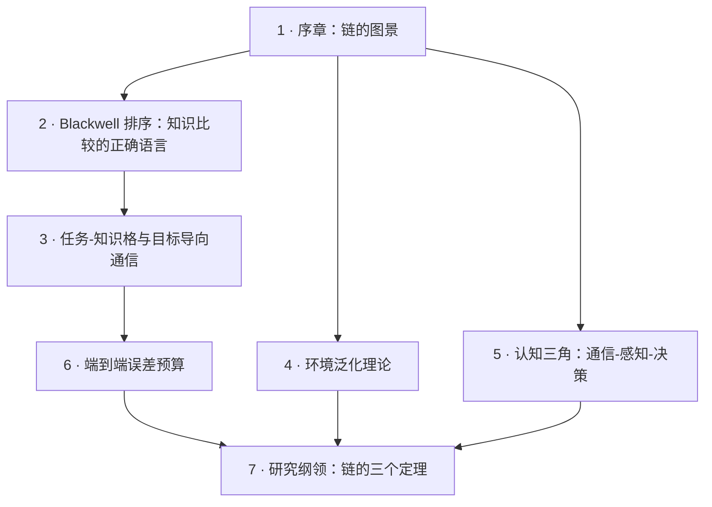

# 第二部 · 链的定理

!!! success "本部已完稿"
    七章正文已于 2026-09 全部成稿。每章都经过逐章通读复核，并通过三项质量检查：公式格式、站点构建、浏览器渲染。下面是本部的地图与目录。

**总论题：环境 → 信道 → 观测 → 任务是一条链，但理论只存在于孤立的环节上——把箭头变成定理，是"环境感知通信/AI 空口/ISAC"全部工程实践缺失的地基。**

第一部研究了链的第一根箭头（环境→信道），第三部研究资源分配这个"横切面"。本部研究**整条链**：任务到底需要知道环境的什么（Blackwell 排序与任务-知识格）？学到的无线智能换个环境还灵吗（环境泛化理论）？通信、感知、决策共享同一份物理资源时的三元折中（认知三角）？误差沿链如何传播、精度预算该花在哪一环（端到端误差预算）？

$$
\mathcal{E}\ \xrightarrow{\ \Phi\ }\ h\ \xrightarrow{\ \text{传输}\ }\ y\ \xrightarrow{\ \text{决策}\ }\ T
$$

## 本部地图

| 章 | 主题 | 性质 |
|---|---|---|
| [1 · 序章](01-four-arrows.md) | E→h→y→T 形式化；两种退化；为何环节理论加不出链的定理 | 观点与导读 |
| [2 · Blackwell 排序](02-blackwell.md) | 实验比较、Le Cam 亏格、链定理骨架；被无线遗忘的经典 | 经典工具（承重） |
| [3 · 任务-知识格](03-task-knowledge-lattice.md) | 任务类充分统计量、Shannon 信息格上的任务格、间接率失真定价 | 原创纲领 |
| [4 · 环境泛化](04-environment-generalization.md) | 失配译码与 GMI、Ben-David 界为何空洞、两径 Lipschitz 界、相位/结构二分（泛化半径 $\lambda/4$ 对 $L$） | 原创纲领 |
| [5 · 认知三角](05-cognitive-triangle.md) | 三元 region 为何不适定、对偶控制母体、认知回路与平衡点（由 Q3 曲线形状决定） | 原创纲领 |
| [6 · 误差预算](06-error-budget.md) | 第 2 章链定理的数值实例：三环链逐环算数、错格反相关引理、高斯 CEO、反注水预算分配、链上 PoL | 数值实例 |
| [7 · 研究纲领](07-research-agenda.md) | 三定理 + 暗线的四件套、与四条 converse 的接口、AI 适配性打分、路线图、接第四部 | 纲领 |
