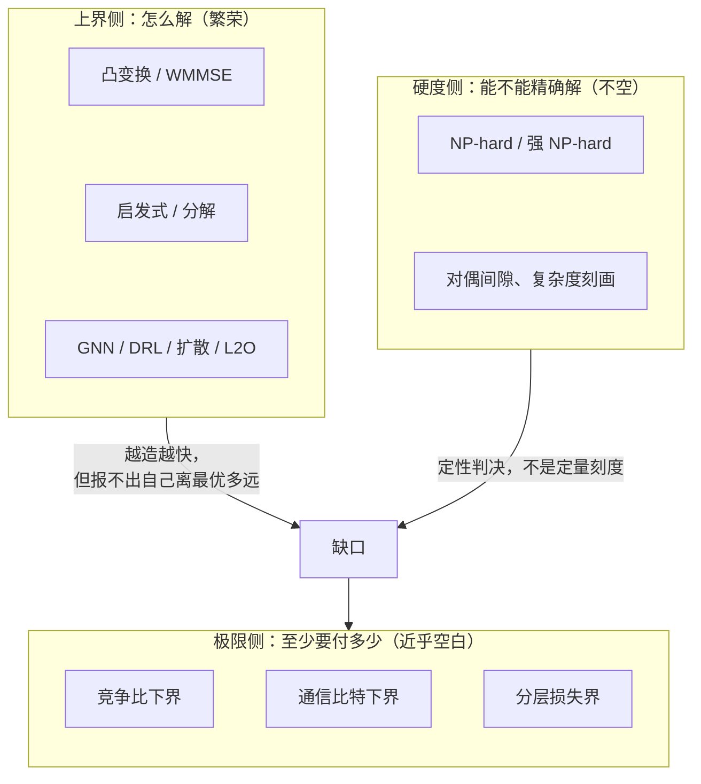
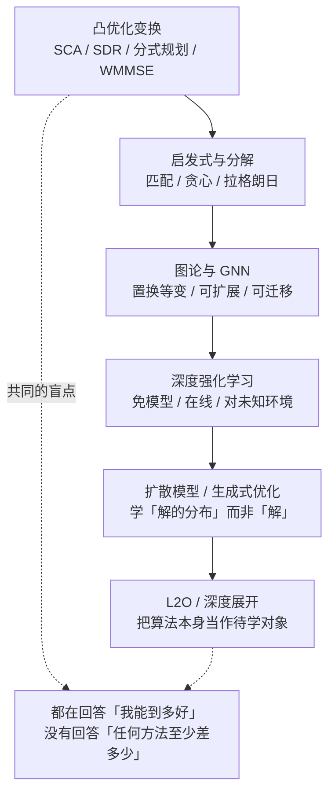
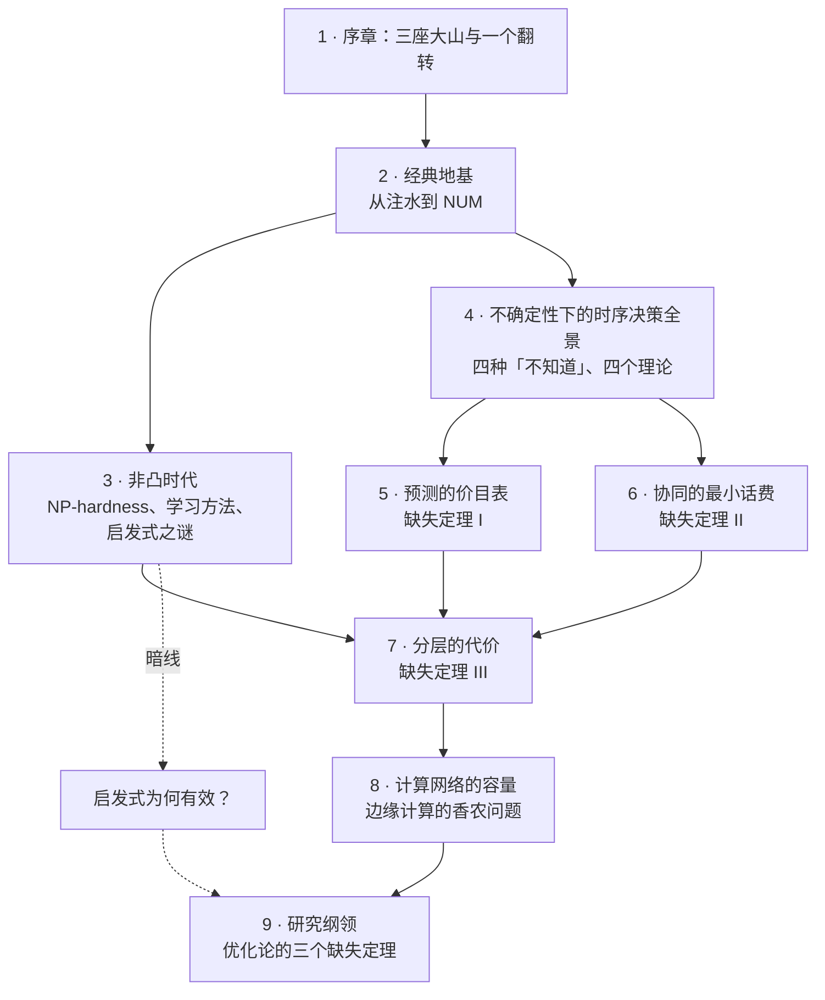

# 1 · 序章：三座大山与一个翻转

工程师被训练成解题的人。给一个资源分配问题，第一反应是找变换、找松弛、找迭代格式，实在不行就上神经网络。过去二十年，无线与网络优化的方法库膨胀得很快：分式规划、半定松弛、WMMSE、图神经网络、深度强化学习、扩散模型、学习优化。

但有一个问题几乎没有被认真问过：**这些方法离最好可能有多远**？不是离上一篇论文的基线有多远，而是离任何算法都不可能越过的那条线有多远。这条线在通信里有名字，叫容量。在资源优化里，它至今没有名字，因为它还不存在。

本部要做的事，是把这个缺席讲清楚：它是什么形状，为什么缺席，补上它需要哪三个定理。

!!! note "本章预备知识"
    本章是第三部的序章，只需凸优化与在线学习的几个基本词汇；后面八章的内容在这里只作预告。用到的内容：

    - 凸函数与凹函数：[预备篇 7.2](../part0/07-optimization-basics.md#72-凸集与凸函数为什么碗形如此重要)。
    - 拉格朗日对偶与对偶间隙：[预备篇 7.3](../part0/07-optimization-basics.md#73-拉格朗日对偶把约束变成价格)。
    - KKT 条件与驻点：[预备篇 7.4](../part0/07-optimization-basics.md#74-kkt-条件最优性的四条戒律)。
    - NP-hard 的含义：[预备篇 5.7](../part0/05-mimo.md#57-mimo-检测谱系从-ml-到球形译码以及-2026-年的新消息)（在整数最小二乘处解释过）。
    - 遗憾（regret）：[预备篇 8.1](../part0/08-reinforcement-learning.md#81-从一台老虎机说起探索还是利用)。
    - 无秩序代价与非原子拥塞博弈：预备篇没有讲，本章用 Pigou 例就地给出。

## 1.1 一个调度器的一天：三个「不知道」 {#一个调度器的一天三个不知道}

设想一台部署在城区宏站上的边缘调度器。它管着一段频谱、一组天线端口、一台 GPU 服务器和三十来个终端。它的一天是这样过的。

**07:30，早高峰。** 三十个终端同时醒来，一半要把视觉推理任务卸载到边缘服务器。调度器要同时决定两类事：谁卸载、谁本地算（0/1 变量），以及卸载者用多大功率、占哪些子载波（连续变量）。

这两件事不可分。甲用大功率把任务推上来，乙的信道就变差，乙被迫改成本地算，于是甲又可以省点功率。移动边缘计算的经典综述把这类联合卸载—资源分配问题定型为混合整数非线性规划 [1]。调度器算了 200 毫秒，输出一个方案。它**不知道这个方案离最优有多远**。

**12:00，午间。** 邻区基站也在调度，两边用户互相干扰，理论上该协同。但邻区不肯，也不能，把队列状态和全部信道系数交出来：回传容量有限，交换的每一比特都挤占本可用于数据的资源。于是两台调度器隔着一条细管子讨价还价，各守一半信息。调度器**不知道对方知道什么**，也不知道该说多少话才够。

**20:00，晚间。** 一个大模型推理请求进来。prompt 长度已知，就摆在那里，可以数 token。但这个请求会吐出多少 token，完全未知：可能是"帮我改个错别字"（10 token），也可能是"写一份技术方案"（3000 token）。服务时间未知，最经典的短作业优先（SJF）就无从下手：你不知道谁短，没法把短作业排到前面。

vLLM 用分页管理 KV cache，把内存浪费压到近零 [2]。KV cache 是模型为已处理的每个 token 缓存的注意力键值向量，显存占用随序列变长而增长。但内存管好了，**调度顺序**仍然卡在同一个"不知道"上。

这就是三座大山，它们在同一天的三个时刻各露一次面：

| 时刻 | 场景 | 暴露的「不知道」 | 数学对象 |
|---|---|---|---|
| 07:30 | 卸载决策 × 功率分配 × 干扰耦合 | 不知道全局最优在哪 | 混合整数非凸规划；驻点 $\neq$ 全局最优 |
| 12:00 | 跨站协同，回传受限 | 不知道别的节点知道什么 | 信息分散 + 比特预算；通信复杂度 |
| 20:00 | LLM 请求输出长度未知 | 不知道下一秒会发生什么 | 在线决策；竞争比 / 动态遗憾 |

!!! tip "直觉"
    三座山难的种类各不相同，三种困难需要三套不同的极限理论：

    - 第一座山的困难是**几何的**：可行域和目标函数的形状不好。
    - 第二座山的困难是**信息的**：知识不在一个地方。
    - 第三座山的困难是**时间的**：信息还没产生。

    本部因此分别处理它们。

值得立刻点破的一件事：这三个"不知道"，教科书全都当作算法问题处理。非凸？用 SCA。分布式？用 ADMM。不确定？用 DRL。每一条都在造更好的算法，没有一条在回答"至少要付出多少"。

## 1.2 三座山的数学面貌 {#三座山的数学面貌}

现在把三座山各写成一个可以放定理的数学对象。

### 1.2.1 山一 · 非凸：不知道全局最优在哪 {#山一--非凸不知道全局最优在哪}

多用户干扰信道下的加权和速率最大化是这座山的标准形态。$K$ 个链路、$N$ 个子载波，功率变量 $p_k^n$：

$$
\max_{\{p_k^n\}}\ \sum_{k=1}^{K} w_k \sum_{n=1}^{N} \log\Big(1+\frac{|h_{kk}^n|^2 p_k^n}{\sigma^2+\sum_{j\neq k}|h_{kj}^n|^2 p_j^n}\Big)
\quad \text{s.t.} \quad \sum_{n=1}^{N} p_k^n \le P_k,\ \ p_k^n \ge 0 .
$$

式中 $h_{kj}^n$ 是第 $n$ 个子载波上发射机 $j$ 到接收机 $k$ 的信道系数（$h_{kk}^n$ 是链路 $k$ 自己的有用信道），$w_k\ge0$ 是链路 $k$ 的权重，$P_k$ 是它的总功率预算，$\mathbf{p}$ 把全部 $p_k^n$ 排成一个向量。

干扰项 $\sum_{j\neq k}|h_{kj}^n|^2 p_j^n$ 出现在**分母**里，目标函数因此对 $\mathbf{p}$ 整体非凹。每一项对自己的功率是凹的（[预备篇 7.2](../part0/07-optimization-basics.md) 的 $\log(1+x)$）。但同一个 $p_j^n$ 还出现在别的链路的分母里，那些项对它是递减的**凸**函数。凹凸相加，就不再保证是凹的，下面的算例给出一个具体反例。

再叠加卸载/关联的 0/1 变量，可行域从"非凸但连通"变成"非凸且离散"，问题成为混合整数非线性规划。

非凹到底有多坏？一个两链路、单载波的最小算例就能看清。

!!! example "算例（两链路功率控制：凹性在哪一步断掉）"
    取 $|h_{11}|^2=|h_{22}|^2=1$，交叉增益 $|h_{12}|^2=|h_{21}|^2=a$，噪声 $\sigma^2=1$，各自功率上限 $P=1$。速率和为

    $$
    R(p_1,p_2)=\log_2\Big(1+\frac{p_1}{1+a\,p_2}\Big)+\log_2\Big(1+\frac{p_2}{1+a\,p_1}\Big).
    $$

    令 $a=4$（强干扰），取三个点：

    $$
    \begin{aligned}
    R(1,0) &= \log_2\big(1+\tfrac{1}{1}\big)+\log_2\big(1+\tfrac{0}{5}\big) = 1+0 = 1,\\
    R(0,1) &= 1,\\
    R(\tfrac12,\tfrac12) &= 2\log_2\Big(1+\frac{0.5}{1+2}\Big) = 2\log_2\tfrac{7}{6} \approx 0.445 .
    \end{aligned}
    $$

    中点的函数值 $0.445$ 严格小于两端点函数值的平均 $1$。凹性要求恰好相反，所以一行计算就否定了凹性。否定的方式也很具体：两个孤立的峰，中间是一道谷。

**物理意义**

这道谷就是"非凸"三个字在工程上的全部含义。两个最优解（甲独占、乙独占）之间没有一条不下坡的路。任何沿梯度爬升的方法，爬到哪个峰上完全由初始点决定。

更麻烦的是，站在峰顶你看不出自己是不是在最高的那座峰上，因为局部信息里没有全局最优的任何痕迹。

**行为分析**

把交叉增益 $a$ 当旋钮，看最优解怎么变：

- $a=0$ 时干扰消失，目标退化为两个独立凹函数之和，问题变凸，注水解就是全局最优。
- $a$ 增大时，"两者全发"与"一者独占"这两个候选的胜负会翻转。

分界点可以精确算出。令 $2\log_2\!\big(1+\tfrac{1}{1+a}\big)=1$，得 $1+\tfrac{1}{1+a}=\sqrt{2}$，即 $a=\sqrt{2}\approx 1.414$。$a<\sqrt{2}$ 时共存更优，$a>\sqrt{2}$ 时独占更优。最优解在 $a$ 越过 $\sqrt{2}$ 的瞬间**跳变**。

这个跳变是组合爆炸的种子：$K$ 个链路意味着 $2^K$ 种"谁开谁关"的拓扑，而参数的微小变化就能把最优拓扑换掉。

这座山的硬度早有判决。先交代这条判决里的三个词：

- **NP 难**（NP-hard）：只要 $\mathrm{P}\neq\mathrm{NP}$，就没有算法能在多项式时间内对所有实例求出精确最优。
- **对偶间隙**：原问题最优值与拉格朗日对偶最优值之差（见[预备篇 7.3](../part0/07-optimization-basics.md)）。间隙为零，说明对偶方法没有损失。
- **Lyapunov 定理**：这里指测度论中的 Lyapunov 凸性定理，与[第 4 章](04-sequential-uncertainty.md)的 Lyapunov 漂移无关。直观上，频率连续可分时，两种功率谱分配可以在频带上按任意比例拼接，可达的（功率, 速率）组合因而构成凸集，对偶就不会有间隙。

Luo 与 Zhang 在 2008 年证明，动态频谱管理问题的离散化版本在多种实际设定下是 NP 难的；同时用 Lyapunov 定理证明，其连续形式的对偶间隙为零 [3]。【已解决】

刘亚锋随后给出完整的复杂度刻画 [4]。对速率约束下最小化总功率、以及功率约束下最大化最小速率效用这两种形式，结论如下：

- 子载波数 $n=1$ 时（$n$ 即上文公式里的 $N$），多项式时间可解。
- $n=2$ 时即为强 NP 难。这一格此前是公开问题。
- $n\ge 3$ 时强 NP 难。

强 NP 难（strongly NP-hard）比 NP 难更重：即使输入里的数值都不超过输入长度的某个多项式，问题仍然 NP 难。所以在 $\mathrm{P}\neq\mathrm{NP}$ 前提下，连运行时间随数值大小多项式增长的"伪多项式"算法也不存在。【已解决】

硬的门槛低到令人不安：两个子载波。

!!! warning "陷阱：NP 难不是下界"
    这是本部通篇要守住的一条界线。NP 难断言的是：当算法类被限制为多项式时间时，无法保证取到最优。它是一个**定性判决**（在 $\mathrm{P}\neq\mathrm{NP}$ 前提下），没有告诉你近似比是 1.01 还是 10。

    硬度证明回答"能不能精确解"，极限定理回答"最多能到哪儿"。本部的整个论点是：前者有，后者无。把两者混为一谈，[第 2 章](02-classical-foundations.md)往后的立论会塌。

### 1.2.2 山二 · 分布式：不知道别的节点知道什么 {#山二--分布式不知道别的节点知道什么}

这座山的难处在于信息散在各处，而不是信息太少。写成标准形式：目标 $f(x)=\sum_{i=1}^{M} f_i(x)$，其中 $f_i$ 只被节点 $i$ 掌握。节点之间通过一条总预算为 $B$ 比特的信道交换消息，最终输出一个 $\epsilon$-最优解。于是有一个自然的量：

$$
\mathcal{B}(\epsilon;\mathcal{F},M)\;=\;\min\big\{\,B:\ \exists\ \text{协议在 } B \text{ 比特内对函数类 } \mathcal{F} \text{ 中任意实例达到 } \epsilon\text{-最优}\,\big\}.
$$

式中 $\mathcal{F}$ 是局部目标 $f_i$ 允许取自的函数类，例如"凸且梯度有界"。定义要求协议对类中**任意**实例都达标，所以 $\mathcal{B}$ 是最坏情形下的比特数。

**物理意义**

这里稀缺的资源是比特，不是算力。同一份信息在中心可用，与分散在 $M$ 个节点上、只能用有限比特交换，是两个不同的问题类。它们的最优值之间隔着一条鸿沟，这条鸿沟的宽度就是"协同的价钱"。

一个最小玩具能说明这个量为什么非平凡。设 $M=2$，$f_1(x)=(x-\alpha)^2$，$f_2(x)=(x-\beta)^2$，$\alpha,\beta\in[0,1]$ 分别只被节点 1、2 掌握：

$$
\begin{aligned}
f(x) &= (x-\alpha)^2+(x-\beta)^2,\\
f'(x) &= 2(x-\alpha)+2(x-\beta) = 0,\\
x^{\star} &= \frac{\alpha+\beta}{2}.
\end{aligned}
$$

要让输出满足 $|x-x^{\star}|\le\epsilon$，直观上必须把 $\alpha$ 与 $\beta$ 各自量化到 $2\epsilon$ 精度，即每方约 $\log_2(1/\epsilon)$ 比特。推广到 $d$ 维得 $O(d\log(1/\epsilon))$。

这个计数来自最直接的方案：

- 每方把 $[0,1]$ 切成宽 $2\epsilon$ 的小格，只报告自己的数落在哪一格。共 $1/(2\epsilon)$ 格，需 $\log_2\frac{1}{2\epsilon}$ 比特。
- 对方取格中点，误差不超过 $\epsilon$。
- 输出两个格中点的平均，误差不超过 $(\epsilon+\epsilon)/2=\epsilon$。

例如 $\epsilon=0.01$ 时共 50 格，每方 6 比特就够。

这个天真的计数是不是紧的，正是 Tsitsiklis 与 Luo 在 1987 年问出的问题。他们第一次严肃地问"协同至少要多少比特"，并给出了答案 [5]。【部分结果：文献中转述的下界形式与其成立的算法类、精度假设在二手来源中并不完全一致，具体核算留到[第 6 章](06-communication-lower-bounds.md)。】

一个重要的正面消息：在"凸 + 随机梯度 + 间歇通信"这个小格子里，问题已经被闭合。Woodworth 等人考虑 $M$ 台机器、$R$ 轮通信、每轮每机 $K$ 次随机梯度的模型（此 $K$ 与山一的链路数 $K$ 无关），给出了新的下界与匹配的上界。这样（差一个对数因子）就确定了该问题类的 min-max 复杂度，即最好的算法在最坏实例上能达到的误差。它与下文"翻转"一节的 $\rho^{\star}$ 同一形状 [6]。【已解决（该问题类内）】

这条结果在序章里怎么强调都不过分："协同的最小话费"不是空想，它已经在某个格子里被算出来过。本部要问的是，它在非凸、干扰耦合、信道受限的无线格子里长什么样。

### 1.2.3 山三 · 不确定：不知道下一秒会发生什么 {#山三--不确定不知道下一秒会发生什么}

在线决策的标准装置是这样的。把整段输入（任务到达、信道实现、请求长度……）记为 $I=I_{1:T}$。在线算法 $A$ 在 $t$ 时刻只看得到 $I_{1:t}$，必须当场决策。离线最优 OPT 相当于事后诸葛亮，一开始就看得到整个 $I_{1:T}$。两者代价之比在**最坏输入**上的值，就是竞争比（competitive ratio）：

$$
\rho_A \;=\; \sup_{I}\ \frac{\mathrm{cost}_A(I)}{\mathrm{cost}_{\mathrm{OPT}}(I)} .
$$

另一种记账方式是动态遗憾：

$$
\mathrm{Reg}_T(A)\;=\;\sum_{t=1}^{T}\Big[c_t(x_t^{A})+\lambda\,\|x_t^{A}-x_{t-1}^{A}\|\Big] \;-\; \min_{x_{1:T}}\ \Big[\sum_{t=1}^{T} c_t(x_t) + \sum_{t=1}^{T}\lambda\,\|x_t-x_{t-1}\|\Big],
$$

式中各项的含义如下：

- $c_t$ 是第 $t$ 个时隙的代价函数（例如该时隙的能耗），到时隙 $t$ 才揭晓。
- $\lambda\|x_t-x_{t-1}\|$ 是**切换代价**，$\lambda>0$ 是单位调整的价格。改功率、迁移任务、重配切片都有开销。
- 减号前是算法实际付的总账，减号后是事后挑出的**最优决策序列**的总账，差额就是动态遗憾（dynamic regret）。

"动态"指基准每个时隙都可以换决策。若基准只许全程用同一个固定决策，得到的是静态遗憾（static regret），这个基准弱得多。静态遗憾见[第 4 章](04-sequential-uncertainty.md)，"遗憾"一词的来历见[预备篇 8.1](../part0/08-reinforcement-learning.md)。

竞争比记的是**倍数**，遗憾记的是**差额**。遗憾若随 $T$ 次线性增长（如 $O(\sqrt{T})$），平均每个时隙多付的代价就趋于零。

切换代价项不可省略：没有它，问题逐时隙解耦，"时序"二字就没有意义了。山三的困难恰恰是时序耦合：此刻的决策通过状态（队列、缓存、电量、KV cache 占用）绑住了未来。

"不知道未来"本身又分四种，差别在于你手里还剩哪一点知识。每种对应一套理论和一种性能语言，完整分类见[第 4 章](04-sequential-uncertainty.md)：

- **知道分布**（随机优化 / MDP → 平均最优）：知道到达和衰落的统计规律，只是不知道下一时隙的具体取值，目标是长期平均代价最小。例：已知泊松到达与瑞利衰落，求长期平均能耗最小的卸载策略。
- **只知道平稳**（Lyapunov 漂移 → 队列稳定）：分布未知，只知道平均到达率在系统服务能力之内，目标是队列不爆、代价接近最优。例：基站每个时隙只看当前队长和信道决定发多少，从不估计分布。
- **假设最坏**（在线凸优化 / 竞争分析 → regret 或竞争比）：不做统计假设，把未来当作对手，与事后最优比。例：20:00 的 LLM 请求，输出长度可以任意刁钻。
- **边做边学**（bandit / RL → 相对最优臂的 regret）：不知道各选项好坏，每次只看到所选那一项的反馈。例：在几个信道或边缘服务器之间挑一个，只能观测被选中者的时延。

有预测时，事情变得有趣。学习增强算法（learning-augmented algorithms）引入了一对坐标：

- 算法称为 $\beta$-**一致的**（consistent），若预测零误差时竞争比为 $\beta$。
- 算法称为 $\alpha$-**鲁棒的**（robust），若预测任意坏时竞争比仍被 $\alpha$ 控制 [7][8]。

这对坐标是"预测值多少钱"这个问题的第一张坐标纸。完整故事留到本章 1.4 节（"存在性证明"的第三个例子）和[第 5 章](05-price-of-prediction.md)。这里的 $\alpha$、$\beta$ 是竞争比的数值，与山二玩具例子里两个节点的私有数据 $\alpha$、$\beta$ 无关。

!!! success "关键结论"
    三座山对应三个不同的数学对象：

    - 非凸：函数与可行域的几何。
    - 分布式：信息的分布与比特预算。
    - 不确定：时间上的信息可得性与切换耦合。

    它们不能用一套理论处理，也不能用一套说法笼统带过。

## 1.3 翻转：从「怎么解」到「至少要付多少」 {#翻转从怎么解到至少要付多少}

现在做本部最重要的一次视角翻转。给定问题类 $\mathcal{P}$（所有可能的实例 $I$）与算法类 $\mathcal{A}$，考虑下面这个量。它从里往外读：

- 先固定算法 $A$，让对手在 $\mathcal{P}$ 里挑出使它最吃亏的实例（$\sup_I$），得到 $A$ 的竞争比。
- 再在 $\mathcal{A}$ 里挑吃亏最少的算法（$\inf_A$）。

于是 $\rho^{\star}$ 是"这类算法在这个问题类上能给出的最好保证"：

$$
\rho^{\star} \;=\; \inf_{A \in \mathcal{A}}\ \sup_{I \in \mathcal{P}}\ \frac{\mathrm{cost}_{A}(I)}{\mathrm{OPT}(I)} .
$$

- **上界侧**做的事：构造一个具体算法 $A_0$，证明 $\sup_I \mathrm{cost}_{A_0}(I)/\mathrm{OPT}(I)\le \rho_{\mathrm{up}}$，于是 $\rho^{\star}\le\rho_{\mathrm{up}}$。一句话："我至多付这么多。"
- **下界侧**做的事：构造一族难实例，证明**对任意** $A\in\mathcal{A}$ 都有 $\sup_I \mathrm{cost}_{A}(I)/\mathrm{OPT}(I)\ge \rho_{\mathrm{lo}}$，于是 $\rho^{\star}\ge\rho_{\mathrm{lo}}$。一句话："你至少要付这么多。"

**物理意义**

只有当两侧同时存在，"我的算法离最优有多远"这句话才有意义，它等于 $\rho_{\mathrm{up}}/\rho_{\mathrm{lo}}$ 这个可计算的数。也只有这时，"这个方向已经做到头了"才是一个**可判定的命题**，而不是一种感受。

学科成熟的标志是 $\rho_{\mathrm{up}}=\rho_{\mathrm{lo}}$：上下界相碰。

**行为分析**

注意 $\rho^{\star}$ 依赖于 $\mathcal{A}$ 的选取：

- 限制 $\mathcal{A}$ 为多项式时间算法，得到计算复杂度型的界。
- 限制为只能交换 $B$ 比特的分布式协议，得到通信型的界。
- 限制为只能看见过去的在线算法，得到信息型的界。

三座山正好对应三种对 $\mathcal{A}$ 的限制方式。这是本部的组织原则。

### 1.3.1 1948 年发生了什么 {#1948-年发生了什么}

香农之前，通信不是没有理论。Nyquist 在 1924 与 1928 年、Hartley 在 1928 年就给出了带宽与速率的关系式。香农本人在 1948 年的论文开篇就说明，他的理论建基于两人的工作，他新增的核心是**噪声的影响**与信源统计结构带来的节省 [9]。所以"1948 年前一片空白"是错的，更精确的说法是：

> 1948 年之前，通信有"更好的调制"，但没有"不可逾越的界"。

1948 年的真正断裂点，是容量 $C=\max_{p(x)}I(X;Y)$ 连同一对定理。用上文的记号，$C$ 同时是 $\rho_{\mathrm{up}}$ 和 $\rho_{\mathrm{lo}}$，两者相碰于同一个数。

!!! abstract "定理（信道编码定理，Shannon 1948 [9]）"
    对离散无记忆信道，容量 $C=\max_{p(x)}I(X;Y)$。

    - 可达性：任意 $R<C$，存在码率为 $R$ 的编码序列使错误概率趋于零。
    - 逆定理：任意 $R>C$，错误概率不趋于零。

    两条缺一不可。只有可达性，$C$ 只是一个成绩；只有逆定理，$C$ 只是一个悲观估计。合起来，$C$ 才是"极限"。

    这一对结构就是本部的方法论模板：极限定理 = 上界 + 下界，且两者相碰。

!!! note "备注（本站原创提法）"
    我们把"有越来越好的方法、但没有不可逾越的界"这一状态命名为**前香农状态（pre-Shannon state）**。这个词不是文献中的既有术语，是本站为组织材料引入的叙事装置。

    中心判断是：资源优化今天所处的位置，相当于通信在 1948 年之前。我们有越来越好的"调制方式"（WMMSE、DRL、GNN、扩散模型），但我们没有"容量"。下面给出三条证据。

### 1.3.2 证据一：最受推崇的算法说不出自己离最优多远 {#证据一最受推崇的算法说不出自己离最优多远}

WMMSE 是这个领域公认的旗舰算法。它把加权和速率最大化等价转化为加权 MSE 最小化，交替优化接收器、权重、发射器，只需局部信道信息，被引超过两千次 [10]。它的收敛性保证是什么？

!!! abstract "定理（WMMSE 的保证，Shi–Razaviyayn–Luo–He 2011 [10]）"
    加权和速率最大化与加权 MSE 最小化在适当的权重更新下等价；交替优化算法收敛到原问题的**稳定点**。该等价与收敛结论可推广到一般和效用最大化问题。【已解决】

    "**稳定点**"（stationary point，开头表格里的"驻点"是同一概念）这三个字要放大来读。它意味着梯度为零（有功率约束时指满足 KKT 条件，见[预备篇 7.4](../part0/07-optimization-basics.md)）。它不意味着全局最优，更不意味着知道自己离全局最优多远。

**行为分析**

回到本章的两链路算例。$a=4$ 时两个角点都是好解，中点是谷。一个收敛到稳定点的算法可能停在远不如角点的稳定点上，也可能滑向某个角。而无论停在哪，算法本身都无法报告这个差距。

这个差距可以算得很具体：

- 信道对称、初值也严格对称（且非零）时，WMMSE 每一步更新都保持 $p_1=p_2$。
- 在对角点 $(p,p)$ 上 $\partial R/\partial p_1=\frac{1}{\ln 2}\cdot\frac{1}{(1+4p)(1+5p)}>0$，所以对角线上唯一满足 KKT 条件的点是两边都顶在功率上限的 $(1,1)$，算法只能收敛到那里。
- 它是合法的稳定点，但 $R(1,1)=2\log_2\tfrac{6}{5}\approx0.526$，只有全局最优 $1$ 的 53%。

这就是上界侧的天花板：$\rho_{\mathrm{up}}$ 甚至没有被算出来，因为"稳定点"根本不是一个关于 $\mathrm{cost}/\mathrm{OPT}$ 的陈述。

### 1.3.3 证据二：最新综述的目录里没有「基本极限」 {#证据二最新综述的目录里没有基本极限}

刘亚锋等人 2024 年的 JSAC 综述系统梳理了无线通信优化方法的近期进展。它的组织轴有四条：非凸优化、全局优化与整数规划、分布式优化、学习型优化 [11]，清一色的"怎么解"。

该文确实讨论了复杂度：指出某些变体强 NP 难，因而不存在多项式时间算法求全局最优。但全文没有系统的"基本极限 / 逆定理"章节。【已证实：本站于 2026-08 核对该文正文结构。】

一个领域的顶级综述目录，就是这个领域的自画像。四章讲怎么解，零章讲极限，这反映的是学科当前的重心，不是疏忽。

### 1.3.4 证据三：一个粗略的量级对照 {#证据三一个粗略的量级对照}

!!! warning "方法论声明（请勿把下表读成文献计量）"
    以下是**印象性**证据，不是严格的文献计量研究。arXiv 摘要检索粒度很粗，且无线通信的主战场是 IEEE 期刊而非 arXiv。引文数受综述效应与热点效应影响，不同数据库对同一篇论文的计数也常有明显差异。

    表中两栏被引数分别取自 Semantic Scholar（按 DOI 查询 Graph API 的 citationCount 字段）与 OpenAlex（`cited_by_count`），检索日期都是 2026-09-23，两库对同一篇论文最多相差约两成。arXiv 检索的时间是 2026-08-16，检索式一并列出以便复现。

    请把它读成"一个粗略的量级对照"，不要读成"研究表明"。

| 论文 | 定位 | 被引（Semantic Scholar） | 被引（OpenAlex） |
|---|---|---|---|
| Mao 等 MEC 综述 (2017) [1] | 舞台综述 | 4826 | 5695 |
| WMMSE, Shi 等 (2011) [10] | 上界侧·算法旗舰 | 2265 | 2172 |
| Chiang 等 分层即分解 (2007) [30] | 架构理论 | 1433 | 1389 |
| Luo–Zhang 频谱管理复杂度 (2008) [3] | 下界侧·硬度 | 950 | 980 |
| **Berry–Gallager 功率–时延 (2002) [12]** | **下界侧·极限定理** | **806** | **786** |
| Sun 等 L2O 干扰管理 (2018) [23] | 上界侧·学习 | 740 | 899 |
| Shen 等 GNN JSAC (2021) [25] | 上界侧·学习 | 419 | 367 |
| Eisen–Ribeiro REGNN (2020) [24] | 上界侧·学习 | 339 | 338 |

单篇最强的上界侧算法的被引数，约为单篇最强的极限定理的 2.8 倍。Semantic Scholar 计 2265 对 806，换用 OpenAlex 是 2172 对 786，仍约 2.8 倍。而这条极限定理已问世二十四年，几乎没有同类后继。

arXiv 摘要字段的检索给出更刺眼的一组数：

| 检索式（arXiv API，`abs:` 字段） | 命中 |
|---|---|
| `abs:"computation offloading"` | 356 |
| `abs:"computation offloading" AND abs:"deep reinforcement learning"` | 33 |
| `abs:"computation offloading" AND abs:"NP-hard"` | 20 |
| `abs:"computation offloading" AND abs:"lower bound"` | 1 |
| `abs:"computation offloading" AND abs:"competitive ratio"` | 0 |
| `abs:"power control" AND abs:"deep learning"` | 31 |
| `abs:"power control" AND abs:"NP-hard"` | 32 |

**这组数怎么读才有价值**

硬度侧并不空：`power control × NP-hard` 有 32 篇，与 `power control × deep learning` 的 31 篇同量级，所以不能说"没人做理论"。

真正空的是**定量的下界**：`computation offloading × competitive ratio` 一篇都没有，`× lower bound` 只有一篇。这个领域会说"这个问题很难"，但几乎不说"任何算法至少要差多少"。香农之前也不是没人知道噪声难对付。缺的从来不是"难"这个判断，缺的是 $C$。

## 1.4 存在性证明：这类定理是写得出来的 {#存在性证明这类定理是写得出来的}

前香农状态的诊断很容易滑向许愿。所以本节给出三个已经写出来的极限定理，证明这类结果并非不可企及。三个例子分别对应本部的三个缺失定理，而它们全都发生在别的问题类上。

### 1.4.1 Berry–Gallager 平方根律：无线资源领域的孤本 {#一berrygallager-平方根律无线资源领域的孤本}

!!! abstract "定理（功率–时延平方根律，Berry–Gallager 2002 [12]）"
    **设定**：单链路、缓冲无限、到达过程平稳遍历（原文取 i.i.d. 到达），发射功率是速率的严格凸函数。结论是 $\varepsilon\to 0$ 的**渐近**陈述。

    设 $P^{\star}$ 为维持给定到达率所需的最小平均功率。则**任何**使平均功率不超过 $P^{\star}+\varepsilon$ 的策略，其平均队长（经 Little 定律即平均时延）满足

    $$
    \bar{D}(\varepsilon)=\Omega\big(1/\sqrt{\varepsilon}\big).
    $$

    【已解决】可达侧的相关算法达到 $O\big(\tfrac{1}{\sqrt{\varepsilon}}\log\tfrac{1}{\varepsilon}\big)$，即上下界相差一个对数因子。指数 $-1/2$ 已经钉死，常数与对数因子未定。

这里的"任何"二字很关键：这是货真价实的逆定理。两个渐近记号的含义是：

- $\Omega(\cdot)$ 读作"至少同阶"：存在常数 $c>0$，使 $\varepsilon$ 足够小时 $\bar{D}\ge c/\sqrt{\varepsilon}$。
- $O(\cdot)$ 是"至多同阶"，两者同时成立记作 $\Theta(\cdot)$。

设定里的两个前提也都有来历：

- 功率是速率的严格凸函数：由 Shannon 公式 $r=\log_2(1+P|h|^2/\sigma^2)$ 反解得 $P=(2^{r}-1)\sigma^2/|h|^2$。
- Little 定律说平均队长 = 到达率 × 平均时延，到达率固定时两者只差一个常数倍。

凸性是权衡的根源：把发送摊平、挑信道好的时隙多发最省功率，而摊平与等待都要让比特在缓冲区里排队。

换一个自变量写，形状会更清楚。下面一律忽略对数因子，用 $\tilde{\Theta}$ 记之，这就是上面说的"指数已定、对数未定"：

$$
\begin{aligned}
\bar{D}(\varepsilon) &= \tilde{\Theta}\big(\varepsilon^{-1/2}\big) \\
\Longrightarrow\quad \varepsilon &= \tilde{\Theta}\big(\bar{D}^{-2}\big) \\
\Longrightarrow\quad \bar{P}(\bar{D}) - P^{\star} &= \tilde{\Theta}\big(\bar{D}^{-2}\big).
\end{aligned}
$$

第一行两边平方再取倒数得第二行；第三行只是把 $\varepsilon$ 换回它的含义：平均功率超出最小值 $P^{\star}$ 的部分 $\bar{P}-P^{\star}$。

**物理意义**

功率与时延之间存在一条**不可逾越的换算曲线**，指数是 $-2$。你可以用时延换功率，但汇率是定死的：想让超额功率再降一个数量级，就得把时延放大 $\sqrt{10}\approx 3.16$ 倍。

这是物理规律级别的陈述，任何算法都受它约束，与某个算法的性能无关。

**行为分析**

代入数量级：

- 要把超额功率 $\varepsilon$ 压缩 100 倍，时延必须放大 $\sqrt{100}=10$ 倍。
- 反过来，时延预算从 10 ms 放宽到 100 ms，可省的超额功率上限就是 100 倍。

这是一条工程师可以直接拿去做系统预算的曲线。整个无线资源分配领域，有一条真正的极限定理长这个样子。它 2002 年就写出来了。二十四年过去，它几乎还是孤本。

!!! warning "记号消歧（必读）"
    Neely 的漂移加惩罚（drift-plus-penalty）框架每个时隙贪心地最小化"队列积压的增长 + $V\times$ 当前代价"，不需要预测未来（详见[第 4 章](04-sequential-uncertainty.md)）。它给出效用–时延权衡 $[O(1/V),\,O(V)]$：控制参数 $V>0$ 越大，时间平均效用越靠近最优（差距 $O(1/V)$），平均队长越大（$O(V)$）[13]。

    它与上面的平方根律形状相似，但性质完全不同，且记号极易混淆：

    - Berry–Gallager 的 $\varepsilon$ 是**性能余量**（超出最小功率多少），定理对**所有**策略成立，这是下界侧。
    - Neely 的 $V$ 是**算法旋钮**（你自己拧的参数），结论描述**某个具体算法族**能达到什么，这是上界侧。

    两者放在一起，正好是本章翻转的注脚：同一个领域里，上界侧有优雅的可调权衡，下界侧只有一条孤零零的曲线。

### 1.4.2 Pigou 与 4/3：分权的代价被算成了一个数 {#二pigou-与-43分权的代价被算成了一个数}

第二个存在性证明来自算法博弈论。Koutsoupias 与 Papadimitriou 在 1999 年提出无秩序代价（Price of Anarchy, PoA）：均衡解的社会成本与集中最优的社会成本之比 [14]。Roughgarden 与 Tardos 在 2002 年证明：非原子拥塞博弈、仿射代价函数下，PoA $=4/3$ [15]。【已解决】

这里有三个词需要交代：

- "非原子"：用户无穷多，每人只占无穷小一份流量，单个人换路不改变任何链路的代价。
- "仿射代价"：每条链路的代价是其流量的一次函数 $c(x)=ax+b$（$a,b\ge0$）。
- 均衡：没有人能靠单方面换路降低自己的代价。

这个数从哪来？Pigou 的两条平行链路例子五步就能算出来。总流量 1，链路 1 的代价恒为 $c_1(x)=1$，链路 2 的代价为 $c_2(x)=x$。推导按下面的顺序走：

- 第一行算均衡。只要链路 2 上的流量 $x<1$，它的代价 $x$ 就低于链路 1 的 1，链路 1 上的人都想换过来，所以均衡时全部流量挤在链路 2 上。
- 第二到四行算社会最优。把比例 $x$ 分给链路 2，对总代价 $C(x)$ 求极小。
- 最后一行取两者之比。

$$
\begin{aligned}
C_{\mathrm{eq}} &= 1\cdot c_2(1) = 1\cdot 1 = 1,\\
C(x) &= (1-x)\cdot c_1 + x\cdot c_2(x) = (1-x) + x^2,\\
\frac{dC}{dx} &= 2x-1 = 0 \;\Longrightarrow\; x^{\star}=\tfrac12,\\
C_{\mathrm{opt}} &= C(\tfrac12) = \tfrac12 + \tfrac14 = \tfrac34,\\
\mathrm{PoA} &= \frac{C_{\mathrm{eq}}}{C_{\mathrm{opt}}} = \frac{1}{3/4} = \frac43 .
\end{aligned}
$$

**物理意义**

均衡为什么劣于最优？因为每个用户只看**自己**的代价，看不见自己给别人添加的边际拥塞。链路 2 在 $x=1$ 处代价恰好等于 1，与链路 1 打平，所以没人愿意换。但社会最优要求一半流量"牺牲"到看似更差的链路 1 上。分权导致的效率损失，恰好是 $33.3\%$。

**行为分析**

$4/3$ 的重要之处在于它是一个确定的数字。它说明，决策被分散到多个自私主体而损失的效率，可以被精确定价。而且这个价格对整个仿射代价函数类**一致成立**，与网络拓扑、流量大小无关。

本部第三个缺失定理想要的就是这种形状，只是要定价的对象从"自私"换成了"分层"。

### 1.4.3 滑雪租赁：预测的价目表已经精确到公式 {#三滑雪租赁预测的价目表已经精确到公式}

第三个存在性证明最贴近本部第一个缺失定理。Lykouris 与 Vassilvitskii 在 2018 年确立了一致性/鲁棒性这对坐标 [7]，Purohit 等人同期给出多个问题上的权衡算法 [8]。随后 Wei 与 Zhang 证明了这对坐标之间的**紧权衡** [16]。

先交代定理里的两个问题和一处记号：

- **滑雪租赁**（ski rental，[第 4 章](04-sequential-uncertainty.md)称"滑雪租板"）是在线算法的入门问题：租板每天花 1，买板一次花 $b$，但不知道自己还会滑几天。事后最优很简单：会滑满 $b$ 天就第一天买，否则一直租。不知道未来时，确定性算法最好的做法是先租 $b-1$ 天再买，竞争比不超过 2。按次付费把任务卸载到边缘、还是买断本地算力，就是同一个"租还是买"结构。
- **非即时调度**（non-clairvoyant scheduling）：作业做完之前调度器不知道它要跑多久，正是 20:00 那个 LLM 请求的处境。
- 记号：定理里的 $\lambda$ 是"信任预测多少"的旋钮，与上文动态遗憾里的切换价格 $\lambda$ 无关。鲁棒性改记为 $\gamma$，即上文的 $\alpha$。

!!! abstract "定理（一致性–鲁棒性紧权衡，Wei–Zhang 2020 [16]，节选转述）"
    - **滑雪租赁，确定性**：任何 $(1+\lambda)$-一致的确定性算法，**至少**是 $(1+1/\lambda)$-鲁棒的。
    - **滑雪租赁，随机**：任何达到鲁棒性 $\gamma$ 的随机算法，其一致性满足 $\beta \ge \gamma\log\big(1+\tfrac{1}{\gamma-1}\big)$。
    - **非即时调度（$n$ 个作业）**：任何 $(1+\lambda)$-一致的算法满足 $\gamma \ge \dfrac{n+n(n+1)\lambda}{1+\lambda(n+1)(n+2)/2}$。
    - **$n=2$ 时紧**：存在算法同时 $(1+\lambda)$-一致与 $\big(1+\tfrac{1}{1+6\lambda}\big)$-鲁棒，$\lambda\in(0,1/3)$，且该界是紧的。【已解决】

**物理意义**

第一条就是一张标准的价目表。$\lambda$ 是你愿意为"完全信任预测"付出的保险费。$\lambda$ 越小，预测准时你越接近最优；代价是预测错时你越惨，且惨的程度被 $1+1/\lambda$ **锁死**。这个上限对所有确定性算法都成立，与具体算法的好坏无关。

这两个数可以从一个具体算法看出来。预测说"会滑很久"时，信它的算法在第 $\lambda b$ 天就买。取 $b=100$、$\lambda=0.2$：前 19 天租、第 20 天买，共花 $19+100=119$。

- 预测对了、真的滑了很久：事后最优是直接买，花 100，比值 $1.19\approx1+\lambda$。
- 预测错了、刚买完就不滑了：事后最优是租 20 天，花 20，比值 $5.95\approx1+1/\lambda$。

买得越早，预测对时越省，预测错时越亏。

**行为分析**

把 $\lambda$ 当旋钮，逐档看：

- $\lambda=0.5$：一致性 $1.5$，鲁棒性 $\ge 3$。
- $\lambda=0.2$：一致性 $1.2$，鲁棒性 $\ge 6$。
- $\lambda=0.1$：一致性 $1.1$，鲁棒性 $\ge 11$。
- $\lambda=0.05$：一致性 $1.05$，鲁棒性 $\ge 21$。

曲线是双曲线：一致性每向 1 靠近一点，鲁棒性的账单以 $1/\lambda$ 的速度飙升。$\lambda\to 0$（完全信任预测）时鲁棒性发散，一次坏预测可以让你付出无界代价。$\lambda=1$ 时一致性 2、鲁棒性 $\ge 2$，恰好退回不用预测的经典结论。

{ .chart loading=lazy }
{ .chart loading=lazy }

*怎么读这张图：纵轴是竞争比，越接近 1 越好。第一条是缓缓上升的直线，即一致性 $1+\lambda$：预测准时离最优多近。第二条是下降的双曲线，即鲁棒性下界 $1+1/\lambda$：预测错时任何确定性算法至少要付的倍数（上面定理的第一条）。*

*两线在 $\lambda=1$ 相交于 2，正是不用预测的经典竞争比。往左走，一致性每向 1 靠近 0.1，鲁棒性账单就从 2 一路涨到 11。曲线按定理里的两个公式逐点计算。*

!!! success "关键结论（本节的全部要点）"
    三组对照：

    - 预测：在**滑雪租赁**这样的玩具问题上，价目表已经精确到公式；在**基站调度**上，一页都没有。
    - 分权：在**仿射拥塞博弈**上，分权的代价是 $4/3$；在**协议分层**上，没有任何一般界。
    - 功率–时延：在**单链路功率–时延**上，极限曲线是 $\Theta(\bar{D}^{-2})$；在**多用户干扰 + 卸载 + 缓存**上，什么都没有。

    这三组对照就是本部的全部动机。它们说明两件事：这类定理写得出来；在我们最关心的问题类上，它们还没有被写出来。

## 1.5 三座山 × 四大舞台 {#三座山--四大舞台}

抽象原理要落地才有意义。本部选四个当代舞台反复落地：边缘计算/任务卸载、大模型推理服务、联邦学习、网络切片调度。每座山在每个舞台上都有具体形态，构成一张 3×4 矩阵。这是全部的坐标纸，第 2 至 9 章每章开头都可以回指其中某一格。

| | **边缘计算 / 任务卸载** | **大模型推理服务** | **联邦学习** | **网络切片调度** |
|---|---|---|---|---|
| **非凸** （不知最优在哪） | 0/1 卸载决策 × 干扰耦合 → MINLP；干扰在分母，可行域非凸 [1] | 请求→实例放置、批组装、KV cache 块分配 = 整数装箱；prefill/decode 两相共置互扰，时延曲线非线性 [17] | 客户端选择（0/1）× 带宽/功率/本地迭代数联合；真正目标（模型精度）只能被代理刻画 [21] | 切片准入（0/1）+ PRB 分配 + 隔离约束 + SLA 非凸约束 [22] |
| **分布式** （不知别人知道什么） | 终端只知自己的信道与队列；基站不知任务真实规模 | 多副本调度器互不知对方 KV cache 占用；PD 分离后两侧状态跨机器 [17] | **梯度留在端侧**，服务器只见聚合更新；统计异构 + 有限上行比特预算 [21] | 多租户/多域，租户不共享真实需求（激励不相容） |
| **不确定** （不知下一秒） | 任务到达、信道衰落、终端移动 | **输出长度未知** → 服务时间未知 → SJF/SRPT 无法直接用 [2][18][19] | 掉队者、参与率、下一轮谁在线 | 流量突发、切片需求时变、SLA 违约风险 [22] |

十二格不必都讲透，但有三格必须讲透，它们是全书最好的教学例子。

!!! example "场景一 · LLM 推理服务的「不确定」：输出长度未知"
    这是全书最好的"山三"实例，因为它把抽象概念变成了一句人人能懂的话：你不知道这个请求会吐多少 token，所以你没法用 SJF。

    文献链条恰好是三步，每一步都在往"极限"的方向逼近：

    1. **精确预测不可行**。Fu 等人（NeurIPS 2024）指出，与其预测输出长度的数值，不如预测一批请求中输出长度的**相对次序**。据此近似 SJF 以缓解 FCFS 的队首阻塞，报告聊天服务时延降 2.8×、合成数据生成吞吐升 6.5× [18]。
    2. **点估计也不够，要分布**。Zheng 等人（2026）把输出长度当作**分布**而非点估计，用 log-t 分布刻画解码过程的重尾性，提出尾部膨胀期望（Tail Inflated Expectation, TIE）指标，报告在线每 token 时延降 2.31×、离线吞吐升 1.42× [19]。
    3. **理论侧明说自己不够**。Mitzenmacher 与 Shahout（2025）指出，LLM 推理调度带来了经典排队论没处理过的新复杂性：推理时间可变、KV cache 造成动态内存约束、多种抢占策略并存。他们把"**预测如何最有效地改进调度决策**"明确列为公开问题 [20]。【开放】

    三步走完，问题的形状已经很清楚：从"排序"到"分布"，每一步都在更精细地刻画预测的质量。下一步自然是问：给定预测质量，最好能到多好？这就是[第 5 章](05-price-of-prediction.md)要问的价目表。

!!! example "场景二 · 联邦学习的「分布式」：梯度留在端侧"
    联邦学习把山二的形状暴露得最干净：数据和梯度在物理上就留在端侧，服务器只见聚合更新，而上行链路的比特预算有限，且与无线资源分配纠缠在一起。Chen 等人（TWC 2021）建立的联合学习–通信框架，把用户选择、上行资源块分配与发射功率放进同一个优化问题 [21]。

    但要注意这类工作回答不了什么。它给出的是一个联合优化的解法（上界侧）。它回答不了的是：为了让全局模型达到给定精度，**上行至少要传多少比特**？梯度压缩到什么程度就必然损失收敛率？

    山二在凸+随机的格子里已被闭合 [6]，在"非凸模型 + 统计异构 + 无线信道"的格子里则是[第 6 章](06-communication-lower-bounds.md)的题目。【开放】

!!! example "场景三 · 任务卸载的「非凸」：整数决策 × 干扰耦合"
    回到 07:30 的那个决策。它的困难是两种非凸性的**乘积**：0/1 卸载变量带来的组合结构，与干扰在分母带来的连续非凹性。本章的两链路算例已经说明，仅仅是后者就足以制造孤立峰与谷；前者再乘上 $2^K$ 的拓扑数，问题的地形无法用任何局部信息刻画。

    这一格上的方法最密集（MINLP 分支定界、SCA、匹配、DRL、GNN），下界却最稀薄：`computation offloading × competitive ratio` 的检索命中数是 0。方法最多的地方，恰好是极限最缺的地方。方法多说明问题重要且难，极限缺说明我们至今不知道这些方法好到什么程度。

## 1.6 上界侧的军备竞赛：一条方法谱系 {#上界侧的军备竞赛一条方法谱系}

既然上界侧如此繁荣，就该看清它繁荣的形状。过去二十年的方法演化大致沿一条清晰的谱系展开，每一代都在放松上一代的一个假设。

把每一支的"解决了什么、回答不了什么"列成一张表，缺口的位置就一目了然：

| 方法支 | 代表工作 | 解决了什么 | 回答不了什么 |
|---|---|---|---|
| 凸优化变换 | WMMSE [10] | 把非凸目标等价转化为可迭代求解的形式；只需局部 CSI；收敛有保证 | 保证只到**稳定点**；离全局最优多远未知 |
| 学习型直接映射 | Sun 等 L2O [23] | 用 DNN 逼近 WMMSE 的输入输出映射，推理时间降数个量级 | 逼近误差与最优性差距无界；换场景需重训 |
| 图神经网络 | REGNN [24]、Shen 等 [25] | **唯一自带理论刻画的一支**：置换等变性使其可迁移到不同网络规模，并有可扩展性与泛化分析 | 给的是"**这个架构能做到什么**"，不是"任何架构至少要付出什么" |
| 深度强化学习 | 切片资源管理综述 [22] | 免模型、在线适应未知动态；处理时序耦合 | 无最坏情形保证；样本复杂度与安全性缺界 |
| 扩散 / 生成式优化 | Du 等教程 [26]、Liang 等 [27] | 学"解的分布"而非单点解，可与 DRL 结合、处理多模态解空间 | Liang 等**声称**有生成式优于判别式的理论论证，其强度尚待核实；无最优性界 |
| L2O / 深度展开 | Chen 等基准 [28] | 把算法本身参数化并学习；Open-L2O 提供统一基准 | 收敛与泛化保证零散；无问题类级别的极限 |

!!! note "关于 GNN 这一支的特别说明"
    整条谱系上唯一自带严格理论刻画的是图神经网络。Eisen 与 Ribeiro 在衰落干扰图上做卷积，利用置换等变性实现跨网络迁移，并用无监督原–对偶方法训练 [24]。Shen 等人给出架构设计与置换等变性、泛化的理论分析 [25]。【已解决（在其各自设定内）】

    但即便是这一支，定理仍然全部在上界侧。它刻画的是"某个架构类能表达什么、能泛化到多大规模"，没有任何一条说"任何架构在这个问题类上至少要损失多少"。军备竞赛越激烈，缺下界这件事就越刺眼。

## 1.7 三个缺失定理、一条暗线，与九章地图 {#三个缺失定理一条暗线与九章地图}

### 1.7.1 三个缺失定理

现在可以把本部要问的问题写出来了。三个缺失定理，各对应一座山，也各有一个对应的存在性证明（见 1.4 节）。

!!! abstract "本部要问的三个问题（注意：是「问」，不是「答」）"
    **缺失定理 I · 预测的价目表**（对应山三）：决策的率失真理论。给定预测的**准确度**与**视界**，可达性能的上确界是什么？

    - 文献里最近的物件：一致性/鲁棒性坐标 [7][8]，其紧权衡 [16]，以及预测视界的红利刻画 [29]。
    - **本站的原创成分**：把"准确度 × 视界"合成**一张统一的价目表**，并要求它在无线/边缘资源分配问题类上成立。文献中没有这个统一物。

    【开放】详见[第 5 章](05-price-of-prediction.md)。

    **缺失定理 II · 协同的最小话费**（对应山二）：分布式资源分配的通信复杂度下界。要达到给定的最优性，节点之间**至少**要交换多少比特？

    - 文献里最近的物件：Tsitsiklis–Luo 1987 [5]，以及 Woodworth 等在凸+随机+间歇通信下已闭合的上下界 [6]。
    - **本站的原创成分**：把它迁移到**非凸 + 干扰耦合 + 信道受限**的无线场景，以及"话费"这个比喻本身。

    【开放】详见[第 6 章](06-communication-lower-bounds.md)。

    **缺失定理 III · 分层的代价**（对应山一与架构）：通信-计算联合系统的 NUM 2.0。把一个联合问题切成若干层/若干时间尺度求解，**最多**损失多少？

    - 文献里最近的物件：PoA [14][15] 与 Chiang 等的"分层即优化分解" [30]。后者主要回答"**何时分层无损**"。
    - **本站的原创成分**："**有损时损多少**"的一般界，以及把时间尺度分解、功能分层、子问题切分统一为一个"分层代价"量。

    【开放】详见[第 7 章](07-price-of-layering.md)。

### 1.7.2 视界的红利：预测多远值多少钱

价目表要定价的是两个维度。第一个是**准确度**，即 1.4.3 节的一致性/鲁棒性权衡。第二个是**视界**：预测多远值多少钱？

Yu 等人在带扰动的在线 LQR 中研究了这个问题。LQR（线性二次调节器）的设定是：线性系统 $x_{t+1}=Ax_t+Bu_t+w_t$，每步代价是状态与控制的二次型，$w_t$ 为扰动。前瞻 $k$ 步，指决策时能看到未来 $k$ 步的扰动。

他们刻画了最优策略并给出动态遗憾的紧界，结论是遗憾**随前瞻长度指数衰减**，且 $O(\log T)$ 长度的前瞻即可使性能比趋于 1 [29]。【已解决（在其 LQR 设定内）】

把"指数衰减"与"$O(\log T)$ 即够"这两句话对上，只需三步。

**第一步：设定衰减形式。** 设前瞻长度为 $k$ 时平均每个时隙的遗憾满足 $\mathrm{Reg}(k)\le C\rho^{k}$，$\rho\in(0,1)$。这里的 $\rho$ 是衰减率，不是上文的竞争比。

**第二步：写出要达到的目标。** $T$ 步的总遗憾约为 $T\cdot\mathrm{Reg}(k)$，而总代价与 $T$ 同阶。要让总遗憾不超过一个常数（取 1），从而相对总代价可忽略，即 $\mathrm{Reg}(k)\le 1/T$。

**第三步：解出 $k$。**

$$
\begin{aligned}
C\rho^{k} &\le \frac{1}{T} \\
k\ln\rho &\le -\ln(CT) \\
k &\ge \frac{\ln(CT)}{\ln(1/\rho)} \;=\; O(\log T).
\end{aligned}
$$

三行依次是：目标不等式，两边取对数后移项，再解出 $k$。$\ln(1/\rho)$ 是常数，所以 $k$ 只需随 $T$ 对数增长。

**行为分析**

取 $\rho=0.5$、$C=1$、$T=10^{6}$ 个时隙，得 $k\ge \log_2 10^{6}\approx 20$。也就是说，在一个百万时隙的调度问题上，只要能看见未来 20 步，就几乎等于看见了全部未来。

这对系统设计的影响很直接：与其把资源投在"更长的预测"上，不如投在"更准的短期预测"上。视界的边际收益衰减极快，而准确度的边际收益（由一致性–鲁棒性曲线控制）在 $\lambda$ 小的区域反而极其陡峭。

一张统一的价目表必须同时容纳这两条曲线，这是它至今不存在的原因之一。

### 1.7.3 一条暗线与九章地图

除了三个定理，本部还有一条暗线贯穿始终：**启发式为何有效**。

- WMMSE 的理论保证只到稳定点，实测表现却远好于这个保证。
- DRL 没有最坏情形界，却在很多场景稳定可用。
- 扩散模型学"解的分布"，效果不错。

理论保证与实测表现之间的系统性落差，本身就是一个待解释的现象。这个提法是本站的，不是文献共识。它在[第 3 章](03-nonconvex-era.md)正面展开。

三个缺失定理最终在[第 8 章](08-computing-network-capacity.md)汇成"计算网络的容量"这一总问题，并在[第 9 章](09-research-agenda.md)组装成一份可执行的研究纲领。

!!! info "跨部连线"
    本章所在的线索：[极限与基线](../guide/05-eight-threads.md#7-极限与基线离墙还有多远)、[信息结构](../guide/05-eight-threads.md#2-信息结构谁在什么时候知道什么)、[代价](../guide/05-eight-threads.md#5-代价要付的到底是什么)。

    - [第一部第 1 章「随机性从哪里进来」](../part1/01-lie-of-randomness.md#随机性从哪里进来三重无知与一条红线)：第一部把信道的随机性拆成三重无知，与本章调度器的三个"不知道"对照着读。
    - [第一部第 9 章「"CKM 的香农曲线"」](../part1/09-exchange-and-universality.md#ckm-的香农曲线一条尚不存在的曲线)：第一部在信道知识上提出同类问题：一比特环境知识最多换多少容量，这条曲线同样还不存在。
    - [第二部 1.5 节](../part2/01-four-arrows.md#15-目标形态带汇率的数据处理不等式)：第二部想要的"带汇率的数据处理不等式"，与本部想要的下界是同一种形状的定理。
    - [第四部 1.1 节](../part4/01-one-counterexample.md#11-两个人接力开一辆车)：决策者不止一个时，"谁知道什么"成为第四部的主角。

## 开放问题 {#开放问题}

序章的任务是提出问题，不是暗示已经解决。以下状态截至 2026-08：

1. **资源优化是否存在"容量"式的量？** 香农容量之所以成立，依赖信道的可分解结构与渐近长码。资源优化问题类是否具备类似结构，使得一个不依赖具体算法的极限量存在？这是本部最根本、也最可能得到否定回答的问题。【开放】
2. **预测的价目表：准确度与视界的联合刻画。** 一致性–鲁棒性权衡在滑雪租赁等玩具问题上已精确到公式 [16]，前瞻红利在 LQR 上已有紧界 [29]。但两条曲线尚未被统一，且都未迁移到带干扰耦合与整数决策的无线问题类。【开放】详见[第 5 章](05-price-of-prediction.md)。
3. **协同的最小话费：非凸情形。** 凸 + 随机 + 间歇通信这一格已被闭合（差对数因子）[6]；非凸目标、异构数据、信道受限的格子则完全空白。此外，Tsitsiklis–Luo 下界的确切形式（常被转述为 $\Omega(d^2)$ 量级）及其成立的算法类、精度假设，在二手文献中转述不一致，需回到原文核算 [5]。【开放 / 部分结果】详见[第 6 章](06-communication-lower-bounds.md)。
4. **分层的代价：有损时损多少。** 分层即优化分解框架主要回答"何时分层无损" [30]；一般性的"分层损失上界"至今不存在。PoA $=4/3$ 提供了形状上的先例 [15]，但拥塞博弈与协议分层的结构差异很大，能否迁移是开放的。【开放】详见[第 7 章](07-price-of-layering.md)。
5. **LLM 推理调度的排队论基础。** 推理时间可变、KV cache 造成动态内存约束、多种抢占策略并存，这些经典排队论都没有覆盖。"预测如何最有效地改进调度决策"被明确列为公开问题 [20]。【开放】
6. **启发式的平均情形之谜。** 为什么只保证收敛到稳定点的 WMMSE 在实践中表现远好于其理论保证？这个落差是实例分布的性质、算法的隐式偏好，还是问题类的结构？相关地，有工作声称能论证生成式模型相对判别式模型的优势 [27]，但该论证的强度尚未核实。【开放】详见[第 3 章](03-nonconvex-era.md)。

本章最后留给读者的，是那条 $\Theta(\bar{D}^{-2})$ 的曲线。二十四年前，有人在这个领域做到过一次，写下了一条对**任何算法**都成立的极限。本部想问的是：为什么只有一次？

## 参考文献 {#参考文献}

1. Y. Mao, C. You, J. Zhang, K. Huang, K. B. Letaief, 《A Survey on Mobile Edge Computing: The Communication Perspective》, IEEE Communications Surveys & Tutorials, 19(4):2322–2358, 2017. DOI: 10.1109/COMST.2017.2745201
2. W. Kwon, Z. Li, S. Zhuang, Y. Sheng, L. Zheng, C. H. Yu, J. E. Gonzalez, H. Zhang, I. Stoica, 《Efficient Memory Management for Large Language Model Serving with PagedAttention》, SOSP 2023. https://arxiv.org/abs/2309.06180
3. Z.-Q. Luo, S. Zhang, 《Dynamic Spectrum Management: Complexity and Duality》, IEEE Journal of Selected Topics in Signal Processing, 2(1):57–73, 2008. DOI: 10.1109/JSTSP.2007.914876
4. Ya-Feng Liu, 《Dynamic Spectrum Management: A Complete Complexity Characterization》, IEEE Transactions on Information Theory, 63(1):392–403, 2017. DOI: 10.1109/TIT.2016.2623662（预印本 arXiv:1510.05860）. https://arxiv.org/abs/1510.05860
5. J. N. Tsitsiklis, Z.-Q. Luo, 《Communication complexity of convex optimization》, Journal of Complexity, 3(3):231–243, 1987. https://www.sciencedirect.com/science/article/pii/0885064X87900136
6. B. Woodworth, B. Bullins, O. Shamir, N. Srebro, 《The Min-Max Complexity of Distributed Stochastic Convex Optimization with Intermittent Communication》, COLT 2021 (PMLR v134). https://arxiv.org/abs/2102.01583
7. T. Lykouris, S. Vassilvitskii, 《Competitive Caching with Machine Learned Advice》, ICML 2018 / Journal of the ACM, 68(4), 2021. https://arxiv.org/abs/1802.05399
8. M. Purohit, Z. Svitkina, R. Kumar, 《Improving Online Algorithms via ML Predictions》, NeurIPS 2018. https://papers.nips.cc/paper/8174-improving-online-algorithms-via-ml-predictions
9. C. E. Shannon, 《A Mathematical Theory of Communication》, Bell System Technical Journal, 27(3):379–423 & 27(4):623–656, 1948. https://onlinelibrary.wiley.com/doi/10.1002/j.1538-7305.1948.tb01338.x
10. Q. Shi, M. Razaviyayn, Z.-Q. Luo, C. He, 《An Iteratively Weighted MMSE Approach to Distributed Sum-Utility Maximization for a MIMO Interfering Broadcast Channel》, IEEE Transactions on Signal Processing, 59(9):4331–4340, 2011. DOI: 10.1109/TSP.2011.2147784
11. Y.-F. Liu, T.-H. Chang, M. Hong, Z. Wu, A. M.-C. So, E. A. Jorswieck, W. Yu, 《A Survey of Recent Advances in Optimization Methods for Wireless Communications》, IEEE Journal on Selected Areas in Communications, 2024. https://arxiv.org/abs/2401.12025
12. R. A. Berry, R. G. Gallager, 《Communication over Fading Channels with Delay Constraints》, IEEE Transactions on Information Theory, 48(5):1135–1149, 2002. DOI: 10.1109/18.995554
13. M. J. Neely, 《Stochastic Network Optimization with Application to Communication and Queueing Systems》, Morgan & Claypool, 2010（具体命题编号待核）. https://dl.acm.org/doi/10.5555/1941130
14. E. Koutsoupias, C. Papadimitriou, 《Worst-Case Equilibria》, STACS 1999. http://www.cs.ox.ac.uk/people/elias.koutsoupias/Personal/Papers/worsteql.pdf
15. T. Roughgarden, É. Tardos, 《How Bad Is Selfish Routing?》, Journal of the ACM, 49(2):236–259, 2002.
16. A. Wei, F. Zhang, 《Optimal Robustness-Consistency Trade-offs for Learning-Augmented Online Algorithms》, NeurIPS 2020. https://arxiv.org/abs/2010.11443
17. Y. Zhong, S. Liu, J. Chen, J. Hu, Y. Zhu, X. Liu, X. Jin, H. Zhang, 《DistServe: Disaggregating Prefill and Decoding for Goodput-optimized Large Language Model Serving》, OSDI 2024. https://arxiv.org/abs/2401.09670
18. Y. Fu, S. Zhu, R. Su, A. Qiao, I. Stoica, H. Zhang, 《Efficient LLM Scheduling by Learning to Rank》, NeurIPS 2024.
19. H. Zheng et al., 《Scheduling LLM Inference with Uncertainty-Aware Output Length Predictions》, arXiv:2604.00499, 2026.
20. M. Mitzenmacher, R. Shahout, 《Queueing, Predictions, and LLMs: Challenges and Open Problems》, arXiv:2503.07545, 2025. https://arxiv.org/abs/2503.07545
21. M. Chen, Z. Yang, W. Saad, C. Yin, H. V. Poor, S. Cui, 《A Joint Learning and Communications Framework for Federated Learning over Wireless Networks》, IEEE Transactions on Wireless Communications, 20(1):269–283, 2021. DOI: 10.1109/TWC.2020.3024629
22. J. A. Hurtado Sánchez, K. Casilimas, O. M. Caicedo Rendon, 《Deep Reinforcement Learning for Resource Management on Network Slicing: A Survey》, Sensors, 22(8):3031, 2022. DOI: 10.3390/s22083031
23. H. Sun, X. Chen, Q. Shi, M. Hong, X. Fu, N. D. Sidiropoulos, 《Learning to Optimize: Training Deep Neural Networks for Interference Management》, IEEE Transactions on Signal Processing, 66(20):5438–5453, 2018. DOI: 10.1109/TSP.2018.2866382
24. M. Eisen, A. Ribeiro, 《Optimal Wireless Resource Allocation with Random Edge Graph Neural Networks》, IEEE Transactions on Signal Processing, 68:2977–2991, 2020. https://arxiv.org/abs/1909.01865
25. Y. Shen, Y. Shi, J. Zhang, K. B. Letaief, 《Graph Neural Networks for Scalable Radio Resource Management: Architecture Design and Theoretical Analysis》, IEEE Journal on Selected Areas in Communications, 39(1):101–115, 2021. DOI: 10.1109/JSAC.2020.3036965
26. H. Du et al., 《Enhancing Deep Reinforcement Learning: A Tutorial on Generative Diffusion Models in Network Optimization》, IEEE Communications Surveys & Tutorials, 2024. DOI: 10.1109/COMST.2024.3400011
27. R. Liang et al., 《Diffusion Models as Network Optimizers: Explorations and Analysis》, arXiv:2411.00453, 2024/2025. https://arxiv.org/abs/2411.00453
28. T. Chen, X. Chen, W. Chen, H. Heaton, J. Liu, Z. Wang, W. Yin, 《Learning to Optimize: A Primer and A Benchmark》, Journal of Machine Learning Research, 23:189:1–189:59, 2022. https://www.jmlr.org/papers/volume23/21-0308/21-0308.pdf
29. C. Yu, G. Shi, S.-J. Chung, Y. Yue, A. Wierman, 《The Power of Predictions in Online Control》, NeurIPS 2020. https://proceedings.neurips.cc/paper/2020/hash/155fa09596c7e18e50b58eb7e0c6ccb4-Abstract.html
30. M. Chiang, S. H. Low, A. R. Calderbank, J. C. Doyle, 《Layering as Optimization Decomposition: A Mathematical Theory of Network Architectures》, Proceedings of the IEEE, 95(1):255–312, 2007. DOI: 10.1109/JPROC.2006.887322
