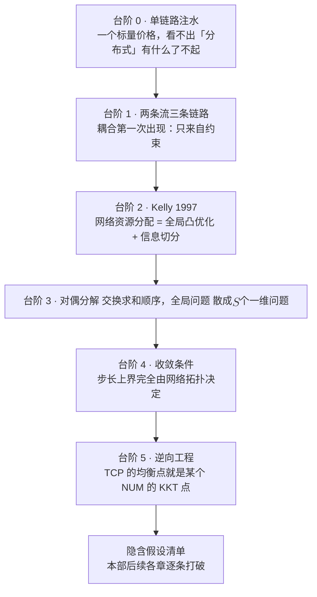
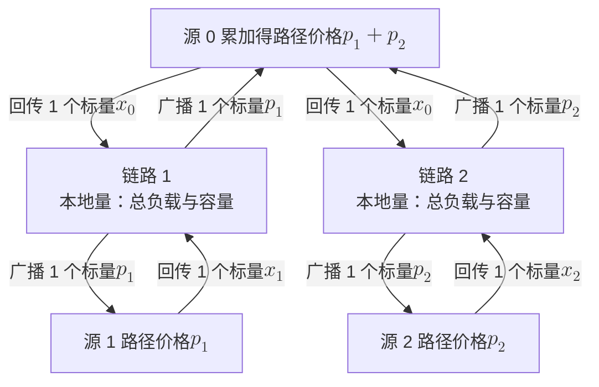
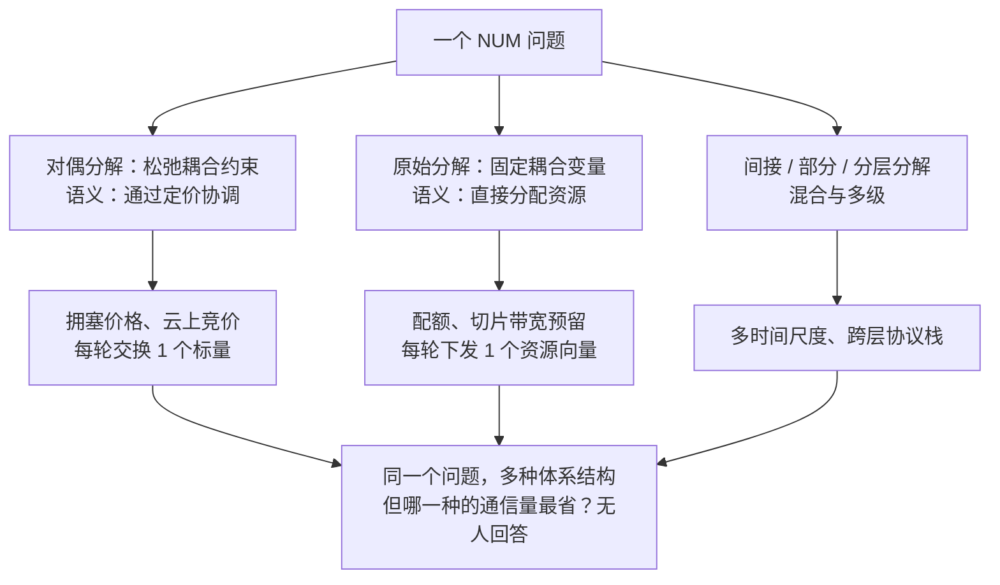

# 2 · 经典地基：从注水到 NUM——凸优化时代的完整胜利

1988 年，Van Jacobson 把拥塞避免装进 TCP，从此互联网没有再崩过。1997 年，Frank Kelly 在剑桥写下一个网络效用最大化问题，并证明它可以被拆成"用户各算各的 + 链路各报各的价"。1999 年，Steven Low 与 David Lapsley 把这套理论变成带显式步长条件的分布式算法。2002 年——距 Jacobson 十四年——Low、Paganini 与 Doyle 发现：**TCP 的均衡点，恰好就是某个 NUM 问题的 KKT 点**。没有人设计过这件事。协议先于理论存在了十四年，理论追上来，认出了它。

这一章要把这条从注水到 NUM 的路完整走一遍。它是本部唯一一章"故事有结局"的内容：目标凸、约束凸、信息免费、时间静止，于是上界与下界在同一点相碰，凸优化时代取得了**完整的胜利**。也正因为完整，它才配当整部书的参照系——[第 1 章](01-three-mountains.md)的三座大山，每一座都是这一章某一条不曾言明的前提被现实撤走的结果。



!!! note "本章预备知识"
    需要：凸优化的完整一课，即预备篇第 7 章前六节。用到的内容：

    - 凸集与凸函数：[预备篇 7.2](../part0/07-optimization-basics.md#72-凸集与凸函数为什么碗形如此重要)；拉格朗日对偶与弱、强对偶：[预备篇 7.3](../part0/07-optimization-basics.md#73-拉格朗日对偶把约束变成价格)；KKT 条件：[预备篇 7.4](../part0/07-optimization-basics.md#74-kkt-条件最优性的四条戒律)。
    - 注水定理：[预备篇 7.5](../part0/07-optimization-basics.md#75-注水定理无线最著名的闭式解)。本章 2.1 节在它的基础上给三步命名。
    - 单资源的对偶分解与价格迭代：[预备篇 7.6](../part0/07-optimization-basics.md#76-对偶分解与分布式实现价格如何自己找到)。本章把它推广到网络。
    - 三座大山与"上界侧、下界侧"的区分：[第 1 章](01-three-mountains.md)。

## 2.1 从单链路到多链路：KKT 三步，与耦合的唯一来源

### 注水：三步走，并且给这三步命名

并行高斯信道的功率分配是全书最干净的凸问题。$n$ 个子信道，噪声功率 $N_i$，总功率预算 $P$：

$$
\max_{P_i\ge 0}\ \sum_{i=1}^{n}\tfrac12\ln\Big(1+\frac{P_i}{N_i}\Big)\quad\text{s.t.}\quad \sum_{i=1}^{n}P_i\le P .
$$

这一节的目的不是重新推导注水解（[预备篇 7.5](../part0/07-optimization-basics.md) 已经做过，那里用信道增益 $g_i$ 与噪声功率 $\sigma^2$ 书写，对应这里的 $N_i=\sigma^2/g_i$；那里的目标没有系数 $\tfrac12$，所以水位是 $1/\lambda$，这里是 $\nu=1/(2\lambda)$），而是**给推导的三个步骤命名**，因为它们在网络上会原样重演。

**第一步：写拉格朗日——给耦合约束一个乘子。**

$$
\mathcal{L}(P,\lambda,\mu)=\sum_{i}\tfrac12\ln\Big(1+\frac{P_i}{N_i}\Big)-\lambda\Big(\sum_i P_i-P\Big)+\sum_i \mu_i P_i .
$$

注意此处**唯一**把 $n$ 个变量绑在一起的，就是总功率约束；目标函数里 $P_i$ 之间毫无关系。

**第二步：平稳性——所有被激活的分量边际收益相等。**

$$
\begin{aligned}
\frac{\partial}{\partial P_i}\ \tfrac12\ln\Big(1+\frac{P_i}{N_i}\Big) &= \frac{1}{2}\cdot\frac{1/N_i}{1+P_i/N_i}=\frac{1}{2(N_i+P_i)},\\
\frac{\partial \mathcal{L}}{\partial P_i}=0 \quad&\Longrightarrow\quad \frac{1}{2(N_i+P_i)}=\lambda-\mu_i .
\end{aligned}
$$

**第三步：互补松弛 + 可行性——定出水位。** 由 $\mu_iP_i=0$：

$$
\begin{aligned}
P_i>0 &\ \Longrightarrow\ \mu_i=0 \ \Longrightarrow\ N_i+P_i=\frac{1}{2\lambda}\triangleq \nu,\\
P_i=0 &\ \Longrightarrow\ \mu_i\ge 0 \ \Longrightarrow\ \frac{1}{2N_i}\le\lambda \ \Longrightarrow\ N_i\ge \nu,
\end{aligned}
$$

合起来即 $P_i^\star=(\nu-N_i)^+$，水位 $\nu$ 由预算方程 $\sum_i(\nu-N_i)^+=P$ 唯一确定。

!!! tip "直觉：$\lambda$ 不是数学配件，它是价格"
    $\lambda=1/(2\nu)$ 的量纲是"每单位功率换来多少 nat"。第二步说的是：**在最优点，所有被使用的子信道，每一瓦的边际收益必须相同**——否则把功率从边际收益低的挪到高的，总速率就会涨。这正是经济学里"边际效用均等"的原话。

    单链路注水其实已经是一个"单资源 NUM"，只不过价格是**一个标量**，所有子信道看到的是同一个数——所以完全看不出"分布式"这件事有什么了不起。台阶 1 就是要把这层遮蔽掀掉。

!!! example "算例（三子信道注水，含影子价格的数值校验）"
    取 $N=(1,2,6)$，$P=5$。先试三个都激活：$\nu=(P+\sum_iN_i)/3=(5+9)/3\approx 4.67<N_3=6$，与"激活即 $\nu>N_i$"矛盾，故子信道 3 关闭。再试两个激活：

    $$
    \nu=\frac{P+N_1+N_2}{2}=\frac{5+1+2}{2}=4 .
    $$

    校验：$\nu=4>N_1,N_2$，且 $\nu=4<N_3=6$，自洽。于是 $P^\star=(3,2,0)$，$\lambda=1/(2\nu)=1/8$。

    **影子价格的数值校验**：激活的子信道满足 $N_i+P_i^\star=\nu$，所以 $\tfrac12\ln(1+P_i^\star/N_i)=\tfrac12\ln(\nu/N_i)$，最优值 $V^\star(P)=\tfrac12\ln(\nu/N_1)+\tfrac12\ln(\nu/N_2)$。只要预算的小变动不改变激活的是哪两个子信道，水位就是 $\nu=(P+N_1+N_2)/2$，于是 $d\nu/dP=1/2$。先对 $\nu$ 求导、再乘 $d\nu/dP$（链式法则）：

    $$
    \frac{dV^\star}{dP}=\Big(\frac{1}{2\nu}+\frac{1}{2\nu}\Big)\cdot\frac{d\nu}{dP}=\frac{1}{\nu}\cdot\frac12=\frac18=\lambda .
    $$

    **乘子确实等于最优值对预算的导数**——多给 1 焦耳，总速率涨 $1/8$ nat。这个等式是本章后面所有"价格"解读的原型。

**行为分析**：把预算 $P$ 当旋钮。$P\to\infty$ 时所有子信道激活，$\nu\approx P/n$，$\lambda\approx n/(2P)\to 0$——功率不再稀缺，价格趋零。$P\to 0$ 时只剩最好的子信道，$\nu\to N_{\min}$，$\lambda\to 1/(2N_{\min})$——**价格有上限，且由最好信道的噪声决定**。稀缺性被完整地编码在一个标量里，这是全章反复出现的主题。

!!! note "出处说明"
    注水的思想源头可追至 Shannon 1949 关于有色高斯噪声信道最优功率谱的条件（$P(f)+N(f)$ 为常数），"water-filling"是后世回溯性命名；标准的定理表述见 Gallager 1968 与 Cover–Thomas 的"并行高斯信道"一节。三处均**不在本站已核对的文献范围内**，此处仅作历史归属，不给编号引用。【二手已核】

### 耦合第一次出现：罪魁是约束，不是目标

现在放到网络上。最小的非平凡例子是"一条长流 + 两条短流"：链路 $l_1,l_2$ 容量都是 $c$；源 $0$ 的路径经过两条链路，源 $1$ 只过 $l_1$，源 $2$ 只过 $l_2$。

$$
\max_{x\ge 0}\ \ U_0(x_0)+U_1(x_1)+U_2(x_2)\quad\text{s.t.}\quad x_0+x_1\le c,\ \ x_0+x_2\le c .
$$

两件事必须同时看清：

- **目标仍然可加可分**：$\sum_s U_s(x_s)$，源之间在目标函数里毫无关系；
- **约束把它们焊死**：$x_0$ 同时出现在两个不等式里，谁多拿一点，别人就少一点。

!!! success "关键结论（全章的技术支点）"
    **NUM 中的耦合只来自约束。** 正因为如此，拉格朗日松弛才能把它彻底拆开——把约束换成价格，耦合就消失了。这一句话是 §2.3 全部推导的合法性来源；反过来，一旦耦合进入**目标**（干扰、非可加的任务效用），对偶分解的整个机器就会失灵，这正是[第 3 章](03-nonconvex-era.md)与[第 7 章](07-price-of-layering.md)的入口。

在进入 Kelly 之前，先看一个反直觉的小结论，它决定了"公平性"这个词该怎么谈。

!!! abstract "命题（单瓶颈平分，Mo–Walrand 2000 [4]）"
    设 $N$ 条流共享**同一条**瓶颈链路（容量 $c$），且都采用**同一个**递增凹效用 $U$。则最优解恒为 $x_i=c/N$，**与 $U$ 的具体形状无关**。【已解决】

    三步证明：(i) $U$ 递增 $\Rightarrow$ 约束必紧，$\sum_i x_i=c$；(ii) Jensen 不等式给出 $\frac1N\sum_iU(x_i)\le U\big(\frac1N\sum_ix_i\big)=U(c/N)$；(iii) 等号在 $x_i\equiv c/N$ 取到，$U$ 严格凹时唯一。

**物理意义**：**效用函数的形状，只有在至少两个瓶颈时才开始起作用。** 一条链路上讲"该用什么公平准则"是空谈——所有准则给出同一个答案。上面那个"一长两短"的三流两瓶颈网络，是能让公平性显形的**最小**装置，§2.4 会在它上面把整个 $\alpha$-公平谱系算成一行闭式解。

## 2.2 Kelly 的观念转换：把网络写成一个凸优化

1997 年之前，速率控制是"工程启发式 + 排队论分析"的领地：设计一个窗口调整规则，然后用排队模型分析它的行为。Kelly 反过来：**先写下你想要的全局目标，再问什么样的本地规则能自发达到它** [1]。

这个观念的第一次落地，是把一个问题切成三个：

| 问题 | 形式 | 谁在解 | 需要知道什么 |
|---|---|---|---|
| $\mathrm{SYSTEM}$ | $\max\sum_r U_r(x_r)$ s.t. $Ax\le c,\ x\ge0$ | **没有人** | 全部效用函数 + 全部拓扑 |
| $\mathrm{USER}_r$ | $\max_{x_r\ge0}\ U_r(x_r)-\lambda_r x_r$ | 用户 $r$ | 自己的 $U_r$ + 一个标量价格 $\lambda_r$ |
| $\mathrm{NETWORK}$ | $\max\sum_r w_r\log x_r$ s.t. $Ax\le c,\ x\ge0$ | 网络 | 拓扑 + 每人一个标量 $w_r$ |

表中记号与后文的对应：用户 $r$ 就是 §2.3 的源 $s$，$A$ 就是 §2.3 的 0–1 路由矩阵 $R$；$\lambda_r$ 是用户 $r$ 面对的单位速率价格，在 NETWORK 的最优点它等于 $r$ 路径上各链路乘子之和，即 §2.3 的路径价格 $p^s$，而不是 §2.1 注水里那个单一的功率价格 $\lambda$。

SYSTEM 是**任何人都解不了**的问题——不是因为它难，而是因为 $U_r$ 是用户的私有信息，网络没有权限也没有理由知道它。Kelly 的定理说：存在价格 $\lambda_r$、速率 $x_r$、愿付价 $w_r$，满足 $w_r=\lambda_r x_r$，使得同一个 $x$ 既解 NETWORK 也解 SYSTEM [1]。【二手已核：本站未取到 Kelly 1997 原文 PDF，此处按 Low–Lapsley 1999 §III 的原文转述表述 [3]】

为什么这三条能对上？只需把三个一阶条件并排写：

$$
\begin{aligned}
\text{NETWORK 的 KKT：}&\quad \frac{w_r}{x_r}=\lambda_r,\\
\text{USER 的一阶条件：}&\quad U_r'(x_r)=\lambda_r,\\
\text{SYSTEM 的 KKT：}&\quad U_r'(x_r^\star)=\lambda_r^\star .
\end{aligned}
$$

第一式说"网络看见的是预算"，第二式说"用户看见的是价格"；两式在 $w_r=\lambda_r x_r$ 处相容，第三式便自动成立。理由如下：NETWORK 的 KKT 写全是平稳性 $w_r/x_r=\sum_{l\in r}\mu_l$（$\mu_l\ge0$ 是链路 $l$ 容量约束的乘子，$l\in r$ 表示链路 $l$ 在用户 $r$ 的路径上，这个和就是 $\lambda_r$），加上可行性 $Ax\le c$ 与互补松弛 $\mu_l\big(c_l-(Ax)_l\big)=0$。用户那边成立 $U_r'(x_r)=\lambda_r$，把它换进平稳性，得到 $U_r'(x_r)=\sum_{l\in r}\mu_l$；可行性与互补松弛原样不动。这正是 SYSTEM 的全部 KKT 条件。SYSTEM 是凸问题，KKT 是最优的充分条件（[预备篇 7.4](../part0/07-optimization-basics.md)），所以这个 $x$ 就是 SYSTEM 的最优解。

**物理意义**：$w_r=\lambda_r x_r$ 就是"钱 = 单价 × 数量"。用户申报一个预算 $w_r$，网络按对数效用把带宽分下去，用户再在自己真实的效用下检查这个预算是不是选对了。**信息被切成两半，谁也不需要看到全局。**

```mermaid
flowchart LR
    subgraph USER["用户侧（私有信息）"]
        U["用户 $$r$$<br/>持有效用函数<br/>$$U_r$$（一整个函数）<br/>解 $$\mathrm{USER}_r$$：取 $$x_r$$<br/>使 $$U_r'(x_r) = \lambda_r$$"]
    end
    subgraph NET["网络侧（私有信息）"]
        N["网络<br/>持有拓扑 $$A$$ 与容量 $$c$$<br/>解 NETWORK：<br/>按 $$\textstyle\sum w_r \log x_r$$ 分配"]
    end
    N -->|"价格 $$\lambda_r$$（1 个标量）"| U
    U -->|"预算 $$w_r = \lambda_r \cdot x_r$$，<br/>等价于申报速率 $$x_r$$<br/>（1 个标量）"| N
```

*怎么读这张图：两个框是信息边界。效用函数 $U_r$ 从不离开用户侧，拓扑 $A$ 与容量 $c$ 从不离开网络侧；跨过边界的只有两个标量，价格 $\lambda_r$ 往用户走，预算 $w_r$（价格给定时等价于速率 $x_r$）往网络走。两边各解各的问题，在 $w_r=\lambda_r x_r$ 处对上，就得到 SYSTEM 的解。内容整理自上表；Kelly 分解的这一读法也见 Low–Lapsley 1999 [3]。*

**行为分析**：$U_r$ 是一个**函数**，$w_r$ 是一个**标量**。Kelly 做的事，是证明"把一个函数压缩成一个标量"不损失最优性——网络资源分配史上第一次有人指出**需要交换的信息可以少到这个地步**。而"少到这个地步"是不是"最少"，1997 年没有人问，2026 年仍然没有人答。这条线索在 §2.6 被正式埋下，在[第 6 章](06-communication-lower-bounds.md)引爆。

## 2.3 对偶分解：换一种数法，全局问题就散了

现在把 §2.1 的三步在网络上重演一遍。单资源版本的对偶分解与价格迭代（一个中心广播一个价格、各节点各算各的功率）在[预备篇 7.6](../part0/07-optimization-basics.md) 已经走过；下面是它的多链路版本，区别在于每条链路各有一个价格。记源集合 $s=1,\dots,S$，链路集合 $l=1,\dots,L$；$L(s)$ 是源 $s$ 路径上的链路集合，$S(l)$ 是经过链路 $l$ 的源集合；路由矩阵 $R\in\{0,1\}^{L\times S}$，$R_{ls}=1\iff l\in L(s)$。速率取值区间 $I_s=[m_s,M_s]$。原问题

$$
\mathbf{P}:\quad \max_{x_s\in I_s}\ \sum_{s}U_s(x_s)\quad\text{s.t.}\quad \sum_{s\in S(l)}x_s\le c_l,\ \ l=1,\dots,L .
$$

### Step 1 · 交换求和顺序——分解就发生在这一行

$$
\begin{aligned}
\mathcal{L}(x,p)&=\sum_s U_s(x_s)-\sum_l p_l\Big(\sum_{s\in S(l)}x_s-c_l\Big)\\
&=\sum_s U_s(x_s)-\sum_l\sum_{s\in S(l)}p_l x_s+\sum_l p_l c_l\\
&=\sum_s U_s(x_s)-\sum_s\sum_{l\in L(s)}p_l x_s+\sum_l p_l c_l\\
&=\sum_s\Big[U_s(x_s)-x_s\sum_{l\in L(s)}p_l\Big]+\sum_l p_l c_l .
\end{aligned}
$$

第二行到第三行是全章的题眼。$\sum_l\sum_{s\in S(l)}$ 与 $\sum_s\sum_{l\in L(s)}$ 是**同一个二重和的两种数法**——都是在数路由矩阵 $R$ 里所有等于 1 的元素，前者按行数，后者按列数。用 §2.1 那个"一长两短"的网络把两种数法摊开：

$$
R=\begin{pmatrix}1&1&0\\ 1&0&1\end{pmatrix},\qquad
\sum_{l}\sum_{s\in S(l)}p_lx_s=\sum_{s}\sum_{l\in L(s)}p_lx_s .
$$

| 数法 | 展开式 | 这种写法让谁看得见什么 |
|---|---|---|
| 按行数（先链路、后源）$\sum_l\sum_{s\in S(l)}$ | $p_1(x_0+x_1)+p_2(x_0+x_2)$ | **链路**看得见自己的总负载与容量 |
| 按列数（先源、后链路）$\sum_s\sum_{l\in L(s)}$ | $x_0(p_1+p_2)+x_1p_1+x_2p_2$ | **源**看得见自己的路径价格 |

!!! success "关键结论（本章题眼）"
    **换一种数法，全局耦合的问题就散成了 $S$ 个独立的一维问题。** 技术上的枢纽是：约束矩阵是 0–1 路由矩阵，所以 $x_s$ 在拉格朗日里的系数恰好是 $(R^{\mathsf T}p)_s=\sum_{l\in L(s)}p_l$——**价格沿路径可加**。

    NUM 全部的分布式性都从"可加性"这三个字来。而可加性同时也是一次**极其粗暴的信息压缩**：一条路径上所有链路的拥塞状况，被求和成一个标量。它是不是压得太狠了？还是其实压得不够狠？——[第 6 章](06-communication-lower-bounds.md)的全部内容。

### Step 2 · 每源独立决策：需求函数

固定 $p$，第 $s$ 个方括号是一个一维凹问题：

$$
\max_{x_s\in I_s}\ U_s(x_s)-x_s p^s,\qquad p^s\triangleq\sum_{l\in L(s)}p_l=(R^{\mathsf T}p)_s .
$$

一阶条件 $U_s'(x_s)=p^s$；$U_s$ 严格凹 $\Rightarrow$ $U_s'$ 严格递减 $\Rightarrow$ 可逆。加上区间投影：

$$
x_s(p^s)=\Big[(U_s')^{-1}(p^s)\Big]_{m_s}^{M_s} .
$$

**物理意义**：这就是微观经济学里的**需求函数**——Low 与 Lapsley 在原文里用的正是这个词 [3]。源不需要知道网络长什么样、有多少条流、别人在做什么；它只需要一个标量价格，然后沿着自己的需求曲线走。

**行为分析**：需求对价格的灵敏度是 $dx_s/dp^s=1/U_s''(x_s)<0$，幅度为 $1/|U_s''|$。效用越接近线性（曲率越小），需求越敏感——这个量在下面的收敛条件里会作为 $\bar{\alpha}_s$ 出现。取对数效用 $U_s(x)=w_s\log x$：

$$
U_s'(x)=\frac{w_s}{x}\ \Longrightarrow\ x_s(p^s)=\frac{w_s}{p^s}\ \Longrightarrow\ p^s x_s(p^s)=w_s .
$$

**支出恒定**——价格翻倍，速率减半，花的钱一分不变。这正好回到 Kelly 的 $w_r=\lambda_r x_r$：对数效用是**等弹性需求**，$w_r$ 就是用户的固定预算。§2.2 与 §2.3 在这里闭环。

### Step 3 · 对偶函数的梯度 = 供需失衡

$$
D(p)=\max_{x\in I}\mathcal{L}(x,p)=\sum_s B_s(p^s)+\sum_l p_l c_l,\qquad B_s(p^s)=\max_{x_s\in I_s}\{U_s(x_s)-x_sp^s\} .
$$

$B_s$ 是 $U_s$ 的（凹）共轭，读作"价格为 $p^s$ 时源 $s$ 能拿到的最大净收益（效用减支出）"。它对价格的导数由**包络定理**给出：内层变量取最优之后再对参数求导，内层最优解随参数的变动不产生一阶影响。具体地，$B_s(p^s)=U_s(x_s(p^s))-x_s(p^s)\,p^s$，链式法则给出 $B_s'=\big[U_s'(x_s)-p^s\big]\,x_s'(p^s)-x_s(p^s)$；内点处一阶条件使方括号为零，端点处 $x_s$ 被钉在 $m_s$ 或 $M_s$、$x_s'=0$，两种情况都剩下 $B_s'(p^s)=-x_s(p^s)$。再由链式法则与 $\partial p^s/\partial p_l=R_{ls}$：

$$
\frac{\partial D}{\partial p_l}(p)=c_l+\sum_{s\in S(l)}B_s'(p^s)=c_l-\sum_{s\in S(l)}x_s(p^s)=c_l-x^l(p) .
$$

**物理意义**：对偶函数的梯度，就是链路 $l$ 的**剩余容量**。梯度为零 $\iff$ 供需恰好平衡。整个对偶算法要做的事，从数学上看是"把梯度驱到零"，从经济上看是"把市场出清"——**这是同一句话的两种说法**。

### Step 4 · 梯度投影 = 供求律

$$
p_l(t+1)=\Big[p_l(t)+\gamma\big(x^l(t)-c_l\big)\Big]^+ .
$$

为什么是加号：对偶问题是在 $p\ge0$ 上**最小化** $D(p)$，因为对任意 $p\ge0$，$D(p)$ 都是原问题最优值的上界（[预备篇 7.3](../part0/07-optimization-basics.md) 的弱对偶，这里原问题求最大，方向反过来）。沿负梯度走一步是 $p_l-\gamma\,\partial D/\partial p_l=p_l+\gamma(x^l-c_l)$；$[\cdot]^+=\max\{\cdot,0\}$ 把结果投影回 $p_l\ge0$。它与[预备篇 7.6](../part0/07-optimization-basics.md) 的价格迭代是同一条式子，只是每条链路各调各的价。

Low 与 Lapsley 对这条更新的评述大意是：这**正是**供求律——需求超过容量就涨价，否则降价；并且它**只用链路本地信息** [3]。链路不需要知道有几条流、它们从哪来到哪去，只需要能测出流过自己的总量。



这张图是[第 6 章](06-communication-lower-bounds.md)的视觉锚：**每条边每轮只走一个标量。** 请记住这个数字。

### 收敛条件：一个完全由拓扑决定的稳定性判据

!!! abstract "定理 1（NUM 对偶算法的收敛，Low & Lapsley 1999 [3]）"
    **假设 C1**：$U_s$ 在 $I_s=[m_s,M_s]$ 上递增、严格凹、二阶连续可微；可行性 $\sum_{s\in S(l)}m_s\le c_l$ 对所有 $l$ 成立。

    **假设 C2**：曲率有界离零，$-U_s''(x_s)\ge 1/\bar{\alpha}_s>0$ 对所有 $x_s\in I_s$。

    记 $\bar{L}$ 为最长路径的链路数、$\bar{S}$ 为最拥挤链路上的源数、$\bar{\alpha}\triangleq\max_s\bar{\alpha}_s$。若步长满足

    $$
    0<\gamma<\frac{2}{\bar{\alpha}\,\bar{L}\,\bar{S}},
    $$

    则从任意初值 $m\le x(0)\le M$、$p(0)\ge 0$ 出发，算法生成的序列 $(x(t),p(t))$ 的**每一个聚点**都是原–对偶最优的。【已解决】

    **定理 2（同一篇）**：该算法属于部分异步算法类；只要更新间隔有界，即使反馈时延不同、时变、消息乱序，仍收敛到最优速率。【已解决】

**三个量为什么是相乘？** 这条判据看着像经验公式，其实三步就能推出来，而且拼图前面都已备好：

**第一步（对偶函数的曲率）。** 对偶函数的梯度是"容量减去当前需求"，$\nabla D(p) = c - R\,x(R^{\mathsf T}p)$（$R$ 为 0–1 路由矩阵，$R_{ls}=1$ 表示源 $s$ 经过链路 $l$）。再求一次导，并用需求对价格的敏感度 $dx_s/dp^s = 1/U_s''$ 与 $\partial p^s/\partial p_k=R_{ks}$：$\dfrac{\partial^2 D}{\partial p_l\,\partial p_k}=-\sum_s R_{ls}\,\dfrac{dx_s}{dp^s}\,R_{ks}=\sum_s R_{ls}\Big(\dfrac{-1}{U_s''(x_s)}\Big)R_{ks}$（若 $x_s$ 被截在区间端点，$dx_s/dp^s=0$，对应对角元取 0，下面的上界照样成立）。写成矩阵就是

$$
\nabla^2 D(p) \;=\; R\,B(p)\,R^{\mathsf T},\qquad B(p)=\mathrm{diag}\!\left(\frac{-1}{U_s''(x_s)}\right)\succeq 0 .
$$

由假设 C2，$B$ 的每个对角元 $\le \bar{\alpha}_s \le \bar{\alpha}$——**这是三个因子里的第一个**。

**第二步（路由矩阵的范数）。** $R$ 是 0–1 矩阵：它的**行和**最大值 = 最拥挤链路上的源数 $\bar{S}$，**列和**最大值 = 最长路径的链路数 $\bar{L}$。记 $\|R\|_\infty$ 为最大行和、$\|R\|_1$ 为最大列和，$\|R\|_2$ 为谱范数（$R$ 能把向量长度放大的最大倍数，等于 $R^{\mathsf T}R$ 最大特征值的平方根）。标准不等式 $\|R\|_2^2 \le \|R\|_1\,\|R\|_\infty$ 两步可得：(i) 任何矩阵 $M$ 的特征值的绝对值都不超过它的最大绝对行和，因为由 $Mv=\lambda v$ 取 $|v_i|$ 最大的分量，有 $|\lambda|\,|v_i|\le\sum_j|M_{ij}|\,|v_i|$；(ii) 对 $M=R^{\mathsf T}R$，最大行和不超过 $\|R^{\mathsf T}\|_\infty\|R\|_\infty=\|R\|_1\|R\|_\infty$。于是得

$$
\|R\|_2^2 \;\le\; \bar{L}\,\bar{S} .
$$

**这就是另外两个因子，而且解释了它们为什么以乘积出现**——一个来自"沿路径累加"（列），一个来自"多源共享"（行），两者作用在矩阵的两个不同方向上。以 §2.1 的一长两短网络验算：$\bar{L}=\bar{S}=2$，而 $RR^{\mathsf T}=\begin{pmatrix}2&1\\ 1&2\end{pmatrix}$ 的最大特征值是 $3$（$RR^{\mathsf T}$ 与 $R^{\mathsf T}R$ 的非零特征值相同），即 $\|R\|_2^2=3\le 4$。

**第三步（代回标准条件）。** 梯度的 **Lipschitz 常数** $L_{\mathrm{Lip}}$ 度量梯度随 $p$ 变化最快有多快：$\|\nabla D(p)-\nabla D(p')\|\le L_{\mathrm{Lip}}\|p-p'\|$，对二阶可微的函数可取 Hessian 谱范数的上界。由前两步，$\|\nabla^2 D\|=\|RBR^{\mathsf T}\|\le\|R\|_2\,\|B\|\,\|R^{\mathsf T}\|_2\le\bar{\alpha}\bar{L}\bar{S}$，即 $L_{\mathrm{Lip}} \le \bar{\alpha}\bar{L}\bar{S}$。梯度投影法的经典收敛条件是 $0<\gamma<2/L_{\mathrm{Lip}}$：不计投影时，沿负梯度走一步，目标至少下降 $\gamma(1-\gamma L_{\mathrm{Lip}}/2)\|\nabla D\|^2$，括号为正当且仅当 $\gamma<2/L_{\mathrm{Lip}}$；步长再大就可能越过谷底、来回振荡。代入即得定理。[预备篇 7.6](../part0/07-optimization-basics.md) 的价格迭代按次梯度处理，固定步长只能在最优价附近振荡，要保证收敛须用递减步长；这里假设 C1–C2 保证 $D$ 可微且梯度 Lipschitz，所以固定步长只要不超过上界就够了。

**物理意义**：推完之后，这条不等式可以逐字读成三句工程语言。

- $\bar{L}$ 大（路径长）$\Longrightarrow$ 一次价格扰动会沿路被**累加放大** $\Longrightarrow$ 步长要小；
- $\bar{S}$ 大（链路拥挤）$\Longrightarrow$ 一次涨价会被**多源同时响应** $\Longrightarrow$ 步长要小；
- $\bar{\alpha}$ 大（曲率小、效用接近线性）$\Longrightarrow$ 需求对价格**越敏感**、越容易超调 $\Longrightarrow$ 步长要小。

**这是一个完全由网络拓扑与效用曲率决定的稳定性条件，没有任何"调参玄学"。** 这是凸优化时代最有说服力的一张名片。

**行为分析（数量级代入）**：数据中心 fabric 取 $\bar{L}=5$、$\bar{S}=200$、$\bar{\alpha}=20$，得 $\gamma<2/(20\cdot5\cdot200)=10^{-4}$；广域网取 $\bar{L}=20$、$\bar{S}=2000$、同样 $\bar{\alpha}$，得 $\gamma<2.5\times10^{-6}$——**规模每涨一档，容许步长小四十倍，收敛所需轮数相应变长**。分布式的代价在这里第一次以可计算的形式露面：它不是"多花点时间"，而是一个随 $\bar{L}\bar{S}$ 反比缩小的显式因子。

还有一个细节值得点破：$\bar{\alpha}$ **不是无量纲的**。对 $U=w\log x$，$-U''=w/x^2\ge w/M_s^2$，故 $\bar{\alpha}_s=M_s^2/w_s$。把速率单位从 Gbps 换成 Mbps，$M_s$ 变一千倍，$\bar{\alpha}$ 变百万倍，$\gamma$ 的上界随之缩小百万倍——但价格的量纲同步变化，迭代的实际轨迹完全不变。**这条判据约束的是 $\gamma\bar{\alpha}\bar{L}\bar{S}$ 这个组合，而不是 $\gamma$ 本身。**

!!! warning "三个必须避开的误读"
    1. **步长条件是三个量相乘**：$\gamma<2/(\bar{\alpha}\bar{L}\bar{S})$。网上流传的二手摘要有写成 $2/(\bar{L}+\bar{S})$ 的，**是错的**。
    2. **曲率条件别写反**：$-U_s''\ge 1/\bar{\alpha}_s$，$\bar{\alpha}$ 是曲率倒数的**上界**。$\bar{\alpha}$ 大 = 更接近线性 = 需求更敏感 = 步长要更小。
    3. **对偶最优价格未必唯一**。最优时被约束住的只是路径价格之和 $\sum_{l\in L(s)}p_l^\star=U_s'(x_s^\star)$；$x^\star$ 唯一，但 $p^\star$ 可以不唯一，所以定理只保证**聚点**最优，不保证价格收敛到某个唯一点。局部收敛速率由半正定矩阵 $R\,B(p^\star)\,R^{\mathsf T}$ 的谱决定，其中 $B(p)$ 是各源需求灵敏度构成的对角阵 [3]。

    另需注明：Karbowski 2003 [20] 在同一期刊发表评论，指出原文定理 2（异步、带时延的版本）证明中引理 6 的估计式 (29) 最后一步不成立（给出了反例），并给出修正的推导；他 2002 年的预印本还指出定理 1 证明中引理 3 误用了多元中值定理，这一条没有进入正式发表的评论。本节用到的同步版步长条件出自定理 1。

### 两代工作的接榫：Kelly 的两类算法在哪里

Kelly、Maulloo 与 Tan 1998 给出的其实是**两类**算法，对应问题的原始与对偶形式 [2]：

$$
\begin{aligned}
\text{原始（primal）：}&\quad \frac{d}{dt}x_s(t)=\gamma\Big(w_s-x_s(t)\sum_{l\in L(s)}p_l(t)\Big),\qquad p_l(t)=f_l\Big(\sum_{s\in S(l)}x_s(t)\Big),\\
\text{对偶（dual）：}&\quad \frac{d}{dt}p_l(t)=\gamma\Big(\sum_{s\in S(l)}x_s(t)-q_l(p_l(t))\Big),\qquad x_s(t)=\frac{w_s}{\sum_{l\in L(s)}p_l(t)} .
\end{aligned}
$$

式中 $f_l(\cdot)$ 是链路 $l$ 的价格函数：总负载越大，报出的价格越高，用"随负载上涨的价格"代替硬性的容量上限；$q_l(\cdot)$ 是递增函数，起供给曲线的作用：总流量高于 $q_l(p_l)$ 时价格上涨，低于它时价格下降。

原始算法那条方程本身就是 **AIMD 的自然推广**：$w_s$ 是加性增项，$-x_s\sum_l p_l$ 是乘性减项——这是 KMT 论文摘要里明确的卖点 [2]。AIMD（additive increase, multiplicative decrease，加性增、乘性减）是 TCP 的窗口规则：没有拥塞信号时每个 RTT 把窗口加一个固定量，检测到丢包时把窗口乘一个小于 1 的因子（TCP 中是减半）。稳定性的证明思路是构造网络的"隐含目标函数"作为 Lyapunov 函数（沿系统轨迹严格上升（到达平衡点才停止）、在平衡点取到最大值的标量函数；找到这样一个函数，就证明了轨迹会被推向平衡点），其形式为

$$
U(x)=\sum_s w_s\log x_s-\sum_l\int_0^{y_l(x)}f_l(y)\,dy,\qquad y_l(x)=\sum_{s\in S(l)}x_s .
$$

【二手已核：Lyapunov 函数的存在与"隐含目标函数即 Lyapunov 函数"来自 KMT 摘要；上式的写法与 Low–Paganini–Doyle 的惩罚形式一致 [5]，本站未直接核对 KMT 原文页码。】

Low–Lapsley 的算法是**对偶这一支的离散时间梯度投影版**，并首次给出显式步长条件与异步版本；当 $U_s=w_s\log x_s$ 时它退化为 Kelly 的对偶算法 [3]。**不要把两者混为一谈**：Kelly 给的是连续时间的两族设计，Low–Lapsley 给的是可实现、可分析的离散协议。

## 2.4 为什么必然是对数：比例公平的两条论证路线

$\log$ 在 NUM 里出现得如此自然，以至于很容易被当成"随便选了一个凹函数"。它不是。**对数是被"公平"这个要求反解出来的**，而且有两条互相独立的论证路线。

### 路线一：一阶最优性条件

!!! abstract "定义与定理（比例公平 $\iff$ 对数效用最大化 [4]）"
    可行向量 $x^\star$ 称为**比例公平的**，若对任意其它可行 $x$：

    $$
    \sum_i\frac{x_i-x_i^\star}{x_i^\star}\le 0 .
    $$

    **定理**：$x^\star$ 比例公平 $\iff$ $x^\star$ 在同一可行域上最大化 $\sum_i\log x_i$。【已解决】

三步就能看穿它。令 $F(x)=\sum_i\log x_i$，则 $\nabla F(x^\star)=(1/x_1^\star,\dots,1/x_N^\star)$，于是

$$
\begin{aligned}
\sum_i\frac{x_i-x_i^\star}{x_i^\star}&=\sum_i\frac{1}{x_i^\star}(x_i-x_i^\star)\\
&=\nabla F(x^\star)^{\mathsf T}(x-x^\star)\\
&\le 0\quad\forall\,x\in\mathcal{X}\ \iff\ x^\star\in\arg\max_{x\in\mathcal{X}}F(x).
\end{aligned}
$$

最后一步就是**凹函数在凸集上的一阶最优性条件**，没有任何多余内容。$\nabla F(x^\star)^{\mathsf T}(x-x^\star)$ 是从 $x^\star$ 朝可行点 $x$ 出发时目标的变化率。若 $x^\star$ 是最大点，沿线段 $x^\star+\theta(x-x^\star)$（凸集保证它可行）走一小步目标不能上升，所以变化率 $\le0$；反过来，凹函数的图像在切平面下方（[预备篇 7.2](../part0/07-optimization-basics.md) 一阶条件的凹函数版），$F(x)\le F(x^\star)+\nabla F(x^\star)^{\mathsf T}(x-x^\star)\le F(x^\star)$，所以 $x^\star$ 是最大点。

**物理意义**：比例公平的定义说的是"任何偏离最优点的可行调整，其**相对**变化量之和不为正"——一个人的速率涨 10%，必须以别人合计跌 10% 以上为代价。**对数不是被选出来的，是被"按比例记账"这个要求反解出来的。** 这才是"公理化来源"的正确讲法。

!!! warning "陷阱：不等式不取严格"
    Mo–Walrand 原文有一条脚注专门讨论为什么这个不等式不能写成严格不等式 [4]。写成 $<0$ 会把 $x=x^\star$ 本身排除在外，定义随即失效。

### 路线二：Nash 讨价还价的尺度不变性

第二条路线与第一条完全独立。Nash 1950 的讨价还价理论给出四条公理——Pareto 最优（不存在另一个方案能让某人更好而不让任何人更差）、对称性、**尺度不变性**、无关方案独立性（去掉一些没被选中的方案，选中的方案不变）——并证明满足这四条的解唯一：最大化各方相对**分歧点**（谈判破裂时各方拿到的收益 $d_r$）的收益增量之积 $\prod_r(x_r-d_r)$。取分歧点为 $0$ 时即 $\max\prod_r x_r=\max\sum_r\log x_r$（取对数不改变最大点）。（Nash 1950 不在本站已核对的文献范围内，此处仅作概念引用；Kelly 1997 指出了这一联系，但**严格的公理化不是 Kelly 证的** [1]。）【已解决】

关键在**尺度不变性**：把源 $r$ 的速率单位从 bps 换成 Mbps，即 $x_r\mapsto \kappa_r x_r$，分配方案不该改变。检验两族效用：

$$
\begin{aligned}
\alpha=1:&\quad \sum_r\log(\kappa_r x_r)=\sum_r\log x_r+\underbrace{\sum_r\log\kappa_r}_{\text{与 }x\text{ 无关的常数}},\quad \arg\max\ \text{不变};\\
\alpha\neq1:&\quad \sum_r\frac{(\kappa_r x_r)^{1-\alpha}}{1-\alpha}=\sum_r\kappa_r^{1-\alpha}\cdot\frac{x_r^{1-\alpha}}{1-\alpha},\quad \text{各坐标被不同权重重加权，}\arg\max\ \text{改变}.
\end{aligned}
$$

**只有对数能把"换单位"化成一个加性常数。** 两条路线在此汇合，"公理化来源"这四个字才站得住。

### $\alpha$-公平：从两种直觉到一条连续谱

!!! abstract "定义与引理（$(w,\alpha)$-比例公平，Mo & Walrand 2000 [4]）"
    设权重 $w_i>0$、参数 $\alpha>0$（原文用 $p$ 记权重，为避免与价格冲突，本站改记为 $w$）。可行向量 $x^\star$ 称为 $(w,\alpha)$-**比例公平**，若对任意其它可行 $x$：

    $$
    \sum_i w_i\,\frac{x_i-x_i^\star}{(x_i^\star)^{\alpha}}\le 0 .
    $$

    令

    $$
    f_\alpha(x)=\begin{cases}\log x, & \alpha=1,\\[4pt] (1-\alpha)^{-1}x^{1-\alpha}, & \text{其他},\end{cases}
    $$

    则 $x^\star$ 解 $\max\sum_i w_i f_\alpha(x_i)$ **当且仅当** $x^\star$ 是 $(w,\alpha)$-比例公平的（引理 2）；且 $(w,\alpha)$-比例公平向量在 $\alpha\to\infty$ 时趋于 max-min 公平向量（推论 2）。【已解决】

整个家族有一个统一的导数：$f_\alpha'(x)=x^{-\alpha}$，包括 $\alpha=1$ 的对数在内。$\alpha$ 就是**需求的价格弹性倒数**：由 $f_\alpha'(x)=p$ 得需求 $x=p^{-1/\alpha}$，于是 $d\ln x/d\ln p=-1/\alpha$，价格涨 1%，需求约降 $1/\alpha$%。它也就是"公平性旋钮"。表中两个准则先说清楚：**max-min 公平**指任何一条流的速率都无法再提高，除非降低另一条速率不高于它的流，直观上是"先把最穷的抬到尽可能高"；**最小潜在时延**指最小化 $\sum_i 1/x_i$，即每条流各传一个单位大小的文件所需时间之和，它等价于最大化 $\sum_i(-1/x_i)$，也就是 $\alpha=2$。

| $\alpha$ | 效用 $f_\alpha$ | 公平准则 | 对应协议 / 场景 |
|---|---|---|---|
| $0$ | $x$ | 最大总吞吐 | 纯效率，无公平约束 |
| $1$ | $\log x$ | 比例公平 | TCP Vegas（加权，见 §2.5） |
| $2$ | $-1/x$ | 最小潜在时延 | TCP Reno（小丢包近似，见 §2.5） |
| $\to\infty$ | — | max-min 公平 | 传统"绝对公平"直觉；联邦学习的同步轮（见 §2.7） |

!!! example "算例（一长 $n$ 短网络：$\alpha$-公平的闭式解）"
    把 §2.1 的网络推广：长流 $x_0$ 穿越 $n$ 条瓶颈链路，每条链路容量 $c=1$ 且各另有一条单瓶颈短流。由对称性各短流速率相同、约束全紧，问题化为一维：

    $$
    \max_{x_0\in[0,1]}\ f_\alpha(x_0)+n\,f_\alpha(1-x_0).
    $$

    三步解出：

    $$
    \begin{aligned}
    f_\alpha'(x_0)-n f_\alpha'(1-x_0)&=0 \ \Longrightarrow\ x_0^{-\alpha}=n(1-x_0)^{-\alpha},\\
    \Big(\frac{1-x_0}{x_0}\Big)^{\alpha}&=n \ \Longrightarrow\ \frac{1-x_0}{x_0}=n^{1/\alpha},\\
    x_0^\star&=\frac{1}{1+n^{1/\alpha}} .
    \end{aligned}
    $$

    取 $n=2$ 的数值表（$c=1$）：

    | $\alpha$ | $x_0^\star$ | 短流速率 | 总吞吐 |
    |---|---|---|---|
    | $\to 0$ | $0$ | $1$ | $2.000$ |
    | $1$ | $1/3\approx0.333$ | $0.667$ | $1.667$ |
    | $2$ | $\sqrt2-1\approx0.414$ | $0.586$ | $1.586$ |
    | $\to\infty$ | $0.5$ | $0.5$ | $1.500$ |

**物理意义**：$x_0^\star=1/(1+n^{1/\alpha})$ 把"长路径吃亏"量化成了一个公式。$\alpha=1$ 时 $x_0^\star=1/(1+n)$——长流速率随瓶颈数**倒数衰减**；$\alpha=2$ 时 $x_0^\star=1/(1+\sqrt n)$——衰减慢一些；$\alpha\to\infty$ 时恒为 $1/2$——max-min 完全不惩罚长路径。

**行为分析**：取 $n=10$。比例公平给长流 $1/11\approx0.091$，Reno 型（$\alpha=2$）给 $1/(1+\sqrt{10})\approx0.240$，max-min 给 $0.5$——**三个数字差了五倍多**。在没有指定 $\alpha$ 之前，"公平"这个词是空的。同时看总吞吐一列：从 $\alpha\to0$ 的 $2.000$ 单调降到 max-min 的 $1.500$，**公平的代价在这个网络上恰好是 25% 的吞吐**。这是一条能精确画出来的效率–公平前沿，也是本章"经济学解释"论点的第一块砖。

{ .chart loading=lazy }
{ .chart loading=lazy }

*怎么读这张图：横轴按对数等距排开，$\alpha=1$ 是比例公平，$\alpha=2$ 是 Reno 型，右端逼近 max-min。第一条是 $n=2$ 时的总吞吐 $2-x_0^\star$，从左端约 1.94 降向 max-min 的 1.5，那 25% 就是公平的代价；第二、三条分别是 $n=2$ 与 $n=10$ 时长流的速率 $x_0^\star=1/(1+n^{1/\alpha})$。瓶颈越多，长流越要靠大 $\alpha$ 才能翻身：$n=10$、$\alpha=1/2$ 时长流只分到 0.01。曲线按上面的闭式逐点计算。*

## 2.5 逆向工程：TCP 一直在解优化而不自知

现在是本章戏剧性最强的一节。请把两个日期并排放着：**1988**（Jacobson 把拥塞避免装进 TCP）与 **2002**（Low、Paganini 与 Doyle 发表 TCP/AQM 的对偶模型 [5]）。中间隔了十四年。**协议先于理论，理论追认协议。**

推导模式与 §2.3 正好相反：不是"设计优化算法 → 实现成协议"，而是"协议先存在 → 写下它的平衡关系 → 令 $U'(x^\star)=q^\star$ **反解** $U$"。合法性来自 KKT——最优点处边际效用等于路径价格。

### TCP Reno：从 AIMD 反解出 $\alpha=2$

拥塞避免阶段的平均化流体模型如下，它来自 AIMD 的两条规则。设窗口为 $W_i$，RTT 为 $\tau_i$，速率 $x_i=W_i/\tau_i$，丢包概率为 $q_i$（与 §2.3 的供给函数 $q_l(\cdot)$ 无关；下面 Vegas 里的 $q_i$ 又是排队时延）：每秒约有 $x_i(1-q_i)$ 个确认到达，每个让窗口加 $1/W_i$（合起来每个 RTT 加 1 个分组）；约有 $x_iq_i$ 个丢包，每个让窗口减半即减 $W_i/2$。于是 $\dot{W}_i=x_i(1-q_i)/W_i-x_iq_iW_i/2=(1-q_i)/\tau_i-q_ix_i^2\tau_i/2$，把 $\tau_i$ 视为常数、两边除以 $\tau_i$ 得

$$
\dot{x}_i=\frac{1-q_i(t)}{\tau_i^2}-\frac12 q_i(t)x_i^2(t),
$$

其中 $\tau_i$ 是 RTT，$q_i$ 是端到端丢包概率。令 $\dot{x}_i=0$：

$$
\begin{aligned}
\frac{1-q_i}{\tau_i^2}&=\frac12 q_i (x_i^\star)^2\\
2(1-q_i)&=q_i\,\tau_i^2 (x_i^\star)^2\\
2&=q_i\big(2+\tau_i^2(x_i^\star)^2\big)\\
q_i^\star&=\frac{2}{2+\tau_i^2(x_i^\star)^2} .
\end{aligned}
$$

令 $U_i'(x)=2/(2+\tau_i^2x^2)$ 并积分（换元 $u=\tau_i x/\sqrt2$）：

$$
U_i(x)=\int\frac{dx}{1+(\tau_i x/\sqrt2)^2}=\frac{\sqrt2}{\tau_i}\arctan\Big(\frac{\tau_i x}{\sqrt2}\Big).
$$

小丢包近似下 $\tau_i^2x_i^2\gg 2$，得 $q_i\approx 2/(\tau_i^2x_i^2)$ 即 $x_i\approx \sqrt2/(\tau_i\sqrt{q_i})$，对应

$$
U_i(x_i)=-\frac{2}{\tau_i^2 x_i}\quad\Longrightarrow\quad \alpha=2\ \text{（最小潜在时延公平）}.
$$

### TCP Vegas：价格就是排队时延

$$
U_i(x_i)=\alpha_i d_i\log x_i\quad\text{（加权比例公平）},
$$

其中 $\alpha_i$ 是 Vegas 协议参数、$d_i$ 是往返传播时延 [5][6]。这里的价格变量**就是排队时延**：$\dot{p}_l=\frac{1}{c_l}(y_l(t)-c_l)$，目标速率 $\bar{x}_i(t)=(U_i')^{-1}(q_i(t))=\alpha_id_i/q_i(t)$。均衡时源 $i$ 在其路径的路由器里恰好缓存 $\alpha_id_i$ 个分组——一个可以直接测量的物理量：由目标速率式 $x_iq_i=\alpha_id_i$，而速率乘排队时延就是排在队列里的分组数。注意这里的 $\alpha_i$ 只是 Vegas 的协议参数（充当权重），与 §2.4 的公平参数 $\alpha$ 无关；按 §2.4 的分类，Vegas 属于 $\alpha=1$（对数效用）。

!!! warning "陷阱：这是近似模型，不是精确等价"
    Reno 的 arctan 效用建立在三重简化上：把 AIMD 的窗口跳变**平均化**成流体、**忽略反馈时延**、**假定丢包概率小**。原文自己就强调"不试图刻画窗口的跳变，只跟踪其平均演化" [5]。把它当成"Reno 精确地在最大化 arctan"是过度解读。

!!! note "一个比任何单个协议都重要的一般性陈述"
    均衡价格是拉格朗日乘子这件事，**不是某个算法的特权**。任何能把队列（或排队时延）稳住、使流量率匹配容量的机制——RED、Vegas 及其它 AQM——都允许同样的解释，因为"速率匹配容量"恰好把对偶梯度 $c_l-x^l(p)$ 驱到零 [5][7]。**是"稳住队列"这个行为本身赋予了乘子解释，不是某段代码。**

### 两个经济学推论：bug 如何变成 feature

**推论一（RTT 歧视）**：Reno 让**看到相同丢包率的源拥有相同窗口**，因而速率反比于 RTT。代入数字：两条流看到同样的 $q$，$\tau_1=10$ ms、$\tau_2=100$ ms，则 $x_1/x_2=\tau_2/\tau_1=10$——**长 RTT 流慢十倍**。

**推论二（beat down 效应）**：经过更多拥塞链路的源看到更大的 $q_i$，因而拿到更少带宽。这被工程界骂了十年，认为是 TCP 的不公平缺陷。对偶模型给出了完全相反的读法：**这既不可避免，甚至是可取的**——"每增加一单位效用，长路径消耗更多资源，理应被压低" [5]。§2.4 的闭式解把这句话变成一行算术：$\alpha=1$ 时长流拿 $1/(1+n)$，正是"消耗 $n$ 倍资源、拿 $1/n$ 量级份额"。若确实不希望如此，旋钮也是现成的：**用时延给效用函数加权** [5]。

!!! success "关键结论"
    **一个被骂了十年的"不公平 bug"，在对偶变量的经济学解释下变成了正确设计，而且附带了修正它的确切旋钮。** 这是本章核心论点的最佳例证：凸优化时代最有价值的遗产不是算法，是这套解释框架。

!!! warning "叙事上的红线"
    **不要说"Kelly 证明了 TCP 在解优化"。** Kelly 1997/1998 是**设计**求解 NUM 的算法 [1][2]；**逆向工程**已有的 TCP 是 Low 等人 2002/2003 的工作 [5][6][7]。混淆这两件事，本章的全部戏剧张力都会垮掉。

## 2.6 三个物理意义，与一个留给第 6 章的问题

### 一、价格 = 拥塞的影子价格

$$
p_l^\star=\frac{\partial}{\partial c_l}\Big(\max_{x\in\mathcal{X}(c)}\sum_s U_s(x_s)\Big).
$$

多给这条链路一单位容量，全网总效用能涨多少。所有"该给谁多少带宽"的争论，被压缩成一个标量。

!!! example "算例（影子价格的数值验证，一长两短网络）"
    取 $c_1=c_2=1$、$U_s=\log x_s$。由 §2.4 的闭式解（$n=2,\alpha=1$）得 $x_0^\star=1/3$、$x_1^\star=x_2^\star=2/3$。价格由 $U_s'(x_s^\star)=p^s$ 反读：

    $$
    p_1=\frac{1}{x_1^\star}=1.5,\quad p_2=\frac{1}{x_2^\star}=1.5,\quad p^0=p_1+p_2=3=\frac{1}{x_0^\star} .
    $$

    最后一个等号是自洽性校验：长流的路径价格恰好等于其边际效用。

    最优值 $V^\star(1,1)=\ln\tfrac13+2\ln\tfrac23=-1.9095$。把 $c_1$ 提到 $1.1$，重解得 $x^\star\approx(0.3488,\,0.7512,\,0.6512)$，$V^\star(1.1,1)\approx-1.7682$。于是

    $$
    \Delta V^\star \approx 0.1413 \quad\text{对比一阶预测}\quad p_1\cdot\Delta c_1=1.5\times0.1=0.15 .
    $$

    吻合到二阶项——**乘子确实是"多一单位容量值多少效用"的汇率**。

    顺带看清 beat down：长流付 $p^0=3$，短流只付 $1.5$，价格正好两倍，速率正好一半。**"长路径吃亏"在这里就是一行算术，不是玄学。**

### 二、分解 = 信息的最小交换

每轮每链路只广播一个标量价格，每源只回一个标量速率。更极端的是：Palomar 与 Chiang 明确指出**连显式消息都不必要**——路径价格 $p^s$ 可由源端**测量排队时延**隐式得到，链路总负载 $\sum_{s\in S(l)}x_s$ 可由链路**测量总流量**隐式得到 [8]。**协调可以完全寄生在数据流本身上，不占一个额外比特。**

### 三、效用函数不是用户偏好，是公平性旋钮

$\alpha$-公平家族说得很清楚：换 $U$ 就是换公平准则，不是换"用户口味"。运营商选 $\alpha$，等于在效率–公平前沿上选一个工作点。这个观念转换必须早于任何"效用函数怎么标定"的讨论——否则会掉进"去测量真实用户效用"的陷阱，而那件事既做不到也不必要。

### 埋点：$O(1)$ 是上界，那下界呢

!!! note "本站提法（埋点，详见[第 6 章](06-communication-lower-bounds.md)）"
    三行话，请一并记住：

    1. **NUM 的通信量是每轮每链路 $O(1)$ 个标量、每源 $O(1)$ 个标量。这是一个上界**——它证明"这么少就够了"，从不曾证明"不能更少"。
    2. Palomar–Chiang 在其第 1439 页脚注 1 中承认：与凸性不同，"**可分解性**"**没有精确定义**，通常用"各分解模块为求解某个参考问题所需的最少全局通信量"来量化 [8]。领域自己指认了这个度量，却从未算过它。
    3. Tsitsiklis 与 Luo 1987 早就在一般凸优化上正式提出过这个问题：两个处理器各持一个凸函数，交换二进制消息直到找到二者之和的 $\varepsilon$-最优点，目标是**最小化消息数** [10]。

    **把 (3) 与 (1)(2) 正式对接——即给出 NUM 专属的通信复杂度下界，并判断 $O(1)$ 标量/轮/链路是否最优——据本站 2026-08 检索，尚未有人做过。这个对接是本站提法。**【开放】

    另需注明原文给出的是什么：Tsitsiklis–Luo [10] 证明了 $\Omega(n\log(1/\varepsilon))$ 型下界（命题 2.3，$n$ 为维数）与分布式椭球法的 $O\big(n^2\log(1/\varepsilon)(\log n+\log(1/\varepsilon))\big)$ 上界（命题 3.1），二者之间留有缺口；更细的紧界，例如分布式线性方程组在随机化点对点模型下的 $\tilde\Theta(d^2L+sd)$ 比特，来自后续工作（如 Vempala–Wang–Woodruff [21]），不应归给 1987 年的原文。

!!! example "算例：把"每轮一个标量"真的乘出来——一次收敛的总话费"
    口号说了半章，从来没人乘。用本节刚推出的步长条件把两个因子凑齐：

    **数据中心 fabric**：$\bar{L}=5$、$\bar{S}=200$、$\bar{\alpha}=20$ $\Longrightarrow$ $\gamma<10^{-4}$。梯度投影在这个步长下收敛到 1% 精度约需 $10^3$–$10^4$ 轮（量级估计）。设链路数 $L=10^3$，每链路每轮广播一个 32 比特浮点价格：

    $$
    \text{总话费} \;\approx\; 10^3\ \text{链路} \times 32\ \text{比特} \times (10^3\!\sim\!10^4)\ \text{轮} \;=\; 3.2\times10^{7}\!\sim\!3.2\times10^{8}\ \text{比特}.
    $$

    **广域网**：$\bar{L}=20$、$\bar{S}=2000$ $\Longrightarrow$ $\gamma<2.5\times10^{-6}$，容许步长小 40 倍、轮数相应涨 40 倍，总比特数同步涨 40 倍。

    **对照 GNN**（[第 3 章](03-nonconvex-era.md)）：每条边每轮传一个 $d=64$ 维隐向量（约 2048 比特），但只跑 $T=5$ 层——**每边总话费约 $10^4$ 比特，只有经典 NUM 每链路约 $3.2\times10^4$–$3.2\times10^5$ 比特（上面的总话费除以 $10^3$ 条链路）的 $1/3$ 到 $1/30$，即少半个到一个半数量级**，代价是没有任何最优性证书。

    **这两个数放在一起，第 6 章要问的问题就有了坐标**：横轴总比特、纵轴最优性差距，经典 NUM 与 GNN 各占一个工作点，中间那条"最少要多少比特才能换到 $\varepsilon$-最优"的曲线——**没有人画过**。埋点到此变成一张可以画坐标的图。

### 分解不止一种：Palomar–Chiang 的第二个贡献

分解方法综述覆盖**五种**类型：primal（原始）、dual（对偶）、indirect（间接）、partial（部分）、hierarchical（分层）[8]。两种基本形态的语义差别值得记牢：

$$
\begin{aligned}
\text{对偶分解（耦合约束）：}&\quad \max_{\{x_i\}}\sum_i f_i(x_i)\ \ \text{s.t.}\ x_i\in\mathcal{X}_i,\ \sum_i h_i(x_i)\le c,\\
\text{原始分解（耦合变量）：}&\quad \max_{y,\{x_i\}}\sum_i f_i(x_i)\ \ \text{s.t.}\ x_i\in\mathcal{X}_i,\ A_ix_i\le y,\ y\in\mathcal{Y}.
\end{aligned}
$$

对偶分解松弛耦合约束，子问题变成 $\max_{x_i\in\mathcal{X}_i}f_i(x_i)-\lambda^{\mathsf T}h_i(x_i)$，主问题 $\min_{\lambda\ge0}g(\lambda)$（$g(\lambda)$ 是各子问题最优值之和再加 $\lambda^{\mathsf T}c$，即 §2.3 的对偶函数 $D$），语义是**通过定价实现的资源分配**；原始分解固定耦合变量 $y$，子问题在 $y$ 给定时解耦，主问题 $\max_{y\in\mathcal{Y}}\sum_if_i^\star(y)$（$f_i^\star(y)$ 是给定 $y$ 时子问题 $i$ 的最优值），语义是**直接资源分配** [8]。

原文有一句值得改写引用的话：与"简单对偶分解是唯一可能"的表面印象相反，事实上存在**许多**以不同方式但同样分布式地求解同一 NUM 的替代方案；**每一种不同的数学分解，都代表一种新的网络体系结构可能性** [8]。这个观点在 2007 年被推到极致——"分层即优化分解"把整个协议栈解释成一个 NUM 的分解 [9]，是凸优化时代的最高点，也是[第 7 章](07-price-of-layering.md)的直接前身。



## 2.7 当代回声：数据中心、云边定价、边缘卸载与联邦学习

Kelly 框架并没有随互联网骨干网退场。它换了舞台。

**数据中心。** DCTCP 用 ECN 标记的比例作为拥塞信号，把交换机队列压到极低 [11]，稳定性、收敛性与公平性分析随后跟上 [12]——**这仍然是 Kelly 框架内的工作**：链路侧一个价格生成机制 + 源侧一个需求响应。2016 年的 NUMFabric 更进一步，把 NUM 从"解释工具"变成数据中心带宽分配的**接口**：运营者直接指定效用函数，系统负责快速收敛到对应分配 [13]。**从"事后解释协议"到"事前指定目标"，这是 NUM 地位的一次跃迁。**

**云与边缘的资源定价。** 云上的竞价实例（spot pricing）与 Kubernetes 的 ResourceQuota，分别对应两种分解语义：前者以价格协调需求（对偶分解），后者直接下发资源上限（原始分解）。网络切片的 SLA 分级则是另一面：为不同切片指定不同的 $\alpha$ 或权重 $w_s$，等于在 §2.4 的效率–公平前沿上给每类业务钉一个工作点。**以上三条都是本站基于 Palomar–Chiang 语义界定 [8] 与 $\alpha$-公平家族 [4] 所作的类比，不是文献已证的谱系。**

**边缘卸载。** 本章工具在 2024 年文献里的原样再现。Kim 等人的联合任务卸载与资源分配工作，给出资源分配的**闭式解**加用户关联的**分布式定价解**，在通信负载较重的网络设定下，与四种基线用户关联方案（随机关联、按最大 SINR、按最大算力、二者结合）中表现最好的一种相比，时延最多降为其 $1/1.62$（约 0.62 倍），同时能耗低 41.2% [17]。方法谱系上属对偶分解：耦合约束 → 拉格朗日 → 每设备看一个标量价格独立决策——与 §2.3 的 Step 1–4 逐字对应。Kim 等 [17] 就是"外层用对偶或定价求乘子、内层用凸优化解子问题"的写法；本站的印象是这种写法在 2024–2025 的 MEC 文献中常见，但没有做过系统统计。【表述待核：这是对普遍写法的概括，只核到 [17] 这一篇。】

!!! example "场景一（本站构造）：把 NUM 搬到大模型推理服务上"
    设边缘 GPU 集群的 KV cache 总容量为 $C$ 页，$S$ 个租户，租户 $s$ 的并发请求数为 $x_s$，每请求平均占 $b_s$ 页。约束与效用：

    $$
    \sum_s b_s x_s\le C,\qquad U_s(x_s)=w_s\log x_s .
    $$

    这是一个单资源 NUM，价格只有一个标量 $p$。走 Step 2–3：

    $$
    \begin{aligned}
    U_s'(x_s)=b_s p\ &\Longrightarrow\ x_s=\frac{w_s}{b_s p},\\
    \sum_s b_s x_s=\sum_s \frac{w_s}{p}=C\ &\Longrightarrow\ p^\star=\frac{\sum_j w_j}{C},\quad x_s^\star=\frac{w_s}{b_s}\cdot\frac{C}{\sum_j w_j}.
    \end{aligned}
    $$

    **数值**：$C=10^5$ 页，三个租户 $w=(1,1,2)$、$b=(1,4,2)$。得 $p^\star=4\times10^{-5}$，$x^\star=(25000,\,6250,\,25000)$，校验 $\sum_s b_sx_s=25000+25000+50000=10^5$，与总容量一致。

    **物理意义**：租户 2 的愿付价与租户 1 相同，但每请求占用四倍显存，于是只拿到四分之一的并发数——**"长上下文惩罚"与 TCP 的 beat down 效应是同一个式子**。$p^\star$ 是"每页 KV cache 的影子价格"，可以直接拿去做扩容决策：多买一页显存，总效用涨 $p^\star$。

    **然后请注意它在哪里崩掉**，三条同时发生：

    1. $b_s$ **不是常数**——输出长度事先未知，占用是随机变量。这条打的是"约束已知"，落点是[第 5 章](05-price-of-prediction.md)。
    2. 显存占用**随解码步单调增长**，此刻接纳的请求绑住了未来若干秒的容量——约束时序耦合，落点是[第 4 章](04-sequential-uncertainty.md)。
    3. 用户真正在乎的是首 token 时延与 token 间隔，**不是并发数**——效用未必定义在 $x_s$ 上，也未必可加。落点是 A1 与[第 8 章](08-computing-network-capacity.md)。

    **一个玩具模型，三条假设同时失效。这就是本部存在的理由。**

!!! example "场景二（本站构造）：联邦学习的一轮上行带宽分配，是 $\alpha\to\infty$ 端点"
    $S$ 个客户端在一轮里各上传 $M$ 比特模型更新，共享上行带宽 $B$。客户端 $s$ 分到 $\beta_s$ 赫兹，谱效率 $\gamma_s$（比特/秒/赫兹），速率 $r_s=\beta_s\gamma_s$。同步聚合要等最慢的那个，所以目标是**最小化一轮时长**：

    $$
    \min_{\beta\ge0,\,T}\ T\quad\text{s.t.}\quad \beta_s\gamma_s T\ge M\ \ \forall s,\qquad \sum_s\beta_s\le B .
    $$

    三步解出（最优处所有约束取等，否则可继续减小 $T$）：

    $$
    \begin{aligned}
    \beta_s^\star&=\frac{M}{\gamma_s T^\star},\\
    \sum_s\frac{M}{\gamma_s T^\star}&=B,\\
    T^\star&=\frac{M}{B}\sum_{s}\frac{1}{\gamma_s},\qquad r_s^\star=\frac{M}{T^\star}\ \text{（各客户端速率相同）} .
    \end{aligned}
    $$

    **物理意义**：最优解让所有人**同时完成**，即速率上的 max-min 公平——正是 §2.4 表格里 $\alpha\to\infty$ 那一行。区别在于：这里的 max-min 不是运营商拧出来的公平偏好，而是"同步聚合"这个目标结构**强加**的。$1/\gamma_s$ 是"每比特要占多少赫兹·秒"，一轮时长由谱效率的**倒数之和**决定——**一个掉队者就能主宰全局**。

    **数值**：$S=10$，其中 9 个客户端 $\gamma=4$、一个掉队者 $\gamma=0.5$；$M=10^8$ 比特，$B=10^7$ 赫兹。则 $\sum_s1/\gamma_s=9/4+2=4.25$，$T^\star=10\times4.25=42.5$ 秒；若掉队者也是 $\gamma=4$，$T^\star=25$ 秒——**一个人让全轮慢 70%**。它分到的带宽 $\beta^\star=M/(0.5\times42.5)\approx4.71$ MHz，**占总带宽的 47%**。影子价格 $-\partial T^\star/\partial B=T^\star/B=4.25\ \mu$s/Hz：多给 1 MHz，一阶预测省 4.25 秒（精确重解为 3.9 秒）。

    **然后请注意它在哪里崩掉**：真正要最小化的是"收敛所需轮数 × 每轮时长"，而轮数取决于**谁参与**（数据异质性）。踢掉那个吃掉 47% 带宽的客户端（$S=9$，$\sum_s 1/\gamma_s=9/4$，$T^\star=22.5$ 秒），每轮快 **47%**；而把它的信道修好（$\gamma=4$，$T^\star=25$ 秒）只快 41%——**剔除与改善不是一回事**。但踢掉它可能需要更多轮——**目标不再是速率的任何可加函数，$\max$ 与轮数耦合在一起**，§2.3 的 Step 1 无从下手。这正是 A1 失效的干净样本，落点是[第 7 章](07-price-of-layering.md)与[第 8 章](08-computing-network-capacity.md)。

### 方法盘点：2024–2026 各支在做什么，以及各自答不了什么

把上面三个场景（边缘卸载、LLM 推理服务、联邦学习）当作同一张考卷，看各方法支交出了什么答案。**每一行的"回答不了什么"，就是本部三个缺失定理的落点。**

| 方法支 | 在 NUM 类问题上具体做什么 | 解决了什么 | 回答不了什么 | 落点 |
|---|---|---|---|---|
| 对偶分解 / 凸优化变换（SCA、分式规划） | 松弛耦合约束 → 每节点看一个标量价格 → 闭式子问题 [17] | 大规模问题的可分布式求解；工程指标显著改善 | 存在整数决策与干扰耦合时，离全局最优多远 | [第 3 章](03-nonconvex-era.md) |
| 大规模集中求解（GPU + 近端消息传递） | ADMM（交替方向乘子法）变体，只需稀疏矩阵–向量乘与逐元素近端算子 [18] | 单块 GPU 约 31 分钟（1847 秒）解出 $10^7$ 条链路、$5\times10^6$ 条流的实例；$2\times10^5$ 条链路时比 GPU 求解器 CuClarabel 快约 4 倍、比商用求解器 MOSEK 快约 20 倍（低精度设置），更大规模时这些基线内存不足；不要求严格凹 | "**必须分布式**"这个 1998 年的前提是否还成立；也不给任何通信量的界 | [第 6 章](06-communication-lower-bounds.md) |
| 学习型 NUM（效用未知 + 延迟反馈） | 梯度估计 + Max-Weight 调度 + 并行实例范式 [15] | 效用未知、排队时延无界且依赖策略时仍有 $\tilde{O}(T^{3/4})$ regret | **匹配下界未知**——不知道这个指数是不是最优 | [第 5 章](05-price-of-prediction.md) |
| 博弈论（策略性主体） | 带队列稳定性约束的重复博弈 + SDP 算法 [19] | 达 $\varepsilon$-GNE，期望队长 $O(1/\varepsilon^3)$ | 界的**紧性未知**；诚实响应假设去掉后社会最优的可达性成疑 | [第 9 章](09-research-agenda.md) |
| 图论 / 图神经网络（GNN） | 把路由矩阵或干扰图当图，在源–链路二部图上做消息传递，学价格或直接学分配 | 可跨拓扑泛化、单次前向出解，替代几十轮迭代 | 每条边传的是 $d$ 维隐向量而非 1 个标量——**多传的维度换来多少最优性，无人报告** | [第 6 章](06-communication-lower-bounds.md) |
| 强化学习 / DRL | 把价格迭代或速率调整换成策略网络，在线与环境交互 | 效用与动态都未知时仍能出策略；已进入实际拥塞控制与调度 | 无 regret 下界、无分布外保证；"学得好"与"不可能更好"之间没有桥 | [第 4](04-sequential-uncertainty.md)、[5 章](05-price-of-prediction.md) |
| 扩散模型 / 生成式优化 | 把最优解当条件分布采样，生成多个候选再投影回可行域 | 多模态解、能绕开局部最优陷阱；对组合结构友好 | 采样步数（计算预算）与解质量的兑换率没有界——这正是率失真型问题 | [第 5 章](05-price-of-prediction.md) |
| 学习优化 L2O / 算法展开 | 把梯度投影迭代展开成固定 $K$ 层网络，逐层参数可学 | 固定轮数内逼近迭代算法，时延可预测 | $K$ 层展开就是 **$K$ 轮通信预算下的协议**——但"$K$ 轮最多能做多好"没有定理 | [第 6 章](06-communication-lower-bounds.md) |
| 效用重定义（量子 / 语义） | 效用改建在纠缠度量或任务达成度上 [16] | 打开速率–保真度、比特–语义的新折中面 | 目标不再可加可分时，§2.3 的 Step 1 直接失效 | [第 8 章](08-computing-network-capacity.md) |

!!! note "关于 GNN / DRL / 扩散 / L2O 四行的引用纪律"
    这四支的代表工作**不在本站已核对的文献范围内**，故只做方法族层面的定位、不给编号引用；具体工作与实证在[第 3 章](03-nonconvex-era.md)集中处理。表中"回答不了什么"一列对这四支的判断是**本站观点**。【本站提法】

三条观察把这张表接回本章的埋点：

1. **GNN 其实是在调 §2.3 那张信息流图的"每条边多少比特"这个旋钮。** 经典 NUM 每条边每轮走 1 个标量，GNN 走 $d$ 维隐向量；性能确实上去了，但没有任何工作报告"$d$ 从 8 加到 64，最优性差距缩小多少"。**这是一条标准的率–失真曲线，只是从没人画过。**【本站提法】
2. **L2O 的 $K$ 层展开，等价于"通信轮数被硬性限制为 $K$"的协议设计。** Low–Lapsley 的定理是渐近的（聚点最优），L2O 却天然工作在有限轮制度下——**恰好落在经典理论没有陈述的那一格**（假设 A7）。
3. **集中式求解器已能在单块 GPU 上约半小时解出千万级变量与约束的 NUM [18]，"必须分布式"这个 1998 年的前提该被重新审视。** 至少在分钟级以上的规划时间尺度上，分布式今天的正当理由不再是"中心算不动"，而是"**信息本身就不在一个地方，且搬运信息要花钱**"——这把[第 6 章](06-communication-lower-bounds.md)的问题从工程权衡提升成了理论必需。

## 2.8 隐含假设清单：本章是全部的参照系

这一章之所以能给出"完整的胜利"，是因为它站在八条从未被言明的前提上。把它们逐条列出，本部后面每一章要做什么就一目了然了。

| # | 隐含假设 | 本章怎么依赖它 | 现实里为什么不成立 | 由哪章处理 |
|---|---|---|---|---|
| A1 | 目标**可加可分**：$U=\sum_sU_s(x_s)$ | Step 1 交换求和顺序才能拆开 | 联邦学习的同步轮是 $\max$ 而非和；语义通信中效用是任务达成度；量子网络中效用定义在纠缠度量上 [16] | [第 7](07-price-of-layering.md)、[8 章](08-computing-network-capacity.md) |
| A2 | 约束**凸且线性**，容量已知且固定 | 强对偶、零对偶间隙 | 无线干扰进入分母、离散资源、组合卸载决策 | [第 3 章](03-nonconvex-era.md) |
| A3 | 效用**严格凹、递增、二阶可微且已知** | 需求函数 $(U_s')^{-1}$ 存在；曲率界 C2 给出步长条件 | 非弹性业务效用非凹，对偶分解会**发散** [8]；效用常常压根未知 [15] | [第 3](03-nonconvex-era.md)、[5 章](05-price-of-prediction.md) |
| A4 | **静态**：容量、路由、源集合不变 | 收敛性是渐近意义的 | 移动、时变信道、突发到达、请求随时进出 | [第 4 章](04-sequential-uncertainty.md) |
| A5 | 信息**免费、无损、无量化**地到达 | 每轮价格与速率完美交换 | 反馈占带宽、被量化、有噪声、会丢失 | [第 6 章](06-communication-lower-bounds.md) |
| A6 | 参与者**诚实**，严格按 $(U_s')^{-1}(p)$ 响应 | 分散决策自动对齐社会最优 | 策略性主体会谎报；只有 $\varepsilon$-GNE 而非社会最优 [19] | [第 9 章](09-research-agenda.md) |
| A7 | 只关心**渐近**最优，不问有限时间 / 有限比特 | 定理都是聚点与极限陈述 | 实际系统必须在有限轮内、有限比特下达标；L2O 的 $K$ 层展开就活在这里 | [第 5](05-price-of-prediction.md)、[6 章](06-communication-lower-bounds.md) |
| A8 | **分解是无损的**：切成子问题分开解不吃亏 | 零对偶间隙保证分解等价于原问题 | 分层与时间尺度切分在非凸/非凹情形下必然有损，损多少无界 | [第 7 章](07-price-of-layering.md) |

（A8 是本站为衔接[第 7 章](07-price-of-layering.md)补入的一条；A1–A7 的组织与"假设 → 章节"映射同样是本站的编排设计，不是文献里现成的分类。）

还该记下一条"经典其实没那么干净"的缓冲。Akhila 与 Sundaresan 指出分布式迭代 NUM 算法有三个技术病灶：**迭代轨迹上的点可能不可行**；可能收敛到**与原问题不同的松弛问题**的最优点；可能收敛到**局部**最大——并给出了规避这三点的算法 [14]。【二手已核】即便在最理想的假设下，从"数学上的对偶最优"到"能跑的协议"之间也还有一段路。

!!! success "本章的关键结论"
    **凸优化时代留下的真正遗产，不是那些算法，而是"约束的乘子是价格、价格是稀缺性的度量"这个解释框架。**

    证据就在 §2.5：一个被工程界骂了十年的"不公平 bug"，在这个框架下变成了正确设计，还附带了修正它的旋钮。算法会被 GPU 求解器与学习方法替换掉——2025 年已经在发生 [18]——但影子价格的读法不会：§2.7 的两个场景里，KV cache 的每页价格与联邦学习的每赫兹价格，都是同一支笔写出来的。

    这也是为什么本章值得当作整部的参照系：后面每一章要问的"至少要付多少"，问的都是**某种价格**。

!!! info "跨部连线"
    本章所在的线索：[代价](../guide/05-eight-threads.md#5-代价要付的到底是什么)、[极限与基线](../guide/05-eight-threads.md#7-极限与基线离墙还有多远)。

    - [第二部 6.7 节](../part2/06-error-budget.md#67-预算分配法则反注水与它的物理解读)：注水的镜像：精度预算按"反注水"分配，误差小的环节不再追加投入。
    - [第四部 2.3 节](../part4/02-team-decision-theory.md#23-radner-定理凸性把局部条件提升为全局)：本章的对偶分解靠价格把全局问题拆给每个用户；团队决策论问另一种拆法：各自只看自己的信息时，凸性能否保证"各自最优"就是整体最优。


## 开放问题

以下状态截至 2026-08。前四条是文献已明确指出的，后三条含本站原创成分。

1. **非凹效用 / 非弹性业务下对偶分解会发散。** Palomar 与 Chiang 明确点名这是对偶分解的重大缺陷，并指出拥塞价格作为**跨层**协调信号可能很差 [8]。【已解决（作为负面结论）；如何替代仍开放】
2. **"可分解性"没有精确定义。** 领域通用的量化方式是"最少全局通信量"，但这个量从未被算出来 [8]。【开放】
3. **分布式迭代 NUM 的三个技术病灶。** 不可行迭代、收敛到松弛问题、收敛到局部最大 [14]。【部分结果：已给出规避算法，一般性刻画仍缺】
4. **未知效用下的 regret：上界有，下界无。** Learning-NUM 给出 $\tilde{O}(T^{3/4})$ [15]，**匹配下界未知**——这个指数是不是最优，目前无人知道。【开放】同类地，策略性主体下只有 $\varepsilon$-GNE 与 $O(1/\varepsilon^3)$ 队长界，紧性未知 [19]。【开放】
5. **NUM 的通信复杂度下界。**（**本站提法**）每轮每链路一个标量是一个上界；这是不是最少？把 Tsitsiklis–Luo 式的凸优化通信复杂度问题 [10] 与 Kelly/Low 的 NUM 协议 [1][3] 正式对接，据本站检索**尚未有人做过**。附带的具体形式是：GNN 在每条边上传 $d$ 维消息、L2O 把迭代压成 $K$ 层，**"$(d,K)$ 预算下的最优性差距"是一条从未被画出的率–失真曲线**。【开放】详见[第 6 章](06-communication-lower-bounds.md)。
6. **"必须分布式"这个前提本身。**（**本站提法**）集中式求解器已能在单块 GPU 上约半小时解出千万级 NUM [18]。当"中心算不动"至少在规划时间尺度上不再成立，分布式的正当性只剩"信息本身分散且搬运有代价"——重心从算力挪到通信量，即第 5 条。【开放】
7. **价格不唯一带来的系统后果。** 对偶最优价格未必唯一，算法只保证聚点最优 [3]。在计费、审计、可解释性成为需求的云边场景里，这是一个尚未被认真对待的工程问题。【开放；本站提法】

## 参考文献

1. F. P. Kelly, 《Charging and rate control for elastic traffic》, European Transactions on Telecommunications, 8(1):33–37, 1997. DOI: 10.1002/ett.4460080106. https://onlinelibrary.wiley.com/doi/10.1002/ett.4460080106
2. F. P. Kelly, A. K. Maulloo, D. K. H. Tan, 《Rate control for communication networks: shadow prices, proportional fairness and stability》, Journal of the Operational Research Society, 49(3):237–252, 1998. DOI: 10.1057/palgrave.jors.2600523. https://link.springer.com/article/10.1057/palgrave.jors.2600523
3. S. H. Low, D. E. Lapsley, 《Optimization Flow Control—I: Basic Algorithm and Convergence》, IEEE/ACM Transactions on Networking, 7(6):861–874, 1999. https://www.ee.columbia.edu/~tbma/files/GameCourse/Low_Optimization.pdf
4. J. Mo, J. Walrand, 《Fair end-to-end window-based congestion control》, IEEE/ACM Transactions on Networking, 8(5):556–567, 2000. http://www.ece.ucf.edu/~yuksem/teaching/ip/reading/mo-walrand.pdf
5. S. H. Low, F. Paganini, J. C. Doyle, 《Internet congestion control》, IEEE Control Systems Magazine, 22(1):28–43, 2002. DOI: 10.1109/37.980245. https://cpham.perso.univ-pau.fr/TCP/csm.pdf
6. S. H. Low, L. Peterson, L. Wang, 《Understanding TCP Vegas: a duality model》, Journal of the ACM, 49(2), 2002. https://dl.acm.org/doi/10.1145/506147.506152
7. S. H. Low, 《A duality model of TCP and queue management algorithms》, IEEE/ACM Transactions on Networking, 11(4):525–536, 2003. https://authors.library.caltech.edu/records/f7wwm-d3n30
8. D. P. Palomar, M. Chiang, 《A Tutorial on Decomposition Methods for Network Utility Maximization》, IEEE Journal on Selected Areas in Communications, 24(8):1439–1451, 2006. DOI: 10.1109/JSAC.2006.879350. https://www.princeton.edu/~chiangm/decomptutorial.pdf
9. M. Chiang, S. H. Low, A. R. Calderbank, J. C. Doyle, 《Layering as Optimization Decomposition: A Mathematical Theory of Network Architectures》, Proceedings of the IEEE, 95(1):255–312, 2007. https://murray.cds.caltech.edu/images/murray.cds/9/96/Chiang_layering-16aug06.pdf
10. J. N. Tsitsiklis, Z.-Q. Luo, 《Communication complexity of convex optimization》, Journal of Complexity, 3(3):231–243, 1987. https://www.mit.edu/~jnt/Papers/J018-87-comm_compl_convex.pdf
11. M. Alizadeh, A. Greenberg, D. A. Maltz, J. Padhye, P. Patel, B. Prabhakar, S. Sengupta, M. Sridharan, 《Data Center TCP (DCTCP)》, ACM SIGCOMM 2010. DOI: 10.1145/1851182.1851192. https://dl.acm.org/doi/10.1145/1851182.1851192
12. M. Alizadeh, A. Javanmard, B. Prabhakar, 《Analysis of DCTCP: Stability, Convergence, and Fairness》, ACM SIGMETRICS 2011（卷期页待核）.
13. K. Nagaraj, D. Bharadia, H. Mao, S. Chinchali, M. Alizadeh, S. Katti, 《NUMFabric: Fast and Flexible Bandwidth Allocation in Datacenters》, ACM SIGCOMM 2016. DOI: 10.1145/2934872.2934890. https://dspace.mit.edu/bitstream/handle/1721.1/110765/NUMFabric.pdf
14. P. T. Akhila, R. Sundaresan, 《Network utility maximization revisited: Three issues and their resolution》, arXiv:1609.03194（期刊版出处待核）. https://arxiv.org/pdf/1609.03194
15. X. Fu, E. Modiano, 《Learning-NUM: Network Utility Maximization with Unknown Utility Functions and Queueing Delay》, ACM MobiHoc 2021; arXiv:2012.09222. DOI: 10.1145/3466772.3467031. https://arxiv.org/abs/2012.09222
16. G. Vardoyan, S. Wehner, 《Quantum Network Utility Maximization》, arXiv:2210.08135, 2022. https://arxiv.org/abs/2210.08135
17. M. Kim, J. Jang, Y. Choi, H. J. Yang, 《Distributed Task Offloading and Resource Allocation for Latency Minimization in Mobile Edge Computing Networks》, arXiv:2404.03154, 2024. https://arxiv.org/abs/2404.03154
18. A. Sreekumar, A. Degleris, R. Rajagopal, 《Large-Scale Network Utility Maximization via GPU-Accelerated Proximal Message Passing》, arXiv:2509.10722, 2025. https://arxiv.org/abs/2509.10722
19. Q. M. Nguyen, R. Berry, E. Modiano, 《Stochastic Network Utility Maximization in Strategic Queueing Systems: A Game-Theoretic Approach》, Proc. ACM Meas. Anal. Comput. Syst., 10(1):1–48, 2026 (SIGMETRICS 2026). DOI: 10.1145/3788103. https://dl.acm.org/doi/10.1145/3788103
20. A. Karbowski, 《Comments on "Optimization flow control. I. Basic algorithm and convergence"》, IEEE/ACM Transactions on Networking, 11(2):338–339, 2003. DOI: 10.1109/TNET.2003.810318. https://arxiv.org/abs/cs/0209024
21. S. S. Vempala, R. Wang, D. P. Woodruff, 《The Communication Complexity of Optimization》, Proc. ACM-SIAM SODA 2020, pp. 1733–1752. DOI: 10.1137/1.9781611975994.106. https://arxiv.org/abs/1906.05832
