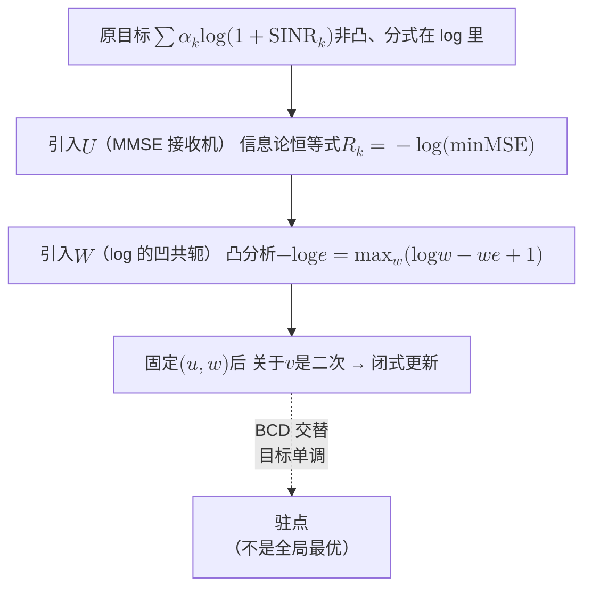

# 3 · 非凸时代：NP-hardness、学习方法与「启发式为何有效」之谜

把 WMMSE 的初值从"全功率"换成"随机"，再跑一遍，结果不一样。换成"注水解"，又不一样。三次都收敛，三次目标值都单调上升，三次都停在满足 KKT 条件的点上，只是三个点各不相同。

KKT 条件见[预备篇 7.4](../part0/07-optimization-basics.md)。满足它的点，本章统称驻点。KKT 只是最优的必要条件，驻点不保证最优。

这件事每个做过干扰信道功控的人都遇到过。通常的处理方式是：多试几个初值，取最好的那个，论文里写"random restarts"。

这一章先问它**为什么会存在**，再问一个更尴尬的问题：理论只保证驻点，为什么大家在随机信道上跑出来的结果又**普遍相当好**？

[第 2 章](02-classical-foundations.md)结束在一个完整的胜利上：目标可加可分、约束凸、耦合只来自约束。于是拉格朗日松弛把全局问题拆成一堆一维问题，价格沿路径可加，分布式算法收敛到全局最优。

这一章要打破那张假设清单上的 **A2（约束凸且线性）与 A1（目标可加可分）**。干扰一旦进入分母，耦合就从约束跑进了目标，整台机器立刻失灵。

```mermaid
flowchart TB
    A["§3.1 两条链路一支笔<br/>双峰、闭式临界值<br/>$$a^\star=\sqrt2$$、$$P^\star=\varphi$$"] --> B["§3.2 干扰图<br/>高 SNR → 最大独立集 → NP-hard"]
    B --> C["§3.3 第一代 · 变换<br/>WMMSE / FP / BSUM<br/>快，但只到驻点"]
    C --> D["§3.4 第二代 · 学习<br/>L2O / GNN / DRL<br/>更快，连驻点都不保证"]
    D --> E["§3.5 第三代 · 生成<br/>扩散：采样代替搜索<br/>能出多模解，仍无证书"]
    E --> F["§3.7 之谜<br/>三代都只到驻点<br/>却都实证接近全局最优"]
    F --> G["§3.8 借来的武器<br/>良性景观 vs OGP<br/>average-case 的两种答案"]
```

!!! note "本章预备知识"
    需要：凸优化（对偶与 KKT）、线性估计。用到的内容：

    - KKT 条件与驻点：[预备篇 7.4](../part0/07-optimization-basics.md#74-kkt-条件最优性的四条戒律)；对偶间隙：[预备篇 7.3](../part0/07-optimization-basics.md#73-拉格朗日对偶把约束变成价格)。
    - 干扰让和速率非凸的最小反例：[预备篇 7.7](../part0/07-optimization-basics.md#77-非凸的现实干扰把碗掀翻了)；SCA、SDR 与交替优化：[预备篇 7.8](../part0/07-optimization-basics.md#78-常用套路速查scasdr-与交替优化)。
    - MMSE 接收机：[预备篇 4.10](../part0/04-information-theory-basics.md#410-条件期望与高斯估计后文最常用的三件工具)。WMMSE 的第一个辅助变量由此而来。
    - MIMO 检测与 NP-hard 的含义：[预备篇 5.7](../part0/05-mimo.md#57-mimo-检测谱系从-ml-到球形译码以及-2026-年的新消息)。
    - NUM、对偶分解与"对偶间隙为零"的经典情形：[第 2 章](02-classical-foundations.md)。


## 3.1 两条链路，一支笔：非凸是从哪里长出来的 {#31-两条链路一支笔非凸是从哪里长出来的}

不需要 $K$ 个用户，不需要 MIMO，也不需要多载波。两条单天线链路、一个载波，非凸就已经出现了。

设归一化噪声 $\sigma^2=1$、功率盒 $p_k\in[0,P]$、直连增益 $g_{11}=g_{22}=1$、交叉增益 $g_{12}=g_{21}=a$。和速率为

$$
f(p_1,p_2)=\log_2\Big(1+\frac{p_1}{ap_2+1}\Big)+\log_2\Big(1+\frac{p_2}{ap_1+1}\Big).
$$

先给一个可靠的事实：**两链路和速率最大化的最优解一定是二值的**。要么关掉一条、另一条满功率，要么两条都满功率，不存在内点最优（Gjendemsjø 等 [8]）。

所以"非凸"在这里是一个具体的**顶点选择问题**：三个候选顶点 $(0,P)$、$(P,0)$、$(P,P)$，选哪个。

### 3.1.1 一维切片：亲眼看见双峰 {#一维切片亲眼看见双峰}

固定 $p_2=P=1$，把 $f$ 看成 $p_1$ 的一元函数，取 $a=1.5$：

| $p_1$ | 0.0 | 0.1 | 0.2 | 0.3 | **0.44** | 0.6 | 0.8 | 1.0 |
|---|---|---|---|---|---|---|---|---|
| $f$ | **1.0000** | 0.9593 | 0.9342 | 0.9202 | **0.9141** | 0.9204 | 0.9411 | **0.9709** |

两端各有一个局部极大，中间是一个局部极小。梯度上升或分块坐标下降（BCD），从 $p_1$ 偏大的初值出发会爬到右峰 $0.9709$，从偏小的初值出发会爬到左峰 $1.0000$。

右峰只有左峰的 97.1%，这就是那个 3% 的陷阱。它来自景观本身的形状，不是数值噪声。

{ .chart loading=lazy }
{ .chart loading=lazy }

*怎么读这张图：这是上表的加密版，每隔 0.05 取一点，按 $f$ 的公式计算。左端 $p_1=0$ 是高 1.0000 的峰，右端 $p_1=1$ 是高 0.9709 的峰，中间在 $p_1^{\circ}\approx0.439$ 处落到谷底 0.9141。纵轴只截取了 0.90–1.01 这一小段，所以起伏看起来很大。实际两峰只差 3%，这也是陷阱不容易被察觉的原因。*

### 3.1.2 三个闭式临界值（可用笔验证） {#三个闭式临界值可用笔验证}

导数可以完整写出来，分三步。

**第一步：求导。** 把第二项写成 $\log_2(ap_1+2)-\log_2(ap_1+1)$，则

$$
\begin{aligned}
\frac{\partial f}{\partial p_1}
&=\frac{1}{\ln 2}\cdot\frac{1}{p_1+a+1}
+\frac{a}{\ln 2}\Big(\frac{1}{ap_1+2}-\frac{1}{ap_1+1}\Big)\\[2pt]
&=\frac{1}{\ln 2}\Big[\frac{1}{p_1+a+1}-\frac{a}{(ap_1+1)(ap_1+2)}\Big].
\end{aligned}
$$

**第二步：令导数为零，化成二次方程。** 交叉相乘整理：

$$
\begin{aligned}
(ap_1+1)(ap_1+2)&=a\,(p_1+a+1)\\
a^2p_1^2+3ap_1+2&=ap_1+a^2+a\\
a^2p_1^2+2ap_1+(2-a^2-a)&=0 .
\end{aligned}
$$

**第三步：解方程，筛掉不合要求的根。** 由求根公式，两根为 $p_1=\frac{-1\pm\sqrt{a^2+a-1}}{a}$（分子分母已同除以 $a$）。

- 取负号的根小于零，落在功率盒外，舍去。
- 取正号的根大于零，要求 $\sqrt{a^2+a-1}>1$，即 $(a+2)(a-1)>0$，也就是 $a>1$。
- 这个根也总不超过 $P=1$，因为 $\sqrt{a^2+a-1}\le a+1$ 恒成立。

于是内部驻点唯一，且

$$
p_1^{\circ}=\frac{\sqrt{a^2+a-1}-1}{a},\qquad\text{存在当且仅当}\ a>1 .
$$

三个临界值随之落地：

- **$a^{\circ}=1$（内部极小的诞生）**：
    - 在 $p_1=0$ 处求导：$\partial f/\partial p_1|_{p_1=0}=\frac{1}{\ln2}\big(\frac{1}{a+1}-\frac{a}{2}\big)$。符号翻转在 $a(a+1)=2$，即 $(a+2)(a-1)=0$，故 $a=1$。
    - 交叉增益一旦超过直连增益，$p_1=0$ 就从"不是 KKT 点"变成"局部极大"，第二个峰在这一刻诞生。
    - 判据如下。端点 $p_1=0$ 只能往 $p_1$ 增大的方向走。向内导数为正时，往里挪一点就能提高 $f$，端点连 KKT 点都不是。向内导数为负时，往里走只会变差，端点就是这条切片上的局部极大。
    - $a>1$ 时 $\frac{1}{a+1}<\frac12<\frac a2$，属于后一种。
- **$a^\star=\sqrt2$（两峰持平）**：令 $f(0)=f(P)$，即 $\log_2(1+P)=2\log_2\big(1+\frac{P}{aP+1}\big)$。取 $P=1$ 得 $\frac{a+2}{a+1}=\sqrt2$，解出 $a^\star=\sqrt2\approx1.4142$。此时两个峰**精确相等**，都等于 1.0000。
- **$P^\star=\varphi$（扫 SNR 的分岔点）**：改取 $a=1$ 而让 $P$ 变，方程成为 $1+P=\big(\frac{2P+1}{P+1}\big)^2$。
    - 黄金比 $\varphi=\frac{1+\sqrt5}{2}$ 满足 $\varphi+1=\varphi^2$ 与 $2\varphi+1=\varphi^3$。
    - 于是 $\frac{2\varphi+1}{\varphi+1}=\frac{\varphi^3}{\varphi^2}=\varphi$，右端为 $\varphi^2$，左端 $1+\varphi$ 也是 $\varphi^2$。
    - 所以根是 $P^\star=\varphi\approx1.618$，即 SNR $\approx2.09$ dB。

### 3.1.3 扫 SNR：全开与独占的交叉

!!! example "算例（$a=1$，扫 SNR，本站自算）"
    三个顶点的值：$f(0,P)=f(P,0)=\log_2(1+P)$，$f(P,P)=2\log_2\big(1+\frac{P}{P+1}\big)$。

    最后一列 $f_{\text{loc}}^{\min}/f^\star$ 是**所有局部极大值中最小者与全局最优值之比**（§3.7 的猜想 P1 沿用这个记号）。等于 1 表示停在哪个峰都不亏，越小表示最差的那个峰越差。

    | $P$ | SNR (dB) | $f(0,P)$ | $f(P,P)$ | 全局最优 | $f_{\text{loc}}^{\min}/f^\star$ |
    |---|---|---|---|---|---|
    | 0.5 | $-3.01$ | 0.5850 | **0.8301** | 全开 | —（唯一局部极大）|
    | 1.0 | $0.00$ | 1.0000 | **1.1699** | 全开 | 第二个峰恰在此诞生 |
    | 1.5 | $+1.76$ | 1.3219 | **1.3561** | 全开 | 0.975 |
    | **1.618** | **$+2.09$** | **1.3885** | **1.3885** | **并列** | **1.000** |
    | 3.0 | $+4.77$ | **2.0000** | 1.6147 | 独占 | 0.807 |
    | 10.0 | $+10.00$ | **3.4594** | 1.8658 | 独占 | 0.539 |


{ .chart loading=lazy }
{ .chart loading=lazy }

*怎么读这张图：把上表加密成每 1 dB 一点。第一条是"独占"顶点的值 $\log_2(1+P)$，随 SNR 一路上涨。第二条是"全开"顶点的值 $2\log_2\!\big(1+\frac{P}{P+1}\big)$，高 SNR 时被钉在 2 以下。两线在 SNR $\approx2.09$ dB（$P=\varphi$）处相交：左侧全开是全局最优，右侧独占夺权。0 dB 以上"独占"已经是局部极大，但直到 2.09 dB 才成为全局最优。曲线按两个顶点的闭式计算。*

**物理意义**

这张表把整章的物理主轴摆出来了：低 SNR 全开，高 SNR 独占。

- **低 SNR**：$\log(1+x)\approx x/\ln2$，速率对功率近似线性，对干扰近似不敏感，多发总是赚的。目标近似凹，全功率顶点是唯一局部极大。
- **高 SNR**：$f(0,P)=\log_2(1+P)\to\infty$，而 $f(P,P)=2\log_2(1+1/a)$ 是一个**与 $P$ 无关的常数**。干扰随信号同比例增长，SINR 被钉死。

于是"独占"必然在某个 SNR 之上胜出，这个交叉点就是 $\varphi$。

**行为分析**

两次分岔的**顺序与性质不同**。

- **$P=1$（0 dB）处**：诞生的是一个**边界 KKT 点**。它不是通过内部鞍结分岔冒出来的：边界上的导数 $\partial f/\partial p_1|_{p_1=0}$ 变号，$(0,P)$ 从"不满足 KKT"直接变成"局部极大"。它一诞生，值就**明显更低**（$1.0$ vs $1.17$，比值 0.855）。
- **此后**：随 SNR 升高，它一路追赶，在 $P=\varphi$ 追平，之后反超。

比值 $f_{\text{loc}}^{\min}/f^\star$ 在 $\varphi$ 两侧各有一个"最差点"：0 dB 附近约 0.85，高 SNR 则**单调恶化并趋于 0**（$P=10$ 已跌到 0.539）。这个数值事实很重要，§3.7 会用它来修正一个看似合理的猜想。

!!! success "关键结论（本节）"
    非凸不是人为假设出来的，它由"干扰耦合 + SNR 升高"产生。两条链路、一支笔就够了：交叉增益越过直连增益（$a>1$）时第二个局部极大诞生，SNR 越过 $\varphi$ 时它夺权。所有后续的 NP-hardness、所有初值敏感、所有"多试几次"，根都在这里。

## 3.2 干扰图：非凸的组合内核，与一个必须点破的陷阱 {#32-干扰图非凸的组合内核与一个必须点破的陷阱}

把两条链路换成 $K$ 条，上一节的"顶点选择"立刻膨胀成组合问题。

### 3.2.1 干扰冲突图与四链路算例

高 SNR 下 $\log(1+\mathrm{SINR})\approx\log\mathrm{SINR}$。这时一条链路只要遇到**任一**强干扰者，基本就作废了。

于是构造**干扰冲突图** $G=(V,E)$：顶点是链路，边表示"两者干扰强到不能共存"。"选哪些链路同时发"就退化成：在 $G$ 上找**最大（带权）独立集**。独立集里的链路互不冲突，权就是各自单独发时的速率。

!!! example "四条链路的微型算例：从冲突图数到最优二值方案（本站自算）"
    设 4 条链路，冲突边集 $E=\{(1,2),(1,3),(1,4),(2,3),(3,4)\}$。6 个配对里只有 $(2,4)$ **不**冲突，其余 5 对全部冲突。单独发射时各自的速率（权）为 $r=(3,\;5,\;2,\;4)$。

    枚举所有**极大**独立集（不能再加入任何顶点的独立集）：

    | 极大独立集 | 权和 | 是否全局最优 |
    |---|---|---|
    | $\{2,4\}$ | $5+4=9$ | **是** |
    | $\{1\}$ | $3$ | 否（$1$ 与 $2,3,4$ 全冲突） |
    | $\{3\}$ | $2$ | 否 |

    每一个极大独立集都是一个"局部极大"。从它出发，任何单点开关都不能提升目标：加点会引入冲突，减点直接丢权。

    于是 §3.1 那个"两个峰"的现象，在 $K$ 条链路上变成：极大独立集有多少个，局部极大就大致有多少个。这个数目一般随 $K$ **指数增长**。

    指数增长可以手数出来。把 $K=30$ 条链路分成 10 组、每组 3 条，组内两两冲突、组间互不冲突，冲突图就是 10 个互不相连的三角形。

    极大独立集必须在每个三角形里恰好挑一条链路：挑两条会冲突，一条不挑则还能再加。于是极大独立集共有 $3^{10}=59049$ 个，即约 5.9 万个局部极大。若每组三条链路的权各不相同，其中只有一个是全局最优（每组挑权最大的那条）。

    Moon–Moser 定理（1965）说，$K$ 能被 3 整除时，$K$ 个顶点的图至多有 $3^{K/3}$ 个极大独立集。这个三角形拼图恰好取到上限。

    注意 $\{1\}$ 的权和只有 $3$，是最优 $9$ 的 $33\%$。贪心从顶点 1 出发就会锁死在这里：它是极大的，但远不是最大的。

    §3.8 要用 OGP 来刻画的，就是这种障碍。OGP 是重叠间隙性质（overlap gap property）：近优解两两之间的距离存在一段"禁区"，输出随输入平稳变化的一大类算法跨不过去。

### 3.2.2 NP-hard 的复杂度边界

这是本部图结构第一次进场，也是 NP-hardness 的物理来源。

NP-hard 的意思是：只要 $\mathrm{P}\neq\mathrm{NP}$（公认但尚未证明），就不存在对**所有**实例都能在多项式时间内求出精确最优的算法。它是最坏情形的判决，不说明典型实例难不难，见[第 1 章](01-three-mountains.md)的"陷阱：NP 难不是下界"。

下表中的 strongly NP-hard（强 NP-hard）更重一层：即使把所有增益、功率的数值大小都限制在问题规模的多项式以内，问题依然 NP-hard。复杂度侧的结果把边界钉得很死：

!!! abstract "定理（动态频谱管理的完整复杂度刻画，Ya-Feng Liu [2]）"
    考虑多用户多载波频谱管理的两种标准形式：(i) 在各用户速率约束下最小化总发射功率；(ii) 在各自功率约束下最大化 min-rate 效用。则

    | 子载波数 $N$ | 形式 (i) 最小功率 | 形式 (ii) max-min 速率 |
    |---|---|---|
    | $N=1$ | 多项式可解 | 多项式可解 |
    | $N=2$ | **strongly NP-hard** | **strongly NP-hard** |
    | $N\ge3$ | strongly NP-hard | strongly NP-hard |

    $N=1$ 与 $N\ge3$ 是既有结论，$N=2$ 是该文补上的最后一块。【已解决】

**物理意义**

难度恰好从"多载波"这一步冒出来。

- 单载波时，每个用户只有一个标量功率，问题的组合结构还没长出来。
- 有两个载波时，用户要决定"把功率放在哪一格"。$K$ 个用户 $\times$ 2 格的分配模式就是一个组合对象，NP-hard 随之而来。

"1 易 / 2 难 / 3 难"是本章能给出的最干净的复杂度地图。

更早的地基是 Luo–Zhang 2008 [1]：对离散化的多载波加权和速率问题

$$
\max_{p_k^n\ge0}\ \sum_{k=1}^K\alpha_k\sum_{n=1}^N\log\Big(1+\frac{g^n_{kk}p^n_k}{\sum_{l\ne k}g^n_{kl}p^n_l+\sigma^2_{k,n}}\Big)\quad\text{s.t.}\ \sum_n p^n_k\le P_k ,
$$

该文在多种实用设定与多种系统效用下建立了 **NP-hardness**，同时识别出可多项式求解的子类，划清了"可算/不可算"的边界 [1]。

单天线之外，MISO 干扰信道的协调波束成形在每站天线数 $\ge2$ 时，对 harmonic mean 与比例公平效用同样 NP-hard [3]。

!!! warning "表述边界"
    "$K$ 用户单载波 SISO 干扰信道和速率最大化 NP-hard，归约自最大独立集"是社区广泛流传的**直觉**，本站未取到原文中该归约的精确定理编号。上文把它写成"归约直觉"，而把**定理级**的引用锁定在 [2] 那张确凿的 1/2/3 表上。

    Hong–Luo 综述 [21] 的复杂度总表（其表 1，注明出自 Luo–Zhang 2008 [1] 与 Liu 等 2011 [3]）有两行：

    - "Parallel IC，$K\ge2$ 固定、$N$ 任意 → NP-hard"。
    - "MISO IC，$N_t\ge2$、$K$ 任意 → NP-hard"。

    单载波一行"Parallel IC，$N=1$、$K$ 任意"在和速率下同样记为 NP-hard。比例公平、调和平均两列为凸问题，最小速率一列为线性规划。

    所以单载波和速率 NP-hard 这一结论本身有表可查，缺的是 Luo–Zhang 原文中对应的定理编号与"归约自最大独立集"的原话。【表述待核：单载波归约的原始定理编号】

### 3.2.3 陷阱一：高 SIR 下"功控是几何规划、可全局求解"并不消解难度 {#陷阱一高-sir-下功控是几何规划可全局求解并不消解难度}

Chiang 等 2007 指出：高 SIR 近似下 $\log(1+\mathrm{SINR})\approx\log\mathrm{SIR}$，在变量替换 $x=\log p$ 之后，$\sum_k\log\mathrm{SIR}_k$ 关于 $x$ 是凹的（因为 log-sum-exp 凸），问题成为**几何规划（GP）**，可全局最优求解 [7]。

凹性这一步可以直接写出。记 $x_l=\log p_l$，则

$$
\log\mathrm{SIR}_k=\log g_{kk}+x_k-\log\big(\sum_{l\ne k}g_{kl}e^{x_l}+\sigma^2\big)
$$

这里把噪声也算进分母，去掉 $\sigma^2$ 结论不变。前两项是 $x$ 的仿射函数。最后一项把 $\sigma^2$ 写成 $e^{\log\sigma^2}$ 后，是若干个"仿射函数取指数、求和、再取对数"（log-sum-exp），它是凸的，减去它就得到凹函数。

几何规划（geometric programming, GP）是目标与约束都由正系数单项式之和（posynomial）构成的一类问题，换成对数变量后恰好是凸问题。这里的 $\max\sum_k\log\mathrm{SIR}_k$ 就属于这一类。这看起来和 NP-hardness 冲突。

两者并不冲突。GP 的凸性有一个前提：所有在发链路都已经处于高 SIR，也就是**活跃集已经定了**。组合难度被整体挪到了"选哪个活跃集"这一步，而那就是最大独立集。

中低 SIR 区域不能丢掉 $\log(1+\mathrm{SINR})$ 里的那个 1。问题退化为 signomial program：形式像 GP，但出现了带负系数的项或 posynomial 之比，对数换元救不回凸性。这时只能靠 SCA（逐次凸近似，见[预备篇 7.8](../part0/07-optimization-basics.md)）收敛到 KKT 点 [7]。

!!! success "本章的骨架判断"
    连续部分容易，组合部分难。活跃集一旦固定，剩下的连续功率分配往往可以变凸（GP，或 §3.3 的各种变换）。全部难度压在"哪些链路同时发"这个 $2^K$ 的选择上。

    这句话既解释了 NP-hardness 的来源，也预告了 §3.8 为什么 OGP 是对的工具：OGP 的头号例子恰好就是随机图上的最大独立集。

### 3.2.4 陷阱二：非凸，但对偶间隙为零 {#陷阱二非凸但对偶间隙为零}

Luo–Zhang 同一篇论文里还有一个与直觉相反的结果。用泛函分析中的 Lyapunov 定理可以严格证明，该频谱管理问题的**连续（Lebesgue 积分）形式具有零对偶间隙** [1]。

这里的 Lyapunov 定理是 Lyapunov 凸性定理（不含"原子"的向量测度，其取值范围是凸集），与[第 4 章](04-sequential-uncertainty.md)的 Lyapunov 漂移无关。它在这里起的作用见下面的物理意义。

对偶间隙指原问题最优值与拉格朗日对偶问题最优值之差，见[预备篇 7.3](../part0/07-optimization-basics.md)。

**物理意义**

这是从[第 2 章](02-classical-foundations.md)通向本章最好的一座桥。上一章教会我们"对偶是万能钥匙，零对偶间隙意味着分解无损"。这一章的第一个惊喜是：**即便目标非凸，在多载波连续极限下对偶间隙依然为零**。

频率维度上的"无穷可分性"起到了凸化作用，就像时分复用把任何可达区域凸化一样。

**行为分析**

但零对偶间隙不等于容易求解。对偶问题的每一步仍要解一个非凸的内层子问题，即给定价格，各用户在所有载波上的最优功率分配。这个子问题本身就是 NP-hard 的。

"存在无间隙的对偶表示"和"能在多项式时间里把它算出来"，是两件完全不同的事。这个区分是整部书的认识论起点：极限的存在性与极限的可达性必须分开谈。

## 3.3 第一代 · 变换：WMMSE 的两个辅助变量到底在做什么 {#33-第一代--变换wmmse-的两个辅助变量到底在做什么}

面对非凸，通信人的第一反应是**变换**：找一个等价的、每一块都好解的重写。这一代的代表作是 WMMSE [4]，它统治了此后十五年。

绝大多数教程直接给出三条更新公式，跳过了最关键的一层：为什么引入 $\mathbf{u}$ 和 $\mathbf{w}$ 两组辅助变量，就能把 log 变成二次？



### 3.3.1 第一步：$U$ 把 log 变成 $-\log$ MSE（这一步来自通信） {#第一步u-把-log-变成--log-mse这一步来自通信}

考虑标量情形。链路 $k$ 的接收端用一个标量均衡器 $u_k$，发射变量记 $v_k$（功率 $p_k=v_k^2$）。各发射机送出彼此独立、零均值、单位功率的符号 $s_l$，接收信号为

$$
y_k=h_{kk}v_ks_k+\sum_{l\ne k}h_{kl}v_ls_l+n_k
$$

噪声 $n_k$ 方差为 $\sigma^2$，接收端用 $\hat s_k=u_ky_k$ 估计 $s_k$。这里的 $h_{kl}$ 是**幅度**增益，$h_{kl}^2$ 对应 §3.1 的功率增益 $g_{kl}$。

把 $\mathbb{E}[(u_ky_k-s_k)^2]$ 展开，不同符号之间、符号与噪声之间的交叉项都因独立、零均值而为零，得均方误差

$$
\begin{aligned}
e_k(u_k,\mathbf{v})&=(1-u_kh_{kk}v_k)^2+u_k^2\Big(\sum_{l\ne k}h_{kl}^2v_l^2+\sigma^2\Big)\\
&=1-2u_kh_{kk}v_k+u_k^2\underbrace{\Big(\sum_{l}h_{kl}^2v_l^2+\sigma^2\Big)}_{\triangleq\,T_k}.
\end{aligned}
$$

关于 $u_k$ 求极小。$e_k$ 是 $u_k$ 的开口向上的抛物线，导数为零处即最小：$-2h_{kk}v_k+2u_kT_k=0$，得 MMSE 接收机 $u_k^\star=h_{kk}v_k/T_k$。

它就是[预备篇 4.10](../part0/04-information-theory-basics.md)的线性 MMSE 估计：在所有形如 $u_ky_k$ 的估计里均方误差最小的那一个。

代回，$e_k=1-2\frac{h_{kk}^2v_k^2}{T_k}+\frac{h_{kk}^2v_k^2}{T_k}$，即

$$
\min_{u_k}e_k=1-\frac{h_{kk}^2v_k^2}{T_k}=\frac{\sum_{l\ne k}h_{kl}^2v_l^2+\sigma^2}{T_k}=\frac{1}{1+\mathrm{SINR}_k},
$$

于是速率被改写成

$$
R_k=\log(1+\mathrm{SINR}_k)=-\log\Big(\min_{u_k}e_k\Big).
$$

**物理意义**

这一步用的是信息论恒等式：高斯信道下，"最小均方误差"与"互信息"是同一枚硬币的两面。

它的价值在于：$e_k(u_k,\mathbf{v})$ 关于发射变量 $\mathbf{v}$ 是**二次的**，而 $\log(1+\mathrm{SINR}_k)$ 关于 $\mathbf{v}$ 是分式套对数。把优化对象从"速率"换成"误差"，非线性就从分子分母里被赶到了一个外层 $-\log$ 上。

### 3.3.2 第二步：$W$ 用 log 的凹共轭把 $-\log$ 拉平（这一步来自凸分析） {#第二步w-用-log-的凹共轭把--log-拉平这一步来自凸分析}

剩下的麻烦只有那个外层的 $-\log$。它可以被**一族仿射函数的上包络**表示：

!!! abstract "引理（$-\log$ 的变分表示，本章最该单独记住的一行）"
    对任意 $e>0$，

    $$
    -\log e=\max_{w>0}\ \big(\log w-we+1\big),\qquad w^\star=1/e .
    $$

    验证：右端对 $w$ 求导 $1/w-e=0$ 给出 $w^\star=1/e$，代回得 $\log(1/e)-1+1=-\log e$。

    矩阵版为 $-\log\det\mathbf{E}=\max_{\mathbf{W}\succ0}\big[\log\det\mathbf{W}-\mathrm{tr}(\mathbf{W}\mathbf{E})+d\big]$，$\mathbf{W}^\star=\mathbf{E}^{-1}$。

**物理意义**

$w$ 是 $\log$ 的**凹共轭变量**（Legendre–Fenchel 对偶变量），不是一个凑出来的"权重"。

这一行做的事是：把一个弯曲的 $-\log$ 换成"在所有仿射下界里取最高的那个"。固定 $w$ 时，$\log w-we+1$ 恰是凸函数 $-\log e$ 在 $e=1/w$ 处的切线。凸函数的切线都在函数图像下方，所以每一条都是下界，只在切点处取等。

代价是多一组变量，收获是目标对 $e$ 变成了线性。而 $e$ 对 $\mathbf{v}$ 是二次的，于是复合起来对 $\mathbf{v}$ 就是二次的。

### 3.3.3 第三步：合成 {#第三步合成}

把两步接起来，分三小步。

1. 由第一步，$-R_k=\log\big(\min_{u_k}e_k\big)=\min_{u_k}\log e_k$：$\log$ 单调递增，先取最小再取对数，与先取对数再取最小，结果相同。
2. 由引理，$\log e_k=-\max_{w_k>0}\big(\log w_k-w_ke_k+1\big)=\min_{w_k>0}\big(w_ke_k-\log w_k-1\big)$：给最大化整体加负号，就变成对相反数的最小化。
3. 两式合并再乘以权 $\alpha_k>0$：$-\alpha_kR_k=\alpha_k\min_{u_k,w_k}\big(w_ke_k(u_k,\mathbf{v})-\log w_k\big)-\alpha_k$。

    对 $k$ 求和时，第 $k$ 项的内层变量只有 $(u_k,w_k)$，各项的内层最小化互不干扰，可以并成对全部 $(\mathbf{u},\mathbf{w})$ 的一次最小化。常数 $-\sum_k\alpha_k$ 不影响最优点，丢掉。

最大化 $\sum_k\alpha_kR_k$ 就是最小化 $-\sum_k\alpha_kR_k$，于是它等价于

$$
\boxed{\ \min_{\mathbf{w},\mathbf{u},\mathbf{v}}\ \sum_k\alpha_k\big(w_k\,e_k(u_k,\mathbf{v})-\log w_k\big)\ }
$$

三块交替求极小，每块都有闭式解：

$$
u_i=\frac{h_{ii}v_i}{\sigma^2+\sum_j h_{ij}^2v_j^2},\qquad
w_i=\frac{1}{1-u_ih_{ii}v_i},\qquad
v_i=\Big[\frac{\alpha_i u_ih_{ii}w_i}{\sum_j\alpha_j h_{ji}^2u_j^2w_j}\Big]_0^{\sqrt{P_{\max}}} .
$$

**这三行闭式解是怎么来的**

- **$v_i$ 那一行**：由 $\partial/\partial v_i$ 直接得到。
    - 目标中含 $v_i$ 的项是 $-2\alpha_iw_iu_ih_{ii}v_i+v_i^2\sum_j\alpha_jw_ju_j^2h_{ji}^2$，配方即得。
    - 这是 $v_i$ 的开口向上的抛物线，顶点在 $v_i=\frac{\alpha_iu_ih_{ii}w_i}{\sum_j\alpha_jh_{ji}^2u_j^2w_j}$。
    - 约束 $0\le v_i\le\sqrt{P_{\max}}$ 下的最小点，就是把顶点截到这个区间里。$[\cdot]_0^{\sqrt{P_{\max}}}$ 表示的就是这个截断。
    - 不同 $v_i$ 的项互不交叉，所以各 $v_i$ 可以同时更新。
- **$w_i$ 那一行**：就是引理的 $w^\star=1/e_i$。再用 $u_i=u_i^\star$ 时 $u_iT_i=h_{ii}v_i$，把 $e_i$ 化成 $1-u_ih_{ii}v_i$。

**为什么两个问题的驻点相同。** 记方框里的目标为 $g(\mathbf{w},\mathbf{u},\mathbf{v})$，并记 $\phi(\mathbf{v})=\min_{\mathbf{u},\mathbf{w}}g=-\sum_k\alpha_kR_k(\mathbf{v})+\sum_k\alpha_k$。

- **驻点处的 $\mathbf{u},\mathbf{w}$ 必然是最优值。** $g$ 对每个 $u_k$ 是开口向上的抛物线（二次项系数 $\alpha_kw_kT_k>0$），对每个 $w_k$ 是严格凸函数 $\alpha_k(w_ke_k-\log w_k)$。所以 $\partial g/\partial u_k=0$、$\partial g/\partial w_k=0$ 只在 $u_k=u_k^\star(\mathbf{v})$、$w_k=1/e_k$ 处成立。
- **两个目标对 $\mathbf{v}$ 的梯度相同。** 由链式法则，

    $$
    \nabla\phi(\mathbf{v})=\nabla_{\mathbf{v}}g+\big(\frac{\partial\mathbf{u}^\star}{\partial\mathbf{v}}\big)^{\!\top}\frac{\partial g}{\partial\mathbf{u}}+\big(\frac{\partial\mathbf{w}^\star}{\partial\mathbf{v}}\big)^{\!\top}\frac{\partial g}{\partial\mathbf{w}}
    $$

    在 $(\mathbf{u}^\star,\mathbf{w}^\star)$ 处后两项里的偏导为零，只剩 $\nabla\phi(\mathbf{v})=\nabla_{\mathbf{v}}g$。
- **于是驻点一一对应。**
    - 在同一个功率盒上，$(\mathbf{w},\mathbf{u},\mathbf{v})$ 满足 $g$ 的 KKT 条件，当且仅当 $\mathbf{u},\mathbf{w}$ 取最优值、且 $\mathbf{v}$ 满足 $-\sum_k\alpha_kR_k$ 的 KKT 条件。
    - 反过来，原问题的任一驻点 $\mathbf{v}$ 配上 $\mathbf{u}^\star(\mathbf{v})$、$\mathbf{w}^\star(\mathbf{v})$ 就是 $g$ 的驻点。
    - 全局最优也对应：$\min_{\mathbf{w},\mathbf{u},\mathbf{v}}g=\min_{\mathbf{v}}\phi$。

所以以 $\mathbf{v}$ 为变量看，变换没有改变景观的形状：原问题有几个坏驻点，$g$ 就有几个。这就是下文"边界"一节说的，WMMSE 的等价性只到局部解一一对应。

换回功率 $p_i=v_i^2$ 时要多留一个心眼：$\partial/\partial v_i=2v_i\,\partial/\partial p_i$ 在 $v_i=0$ 处恒为零，所以关掉的链路在 $\mathbf{v}$ 变量下总是驻点。对应地，某轮一旦 $v_i=0$，就有 $u_i=0$，下一轮 $v_i$ 仍为 $0$，WMMSE 不会再把这条链路打开。

!!! tip "直觉：$w_i$ 其实就是 $1+\mathrm{SINR}_i$，$v_i$ 的分母就是一个价格"
    把 $u_i=u_i^\star$ 代进去，$e_i=1/(1+\mathrm{SINR}_i)$，于是

    $$
    w_i=\frac{1}{e_i}=1+\mathrm{SINR}_i .
    $$

    权重由当前解自己算出来，等于 $1+\mathrm{SINR}$。当前状态越好的链路，下一轮权重越大。

    这解释了 WMMSE 为什么高度依赖初值：它内建了一个正反馈，初值把谁抬起来，谁就更容易被继续抬起来，最后锁死在某个"活跃集"上。§3.7 的研究方向 (c) 要把这句定性观察变成收敛盆的定量刻画。

    再看 $v_i$ 的分母 $\sum_j\alpha_jh_{ji}^2u_j^2w_j$：它把"链路 $i$ 每多发一点功率，会伤害到谁、伤害多少"全部聚成一个标量。这就是[第 2 章](02-classical-foundations.md)里的影子价格，只不过在那里价格来自约束的乘子，在这里价格来自目标中的耦合。价格的语言穿过了凸与非凸的分界线，穿不过去的是最优性。

**行为分析**

极限情形能立刻校验。

- **无干扰时**（$h_{ji}=0,\ j\ne i$）：分母只剩 $\alpha_ih_{ii}^2u_i^2w_i$，$v_i\to 1/(h_{ii}u_i)$。
    - 此时 $u_i=h_{ii}v_i/(\sigma^2+h_{ii}^2v_i^2)$，代入得新值 $\frac{\sigma^2+h_{ii}^2v_i^2}{h_{ii}^2v_i}=v_i+\frac{\sigma^2}{h_{ii}^2v_i}$。
    - 每轮至少增加 $\sigma^2/(h_{ii}^2\sqrt{P_{\max}})$，有限轮后被截断在 $\sqrt{P_{\max}}$，即 $p_i=v_i^2$ 一路顶到 $P_{\max}$。结果退化成"能发就发"。
- **强干扰时**：某条链路的 $u_j$ 很小（MMSE 接收机对噪声大的链路自动缩小增益），它在别人分母里的贡献 $h_{ji}^2u_j^2w_j$ 也随之变小。已经被干扰打死的链路不再"收保护费"，算法就是这样自发走向"独占"解的。

### 3.3.4 FP 二次变换：同一个魔法的另一种写法 {#fp-二次变换同一个魔法的另一种写法}

Shen–Yu 2018 [6] 给出的**二次变换**处理一般的多比值分式规划：对 $A_m\ge0$、$B_m>0$，

$$
\max_{\mathbf{x}\in\mathcal{X}}\ \sum_{m=1}^M\frac{A_m(\mathbf{x})}{B_m(\mathbf{x})}
\quad\Longleftrightarrow\quad
\max_{\mathbf{x}\in\mathcal{X},\,\mathbf{y}}\ \sum_{m=1}^M\Big(2y_m\sqrt{A_m(\mathbf{x})}-y_m^2B_m(\mathbf{x})\Big),
$$

最优辅助变量 $y_m^\star=\sqrt{A_m(\mathbf{x})}/B_m(\mathbf{x})$。验证只需回代：$2\frac{\sqrt{A}}{B}\sqrt{A}-\frac{A}{B^2}B=\frac{2A}{B}-\frac{A}{B}=\frac{A}{B}$。

**物理意义**

这是 $t\mapsto A/B$ 的一次"配方"：把分式换成一族关于 $y$ 的抛物线的上包络，**分母从除法位置挪到了乘法位置**。原来 $\mathbf{x}$ 出现在分母里，这是非凸的根源。现在 $\mathbf{x}$ 只出现在 $\sqrt{A_m(\mathbf{x})}$ 与 $B_m(\mathbf{x})$ 里，若前者凹、后者凸，整个式子对 $\mathbf{x}$ 就是凹的。

该文把原非凸问题重述为**一列凸问题**，给出可证收敛到驻点的迭代，并显式建立了 FP 与不动点迭代、WMMSE 波束成形之间的紧密联系 [6]。

处理 $\sum_m\log(1+\mathrm{SINR}_m)$ 还需要一步额外的**拉格朗日对偶变换**把 log 剥开，FP 框架后续用它统一处理 sum-of-logarithms。这一步出自 Shen–Yu 的同一组论文：Part I 第 IV-C 节的"闭式 FP"先以命题 2 的形式把它用于功率控制，Part II 的定理 3 给出一般陈述与构造性证明 [6]。

### 3.3.5 边界：三代人共用的那句诚实话 {#边界三代人共用的那句诚实话}

BSUM（block successive upper-bound minimization，分块逐次上界最小化）把 WMMSE 这类"分块交替、每块换一个好算的替代函数"的算法统一起来。每次只动一块变量，把原目标换成一个在当前点与它贴合、处处不低于它的替代函数，对这块变量求极小。

替代函数取原目标本身时，它就退化成普通的分块坐标下降（BCD）。WMMSE 就是对 $g(\mathbf{w},\mathbf{u},\mathbf{v})$ 做三块 BCD。注意下面定理里的 $u_i(\cdot\,;x^t)$ 是替代函数，与 WMMSE 的接收系数 $u_i$ 同字母不同义。

!!! abstract "定理（BSUM 统一收敛分析，Razaviyayn–Hong–Luo [5]）"
    分块坐标下降的非精确版本：每块用一个局部替代函数 $u_i(x_i;x^t)$ 代替原目标 $f$ 求极小，要求 (a) 取值相符 $u_i(x_i^t;x^t)=f(x^t)$；(b) 全局上界 $u_i\ge f$；(c) 方向导数在 $x^t$ 处相符。则在相当宽的一类非光滑/非凸目标下，迭代的**每个极限点都是原问题的驻点**。【已解决】

    **一个不能省的附加条件**：分块数**大于 2** 时，上面三条还不够。需再加"每块子问题的极小点唯一"或"$u_i$ 关于 $x_i$ 拟凸"之一。

    这不是学究气。WMMSE 恰好是三块（$\mathbf{u},\mathbf{w},\mathbf{v}$），正落在需要附加条件的区间里。只写 (a)(b)(c) 会让读者以为无条件成立。

    WMMSE 满足的是第一个附加条件：只要各 $w_k>0$、$T_k>0$，且 $v_i$ 的二次项系数 $\sum_j\alpha_jh_{ji}^2u_j^2w_j>0$，三块子问题都拆成关于单个 $u_k$、$w_k$、$v_i$ 的严格凸一元问题，极小点唯一，就是上面三条闭式更新【本站演算】。

**为什么这条定理是本章的诚实点**：WMMSE、SCA、FP、EM 全都是 BSUM 的实例，答案统一为**驻点（KKT 点）**。它不排除收敛到坏的局部极大，也不提供任何最优性证书。

WMMSE 的等价性只到"两个问题的局部解一一对应" [21]，转回原问题也还是驻点。§3.1 那个 3% 的陷阱，就是这句话的可视化。

对照组在另一侧：

- **MAPEL** 用单调优化 / polyblock 外逼近，在一般 SINR 区间**全局收敛**到加权吞吐量最大化的全局最优解 [9]。
- **分支定界**生成渐近收紧的上下界序列，差值小于容差即停，**带最优性证书** [10]。
- $K$ 用户高斯干扰信道的多天线全局最优算法，被作者明确定位为"启发式算法的性能基准" [26]。

它们的共同点是慢，慢到只能当 benchmark。

## 3.4 第二代 · 学习：把迭代摊平，把对称性写进架构 {#34-第二代--学习把迭代摊平把对称性写进架构}

变换代的瓶颈是**在线迭代成本**：每次信道变化都要重跑几十上百次迭代。学习代的想法是把这笔账挪到离线。

**L2O 的奠基**是 Sun 等 2018 [12]：直接训练一个 DNN 去逼近 WMMSE 的输入–输出映射。

关键的理论结论是：逼近误差 $\varepsilon$ 对神经元数与层数的依赖是温和的，阶为 $\log(1/\varepsilon)$。实验上，相对基于优化的功控获得了数量级加速 [12]。

**行为分析**

$\log(1/\varepsilon)$ 意味着网络规模随 $\log(1/\varepsilon)$ 线性增长：精度每提高一个数量级，规模只需增加一个固定的量。这解释了为什么这条路走得通。

但目标被偷换了：网络学的是 **WMMSE 的输出**，不是全局最优。天花板就是 WMMSE 本身。

**Unrolled WMMSE** 是更精巧的一步：把 WMMSE 的迭代**摊平成网络层**，每层保留原算法的结构，只把其中若干量参数化，不再当黑箱回归。

- UWMMSE 用 GNN 参数化层内可学权重，图由时变衰落干扰系数给出。该文证明这个架构**置换等变**（permutation equivariant：把链路重新编号后再输入，输出恰好按同样的方式重新编号，数值不变），因而可跨拓扑泛化 [22]。
- Pellaco 等为了可展开性，把矩阵求逆、特征分解、二分搜索统统改写成投影梯度下降。他们报告 unfolded WMMSE 在固定迭代数下优于或持平 WMMSE，且计算负载更低 [23]。

### 3.4.1 为什么置换等变是"对的"归纳偏置：一个定理级的回答 {#为什么置换等变是对的归纳偏置一个定理级的回答}

给链路重新编号不应改变解，这是显然的。但"显然"不等于"应该硬编码进架构"。真正的理由是：

!!! abstract "命题与定理（REGNN，Eisen–Ribeiro [13]）"
    - **等变性（Proposition 2）**：若 $\hat{\mathbf{H}}=\boldsymbol{\Pi}^{\!\top}\mathbf{H}\boldsymbol{\Pi}$、$\hat{\mathbf{x}}=\boldsymbol{\Pi}^{\!\top}\mathbf{x}$，则 $\boldsymbol{\Phi}(\hat{\mathbf{H}},\hat{\mathbf{x}},\mathbf{A})=\boldsymbol{\Pi}^{\!\top}\boldsymbol{\Phi}(\mathbf{H},\mathbf{x},\mathbf{A})$，滤波器权重 $\mathbf{A}$ 不变。
    - **最优滤波器的置换不变性（Theorem 1）**：若两个网络分布互为置换且满足相应条件，则**最优滤波器张量相同**，$\hat{\mathbf{A}}^\star\equiv\mathbf{A}^\star$。【已解决】

**物理意义**

这是"为什么置换等变是对的归纳偏置"的定理级回答：**最优策略本身就是等变的**，所以把等变性硬编码进架构不损失最优性，只是缩小了假设空间。

这跟卷积网络里平移等变的地位完全一致：它是问题结构的直接反映，不是技巧。

训练侧，该文用约束统计学习 + 原始–对偶，梯度估计走策略梯度，**不需要 $f$ 的显式梯度**（model-free）[13]。

另一条线把"GNN 就是分布式算法"说得更彻底：

!!! abstract "定理（MPGNN ↔ 分布式局部算法，Shen 等 [14]）"
    - **Proposition II.3**：无线资源管理问题具有**普适置换等变性**：置换后问题的解等于原问题解的置换。
    - **Proposition III.1**：MPGNN 满足 $\Phi(\pi\star Z,\pi\star A)=\pi\star\Phi(Z,A)$。
    - **Theorem IV.1（双向等价）**：任意 $T$ 层 MPGNN 对应一个 $T$ 次迭代的 **MB-DLA（multiset broadcasting distributed local algorithm）**。反之，任意 MB-DLA 都可由等价的 MPGNN 表示。【已解决】

    MB-DLA 是这样一类分布式算法：每轮每个节点把自己的状态广播给所有邻居，再凭自己的当前状态和收到的消息的多重集合（收到了哪些值，不管是谁发的）更新自己。

这条定理在本章的地位远超它的原用途。它把"$T$ 层消息传递 GNN"精确等同于"$T$ 轮分布式局部算法"。

于是任何**排除局部算法**的下界工具，立刻就是**排除 GNN** 的下界工具。§3.8 的 OGP 就是这样一件工具，这是本章埋得最深的一条线。

泛化侧的可引数字：

- 50 用户训练、1000 用户测试，达到 **WMMSE 性能的 98.9%**。
- 密度放大 10 倍时，降到 **95.3%**。
- 1000 用户波束成形在单 GPU 上 **66 ms** [14]。

【表述待核：数字经二手抽取，另有 6 ms 的说法出现在部分来源，两者冲突，以原文表 III/IV 为准】

!!! warning "最容易被误引的一个数字"
    "98.9%"是相对 **WMMSE** 的比值，不是相对全局最优。WMMSE 自己只是一个驻点算法。

    "达到 WMMSE 的 98.9%"与"达到全局最优的 98.9%"之间，隔着整整一个本章要讲的谜。引用时务必写清分母是谁。

### 3.4.2 表达力的天花板：WL 边界在无线里的具体形态 {#表达力的天花板wl-边界在无线里的具体形态}

1-WL 测试（一维 Weisfeiler–Lehman 测试）是判断两张图是否可能同构的迭代着色程序。开始时所有顶点同色，每一轮把"自己的颜色 + 邻居颜色的多重集合"映射成一个新颜色。某一轮两张图的颜色直方图不同，就判定它们不同构，否则判"分不开"。

每层消息传递 GNN 做的是同一件事，只是它的更新函数未必像 1-WL 的重新着色那样把不同输入映成不同输出。所以消息传递 GNN 的判别能力**至多等于 1-WL 测试**：1-WL 分不开的图，MPGNN 也分不开。突破需要高阶结构或位置编码。这是图学习一侧的教科书级共识。

!!! warning "不要把 WL 塞进别人嘴里"
    Shen 等 [14] 的表达力刻画走的是 MPGNN ↔ MB-DLA 等价那条路，**原文并未显式引用 WL 测试**。

    正确的写法是：MPGNN 的表达力上界由其对应的分布式局部算法类给出，而在图学习一侧，这类上界的标准刻画是 1-WL。

无线里这条边界有一个非常具体的形态。Peng–Guo–Yang [24] 指出：

- 用线性处理器的 **vertex-GNN** 在第一层就把信道矩阵压成了行和/列和，单条干扰信道的增益被抹掉，因而"无法区分所有的信道矩阵"。
- **edge-GNN** 保留全部边特征，表达力完整，且训练/推理更快 [24]。

**物理意义**

无线里的"不可区分图对"是一种具体的信息坍缩：不同的信道矩阵被聚合成同一个和。它不是抽象的 CFI 构造。

两个干扰格局完全不同、但行和相同的网络，在这种架构眼里长得一模一样，输出必然相同，其中至少一个是错的。GNN 设计准则的系统总览见 [25]。

**DRL** 走的是另一条路：把功控当序贯决策。Nasir–Guo [15] 的多智能体深度 Q-learning 是默认引用：分布式执行、model-free，每个发射机只收集邻居的 CSI 与 QoS 信息，目标是加权和速率，**能处理 CSI 的随机变化与时延，实时达到近最优功率分配** [15]。

它的代价是：训练不稳定、奖励塑形敏感，且同样**没有任何最优性刻画**。

## 3.5 第三代 · 生成：采样代替搜索，多模从 bug 变成 feature {#35-第三代--生成采样代替搜索多模从-bug-变成-feature}

2023 年之后出现的第三代把问题重新提了一遍：与其学"最优解是什么"，不如学"最优解的分布是什么"，然后采样。

范式最清楚的表述来自 Du 等的教程 [27]，分三步：

1. 观测环境条件。
2. 从专家库取最优解。
3. 生成扩散模型（GDM）通过前向加噪 / 反向去噪，学会复现该最优解。

Ribeiro 组把它做进了约束问题：把分配写成遍历效用最大化 + 遍历 QoS 约束，用**原始–对偶专家策略**产生近最优样本训练 GDM，反向扩散过程由 GNN 参数化以跨网络配置泛化 [28]。

### 3.5.1 它真正解决了什么：确定性策略从原理上够不到最优 {#它真正解决了什么确定性策略从原理上够不到最优}

这一代最强的论证是一个结构性论断，而不是"更快"：

!!! success "关键结论（生成代的核心论点，[28]）"
    最优功控策略一般是多模的、随机的。两条强干扰链路之间需要**交替发射**，也就是时间共享，才能达到确定性方案根本不可达的 utility–constraint 折中。

    回归型学习方法（L2O、确定性 GNN、确定性策略 DRL）输出的是一个**点**。它在两个对称最优解之间只能给出平均，而平均恰恰落在两个对称最优解连线上最差的那一点。

回到 §3.1 就明白了。$a=\sqrt2$、$P=1$ 时，$(0,1)$ 与 $(1,0)$ 两个解**精确等值**，都等于 1.0000。

此参数下 $(1,1)$ 也恰好取到 1.0000：$2\log_2\big(1+\tfrac{1}{\sqrt2+1}\big)=2\log_2\sqrt2=1$。§3.1 的一维切片看到的是 $(0,1)$ 与 $(1,1)$ 这一对，这里取对称的 $(0,1)$ 与 $(1,0)$ 来说明多模性。

而任何"平均"给出的 $(0.5,0.5)$ 只有

$$
f(0.5,0.5)=2\log_2\Big(1+\frac{0.5}{\sqrt2\times0.5+1}\Big)=2\log_2 1.2929=0.7412,
$$

只剩两个对称最优解的 74.1%。

一个把两个对称最优解平均掉的学习器，会稳稳落在两峰之间的谷底：沿连接 $(0,1)$ 与 $(1,0)$ 的线段，$(0.5,0.5)$ 是最低点。严格说，它在整个二维功率盒里不是局部极小，连驻点都不是，该处两个偏导都约为 $0.38>0$。

所以问题不在训练不够，而在假设空间的形状错了。

**数值结果**

- [28] 在最小速率门限 0.6 bit/s/Hz 下报告：U 形 GNN 去噪器给出 5 百分位 0.73 / 均值 2.97，原始–对偶专家 0.79 / 2.85，而确定性均功率基线均值仅 0.48。
- 离散侧的样板是 DIFUSCO [29]：把 NP 完全问题写成 $\{0,1\}$ 向量优化，用图扩散生成解。**离散扩散（Bernoulli 噪声）显著优于连续扩散（高斯噪声）**：
    - TSP-500 与最优解的 gap 从 1.76% 降到 **0.46%**。
    - TSP-1000 从 2.46% 降到 1.17%。
    - TSP-10000 从 3.19% 降到 2.58%。

综述侧 [30][31] 把动机说得很直接：传统 DRL 受限于"单模策略分布、高维动作空间探索低效、对动态异构环境适应差"，而扩散模型能刻画"复杂、不连续、多模的动作结构" [31]。

### 3.5.2 它回答不了什么 {#它回答不了什么}

!!! warning "证书问题原封不动"
    - **没有任何最优性证书。** DIFUSCO 的 0.46% gap 是相对已知最优解测出来的，不是算法自己证出来的。换一个没有已知最优解的问题实例，这个数字无从谈起。
    - **"近最优"是继承来的。** GDM 策略模仿的是专家（原始–对偶 / WMMSE），专家的次优性会被完整继承，甚至被生成过程放大。当专家本身只是驻点算法时，学生的天花板就是那个驻点。
    - 生成代把"搜索"换成了"采样"，把"多模解"从 bug 变成 feature，这两件都是真进步。但"离最好可能有多远"这个问题，它一个字也没回答。

### 3.5.3 三代对照：一部证书的消失史 {#三代对照一部证书的消失史}

| | 变换代（2008–2018） | 学习代（2018–2023） | 生成代（2023–2026） | 全局代（对照组） |
|---|---|---|---|---|
| 代表 | WMMSE [4]、FP [6]、SCA/BSUM [5] | L2O [12]、REGNN [13]、MPGNN [14]、DRL [15] | GDM [27][28]、DIFUSCO [29] | MAPEL [9]、B&B [10] |
| 理论保证 | 收敛到**驻点** | 逼近误差 $O(\log(1/\varepsilon))$ 阶规模 [12]；**无解质量保证** | **无**（模仿专家） | **全局最优 + 证书** |
| 在线速度 | 数十–数百次迭代 | 一次前向（毫秒级 [14]） | 若干步去噪 | 随 $K$ 爆炸 |
| 分布外泛化 | 不适用（每次重解） | 有实证、**无保证** [14][24] | 有实证、**无保证** | 不适用 |
| 离散变量 | 需另配整数规划 | 困难（不可微） | **天然适配**（Bernoulli 扩散 [29]） | 天然适配、但慢 |
| 多模/随机解 | 一次给一个 | 结构上做不到 | **天然适配** [28] | 可枚举、但慢 |
| **最优性证书** | **无** | **无** | **无** | **有** |

这张表读下来，是一部证书的消失史：

- B&B 有证书，但慢。
- WMMSE/FP/SCA 快，但只到驻点。
- GNN/DRL 更快，但连驻点都不保证。
- 扩散最快，能出多模解，证书依然不在。

上界侧越做越像"直接给答案"，下界侧一动没动。

## 3.6 两个当代舞台：卸载的混合整数非凸与联邦学习的组合非凸 {#36-两个当代舞台卸载的混合整数非凸与联邦学习的组合非凸}

### 3.6.1 舞台一 · 边缘计算的任务卸载 {#舞台一--边缘计算的任务卸载}

MEC 中的联合计算卸载 + 资源分配被普遍形式化为**混合整数非线性规划（MINLP）**，一般 NP-hard：二元卸载决策 $a_i\in\{0,1\}$ 乘上连续的功率 / 带宽 / CPU 频率。

它把本章的两种困难叠在了一起：

- **干扰耦合的连续非凸**：谁发大功率，谁就恶化别人的信道。
- **组合选择**：谁卸载，谁本地算。

这两种困难是相乘的关系。

!!! example "为什么这个乘法不是简单叠加"
    卸载决策改变了**干扰图本身**。甲改为本地计算，图上就少一个顶点、少一批边，乙的活跃集选择随之变化，乙的最优功率随之变化，进而又改变甲"卸载值不值"的判断。

    §3.1 的三个顶点在这里不再固定，它们随离散决策动态重排。于是 §3.2 那句"连续部分容易、组合部分难"，在 MEC 里被放大成："组合部分不但难，还在跟连续部分互相定义"。

方法盘点与各自的边界：

| 方法 | 在卸载问题上解决了什么 | 回答不了什么 | 落点 |
|---|---|---|---|
| 凸变换 / 对偶分解 | 固定卸载决策后，功率–带宽子问题常可闭式或凸求解 | 离散决策仍靠枚举 / 松弛取整，**取整损失无界** | [第 7 章](07-price-of-layering.md) |
| 图论 / GNN | 把拓扑与干扰结构写进架构，跨规模泛化 [14] | 表达力受局部算法类约束 [24]；**无分布外保证** | §3.8、[第 6 章](06-communication-lower-bounds.md) |
| DRL | 时变到达与信道下的序贯决策 [15] | 无最优性刻画；**样本复杂度与后悔界缺失** | [第 4](04-sequential-uncertainty.md)、[5 章](05-price-of-prediction.md) |
| 扩散 / 生成式 | 多模解、离散变量天然适配 [28][29] | 继承专家次优性；**无证书** | [第 5 章](05-price-of-prediction.md) |
| L2O / unrolling | 把迭代摊平，在线成本降数量级 [12][22] | 天花板是被模仿的算法 | 本章 §3.7 |

!!! note "一个 2026 的空白"
    离散侧的扩散已有成熟样板（DIFUSCO 式的 Bernoulli 扩散 [29]），连续侧的扩散也有（图信号扩散 [28]）。但"连续功率 × 离散卸载决策"的混合扩散，据本站检索仍是空白。

    更深的问题是：离散变量的存在是否**改变**§3.7 的景观图像？是让局部极大变多，还是让它们的值域收窄？【开放】

### 3.6.2 舞台二 · 联邦学习的客户端选择 {#舞台二--联邦学习的客户端选择}

FL 中"选哪些客户端参与本轮 + 给它们分多少带宽/功率"被广泛表述为**非凸 NP-hard 的多目标问题**：选择是组合的，资源是连续的，目标里同时有通信时延、能耗与统计效率（数据异构性）。

现有主流解法是组合多臂老虎机（CMAB）与参数化动作空间的 DRL（混合离散–连续动作）。

它和卸载问题的差别在于约束的时间尺度。能量预算与参与公平是**长期约束**：不要求每轮都满足，只要在 $T$ 轮上累计满足。

于是景观本身随时间演化，"局部极大"这个静态概念不再够用，要问的是**随机过程上的景观**。这已经跨出本章边界，也是[第 4 章](04-sequential-uncertainty.md)的入口。

## 3.7 之谜的形式化：三代方法都只保证驻点，却都实证很好 {#37-之谜的形式化三代方法都只保证驻点却都实证很好}

现在可以把整章的暗线摆到台面上。

### 3.7.1 两个观察与一个问题

**观察 A**：所有实用算法（WMMSE / FP / SCA / BSUM / GNN / DRL / 扩散）只保证驻点或什么都不保证。这是定理 [5][21]。

**观察 B**：这些算法在随机信道上的表现，社区普遍相信"接近全局最优"。

**问题**：观察 B 的证据有多硬？

!!! warning "一个必须诚实说出的发现"
    本站本轮检索**没有找到任何论文给出"随机 Rayleigh 信道下 $K$ 用户干扰信道中 WMMSE 达到全局最优 X%"的干净统计数字**。

    可用的实证只有两处：

    - (1) Matthiesen 等 [11] 用 SIT 分支定界在高斯 MISO 广播信道 + RSMA 上求全局最优。摘要给出的是**定性**结论：次优波束成形方案（含 WMMSE 与 SCA）达到的谱效/能效"几乎与相应的全局最优性能重合"。
    - (2) Liu–Zhang–Chua [26] 把自己的全局算法定位为"启发式算法的性能基准"，但未提取到跨 SNR 的统计数字。

    两处证据合起来看：社区普遍相信启发式接近全局最优，但支撑这个信念的定量证据出奇地稀薄。大规模、跨 SNR、带最优性证书的系统性对照实验基本不存在。

    这句话既是本章的一个发现，也是下面三个研究方向的直接理由。所以本站不给出"WMMSE 达到全局最优百分之几"这类数字。

### 3.7.2 猜想 P1：WSR 的 average-case 景观

于是可以把"之谜"写成一个可证伪的猜想。

!!! abstract "猜想 P1（WSR average-case 景观，**本站原创提法，非文献共识**）"
    设 $K$ 条链路，$h_{kl}$ 独立同分布于 $\mathcal{CN}(0,1)$（Rayleigh），噪声 $\sigma^2$，功率盒 $[0,P]^K$，SNR $\rho=P/\sigma^2$，目标

    $$
    f(\mathbf{p})=\sum_{k=1}^K\log\Big(1+\frac{|h_{kk}|^2p_k}{\sum_{l\ne k}|h_{kl}|^2p_l+\sigma^2}\Big).
    $$

    记 $f^\star=\max f$，$f_{\text{loc}}^{\min}$ 为所有局部极大值中的最小者。猜想存在阈值 $\rho_{\text{low}}(K)<\rho_{\text{high}}(K)$ 使得：

    - **(i) 低 SNR 区**（$\rho<\rho_{\text{low}}$）：以趋于 1 的概率，全功率顶点 $\mathbf{p}=P\mathbf{1}$ 是**唯一**局部极大，BCD 类算法从任意初值达到全局最优。【开放；两用户情形本站已证：$a=1$ 时 $\rho<1$ 即 0 dB 以下确实如此】
    - **(ii) 高 SNR 区**（$\rho>\rho_{\text{high}}$）：局部极大点数目随 $K$ 指数增长，对应干扰图上的**极大独立集**数目。【开放】
    - **(iii) 中 SNR 区**：驻点结构**未知**，猜想最优性比在此处最差。【开放】

!!! warning "本站自算已经证伪了 (ii) 的一个朴素版本"
    (ii) 曾经的朴素表述是"坏局部解不坏"，即 $f_{\text{loc}}^{\min}/f^\star\to1-o(1)$。**§3.1 的两用户计算直接推翻它**：$a=1$ 时全功率顶点始终是局部极大，而

    $$
    \frac{f(P,P)}{f(0,P)}=\frac{2\log_2\big(1+\frac{P}{P+1}\big)}{\log_2(1+P)}\ \xrightarrow[P\to\infty]{}\ 0 ,
    $$

    因为分子有界（$\to2$）而分母无界。$P=10$ 时该比值已经是 0.539。高 SNR 下最差的局部极大可以任意坏。

    正确的问法必须限制到**算法真正会到达的**那类驻点，或限制到"支撑集为极大独立集"的那一族。

    这一步修正本身就说明：这个猜想是**可证伪的**，它已经被一个手算例子改写过一次。本站愿意把它写进正文，理由就在这里。

这个猜想的价值在于它可测。任何人跑一次"B&B 全局最优 vs 多初值 WMMSE"的分 SNR 扫描，就能给出 (ii)(iii) 的实证判据。据本站检索，这个实验没有人做过。

### 3.7.3 配套的三个研究方向

配套的三个研究方向，从可动手到需要新武器：

- **(a) 两用户驻点分岔的完整刻画。**
    - §3.1 只做了 $p_2$ 固定的一维切片。完整问题是二维盒 $[0,P]^2$ 上的 KKT 点集随 $(\rho,a)$ 的分岔图：顶点、边界驻点、内点驻点各自何时出现/消失。
    - 这是可以完全手算完成、可发表的小结果，也是本章给读者的第一个可动手研究题。【开放；本站提法】
- **(b) 把 OGP 搬到 WSR。** 见 §3.8。【开放；本站提法】
- **(c) WMMSE 从注水初始化的收敛盆分析。**
    - 经验上 WMMSE 的收敛结果强依赖初值。Hong–Luo 综述的说法大意是"WMMSE 从某些起点似乎收敛到全局最优值，但难以刻画哪些起点会如此" [21]。
    - 问题：以单链路注水解 / 全功率解为初值，WMMSE 的收敛盆在随机 Rayleigh 信道下占多大测度？
    - §3.3 里 $w_i=1+\mathrm{SINR}_i$ 那个正反馈机制是分析的抓手，两用户玩具问题可完全解析求解，是这个方向的第一块砖。【开放；本站提法】

## 3.8 借来的武器：良性景观、重叠间隙，与 2026 年 8 月的一次样板 {#38-借来的武器良性景观重叠间隙与-2026-年-8-月的一次样板}

"worst-case NP-hard 但 average-case 好解"并不是通信独有的困境。别的领域已经走完了一整轮，答案是两个方向都有可能，而且都能被证明。

### 3.8.1 方向一：良性景观（证明"没有陷阱"） {#方向一良性景观证明没有陷阱}

!!! abstract "定理（相位恢复的几何分析，Sun–Qu–Wright [16]）"
    当测量向量为复高斯且 $m\ge Cn\log^3n$ 时，广义相位恢复的自然最小二乘目标具有**良性几何**：**无伪局部极小**（所有全局极小即目标信号，相差一个全局相位），且**每个鞍点附近存在负曲率方向**（严格鞍）。因此二阶方法（信赖域）**无需特殊初始化**即可找到全局极小。【已解决】

矩阵补全侧结论同构：常用的非凸半正定矩阵补全目标**无伪局部极小**、满足严格鞍性质，故（随机）梯度下降可**任意初始化、多项式时间**求解 [19]。

**物理意义**

这类结果是对"启发式为何有效"的**正面**回答：原因在于**景观本身在随机性下变干净了**，而不在于算法聪明。worst-case 的坏实例仍然存在，但它们在随机测度下是零测的。

P1 猜想 (i) 想要的，就是这样一个答案模板。

### 3.8.2 方向二：重叠间隙性质（证明"算法做不到"） {#方向二重叠间隙性质证明算法做不到}

!!! abstract "定义（重叠间隙性质 OGP，Gamarnik [17]）"
    问题以参数 $\mu>0$、$0\le\nu_1<\nu_2$ 呈现 OGP，若对**任意两个 $\mu$-近优解** $\sigma,\tau$（即目标值都在最优值 $\mu$ 邻域内），其距离必满足

    $$
    \rho(\sigma,\tau)\le\nu_1\quad\text{或}\quad\rho(\sigma,\tau)\ge\nu_2 .
    $$

    记号提醒：这里的 $\rho(\sigma,\tau)$ 是两个解之间的距离（例如两个 0/1 解向量不同坐标所占的比例），$\sigma,\tau$ 是两个解；它们与 §3.7 的 SNR $\rho$、噪声方差 $\sigma^2$ 同字母不同义。

    一句话：近优解要么彼此很近，要么彼此很远，中间那一段距离是禁区。这是解空间的一种拓扑不连通性。另有 ensemble-OGP、multi-OGP 等变体。【已解决】

**它排除了哪些算法**

- **局部算法**：每个顶点的输出只取决于它周围几跳以内的图。
- **低次多项式算法**：输出的每个坐标是输入数据的低次多项式。次数 $d=O(N/\log N)$ 仍被排除。
- **AMP**（近似消息传递，一类迭代估计算法）与 **SoS**（平方和松弛层级）相关方法。
- **QAOA**（量子近似优化算法）。
- 一般意义上的**稳定算法**，即对输入小扰动不敏感的算法。

机制是这些算法无法"跳过" $(\nu_1,\nu_2)$ 之间的间隙 [17]。

**论证的骨架**是插值加反证：

1. 把一个随机实例一小步一小步地变成另一个独立的随机实例，假设算法在每一步都给出近优解。
2. 起点处两份输出（起点实例的输出与当前实例的输出）相同，距离为 0。终点处两个实例相互独立，它们的近优解相距至少 $\nu_2$。
3. 稳定算法每步只让这个距离变一点点，于是途中必有一步落进 $(\nu_1,\nu_2)$。
4. 而对这一整串相关实例同时成立的 OGP（即 ensemble-OGP）断言那里没有近优解对，矛盾。所以算法在途中某处给出的必然不是近优解。

典型例子包括随机图的最大独立集、$p$-spin 玻璃、随机 $k$-SAT、对称二值感知机、数字划分。

以最大独立集为例，要分清两种随机图模型，文献里常把它们混为一谈。$G(N,q)$ 表示 $N$ 个顶点、每对顶点独立地以概率 $q$ 连边的随机图。

- **稠密**图 $G(N,1/2)$：最大独立集约 $2\log_2 N$，而已知多项式算法只能到约 $\log_2 N$，**恰好差 1/2 因子**（Karp 的经典问题）。
- **稀疏**图 $G(N,d/N)$：最大独立集约 $\frac{2\ln d}{d}N$，局部算法约 $\frac{\ln d}{d}N$。OGP 正是在以 $\frac{\ln d}{d}N$ 为单位的倍数 $\alpha\in\big(1+\tfrac{1}{\sqrt2},\,2\big)$ 区间上成立。

首次把 OGP 用作算法障碍的是 Gamarnik–Sudan [20]：证明局部算法产生的独立集在 $d\to\infty$ 时**不超过最大独立集的 $\frac12+\frac{1}{2\sqrt2}\approx0.854$ 倍**。

两个数字正好对得上：把上面 OGP 区间的下端 $1+\tfrac{1}{\sqrt2}\approx1.7071$ 除以最大值 $2$，得 $0.8536$。算法能达到的比例上限，恰是 OGP 间隙开启的位置。

!!! success "认识论收获：两种「不可能」的对照（本部核心区分之一）"
    | | NP-hardness | 重叠间隙性质（OGP） |
    |---|---|---|
    | 情形 | **最坏情形** | **平均情形**（随机实例） |
    | 条件性 | **条件性**（依赖 $\mathrm{P}\ne\mathrm{NP}$） | **无条件** |
    | 排除对象 | **所有**多项式算法 | **特定算法类**（局部/低次多项式/稳定算法） |
    | 在本章的位置 | §3.2 的干扰图归约 | §3.7 猜想 (ii)(iii) 的候选武器 |
    | 反面结论 | 无（不能证明"容易"） | 有：**无 OGP** 是"启发式为何有效"的正面解释 |

    NP-hardness 说的是"没有多项式算法"，OGP 说的是"这一类算法做不到"。前者管不了随机实例，后者管不了全部算法。两者合起来，才是 average-case 分析的完整武器库。

### 3.8.3 把 OGP 搬到 WSR：本站最有价值的一条原创命题 {#把-ogp-搬到-wsr本站最有价值的一条原创命题}

桥梁在两个方向上同时成立：

```mermaid
flowchart TB
    A["§3.2 · worst-case NP-hardness<br/>归约对象 = 干扰图上的最大独立集"]
    B["§3.8 · OGP 的头号典型例子<br/>= 稀疏随机图上的最大独立集"]
    A -->|同一个组合对象| C["高 SNR 的 WSR<br/>近优解集合是否呈现重叠间隙？"]
    B -->|同一个组合对象| C
    D["§3.4 · Theorem IV.1<br/>$$T$$ 层 MPGNN $$\equiv$$<br/>$$T$$ 轮分布式局部算法"] -->|GNN 归入局部算法类| E
    C -->|若呈现 OGP| E["WMMSE / FP /<br/>$$O(1)$$ 层 GNN<br/>存在硬性性能上限<br/>= GNN 功控的信息论式上限"]
    C -->|若不呈现 OGP| F["「启发式为何有效」<br/>得到正面解释"]
```

- worst-case NP-hardness 的归约对象是**干扰图上的最大独立集**（§3.2）；
- OGP 的头号典型例子恰恰是**稀疏随机图上的最大独立集**（[17][20]）。

于是问题自然成立：在高 SNR 区，把"活跃链路集合"看作随机干扰图上的独立集，WSR 的近优解集合是否呈现重叠间隙？

若呈现，则可望证明**局部算法与低次多项式算法存在硬性性能上限**。而 §3.4 的 Theorem IV.1 [14] 已经把 $T$ 层 MPGNN 精确归入分布式局部算法类。

OGP 因此可以直接给出"GNN 功控的信息论式上限"，含义是：任何 $O(1)$ 层的消息传递架构都到不了那里，与某个网络训练得好不好无关。这是本站在本章能提出的最有价值的原创命题。

相反的结果同样有价值：若能证明 WSR 在某 SNR 区间**没有** OGP，那就正面解释了"启发式为何有效"。【开放；本站提法】

### 3.8.4 一个通信自己的样板（2026-08，未经同行评议） {#一个通信自己的样板2026-08未经同行评议}

2026 年 8 月 8 日，一份 46 页手稿宣称给出了**多项式时间、达到最大似然阈值的 MIMO 检测器**。模型是方阵高斯二值 MIMO，$\mathbf{y}=\sqrt{\rho/N}\,\mathbf{H}\mathbf{x}^\star+\mathbf{w}$，$\mathbf{x}^\star\in\{\pm1\}^N$。

先验事实是：ML 检测在 $\rho>2\log N$ 时成功恢复，但在该阈值处球译码的代价是 $\exp\{\Theta(N/\log N)\}$，**此前没有任何多项式时间检测器能匹配这个一阶阈值**。

新结果的算法极其朴素：**取整的线性 MMSE，随后做最陡单比特下降**。

- 先做线性 MMSE 检测并逐坐标取符号，得到 $\pm1$ 向量。
- 再每步翻转一个比特，挑让 ML 目标 $\lVert\mathbf{y}-\sqrt{\rho/N}\,\mathbf{H}\mathbf{x}\rVert^2$ 下降最多的那一位。[预备篇 5.7](../part0/05-mimo.md) 介绍过这一算法。

该算法的运算量是 $O(N^3)$。在 $\rho>2\log N$ 时，它对所有发送码字一致地以趋于 1 的概率恢复 $\mathbf{x}^\star$。含义是：**在该模型的一阶意义上不存在计算–统计间隙** [33]。

计算–统计间隙（computational-statistical gap）指"信息上足以恢复"所需的 SNR 与"多项式时间算法能恢复"所需的 SNR 之间的差距。"一阶意义上"指只比较阈值的首项 $2\log N$，不管更低阶的修正。

!!! warning "状态必须写清楚"
    - 该手稿先发布在作者个人 GitHub，2026-09-16 上了 arXiv（arXiv:2609.19405）；**未经同行评议、未经形式化验证**。
    - 编目站点 vibemathed 将其标为 "Candidate (unreviewed)"，significance 评分 18/100。
    - 手稿脚注自述：结果由 AI 模型证明并起草初稿，作者提出问题、指导多轮证明简化、验证全部数学论证并承担全部责任 [33]。

    此外，"多项式时间达到 ML"的宣称**并非首次**：2019 年 Stojnic 的 CLuP 就有类似主张 [34]（技术地位待核）。本次事件的新意在于两点：给出了匹配 $2\log N$ 阈值的完整证明，以及证明由 AI 产出。

它在本章的功能是方法论样板，不是结论。它示范三件事：

1. **worst-case NP-hard（ML 检测是 NP-hard）与 average-case 可解（高斯信道下多项式时间达阈值）可以并存**。这就是本章"之谜"的答案模板。
2. 通信领域自己就有能被 average-case 分析攻克的硬骨头，不必永远向机器学习理论借例子。
3. 证明的生产方式正在变，而**验证正在成为新的瓶颈**。像 vibemathed 这样"对 AI 数学声明做分级编目"的基础设施出现本身，就是这个瓶颈的证据。

同一时期，上界侧的军备竞赛也没停。基础模型开始进场：PC-LLM 用预训练语言模型 + LoRA + **干扰感知偏置调制**，**绕开消息传递的聚合瓶颈**，正好呼应 §3.4 的 vertex-GNN 信息坍缩。

干扰感知偏置调制，是把物理信道增益矩阵经可学投影直接注入 self-attention 的 bias。该文报告在和速率、比例公平、调和效用三种目标上持续优于 WMMSE 基线，用户越密优势越大，并指出标准 PCGNN 在超密场景下无法稳定超过 WMMSE [32]。

!!! warning "谨慎转述"
    这是单篇 2026 预印本的自报结果。更要紧的是一个逻辑区分：**"优于 WMMSE" $\ne$ "接近全局最优"**，因为 WMMSE 只是一个驻点算法。

    在没有全局最优参照的情况下，任何"优于 WMMSE"的报告都无法转换成"离最优还有多远"的陈述。§3.7 那个空白实验之所以重要，原因就在这里。

全局最优侧同时也在推进：SIT 分支定界类算法正从 RSMA 扩展到 ISAC 波束成形，趋势是从"只能跑 3 用户"往"能当日常 benchmark"走 [11]。

这对研究方向 (b)(c) 是好消息：证书正在变便宜，而 §3.7 那个跨 SNR 的对照实验，正在从"不可能"变成"只是没人做"。

!!! success "本章的关键结论"
    非凸只是本部要爬的第一座山，不是那座真正的山。这一章讲完了两件事：

    - worst-case 的复杂度边界已经钉死（1 易 / 2 难 / 3 难）。
    - average-case 的景观**几乎完全未知**。三代方法把上界侧推到了毫秒级，却在整整十八年里没有为下界侧添过一块砖。

    但更重要的是本章暴露的**方法论缺口**：我们连"启发式离最优有多远"这个最基本的实证问题都没有系统数据。在一个连基线都没测量过的领域里谈极限，是奢侈的。所以本章给出的第一个研究方向是一台可以立刻开跑的实验，不是一个定理。

    交棒：干扰图在这一章只是复杂度证明的工具和 GNN 的输入。接下来要问的是，图结构本身能不能承载理论保证。

    §3.8 那件借来的武器 OGP 将在本部反复出现：它是本部第一次看到"证明算法做不到"长什么样。真正的三座缺失定理，从[第 4 章](04-sequential-uncertainty.md)的时序不确定性开始。

!!! info "跨部连线"
    本章所在的线索：[极限与基线](../guide/05-eight-threads.md#7-极限与基线离墙还有多远)。

    - [第一部第 10 章「Q4 · 统计力学的接口」](../part1/10-research-agenda.md#q4--统计力学的接口mimo-检测与-ai-辅助证明)：MIMO 检测的平均情形与 AI 辅助证明，是第一部 Q4 在优化论里的对应。
    - [第二部 4.6 节](../part2/04-environment-generalization.md#46-相位--结构二分泛化半径-lambda4-对-l)：学出来的方法换个环境还灵不灵，第二部给出了一条物理分界。
    - [第四部 6.4 节](../part4/06-learning-dynamics.md#64-势博弈为什么干扰博弈是善良的)：同一个干扰耦合，换成多个自私用户反复博弈，就是一个势博弈。


## 开放问题 {#开放问题}

以下状态截至 2026-08。前四条是文献层面的共识性开放问题，后四条含本站原创成分。

1. **快而无证 vs 慢而有证的两难。** WSR 最大化的所有实用算法（WMMSE / FP / SCA / BSUM）只保证驻点、无最优性证书 [4][5][6]。全局算法（B&B / 单调优化）复杂度随用户数爆炸 [9][10]。这条两难被 JSAC 2024 综述明确列为待解 [18]。【开放】
2. **学习方法的泛化与可信性。** GNN 的跨规模/跨密度泛化有实证（相对 WMMSE 的 98.9% / 95.3% [14]），但**没有分布外的性能保证**。表达力受局部算法类上界约束，在无线里表现为信道信息在聚合中坍缩 [24]。【开放】
3. **生成式方法无最优性证书。** 其"近最优"继承自专家策略（原始–对偶 / WMMSE），专家的次优性会被继承 [27][28][29]。【开放】
4. **良性景观与 OGP 的分界线未知。** 什么样的随机问题具有良性景观（相位恢复 [16]、矩阵补全 [19] 已解），什么样的具有 OGP 障碍（稀疏图独立集、$p$-spin、随机 $k$-SAT 已解 [17][20]），两者之间的分界线是通用开放问题。【开放】
5. **P1 · WSR average-case 景观猜想。**（**本站提法，非文献共识**）§3.7 给出了三段式陈述及其可证伪性。本站自算已推翻其中 (ii) 的朴素版本，正确的问法需限制到算法可达的驻点族。支撑"启发式接近全局最优"这一信念的定量证据出奇地稀薄：跨 SNR、带最优性证书的 $K$ 用户对照实验据本站检索没有人做过。【开放】
6. **P2 · 把 OGP 搬到 WSR。**（**本站提法**）高 SNR 下 WSR 的近优解集合是否呈现重叠间隙？若呈现，结合 MPGNN ↔ MB-DLA 等价定理 [14]，可望给出"GNN 功控的信息论式上限"。若不呈现，则正面解释了"启发式为何有效"。两个方向的结论都有价值。【开放】
7. **P3 · WMMSE 从注水初始化的收敛盆。**（**本站提法**）以单链路注水解 / 全功率解为初值，WMMSE 的收敛盆在随机 Rayleigh 信道下占多大测度？$w_i=1+\mathrm{SINR}_i$ 的正反馈机制是分析抓手；两用户玩具问题可完全解析求解 [21]。【开放】
8. **P4 · 两用户驻点分岔的完整刻画。**（**本站提法**）
    - §3.1 给出了一维切片的完整结论：内部驻点 $p_1^{\circ}=(\sqrt{a^2+a-1}-1)/a$，诞生阈值 $a=1$，持平阈值 $a^\star=\sqrt2$、$P^\star=\varphi$。
    - 完整问题是二维盒 $[0,P]^2$ 上 KKT 点集随 $(\rho,a)$ 的分岔图。这是可以完全手算完成的、可发表的小结果。【开放】
    - 另有两个场景侧问题。离散变量的存在是否改变景观图像（MEC 的"连续功率 × 离散卸载"混合扩散是 2026 的空白）？长期约束下的 FL 客户端选择已经是随机过程上的景观，不再是静态景观，见[第 4 章](04-sequential-uncertainty.md)。

## 参考文献 {#参考文献}

1. Z.-Q. Luo, S. Zhang, 《Dynamic Spectrum Management: Complexity and Duality》, IEEE Journal of Selected Topics in Signal Processing, 2(1):57–73, 2008. https://ieeexplore.ieee.org/document/4453893
2. Ya-Feng Liu, 《Dynamic Spectrum Management: A Complete Complexity Characterization》, IEEE Transactions on Information Theory（接收；IEEE Xplore doc. 7728065）; arXiv:1510.05860, 2015. https://arxiv.org/abs/1510.05860
3. Y.-F. Liu, Y.-H. Dai, Z.-Q. Luo, 《Coordinated Beamforming for MISO Interference Channel: Complexity Analysis and Efficient Algorithms》, IEEE Transactions on Signal Processing, 59(3), 2011. https://dl.acm.org/doi/10.1109/TSP.2010.2092772
4. Q. Shi, M. Razaviyayn, Z.-Q. Luo, C. He, 《An Iteratively Weighted MMSE Approach to Distributed Sum-Utility Maximization for a MIMO Interfering Broadcast Channel》, IEEE Transactions on Signal Processing, 59(9):4331–4340, 2011. https://ui.adsabs.harvard.edu/abs/2011ITSP...59.4331S/abstract
5. M. Razaviyayn, M. Hong, Z.-Q. Luo, 《A Unified Convergence Analysis of Block Successive Minimization Methods for Nonsmooth Optimization》, SIAM Journal on Optimization, 23(2):1126–1153, 2013. https://epubs.siam.org/doi/10.1137/120891009
6. K. Shen, W. Yu, 《Fractional Programming for Communication Systems—Part I: Power Control and Beamforming》, IEEE Transactions on Signal Processing, 2018. DOI: 10.1109/TSP.2018.2812733. https://arxiv.org/abs/1802.10192 （Part II: IEEE Transactions on Signal Processing, 66(10):2631–2644, 2018. DOI: 10.1109/TSP.2018.2812748. https://arxiv.org/abs/1802.10197）
7. M. Chiang, C. W. Tan, D. P. Palomar, D. O'Neill, D. Julian, 《Power Control by Geometric Programming》, IEEE Transactions on Wireless Communications, 6(7):2640–2650, 2007. https://www.princeton.edu/~chiangm/gppower.pdf
8. A. Gjendemsjø, D. Gesbert, G. E. Øien, S. G. Kiani, 《Binary Power Control for Sum Rate Maximization over Multiple Interfering Links》, IEEE Transactions on Wireless Communications, 7(8):3164–3173, 2008. https://ieeexplore.ieee.org/document/4600228/
9. L. P. Qian, Y. J. Zhang, J. Huang, 《MAPEL: Achieving Global Optimality for a Non-convex Wireless Power Control Problem》, IEEE Transactions on Wireless Communications, 8(3):1553–1563, 2009. https://arxiv.org/abs/0805.2675
10. P. C. Weeraddana, M. Codreanu, M. Latva-aho, A. Ephremides, 《Weighted Sum-Rate Maximization for a Set of Interfering Links via Branch and Bound》, IEEE Transactions on Signal Processing, 59(8):3977–3996, 2011. https://www.researchgate.net/publication/224236612
11. B. Matthiesen, Y. Mao, A. Dekorsy, P. Popovski, B. Clerckx, 《Globally Optimal Spectrum- and Energy-Efficient Beamforming for Rate Splitting Multiple Access》, IEEE Transactions on Signal Processing, 70:5025–5040, 2022. https://arxiv.org/abs/2204.00273
12. H. Sun, X. Chen, Q. Shi, M. Hong, X. Fu, N. D. Sidiropoulos, 《Learning to Optimize: Training Deep Neural Networks for Wireless Resource Management》, IEEE Transactions on Signal Processing, 66(20):5438–5453, 2018. https://arxiv.org/abs/1705.09412
13. M. Eisen, A. Ribeiro, 《Optimal Wireless Resource Allocation with Random Edge Graph Neural Networks》, IEEE Transactions on Signal Processing, 68:2977–2991, 2020. https://arxiv.org/abs/1909.01865
14. Y. Shen, Y. Shi, J. Zhang, K. B. Letaief, 《Graph Neural Networks for Scalable Radio Resource Management: Architecture Design and Theoretical Analysis》, IEEE Journal on Selected Areas in Communications, 39(1):101–115, 2021. https://arxiv.org/abs/2007.07632
15. Y. S. Nasir, D. Guo, 《Multi-Agent Deep Reinforcement Learning for Dynamic Power Allocation in Wireless Networks》, IEEE Journal on Selected Areas in Communications, 37(10):2239–2250, 2019. https://arxiv.org/abs/1808.00490
16. J. Sun, Q. Qu, J. Wright, 《A Geometric Analysis of Phase Retrieval》, Foundations of Computational Mathematics, vol. 18, 2018. https://arxiv.org/abs/1602.06664
17. D. Gamarnik, 《The Overlap Gap Property: A Topological Barrier to Optimizing over Random Structures》, PNAS, 118(41):e2108492118, 2021. https://www.pnas.org/doi/10.1073/pnas.2108492118
18. Y.-F. Liu, T.-H. Chang, M. Hong, Z. Wu, A. M.-C. So, E. A. Jorswieck, W. Yu, 《A Survey of Recent Advances in Optimization Methods for Wireless Communications》, IEEE Journal on Selected Areas in Communications, 2024. https://arxiv.org/abs/2401.12025
19. R. Ge, J. D. Lee, T. Ma, 《Matrix Completion has No Spurious Local Minimum》, NeurIPS 2016, pp. 2981–2989. https://arxiv.org/abs/1605.07272
20. D. Gamarnik, M. Sudan, 《Limits of Local Algorithms over Sparse Random Graphs》, Annals of Probability, 45(4):2353–2376, 2017. https://arxiv.org/abs/1304.1831
21. M. Hong, Z.-Q. Luo, 《Signal Processing and Optimal Resource Allocation for the Interference Channel》, arXiv:1206.5144, 2012. https://arxiv.org/abs/1206.5144
22. A. Chowdhury, G. Verma, C. Rao, A. Swami, S. Segarra, 《Unfolding WMMSE using Graph Neural Networks for Efficient Power Allocation》, IEEE Transactions on Wireless Communications, 2021. https://arxiv.org/abs/2009.10812
23. L. Pellaco, M. Bengtsson, J. Jaldén, 《Deep unfolding of the weighted MMSE beamforming algorithm》, arXiv:2006.08448, 2020. https://arxiv.org/abs/2006.08448
24. Y. Peng, J. Guo, C. Yang, 《Learning Resource Allocation Policy: Vertex-GNN or Edge-GNN?》, arXiv:2307.12480, 2023. https://arxiv.org/abs/2307.12480
25. Y. Shen, J. Zhang, S. H. Song, K. B. Letaief, 《Graph Neural Networks for Wireless Communications: From Theory to Practice》, IEEE Transactions on Wireless Communications, 22(5):3554–3569, 2023. DOI: 10.1109/TWC.2022.3219840
26. L. Liu, R. Zhang, K.-C. Chua, 《Achieving Global Optimality for Weighted Sum-Rate Maximization in the K-User Gaussian Interference Channel with Multiple Antennas》, arXiv:1202.2231, 2012（IEEE TWC 2012，卷期待核）. https://arxiv.org/abs/1202.2231
27. H. Du, R. Zhang, Y. Liu, D. Niyato, D. I. Kim 等, 《Enhancing Deep Reinforcement Learning: A Tutorial on Generative Diffusion Models in Network Optimization》, IEEE Communications Surveys & Tutorials, 2024. DOI: 10.1109/COMST.2024.3400011. https://arxiv.org/abs/2308.05384 ｜代码 https://github.com/HongyangDu/GDMOPT
28. Y. B. Uslu, S. Hadou, S. Saeedi Bidokhti, A. Ribeiro, 《Generative Diffusion Models for Resource Allocation in Wireless Networks》, IEEE CAMSAP 2025, arXiv:2504.20277. https://arxiv.org/abs/2504.20277 ｜扩展版《Graph Signal Diffusion Models for Wireless Resource Allocation》, arXiv:2604.05175, 2026.
29. Z. Sun, Y. Yang, 《DIFUSCO: Graph-based Diffusion Solvers for Combinatorial Optimization》, NeurIPS 2023, arXiv:2302.08224. https://arxiv.org/abs/2302.08224
30. N. C. Luong 等, 《Diffusion Models for Future Networks and Communications: A Comprehensive Survey》, arXiv:2508.01586, 2025. https://arxiv.org/abs/2508.01586
31. 《From Denoising to Decision Making: A Survey on Diffusion Model-Enabled Deep Reinforcement Learning for Wireless Networks》, arXiv:2605.25531, 2026. https://arxiv.org/abs/2605.25531
32. J. Wang, Y. Sheng, L. Liang, H. Ye, S. Jin, 《Wireless Power Control Based on Large Language Models》, arXiv:2603.00474v2, 2026. https://arxiv.org/abs/2603.00474
33. D. Papailiopoulos, 《Polynomial-Time MIMO Detection at the Maximum-Likelihood Threshold》, arXiv:2609.19405, 2026（2026-08-08 先以手稿发布于作者个人 GitHub，2026-09-16 上 arXiv；**未经同行评议**）. https://arxiv.org/abs/2609.19405
34. M. Stojnic, 《Controlled Loosening-up (CLuP) — achieving exact MIMO ML in polynomial time》, arXiv:1909.01175, 2019（历史对照，技术地位待核）. https://arxiv.org/abs/1909.01175
