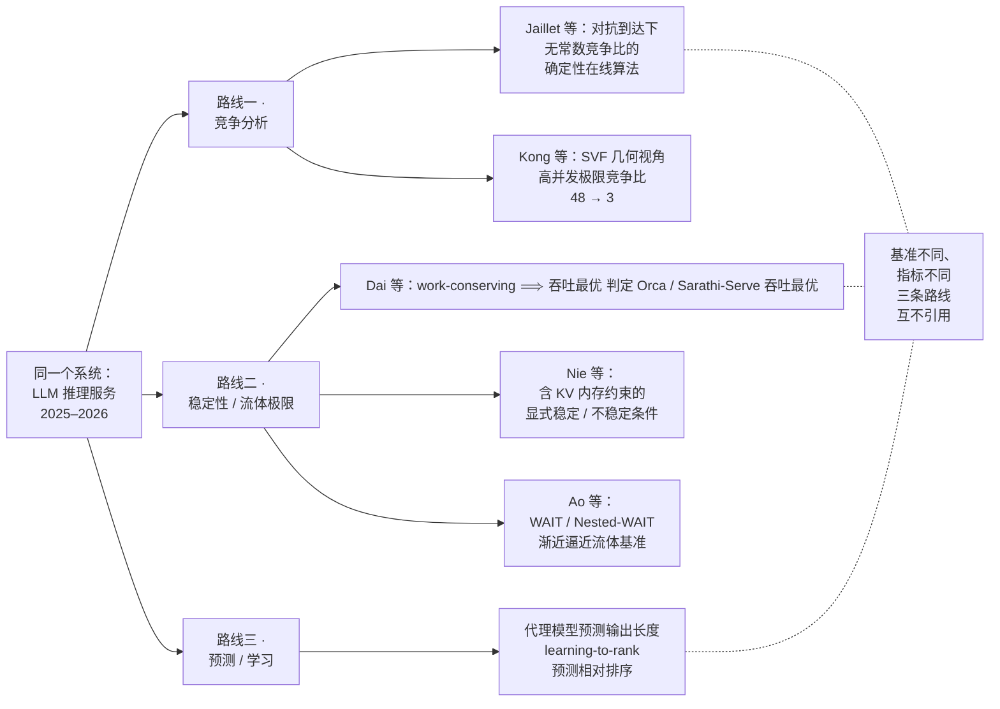

# 4 · 不确定性下的时序决策全景：四种「不知道」、四个理论

「我不知道未来」是资源分配论文里出现频率最高的一句话，也是最不像数学的一句话。它不是命题——命题有真值，而这句话连论域都没有交代。要把它变成数学，必须先回答一个前置问题：**这个「不知道」，究竟是哪一种不知道？**

答案不止一个。至少有四种严格化方式，每一种都自洽、都能长出一整套定理。麻烦在于，四套定理交付给你的是**四种互不通话的性能语言**：平均最优、队列稳定、regret、竞争比。它们不但数值不可比，连定义域都不重合。

[第 2 章](02-classical-foundations.md)的凸优化时代有一个从不写在纸上的前提：参数已知且静止。[第 3 章](03-nonconvex-era.md)松开了「凸」，没有松开「已知」。本章松开的正是「已知」二字——并且会发现，松开的方式不止一种，不同的松法通向互不相交的宇宙。

!!! note "本章预备知识"
    需要：概率论（条件期望）、拉格朗日乘子的"价格"读法。用到的内容：

    - 条件期望与塔性质：[预备篇 4.10](../part0/04-information-theory-basics.md#410-条件期望与高斯估计后文最常用的三件工具)；KL 散度：[预备篇 4.4](../part0/04-information-theory-basics.md#44-kl-散度用错模型的罚款单)。
    - 拉格朗日乘子与 Slater 条件：[预备篇 7.3](../part0/07-optimization-basics.md#73-拉格朗日对偶把约束变成价格)。
    - 多址接入与容量域：[预备篇 6.3](../part0/06-wireless-networks.md#63-多址接入谱系谁在什么时候用哪块资源)。
    - 多臂老虎机、UCB 与遗憾：[预备篇 8.1](../part0/08-reinforcement-learning.md#81-从一台老虎机说起探索还是利用)；马尔可夫决策过程：[预备篇 8.2](../part0/08-reinforcement-learning.md#82-马尔可夫决策过程序贯决策的语言)。
    - NUM 的价格解释与对偶分解：[第 2 章](02-classical-foundations.md)；非凸与 NP-hard：[第 3 章](03-nonconvex-era.md)。

## 一句「不知道未来」，四种严格化

「不知道」之所以能被严格化，是因为它其实总是**部分**的：你总归知道点什么。知道的那一点是什么，决定了你能写下哪种数学。

| 你实际拥有的知识 | 严格化的数学动作 | 生成的理论 | 交付的性能语言 |
|---|---|---|---|
| 知道随机过程的**分布**，不知道具体实现 | 期望算子 + 转移核 | 随机优化 / MDP | 长期平均代价最优值 $g^{\star}$ |
| 只知道过程**平稳**、均值落在容量域内部，分布未知 | 队列稳定性 | Lyapunov 漂移 | 稳定性 + $[O(1/V),O(V)]$ 折中 |
| 什么都不知道，且假设未来对你**最不利** | 对手模型 + 事后基准 | OCO / 竞争分析 | regret $R(T)$ / 竞争比 |
| 不知道，但每做一次决策能**看到一点反馈** | 探索–利用 | Bandit / RL | 相对最优臂的 regret |

```mermaid
---
config:
  flowchart:
    nodeSpacing: 30
---
flowchart TB
    Q["「我不知道未来」"]
    Q --> A1["① 知道分布"]
    Q --> A2["② 只知道<br/>平稳与均值"]
    Q --> A3["③ 假设对手最坏"]
    Q --> A4["④ 边做边学"]
    A1 --> T1["随机优化 / MDP"]
    A2 --> T2["Lyapunov<br/>drift-plus-penalty"]
    A3 --> T3["OCO / 竞争分析"]
    A4 --> T4["Bandit / RL"]
    T1 --> L1["语言：<br/>平均最优 $$g^{\star}$$"]
    T2 --> L2["语言：<br/>稳定 +<br/>$$1/V$$ 与 $$V$$ 折中"]
    T3 --> L3["语言：<br/>regret / 竞争比"]
    T4 --> L4["语言：<br/>探索代价 regret"]
    L1 -.- X["四种「最优」互不蕴含<br/>甚至没有共同定义域"]
    L2 -.- X
    L3 -.- X
    L4 -.- X
```

!!! warning "陷阱：这四行不是难度递进"

    最常见的误读是把这张表读成一条技术演化线：「MDP 太难，所以退到 Lyapunov；还不行就上 RL」。这是根本性的误导。

    第四行不是第一行的弱化版——bandit 的「最优臂」在 MDP 眼里根本不是一个合法策略（MDP 的策略要看状态）。第三行也不是第二行的保守版——Lyapunov 的基准「最优 $\omega$-only 随机策略」（只看当期随机状态、不看队列的随机化策略，见下文核心推导 Step 4）在对手模型下**根本不存在**。

    它们是**四种互不包含的世界观**，各自定义了什么叫「好」。跨框架问「哪个方法更好」，是一个定义不良的问题。

## 教学主线：同一个卸载问题，四种写法

抽象的分类学容易读过就忘。本节造一个足够小、又刚好够用的玩具问题，**四种写法一律落在同一组符号上**，让「同一个问题、四种最优、四种语言」这件事变得可以用眼睛看。

### 问题 P：边缘节点的能量–时延卸载调度

一个终端（手机 / IoT 节点）加一个边缘服务器。离散时隙 $t=0,1,2,\dots$，时隙长 $\tau$。

- **到达**：每时隙到达 $A(t)$ 比特待处理数据，进入本地缓冲队列 $Q(t)$。
- **信道**：设备到边缘服务器的信道功率增益 $h(t)$。记随机状态 $\omega(t)=(A(t),h(t))$。
- **动作** $a(t)=(D_{\mathrm{loc}}(t),\,D_{\mathrm{off}}(t))$：本地处理 $D_{\mathrm{loc}}$ 比特、卸载 $D_{\mathrm{off}}$ 比特。
- **队列动态**：

    $$
    Q(t+1)=\max\{Q(t)-D_{\mathrm{loc}}(t)-D_{\mathrm{off}}(t),\,0\}+A(t)
    $$

- **本地能耗**：DVFS 芯片的功率约正比于频率立方，$P=\kappa f^3$（$\kappa$ 为有效开关电容）。处理 $D_{\mathrm{loc}}$ 比特需 $C D_{\mathrm{loc}}$ 个 CPU 周期（$C$ 为每比特周期数），在 $\tau$ 秒内完成要求 $f=C D_{\mathrm{loc}}/\tau$，于是

    $$
    e_{\mathrm{loc}}(t)=\kappa f^3\tau=\kappa\Big(\frac{C D_{\mathrm{loc}}(t)}{\tau}\Big)^{3}\tau=\frac{\kappa C^3 D_{\mathrm{loc}}(t)^3}{\tau^2}
    $$

- **卸载能耗**：由香农式 $D_{\mathrm{off}}=\tau W\log_2(1+ph/N_0)$ 反解发射功率，再乘时长

    $$
    p(t)=\frac{N_0}{h(t)}\Big(2^{D_{\mathrm{off}}(t)/(\tau W)}-1\Big),\qquad e_{\mathrm{off}}(t)=\tau\, p(t)
    $$

- **目标**：最小化长期平均能耗 $\lim_{T\to\infty}\frac1T\sum_{t}\mathbb E[e_{\mathrm{loc}}(t)+e_{\mathrm{off}}(t)]$，同时保持队列稳定（等价于时延有界）。

!!! tip "直觉：三股力的拉扯"

    立方项 $D_{\mathrm{loc}}^3$ 让「慢慢算」省电——把同样的比特摊到更长时间，能耗按三次方下降；指数项 $2^{D_{\mathrm{off}}/(\tau W)}$ 让「等好信道再发」省电——同样的比特在坏信道上要贵指数倍；而队列稳定性不许你无限期地等。

    **队列就是「现在做 vs 以后做」的耦合器**，也是「时序」二字在这个问题里的全部含义。没有队列，每个时隙就解耦成一个独立的静态问题，本章讨论的四种「不知道」都无从谈起。

### 写法 A · 知道分布 → 平均代价 MDP

假设 $\{A(t)\},\{h(t)\}$ 的联合分布已知（i.i.d. 或有限状态马氏）。取状态 $s=(Q,h)$、单步代价 $c(s,a)=e_{\mathrm{loc}}+e_{\mathrm{off}}$，长期平均最优性由平均代价 Bellman 方程刻画：

$$
g+\theta(s)=\min_{a}\Big\{c(s,a)+\sum_{s'}P(s'\mid s,a)\,\theta(s')\Big\}
$$

其中 $g$ 为最优平均代价，$\theta(\cdot)$ 为相对价值函数（bias，此处避开符号 $V$ 与 $h$ 以免与后文冲突）。

**物理意义。** $g$ 是每时隙必须缴的「租金」，$\theta(s)$ 是「处在状态 $s$ 相对平均水平的额外亏欠」。方程说：在每个状态下把**当下代价**与**这一步把系统推到哪里的未来亏欠**加起来最小化，扣掉租金后自洽。它是折扣 Bellman 方程在「不打折、只关心平均」下的版本。

**行为分析。** 解出的策略在这类问题上呈**阈值结构**：给定信道 $h$，存在队列门限 $Q_{\mathrm{th}}(h)$，超过才卸载，且卸载量随 $Q$ 单调增；等价地，队列越长，可接受的信道门限越低——队列长了就「不挑食」。这与工程直觉完全一致，也正是结构化策略值得追求的原因：它把一张表压缩成一条曲线。但代价立刻出现：把 $Q$ 量化成 100 级、$h$ 量化成 20 级，单节点状态空间是 2000，尚可；十个用户共享一个基站、状态需联合刻画时是 $2000^{10}\approx 1.0\times10^{33}$。**维度诅咒不是「慢」，是这张表根本不存在。**

**它藏起了什么。** 分布从哪来（估计误差、非平稳漂移如何传导到性能，MDP 理论基本不管）；只管平均，暂态与尾部无保证；解出的 $\theta(\cdot)$ 不可解释，换一个分布即全部作废。

### 写法 B · 只要均值稳定 → drift-plus-penalty

信息假设降到最低：只需 $\{\omega(t)\}$ 平稳遍历，且 $\mathbb E[A]$ 落在容量域**内部**（存在 Slater 余量 $\varepsilon>0$）。

这里有三个新词。**平稳遍历**（stationary ergodic）：统计规律不随时间变，且一条足够长的样本路径上的时间平均等于期望，例如 $h(t)$ 的长期平均就等于 $\mathbb E[h]$。**容量域**：所有能被某个调度策略稳定住的平均到达率的集合，思路与[预备篇 6.3](../part0/06-wireless-networks.md) 的 MAC 容量域相同，只是把「可靠传输的速率」换成「不让队列爆掉的到达率」。**Slater 余量** $\varepsilon$：到达率离容量域边界还留多少空，即存在某个策略，每时隙平均比到达多服务 $\varepsilon$；名字来自[预备篇 7.3](../part0/07-optimization-basics.md) 的 Slater 条件（可行域「有厚度」）。

**不需要分布。** 每时隙观测 $(Q(t),h(t))$，解一个确定性问题：

$$
\min_{D_{\mathrm{loc}},D_{\mathrm{off}}\ge 0}\ \Big\{ V\big[e_{\mathrm{loc}}(D_{\mathrm{loc}})+e_{\mathrm{off}}(D_{\mathrm{off}};h(t))\big]-Q(t)\big(D_{\mathrm{loc}}+D_{\mathrm{off}}\big)\Big\}
$$

约束为 $D_{\mathrm{loc}}+D_{\mathrm{off}}\le Q(t)$ 及频率、功率上限。目标可分离，两个变量各自令边际成本等于边际收益即可。

**本地侧。** 对 $D_{\mathrm{loc}}$ 求导置零：

$$
\begin{aligned}
V\cdot\frac{\partial e_{\mathrm{loc}}}{\partial D_{\mathrm{loc}}}&=\frac{3V\kappa C^3 D_{\mathrm{loc}}^2}{\tau^2}=Q(t)\\
\Longrightarrow\quad D_{\mathrm{loc}}^{\star}(t)&=\tau\sqrt{\frac{Q(t)}{3V\kappa C^3}}\quad(\text{再削顶到频率上限})
\end{aligned}
$$

**卸载侧。** 对 $D_{\mathrm{off}}$ 求导置零：

$$
\begin{aligned}
V\cdot\frac{\partial e_{\mathrm{off}}}{\partial D_{\mathrm{off}}}&=V\cdot\frac{N_0\ln 2}{W h(t)}\,2^{D_{\mathrm{off}}/(\tau W)}=Q(t)\\
\Longrightarrow\quad 2^{D_{\mathrm{off}}^{\star}/(\tau W)}&=\frac{Q(t)\,W\,h(t)}{V N_0\ln 2}\\
\Longrightarrow\quad D_{\mathrm{off}}^{\star}(t)&=\tau W\Big[\log_2\frac{Q(t)\,W\,h(t)}{V N_0\ln 2}\Big]^{+}
\end{aligned}
$$

!!! success "关键结论：每时隙子问题就是注水，水位是 $Q(t)/V$"

    把 $D_{\mathrm{off}}^{\star}$ 代回功率表达式，指数项被整个消掉：

    $$
    p^{\star}(t)=\frac{N_0}{h(t)}\Big(\frac{Q(t)Wh(t)}{VN_0\ln 2}-1\Big)=\Big[\underbrace{\frac{W}{\ln 2}\cdot\frac{Q(t)}{V}}_{\text{水位}}-\frac{N_0}{h(t)}\Big]^{+}
    $$

    这是**一字不差的注水解**：水位减去「噪声与信道之比」，取正部。唯一的新意是——**水位不再由功率预算的对偶变量给出，而由队列长度 $Q(t)/V$ 给出**。

    量纲可以验证这个读法。目标里 $V\cdot e$ 与 $Q\cdot D$ 要能相加，故 $[V]=\text{bit}^2/\text{J}$，于是 $Q/V$ 的量纲是**焦耳每比特**——它就是算法在本时隙**愿意为一个比特出的价**。再乘 $W/\ln 2$（比特每秒）得到瓦特，正是水位该有的量纲。

    这条线索把本章接回[第 2 章](02-classical-foundations.md)：**注水没有消失，它只是把水位交给了队列。** 静态凸优化里水位是全局对偶变量，需要先知道所有参数；这里水位是本地状态，边跑边有。

**行为分析。** 三个参数各管一件事。信道好（$h$ 大）则 $N_0/h$ 小，水面之上的部分多，多发——**机会主义**。队列长（$Q$ 大）则水位高，多发——**紧迫性**。$V$ 大则水位低，少发、多攒——**耐心**。$Q(t)\,W\,h(t)<VN_0\ln 2$ 时 $D_{\mathrm{off}}^{\star}=0$，本时隙**完全不发**，等下一个机会。这就是阈值策略从一阶条件里自己长出来的样子，不需要任何分布知识。

**它藏起了什么。** 只保证时间平均，对暂态、尾部、单任务时延分布一无所知；$V$ 的选取需要知道 $\varepsilon$ 这类系统余量参数；队列界的常数含 $1/\varepsilon$，系统逼近满载时界爆炸；**它不学习**——跑一百万个时隙，它对分布的知识仍然是零。

### 写法 C · 知道对手最坏 → OCO 与竞争分析

假设 $A(t),h(t)$ 由对手选择，可任意非平稳。这条路有两个化身。

**化身 C1（OCO）.** **在线凸优化**（Online Convex Optimization, OCO）是一场重复进行的游戏：第 $t$ 轮先从凸集 $F$ 里选 $x_t$，然后环境（最坏情形下是对手）才揭示凸损失 $c_t(\cdot)$，你付 $c_t(x_t)$。放到问题 P 里：把决策连续化为 $x_t\in F$（例如卸载比例、功率分配向量），损失 $c_t(\cdot)$ **在决策做出之后**才揭示（信道预测失败、任务大小事后才知），即时隙开始时定下卸载比例，时隙结束才知道「卸载比例 → 能耗」这条曲线。最简单的算法是在线梯度下降：沿本轮损失的梯度走一步，出界就用投影 $P_F$ 拉回 $F$ 中最近的点（$F=[0,1]$ 时 $P_F(1.2)=1$），$\eta_t$ 是步长：

$$
x_{t+1}=P_F\big(x_t-\eta_t\nabla c_t(x_t)\big)
$$

!!! abstract "定理（Zinkevich 在线梯度下降）【已解决】"

    记 $\|F\|=\max_{x,y\in F}d(x,y)$ 为可行集直径，$\|\nabla c\|=\max_{x\in F,t}\|\nabla c_t(x)\|$ 为梯度范数上界，static regret 定义为

    $$
    R(T)=\sum_{t=1}^{T}c_t(x_t)-\min_{x\in F}\sum_{t=1}^{T}c_t(x)
    $$

    取步长 $\eta_t=t^{-1/2}$，则

    $$
    R(T)\ \le\ \frac{\|F\|^2\sqrt T}{2}+\Big(\sqrt T-\frac12\Big)\|\nabla c\|^2
    $$

    因而 $\limsup_{T\to\infty}R(T)/T\le 0$。出处：Zinkevich, ICML 2003 [7]。强凸损失下可达 $O(\log T)$ [9]；一般凸情形的 $\Omega(\sqrt T)$ 极小极大下界见 Abernethy 等 2008 年的技术报告（UC Berkeley UCB/EECS-2008-19）：其定理 4.2 算出，可行集取直径 $D$ 的球、对手出梯度范数不超过 $G$ 的线性损失时，极小极大后悔恰为 $\frac{DG}{2}\sqrt T$，线性损失也是凸损失，故 $\sqrt T$ 阶不能再改进。系统性处理见 Hazan 的教材 [8]。

**物理意义。** regret 度量「事后后悔」：与**最优的单一固定动作**相比，我一共多花了多少。$\sqrt T$ 意味着平均每轮后悔趋于零——学得再慢也终究学会，且不需要任何统计假设。

一个 4 时隙的小账本。设全卸载的能耗依次为 1、1、5、1（第 3 隙信道突然变差），全本地恒为 3，卸载比例为 $x$ 时按比例混合：$c_t(x)=a_tx+b_t(1-x)$。始终取 $x=0.5$ 的算法共花 $2+2+4+2=10$；事后看最好的固定动作是全卸载，共花 $1+1+5+1=8$（全本地要 12），于是 $R(4)=10-8=2$。

**行为分析。** 代入问题 P：卸载比例 $x\in[0,1]$ 故 $\|F\|=1$，代价按能耗归一化后取 $\|\nabla c\|\approx 1$，$T=10^4$ 个时隙（10 ms 一隙即 100 秒）时

$$
R(T)\le \frac{100}{2}+\Big(100-\frac12\Big)=149.5,\qquad \frac{R(T)}{T}\approx 1.5\%
$$

听起来极好——**但基准是「最优固定卸载比例」**。在相干时间几十毫秒的移动场景里，最优固定比例本身可能比真正的最优时变策略差好几个数量级。**regret 小不等于做得好，只等于不比一个可能很弱的基准差太多。** 这是 static regret 藏起来的东西，也是它与 dynamic regret 必须严格区分的原因：**dynamic regret** 把基准换成每一轮各自的最优动作，$\sum_tc_t(x_t)-\sum_t\min_{x\in F}c_t(x)$。上面的小账本里，逐隙最优是第 3 隙改本地、其余全卸载，共花 $1+1+3+1=6$，dynamic regret 为 $10-6=4$，是 static regret 的两倍。把 $O(\sqrt T)$ 说成「追上了最优策略」是文献里常见的错误。OCO 进入无线资源分配的代表工作见 Chen–Ling–Giannakis 的主动资源分配框架 [14]。

**化身 C2（竞争分析）.** 把卸载决策还原成 **rent-or-buy**：按次付费把任务卸载到边缘（每次付 1 单位「租金」，即空口能量），或一次性付 $b$ 单位买断（本地加速器 / 边缘算力长期合约）。任务流长度未知——这就是**滑雪租板 (ski rental)**。

**竞争比**（competitive ratio）比的是倍数而不是差：在线算法 ALG 只能看到已经发生的输入，离线最优 OPT 事后看到整条输入序列 $\sigma$。若对**每一个** $\sigma$ 都有 $\mathrm{ALG}(\sigma)\le c\cdot\mathrm{OPT}(\sigma)$，就说 ALG 是 $c$-竞争的，能做到的最小 $c$ 就是竞争比。它与 regret 的区别在基准：regret 跟一个固定动作比，竞争比跟可以随输入任意变化的离线最优比。下面 $\mathrm{OPT}=\min\{x,b\}$ 的来历：事后知道总天数 $x$，若 $x<b$ 就一直租，花 $x$；否则第一天就买，花 $b$。

!!! abstract "定理（Ski rental 的三个数字）【已解决】"

    离线最优为 $\mathrm{OPT}=\min\{x,b\}$（$x$ 为实际使用天数）。

    - **确定性 break-even**：先租 $b-1$ 天，第 $b$ 天买。则 $\mathrm{ALG}\le 2\cdot\mathrm{OPT}$，即 **2-竞争**；且不存在优于 2 的确定性算法。
    - **随机化**：最优竞争比为 $e/(e-1)\approx 1.582$，且这是最优的。出处：Karlin–Manasse–McGeoch–Owicki, Algorithmica 1994（会议版 SODA 1990）[10]。
    - 按整天计费、买断价 $b$ 为整数时，确定性竞争比恰为 $2-1/b$：break-even 算法达到它（证明见下段），且对任何确定性算法，对手让需求恰好持续到它买断的那一天，比值都不低于 $2-1/b$，所以这是紧界。

**物理意义与行为分析。** 确定性 2-竞争的证明只有一行：最坏情况是「你刚买完，需求就消失」，此时花了 $(b-1)+b=2b-1$，而事后诸葛亮只需 $b$，比值 $2-1/b<2$。策略的全部智慧在于**把「何时切换」顶到临界点**——早买怕白买，晚买怕白租。取 $b=10$ 得 1.9，$b=20$ 得 1.95：$b$ 越大越逼近 2。

注意竞争比 $2$ 与 $b$ 几乎无关，也与需求分布**完全**无关——这是竞争分析的卖点，也是它的病灶。若真实需求高度可预测，2-竞争保证承诺的是一个你永远用不到的最坏情况；随机化把 2 降到 1.582（降幅 21%），代价是保证从「每次」变成「平均意义上」。

**它藏起了什么。** static regret 的基准是最好的固定动作，信道剧变时基准本身很弱；竞争比是最坏情况，对典型信道毫无指导；完全不利用统计规律（信道十年不变它也照样按最坏 hedge）；约束满足通常只能保证「长期违反量 $o(T)$」，即允许瞬时违规。

### 写法 D · 边做边学 → bandit

既不知道分布，也不设对手，但能从反馈中学。关键限制：**只观测到所选动作的结果**（bandit feedback）。在问题 P 中设 $K$ 个候选执行目标（本地、边缘服务器 $1,\dots,K-1$），每个的「每比特代价」分布未知且只在选中时才观测。UCB1 每轮选

$$
\arg\max_j\ \Big\{\bar x_j+\sqrt{\frac{2\ln n}{n_j}}\Big\}
$$

其中 $n$ 为总轮数、$n_j$ 为臂 $j$ 已被拉次数，$\bar x_j$ 为臂 $j$ 至今的平均**奖励**。UCB 按奖励取 $\arg\max$，所以代价要先换成奖励，例如奖励 $=1-$ 归一化每比特代价；直接把平均代价放进去，选中的会是最贵的目标。根号项是给「拉得少的臂」发的不确定性奖金，直觉与算例见[预备篇 8.1](../part0/08-reinforcement-learning.md)。

!!! abstract "定理（Lai–Robbins 下界 与 UCB1 上界）【已解决】"

    **下界**：对任意「一致的」分配规则、任意次优臂 $j$，渐近地

    $$
    \mathbb E[T_j(n)]\ \ge\ \frac{\ln n}{D(p_j\,\|\,p^{\star})}
    $$

    其中 $T_j(n)$ 是前 $n$ 轮里臂 $j$ 被拉的次数（即正文的 $n_j$），$D(p_j\|p^{\star})$ 是次优臂与最优臂奖励密度之间的 KL 散度（[预备篇 4.4](../part0/04-information-theory-basics.md)）。「一致」(consistent) 用来排除「押中一个臂就死守」这类只在部分实例上表现好的规则：要求对任意 $a>0$、在所有实例上 regret 都是 $o(n^a)$。出处：Lai–Robbins, Adv. Appl. Math. 1985 [12]。

    **上界（UCB1）**：对所有 $K>1$、奖励支撑在 $[0,1]$ 的任意 $K$ 台机器，任意 $n$ 轮后期望 regret 至多为

    $$
    8\sum_{i:\,\mu_i<\mu^{\star}}\frac{\ln n}{\Delta_i}+\Big(1+\frac{\pi^2}{3}\Big)\sum_{j=1}^{K}\Delta_j,\qquad \Delta_i:=\mu^{\star}-\mu_i
    $$

    中间结论：$\mathbb E[T_j(n)]\le 8\ln n/\Delta_j^2+(1+\pi^2/3)$。上界由它一步得到：每拉一次次优臂 $j$ 期望少拿 $\Delta_j$，故 regret $=\sum_j\Delta_j\,\mathbb E[T_j(n)]$；把中间结论乘以 $\Delta_j$ 再求和，$\Delta_j\cdot 8\ln n/\Delta_j^2=8\ln n/\Delta_j$，常数项变成 $(1+\pi^2/3)\Delta_j$（最优臂 $\Delta=0$，不影响求和）。出处：Auer–Cesa-Bianchi–Fischer, Machine Learning 2002 [13]。

**物理意义。** 下界的分母是 KL 散度——**两个臂有多难分辨**。这是本章唯一一条把**信息量直接写进性能界**的定理：性能极限不由算力决定，由「区分两个假设需要多少样本」决定。这个形状与信息论的味道完全一致，也是[第 5 章](05-price-of-prediction.md)统一纲领最直接的先例。

**行为分析（一个让人清醒的数字）。** $\Delta_i$ 出现在**分母**：两个方案越接近，越难分辨，探索代价越大。设 8 个卸载模式、代价归一化到 $[0,1]$、次优间隙 $\Delta_i=0.05$（两个模式能耗只差 5%），则 $n=10^4$ 时

$$
\frac{8\ln n}{\Delta_i^2}=\frac{8\times 9.21}{0.0025}\approx 2.9\times 10^{4}\ >\ n
$$

**界比时间跨度本身还大**——在一万个时隙（100 秒）的尺度上，UCB1 根本来不及分辨两个相差 5% 的模式，那个漂亮的对数最优性是 $n\to\infty$ 的承诺，而无线信道统计活不到那个时候。而「两个方案差不多好」在无线里恰恰是常态，这是 bandit 方法在通信中落地困难的根本原因之一。

**它藏起了什么。** 需要平稳性与可重复实验；**探索是有物理代价的**——在有队列的系统里，探索一个坏臂会让队列涨、甚至直接失稳。这是 bandit 与 Lyapunov 最尖锐的冲突点（见本章结尾与开放问题）。至于深度 RL 版本，连 regret 界都没有。

### 同一个观测，四种决策，四种保证

```mermaid
flowchart LR
    IN["同一时隙的同一观测<br/>$$Q(t) = 3$$ Mbit, $$h(t)$$ 良好"]
    IN --> M1["A · MDP：查表<br/>表需离线解 Bellman 方程"]
    IN --> M2["B · Lyapunov：现场解<br/>水位 = $$Q(t)/V$$ 的注水"]
    IN --> M3["C · OCO：投影梯度一步<br/>只用上一轮梯度"]
    IN --> M4["D · Bandit：选 UCB 指数最大者"]
    M1 --> G1["保证：平均代价达 $$g^{\star}$$<br/>前提是分布真已知"]
    M2 --> G2["保证：能耗 $$\le p^{\star} + B/V$$<br/>平均队列 = $$O(V)$$"]
    M3 --> G3["保证：相对最优固定动作<br/>regret = $$O(\sqrt T)$$"]
    M4 --> G4["保证：相对最优臂<br/>regret = $$O(\ln n)$$"]
```

## 核心推导：drift-plus-penalty 的五步骨架

四种写法里，第二种最值得完整推一遍——因为它是唯一一个**在不知道分布的前提下仍给出可证明性能界**的框架，而它的全部秘密压缩在五个步骤里。很多教程把最关键的第三、四步含糊带过，这里不跳步。

一般设定：i.i.d. 随机状态 $\omega(t)$；动作 $\alpha(t)\in\mathcal A_{\omega(t)}$；惩罚 $p(t)=P(\alpha(t),\omega(t))$；属性 $y_i(t)=Y_i(\alpha(t),\omega(t))$，$i=1,\dots,K$，需满足时间平均约束 $\bar y_i\le 0$（$\bar y_i$ 是 $y_i(t)$ 的长期时间平均）。记号提醒：从这里起 $p(t)$ 表示一般的「惩罚」，在问题 P 里就是能耗 $e_{\mathrm{loc}}+e_{\mathrm{off}}$，不再是问题 P 卸载能耗式里的发射功率 $p(t)$；$p^{\star}$ 是最优平均惩罚，也不是注水框里的最优发射功率 $p^{\star}(t)$；$K$ 是约束（队列）个数，不是写法 D 的臂数；下文的漂移 $\Delta(t)$ 也与 bandit 的间隙 $\Delta_i$ 无关。约束通过**虚拟队列**吸收：

$$
Z_i(t+1)=\max[Z_i(t)+y_i(t),\,0]
$$

真实数据队列（如 $Q(t)$）是它的特例（问题 P 的到达加在 $\max$ 之外，形式略异，但同样有 $Q(t+1)^2\le Q(t)^2+A^2+D^2+2Q(t)(A-D)$，$D=D_{\mathrm{loc}}+D_{\mathrm{off}}$，下面的推导照用）。这一步是整个框架的**翻译器**：翻译完成后，优化问题的约束与真实排队被一视同仁，后面只认「队列」这一种对象。

**虚拟队列是一本会涨会落的欠账。** $y_i(t)>0$ 表示本时隙超支，欠账加 $y_i(t)$；$y_i(t)<0$ 表示有结余，拿去还账，还清为止（$\max[\cdot,0]$ 不让账户变成存款）。例如要求平均发射功率不超过 1 W，取 $y(t)=$ 本时隙发射功率（W）$-\,1$：连续三个时隙发 1.5、1.5、0.2 W，欠账依次是 0.5、1.0、0.2，恰好等于这三隙的累计超支。欠账为什么能代表约束：由 $Z_i(t+1)\ge Z_i(t)+y_i(t)$ 累加得 $\sum_{t<T}y_i(t)\le Z_i(T)-Z_i(0)$；只要欠账不无限增长（队列稳定），$Z_i(T)/T\to0$，除以 $T$ 就得到 $\bar y_i\le0$。欠账越多，Step 3 里 $Z_i(t)\,Y_i$ 这一项罚得越重，算法自然会去还账。

**Step 1 · Lyapunov 函数。**

$$
L(t)=\frac12\sum_{i=1}^{K}Z_i(t)^2,\qquad \Delta(t)=\mathbb E\big[L(t+1)-L(t)\ \big|\ Z(t)\big]
$$

$L(t)$ 叫 **Lyapunov 函数**，可以看成全部队列的「总积压能量」：只要有一个队列很长，$L$ 就很大。$\Delta(t)$ 叫**漂移**（drift），是给定当前积压时 $L$ 下一步的期望变化量。积压大时漂移为负，积压就会被拉回来，这是判断「队列稳定」的操作性手段。二次式的唯一作用是让 $\max[\cdot,0]$ 的平方可以被干净地放缩。

**Step 2 · 条件漂移界。** 关键不等式是初等的：对任意 $q\ge 0$ 与任意实数 $y$，

$$
\big(\max[q+y,0]\big)^2\le q^2+y^2+2qy
$$

（$q+y\ge0$ 时两边相等；$q+y<0$ 时左边为 0 而右边 $=(q+y)^2\ge0$。）由它到下式分四小步。

① **代入队列更新。** 取 $q=Z_i(t)$、$y=y_i(t)$，得 $Z_i(t+1)^2\le Z_i(t)^2+y_i(t)^2+2Z_i(t)\,y_i(t)$。

② **除以 2、对 $i$ 求和。** 两边的 $\frac12\sum_iZ_i^2$ 正是 $L(t+1)$ 与 $L(t)$，于是

$$
L(t+1)-L(t)\ \le\ \frac12\sum_{i=1}^{K}y_i(t)^2+\sum_{i=1}^{K}Z_i(t)\,y_i(t)
$$

③ **取以 $Z(t)=(Z_1(t),\dots,Z_K(t))$ 为条件的期望。** 左边按定义变成 $\Delta(t)$；给定 $Z(t)$ 时 $Z_i(t)$ 是已知常数，可以提到期望外面，$\mathbb E[Z_i(t)y_i(t)\mid Z(t)]=Z_i(t)\,\mathbb E[y_i(t)\mid Z(t)]$（[预备篇 4.10](../part0/04-information-theory-basics.md)「已知量可以提出」）；第一项 $\frac12\sum_i\mathbb E[y_i(t)^2\mid Z(t)]$ 用常数 $B$ 封顶（$|y_i|\le y_{\max}$ 时对任何 $Z(t)$ 都不超过 $Ky_{\max}^2/2$）。

④ **两边加上 $V\,\mathbb E[p(t)\mid Z(t)]$**，并把 $p(t)$、$y_i(t)$ 写回 $P(\alpha(t),\omega(t))$、$Y_i(\alpha(t),\omega(t))$：

$$
\Delta(t)+V\,\mathbb E[p(t)\mid Z(t)]\ \le\ B+V\,\mathbb E\big[P(\alpha(t),\omega(t))\mid Z(t)\big]+\sum_{i=1}^{K}Z_i(t)\,\mathbb E\big[Y_i(\alpha(t),\omega(t))\mid Z(t)\big]
$$

其中 $B$ 要对一切时隙、一切积压状态都成立：$B\ge\frac12\sum_i\mathbb E[y_i(t)^2\mid Z(t)]$（条件期望，因为上面的漂移界本身以 $Z(t)$ 为条件）；若 $|y_i|\le y_{\max}$ 则可取 $B=K y_{\max}^2/2$。

!!! note "不等式的方向是全证明的命脉"

    我们主动放弃精确刻画漂移，只要一个**上界**。理由很实际：上界可以被最小化，精确值不可以。$B$ 有限，就是「二阶矩有界」这条假设的全部内容。

**Step 3 · 算法 = 逐时隙最小化右端可控部分。** 每时隙观测 $\omega(t)$ 与 $Z(t)$，选

$$
\alpha(t)=\arg\min_{\alpha\in\mathcal A_{\omega(t)}}\Big\{V\cdot P(\alpha,\omega(t))+\sum_{i=1}^{K}Z_i(t)\,Y_i(\alpha,\omega(t))\Big\}
$$

!!! tip "直觉：机会性地最小化一个期望"

    这是一个**每时隙确定性优化**——不含期望、不含未来、不含转移核。上一节问题 P 里那个注水解，就是它的一个闭式实例。

    这一步的思想叫 opportunistically minimizing an expectation：我们本想最小化「对分布取期望后的目标」，但不知道分布；于是退而求其次，**逐样本**最小化一个被当期 $\omega(t)$ 参数化的函数。定理将保证这样做的时间平均会自动逼近「先取期望再最小化」的最优值。

    **这就是「分布免疫」的全部来源，也是它与 MDP 最本质的分野**：MDP 把不确定性消化在**离线求解**里（需要转移核），Lyapunov 把不确定性消化在**在线采样**里（需要的只是「样本会自己来」）。

**Step 4 · 与 $\omega$-only 策略比较。** 所谓 $\omega$-only 策略，是只看当期 $\omega(t)$、不看队列的（可随机化）策略。这一步是整个框架的合法性所在，两个细节不能跳：

**细节 1 · 为什么"逐点最小"能升级成"条件期望最小"。** 记 $g(a,\omega):=V\,P(a,\omega)+\sum_{i}Z_i(t)\,Y_i(a,\omega)$ 为 Step 3 括号内的量（临时记号，与写法 A 的平均代价 $g$ 无关）。算法在每个时隙对观测到的 $\omega(t)$ 逐点最小化括号内的量，故对任意以 $\omega(t)$ 为输入的（可随机化）决策规则 $\pi$，每一次实现都有 $g(a^{\mathrm{alg}}(t),\omega(t))\le g(a^{\pi}(t),\omega(t))$；条件期望保持不等号方向，于是

$$
\mathbb{E}\big[\,g\big(a^{\mathrm{alg}}(t),\omega(t)\big)\;\big|\;Z(t)\,\big] \;\le\; \mathbb{E}\big[\,g\big(a^{\pi}(t),\omega(t)\big)\;\big|\;Z(t)\,\big].
$$

这一步只用到"逐点 $\le$"，不需要分布。**$\omega(t)$ 与 $Z(t)$ 独立**用在下一步，即把右端算成具体的数：$Z(t)$ 只由 $\omega(0),\dots,\omega(t-1)$ 与过去的动作决定，而 $\omega(t)$ i.i.d.，故二者独立；$\omega$-only 的 $\pi$ 又不看队列，于是 $\mathbb E[P(a^{\pi},\omega)\mid Z(t)]=\mathbb E[P(a^{\pi},\omega)]$、$\mathbb E[Y_i(a^{\pi},\omega)\mid Z(t)]=\mathbb E[Y_i(a^{\pi},\omega)]$，都是与队列无关的常数。这里**第一次真正用到 i.i.d. 假设**（前文只把它当作"$B$ 有限"的来源）：若两者相关（例如信道有记忆），给定队列长度时 $\omega(t)$ 的条件分布会随队列状态漂移，右端就不再是下面要代入的那些常数。

**细节 2 · 近最优 $\omega$-only 策略为什么存在。** 后面要代入的 $p^\star$ 被定义为"最优 $\omega$-only 随机策略"的性能，它的存在性（以及它等于原随机问题的最优值）不是平凡的——需要容量域的凸性与 Carathéodory 型论证（Carathéodory 定理：$d$ 维凸包里的任一点都能写成至多 $d+1$ 个点的凸组合；在这里，它保证「按固定概率在有限几个确定性规则之间抽签」的 $\omega$-only 策略就够用）：任何策略的长期平均性能都落在 $\omega$-only 随机策略所张成的凸包内，故存在 $\omega$-only 策略逼近之。**这正是下文"三个必须写下来的陷阱"中陷阱一要说的那件事：$p^\star$ 是知道分布才能算出来的量**，框架声称不需要分布，却在证明的这一步偷偷用了它。

于是可以把任何 $\omega$-only 策略代进右端，不等号仍成立。代入两类比较策略：

- **(a) 近最优 $\omega$-only 策略**：$\mathbb E[P]\to p^{\star}$，$\mathbb E[Y_i]\to 0$。精确地说，对任意 $\delta>0$ 有 $\omega$-only 策略使 $\mathbb E[P]\le p^{\star}+\delta$、$\mathbb E[Y_i]\le\delta$，代入右端得 $B+V(p^{\star}+\delta)+\delta\sum_iZ_i(t)$；$Z(t)$ 固定而 $\delta$ 可任意小，令 $\delta\to0$，得

    $$
    \Delta(t)+V\,\mathbb E[p(t)\mid Z(t)]\ \le\ B+V p^{\star}
    $$

- **(b) Slater 策略 $\alpha^{\varepsilon}$**：$\mathbb E[Y_i]\le-\varepsilon\ \forall i$，$\mathbb E[P]=p^{\varepsilon}$，得

    $$
    \Delta(t)+V\,\mathbb E[p(t)\mid Z(t)]\ \le\ B+V p^{\varepsilon}-\varepsilon\sum_{i=1}^{K}Z_i(t)
    $$

**Step 5 · Telescoping。** 这一步把每个时隙的条件不等式累加成 $T$ 个时隙的平均，分三小步。

① **取全期望。** 对 (a) 式两边取期望。由塔性质 $\mathbb E\big[\mathbb E[X\mid Z(t)]\big]=\mathbb E[X]$（[预备篇 4.10](../part0/04-information-theory-basics.md)），$\Delta(t)$ 变成 $\mathbb E[L(t+1)]-\mathbb E[L(t)]$，$\mathbb E[p(t)\mid Z(t)]$ 变成 $\mathbb E[p(t)]$。

② **对 $t=0,\dots,T-1$ 求和。** 漂移项相邻两项一正一负逐个抵消（望远镜相消），只剩首尾：$\sum_{t=0}^{T-1}\big(\mathbb E[L(t+1)]-\mathbb E[L(t)]\big)=\mathbb E[L(T)]-\mathbb E[L(0)]\ge-\mathbb E[L(0)]$。于是

$$
\mathbb E[L(T)]-\mathbb E[L(0)]+V\sum_{t=0}^{T-1}\mathbb E[p(t)]\ \le\ BT+VTp^{\star}
$$

③ **丢项、移项、相除。** $L$ 是平方和，$\mathbb E[L(T)]\ge0$，从左端丢掉这个非负项，不等号仍成立；再把 $\mathbb E[L(0)]$ 移到右边，除以 $VT$：

$$
\frac1T\sum_{t=0}^{T-1}\mathbb E[p(t)]\ \le\ p^{\star}+\frac{B}{V}+\frac{\mathbb E[L(0)]}{VT}\ \xrightarrow[T\to\infty]{}\ p^{\star}+\frac{B}{V}
$$

由 (b) 走同样的 ①②，右端变为 $BT+VTp^{\varepsilon}-\varepsilon\sum_{t}\sum_{i}\mathbb E[Z_i(t)]$。这次把最后一项移到左边，同样丢掉 $\mathbb E[L(T)]$，并用 $\mathbb E[p(t)]\ge p_{\min}$ 把左端的 $V\sum_t\mathbb E[p(t)]$ 换成更小的 $VTp_{\min}$ 后移到右边：

$$
\varepsilon\sum_{t=0}^{T-1}\sum_{i=1}^{K}\mathbb E[Z_i(t)]\ \le\ BT+VT\,(p^{\varepsilon}-p_{\min})+\mathbb E[L(0)]
$$

除以 $\varepsilon T$，令 $T\to\infty$（$\mathbb E[L(0)]/(\varepsilon T)\to0$）：

$$
\limsup_{T\to\infty}\frac1T\sum_{t=0}^{T-1}\sum_{i=1}^{K}\mathbb E[Z_i(t)]\ \le\ \frac{B+V\,(p^{\varepsilon}-p_{\min})}{\varepsilon}
$$

!!! abstract "定理（drift-plus-penalty 的 $[O(1/V),O(V)]$ 折中）【已解决】"

    在 (i) $\omega(t)$ i.i.d.（遍历或马尔可夫情形也有同类结论，但要改用 $T$ 步漂移，常数随之改变；下面的证明只针对 i.i.d.）、(ii) 二阶矩有界给出常数 $B$、(iii) Slater 余量 $\varepsilon>0$ 三条假设下，上述算法满足

    $$
    \limsup_{T\to\infty}\frac1T\sum_{t}\mathbb E[p(t)]\le p^{\star}+\frac{B}{V},\qquad
    \limsup_{T\to\infty}\frac1T\sum_{t}\sum_i\mathbb E[Z_i(t)]\le\frac{B+V(p^{\varepsilon}-p_{\min})}{\varepsilon}
    $$

    即惩罚离最优 $O(1/V)$、平均积压 $O(V)$；**对真实数据队列**而言，由 Little 定律，平均时延亦为 $O(V)$。出处：Neely 专著 [1]（本站不标具体定理编号）。

    （**Little 定律**：稳态下平均积压 = 平均到达率 × 平均逗留时间，$\bar Q=\lambda\bar W$，所以平均时延 $\bar W=\bar Q/\lambda$；下面算例的「Little 时延」一列就是积压上界除以 $\lambda$，那里只有一条真实数据队列。这个限定不是学究气：$O(V)$ 的界是对 $\sum_i\mathbb{E}[Z_i]$ 成立的，而 $Z$ 里通常还混着**虚拟队列**——它们是为把时间平均约束转成队列稳定性而人造的记账变量，没有物理到达率，也就没有 Little 定律可用。把虚拟队列的积压读成"时延"是常见误读。）

    **关于常数**：若每时隙子问题只被**近似**求解到 $C$ 以内（逐帧子问题本身就是 NP-hard 时只能这样做，NP-hard 见[第 3 章](03-nonconvex-era.md)；这里的 $C$ 是近似误差常数，与问题 P 里的每比特 CPU 周期数 $C$ 无关），两个上界分别变为 $p^{\star}+(B+C)/V$ 与 $(B+C+V(p^{\varepsilon}-p_{\min}))/\varepsilon$。常数命名与用 $p^{\varepsilon}$ 还是 $p_{\max}$ 因版本而异：Neely 2012 的论文（arXiv:1008.3519）写作 $y_0^{\mathrm{opt}}(\varepsilon)-y_{\min}$，即带 $\varepsilon$ 松弛约束时的最优惩罚；较粗的写法直接用 $p_{\max}-p_{\min}$，因 $p^{\varepsilon}\le p_{\max}$，后者更松。本站统一用 $p^{\varepsilon}$，读作「某个可行 Slater 策略下的惩罚值」。

!!! note "同一个不等式，丢掉两边不同的项，掉出两个方向相反的界"

    这是整个证明最漂亮的地方，也是折中在数学上的确切来源：**折中不是工程经验，是同一条不等式的两种读法**。

```mermaid
flowchart TD
    IE["Step 4 的漂移加惩罚不等式<br/>（代入 $$\omega$$-only 策略 $$\pi$$ 之后）<br/>$$\Delta(Z) + V\cdot\mathbb E[\text{penalty} \mid Z]$$<br/>$$\le B + V\cdot\mathbb E[p^{\pi}]$$<br/>$$\textstyle + \sum Z_i\cdot\mathbb E[Y_i^{\pi}]$$"]
    IE -->|"(a) 代入近最优 $$\omega$$-only 策略<br/>它使 $$\mathbb E[Y_i] \le 0$$"| A1["丢掉 $$\textstyle\sum Z_i\cdot\mathbb E[Y_i]$$（$$\le 0$$）"]
    A1 --> A2["对 $$t$$ 求和（telescoping）<br/>再丢掉 $$\mathbb E[L(T)] \ge 0$$"]
    A2 --> A3["$$\div VT \Longrightarrow$$ 能耗界<br/>时间平均惩罚 $$\le p^{\star} + B/V$$"]
    IE -->|"(b) 代入 Slater 策略 $$\alpha^{\varepsilon}$$<br/>它使 $$\mathbb E[Y_i] \le -\varepsilon$$"| B1["保留 $$\textstyle -\varepsilon\cdot\sum Z_i$$，移到左边"]
    B1 --> B2["telescoping 后<br/>用 $$\mathbb E[\text{penalty}] \ge p_{\min}$$<br/>放掉惩罚项"]
    B2 --> B3["$$\div \varepsilon T \Longrightarrow$$ 队长界<br/>时间平均队长<br/>$$\le (B + V(p^{\varepsilon} - p_{\min}))/\varepsilon$$"]
    A3 -.->|"$$V$$ 在分母"| T["折中 $$[O(1/V), O(V)]$$"]
    B3 -.->|"$$V$$ 在分子"| T
```

*每条边上标的都是"这一步丢掉了什么"——这也是为什么两个结论都是**上界**而非精确值。$V$ 之所以同时出现在分子和分母，是因为 (a) 支把它除掉、(b) 支把它留着；而 $1/\varepsilon$ 只从 (b) 支掉出来，$\varepsilon$ 正是 Slater 策略离容量域边界的裕量——**队列爆炸的风险与"离边界多远"成反比**，这就是陷阱二说的那件事。$V=0$ 时 (a) 支整条消失，算法退化为 MaxWeight。*

这个谱系的起点是 Tassiulas–Ephremides 1992 年的 MaxWeight / back-pressure 定理 [2]：对存在干扰约束的排队网络，以队列长度加权的最大权匹配 $\arg\max_{s\in\mathcal S}\sum_i Q_i s_i$（$s$ 是链路激活向量，$s_i=1$ 表示链路 $i$ 本时隙发送；$\mathcal S$ 是干扰约束允许的全部激活组合）的稳定域是任何其它策略稳定域的超集——**它稳定一切可被稳定的到达率向量**。这是「稳定性作为性能语言」的奠基，也是信息论「容量域」（[预备篇 6.3](../part0/06-wireless-networks.md) 的 MAC 容量域）在排队侧的对应物。$V=0$ 时 drift-plus-penalty 恰好退化为 MaxWeight（Step 3 只剩 $\min\sum_iQ_iY_i$，数据队列的 $Y_i$ 是到达减服务，到达不受控制，于是等价于 $\max\sum_iQ_i\cdot$服务量），这是理解 $V$ 的最佳入口。

## $V$：一个可以算出量纲的汇率

$V$ 通常被一句「控制 utility-delay 折中的参数」打发过去。它其实有精确得多的身份。

!!! tip "直觉：$V$ 是「现在 vs 未来」的汇率旋钮（本站提法）"

    **量纲论证。** $\Delta(t)$ 的量纲是「队列平方 / 时隙」，$V\cdot p(t)$ 是「$V\times$ 惩罚」。两者要能相加，$V$ 的量纲必须是**队列平方 / 惩罚**。所以 $V$ 就是把一焦耳能量换算成多少「队列平方」（即多少时延）的汇率。等价地，$Q(t)/V$ 的量纲是**焦耳每比特**——本时隙一个比特的报价。

    **对偶解读。** 把 Step 3 的目标除以 $V$，得 $P(\alpha,\omega)+\sum_i\frac{Z_i(t)}{V}\,Y_i(\alpha,\omega)$，正是以 $Z_i(t)/V$ 为乘子的拉格朗日函数（[预备篇 7.3](../part0/07-optimization-basics.md)）。所以 $Z_i(t)/V$ 是约束 $i$ 的拉格朗日乘子（影子价格）的在线估计，即

    $$
    \text{队列长度}=V\times\text{影子价格}
    $$

    $V$ 越大，同样的价格需要更长的队列来「表示」，故队列 $O(V)$；同时价格的分辨率更细，故最优性差距 $O(1/V)$。**两条界因此不是两件事，是同一件事的两面。** 这也解释了上一节的注水水位为什么是 $\frac{W}{\ln 2}\cdot\frac{Q}{V}$：队列除以汇率，就是价格。

!!! example "算例：$V$ 一动，能耗与时延各动多少"

    取 $B=0.5\ \mathrm{Mbit}^2$，Slater 余量 $\varepsilon=0.2$ Mbit/时隙，$p^{\star}=0.5$ J/时隙，$p^{\varepsilon}=0.6$ J/时隙，$p_{\min}=0.1$ J/时隙，到达率 $\lambda=1$ Mbit/时隙，时隙长 10 ms。代入两条界：

    | $V$ | 能耗上界 $p^{\star}+B/V$ | 相对 $p^{\star}$ 超额 | 平均积压上界 | Little 时延 |
    |---|---|---|---|---|
    | 1 | 1.000 J | +100% | 5.0 Mbit | 50 ms |
    | 10 | 0.550 J | +10% | 27.5 Mbit | 275 ms |
    | 100 | 0.505 J | +1% | 252.5 Mbit | 2.53 s |

    **行为分析。** $V$ 每涨 10 倍，超额能耗降 10 倍、时延涨约 10 倍——折中曲线在双对数坐标下是一条斜率 $-1$ 的直线，这就是 $[O(1/V),O(V)]$ 的字面含义。工程选点因此非常朴素：先定死时延预算（例如 275 ms），反查 $V\approx 10$，接受 10% 的能耗超额。

    再把 $\varepsilon$ 从 0.2 降到 0.02（系统逼近满载十倍），$V=10$ 处的积压上界从 27.5 Mbit 跳到 275 Mbit，时延从 275 ms 跳到 2.75 s——**同一个 $V$，同一个算法，界差了一个数量级。**

{ .chart loading=lazy }
{ .chart loading=lazy }

*怎么读这张图：纵轴是对数刻度：能耗超额按百分比读，时延按毫秒读，$10^2$ 即 100%（或 100 ms），$10^3$ 即 1000 ms。第一条是能耗超出 $p^{\star}$ 的百分比上界，斜率恰为 $-1$：$V$ 每涨 10 倍降 10 倍，从 100% 降到 1%；第二条是 $\varepsilon=0.2$ 时的 Little 时延（ms），$V$ 大时斜率趋于 $+1$，从 50 ms 升到约 2.5 s；第三条是 $\varepsilon$ 降到 0.02 后的时延，整条线抬高一格（10 倍），这就是下面陷阱二说的常数 $1/\varepsilon$。能耗每省一个数量级，时延就多付一个数量级。曲线按算例的两条界计算。*

!!! warning "三个必须写下来的陷阱"

    **陷阱一：$O(1/V)$ 里的 $p^{\star}$ 是「知道分布才能算出来」的量。** 它是最优 $\omega$-only 随机策略的期望性能。正确的读法是：Lyapunov 不是免费午餐，它只是把「需要分布」从**在线执行**搬到了**离线的基准定义**里。这个细节是本章叙事的枢纽——**每个框架都在某处偷偷用了它声称不需要的信息**：MDP 写在转移核里（诚实但昂贵），Lyapunov 藏在基准 $p^{\star}$ 里，OCO 藏在「最优固定动作」这个基准里，bandit 藏在「存在一个平稳最优臂」这个假设里。

    **陷阱二：$O(V)$ 里的常数是 $1/\varepsilon$。** $\varepsilon$ 是 Slater 余量，系统逼近容量边界时 $\varepsilon\to0$，队列界爆炸。**折中曲线只在系统有余量时才有意义**——而「有余量」恰恰是无线系统最不愿意接受的工作点。

    **陷阱三：这是时间平均的、渐近的界。** $O(1/V)$ 没说前多少个时隙不算数（暂态被 $\mathbb E[L(0)]/(VT)$ 项吞掉），$O(V)$ 管的是 $\mathbb E[Q]$ 而不是 $\Pr(Q>x)$。对一个要写 SLA 的系统，这两件被藏起来的东西恰恰最要紧。此外 $V$ 大时收敛时间也长【常见说法为 $O(V)$ 量级，勿标为定理】。

    另外不要说 Lyapunov「不需要任何统计假设」。正确说法是：**不需要在线知道分布**。

## 四框架对照大表与「性能语言不可比」

### 大表

| 维度 | ① 随机优化 / MDP | ② Lyapunov 漂移 | ③ OCO / 竞争分析 | ④ Bandit / RL |
|---|---|---|---|---|
| 「不知道」的严格化 | 知道分布，不知道实现 | 只知道平稳性与均值 | 什么都不知道，假设对手最坏 | 不知道，但能从反馈学 |
| 信息假设 | 转移核 $P(\cdot\mid s,a)$ 已知 | $\{\omega(t)\}$ 平稳遍历 + Slater 余量 $\varepsilon$ | 无（对手任意） | 反馈可观测 + 平稳性 |
| 决策对象 | 策略 $\pi:\mathcal S\to\mathcal A$ | 每时隙确定性优化 | 在线更新 $x_t$ | 索引 / 策略 |
| 性能度量 | 长期平均代价 $g^{\star}$ | 稳定性 + $[O(1/V),O(V)]$ | regret $o(T)$ / 竞争比 $c$ | 相对最优臂的 regret |
| 跟谁比（基准） | 同分布下的最优策略 | 最优 $\omega$-only 随机策略 | 最好的固定动作 / 离线最优 | 最优臂 |
| 典型算法 | 值迭代 / 策略迭代 / LP | drift-plus-penalty、MaxWeight | OGD、break-even 阈值 | UCB1、Thompson 采样 |
| 无线代表应用 | 功率控制 MDP、缓存 MDP | NUM、MEC 卸载、AoI 控制 | 主动资源分配、在线缓存 | 频谱感知、波束选择、链路自适应 |
| **它藏起了什么**（本站提法） | 分布从哪来 + 维数灾 | 暂态与尾部 + 依赖 $\varepsilon$ + 它不学习 | 基准太弱 + 过度悲观 | 探索的物理代价 + 样本复杂度 |

最后一行是本站的差异化。别的综述会给前七行，很少有人给第八行。**四个框架都在诚实地回答自己提出的问题，问题在于没有人负责回答「我该问哪个问题」。**

### 为什么这四个「最优」互不蕴含

这不是一句修辞，可以用四个具体的反例讲清楚（**本站提法**：文献中这是隐含共识，但极少被明说）。

- ② 的 $[O(1/V),O(V)]$ **完全没说 regret**——因为它的基准（最优 $\omega$-only 策略）在 ③ 的对手模型下**根本不存在**：对手可以让「最优固定随机策略」这个概念失去意义。
- ③ 的 $O(\sqrt T)$ regret **完全没说稳定性**——一个 regret 最优的算法完全可以让队列线性增长：它只承诺累积损失不比某个固定动作差太多，而「固定动作」本身可能是不稳定的。
- ④ 的 $O(\ln n)$ regret 是相对「最优**臂**」的，而最优臂在 ① 眼里连一个合法策略都不是（① 的策略必须看状态；一个固定的臂是常值策略，通常严格次优）。
- ① 的 $g^{\star}$ 是给定分布下的绝对最优，**换分布即全废**——它甚至不是一个可以在别的框架里陈述的量。

!!! success "本章的核心诊断（本站提法）"

    四个「最优」**互不蕴含，甚至没有共同的定义域**。它们之间不存在保序映射：不能说「regret 更小所以更好」，也不能说「稳定所以更好」。

    因此跨框架问「哪个方法更好」是定义不良的问题。这就是**碎片化**——不是抱怨，而是一个可以被精确陈述的结构性缺陷。

### 四条线各自成熟，并且互不引用

| 年代 | 结果 | 交付的性能语言 |
|---|---|---|
| 1950s–60s | Bellman 方程 + 平均代价准则确立 | 平均最优（前提：转移核已知）；代价是维数灾 |
| 1985 | Lai–Robbins 下界 [12] | 探索代价 $\Omega(\ln n)$，分母是 KL 散度 |
| 1988–1994 | 竞争分析成型；ski rental 的 2 与 $e/(e-1)$ [10] | 竞争比 |
| 1992 | Tassiulas–Ephremides：MaxWeight [2] | 稳定域（不依赖分布知识的最优性） |
| 2000s | Neely：drift-plus-penalty [1] | $[O(1/V),O(V)]$ 折中 |
| 2002–2003 | Auer 等 UCB1 [13]；Zinkevich OCO [7] | 有限时间 $\ln n$ regret；$O(\sqrt T)$ regret |
| 2007–2008 | 强凸 $O(\log T)$ [9]；一般凸 $\Omega(\sqrt T)$ 下界 | OCO 的边界摸清 |
| 2016–2018 | 四种语言涌入 MEC [3][4][14]；learning-augmented 起步 [11][25] | 各说各话，但预测第一次进入界 |

到 2003 年，四种语言全部到位。值得注意的不是它们各自的成就，而是**它们几乎互不引用**——Neely 讲 Lyapunov 不提 OCO，Hazan 讲 OCO 不提排队，bandit 文献不提稳定域。这不是疏忽，是四套语言之间没有翻译器。

## 场景落地（一）：任务卸载与一场评估危机

### Lyapunov 在 MEC 的落地与杂交

!!! example "LODCO：不需要任何分布信息的在线卸载"

    Mao–Zhang–Letaief 研究能量收集设备的 MEC 动态卸载，提出低复杂度在线算法，联合决策「是否卸载」、本地执行 CPU 频率与卸载发射功率 [3]。核心卖点正是 Step 3 的直接兑现：决策只依赖**瞬时边信息**，不需要任务请求、无线信道、能量收集这三个随机过程的任何分布信息。

    对照问题 P：它每时隙解的就是 $\min\{V e-Q(t)D\}$ 那一类确定性子问题，其卸载功率解正是本章推出的、以 $Q(t)/V$ 为水位的注水式。能量收集通过一个虚拟队列转化为队列稳定性约束。MEC 通信视角的系统整理见 Mao 等的综述 [4]。

    **为什么这是真正的胜利**：2016 年前后 MEC 卸载的主流做法是「假设信道统计已知 → 建 MDP → 值迭代」，而无线信道统计既难估又漂移。Lyapunov 一举取消了这个前提，代价只是接受一个 $O(1/V)$ 的次优性缺口。

2018 年之后，学习方法接管工程实践：DROO 用深度神经网络学二元卸载决策，把组合搜索换成一次前向传播 [5]。而 2021 年的 LyDROO 给出了迄今最清晰的分工样本 [6]：**Lyapunov 负责把长期随机问题拆成每帧确定性 MINLP 并提供长期约束与稳定性保证，DRL 负责高效求解每帧的组合部分。**

!!! warning "LyDROO 不是「统一」，是分工"

    请不要把它读成四框架融合的成功案例——它恰恰划出了融合的**限度**：保证来自 Lyapunov，效率来自 DRL；**DRL 那一部分仍然没有性能保证**，它被上一节定理框里的 $C$-additive 近似常数吸收进了界里。

    $C$ 这个看似技术性的常数因此有了真正的用处：**它是理论为「我请了一个没有保证的求解器」预留的接口。** 有 anchor 的 DRL 论文能说清楚自己好在哪，没有 anchor 的说不清。

### 上界侧的方法谱系：解决了什么，回答不了什么

把 2024–2026 年活跃的五代方法放进本章的坐标：

- **凸优化变换**（SCA、SDR、分式规划）：解决了「给定完整参数下的单帧子问题」，是 Step 3 那个确定性问题的主力工具。回答不了：参数本身不确定时怎么办——它默认参数已知。
- **图论 / 图神经网络**：解决了多用户耦合的**结构泛化**（拓扑变了不必重训），近年被用于加速逐帧子问题。回答不了：泛化到没见过的负载分布时性能没有下界保证。
- **强化学习 / DRL**：解决了「状态空间太大、模型难写」的工程窘境。回答不了：它借用 MDP 的语言，交付的却是启发式——见下面的评估危机。
- **扩散模型与生成式优化**：解决了多模态解空间的采样与「从数据里学出好的初始点」。回答不了：生成分布与最优解分布的差距如何量化。
- **学习优化 (L2O)**：解决了「把迭代算法压缩成前向网络」的加速问题。回答不了：压缩掉的迭代换来了多少最优性损失——这个「计算量 ↔ 最优性」的兑换率正是[第 8 章](08-computing-network-capacity.md)要问的。

**共同的空白很清晰**：五代方法全部在**上界侧**（我能做到多好）竞赛，没有一代回答**下界侧**的问题（任何方法最好能到多好、需要多少信息）。而当上界侧方法失去可比基准时，会发生什么？

### 评估危机：缺失定理的代价是可以被观测到的

!!! warning "最硬的量化证据来自光网络，不是 MEC"

    Doherty 等审阅了近 100 篇同行评议论文，指出该领域 benchmarking 实践与可复现性存在显著缺口；他们**复现了 5 篇 landmark 论文**的问题设定并配上改进后的基准，发现**简单启发式一致地追平或超过已发表的 RL 方案，常常给出低一个数量级的阻塞率**——甚至「按跳数排序候选路径」就足以击败这些 RL 结果。他们另用一个基于碎片整理的方法给出经验下界，表明相对改进后的启发式，可能的提升空间仅相当于 **19–36% 的额外业务负载**。作者公开了仿真框架以推动可复现研究 [18]。

    **必须诚实框定**：这项工作做的是**光网络动态资源分配，不是 MEC 卸载**。本站的立场是：同构的方法论病灶在 DRL 卸载文献里同样可观察到（**定性判断**），但目前最严谨的量化证据来自光网络。不要把它当作对 MEC 文献的直接实证。

在 MEC / 车联网边缘一侧，Uddin 等的综述把 **evaluation rigor** 列为该领域反复出现的局限之一，并批评状态与奖励设计过于抽象（例如奖励函数省略能耗、状态不含任务与资源动态）[26]。本站不引用任何「X% 的论文没有基线」这类比例数字——凡未经核实的量化断言，一律不写。

!!! success "「缺失定理的代价」（本站提法，非文献结论）"

    这些论文之所以缺基线，本站认为**不是作者态度问题，而是没有定理框**——DRL 卸载没有「最优值」或「下界」这个 anchor 可对照，于是「跟另外三篇 DRL 论文比」就成了唯一可行的评估方式。

    信息论工作者不会忘记画香农极限，因为那条线存在；卸载调度的作者忘记画「最优性上限」，是因为那条线还没有被画出来。**理论缺位会以工程混乱的形式显形。** 这是本站在[第 9 章](09-research-agenda.md)反复使用的论证结构。

## 场景落地（二）：LLM 推理调度——碎片化的当代样本

如果说边缘卸载是四框架碎片化的历史现场，那么大模型推理服务 (LLM serving) 就是它**正在发生**的现场。排队论社区 2025 年才开始严肃对待这个工作负载，而四种语言几乎同时在它身上开口。

### 它为什么是全新的时序决策问题

1. **两阶段异构**：prefill（计算密集，一次处理整个 prompt）+ decode（内存带宽密集，逐 token 自回归）。同一个「任务」在生命周期中**换了资源瓶颈**——传统排队模型里没有这个。Lin 等把它建成状态依赖服务率的多类多服务器排队网络，明确刻画「prefill 任务会拖慢并发 decode 的处理速度」，提出 gate-and-route 策略并证明在多 GPU 极限下渐近最优 [21]。
2. **输出长度未知**：服务时间在开始时未知，做完才知道——这是 **non-clairvoyant scheduling**，最经典的短作业优先无从下手。
3. **KV cache 内存是随时间增长的约束**：一个请求占的显存随已生成 token 数线性增长。这不是「服务器数量」约束，而是**时间 × 内存**的二维装箱。
4. **抢占代价高**：驱逐意味着丢弃已算的 KV，重算昂贵——经典抢占式调度结论无法直接搬运。

### 三条互不通话的技术路线



| 路线 | 代表结果 | 基准是什么 | 交付什么 |
|---|---|---|---|
| **竞争分析** | Jaillet 等 [15] | 整数规划定义的 hindsight optimal | 在任意（对抗）到达下**不存在**常数竞争比的确定性在线算法；一定条件下给出多项式时间、常数竞争比的在线算法（常数值待核） |
| **竞争分析** | Kong 等 [19] | 高并发极限下的离线最优 | 把请求看成时间–内存平面上**二维时空生长**的几何体，提出 Smallest Volume First，证明竞争比为 **3**，大幅改进此前最好的 **48**；证明技术为 volume-certificate，另有仅需极少信息的 1-bit 变体 |
| **稳定性 / 流体** | Dai 等 [16] | 多类批处理网络的最大吞吐 | 一大类 **work-conserving**（只要有请求在等就不让 GPU 空闲）策略在含 DAG / fork-join 的 AI agent 工作流下达到最大吞吐；据此判定 **Orca 与 Sarathi-Serve 是吞吐最优的，而 FasterTransformer 与 vanilla vLLM 不是 maximally stable**。方法是**流体极限**（把大量离散请求近似成连续流动的「流体」，用确定性微分方程研究稳定性），不是 Lyapunov 漂移 |
| **稳定性 / 流体** | Nie–Si–Zhou [17] | 稳定域边界 | 首个同时纳入算力约束与 GPU 内存约束的 LLM 推理排队框架，给出显式稳定 / 不稳定条件，可据到达率反算所需集群规模；实测与预测偏差通常在 10% 以内 |
| **稳定性 / 流体** | Ao 等 [20] | 流体基准 | 流体模型刻画均衡批组成、内存需求与稳定域；WAIT（已知输出长度的阈值型准入）与 Nested-WAIT（未知输出长度）在给定内存条件下渐近逼近流体基准 |
| **预测 / 学习** | 输出长度预测调度系列 | 通常无理论基准 | 用轻量代理模型逼近短作业优先；learning-to-rank 预测**相对**长度排序而非绝对值；2026 年出现不确定性感知调度（Zheng 等 [28]：观察到输出长度**重尾**、可用 log-t 分布拟合，据此把 SJF 里的长度换成考虑尾部风险的期望）与尾部感知调度（Li 等 [29]：不做长度预测，直接压 P99 尾时延）【预印本·未评审】 |

!!! success "关键结论：同一个系统、同一年、三种互不可比的「最优」（本站提法）"

    这三条路线各自都有可敬的严格结果，但**一篇竞争分析论文不会报告稳定域，一篇稳定性论文不会报告竞争比，一篇预测调度论文两个都不报告。**

    把 [15] 与 [17] 并排读最能说明问题：一个说「到达任意时没有算法能有常数竞争比」，一个说「到达率低于阈值就一定稳」。**两句话都对，因为它们说的根本不是一件事**——一个在问「比事后诸葛亮差多少倍」，一个在问「会不会爆」。工程师同时读到这两篇，得不到任何关于「我该用哪个调度器」的指导。

    [16] 还有一个更耐人寻味的推论：**在吞吐这门语言里，一大类 work-conserving 策略打成平手**。但任何做过推理服务的人都知道不同调度顺序的时延差别巨大。结论不是「稳定性理论错了」，而是**每一门性能语言都有分辨率上限——它看得见某些差别，同时对另一些差别完全色盲**（本站提法）。而「我该用哪门语言」这个问题，目前没有任何理论负责回答。

**行为分析：KV 内存约束为什么必须写进模型。** 一个请求在 decode 第 $j$ 步占用约 $s+j$ 个 token 槽位（$s$ 为 prompt 长度），整个生命周期的累计「内存 × 时间」面积约为

$$
\sum_{j=1}^{o}(s+j)=s\,o+\frac{o(o+1)}{2}
$$

含 $o^2/2$ 项：**当输出远长于提示（$o\gg s$）时，输出长度翻倍会让一个请求消耗的内存–时间面积翻约四倍**（平方项主导）。长输出请求对系统的伤害因此是超线性的，这直接解释了为什么实践中「限制 `max_tokens`」比「限制并发数」更有效，也解释了 [17] 的核心含义：**只看算力会高估系统能承受的负载，KV 内存约束会收缩稳定域。**

反过来，长提示短输出的负载（RAG、分类、重排序）里 $so$ 项主导，面积随 $o$ 近似**线性**——这一类负载上「限制 `max_tokens`」的杠杆就小得多。

最后，这条主线与边缘卸载主线正在合流：Chen 等的边缘 LLM 推理综述把该领域分为系统架构、模型优化与部署、资源管理与调度三类 [27]。从本章的角度看，**「卸载什么」从「比特」变成了「token 与 KV 页」，而四种「不知道」一个都没少。**

## 场景落地（三）：联邦学习客户端调度，与三座已经架起的半桥

### 一个四种语言都能说的干净例子

联邦学习的客户端调度是把本章闭环的最好例子，因为四种「不知道」在这里**同时存在**（本站提法）：长期公平性约束 → Lyapunov 虚拟队列；未知链路可靠性 → 组合多臂赌博机；已知信道分布 → MDP；落后节点 (straggler) 当对手 → 竞争分析。

而现有文献往往只挑一种语言说话：

- **FedCS**（Nishio–Yonetani, ICC 2019）在 deadline 约束下贪心地尽量多选客户端 [24]——这是把 FL 调度当**确定性组合优化**处理的起点，「不知道」还没开始严格化。
- **调度直接改变收敛速率**：Yang–Liu–Quek–Poor [23] 的定理 1 给出达到 $\varepsilon$ 对偶间隙所需的通信轮数，随机调度、轮询、比例公平三种策略下都与梯度下降同为对数阶，调度只通过每个终端的更新成功概率改变前面的常数（推论 1–3）；比较这些常数得出：SINR 门限高时比例公平优于另两种，门限低时轮询更好。**哪种最优取决于 SINR 门限与信道条件**——即「调度」与「学习」不可解耦。同期 Chen 等的 joint learning-communications 框架把包错误率写进收敛界。
- **2024–2026 动向**：不可靠链路下的在线客户端选择用组合多臂赌博机在线学习链路可靠性（Wireless Networks, 2025）；分层 / 聚类抽样降低方差；公平性与能耗约束进入目标函数。

**为什么这个场景特别刺眼。** FL 调度在文献里的性能语言是**第五种**——收敛速率。它与前四种的关系完全没有理论：一个「队列稳定」的调度器会带来什么样的收敛速率？一个 regret 最优的客户端选择策略在统计上是否有偏？**没有人知道，因为没有翻译器。** 而通信轮数正是[第 6 章](06-communication-lower-bounds.md)「协同的最小话费」要下界的量——本章在这里把接力棒交出去。

### 三座已经架起的半桥

碎片化不是全然的僵局。有三条结果已经在两种语言之间架了半座桥，它们的**形状**比它们的强度更重要。

!!! note "半桥一 · Lai–Robbins：信息量第一次进入性能界"

    下界 $\mathbb E[T_j(n)]\ge\ln n/D(p_j\|p^{\star})$ 的分母是 KL 散度 [12]——**这是本章唯一一条把「两个假设有多难分辨」直接写进性能极限的定理**。它的形状正是[第 5 章](05-price-of-prediction.md)要推广的：把「拥有多少信息」当作可量化的一维，性能极限是它的函数。

!!! note "半桥二 · Learning-augmented：第一条同时说两种语言的定理"

    带预测的 ski rental [11]：给定预测 $y$ 与信任参数 $\lambda\in[0,1]$，若 $y\ge b$ 则在第 $\lceil\lambda b\rceil$ 天开始时买，否则在第 $\lceil b/\lambda\rceil$ 天开始时买。设预测误差 $\eta=|x-y|$（记号提醒：这里 $\lambda$ 越小越信预测，与算例里的到达率 $\lambda$ 无关；$\eta$ 不是 OGD 的步长；$\mathrm{CR}$ 即竞争比），则

    $$
    \mathrm{CR}\ \le\ \min\left\{\frac{1+\lambda}{\lambda},\ \ 1+\lambda+\frac{\eta}{(1-\lambda)\,\mathrm{OPT}}\right\}
    $$

    即算法是 $(1+\lambda)$-**consistent**（预测完美时竞争比趋于 $1+\lambda$）且 $\frac{1+\lambda}{\lambda}$-**robust**（预测任意坏时竞争比仍有界）。出处：Purohit–Svitkina–Kumar, NeurIPS 2018 [11]；该框架的综述性介绍见 [25]。该论文另有随机化版本，界更好【本站未取到公式，不写具体形式】。

    **行为分析：$\lambda$ 是一个信任旋钮。** $\lambda=1$ 时 consistency 与 robustness 同为 2，退化为 break-even——零信任；$\lambda=0.5$ 时 consistency 降到 1.5，robustness 升到 3；$\lambda=0.1$ 时 consistency 逼近 1.1，robustness 已达 11；$\lambda\to0$ 即盲从预测，robustness 发散。

    **这是本章唯一一条把预测质量写进保证的定理**，因此是第 5 章的直接前奏。但注意它只覆盖了竞争分析这一侧：**「预测质量如何改善 $[O(1/V),O(V)]$ 折中曲线」至今没有系统理论。**

!!! note "半桥三 · Drift + Optimistic Penalty：稳定性与 regret 首次写进同一个保证"

    Chadaga–Modiano 研究排队网络中的联合路由与调度，其中边的传输代价未知，且只对被选中的边收到含噪观测（bandit feedback）。把 drift-plus-penalty 与多臂赌博机的乐观估计结合，得到相对「知道到达与代价的 oracle 策略」的**次线性 regret $O(\sqrt T\log T)$，同时保持网络稳定** [22]（队列长度界的具体形式待核）。

    这是本章最直接的「框架开始互相说话」的证据——它同时说了稳定性和 regret 两种语言。**但代价是模型被限定得很窄**：特定网络结构、特定反馈模型。一般性的「安全探索 under stability」仍然开放。

**收束。** 四种「不知道」各自生成了一个自洽而封闭的理论；它们的边界不是数学边界，而是**「我们对信息的假设」的边界**。三座半桥的共同形状已经把答案的轮廓画出来了：统一纲领不可能是「一个算法通吃」，只能是一张**映射表**——从你实际拥有的信息，到你因此可以要求的性能。一旦把「拥有多少信息」本身当作可量化的一维，四张互不相认的性能表也许可以并成一张。这就是[下一章](05-price-of-prediction.md)要做的事：**预测，到底值多少钱？**

!!! info "跨部连线"
    本章所在的线索：[时间尺度](../guide/05-eight-threads.md#1-时间尺度这个旋钮该转多快)、[信息结构](../guide/05-eight-threads.md#2-信息结构谁在什么时候知道什么)。

    - [第二部 5.3 节](../part2/05-cognitive-triangle.md#53-母体对偶控制动作既调节又探测)：动作既调节又探测：环境未知时，每一次决策都同时在收集信息。
    - [第四部 6.3 节](../part4/06-learning-dynamics.md#63-无后悔学习自动落进-cce一条完整证明的定理)：对手最坏情形下的在线学习推广到多个学习者，时间平均会落进粗相关均衡。


## 开放问题

前六条为文献共识的开放问题，之后为本站原创提法。

1. **Lyapunov 只管时间平均，尾部怎么办【开放】**：如何给出 $\Pr(\text{时延}>d)\le\epsilon$ 这类分位数保证？有限缓冲与大偏差方向有零散工作（如效用–时延–可靠性三方折中的讨论），但远未统一。
2. **学习与稳定性的耦合【部分结果】**：探索会破坏稳定性——探索一个坏臂就是让队列涨。Chadaga–Modiano 的 drift + optimistic penalty [22] 是当前代表，但只在特定网络模型下成立。一般性的「安全探索 under stability」仍开放。
3. **非平稳性【开放】**：dynamic regret / adaptive regret 的定义与真实无线信道的非平稳性如何对齐？路径变差 (path length) 这类复杂度度量在无线里对应什么物理量，无人回答。
4. **竞争分析的悲观性【部分结果】**：learning-augmented [11][25] 是主流解药，但**预测误差度量 $\eta$ 与系统真实 KPI 不对应**——$\eta$ 小不代表用户体验好。这正是[第 5 章](05-price-of-prediction.md)要处理的核心困难。
5. **LLM 推理调度【开放】**：未知输出长度下**紧的**竞争比下界是多少（Kong 等把上界推到 3 [19]，下界未知）？KV 内存约束下的稳定域在多节点、多模型、异构 GPU 场景下如何刻画？
6. **DRL 系统论文的评估标准化【开放】**：可复现 benchmark、强制的下界 / 最优对照、统一的仿真环境——Doherty 等公开的仿真框架 [18] 是一个开端。

!!! note "本站原创提法（非文献共识）"

    - **7 · 「四种不知道」这个分类法本身**：文献里没有人把这四个框架并列成一张「信息假设 → 性能语言」的表；各领域综述只在自己框架内做分类。
    - **8 · 「性能语言不可比」作为一个诊断命题**：本站主张这四种保证之间**不存在保序映射**，因此跨框架问「哪个方法更好」是定义不良的问题。这在文献中是隐含共识但极少被明说。
    - **9 · 「缺失定理的代价」这一因果解释**：把 DRL 卸载文献的基线缺失归因于「没有定理框 $\Longrightarrow$ 没有 anchor」，而非作者态度问题。这是本站的解释，不是文献结论。
    - **10 · 「$V$ 是现在 vs 未来的汇率」这个物理隐喻加量纲论证**：文献通常只说 $V$ 控制 utility-delay 折中；把它读作汇率、并用量纲分析论证 $V$ 的量纲必须是「队列平方 / 惩罚」，是本站的教学化提法。
    - **11 · 把 LLM 推理调度当作「四框架碎片化的当代诊断案例」**：各派都在做自己的，尚无人把它当作框架碎片化的诊断样本。
    - **12 · 「每时隙 Lyapunov 子问题 = 以队列为对偶变量的注水」作为跨章统一线索**：这个对应在具体论文里出现过，但把它提升为连接本部注水 / 对偶主题的编排线索，是本站的安排。
    - **13 · 「性能语言的分辨率上限」**：由「一大类 work-conserving 策略吞吐同界」这一观察（来自 [16]）上升为「每门性能语言都对某些差别色盲」的一般命题，是本站的外推。

## 参考文献

1. M. J. Neely, 《Stochastic Network Optimization with Application to Communication and Queueing Systems》, Morgan & Claypool, 2010, DOI 10.2200/S00271ED1V01Y201006CNT007. https://ee.usc.edu/stochastic-nets/
2. L. Tassiulas, A. Ephremides, 《Stability properties of constrained queueing systems and scheduling policies for maximum throughput in multihop radio networks》, IEEE Transactions on Automatic Control, 37(12):1936–1948, 1992. https://ui.adsabs.harvard.edu/abs/1992ITAC...37.1936T/abstract
3. Y. Mao, J. Zhang, K. B. Letaief, 《Dynamic Computation Offloading for Mobile-Edge Computing With Energy Harvesting Devices》, IEEE Journal on Selected Areas in Communications, 34(12), 2016（页码待核）, DOI 10.1109/JSAC.2016.2611964. https://arxiv.org/abs/1605.05488
4. Y. Mao, C. You, J. Zhang, K. Huang, K. B. Letaief, 《A Survey on Mobile Edge Computing: The Communication Perspective》, IEEE Communications Surveys & Tutorials, 19(4):2322–2358, 2017, DOI 10.1109/COMST.2017.2745201.
5. L. Huang, S. Bi, Y.-J. A. Zhang, 《Deep Reinforcement Learning for Online Computation Offloading in Wireless Powered Mobile-Edge Computing Networks》, IEEE Transactions on Mobile Computing, 19(11):2581–2593, 2020, DOI 10.1109/TMC.2019.2928811. https://arxiv.org/abs/1808.01977
6. S. Bi, L. Huang, H. Wang, Y.-J. A. Zhang, 《Lyapunov-Guided Deep Reinforcement Learning for Stable Online Computation Offloading in Mobile-Edge Computing Networks》, IEEE Transactions on Wireless Communications, 2021, DOI 10.1109/TWC.2021.3085319. https://arxiv.org/abs/2010.01370
7. M. Zinkevich, 《Online Convex Programming and Generalized Infinitesimal Gradient Ascent》, ICML 2003（技术报告 CMU-CS-03-110）. https://people.eecs.berkeley.edu/~brecht/cs294docs/week1/03.Zinkevich.pdf
8. E. Hazan, 《Introduction to Online Convex Optimization》, 2nd ed., MIT Press, 2022（第 1 版：Foundations and Trends in Optimization, 2(3–4):157–325, 2016）.
9. E. Hazan, A. Agarwal, S. Kale, 《Logarithmic regret algorithms for online convex optimization》, Machine Learning, 69(2–3):169–192, 2007. https://link.springer.com/article/10.1007/s10994-007-5016-8
10. A. R. Karlin, M. S. Manasse, L. A. McGeoch, S. Owicki, 《Competitive randomized algorithms for nonuniform problems》, Algorithmica, 11(6):542–571, 1994（会议版 SODA 1990）. https://link.springer.com/rwe/10.1007/978-0-387-30162-4_378
11. M. Purohit, Z. Svitkina, R. Kumar, 《Improving Online Algorithms via ML Predictions》, NeurIPS 2018. https://proceedings.neurips.cc/paper/2018/hash/73a427badebe0e32caa2e1fc7530b7f3-Abstract.html
12. T. L. Lai, H. Robbins, 《Asymptotically efficient adaptive allocation rules》, Advances in Applied Mathematics, 6(1):4–22, 1985, DOI 10.1016/0196-8858(85)90002-8. https://www.sciencedirect.com/science/article/pii/0196885885900028
13. P. Auer, N. Cesa-Bianchi, P. Fischer, 《Finite-time Analysis of the Multiarmed Bandit Problem》, Machine Learning, 47(2–3):235–256, 2002. https://homes.di.unimi.it/~cesabian/Pubblicazioni/ml-02.pdf
14. T. Chen, Q. Ling, G. B. Giannakis, 《An Online Convex Optimization Approach to Proactive Network Resource Allocation》, IEEE Transactions on Signal Processing, 65(24):6350–6364, 2017. https://par.nsf.gov/servlets/purl/10065159
15. P. Jaillet, J. Jiang, K. Mellou, M. Molinaro, C. Podimata, Z. Zhou, 《Online Scheduling for LLM Inference with KV Cache Constraints》, arXiv:2502.07115, 2025（v5, 2026-01）. https://arxiv.org/abs/2502.07115
16. J. G. Dai, T. Deng, Y. Li, T. Peng, 《Throughput-Optimal Scheduling Algorithms for LLM Inference and AI Agents》, arXiv:2504.07347, 2025（v3, 2026-05）. https://arxiv.org/abs/2504.07347
17. C. Nie, N. Si, Z. Zhou, 《A Queueing-Theoretic Framework for Stability Analysis of LLM Inference with KV Cache Memory Constraints》, arXiv:2605.04595, 2026（ICML 2026）. https://arxiv.org/abs/2605.04595
18. M. Doherty, R. Matzner, R. Sadeghi, P. Bayvel, A. Beghelli, 《Reinforcement Learning for Dynamic Resource Allocation in Optical Networks: Hype or Hope?》, arXiv:2502.12804, 2025. https://arxiv.org/abs/2502.12804
19. L. Kong, Q. Qi, Y. Ye, Z. Zhou, 《Geometry-Aware Online Scheduling for LLM Serving: From Theoretical Bound to System Practice》, arXiv:2606.22327, 2026. https://arxiv.org/abs/2606.22327
20. R. Ao, G. Luo, D. Simchi-Levi, X. Wang, 《Optimizing LLM Inference: Fluid-Guided Online Scheduling with Memory Constraints》, arXiv:2504.11320, 2025（v4, 2026-06）. https://arxiv.org/abs/2504.11320
21. R. Lin, Z. Ding, Z. Han, J. Zhang, 《Large-Scale LLM Inference with Heterogeneous Workloads: Prefill-Decode Contention and Asymptotically Optimal Control》, arXiv:2602.02987, 2026. https://arxiv.org/abs/2602.02987
22. S. Chadaga, E. Modiano, 《Drift Plus Optimistic Penalty: A Learning Framework for Stochastic Network Optimization with Improved Regret Bounds》, arXiv:2509.03762, 2025. https://arxiv.org/abs/2509.03762
23. H. H. Yang, Z. Liu, T. Q. S. Quek, H. V. Poor, 《Scheduling Policies for Federated Learning in Wireless Networks》, IEEE Transactions on Communications, 68(1):317–333, 2020, DOI 10.1109/TCOMM.2019.2944169.
24. T. Nishio, R. Yonetani, 《Client Selection for Federated Learning with Heterogeneous Resources in Mobile Edge》, IEEE ICC 2019, DOI 10.1109/ICC.2019.8761315.
25. M. Mitzenmacher, S. Vassilvitskii, 《Algorithms with Predictions》, Communications of the ACM, 65(7), 2022, DOI 10.1145/3528087.
26. A. Uddin, A. H. Sakr, N. Zhang, 《Intelligent Offloading in Vehicular Edge Computing: A Comprehensive Review of DRL Approaches and Architectures》, arXiv:2502.06963, 2025（v3, 2026）. https://arxiv.org/abs/2502.06963
27. Z. Chen, B. Zhu, J. Wang, H. Shin, A. Nallanathan, D. Niyato, 《Network Edge Inference for Large Language Models: Principles, Techniques, and Opportunities》, ACM Computing Surveys, 2026, DOI 10.1145/3809166. https://arxiv.org/abs/2604.22906
28. H. Zheng, Y. Zhang, F. Fu 等, 《Scheduling LLM Inference with Uncertainty-Aware Output Length Predictions》, arXiv:2604.00499, 2026.【预印本·未评审】 https://arxiv.org/abs/2604.00499
29. Y. Li, Y. Chen, J. Chen, E. Choukse, H. Qiu, G. E. Suh, R. Fonseca, Z. Scully, U. Gupta, 《Beyond Prediction: Tail-Aware Scheduling for LLM Inference》, arXiv:2606.18431, 2026.【预印本·未评审】 https://arxiv.org/abs/2606.18431
