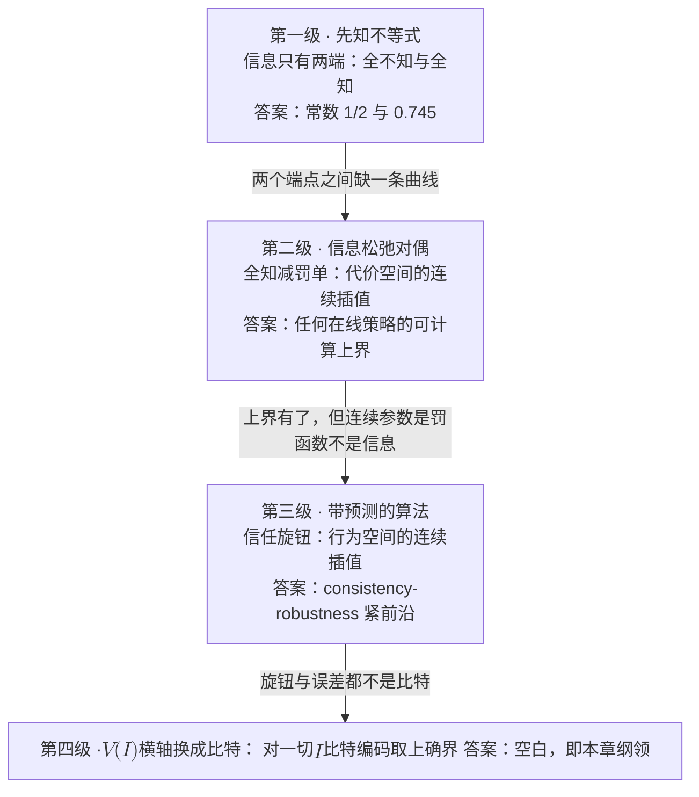
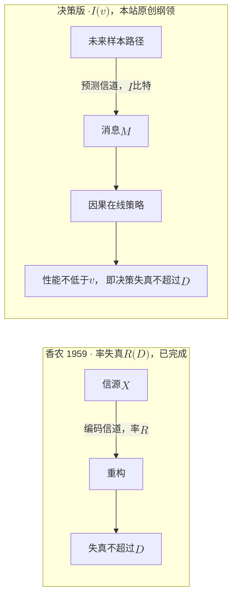

# 5 · 预测的价目表：迈向决策的率失真理论

预测正在成为资源分配的标准配件：波束要预测、信道要预测、输出长度要预测、用户轨迹要预测。2023 年以来，「预测辅助 X」的论文以增益数字为通行证大量涌现。把代表作排成一张表，规律一眼可见：

| 方向 | 代表工作（2023–2026） | 报告的增益 | 「给定预测质量的增益上界」 |
|---|---|---|---|
| mmWave 波束预测 | GPS 辅助 UAV 波束跟踪 [1] | 波束训练开销约 −93% | 无 |
| mmWave 波束对齐 | 可解释鲁棒对齐 [2] | 训练开销 −75% | 无 |
| LLM 推理调度 | 响应长度感知批调度 [3] | 吞吐 +86% | 无 |
| LLM 推理调度 | 代理模型长度预测 [4] | JCT −30.5%~−39.6% | 无 |
| LLM 推理调度 | 学习排序：不预测长度、预测次序 [5] | 平均时延改善 2.8 倍 | 无 |
| LLM 推理调度 | 重尾长度分布 + 风险感知调度 [6] | 在线每 token 时延降 2.31×、离线吞吐升 1.42×（基线未在原文之外核实） | 无 |

最后一列整齐地写着「无」。这不是夸张：在本站调研覆盖的 2023–2026 代表作范围内，没有一篇回答过「给定预测器的质量，增益的上限是多少」。这和 1948 年之前的通信很像：人人都在展示自家调制方案的增益，没有人知道容量在哪里。于是没有人知道自己距离极限是近是远，剩余的改进空间还值不值得投入。

有两个信号说明这不只是「理论欠账」：

- **反例**：UniBoost [7] 中有一个**完全不用预测**的尾部感知调度器，它的 P99 尾时延比「拥有完美长度预测的 SRPT」还低 50%。P99 尾时延是 99% 的请求都不超过的时延。SRPT 是最短剩余处理时间优先，是平均时延意义下的经典最优规则。完美的信息喂给了错误的目标，输给了零信息加正确的目标。预测的价值不是预测器自己的属性，而是「预测器 × 问题 × 目标」三元组的属性。
- **最近的先例**：无线圈里离价目表最近的一次尝试是 [8]。它推导了预测资源分配增益的闭式表达式，增益取决于预测窗口内用户速率的均值与标准差。但那是**某一对具体策略**的增益公式，不是**给定信息量下一切策略**的性能上界，正如某个调制方案的增益公式不是容量。

本章把这个空白表述成一个可研究的数学对象。记 $V(I)$ 为「给定 $I$ 比特关于未来的信息时，最优在线策略能达到的性能」，纲领是刻画 $V(I)$ 曲线：

- $V(0)$ 是在线最优。
- $V(\infty)$ 是离线（先知）最优。
- 中段是一片几乎未测绘的空白。

$V(I)$ 这个记号与「决策的率失真理论」这个提法均为【本站原创】；但通往它的台阶散落在四个成熟领域里。上一章[《不确定性下的时序决策全景》](04-sequential-uncertainty.md)把「不知道」拆成了四种，本章聚焦其中最值钱的一种：不知道未来。要追问的是，把未来买回来一部分，要多少比特、值多少性能？

四级台阶的区别不在难度，而在「信息量」这个自变量一步步显形：

| 台阶 | 预测被抽象成什么 | 自变量 | 答案形态 |
|---|---|---|---|
| ① 先知不等式 | 全知 / 全不知的二元对立 | 无（只有两个端点） | 常数：$1/2$ 与 $0.745$ |
| ② 信息松弛对偶 | 全知 + 一张罚单 | 罚函数 $W$（连续族） | 可计算的数值上界 |
| ③ 带预测的算法 | 一个有误差的预测值 | 信任旋钮 $\lambda$、误差 $\eta$ | consistency–robustness 紧前沿 |
| ④ V(I)【本站原创】 | 关于未来的 $I$ 比特互信息 | $I$（比特） | 【空白】 |

三条既有路线都在绕着信息量走：

- ① 只取两个端点。
- ② 用罚函数在两端点之间造了一条**代价空间**的连续路径。
- ③ 用信任参数在两端点之间造了一条**行为空间**的连续路径。

没有人把横轴换成比特，这就是第四级台阶的位置。

!!! note "本章预备知识"
    需要：信息论的熵、互信息与率失真，以及动态规划。用到的内容：

    - 熵与二元熵：[预备篇 4.1](../part0/04-information-theory-basics.md#41-惊讶的度量自信息与熵)；互信息及其链式法则：[预备篇 4.3](../part0/04-information-theory-basics.md#43-互信息信息是不确定性的减少量)；率失真函数：[预备篇 4.9](../part0/04-information-theory-basics.md#49-率失真分离定理与全站索引)。本章标题"决策的率失真"由此而来。
    - 条件期望与塔性质：[预备篇 4.10](../part0/04-information-theory-basics.md#410-条件期望与高斯估计后文最常用的三件工具)。
    - Bellman 方程与动态规划：[预备篇 8.3](../part0/08-reinforcement-learning.md#83-价值函数与-bellman-方程一步一步推)、[预备篇 8.4](../part0/08-reinforcement-learning.md#84-动态规划模型在手时的两把钥匙)。
    - 滑雪租赁与一致性、鲁棒性：[第 1 章](01-three-mountains.md)；四种"不知道"与竞争比：[第 4 章](04-sequential-uncertainty.md)。

## 5.1 第一级台阶：先知不等式，价目表的两个端点 {#第一级台阶先知不等式价目表的两个端点}

### 5.1.1 问题设定与两个定理

**模型**

独立非负随机变量 $X_1,\dots,X_n$，分布 $F_1,\dots,F_n$ 事先已知，按对手指定的固定顺序逐个揭示。每揭示一个，赌徒必须立即做不可撤销的决策：接受并停止，或者放弃。

基准是**先知**（prophet），即看得见全部实现值的离线决策者，其收益为 $\mathbb{E}[\max_i X_i]$。问题是：因果决策者最多能拿到先知的几成？

赌徒的规则在数学上叫**停时**（stopping time）$\tau$。「是否在第 $i$ 个停下」只能依赖已经看到的 $X_1,\dots,X_i$，不能偷看后面的值。赌徒拿到的收益就是 $X_{\tau}$。

!!! abstract "定理（先知不等式，Krengel–Sucheston 1977/78）【已解决】"
    存在停时 $\tau$ 使得

    $$
    \mathbb{E}[X_{\tau}] \ \ge\ \frac{1}{2}\,\mathbb{E}\Big[\max_{1\le i\le n} X_i\Big],
    $$

    且常数 $1/2$ 不可改进 [9]。

更惊人的是，达到 $1/2$ 不需要任何复杂策略：一个固定阈值就够。

!!! abstract "定理（单阈值策略，Samuel-Cahn 1984）【已解决】"
    取阈值 $T$，策略为「接受第一个超过 $T$ 的 $X_i$」。以下两种取法都达到 $1/2$ [10]：

    - （i）中位数阈值：取 $T$ 使 $\Pr[\max_i X_i > T] = 1/2$。分布有原子时这样的 $T$ 可能不存在，标准补救是在 $X_i=T$ 时再抛一枚合适的硬币决定停不停。
    - （ii）半均值阈值：取 $T = \tfrac{1}{2}\,\mathbb{E}[\max_i X_i]$。

    推论：单阈值策略不依赖观测顺序，故对手排序对它无效。

### 5.1.2 单阈值策略的证明

**证明（完整走一遍）。**记 $\mathrm{OPT} := \mathbb{E}[\max_i X_i]$，并定义两个关键量：

$$
q \ :=\ \Pr\Big[\max_i X_i \le T\Big] \ =\ \prod_{i=1}^{n} F_i(T),
\qquad
S \ :=\ \sum_{i=1}^{n} \mathbb{E}\big[(X_i - T)^{+}\big].
$$

这里 $F_i(T)=\Pr[X_i\le T]$ 是 $X_i$ 的分布函数。$(x)^{+}:=\max(x,0)$ 只保留正的部分，所以 $(X_i-T)^{+}$ 就是 $X_i$ 超出阈值的那一截，没超过时为 $0$。$q$ 是「算法整场没接受任何东西」的概率，$S$ 是全部超额收益的期望。

**第一步：算法收益的下界。** 停止事件 $\{\tau = i\}$ 即「前 $i-1$ 个都不超过 $T$、第 $i$ 个超过」，而 $X_i = T + (X_i - T)$ 在该事件上成立。利用独立性把前缀事件与超额部分拆开：

$$
\begin{aligned}
\mathrm{ALG}
&= \sum_{i=1}^{n} \mathbb{E}\big[X_i\,\mathbf{1}\{X_j \le T\ \forall j<i,\ X_i > T\}\big] \\
&= T\cdot \Pr\big[\exists\, i:\ X_i > T\big]\ +\ \sum_{i=1}^{n} \mathbb{E}\big[(X_i - T)^{+}\big]\prod_{j<i} F_j(T) \\
&\ \ge\ T\,(1-q)\ +\ q\,S,
\end{aligned}
$$

第二个等号把 $X_i=T+(X_i-T)$ 拆成两块，分别求期望：

- **常数块**：各停止事件 $\{\tau=i\}$ 互不相交，并起来恰是「至少有一个超过 $T$」。所以 $T$ 乘它们的概率之和，等于 $T\Pr[\exists\,i:\ X_i>T]=T(1-q)$。
- **超额块**：在 $X_i>T$ 上 $X_i-T=(X_i-T)^{+}$，在 $X_i\le T$ 上 $(X_i-T)^{+}=0$，所以 $\mathbb{E}\big[(X_i-T)\mathbf{1}\{X_j\le T\ \forall j<i,\ X_i>T\}\big]=\mathbb{E}\big[(X_i-T)^{+}\,\mathbf{1}\{X_j\le T\ \forall j<i\}\big]$。$X_i$ 与 $X_1,\dots,X_{i-1}$ 独立，期望拆成 $\mathbb{E}[(X_i-T)^{+}]\cdot\prod_{j<i}F_j(T)$。
- **最后一步**：用了 $\prod_{j<i} F_j(T) \ge \prod_{j=1}^{n} F_j(T) = q$，因为每个 $F_j \le 1$。

**第二步：先知收益的上界。** 对任意 $T$，逐点有 $\max_i X_i \le T + (\max_i X_i - T)^{+} \le T + \sum_i (X_i - T)^{+}$，取期望：

$$
\mathrm{OPT} \ \le\ T \ +\ S.
$$

**第三步（A，中位数阈值）：** 此时 $q = 1/2$，代入第一步：

$$
\mathrm{ALG} \ \ge\ \frac{T}{2} + \frac{S}{2} \ =\ \frac{T+S}{2} \ \ge\ \frac{\mathrm{OPT}}{2}.
$$

**第三步（B，半均值阈值）：** 此时 $T = \mathrm{OPT}/2$，第二步给出 $\mathrm{OPT} \le \mathrm{OPT}/2 + S$，即 $S \ge \mathrm{OPT}/2$。代回第一步：

$$
\mathrm{ALG} \ \ge\ \frac{\mathrm{OPT}}{2}\,(1-q)\ +\ q\,S \ \ge\ \frac{\mathrm{OPT}}{2}\,(1-q)\ +\ q\,\frac{\mathrm{OPT}}{2} \ =\ \frac{\mathrm{OPT}}{2}. \qquad \blacksquare
$$

!!! tip "直觉：q 自己消掉了"
    半均值那一路最漂亮的细节在最后一行：看似致命的「整场不接受概率」$q$ 自行消去。

    机制是对冲：$\mathrm{ALG}$ 的下界是 $T$ 与 $S$ 的凸组合，而半均值阈值恰好把两者都压在 $\mathrm{OPT}/2$ 之上。$q$ 大意味着经常空手而归，但第二步强迫此时超额期望 $S$ 必须大，两种风险在 $\mathrm{OPT}/2$ 处严丝合缝地互补。

    阈值策略要做的，是把「接受的门槛」和「错过的代价」放到同一杆秤上。

### 5.1.3 紧性例子与一个伏笔

**行为分析**

- 两种阈值都只用到分布知识（先验），不用任何关于实现值的未来信息。这就是「零比特端点」的精确含义。
- 单阈值不看顺序，所以对手的排序权力被整个中和，这解释了为什么 $1/2$ 对任意顺序成立。
- 紧性由下面的例子给出，而这个例子还埋着一个通往第四级台阶的伏笔。

!!! example "紧性例子与一个伏笔"
    取 $X_1 \equiv 1$；$X_2 = 1/\varepsilon$ 以概率 $\varepsilon$，否则为 $0$。则

    $$
    \mathbb{E}\big[\max(X_1, X_2)\big] \ =\ \varepsilon\cdot\frac{1}{\varepsilon} + (1-\varepsilon)\cdot 1 \ =\ 2-\varepsilon \ \longrightarrow\ 2,
    $$

    而任何在线规则要么接受 $X_1$ 得 $1$，要么赌 $X_2$ 得期望 $1$。在线最优恒为 $1$，比值趋于 $1/2$，故常数不可改进。

    伏笔【观察，可直接验证】：在这个最坏例子里，若额外告诉决策者一个指示比特 $M=\mathbf{1}\{X_2 = 1/\varepsilon\}$，则「$M=1$ 时等、$M=0$ 时拿 $X_1$」恰好实现 $2-\varepsilon$，即全部先知价值。

    这条消息的熵只有 $H(\varepsilon)=-\varepsilon\log_2\varepsilon-(1-\varepsilon)\log_2(1-\varepsilon)\to 0$ 比特。这是二元熵，见[预备篇 4.1](../part0/04-information-theory-basics.md)。$\varepsilon=0.01$ 时它约 $0.081$ 比特，却把期望收益从 $1$ 抬到 $1.99$。

    趋于零比特的「对的信息」买回了两倍的性能。信息的决策价值可以拥有无穷大的密度，它根本不是熵的函数。这个现象将在第四级台阶成为定义 $V(I)$ 的核心约束。

### 5.1.4 i.i.d. 情形与信息价值的历史

**i.i.d. 情形与常数的归属**

当 $X_i$ 独立同分布时，价目表整体上移：

- Hill–Kertz (1982) 给出下界 $1 - 1/e \approx 0.6321$ 与上界约 $0.745$ [11]。
- Kertz (1986) 证明 $n\to\infty$ 时最优比趋于 $\approx 0.7451$，并猜想其紧性 [12]。其精确值由一个积分方程的唯一解刻画，精确积分形式本站未逐字核验，此处不展开。
- Correa 等人最终证明 $0.745$ 可达且紧【已解决】[13]。

文献中还有一条常被引用的对照：i.i.d. 下静态单阈值的紧常数是 $1-1/e$，要用随剩余期数递减的阈值序列才能到 $0.745$。这条对照的来源是：【二手已核：据 Loiseau 等 2026 年预印本（arXiv:2608.08662）引言的归纳；其中静态阈值的 $1-1/e$ 在随机到达模型下是紧的，由 Arnosti–Ma（Operations Research, 2023）证明】。它本身就是一条「信息的使用方式改变可达性能」的分界线。

**三段历史，同一个问题**

1948 年香农给通信装上参照系。1966 年 Howard 在决策分析里定义信息价值（value of information, VoI），其中完美信息期望价值为

$$
\mathrm{EVPI} \ =\ \mathbb{E}_{\theta}\Big[\max_{a} u(a,\theta)\Big] \ -\ \max_{a}\ \mathbb{E}_{\theta}\big[u(a,\theta)\big] \ \ge\ 0
$$

它度量「先看后选」与「先选后看」的差 [14]。1977 年 Krengel–Sucheston 证明先知不等式。

EVPI 与先知不等式衡量的是同一类量，即 $\mathbb{E}[\max]$ 与因果最优之差。前者问「这个差有多大」，后者答「最坏分布下这个差至多把性能压掉一半」。三条线问的是同一个问题，但谁都没有把横轴装上去。

!!! success "关键结论：1/2 是第一句率失真式的断言"
    「从零信息到完全信息，最坏情形下性能至多翻一倍」，这已经是一句关于「信息值多少」的定量陈述，只是横轴上只有两个点。

    而 $1/2$ 变成 $0.745$ 又说明，价目表是问题类的属性（对抗分布 vs i.i.d.）。它不是预测器的属性。

## 5.2 第二级台阶：信息松弛对偶，把先知变成刻度尺 {#第二级台阶信息松弛对偶把先知变成刻度尺}

先知界有两个缺陷：它只在最优停止这类特殊问题上给出常数，而且往往太松。对一般的随机动态规划，Brown–Smith–Sun 的信息松弛对偶（information relaxation duality）[15][16] 把「先知」从一个死数字改造成一根可调的刻度尺。

### 5.2.1 原始问题与弱对偶

**原始问题**（最大化形式）：状态 $x_{t+1} = f_t(x_t, a_t, \xi_t)$，因果（非预期，nonanticipative）策略类 $\mathcal{A}_F$ 中求

$$
V_0 \ =\ \sup_{\alpha \in \mathcal{A}_F}\ \mathbb{E}\Big[\ \underbrace{\textstyle\sum_{t=0}^{T-1} r_t(x_t, a_t, \xi_t) + r_T(x_T)}_{=:\ R(\alpha,\;\xi)}\ \Big].
$$

这里 $\mathcal{F}_t$ 表示时刻 $t$ 做决策时手里已有的信息，例如已经实现的全部过去噪声 $\xi_0,\dots,\xi_{t-1}$，它随 $t$ 只增不减。「$a_t$ 关于 $\mathcal{F}_t$ 可测」是「$a_t$ 只用这些信息就能算出来」的数学说法。因果策略类 $\mathcal{A}_F$ 就是全体满足这一点的策略。

记号约定如下：

- 下文不带下标的 $\mathcal{A}$ 是**全部**动作序列，允许依赖整条路径 $\xi$。
- $\alpha$ 记策略，$a$ 记一条具体的动作序列。
- 本节的 $T$ 是时域长度，不是第一级台阶里的阈值。

!!! abstract "定理（弱对偶）【已解决】"
    称罚函数 $z(a,\xi)$ **对偶可行**，若对一切因果策略 $\alpha\in\mathcal{A}_F$ 有 $\mathbb{E}[z(\alpha,\xi)]=0$。则对任意对偶可行的 $z$，

    $$
    V_0 \ \le\ \mathbb{E}\Big[\max_{a \in \mathcal{A}}\ \big(R(a,\xi) - z(a,\xi)\big)\Big],
    $$

    右端的 $\max$ 在期望**内部**：内层决策者看见整条样本路径 $\xi$ 后逐路径优化。取 $z \equiv 0$ 即退化为纯先知界 $V_0 \le \mathbb{E}[\max_a R(a,\xi)]$。

**证明（两行）。**对任意因果策略 $\alpha$：

$$
\begin{aligned}
\mathbb{E}\big[R(\alpha,\xi)\big]
&= \mathbb{E}\big[R(\alpha,\xi) - z(\alpha,\xi)\big] \\
&\le\ \mathbb{E}\Big[\max_{a\in\mathcal{A}}\big(R(a,\xi) - z(a,\xi)\big)\Big],
\end{aligned}
$$

第一个等号来自对偶可行性：罚单对因果策略的期望为零。第二个不等号是逐路径放缩：把 $\alpha$ 在该路径上的动作序列塞进 $\max$。对 $\alpha$ 取上确界即得。$\blacksquare$

!!! tip "直觉：罚单机制"
    让离线决策者看见未来，但对他每一次「用了不该用的信息」开一张罚单。只要罚单对任何因果策略期望为零，加罚之后的离线值仍是一切在线策略的上界。

    罚单越准，上界越紧；罚单准到极致，上界就落到在线最优本身。「先知」从此不再是一个孤立的界，而是一族可调上界的最松端点。

### 5.2.2 罚函数与强对偶

罚函数从哪里来？答案是从任意「值函数近似」机械地生成：给定生成函数序列 $W = (W_1,\dots,W_T)$，定义

$$
z^{W}(a,\xi) \ =\ \sum_{t=0}^{T-1}\Big(\big[\,r_t + W_{t+1}(x_{t+1})\,\big]\ -\ \mathbb{E}\big[\,r_t + W_{t+1}(x_{t+1})\ \big|\ \mathcal{F}_t\,\big]\Big),
$$

其中 $x_{t+1} = f_t(x_t,a_t,\xi_t)$。条件期望 $\mathbb{E}[\,\cdot\mid\mathcal{F}_t]$ 是「只用 $t$ 时刻已有的信息所能做出的平均预测」，条件期望与塔性质见[预备篇 4.10](../part0/04-information-theory-basics.md)。

当 $\xi_t$ 与过去独立时（算例 A 就是如此），它就是把 $x_t$、$a_t$ 当常数、只对 $\xi_t$ 求平均：

$$
Q^{W}_t(x_t,a_t):=\mathbb{E}_{\xi_t}\big[r_t(x_t,a_t,\xi_t)+W_{t+1}\big(f_t(x_t,a_t,\xi_t)\big)\big]
$$

也就是用 $W$ 代替真值函数算出的 Q 值（[预备篇第 8 章](../part0/08-reinforcement-learning.md)）。

**鞅差**（martingale difference）指在当下已知信息下条件均值为零的增量。逐项累加得到的**鞅**（martingale），就是「平均而言不涨不跌」的随机过程。罚函数里的每一项都是「实现值减去其条件均值」：

- 对因果策略，$a_t$ 在 $\mathcal{F}_t$ 中可测，每项都是鞅差，期望自动为零，所以对偶可行性免费获得。
- 对偷看未来的策略，$a_t$ 与 $\xi_t$ 相关，均值不再为零。罚单恰好只罚偷看的人。

这就是「恢复因果性的价格」的显式构造。

!!! abstract "定理（强对偶）【已解决】"
    对生成函数序列取下确界，间隙完全闭合：

    $$
    V_0 \ =\ \inf_{W}\ \mathbb{E}\Big[\max_{a\in\mathcal{A}}\big(R(a,\xi) - z^{W}(a,\xi)\big)\Big],
    $$

    下确界在 $W = V$（精确值函数）处取得，且此时内层最大值**逐样本路径**恒等于 $V_0$：间隙为零，方差也为零 [15]。

!!! note "两步补证：为什么"零方差"是必然而非巧合"
    **(a) 对偶可行性：罚单为什么只罚偷看的人。**

    逐项写开：

    $$
    z^W=\sum_t\big[\,r_t + W_{t+1}(x_{t+1}) - \mathbb{E}(r_t+W_{t+1}\mid\mathcal{F}_t)\,\big]
    $$

    对**因果**策略，$a_t$ 是 $\mathcal{F}_t$-可测的，故括号内是标准的鞅差。

    - 记 $Y_t:=r_t+W_{t+1}(x_{t+1})$，括号为 $D_t=Y_t-\mathbb{E}(Y_t\mid\mathcal{F}_t)$。
    - 后一项已经只依赖 $\mathcal{F}_t$，再取一次条件期望不变，所以 $\mathbb{E}(D_t\mid\mathcal{F}_t)=\mathbb{E}(Y_t\mid\mathcal{F}_t)-\mathbb{E}(Y_t\mid\mathcal{F}_t)=0$。
    - 由塔性质 $\mathbb{E}\big[\mathbb{E}(\cdot\mid\mathcal{F}_t)\big]=\mathbb{E}[\cdot]$（[预备篇 4.10](../part0/04-information-theory-basics.md)）得 $\mathbb{E}[D_t]=\mathbb{E}\big[\mathbb{E}(D_t\mid\mathcal{F}_t)\big]=0$，逐项相加得 $\mathbb{E}[z^W]=0$。

    对偷看未来的策略，$a_t$ 依赖 $\xi_t$，条件期望里的那一项不再是它自己的均值，罚金的期望一般不再为零。$W$ 取得好时（例如下面的 $W=V$），它恰好把偷看得来的好处扣回去。因果性被恢复，代价被显式计价。

    **(b) 为什么 $W=V$ 时逐路径恒等于 $V_0$。**

    这里 $V_t$（$t=0,\dots,T$）是动态规划的值函数，即从时刻 $t$、状态 $x$ 出发按最优策略能拿到的期望剩余收益，末端 $V_T=r_T$。$W=V$ 即取 $W_t=V_t$。

    **第一步：代入并相消。** 把 $z^V$ 代入 $R-z^V$，$R=\sum_t r_t+r_T(x_T)$ 中的 $\sum_t r_t$ 与 $z^V$ 中的 $\sum_t r_t$ 相消，剩下

    $$
    R - z^{V} \;=\; r_T(x_T) + \sum_{t=0}^{T-1}\Big[\mathbb{E}\big(r_t+V_{t+1}\mid\mathcal{F}_t\big) - V_{t+1}(x_{t+1})\Big].
    $$

    **第二步：加一项、减一项 $V_t(x_t)$，拆成两部分。**

    $$
    R - z^{V} \;=\; \underbrace{\sum_{t=0}^{T-1}\big[V_t(x_t)-V_{t+1}(x_{t+1})\big] + r_T(x_T)}_{\text{望远镜求和}} \;+\; \sum_{t=0}^{T-1}\underbrace{\Big[\mathbb{E}\big(r_t+V_{t+1}\mid\mathcal{F}_t\big)-V_t(x_t)\Big]}_{\text{Bellman 残差}}.
    $$

    **第三步：逐部分化简。** 望远镜求和指相邻项正负相消、像望远镜一节节收拢，只剩首尾：第一部分等于 $V_0(x_0)-V_T(x_T)+r_T(x_T)=V_0$。

    再用 Bellman 方程 $\max_a\mathbb{E}(r_t+V_{t+1}\mid\mathcal{F}_t)=V_t(x_t)$（[预备篇第 8 章](../part0/08-reinforcement-learning.md)）：每个 Bellman 残差 $\le 0$，在最优动作处等于 $0$。所以任何动作序列都有 $R-z^V\le V_0$，沿最优动作取等号，$\max_a$ 恰好取到 $V_0$。

    逐样本路径都等于同一个常数，所以蒙特卡洛估计的标准误必然是 0.0000。这不是运气好，而是恒等式。

**行为分析**

- $W$ 越接近真值函数，罚单越准、上界越紧。这给了一条从「先知」（$W=0$）连续走到「在线最优」（$W=V$）的路径。第二级台阶的连续参数是罚函数，不是信息量，但两个端点已经与第一级对齐。
- $W=0$ 的对偶界就是 $\mathbb{E}[\max_a R(a,\xi)]$，即**随机基准**（先知不等式的基准），而竞争分析用的是逐路径对抗基准。两条脉络在信息松弛的框架里汇合于同一个端点。

### 5.2.3 算例 A：单队列的三个上界数字

下面用一个单队列算例把这套机制变成三个具体数字。本章后面所有数值都出自同一个模型，均为本站原创计算、可复现。

!!! example "算例 A：单队列准入控制的三个上界数字【本站原创计算】"
    离散时隙 $t=1,\dots,60$，缓冲上限 $B=15$。

    - 噪声：每时隙噪声 $\xi_t=(a_t,s_t)$，到达 $a_t\sim\mathrm{Bern}(0.55)$，服务机会 $s_t\sim\mathrm{Bern}(0.60)$，到达与服务相互独立。每时隙噪声熵为两个二元熵之和 $H(0.55)+H(0.60)=0.9928+0.9710=1.9637$ 比特。
    - 决策：闸门决策 $u_t\in\{0,1\}$ 在观测到本时隙 $\xi_t$ **之前**做出，这样「未来信息」的定义最干净。
    - 记号提醒：本算例里 $a_t$ 是到达，不是动作，动作改记为 $u_t$。

    动态与收益：

    $$
    y_t = \min\big(x_t + a_t u_t,\ B\big), \qquad x_{t+1} = y_t - s_t\,\mathbf{1}\{y_t \ge 1\}, \qquad r_t = a_t u_t - 0.08\, y_t.
    $$

    精确 DP 求得在线最优 $V_0 = 23.8139$。三种罚函数给出的对偶上界：

| 上界 | 罚函数 $W$ | 数值（蒙特卡洛） | 相对在线最优的间隙 |
|---|---|---|---|
| 对偶界（纯先知） | $W=0$ | $25.1255 \pm 0.0207$ | $5.51\%$ |
| 对偶界（线性近似） | $W_t(x)=V_t(0)-0.90\,x$ | $24.4996 \pm 0.0121$ | $2.88\%$ |
| 对偶界（强对偶） | $W=V$ | $23.8139 \pm 0.0000$ | $0.00\%$ |

**三行数字的读法**

- **第一行**：这个队列问题里「知道全部未来」最多值 $5.51\%$ 的性能。先知间隙本身就是「完美预测价值」的定量上界，任何预测辅助方案的增益都不可能超过它。
- **第二行**：一个只有**一个斜率参数**的线性罚函数，就吃掉了先知间隙的 $47.7\%$。上界的收紧是廉价的。
- **第三行**：这是强对偶的可视化。$W=V$ 时标准误**恰好为零**，因为逐路径内层最大值都等于 $V_0$，随机性被罚单完全抵消。「零方差」不是数值巧合，而是强对偶的逐路径版本。

!!! warning "陷阱：符号约定"
    最大化形式下罚函数要**减**（$R - z^{W}$），最小化形式下要**加**。混用符号会把上界算成下界，而且数值上不易察觉。本站算例采用最大化减罚约定，并已用「$W=V$ 时恰好复现 $V_0$」做过校验。

这套框架的主流应用是库存、期权定价与多臂老虎机 [16]。在无线资源分配与队列调度中，它被严重低估【开放实践空白】。

它给每一篇「预测辅助调度」论文提供了本可以随手报告的东西：在增益数字旁边印一行「距完美信息上界还差 $x\%$」。做到这一点不需要知道最优策略，只需要一个值函数近似。

## 5.3 第三级台阶：带预测的算法，第一批严格的质量-性能曲线 {#第三级台阶带预测的算法第一批严格的质量-性能曲线}

第二级的上界回答「预测最多值多少」，但没有回答「**不完美**的预测值多少」。带预测的算法（algorithms with predictions）[17][18] 补上了这一段。预测有误差 $\eta$，算法设一个信任旋钮 $\lambda$，性能表述为两个指标：

- **一致性**（consistency）：预测完美时的竞争比。
- **鲁棒性**（robustness）：预测任意坏时的竞争比。

竞争比是在线算法代价与离线最优代价之比在最坏输入下的上界（定义见[第 1 章](01-three-mountains.md)山三），越接近 $1$ 越好。

### 5.3.1 滑雪租赁：一致性与鲁棒性的交换

**滑雪租赁（ski rental）。**每天租金 $1$，买断价 $b$，实际滑雪天数 $x$ 未知，预测值 $y$，误差 $\eta = |y - x|$，离线最优 $\mathrm{OPT} = \min(x, b)$。

经典基线有两条：确定性 break-even 算法（第 $b$ 天买断）是紧的 $2$-竞争；随机化最优为 $e/(e-1)\approx 1.582$。

!!! abstract "定理（带预测的确定性滑雪租赁，Purohit–Svitkina–Kumar 2018）【已解决】"
    参数 $\lambda\in(0,1)$。算法：若 $y\ge b$（预测该买），第 $\lceil \lambda b\rceil$ 天买断；否则拖到第 $\lceil b/\lambda\rceil$ 天才买断。则 [18]

    $$
    \mathrm{CR} \ \le\ \min\Big\{\ \frac{1+\lambda}{\lambda}\,,\ \ (1+\lambda) + \frac{\eta}{(1-\lambda)\,\mathrm{OPT}}\ \Big\},
    $$

    即 $(1+\lambda)$-一致、$(1+1/\lambda)$-鲁棒。

**推导（四种情形）。**

**情形 1**：$y\ge b$ 且 $x \ge \lceil\lambda b\rceil$。代价为 $\lceil\lambda b\rceil - 1$ 天租金加买断：$\mathrm{ALG} \le \lambda b + b = (1+\lambda)b$。

若预测方向正确（$x\ge b$），$\mathrm{OPT}=b$，比值 $\le 1+\lambda$。若实际 $x<b$（预测偏大，此时 $\eta \ge b-x$），$\mathrm{OPT}=x\ge\lambda b$，于是

$$
\frac{\mathrm{ALG}}{\mathrm{OPT}} \ \le\ \frac{(1+\lambda)\,b}{\lambda\, b} \ =\ 1 + \frac{1}{\lambda},
$$

这一支还可以用 $\eta$ 写细，得到定理中的第二支。此时 $\eta\ge b-x$，即 $b\le x+\eta=\mathrm{OPT}+\eta$，于是

$$
\frac{\mathrm{ALG}}{\mathrm{OPT}} \ \le\ \frac{(1+\lambda)(\mathrm{OPT}+\eta)}{\mathrm{OPT}} \ =\ (1+\lambda)+\frac{(1+\lambda)\,\eta}{\mathrm{OPT}} \ \le\ (1+\lambda)+\frac{\eta}{(1-\lambda)\,\mathrm{OPT}},
$$

最后一步因为 $(1+\lambda)(1-\lambda)=1-\lambda^2\le 1$，即 $1+\lambda\le 1/(1-\lambda)$。

**情形 2**：$y\ge b$ 且 $x < \lceil\lambda b\rceil$。买断日未到雪季已结束：$\mathrm{ALG} = x = \mathrm{OPT}$，比值 $1$。

**情形 3**：$y<b$ 且 $x < \lceil b/\lambda\rceil$。一直在租：$\mathrm{ALG}=x$。若 $x\le b$ 比值为 $1$；若 $b < x$（预测偏小），$\mathrm{OPT}=b$，比值 $< (b/\lambda + 1)/b \approx 1/\lambda$。

**情形 4**：$y<b$ 且 $x \ge \lceil b/\lambda\rceil$。$\mathrm{ALG} \le b/\lambda + b$，$\mathrm{OPT}=b$，比值 $\le 1+1/\lambda$。

含 $\eta$ 的第二支在其余情形同样成立：

- 情形 2：比值为 $1$。
- 情形 3 后半：$y<b<x$，$x-b\le x-y=\eta$，比值 $x/b\le 1+\eta/\mathrm{OPT}$。
- 情形 4：$\eta=x-y>b/\lambda-b$，代入得第二支 $>(1+\lambda)+1/\lambda$，已大于该情形的比值上限 $1+1/\lambda$。

汇总如下：

- $\eta=0$ 只会落在情形 1 前半（比值 $\le 1+\lambda$）或情形 3 前半（比值 $1$），所以一致性是 $1+\lambda$。
- 任意 $\eta$ 下最坏比值是 $1+1/\lambda$，这就是鲁棒性。$\blacksquare$

**行为分析**

- $\lambda$ 就是信任的定价。$\lambda=1$ 退回经典 break-even（$2$-一致、$2$-鲁棒），预测被完全无视。$\lambda=1/3$ 给出（$4/3$-一致、$4$-鲁棒）。$\lambda\to 0$ 时一致性趋于 $1$，而鲁棒性爆炸。
- 买得越早越信预测，信任的收益与被骗的风险沿一条显式曲线交换。
- 随机化版本整体更优：以正比于 $(1-1/b)^{k-i}$ 的概率在第 $i\le k$ 天买断（$k$ 按预测取 $\lceil\lambda b\rceil$ 或 $\lceil b/\lambda\rceil$），达到 $\tfrac{\lambda}{1-e^{-\lambda}}$-一致、$\approx\tfrac{1}{1-e^{-\lambda}}$-鲁棒 [18]。自检：$\lambda=1$ 时两者同为 $e/(e-1)$，恰好落回经典随机化最优。

### 5.3.2 最优权衡：Wei–Zhang 下界

这条曲线是不是最优的？这里的「最优」指 **Pareto 最优**：一致性与鲁棒性都是越小越好，若没有任何算法能在另一个指标不变差的前提下改进其中一个，这对组合就落在 **Pareto 前沿**上。

Wei–Zhang 给出了肯定回答，这是本章最重要的一块砖。下面 (ii) 中的 $\log$ 取自然对数。

!!! abstract "定理（最优权衡，Wei–Zhang 2020）【已解决】"
    滑雪租赁中 [19]：

    （i）确定性：任何 $(1+\lambda)$-一致的算法**至少** $(1+1/\lambda)$-鲁棒。Purohit 等的方案恰好落在 Pareto 前沿上。

    （ii）随机化：鲁棒性为 $\gamma$ 的任何算法，其一致性 $\beta$ 必满足

    $$
    \beta \ \ge\ \gamma\,\log\Big(1 + \frac{1}{\gamma - 1}\Big),
    $$

    上述随机化方案在此意义下最优。

**行为分析**

在经典点 $\gamma = e/(e-1)$ 处代入：$1/(\gamma-1) = e-1$，$\log e = 1$，得 $\beta \ge \gamma$。下界曲线恰好在无预测最优处收拢成一点，与可达曲线严丝合缝。这条下界的意义远超滑雪租赁本身：

!!! success "关键结论：纲领的存在性证明"
    滑雪租赁的「预测质量到性能」完整价目表，包括可达曲线和匹配下界，已经被做出来过。

    本章想要的东西不是空想：在一个玩具问题上，它是定理。纲领的任务是把这件已经做成的事搬到新战场，并把横轴从「信任旋钮」换成「信息量」。

### 5.3.3 从滑雪场到调度器

同一框架在非视距调度（non-clairvoyant scheduling）上给出下面的结果。

这里「非视距」指调度器事先看不到每个作业的处理时间、做完才知道，与无线信道的非视距（NLOS）无关。Round Robin 指所有未完成作业轮流平分处理器，不需要任何预测。

结果是：$n$ 个作业、预测处理时间误差 $\eta=\sum_j\lvert x_j-y_j\rvert$。最短预测作业优先（SPJF）达到 $\mathrm{CR}\le 1+2\eta/n$，与 Round Robin 按 $\lambda$ 混合的 Preferential Round-Robin 达到 [18]

$$
\mathrm{CR} \ \le\ \min\Big\{\ \frac{1}{\lambda}\Big(1+\frac{2\eta}{n}\Big),\ \ \frac{2}{1-\lambda}\ \Big\}.
$$

下界侧只有部分结果【部分结果】，未见匹配上界 [19]：

- $n=2$ 时 $\gamma \ge 1 + 1/(1+6\lambda)$。
- 一般 $n$ 时 $\gamma \ge \big(n + n(n+1)\lambda\big)\big/\big(1+\lambda(n+1)(n+2)/2\big)$。

记住这个问题的形状：「预测长度的调度」正是 LLM 推理调度的数学骨架，下文会回来。

!!! warning "陷阱：这还不是 V(I)"
    consistency–robustness 曲线的横轴是**信任旋钮 $\lambda$**（算法内部参数）或**误差幅度 $\eta$**（标量失真度量），都不是**信息量**。

    $\eta$ 度量「预测错多少」，却不度量「预测携带多少」：一个恒报中位数的预测器误差可控，但信息为零。

    第三级台阶给出了第一批严格的「质量到性能」曲线。把横轴换成比特，是下一级台阶的原创动作。

## 5.4 第四级台阶：V(I)，迈向决策的率失真 {#第四级台阶vi迈向决策的率失真}

### 5.4.1 为什么必须按「最优编码」计价 {#为什么必须按最优编码计价}

Howard 在 1966 年就发出了本级台阶的核心警告：信息的决策价值以效用计量，**不是熵的函数**。两个互信息相同的实验，可以有天差地别的价值 [14]。第一级末尾的紧性例子已经把它推到极端：$H(\varepsilon)\to 0$ 比特的「对的信息」买回两倍性能。

所以「$I$ 比特值多少」这个问题只有一种不平凡的问法：在所有携带至多 $I$ 比特的预测方式中，**最好的那种**值多少。$V(I)$ 必须定义成极值量，否则曲线随预测器的工程细节任意变形，毫无意义。

### 5.4.2 定义与两条对偶形式 {#定义与两条对偶形式}

!!! abstract "定义（V(I) 与决策的率失真）【本站原创】"
    设外生不确定性为样本路径 $\xi = (\xi_1,\dots,\xi_T)$。一个**预测方案**是信道 $q(m\mid\xi)$，在决策开始前产生消息 $M$。$\Pi(M)$ 是「可同时使用 $M$ 与因果历史」的在线策略类，$J(\pi,q)$ 为期望性能。定义

    $$
    V(I) \ :=\ \sup_{q\,:\ I(\xi;\,M)\ \le\ I}\ \ \sup_{\pi \in \Pi(M)}\ J(\pi, q),
    $$

    则 $V(0)$ 为在线最优，这是因为 $M$ 与 $\xi$ 独立时不携带任何未来。$V(\infty)$ 为离线（先知）最优，此时 $M=\xi$。对偶的**率侧**形式为

    $$
    I(v) \ :=\ \inf\big\{\ I(\xi;\,M)\ :\ \exists\,\pi\in\Pi(M),\ J(\pi,q)\ \ge\ v\ \big\},
    $$

    即达到性能 $v$ 所必需的最小预测信息量。

读这个定义时抓住两层上确界：

- **内层**：给定消息，挑最会用它的在线策略。
- **外层**：在所有互信息不超过 $I$ 的编码里挑最好的一种。前视窗口、分桶、预警比特等都算。

$I(\xi;M)=0$ 当且仅当 $M$ 与 $\xi$ 独立，这就是 $V(0)$ 为在线最优的原因。

记号上，三个量共用字母 $I$：

- $I(\xi;M)$ 是互信息（[预备篇 4.3](../part0/04-information-theory-basics.md)）。
- 单独的 $I$ 是信息预算。
- $I(v)$ 是以性能 $v$ 为自变量的函数。

另外，$V(I)$ 也不是第二级台阶的动态规划值函数 $V_t$。

率侧形式才是本章标题的来历。回忆香农的率失真函数（rate–distortion function，[预备篇 4.9](../part0/04-information-theory-basics.md)）

$$
R(D) \ =\ \min_{p(\hat{x}\mid x)\,:\ \mathbb{E}[d(X,\hat{X})]\,\le\, D}\ I(X;\hat{X}),
$$

逐项对照：

- 信源 $X\leftrightarrow$ 未来 $\xi$。
- 重构 $\hat{X}\leftrightarrow$ 消息 $M$。
- 失真约束 $\leftrightarrow$ 性能约束。

若定义**决策失真** $D := V(\infty) - v$（距先知的性能亏损），则 $I(v)$ 就是字面意义上的 $R(D)$：给定可容忍的决策失真，压缩未来所需的最小码率。

**物理意义**

$V(I)$ 把本章开场那一列「无」变成一个函数值。任何预测辅助方案，无论用什么预测器，只要其消息对未来的互信息不超过 $I$，性能就不可能超过 $V(I)$。这就是「容量之于调制增益」的角色。

$V(\infty)-V(0)$ 则有现成的物理解释。Bray (2026) 把在线成本分解为两部分 [22]：

- **波动的代价**（cost of variability）：确定性松弛与离线之差。
- **不确定性的代价**（cost of uncertainty）：离线与在线之差。

预测能消灭的只有后者；波动的代价花多少比特都买不掉。UniBoost 的反例也在此归位：它输掉的不是信息，是目标。$J$ 换成尾时延后，整张价目表都要重排。

**行为分析（一条免费的结构定理）**

$V$ 沿信息轴不可能任意起伏：

!!! abstract "命题（V 的凹性，分时论证）【本站原创表述，论证为标准分时】"
    $V(I)$ 在 $I\ge 0$ 上单调不减且凹。

    **证明。第一步：构造混合方案。** 给定两个方案 $(q_1,\pi_1)$ 与 $(q_2,\pi_2)$，信息量与性能分别为 $(I_1,v_1)$、$(I_2,v_2)$。掷一枚与 $\xi$ 独立的硬币 $B\sim\mathrm{Bern}(\alpha)$，发送 $M=(B, M_B)$ 并执行 $\pi_B$，则

    $$
    I(\xi;\,M) \ =\ I(\xi;\,B) + I(\xi;\,M_B\mid B) \ =\ \alpha\, I_1 + (1-\alpha)\, I_2,
    $$

    **第二步：说明这个等式。** 第一个等号是互信息的链式法则（[预备篇 4.3](../part0/04-information-theory-basics.md)）。第二个等号分两块：

    - $B$ 与 $\xi$ 独立，故 $I(\xi;B)=0$。
    - 给定 $B=1$ 时 $(\xi,M_B)$ 的联合分布就是方案 1 的，条件互信息为 $I_1$；给定 $B=0$ 时为 $I_2$。按 $\Pr[B=1]=\alpha$ 加权即得。

    **第三步：性能与凹性。** 性能同理：以概率 $\alpha$ 执行方案 1、以概率 $1-\alpha$ 执行方案 2，期望性能为 $\alpha v_1 + (1-\alpha) v_2$。这个混合方案是定义 $V(\alpha I_1+(1-\alpha)I_2)$ 的上确界里的一个候选，故 $V(\alpha I_1+(1-\alpha)I_2)\ge \alpha v_1+(1-\alpha)v_2$。再让两个方案的性能分别逼近 $V(I_1)$ 与 $V(I_2)$，即得 $V(\alpha I_1 + (1-\alpha)I_2)\ \ge\ \alpha V(I_1) + (1-\alpha)V(I_2)$。

    **单调不减**更直接：$I$ 变大时约束 $I(\xi;M)\le I$ 放宽，可选方案只多不少，上确界不会变小。$\blacksquare$

    推论：率侧 $I(v)$ 关于决策失真 $D = V(\infty)-v$ 凸且不增，与 $R(D)$ 的形状完全一致。

    推论的理由：$I(v)$ 是「$V$ 的反函数」，即达到性能 $v$ 最少需要让 $V(I)\ge v$ 的那个 $I$。把凹且不减的曲线 $v=V(I)$ 横纵轴对调，得到凸且不减的曲线 $I=I(v)$。再换成 $D=V(\infty)-v$，$v$ 增大即 $D$ 减小，于是 $I$ 关于 $D$ 凸且不增。

这个平凡的命题有不平凡的用途：它是一台**编码劣质性的检测仪**。任何实际预测方案给出的「信息-性能」散点若落在某条凹包络之下，就被证明不是其比特预算下的最优编码。下面的算例 C 会当场演示。

**凹包络**是盖在一组点上方的最小凹函数。每个可达点都在真 $V$ 的下方，而 $V$ 是凹的，所以 $V$ 位于所有可达点的凹包络之上。某方案的点若严格落在包络之下，它的性能就严格低于同一比特数处的 $V$。

### 5.4.3 三块已有的地基（诚实盘点） {#三块已有的地基诚实盘点}

第四级台阶不是从零起步，有三块地基必须交代。

**地基一：以前视窗口为横轴的完整曲线【已解决（该模型）】**

Spencer–Sudan–Xu (2014) 研究重载单队列准入控制 [20]：到达率 $\lambda\in(1-p,1)$，服务率 $1-p$，另可按速率 $p$ 把作业分流出去。服务加分流的总能力为 1，所以 $\lambda\to1$ 就是重载。

此处 $\lambda$ 是到达率，不是第三级台阶的信任旋钮；$C$ 记平均队长。在线最优队长发散而离线有限：

$$
C^{\mathrm{on}} \ \sim\ \log_{1/(1-p)}\Big(\frac{1}{1-\lambda}\Big) \ \longrightarrow\ \infty
\qquad (\lambda\to 1),
\qquad
\lim_{\lambda\to 1} C^{\mathrm{off}} \ =\ \frac{1-p}{p};
$$

而给定前视窗口 $w(\lambda) = c\cdot\log\tfrac{1}{1-\lambda}$（$c$ 为足够大常数），「不落下任何作业」策略族达到

$$
C\big(p,\lambda,\pi_{\mathrm{NOB}}\big) \ \le\ \frac{1-p}{\lambda-(1-p)} \ \longrightarrow\ \frac{1-p}{p} \qquad (\lambda\to 1).
$$

代入 $p=0.1$、$\lambda=0.99$：在线队长约 $44$，离线极限 $9$，而对数级前视（约几十个时隙）就把发散压回常数。

作者原话称之为「排队时延与未来信息量之间的一种对偶」，并猜想 $w \ll \log\tfrac{1}{1-\lambda}$ 时时延仍发散，相变点位置至今【开放】。这就是一条真实的 $V(w)$ 曲线，只是横轴是窗口长度，不是比特。

**地基二：下界侧并非空白【已解决（该模型）】**

必须诚实：Xu (2015) 已在同一模型下证明了**渐近紧的必要性下界**，达到优越时延所需的未来信息量与上界匹配到常数乘子 [21]。

所以不能说「$V(I)$ 的下界完全空白」。准确的说法是：现有下界绑定在个别高度特化的模型上，且以前视窗口长度为参数。一旦把参数换成「任意 $I$ 比特编码」（对所有编码取极值），现有下界方法立刻失效。这才是真正开放的部分。

**地基三：成本分解与「够用的前视很小」**

Bray (2026) 在过载损失网络中证明：在线成本的 $\Theta(\log N)$ 全部归于不确定性的代价（波动的代价保持 $O(1)$），且 $\Omega(\log(N)/N)$ 的前视窗口已足以压住成本 [22]。

与地基一合看，一个反复出现的定性信号是：性能对信息的需求增长极慢，对数级的「未来」就几乎买断全部可买的价值。

### 5.4.4 从样本、查询、质量参数到比特：桥已修到河心 {#从样本查询质量参数到比特桥已修到河心}

把「信息量」塞进先知不等式的尝试已有三条路，全都止步于比特之前：

- **样本数**：每个分布只看一个样本即可达到最优比 $1/2$；i.i.d. 下 $O(n)$ 个样本可逼近 $0.745$ [23]。
- **查询数**：分布未知的 i.i.d. 情形，**一次分位数查询**即可达 $0.6718 > 1-1/e$，两个阈值达 $0.6786$ [24]。这是「$V$ 在 $I=$ 一次查询处的取值」的一个真实数据点。
- **质量参数**：Brüstle–Cohen–Leonardi (2026) 对「保守预测」给出完整刻画 [25]：预测质量 $\alpha$ 已知时紧比为

    $$
    \mathrm{CR}^{\star}(\alpha) \ =\ \frac{1}{2-\alpha}, \qquad \alpha\in[0,1],
    $$

    $\alpha=0$ 退回 $1/2$，$\alpha=1$ 达到 $1$。这是一条完整、紧的先知版质量-性能曲线【已解决】。另外，不可能同时在 $\alpha=1$ 处超过 $3/4$、又在 $\alpha=0$ 处保住 $1/2$，这是对 $\alpha$ 无知的代价。

相邻工作还包括带预测先验的最优停止（没有单一算法能同时匹配最好的 prophet 算法与最好的 secretary 算法 [26]），以及统一的「带建议的秘书问题」框架 [27]。

与此同时，在线算法理论中成熟的 advice complexity 框架（问「达到某竞争比需要多少比特建议」）**从未与先知不等式合流**。先知侧的插值走的是样本、查询、质量参数三条路，没有一条以比特为刻度【开放】。桥修到了河心，最后一跨没人架。

### 5.4.5 算例 B：一条真实的 V(w) 曲线【本站原创计算】 {#算例-b一条真实的-vw-曲线本站原创计算}

沿用算例 A 的单队列模型。

- **策略**：时隙 $t$ 精确知道 $\xi_t,\dots,\xi_{t+w-1}$，对这 $w$ 步做确定性 DP（终端值取真值函数 $V_{t+w}$），执行第一步后滚动。$w=0$ 即在线最优，$w=T$ 即离线最优。
- **指标**：「捕获先知间隙的比例」$=(V(w)-V_0)/(25.1255-V_0)$，分母 $1.3116$ 是算例 A 的先知间隙。例如 $w=2$：$(24.0697-23.8139)/1.3116\approx 19.5\%$。$w\ge 12$ 时算出约 $100.5\%$，超出部分在蒙特卡洛误差内，记为 100%。
- **比特口径**：按每时隙原始信息 $w\times 1.9637$ 比特计。这是按时隙计的启发式口径：$V(I)$ 定义里的 $I$ 是决策开始前一次性发出的整条消息与整条噪声路径的互信息，两者只是近似对应。

结果如下：

| 前视 $w$（时隙） | 原始比特 | $V(w)$ | 捕获先知间隙的比例 |
|---|---|---|---|
| 0 | 0.00 | 23.8228 ± 0.0345 | 0.7%（噪声内为 0） |
| 1 | 1.96 | 23.8925 ± 0.0347 | 6.0% |
| 2 | 3.93 | 24.0697 ± 0.0338 | 19.5% |
| 3 | 5.89 | 24.3686 ± 0.0333 | 42.3% |
| 4 | 7.85 | 24.6029 ± 0.0330 | 60.2% |
| 6 | 11.78 | 24.7613 ± 0.0329 | 72.2% |
| 8 | 15.71 | 24.9971 ± 0.0328 | 90.2% |
| 12 | 23.56 | 25.1317 ± 0.0326 | 100%（饱和） |
| 20 / 40 / 60 | — | 25.1317 ± 0.0326 | 100% |

**行为分析**

- 曲线是 S 形：起步缓（$w=1$ 只买到 $6\%$），中段陡（$w=2\to 4$ 从 $19.5\%$ 冲到 $60.2\%$），$w\approx 12$（约 24 比特）完全饱和。
- 饱和点呼应地基三：这个 60 时隙的问题里，12 时隙之外的未来一文不值。队列的「记忆长度」给信息的边际价值画了硬截止。
- 另一个交叉验证：$w=60$ 的 $25.1317$ 与算例 A 中 $W=0$ 对偶界 $25.1255\pm 0.0207$ 在蒙特卡洛误差内一致。它们本就是同一个量（离线最优）的两个独立估计。

{ .chart loading=lazy }
{ .chart loading=lazy }

*怎么读这张图：数据就是上表最后一列。横轴按实际算过的 $w$ 排列，4 以后的 6、8、12 间距不等，右段被压缩，饱和看起来比实际更快。每个时隙的原始信息约 1.96 比特，所以 $w=2$ 对应 3.93 比特，$w=12$ 对应约 24 比特。S 形一目了然：$w=1$ 只买到 6%，$w=2\to4$ 从 19.5% 冲到 60.2%，$w=12$ 饱和；$w=20/40/60$ 仍是 100%，图上没有画。*

### 5.4.6 算例 C：0.63 比特胜过 3.93 比特【本站原创计算】 {#算例-c063-比特胜过-393-比特本站原创计算}

现在构造一个**每时隙只送 1 比特**的预测器。它不送原始窗口，送一个「拥塞预警」：

$$
b_t \ =\ \mathbf{1}\Big\{\ \textstyle\sum_{k=0}^{7}\big(a_{t+k} - s_{t+k}\big)\ \ge\ 2\ \Big\},
$$

即「未来 8 个时隙的净流入是否偏大」，经验熵 $H(b)=0.633$ 比特/时隙。

策略限制在极简的两阈值类：队长 $\le x^{\star}(b)$ 才开闸，数值最优解为 $x^{\star}(0)=3$、$x^{\star}(1)=0$（预警时立刻关闸）。结果：

| 信息 | 比特/时隙 | 值 | 捕获先知间隙 |
|---|---|---|---|
| 无信息（完整 DP 在线最优） | 0 | 23.8139 | 0% |
| 朴素前视 $w=1$（完整滚动策略） | 1.96 | 23.8925 | 6.0% |
| 朴素前视 $w=2$（完整滚动策略） | 3.93 | 24.0697 | 19.5% |
| **1 比特摘要（仅两阈值的简陋策略）** | **0.63** | **24.0826** | **20.5%** |

!!! success "关键结论：哪些比特，胜过多少比特"
    $0.63$ 比特「对的信息」$\gtrsim$ $3.93$ 比特「原始前视」：比特数少约 6 倍，价值相当甚至略胜。对比 $w=1$（$1.96$ 比特），则是比特少 3 倍、价值多 3.4 倍。

    这个对比是保守的：1 比特那一行只允许两个阈值的简陋策略类，前视两行用的是完整最优滚动策略。

这个实验一举完成三件事：

- **其一**：朴素前视窗口被当场证明是糟糕的信源编码。论证分两层：
    - 由凹性命题：这里 $V$ 按「捕获先知间隙的比例」计，故 $V(0)=0$；窗口 $w=2$ 是一个用 $3.93$ 比特达到 $19.5\%$ 的方案，故 $V(3.93)\ge 19.5\%$。在这两点之间取 $\alpha=1.96/3.93\approx 0.499$ 做分时，$V(1.96)\ge \alpha\cdot 19.5\%+(1-\alpha)\cdot 0\approx 9.7\%$。也就是说，任何真 $V(I)$ 在 $1.96$ 比特处至少值 $9.7\%$，而窗口只买到 $6.0\%$。
    - 更直接地，由单调性与算例 C：$V(1.96)\ \ge\ V(0.63)\ \ge\ 20.5\%$。窗口在自己比特预算下的兑现率不足三分之一。
- **其二**：它给「$V(I)$ 必须对所有编码取上确界」补上可复现的实证。换一种编码，同样的比特预算价值翻三倍。
- **其三**：它解释了产业界已经在无意识做的事。Fu 等人发现「预测精确长度不可行，预测相对次序可行」，并拿到 2.8 倍时延改善 [5]。工业界已经在做信源压缩了，只是没人给它一个率失真的账本。

这个账本可以当场翻开。翻开后的结论比原话更有意思：

!!! example "算例：次序信息到底比长度信息便宜多少"
    - **精确长度**：输出长度域取 $[1,4096]$ token，无先验时 $\log_2 4096 = 12$ 比特/请求；分成 8 个桶则只要 3 比特/请求。
    - **完整次序**：一个 $n=64$ 的批次，其全排列有 $64!$ 种，$\log_2(64!)\approx 296$ 比特，摊到每请求

        $$
        \frac{\log_2(64!)}{64}\approx 4.6\ \text{比特/请求}.
        $$

    - **比值**：$12/4.6\approx \mathbf{2.6}$ 倍。

    "次序比长度便宜"这个说法是对的，但只便宜 2.6 倍，称不上"远少于"。而且若长度只需分 8 桶，次序反而更贵。

    真正的收获在于这个数太小了：2.6 倍的比特节省，换来的却是几乎同等的时延收益。这说明长度信息里的绝大部分比特对调度决策是**冗余**的。

    用本章的语言说：$V(I)$ 曲线在小 $I$ 处极陡，前一两个比特就吃掉了大部分价值。「陡」可以用平均斜率 $(V(I)-V(0))/I$ 量化。由凹性，这个比值随 $I$ 增大只减不增，越靠近原点越陡。

    - 算例 C 的 1 比特摘要：$V$ 在 $0.63$ 比特处的平均斜率至少约 $20.5\%/0.63\approx 32\%$ 每比特（按先知间隙计）。
    - 朴素前视 $w=2$：只兑现约 $19.5\%/3.93\approx 5\%$ 每比特。

    这与 $V(I)$ 纲领预言的形状一致，而它现在有了第一个可算的佐证。（L2R 实践中只用成对比较，比特数还能更低。）

    顺带一个耐人寻味的细节【观察】：数值最优的 1 比特码是一个「超额事件指示器」，与先知问题里「一次分位数查询最值钱」[24] 遥相呼应。好的决策码本似乎偏爱分位数结构。

## 5.5 战场盘点：方法很多，缺席的是价目表 {#战场盘点五花八门的方法缺席的价目表}

抽象的 $V(I)$ 落回三个当代战场。LLM 推理调度与联邦学习调度的方法谱系已在本部[第 4 章](04-sequential-uncertainty.md)的场景落地部分盘点，此处只看它们在「预测定价」问题上的姿态。

### 5.5.1 LLM 推理调度：最鲜活的活例 {#llm-推理调度最鲜活的活例}

输出长度未知的请求流上做批调度，就是「非视距调度 + 长度预测」，也就是第三级台阶那张骨架的工业版。2023–2026 年的增益井喷见开场表格 [3][4][5][6]，方法光谱与各自的边界如下：

| 方法族（2024–2026） | 代表 | 解决了什么 | 回答不了什么 |
|---|---|---|---|
| 预测器工程 | 代理模型 [4]；DeBERTa-v3 预测长度分布参数，$R^2$ 达 0.82 [6] | 把预测误差 $\delta$ 做小 | $\delta$ 多小才够？边际比特的边际价值是多少 |
| 学习排序（L2R） | [5] | 换更便宜的信息：次序而非长度 | 为什么便宜的次序几乎同样有用——没有信息量核算 |
| 风险感知调度 | 重尾分布 + CVaR 尾部通胀期望 [6] | 重尾下「期望型预测」的误用 | 分布形状如何改变价目表 |
| 鲁棒在线优化 | $A_{\min}$：只用预测下界 + 自适应细化，竞争比 $O(\log(1/\alpha))$；$A_{\max}$ 用上界则竞争比介于 $\alpha^{-1}(1+\alpha^{-1/2})/2$ 与 $\alpha^{-1}(1+\alpha^{-1})/2+O(1/M)$ 之间，至少按 $\alpha^{-3/2}$ 增长 [28]（$\alpha=\ell/u\in(0,1]$ 是预测区间下界与上界之比，越小预测越粗，与本章别处的 $\alpha$ 无关；$M$ 为 KV 缓存容量） | 预测不可靠时的底线保证 | 定性分类（上界 vs 下界预测）之间的连续定律 |
| 免预测调度 | UniBoost：尾部感知，P99 比完美预测 SRPT 低 50% [7] | 证明目标错配比信息缺失更致命 | 它赢在哪里——缺一个把目标写进 $V(I)$ 的框架 |

三条观察：

- **第一**：Chen–Ye–Zhou [28] 是全方向最接近「价目表」的工作，它的形态很说明问题。它给出的不是「精度 $\delta\to$ 时延损失」的连续曲线，而是「用上界预测 vs 用下界预测」的定性分野。$A_{\max}$ 至少 $\alpha^{-3/2}$ 量级，对 $A_{\min}$ 的 $O(\log(1/\alpha))$，一个使用方式的差异改变了整个数量级【部分结果】。
- **第二**：L2R 的成功 [5] 是「哪些比特」胜过「多少比特」的产业实例，与算例 C 同构。
- **第三**：UniBoost [7] 与 Bray 的分解 [22] 互为注脚。预测只能消灭不确定性的代价，而 P99 目标下的代价结构根本不同，所以价目表必须对每个目标函数单独开列。

### 5.5.2 无线：预测增益的重灾区与最接近的先例 {#无线预测增益的重灾区与最接近的先例}

波束预测报开销降 93% [1]、75% [2]，移动性预测辅助切换与卸载同样以增益数字为唯一语言。生成式预测器一侧，VQ-VAE 信道预测比标准自编码器好至多 15 dB NMSE、比 VAE 约 9 dB [29]，扩散模型作为轨迹/信道预测器供决策使用也属同类。

共同的毛病是：增益以 NMSE、开销降幅计，从未换算成决策价值。15 dB 的信道预测改善值多少调度吞吐？没有汇率。这是 Howard 警告（价值不等于保真度）在六十年后的无线复刻。

唯一推导了增益闭式的工作 [8] 也止步于「具体策略对的增益公式」，其与 $V(I)$ 的关系正如调制方案增益公式之于容量。信息松弛对偶（第二级台阶）在这里几乎完全缺席。每篇预测辅助调度论文本可以像算例 A 那样，用一个线性罚函数给自己的增益配一个上界参照。

### 5.5.3 联邦学习：陈旧梯度是负预测 {#联邦学习陈旧梯度是负预测}

异步联邦学习的陈旧梯度是一面反向镜子：它不是关于未来的信息，而是**关于当前的过期信息**，其决策相关信息量随陈旧度（staleness）$\tau$ 单调衰减，是一种「负预测」。

2025–2026 年的处理大多是定性加权或经验调度，少数给出含 $\tau$、方差与异构性的期望梯度范数收敛界 [30]，但「$\tau\to$ 可达收敛率」的紧刻画不存在。这与无线、LLM 是同一个毛病：有含参数的界，无按信息计价的价目表。

此处点到为止。它提示 $V(I)$ 的横轴应当允许负方向延伸，即信息从新鲜到过期的连续退化。

## 5.6 三个可证目标：让纲领落地 {#三个可证目标让纲领落地}

提出一个研究纲领，不能停在愿景。三个目标各自有明确的起点与下一步。

| 目标 | 已有的最强结果 | 本站要证的下一步 |
|---|---|---|
| (a) 单队列 $V(I)$ 完整刻画 | 窗口参数化的上界 [20] 与紧下界 [21]；本站 $V(w)$ 曲线与 1 比特反例（算例 B/C） | 生灭链 DP + 信息约束：证明「朴素窗口不是最优编码」并刻画最优 1 比特码本的阈值/分位数结构 |
| (b) 先知不等式的比特插值 | 质量轴紧曲线 $1/(2-\alpha)$ [25]；样本 [23] 与查询 [24] 两个孤立数据点 | 把 advice complexity 的比特刻度接到先知问题上：$V(I)$ 在 $I\in(0,\infty)$ 的紧界 |
| (c) LLM 调度精度-时延定理 | $O(\log(1/\alpha))$ 对 $O(1/\alpha)$ 的定性分野 [28] | 长度预测精度 $\delta\to$ 平均时延损失的连续定理，把实证曲线 [5][6] 升格为界 |

三点技术注记：

- **目标 (a)**：第一个定理不必从零开始。算例 C 已经给出「待证现象」，即朴素窗口的兑现率不足其预算的三分之一。要做的是把数值证据升格为生灭链上的严格论证，信息约束用 $I(\xi;M)$ 逐时隙预算化。
- **目标 (b)**：关键修正是措辞。advice complexity 在在线算法中是成熟框架，但**从未与先知不等式合流**；要架的是最后一跨，不是整座桥。
- **目标 (c)**：起点是把 $\alpha$ 的定性分类连续化，且必须面对长度分布的重尾性 [6]。重尾恰好解释了为什么次序/分桶这类粗码本已接近够用 [5]，这本身可能就是定理的形状。

价目表建成之日，对照表如下：

| 通信：1948 前后 | 时序决策：现在与纲领 |
|---|---|
| 各家展示调制方案的增益 | 各家报告预测辅助的增益：+86%、4.73 倍、−93%…… |
| 容量 $C$：给定信道，可靠速率的上限 | $V(I)$：给定信息量，在线性能的上限【本站原创】 |
| 率失真 $R(D)$：给定失真，最小码率 | $I(v)$：给定性能，最小预测比特【本站原创】 |
| 从此每个增益有参照系：距容量几个 dB | 从此每个增益该有参照系：兑现了 $V(I)$ 的几成 |

本章为「关于未来的比特」定价；[第 6 章](06-communication-lower-bounds.md)将为「关于彼此的比特」定价。两张价目表，连同[第 7 章](07-price-of-layering.md)的分层代价，最终在[第 9 章](09-research-agenda.md)汇成本部的研究纲领。

!!! info "跨部连线"
    本章所在的线索：[任务与价值](../guide/05-eight-threads.md#8-任务与价值精度要多高才够用)、[信息结构](../guide/05-eight-threads.md#2-信息结构谁在什么时候知道什么)。

    - [第二部 2.4 节](../part2/02-blackwell.md#24-blackwell-定理三种说法是同一件事)："更有信息"的严格含义是对一切决策问题都不差，$V(I)$ 的单调性由此而来。
    - [第一部第 9 章「"CKM 的香农曲线"」](../part1/09-exchange-and-universality.md#ckm-的香农曲线一条尚不存在的曲线)：给环境知识定价，是 $V(I)$ 的姊妹问题。
    - [第二部 7.7 节](../part2/07-research-agenda.md#77-接口打分路线图与第四部的入口)：双信息回路：环境知识与预测的边际价格在平衡点相等（尚未证明）。
    - [第四部 2.5 节](../part4/02-team-decision-theory.md#25-团队里信息多不坏一条两行证明的分水岭)：团队里信息的价值非负，博弈里可能为负：$V(I)$ 的符号由目标是否一致决定。

## 开放问题 {#开放问题}

1. **先知不等式的比特插值【开放】**：现有插值参数是样本数 [23]、查询数 [24]、质量参数 $\alpha$ [25]，无一以互信息为刻度；把 $1/(2-\alpha)$ 的紧曲线搬到比特轴上是最自然的第一战场。
2. **一般 $V(I)$ 的下界方法【开放】**：Xu (2015) 的紧下界 [21] 绑定于特化模型且以窗口长度为参数；对「任意 $I$ 比特编码取极值」的下界，现有方法（耦合论证、样本路径构造）全部失效，可能需要决策版的 converse 工具（数据处理不等式与性能损失的联姻）。
3. **非视距调度的一般 $n$ 紧前沿【部分结果】**：Wei–Zhang 只在滑雪租赁与 $n=2$ 调度上闭合 [19]；一般 $n$ 只有下界，无匹配上界。
4. **LLM 调度的连续定量律【开放】**：从 $O(1/\alpha)$ 对 $O(\log(1/\alpha))$ 的定性分野 [28] 到「$\delta\to$ 时延损失」的连续曲线；重尾长度分布下曲线形状如何改变。
5. **重载队列前视相变【开放】**：Spencer–Sudan–Xu 猜想 $w \ll \log\tfrac{1}{1-\lambda}$ 时时延仍发散 [20]，相变点未证。
6. **信息松弛对偶的无线落地【开放实践空白】**：该框架在无线资源分配与队列调度中未成体系 [16]；一个直接可做的问题是为预测辅助波束调度构造罚函数并报告「距上界几个百分点」。
7. **$V(I)$ 的形状【开放】**：凹性由分时论证免费得到（本章命题），但曲线的精细结构全部未知：饱和点位置、起步斜率（信息价值密度可以无穷大，见第一级的伏笔）、目标函数（均值 vs 尾部）如何重排整张表。

## 参考文献 {#参考文献}

1. V.A. Nugroho, B.M. Lee, 《GPS-Aided Deep Learning for Beam Prediction and Tracking in UAV mmWave Communication》, arXiv:2505.17530, 2025, https://arxiv.org/abs/2505.17530
2. N. Khan, A. Abdallah, A. Celik, A.M. Eltawil, S. Coleri, 《Explainable and Robust Millimeter Wave Beam Alignment for AI-Native 6G Networks》, arXiv:2501.17883, 2025, https://arxiv.org/abs/2501.17883
3. Z. Zheng, X. Ren, F. Xue, Y. Luo, X. Jiang, Y. You, 《Response Length Perception and Sequence Scheduling: An LLM-Empowered LLM Inference Pipeline》, arXiv:2305.13144, 2023, https://arxiv.org/abs/2305.13144
4. H. Qiu, W. Mao, A. Patke 等, 《Efficient Interactive LLM Serving with Proxy Model-based Sequence Length Prediction》, arXiv:2404.08509, 2024, https://arxiv.org/abs/2404.08509
5. Y. Fu, S. Zhu, R. Su, A. Qiao, I. Stoica, H. Zhang, 《Efficient LLM Scheduling by Learning to Rank》, NeurIPS 2024, 2024, https://proceedings.neurips.cc/paper_files/paper/2024/hash/6c8985579293e0209bdaa4f21bb1d237-Abstract-Conference.html
6. Zheng 等, 《Scheduling LLM Inference with Uncertainty-Aware Output Length Predictions》, arXiv:2604.00499, 2026, https://arxiv.org/abs/2604.00499
7. UniBoost：免预测的尾部感知 LLM 调度器（作者列表本站未核）, arXiv:2606.18431, 2026, https://arxiv.org/abs/2606.18431
8. 《When the gain of predictive resource allocation for content delivery is large?》（作者列表本站未核）, Science China Information Sciences, DOI 10.1007/s11432-022-3769-9
9. U. Krengel, L. Sucheston, 《Semiamarts and finite values》/《On semiamarts, amarts, and processes with finite value》, Bull. AMS 83 / Adv. Prob. Related Topics 4, 1977/1978（1/2 常数的原始出处；具体篇目归属待核）
10. E. Samuel-Cahn, 《Comparison of threshold stop rules and maximum for independent nonnegative random variables》, Annals of Probability, 1984
11. T.P. Hill, R.P. Kertz, 《Comparisons of stop rule and supremum expectations of i.i.d. random variables》, Annals of Probability, 1982
12. R.P. Kertz, 《Stop rule and supremum expectations of i.i.d. random variables: a complete comparison by conjugate duality》, Journal of Multivariate Analysis, 1986
13. J. Correa, P. Foncea, R. Hoeksma, T. Oosterwijk, T. Vredeveld, 《Recent Developments in Prophet Inequalities》, ACM SIGecom Exchanges, 2019, DOI 10.1145/3331033.3331039
14. R.A. Howard, 《Information Value Theory》, IEEE Transactions on Systems Science and Cybernetics, 2(1):22–26, 1966, DOI 10.1109/TSSC.1966.300074
15. D.B. Brown, J.E. Smith, P. Sun, 《Information Relaxations and Duality in Stochastic Dynamic Programs》, Operations Research, 58(4):785–801, 2010, DOI 10.1287/opre.1090.0796
16. D.B. Brown, J.E. Smith, 《Information Relaxations and Duality in Stochastic Dynamic Programs: A Review and Tutorial》, Foundations and Trends in Optimization, 5(3):246–339, 2022, https://www.nowpublishers.com/article/Details/OPT-027
17. T. Lykouris, S. Vassilvitskii, 《Competitive Caching with Machine Learned Advice》, ICML 2018 / Journal of the ACM 68(4), 2021, https://dl.acm.org/doi/fullHtml/10.1145/3447579
18. M. Purohit, Z. Svitkina, R. Kumar, 《Improving Online Algorithms via ML Predictions》, NeurIPS 2018（期刊扩展版 arXiv:2407.17712）, 2018, https://arxiv.org/abs/2407.17712
19. A. Wei, F. Zhang, 《Optimal Robustness-Consistency Trade-offs for Learning-Augmented Online Algorithms》, NeurIPS 2020, 2020, https://arxiv.org/abs/2010.11443
20. J. Spencer, M. Sudan, K. Xu, 《Queueing with future information》, Annals of Applied Probability, 24(5):2091–2142, 2014, https://arxiv.org/abs/1211.0618
21. K. Xu, 《Necessity of Future Information in Admission Control》, Operations Research, 63(5):1213–1226, 2015, https://arxiv.org/abs/1506.04263
22. R.L. Bray, 《An Ω(log(N)/N) Lookahead is Sufficient to Bound Costs in the Overloaded Loss Network》, arXiv:2601.14538, 2026, https://arxiv.org/abs/2601.14538
23. A. Rubinstein, J.Z. Wang, S.M. Weinberg, 《Optimal Single-Choice Prophet Inequalities from Samples》, ITCS 2020, 2020, https://arxiv.org/abs/1911.07945
24. B. Li, X. Wu, Y. Wu, 《Prophet Inequality on I.I.D. Distributions: Beating 1−1/e with a Single Query》, arXiv:2205.05519, 2022, https://arxiv.org/abs/2205.05519
25. J. Brüstle, I.R. Cohen, S. Leonardi, 《Prophet Inequality with Conservative Prediction》, arXiv:2602.17358, 2026, https://arxiv.org/abs/2602.17358
26. T. Bai, Z. Huang, C.S. Lee, D. Li, 《Optimal Stopping with a Predicted Prior》, arXiv:2511.03289, 2025, https://arxiv.org/abs/2511.03289
27. P. Dütting, S. Lattanzi, R. Paes Leme, S. Vassilvitskii, 《Secretaries with Advice》, EC 2021, 2021, https://arxiv.org/abs/2011.06726
28. Z. Chen, Y. Ye, Z. Zhou, 《Adaptively Robust LLM Inference Optimization under Prediction Uncertainty》, arXiv:2508.14544, 2025, https://arxiv.org/abs/2508.14544
29. J.-H. Lee, J. Lee, A.F. Molisch, 《Generative vs. Predictive Models in Massive MIMO Channel Prediction》, arXiv:2411.16971, 2024, https://arxiv.org/abs/2411.16971
30. A. Forootani, R. Iervolino, 异步联邦学习中含陈旧度的收敛界（题名本站未核）, arXiv:2508.01675, 2025, https://arxiv.org/abs/2508.01675
