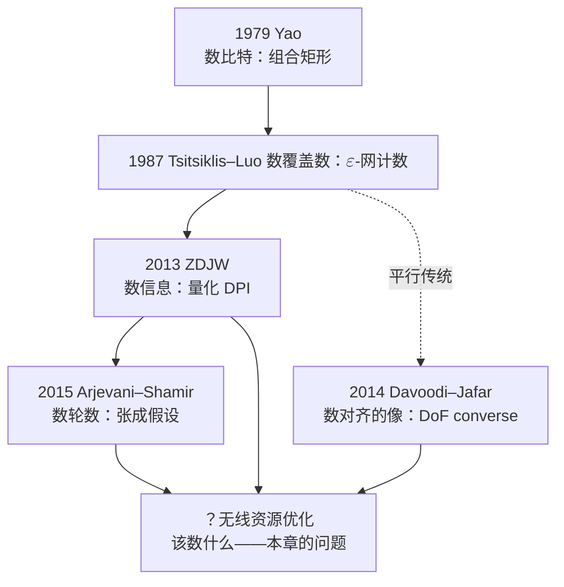
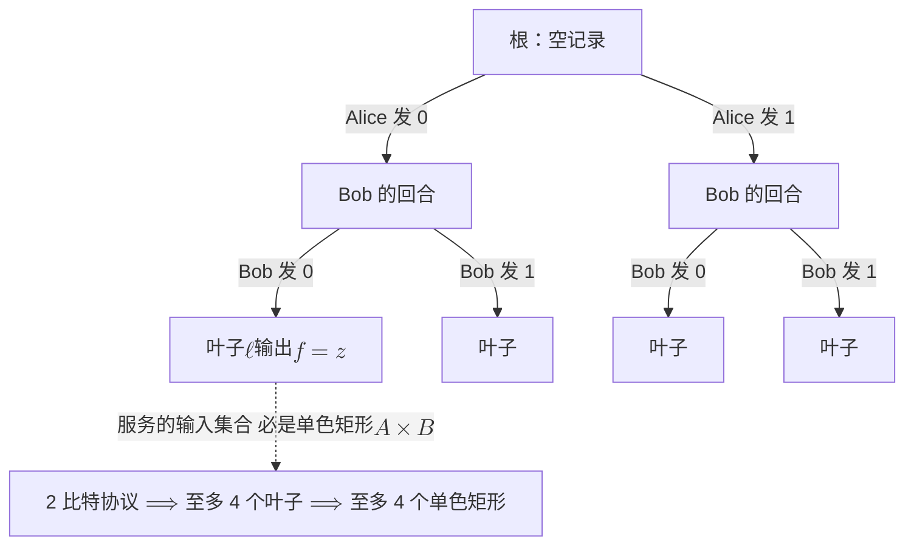
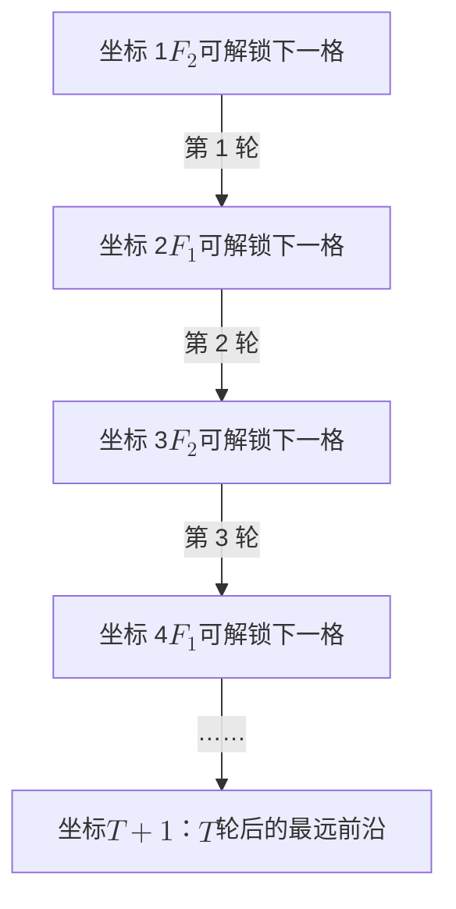
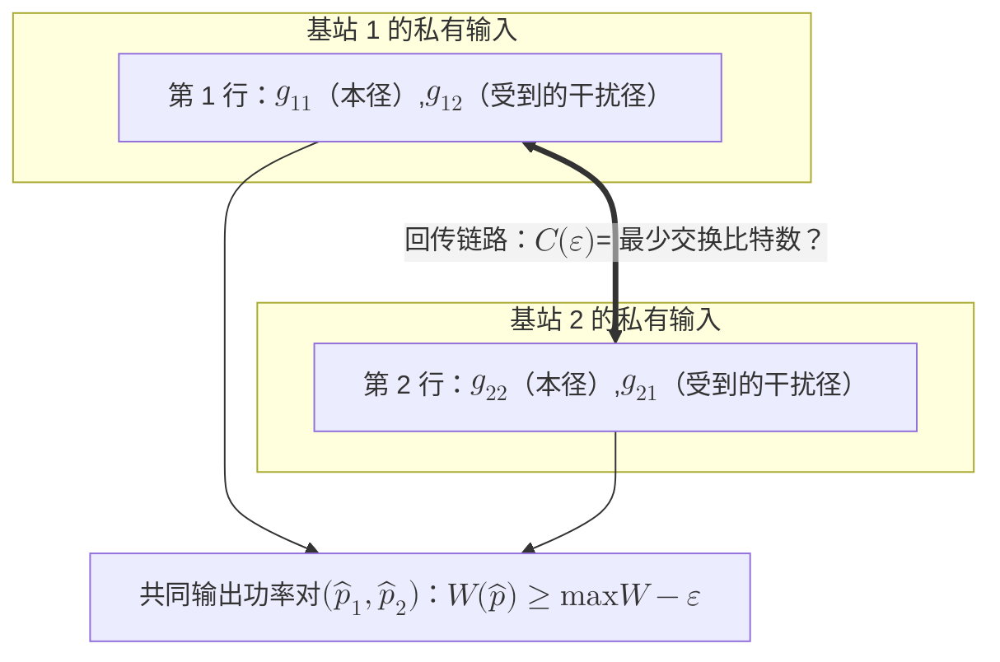
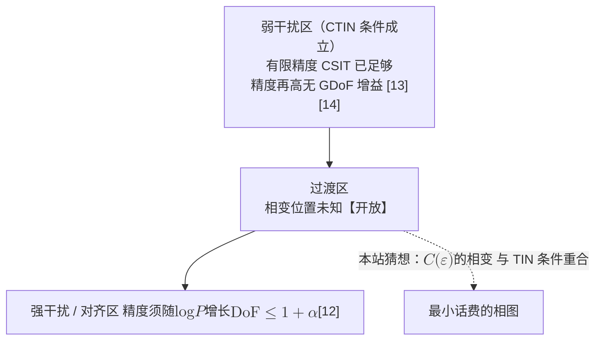

# 6 · 协同的最小话费：分布式优化的通信复杂度

分布式优化的四十年，几乎是一部"省话费"的技艺史：对偶分解把全网问题拆成本地子问题加价格信号（[第 2 章](02-classical-foundations.md)），ADMM 与 gossip 把消息压进邻居之间，联邦学习（Federated Learning, FL）把梯度量化到每维一比特。所有这些成就有一个共同的形状——**上界**（upper bound）：构造一个协议，证明"这么多通信就够了"。几乎无人反过来问：**最少要多少？**

一门只有可达性、没有逆定理（converse）的理论是不完整的。信道容量之所以配得上"容量"二字，是因为香农同时证明了"高于它必然出错"；[第 5 章](05-price-of-prediction.md)我们为"预测的价值"寻找它的率失真式价目表，本章问的是同一个纲领的第二问：**多个决策者要协同出一个近似最优的资源分配，最少要交换多少比特？** 我们把这个量叫作"协同的最小话费"。

先把边界划诚实。不能说"分布式优化没人做下界"——那会被一眼证伪：理论计算机科学与统计学里，下界已有四十年积累（Tsitsiklis–Luo 1987 [4]、Zhang–Duchi–Jordan–Wainwright 2013 [6]、Arjevani–Shamir 2015 [5]、Braverman 等 2016 [7]、Vempala–Wang–Woodruff 2020 [9]）。真正的空白在另一侧：用 "communication complexity" 加 power control / interference coordination / CSI exchange / lower bound 的组合去检索无线文献，返回的全是有限反馈下的 DoF 缩放律、比特分配方案与专利——**没有一篇把 Yao 意义下的通信复杂度问框架搬到资源分配问题上**。准确的说法是：**下界的手艺在优化与估计里已经磨了四十年，但从未越过无线这道墙。**【本站提法】

每一次传统的更替，换的都是"数什么"，而不是"怎么数"。无线要问的下界，连"数什么"都还没决定——比特、轮数、信道使用次数、CSI 精度，在 5G 系统里定价完全不同。本章沿四级台阶上行：先亲手证一次"不可能"（Yao 模型与 fooling set），再看优化下界的谱系（数覆盖、数信息、数轮数），然后形式化无线的三个特殊结构（广播、互易、CSI 的双重身份），最后把钉子钉进两小区功率控制。

!!! note "本章预备知识"
    需要：信息论基础（互信息、数据处理不等式）；通信复杂度从零讲起。用到的内容：

    - 互信息与数据处理不等式：[预备篇 4.3](../part0/04-information-theory-basics.md#43-互信息信息是不确定性的减少量)。
    - 自由度：[预备篇 5.5](../part0/05-mimo.md#55-mimo-容量与自由度从-logdet-到-minn_tn_rlogmathrmsnr)；CSIT：[预备篇 4.8](../part0/04-information-theory-basics.md#48-衰落信道容量三部曲)。
    - 对偶分解与 2.6 节埋下的"$O(1)$ 是上界，那下界呢"：[第 2 章](02-classical-foundations.md)。
    - 两链路和速率的二元功率最优性：[第 3 章](03-nonconvex-era.md)。
    - Yao 双方模型与 fooling set：预备篇没有讲，本章第一课从零开始。

## 第一课：Yao 双方模型——亲手摸到"不可能"

### 模型与矩形引理

Alice 持 $x\in X$，Bob 持 $y\in Y$，二人要共同计算 $f(x,y)\in\{0,1\}$。计算能力免费，**只有通信要钱**：二人按确定性协议 $\pi$ 轮流发送二进制消息，每条消息只依赖发送者自己的输入与此前的全部消息记录（transcript）。协议的代价是最坏输入下交换的总比特数，$f$ 的确定性通信复杂度（deterministic communication complexity）定义为

$$
D(f)\;=\;\min_{\pi\ \text{正确}}\ \max_{(x,y)\in X\times Y}\ \big|\pi(x,y)\big|
$$

其中 $|\pi(x,y)|$ 是 transcript 长度。这是 Yao 1979 年的模型 [1]，一切下界的舞台。

下面的引理要用到三个词。**协议树**（protocol tree）是把协议画成的一棵二叉树：每个内部节点标明这一步轮到谁说话，说话者按自己的输入和到此为止的记录决定发 0 还是发 1，也就是走向哪个孩子；从根走到叶子的路径就是 transcript，叶子上写着协议的输出。$c$ 比特的协议对应深度不超过 $c$ 的树，至多 $2^c$ 片叶子。**组合矩形**是形如 $A\times B$ 的输入集合：把 $f$ 排成以 $x$ 为行、$y$ 为列的通信矩阵，它就是挑出若干行 $A$、若干列 $B$ 交出的子矩阵，行和列都不必相邻。$f$ 在矩形上取常值，就称矩形是**单色**的（monochromatic）。

!!! abstract "引理（矩形引理）"
    确定性协议 $\pi$ 的协议树上，任一叶子 $\ell$ 所对应的输入集合是一个组合矩形（combinatorial rectangle）$A_\ell\times B_\ell$（$A_\ell\subseteq X$，$B_\ell\subseteq Y$），且 $f$ 在其上取常值（单色）。

证明值得慢讲，因为它是全章一切"不可能性"的心脏。设 $(x_1,y_1)$ 与 $(x_2,y_2)$ 都走到叶子 $\ell$，即产生同一份 transcript $t=(t_1,t_2,\dots)$。现在考虑"掉包"的输入 $(x_1,y_2)$，对消息序号 $k$ 归纳，证明它发出的第 $k$ 条消息也等于 $t_k$。设前 $k-1$ 条都与 $t$ 相同；轮到谁说话由记录决定，所以也与原来相同。若轮到 Alice，她的消息只依赖 $x_1$ 与这份相同的记录，所以和输入 $(x_1,y_1)$ 时发的一样，等于 $t_k$；若轮到 Bob，他的消息只依赖 $y_2$ 与相同的记录，所以和输入 $(x_2,y_2)$ 时一样，也等于 $t_k$。归纳到底，$(x_1,y_2)$ 产生的 transcript 与前两者完全相同，也走到 $\ell$；同理 $(x_2,y_1)$ 也走到 $\ell$。**双方都察觉不到对方被掉了包**，因为每一步只看得见"自己那半个输入 + 公共记录"。

剩下一步是把"交叉项也在"变成"是矩形"。记走到 $\ell$ 的输入集合为 $R_\ell$，令 $A_\ell=\{x:\ \text{存在 }y\text{ 使 }(x,y)\in R_\ell\}$，$B_\ell$ 同样定义。显然 $R_\ell\subseteq A_\ell\times B_\ell$。反过来任取 $x\in A_\ell$、$y\in B_\ell$，存在 $(x,y')\in R_\ell$ 与 $(x',y)\in R_\ell$，由掉包性质，$(x,y)$ 也在 $R_\ell$ 中。所以 $R_\ell=A_\ell\times B_\ell$。协议在同一叶子必须输出同一个值，所以 $f$ 在整个矩形上取常值。

把"掉包"论证画成一张 2×2 的通信矩阵，一眼就能看完：

| | $y_1$ | $y_2$ |
|---|---|---|
| **$x_1$** | $(x_1,y_1)\to\ell$ ✓已知 | $(x_1,y_2)\to\ell$ $\Longleftarrow$ **被迫** |
| **$x_2$** | $(x_2,y_1)\to\ell$ $\Longleftarrow$ **被迫** | $(x_2,y_2)\to\ell$ ✓已知 |

*两个对角点走到同一叶子 $\ell$（已知），协议就再也拦不住两个反对角点也走到 $\ell$（被迫）——因为每一方只看得见"自己的输入 + 公共记录"，察觉不到对方被掉了包。四格同属一个叶子 $\Longrightarrow$ 该叶子的输入集合是**矩形**；协议在同一叶子只能输出同一个值 $\Longrightarrow$ 矩形**单色**。*

!!! tip "直觉"
    一份 transcript 就是一个"结局"。$c$ 比特的协议至多有 $2^c$ 份不同的 transcript，也就是至多 $2^c$ 个结局；而每个结局能服务的输入集合被迫是矩形形状的。下界的一般套路由此而来：**证明 $f$ 的输入空间无法被少量单色矩形覆盖**。

### Fooling set：最干净的一刀

!!! note "定义（fooling set）"
    $S\subseteq X\times Y$ 称为 $f$ 的取值 $z$ 的 fooling set，若：(i) 对一切 $(x,y)\in S$，$f(x,y)=z$；(ii) 对 $S$ 中任意两个不同元素 $(x_1,y_1)$、$(x_2,y_2)$，有 $f(x_1,y_2)\neq z$ 或 $f(x_2,y_1)\neq z$。

!!! abstract "定理（fooling set 下界）"
    若 $f$ 有大小为 $t$ 的 fooling set，则 $D(f)\ge\log_2 t$。

证明很短：任一单色矩形装不下两个 fooling set 元素——否则该矩形同时含 $(x_1,y_1),(x_2,y_2)$，作为矩形也必含交叉项 $(x_1,y_2)$ 与 $(x_2,y_1)$，其中至少一个取值 $\neq z$，与单色矛盾。每个 fooling set 元素都会走到某片叶子，而由矩形引理，一片叶子的输入集合是单色矩形，所以 $t$ 个元素必须落在 $t$ 片不同的叶子上，叶子数 $\ge t$。最优协议的树深度为 $D(f)$，叶子至多 $2^{D(f)}$ 片，即 $2^{D(f)}\ge t$，取对数即得。

### EQUALITY：完整走一遍

判等函数 $\mathrm{EQ}_n(x,y)=1$ 当且仅当 $x=y$（$x,y\in\{0,1\}^n$）。取对角线

$$
S=\{(x,x):x\in\{0,1\}^n\},\qquad |S|=2^n,\qquad z=1
$$

条件 (ii) 显然成立：$x_1\neq x_2$ 时 $\mathrm{EQ}(x_1,x_2)=0\neq 1$。由定理立得 $D(\mathrm{EQ}_n)\ge n$。

但教科书里的精确值是 $n+1$，多出的这 1 比特要靠再数一步。先交代一个约定：Yao 模型里协议的输出写在叶子上，由 transcript 决定，所以**双方都得知道答案**；Bob 自己算出结果还不够，要让 Alice 从记录里也能读出来。下界这样数：$c$ 比特协议的叶子数 $\le 2^c$；上面 $2^n$ 个对角元素占据 $2^n$ 个互不相同的 1-单色叶子；另一方面 $\mathrm{EQ}_n$ 不是常值函数，$x\neq y$ 的输入必须走到某片输出 0 的叶子，它不可能是前面任何一片 1-叶子，故叶子总数 $\ge 2^n+1$。于是 $2^c\ge 2^n+1>2^n$，即 $c>n$；比特数是整数，所以 $c\ge n+1$。上界方向平凡：Alice 把 $x$ 全文发出（$n$ 比特），Bob 比对后回 1 比特把结果告诉 Alice。两头夹住：

!!! abstract "定理（EQUALITY 的确定性复杂度 [1][2]）"
    对一切 $n\ge 1$：

    $$
    D(\mathrm{EQ}_n)\;=\;n+1
    $$

    即确定性协议无法比"把整个输入搬过去"节省哪怕一个比特。

!!! tip "直觉"
    为什么判等这么"便宜"的问题也压缩不了？因为确定性协议要对**每一对**可能输入负责。$2^n$ 个对角点两两"互相掉包必出错"，协议树被迫为它们各开一间房。fooling set 是"不可压缩性"的组合化身。

**行为分析。** 注意方法的边界：fooling set 单独只能给到 $\ge n$，精确常数 $n+1$ 需要额外数一个 0-矩形——下界技术给出的往往是量级而非常数，常数要靠更精细的计数。这个诚实的缝隙值得记住：本章后面所有"$\Omega(\cdot)$"式结论都带着同样的性格。另一个观察：$D(\mathrm{EQ}_n)$ 随 $n$ 线性增长，意味着两台基站想确定性地核对各自的 $n$ 比特配置是否一致，最坏情况就得把配置整个传一遍——没有任何聪明协议能省。

### 随机性把 n 打成 O(1)：为后文埋一颗雷

现在给双方一串**公共随机比特**（public coins，双方都看得见的随机串），允许 $1/4$ 的单侧错误。协议惊人地便宜 [3]：把公共随机串的前 $2n$ 位读成 $r_1,r_2\in\{0,1\}^n$，Alice 发送两个内积

$$
a_1=\langle x,r_1\rangle \bmod 2,\qquad a_2=\langle x,r_2\rangle \bmod 2
$$

共 2 比特；Bob 用自己的 $y$ 计算同样两个内积并比对，全等则判"相等"。若 $x=y$ 永远正确；若 $x\neq y$，对随机 $r$ 有 $\Pr[\langle x,r\rangle=\langle y,r\rangle]=1/2$。理由如下：两个内积相等当且仅当 $\langle x\oplus y,r\rangle\equiv 0 \pmod 2$；差向量 $x\oplus y$ 非零，设它的第 $i$ 位为 1。固定 $r$ 的其余各位，翻转 $r_i$ 恰好翻转这个内积的奇偶，所以 $r$ 的全部取值两两配对，每对里恰有一个使内积为 0，概率正好 $1/2$。$r_1,r_2$ 独立，两次测试同时碰巧相等的概率是 $1/2\times1/2=1/4$。这种错误只会发生在 $x\neq y$ 一侧，所以叫**单侧错误**。于是

$$
R^{\text{pub}}_{1/4}(\mathrm{EQ}_n)=O(1),\qquad R^{\text{priv}}(\mathrm{EQ}_n)=\Theta(\log n)
$$

后者是私有硬币（各自的随机数对方看不见）的复杂度；Newman 定理说二者至多差一个对数：$R^{\text{priv}}(f)\le R^{\text{pub}}(f)+O(\log n)$ [2][3]。

记号说明：$R^{\text{pub}}_{\varepsilon}(f)$ 是允许使用公共硬币、要求**每个**输入上的出错概率都不超过 $\varepsilon$ 时，最坏输入下需要的最少比特数。计数口径也要对齐：这里的"2 比特"只数 Alice 发出的两个内积，由 Bob 给出判定；若像确定性那边一样要求双方都知道答案，Bob 再回 1 比特，共 3 比特。常数变了，"与 $n$ 无关"这一结论不变。

!!! success "关键结论"
    确定性 $n+1$ 比特，公共随机性 2 比特——**共享随机性把判等的话费从线性打到常数，是指数级坍缩**。请记住这个落差的量级：本章第四节将论证，无线信道的互易性恰好是一台天然的"公共随机数发生器"，这颗雷在那里引爆。

**行为分析。** 代入 $n=10^4$（约一个中等 CSI 报告的比特数）：确定性核对要一万比特，公共硬币两比特，错误率 $1/4$；把测试重复 $k$ 次即可把错误压到 $4^{-k}$，$k=10$ 时错误约 $10^{-6}$、话费 20 比特——仍与 $n$ 无关。随机性买到的不是小常数，是**复杂度类的跃迁**。

## 优化下界的谱系：数覆盖、数轮数、数信息

### Tsitsiklis–Luo 1987：第一次给连续优化数比特

Yao 的世界是组合的：输入是比特串，答案是 0/1。1987 年，Tsitsiklis 与 Luo 第一次把这套框架搬进连续优化 [4]——用他们自己的话说，"据我们所知，连续变量问题的近似求解的通信复杂度此前无人研究"。模型：处理器 $P_1,P_2$ 各持一个凸函数 $f_1,f_2\in\mathcal F$（定义在 $[0,1]^n$ 上），按协议交换二进制消息，终止后由 $P_1$ 输出一点 $x$，要求它是和函数的 $\varepsilon$-近似极小点：$f_1(x)+f_2(x)\le\min_y\,[f_1(y)+f_2(y)]+\varepsilon$。问题类 $\mathcal F$ 的通信复杂度定义为

$$
C(\mathcal F;\varepsilon)\;=\;\inf_{\pi\in\Pi(\varepsilon)}\ \sup_{f_1,f_2\in\mathcal F}\ C(f_1,f_2;\varepsilon,\pi)
$$

即最好的协议在最坏的函数对上花的比特数。（提醒一句记号：原文按 1987 年的习惯把下界写成 "$C\ge O(\cdot)$"，今天一律应转写为 $\Omega(\cdot)$，下同。）

!!! abstract "定理（Tsitsiklis–Luo 下界 [4]）"
    对二次类 $\mathcal F_Q=\{\|x-x^*\|^2:\ x^*\in[0,1]^n\}$ 及某常数意义下的强凸光滑类：

    $$
    C(\mathcal F;\varepsilon)\;\ge\;\Omega\big(n(\log n+\log(1/\varepsilon))\big)
    $$

    对有界 Lipschitz 凸类 $\mathcal F_L$：$C(\mathcal F_L;\varepsilon)\ge\Omega(n\log(1/\varepsilon))$。

证明思想是**覆盖数计数**，不是 fooling set，值得逐步写出：

1. 令 $f_1\equiv 0$。此时输出 $x$ 必须是 $f_2$ 单独的 $\varepsilon$-极小点。（$0$ 不在 $\mathcal F_Q$ 里；严格的写法是把 $f_1$ 固定成类中某个函数，例如 $\|x-c\|^2$，$c$ 为立方体中心。这时和函数 $2\|x-\tfrac{c+x^*}{2}\|^2+$常数 的极小点随 $x^*$ 扫过一个边长 $\tfrac12$ 的立方体，$\varepsilon$-极小点的半径变成 $\sqrt{\varepsilon/2}$，下面的计数只差常数因子。）
2. 设 $S$ 为输出映射在 $f_1\equiv 0$ 时的值域。$P_1$ 输出的 $x$ 只取决于它自己的函数 $f_1$ 和 transcript；$f_1$ 已经固定，$x$ 就只是 transcript 的函数。协议交换 $T$ 比特，transcript 至多 $2^T$ 种，故 $|S|\le 2^T$。
3. 取 $f_2(x)=\|x-x^*\|^2$：其 $\varepsilon$-极小点集合是以 $x^*$ 为心、半径 $\varepsilon^{1/2}$ 的球（与立方体的交）。$x^*$ 可落在 $[0,1]^n$ 任何位置，所以 $S$ 必须在 $\varepsilon^{1/2}$ 距离内触及立方体每一点——$S$ 是一个 $\varepsilon^{1/2}$-网。
4. 体积论证给覆盖数下界：$N$ 个半径 $\varepsilon^{1/2}$ 的球要盖住体积为 1 的单位立方体，体积之和至少为 1，即 $N\,V_n\,\varepsilon^{n/2}\ge 1$。这里 $V_n=\pi^{n/2}/\Gamma(n/2+1)$ 是 $n$ 维单位球的体积，由 Stirling 公式 $V_n^{1/n}\approx\sqrt{2\pi e/n}$，即 $V_n^{1/n}=\Theta(1/\sqrt n)$。故用半径 $\varepsilon^{1/2}$ 的球覆盖单位立方体至少需要

    $$
    N(\varepsilon)\;\ge\;\frac{1}{V_n\,\varepsilon^{n/2}}\;=\;\Big(\frac{A\sqrt n}{\sqrt\varepsilon}\Big)^{\!n}
    $$

    个球（$A$ 为绝对常数，$n$ 大时 $A\approx 1/\sqrt{2\pi e}\approx 0.24$）。
5. 于是 $2^T\ge|S|\ge N(\varepsilon)$，取对数：

    $$
    T\;\ge\;n\log_2\!\Big(\frac{A\sqrt n}{\sqrt\varepsilon}\Big)\;=\;\Omega\big(n(\log n+\log(1/\varepsilon))\big)
    $$

!!! tip "直觉"
    一句话可以把整个证明收进口袋：**协议只有 $2^T$ 个可能的"结局"，而问题有 $N(\varepsilon)$ 个本质不同的正确答案；$2^T\ge N(\varepsilon)$ 就是全部。** 优化的下界被化归为对答案空间覆盖数的计数。注意它与 EQUALITY 论证的血缘：都是"结局太少、需求太多"，只是"需求"从 fooling set 的基数换成了 $\varepsilon$-网的基数。

**行为分析。** 下界 $n\log(1/\varepsilon)$ 的读法是"每个坐标要说清 $\log(1/\varepsilon)$ 位精度"——这正是朴素量化的账单，所以它宣告：在比特意义上，逐坐标量化传输已接近最优，指望"聪明协议把 $n$ 维问题压成 $o(n)$ 比特"是徒劳。代入 $n=64$ 根天线、$\varepsilon=10^{-3}$：至少约 $64\times 10\approx 640$ 比特，量级与 5G CSI 反馈载荷惊人地接近。上界侧 [4]：$\mathcal F_L$ 类分布式重心法给 $O(n^2\log(1/\varepsilon)(\log n+\log(1/\varepsilon)))$，与下界 $\Omega(n\log(1/\varepsilon))$ 之间的比值是 $n\,(\log n+\log(1/\varepsilon))$——**不只是 $n$ 倍，还多一个对数因子**。TL 猜测其中的 $n$ 因子去不掉，这道鸿沟至今【开放】；强凸类分布式投影梯度（消息按几何精度量化）给 $O(n\log n(\log n+\log(1/\varepsilon)))$，距下界仅 $O(\log n)$【部分结果】。

### 一维紧界：两小区问题的原型协议

TL 的 Prop 4.1 在 $n=1$ 时给出完全匹配的上界 $C(\mathcal F_L;\varepsilon)=\Theta(\log(1/\varepsilon))$，协议本身极优雅，值得完整复述——它就是后文两小区功率控制上界构造的原型。双方共同维护四个数 $a_k,b_k,c_k,d_k$：$[a_k,b_k]$ 是极小点的括号区间，$[c_k,d_k]$ 是 $f_1'$ 在极小点处取值的括号区间。每阶段两人各发 1 比特：

$$
m_{i,k}=0\quad\Longleftrightarrow\quad (-1)^{i-1}f_i'\Big(\frac{a_k+b_k}{2}\Big)\;\le\;\frac{c_k+d_k}{2}
$$

两比特共四种组合，分别驱动 $[a_k,b_k]$ 或 $[c_k,d_k]$ 之一被二分。原因要用两个事实（设 $f_i$ 可导，且极小点 $x^*$ 落在区间内部）：极小点 $x^*$ 处 $f_1'(x^*)+f_2'(x^*)=0$，记 $t:=f_1'(x^*)=-f_2'(x^*)$；凸函数的导数单调不减，所以在 $x^*$ 左侧 $f_1'\le t\le -f_2'$，右侧 $-f_2'\le t\le f_1'$。记中点 $\mu=(a_k+b_k)/2$、门槛 $\tau=(c_k+d_k)/2$：

- $(m_{1,k},m_{2,k})=(0,1)$：$f_1'(\mu)\le\tau<-f_2'(\mu)$，即 $f_1'(\mu)+f_2'(\mu)<0$，$x^*$ 在 $\mu$ 右侧，令 $a_{k+1}=\mu$。
- $(1,0)$：对称地 $f_1'(\mu)+f_2'(\mu)>0$，$x^*$ 在左侧，令 $b_{k+1}=\mu$。
- $(0,0)$：若 $\mu\le x^*$，则 $t\le -f_2'(\mu)\le\tau$；若 $\mu\ge x^*$，则 $t\le f_1'(\mu)\le\tau$。两种情形都有 $t\le\tau$，令 $d_{k+1}=\tau$。
- $(1,1)$：对称地 $t>\tau$，令 $c_{k+1}=\tau$。

每阶段恰有一个区间减半，$2K$ 个阶段里总有一个区间被砍了至少 $K$ 次，所以 $2\log(1/\varepsilon)$ 个阶段后必有一个区间宽度 $\le\varepsilon$（初始宽度按常数计），两种情形都能给出 $\varepsilon$-最优点（换算细节见 [4] 的 Prop 4.1）。

!!! success "关键结论"
    "两方、各持连续私有信息、$\Theta(\log(1/\varepsilon))$ 比特"——这是分布式连续优化最干净的紧界样板。TL 1987 的一维协议，就是两小区功率控制上界构造的原型。

还有一份大礼藏在原文 Section VI 的开放问题里。第三条写道：可能的推广包括 $K>2$ 个处理器，以及**约束条件并非共同已知**的情形——例如约束形如 $g_1(x)+g_2(x)\le 0$，其中每个 $g_i$ 只被处理器 $P_i$ 知道。干扰耦合约束正是这个形状：每个基站只知道增益矩阵的自己那一行。**Tsitsiklis 和 Luo 在 1987 年就把这个问题留在了纸上，只是他们不知道它叫干扰协调。** 这条开放问题至今没有被系统解决【开放】。

### 两种货币：比特与轮数不可互推

往下走之前必须立起一个概念区分——通信下界有两种"货币"，混用会酿成错误：

| 货币 | 谁在数 | 模型假设 | 代表结果 |
|---|---|---|---|
| **比特数**（bits） | Tsitsiklis–Luo [4]；ZDJW [6] | 消息是二进制串，逐比特计费 | $\Omega(n\log(1/\varepsilon))$ 比特 |
| **轮数**（rounds） | Arjevani–Shamir [5] | 每轮可发 $\tilde O(d)$ 大小消息（够一个 $d$ 维向量） | $\Omega(\sqrt{1/\lambda}\,\log(1/\varepsilon))$ 轮 |

Arjevani–Shamir 在原文里点破了两者的关系：TL 的 $\Omega(d\log(1/\varepsilon))$ 比特界在轮数模型下**推不出任何非平凡的轮数下界**——因为把一个 $d$ 维向量说到 $\varepsilon$ 精度本来就需要 $O(d\log(1/\varepsilon))$ 比特，**一轮的预算恰好等于 TL 界的全部开销**。比特便宜时轮数可能贵，轮数便宜时比特可能贵，两张账单互不兑换。对无线读者，这个区分有直接的物价对应：轮数 $\approx$ 时延与调度开销（一次 RRC 交互），比特数 $\approx$ 频谱开销（若干 PRB）。5G 里两者定价完全不同——所以"无线的通信下界该数什么"，本身就是一个建模决策，而不是数学细节。【本站视角】

### Arjevani–Shamir 2015：数轮数

模型 [5]：$m$ 台机器，目标 $\min_{w\in\mathcal W}F(w)$，$F(w)=\frac1m\sum_{i=1}^m F_i(w)$，$\mathcal W\subseteq\mathbb R^d$；本地计算免费，只数通信轮数。函数族用 $\delta$-相关（$\delta$-related）参数化：二次情形下要求 $\|A_i-A_j\|\le\delta$、$\|b_i-b_j\|\le\delta$。$\delta$ 是"数据异构度"的旋钮：随机均分数据时 $\delta=O(1/\sqrt n)$，任意划分时 $\delta=\Omega(1)$，$\delta=0$ 时零通信即可解。（记号提醒：这里的 $n$ 是每台机器的本地样本数，不是 Tsitsiklis–Luo 一节的维数 $n$；本节与下一节 ZDJW 的维数都记作 $d$。$\lambda$-强凸指 $F(w)-\frac{\lambda}{2}\|w\|^2$ 仍是凸函数，即曲率处处至少为 $\lambda$；A-S 的定理 1 明确把局部函数取为 1-光滑（梯度的 Lipschitz 常数为 1），并限定 $\lambda\in[0,1)$、$\delta\in(0,1)$，这时 $1/\lambda$ 就是条件数 $\kappa$。）下界针对满足一个结构性张成假设（Assumption 1，新迭代点落在历史点、本地梯度与本地 Hessian 变换的张成空间内，覆盖 GD、加速 GD、DANE、DISCO 等主流算法）的算法类。

!!! abstract "定理（Arjevani–Shamir 轮数下界 [5]）"
    在 1-光滑、$\lambda$-强凸、$\delta$-相关的二次函数里可以构造这样的实例：任何满足张成假设的算法达到 $F(\hat w)-F(w^*)\le\varepsilon$ 至少需要

    $$
    \frac14\left(\sqrt{1+\delta\Big(\frac1\lambda-1\Big)}-1\right)\log\!\left(\frac{\lambda\|w^*\|^2}{4\varepsilon}\right)-\frac12\;=\;\Omega\!\left(\sqrt{\frac{\delta}{\lambda}}\,\log\frac{1}{\varepsilon}\right)
    $$

    轮通信。无关设定（$\delta=\Omega(1)$）下的四格全景：光滑强凸 $\Omega(\sqrt{1/\lambda}\log(1/\varepsilon))$、光滑凸 $\Omega(\sqrt{1/\varepsilon})$、非光滑强凸 $\Omega(\sqrt{1/(\lambda\varepsilon)})$、非光滑凸 $\Omega(1/\varepsilon)$。

下界的硬实例值得画出来。构造两个互补的块三对角二次函数：$F_1$ 含把坐标 $(2,3),(4,5),\dots$ 配对耦合的项，$F_2$ 含把 $(1,2),(3,4),\dots$ 配对耦合的项。总和 $F_1+F_2$ 的最优点全坐标非零，但每台机器单看自己的函数，坐标之间的耦合链是断开的——**信息只能沿链传递，每轮通信推进一格**：

$T$ 轮之后两台机器能算出的点只有前 $T+1$ 个坐标非零；要把误差压到 $\varepsilon$ 必须点亮足够多的坐标，轮数下界随之而来。为什么"足够多"是 $\sqrt{\kappa}\log(1/\varepsilon)$ 量级？这类链式二次函数（Nesterov 的经典硬实例）的最优点坐标按几何级数衰减，$w^*_j\propto q^j$，$q=\frac{\sqrt\kappa-1}{\sqrt\kappa+1}$。只点亮前 $T+1$ 个坐标的点至少错过尾部 $\sum_{j>T+1}(w^*_j)^2=q^{2(T+1)}\|w^*\|^2$，由强凸性目标误差也按 $q^{2T}$ 衰减。要它 $\le\varepsilon$，需要 $T\gtrsim\frac{\log(1/\varepsilon)}{2\log(1/q)}$；再用 $\log\frac1q=\log\big(1+\frac{2}{\sqrt\kappa-1}\big)\le\frac{2}{\sqrt\kappa-1}$，得 $T\gtrsim\frac{\sqrt\kappa-1}{4}\log\frac1\varepsilon$；把等效条件数 $\kappa=1+\delta(1/\lambda-1)$ 代入，就是定理首项的形状。

!!! tip "直觉"
    这个构造把"轮数"翻译成了"信息在依赖链上的传播距离"。它和物理里的光锥、分布式图算法里的邻域半径是同一个原型：**一轮通信只能把知识推进一跳**。后文 GNN 深度 = 通信轮数的字典，本质上还是这张图。

**行为分析。** 上界侧：分布式加速梯度下降（每轮本地梯度 + 一次平均）恰好匹配光滑两格——**朴素方法在最坏情况下已经最优**，想赢它只能靠利用数据相似性：$\delta$-相关下界 $\Omega(\sqrt{\delta/\lambda}\log(1/\varepsilon))$ 被 DISCO 在二次情形匹配，$\delta=O(1/\sqrt n)$ 时轮数随本地样本量下降——"数据越像，话越少"。两个必须交代的适用边界【部分结果】：(i) 下界依赖张成假设，不覆盖所有算法；(ii) 硬实例不是随机划分数据能产生的，随机划分下确实可以做得更好（A-S 自己指出）。**"下界"永远是"在某个算法类 + 某个实例类上的下界"**——这句方法论警告值得用加粗字体记住。另有单轮结果：任何单轮算法若通信少于 $\Omega(d^2)$ 比特，最坏情况不优于"直接返回某台机器本地极小点"这个平凡算法【摘要级结论】。

### ZDJW 2013：数信息——分布族决定话费

第三条传统来自统计估计 [6]：$m$ 台机器各持 $n$ 个 i.i.d. 样本，要在总通信预算 $B$ 比特内估计参数 $\theta\in\mathbb R^d$，问极小极大风险如何随 $B$ 退化。**极小极大风险**（minimax risk）是"最好的估计器在最坏的参数上的均方误差"：我们先定下协议与估计器，对手再针对它挑最难估的 $\theta$，我们要让这个最坏情形的误差尽量小，记作 $\mathfrak M$；上标 inter 表示允许多轮交互的协议，下文的 ind 表示各机器独立、一次性发送的协议。工具是**量化的数据处理不等式**：普通的数据处理不等式（[预备篇 4.3](../part0/04-information-theory-basics.md)）说信息过一道手不会变多，量化版进一步说，$B$ 比特消息携带的关于 $\theta$ 的信息还要在 $B$ 上再乘一个由分布族决定、可能远小于 1 的系数。信息论 converse（Fano 一脉）与通信复杂度在此合流。两个结果的对比最有教学价值：均匀位置族 $\mathrm{Unif}[\theta-1,\theta+1]$ 只需 $B=O(\log m\cdot\log(mn))$ 比特即可达到集中式速率 $1/(mn)^2$；而一维正态族 $\mathsf N(\theta,\sigma^2)$ 满足

$$
\mathfrak M^{\text{inter}}(\theta,\mathcal N,B)\;\ge\;c\,\frac{\sigma^2}{mn}\,\min\left\{\frac{mn}{\sigma^2},\ \frac{m}{\log m},\ \frac{m}{B\log m}\right\}
$$

要达到集中式速率 $\sigma^2/(mn)$，式中的 $\min\{\cdot\}$ 必须是 $O(1)$。前两项在样本多、机器多时都很大，只能靠第三项：$\frac{m}{B\log m}=O(1)$，即至少需要 $B=\Omega(m/\log m)$ 比特——对机器数近似线性。同样是估计一维位置参数，均匀族 $O(\log m)$、正态族 $\Omega(m/\log m)$：**通信需求不是问题维度决定的，是分布族的"信息形状"决定的。** 迁移到无线：CSI 的分布模型（瑞利、莱斯、稀疏毫米波）会改变最小话费的量级——先验越"尖"，话越少。

多维版本更锋利。$d$ 维、每台一个样本、无概率假设之外的结构时：

!!! abstract "定理（ZDJW Proposition 2：每客户端 d 比特，必要且充分 [6]）"
    $\mathcal P_d$ 为 $[-1,1]^d$ 上的分布族，机器 $i$ 预算 $B_i$，则独立协议的极小极大风险满足

    $$
    \mathfrak M^{\text{ind}}(\theta,\mathcal P_d,B_{1:m})\;\ge\;c\,\frac{d}{m}\,\min\left\{m,\ \frac{m}{\sum_{i=1}^m\min\{1,B_i/d\}}\right\}
    $$

    集中式速率为 $d/m$，故达到它必须让 $\min\{\cdot\}$ 里的第二项为 $O(1)$，即 $\sum_i\min\{1,B_i/d\}\gtrsim m$。和式共 $m$ 项、每项至多为 1，要达到 $m$ 的常数倍，就得有常数比例的机器满足 $B_i\gtrsim d$；各机器地位对称时，即**每台机器至少发 $B_i\gtrsim d$ 比特**。反向可达：机器把 $X_i\in[-1,1]^d$ 逐坐标随机二值化（$\Pr[Z_{ij}=1]=(1+X_{ij})/2$）只发 $d$ 比特，服务器取 $\hat\theta=\frac1m\sum_i(2Z_i-1)$，误差 $O(d/m)$：$\mathbb E[2Z_{ij}-1\mid X_{ij}]=2\cdot\frac{1+X_{ij}}{2}-1=X_{ij}$，再对 $X_{ij}$ 取期望得 $\theta_j$，所以每坐标无偏；$2Z_{ij}-1\in\{\pm1\}$，方差至多 1，$m$ 台独立平均后每坐标方差 $\le 1/m$，$d$ 个坐标合计 $\le d/m$。**"每客户端每维 1 比特"在常数因子内既必要又充分。**

!!! tip "直觉"
    下界说：$d$ 个自由度，每个至少要"表态"一次，一比特是表态的最小单位，谁也逃不掉。上界说：真的只要表态——一维一个随机硬币，均值无偏，噪声靠 $m$ 台机器平均掉。上下界在"一维一比特"处会师，几乎没有缝隙。

**行为分析。** 这条定理是联邦学习梯度压缩的地基与天花板的合影：SignSGD、1-bit 量化一类方法的"每维一比特"不是工程巧合，是信息论必然。Suresh 等 2017 [8] 在无概率假设的分布式均值估计里补齐了上界工艺，注意他们的两个结果不是一回事：**结构化随机旋转 + 量化**把 MSE 从朴素方案的 $\Theta(d/n)$（这里 $n$ 是客户端数，沿用 Suresh 等原文记号）压到 $O(\log d/n)$；要进一步做到 $O(1/n)$（极小极大最优）还需要**变长编码**。每维仍是常数比特；Braverman 等 2016 [7] 用分布式数据处理不等式把 ZDJW 的对数因子进一步抹平【摘要级结论，精确指数此处不列】。注意量纲：ZDJW 数的是**无噪数字信道上的比特**——这个限定条款在 AirComp 一节将变成关键伏笔。

### 谱系对照表

| 传统 | 数什么 | 硬度来源 | 代表下界 | 匹配上界 | 对无线的启示 |
|---|---|---|---|---|---|
| Yao 1979 [1] | 比特 | 单色矩形太少 | $D(\mathrm{EQ}_n)=n+1$ | 平凡协议 | 判定类问题的工具箱 |
| Tsitsiklis–Luo 1987 [4] | 比特 | $\varepsilon$-网太大 | $\Omega(n\log(1/\varepsilon))$ | 量化梯度类协议（差 $\log n$～$n$ 因子） | 连续输出的资源分配 |
| ZDJW 2013 [6] | 比特（含交互） | 量化 DPI 限流 | 每客户端 $\Omega(d)$ | 每维 1 比特随机化 | FL/CSI 反馈的地基 |
| Arjevani–Shamir 2015 [5] | 轮数 | 依赖链每轮一跳 | $\Omega(\sqrt{1/\lambda}\log(1/\varepsilon))$ | 分布式加速 GD | 时延受限的协同 |
| Davoodi–Jafar 2014 [12] | CSIT 精度 | 对齐的像太少 | $\mathrm{DoF}\le 1+\alpha$ | 量化反馈可达 | 无线自己的 converse 胚芽 |

五行五种货币，唯有最后一行原生于无线——而它数的还不是"协同"的话费，是"反馈"的精度。把前四行的手艺引渡到最后一行的场景，就是本章的纲领。

## 无线的三个特殊结构：经典模型没见过的世面

为什么不能把 TL 或 ZDJW 原封不动套到无线？因为无线信道自带三个经典通信复杂度模型里不存在的结构。逐一形式化它们——各自对应 CC 里什么模型、已有什么定理、还差什么——是本章的核心原创视角。【本站提法】

### 结构一：广播介质 = 黑板模型

无线是天然的一对多媒介：一次发送，多方接收。通信复杂度里恰好有现成的对应物——**黑板模型**（blackboard model）：$k$ 方通信时每条消息写在公共黑板上，所有人可见；与之对照的是 coordinator / message-passing 模型，消息点对点发给协调者。白话说：黑板模型里说一句话全场都听见，只计一次费；coordinator 模型里各方只能和一个不持输入的协调者单线通话，一条消息要让别人知道，得由协调者逐个转告，每转告一次另计一次费。小例子：$k=4$ 方，要让所有人都知道第 1 方手里的 1 比特。黑板上写 1 比特即可；coordinator 模型里第 1 方先发给协调者（1 比特），协调者再分别转告另外 3 方（3 比特），共 4 比特，话费随人头涨成 $k$ 倍。无线的一次广播对应黑板，有线回传上逐条点对点发送的信令更像 coordinator。下面定理里的 number-in-hand 指每方只看得见自己手里的那份输入。这两个模型的代价可以严格分离：

!!! abstract "定理（多方集合不交的模型分离 [10][25]）"
    $k$ 方 number-in-hand 集合不交问题 $\mathrm{DISJ}_{n,k}$（各方持 $X_i\subseteq[n]$，判定 $\bigcap_i X_i$ 是否为空）满足

    $$
    R^{\text{blackboard}}(\mathrm{DISJ}_{n,k})=\Omega(n\log k+k),\qquad R^{\text{coordinator}}(\mathrm{DISJ}_{n,k})=\Omega(nk)
    $$

    后者在 message-passing 模型下是紧的。黑板一侧的下界同样是紧的：Braverman–Oshman 2015 [25] 证明了黑板模型下的 $\Omega(n\log k+k)$，并给出匹配的确定性协议，所以黑板模型下 $\mathrm{DISJ}_{n,k}$ 的话费恰为 $\Theta(n\log k+k)$【摘要级结论】。**两相对照，广播把最坏情况通信代价省下约 $\Theta(k/\log k)$ 倍**（$n\log k$ 不小于 $k$ 时）。

!!! tip "直觉"
    点对点世界里，一条信息要让 $k$ 个人知道就得说 $k$ 遍，"公共知识"的建立本身要按人头计费；黑板世界里说一遍就够。DISJ 的分离定理把这句常识变成了严格账目：省的不是常数，是接近 $k$ 的因子。

**行为分析。** 代入 $k=100$ 个小区、$n$ 个信道模式：coordinator 模型话费 $\sim 100n$，黑板模型 $\sim n\log 100\approx 6.6n$——十五倍的差距。这是"**广播介质是资源而非负担**"的第一个硬证据，而且它是定理不是口号。差的那一步：没有人把资源分配问题归约到多方 DISJ 上，让这个分离在无线兑现【开放，本站钉子之一】。

### 结构二：信道互易性 = 免费的公共随机性

回忆第一课的悬念：公共随机性把 $\mathrm{EQ}$ 的话费从 $n+1$ 打到 $O(1)$，指数级坍缩。CC 里公共硬币是天上掉下来的假设；无线里它有物理来源——TDD 信道的互易性（reciprocity）给出 $h_{AB}\approx h_{BA}$：两端对同一段衰落过程做出**相关观测**。信息论早已证明相关观测可以提炼公共随机性：Maurer [19] 与 Ahlswede–Csiszár [20] 的公共随机性/密钥协商理论给出，公开讨论若干比特后，双方能以正速率蒸馏出（对第三方保密的）完美共享随机串。这正是物理层密钥生成的理论源头。

!!! example "算例：互易性每秒能印多少共享随机比特"
    没有数字，"免费的公共随机性"只是修辞。把预算表算出来：

    取 3.5 GHz、带宽 $B=20$ MHz、时延扩展 1 μs（相干带宽约 200 kHz $\Longrightarrow$ 约 **100 个独立频率抽头**）、步行速度 3 km/h（$f_D\approx 9.7$ Hz $\Longrightarrow$ 相干时间约 40 ms $\Longrightarrow$ 每秒约 **25 个独立时间块**）。每个独立观测能蒸馏的公共随机性以互信息为上界，$I(h_A;h_B)\lesssim\log_2(1+\mathrm{SNR}_{\mathrm{eff}})$，20 dB 时约 6.6 比特。这个上界可以这样验证：设两端观测为 $h_A=h+n_A$、$h_B=h+n_B$，$h$ 与两份估计噪声是相互独立的复高斯变量，信噪比都记作 $S$；二者的相关系数满足 $|\rho|^2=\big(\frac{S}{1+S}\big)^2$，联合高斯时 $I(h_A;h_B)=\log_2\frac{1}{1-|\rho|^2}=\log_2\frac{(1+S)^2}{1+2S}$，因为 $1+S\le1+2S$，它不超过 $\log_2(1+S)$。$S=100$ 时精确值约 5.7 比特，6.6 是偏乐观的上界。于是

    $$
    R_{\mathrm{cr}} \;\lesssim\; 100 \times 25 \times 6.6 \;\approx\; 1.6\times10^{4}\ \text{比特/秒},
    $$

    再为 reconciliation（信息协调：双方通过公开信道交换校验比特，把两份略有出入的量化观测纠成完全相同的比特串，交换出去的校验比特要从产出里扣掉）与非理想互易打个折，量级仍在 $10^3$–$10^4$ 比特/秒。

    **对照需求**：第一课算过，一次错误率 $10^{-6}$ 的 EQ 核对只要 20 比特**话费**，但它消耗的公共随机串远不止 20 比特。第一课的内积协议每个内积要读 $n$ 位随机串，10 次重复、每次两个内积，共 $2n\times10=2\times10^5$ 比特（$n=10^4$），这台发生器要攒十几秒。换用随机性更省的多项式指纹协议：把 $x$ 切成 334 段、每段 30 比特，当作有限域 $\mathrm{GF}(2^{30})$ 上一个次数 $\le 333$ 的多项式的系数，双方在同一个公共随机点（30 比特随机性）上求值，Alice 发出 30 比特的值供 Bob 比对。$x\neq y$ 时两多项式之差非零，至多 333 个根，出错概率 $\le 333/2^{30}\approx3\times10^{-7}$。每次核对只耗 30 比特随机性，这条"物理随机数发生器"每秒便可支撑**数百次**（约 $1.6\times10^4/30\approx530$ 次）一致性核对。**"渐近意义上的纲领性猜想"至此变成一条可证伪的工程断言**，也给开放问题 9 定下了量纲：要证明的是这 $10^4$ 比特/秒能替代多少协调话费。

!!! warning "陷阱（诚实性红线）"
    CC 的公共硬币模型假设的是**完美**共享随机串；互易性给的是**有噪相关**观测，把它变成完美共享串要花 reconciliation 通信，且提炼速率受限于观测的互信息。上面的算例算的正是这个上界，不是已经到手的比特。所以"互易性 = 免费公共硬币"是**渐近意义上的纲领性猜想**，桥梁是 Maurer/AC 的公共随机性容量——不是现成定理。写成定理是过度声称；写成纲领，它指出一条没人走过的路：**把物理层随机性预算与协议随机性需求做成同一本账。**【本站提法】

### 结构三：CSI 既是优化输入，又是被通信的消息

经典 CC 的输入 $x,y$ 是固定、无噪、已经攥在手里的字符串。无线的"输入"是信道状态 $G$：(i) 只能有噪估计；(ii) 时变，有相干时间；(iii) 最拧巴的一条——**它的获取本身要通过正在被它描述的那条信道**。于是问题不再是"给定 $x,y$ 算 $f$"，而是"通过对话逐步获取一个连续状态、并输出关于它的 $\varepsilon$-最优动作"。我们把这个形态称作**"关于连续状态的对话"**【本站原创提法】。它在数学谱系上落在经典 CC 与团队决策理论（Witsenhausen、Radner 一脉的分散信息结构）之间的无人区：CC 有下界工具但输入是离散静态的，团队决策有连续状态但从不数比特。目前**没有任何现成框架同时容纳这三条**——这不是本章的漏洞，是本章圈出的研究空地【开放】。

## 把钉子钉进两小区：$C(\varepsilon)$ 的形式化

原则说完，钉钉子。选分布式无线优化里最小的非平凡问题：两小区加权和速率最大化的功率控制。

### 问题与信息划分

增益矩阵 $G=[g_{ij}]_{2\times 2}$，$g_{ij}$ 为发射机 $j$ 到接收机 $i$ 的功率增益；功率 $p_i\in[0,P_{\max}]$；

$$
\mathrm{SINR}_i=\frac{g_{ii}p_i}{\sigma^2+g_{ij}p_j},\qquad W(p)=w_1\log(1+\mathrm{SINR}_1)+w_2\log(1+\mathrm{SINR}_2)
$$

关键是信息划分，而它在 FDD 蜂窝里物理上自然成立：用户 $i$ 测量并反馈给基站 $i$ 的是"到达自己的所有增益"，故 **BS $i$ 只知道 $G$ 的第 $i$ 行** $(g_{ii},g_{ij})$。两方各持一行、互不知对方那行——一个干净的 Yao 式双方划分：

!!! note "定义（两小区最小 CSI 交换 $C(\varepsilon)$）【本站形式化】"
    在归一化的信道集合（增益取 dB 后限定动态范围 $D$ dB）上，$C(\varepsilon)$ 定义为：最坏信道实现下，两基站为使各自输出的 $\hat p=(\hat p_1,\hat p_2)$ 满足 $W(\hat p)\ge\max_p W(p)-\varepsilon$，所需交换的最少比特数。

### 上界：量化 + 公共网格搜索

构造性上界三步：(1) 各基站把自己的两个增益（dB 值）量化到分辨率 $\Delta$，发送 $2\lceil\log_2(D/\Delta)\rceil$ 比特；(2) 双方现在持有同一份量化矩阵 $\hat G$，各自**精确求解** $\max_p W(p;\hat G)$（Yao 模型里计算免费，所以这一步零通信、也不引入第二重离散化误差——写成"网格搜索"是不严谨的）；(3) 用 $W$ 关于对数增益的 Lipschitz 常数 $L_W$ 把量化误差换算成目标损失。

第三步的因子 2 是所有"量化换最优性"论证的通用骨架，值得写全——**量化误差要付两次**：

$$
\begin{aligned}
W(\hat p;G) \;&\ge\; W(\hat p;\hat G) - L_W\Delta && \text{（真信道 vs 量化信道，付第一次）}\\
&\ge\; W(p^\star;\hat G) - L_W\Delta && \text{（}\hat p\text{ 在 }\hat G\text{ 上最优）}\\
&\ge\; W(p^\star;G) - 2L_W\Delta && \text{（把 }p^\star\text{ 换回真信道，付第二次）}
\end{aligned}
$$

取 $\Delta=\varepsilon/(2L_W)$，损失 $2L_W\Delta$ 恰好等于 $\varepsilon$。比特数这样数：每台基站有两个增益，各发 $\lceil\log_2(D/\Delta)\rceil$ 比特，一台共 $2\lceil\log_2(D/\Delta)\rceil$，两台合计 $4\lceil\log_2(D/\Delta)\rceil$，这就是下式的因子 4；再把 $D/\Delta=2L_WD/\varepsilon$ 代入即得

$$
C(\varepsilon)\;\le\;4\left\lceil\log_2\frac{2L_W D}{\varepsilon}\right\rceil\;=\;O\big(\log(1/\varepsilon)\big)
$$

形态与 TL 一维协议完全同构：连续私有信息、对数比特。

**把 $L_W$ 量纲化，就能给出落地数字。** $W=\sum_i w_i\log_2(1+\mathrm{SINR}_i)$ 对 dB 增益求导。$g_{ij}$ 是功率增益，$g=10^{x/10}$，所以 $\partial g/\partial x=g\cdot\frac{\ln 10}{10}$；用户 $i$ 的速率对本径增益的偏导不超过 $w_i\cdot\frac{\ln 10}{10}\cdot\frac{1}{\ln 2}\approx0.332\,w_i$，对它受到的干扰径增益的偏导也不超过这个数，而且在高 SINR、强干扰时两者可以同时接近上界。四个增益各有至多 $\Delta$ 的量化误差，合起来 $L_W\le2\times0.332\,(w_1+w_2)\approx0.664\,(w_1+w_2)$。取等权 $w_1=w_2=1$（$L_W\approx1.33$）、动态范围 $D=60$ dB、精度 $\varepsilon=0.01$ bit/s/Hz：

$$
C(\varepsilon)\;\lesssim\;4\left\lceil\log_2\frac{2\times1.33\times60}{0.01}\right\rceil = 4\times\lceil 13.96\rceil = \mathbf{56\ \text{比特}} .
$$

**行为分析**：把这个数与本章第二节的对照放在一起读——Tsitsiklis–Luo 界说 64 维问题要约 640 比特，而两小区功控只要约 56 比特。差别不在"无线特殊"，而在**维度**：$n=4$ 个标量 vs $n=64$ 个。这也提示两小区问题之所以适合当第一个钉子，正是因为它的比特预算小到可以逐比特争论。

{ .chart loading=lazy }
{ .chart loading=lazy }

*怎么读这张图：第一条是本节的上界 $4\lceil\log_2(2L_WD/\varepsilon)\rceil$（$L_W\approx1.33$、$D=60$ dB），$\varepsilon=0.01$ 处正是 56 比特；第二条是 Tsitsiklis–Luo 一维原型协议的比特数 $4\log_2(1/\varepsilon)$（每阶段两人各发 1 比特，共 $2\log_2(1/\varepsilon)$ 个阶段，按区间宽度计）。两条线斜率相同：精度每提高 10 倍，账单多 $4\log_2 10\approx13.3$ 比特，这就是"形态完全同构"的意思；两者相差的约 29 比特是动态范围 $D$ 与 Lipschitz 常数带来的起步价。图上没有下界：下一小节说明，二元功率最优性可能把它压到 $O(1)$，至今未知。曲线按两个公式计算。*

### 转折：二元功率最优性会掉包问题本身

下界呢？照搬 TL 的覆盖数论证——输出映射值域 $\le 2^T$，若最优功率对 $p^*(G)$ 随 $G$ 连续变动、像集需要 $N(\varepsilon)=\Theta(1/\varepsilon)$ 个球覆盖，则 $T\ge\Omega(\log(1/\varepsilon))$，与上界会师。看起来一个下午就能写完。

!!! warning "陷阱（覆盖数论证的暗礁）"
    两用户干扰信道的和速率最大化，最优功率常落在 $\{0,P_{\max}\}$ 的**角点**：Gjendemsjø 等 [26] 证明，两条链路把干扰当噪声、各受峰值功率约束、按**等权**和速率分配功率时，最优解总是"一条满功率、另一条降到最低功率"或"两条都满功率"，这叫**二元功率控制**；权重不等时不再有这个保证（例如两条链路 SNR 都是 10 dB、相互干扰的 INR 都是 0 dB、权重 $(1,\,0.3)$ 时，最优点是 $(P_{\max},\,0.205P_{\max})$，比最好的角点 $(P_{\max},0)$ 多 0.063 bit/s/Hz【本站演算】）。若最优解只能落在 $\{0,P_{\max}\}^2$ 的四个角点上（其中 $(0,0)$ 的 $W=0$，不可能最优，真正的候选只有 $(P,0),(0,P),(P,P)$ 三个，$P$ 即 $P_{\max}$），问题就退化成**有限输出的 argmax 判定**——答案空间覆盖数是 $O(1)$，覆盖数论证瞬间失效，甚至 $C(\varepsilon)=O(1)$ 都可能成立。

但这不是坏消息，是更好的故事。问题一旦变成"三个角点哪个最优"，正确的下界工具就从覆盖数换成了**fooling set 与 DISJ 归约**——恰好是第一课教的那套。**"连续输出的 $\varepsilon$-最优点"与"有限候选的 argmax 判定"是两类通信复杂度问题，可以差一个量级；而无线自己的结构（二元功率最优性）恰好把你从前者推向后者。** 下界研究的第一步不是算，而是判断你的问题属于哪一类——这个分岔本身就是方法论的收获。【本站提法】

$K$ 小区版本上，DISJ 归约的候选方案是：把 DISJ 实例编码进跨增益模式——"元素 $t$ 在集合 $X_i$ 中" 对应 "小区对在模式 $t$ 上强干扰"，则"是否存在必须错开调度的小区对"变成多方 DISJ 式判定。一旦归约成立，结构一的分离定理直接兑现：黑板（广播）模型 $\Omega(n\log k+k)$ 对 coordinator 模型 $\Omega(nk)$——**无线广播介质把协调话费省下 $\Theta(k/\log k)$ 倍**，这将是"广播是资源"在优化语境里的第一个定理【开放，本站钉子】。

## 四个战场：下界已经在场，只是没人当下界用

钉子钉在两小区是为了把问题削到最小。但"最小话费"这个问句，在今天四个真实战场上都已经是运营级问题——只不过每个战场都只有上界的军备竞赛，没有人把已经存在的下界搬过来当天花板用。

### 战场一：联邦学习的梯度压缩——地板已经浇好，无人站上去

联邦学习的通信瓶颈催生了一整片压缩文献：SignSGD 与 1-bit 量化、QSGD 式随机量化、Top-$k$ 稀疏化、误差反馈、以及各种组合。它们清一色是上界："我这样压，精度还能保住。"而 ZDJW Proposition 2 已经把地板浇好了：**要达到集中式极小极大速率，每个客户端至少要发 $\Omega(d)$ 比特，每维一比特既必要又充分**（[6]，见上文「ZDJW 2013：数信息」一节的定理框）。

!!! example "算例：一千万参数的模型，压缩的天花板在哪"
    取 $d=10^7$（一个千万参数级模型）、$m=100$ 个客户端。朴素 FP32 上传每轮每客户端 $32d=3.2\times10^8$ 比特（40 MB）。ZDJW 型地板说：$\Omega(d)=10^7$ 比特（1.25 MB）。

    两者之比恰是 32——**在这个模型下，梯度压缩的理论天花板是 32 倍，不是文献标题里常见的"千倍压缩"**。宣称千倍压缩的工作并不违反定理，它们靠的是别的东西：多轮之间的相关性、误差反馈的记忆、或者干脆放弃达到集中式速率（换成"够用就行"的精度目标）。**定理没有被违反，是被绕开了——而绕开的代价没有被定价，这正是缺口所在。**

必须把诚实边界写在正面：ZDJW 的 Proposition 2 说的是**单轮独立协议**下的**分布式均值估计**，而 FL 是多轮交互、迭代之间高度相关的优化过程。把它直接当成 FL 的下界是过度声称。多轮交互版本要引 Braverman 等的分布式数据处理不等式 [7]；压缩算子本身的"比特数—压缩误差"紧折中另有专门结果（Albasyoni 等 [24]）；含压缩的分布式随机优化下界与加速算法也已有近年工作（He 等 [11]）。

于是缺口可以说得很精确：**存在"单轮均值估计"的紧界，存在"压缩算子"的紧界，存在"轮数"的紧界（[5]），但不存在把三者合起来的那条界**——多轮、异构、带压缩的联邦优化，达到 $\varepsilon$-最优的最小总比特数是多少？【开放】

### 战场二：3GPP 两侧模型——标准化会场里的通信复杂度问题

据公开资料，3GPP 自 Rel-18 起把 AI/ML 空口列为研究项，Rel-19、Rel-20 持续推进（[21][22]；具体时间点与工作项范围以官方文本为准，此处只取方向性事实）。其中最难啃的是 **CSI 压缩的两侧模型**（two-sided model）：终端侧编码器把信道压成低维表示，基站侧解码器还原并做预编码。跨厂商时，编码器与解码器由不同公司训练——于是标准必须回答"两边如何就表示的语义达成一致"。

把工程语言翻译成本章语言：这**字面上**就是一个通信复杂度问题——两方各持私有信息（终端持信道观测，基站持调度意图），要在最少比特内共同产出 $\varepsilon$-最优的预编码决策。而标准化进程里堆积如山的是仿真对比与互操作测试，**没有一条"最少需要多少比特"的定理**。

有限反馈时代其实留下过一条 converse 味道的锚点：Jindal 的定标律说，要保住复用增益，每用户反馈比特必须随 SNR 线性增长，$B\approx(M-1)\log_2 P$ [23]。但它是**给定方案族**（零迫 + 随机向量量化）内的分析，不是"任何协议都至少要这么多"的下界。两侧模型时代把问题变得更难也更有趣：**跨厂商互操作要求建立的是"公共知识"（common knowledge），而通信复杂度理论恰好知道公共知识的建立要按人头与轮次计费。** 把这条线接上，是本章最贴近产业的落点【开放，本站提法】。

### 战场三：AirComp——它改变的不是话费，是货币单位

空中计算把多址信道的叠加当作加法器：$K$ 个设备同时发，接收端天然拿到和。综述 [17] 的核心论点是可达计算速率显著高于"通信与计算分离"，且参与设备越多优势越大；面向边缘 AI 的信号处理视角见 [18]。

它能免费算的函数类是有精确刻画的——**nomographic 函数** $f(x_1,\dots,x_K)=\psi\big(\sum_k\varphi_k(x_k)\big)$：各自预处理、叠加、再后处理。均值、和、最大值的软近似都在类内；类外的函数一分不省。

!!! warning "陷阱：AirComp 省掉的是设备重数，不是维度"
    $K$ 个设备各持 $d$ 维梯度要求和：数字方案需要 $\Theta(Kd)$ 次资源使用，AirComp 需要 $\Theta(d)$ 次——**省掉的是 $K$，不是 $d$**。取 $K=100$、$d=10^6$，是 $10^8$ 对 $10^6$，一百倍，恰等于设备数。

    更要紧的量纲问题：ZDJW 的下界是在**无噪数字信道上数比特**的，AirComp 是**功率受限的模拟信道**。前者的比特账单不能直接套到后者头上。**"AirComp 突破了通信下界"是错的说法；正确的说法是它换了一种货币，而这种货币的下界还没人算。**【开放】

### 战场四：GNN 的深度就是通信轮数——一个没人提起的天花板

图神经网络做功率控制与调度已成显学（[第 3 章](03-nonconvex-era.md)）。但消息传递 GNN 与分布式图算法之间存在一部字典，一旦建立，下界立刻兑现成 GNN 的硬天花板：

| GNN 的量 | 分布式算法的量 |
|---|---|
| 层数（深度 $L$） | 通信轮数 $T$ |
| 每层消息维度（宽度 $w$） | 每轮消息比特数 |
| 感受野半径 | $T$ 跳邻域 |
| 置换等变性 | 匿名节点、同构不可分辨 |

字典一立，两条现成结果就成了天花板。先交代两个分布式计算模型：**LOCAL 模型**里所有节点按同步轮次行动，每轮每个节点可以给每个邻居发一条任意长的消息，本地计算免费，只数轮数；**CONGEST 模型**同样按轮计，但每条消息限长 $O(\log n)$ 比特。$T$ 轮之后，一个节点至多知道自己 $T$ 跳邻域内的信息，这正是上表"感受野半径"一行。其一，LOCAL 模型的 KMW 下界 [15]：即使只要求多对数因子的近似，最小顶点覆盖、最小支配集、最大匹配也需要

$$
\Omega\!\left(\min\left\{\sqrt{\frac{\log n}{\log\log n}},\ \frac{\log\Delta}{\log\log\Delta}\right\}\right)
$$

轮通信（$n$ 为节点数，$\Delta$ 为最大度）。其二，Loukas 的结果 [16]：深度 $d$、宽度 $w$ 受限的消息传递 GNN（这里沿用原文把深度记作 $d$，即上表的 $L$，与前文的维数 $d$ 无关），除非 $d\cdot w$ 超过图规模的某个多项式，否则解不了圈检测、直径、最小割等问题。

**行为分析（含诚实的量级说明）。** 代入现实规模会发现常数并不吓人：$n=10^4$ 个节点、$\Delta=100$ 时，$\sqrt{\log_2 n/\log_2\log_2 n}\approx 1.9$，$\log_2\Delta/\log_2\log_2\Delta\approx 2.4$，取小者约 2 轮。所以这条界在有限规模上**不是**"GNN 必须很深"的强约束，它的力量在渐近侧与定性侧：**层数固定的 GNN，其能表达的调度策略被感受野半径硬性封顶，与参数量无关**——加宽、加参数、换激活函数都买不到额外的信息传播距离。而无线里的调度问题（哪些小区必须错开）与最大匹配、最小支配集有天然的血缘。

!!! success "关键结论"
    **GNN 不是万能逼近器，它是一个通信轮数受限的分布式算法。** 分布式图算法四十年的不可能性结果，原封不动地是基于 GNN 的资源分配方法的天花板。诚实的边界：KMW 是 LOCAL 模型（消息大小无限）的结果，Loukas 的宽度限制更接近 CONGEST；无线调度问题与 MVC/MDS 只是同族而非同一问题，严格搬运需要归约【开放：归约尚未完成】。但即便如此，**在无线 GNN 的汪洋文献里，几乎没有一篇讨论过自己的方法有没有信息传播意义上的天花板**——指出这一点的成本极低，冲击力极大。

### 通往第四部：学到的协议也要守下界

多智能体强化学习里，智能体可以**自己学出**通信协议（emergent communication）：发什么、发多少、发给谁都由训练决定。一个自然的幻想是"学出来的协议也许能绕过这些下界"。不能。下界约束的是**任何**协议——学出来的协议也是协议，它只是在协议空间里搜索，而下界刻画的正是这个空间的边界。学习能做的是逼近下界，不是移动下界。

这条线在本部只点到为止：**谁知道什么、何时知道**（信息结构）本身如何影响可达性，是[第四部 · 群体的决策论](../part4/index.md)的主题；本章交出去的接口是一个可计费的量——协同的最小话费。

## 三个可攻目标

下面每个方向都按同一格式给出"精确陈述 / 已知工具 / 第一步"。

### 目标 A：两小区 $C(\varepsilon)$ 的紧界

**精确陈述**：在上文定义的两小区模型上，确定 $C(\varepsilon)$ 的量级；特别是判定它属于"连续输出"类（预期 $\Theta(\log(1/\varepsilon))$）还是"有限候选 argmax"类（预期 $O(1)$ 或 $\Theta(\log\log(1/\varepsilon))$）。

**已知工具**：TL 的覆盖数论证与一维紧界协议 [4]；fooling set [1][2]；两链路等权和速率下二元功率控制的最优性 [26]。

**第一步（今天就能做）**：固定动态范围 $D$，在归一化增益空间里数出"最优角点标签"作为 $G$ 的函数有多少个本质不同的判别区域；若区域数随 $1/\varepsilon$ 增长，覆盖数论证复活，$\Omega(\log(1/\varepsilon))$ 成立；若区域数有界，改用 fooling set 在"判别边界附近"构造互相掉包必出错的实例对。**两种结局都是可发表的结论**——这是一个不会空手而归的第一步。

### 目标 B：干扰协调的 CSI 需求相图

这一目标要用到几个术语。**自由度**（DoF）是高 SNR 下容量随 $\log_2\mathrm{SNR}$ 增长的斜率，$C\approx\mathrm{DoF}\cdot\log_2\mathrm{SNR}$，一条无干扰的单天线链路算 1 个（见[预备篇 5.5](../part0/05-mimo.md)）；**GDoF**（广义自由度）让各链路强度按 SNR 的不同幂次缩放，用来刻画强弱不一的干扰。**CSIT** 是发射端掌握的信道状态信息（[预备篇 4.8](../part0/04-information-theory-basics.md)）；"有限精度"指发射端的信道误差不随功率 $P$ 升高而缩小；$\alpha$ 则表示误差按 $P^{-\alpha}$ 缩小。**TIN**（treating interference as noise）即把干扰当噪声；**干扰对齐**是多个发射机协同预编码，让干扰在接收端挤进同一个子空间。

**精确陈述**：把"需要多少 CSI 精度"画成干扰强度的函数。文献里已有两块拼图：Davoodi–Jafar 证明有限精度 CSIT 下 DoF 坍缩到 1，且若 CSIT 误差按 $P^{-\alpha}$ 缩小（精度指数为 $\alpha$），则 $\mathrm{DoF}\le 1+\alpha$ 且可达 [12]——**这是一条彻头彻尾的"比特换性能"逆定理**；Geng 等的 TIN 最优性条件说，当每个用户的期望信号强度（dB 尺度）不小于其造成的最强干扰与受到的最强干扰之和时，"各自高斯码本 + 功控 + 干扰当噪声"已在常数间隙内最优 [13]；Joudeh–Caire 进一步证明有限精度 CSIT 下多小区 TIN 的 GDoF 最优性在整个 mc-CTIN 区域成立——**在该区域内，干扰对齐的 GDoF 增益全部消失** [14]。

**本站猜想**：$C(\varepsilon)$ 的量级跳变发生在 TIN 最优性条件的边界上——条件成立侧，判断"该不该协作"只需 $O(1)$ 比特（因为 TIN 条件几乎是局部可验的：每个节点只需自己那一行一列的强度指数）；条件失效侧，"协作到什么程度"要求 $\Theta(\log(1/\varepsilon))$ 乃至随 $\log P$ 增长的精度。**"决策 vs 精调"的二分，可能正是最小话费相图的骨架。**【开放，本站提法】

**第一步**：在两小区上验证这个二分——把 TIN 条件写成增益矩阵的显式不等式，在条件成立域内构造 $O(1)$ 比特协议并证明其 $\varepsilon$-最优性。

### 目标 C：模拟信道上的 FL 下界

**精确陈述**：把 ZDJW 型下界从无噪数字信道搬到功率受限的高斯多址信道上——$K$ 个设备、$d$ 维、总功率约束 $P$、信道使用 $n$ 次，达到给定估计误差所需的最小 $n$ 是多少？AirComp 的可达性已有（nomographic 类 $\Theta(d)$ 次），**converse 完全空白**。

**已知工具**：ZDJW 的量化 DPI [6] 与 Braverman 等的分布式 DPI [7]（需从比特预算改写为功率-带宽预算）；AirComp 可达性 [17][18]；率失真式的模拟-数字对照。

**第一步**：$d=1$、$K$ 个设备、单次信道使用的最简情形——在功率约束下证明估计方差的下界，并与 AirComp 的可达性对照。**这是一个一页纸的问题，但它会立刻告诉我们"模拟货币"的汇率长什么样。**

!!! info "跨部连线"
    本章所在的线索：[代价](../guide/05-eight-threads.md#5-代价要付的到底是什么)、[极限与基线](../guide/05-eight-threads.md#7-极限与基线离墙还有多远)。

    - [第二部 2.8 节](../part2/02-blackwell.md#28-无线实验族的第一张排序图)：两侧模型能否互操作的亏格判据，与本章的最小话费是一体两面。
    - [第四部 4.3 节](../part4/04-coordination-information-theory.md#43-算例两基站错开发射的协调价签)：把"协调"写成信息论问题：两个基站错开发射的协调价签是 $1-h(\epsilon)$ 比特。
    - [第四部 5.2 节](../part4/05-shared-world-model.md#52-通信复杂度的三级共享无共享共享随机共享模型)：共享随机性与共享模型各能省下多少话费。

## 开放问题

1. **两小区 $C(\varepsilon)$ 的紧界**【开放，本站钉子】：连续输出类还是 argmax 判定类，量级未定（目标 A）。
2. **$K$ 小区的 DISJ 归约与广播增益的兑现**【开放，本站钉子】：把资源分配归约到多方 DISJ，让黑板与 coordinator 的 $\Theta(k/\log k)$ 分离 [10][25] 在无线语境成立。
3. **最小话费的相图**【开放，本站提法】：$C(\varepsilon)$ 的相变是否与 TIN 最优性边界重合 [13][14]（目标 B）。
4. **模拟信道上的分布式估计 converse**【开放】：功率受限多址信道上 ZDJW 型下界的对应物（目标 C）。
5. **多轮 + 异构 + 压缩的联邦优化下界**【开放】：单轮均值估计 [6]、压缩算子 [24]、轮数 [5] 三条紧界之外，合起来的那条界不存在。
6. **TL 1987 遗留的"约束不共同已知"情形**【开放，文献共识】：$g_1(x)+g_2(x)\le 0$ 且 $g_i$ 只被 $P_i$ 知道——干扰耦合约束正是这个形状，原文 Section VI 留下，至今未被系统解决 [4]。
7. **"关于连续状态的对话"的框架**【开放，本站提法】：同时容纳有噪估计、时变相干、以及"输入需通过被描述的信道获取"三条的下界框架，目前不存在（结构三）。
8. **GNN 天花板的严格归约**【开放】：把 KMW/Loukas 的不可能性 [15][16] 严格搬运到无线调度问题类上。
9. **互易性→公共随机性的预算账**【开放，本站提法】：把物理层随机性蒸馏速率 [19][20] 与协议的随机性需求做成同一本账，量化"互易性能省多少协调比特"。

!!! success "本章的一句话"
    分布式优化四十年只报账单不问底价。**没有 converse 的理论不是完整理论**——而 converse 的手艺（数矩形、数覆盖、数信息、数轮数、数对齐的像）早已齐备，缺的只是有人把它们领进无线的门。这道门后面站着四个已经在烧钱的战场：联邦学习、CSI 反馈、空中计算、图神经调度。

## 参考文献

1. A. C.-C. Yao, 《Some Complexity Questions Related to Distributive Computing》, Proc. 11th ACM Symposium on Theory of Computing (STOC), pp. 209–213, 1979. DOI: 10.1145/800135.804414
2. E. Kushilevitz, N. Nisan, 《Communication Complexity》, Cambridge University Press, 1997. https://www.cambridge.org/core/books/communication-complexity/427E022FCBAC3FB5CEE4D39008D1E118
3. T. Roughgarden, 《CS369E: Communication Complexity (for Algorithm Designers), Lecture 3》, Stanford University, 2015（公共硬币 EQUALITY 协议与 Newman 定理的完整证明）. https://timroughgarden.org/w15/l/l3.pdf ；扩展讲义见 arXiv:1509.06257
4. J. N. Tsitsiklis, Z.-Q. Luo, 《Communication Complexity of Convex Optimization》, Journal of Complexity, 3(3):231–243, 1987. DOI: 10.1016/0885-064X(87)90013-6. 全文: https://www.mit.edu/~jnt/Papers/J018-87-comm_compl_convex.pdf
5. Y. Arjevani, O. Shamir, 《Communication Complexity of Distributed Convex Learning and Optimization》, Advances in Neural Information Processing Systems (NIPS) 28, pp. 1747–1755, 2015. https://proceedings.neurips.cc/paper/2015/file/7fec306d1e665bc9c748b5d2b99a6e97-Paper.pdf
6. Y. Zhang, J. C. Duchi, M. I. Jordan, M. J. Wainwright, 《Information-Theoretic Lower Bounds for Distributed Statistical Estimation with Communication Constraints》, NIPS, 2013（期刊扩展见 arXiv:1405.0782）. https://arxiv.org/abs/1405.0782
7. M. Braverman, A. Garg, T. Ma, H. L. Nguyen, D. P. Woodruff, 《Communication Lower Bounds for Statistical Estimation Problems via a Distributed Data Processing Inequality》, Proc. 48th ACM STOC, pp. 1011–1020, 2016. https://arxiv.org/abs/1506.07216
8. A. T. Suresh, F. X. Yu, S. Kumar, H. B. McMahan, 《Distributed Mean Estimation with Limited Communication》, Proc. ICML, 2017. https://arxiv.org/abs/1611.00429
9. S. S. Vempala, R. Wang, D. P. Woodruff, 《The Communication Complexity of Optimization》, Proc. ACM-SIAM SODA, 2020. https://arxiv.org/abs/1906.05832
10. J. M. Phillips, E. Verbin, Q. Zhang, 《Lower Bounds for Number-in-Hand Multiparty Communication Complexity, Made Easy》, Proc. SODA, 2012（https://arxiv.org/abs/1107.2559）；coordinator / message-passing 模型下集合不交的紧界见 M. Braverman, F. Ellen, R. Oshman, T. Pitassi, V. Vaikuntanathan, 《A Tight Bound for Set Disjointness in the Message-Passing Model》, Proc. IEEE FOCS, 2013. https://arxiv.org/abs/1305.4696
11. Y. He, X. Huang, Y. Chen, W. Yin, K. Yuan, 《Lower Bounds and Accelerated Algorithms in Distributed Stochastic Optimization with Communication Compression》, arXiv:2305.07612, 2023（修订 2025）. https://arxiv.org/abs/2305.07612
12. A. G. Davoodi, S. A. Jafar, 《Aligned Image Sets under Channel Uncertainty: Settling a Conjecture by Lapidoth, Shamai and Wigger on the Collapse of Degrees of Freedom under Finite Precision CSIT》, arXiv:1403.1541, 2014（期刊版 IEEE Trans. Inf. Theory, 62(10):5603–5618, 2016）. https://arxiv.org/abs/1403.1541
13. C. Geng, N. Naderializadeh, A. S. Avestimehr, S. A. Jafar, 《On the Optimality of Treating Interference as Noise》, IEEE Trans. Inf. Theory, 61(4), 2015. https://arxiv.org/pdf/1305.4610
14. H. Joudeh, G. Caire, 《Optimality of Treating Inter-Cell Interference as Noise Under Finite Precision CSIT》, Proc. IEEE ISIT, 2020（期刊版《Cellular Networks With Finite Precision CSIT: GDoF Optimality of Multi-Cell TIN and Extremal Gains of Multi-Cell Cooperation》, arXiv:2008.08945）. https://arxiv.org/abs/2001.05935
15. F. Kuhn, T. Moscibroda, R. Wattenhofer, 《Local Computation: Lower and Upper Bounds》, Journal of the ACM, 63(2), 2016. https://arxiv.org/abs/1011.5470
16. A. Loukas, 《What Graph Neural Networks Cannot Learn: Depth vs Width》, Proc. ICLR, 2020. https://arxiv.org/abs/1907.03199
17. A. Şahin, R. Yang, 《A Survey on Over-the-Air Computation》, IEEE Communications Surveys & Tutorials, 2023. https://arxiv.org/abs/2210.11350
18. S. M. Azimi-Abarghouyi, C. Fischione, K. Huang, 《Over-the-Air Federated Learning: Rethinking Edge AI through Signal Processing》, IEEE Signal Processing Magazine（预印本）, arXiv:2512.03719. https://arxiv.org/abs/2512.03719
19. U. M. Maurer, 《Secret Key Agreement by Public Discussion from Common Information》, IEEE Trans. Inf. Theory, 39(3):733–742, 1993.
20. R. Ahlswede, I. Csiszár, 《Common Randomness in Information Theory and Cryptography — Part I: Secret Sharing》, IEEE Trans. Inf. Theory, 39(4):1121–1132, 1993.
21. 《5G-Advanced Evolution in 3GPP Release 19》, arXiv:2312.15174. https://arxiv.org/pdf/2312.15174
22. 《A Tale of Two Mobile Generations: 5G-Advanced and 6G in 3GPP Release 20》, arXiv:2506.11828. https://arxiv.org/pdf/2506.11828
23. N. Jindal, 《MIMO Broadcast Channels with Finite-Rate Feedback》, IEEE Trans. Inf. Theory, 52(11):5045–5060, 2006. https://arxiv.org/abs/cs/0603065
24. A. Albasyoni, M. Safaryan, L. Condat, P. Richtárik, 《Optimal Gradient Compression for Distributed and Federated Learning》, arXiv:2010.03246, 2020. https://arxiv.org/abs/2010.03246
25. M. Braverman, R. Oshman, 《On Information Complexity in the Broadcast Model》, Proc. ACM Symposium on Principles of Distributed Computing (PODC), pp. 355–364, 2015. DOI: 10.1145/2767386.2767425
26. A. Gjendemsjø, D. Gesbert, G. E. Øien, S. G. Kiani, 《Binary Power Control for Sum Rate Maximization over Multiple Interfering Links》, IEEE Transactions on Wireless Communications, 7(8):3164–3173, 2008. DOI: 10.1109/TWC.2008.070227
