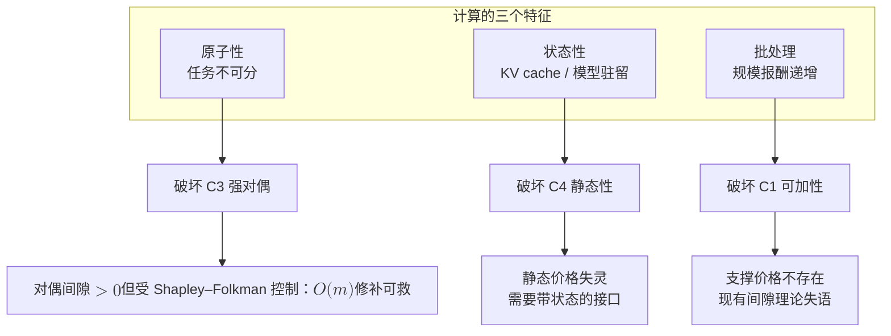
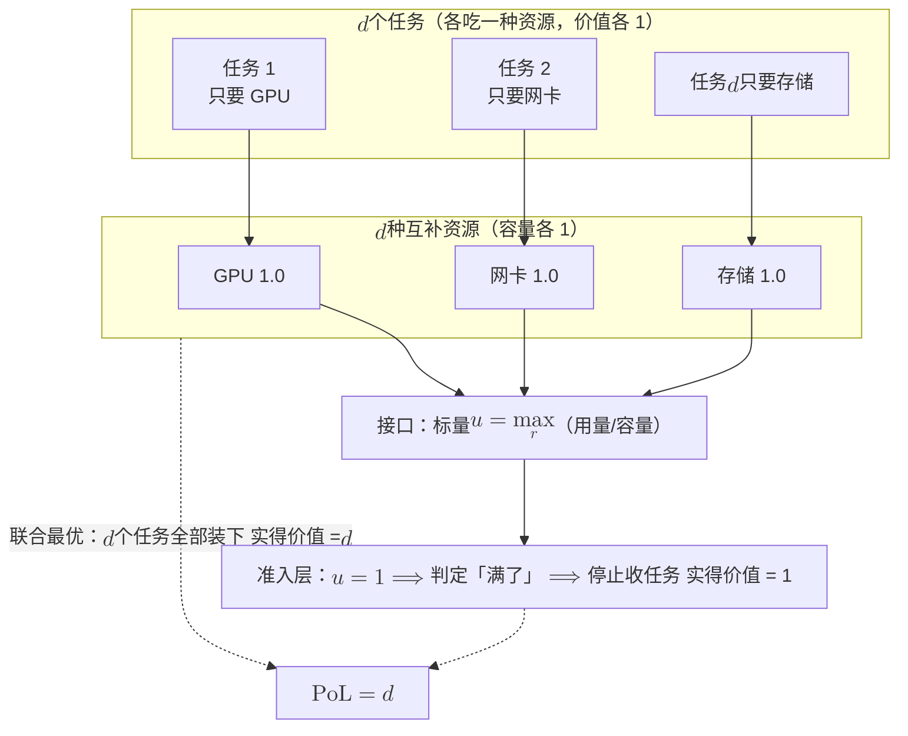
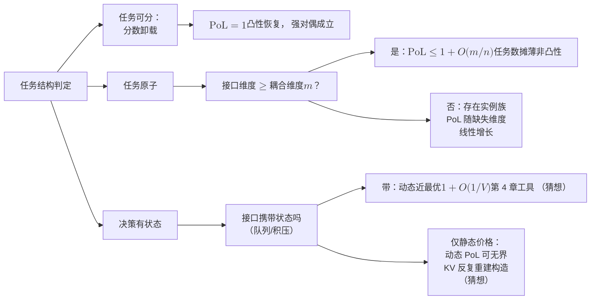

# 7 · 分层的代价：通信-计算联合系统的 NUM 2.0

2007 年 1 月，《Proceedings of the IEEE》登出一篇 58 页的长文《Layering as Optimization Decomposition》[1]。Chiang、Low、Calderbank 与 Doyle 在文中给 TCP/IP 分层架构补发了一张迟到三十年的数学出生证。

这篇文章的主张很强。"分层挺好用"是工程师的话，而这篇文章说的是：

- 整个网络可以建模为一个广义网络效用最大化（generalized NUM）问题。
- 每一层恰好是这个问题被分解出来的一个子问题。
- 层间接口恰好是协调这些子问题的优化变量。

按这个读法，TCP 的拥塞窗口是对偶变量的工程化身，路由器的队列长度是影子价格（shadow price），它们都有数学上的来历，不是工程妥协或缓冲区的副作用。垂直方向的分解给出功能分层（拥塞控制、路由、调度、功控、编码），水平方向的分解给出分布式计算。

[第 2 章](02-classical-foundations.md)证明了价格能协调什么。本章要问的是价格协调不了什么。

原作者自己写下过两句自我限定，值得反复引用：

- **分解不唯一**：同一个 NUM 问题可以有许多种不同的分解，对应不同的分层架构。所以架构是被选择出来的，没法单靠推导得到。
- **间隙要有界**：只要每层的次优间隙有界、架构本身是"好"的，某一层次优设计对系统的损害就能被控制住。原作者从未主张分层零损失，他们只是预设了"间隙有界"这个当时无人量化的前提 [1]。

本章不推翻 2007 年的结论，要做的是兑现它留下的欠条：把"间隙有界"从一个假设变成一个可计算的量。

欠条为什么到今天才必须还？因为这张出生证是给**通信网络**做完体检后发的：流量无限可分、效用对源可加、耦合只发生在链路容量上。

二十年后，边缘计算、大模型推理、算力网络把**计算**插进了协议栈：

- 任务以整份为单位卸载。
- KV cache 让今天的放置改变明天的代价。
- GPU 批处理让一个任务的成本取决于同批的邻居。

器官换了，出生证从未重新体检。

模块化会在数学上严格失效，信息论早有先例。Cover、El Gamal 与 Salehi 在 1980 年证明：点对点成立的信源-信道分离定理（[预备篇 4.9](../part0/04-information-theory-basics.md)），在相关信源的多址信道下一般不成立，并用二元加法信道给出了严格反例 [2]。这比 NUM 出生证早 27 年。

"分而治之是否无损"是一个数学问题，早就有过严格反例，答案取决于问题结构，和修辞无关。

!!! success "本章中心命题（全章一切材料服务于这一句）"
    - 分层的合法性来自三个结构条件。
    - 计算会逐条破坏这些条件。
    - 破坏的程度可以用一个数度量，即**分层的代价**（Price of Layering, PoL）。
    - 这个数的大小，由**接口维度与耦合维度之比**决定。

    PoL 是本站提出的量，是一个比值，读作"分层让系统差了几倍"：代价类问题取"分层代价 ÷ 联合最优代价"，效用类问题取"联合最优效用 ÷ 分层实得"。两种写法都保证 $\mathrm{PoL}\ge 1$，等于 1 即分层无损。正式定义见下文 7.4 节"PoL：定义、上界、下界与分类纲领"。

!!! note "本章预备知识"
    需要：对偶分解与强对偶的条件、马尔可夫决策过程的概念。用到的内容：

    - 强对偶与 Slater 条件：[预备篇 7.3](../part0/07-optimization-basics.md#73-拉格朗日对偶把约束变成价格)；对偶分解与次梯度：[预备篇 7.6](../part0/07-optimization-basics.md#76-对偶分解与分布式实现价格如何自己找到)。
    - 信源–信道分离定理：[预备篇 4.9](../part0/04-information-theory-basics.md#49-率失真分离定理与全站索引)。
    - 马尔可夫决策过程：[预备篇 8.2](../part0/08-reinforcement-learning.md#82-马尔可夫决策过程序贯决策的语言)；遗憾：[预备篇 8.1](../part0/08-reinforcement-learning.md#81-从一台老虎机说起探索还是利用)。
    - Pigou 例与 PoA $=4/3$：[第 1 章](01-three-mountains.md)；NUM 的分解即分层：[第 2 章](02-classical-foundations.md)；drift-plus-penalty：[第 4 章](04-sequential-uncertainty.md)。
    - smoothness 框架与 Shapley–Folkman 引理：预备篇没有讲，本章就地给出。

## 7.1 分解即分层：无损成立的三个结构条件 {#分解即分层无损成立的三个结构条件}

### 7.1.1 把 NUM 写成层间语言

先把[第 2 章](02-classical-foundations.md)的 NUM 用"层间语言"重写一遍。有 $n$ 个实体（源、任务、租户），实体 $i$ 的决策是 $x_i\in\mathcal{X}_i$，效用是 $U_i$，另有 $m$ 条耦合资源约束：

$$
\max_{\{x_i\}}\ \sum_{i=1}^{n} U_i(x_i)
\quad \text{s.t.} \quad
\sum_{i=1}^{n} A_i x_i \preceq c,
\qquad x_i \in \mathcal{X}_i .
$$

**第一步：写出拉格朗日函数。** 引入乘子 $\lambda\in\mathbb{R}_+^m$，按定义展开，再把与 $i$ 有关的项归拢：

$$
\begin{aligned}
L(\{x_i\},\lambda)
&= \sum_{i=1}^{n} U_i(x_i) + \lambda^{\top}\Big(c-\sum_{i=1}^{n} A_i x_i\Big)\\
&= \lambda^{\top} c + \sum_{i=1}^{n}\Big[\,U_i(x_i) - \lambda^{\top} A_i x_i\,\Big] .
\end{aligned}
$$

这样整理以后，目标是一个常数项，加上 $n$ 个各只含一个 $x_i$ 的项。

**第二步：对 $x$ 取最大化。** 目标对 $i$ 可加（第一个结构条件），耦合只通过线性项 $\lambda^{\top}A_i x_i$ 进入（第二个结构条件），所以 $\max$ 可以逐项分离：

$$
g(\lambda) \;=\; \max_{\{x_i\in\mathcal{X}_i\}} L(\{x_i\},\lambda)
\;=\; \lambda^{\top} c + \sum_{i=1}^{n}\ \max_{x_i\in\mathcal{X}_i}\Big[U_i(x_i)-\lambda^{\top}A_i x_i\Big] .
$$

每个"$\max_{x_i}$"就是一层（或一个分布式实体）的本地问题，$\lambda$ 就是层间接口。

### 7.1.2 价格更新就是队列方程

**第三步：更新价格。** 对偶主问题 $\min_{\lambda\succeq 0} g(\lambda)$ 由价格更新完成：沿对偶次梯度 $c-\sum_i A_i x_i(\lambda)$（超额供给）下降，投影到非负象限。它为什么是次梯度，见[预备篇 7.6](../part0/07-optimization-basics.md)的价格迭代。

那里的原问题是最小化，对偶做次梯度**上升**。这里的原问题是效用最大化，对偶问题是 $\min g$，所以方向反过来，做**下降**。算法是同一个：

$$
\lambda(t+1) \;=\; \Big[\lambda(t) - \beta\Big(c - \sum_{i} A_i x_i(t)\Big)\Big]^{+} .
$$

**物理意义**

这条更新式就是队列方程：到达超过服务，$\lambda$ 涨；反之则落。说"队列长度是影子价格"，是把上式逐字读出来，没有打比方。

整个协议栈于是成为一台分布式对偶算法。每层解自己的本地问题，只通过 $m$ 个数（价格/队列/时延信号）与别层通话。

**行为分析**

接口的信息量是 $m$ 维实向量，每轮刷新一次。

当强对偶成立时（第三个结构条件：$U_i$ 凹、$\mathcal{X}_i$ 凸、Slater 条件，见[预备篇 7.3](../part0/07-optimization-basics.md)），$p^{\star}=d^{\star}$，最优价格 $\lambda^{\star}$ 是**充分接口**：各层只看 $\lambda^{\star}$ 就能拼出全局最优，一比特额外协商都不需要。这就是"分层无损"的全部数学内容。

### 7.1.3 分层无损的结构条件

!!! note "备注（本站提炼：分层无损的四个结构条件）"
    Chiang 等人与 Palomar–Chiang 的技术前提散落在推导各处，原文并未列成清单。本站把它们提炼为四条。这个"三条件加一隐含条件"的框架是本站的组织方式：

    - **(C1) 目标可加可分**：全局目标是 $\sum_i U_i(x_i)$，实体之间没有交叉项；
    - **(C2) 耦合只经线性资源约束**：实体间唯一的相互作用是 $\sum_i A_i x_i \preceq c$；
    - **(C3) 强对偶**：$U_i$ 凹、$\mathcal{X}_i$ 凸、Slater 成立，于是 $p^{\star}=d^{\star}$，价格接口充分；
    - **(C4) 静态/时标可分**（隐含）：问题是单次静态优化，或对偶迭代远快于问题参数的漂移。

    计算主要从 (C3)、(C4)、(C1) 三个方向破门，下一节逐条演示。

!!! tip "直觉：价格是一个 m 维的信息瓶颈"
    分层把"所有人知道所有事"压缩成"所有人只知道 $m$ 个数"。只要耦合的全部内容都能被这 $m$ 个数编码（C1–C3 保证了这一点），压缩就是无损的。

    分层的代价，是接口这条细管子装不下耦合信息时产生的失真。这个说法立刻把本章与[第 6 章](06-communication-lower-bounds.md)的通信下界接上了轨。

### 7.1.4 出发前的两点说明

还有两件事必须在出发前说清。

- **分解方法不止一种**：Palomar 与 Chiang 系统整理过原始分解（耦合变量固定后解耦）与对偶分解（耦合约束定价后解耦），二者还能嵌套成多级分解。同一问题的不同分解对应不同架构，这就是"架构是选择"的技术内容 [3]。
- **不分层也有代价**：本章度量的是分层的代价，而 Kawadia 与 Kumar 在 2005 年警告过**不分层的代价**。无节制的跨层设计导致"意大利面条式"的耦合，扼杀模块化与后续创新 [4]。

这两个代价必须摆在一架天平上，不能只看一边。PoL 想做的是给天平的一端配上砝码，让"要不要打穿层"从口水仗变成算术题。

```mermaid
flowchart TB
    P["全局 NUM 问题<br/>目标可加 C1 + 线性耦合 C2"] --> DD["拉格朗日对偶分解"]
    DD --> S1["本地子问题 1<br/>= 拥塞控制层"]
    DD --> S2["本地子问题 2<br/>= 路由 / 调度层"]
    DD --> S3["本地子问题 $$n$$<br/>= 物理层功控"]
    S1 --> IF["接口：$$m$$ 维价格 $$\lambda$$<br/>现实化身：<br/>队列长度 / ECN / 时延"]
    S2 --> IF
    S3 --> IF
    IF --> UP["价格更新 = 队列方程<br/>C3 强对偶 $$\Rightarrow$$<br/>接口充分，分层无损"]
    UP --> DD
```

## 7.2 计算的三次破坏 {#计算的三次破坏}

计算插进协议栈以后，从三个方向破坏上面的结构条件：任务不可分，决策有状态，批处理有规模效应。

### 7.2.1 第一击：原子性，对偶间隙从零变正 {#第一击原子性对偶间隙从零变正}

任务不能"卸载 0.7 个"。一份整体的推理请求、一份不可拆的 KV cache，把 $\mathcal{X}_i$ 从区间变成 $\{0,1\}$。非凸集合让 (C3) 失效：凹包与函数本身分离，支撑超平面不复存在，$p^{\star}\ne d^{\star}$。价格接口开始漏信息。

这两个几何词可以借下面的 0/1 算例来读。拉格朗日函数对每个决策变量是线性的：价值减去价格乘用量。线性函数在 $\{0,1\}$ 上与在填实后的区间 $[0,1]$ 上最大值相同，所以对偶分不清"整份卸载"和"允许卸载分数个任务"。

$d^{\star}$ 其实是后者，即**松弛问题**的最优值。算例里 $d^{\star}=2.5$，而整份卸载的真实最优是 $p^{\star}=2$。

几何上，松弛相当于把原问题换成从上方盖住它的最小凹函数，即**凹包**（concave hull），$d^{\star}$ 读的是凹包的值。凸情形下，最优点处总有一个价格让各方的本地最优恰好拼出全局最优，这个价格在几何上是一张**支撑超平面**（supporting hyperplane）。凹包一旦与原问题分开，这样的价格就不存在了。

间隙有多大、后果是什么，一个能手算的最小例子看得最清楚。

!!! example "算例（两个原子任务争一份算力：把对偶间隙算到小数点后一位）"
    共享边缘算力 $R=1$。任务 A：需求 $r_A=1$、价值 $v_A=2$；任务 B：需求 $r_B=0.5$、价值 $v_B=1.5$。联合问题是一个 0/1 背包：

    $$
    p^{\star} \;=\; \max_{x_A,x_B\in\{0,1\}}\ 2x_A + 1.5\,x_B
    \quad \text{s.t.} \quad x_A + 0.5\,x_B \le 1 .
    $$

    A、B 同时入选需要 $1.5>1$ 的算力，不可行；单选 A 得 2，单选 B 得 1.5。所以联合最优是 $p^{\star}=2$，选 A。

    **第一步：写出对偶函数。** 逐步展开，其中第二步用了 0/1 变量的逐项独立最大化：

    $$
    \begin{aligned}
    L(\lambda) &= \max_{x_A,x_B\in\{0,1\}}\Big[2x_A+1.5x_B+\lambda\big(1-x_A-0.5x_B\big)\Big]\\
    &= \lambda + \max_{x_A\in\{0,1\}}(2-\lambda)x_A + \max_{x_B\in\{0,1\}}(1.5-0.5\lambda)x_B\\
    &= \lambda + \big(2-\lambda\big)^{+} + \big(1.5-0.5\lambda\big)^{+} .
    \end{aligned}
    $$

    **第二步：按 $\lambda$ 分三段。**

    $$
    \begin{aligned}
    \lambda\in[0,2]:&\quad L(\lambda)=\lambda+(2-\lambda)+(1.5-0.5\lambda)=3.5-0.5\lambda\quad(\text{递减})\\
    \lambda\in[2,3]:&\quad L(\lambda)=\lambda+0+(1.5-0.5\lambda)=1.5+0.5\lambda\quad(\text{递增})\\
    \lambda\ge 3:&\quad L(\lambda)=\lambda\quad(\text{递增})
    \end{aligned}
    $$

    **第三步：取最小值。** 最小值在 $\lambda^{\star}=2$ 处取得：$d^{\star}=2.5$。最大化问题的对偶从上方逼近，所以 $d^{\star}\ge p^{\star}$。对偶间隙 $d^{\star}-p^{\star}=0.5$，占最优值的 25%。

    **第四步：看分层实现。** 在 $\lambda^{\star}=2$ 处，A 的本地净收益 $v_A-\lambda^{\star}r_A=0$（无差别），B 的净收益 $1.5-2\times 0.5=0.5>0$（严格想进）。价格无法把 A 挑出来。各实体按本地净收益行事，架构放进 B，剩下 $0.5$ 的算力 A 塞不进去。分层实得 1.5：

    $$
    \mathrm{PoL}(\text{本例}) \;=\; \frac{p^{\star}}{\text{分层实得}} \;=\; \frac{2}{1.5} \;=\; \frac{4}{3} \approx 1.333 .
    $$

**物理意义**

价格机制实现的是"按单位资源价值密度排序"。B 的密度 $1.5/0.5=3$ 高于 A 的 $2/1=2$，所以价格永远偏爱 B。

但原子性让"剩余资源"作废：放进 B 之后剩下的 $0.5$ 算力谁也用不了。联合最优看得见这层浪费，价格看不见，因为单一标量装不下"选了 B 就装不下 A"这条组合信息。

**行为分析（本站演算）**

挑到倒霉价格并不是原因，这是"价格必须出清"的结构性后果。张贴价 $\lambda$ 只有三种归宿：

- $\lambda\ge 3$ 时无人想进，实得 0。
- $\lambda<2$ 时两者都想进，总需求 $1.5>1$，超售。超售点不是价格动力学的驻点（次梯度更新还会推着 $\lambda$ 涨），停不住。
- $\lambda\in[2,3)$ 时只有 B 严格想进，需求 $0.5\le 1$，市场出清，实得 1.5。

想在 $\lambda^{\star}=2$ 处反过来安排 A，就必须同时驳回净收益严格为正的 B。按整体形状 $(v_i,r_i)$ 点名 A、再强行配给掉 B，这两个动作都超出了标量价格的表达能力。

于是一切以出清为终点的"单一价格 + 本地净收益"实现，实得都不超过 1.5（工程上常用的价值密度配给同样选 B：密度 $3>2$）。这个小例子因此顺带给出一个架构类下界：该实例上，单价格出清类架构的 $\mathrm{PoL}\ge 4/3$。

!!! warning "陷阱：这个 4/3 与那个 4/3 毫无关系"
    [第 1 章](01-three-mountains.md)算过 Roughgarden–Tardos 的 PoA $=4/3$。数字相同纯属巧合：

    - 那个 $4/3$ 来自**自私行为**：每个用户忽略自己施加的边际拥塞。
    - 本例的 $4/3$ 来自**整数性**：价格装不下组合约束。

    两者的机制、适用范围和修复手段都不同。把巧合点破，比假装它是同一个定理诚实得多。

间隙会失控吗？1976 年 Aubin 与 Ekeland 给出了本章最重要的可引定理：不会，只要耦合约束少、任务多。【已解决】

!!! abstract "定理（对偶间隙的 Shapley–Folkman 界，Aubin–Ekeland 1976 [5]；现代形式见 [6]）"
    考虑可分非凸问题 $\min \sum_{i=1}^{n} f_i(x_i)$ s.t. $\sum_i A_i x_i \preceq b$、$x_i\in X_i$，其中 $m$ 为耦合约束个数。定义单函数的**非凸度**

    $$
    \rho(f) \;=\; \sup\Big\{\, f\Big(\sum_{j}\alpha_j x_j\Big)-\sum_{j}\alpha_j f(x_j)\ \Big|\ x_j\in\mathrm{dom}f,\ \alpha_j\ge 0,\ \sum_j \alpha_j = 1 \Big\}
    $$

    （凸函数取 0）。则存在可行点 $x^{\sharp}$（$\sum_i A_i x_i^{\sharp}\preceq b$），使

    $$
    d^{\star} \;\le\; \sum_{i=1}^{n} f_i\big(x_i^{\sharp}\big) \;\le\; d^{\star} + (m+1)\max_i \rho(f_i),
    $$

    其中 $d^{\star}$ 为对偶最优值（最小化问题从下方逼近，$d^{\star}\le p^{\star}$）。界只依赖耦合约束个数 $m$ 与单任务非凸度，与任务数 $n$ 无关。

    定理还需要一些正则条件（例如各 $X_i$ 紧、$f_i$ 下半连续），确切条件见 [5][6]，此处从略。

定理里的**非凸度** $\rho(f)$ 量的是：$f$ 在某个凸组合点上的函数值，最多比端点函数值的同权平均（几何上是"弦"）高出多少。凸函数永远不高于弦，所以取 0。

例：带启动开销的卸载代价 $f(0)=0$、$f(x)=1+x\ (0<x\le 1)$。连接 $(0,0)$ 与 $(1,2)$ 的弦是 $2x$，在 $x=t$ 处 $f(t)-2t=1-t$。$t\to 0^{+}$ 时它趋于 1，故 $\rho(f)=1$，恰好是启动开销。

常数 $m+1$ 来自一条几何引理。先说两个词：

- 集合的 **Minkowski 和**（Minkowski sum）是逐个取点相加得到的集合，$S_1+S_2:=\{s_1+s_2\mid s_1\in S_1,\ s_2\in S_2\}$。
- **凸包** $\mathrm{conv}\,S$ 是 $S$ 中点的一切凸组合，即把 $S$ 填实后的最小凸集。

!!! note "引理（Shapley–Folkman）"
    设 $S_1,\dots,S_n\subset\mathbb{R}^{m}$。则 $\mathrm{conv}(S_1+\dots+S_n)$ 中任一点 $z$ 都可写成 $z=\sum_{i=1}^{n} z_i$，其中每个 $z_i\in\mathrm{conv}\,S_i$，且**至多 $m$ 个**集合取的是原集合之外的凸包点（$z_i\notin S_i$），其余集合取的都是原集合 $S_i$ 里的点。

**极小例子**

$m=1$，$S_1=S_2=S_3=\{0,1\}$。和集是 $\{0,1,2,3\}$，其凸包是整段 $[0,3]$。

取 $z=1.5$，写成 $1+0.5+0$：只有第二个集合用了凸包 $[0,1]$ 里的分数点 $0.5$。$[0,3]$ 里任何一点都能这样写：整数部分放若干个 1，零头交给一个集合。集合数 $n$ 再多，零头也只占一个，这就是"非凸性不随 $n$ 叠加"。

**"+1"来自目标函数那一维**

**第一步：把每个任务的选择打包成点集。** 把任务 $i$ 的全部选择打包成 $\mathbb{R}^{m+1}$ 中的点集 $S_i=\{(f_i(x_i),\,A_ix_i)\mid x_i\in X_i\}$：$m$ 个坐标记它占用的各资源量，多出的一个坐标记它的代价。

**第二步：说明 $d^{\star}$ 对应凸化问题。** 第一击开头说过，对偶只看得见线性量：每个任务要最小化的 $f_i(x_i)+\lambda^{\top}A_ix_i$ 是 $S_i$ 上的线性函数，分不清 $S_i$ 与 $\mathrm{conv}\,S_i$。所以 $d^{\star}$ 就是"每个任务都可取凸包点"的凸化问题的最优值。

**第三步：套用引理。** 对凸化问题的最优点在 $\mathbb{R}^{m+1}$ 中套用引理，至多 $m+1$ 个任务取了凸包点 $\sum_j\alpha_j\big(f_i(x_{ij}),A_ix_{ij}\big)$。

**第四步：把这些任务改回可行点。** 设 $X_i$ 凸、非凸性全在 $f_i$ 的形状里，把这些任务的决策改成 $x_i=\sum_j\alpha_jx_{ij}$。资源用量不变（约束对 $x_i$ 线性），代价至多比凸包值高 $\rho(f_i)$（这就是 $\rho$ 的定义）。于是得到定理中的可行点 $x^{\sharp}$，代价不超过 $d^{\star}+(m+1)\max_i\rho(f_i)$。

**物理意义**

许多非凸集合的 Minkowski 和近似凸。凸化问题的最优解中，**至多 $m+1$ 个**分量取"分数"值，其余分量自动落回原始非凸集合。

这意味着：价格能自动摆平 $n-m-1$ 个任务，只剩 $O(m)$ 个"骑墙者"需要中心出手修补。非凸性不随任务数叠加，只随耦合维度叠加。

**LP 松弛：0/1 情形的手算版本**

当非凸性来自 0/1 集合而非函数形状时，有一个更好手算的版本。**LP 松弛**（linear programming relaxation）把 $x_i\in\{0,1\}$ 放宽成 $x_i\in[0,1]$，它的最优值就是第一击开头说的松弛值 $d^{\star}$。

**第一步：** LP 的最优解可以取在可行域的顶点上。

**第二步：** $n$ 维空间的顶点要有 $n$ 条线性无关的约束取等号，而耦合约束只有 $m$ 条，所以至少 $n-m$ 个变量卡在 $0$ 或 $1$，**至多 $m$ 个分数分量**。

**第三步：** 把分数分量全部舍为 0 仍然可行，每舍一个至多损失 $\max_i v_i$，故间隙 $\le m\cdot\max_i v_i$。

用它验算上面的算例：$m=1$，$\max_i v_i = 2$，界给出间隙 $\le 2$，实测 $0.5$，一致。

算例的 LP 最优解是 $(x_A,x_B)=(\tfrac12,1)$：先装密度高的 B，剩下 $0.5$ 装半个 A，值 $1.5+2\times\tfrac12=2.5=d^{\star}$，恰好一个分数分量。把 $x_A$ 舍掉就回到分层实得 $1.5$。同时也看到该界相当保守【部分结果：更稳定的间隙界是活跃研究方向，见 [6] 一系工作】。

**行为分析（本站解读，须标注）**

定理给出的 $x^{\sharp}$ 是**可行**点，其构造可以读成一个架构："价格分层 + 至多 $m+1$ 处跨层修补"。于是纯分层与联合最优之间的距离，恰好等于 $O(m)$ 次跨层协商的价值。

这个隐喻贯穿本章：跨层设计的收益有上限，以"修补名额 $m+1$"为单位标价。

### 7.2.2 第二击：状态性，决策改变未来的实例 {#第二击状态性决策改变未来的实例}

第二个破坏者不碰凸性，碰时间。

- KV cache 随上下文逐 token 增长，迁移它要么搬运要么重算，都要付费。
- 模型驻留在哪个边缘节点，决定了明天的请求在哪里便宜。
- 2026 年的边缘 LLM 综述把"每请求每层维护、随上下文膨胀、抢占与迁移都有账单"的 KV cache 列为调度的核心难题 [7]。

要害在于今天的放置决策改变了明天优化问题的实例（有个缓存只是表象）：可行集与代价函数都被昨天的自己改写了。这是马尔可夫决策过程（MDP，见[预备篇 8.2](../part0/08-reinforcement-learning.md)），不是一族独立的静态优化。目标对时间不再可加，(C1) 与 (C4) 同时失效。

最小反例只需两期。模型可驻留边缘（e）或云（c）；第 1 期 e 侧运行代价 1、c 侧 $1+\epsilon$；第 2 期反转；迁移一次付 $s$（搬 KV cache 或重建）。

- **静态分层**（放置层每期只看当期价格、逐期独立最优）：第 1 期选 e，第 2 期跳去 c，总代价 $1+1+s=2+s$。
- **动态联合**（看整条轨迹）：呆在 e 不动，总代价 $1+(1+\epsilon)=2+\epsilon$。

比值 $(2+s)/(2+\epsilon)$ 随 $s$ 无界增长。

**行为分析**

致命与否取决于**切换代价与价格波动幅度之比** $s/\epsilon$：

- $s\le\epsilon$ 时，逐期贪心反而最优。
- $s\gg\epsilon$ 时，静态分层任意糟。

KV cache 恰好落在坏区间：上下文越长它越"粘"（$s$ 随 token 数增长），而边缘负载的波动 $\epsilon$ 又快又频繁。

修复方向是**升级接口**，分层本身不必放弃。[第 4 章](04-sequential-uncertainty.md)的 drift-plus-penalty 表明，把接口从"静态价格"换成"队列积压"（积压本身就是带状态的价格），可以恢复 $O(1/V)$ 意义下的近最优。

这里 $V$ 是 drift-plus-penalty 里代价项的权重：平均代价距最优 $O(1/V)$，代价是队列积压 $O(V)$。这笔账留给本章末尾的动态 PoL。

### 7.2.3 第三击：批处理，规模效应杀死支撑价格 {#第三击批处理规模效应杀死支撑价格}

GPU 批推理的时延近似线性：

$$
T(K) \;\approx\; T_0 + \kappa K
\quad\Longrightarrow\quad
\frac{T(K)}{K} \;=\; \frac{T_0}{K} + \kappa \quad (\text{随 } K \text{ 递减}).
$$

**物理意义**

$T_0$ 是权重加载与内核启动的固定开销，$\kappa$ 是逐任务增量。每任务平摊代价随批量递减，即**规模报酬递增**。

代入数量级：$T_0=50$ 毫秒、$\kappa=2$ 毫秒时，单发 52 毫秒/任务，16 路合批 $50/16+2\approx 5.1$ 毫秒/任务，差一个数量级。这就是 vLLM 一系连续批处理（continuous batching）存在的理由；该综述系统比较了 static / dynamic / continuous / chunked-prefill 四代批策略 [7]。

**行为分析**

规模效应对分层是结构性打击。

- 任务 $i$ 的代价取决于**同批有谁**，目标函数出现交叉项，(C1) 直接崩塌。
- "加入批次让所有人变便宜"是正外部性，边际定价无法向单个任务传达。

经济学的老结论在此复活：平均代价递减（规模报酬递增）时，代价函数的凸性假设失效，**支撑价格不存在**。不存在一个标量 $\lambda$ 让所有任务的本地决策拼出全局最优。

旋钮是 $T_0/(\kappa \bar{K})$。这里 $\bar{K}$ 为典型批量，这个比值就是每任务平摊代价 $T_0/\bar{K}+\kappa$ 中固定开销份额与逐任务开销之比。$T_0\to 0$（完美流式）时可分性回归、价格复活；$T_0$ 越大，批的"引力"越强，乘子分离失败得越彻底。

前两击都给了可手算的代价比（原子性给 $4/3$、状态性给 $(2+s)/(2+\epsilon)$），第三击也该有一个，而且闭式恰好就是这个旋钮本身：

!!! abstract "命题（批处理的分层代价，闭式）【本站整理，由本节模型直推】"
    $K$ 个任务、时延模型 $T(K)=T_0+\kappa K$。

    - **联合最优**：一次合批，总时长 $T_0+\kappa K$。
    - **分层**：正外部性无法经价格传达，每个任务按自己的边际代价独立决定，退化为各自单发，总时长 $K(T_0+\kappa)$。

    故

    $$
    \mathrm{PoL}(K)\;=\;\frac{K\,(T_0+\kappa)}{T_0+\kappa K}\;\xrightarrow[K\to\infty]{}\;1+\frac{T_0}{\kappa}.
    $$

**行为分析**

代入本节已有的参数（$T_0=50$ ms、$\kappa=2$ ms）。$K=16$ 时：

$$
\mathrm{PoL}=\dfrac{16\times52}{50+32}=\dfrac{832}{82}\approx\mathbf{10.1}
$$

这与上面"差一个数量级"的观察精确对上。

$K\to\infty$ 时，分子分母同除以 $K$：

$$
\mathrm{PoL}(K)=\dfrac{T_0+\kappa}{T_0/K+\kappa}\to\dfrac{T_0+\kappa}{\kappa}
$$

上限是 $1+50/2=\mathbf{26}$ 倍。当支撑价格不存在时，分层的代价可以大到 26 倍，这与第一击的 $4/3$ 完全不是一个量级。

极限也读得出物理：$\mathrm{PoL}\to 1+T_0/\kappa$ 说明代价比由"固定开销与逐任务开销之比"独家决定。想让分层重新变便宜，唯一的办法是把 $T_0$ 压下去（更快的权重加载、常驻内核），换更聪明的调度器没有用。

{ .chart loading=lazy }
{ .chart loading=lazy }

*怎么读这张图：第一条是本节参数（$T_0=50$ ms、$\kappa=2$ ms）下的 $\mathrm{PoL}(K)$，$K=16$ 时 10.1，$K=256$ 时 23.7，逼近第二条水平线，即上限 $1+T_0/\kappa=26$。*

*第三条是假设把固定开销压到 $T_0=10$ ms 后的同一条曲线，第四条是它的上限 6。$K=1$ 时两者都是 1（单发谈不上分层的损失）；$K$ 越大，差距越由 $T_0/\kappa$ 独家决定，这就是"想让分层重新变便宜，唯一的办法是把 $T_0$ 压下去"。*

*曲线按上面的命题逐点计算；$T_0=10$ ms 一组是为对照而设的假设值。*

!!! warning "陷阱：批处理场景禁用 Shapley–Folkman 界"
    Aubin–Ekeland 界的前提是：目标对任务**可加**、耦合仅经线性约束、每任务可行集独立。批处理引入交叉项后，前提整个不满足，连定理的门都进不去，谈不上"界变松"。

    第三击与第一击的深度不同正在于此：原子性只破坏 (C3)，间隙仍被 $O(m)$ 控制；规模效应破坏 (C1)，现有理论直接失语。

三次破坏各自的入口、后果与修复方向，汇总成本章的核心对照表：

| 结构条件 | 出生证里的角色 | 计算侧的破坏者 | 数学后果 | 修复方向 |
|---|---|---|---|---|
| (C1) 目标可加可分 | 各源效用相加、无交叉项 | 批处理与规模效应；流水线瓶颈目标 | 交叉项出现，乘子分离失败，支撑价格不存在 | 把批次/瓶颈显式建为耦合变量（见下文 U2 构造） |
| (C2) 线性资源耦合 | 链路容量约束 | 计算-通信强耦合：切点同时改变两侧负载 | 分解出的"层"与真实耦合面不对齐 | 按割而不是按层划界（见文末方法盘点之图分割） |
| (C3) 强对偶 | 凹效用 + 凸可行集 + Slater | 任务原子性（0/1 卸载、整份 KV cache） | 对偶间隙 $>0$，价格接口不充分 | $n\gg m$ 摊薄（下文路径 A）或分数化（路径 B） |
| (C4) 静态/时标可分 | 单次优化；对偶迭代快于参数漂移 | 状态性：模型驻留、KV cache、内容缓存 | 静态价格失灵，问题成为 MDP | 接口携带状态：队列积压即价格（[第 4 章](04-sequential-uncertainty.md)） |



## 7.3 借一把尺子：price-of-X 的最坏比值证法 {#借一把尺子price-of-x-的最坏比值证法}

### 7.3.1 smoothness 框架与不等式的含义

要给"分层"定价，先看"自私"是怎么被定价的。[第 1 章](01-three-mountains.md)已用 Pigou 两路例算出：非原子拥塞博弈、仿射代价下 PoA $=4/3$，且 Pigou 例就是最坏例。【已解决】

本章要搬的是 Roughgarden 把它变成**可复用证法**的方式 [8]，不是这个数字。

记号提醒：本节沿用 [8] 的字母。

- $(\lambda,\mu)$ 是 smoothness 的两个常数，与前文作为价格的拉格朗日乘子 $\lambda$ 无关。
- $d(\cdot)$ 是单条资源上的单位代价（时延）函数，与对偶最优值 $d^{\star}$、下文 U1 构造的资源维度 $d$、多项式次数 $d$ 都不是一回事。
- $x,y$ 在本节是各资源上的流量。

!!! abstract "定理（smoothness 框架，Roughgarden 2015 [8]）"
    代价函数 $d$ 称 $(\lambda,\mu)$-光滑，若对一切 $x,y\ge 0$：

    $$
    y\,d(x) \;\le\; \lambda\, y\, d(y) + \mu\, x\, d(x) .
    $$

    若博弈中每条资源的代价函数都 $(\lambda,\mu)$-光滑（$\mu<1$），则 $\mathrm{PoA} \le \dfrac{\lambda}{1-\mu}$。

    由 smoothness 论证得到的一切上界，**自动无损延拓**到混合均衡、相关均衡、以及任何无悔（no-regret）学习序列的时间平均代价。在路由博弈中该论证是完备的，总能给出最优最坏界。

    三个术语：

    - **混合均衡**允许每个玩家按概率随机选策略。
    - **相关均衡**再允许一个协调者按某个联合分布抽出一组策略、私下给每人推荐自己那一份，只要照推荐做对谁都不吃亏。
    - **无悔学习**指玩家反复博弈、每轮用某个学习算法调整，使累计代价与"事后看最好的固定策略"之差（即 regret，见[预备篇 8.1](../part0/08-reinforcement-learning.md)）随轮数 $T$ 次线性增长。

    三者都比纯策略均衡宽，"延拓"是说同一个 $\lambda/(1-\mu)$ 对它们照样成立。

先读懂这条不等式。$x$ 是均衡时某条资源上的流量，$y$ 是另一个方案（证明最后取社会最优）在同一资源上的流量。

左边 $y\,d(x)$ 问的是：让 $y$ 这么多流量按均衡时的拥塞水平 $d(x)$ 付费，要付多少。这是证明第二行冒出来的交叉项，它把两个方案搅在了一起。

右边把这笔交叉账拆回两本各自的账：至多 $\lambda$ 倍的"$y$ 自己的代价" $y\,d(y)$，加上 $\mu$ 份的"均衡自己的代价" $x\,d(x)$。要求 $\mu<1$，是因为最后一步要把这 $\mu$ 份均衡代价移回左边抵消。

例：$d(x)=x$、$x=2$、$y=1$ 时，左边 $1\times 2=2$，右边取 $(\lambda,\mu)=(1,\tfrac14)$ 得 $1\times1+\tfrac14\times2\times2=2$，恰好取等。下文会看到 $y=x/2$ 正是最紧的情形。

### 7.3.2 四步证明与仿射情形

证明只有四步，值得逐步看清。设 $x$ 为均衡流、$y$ 为任意可行流，$C(x)=\sum_e x_e d_e(x_e)$：

$$
\begin{aligned}
C(x) \;&=\; \sum_e x_e\, d_e(x_e)\\
&\le\; \sum_e y_e\, d_e(x_e)\\
&\le\; \sum_e \Big[\lambda\, y_e\, d_e(y_e) + \mu\, x_e\, d_e(x_e)\Big]\\
&=\; \lambda\, C(y) + \mu\, C(x)
\quad\Longrightarrow\quad
C(x) \;\le\; \frac{\lambda}{1-\mu}\, C(y) .
\end{aligned}
$$

**第二行：均衡的变分不等式。** 把每条资源的单位代价冻结在均衡值 $d_e(x_e)$，$\sum_e z_e\,d_e(x_e)$ 就是任一可行流 $z$ 按这张固定价目表付的总账。均衡（Wardrop 均衡）的定义是每一单位流量都走在当前代价下最便宜的路径上，所以在这张价目表下没有哪个可行流比 $x$ 更便宜，换成 $y$ 只会更贵。

**第三行：套用 smoothness。** 对每条资源套一次 smoothness。

**末行：移项。** 把右边的 $\mu\,C(x)$ 移到左边，得 $(1-\mu)\,C(x)\le\lambda\,C(y)$。因为 $\mu<1$，才能两边除以 $1-\mu$。再取 $y$ 为社会最优，$C(x)/C(y)$ 就是 PoA。

**仿射情形。** 仿射情形 $d(x)=ax$ 的 smoothness 参数来自一个一行核：

$$
\Big(y-\tfrac{x}{2}\Big)^2 \ge 0
\;\Longleftrightarrow\;
xy \;\le\; y^2 + \tfrac{x^2}{4}
\;\Longrightarrow\; (\lambda,\mu)=\Big(1,\tfrac14\Big),
$$

中间的等价是把平方展开：$y^2-xy+\tfrac{x^2}{4}\ge 0$。两边再乘以 $a>0$，得 $y\cdot ax\le 1\cdot y\cdot ay+\tfrac14\,x\cdot ax$，这就是 $d(x)=ax$ 的 $(1,\tfrac14)$-光滑式。故

$$
\mathrm{PoA}\le \frac{1}{1-1/4}=\frac43
$$

带非负截距 $ax+b$ 时，多出的 $b$ 项只让不等式更松，结论不变。

同一框架下的数值清单：

- 原子非加权仿射：$5/2$（Christodoulou–Koutsoupias）。
- 原子加权仿射：$(3+\sqrt{5})/2\approx 2.618$（Awerbuch–Azar–Epstein）。
- 多项式次数 $d$：$\Theta(d/\log d)$（Roughgarden–Tardos）。

具体出处细节从略，正文只借形状。

### 7.3.3 这套证法能搬走什么

**物理意义**

这套证法的可搬运件有两个：

- **逐资源的局部不等式加求和，就是全局最坏比值。** 最坏情形分析不需要构造全局坏实例，只需要每条资源上的一个代数不等式。
- "均衡"在证明里只出现一次（第二行的变分不等式）。把它换成别的一致性条件，整台机器照转。

**行为分析（本站解读）**

对 PoL 而言，变分不等式的对应物是**接口一致性条件**：每层对接口信号（价格、利用率、积压）已做本地最优。若能把"分层实得劣于联合最优"的每一步都压成逐资源不等式，就得到一个 smoothness 型的 PoL 上界。

按 [8] 的延拓定理路径，这样的界会自动覆盖只保证无悔的学习式编排器，首次给 DRL 编排一个最坏保证。

注意：[8] 的延拓是对博弈均衡概念的延拓，"架构类"版本需要重建对应关系。这是研究纲领，不是推论，详见开放问题。

## 7.4 PoL：定义、上界、下界与分类纲领 {#pol定义上界下界与分类纲领}

### 7.4.1 定义

现在正式造那台仪器。

!!! note "定义（分层的代价 PoL，本站原创提法）"
    设 $\mathcal{I}$ 为实例族，$C^{\star}(I)$ 为联合最优代价，$\mathcal{L}$ 为一个**分层架构类**：类中每个架构 $A$ 由层划分与接口规格定义，每层只能看到接口变量与本层私有信息。定义

    $$
    \mathrm{PoL} \;:=\; \sup_{I\in\mathcal{I}}\ \frac{C_{\mathcal{L}}(I)}{C^{\star}(I)},
    \qquad
    C_{\mathcal{L}}(I) \;=\; \inf_{A\in\mathcal{L}} C_A(I) .
    $$

    两种读法必须分开，混用是这个领域最容易犯的错：

    - 取 $\inf_{A\in\mathcal{L}}$ 得到的是**架构的代价**。类比 price of stability（PoS）：PoA 拿**最坏**的均衡与最优比，PoS 拿**最好**的均衡与最优比；这里对应"最好的分层能差多少"。
    - 固定具体架构 $A$ 得 $\mathrm{PoL}(A)$，是**实现的代价**。类比 price of anarchy：手上这个分层差多少。

    效用最大化问题取倒数方向（联合最优效用比分层实得），统一读作"分层劣化倍数"。

    检索确认：price of anarchy / stability / decentralization 均已有文献，"price of layering"作为被定义并被研究的量尚未出现。这既是本章的原创点，也是它必须自证存在价值的地方。【开放】

!!! warning "陷阱：对偶间隙不等于 PoL"
    对偶最优值 $d^{\star}$ 通常**不可行**，不是任何分层架构的实际代价；对偶间隙只是 PoL 的**一种**来源（原子性）。

    另外两种来源是**接口降维**与**时标分离**。它们与凸性无关，不会被 Shapley–Folkman 界住。把 PoL 等同于对偶间隙，会漏掉本节下界侧的全部内容。

### 7.4.2 上界侧：分层何时几乎免费

由 Aubin–Ekeland 定理的可行点 $x^{\sharp}$，可以得到一条三步链【可证但需补条件，本站组合】。前提有三条：

- (C1)(C2) 成立。
- 非凸性只来自任务原子性（非凸度 $\le\bar{\rho}$）。
- 架构类包含"价格分层 + 至多 $m+1$ 处跨层修补"。

在这些前提下：

$$
C_{\mathcal{L}}(I) \;\le\; \sum_{i=1}^{n} f_i\big(x_i^{\sharp}\big)
\;\le\; d^{\star} + (m+1)\bar{\rho}
\;\le\; C^{\star}(I) + (m+1)\bar{\rho} .
$$

第一步用架构类包含该构造，第二步是定理本身，第三步是弱对偶 $d^{\star}\le C^{\star}$。

两边除以 $C^{\star}$。当联合最优代价随任务数正常增长（$C^{\star}=\Theta(n)$、$\bar{\rho}=O(1)$）时：

$$
\mathrm{PoL} \;\le\; 1 + \frac{(m+1)\bar{\rho}}{C^{\star}} \;=\; 1 + O\!\Big(\frac{m}{n}\Big) .
$$

**物理意义**

通往 $\mathrm{PoL}=1$ 有两条**机制不同**的路：

- **路径 A（任务多）**：原子性保留，但 $n\gg m$，非凸性被任务数摊薄。这是超大规模云的处境，也解释了为什么数据中心调度器用价格/配额分层多年没出大事。
- **路径 B（任务可分）**：分数卸载让每任务代价关于卸载比例成为凸函数，$\bar{\rho}=0$，间隙精确归零，(C3) 复活。

**行为分析（反直觉推论）**

把不等式倒过来读：分层最贵的地方恰恰是 **$n$ 小、$m$ 大**，也就是少数几个巨大的原子任务，配上一大堆异质耦合资源。

一个大模型推理请求（$n=1$ 量级），同时受制于带宽、算力、显存、KV cache 容量、能耗（$m=5$ 起步），这就是 2026 年边缘大模型的处境。云时代分层便宜是因为 $m/n\approx 0$；边缘大模型把这个比值推回 $O(1)$，出生证的失效是场景切换带来的相变，不是渐变。

另外注意归一化前提：若 $C^{\star}=o(n)$（例如最优代价被批处理压到很小），相对界失效。这又一次提醒批处理在现有理论的射程之外。

### 7.4.3 下界侧：分层何时任意贵

下界有两族构造【本站原创构造】。

**(U1) 接口降维族**

$d$ 种互补资源各容量 1；$d$ 个任务，任务 $i$ 只吃资源 $i$ 一个单位、价值 1。联合最优全部装下，得 $d$。

现在把接口压成一个标量：资源层只向准入层汇报总利用率 $u=\max_r(\text{用量}_r/\text{容量}_r)$，这就是真实系统汇报"GPU 利用率 100%"的方式。任一任务入场即 $u=1$，准入层看到"满了"便停止，实得 1。

该架构的 $\mathrm{PoL}=d$：代价随资源维度线性增长，与任务数无关。

这里无界性的来源既与非凸无关，也与自私无关，来自**接口维度小于耦合维度**：标量装不下"满在哪个维度"这条信息。一维接口挡住了只需要网卡的任务，因为 GPU 满了。



*图里那条虚线就是全部的代价：资源层明明还空着 $d-1$ 个维度，但接口只能说出一个数，准入层于是把"GPU 满了"读成了"系统满了"。*

**(U2) 目标形态不匹配族**

计算-通信强耦合流水线（传输段、计算段、回传段）的全局目标是瓶颈量：吞吐取 $\min$、端到端时延取 $\max$，都**不可加**。

给一个两段构造：段速率 $r_1=b_1$、$r_2=\varepsilon b_2$（$\varepsilon\ll 1$，计算段效率低），预算 $b_1+b_2=B$，全局吞吐 $R=\min(r_1,r_2)$。这个 $\varepsilon$ 与第二击两期例里的代价差无关，那里写作 $\epsilon$ 或 $\varepsilon$。

**第一步：算分层实得。** 按"各段速率之和"做 min-sum 型分解，上层最大化 $r_1+r_2=b_1+\varepsilon b_2$：段 1 每单位预算产出 1、段 2 只产出 $\varepsilon$，于是把预算全推给边际效率高的段 1（工程实现常给保底份额 $\delta B$）。

此时段 2 只拿到 $b_2=\delta B$，$r_2=\varepsilon\delta B$，段 1 的 $r_1=(1-\delta)B$ 远大于它，分层实得 $R_{\mathcal{L}}=\min(r_1,r_2)=\varepsilon\delta B$。

**第二步：算联合最优。** 联合最优令两段速率相等（若 $r_1>r_2$，从段 1 挪一点预算给段 2 就能抬高 $\min$）。由 $b_1=\varepsilon b_2$ 与 $b_1+b_2=B$ 得 $b_2=B/(1+\varepsilon)$，$R^{\star}=\varepsilon B/(1+\varepsilon)$。

**第三步：求比值。**

$$
\frac{R^{\star}}{R_{\mathcal{L}}} \;=\; \frac{\varepsilon B/(1+\varepsilon)}{\varepsilon\,\delta B} \;=\; \frac{1}{\delta(1+\varepsilon)} \;\longrightarrow\; \infty \quad (\delta\to 0).
$$

**行为分析（本站演算）**

错配的严重程度取决于目标形态。

- 对 $\min$ 型吞吐目标，两段即可无界（上式）。
- 对 $\max$ 型时延目标反而温和些：由 $\max\le\text{sum}\le S\cdot\max$（$S$ 为段数）可证，min-sum 分解的劣化不超过 $S$ 倍，随流水线深度线性增长而不爆炸。

证明很短。设 $z^{\mathrm{s}}$ 是按各段时延之和最优化得到的方案、$z^{\star}$ 是按 $\max$ 的联合最优，则

$$
\max(z^{\mathrm{s}})\le\mathrm{sum}(z^{\mathrm{s}})\le\mathrm{sum}(z^{\star})\le S\cdot\max(z^{\star})
$$

中间一步用了 $z^{\mathrm{s}}$ 使总和最小。

同一"目标不可加"，代价可以从 $O(S)$ 到无穷，说明 PoL 的分类必须以任务结构为单位，粗粒度的"凸/非凸"二分完全不够用。

### 7.4.4 两侧对照与接口维度分类

两侧并排，是全章最重要的一张对照：

| | 上界侧（有文献支撑的组合） | 下界侧（本站构造 U1） |
|---|---|---|
| 前提 | (C1)(C2) 成立；非凸只来自原子性；接口全维且允许 $O(m)$ 处修补 | 接口压缩为一维标量利用率 |
| 结论 | $\mathrm{PoL}\le 1+O(m/n)$ | $\mathrm{PoL}=d$（资源维度） |
| 机制 | 非凸性不叠加，被任务数摊薄 | 耦合信息被接口截断 |
| 主宰量 | $m/n$ | $m-\text{接口维度}$ |
| 一句话 | 分层几乎免费 | 分层可以任意贵 |

!!! success "关键结论（接口维度分类命题，本站原创；充要刻画未证）"
    - 接口维度 $\ge$ 耦合资源维度 $m$ 时，分层的代价随任务数摊薄为 $1+O(m/n)$。
    - 接口维度 $<m$ 时，存在实例族使分层的代价随缺失的维度线性增长。

    前一条由 Aubin–Ekeland 定理支撑，后一条由 U1 构造支撑。"任意低维接口必然线性受罚"的一般陈述、以及完整的充要刻画，均为【开放】。

    这两侧不矛盾，它们共同说明：PoL 描述的是接口相对于耦合的关系，不是分层本身的属性。



## 7.5 当代现场：四个正在发生的分层实验 {#当代现场四个正在发生的分层实验}

抽象完毕，落回 2024–2026 年的四个现场。每一个都在用真金白银替我们跑 PoL 实验。

### 7.5.1 大模型分割推理与算力网络

!!! example "现场一：大模型分割推理——切点选择字面上就是「在哪分层」"
    - **2017 年**：Neurosurgeon 第一次把"DNN 在哪一层切开、前半在端后半在云"变成一个逐层测算的工程决策变量 [9]。
    - **2019 年**：DADS 指出 DNN 是 DAG 不是链，并证明轻载下最优切点问题等价于最小割，可全局最优求解。重载下最大化吞吐是 NP-hard，给出 3-近似 [10]。图论方法自此进场，"层"的边界第一次由**割**而不是由人划定。
    - **2022 年**：split computing 成体系 [11]。
    - **LLM 时代**：切分粒度降到 attention head 级。Kafetzis 等人把每个 head 与其 KV cache 共址（对状态性最直接的架构回应），其贪心式在线算法在小规模上与精确最优求解器**相差 15–20% 时延** [12]。这是一个可直接引用的实证 PoL 量级（实现价）。【部分结果】
    - **Hyperion**：走两级分层，离线动态规划做跨层级划分，在线做层级内调度。它对分层的辩护是**时标分离**：划分变化慢，请求到达快 [13]。论文同时坦承模型放置与请求调度紧耦合，一方的次优决策可以抵消另一方的收益。分层的裂缝被当事人自己记录在案。

    其中最小割指把图的节点分成分别含起点与终点的两组，使被切断的边的权重之和最小，可用最大流算法在多项式时间内精确求出。3-近似指算法所得与最优之比保证在 3 倍以内。

    Hyperion 是"用时标差为分层辩护"的当代教科书样本，而本章的追问是：时标差要多大才够？没人算过。

    2026 年的边缘 LLM 推理综述明确承认：现有工作**未显式比较分层式与联合优化、未量化最优性间隙** [7]。PoL 要填的洞，被现场自己指认了。

    注意一个反面陷阱。DADS 的 3-近似是"某联合算法 vs 联合最优"的算法近似比，不是"分层 vs 联合"的 PoL 上界。近似比刻画算法的计算力短缺，PoL 刻画架构的信息短缺，量纲不同。

!!! example "现场二：算力网络——接口带宽之争的标准化现场"
    "计算插进协议栈"正在标准组织里发生。

    - ITU-T 自 2021 年 Y.2501 起建立算力网络（CPN）框架，2025 年补齐术语、路线图与管理需求，走**集中编排**路线 [14]。
    - IETF CATS 工作组走**分布式**路线，让路由层感知算力。核心争论是**算力度量由谁定义、以何频率、在多大范围分发** [15]。
    - 工程侧的既成事实则是 K8s 式层级调度：集群内自治、跨集群联邦。

    用本章的语言翻译，这场争论争的就是**接口该带多少维、多快刷新**：

    | | ITU-T 算力网络路线 [14] | IETF CATS 路线 [15] |
    |---|---|---|
    | 架构取向 | 集中编排，管理面统一调度 | 分布式，路由层内嵌算力感知 |
    | 接口维度 | 高：编排器可见多维资源画像 | 低：路由通告只装得下少数度量 |
    | 接口刷新 | 慢时标（编排周期） | 快时标（路由收敛） |
    | 暴露的 PoL 机制 | 时标分离损失（C4 侧） | 接口降维损失（U1 侧） |

    两条路线各自坐在 PoL 的一个下界机制上，互相指认对方的损失、看不见自己的。

    PoL 恰好是给这场争论定价的量：它能回答"再加一维度量值多少吞吐、再快一倍刷新值多少时延"。目前双方都只能拿用例互掷。

### 7.5.2 网络切片与联邦学习

另外两个现场各一段。

**网络切片**：Santos 等人的 hyperstrator 架构（高层编排器协调各网段的分布式编排器）是标准的两级分层 [16]。per-slice 自治与跨切片联合之争与算力网络同构，近年出现用分层强化学习做跨切片联合的尝试。每张切片只向上暴露聚合 KPI，正是 U1 式的接口降维。

**联邦学习**：split learning 把网络切成 client 侧与 server 侧、只传中间激活，SplitFed 将其与 FL 合并 [17]。本站视角：这是"在哪一层切"的**隐私约束版本**，切点同时决定通信量、计算分担与隐私泄露。三目标耦合下单一接口注定不充分，天然是 $\mathrm{PoL}>1$ 的场景。【本站提法】

### 7.5.3 方法盘点与本章原语

**方法盘点（2024–2026）**：这些方法都在造更好的分层，没有人量分层的价。

- **分解与凸变换**：Sardellitti 等人对多小区 MEC 的无线-计算联合资源做凸化求解 [18]，是"联合优化"路线的经典范本。解决了：静态凸场景下的全局最优或稳定点。回答不了：原子性、状态性、规模效应，三次破坏全部在其假设之外。
- **混合整数规划与动态规划**：Gurobi ILP、DP 是当前模型放置的主力求解器 [7]。解决了：小规模实例的精确联合最优，它们是**测量 PoL 分母**的仪器。回答不了：在线到达与规模；且解出"这个实例差 18%"不等于知道"最坏差多少"。
- **图分割**：
    - DADS 的最小割等价 [10] 给出一个珍贵样本：轻载下耦合结构恰好被割完全编码，**这是 $\mathrm{PoL}=1$ 的机制性实例**。
    - Alpa 把并行策略分成 inter-operator 与 intra-operator 两级、各自编译求解 [19]。计算侧自己发明了分层，动机与通信侧一模一样：压缩搜索空间。
    - Alpa 论文没有回答两级分解相对全局搜索损失多少，计算侧的 PoL 同样空白。
- **DRL 与学习式编排**：分层 DRL 能隐式拟合跨层耦合（[第 3 章](03-nonconvex-era.md)的启发式之谜在架构问题上的重演），但**没有最坏情况保证**，这是综述与实证论文的普遍自我承认 [7]。它回答不了的部分，恰好是 smoothness 延拓纲领的落点：若 PoL 界能 smoothness 化，无悔学习编排器将自动继承最坏保证。
- **L2O 与生成式求解器**：
    - [第 3 章](03-nonconvex-era.md)第二、三代方法把"实例 → 解"当作可学习映射，能为切点搜索热启动、为联合问题加速采样。
    - 但它们降低的是求解联合问题的**算力成本**，不触碰分层架构看不到跨层信息这条**信息约束**。PoL 是信息量而非算力量，算力买不回接口维度。
    - "计算换最优性"是第 3 章的主题，"信息换最优性"是本章的主题，两条轴正交。

!!! note "本章沉淀的分析原语（供后续章节复用）"
    **接口** := 层间可传递信息的（维度，刷新率，是否携带状态）三元组。

    - [第 6 章](06-communication-lower-bounds.md)的通信复杂度问：协同至少要说多少比特。
    - 本章的接口维度问：这些比特装不装得下耦合。
    - [第 8 章](08-computing-network-capacity.md)的计算容量问：网络本身最多能算多少。

    三者是同一个对象（信息约束下的资源耦合）在三个坐标轴上的投影。

!!! info "跨部连线"
    本章所在的线索：[代价](../guide/05-eight-threads.md#5-代价要付的到底是什么)。

    - [第二部 6.8 节](../part2/06-error-budget.md#68-链上的-pol三个场景与方法盘点)：量化型的链上 PoL 有闭式，是本章分层代价在一条链上的实例。
    - [第四部 8.8 节](../part4/08-network-games.md#88-价格家族poapospol-排成一族)：无政府的代价、稳定的代价与分层的代价排成一族。
    - [第四部 3.7 节](../part4/03-information-structure-phase-diagram.md#37-信息结构相图)：PoL 的多智能体版就是信息结构问题：结构决定问题落在可解区还是不可解区。

## 开放问题 {#开放问题}

1. **【共识空白】分层 vs 联合的形式化比较。** 2026 年边缘 LLM 推理综述自述未显式讨论分层式与联合优化的差距、未量化最优性间隙 [7]。把 PoL 定义在其批处理 + KV cache 模型上实例化，是最直接的入口。

2. **【共识空白】分解不唯一下的架构选择。** Chiang 等人 2007 年即把"多种分解如何选择"列为 open issue [1]。用本章语言重述：在所有分解中选 $\mathrm{PoL}$ 最小者，这就是"架构价"的算法化。

3. **【共识空白】算力度量的维度与刷新率。** IETF CATS 的核心争论（度量由谁定义、何频率、何范围 [15]）缺理论抓手：U1 说维度不够会线性受罚，但"该带哪 $m$ 维、慢多少可以容忍"没有定理。

4. **【开放·本站原创】引理 (a)：最小实例的精确 PoL。** 先固定架构类的形式化定义（各层可见信息集），再对两资源两原子任务族求最坏比值的闭式。

    本章"第一击"的两任务算例给出单资源实例比值 $4/3$、以及"单价格出清类实现实得不超过 1.5"的演算，但给定 $(n,m)$ 的精确最坏值未解。攻法：小实例穷举 + 对偶论证。

5. **【开放·本站原创】定理 (b)：可分性买回多少最优性。** 把卸载变量放松为 $K$ 级可分 $x_i\in\{0,1/K,\dots,1\}$。在单任务代价光滑的条件下，猜想 $\bar{\rho}(K)=O(1/K)$，从而

    $$
    \mathrm{PoL}(K) - 1 \;=\; O\!\Big(\frac{m}{Kn}\Big) .
    $$

    $K=1$ 退回原子情形，$K\to\infty$ 回到凸时代，这是一条连接两个世界的收敛速率曲线。【可证但需补条件】

6. **【开放·本站原创】动态 PoL。** 定义

    $$
    \mathrm{PoL}_{\mathrm{dyn}} \;:=\; \sup_{I}\ \frac{\overline{C}_{\text{静态分层}}(I)}{\overline{C}_{\text{动态联合}}(I)}
    $$

    （时间平均代价之比）。猜想有两条：

    - 接口携带队列积压时 $\mathrm{PoL}_{\mathrm{dyn}}=1+O(1/V)$，直接接上[第 4 章](04-sequential-uncertainty.md) drift-plus-penalty 的 $[O(1/V),O(V)]$ 汇率。
    - 接口只携带静态价格时，存在 KV cache 反复迁移/重建的实例族使之无界（本章两期例的无限期化）。

7. **【开放·本站原创·最有野心】smoothness 延拓的 PoL 版本。** 若某类任务结构上的 PoL 上界能由逐资源的 smoothness 式不等式导出，则按 Roughgarden 延拓定理的路径 [8]，该界自动覆盖一切只保证无悔的学习式编排器，首次给 DRL 编排最坏情况保证。

    注意 [8] 的延拓针对博弈均衡概念，把"均衡一致性"换成"接口一致性"需要重建整套对应关系：这是纲领，不是推论。三个缺失定理如何合体，见[第 9 章](09-research-agenda.md)。

## 参考文献 {#参考文献}

1. M. Chiang, S. H. Low, A. R. Calderbank, J. C. Doyle, 《Layering as Optimization Decomposition: A Mathematical Theory of Network Architectures》, Proceedings of the IEEE, 95(1):255–312, 2007, DOI 10.1109/JPROC.2006.887322. https://ieeexplore.ieee.org/document/4118456/
2. T. M. Cover, A. El Gamal, M. Salehi, 《Multiple Access Channels with Arbitrarily Correlated Sources》, IEEE Transactions on Information Theory, 26(6):648–657, 1980. https://www-isl.stanford.edu/~cover/papers/transIT/0648cove.pdf
3. D. P. Palomar, M. Chiang, 《A Tutorial on Decomposition Methods for Network Utility Maximization》, IEEE Journal on Selected Areas in Communications, 24(8):1439–1451, 2006. https://www.princeton.edu/~chiangm/decomptutorial.pdf
4. V. Kawadia, P. R. Kumar, 《A Cautionary Perspective on Cross-Layer Design》, IEEE Wireless Communications, 12(1):3–11, 2005. http://www.ece.ucf.edu/~yuksem/teaching/nae/reading/cross-layer-design-cautionary.pdf
5. J.-P. Aubin, I. Ekeland, 《Estimates of the Duality Gap in Nonconvex Optimization》, Mathematics of Operations Research, 1(3):225, 1976, DOI 10.1287/moor.1.3.225. https://pubsonline.informs.org/doi/10.1287/moor.1.3.225
6. 《Frank–Wolfe Meets Shapley–Folkman: A Systematic Approach for Solving Nonconvex Separable Problems with Linear Constraints》, Mathematical Programming, 2025, DOI 10.1007/s10107-025-02271-8；arXiv:2406.18282（作者名单待核）. https://arxiv.org/abs/2406.18282
7. Z. Chen, B. Zhu, J. Wang, H. Shin, A. Nallanathan, D. Niyato, 《Network Edge Inference for Large Language Models: Principles, Techniques, and Opportunities》, ACM Computing Surveys, 2026, DOI 10.1145/3809166；arXiv:2604.22906. https://arxiv.org/html/2604.22906v1
8. T. Roughgarden, 《Intrinsic Robustness of the Price of Anarchy》, Journal of the ACM, 62(5), Art. 32, 2015, DOI 10.1145/2806883. https://theory.stanford.edu/~tim/papers/robust.pdf
9. Y. Kang, J. Hauswald, C. Gao, A. Rovinski, T. Mudge, J. Mars, L. Tang, 《Neurosurgeon: Collaborative Intelligence Between the Cloud and Mobile Edge》, ASPLOS 2017, DOI 10.1145/3037697.3037698. https://ypkang.github.io/downloads/kang17neurosurgeon.pdf
10. C. Hu, W. Bao, D. Wang, F. Liu, 《Dynamic Adaptive DNN Surgery for Inference Acceleration on the Edge》, IEEE INFOCOM 2019, DOI 10.1109/INFOCOM.2019.8737614.
11. Y. Matsubara, M. Levorato, F. Restuccia, 《Split Computing and Early Exiting for Deep Learning Applications: Survey and Research Challenges》, ACM Computing Surveys, 55(5), Art. 90, 2022, DOI 10.1145/3527155；arXiv:2103.04505.
12. D. Kafetzis, R. Khalili, I. Koutsopoulos, 《Large Language Model Partitioning for Low-Latency Inference at the Edge》, arXiv:2505.02533, 2025. https://arxiv.org/abs/2505.02533
13. 《Hyperion: Hierarchical Scheduling for Parallel LLM Acceleration in Multi-tier Networks》, arXiv:2511.14450, 2025（作者信息待核）. https://arxiv.org/abs/2511.14450
14. ITU-T Recommendation Y.2501, 《Computing Power Network – Framework and Architecture》, 2021 年 9 月（配套：Y.2500 术语，2025-08；Y.Sup90 路线图，2025-07；M.3374 管理需求，2025-10）. https://www.itu.int/rec/T-REC-Y.2501-202109-I
15. IETF CATS WG, 《A Framework for Computing-Aware Traffic Steering (CATS)》, draft-ietf-cats-framework-04, 2024-10. https://datatracker.ietf.org/doc/draft-ietf-cats-framework/04/
16. J. F. Santos, W. Liu, X. Jiao, N. V. Neto, S. Pollin, J. M. Marquez-Barja 等, 《Breaking Down Network Slicing: Hierarchical Orchestration of End-to-End Networks》, IEEE Communications Magazine, 58:16–22, 2020. https://ieeexplore.ieee.org/document/9247517/
17. C. Thapa, M. A. P. Chamikara, S. Camtepe, L. Sun, 《SplitFed: When Federated Learning Meets Split Learning》, AAAI 2022, 36(8):8485–8493. https://ojs.aaai.org/index.php/AAAI/article/view/20825
18. S. Sardellitti, G. Scutari, S. Barbarossa, 《Joint Optimization of Radio and Computational Resources for Multicell Mobile-Edge Computing》, IEEE Transactions on Signal and Information Processing over Networks, 1(2):89–103, 2015；arXiv:1412.8416.
19. L. Zheng 等, 《Alpa: Automating Inter- and Intra-Operator Parallelism for Distributed Deep Learning》, USENIX OSDI 2022；arXiv:2201.12023. https://www.usenix.org/conference/osdi22/presentation/zheng-lianmin
