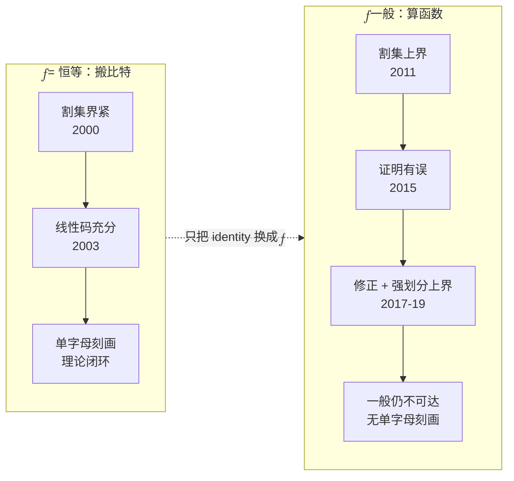
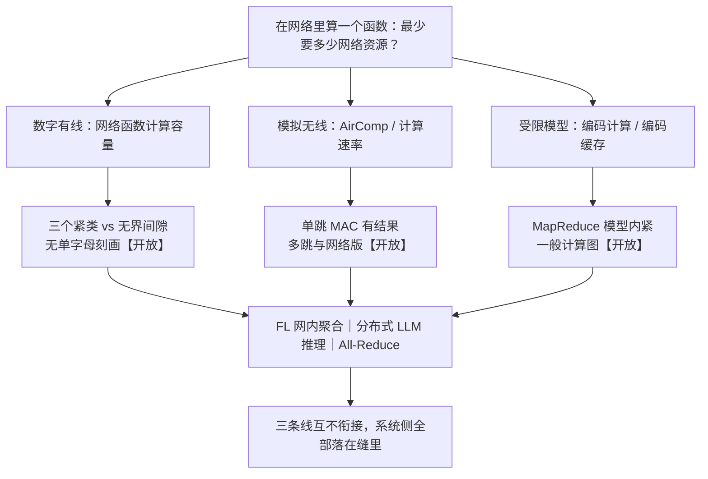

# 8 · 计算网络的容量：边缘计算的香农问题

2000 年，网络信息论把"搬比特"这件事做完了：一堆比特从一个源送到多个宿，网络最多能送多快——有精确答案，有紧的割集刻画，有构造性的最优码。2026 年，全世界的边缘 AI 系统在做另一件事：不是把数据搬到一个地方，而是**在网络里把一个函数算出来**——梯度的和、激活值的 all-reduce、传感器读数的最大值、跨节点的注意力聚合。

这件事在信息论里叫**网络函数计算**（network function computation）。它最基本的模型是：信源分布在一张有向无环图的若干节点上，每条边是无差错、但每次使用只能传一个符号的链路，中间节点可以对收到的符号做任意运算，汇点 $\rho$ 要零错误地得到目标函数 $f$ 的值。它问的是：平均每使用一次网络，最多能算出多少次 $f$。

这件事的容量是多少？

答案是：不知道。而且不是"还没算出数值"这种不知道——是连**上界该长什么样**都曾经写错过，错了四年才被人发现。本章的任务是把这块空白的边界画准：哪几格已填满、哪几格是空的、空的那几格上正压着哪些工业系统。

!!! note "本章预备知识"
    需要：图与割的基本概念、熵；网络编码的必要结论在本章"对照组"一节复述。用到的内容：

    - 熵与微分熵：[预备篇 4.1](../part0/04-information-theory-basics.md#41-惊讶的度量自信息与熵)。
    - 上界侧与下界侧的记号：[第 1 章](01-three-mountains.md)。
    - "两个节点为解一个优化问题至少交换多少比特"：[第 6 章](06-communication-lower-bounds.md)。本章把问题从两节点搬到网络拓扑上。
    - 分层的代价 PoL：[第 7 章](07-price-of-layering.md)。本章的计算容量是它的分母。

## 对照组：搬比特的网络，理论是完备的

考虑单源多播：源节点 $s$ 要把一组消息同时送给宿集合 $T$ 中的每个接收端，网络是有向无环图，每条边容量为 1。Ahlswede、Cai、Li 与 Yeung 在 2000 年证明，容量恰好等于各接收端最大流的最小值 [1]：

$$
\mathcal{C}_{\text{multicast}} \;=\; \min_{t\in T}\ \mathrm{maxflow}(s,t).
$$

这个式子的分量比看上去重：它意味着**中间节点不能只做转发**——把多播信息当成可路由、可复制的"流体"一般来说是次优的，节点必须对收到的符号做编码。三年后，Li、Yeung 与 Cai 进一步证明**线性网络编码对单源多播已经足够** [2]：在足够大的有限域上取线性组合即可达到上式。

于是这个问题类同时拥有四件东西：单字母刻画、紧的 max-flow/min-cut、构造性最优码、一套代数框架。其中**单字母刻画**（single-letter characterization）指容量能写成一个只看"一次使用"、可以直接计算的式子（如点对点信道的 $C=\max_{p(x)}I(X;Y)$、这里的 $\min_{t}\mathrm{maxflow}(s,t)$），而不必写成码长趋于无穷的极限。用[第 1 章](01-three-mountains.md)的记号，这是 $\rho_{\mathrm{up}}=\rho_{\mathrm{lo}}$ 的教科书范例。

!!! success "关键结论"
    把接收端的需求写成 $f=\text{identity}$（"我要原始数据"），整套理论是**完备**的。本章要做的唯一一件事，是把 $f$ 换掉——换成求和、求最大、求平均、求一层神经网络的输出。一个字的改动，整套理论从完备退化成一堆互不相碰的界。

## 最小例子：反向蝴蝶上的算术和，与"足迹尺寸"这一个量

把经典蝴蝶网络的所有边反向，得到网络 $\mathcal{N}_2$：两个二元信源 $\sigma_1,\sigma_2$，字母表 $\mathcal{A}=\{0,1\}$，一个接收端 $\rho$。

```mermaid
flowchart TD
    S1(["$$\sigma_1$$ 产生 $$x_1$$"]) --> N1["$$n_1$$"]
    S1 --> N4["$$n_4$$（唯一同时看见<br/>两个信源的节点）"]
    S2(["$$\sigma_2$$ 产生 $$x_2$$"]) --> N2["$$n_2$$"]
    S2 --> N4
    N4 -->|瓶颈边| N3["$$n_3$$"]
    N3 --> N1
    N3 --> N2
    N1 --> R(["$$\rho$$ 要算 $$x_1 + x_2 \in \{0,1,2\}$$"])
    N2 --> R
```

注意目标函数是**算术和**（整数加法，值域 $\{0,1,2\}$），**不是**模 2 和。这个技术选型是本章的分水岭，理由稍后交代。

### 割上要送的不是数据，是等价类

先做一个观察。取割 $C=\{(n_1,\rho),(n_2,\rho)\}$，它把两个信源都与 $\rho$ 分开，$|C|=2$。$\rho$ 需要区分多少种情况？

- 若它要的是**原始数据**：$(x_1,x_2)$ 有 $2^2=4$ 种，需要 $\log_2 4=2$ 比特；
- 若它要的是**算术和**：把 $\{0,1\}^2$ 按"和相同"归并，得到三类 $\{00\}$、$\{01,10\}$、$\{11\}$，只需 $\log_2 3\approx 1.585$ 比特。

省下的 $0.415$ 比特就是全部的"计算增益"。把这个计数抽象出来，就是整章的技术核心：

!!! abstract "定义（足迹尺寸 footprint size，Appuswamy–Franceschetti–Karamchandani–Zeger [5]）"
    对索引集 $I\subseteq\{1,\dots,s\}$，在 $\mathcal{A}^{|I|}$ 上定义等价关系：$a\equiv b$ 当且仅当对**所有**补集输入 $y\in\mathcal{A}^{|I^{c}|}$ 都有 $f(a,y)=f(b,y)$。记等价类个数为 $R_{I,f}$。对割 $C$，令 $I_C$ 为被 $C$ 与 $\rho$ 分开的信源集合，记 $R_{C,f}\triangleq R_{I_C,f}$。

    这个等价关系正是 Witsenhausen 特征图的独立集表示 [3]——**图熵与网络计算在此处接榫**。

    **特征图**（characteristic graph）的画法：把 $x_I$ 的每个取值画成一个顶点；若存在某个补集输入 $y$ 使 $f(a,y)\ne f(b,y)$，就在 $a,b$ 之间连一条边，意思是"这两个取值必须分开"。不相连恰好就是上面的等价。等价有传递性，所以每个等价类是一个独立集（两两不相连），不同类的顶点两两相连；相邻顶点不同色地染色，最少要 $R_{I,f}$ 种颜色，即 $R_{I,f}$ 是特征图的色数。例如反向蝴蝶的算术和取 $I=\{1,2\}$：四个顶点 $00,01,10,11$ 中只有 $01$ 与 $10$ 不相连，色数为 $3$。

**物理意义**：$R_{C,f}$ 回答的问题是"割的那一侧，有多少种情况是**必须被区分开**的"。两组输入若对任何外部输入都产生同一个函数值，割上就没有必要把它们分开——这两组输入对下游是**同一件事**。计算与搬运的全部差别就压缩在这里：搬运要求区分所有输入，计算只要求区分"会导致不同结果"的输入。

**行为分析**：$f=\text{identity}$ 时任何两组不同输入都不等价，$R_{I,f}=|\mathcal{A}|^{|I|}$，$\log_{|\mathcal{A}|}R_{I,f}=|I|$——退化回网络编码里的信源计数。$f=$ $q$ 元算术和、$|I|=2$ 时，和的取值为 $0,\dots,2q-2$，故 $R=2q-1$，而 identity 需要 $q^2$。$q=8$ 时 $15$ 对 $64$：需要区分的情况少了四倍多。**这是一条随字母表增大而拉开的缝**，请记住这一点，它两段之后会变成一个反直觉的结论。

### 割集上界：一次不跳步的计数

有了 $R_{C,f}$，把网络编码里的"稀疏度"替换掉，就得到**计算 min-cut**：

$$
\text{min-cut}(\mathcal{N},f)\;=\;\min_{C\in\Lambda(\mathcal{N})}\ \frac{|C|}{\log_{|\mathcal{A}|}R_{C,f}},
$$

其中 $\Lambda(\mathcal{N})$ 是网络中全部割的集合：一个边集 $C$ 只要删掉后至少有一个信源走不到 $\rho$（即 $I_C$ 非空），就算一个割。对照普通 min-cut（稀疏度）$\min_{C}|C|/|I_C|$：搬原始数据时，$I_C$ 中每个信源的每个符号都得穿过 $C$，而 $C$ 每次使用只能过 $|C|$ 个符号，所以速率不超过 $|C|/|I_C|$；计算版把分母换成了等价类数的对数。计算容量则定义为

$$
\mathcal{C}_{\mathrm{cod}}(\mathcal{N},f)\;=\;\sup\Big\{\tfrac{k}{n}:\ \exists\ (k,n)\ \text{网络计算码}\Big\},
$$

读作"平均每使用一次网络能算出多少次 $f$"。上界的证明骨架是纯计数，值得逐步写出来：

1. 固定一个 $(k,n)$ 码：每个信源产生 $k$ 个字母，网络被使用 $n$ 次，每条边每次使用承载 1 个 $\mathcal{A}$ 中的符号；
2. $\rho$ 关于 $\{x_i\}_{i\in I_C}$ 的一切信息都必须穿过割 $C$；
3. 两组输入若属于不同等价类，则存在补集输入使 $f$ 值不同，因此它们在 $C$ 上必须留下**不同的符号向量**；
4. 长度为 $k$ 的分组里每个位置独立取等价类，故必须被区分的组数为 $(R_{C,f})^{k}$；
5. $C$ 在 $n$ 次使用中能承载的不同向量数为 $|\mathcal{A}|^{n|C|}$；
6. 于是 $|\mathcal{A}|^{n|C|}\ \ge\ (R_{C,f})^{k}$，两边取 $\log_{|\mathcal{A}|}$ 得 $n|C|\ge k\log_{|\mathcal{A}|}R_{C,f}$，即

    $$
    \frac{k}{n}\ \le\ \frac{|C|}{\log_{|\mathcal{A}|}R_{C,f}} .
    $$

7. 对所有割取最小、对所有码取上确界，得 $\mathcal{C}_{\mathrm{cod}}(\mathcal{N},f)\le\text{min-cut}(\mathcal{N},f)$ [5]。

!!! warning "陷阱：第 3 步是错的"
    上面第 3 步看起来无懈可击，其实**不成立**。当割 $C$ 只切断了一部分信源时，那些未被切断、却仍能到达割边的信源会把自己的输入"混"进割上的符号里，"不同类 $\Rightarrow$ 不同符号"的推理就断了。这正是 Huang、Tan、Yang 与 Guang 在 2015 年指出的问题 [9]。本节先按原样呈现，第三节再拆。

代入反向蝴蝶：$|C|=2$、$R_{C,f}=3$、$|\mathcal{A}|=2$，得 $2^{2n}\ge 3^{k}$，即

$$
\frac{k}{n}\ \le\ \frac{2}{\log_2 3}\ \approx\ 1.2619 .
$$

而这个上界**是可达的** [5][6]。于是得到本章第一张对照表：

| 策略 | 反向蝴蝶上算术和的速率 | 为什么 |
|---|---|---|
| 纯路由（先搬两个比特，再本地相加） | $1$ | 受普通 min-cut（稀疏度）$=2/2=1$ 限制 |
| 线性网络编码 | $1$ | 有限域上只能算模 $q$ 和，把 $0$ 与 $2$ 混淆 [7] |
| 一般（非线性）网络编码 | $2/\log_2 3\approx 1.2619$ | 内部节点先把 4 元字母表压成 3 元 |
| 计算 min-cut 上界 | $2/\log_2 3$（在此例上紧） | $\lvert C\rvert/\log_2 R_{C,f}$ |
| 恒等函数（= 网络编码）容量 | $1$ | $R_{C,f}=4$，退化为稀疏度 [5] |

!!! tip "直觉：增益从哪里来，为什么线性码拿不到"
    看拓扑图：$n_4$ 是**唯一同时看见两个信源**的节点。只有它能在信息进入瓶颈之前完成"$4\to 3$"的归并——把一对比特换成一个三值符号。路由做不到（它只搬不算），线性码也做不到：在 $\mathbb{F}_2$ 上，$0+0$ 与 $1+1$ 都等于 $0$，而算术和要求区分它们。**"是否存在一个能看见足够多信源的节点"，是计算增益能否出现的结构条件**——这条直觉会在第八节变成一个猜想。

!!! note "反直觉：计算容量依赖字母表大小"
    网络编码的路由容量与编码容量都与 $|\mathcal{A}|$ 无关。计算容量不是。$q$ 元算术和在反向蝴蝶上的容量为 $2/\log_q(2q-1)$，$q\to\infty$ 时趋于 $2$——也就是趋于把整张网络的割容量完全用满。【表述待核：$q$ 元一般式源自 ISIT'09 摘要的二手转述 [6]；$q=2$ 的情形已由期刊版正文核实 [5]。】

    **行为分析**：$q=2$ 时增益 $26\%$，$q=4$ 时 $2/\log_4 7=1.425$（增益 $43\%$），$q=256$ 时 $2/\log_{256}511=1.778$（增益 $78\%$）。机理是

    $$
    \log_q(2q-1)\;=\;1+\log_q\Big(2-\tfrac{1}{q}\Big)\;\longrightarrow\;1\qquad(q\to\infty),
    $$

    即和的取值数 $2q-1$ 相对于数据的取值数 $q^2$ 越来越可以忽略。但**趋近极其缓慢**：与 $2$ 的差距由 $\log_q 2=1/\log_2 q$ 支配，只按"字母表有多少比特"的倒数衰减——$q=2^{10}$ 才到 $1.818$，想摸到 $1.998$ 需要 $q\approx 2^{999}$。**字母表越大，"算"相对于"搬"越划算；但这份红利是对数级兑现的，工程上永远吃不到那个 $2$。**

{ .chart loading=lazy }
{ .chart loading=lazy }

*怎么读这张图：第一条是计算割集界 $2/\log_q(2q-1)$，从 $q=2$ 的 1.262 慢慢爬到 $q=1024$ 的 1.818；第二条水平线是极限 2（割容量用满），第三条是路由与线性码的 1。横轴已经按 $\log_2 q$ 等距排开，爬升在这个刻度下仍然越来越缓：与 2 的差距按 $1/\log_2 q$ 衰减，"工程上永远吃不到那个 2"。$q=2$ 这一点的可达性已由期刊版核实；一般 $q$ 时这个界是否可达，见上方的【表述待核】。曲线按公式计算。*

!!! warning "为什么不能用蝴蝶网络 + XOR 来讲这个故事"
    模 2 和是有限域上的线性目标函数，而**有限域线性目标函数的割集界恒紧**（下节定理 T3 [5]），讲不出任何"界不紧"的落差；更根本地，在反向蝴蝶上算 XOR 本质上仍是网络编码问题。算术和之所以是分水岭，是因为它**不是**有限域线性函数：值域 $\{0,\dots,2q-2\}$ 溢出了字母表本身。

## 裂缝：三个紧类、两个反例，和一个错了四年的上界

上一节的圆满是局部现象。往前走一步，地基就开始裂。

### 已知紧的只有三类

下面的定理回答同一个问题：什么条件下，上一节的割集上界恰好就是容量。T2–T7 是本章给这些结果起的简称，跳号没有含义；对照 [5] 的 arXiv 版（v3），T2、T3、T4 依次是其 Theorem 3.1、3.2、3.3，后文的 T5、T7 分别是 Theorem 3.5、4.7。

!!! abstract "定理（三个紧类，Appuswamy 等 [5]）"
    以下三种情形下 $\mathcal{C}_{\mathrm{cod}}(\mathcal{N},f)=\text{min-cut}(\mathcal{N},f)$：

    - **T2（恒等函数）**：$f=\text{identity}$ 时该值还进一步等于普通 min-cut $\text{min-cut}(\mathcal{N})$——退化回单接收端网络编码。
    - **T3（有限域线性目标函数）**：$\mathcal{A}$ 是有限域且 $f$ 为线性函数。
    - **T4（多重边树 multi-edge tree）**：网络中每个节点 $v$ 的所有出边都进入同一个节点 $u$，此时对**任意**目标函数都紧。

**物理意义**：三类的性质完全不同。T2 是"函数退化"，T3 是"函数与编码的代数结构匹配"，T4 是"拓扑退化到没有选择余地"——树上每个节点只有一个下游，不存在"把信息分给谁"的组合问题，逐层分治归并就是最优的。**注意 T4 直接覆盖了两层边缘聚合树**：有线单播模型下，任意目标函数在两层树上的容量已被完全刻画。这个事实会在第八节改写我们的研究方向。

下界侧还有一个可用的构造性结果：

!!! abstract "定理（Steiner 树填充下界，T5 [5]）"

    $$
    \mathcal{C}_{\mathrm{cod}}(\mathcal{N},f)\ \ge\ \Pi(\mathcal{N})\cdot\min_{C\in\Lambda(\mathcal{N})}\frac{1}{\log_{|\mathcal{A}|}R_{C,f}},
    $$

    其中 $\Pi(\mathcal{N})$ 是（分数）Steiner 树填充数：Steiner 树指网络里一棵把全部信源连到 $\rho$ 的有向子树；给每棵树分配非负权重，使每条边上各树权重之和不超过 1，权重总和的最大值就是 $\Pi(\mathcal{N})$。每棵树上都能像 T4 那样逐层归并地算 $f$，树越多，并行算得越多。另有若干"函数类 $\times$ 紧度"的结果：若 $f$ 是 $\lambda$-exponential（$R_{I,f}\ge|\mathcal{A}|^{\lambda|I|}$ 对所有 $I$），则 $\mathcal{C}_{\mathrm{cod}}\ge\lambda\cdot\text{min-cut}$；divisible（可分治）与 symmetric（与顺序无关）两类也各有紧度界 [5]。

**行为分析**：这些都是"$f\in$ 类 $X$ $\Rightarrow$ $\mathcal{C}\ge\lambda\cdot$ min-cut"形状的**充分条件族**。$\lambda$ 就是你愿意接受的松弛倍数：$\lambda=1$ 才是紧的，$\lambda=1/2$ 意味着你只知道真值落在一个两倍宽的区间里。**没有任何一条是充要的**——这一点在第九节会作为公认开放问题重新出现。

### 反例侧：缝隙可以宽到任意倍数

同一篇论文往前走一步就塌了。取三信源网络 $\hat{\mathcal{N}}$（[5] 的 Fig. 4）：二元信源 $\sigma_1,\sigma_2,\sigma_3$，汇点 $\rho$，四条容量为 1 的边 $(\sigma_3,\sigma_1)$、$(\sigma_3,\sigma_2)$、$(\sigma_1,\rho)$、$(\sigma_2,\rho)$。$\sigma_3$ 没有通往 $\rho$ 的直连边，只能把消息抄给 $\sigma_1$ 和 $\sigma_2$，这两个节点既产生自己的比特，又替 $\sigma_3$ 中转。$\rho$ 要算算术和 $x_1+x_2+x_3\in\{0,1,2,3\}$。

```mermaid
flowchart TD
    S3(["$$\sigma_3$$ 产生 $$x_3$$"]) --> S1(["$$\sigma_1$$ 产生 $$x_1$$，并收到 $$x_3$$"])
    S3 --> S2(["$$\sigma_2$$ 产生 $$x_2$$，并收到 $$x_3$$"])
    S1 -->|"$$\mathbf{z}_1$$"| R(["$$\rho$$ 要算<br/>$$x_1+x_2+x_3 \in \{0,1,2,3\}$$"])
    S2 -->|"$$\mathbf{z}_2$$"| R
```

图中 $\mathbf{z}_1,\mathbf{z}_2$ 记 $\rho$ 两条入边上传送的内容。[9][10] 画的是同一个网络，只是把 $\sigma_1$、$\sigma_2$ 的"产生"与"中转"拆成两个节点，[10] 还把共享信源记作 $\sigma_2$。它的计算容量和割集界分别是：

$$
\mathcal{C}_{\mathrm{cod}}(\hat{\mathcal{N}},f)=\frac{2}{1+\log_2 3}=\log_6 4\approx 0.7737\ <\ \text{min-cut}(\hat{\mathcal{N}},f)=1 .
$$

下面把两边都推一遍（[5] 的 Theorem 5.1 与 Corollary 5.2；本节 [5] 的图号、定理号均按 arXiv v3）。每个信源产生 $k$ 个比特，网络用 $n$ 次，故 $\mathbf{z}_1,\mathbf{z}_2\in\{0,1\}^n$；$\sigma_i$ 的比特串记为 $\mathbf{x}_i=(x_{i,1},\dots,x_{i,k})$。

**割集界为什么是 1。** 对算术和，被切断信源的两组取值等价，当且仅当它们的部分和相同；$|I_C|$ 个比特的和有 $|I_C|+1$ 种取值，故 $R_{C,f}=|I_C|+1$。有三条割取到 1：$\{(\sigma_1,\rho)\}$ 只切断 $\sigma_1$（$\sigma_3$ 还能经 $\sigma_2$ 到达 $\rho$），给 $1/\log_2 2=1$；$\{(\sigma_2,\rho)\}$ 同理；$\rho$ 的两条入边切断全部信源，给 $2/\log_2 4=1$。其余的割都更大，例如 $\{(\sigma_3,\sigma_1),(\sigma_3,\sigma_2)\}$ 只切断 $\sigma_3$，给 $2$。

**可达：两个中转节点轮流替 $\sigma_3$ 做加法。** 取 $k$ 为偶数。$\sigma_3$ 把 $\mathbf{x}_3$ 原样发给 $\sigma_1$、$\sigma_2$（$k<n$，放得下）。前一半位置由 $\sigma_1$ 把 $x_3$ 加进自己的比特，后一半换 $\sigma_2$：

$$
y^{(1)}_i=\begin{cases}x_{1,i}+x_{3,i}, & i\le k/2\\ x_{1,i}, & i>k/2\end{cases}\qquad y^{(2)}_i=\begin{cases}x_{2,i}, & i\le k/2\\ x_{2,i}+x_{3,i}, & i>k/2\end{cases}
$$

$\mathbf{y}^{(1)}$ 一半位置取 $\{0,1,2\}$、一半取 $\{0,1\}$，共 $3^{k/2}2^{k/2}=6^{k/2}$ 种取值，$\mathbf{y}^{(2)}$ 也一样。只要 $2^n\ge 6^{k/2}$，$\sigma_1$ 就能给每个 $\mathbf{y}^{(1)}$ 配一个不同的 $n$ 比特串作 $\mathbf{z}_1$，$\sigma_2$ 同理。$\rho$ 译回 $\mathbf{y}^{(1)},\mathbf{y}^{(2)}$ 后逐位相加，第 $i$ 位正是 $x_{1,i}+x_{2,i}+x_{3,i}$。条件 $2^n\ge 6^{k/2}$ 即 $k/n\le 2/\log_2 6$，而 $\log_2 6=1+\log_2 3$。

**逆定理：每个位置要占 6 个格子，不是 4 个。** 任取一个 $(k,n)$ 码，$\mathbf{z}_1$ 只能依赖 $\sigma_1$ 看得见的 $(\mathbf{x}_1,\mathbf{x}_3)$，$\mathbf{z}_2$ 只能依赖 $(\mathbf{x}_2,\mathbf{x}_3)$。

1. **固定 $\mathbf{x}_3$，$\mathbf{z}_1$ 必须分开不同的 $\mathbf{x}_1$。** 否则两组只在 $\mathbf{x}_1$ 上不同的输入让 $\rho$ 收到同样的东西，和却不同。$\mathbf{z}_2$ 对 $\mathbf{x}_2$ 同理，所以 $\mathbf{x}_3$ 固定时，不同的 $(\mathbf{x}_1,\mathbf{x}_2)$ 给出不同的 $(\mathbf{z}_1,\mathbf{z}_2)$。
2. **不同的和落在不相交的格子里。** 记 $A_{\mathbf p}$ 为和等于 $\mathbf p\in\{0,1,2,3\}^k$ 时 $(\mathbf{z}_1,\mathbf{z}_2)$ 可能取的值。$\rho$ 只凭 $(\mathbf{z}_1,\mathbf{z}_2)$ 判断 $\mathbf p$，各 $A_{\mathbf p}$ 互不相交，故 $\sum_{\mathbf p}|A_{\mathbf p}|\le 2^{2n}=4^n$。
3. **数 $|A_{\mathbf p}|$。** 令 $x_{3,i}=0$（当 $p_i\le 1$）或 $1$（当 $p_i\ge 2$）。$p_i\in\{0,3\}$ 的位置上 $(x_{1,i},x_{2,i})$ 只有一种取法，$p_i\in\{1,2\}$ 的位置上有 $(0,1)$、$(1,0)$ 两种。这些输入的和都是 $\mathbf p$，由第 1 步给出互不相同的 $(\mathbf{z}_1,\mathbf{z}_2)$，所以 $|A_{\mathbf p}|\ge\prod_i c(p_i)$，其中 $c(0)=c(3)=1$，$c(1)=c(2)=2$。
4. **求和。** 逐位展开，$\sum_{\mathbf p}\prod_i c(p_i)=\big(c(0)+c(1)+c(2)+c(3)\big)^k=6^k$，于是 $4^n\ge 6^k$，即 $k/n\le\log 4/\log 6=\log_6 4$。

割集界只数和的取值，每个位置记 4 格；真实的约束要求中间两个取值各占 2 格，共 $1+2+2+1=6$ 格。

**数值校验。** $\log_2 3\approx 1.58496$，$2/(1+\log_2 3)=2/2.58496\approx 0.77371$；换底 $\log_6 4=\ln 4/\ln 6=1.38629/1.79176\approx 0.77371$，两式相等。有限码长的例子：$k=10$ 要 $2^n\ge 6^5=7776$，$n=13$（$8192$）够而 $n=12$（$4096$）不够，速率 $10/13\approx 0.769$。

**物理意义**：割集界把 $\rho$ 的两条入边当成一根 2 比特的管子，默认割前有人能先把三个比特合成和再写进去，这样只送和就够，速率为 1。$\hat{\mathcal{N}}$ 里没有这样的节点：$\sigma_1$ 看不见 $x_2$，$\sigma_2$ 看不见 $x_1$，两者只能在 $\rho$ 处、即瓶颈之后才合并；割前能做的计算只有把两边都看得见的 $x_3$ 并进去。于是 $(x_1,x_2)=(1,0)$ 与 $(0,1)$ 和相同，割上却必须留下不同的符号（逆定理第 1 步），$\rho$ 用不上的这部分信息躲不掉。反向蝴蝶的界是紧的，正因为 $n_4$ 在瓶颈之前同时看见两个信源。**割集界只数割上要区分多少种情况，不问割前有没有节点能先把输入合并到这么少。**

**行为分析**：同一网络上几种做法的速率。只转发、不运算：每算一次要把 3 个原始比特送过 2 条边，速率 $2/3\approx 0.667$。每个位置都让 $\sigma_1$ 并入 $x_3$：$(\sigma_1,\rho)$ 每位要送 $\log_2 3$ 比特，速率只有 $1/\log_2 3\approx 0.631$，反而不如纯转发。两边各并一半，每条边每位平均送 $(1+\log_2 3)/2\approx 1.29$ 比特，才达到 $0.7737$——省比特还得两条边分摊均匀。离割集界差的 $22.6\%$，来自每算一次割上要送 $\log_2 6\approx 2.585$ 比特而不是 $\log_2 4=2$ 比特：$1-2/2.585\approx 0.226$。前两个速率 [5] 没有讨论，是【本站演算】。

而且这不是个例。

!!! abstract "定理（间隙可任意大，T7 [5]）"
    对任意 $\epsilon>0$，存在网络 $\mathcal{N}$ 使算术和满足

    $$
    \mathcal{C}_{\mathrm{cod}}(\mathcal{N},f)\;=\;O\!\Big(\frac{1}{(\log s)^{1-\epsilon}}\Big)\cdot\text{min-cut}(\mathcal{N},f),
    $$

    其中 $s$ 为信源数。

**行为分析**：把 $\epsilon$ 取小，比值大致按 $1/\log s$ 衰减。$s=2^{10}=1024$ 个信源时 $\log_2 s=10$，割集界高估约一个数量级；$s=2^{20}$ 时高估约二十倍。**割集界作为"地基"，缝隙的宽度本身是无界的**——你不能靠它做任何定量的系统设计。对照一下网络编码：那里 min-cut 就是容量，没有缝。

### 更糟的：上界本身错了四年

这才是"没有地基"从修辞变成事实的地方。

| 年份 | 事件 | 状态 |
|---|---|---|
| 2011 | Appuswamy 等给出计算版割集上界 [5] | 框架成型 |
| 2015 | Huang–Tan–Yang–Guang 指出**其证明不成立** [9] | 地基被发现是裂的 |
| 2017–19 | Guang–Yeung–Yang–Li 给出更强上界，并证明**该上界一般不可达** [10] | 硬开放问题被确认 |

Huang 等的反例极其具体。网络 $\mathcal{N}_1$ 有三个二元信源 $\sigma_1,\sigma_2,\sigma_3$、一个中间节点 $v$ 和汇点 $\rho$：每个 $\sigma_i$ 各有一条边 $e_i$ 连到 $v$、一条边 $e_{i+3}$ 直连 $\rho$，$v$ 再用边 $e_7$ 连到 $\rho$。取 $f(x_1,x_2,x_3)=x_1x_2+x_3$（在 $\mathbb{F}_2$ 上），真实容量 $\ge 2$，而原上界给出 $\le 3/2$——**上界比真值还小，也就是根本不是上界**。

- **真实容量 $\ge 2$**：每个信源一次产生两个符号，第 1 个经 $e_i$ 送给 $v$，第 2 个经 $e_{i+3}$ 直送 $\rho$。$v$ 算出第一组的 $f$ 经 $e_7$ 发出，$\rho$ 用直连收到的三个符号自己算第二组。网络用一次、算出两次 $f$，即 $(k,n)=(2,1)$。
- **原上界 $\le 3/2$**：取割 $C_1=\{e_4,e_6,e_7\}$。删掉它，$\sigma_1$、$\sigma_3$ 走不到 $\rho$，$I_{C_1}=\{\sigma_1,\sigma_3\}$。$(x_1,x_3)$ 的四种取值两两不等价：$x_3$ 不同时 $f$ 必然不同；$x_3$ 相同而 $x_1$ 不同时，取 $x_2=1$ 就能让 $f$ 不同。于是 $R_{C_1,f}=4$，$|C_1|/\log_2 4=3/2$。

断裂点正是本章第二节第 3 步：割上的符号被未切断信源的输入"污染"了。修法分三步。

1. **把"碰得到割边、却没被切断"的信源单独拿出来。** $I_C$ 仍是被 $C$ 切断的信源；$J_C$ 是能沿有向路径走到某条割边的起点、却没被切断的信源。在 $C_1$ 上，$\sigma_2$ 经 $e_2$ 进入割边 $e_7$ 的起点 $v$，又能经 $e_5$ 直达 $\rho$，所以 $J_{C_1}=\{\sigma_2\}$。
2. **固定 $x_J$ 再数等价类。** 割上的符号只依赖 $x_I$ 与 $x_J$，汇点收到的一切是割上符号与 $x_J$、其余信源输入的函数。把 $x_J$ 固定为常值 $c_J$ 后，若存在其余信源的某个取值使 $f(a,c_J,\cdot)\ne f(b,c_J,\cdot)$，割上的符号就必须不同。$x_J$ 取值不同的情形则不必比较，因为割上的编码本来就可以依赖 $x_J$。这就是 $(I,J,c_J)$-等价。记固定 $c_J$ 时的等价类数为 $W^{(c_J)}$，取最坏的 $c_J$ 得 $W_{C,f}=\max_{c_J}W^{(c_J)}$。长度为 $k$ 的分组中每个位置都取这个最坏的 $c_J$，必须区分的组数就是 $(W_{C,f})^{k}$，第二节第 5、6 步原样走一遍，得到修正的 $\text{min-cut}=\min_C|C|/\log_{|\mathcal{A}|}W_{C,f}$。
3. **代回 $\mathcal{N}_1$。** 在 $C_1$ 上，$x_2=0$ 时 $f=x_3$，$x_2=1$ 时 $f=x_1+x_3$，两种情形下 $(x_1,x_3)$ 都只分成 2 类，$W_{C_1,f}=2$，这条割只给出 $3$。起作用的是 $C_2=\{e_6,e_7\}$：$I_{C_2}=\{\sigma_3\}$、$J_{C_2}=\{\sigma_1,\sigma_2\}$，无论 $c_J$ 取什么，$x_3=0$ 与 $x_3=1$ 都给出不同的 $f$，$W_{C_2,f}=2$，得 $2/\log_2 2=2$。穷举全部割，最小值正是 $2$。

差别在于：原版把 $x_2$ 当成任意挑的外部输入，要求 4 种情况全部分开；可 $v$ 编码时已看见 $x_2$，只需分开当前 $x_2$ 下 $f$ 值不同的 2 种。修正后该例上紧（$=2$，[9] 的 Example 5），但在 $\hat{\mathcal{N}}$ 上仍然不紧（$\log_6 4<1$），[9] 第 III-D 节自己指出了这一点。原因是对算术和，固定 $c_J$ 不改变 $I_C$ 中哪些输入必须分开：要分开的仍是部分和不同的输入，$W_{C,f}=R_{C,f}=|I_C|+1$，修正版在 $\hat{\mathcal{N}}$ 上逐割都与原版相同，min-cut 仍是 1。

Guang 等随后用**割集的强划分（strong partition）**上的多维数组计数给出

$$
\mathcal{C}(\mathcal{N},f)\ \le\ \min_{C\in\Lambda(\mathcal{N})}\frac{|C|}{\log_{|\mathcal{A}|}n_{C,f}},\qquad n_{C,f}\ \ge\ w_{C,f},
$$

严格强于修正版，并且是**第一个对某类非树网络上的算术和紧的一般上界** [10]。式中的 $w_{C,f}$ 就是上一段的 $W_{C,f}$：[10] 用大写 $W^{(c_J)}$ 记固定 $c_J$ 时的等价类数，用小写 $w_{C,f}$ 记它对 $c_J$ 取最大后的值，量是同一个。$n_{C,f}$ 则是在割 $C$ 的所有强划分上取最大的计数；不做划分（整个 $C$ 算一块）时它恰好退化成 $w_{C,f}$，所以 $n_{C,f}\ge w_{C,f}$，分母更大，上界只会更紧。本段开头说的"某类非树网络"就是 $\hat{\mathcal{N}}$（[10] 的 Example 2）：把割 $\{(\sigma_1,\rho),(\sigma_2,\rho)\}$ 划分成两条单边，固定 $x_3$ 后每条边各自要分开自己信源的 2 种输入；和为 1、和为 2 的两类各占 2 格，四类合计 $1+2+2+1=6$，与前面逆定理数出的 6 相同，上界恰为 $2/\log_2 6=\log_6 4$。但同一篇论文给出了一个关键否定结果：在反向蝴蝶上算**二元 max** 时，该改进上界**不可达**；是否渐近可达**仍然开放**。

!!! success "关键结论（本章的中心事实）"
    "计算版 max-flow/min-cut 定理"至今不存在。存在的只是一串越来越紧、但仍然不紧的**上界**，其中第一版还是错的。凡是把它称作"定理"的表述——包括不少综述——都不准确。

现在可以给出本章的核心对照表：

| 维度 | 搬比特（$f=\text{identity}$） | 算函数（$f$ 一般） |
|---|---|---|
| 割上的关键量 | $\lvert I_C\rvert$（被切断的信源数） | $\log_{\lvert\mathcal{A}\rvert}R_{C,f}$（函数值等价类数） |
| 割集刻画 | max-flow/min-cut **紧** [1] | 上界一般**不紧**，且间隙无界 [5] |
| 上界的正确性 | 1956 年即为标准结果 | 2011 年版**证明有误**，2015 年才被发现 [9] |
| 最优码 | **线性码充分** [2] | 线性码**严格不够**（反向蝴蝶 + 算术和）[7] |
| 与字母表的关系 | 无关 | **有关**，$q$ 越大计算越划算 |
| 单字母刻画 | 有 | 无 |
| 已知紧的范围 | 全部单源多播 | 三类：恒等 / 有限域线性 / 多重边树 |
| 多接收端 | 已解决 | 几乎空白（sum-network 一支已见病理现象） |



## 换个问法：不问容量，问 scaling

既然精确容量做不出来，一条务实的退路是问：$n$ 个节点向一个汇点聚合一个对称函数时，速率随 $n$ 怎么衰减。（这里的 $n$ 与下表的 $M$ 都是节点数，不是第二节 $(k,n)$ 码里的网络使用次数。）Giridhar 与 Kumar 在 2005 年把对称函数分成两类 [11]：

- **type-sensitive（类型敏感）**：均值、中位数、众数——任何**单个**节点的读数都可能改变结果；
- **type-threshold（类型阈值）**：max、min、range、"是否有超过阈值者"——只需要每个取值的**截断频次**

    $$
    \bar{b}_{\ell}\;=\;\min\{\theta_{\ell},\,b_{\ell}\},
    $$

    其中 $b_\ell$ 是取值为 $\ell$ 的节点数，阈值向量 $\theta$ 与节点数无关。

**物理意义**：type-threshold 函数的信息需求**有天花板**。要判断"最大值是否为 $\ell$"，你只需要知道"是否至少有一个节点取 $\ell$"——第二个、第三个取 $\ell$ 的节点不提供任何新信息，可以在网内被直接吸收掉。type-sensitive 函数没有这个天花板：算平均值时，每个节点的读数都必须以某种形式抵达汇点。**这是"哪些函数可以在网内被压缩"的第一次系统回答。**

表中的**共址**（collocated）指所有节点彼此都在一跳范围内；**碰撞信道**规定同一时隙只有一个节点发射才能被收到，两个以上同时发射就相互冲毁；**高斯信道**则让同时发射的信号在接收端带噪线性叠加，下一节的空中计算正是利用这一点。

| 网络模型 | 对称 / type-sensitive | type-threshold | 出处与状态 |
|---|---|---|---|
| 共址（collocated）碰撞信道 | $\Theta(1/M)$ | $\Theta(1/\log M)$ | [11]，【已核实·二手】 |
| 共址高斯信道 | $\Theta(1/\log M)$（可达） | $\Theta(1)$（可达） | [14][29]，两格都是已知可达的数量级 |
| 随机平面多跳 | $\Theta(1/\log n)$ | $\Theta(1/\log\log n)$ | [11]，【已核实·二手】 |

**行为分析**：$M=10^4$ 个设备时，type-sensitive 的 $\Theta(1/M)=10^{-4}$，type-threshold 的 $\Theta(1/\log M)\approx 0.075$——相差近三个数量级。这就是"求最大值"与"求平均值"在网内计算上的真实差距。但请立刻注意第二行：**换个信道模型，同一类函数的答案从 $\Theta(1/\log M)$ 跳到 $\Theta(1)$**。

!!! warning "三条必须同时说出口的限定"
    1. $\Theta(1/\log M)$ 是**最坏源分布**下的结论；若源分布不随 $M$ 变化，$\Theta(1)$ 可达。
    2. 碰撞信道 $\to$ 高斯信道就让结论换了个量级——**模型比定理更决定答案**，这本身就是地基不牢的注脚。
    3. Appuswamy 等明确指出，Giridhar–Kumar 用的是同时传输的干扰模型，其结果**不能与网络函数计算容量框架直接比较** [5]。type-threshold 只是 symmetric $\cap$ divisible $\cap$ $c$-bounded 的一个子类。

还有一个必须点破的事实：**它分的是难度，不是结构**。它没有回答"哪些函数能像流一样被分割、路由、再合并"。文献里最接近"函数分类定理"的东西就是它，而它不是分类定理。

顺带把单跳的情形补齐，好让"网络版缺什么"更清楚：解码端持有边信息 $Y$、要以任意小的差错概率算出 $f(X,Y)$ 时，最小率等于特征图的**条件图熵** $H_G(X\mid Y)$（Orlitsky–Roche [4]，其零错误一次性版本可追到 Witsenhausen 的色数刻画 [3]）。**一条边上的"计算容量"有单字母刻画；一张网络上的没有。** 这就是本章标题里"香农问题"四个字的准确含义。

## 正面反转：无线叠加把干扰变成加法器

到这里全是"比想象的小"。现在给一个"比想象的大"的反转。

高斯多址信道上，$K$ 个设备同时发射，接收端天然拿到 $\sum_k$。把这一点直接用来算函数的做法叫**空中计算**（over-the-air computation，AirComp）：各设备在同一时频资源上同时发送预处理过的信号，电磁波在接收天线处自动叠加，接收端直接拿到带噪的和，不必先逐个解出各设备的数据再相加。若目标函数可以写成**图算式（nomographic）形式**

$$
f(s_1,\dots,s_K)\;=\;\varphi\Big(\sum_{k=1}^{K}\psi_k(s_k)\Big),
$$

那么信道本身就是计算器：$\psi_k$ 是各设备的预处理（内函数），$\varphi$ 是接收端的后处理（外函数）[15][16]。Kolmogorov 叠加定理保证，紧域上任意连续函数都能用 $2K+1$ 个这样的图算式表示，且 $2K+1$ 不可再降。

!!! abstract "定理（可达计算速率，Jeon–Wang–Gastpar [14]，基于 Nazer–Gastpar [12]）"

    $$
    R\;<\;R_{\mathrm{comp}}\;=\;\frac{\Big[\min_k\ \frac12\log_2\!\Big(\dfrac{1}{K}+\dfrac{|h_k|^2P}{\sigma_n^2}\Big)\Big]^{+}}{H\big(f(s)\big)} .
    $$

    分离式（先通信、后计算）的对照速率为 $\dfrac{1}{2K}\log_2\!\Big(1+\dfrac{KP}{\sigma_n^2}\Big)$。

**物理意义**：分子是"信道能承载多少比特"，分母是"一次函数值值多少比特"。分离式在解 $K$ 个方程（把每个 $s_k$ 都恢复出来），AirComp 只解 $1$ 个（只恢复那个和）。增益的来源不是无线信道有魔法，而是

$$
H\big(f(X_1,\dots,X_K)\big)\ \ll\ \sum_{k=1}^{K}H(X_k),
$$

**函数的熵远小于数据的熵**——这与第二节里"$R_{C,f}=3$ 而不是 $4$"是同一个道理的模拟版。叠加信道恰好提供了一个与目标函数同构的物理算子。

!!! example "算例（$K=100$，SNR $=15$ dB，二元等概信源，算术和）"
    分离式：$\dfrac{1}{2\times 100}\log_2(1+100\times 31.62)=\dfrac{11.63}{200}\approx 0.058$。

    AirComp：分子 $\frac12\log_2(0.01+31.62)=\frac12\times 4.98\approx 2.49$。分母是 $K$ 个 Bernoulli$(1/2)$ 之和的熵，用高斯近似（方差 $K/4$）：

    $$
    H(f)\ \approx\ \frac12\log_2\Big(2\pi e\cdot\frac{K}{4}\Big)=\frac12\log_2\Big(\frac{\pi e K}{2}\Big)=\frac12\log_2 427\approx 4.37 .
    $$

    这一步为什么成立：和只取整数，间距为 1；$K$ 大时其概率质量函数 $p(m)$ 近似等于同方差高斯密度 $\phi(m)$，于是 $H(f)=-\sum_m p(m)\log_2 p(m)\approx-\int\phi\log_2\phi\,\mathrm{d}x$，即把求和看成间距为 1 的黎曼和，右边就是高斯微分熵。[预备篇 4.1](../part0/04-information-theory-basics.md) 说"微分熵不是熵"，这里两者近似相等、不差常数，正因为间距为 1（间距为 $\Delta$ 时要再加 $-\log_2\Delta$）。精确计算得 $4.369$ 比特，与近似值吻合。

    故 $R_{\mathrm{comp}}\approx 2.49/4.37\approx 0.57$，约为分离式的 **10 倍**。

    **行为分析**：数据的总熵是 $\sum_k H(X_k)=100$ 比特，函数的熵只有 $4.37$ 比特——**23 倍的冗余是可以在空中被物理地约掉的**。把 $K$ 加到 $1000$：分离式降到 $0.0075$，AirComp 降到 $2.49/6.03\approx 0.41$，差距拉到 **55 倍**。机理是分离式按 $\log K/(2K)\to 0$ 衰减，而计算速率的分母只以 $\frac12\log_2 K$ 的速度增长——**增益随 $K$ 近乎线性增长，只差对数因子**。

格码是这件事的数字化身。嵌套格码的关键性质是**码本对加法封闭**：两个格点之和仍是格点。于是接收端不必先解出各自的消息再相加，可以直接把叠加信号量化到格上，一次解出所需的整数线性组合，其可达计算速率为 [13]

$$
R(\mathbf{h},\mathbf{a})\;=\;\frac12\log^{+}\!\left(\Big(\|\mathbf{a}\|^2-\frac{P\,|\mathbf{h}^{\top}\mathbf{a}|^2}{1+P\|\mathbf{h}\|^2}\Big)^{-1}\right).
$$

式中 $\mathbf{h}$ 是各发射端到接收端的信道系数向量，$\mathbf{a}$ 是接收端想解出的整数组合系数（解出 $\sum_k a_k\mathbf{x}_k$），$P$ 是发射功率（噪声方差归一化为 1），$\log^{+}x=\max(\log x,0)$。取两个设备、$\mathbf{h}=\mathbf{a}=(1,1)^{\top}$ 代入：$\|\mathbf{a}\|^2=2$，$|\mathbf{h}^{\top}\mathbf{a}|^2=4$，$\|\mathbf{h}\|^2=2$，括号内为 $2-\frac{4P}{1+2P}=\frac{2}{1+2P}$，故 $R=\frac12\log^{+}\!\big(\frac12+P\big)$。这正是上面 AirComp 速率分子在 $K=2$、$|h_k|^2=\sigma_n^2=1$ 时的形状。

这是"结构化码打败随机码"的经典场景：随机码在这里输给格码，因为随机码本对加法不封闭。

!!! warning "陷阱：AirComp 不是免费午餐"
    必须同时列出代价：严格的相位与时间同步；发端需要 CSI 做信道反演与功率控制；模拟传输**没有编码增益**；异构信道下速率被最弱链路 $\min_k$ 卡死（见速率式的分子）；对恶意节点的污染毫无鲁棒性。更要紧的是，**这些结果基本停留在单跳 MAC**——多跳/网络版的容量至今空白，2026 年的多跳 AirComp 论文都是方案设计，不是容量刻画 [16]。

## 受限模型里做得出的紧定理：编码计算与编码缓存

前面两条线都以"开放"收尾。有没有哪个格子里真的做出了**紧**定理？有，代价是把模型收窄。

收窄后的模型是 MapReduce：$N$ 个文件分存在 $K$ 个节点上，要算 $Q$ 个输出函数。**Map** 阶段，每个节点对自己存的每个文件算出 $Q$ 个中间值（每个 $T$ 比特）；**Shuffle** 阶段，节点之间互发对方缺的中间值；**Reduce** 阶段，每个节点收齐自己负责的 $Q/K$ 个输出函数在全部 $N$ 个文件上的中间值，算出结果。定理问：让每个文件在更多节点上重复 Map（多花计算），能省下多少 Shuffle 通信。

!!! abstract "定理（计算–通信的反线性折中，Li–Maddah-Ali–Yu–Avestimehr [18]）"
    在 MapReduce 型分布式计算模型中，令计算负载 $r\triangleq\frac{\sum_{k}|\mathcal{M}_k|}{N}$（每个文件平均被几个节点 Map），通信负载 $L$ 为 Shuffle 阶段归一化的总比特数，则对 $r\in\{1,\dots,K\}$

    $$
    L^{*}(r)\;=\;\frac{1}{r}\Big(1-\frac{r}{K}\Big),
    $$

    非整数 $r$ 取这些点的下凸包。信息论下界与编码方案匹配，因此**紧**。相对同 $r$ 的无编码 Shuffle（$1-r/K$），通信量恰好降低 $r$ 倍。

**直觉推导（两步，可以完全在脑子里做完）**：

1. 每个中间值被 $r$ 个节点冗余算出。于是对任意 $r$ 个节点，总能找到这样一批中间值：节点 $i$ 需要的那一个，恰好被另外 $r-1$ 个节点持有。
2. 把这 $r$ 个"各有所需"的中间值 **XOR 成一个包多播出去**。每个接收者拿自己本地已有的 $r-1$ 个当边信息异或掉，就解出自己要的那一个。**一次传输服务 $r$ 个需求**，通信量因此除以 $r$。

**最小算例（$K=Q=3$，$r=2$）**：三个文件记为 $w_{12},w_{13},w_{23}$，下标表示存在哪两个节点上；节点 $k$ 负责第 $k$ 个输出函数，$v_{k,w}$ 表示函数 $k$ 在文件 $w$ 上的中间值。节点 1 缺 $v_{1,w_{23}}$，节点 2 缺 $v_{2,w_{13}}$，节点 3 缺 $v_{3,w_{12}}$，各被另外两个节点持有。无编码要发 3 个完整中间值。编码做法：把每个缺的值切成两半（上标 $(1)$、$(2)$），节点 1 发 $v^{(1)}_{2,w_{13}}\oplus v^{(1)}_{3,w_{12}}$，节点 2 发 $v^{(1)}_{1,w_{23}}\oplus v^{(2)}_{3,w_{12}}$，节点 3 发 $v^{(2)}_{1,w_{23}}\oplus v^{(2)}_{2,w_{13}}$。每个包的两个接收者本地都有包里的另一项，异或掉即得自己的一半。共发 3 个半包，即 $1.5$ 个中间值，是无编码的 $1/r=1/2$。归一化后 $L=\frac{1.5\,T}{QNT}=\frac{1.5}{9}=\frac16=\frac12\big(1-\frac23\big)$，与定理一致。

**行为分析**：$K=10$ 时，$r=1$ 给出 $L=0.9$，$r=5$ 给出 $L=0.1$，$r=K=10$ 给出 $L=0$（全部数据都在本地，无需 shuffle）。边界都对。工程上这不是纸面收益：CodedTeraSort 在 Hadoop 上实测 $1.97\times$–$3.39\times$ 加速 [18]。同一机理在编码缓存里以另一副面孔出现——本地缓存即边信息、多播 XOR 即一包多用，Maddah-Ali 与 Niesen 由此区分出**局部缓存增益**与**全局缓存增益**，后者的改善量级可达用户数 [19]。从函数计算的视角看，"取哪个文件"本身就是一个选择函数，边缘缓存因此天然属于本章的框架。

!!! warning "陷阱：不要把它泛化成'任意计算图上冗余 r 倍省 r 倍'"
    这个紧定理成立于一组相当强的假设：对称的文件分配、每个节点对自己存的文件算出全部 $Q$ 个函数的中间值、$Q$ 个 Reduce 函数在 $K$ 个节点间对称均分（每个节点负责 $Q/K$ 个、互不重叠）、通信负载按 $QNT$ 归一化。**Transformer 的计算图不满足其中任何一条。** 这恰恰是本章要指出的空白，而不是一个已被解决的问题。抗 straggler（掉队节点：比其他节点慢得多、拖住整轮计算的节点）的 gradient coding [20] 与同时提供抗掉队、抗拜占庭（节点故意返回错误结果）与信息论隐私的 Lagrange 编码计算 [21] 是这条线的另外两个成功点——同样都在各自的受限模型内。

## 场景落地：网内聚合、分布式 LLM 推理、All-Reduce

现在把三条线压到 2024–2026 的真实系统上。

!!! example "场景一：联邦学习的网内梯度聚合"
    FL 的每一轮做的事，用本章的语言写出来就是：$K$ 个客户端持有 $\mathbf{g}_k$，服务器要 $\frac{1}{K}\sum_k\mathbf{g}_k$——**在网络里算一个平均**。这是一个纯粹的网络函数计算问题。

    两个结构性事实立刻可用。第一，**均值是 type-sensitive 而不是 type-threshold**（$\theta$ 必须随 $K$ 增长才能容纳所有频次），所以 FL 聚合天生落在 Giridhar–Kumar 分类里**难的那一侧**——$\Theta(1/M)$ 那一行。这解释了一个被系统论文反复观测、却很少被解释的现象：聚合开销随客户端数几乎线性恶化，而这不是实现问题，是函数类决定的。第二，两条已知的解法正好对应本章的两条线：树状聚合（属多重边树，容量由 T4 完全刻画 [5]）与 AirComp-FL（把梯度求和交给空口叠加 [17]）。

    但**两者之间的最优折中没有理论**：一个两层边缘树，叶节点共址、彼此干扰，中间层用有线回传——它既不落在 T4 的有线单播模型内，也不落在单跳 MAC 的 AirComp 模型内。这个最常见的部署形态，恰好落在两套理论的缝里。

!!! example "场景二：分布式 / 分割 LLM 推理（有实测、无理论）"
    张量并行把一层 transformer 的矩阵乘切到多个设备，每层结束要做一次 all-reduce；流水并行把层切开，跨设备传激活值。两者都在**把一张计算图分割到网络上**，而分割方式决定了通信量。

    2025–2026 的实测数据密集得惊人。Zhang 等把张量并行的 all-reduce 直接交给无线信道（MIMO-MAC 建模 + 聚合波束成形 + 数据预编码）：LLaMA3-8B / 8 设备，$37.8$ ms 对数字 all-reduce 的 $108.3$ ms；LLaMA2-70B / 8 设备，$354.2$ ms 对 $981.6$ ms，最高约 $3\times$，且困惑度随设备数保持稳定 [23]。Xu 等的 profiling 给出另一半图景：张量并行网络开销大但短序列响应更快，流水并行传输量小但总时延更高 [24]。TokenWeave 则指出，即便在 NVLink 上，张量并行的通信开销仍达 **20%** [25]——**这不是"边缘网络太差"的问题，而是计算图分割的固有通信量问题**。

    理论侧的缺席是被明确承认的。2026 年的边缘 LLM 推理综述写道：垂直协同推理对长 prompt 带宽敏感（激活值跨层重复传输）；KV cache 迁移的状态管理开销**缺乏形式化优化框架**；时变无线信道下的分布式推理**缺乏原则性的协同设计指导**——现状基本是经验性的 [26]。

    用本章的语言，这句话可以说得更准：**transformer 计算图在网络上分割的通信下界，就是一个活的计算网络容量实例**，而这个实例的容量没有人算过。Zhang 等的三倍加速是一个可达点，没有任何逆定理告诉我们它离极限还有多远。

!!! example "场景三：All-Reduce 的计算速率——2026 年才被问出口"
    Zhou 与 Sun 在 2026 年 2 月第一次把 All-Reduce 当作信息论问题处理：$K$ 个节点求和、带宽受限的成对链路，计算速率 $R=L/N$ 定义为每次使用网络能聚合多少符号 [22]（$L$ 是一次 All-Reduce 聚合的符号数，$N$ 是所用的网络使用次数，与上一节 MapReduce 的通信负载 $L$、文件数 $N$ 不是同一个量）。结果包括：割集上界（任意节点划分上跨越带宽之和的最小值）、把所有 Reduce-then-Broadcast 生成树方案做时分后写成线性规划得到的下界，以及对可分解为共享割边的 1-MAC-BC 网络的精确刻画。

    | 拓扑 | 已知区间 | 上下界之比 |
    |---|---|---|
    | 完全图 | $[\,K/2,\ K-1\,]$ | 约 $2\times$ |
    | 环 | $[\,K/(K-1),\ 2\,]$ | 约 $2\times$ |
    | 超立方（$K=2^U$） | $[\,2^{U-1}U/(2^{U}-1),\ U\,]$ | 约 $2\times$ |

    **行为分析**：$U=3$（8 节点超立方）时区间为 $[1.71,\,3]$。也就是说，对分布式机器学习最核心的通信原语，2026 年的最好答案是"容量在 1.71 到 3 之间"。**这不是一个可以用来做系统设计的数字，但它是第一个把这件事写成容量问题的尝试。**

    【**预印本 · 未经同行评审**】本小节的界与数值取自 2026 年预印本，尚未经评审或独立复现；本站按方向性结论引用，具体常数以最终发表版为准。同一保留适用于本章其余 2026 年预印本来源的数值（含分割推理时延对照）。

### 方法盘点：上界侧在做什么，回答不了什么

| 方法（2024–2026） | 在本章场景里解决了什么 | 回答不了什么 | 落点 |
|---|---|---|---|
| 凸优化变换（SDR、分式规划、交替优化） | AirComp 的聚合波束成形与功率控制、给定方案下参数最优化 | 不告诉你这个**聚合方案本身**离容量多远 | 计算容量【开放】 |
| 图论 / GNN | 聚合树构造、拓扑感知的 all-reduce 调度、跨节点算子放置 | 只能在树/环/超立方等既定拓扑族内比方案；无法判定某函数是否可像流一样被分割 | 函数可分性 $\leftrightarrow$ 流分解【开放】 |
| 强化学习 / DRL | 时变信道下的在线设备选择、功率与路由决策 | 没有最坏情形界；奖励函数里没有"极限"这一项 | [第 4 章](04-sequential-uncertainty.md) + 本章 |
| 扩散模型 / 生成式优化 | 直接生成调度与波束方案，跳过迭代 | 学的是解的分布，不产生任何逆定理 | [第 3 章](03-nonconvex-era.md)暗线 |
| 学习优化 L2O | 端到端学出聚合算子与压缩器 | 训练目标是经验损失，不是率–效用意义下的最优 | [第 5 章](05-price-of-prediction.md) + 本章 |

!!! note "语义 / 任务导向通信：函数计算的另一件外衣"
    "只传任务需要的东西"就是"只传 $f(x)$"。区别只有一条：网络函数计算问零错误 / 无损情形下的**容量**，语义通信问有损情形下的**率–任务效用折中**。把面向边缘推理的信息瓶颈方法定位成"**$R_{C,f}$ 的软化版**"是准确的：$R_{C,f}$ 数的是"必须区分的等价类数"，信息瓶颈数的是"为任务效用值得保留的信息量"。这样定位的好处是把两条互不引用的文献线接起来——语义通信不是"全新范式"，而是本章框架的率失真版本，它继承本章的全部空白。【本站提法】

## 空白的精确定位与三个研究方向

空白有三处，都是文献共识，逐条陈述见下一节的开放问题清单：**一般 $(\mathcal{N},f)$ 的容量**没有紧上界也没有单字母刻画 [10]；**计算版 max-flow/min-cut 何时成立**没有充要条件，已知紧的只有三类而间隙可以无界 [5]；**"哪些函数可像流一样被分割路由"**只有充分条件族（divisible、symmetric、$\lambda$-exponential、$\lambda$-bounded、type-threshold），没有结构性刻画 [5][11]。



在此基础上，本站提出三个方向。**必须先排除一个撞车**：两层边缘聚合树属于多重边树，其**有线单播模型下的任意目标函数容量已经被 T4 完全刻画** [5]。因此"两层树的容量刻画"不是开放问题，必须重定位。

!!! note "方向 (a)：两层边缘树 $\times$ 无线叠加 $\times$ 有限函数类【本站提法】"
    把叶节点从"各自独占一条边"改成"共址且相互干扰"，中间层保留有线回传。这个模型既不落在 T4 内（边不再独立），也不落在单跳 AirComp 内（有第二跳），却正是绝大多数边缘部署的真实形态。先做有限函数类（算术和、max、截断频次）的完整容量刻画。两个可选的变体同样开放：**多汇点**（多个边缘服务器各要不同函数，主流框架都是单接收端）与 **有 straggler**（把 T4 与编码计算的抗掉队折中放进同一个容量式）。

!!! note "方向 (b)：函数可分性 $\leftrightarrow$ 流分解等价条件猜想【本站提法】"
    定义：称 $f$ 在 $\mathcal{N}$ 上**流可分解**，若存在一族沿 Steiner 树/路径的分治分配 $\{f^{I}\}$，使得达到 $\text{min-cut}(\mathcal{N},f)$ 的方案可以写成这些分治的时分组合。

    **猜想**：$f$ 流可分解 $\iff$ 对所有 $\mathcal{N}$ 都有 $\mathcal{C}_{\mathrm{cod}}(\mathcal{N},f)=\text{min-cut}(\mathcal{N},f)$。

    验证点已经齐备：三个紧类应当全部满足；反向蝴蝶上的算术和是"紧但需非线性码"的边界案例（第二节的直觉——"存在一个同时看见两个信源的节点"——正是流可分解的雏形）；$\hat{\mathcal{N}}$ 上的算术和是反例侧的锚点。这个提法在文献中未见。

!!! note "方向 (c)：计入无线叠加后的容量增益定理【本站提法】"
    定义 $G(\mathcal{N},f)\triangleq \mathcal{C}^{\text{wireless}}_{\mathrm{cod}}/\mathcal{C}^{\text{wired}}_{\mathrm{cod}}$，问 $G$ 如何依赖于 $f$ 的图算式可表示性与网络的共址结构。锚点已经有两个：单跳共址时第五节的算例给出 $K=100$ 约 $10\times$、$K=1000$ 约 $55\times$；而碰撞信道换成高斯信道时 type-threshold 的 scaling 从 $\Theta(1/\log M)$ 跳到 $\Theta(1)$，是同一现象的 scaling 版。

    **猜想的形状**：$G$ 的上界由 $f$ 的图算式表示所需的资源数（Kolmogorov 意义下 $\le 2K+1$）与熵比 $H(f)/\sum_k H(X_k)$ 共同决定。

最后交代与本部其他章的接口。[第 6 章](06-communication-lower-bounds.md)问的是"两个节点为解一个优化问题至少要交换多少比特"——函数是 $\arg\min$，网络是一条链路，稀缺资源是**总比特数**；本章问的是"给定拓扑与边容量，每次使用网络能算多少次 $f$"——函数任意，拓扑任意，稀缺资源是**网络使用次数**。前者的困难在函数（$\arg\min$ 极难刻画），后者的困难在拓扑。两者合起来才构成"分布式计算的极限理论"，而它们至今没有共同的框架。至于[第 7 章](07-price-of-layering.md)的分层代价，本章的容量正是它的分母：没有 $\mathcal{C}_{\mathrm{cod}}$，"分层损失了多少"这句话的分母是空的。

!!! info "跨部连线"
    本章所在的线索：[极限与基线](../guide/05-eight-threads.md#7-极限与基线离墙还有多远)。

    - [第二部 6.6 节](../part2/06-error-budget.md#66-多个测量点共测一个场高斯-ceo-给出的天花板)：许多测量点各看一份带噪观测、压缩后汇到中心：分布式估计的天花板是"在网络里算一个函数"的近亲。
    - [第四部 4.7 节](../part4/04-coordination-information-theory.md#47-多方广播是资源不是负担)：多方协作时，广播介质本身就是资源。


## 开放问题

以下状态截至 2026-08。前六条为文献共识，第七、八条为本站提法。

1. **一般函数 $\times$ 一般网络的计算容量。** 没有紧的上界，没有单字母刻画；改进上界被证明一般不可达，是否渐近可达开放 [10]。【开放】
2. **计算版 max-flow/min-cut 何时成立。** 三个紧类之外没有充要条件；间隙可任意大 [5]。【开放】
3. **向量线性目标函数的完整容量刻画。** Huang 等明确列出；相关的 min-cut 条件对可计算性并不总充分 [8][9]。【开放】
4. **多汇点网络函数计算。** 主流框架都是单接收端；sum-network 一支（min-cut $=2$ 不保证可解）表明多汇点另有病理。【几乎空白】
5. **有噪 / 无线信道下的网络计算容量。** 没有统一的信道–计算联合容量理论；AirComp 停在单跳 MAC，多跳版是活跃但未闭合的问题 [16]。【开放】
6. **All-Reduce 的精确计算速率。** 上下界在完全图上仍相差约 2 倍 [22]。【开放·2026 新提出】
7. **函数可分性 $\leftrightarrow$ 流分解等价条件。** 见方向 (b)。【本站提法】
8. **无线叠加的容量增益定理 $G(\mathcal{N},f)$。** 见方向 (c)。【本站提法】

还有一条不属于任何名单、但值得记下的观察：**信息论这条线与系统这条线长期不相交**。信息论侧（Appuswamy、Huang、Guang、Yeung）越做越确认"不知道"，图熵路线到 2025 年仍在推进 [27]，安全版本在 2026 年被推广 [28]；系统侧（MapReduce $\to$ FL $\to$ LLM 推理）越做越大规模地"不问"。本章的价值，很大一部分就是把这两条线画在同一张图上。

收束回开场：**搬比特的网络在 2000 年就有了它的香农定理；算函数的网络到 2026 年，连正确的割集上界能不能达到都还不知道——而全世界的边缘 AI 系统正建在这块地皮上。** 这个空白如何与另外三个缺失定理组装成一份可执行的研究纲领，见[第 9 章](09-research-agenda.md)。

## 参考文献

1. R. Ahlswede, N. Cai, S.-Y. R. Li, R. W. Yeung, 《Network Information Flow》, IEEE Transactions on Information Theory, 46(4):1204–1216, 2000. https://ieeexplore.ieee.org/document/850663
2. S.-Y. R. Li, R. W. Yeung, N. Cai, 《Linear Network Coding》, IEEE Transactions on Information Theory, 49(2):371–381, 2003. https://ieeexplore.ieee.org/document/1176612
3. H. S. Witsenhausen, 《The Zero-Error Side Information Problem and Chromatic Numbers》, IEEE Transactions on Information Theory, 22(5):592–593, 1976.
4. A. Orlitsky, J. R. Roche, 《Coding for Computing》, IEEE Transactions on Information Theory, 47(3):903–917, 2001. DOI: 10.1109/18.915643
5. R. Appuswamy, M. Franceschetti, N. Karamchandani, K. Zeger, 《Network Coding for Computing: Cut-Set Bounds》, IEEE Transactions on Information Theory, 57(2):1015–1030, 2011（正文的 T2–T7 是本章的简称，依次对应 arXiv:0912.2820 v3 的 Theorem 3.1、3.2、3.3、3.5、4.7）. https://arxiv.org/abs/0912.2820
6. R. Appuswamy, M. Franceschetti, N. Karamchandani, K. Zeger, 《Network Computing Capacity for the Reverse Butterfly Network》, Proc. IEEE ISIT, Seoul, 2009. https://ieeexplore.ieee.org/document/5205983
7. R. Appuswamy, M. Franceschetti, N. Karamchandani, K. Zeger, 《Linear Codes, Target Function Classes, and Network Computing Capacity》, IEEE Transactions on Information Theory, 59(9):5741–5753, 2013. https://arxiv.org/abs/1101.0085
8. R. Appuswamy, M. Franceschetti, 《Computing Linear Functions by Linear Coding over Networks》, IEEE Transactions on Information Theory, 60(1):422–431, 2014.
9. C. Huang, Z. Tan, S. Yang, X. Guang, 《Comments on Cut-Set Bounds on Network Function Computation》, IEEE Transactions on Information Theory, 64(9):6454–6459, 2018. DOI: 10.1109/TIT.2018.2827405（预印本 arXiv:1501.01084，2015；部分内容见 IEEE ITW 2015；正文所引 Example 与节号按 arXiv v3）. https://arxiv.org/abs/1501.01084
10. X. Guang, R. W. Yeung, S. Yang, C. Li, 《Improved Upper Bound on the Network Function Computing Capacity》, IEEE Transactions on Information Theory, 65(6):3790–3811, 2019. DOI: 10.1109/TIT.2019.2893107（预印本 arXiv:1710.02252，2017；正文所引 Example 按 arXiv v1）. https://arxiv.org/abs/1710.02252
11. A. Giridhar, P. R. Kumar, 《Computing and Communicating Functions over Sensor Networks》, IEEE Journal on Selected Areas in Communications, 23(4):755–764, 2005. https://ieeexplore.ieee.org/document/1420203
12. B. Nazer, M. Gastpar, 《Computation over Multiple-Access Channels》, IEEE Transactions on Information Theory, 53(10):3498–3516, 2007. https://ieeexplore.ieee.org/document/4494717
13. B. Nazer, M. Gastpar, 《Compute-and-Forward: Harnessing Interference through Structured Codes》, IEEE Transactions on Information Theory, 57(10):6463–6486, 2011.
14. S.-W. Jeon, C.-Y. Wang, M. Gastpar, 《Computation over Gaussian Networks with Orthogonal Components》, IEEE Transactions on Information Theory, 60(12):7841–7861, 2014. DOI: 10.1109/TIT.2014.2364572（会议版见 IEEE ISIT 2013，pp. 2139–2143）
15. M. Goldenbaum, H. Boche, S. Stańczak, 《Harnessing Interference for Analog Function Computation in Wireless Sensor Networks》, IEEE Transactions on Signal Processing, 61(20):4893–4906, 2013；及《Nomographic Functions: Efficient Computation in Clustered Gaussian Sensor Networks》, IEEE Transactions on Wireless Communications, 14(4):2093–2105, 2015.
16. A. Şahin, R. Yang, 《A Survey on Over-the-Air Computation》, IEEE Communications Surveys & Tutorials, 2023. DOI: 10.1109/COMST.2023.3264649 https://arxiv.org/abs/2210.11350
17. K. Yang, T. Jiang, Y. Shi, Z. Ding, 《Federated Learning via Over-the-Air Computation》, IEEE Transactions on Wireless Communications, 19(3):2022–2035, 2020（卷期待核）. https://arxiv.org/abs/1812.11750
18. S. Li, M. A. Maddah-Ali, Q. Yu, A. S. Avestimehr, 《A Fundamental Tradeoff between Computation and Communication in Distributed Computing》, IEEE Transactions on Information Theory, 64(1):109–128, 2018（卷期待核）. https://arxiv.org/abs/1604.07086
19. M. A. Maddah-Ali, U. Niesen, 《Fundamental Limits of Caching》, IEEE Transactions on Information Theory, 60(5):2856–2867, 2014. https://arxiv.org/abs/1209.5807
20. R. Tandon, Q. Lei, A. G. Dimakis, N. Karampatziakis, 《Gradient Coding: Avoiding Stragglers in Distributed Learning》, ICML 2017, PMLR v70. https://arxiv.org/abs/1612.03301
21. Q. Yu, S. Li, N. Raviv, S. M. M. Kalan, M. Soltanolkotabi, A. S. Avestimehr, 《Lagrange Coded Computing: Optimal Design for Resiliency, Security, and Privacy》, AISTATS 2019, PMLR v89.
22. Y. Zhou, H. Sun, 《On the Computation Rate of All-Reduce》, arXiv:2602.22482, 2026. https://arxiv.org/abs/2602.22482
23. K. Zhang, H. He, S. Song, J. Zhang, K. B. Letaief, 《Distributed On-Device LLM Inference With Over-the-Air Computation》, arXiv:2502.12559, 2025. https://arxiv.org/abs/2502.12559
24. L. Xu, K. Kandadi Suresh, Q. Anthony, N. Alnaasan, D. K. Panda, 《Characterizing Communication Patterns in Distributed Large Language Model Inference》, arXiv:2507.14392, 2025. https://arxiv.org/abs/2507.14392
25. 《TokenWeave: Efficient Compute-Communication Overlap for Distributed LLM Inference》, arXiv:2505.11329, 2025. https://arxiv.org/abs/2505.11329
26. Z. Chen, B. Zhu, J. Wang, H. Shin, A. Nallanathan, D. Niyato, 《Network Edge Inference for Large Language Models: Principles, Techniques, and Opportunities》, arXiv:2604.22906, 2026. https://arxiv.org/abs/2604.22906
27. M. R. Deylam Salehi, D. Malak, 《Distributed Compression for Computation and Bounds on the Optimal Rate》, arXiv:2504.15706, 2025. https://arxiv.org/abs/2504.15706
28. Q. Zhou, F.-W. Fu, 《Secure Network Function Computation for General Target and Security Functions》, arXiv:2604.01051, 2026. https://arxiv.org/abs/2604.01051
29. C.-Y. Wang, S.-W. Jeon, M. Gastpar, 《Interactive Computation of Type-Threshold Functions in Collocated Gaussian Networks》, IEEE Transactions on Information Theory, 61(9):4765–4775, 2015. DOI: 10.1109/TIT.2015.2455977（预印本 arXiv:1310.2860）
