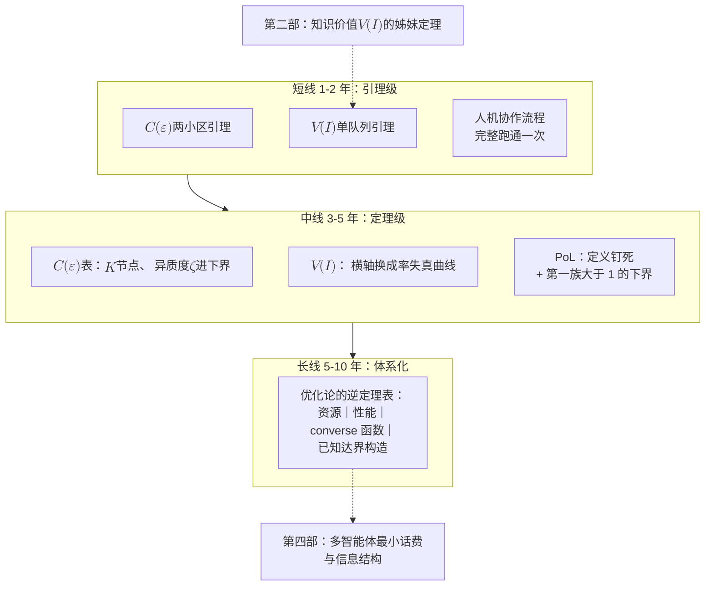

# 9 · 研究纲领：优化论的三个缺失定理

1948 年，香农在同一篇论文里做了两件事。

- 证明存在编码方案能达到容量 $C$，这是正定理（achievability）。
- 证明任何方案超过 $C$ 都必然失败，这是逆定理（converse）。

后者才是那条"物理定律"。它对**所有可能的方案**成立，包括七十年后才被发明的极化码和神经译码器。信息论的每一个核心结论，都是这样成对出现的。

再看 2026 年的一场评审会。一篇论文用扩散模型把某个边缘调度问题的目标值又推低了 3%，评审人问了一句朴素的话："离最优还有多远？"没有人能回答。

问题不在这篇论文，而在整个优化论：我们有堆积如山的算法和上界，却几乎没有一条对所有算法都成立的"墙"。优化论只长出了半边身子。

本章收官，要把缺掉的那半边写成三条可攻的开放问题，外加一条暗线。每条都配齐四件套：

- 精确陈述
- 工具箱
- 第一步引理
- AI 可攻子问题

目的是让它成为研究基础设施，而不只是一句感慨。

!!! note "本章预备知识"
    本章是第三部的研究纲领，默认读过第 1–8 章，尤其是三个缺失定理各自的主章：$V(I)$ 的[第 5 章](05-price-of-prediction.md)、$C(\varepsilon)$ 的[第 6 章](06-communication-lower-bounds.md)、PoL 的[第 7 章](07-price-of-layering.md)。另外用到：

    - 二元熵：[预备篇 4.1](../part0/04-information-theory-basics.md#41-惊讶的度量自信息与熵)；互信息与数据处理不等式：[预备篇 4.3](../part0/04-information-theory-basics.md#43-互信息信息是不确定性的减少量)；率失真：[预备篇 4.9](../part0/04-information-theory-basics.md#49-率失真分离定理与全站索引)。
    - 线性 MMSE 检测：[预备篇 5.7](../part0/05-mimo.md#57-mimo-检测谱系从-ml-到球形译码以及-2026-年的新消息)（MIMO 检测案例）。

## 9.1 只长出半边身子的理论 {#只长出半边身子的理论}

先把全章最容易误解的一点讲清楚：**converse** 和"下界"不是一回事。

优化论并不缺下界，例如：

- 一阶方法有 Nemirovski–Yudin 传统的 oracle 复杂度下界。
- 图神经网络有深度×宽度下界 [23]。
- 随机问题上有低度多项式下界 [9]。
- 分布式计算有 LOCAL 模型下界。

但这些下界都只针对**某一类算法**，换一类算法，界就作废了。GNN 的深宽下界拦不住 DRL，低度下界拦不住谱方法。香农的逆定理则针对**所有算法**：只要资源受限，谁来都做不到。本章说的 converse，指的就是这种界。

!!! warning "陷阱：converse ≠ 下界"
    - 「下界」限定算法类（一阶方法、局部算法、低度多项式、消息传递网络），量词是"这一类里没人能做到"。
    - 「converse」限定资源（比特、信息、架构、随机性来源），量词是"用这么多资源，**任何人**都做不到"。

    优化论有大量前者，几乎没有后者。三个缺失定理缺的都是后者。

    **判别法**：换一个更聪明的算法，能不能绕过这条界？能绕过，它就是下界。绕不过、只能多给资源，它才是 converse。

    [第 6 章](06-communication-lower-bounds.md)里正好有现成的一对：

    - Arjevani–Shamir 的通信轮数下界只管满足张成假设的算法，即新迭代点落在历史点、本地梯度与本地 Hessian 变换张成的空间内。跳出这个假设就不受它约束，所以是下界。
    - Tsitsiklis–Luo 的 $\Omega(n\log(1/\varepsilon))$ 型比特下界对一切协议取下确界，只数两端交换了多少比特，所以是 converse。

第二件要交代的是体裁。

- 1975 年，Cover 发表过一份只有两页的《信息论中的开放问题》[1]。
- 1987 年，他与 Gopinath 把三次专题研讨会的产出编成《通信与计算中的开放问题》。编者要求不要新结果、不要综述，只要突出的开放问题。收录的问题包括 P = NP 与广播信道容量域 [2]。
- 这个传统延续至今：ETH 的 Randomstrasse101 每年把开放问题固化成 arXiv 手稿，明确说目的是便于学术引用 [3]。

开放问题清单本身就是研究基础设施。第一部第 10 章用过这个体裁，本章沿用，并向 [2] 的编者要求看齐：下面没有新定理，只有被磨到可以动手的问题。

## 9.2 一个模板，四次实例化 {#一个模板四次实例化}

三个缺失定理加一条暗线，是同一个模板的四次实例化，不是四个并列的题目。模板是：

> 给定某种资源不超过 $R$，则**任何**方案的性能都不可能好过某个函数 $F(R)$。

四种资源、四条 converse 曲线：

| 资源（你被限制什么） | 性能 | converse 函数 | 直觉问句 | 主场章节 |
|---|---|---|---|---|
| 信息：我知道多少 | 调度/分配代价 | $V(I)$ | 预测器精确一点，我能省多少？ | [第 4 章](04-sequential-uncertainty.md)、[第 5 章](05-price-of-prediction.md) |
| 比特：我能传多少 | $\varepsilon$-最优性 | $C(\varepsilon)$ | 最优性做到 $\varepsilon$，最少传几比特？ | [第 6 章](06-communication-lower-bounds.md) |
| 架构：我怎么切分 | 代价比 | $\mathrm{PoL}$ | 分层这件事本身要付多少钱？ | [第 7 章](07-price-of-layering.md)、[第 8 章](08-computing-network-capacity.md) |
| 随机性：实例从哪来 | 可解性 | average-case landscape | 学出来的求解器为什么在真实实例上有效？ | [第 3 章](03-nonconvex-era.md) |

```mermaid
flowchart LR
    T["公共模板：<br/>资源 → 性能的逆定理<br/>『资源不超过 $$R$$，<br/>任何方案的性能<br/>不超过 $$F(R)$$』"]
    T --> V["$$V(I)$$：信息 → 调度代价<br/>预测的价目表"]
    T --> C["$$C(\varepsilon)$$：比特 → $$\varepsilon$$-最优性<br/>协同的最小话费"]
    T --> P["PoL：架构 → 代价比<br/>分层的代价"]
    T --> A["average-case：<br/>随机性 → 可解性<br/>启发式为何有效（暗线）"]
    V --> U1["第一个用户：<br/>LLM 长度预测调度"]
    C --> U2["第一个用户：<br/>FL 压缩与 3GPP CSI 之争"]
    P --> U3["第一个用户：<br/>分割推理与算网编排之争"]
    A --> U4["第一个用户：<br/>L2O / GNN / 扩散求解器"]
```

这不是凭空许愿，每条都有成熟的对照物。

- **$V(I)$ 对照率失真理论**（[预备篇 4.9](../part0/04-information-theory-basics.md)）：$R(D)$ 正是"容忍失真 $D$ 最少几比特"的 converse。
- **$C(\varepsilon)$ 对照 oracle 复杂度与通信复杂度**：前者只数向黑箱查询函数值或梯度的次数；后者是 Yao 的框架，两方各持一半输入，只数必须交换的比特。Tsitsiklis–Luo 1987 年把它带进凸优化 [4]（见[第 6 章](06-communication-lower-bounds.md)）。
- **$\mathrm{PoL}$ 对照 Price of Anarchy**（PoA，自私均衡的社会代价与集中最优之比，[第 1 章](01-three-mountains.md)用 Pigou 两路例算过）：定义一个比值、证一条普适界。Koutsoupias–Papadimitriou 提出 PoA [5]，Roughgarden–Tardos 在仿射时延自私路由上证出 $\mathrm{PoA} \le 4/3$ [6]。这个 4/3 就是"PoL 该长成什么样"的最佳示范。
- **暗线对照重叠间隙性质（OGP）[8] 与低度方法 [9]**：它们在随机图与自旋玻璃上已经成熟，只是从没被搬到通信优化的实例族上。

前面六章是后面要用的材料：

- [第 5 章](05-price-of-prediction.md)攒下了预测调度。
- [第 6 章](06-communication-lower-bounds.md)攒下了通信下界的碎片。
- [第 7 章](07-price-of-layering.md)与[第 8 章](08-computing-network-capacity.md)攒下了架构之争。
- [第 3 章](03-nonconvex-era.md)攒下了"启发式为何有效"之谜。

每个缺失定理都会挂上其中一个当代场景，作为**定理的第一个用户**。

## 9.3 三个缺失定理：四件套清单 {#三个缺失定理四件套清单}

每个问题都按四件套来写：

- **精确陈述**：要证什么，量词是谁。
- **工具箱**：现成工具在哪。
- **第一步引理**：具体到明天能动手。
- **AI 可攻子问题**：按 2026 年的人机协作范式切出的最小块。

### 9.3.1 缺失定理一 · V(I)：信息的价值函数 {#缺失定理一--vi信息的价值函数}

!!! abstract "缺失定理 1（V(I)：信息的价值函数）【开放｜陈述为本站原创组装】"
    给定一族随机调度/资源分配问题，完全信息下的最优期望代价为 $\mathrm{OPT}$。预测通道的质量用信息论量刻画：$I(S;\hat{S}) \le R$ 比特。定义

    $$V(R) \;:=\; \inf_{\pi \in \Pi(R)} \frac{\mathbb{E}\big[\mathrm{cost}(\pi)\big]}{\mathrm{OPT}},$$

    其中 $\Pi(R)$ 是只能通过该通道读取 $S$ 的全体策略。要求满足三件事：

    - **(a) 端点正确**：$V(0)$ 等于无信息基线比；$R \to H(S)$ 时 $V \to 1$。这是因为 $I(S;\hat{S}) \le H(S)$，取等号就说明通道已把 $S$ 原样告诉了策略。
    - **(b) converse**：任何仅使用该通道的策略，代价都不能低于 $V(R)$。
    - **(c) 自变量是信息论量**，不是和具体问题相关的 ad hoc 误差参数。

**物理意义**

这是把率失真的问法搬进决策。横轴不再是"预测误差多大"，而是"预测通道有几比特"。

learning-augmented 框架给出三条愿望 [10]：

- consistency：预测准时逼近离线最优。
- robustness：被对抗破坏时不劣于经典在线算法。
- smoothness：随误差优雅退化。

这三条都是"性能对误差"，不是"性能对信息"。

最接近的现有结果是 Scully–Grosof–Mitzenmacher 的估计调度。M/G/1 队列里，真实大小为 $s$ 的作业，估计值落在 $[\beta s, \alpha s]$。他们证明，**把估计值朴素代入 SRPT，近似比可以任意大**（对任意固定的 $\beta$）[11]【已解决】。但这里的自变量 $(\alpha,\beta)$ 是 ad hoc 的乘性区间，而 $V(I)$ 要做的，就是把它换成 $I(S;\hat{S})$。

先交代本节用到的排队论名词。

- **M/G/1** 是单服务台队列：作业按 Poisson 过程到达（率 $\lambda$），大小 $S$ 服从任意分布，负载 $\rho = \lambda\,\mathbb{E}[S] < 1$。
- **FCFS**：按到达先后调度。
- **PS**（processor sharing）：让在场作业平分服务能力。
- **SRPT**（shortest remaining processing time）：总是先做剩余量最小的作业。知道作业大小时它使平均响应时间最小，是完全信息基准。
- **Gittins 型策略**：只用大小的分布来排优先级。

FCFS 的平均响应时间由 **Pollaczek–Khinchine 公式**给出：

$$\mathbb{E}[T_{\mathrm{FCFS}}] \;=\; \mathbb{E}[S] + \frac{\lambda\,\mathbb{E}[S^2]}{2(1-\rho)}.$$

第二项是排队等待，其中 $\mathbb{E}[S^2] = \mathrm{Var}(S) + (\mathbb{E}[S])^2$。方差越大（重尾）、负载越接近 1，等待越长。长件占住服务台，身后的短件都得陪着等，这叫**队头阻塞**。

**行为分析**

- $V$ 应当随 $R$ 单调不增。
- $V(0)$ 由无信息最优（FCFS/PS 或按均值的 Gittins 型策略）对 SRPT 的比值给出，被 Pollaczek–Khinchine 公式里的方差项控制。重尾加高负载时，它可以任意大【部分结果】。
- $V$ 曲线的**陡峭段**，在物理上对应"多一比特信息就能避开一次队头阻塞"的区域。LLM 推理服务里，显存随生成长度线性增长，正好形成这样的高敏感区。

**工具箱**

- 信息侧：Fano 不等式与数据处理不等式。
- 排队侧：M/G/1 变换与交换论证。
- 反例侧：[11] 的对抗构造技术。

把这几样工具缝在一起的现成办法还没有。

**第一步引理【开放】**

设两点作业大小 $S \in \{1, M\}$，$\Pr[S = M] = q$，M/G/1 队列，预测通道 $I(S;\hat{S}) \le R$。任何策略要用 $\hat{S}$ 决定"当短件还是当长件对待"，就诱导出一个二元判决。它的错误概率 $p_e$ 被下面三行链条压住：

$$\begin{aligned}
h_2(p_e) \;&\ge\; H(S \mid \hat{S}) && \text{（二元 Fano 不等式）}\\[2pt]
&=\; H(S) - I(S;\hat{S}) && \text{（互信息恒等式）}\\[2pt]
&\ge\; h_2(q) - R && \text{（通道预算）},
\end{aligned}$$

其中 $h_2(p) = -p\log_2 p - (1-p)\log_2(1-p)$ 是二元熵，即[预备篇 4.1](../part0/04-information-theory-basics.md) 的 $H_b$。$S$ 只取两个值，所以 $H(S) = h_2(q)$。

三行各做一件事。

- **第一行**是 Fano 不等式在 $|\mathcal{S}| = 2$ 时的特例。一般形式的右端是 $h_2(p_e) + p_e \log_2(|\mathcal{S}| - 1)$，这里 $\log_2 1 = 0$，第二项消失。Fano 直接界住的是"给定判决时 $S$ 的条件熵"。判决只依赖 $\hat{S}$，由数据处理不等式，把条件从判决换成 $\hat{S}$ 只会让条件熵更小，所以左端可以写成 $H(S \mid \hat{S})$。
- **第二行**是互信息的定义 $I(S;\hat{S}) = H(S) - H(S \mid \hat{S})$ 移项。
- **第三行**代入通道预算 $I(S;\hat{S}) \le R$ 与 $H(S) = h_2(q)$。

反解得

$$p_e \ge h_2^{-1}\big((h_2(q) - R)^{+}\big)$$

取 $[0, 1/2]$ 分支。其中 $(x)^{+} := \max(x, 0)$，$R \ge h_2(q)$ 时这个界退化为 $0$。$h_2$ 关于 $1/2$ 对称，只在 $[0, 1/2]$ 上取反函数才唯一；$p_e > 1/2$ 时不等式本来就成立。

检查端点：

- $R \to h_2(q)$ 时 $p_e \to 0$，恢复 SRPT。
- $R = 0$ 时 $p_e \ge \min\{q, 1-q\}$，这是"只能猜多数类"的无信息判决。

**代入数字**：$q = 0.1$ 时，$h_2(0.1) \approx 0.469$ 比特（预备篇偏币算例里的同一个数）。

- $R = 0$：误判地板是 $10\%$，即一律当短件处理。
- 给通道 $0.2$ 比特：$h_2(p_e) \ge 0.269$，地板降到 $h_2^{-1}(0.269) \approx 4.6\%$。
- 给 $0.4$ 比特：地板约 $0.8\%$。
- 要把地板压到零，必须付满 $0.469$ 比特。

前 $0.2$ 比特就砍掉一半以上的误判，之后每比特买到的越来越少。

要证的目标形态是

$$\frac{\mathbb{E}[T_{\pi}]}{\mathbb{E}[T_{\mathrm{SRPT}}]} \;\ge\; 1 + c(q, M, \rho)\, h_2^{-1}\big( (h_2(q) - R)^{+} \big),$$

这里的"三步"指整条论证，不是上面公式的三行：

- 第一步：用 Fano 链把通道预算变成 $h_2(p_e)$ 的下界。
- 第二步：反解出 $p_e$ 的显式下界。
- 第三步：把判决错误率 $p_e$ 换算成响应时间比的紧常数 $c(q,M,\rho)$。

前两步是教科书内容，**缺的是第三步**。每一次"把长件误当短件"，都会让一个 $M$ 量级的作业堵在队头。这笔账在负载 $\rho$ 下如何精确结算，没有人做过。哪怕只对两点分布证出任何非平凡的 $c$，$V(I)$ 就有了第一块砖。

**AI 可攻子问题**

先把排队论剥掉：单批 $n$ 个作业、两点大小、一次性排序、最小化总完工时间，通道约束仍是 $R$ 比特。这个版本只剩 Fano 加交换论证，模型干净，篇幅可控，适合作为人机协作的第一个靶子。

**交换论证**是比较只差一对作业次序的两个排程。两个作业时：

- 短件在前，总完工时间为 $1 + (1 + M) = M + 2$。
- 长件在前，总完工时间为 $M + (M + 1) = 2M + 1$。

后者多出 $M - 1$。一般地，每一对"长件排在短件之前"的逆序，恰好多付 $M - 1$。批量版的超额代价就是 $(M - 1) \times$ 逆序对数。问题于是只剩一个：$R$ 比特的通道下，逆序对数的期望最少是多少。

!!! example "第一个用户：LLM 输出长度预测调度（回望第 5、8 章）"
    大模型推理服务里，SJF/SRTF 原则占优：优先处理短输出请求，以避免队头阻塞。实践中用学习排序或神经预测器来逼近 SJF。几个特点：

    - 输出长度呈重尾分布。
    - 显存随已生成 token 数线性增长，使批处理决策对长度预测误差高度敏感。
    - 经验上还发现，上界型保守预测会使性能急剧劣化，下界型自适应策略反而接近最优吞吐（多为 2025–2026 预印本结论，引用带保留）。

    Mitzenmacher–Shahout 已把"队列 + 预测 + LLM"的开放问题系统列出 [12]。文献里画了一堆"预测多准 → 性能多好"的经验曲线，但没有人问：这条预测通道最少要多少比特？预测器要做多准才值回训练与推理开销，重尾下多传一个分位数值多少钱，只有 $V(I)$ 能裁决。

    [第 8 章](08-computing-network-capacity.md)的预测卸载，是同一条曲线的第二个用户。

### 9.3.2 缺失定理二 · C(ε)：ε-最优性的比特成本 {#缺失定理二--cεε-最优性的比特成本}

!!! abstract "缺失定理 2（C(ε)：ε-最优性的比特成本）【开放｜陈述为本站原创组装】"
    对分布式优化问题族 $\mathcal{F}$（$K$ 个节点、$L$-光滑、$\mu$-强凸、数据异质度 $\zeta$、梯度噪声 $\sigma^2$、维度 $d$），定义

    $$C_{\mathcal{F}}(\varepsilon) \;:=\; \min\Big\{ B \;:\; \text{存在总通信量不超过 } B \text{ 比特的协议，输出 } \hat{x} \text{ 满足 } \mathbb{E}\big[f(\hat{x}) - f^{*}\big] \le \varepsilon \Big\}.$$

    要求给出上下同阶的紧刻画，且刻画中显式含 $(d, K, \varepsilon, \zeta, \sigma^2)$，像香农的容量公式显式含带宽与信噪比那样。

**物理意义**

这是四问中唯一"碎片已多、拼图未成"的一问。碎片按时间排开：

- **1987 年**，Tsitsiklis–Luo 在"每步必须传某精度二进制表示的全部比特"假设下证出 $\Omega(d^2)$ 比特下界。去掉该假设只剩 $\Omega(d)$，所以引用必须带假设 [4]。
- **2020 年**，Mayekar–Tyagi 证明：保持无压缩收敛率所需的一阶 oracle 输出最小精度，在 $\ell_2$ 下是 $\Theta(d)$ 比特量级，在 $\ell_\infty$ 下只要 $\Theta(\log d)$ 量级 [13]。
- He 等把 {强凸, 凸, 非凸} × {无偏, 压缩型} 六种设定的率下界一次做齐，并给出匹配算法 [14]。
- Ghadiri 等把回归与线性规划的通信比特复杂度推到近最优，下界用上球面 Radon 变换，这是通信优化圈几乎没人用过的工具 [15]。
- Basu 等证明，二元一阶 oracle 下混合整数凸优化的复杂度**关于连续变量个数是二次的**，且被离散化割平面法匹配 [16]。

!!! success "关键结论：优化不需要恢复信息"
    Mayekar–Tyagi 的 $\ell_\infty$ 结果是反直觉的硬证据：恢复梯度向量本身需要 $\Omega(d)$ 比特，但**优化**只需要 $\Theta(\log d)$ 量级的精度 [13]。

    "传多少比特才够"，答案取决于你要做什么。所以 $C(\varepsilon)$ 要以最优性差距为纵轴，不能用重构误差，这也是它与经典率失真不同的地方。

**第一步引理（归约链）【部分结果】**

两小区功控可以退化成两节点高斯均值估计，归约分三步。

**第一步：搭实例。** 取 $f = f_1 + f_2$，节点 $k$ 持有 $f_k(x) = \frac{\mu}{4}\lVert x \rVert^2 - \langle \theta_k, x \rangle$。两项相加得 $f(x) = \frac{\mu}{2}\lVert x \rVert^2 - \langle \theta_1 + \theta_2, x \rangle$。令梯度 $\mu x - (\theta_1 + \theta_2) = 0$，得 $x^{\star} = (\theta_1 + \theta_2)/\mu$。配方可得 $f(x) - f^{*} = \frac{\mu}{2}\lVert x - x^{\star} \rVert^2$。一般的 $\mu$-强凸函数只保证"$\ge$"，下面也只用到"$\ge$"。

**第二步：把 $\varepsilon$-最优翻译成对参数和的估计误差。** 这一步有两个箭头。

- 第一个箭头用强凸性：$\frac{\mu}{2}\mathbb{E}\lVert \hat{x} - x^{\star} \rVert^2 \le \mathbb{E}[f(\hat{x}) - f^{*}] \le \varepsilon$。
- 第二个箭头是实例嵌入：两边乘 $\mu^2$，再用 $\mu x^{\star} = \theta_1 + \theta_2$ 把 $\mu(\hat{x} - x^{\star})$ 写成 $\mu\hat{x} - (\theta_1 + \theta_2)$。

两个箭头合起来是：

$$\begin{aligned}
\mathbb{E}\big[f(\hat{x}) - f^{*}\big] \le \varepsilon \;&\Longrightarrow\; \mathbb{E}\big[\lVert \hat{x} - x^{\star} \rVert^2\big] \le \frac{2\varepsilon}{\mu} && \text{（强凸性）}\\[2pt]
\;&\Longrightarrow\; \mathbb{E}\big[\lVert \mu\hat{x} - (\theta_1 + \theta_2) \rVert^2\big] \le 2\mu\varepsilon && \text{（实例嵌入）}.
\end{aligned}$$

**第三步：套用分布式估计的通信下界。** 任何 $\varepsilon$-最优协议自动是一个把两端参数之和估到均方误差 $2\mu\varepsilon$ 的分布式估计协议，所以分布式估计的每一条通信下界都立即变成 $C(\varepsilon)$ 的下界。这一步目前最漂亮的模板，是 Kim 对比特受限随机优化的乘积型界（2026 年预印本，未经同行评审，引用带保留）[17]。每轮 $B$ 比特时，所需轮数为

$$T \;=\; \Omega\!\left( \frac{\sigma^2 d}{\varepsilon^2} \cdot \max\Big\{ 1,\ \frac{d}{B} \Big\} \right).$$

??? note "Kim 的界所用的精度记号"
    [17] 约定"精度 $\varepsilon$"指函数值差距 $f(\hat x)-f^{\star}\le\varepsilon^2$。在它所用的二次族 $f_\theta(x)=\tfrac12\lVert x-\theta\rVert^2$ 上，这等价于参数均方误差 $\mathbb{E}\lVert\hat x-\theta\rVert^2\le2\varepsilon^2$，所以 $\sigma^2d/\varepsilon^2$ 正是 $d$ 维均值估计的统计极限。

    本节前文把函数值差距本身记作 $\varepsilon$。换成那套记号，上式的 $\varepsilon^2$ 对应前文的 $\varepsilon$，统计项就是函数值差距的 $1/\varepsilon$ 量级。

**行为分析**

这条界有两个相：

- $B \ge d$：$\max$ 取 1，退回统计极限 $T = \Omega(\sigma^2 d/\varepsilon^2)$。比特用不完，限制你的是噪声。
- $B < d$：$T B = \Omega(\sigma^2 d^2/\varepsilon^2)$，**总比特数关于 $d$ 是二次的**。

数值代入：$d \sim 10^6$ 的梯度做 8 比特量化（$B = 8d$）仍在统计相；压到平均每维 $1/32$ 比特，则轮数放大 32 倍。这是极端压缩必须配误差反馈与更多迭代的理论影子。

再看三个结果：Tsitsiklis–Luo 1987 的 $\Omega(d^2)$、Basu 2025 的二次律、Kim 2026 的乘积界。三个互不相同的模型里，出现了同一条二次律【部分结果】。碎片正在收敛，但还没有人拼成一张以 $(d, K, \varepsilon, \zeta, \sigma^2)$ 为坐标的统一表。

上面实例族的异质度旋钮是 $\lVert \theta_1 - \theta_2 \rVert$，两端在最优点的梯度差恰为 $\theta_2 - \theta_1$。而 $\zeta$ 该以什么指数进入下界，至今空缺【开放】。联邦学习真正卡住的，就是这一项。

这个旋钮和 $\zeta$ 的对应关系如下。$\nabla f_k(x) = \frac{\mu}{2}x - \theta_k$，在 $x^{\star}$ 处两端分别等于 $\pm\frac{\theta_2 - \theta_1}{2}$，两端被拉向各自不同的局部最优。联邦学习常用"各节点在全局最优点的梯度多大"度量异质度，例如 $\frac{1}{K}\sum_k \lVert \nabla f_k(x^{\star}) \rVert^2 \le \zeta^2$。在这个实例里，左端等于 $\lVert \theta_1 - \theta_2 \rVert^2/4$。

**工具箱**

- **Fano / Assouad**：把"估得准"归约成"在一组候选参数里认出真的那个"（Assouad 拆成逐坐标的二元检验），再用信息量说明认不出来。
- **强数据处理不等式**：把[预备篇 4.3](../part0/04-information-theory-basics.md) 的"信息经过处理不增"加强为"经过有噪信道后至多剩下固定比例 $\eta < 1$"。
- **information complexity**：Braverman 的交互式信息论工具箱，通信优化圈几乎没搬过 [18]。它数协议记录泄露的互信息而非比特数，不超过比特数，因而是通信量的下界。
- **球面 Radon 变换** [15]。

**AI 可攻子问题**

$d = 1$ 的两节点高斯均值估计，单向与交互协议，求 $\varepsilon(B)$ 的紧刻画；再映射回两小区两用户下行功控。模型可以在一页纸内写清，统计侧的紧界已知，证明篇幅可控。

!!! example "第一个用户：3GPP CSI 双侧模型之争（回望第 6 章）"
    [第 6 章](06-communication-lower-bounds.md)讲过的故事在标准会场里仍在继续。Rel-18 的 AI/ML CSI 压缩研究结论是增益有限，不足以抵偿双侧模型的复杂度。截至 2026 年年中，双侧 CSI 压缩被推迟到 Rel-20，核心难题是跨厂商训练协作。桌上摆着三条路线：

    - 完全规定的参考模型。
    - 规定编码器结构并交换参数。
    - 规定数据集格式并交换数据集。

    三条路线争的是"编解码器接口上要传多少信息、按什么形式传"，这就是 $C(\varepsilon)$ 的问题。标准组织正在用投票解决一个本该用定理解决的问题。

    联邦学习的梯度压缩是同一条曲线的另一个用户。压缩器的构造层出不穷（上界侧），而"给定比特预算，异质数据下最优性最多做到多少"，无人能答（converse 侧）。

### 9.3.3 缺失定理三 · PoL：分层的代价 {#缺失定理三--pol分层的代价}

先说明一点：「分层的代价」（**Price of Layering, PoL**）是本站的原创提法，文献中没有这个名字。它与三个近邻的划界必须钉死：

- **PoA** [5][6] 的分母是自私博弈的均衡，PoL 的分母是**信息受限的模块化**。前者是博弈，后者是架构。
- **Layering as Optimization Decomposition**（分层即优化分解，下文简称 LaOD）[7] 给的是正定理：对偶分解恰好可分时，分层无损（PoL = 1，见[第 2 章](02-classical-foundations.md)与[第 7 章](07-price-of-layering.md)）。而有损时损多少、且任何算法都追不回来，从没被写出来。
- Witsenhausen 1968 年的反例（[第四部第 1 章](../part4/01-one-counterexample.md)）说明，在非经典信息结构下，线性律非最优，架构决定可达性。所谓非经典信息结构，是先动者的动作会影响后动者的观测，后动者却看不到先动者看到的信息。但它只给了存在性，PoL 要把"决定"量化成一个比值。

!!! abstract "缺失定理 3（PoL：分层的代价）【开放｜本站原创提法】"
    给定联合优化问题（变量 $x = (x_1, \dots, x_L)$、目标 $f$、耦合约束）。一个架构 $\mathcal{A}$ 规定：把 $x$ 切成 $L$ 层、层间接口传什么、按什么顺序传。定义

    $$\mathrm{PoL}(\mathcal{A}) \;:=\; \sup_{\text{实例}} \; \frac{\inf_{\pi \in \mathcal{A}} \mathbb{E}\big[f(x^{\pi})\big]}{\mathbb{E}\big[f(x^{\star})\big]},$$

    分子的 $\inf$ 取遍**架构 $\mathcal{A}$ 下所有可实现的算法**，这是 converse 的量词。$x^{\star}$ 是联合最优。要求：给出 $\mathrm{PoL} > 1$ 的下界，并把 $\mathrm{PoL}$ 与接口的信息容量及层数 $L$ 定量关联。

**物理意义**

分层是工程师最古老的自我保护：把大问题切成模块，每个模块只看局部信息。LaOD 告诉我们，幸运情形下这一刀是免费的。PoL 问的是不幸情形下这一刀的**定价**，而且要求这个价格对架构内的一切算法成立，DRL 也好，未来的什么新方法也好，谁都逃不掉。

读定义先认清两个量词：

- 分子的 $\inf_{\pi \in \mathcal{A}}$ 让架构内**最好**的算法出场，所以比值对架构内一切算法成立。
- 外层的 $\sup$ 挑最不利的实例。

于是要给 PoL 一个下界，只需造出**一个**实例。下面的算例就是这样做的。

!!! example "算例：一个 41/36 的玩具下界"
    大模型分割推理，切点二选一：早切（端侧算力 $c_1 = 1$，中间特征量 $B_1 = 4$）或晚切（$c_2 = 2$，$B_2 = 1$）。信道速率 $r \in \{1, 8\}$ 等概率，端到端时延 $T(k, r) = c_k + B_k / r$。四个格子：$T(1,1) = 5$，$T(1,8) = 1.5$，$T(2,1) = 3$，$T(2,8) = 2.125$。

    **联合设计**（切点看得见 $r$）逐态取最优：

    $$\mathbb{E}[T^{\star}] = \tfrac{1}{2}\, T(2,1) + \tfrac{1}{2}\, T(1,8) = \tfrac{1}{2}(3) + \tfrac{1}{2}(1.5) = \tfrac{9}{4}.$$

    **分层架构**：切点在编排层决定，接口不回传信道状态，于是 $k$ 只能依赖统计。任何随机化策略的期望时延，是两个固定策略的凸组合，所以

    $$\min_{k\ \text{固定}} \mathbb{E}\big[T(k,r)\big] = \min\Big\{ \tfrac{5 + 1.5}{2},\ \tfrac{3 + 2.125}{2} \Big\} = \min\Big\{ \tfrac{13}{4},\ \tfrac{41}{16} \Big\} = \tfrac{41}{16}.$$

    于是**该架构下任何算法**的代价比不低于 $\frac{41/16}{9/4} = \frac{41}{36} \approx 1.14$。这就是 PoL 下界该有的形状：它不说"我们的算法差 14%"，它说"这个架构里谁来都至少差 14%"。

**行为分析**

这个玩具还藏着一条关键线索。若允许接口回传 1 比特（信道处于哪个状态），切点层立即能逐态选优，代价比回到 1。在这个实例上，分层的代价被一个比特买断了。

这说明目标定理的正确形态，是把 $\mathrm{PoL}$ 写成**接口信息容量 $c$ 的函数**：$c = 0$ 时是 $41/36$，$c = 1$ 时是 $1$。

记号提醒：这个 $c$ 以比特计，不是算例的端侧算力 $c_1, c_2$、下界常数 $c_m$ 或缺失定理一的 $c(q,M,\rho)$。PoL 定义里的层数 $L$ 也不是缺失定理二的光滑常数 $L$。

信道状态支撑集变大、层数变多时，曲线如何抬升？割集（cut-set）给出接口容量的天然候选，但从没被与代价比挂钩【开放】。

**工具箱**

- PoA 的比值证明技术 [5][6]。
- LaOD 的分解条件（判定 PoL = 1 的边界）[7]。
- 信息结构与团队决策（Witsenhausen 线，通往第四部）。
- 割集论证（图论侧）。

**第一步引理【开放】**

把上面的玩具升级成实例族：两层架构，接口只传切点索引。对 $r$ 的支撑集大小 $m$ 构造实例，证明 $\mathrm{PoL} \ge c_m > 1$ 且 $c_m$ 随 $m$ 增长。再证接口每增加一比特，下界如何衰减。

**AI 可攻子问题**

四问中 PoL 的打分最低（见下节）。原因是"架构"的形式化本身没有共识：接口的字母表、时序、"该架构下所有算法"的量词范围，都要人先钉死。

AI 擅长在给定形式化里找证明，不擅长决定该用哪个形式化。可交给 AI 的最小块是：在上面已钉死的两层标量接口模型内，搜索并验证 $c_m$ 的精确值。

!!! example "第一个用户：算力网络编排之争（回望第 7、8 章）"
    [第 8 章](08-computing-network-capacity.md)盘点过的分割推理线，2025–2026 年的代表作把 transformer 层拆到注意力头与 FFN 子块粒度，用 Lyapunov 引导的分层 DRL 联合最小化时延、能耗与精度损失并保队列稳定 [19]。国内"智能算网"方向的规划文本也在凝练算网融合的基础理论问题。

    争论的格局是：

    - DRL 端到端编排派说，分层保守，联合设计才能榨干性能。
    - 分层优化派说，端到端不可运维、不可验证。

    双方都拿不出裁判。编排派给不出离联合最优的距离，分层派给不出"这一刀最多损多少"的保证。缺的裁判就是 PoL。没有这条定理，任何一方都无法证明自己不是在拟合对方的弱基线。

## 9.4 暗线：随机性如何决定可解性 {#暗线随机性如何决定可解性}

第四问不叫"缺失定理"，因为它先于定理：它问的是为什么该有定理。

[第 3 章](03-nonconvex-era.md)留下一个谜：最坏情况 NP-hard 的问题上，L2O、GNN、扩散求解器为什么在"真实实例"上一再逼近最优？候选答案只有一个方向：真实实例来自某个随机族，而**随机族的解空间几何决定了可解性**。

!!! abstract "暗线（average-case landscape：随机性 → 可解性）【开放】"
    在通信系统的典型随机实例族上（Rayleigh 衰落下的和速率最大化、随机拓扑下的干扰管理、随机到达下的调度），刻画近最优解集合的几何：是否存在重叠间隙（OGP）或低度障碍？若不存在，能否由此**解释并预言**学习式求解器的成功域与失败域？

目前最强的几何工具是 Gamarnik 的重叠间隙性质 [8]。在许多随机优化问题上，任取两个近最优解，它们的归一化重叠度要么很大（同簇），要么很小（异簇）。**中间区间的出现概率随规模趋于零**：

$$\Pr\Big[\, \exists\, x, x' \in \mathcal{S}_{\varepsilon} :\; a < R(x, x') < b \,\Big] \;\longrightarrow\; 0,$$

而一大类"稳定"算法的轨迹只能连续地改变重叠度。这类算法包括局部算法、低度多项式、Langevin 动力学；"稳定"指输入稍有扰动时，输出也只稍有变化。于是要跨簇就必须穿越禁区，必然失败。

式中 $\mathcal{S}_{\varepsilon}$ 是目标值离最优不超过 $\varepsilon$（按规模归一化）的解集合，$0 < a < b$ 是常数。以解为 $x, x' \in \{\pm 1\}^n$ 的问题（如自旋玻璃）为例，$R(x, x') = \langle x, x' \rangle / n$，有 $k$ 个坐标不同时等于 $1 - 2k/n$。这个 $R$ 不是缺失定理一的比特预算。

```mermaid
flowchart TB
    S["任取两个近最优解 $$x$$ 与 $$x'$$"] --> Q{"归一化重叠度 $$R(x,x')$$"}
    Q -->|"$$R \ge b$$：同簇，允许"| C1["解在同一簇内"]
    Q -->|"$$R \le a$$：异簇，允许"| C2["解分属远簇"]
    Q -->|"$$a \lt R \lt b$$"| GAP["禁区：出现概率随规模趋于 0"]
    GAP --> X["稳定算法只能连续移动重叠度"]
    X --> F["跨簇必须穿越禁区 → 一大类算法失败"]
```

**必须诚实交代的双面性**

第二件工具是低度方法，它用"解决任务所需的最小多项式次数"预测统计–计算间隙（权威入口是 Wein 的综述 [9]）。

- **统计–计算间隙**：指数时间穷举能做到、多项式时间算法却似乎做不到的参数区间。
- **低度方法**：只考察输出是输入的至多 $D$ 次多项式的算法，把 $D \sim \log n$ 仍失败当作多项式时间也失败的证据。

这件工具只是强启发式，还不是已确立的硬度证据。它在 random 3-XOR-SAT 上已知给错门限，而 2026 年 7 月的单作者预印本更声称**多项式时间版低度猜想为假**：构造出低度优势消失、却存在多项式时间检验的分布 [20]【预印本·未评审·重大声明】。

这对本章并不算坏消息。连"疑似 converse"的工具都还在打地基，说明这半边身子缺得有多深。

**第一步引理与 AI 可攻子问题【开放】**

对 $K = 2, 3$ 用户高斯干扰信道的和速率最大化，取随机衰落实例族：数值计算近最优功率分配集合的重叠度分布，检验是否出现间隙。矩量计算冗长但机械，适合 AI 辅助的"数值先行"；证明级结果动辄几十页，单人验证成本高，列为中线目标。

!!! example "第一个用户：学习式求解器的成功之谜（回望第 3 章）"
    正面证据在积累。Martin 等给出 L2O 圈少有的完备刻画：**所有线性收敛算法**恰好等于"基线算法 + 指数衰减的可训练修正"这一参数化 [22]。这是在保住最坏情况保证的前提下改进平均情况，也就是暗线在算法侧的镜像。

    反面缺口也是共识。扩散类组合求解器 [21] 目前普遍**连采样解的可行性都无法保证**（DIFUSCO 等被明确指出无此保证），更谈不上最优性证书。NeurIPS 2025 的相关 workshop 已把"带证书的神经组合算法"列为核心议题。

    学出来的求解器，究竟是抓住了实例族的真结构，还是拟合了基线的弱点？只有把 OGP/低度分析真正搬到通信实例族上，才有裁决。

## 9.5 方法谱系总表：二十四个格子里的同一种空缺 {#方法谱系总表二十四个格子里的同一种空缺}

把本部反复盘点过的六类方法（上界侧的系统综述见 [24]）与四个问题交叉，每格写两行：**能给什么 / 缺什么**。

| 方法 | $V(I)$ | $C(\varepsilon)$ | PoL | average-case |
|---|---|---|---|---|
| 凸优化 / 对偶分解 | 完全信息最优基线（SRPT、Gittins）/ 无信息受限下界 | **唯一有真 converse 的一格**（oracle、通信复杂度）/ 未含异质度 $\zeta$ | LaOD 可分解条件（PoL = 1 的正定理）/ 不可分解时的损失全空白 | 最坏情况刻画 / 与典型实例脱节 |
| 图论 / 组合 | 优先级与匹配式构造 / 无信息量刻画 | 割、流式通信论证 / 只对结构化问题 | 割集是接口容量的天然候选 / 未与代价比挂钩 | 随机图相变（OGP 主战场）/ 未搬到通信实例族 |
| GNN | 从图结构学调度优先级 / 无 converse | 消息规模对应比特预算 / 未形式化为 $C(\varepsilon)$ | 深宽下界 [23] 最接近 PoL / 仅对 GNN 类 | 1-WL 表达力刻画 / 与实例分布无关 |
| DRL | 端到端策略、Lyapunov 保稳定 [19] / 无最优性差距 | 可在比特约束下训练 / 无下界 | 编排派主力构造 / 离最优多远无法量化 | 隐式适应实例分布 / 无理论解释 |
| 扩散 / 生成式 | 分布式解采样 / 无 | 无直接对应 | 无直接对应 | 与统计物理采样同源、最可能被 OGP 刻画 / 可行性都无保证 [21] |
| L2O / 深度展开 | 学习优先级映射 / 无 | 学习量化器 / 无比特下界 | 展开层数与 $L$ 形式类比 / 未量化 | 线性收敛类的完备刻画 [22] / 未连到实例族门限 |

!!! success "总表的一句话结论"
    六行方法、四列问题，二十四个格子里，"能给什么"栏几乎全满，"缺什么"栏也几乎全满，而且满的方式完全一致：每种方法都在造更好的上界，没有一种方法在造 converse。

    唯一的例外是凸优化那一行的 $C(\varepsilon)$ 格，它也正是下一节判定最适合首攻的那一格。

表格下方再点一次开篇的区分。GNN 的深宽下界 [23]、低度下界 [9]、LOCAL 下界，都是**对某一类算法**的。其中 GNN 下界的证明手法，是把分布式计算下界搬进消息传递网络。它们出现在这张表里，但填不进"converse"那半格。

开篇列作"对某一类算法"的 oracle 复杂度下界，指的是附加了张成假设的教科书版本，即新迭代点只能落在已见梯度张成的空间里。在 oracle 模型里只数查询次数、对一切算法成立的 Nemirovski–Yudin 界，以及 Tsitsiklis–Luo 的比特界，才是总表里凸优化那一格的 converse。

## 9.6 四维打分与三线路线图 {#四维打分与三线路线图}

### 9.6.1 AI 辅助证明：范式已经跑通 {#ai-辅助证明范式已经跑通}

2025–2026 年，AI 攻定理从个案变成了三条并行路线。

**形式化路线**

- AlphaProof 在 Lean 环境里以 RL 训练，IMO 2024 上证出三题，与 AlphaGeometry 合计 28 分，落在**银牌线**内（常见误传是金牌，须写清）[27]。
- DeepMind 的后续系统 AlphaProof Nexus 在 2026 年 5 月的预印本 [28] 中报告：自主解决了 353 个开放 Erdős 问题中的 9 个（约 2.5%），证出了 492 个 OEIS 猜想中的 44 个（约 9%）。
- 预印本正文（第 1、4 节）还报告它改进过优化理论里的一个已知界。对凸–凹极小极大问题的锚定梯度下降–上升法（Anchored GDA），它证出 $O(1/t)$ 的收敛率，收紧了 Ryu–Yuan–Yin 2019 给出的较慢的界，而且所用的步长调度是它在搜证明时一并搜出来的。
- 摘要只笼统提到它被用于优化等方向的研究。

**自然语言路线**

GPT-5 的科学加速实验含四个经人类作者仔细验证的全新数学结果，模型的角色已从检索助手变成引理供应商 [26]。

**本领域路线**

2026 年 8 月，一份手稿宣布解决 MIMO 检测的 25 年老问题：

!!! abstract "范式标定点：ML 门限处的多项式时间 MIMO 检测【预印本·未评审·未形式化验证】"
    $N \times N$ 高斯二元 MIMO，信息论门限 $\mathrm{SNR} \ge 2\log N$ 自 2000 年代已知，但达到它的已知方法只有指数搜索。

    该手稿证明：$\rho > 2\log N$ 时，**取整的线性 MMSE 估计 + 贪心单比特翻转**以趋于零的失败概率恢复发送向量，对每个码字一致成立，运算量 $O(N^3)$。该门限处**一阶意义上不存在计算–统计间隙** [25]。

    - 这里 $\rho$ 就是上面的 $\mathrm{SNR}$，与缺失定理一里的队列负载 $\rho$ 无关。
    - 线性 MMSE 检测见[预备篇 5.7](../part0/05-mimo.md)。"一阶意义上"指两个门限的主导项同为 $2\log N$。

    AI 的参与方式（据原文脚注）：结果由两个大模型证明并起草初稿，其中一个提出算法，另一个在数天定向迭代中修复并简化证明。人类作者提出问题，验证全部数学论证，并负全责。

    论文共 46 页，原先托管于作者站点，2026-09-16 起见 arXiv:2609.19405 [25]。

这个案例的意义不在结论本身，它还未经评审。它的价值在于标定了"什么样的问题现在可以这样攻"：

- 模型极干净。
- 统计侧门限早已知。
- 工具成熟（MMSE + 贪心 + 集中不等式）。
- 单人数日可验完。

照这四个维度给本章四问打分：

| 问题 | 模型干净 | 统计侧已知 | 工具成熟 | 单人可验 | 合计 | 判断 |
|---|---|---|---|---|---|---|
| $C(\varepsilon)$ 两小区问题 | 5 | 4 | 5 | 5 | **19/20** | 首攻第一顺位 |
| V(I) 单队列问题 | 5 | 3 | 4 | 4 | **16/20** | 首攻第二顺位 |
| average-case（通信实例族） | 3 | 2 | 4 | 2 | 11/20 | 数值先行，证明列中线 |
| PoL | 2 | 2 | 3 | 3 | 10/20 | 先由人钉死定义 |

- **$C(\varepsilon)$ 两小区问题**：四维几乎复刻 MIMO 检测的条件。可写成两节点高斯均值估计的变体，统计侧紧界已知，Fano 与强数据处理不等式反复被用过，篇幅可控。
- **V(I) 单队列问题**：模型同样干净，但"互信息约束下的响应时间下界"没人问过，统计侧要自己搭。
- **average-case**：矩量计算动辄几十页，且低度地基正被质疑 [20]。
- **PoL**：形式化本身未定，这一条不可外包。

### 9.6.2 三线路线图 {#三线路线图}



- **短线（1–2 年）**：产出 $C(\varepsilon)$ 两小区与 $V(I)$ 单队列两个第一步引理，ISIT / NeurIPS 量级的单点结果。同样重要的是方法论目标：把"人提问 → AI 提算法与证明 → 人指导简化 → 人逐行验证 → 人负全责"的流程，在本领域完整复制一次。
- **中线（3–5 年）**：C(ε) 从两节点推到 $K$ 节点，把 $\zeta$ 显式做进下界，产出第一张 $C(\varepsilon)$ 表；V(I) 推到多队列，并把横轴正式换成率失真曲线；PoL 完成定义工作，并给出第一族下界实例。
- **长线（5–10 年）**：四条线合成**优化论的逆定理表**。形式上类比香农的容量表：一列资源、一列性能、一列 converse 函数、一列已知达到该界的构造。

最后是与其他部的接口。

- **向第二部**：第二部把"知识"当资源，$V(I)$ 把"预测"当资源。二者是同一个 converse 的两种资源实例化，是姊妹定理。
- **向第四部**：$C(\varepsilon)$ 的多智能体版就是"协同的最小话费"，$\mathrm{PoL}$ 的多智能体版就是 Witsenhausen 开启的信息结构问题。本章是单智能体侧的收官，也是第四部的入口。

整部书追问的目标状态，可以收进一句可检验的话：当一个新方法报出更好的数字时，我们能立刻回答，它离墙还有多远。

!!! info "跨部连线"
    本章所在的线索：[极限与基线](../guide/05-eight-threads.md#7-极限与基线离墙还有多远)、[代价](../guide/05-eight-threads.md#5-代价要付的到底是什么)。

    - [第一部第 10 章「四位一体」](../part1/10-research-agenda.md#四位一体纲领的组装逻辑)：第一部的四个基本问题怎样组装成纲领。
    - [第二部 7.7 节](../part2/07-research-agenda.md#77-接口打分路线图与第四部的入口)：第二部三条定理与本部三条缺失定理的接口表。
    - [第四部 9.8 节](../part4/09-research-agenda.md#98-全站收尾四部如何合成一个体系)：四部合成表与全站闭环图。

## 开放问题 {#开放问题}

把全章压缩成一张可撕下来的清单（状态均为【开放】，除非另注）：

1. **V(I) 第一步引理**：两点大小的 M/G/1 队列、$I(S;\hat{S}) \le R$，证明 $\mathbb{E}[T]/\mathbb{E}[T_{\mathrm{SRPT}}] \ge 1 + c\, h_2^{-1}((h_2(q) - R)^{+})$ 中任何非平凡的 $c(q, M, \rho)$。缺的是把 Fano 的错误率换算成响应时间的排队侧账本。
2. **$C(\varepsilon)$ 第一步引理**：两节点（两小区）问题的 $\varepsilon(B)$ 紧刻画；中线目标是含异质度 $\zeta$ 的统一 $C(\varepsilon)$ 表。碎片已有二次律雏形【部分结果，见 [4][16][17]】，$\zeta$ 项全空。
3. **PoL 定义问题**：架构、接口字母表、"该架构下所有算法"的量词范围的无争议形式化；随后是第一族 $\mathrm{PoL} \ge c_m > 1$ 的实例，以及 PoL 随接口比特数衰减的曲线（玩具例给出两个端点：$41/36$ 与 $1$）。
4. **通信实例族的 landscape 普查**：随机衰落和速率最大化、随机调度实例上有无 OGP / 低度障碍；注意低度方法自身的解释学地位正被重估【预印本争议，见 [20]】。
5. **元问题**：MIMO 检测范式（人负全责的 AI 协作证明）能否在上述 1、2 上复现。这既是研究问题，也是对本章路线图的实验检验。

## 参考文献 {#参考文献}

1. T. M. Cover, 《Open Problems in Information Theory》, Proc. IEEE-USSR Joint Workshop on Information Theory, Moscow, IEEE Press, pp. 35–36, 1975, https://isl.stanford.edu/~cover/papers/paper37.pdf
2. T. M. Cover, B. Gopinath (eds.), 《Open Problems in Communication and Computation》, Springer-Verlag, New York, 1987, https://link.springer.com/book/10.1007/978-1-4612-4808-8
3. A. S. Bandeira, D. Dmitriev, K. Lucca, P. Nizić-Nikolac, A. Rödder, 《Randomstrasse101: Open Problems of 2025》, arXiv:2603.29571, 2026, https://arxiv.org/abs/2603.29571
4. J. N. Tsitsiklis, Z.-Q. Luo, 《Communication complexity of convex optimization》, Journal of Complexity, vol. 3, no. 3, pp. 231–243, 1987, https://www.mit.edu/~jnt/Papers/J018-87-comm_compl_convex.pdf
5. E. Koutsoupias, C. H. Papadimitriou, 《Worst-case equilibria》, STACS 1999, LNCS vol. 1563, pp. 404–413, 1999, http://www.cs.ox.ac.uk/people/elias.koutsoupias/Personal/Papers/worsteql.pdf
6. T. Roughgarden, É. Tardos, 《How bad is selfish routing?》, Journal of the ACM, vol. 49, no. 2, pp. 236–259, 2002
7. M. Chiang, S. H. Low, A. R. Calderbank, J. C. Doyle, 《Layering as Optimization Decomposition: A Mathematical Theory of Network Architectures》, Proceedings of the IEEE, vol. 95, no. 1, pp. 255–312, 2007, https://www.princeton.edu/~chiangm/layering.pdf
8. D. Gamarnik, 《The overlap gap property: A topological barrier to optimizing over random structures》, PNAS, vol. 118, no. 41, 2021, https://www.pnas.org/doi/10.1073/pnas.2108492118
9. A. S. Wein, 《Computational Complexity of Statistics: New Insights from Low-Degree Polynomials》, arXiv:2506.10748, 2025, https://arxiv.org/abs/2506.10748
10. M. Mitzenmacher, S. Vassilvitskii, 《Algorithms with Predictions》, Communications of the ACM, vol. 65, no. 7, pp. 33–35, 2022, https://cacm.acm.org/opinion/algorithms-with-predictions/
11. Z. Scully, I. Grosof, M. Mitzenmacher, 《Uniform Bounds for Scheduling with Job Size Estimates》, ITCS 2022, LIPIcs vol. 215, pp. 114:1–114:30, 2022, https://arxiv.org/abs/2110.00633
12. M. Mitzenmacher, R. Shahout, 《Queueing, Predictions, and LLMs: Challenges and Open Problems》, Stochastic Systems (INFORMS); arXiv:2503.07545, 2025, https://arxiv.org/abs/2503.07545
13. P. Mayekar, H. Tyagi, 《Limits on Gradient Compression for Stochastic Optimization》, IEEE ISIT 2020; arXiv:2001.09032, 2020, https://arxiv.org/abs/2001.09032
14. Y. He, X. Huang, Y. Chen, W. Yin, K. Yuan, 《Lower Bounds and Accelerated Algorithms in Distributed Stochastic Optimization with Communication Compression》, arXiv:2305.07612, 2023（2025 年修订）, https://arxiv.org/abs/2305.07612
15. M. Ghadiri, Y. T. Lee, S. Padmanabhan, W. Swartworth, D. P. Woodruff, G. Ye, 《Improving the Bit Complexity of Communication for Distributed Convex Optimization》, ACM STOC 2024; arXiv:2403.19146, 2024, https://arxiv.org/abs/2403.19146
16. A. Basu, P. Kerger, M. Molinaro, 《Tight Lower Bounds for Binary First-Order Oracles for Convex Optimization》, arXiv:2511.02082, 2025（2026 年修订）, https://arxiv.org/abs/2511.02082
17. 【预印本·未评审】M. Kim, 《Information-Theoretic Lower Bounds for Bit-Constrained Stochastic Optimization via a Reduction to Compressed Gaussian Mean Estimation》, arXiv:2606.00703, 2026, https://arxiv.org/abs/2606.00703
18. M. Braverman, 《Information Complexity and the Quest for Interactive Compression (A Survey)》, ACM SIGACT News; arXiv:1504.06830, 2015, https://arxiv.org/abs/1504.06830
19. 【预印本】《Splitwise: Collaborative Edge-Cloud Inference for LLMs via Lyapunov-Assisted DRL》, IEEE/ACM UCC 2025; arXiv:2512.23310, 2025, https://arxiv.org/abs/2512.23310
20. 【预印本·未评审·重大声明】S. Mao, 《The Polynomial-Time Low-Degree Conjecture is False》, arXiv:2607.20318, 2026, https://arxiv.org/abs/2607.20318
21. S. Sanokowski, S. Hochreiter, S. Lehner, 《A Diffusion Model Framework for Unsupervised Neural Combinatorial Optimization》, ICML 2024; arXiv:2406.01661, 2024, https://arxiv.org/abs/2406.01661
22. A. Martin, I. R. Manchester, L. Furieri, 《Learning to optimize with guarantees: a complete characterization of linearly convergent algorithms》, arXiv:2508.00775, 2025（2026 年修订）, https://arxiv.org/abs/2508.00775
23. A. Loukas, 《What graph neural networks cannot learn: depth vs width》, ICLR 2020; arXiv:1907.03199, 2020, https://arxiv.org/abs/1907.03199
24. Y.-F. Liu, T.-H. Chang, M. Hong, Z. Wu, A. M.-C. So, E. A. Jorswieck, W. Yu, 《A Survey of Recent Advances in Optimization Methods for Wireless Communications》, IEEE JSAC; arXiv:2401.12025, 2024, https://arxiv.org/abs/2401.12025
25. 【预印本·未评审】D. Papailiopoulos（结果由 GPT-5.6 与 Claude Fable 5 证明）, 《Polynomial-Time MIMO Detection at the Maximum-Likelihood Threshold》, arXiv:2609.19405, 2026（此前为作者站点手稿）, https://arxiv.org/abs/2609.19405
26. S. Bubeck et al., 《Early science acceleration experiments with GPT-5》, arXiv:2511.16072, 2025, https://arxiv.org/abs/2511.16072
27. Google DeepMind AlphaProof team, 《Olympiad-level formal mathematical reasoning with reinforcement learning》, Nature, 2025, DOI: 10.1038/s41586-025-09833-y, https://www.nature.com/articles/s41586-025-09833-y
28. G. Tsoukalas et al.（Google DeepMind，共 21 位作者）, 《Advancing Mathematics Research with AI-Driven Formal Proof Search》, arXiv:2605.22763, 2026, DOI: 10.48550/arXiv.2605.22763, https://arxiv.org/abs/2605.22763
