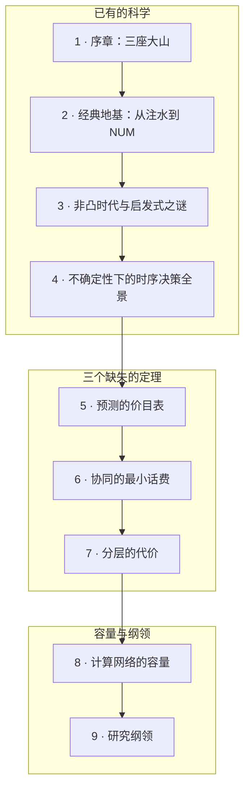

# 第三部 · 网络的优化论

**总论题：资源优化的本质困难不是非凸性，而是不确定性下的时序耦合与分布式信息——而这两座山的"极限侧"理论几乎空白。**

过去二十年，社区把火力集中在"怎么解非凸问题"（上界侧：更快的算法、更好的启发式），却很少反过来问极限（下界侧）：预测未来值多少？协商最少要说多少话？分层最多亏多少？本部先把经典地基（凸优化时代、NUM）与非凸时代讲透，然后展开三个原创纲领——**预测的价目表、协同的最小话费、分层的代价**——外加一条暗线：启发式为何有效的平均情形之谜。

## 本部地图

本部沿两根轴展开：**四大当代舞台**（边缘计算/任务卸载、大模型推理服务、联邦学习、网络切片调度）是抽象原理反复落地的场景；**方法谱系**（凸优化变换 → 图论/GNN → 强化学习 → 扩散模型/生成式优化 → L2O）是"上界侧军备竞赛"的演化史——每章都盘点各方法"解决了什么、回答不了什么"，回答不了的部分正是缺失定理的落点。

| 章 | 主题 | 性质 |
|---|---|---|
| [1 · 序章](01-three-mountains.md) | 三座大山 × 四大舞台矩阵；上界/下界的不对称繁荣 | 观点与导读 |
| [2 · 经典地基](02-classical-foundations.md) | 注水、NUM 对偶分解、TCP 即优化；隐含假设清单 | 经典 |
| [3 · 非凸时代](03-nonconvex-era.md) | NP-hard、WMMSE→GNN→扩散三代方法、平均情形之谜 | 经典+开放 |
| [4 · 时序决策全景](04-sequential-uncertainty.md) | 四种「不知道」四个理论；同一卸载问题四种解法 | 框架整理 |
| [5 · 预测的价目表](05-price-of-prediction.md) | V(I) 纲领；LLM 输出长度预测调度为活例 | 原创纲领 |
| [6 · 最小话费](06-communication-lower-bounds.md) | 通信复杂度下界；FL 压缩与 CSI 两侧模型为活例 | 原创纲领 |
| [7 · 分层的代价](07-price-of-layering.md) | PoL 纲领；大模型分割推理与算力网络编排为活例 | 原创纲领 |
| [8 · 计算容量](08-computing-network-capacity.md) | 网络函数计算、AirComp、分布式 LLM 推理 | 经典+开放 |
| [9 · 研究纲领](09-research-agenda.md) | 三定理+暗线组装；方法×问题矩阵；路线图 | 纲领 |
