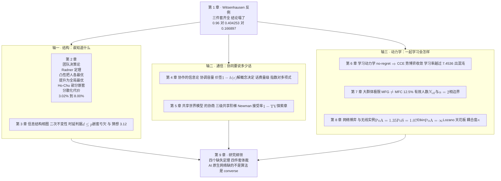

# 1 · 序章：一个反例统治六十年

1968 年，Hans Witsenhausen 在《SIAM Journal on Control》上发表了一篇十七页的短文 [1]。文章里只有一个问题：一条标量的线性动态、一个二次的代价、两个高斯的随机量。这是最优控制教科书里最温顺的三件套——LQG（线性–二次–高斯）。任何一本教材都会告诉你：LQG 问题的最优控制器是**线性**的，估计与控制**可以分离**，最优解写得出闭式。

Witsenhausen 只改了一句话：**让第二个控制器看不见第一个控制器看见的东西。**

三件套一个没动，结论全塌了。最优控制器不是线性的（他给出了一个具体的非线性策略，代价只有最好线性策略的四成）；分离原理失效；而且——这是最刺眼的部分——**到 2026 年为止，没有人知道这个问题的最优解长什么样。**六十年间上界从 0.404 降到 0.1669，降幅越来越小，最优值仍然是一个开放问题。

这篇序章要做三件事。

第一，**把这个反例完整算一遍**。不是复述"存在一个反例"，而是把最好的仿射策略算成一个精确的数（本章会证明它在经典参数下**恰好等于** $0.96$，有闭式），再把一个能赢它的非线性策略算成另一个数（$0.404253$），两个数都给出可复算的推导与独立校验。一个一维搜索加一次高斯积分，就能亲眼看到"线性最优"被打败。

第二，**指出它为什么会赢**：第一级的动作 $u_1$ 同时是**控制量**和**信道输入**——$k^2\mathbb{E}[u_1^2]$ 就是发射功率，第二级是收到噪声观测之后的**估计器**。非线性策略赢，是因为它用动作给下游**传了信息**。这条读法出自 Mitter–Sahai 1999 [15]，是本章接上[第二部第 5 章](../part2/05-cognitive-triangle.md)对偶效应的正门。

第三，**交出本部的地图**：三条轴（结构、通信、动力学）、三块警示牌（信息多不一定好、分离失效、公共知识要花钱）各自指向哪一章，以及贯穿全部的那句话——**无线网络既是多智能体问题的实例，又是信息结构的生成器**。

!!! note "本章预备知识"
    读本章只需要概率论（高斯分布、条件期望、MMSE 估计）与一元微积分（求导、解一个五次方程的实根）。用到的站内内容：

    - 条件期望、高斯条件分布的线性性与 MMSE 估计：[预备篇 4.10](../part0/04-information-theory-basics.md)。
    - 率失真、互信息、数据处理不等式：[预备篇第 4 章](../part0/04-information-theory-basics.md)。
    - 小区、回传、TTI、CoMP 这些名词：[预备篇第 6 章](../part0/06-wireless-networks.md)。
    - 多智能体强化学习的训练范式（CTDE）：[预备篇第 8 章](../part0/08-reinforcement-learning.md)。
    - 对偶效应（动作会改变未来信息的质量，Bar-Shalom–Tse）：[第二部第 5 章](../part2/05-cognitive-triangle.md)定义 5.2。
    - 三块警示牌：[第二部第 7 章](../part2/07-research-agenda.md)收尾节。

    本章是导读章：定理只陈述、不证明（证明留给[第 2 章](02-team-decision-theory.md)与[第 3 章](03-information-structure-phase-diagram.md)），但**两个核心算例必须完整**——它们是全部论断的地基。

---

## 1.1 两个人接力开一辆车

先讲一个不带公式的版本。

一辆车要开到目的地。两个司机接力：**司机甲**坐在前半程，他能看清路况（前方有个坑，偏左 5 米）；**司机乙**接手后半程，但他上车时车窗结了霜，只能从一块模糊的仪表盘上读出一个**带噪声的**车辆位置。甲乙两人的目标完全一致：让车最后停在正确的位置。甲开车要烧油，油钱按方向盘转动量的平方算。

现在问：甲该怎么开？

**第一个答案（"好好开"）**：甲当然应该尽量把车开到正确位置上，让乙少费劲。这是"控制"的思路。

**第二个答案（"故意开偏"）**：甲还可以做另一件事——**把车停在一个乙一定认得出来的位置上**。比如"要么正 5 米，要么负 5 米，绝不停在中间"。这样即使乙的仪表模糊，他也能凭一个符号判断出车在哪一侧，从而精确地知道甲看到了什么。甲多烧了一点油，但乙的不确定性从"一片模糊"降到了"几乎为零"。

这是"通信"的思路：**甲用自己的动作，给乙发了一个比特。**

!!! tip "直觉：为什么这两件事会打架"
    在单决策者的世界里，这两件事不打架——因为只有一个人，"给自己发信号"没有意义（你已经知道了）。**对偶效应**（[第二部第 5 章](../part2/05-cognitive-triangle.md)定义 5.2）说的是一个较弱的版本：一个人的动作会影响他**未来**能观测到什么，所以"探测"与"利用"要权衡。

    多决策者把这件事推到极端：甲的动作影响的是**乙**的观测。甲面对的不再是"探测还是利用"，而是"**开车还是说话**"——而且他必须用同一个方向盘做这两件事。

    这就是本章标题里那个"反例"的全部张力。它不是一个技巧性的病态构造，而是**只要两个人看见的东西不一样，就必然出现**的结构性冲突。

**到此为止我们得到了什么：一个不含公式的图像——在多决策者问题里，一个动作同时是控制量与信道输入；"好好开"与"说清楚"要抢同一份预算。下面把这个图像写成三行数学。**

---

## 1.2 反例的精确设置：三件套齐全，结论塌了

!!! abstract "定义 1.1（Witsenhausen 两级问题 [1]）"
    固定两个正参数 $k>0$、$\sigma>0$。

    1. **自然出牌。**初始状态 $x_0\sim\mathcal{N}(0,\sigma^2)$。
    2. **决策者 1（DM1）**观测到 $x_0$ 本身，选动作 $u_1=\gamma_1(x_0)$，付代价 $k^2u_1^2$。状态变成

        $$
        x_1=x_0+u_1 .
        $$

    3. **决策者 2（DM2）**观测到 $y=x_1+v$，其中 $v\sim\mathcal{N}(0,1)$ 与 $x_0$ 独立；选动作 $u_2=\gamma_2(y)$，付代价 $(x_1-u_2)^2$。
    4. **总代价**（两人共同承担、目标完全一致）

        $$
        J(\gamma_1,\gamma_2)=k^2\,\mathbb{E}\big[u_1^2\big]+\mathbb{E}\big[(x_1-u_2)^2\big].
        $$

    容许策略类：$\gamma_1,\gamma_2$ 为任意 Borel 可测函数且使 $J$ 有限。（"Borel 可测"是测度论的技术条件，白话是"足够规矩、可以对它取期望"：连续函数、分段连续函数、阶梯函数、符号函数都满足。它只保证 $\mathbb{E}[u_1^2]$ 这类期望有定义，不限制策略的形状，线性的、非线性的、带跳变的都在容许之列。）**经典参数**取 $(k,\sigma)=(0.2,5)$。

**这个定义在说什么。**逐项翻译一遍。$x_0$ 是"真实路况"，DM1 看得一清二楚；$u_1$ 是"甲转方向盘"，$k^2u_1^2$ 是油钱，$k$ 越大油越贵；$x_1$ 是甲交班时车的位置；$y$ 是乙那块模糊仪表的读数（噪声方差归一化为 1，这不失一般性：若噪声方差是 $N$，把 $x_0,u_1,x_1,y,u_2$ 同除以 $\sqrt N$，噪声就变成单位方差，$x_0$ 的标准差变成 $\sigma/\sqrt N$，两项代价都缩小为原来的 $1/N$ 而 $k$ 不变——问题的形状不变，只是参数 $\sigma$ 换成了 $\sigma/\sqrt N$）；$u_2$ 是乙对车在哪里的**猜测**，$(x_1-u_2)^2$ 是猜错的罚款。

请注意这个模型里**三件套一个不少**：

- **线性动态**：$x_1=x_0+u_1$、$y=x_1+v$，两个方程都是线性的；
- **二次代价**：$k^2u_1^2+(x_1-u_2)^2$；
- **高斯噪声**：$x_0$ 与 $v$ 都是高斯的、独立的。

如果只有**一个**决策者（也就是说，如果 DM2 也能看到 $x_0$），这个问题是教科书第一章的习题：DM2 知道 $x_1$，直接取 $u_2=x_1$，第二项归零；于是 DM1 取 $u_1=0$，总代价为 $0$。分离原理成立，最优律线性（这里甚至是恒零）。

坏消息藏在唯一被改动的地方：**DM2 看不到 $x_0$，也看不到 $u_1$。**他手上只有 $y$。而 $y$ 是被 DM1 的动作**加工过**的。

!!! warning "陷阱：这不是"信息少了"这么简单"
    工程直觉容易把它读成"DM2 信息少，所以性能差一点"。真正的困难在另一处：**DM2 的观测分布依赖于 DM1 的策略**。DM1 换一个 $\gamma_1$，DM2 面对的就是一个不同的估计问题。两个人的优化**互相嵌在对方的问题里**，而且 DM1 不能只考虑"我这一步的代价"，还得考虑"我这一步会把什么样的世界交给 DM2"。

    这正是[第二部第 7 章](../part2/07-research-agenda.md)第二块警示牌的内容：**分离失效，动作即信号**。

**到此为止我们得到了什么：一个三行就能写完的问题，LQG 三件套齐全，唯一的非标准之处是第二个决策者看不见第一个决策者看见的东西。下面证明这一条就足以毁掉线性最优性。**

---

## 1.3 仿射能做到多好：一个精确的 0.96

先把"最好的线性策略"算到底。这一节的结论有点意外：在经典参数下，它**恰好**等于 $24/25=0.96$，而且有一个两行的闭式。

**第 1 步：把仿射策略族参数化。**设 DM1 用仿射律 $u_1=(t-1)x_0+\beta$。由于 $x_0$ 零均值、代价对称，$\beta=0$ 最优（任何非零常数只增加第一项而不改善第二项）：第一项变成 $k^2\mathbb{E}\big[((t-1)x_0+\beta)^2\big]=k^2\big[(t-1)^2\sigma^2+\beta^2\big]$，交叉项因 $\mathbb{E}[x_0]=0$ 消失，平白多出 $k^2\beta^2$；第二项不变，因为 DM2 知道 DM1 用的是哪条策略、也就知道 $\beta$，可以先从 $y$ 里减掉它，已知的平移不改变估计误差。于是

$$
x_1=t\,x_0\sim\mathcal{N}(0,\,t^2\sigma^2),
$$

一个参数 $t\in\mathbb{R}$ 就概括了整族。$t=1$ 表示"不动方向盘"，$t=0$ 表示"把状态全部抹平"。

**第 2 步：DM2 的最优响应。**DM2 的代价是平方误差 $(x_1-u_2)^2$，看到 $y$ 之后最好的猜测是条件均值 $\mathbb{E}[x_1\mid y]$（MMSE 估计），这一点对 DM1 的任何策略都成立。给定 DM1 用仿射律，$x_1$ 是高斯的，$y=x_1+v$ 也是高斯的，且二者联合高斯。**高斯情形下 MMSE 估计就是线性估计**（[预备篇 4.10](../part0/04-information-theory-basics.md)），所以

$$
u_2^\star=\mathbb{E}[x_1\mid y]=\frac{t^2\sigma^2}{t^2\sigma^2+1}\,y,
\qquad
\mathbb{E}\big[(x_1-u_2^\star)^2\big]=\frac{t^2\sigma^2\cdot 1}{t^2\sigma^2+1}.
$$

这里用的是标量高斯的两条标准公式。记 $a=\mathrm{Var}(x_1)=t^2\sigma^2$、$b=\mathrm{Var}(v)=1$，则 $\mathrm{Var}(y)=a+b$、$\mathrm{Cov}(x_1,y)=a$。条件均值是 $y$ 的线性函数，系数为 $\mathrm{Cov}(x_1,y)/\mathrm{Var}(y)=\frac{a}{a+b}$；条件方差为 $a-\frac{\mathrm{Cov}(x_1,y)^2}{\mathrm{Var}(y)}=a-\frac{a^2}{a+b}=\frac{ab}{a+b}$，是两个方差的"并联"组合（与两个电阻并联同形：$\frac{a+b}{ab}=\frac1a+\frac1b$，所以结果比 $a$、$b$ 中较小的一个还小）。条件方差不依赖 $y$ 的取值，所以它直接就是均方误差。注意 **DM2 的最优响应自动是线性的**——所以"仿射策略族"其实只限制了 DM1，没有额外限制 DM2。

**第 3 步：代入总代价。**第一项 $k^2\mathbb{E}[u_1^2]=k^2(t-1)^2\sigma^2$。合起来：

$$
J_{\mathrm{aff}}(t)=k^2\sigma^2\,(t-1)^2+\frac{\sigma^2t^2}{1+\sigma^2t^2}.
$$

!!! abstract "命题 1.1（仿射代价的闭式，与 $k\sigma=1$ 时的精确最优）【本站演算】"
    在定义 1.1 的问题中，限制 DM1 使用仿射律（DM2 自由），最小代价为 $\min_{t\in\mathbb{R}}J_{\mathrm{aff}}(t)$，其中 $J_{\mathrm{aff}}$ 如上式。进一步：

    1. 驻点方程 $J_{\mathrm{aff}}'(t)=0$ 等价于五次方程

        $$
        k^2\sigma^2\,(t-1)\big(1+\sigma^2t^2\big)^2+\sigma^2 t=0 .
        $$

    2. **当且仅当 $k\sigma=1$ 时**，该五次式含因子 $\sigma^2t^2-\sigma^2t+1$，即

        $$
        k^2\sigma^2(t-1)(1+\sigma^2t^2)^2+\sigma^2t
        =\big(\sigma^2t^2-\sigma^2t+1\big)\big(\sigma^2t^3+t-1\big).
        $$

    3. 于是当 $k\sigma=1$ 且 $\sigma\ge2$ 时，仿射最优有闭式：**两个**最优点

        $$
        t_\pm=\frac{\sigma\pm\sqrt{\sigma^2-4}}{2\sigma}
        $$

        给出**同一个**最优值

        $$
        J^\star_{\mathrm{aff}}=1-\frac{1}{\sigma^2}\;=\;k^2\sigma^2-k^2 .
        $$

**证明（四步，全部初等）。**

1. 对 $J_{\mathrm{aff}}$ 求导：$J_{\mathrm{aff}}'(t)=2k^2\sigma^2(t-1)+\dfrac{2\sigma^2t}{(1+\sigma^2t^2)^2}$。用商法则算第二项：$\frac{\mathrm{d}}{\mathrm{d}t}\big[1-\frac{1}{1+\sigma^2t^2}\big]=\frac{2\sigma^2t}{(1+\sigma^2t^2)^2}$。令导数为零、两边乘 $(1+\sigma^2t^2)^2/2$，得第 1 条。

2. 记 $S=\sigma^2$。**先验证因子**：若 $St^2-St+1=0$，则 $1+St^2=St$，代入第 1 条左端（取 $k^2S=1$）得

    $$
    (t-1)(St)^2+St=St\big[(t-1)St+1\big]=St\big[St^2-St+1\big]=0 .
    $$

    所以每个满足 $St^2-St+1=0$ 的 $t$ 都是驻点。**再验证必要性**：设 $t$ 是 $St^2-St+1=0$ 的根（实根、复根都可以），于是 $1+St^2=St$、$St^2-St=-1$。把它代入第 1 条左端，这次不假设 $k^2S=1$：

    $$
    k^2S(t-1)(St)^2+St=St\big[k^2S(St^2-St)+1\big]=St\,(1-k^2S).
    $$

    $t=0$ 不是二次式的根（代入得 $1\ne0$），所以上式为零当且仅当 $k^2S=1$。若五次式含因子 $St^2-St+1$，它必在这个因子的根上为零，从而 $k^2S=1$；反方向由第 3 步的展开给出。所以含这个因子当且仅当 $k\sigma=1$。

3. **多项式除法**（直接展开核对）：$(St^2-St+1)(St^3+t-1)=S^2t^5-S^2t^4+2St^3-2St^2+(S+1)t-1$，恰是第 1 条左端在 $k^2S=1$ 时的展开式。

4. **算最优值**。在 $1+St^2=St$ 上，第二项 $\frac{St^2}{1+St^2}=\frac{St^2}{St}=t$，故

    $$
    J_{\mathrm{aff}}=(t-1)^2+t=t^2-t+1 .
    $$

    而 $St^2-St+1=0$ 给 $t^2-t=-1/S$，代入即得 $J_{\mathrm{aff}}=1-1/S=1-1/\sigma^2$。两个根 $t_\pm$（由二次公式）给出同一个值。剩下的第三个实驻点解 $\sigma^2t^3+t-1=0$，是两个极小值之间的**极大值**。依据分三步：

    - **恰有三个实驻点。**三次式 $\sigma^2t^3+t-1$ 的导数 $3\sigma^2t^2+1>0$，它严格单调，恰有一个实根 $t_0$，且 $t_0\in(0,1)$（它在 $t=0$ 处取 $-1$、在 $t=1$ 处取 $\sigma^2>0$）；$\sigma>2$ 时二次式的判别式 $\sigma^4-4\sigma^2>0$，有两个不同实根 $t_\pm$；两式没有公共根：在二次式的根上 $\sigma^2t^2=\sigma^2t-1$，于是 $\sigma^2t^3=t(\sigma^2t-1)=\sigma^2t-1-t$，三次式化为 $\sigma^2t-2$，公共根须满足 $t=2/\sigma^2$，代回二次式得 $4/\sigma^2-1=0$，只在 $\sigma=2$（$t=\tfrac12$）时成立。所以 $\sigma>2$ 时共有三个互不相同的实驻点。
    - **导数符号交替。**$J_{\mathrm{aff}}'$ 与五次式只差一个正因子 $2/(1+\sigma^2t^2)^2$，两者同号；五次式首项系数 $k^2\sigma^6>0$，所以 $J_{\mathrm{aff}}'$ 在最左端为负、最右端为正，并在每个单根处变号，三个驻点从左到右依次是极小、极大、极小。
    - **中间的是 $t_0$。**相邻的极小与极大之间 $J_{\mathrm{aff}}$ 严格单调，两者的值不可能相等；而 $t_+$ 与 $t_-$ 的函数值都是 $1-1/\sigma^2$，所以它们只能是两端的两个极小，中间的极大就是 $t_0$。（$\sigma=2$ 时三个驻点并成一个 $t=\tfrac12$，它是唯一的最小点，最优值公式照样成立。）$\blacksquare$

**物理意义。**$J_{\mathrm{aff}}$ 的两项是一场明码标价的交易：第一项 $k^2\sigma^2(t-1)^2$ 是"把状态从 $x_0$ 挪到 $tx_0$ 要烧的油"，第二项 $\frac{\sigma^2t^2}{1+\sigma^2t^2}$ 是"DM2 在噪声里估这个状态估不准的罚款"。$t$ 越小，状态越小，DM2 越好估（罚款趋于 0），但油钱越贵（$t=0$ 时油钱等于 $k^2\sigma^2$，把整个 $x_0$ 抹掉的代价）。$k\sigma=1$ 即 $k^2\sigma^2=1$，意思是"把整个状态抹平的油钱" $J_{\mathrm{aff}}(0)=k^2\sigma^2$ 恰好等于第二项罚款的上限 $1$（$\frac{\sigma^2t^2}{1+\sigma^2t^2}<1$，这个 $1$ 就是归一化后的噪声方差）。两项的量级在这条曲线上对齐，代数上的巧合就发生在这里。

**行为分析。**（i）$t\to0$：$J\to k^2\sigma^2$。这是"不指望 DM2、我自己把车停死在原点"的策略。（ii）$t=1$：$J=\frac{\sigma^2}{\sigma^2+1}$，这是"完全不干预、全靠 DM2 估"的策略。（iii）$k\to\infty$（油贵）：第一项主导，最优 $t\to1$，仿射最优趋于 $\frac{\sigma^2}{\sigma^2+1}$。（iv）$\sigma\to\infty$（在 $k\sigma=1$ 上意味着 $k\to0$，油白菜价）：$J^\star_{\mathrm{aff}}=1-1/\sigma^2\to1$——注意它**不趋于 0**，因为油便宜的同时状态也在变大，两者抵消。（v）$\sigma<2$ 时 $t_\pm$ 变复数，闭式失效，此时五次式只剩三次因子的实根，仿射最优要数值解。

!!! example "算例 1.1（经典参数下的仿射最优）【本站演算】"
    取 $(k,\sigma)=(0.2,5)$，于是 $k\sigma=1$、$k^2\sigma^2=1$、$\sigma^2=25$。代入：

    $$
    J_{\mathrm{aff}}(t)=(t-1)^2+\frac{25t^2}{1+25t^2}.
    $$

    命题 1.1 第 3 条直接给出

    $$
    t_\pm=\frac{5\pm\sqrt{21}}{10},\qquad t_+=0.9582575695,\quad t_-=0.0417424305,
    $$

    $$
    \boxed{\;J^\star_{\mathrm{aff}}=1-\frac{1}{25}=\frac{24}{25}=0.9600000000\;}
    $$

    两个最优点，同一个最优值。中间的局部极大在 $25t^3+t-1=0$ 的实根 $t_0=0.3031960455$ 处，$J_{\mathrm{aff}}(t_0)=1.1823397$。

    **对照文献。**Tseng–Tang 2017 [14] 报告其局部搜索算法从 $x_1\equiv0$ 初始化时停在另一个局部 Nash 极小，代价 $0.959991$（其图 5(b)；原文只说这类初值会把算法困在远离最优的局部极小，没有说它是仿射的）；Mehmetoglu–Akyol–Rose 2014 [13] 表 I 记仿射最优为 $0.961852$。前者比本站闭式低 $9.4\times10^{-4}\%$，后者高 $0.19\%$。后者可以解释为**网格离散**造成的数值误差。前者低于闭式值，而任何严格的仿射策略都不可能低于 $0.96$，所以它不是严格仿射的策略；本站判断它多半是接近仿射的非线性局部极小，数值误差也可能有份——原文自己提到其结果受采样粒度影响。两者与闭式值都相差不到 $0.2\%$；本章正文一律用闭式值 $0.96$。

    **校验：**（i）**两个端点独立复核**。$t=0$：$J=(0-1)^2+0=1$，而理论值 $k^2\sigma^2=0.04\times25=1$ ✓。$t=1$：$J=0+\frac{25}{26}=0.9615384615$，而理论值 $\frac{\sigma^2}{\sigma^2+1}=\frac{25}{26}$ ✓。两端都比 $0.96$ 大，最优点确实在内部。（ii）**把闭式解代回一阶条件**。$t_+=0.9582575695$ 时 $1+25t_+^2=1+22.9564=23.9564$，而 $25t_+=23.9564$ ✓（这正是 $1+\sigma^2t^2=\sigma^2t$）；于是 $J'(t_+)=2(t_+-1)+\frac{50t_+}{(25t_+)^2}=2(-0.0417424)+\frac{47.9129}{573.91}=-0.0834849+0.0834849=0$ ✓。（iii）**两条路径同一个数**。用 $J=t^2-t+1$：$t_+^2-t_++1=0.9182583-0.9582576+1=0.9600007$；用原式：$(t_+-1)^2+\frac{25t_+^2}{1+25t_+^2}=0.0017424+0.9582576=0.9600000$ ✓（第一条路的末位差来自手算舍入）。（iv）**第二个最优点**。$t_-=0.0417424$：$25t_-^2=0.0435608$，$1+25t_-^2=1.0435608$，比值 $=0.0417424=t_-$ ✓（同一恒等式），$J=(0.0417424-1)^2+0.0417424=0.9182576+0.0417424=0.9600000$ ✓。

下面把这条曲线画出来，同时把后面两节要用的两条水平线一起标上。

{ .chart loading=lazy }
{ .chart loading=lazy }

*怎么读这张图：最上面那条起伏的曲线是 $J_{\mathrm{aff}}(t)$，横轴的 15 个取值是本站按闭式逐点算出的（含两个最优点 $t_-=0.042$ 与 $t_+=0.958$，两处的纵坐标都精确等于 $0.96$，中间隆起的峰在 $t=0.3032$ 处、峰值 $1.1823$）。中间那条水平线是 Witsenhausen 1968 本人的一步符号策略 $0.404253$（算例 1.2），最下面那条是已知最好的上界 $0.166897$（Tseng–Tang 2017 [14]）。**整条仿射曲线的最低点，也是中间那条线的约 2.4 倍（$0.96/0.404253\approx2.37$）。**数据全部来自本章算例 1.1、1.2 与 1.5 节的表。*

**到此为止我们得到了什么：仿射策略族的代价闭式；经典参数下的一个精确结论——最优仿射代价恰好是 $24/25=0.96$，由两个不同的增益 $t_\pm=(5\pm\sqrt{21})/10$ 同时达到；以及两个独立途径（端点极限、一阶条件回代）的校验。这个 $0.96$ 是本章后面一切比较的基准线。**

---

## 1.4 一个能赢它的策略：把动作当信号发出去

现在轮到那个反例真正的一击。

**思路。**仿射策略把 $x_0$ 按比例缩放，缩得越小 DM2 越好估——但**缩放不改变"分辨"的难度**：$tx_0$ 仍然是一个连续分布，DM2 仍然只能在噪声里做估计。换一个思路：**不缩放，改成量化。**把 $x_1$ 强行推到两个点 $\{+\sigma,-\sigma\}$ 上。这样 DM2 面对的不再是"在连续量上估计"，而是"在二元信号上判决"——而二元判决在信噪比高时的错误率是**指数小**的。

代价是什么？DM1 得把 $x_0$ 从它本来的位置推到 $\pm\sigma$，要烧油。这笔油钱是一个可以精确算出的常数。

!!! abstract "命题 1.2（一步符号策略的代价）【本站演算·复现 [1] 的构造】"
    在定义 1.1 的问题中取

    $$
    \gamma_1(x_0)=\sigma\,\mathrm{sgn}(x_0)-x_0
    \qquad\Longleftrightarrow\qquad
    x_1=\sigma\,\mathrm{sgn}(x_0)\in\{-\sigma,+\sigma\},
    $$

    DM2 用对应的 MMSE 估计 $u_2=\mathbb{E}[x_1\mid y]=\sigma\tanh(\sigma y)$。则

    1. **第一级（油钱）精确等于**

        $$
        k^2\,\mathbb{E}\big[(\sigma-|x_0|)^2\big]
        =k^2\sigma^2\Big(2-2\sqrt{2/\pi}\Big);
        $$

    2. **第二级（估计误差）**等于 $\sigma^2\,\mathbb{E}\big[\mathrm{sech}^2(\sigma y)\big]$，并有一个不需要积分的上界

        $$
        \mathbb{E}\big[(x_1-u_2)^2\big]\;\le\;4\sigma^2\,Q(\sigma),
        \qquad Q(z)=\Pr[\mathcal{N}(0,1)>z];
        $$

    3. 因此 $J_{\mathrm{sgn}}\le k^2\sigma^2\big(2-2\sqrt{2/\pi}\big)+4\sigma^2Q(\sigma)$。

**证明（三步）。**

1. $u_1=\sigma\,\mathrm{sgn}(x_0)-x_0$，故 $u_1^2=(\sigma\,\mathrm{sgn}(x_0)-x_0)^2$。因 $\mathrm{sgn}(x_0)x_0=|x_0|$，展开得 $u_1^2=\sigma^2-2\sigma|x_0|+x_0^2$。取期望，用 $\mathbb{E}[x_0^2]=\sigma^2$ 与半正态的一阶矩 $\mathbb{E}|x_0|=\sigma\sqrt{2/\pi}$（由对称性 $\mathbb{E}|x_0|=2\int_0^\infty x\,\frac{e^{-x^2/(2\sigma^2)}}{\sqrt{2\pi}\,\sigma}\,\mathrm{d}x$，换元 $w=x^2/(2\sigma^2)$、$x\,\mathrm{d}x=\sigma^2\mathrm{d}w$ 后等于 $\frac{2\sigma}{\sqrt{2\pi}}\int_0^\infty e^{-w}\,\mathrm{d}w=\sigma\sqrt{2/\pi}$）：

    $$
    \mathbb{E}[u_1^2]=\sigma^2-2\sigma\cdot\sigma\sqrt{2/\pi}+\sigma^2=\sigma^2\big(2-2\sqrt{2/\pi}\big).
    $$

2. $x_1$ 取 $\pm\sigma$ 等概率（因为 $\Pr[x_0>0]=\tfrac12$），$y=x_1+v$。**后验比值**：两个先验相等，后验之比就等于两个高斯似然之比，

    $$
    \frac{\Pr[x_1=+\sigma\mid y]}{\Pr[x_1=-\sigma\mid y]}
    =\frac{e^{-(y-\sigma)^2/2}}{e^{-(y+\sigma)^2/2}}
    =e^{\frac{(y+\sigma)^2-(y-\sigma)^2}{2}}=e^{2\sigma y}.
    $$

    **条件均值**：两个后验概率相加为 1，由比值得 $\Pr[x_1=+\sigma\mid y]=\frac{e^{2\sigma y}}{1+e^{2\sigma y}}$，分子分母同乘 $e^{-\sigma y}$ 写成对称形式 $\Pr[x_1=\pm\sigma\mid y]=\frac{e^{\pm\sigma y}}{e^{\sigma y}+e^{-\sigma y}}$，于是 $\mathbb{E}[x_1\mid y]=\sigma\cdot\frac{e^{\sigma y}-e^{-\sigma y}}{e^{\sigma y}+e^{-\sigma y}}=\sigma\tanh(\sigma y)$。**条件方差**：$x_1$ 只取 $\pm\sigma$，$x_1^2\equiv\sigma^2$，所以 $\mathbb{E}[x_1^2\mid y]=\sigma^2$，条件方差 $=\sigma^2-\sigma^2\tanh^2(\sigma y)=\sigma^2\mathrm{sech}^2(\sigma y)$（用 $1-\tanh^2=\mathrm{sech}^2$）。MMSE 估计的均方误差等于条件方差的期望（[预备篇 4.10](../part0/04-information-theory-basics.md)），取期望即得第 2 条前半。

3. **上界**：MMSE 不大于任何具体估计器的误差。取硬判决 $\tilde u_2=\sigma\,\mathrm{sgn}(y)$，它只在符号判错时出错，出错时误差平方是 $(2\sigma)^2=4\sigma^2$；判错概率为 $\Pr[v<-\sigma]=Q(\sigma)$（$x_1=+\sigma$ 时判错即 $y<0$，也就是 $v<-\sigma$；$x_1=-\sigma$ 时对称地是 $v>\sigma$，概率同为 $Q(\sigma)$）。故 $\mathbb{E}[(x_1-u_2)^2]\le\mathbb{E}[(x_1-\tilde u_2)^2]=4\sigma^2Q(\sigma)$。$\blacksquare$

**物理意义。**这两项就是一次**通信**的收支表，而且是逐字对应的：第一项是**发射功率**（把信息装进 $x_1$ 要花的能量），第二项是**译码失真**（接收端在加性高斯噪声里判决的残差）。Mitter–Sahai 1999 [15] 正是这样读这个反例的：DM1 是编码器、信道是 $y=x_1+v$、DM2 是译码器，而 $k^2\mathbb{E}[u_1^2]$ 是功率约束的对偶。

**行为分析。**（i）第一项等于 $k^2\sigma^2$ 乘一个与参数无关的系数 $2-2\sqrt{2/\pi}\approx0.4042$，即 $\mathbb{E}[u_1^2]\approx0.4042\,\sigma^2$。作为参照，若把 $x_1$ 定成一个与 $x_0$ 无关的随机 $\pm\sigma$，$\mathbb{E}[u_1^2]=\mathbb{E}[(\pm\sigma-x_0)^2]=2\sigma^2$；符号策略只花它的不到四分之一，省下的正是交叉项 $-2\sigma\mathbb{E}|x_0|$：推的方向跟着 $x_0$ 的符号走，而高斯的典型值 $|x_0|\approx0.8\sigma$ 本来就离 $\pm\sigma$ 不远，"推到端点"并不贵。（ii）第二项含 $Q(\sigma)$，随 $\sigma$ **指数**衰减：$\sigma=5$ 时 $Q(5)=2.87\times10^{-7}$，第二项只有 $10^{-5}$ 量级，**完全可以忽略**。（iii）所以在 $\sigma$ 大的区域，符号策略的代价几乎就是那笔油钱，与噪声无关——**这就是量化带来的"数字化红利"**：一旦把连续量变成足够分开的两个电平，噪声就不再收费了。（iv）反过来，$\sigma$ 小（比如 $\sigma=1$）时 $Q(1)=0.159$，第二项 $4\sigma^2Q(\sigma)=0.635$，红利消失，符号策略不再有优势。

!!! example "算例 1.2（一步符号策略打败全部仿射策略）【本站演算】"
    仍取 $(k,\sigma)=(0.2,5)$，$k^2\sigma^2=1$。

    **第一级。**$\sqrt{2/\pi}=0.7978845608$，故

    $$
    \mathbb{E}|x_0|=5\times0.7978845608=3.9894228040,
    $$

    $$
    k^2\mathbb{E}[u_1^2]=1\times\big(2-2\times0.7978845608\big)=0.4042308784 .
    $$

    **第二级。**数值积分 $\sigma^2\mathbb{E}[\mathrm{sech}^2(\sigma y)]$（$y$ 的密度是两个均值 $\pm5$、方差 1 的高斯的等权混合）得

    $$
    \mathbb{E}\big[(x_1-u_2)^2\big]=2.2320\times10^{-5}.
    $$

    **总代价。**

    $$
    J_{\mathrm{sgn}}=0.4042308784+0.0000223205=\mathbf{0.4042532},
    $$

    与 Witsenhausen 1968 [1] 原文报告的 $0.404253$ 逐位一致。

    **与仿射最优的对比。**

    $$
    \frac{J^\star_{\mathrm{aff}}}{J_{\mathrm{sgn}}}=\frac{0.96}{0.404253}=2.3748,
    \qquad
    1-\frac{J_{\mathrm{sgn}}}{J^\star_{\mathrm{aff}}}=57.89\% .
    $$

    **一个只有一个比特的非线性策略，把最好的线性策略的代价砍掉了将近六成。**

    **校验：**（i）**第一项两条路径同一个数**。路径 A（解析）：$k^2\sigma^2(2-2\sqrt{2/\pi})=1\times0.4042308784$。路径 B（先算矩再合成）：$\mathbb{E}[u_1^2]=\sigma^2-2\sigma\mathbb{E}|x_0|+\sigma^2=25-2\times5\times3.9894228+25=50-39.894228=10.105772$，乘 $k^2=0.04$ 得 $0.4042309$ ✓。（ii）**第二项的上界包住精确值**。命题 1.2 第 2 条给 $4\sigma^2Q(\sigma)=4\times25\times2.8665\times10^{-7}=2.8665\times10^{-5}$，而精确值 $2.2320\times10^{-5}<2.8665\times10^{-5}$ ✓，且两者同量级（比值 $0.779$，符合"硬判决比 MMSE 略差"的预期）。（iii）**结论对上界稳健**：即使只用上界，$J_{\mathrm{sgn}}\le0.4042309+0.0000287=0.4042596<0.96$，**不需要精确积分就已经推翻线性最优性** ✓。（iv）**极限退化**：令 $\sigma\to0$（信号相对噪声变弱）。两个电平 $\pm\sigma$ 挨得太近，DM2 几乎分辨不出，第二级误差退回到"什么都不做"的水平：数值积分给 $\sigma=0.2$ 时 $0.0385$，与 $t=1$ 仿射策略的误差 $\frac{\sigma^2}{1+\sigma^2}=0.0385$ 一样。第一级油钱却仍是 $0.4042\,k^2\sigma^2$。所以对任何固定的 $k>0$，只要 $\sigma$ 足够小，符号策略的总代价都**高于** $t=1$ 的仿射策略：小信号时把状态推到 $\pm\sigma$ 买不到可靠性，只白付油钱。（这里要拿 $t=1$ 而不是 $t=0$ 来比：$t=0$ 的代价 $k^2\sigma^2$ 在 $k$ 大时反而更贵。）符号策略只在"信号强、噪声弱"时有优势，与行为分析 (iv) 一致 ✓。

### 为什么非线性能赢：动作即信号

现在可以把机理写清楚。仿射策略与符号策略的差别，不在"曲线弯不弯"，而在**它们让 $x_1$ 携带了多少关于 $x_0$ 的、可在噪声中恢复的信息**。

- **仿射策略**：$x_1=tx_0$ 是连续分布，$I(x_0;y)=\frac12\log_2(1+t^2\sigma^2)$（$y=tx_0+v$ 就是一条输入功率 $t^2\sigma^2$、噪声功率 $1$ 的 AWGN 信道，输入恰好是高斯的，互信息等于[预备篇 4.6](../part0/04-information-theory-basics.md)的 $\frac12\log_2(1+\mathrm{SNR})$）——信息量不小（$t=t_+$ 时 $t^2\sigma^2=22.96$，约 $2.3$ 比特），但它**分散在整条实轴上**，DM2 拿到的每一份信息都被噪声等量污染，估计误差按 $\frac{t^2\sigma^2}{1+t^2\sigma^2}$ 走，永远是 $O(1)$。
- **符号策略**：$x_1=\sigma\,\mathrm{sgn}(x_0)$ 只携带 $1$ 比特，**但这 1 比特被放在了相距 $2\sigma=10$ 倍噪声标准差的两个电平上**，误码率 $Q(5)=2.9\times10^{-7}$。DM2 几乎**无损**地拿到了它。

用一句话概括：**仿射策略把信息"摊薄"，符号策略把信息"码起来"。**后者放弃了 $x_0$ 的绝大部分细节（只留符号），换来了留下的那部分几乎零失真地穿过信道。

比特数更少的一方反而赢，原因是 DM2 要估的是 $x_1$，不是 $x_0$。符号策略下 $x_1$ 本身只有 $1$ 比特的不确定性，拿到这 $1$ 比特就几乎知道了 $x_1$ 的全部；仿射策略下 $x_1$ 是连续量，$2.3$ 比特远远不够。事实上 $\frac{t^2\sigma^2}{1+t^2\sigma^2}=t^2\sigma^2\cdot2^{-2I(x_0;y)}$，恰好是方差为 $t^2\sigma^2$ 的高斯信源用 $I$ 比特能达到的最小失真 $D(R)=\sigma_{x_1}^2\,2^{-2R}$（[预备篇 4.9](../part0/04-information-theory-basics.md)）。仿射策略已经把这 $2.3$ 比特用到了极致，输在"要描述的东西太多"。

!!! success "【本站提法】动作即信号：对偶效应的多决策者版"
    [第二部第 5 章](../part2/05-cognitive-triangle.md)的**对偶效应**（Bar-Shalom–Tse，定义 5.2）说：单决策者的动作有两重身份——它改变状态，也改变**自己未来**能观测到的东西，所以最优控制里天然含有"探测"成分。

    Witsenhausen 反例是同一现象在多决策者上的形态：DM1 的动作改变的是**别人**能观测到的东西。本站把这句话写成一条并列：

    > **对偶效应 : 单决策者 = 动作即信号 : 多决策者。**

    **诚实标注。**右半边（把 Witsenhausen 读成"DM1 到 DM2 的隐式通信信道，第一级代价是发射功率、第二级代价是估计失真"）**文献早有**，出处是 Mitter–Sahai 1999 [15]，Grover–Park–Sahai 2013 [16] 沿用并据此给出常数因子近似结果。本站做的只有一件事：**把它与 Bar-Shalom–Tse 的对偶效应并列命名**，据本站检索未见这一并列的先例【本站提法】。不得读成"本站发现了 Witsenhausen 的通信解释"。

### 六十年的上界序列：未解不等于没进展

$0.404253$ 只是起点。更复杂的阶梯（多个量化电平、带斜率的阶梯）能做得更好。下表的归属与数值由本站对照原始文献逐条核对（经典参数 $(k,\sigma)=(0.2,5)$）。

| 年份 | 策略形式 | 代价 $J$ | 相对上一行的降幅 | 归属 |
|---|---|---|---|---|
| —— | 最优仿射（闭式） | **0.960000** | —— | 本站命题 1.1；[13] 表 I 记 0.961852、[14] 数值得 0.959991 |
| 1968 | 1 步符号（sgn） | **0.404253** | $57.89\%$ | **Witsenhausen 本人** [1] |
| 1999 | 2 步阶梯 | 0.190000 | $53.00\%$ | Deng–Ho [22] |
| 2001 | 斜 2.5 步 | 0.170100 | $10.47\%$ | Baglietto–Parisini–Zoppoli [10] |
| 2001 | 斜 3.5 步 | 0.1673132 | $1.64\%$ | Lee–Lau–Ho [9] |
| 2009 | 斜 3.5 步（势博弈学习） | 0.1670790 | $0.14\%$ | **Li–Marden–Shamma** [11] |
| 2011 | 斜 4 步（迭代信源–信道编码） | 0.16692462 | $0.09\%$ | Karlsson–Gattami–Oechtering–Skoglund [12] |
| 2014 | 确定性退火 5 步 | 0.16692291 | $0.001\%$ | Mehmetoglu–Akyol–Rose [13] |
| 2017 | 局部搜索（**已知最好**） | **0.166897** | $0.02\%$ | Tseng–Tang [14] |

{ .chart loading=lazy }
{ .chart loading=lazy }

*怎么读这张图：横轴是策略族（按发表年份排列，越往右阶梯步数越多），纵轴是代价。**图的形状本身就是结论**：前三个点断崖式下降（$0.96\to0.404\to0.190$），此后曲线贴地，最后五个点在这个尺度上肉眼无法分辨——2001 年到 2017 年十六年的全部努力，只把上界从 $0.1701$ 压到 $0.166897$，相对改进 $1.88\%$。数据取自上表，每一行都由本站对照原始文献逐条核对。*

!!! warning "陷阱：三件事必须分开说"
    1. **最优值未知**【开放】。$J^\star(0.2,5)$ 至今没有解析解，也没有被证明的数值。
    2. **不是"没有进展"**。上界在下降（表），且**下界侧有工作**：Grover–Park–Sahai 2013 [16] 用信息论方法给出了常数因子近似最优性的结果——即"离最优不会差过某个常数倍"。写"六十年无人能算出任何东西"是错的。
    3. **NP-complete 只挂在离散版上**（下一节的定理 1.3）。连续版的 Witsenhausen 问题**既未被证难、也未被解出**，两个状态标签不能合并。

!!! example "算例 1.3（把两个数字换算成工程量纲）【本站演算】"
    代价 $J$ 的量纲是"均方误差 + 功率"。把它换算成工程师熟悉的 dB：以 $\sigma^2=25$ 为参考，定义**有效估计信噪比** $\mathrm{SNR}_{\mathrm{eff}}:=10\log_{10}(\sigma^2/J)$ dB。

    | 策略 | $J$ | $\mathrm{SNR}_{\mathrm{eff}}$ | 相对仿射的增益 |
    |---|---|---|---|
    | 最优仿射 | 0.960000 | $14.157$ dB | —— |
    | 1 步符号（1968） | 0.404253 | $17.913$ dB | $+3.756$ dB |
    | 已知最好（2017） | 0.166897 | $21.755$ dB | $+7.598$ dB |

    **读法。**把控制律从"最好的线性"换成"一个符号函数"，等于凭空多拿了 **3.76 dB**；换成六十年来最好的已知策略，等于多拿 **7.60 dB**。而这两者**不多花一根天线、不多占一赫兹带宽、不多传一个比特的显式消息**——它们只是换了一个把动作映射成信号的方式。

    **校验：**（i）**两条路径同一个数**。路径 A（差值）：$17.913-14.157=3.756$ dB。路径 B（直接算比值）：$10\log_{10}(0.96/0.404253)=10\log_{10}(2.37475)=3.756$ dB ✓。同理 $21.755-14.157=7.598$，而 $10\log_{10}(0.96/0.166897)=10\log_{10}(5.75205)=7.598$ ✓。（ii）**量纲自洽**：$\mathrm{SNR}_{\mathrm{eff}}$ 的定义把 $J$ 放在分母，故代价降一半恰好对应 $3.01$ dB；本表第二行降了 $57.89\%$（$\times0.4211$），对应 $-10\log_{10}0.4211=3.756$ dB ✓。（iii）**极限情形**：若某个策略能把 $J$ 压到 $0$，$\mathrm{SNR}_{\mathrm{eff}}\to\infty$——而已知最好只到 $21.8$ dB，说明离"完全解决"还很远；作为参照，$J=0$ 只有在 DM2 能看到 $x_0$ 时才可达（1.2 节）✓。

**到此为止我们得到了什么：一个能打败全部仿射策略的一比特策略（$0.404253$，两条路径复核、上界与精确值互相包住）；它为什么能赢的机理（把信息码在两个相距 $10\sigma_v$ 的电平上，让噪声不再收费）；本站把它与对偶效应并列命名的诚实标注；六十年上界序列的完整表与曲线（2001 年后十六年只改进 $1.88\%$）；以及一个 $7.6$ dB 的工程换算。**

---

## 1.5 信息结构：把"谁知道什么"写成划分

反例讲完了，该问一个更一般的问题：**到底是什么塌了？**

答案是一个词：**信息结构**（information structure）。Witsenhausen 本人在 1971 年 [2] 与 1975 年 [3] 把它形式化为**内在模型**（intrinsic model）——把"谁在何时看到什么"从问题的背景细节，提升为一个独立的数学对象。本部的整个纲领就是这句话的展开：**"谁知道什么"从给定变成变量。**

!!! abstract "定义 1.2（信息结构与三分法；按第二部的划分口径）"
    设有 $N$ 个决策者，所有原始随机量（自然的出牌）构成样本空间 $\Omega$。

    - 决策者 $i$ 在其决策时刻的**信息**是 $\Omega$ 上的一个**划分** $\mathcal{P}_i$：他能分辨的最细的格子。他的策略必须是**在每个格子上取常数**的函数——"看不见的东西不能影响我的动作"。
    - 全体 $(\mathcal{P}_1,\dots,\mathcal{P}_N)$ 连同"谁的动作影响谁的观测"的说明，构成**信息结构** $\mathcal{I}$。

    三分法（标准口径，见综述 [19] 与专著 [21]）：

    1. **经典**（classical）：决策者可全序排列，后来者的划分**细于**先来者，且每人记得自己过去的一切（完美记忆）。直观：晚出手的人知道早出手的人知道的一切。
    2. **部分嵌套**（partially nested）：不要求全序，但要求——**凡是其动作影响你观测的人，你都知道他知道的一切**。
    3. **非经典**（nonclassical）：其余全部情形。

    脚注（术语）：**部分嵌套 = 拟经典（quasi-classical）= overlapping information**，三个词在文献中同义；全站统一用"部分嵌套"（沿用[第 2 章](02-team-decision-theory.md)定义 2.4 的口径与别名脚注）。

**这个定义在说什么。**"划分"是本站在[第二部第 3 章](../part2/03-task-knowledge-lattice.md)定义 3.2 就选定的口径：不谈 $\sigma$-域，只谈"你能不能分辨这两个世界"。有限或可数情形下二者严格等价；连续情形下（本章的 $x_0\in\mathbb{R}$ 就是）严格说要用 $\sigma$-域（测度论里"哪些事件能被判定发生与否"的集合族，可以看成划分在连续情形下的推广），但**本章与本部的全部结论只用到"一个函数是否只依赖于某人看得见的量"这一条性质**，读成划分不会出错。Witsenhausen 内在模型用的正是 $\sigma$-域版本 [2][3]。

**Witsenhausen 反例落在哪一格？**DM1 的划分是"$x_0$ 的每个值一格"（最细）；DM2 的划分是"$y$ 的每个值一格"。DM1 的动作 $u_1$ **影响** DM2 的观测 $y$（因为 $y=x_0+u_1+v$），而 DM2 **不知道** DM1 知道的 $x_0$。第 2 条不满足 $\Longrightarrow$ **非经典**。就这一条。

三分法与可解性的对应，可以排成一张本部反复要用的表。表中"影响图 $\subseteq$ 知识图"是部分嵌套的图论写法：影响图里的边 $j\to i$ 表示"$j$ 的动作进入 $i$ 的观测"，知识图里的边 $j\to i$ 表示"$i$ 知道 $j$ 知道的一切"；前者的每条边都出现在后者里，就是定义 1.2 的第 2 条（[第 2 章](02-team-decision-theory.md)定义 2.4）。Witsenhausen 反例里影响图有边 $1\to2$，知识图没有。

| 信息结构 | 定义上的要求 | 后果 | 承重结果 | 本站位置 |
|---|---|---|---|---|
| **经典** | 后来者划分细于先来者 + 完美记忆 | 分离原理成立；LQG 最优控制器**线性**；动态规划可用 | 教科书 LQG | 1.2 节的"单决策者"退化情形 |
| **部分嵌套** | 影响图 $\subseteq$ 知识图 | 动态问题可**化归静态团队**；LQG 最优律**线性且唯一** | Ho–Chu 1972 [6] | [第 2 章](02-team-decision-theory.md)定理 2.5 |
| **静态团队**（特例） | 观测分布不依赖动作 | 凸性 + 平稳性 $\Rightarrow$ 人各最优即团队最优；高斯 + 二次 $\Rightarrow$ 最优规则仿射 | Radner 1962 [4]；Marschak–Radner 1972 [5] | [第 2 章](02-team-decision-theory.md)定理 2.1、2.2 |
| **非经典** | 上述都不满足 | 线性最优性**失效**；最优解一般未知；离散版 NP-complete | Witsenhausen 1968 [1]；Papadimitriou–Tsitsiklis 1986 [7] | 本章；[第 3 章](03-information-structure-phase-diagram.md)定理 3.10 |

!!! abstract "定理 1.3（Papadimitriou–Tsitsiklis 1986：离散版 NP-complete）【已解决（离散版）】"
    Witsenhausen 范式的**离散版本**（状态、观测、动作都取有限集，寻找使代价不超过给定阈值的策略对）是 **NP-complete** 的 [7]。原文进一步论证：离散版的难解性意味着连续版不太可能有好算法。

    （同一结果在[第 3 章](03-information-structure-phase-diagram.md)以**定理 3.10** 的编号出现，并与 Tsitsiklis–Athans 1985 的分布式检测复杂度结果并列，那里是相图右侧的锚点。）

**物理意义。**先说 NP-complete 的含义：这类问题的候选解一旦给出，可以很快验证对不对，但至今不知道任何多项式时间的求解算法；而且只要其中任何一个能在多项式时间内解出，所有 NP 问题就都能（普遍相信这不成立）。工程上可以把它当作"规模一大就只能近乎穷举"的标志。这条定理告诉我们，非经典结构的困难**不是分析技巧不够**，而是计算复杂性层面的障碍：即使把所有连续量离散化、把问题交给计算机暴力搜索，规模一大就没救。它与 Witsenhausen 反例是两把不同的刀——一把砍掉"最优解是线性的"，一把砍掉"最优解容易算"。

**行为分析。**（i）**量词必须写死**：NP-complete 挂在离散版上；连续版的 Witsenhausen 问题既未被证难、也未被解出，是一个**独立的开放问题**。（ii）反过来，这也解释了 1.4 节那张上界曲线为什么会"贴地不动"——如果最优解真的躲在一个组合结构里，那么用越来越复杂的阶梯去逼近，边际收益本来就应该迅速衰减。（iii）离散版另有不可近似性结果：Olshevsky 2019 [23] 构造了初态在 $n$ 个值上均匀、噪声在至多 $n^2$ 个值上均匀的实例族，证明对任意 $\varepsilon>0$，找一个代价在最优值 $n^{2-\varepsilon}$ 倍以内的策略也是 NP-hard 的。

上界序列只回答"能做到多好"；要知道离最优还差多远，需要反方向的结论：**任何**策略都不可能好过某个值。信息论把这类"做不到"的定理叫 **converse**（逆定理），信道编码定理里"速率超过容量就无法可靠传输"那一半就是一例（[预备篇 4.5](../part0/04-information-theory-basics.md)）。下面的猜想想为 Witsenhausen 问题找一条这样的 converse，自变量是 DM1 通过动作写给下游的比特数。

!!! abstract "猜想 1.4（两级问题的信息–代价 converse）【开放·本站提法（沿 Mitter–Sahai / Grover–Sahai 路径）】"
    对定义 1.1 的问题中任意容许策略对 $(\gamma_1,\gamma_2)$，定义**第一级泄漏预算**

    $$
    R:=I(x_0;x_1)\quad\text{（比特）},
    $$

    即 DM1 通过自己的动作向下游"写入"的信息量。猜想存在只依赖 $(k,\sigma)$ 的凸函数 $\underline{J}_{k,\sigma}(R)$ 使得

    $$
    J(\gamma_1,\gamma_2)\;\ge\;\underline{J}_{k,\sigma}\big(I(x_0;x_1)\big)
    \qquad\text{对一切容许策略成立，}
    $$

    且 $J^\star(k,\sigma)=\min_{R\ge0}\underline{J}_{k,\sigma}(R)$。进一步猜想 $\underline{J}$ 可以分解成两块可分别刻画的量——"为写入 $R$ 比特必须付的最小第一级功率" $k^2P_{\min}(R)$ 与"下游用这 $R$ 比特能达到的最小失真" $D_{\min}(R)$。

    **已知的锚点。**下游那一块有率失真的经典下界（把 $x_1$ 当信源、$R$ 当速率）；上游那一块是一个"以最小能量制造给定互信息"的问题，与信道编码的功率–速率折中同构。**这条路径不是新的**：Mitter–Sahai 1999 [15] 立起了这个读法，Grover–Park–Sahai 2013 [16] 沿此路给出常数因子近似最优性的结果。**本站的提法只有两句**：（a）把它明确写成一条 **converse** 的形态（不等式对一切策略成立、最优值是它的下包络）；（b）指出它是本站全站四条缺失 converse 之外的"第 0 号样本"——[第一部 $\Delta C(R_{\mathrm{env}})$](../part1/09-exchange-and-universality.md)、[第三部 $V(I)$](../part3/05-price-of-prediction.md)、[$C(\varepsilon)$](../part3/06-communication-lower-bounds.md)、[PoL](../part3/07-price-of-layering.md) 全都是"用比特换价值"的曲线，而这一条是它们在**控制回路里**的原型。

    **为什么值得做。**它把"最优解长什么样"这个六十年没答案的问题，换成了"最优值被什么量卡住"这个可能更容易的问题。第一步可证的引理应当是：在符号策略族（$R\le1$ 比特）上把 $\underline{J}$ 算成闭式，验证它在 $R=1$ 处的值不大于 $0.404253$、在 $R\to\infty$ 处趋于 $0$。

**到此为止我们得到了什么：信息结构的划分定义与三分法（经典 / 部分嵌套 / 非经典）；一张把三分法与承重定理、与本部各章位置对齐的表；离散版 NP-complete 的精确量词；以及一条把"求最优解"换成"求 converse"的猜想，它是本部方法论的缩影。**

---

## 1.6 无线的日常形态：动作即信号的五个现场

Witsenhausen 反例常被当成一个"病态构造"。本节要说的是相反的话：**在无线网络里，它是常态。**

判定一个场景是不是"Witsenhausen 型"，只需要问两句话：**谁的动作是谁的观测？被影响的那个人，知不知道影响他的人知道什么？**如果第一句的答案是"有"、第二句是"不知道"，就落在非经典区。

| 场景 | 谁知道什么 | 谁的动作是谁的观测 | 结构判定 |
|---|---|---|---|
| **分布式功控** | 基站 $i$ 只测得到自己接收端的 SINR | 基站 $j$ 的发射功率直接进入基站 $i$ 的干扰项 | 影响图稠密、知识图为空 $\Longrightarrow$ **非经典** |
| **CoMP 跨站协作** | 各站只有本站用户的瞬时 CSI；邻站信息经回传延迟 $d$ 到达 | 邻站的调度/波束当拍就改变本站的干扰 | 回传时延 $>$ 耦合时标 $\Longrightarrow$ **非经典**（见下） |
| **AI 空口两侧模型**（CSI 压缩） | UE 侧编码器握有原始信道；gNB 侧解码器握有下游调度器的真实需求 | 编码器的输出码字就是解码器的全部观测 | 目标一致（是团队不是博弈），但结构**非经典** |
| **边缘推理特征传输** | 终端有原始输入；边缘服务器只有收到的特征（且可能丢包） | 终端选哪些特征、量化多少比特，决定服务器看到什么 | 知识图**随机**且非公共知识 $\Longrightarrow$ **非经典** |
| **ISAC 感知与通信共用波形** | 发射端知道自己的波形与感知目的；接收端（或另一节点）只见回波/信号 | 波形选择同时决定通信性能与被别人感知到的信息 | 动作的双重身份最赤裸 $\Longrightarrow$ **非经典** |

三条补充说明。

**（1）CoMP 的判据已经是一条定理。**"回传时延与耦合时标之比"这条工程常识，[第 3 章](03-information-structure-phase-diagram.md)把它做成了**命题 3.8**：两小区干扰耦合团队的控制器约束集二次不变（从而问题凸）**当且仅当** $d\le p$（$d$ 为回传时延、$p$ 为耦合传播时延，均以时隙计）。这里的**二次不变性**（quadratic invariance）是 Rotkowitz–Lall 给出的一个代数条件：满足它时，分散控制器的设计可以换坐标写成凸优化（第 3 章定义 3.2、定理 3.3）。代入 3GPP TR 36.932 表 6.1-1 的数字 [20]：理想回传单向 $<2.5$ μs，比值 $0.0025$–$0.005$，**落在凸区**；非理想回传最快的一档（光纤接入 3）$2$–$5$ ms，对 $0.5$–$1$ ms 的时隙，比值 $2$–$10$，**全部出界**（[第 3 章](03-information-structure-phase-diagram.md)算例 3.5）。**"联合传输需要理想回传、非理想回传只能做半静态协调"这句人人皆知的工程常识，是一条相边界的三个截面。**

**（2）MARL 的训练非平稳性是同一件事换了个名字。**多个基站各自跑强化学习：对每个 agent 而言，环境里包含着**别人正在改变的策略**，所以它面对的转移核不平稳。工程上的标准对策是 CTDE（集中训练、分散执行）——但"集中训练"恰恰是**把本章的困难假设掉**：训练时给了所有 agent 全局信息（人为造出一个经典结构），部署时又收回（回到非经典）。**没有任何理论说明这个"结构切换"会让性能退化多少。**[第 2 章](02-team-decision-theory.md)2.8 节的方法盘点表把这条写成了 MARL 的核心缺口；[第 6 章](06-learning-dynamics.md)给出它的动力学侧证据：同一族学习算法，学习率越过一个可算的阈值（命题 6.11 的 $\eta^\star=7.4536$）就从收敛分岔到混沌。

**（3）网络切片的自治与协调、多智能体 LLM，是同一结构的两个新外壳。**若干切片各自有自治的资源管理器（目标可能一致也可能不一致），共享同一份物理资源；每个管理器的分配动作立刻改变别人观测到的可用容量。多智能体 LLM 更彻底：一个 agent 的**输出文本**就是另一个 agent 的**全部观测**，而两者的内部状态（上下文、私有工具结果、模型版本）互不可见——这正是定义 1.2 里"影响图有边、知识图没边"的教科书形态。[第 5 章](05-shared-world-model.md)专门处理它，并给出唯一两块硬地基：Newman 定理（定理 5.1）与推测解码接受率 $=1-\mathrm{TV}(p,q)$（定理 5.4；$\mathrm{TV}(p,q)=\tfrac12\sum_x|p(x)-q(x)|$ 是两个分布的总变差距离，两个模型越像它越接近 0）。

!!! success "【本站提法】无线的双重身份"
    无线网络在本部有两个身份，两者都要用上：

    1. **实例**：功控、调度、协作波束、频谱共享，本身就是标准的多智能体决策问题；
    2. **信息结构的生成器**：**拓扑决定谁看见什么，时延决定何时看见。**

    第二个身份是本部的贯穿命题。它不是修辞——[第 3 章](03-information-structure-phase-diagram.md)命题 3.8 把它写成了一条定理形式的判据（拓扑生成对象图 $G$ 与耦合时延 $p$，回传生成约束集 $\mathcal{S}_t$ 与通信时延 $d$，一个不等式 $d\le p$ 决定问题凸不凸），[第 7 章](07-mean-field.md)命题 7.7 把它写成另一条（路径损耗指数 $\alpha=2$ 是平均场适用性的相边界）。

    **诚实标注。**"网络生成信息结构"这句话的**控制侧一般版本**（"控制器通信快于动力学传播"）在 Rotkowitz–Lall 一脉中已作为例子出现；本站的提法是把它**实例化到蜂窝协作的具体时标**并作为全部的组织原则，见[第 3 章](03-information-structure-phase-diagram.md)对该提法的逐条标注。

**到此为止我们得到了什么：一张"谁的动作是谁的观测"的场景判定表，五个当代无线/AI 场景全部落在非经典区；CoMP 的工程常识已被第 3 章做成相边界（理想回传比值 $0.0025$–$0.005$ 在凸区、非理想 $2$–$10$ 出界）；MARL 的训练非平稳性与 CTDE 的结构切换缺口；以及"无线的双重身份"这条贯穿命题的两处定理形式。**

---

## 1.7 本部地图：三条轴与三块警示牌

单决策者的决策论是一个四元组：状态 $\theta$、动作 $a$、损失 $L(\theta,a)$、实验 $\mathcal{E}=(P_\theta)_{\theta\in\Theta}$。第一部到第三部全部在这个四元组里工作——[第二部](../part2/02-blackwell.md)甚至把"实验"本身做成了研究对象（Blackwell 序、亏格、任务格）。

**多个决策者出现时，四元组长出六个新输入。**本部就是沿这六个输入组织的。

| 新输入 | 问的是什么 | 本部哪章 | 该章的承重结果 |
|---|---|---|---|
| **信息结构** $\mathcal{I}$ | 谁在何时看到什么 | 1、2、3 | Witsenhausen 反例（本章）；Radner 定理 2.1/2.2、Ho–Chu 定理 2.5；二次不变性定理 3.3、时延定理 3.6、相边界命题 3.8 |
| **动作划分** | 谁控制什么 | 2、3 | 定义 2.4 的影响图 $\subseteq$ 知识图；定义 3.4 嵌套亏欠 $\nu$ 与命题 3.11 |
| **目标是否一致** | 团队还是博弈 | 2 ↔ 8 | 命题 2.4（团队里信息多不坏）对照 Hirshleifer [18]／Gossner [17]；算例 8.1 的 PoA $=1.3513$、PoS $=1.0714$ |
| **通信预算** $B$ | 能说多少话、以什么模型说 | 4、5 | 协调容量定理 4.1（$R>I(X;Y)$）、价签命题 4.4（$1-h(\epsilon)$）；Newman 定理 5.1、接受率定理 5.4 |
| **重复与学习** | 一起学会不会收敛 | 6 | 定理 6.3（no-regret $\Longrightarrow$ CCE）、定理 6.5（势博弈收敛）、定理 6.8/6.9（MWU 两变体）、命题 6.11 的阈值 |
| **人数** $N$ | 多到什么程度可以当连续体 | 7、8 | 定理 7.5（$\varepsilon$-Nash）、命题 7.2/7.3（MFG $\neq$ MFC，$12.5\%$）、定义 7.3（$N_{\mathrm{eff}}$）；定理 8.9（Lozano 天花板）、定义 8.6（耦合度 $\kappa$） |

表里的缩写各章会正式定义，这里先给一句话含义：**PoA**（price of anarchy，无政府代价）衡量最坏的均衡比社会最优差多少倍，**PoS**（price of stability）衡量最好的均衡差多少倍（第 8 章用"社会最优福利 ÷ 均衡福利"定义），二者都 $\ge1$、越接近 1 越好；**CCE** 是粗相关均衡，比 Nash 均衡宽松的一种解概念；**MFG / MFC** 是平均场博弈 / 平均场控制，前者每人各自优化自己的代价，后者由中央统一调度。

这六个输入被折成**三条轴**。

*怎么读这张图：本章（顶部）是三条轴共同的起点——反例同时说明了"结构决定可解性"（轴一）、"动作在替代通信"（轴二）、"两个人的最优互相嵌套所以必须迭代"（轴三）。三条轴各自独立推进，在第 9 章合成四个缺失定理。框内的数字全部是各章成稿里已经算出并校验过的结果，本章 1.7、1.8 两节逐条引用它们的编号。这是叙事脉络图，不是数值图。*

### 三块警示牌，各指向哪一章

[第二部第 7 章](../part2/07-research-agenda.md)收尾时立了三块警示牌。它们正是本部三条轴的入口。

| 警示牌（第二部收尾） | 它说的是什么 | 本部在哪里展开 | 展开后的形态 |
|---|---|---|---|
| **① 信息多不一定好** | 单决策者有 Blackwell 单调性（[第二部](../part2/02-blackwell.md)定理 2.1、2.2），但公开信息可以破坏风险分担（Hirshleifer 1971 [18]）；博弈里"结构更丰富"要用均衡集合序刻画（Gossner 2000 [17]） | [第 2 章](02-team-decision-theory.md)命题 2.4（团队里信息多**不坏**，两行证明）与其后的"陷阱：这句话在博弈里是假的"；[第 8 章](08-network-games.md)的 PoA 家族 | 团队与博弈的分水岭：**目标一致时可行集单调，目标冲突时不单调** |
| **② 分离失效，动作即信号** | Witsenhausen 1968 [1] | **本章** 1.3–1.4 节；[第 3 章](03-information-structure-phase-diagram.md)给可凸化判据；[第 4 章](04-coordination-information-theory.md)给"动作携带信息"的信息论定价 | 从"反例"变成"相图 + 价签"：结构决定**可不可解**，话费决定**解得多贵** |
| **③ 公共知识要花钱** | [第三部](../part3/06-communication-lower-bounds.md) $C(\varepsilon)\lesssim56$ 比特；Gács–Körner 公共信息；Hart–Mansour 的均衡通信复杂度 | [第 4 章](04-coordination-information-theory.md)定理 4.1、4.6/4.7、命题 4.10；[第 5 章](05-shared-world-model.md)全章 | **建立公共知识按次收费，维持协调按时收费**（第 4 章 4.8 节本站提法） |

### 怎么读本部

三条读法，按你的目的选。

- **想学一门新语言（统计决策论的多人版）**：按序读 2 → 3 → 4 → 6 → 7。第 2 章教团队决策论，第 3 章教分布式控制的可凸化，第 4 章教协调容量与通信复杂度，第 6 章教博弈学习，第 7 章教平均场。每章的定理都给了证明或完整证明思路。
- **想找一个能做的题**：直接读[第 9 章](09-research-agenda.md)的四件套（精确陈述 / 已知工具箱 / 第一步可证引理 / AI 可攻子问题），再回头读对应章的猜想框：猜想 2.6（嵌套亏损定价）、猜想 3.12（相图完整刻画）、猜想 4.13（多方协商最小话费）、猜想 5.10（模型散度与话费）、猜想 6.13（收敛/循环/混沌相图）、猜想 7.8（三尺度分解判据）、猜想 8.10（协同增益 scaling law）。
- **想解决手上的工程问题**：先用 1.6 节的表判定你的场景落在哪一格，再按格子跳章——非经典且时延主导去[第 3 章](03-information-structure-phase-diagram.md)，需要定价去[第 4 章](04-coordination-information-theory.md)，训练不稳定去[第 6 章](06-learning-dynamics.md)，人多去[第 7 章](07-mean-field.md)，目标冲突去[第 8 章](08-network-games.md)。

最后一张表把六十年的时间线摊开，说明本部引用的每一块砖是什么时候烧好的。

**群体决策论的六十年（本部引用的承重结果）**

| 年份 | 路标 |
|---|---|
| 1962 | Radner 团队决策问题：凸性推出人各最优即团队最优；高斯加二次推出最优规则仿射 |
| 1968 | Witsenhausen 反例：LQG 三件套下最优控制器非线性；符号策略代价 0.404253 |
| 1971 | Witsenhausen 内在模型：信息结构本身成为研究对象 |
| 1972 | Ho-Chu 部分嵌套定理 动态团队可归约为静态；Marschak-Radner 团队的经济理论成书 |
| 1985 | Tsitsiklis-Athans 分布式检测与团队决策的复杂度 |
| 1986 | Papadimitriou-Tsitsiklis 离散版 NP-complete |
| 1996 | Monderer-Shapley 势博弈的有限改进性质 |
| 2006 | Rotkowitz-Lall 二次不变性推出可凸化；Huang-Caines-Malhame 平均场博弈的 $\varepsilon$-Nash |
| 2007 | Lasry-Lions 平均场博弈 |
| 2010 | Cuff-Permuter-Cover 协调容量；Hart-Mansour 均衡的通信复杂度 指数对多项式 |
| 2013 | Lozano-Heath-Andrews 协作增益的天花板；Grover-Park-Sahai Witsenhausen 的常数因子近似 |
| 2017 | Palaiopanos 等 势博弈里的 MWU 混沌；Tseng-Tang 已知最好上界 0.166897 |
| 2026 | 本站第四部 把无线网络当作信息结构的生成器 |

*怎么读这张表：1968 那一行是本章；它上面只有一行（Radner 1962），下面全是"修补"与"绕行"。注意两个空档——1972 到 1985 之间十三年几乎没有结构侧的新结果，2001 到 2017 之间上界只改进 $1.88\%$（1.4 节的表）。数据来自本站的文献核对与各章的参考文献。*

**到此为止我们得到了什么：六个新输入的表（每一行都指向本部一章的编号结果）；三条轴的地图；三块警示牌到章节的逐条对照；三种读法；以及一条六十年时间线。**

---

## 1.8 方法盘点：四条路各自解决了什么

面对"多个决策者、各看一部分、目标未必一致"，工程与学界有四条成熟的路。把它们摆在一起，缺口自己会显形。

| 方法 | 解决了什么 | **回答不了什么** | 缺的定理落在本部哪里 |
|---|---|---|---|
| **最优控制 / 团队决策论** | 在**经典或部分嵌套**结构下给出唯一最优解、闭式系数、"人各最优即全局最优"的结构性保证；LQG 下最优律线性 | 一旦结构非经典就整个失效——本章的反例就是它的边界石。而且它是**全有全无**的：对"差一点点嵌套"没有任何连续刻画 | [第 2 章](02-team-decision-theory.md)猜想 2.6（嵌套亏损定价 $\nu_{\mathrm{b}}$）；[第 3 章](03-information-structure-phase-diagram.md)定义 3.4 的嵌套亏欠 $\nu$ 与猜想 3.12 |
| **多智能体强化学习（MARL）** | 不需要模型，能处理非线性、非高斯、大状态空间；CTDE 在仿真里有效；工程上**跑得动** | **把信息结构当成环境细节而不是研究对象**：CTDE 的"集中训练"恰好把困难假设掉；训练与部署结构不同时没有退化保证；也不给"要多少经验、要多少通信"的下界 | [第 6 章](06-learning-dynamics.md)猜想 6.13（收敛/循环/混沌相图，含局部观测与通信约束两条轴）；[第 4 章](04-coordination-information-theory.md)的话费下界 |
| **非合作博弈论** | 给出解概念的阶梯（Nash $\subset$ CE $\subset$ CCE，[第 6 章](06-learning-dynamics.md)命题 6.1）与效率损失的度量（PoA/PoS，[第 8 章](08-network-games.md)）；smoothness 是可搬运的证明机器（定理 8.3、8.4） | **存在不等于可算、也不等于会到达**：纯 Nash 的通信复杂度是 $\Omega(2^N)$（[第 4 章](04-coordination-information-theory.md)定理 4.6）；而实际跑起来的学习动力学可能根本不在均衡集里——[第 6 章](06-learning-dynamics.md)命题 6.12 给出一个 PoA $=1$ 却时间平均代价是社会最优 $3.36$ 倍的算例 | [第 4 章](04-coordination-information-theory.md)猜想 4.13；[第 6 章](06-learning-dynamics.md)开放问题 4（"学习的无政府代价" $\mathrm{PoA}_{\mathrm{dyn}}$） |
| **平均场（MFG / MFC）** | $N$ 很大时把 $N$ 体问题降成一个代表性个体加一个分布的固定点；$\varepsilon$-Nash 误差 $O(1/\sqrt N)$（[第 7 章](07-mean-field.md)定理 7.5） | **$N$ 大不等于 $N_{\mathrm{eff}}$ 大**：[第 7 章](07-mean-field.md)命题 7.7 证明路径损耗指数 $\alpha>2$ 时有效人数被钉死为常数（算例 7.4：$N=40{,}400$ 而 $N_{\mathrm{eff}}=9.82$，越限概率从 $1.3\times10^{-15}$ 跳到 $21.7\%$）；而且 MFG 与 MFC 差 $O(1)$（命题 7.2/7.3 的 $12.5\%$），"算准了纳什解"不等于"结果好" | [第 7 章](07-mean-field.md)猜想 7.8（三尺度分解判据）；[第 8 章](08-network-games.md)猜想 8.10（$\kappa$ 作为 scaling law 的第三个自变量） |

**四行读下来是同一句话。**第一条路只在小块地基上给最优解，出了地基什么都不说；第二条路在任何地基上给算法，但不给保证也不给下界；第三条路给了"差多少"的度量，但既不保证算得出来，也不保证学习会走到那里；第四条路给了大 $N$ 的简化，但简化的合法性本身需要一个判据。

**四条路共同缺的东西，是同一类：converse。**没有人能告诉你"在这个信息结构下，最好也只能这么好"。这句话是本站全部四部的元命题，[第 9 章](09-research-agenda.md)会把它写成收尾。

**到此为止我们得到了什么：一张四方法对照表，每一行的"回答不了什么"都精确对上了本部某一章的猜想编号；以及本部的中心缺口——四条路都给不出 converse。**

!!! info "跨部连线"
    本章所在的线索：[信息结构](../guide/05-eight-threads.md#2-信息结构谁在什么时候知道什么)、[极限与基线](../guide/05-eight-threads.md#7-极限与基线离墙还有多远)。

    - [第二部 2.4 节](../part2/02-blackwell.md#24-blackwell-定理三种说法是同一件事)：单个决策者时，"信息越多越好"有严格的 Blackwell 版本；本部第一块警示牌说的正是它在多个决策者时会失效。

---

## 开放问题

1. **【开放】Witsenhausen 反例的最优值与最优策略。**$J^\star(0.2,5)$ 至今未知。已知：上界序列 $0.404253\to0.190\to0.1701\to\cdots\to0.166897$（1.4 节表，2001 年后十六年只改进 $1.88\%$），以及下界侧的常数因子近似最优性 [16]。**注意量词**：离散版 NP-complete [7] 已证（定理 1.3），连续版**既未被证难也未被解出**。

2. **【开放·本站提法】两级问题的信息–代价 converse（猜想 1.4）。**把 $J$ 的下界写成第一级泄漏预算 $R=I(x_0;x_1)$ 的凸函数。第一步可证引理：在 $R\le1$ 比特的符号策略族上算出 $\underline{J}$ 的闭式，验证 $\underline{J}(1)\le0.404253$。这条路径由 Mitter–Sahai [15]、Grover–Park–Sahai [16] 开出，本站的贡献仅在于把它摆成本部四条缺失 converse 的原型。

3. **【开放】"非经典的程度"该怎么度量。**定义 1.2 的三分法是全有全无的。[第 3 章](03-information-structure-phase-diagram.md)定义 3.4 给了一个拓扑度量（嵌套亏欠 $\nu$，要补几条链路），[第 2 章](02-team-decision-theory.md)猜想 2.6 给了一个比特度量（$\nu_{\mathrm{b}}$），但**两者与最优代价之差的关系尚未建立**，且两章给出的形状猜测互相矛盾（猜想 2.6 猜凹增线性起步，[第 4 章](04-coordination-information-theory.md)命题 4.12 在二元动作 0-1 代价上算出的是凸增且 $g'(0)=0$）。这说明"$g$ 的形状由代价函数类决定"本身是个开放问题。

4. **【开放】仿射间隙的参数刻画。**命题 1.1 说明 $k\sigma=1$ 时仿射最优有闭式 $1-1/\sigma^2$。定义**信号增益** $G(k,\sigma):=1-J^\star(k,\sigma)/J^\star_{\mathrm{aff}}(k,\sigma)$【本站提法】。已知 $(0.2,5)$ 处 $G\ge1-0.166897/0.96=0.8261$【本站演算，用已知最好上界】；Bansal–Başar 1987 [8] 研究一个包含 Witsenhausen 反例的两级参数族：据其摘要，代价中不含两个决策变量的乘积项时最优律是线性的，参数空间分成线性最优与本质非线性两区。Witsenhausen 反例的代价展开后含 $u_1u_2$ 交叉项，所以该文并不直接给出 $(k,\sigma)$ 平面上 $G=0$ 的区域【表述待核：该文全文未取得，两区边界的精确形式本部未核】。$G$ 在 $(k,\sigma)$ 平面上的相图——尤其是 $G$ 从 $0$ 变正的那条边界——未见刻画。

5. **【开放】CTDE 的结构切换代价。**MARL 用集中信息训练、用分散信息部署。把训练结构记为 $\mathcal{I}_{\mathrm{train}}$（部分嵌套甚至经典）、部署结构记为 $\mathcal{I}_{\mathrm{exec}}$（非经典），问：$J(\pi_{\mathcal{I}_{\mathrm{train}}}^\star;\mathcal{I}_{\mathrm{exec}})-J^\star(\mathcal{I}_{\mathrm{exec}})$ 能被 $\mathcal{I}_{\mathrm{train}}$ 与 $\mathcal{I}_{\mathrm{exec}}$ 的某个距离界住吗？注意[第二部第 2 章](../part2/02-blackwell.md)2.6 节的警示：**Le Cam 亏格不满足"共同后处理单调"**——对两个实验做同一次后处理，亏格可能不降反升（那里的反例用 LP 算出亏格从 $0$ 变成 $0.25$），所以不能把单决策者的松弛逐成员搬过来。

6. **【预印本·未评审】连续版 Witsenhausen 的新攻法。**2024–2025 年出现三条线索：矢量化带反馈的因果版本（arXiv:2408.03037）、零估计代价策略（arXiv:2501.18308）、用测度变换求解一般分散最优控制（arXiv:2509.11013）。本部未核其结论，仅作为线索列出。

---

## 参考文献

1. H. S. Witsenhausen, "A counterexample in stochastic optimum control", *SIAM Journal on Control* 6(1):131–147, 1968.
2. H. S. Witsenhausen, "On information structures, feedback and causality", *SIAM Journal on Control* 9:149–160, 1971.
3. H. S. Witsenhausen, "The intrinsic model for discrete stochastic control: some open problems", in *Control Theory, Numerical Methods and Computer Systems Modelling*, Springer, 1975, pp. 322–335.
4. R. Radner, "Team decision problems", *Annals of Mathematical Statistics* 33(3):857–881, 1962. <https://projecteuclid.org/journals/annals-of-mathematical-statistics/volume-33/issue-3/Team-Decision-Problems/10.1214/aoms/1177704455.full>
5. J. Marschak & R. Radner, *Economic Theory of Teams*, Yale University Press, 1972.
6. Y.-C. Ho & K.-C. Chu, "Team decision theory and information structures in optimal control problems—Part I", *IEEE Transactions on Automatic Control* 17(1):15–22, 1972.
7. C. H. Papadimitriou & J. N. Tsitsiklis, "Intractable problems in control theory", *SIAM Journal on Control and Optimization* 24(4):639–654, 1986. <https://www.mit.edu/~jnt/Papers/J012-86-intractable.pdf>
8. R. Bansal & T. Başar, "Stochastic teams with nonclassical information revisited: when is an affine law optimal?", *IEEE Transactions on Automatic Control* 32(6):554–559, 1987.
9. J. T. Lee, E. Lau & Y.-C. Ho, "The Witsenhausen counterexample: a hierarchical search approach for nonconvex optimization problems", *IEEE Transactions on Automatic Control* 46(3):382–397, 2001. <https://mcrotk.github.io/courses/references/witsenhausen_hierarchical.pdf>
10. M. Baglietto, T. Parisini & R. Zoppoli, "Numerical solutions to the Witsenhausen counterexample by approximating networks", *IEEE Transactions on Automatic Control* 46(9):1471–1477, 2001.
11. N. Li, J. Marden & J. Shamma, "Learning approaches to the Witsenhausen counterexample from a view of potential games", *CDC 2009*, pp. 157–162.
12. J. Karlsson, A. Gattami, T. Oechtering & M. Skoglund, "Iterative source-channel coding approach to Witsenhausen's counterexample", *ACC 2011*, pp. 5348–5353.
13. M. Mehmetoglu, E. Akyol & K. Rose, "A deterministic annealing approach to Witsenhausen's counterexample", *ISIT 2014*; arXiv:1402.0525. <https://arxiv.org/pdf/1402.0525>
14. S.-H. Tseng & A. Tang, "A local search algorithm for the Witsenhausen's counterexample", *CDC 2017*. <https://people.ece.cornell.edu/atang/pub/17/CDC17.pdf>
15. S. K. Mitter & A. Sahai, "Information and control: Witsenhausen revisited", in *Learning, Control and Hybrid Systems*, LNCIS 241, Springer, 1999. <https://link.springer.com/chapter/10.1007/BFb0109735>
16. P. Grover, S. Y. Park & A. Sahai, "Approximately optimal solutions to the finite-dimensional Witsenhausen counterexample", *IEEE Transactions on Automatic Control* 58(9), 2013.
17. O. Gossner, "Comparison of information structures", *Games and Economic Behavior* 30(1):44–63, 2000. <https://www.sciencedirect.com/science/article/abs/pii/S0899825698907060>
18. J. Hirshleifer, "The private and social value of information and the reward to inventive activity", *American Economic Review* 61(4):561–574, 1971.
19. A. A. Malikopoulos, "On team decision problems with nonclassical information structures", arXiv:2101.10992（IEEE Trans. Automat. Control 版）. <https://arxiv.org/pdf/2101.10992>
20. 3GPP TR 36.932, "Scenarios and requirements for small cell enhancements for E-UTRA and E-UTRAN", 表 6.1-1. <https://www.etsi.org/deliver/etsi_tr/136900_136999/136932/12.01.00_60/tr_136932v120100p.pdf>
21. S. Yüksel & T. Başar, *Stochastic Networked Control Systems: Stabilization and Optimization under Information Constraints*, Springer/Birkhäuser, 2013.
22. F.-Y. Deng & Y.-C. Ho, "Sampling-selection method for stochastic optimization problems", *Automatica* 35(2), 1999.（其两步策略代价 0.190 取自本站的文献核对记录）
23. A. Olshevsky, "On the inapproximability of the discrete Witsenhausen problem", *IEEE Control Systems Letters* 3(3):529–534, 2019. <https://doi.org/10.1109/LCSYS.2019.2911925>
