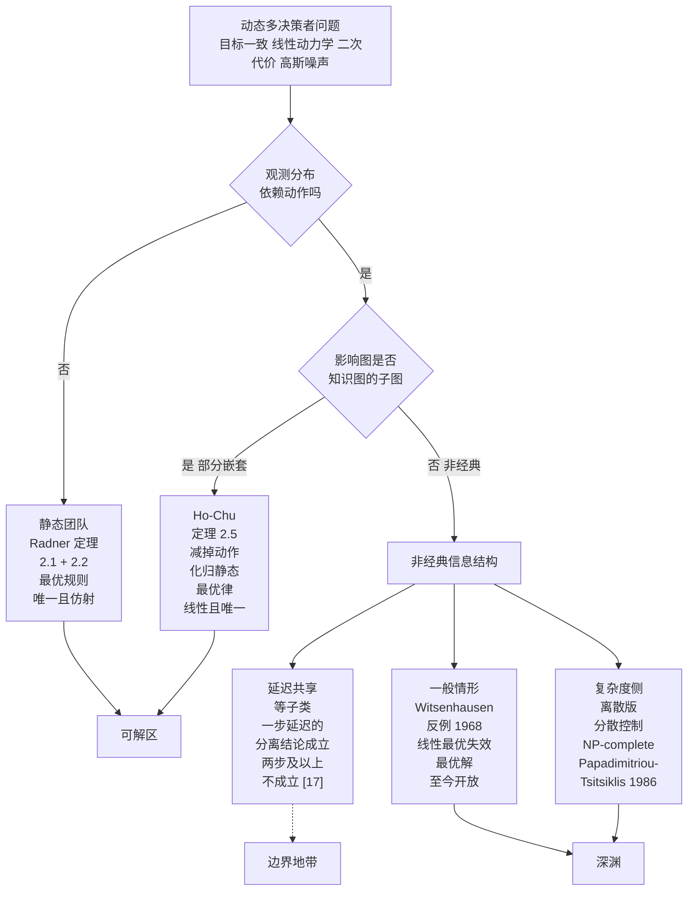

# 2 · 团队决策论：可解的那一小块

第 1 章用一个反例告诉我们：只要两个决策者看见的东西不一样，线性最优、分离原理、可算的最优解——经典 LQG 三件套的全部好处——可以一夜之间失效。

本章讲相反的一面。在同一片废墟上，有一小块地基是稳的。这块地基的名字叫**团队决策论**（team decision theory），由 Marschak 与 Radner 在 1960 年代建成 [1][2]。它的适用条件苛刻到几乎像作弊：所有人的**目标必须完全一致**，代价函数必须是**凸的**（实用上是二次的），随机量必须是**高斯的**，而且——这是最容易被忽略的一条——**信息结构必须"相容"**：凡是影响你观测的人，你都得知道他知道什么。

条件苛刻，回报却大得惊人。在这块地基上：**每个人各自最优 = 全体最优**（不需要协商就能协调）；**最优决策是线性的**（可以写成闭式）；**动态问题可以化归成静态问题**（不需要动态规划）。这三句话就是本章要证的三个定理。

然后我们要问工程师最关心的那个问题：**无线网络落在这块地基上吗？**答案是"常常差一点点"。本章最后一节把"差的那一点点"分成三种机制——回传时延、丢包、纯局部观测——并说明每一种破坏的是嵌套条件的哪一条。第 3 章会把其中的第一种变成一条有充分条件的定理。

!!! note "本章预备知识"
    读本章只需要概率论（条件期望、多元高斯）、线性代数（正定矩阵、解线性方程组）与一点微积分（多元函数的一阶条件、凸函数的一阶不等式）。用到的站内内容：

    - 条件期望、塔性质、全方差公式与高斯条件分布的线性性：[预备篇 4.10](../part0/04-information-theory-basics.md)。
    - 凸函数的一阶条件、用 Hessian 判别凸性：[预备篇 7.2](../part0/07-optimization-basics.md)。
    - 定理 2.2 的证明还用到一条线性代数事实——**Schur 乘积定理**（两个正定矩阵逐元素相乘仍正定）。预备篇没有讲，本章在用到它的地方（定理 2.2 证明第 4 步）就地给出白话解释与一行证明。
    - 小区、TTI（传输时间间隔，一次调度的时间粒度）这些名词：[预备篇第 6 章](../part0/06-wireless-networks.md)。另两个名词预备篇没有专门讲：**回传**（backhaul）指基站与核心网之间、或基站与基站之间的有线或微波链路；**X2 接口**是 LTE 基站之间直接交换信息（负载、干扰指示、切换信令）的标准接口，走的就是回传链路。
    - 把"信息"写成实验 / 划分的语言，以及"信息多不坏"（第二部定理 2.1 Blackwell 三等价、定理 2.2 风险界）：[第二部第 2 章](../part2/02-blackwell.md)。
    - "信息值多少钱"的极值量 $V(I)$：[第三部第 5 章](../part3/05-price-of-prediction.md)。
    - 非经典信息结构与 Witsenhausen 反例：[第 1 章](01-one-counterexample.md)。

    不需要测度论。本章一律把"某人的信息"写成**样本空间上的一个划分**（partition）：他能分辨的最细的那些格子。例如掷一颗骰子，只被告知"点数是奇是偶"的人，划分是 $\{\{1,3,5\},\{2,4,6\}\}$；被告知具体点数的人，划分是六个单点格子。后者把前者的每一格再切细，所以信息更多（这就是 2.5 节"更细的划分"的意思）。有限或可数情形下，这与用 $\sigma$-域描述完全等价；连续情形下（例如观测是实数）严格说要用 $\sigma$-域，但本章所有结论都只用到"一个函数是否只依赖于某人看得见的量"这一条性质，读成划分不会出错。

---

## 2.1 两个消防队，一场火

两支消防队从东西两侧接近同一场山火。东队看得到东坡的烟，看不到西坡；西队反过来。两队都想把火扑灭，没有任何私心——**目标完全一致**。但两队之间的电台坏了，**不能商量**。每队要独立决定自己出多大水量。

这里有两件事在打架。

第一，出水太少，火扑不灭。第二，出水太多，水车抽干、后续无援，而且两队的水叠在一起本来就有浪费。所以每队的决定既取决于自己看到的烟（越浓说明火越大），也取决于**对另一队会出多少水的猜测**——而这个猜测只能靠"我知道他看到的是另一侧的烟，他的判断规则是什么我们出发前就约好了"来完成。

这就是**团队问题**（team problem）的全部结构：

- **目标一致**：只有一个共同的代价函数，没有人有私利。所以这不是博弈，没有"背叛"的概念。
- **信息分散**：每个人看到的不一样，且看不到别人看到的。
- **不能实时协商**：规则可以事先约定（"出发前的战术会"），但执行时不能通话。

把这三条抄到无线上，几乎不用改字。一个 CoMP（协作多点）簇里的两个基站，共同目标是最大化簇的和速率（目标一致）；每个基站只有自己那一侧用户的信道估计（信息分散）；X2 回传有几毫秒时延，赶不上一个调度时隙（不能实时协商）。联邦学习里的服务器与客户端也是：共同目标是最小化全局损失，客户端只看到自己的数据，一轮之内不通信。

!!! tip "直觉：团队问题为什么比博弈「善良」"
    博弈里最难的事情是"我不知道你想干什么"。团队里这件事免费解决了——大家想干的是同一件事。剩下的唯一困难是"我不知道你看到了什么"。

    **团队问题把多决策者的两个困难（目标冲突、信息分散）砍掉一个。**本章证明的所有好结果，都是这一刀砍下来的红利；第 8 章把目标冲突加回去，红利会一样一样地消失。

团队理论的历史很短，密集地集中在十年里。

**团队决策论的谱系**

| 年份 | 路标 |
|---|---|
| 1962 | Radner 发表 Team Decision Problems：凸性推出人各最优即团队最优；高斯加二次推出最优决策仿射 |
| 1968 | Witsenhausen 反例 非经典信息结构下线性最优失效 |
| 1971 | Witsenhausen 内在模型 把信息结构本身形式化为研究对象 |
| 1972 | Ho-Chu 部分嵌套定理 动态团队可归约为静态团队 最优律线性且唯一；Marschak-Radner 团队的经济理论成书 |
| 1986 | Papadimitriou-Tsitsiklis 离散版分散控制问题 NP-complete |
| 1987 | Bansal-Basar 仿射律何时最优的充要条件类结果 |
| 2013 | Yueksel-Basar 专著 信息约束下的网络化控制系统 |
| 2021 | Malikopoulos 综述 非经典信息结构的现代分类 |
| 2026 | 本站第四部 把无线网络当作信息结构的生成器 |

*怎么读这张表：1962 与 1972 两行是本章的两根承重梁（定理 2.1、定理 2.2、定理 2.5）；夹在中间的 1968 行是第 1 章的深渊。注意时间顺序——Radner 的好消息比 Witsenhausen 的坏消息早六年，Ho–Chu 的修补比坏消息晚四年。表中年份与条目均由本站对照原始文献逐条核对（2026 一行指本站自身）。*

**到此为止我们得到了什么：一个问题类的定义——目标一致、信息分散、规则可事先约定但执行时不能通信；以及一个承诺——在这一类里，"各自最优"和"全体最优"有机会重合。**

---

## 2.2 团队问题的精确定义，和一个协调失败的 2×2 例子

现在把上一节的故事写成数学。

!!! abstract "定义 2.1（静态团队问题）"
    一个**静态团队问题**（static team problem）由五样东西组成：

    1. **状态** $\theta$：一个随机量，取值在集合 $\Theta$ 上，服从已知的先验分布。它是"世界真实的样子"（火有多大、干扰有多强）。
    2. **成员数** $N$：决策者（decision maker，DM）的个数，编号 $i=1,\dots,N$。
    3. **信息** $y_i$：成员 $i$ 看到的观测。用第二部的语言，成员 $i$ 手里有一个**实验** $\mathcal{E}_i=(P^i_\theta)_{\theta\in\Theta}$——一张"给定 $\theta$、读数取各值的概率"的条件概率表；等价地，$y_i$ 在样本空间上诱导一个**划分** $\mathcal{P}_i$：落在同一格里的两个世界，成员 $i$ 分辨不出。
    4. **决策规则** $\gamma_i$：一个函数，把成员 $i$ 看到的东西映成他的动作，$u_i=\gamma_i(y_i)$。动作取值在 $\mathbb{R}$（或 $\mathbb{R}^{m}$）。关键约束：$\gamma_i$ **只能依赖 $y_i$**，不能依赖 $\theta$，也不能依赖 $y_j\ (j\ne i)$。
    5. **共同代价** $L(\theta,u_1,\dots,u_N)$：一个实值函数，**所有人共用同一个**。这就是"目标一致"的数学写法。

    团队的目标是选一组规则 $\gamma=(\gamma_1,\dots,\gamma_N)$ 最小化期望代价

    $$
    J(\gamma) \;=\; \mathbb{E}\big[\,L\big(\theta,\gamma_1(y_1),\dots,\gamma_N(y_N)\big)\,\big].
    $$

    称 $\gamma^\star$ 为**团队最优**（team-optimal）当且仅当 $J(\gamma^\star)\le J(\gamma)$ 对一切容许的 $\gamma$ 成立。

**记号解释。**$\theta$ 是没人完整看见的真相；$y_i$ 是成员 $i$ 那一扇窗；$\gamma_i$ 是出发前写在纸上的战术手册（"看到浓烟就出这么多水"）；$J$ 是全队的账单。$\mathbb{E}$ 对 $(\theta,y_1,\dots,y_N)$ 的联合分布取期望。

注意 $J$ 是一个**泛函**：它的自变量不是数，是一组函数。这就是团队问题真正的困难所在——我们要在无穷维的函数空间里做优化，而且每个 $\gamma_i$ 只能"看见"自己那一部分变量。

第二个定义把"各自最优"写清楚。

!!! abstract "定义 2.2（人各最优）"
    称 $\gamma^\star=(\gamma_1^\star,\dots,\gamma_N^\star)$ 是**人各最优**（person-by-person optimal，pbp 最优）当且仅当：对每个 $i$，固定其他人的规则 $\gamma_{-i}^\star$ 不变，$\gamma_i^\star$ 在所有只依赖 $y_i$ 的函数里使 $J$ 最小。

    用白话说：**没有任何一个人能靠自己单方面改规则来改善全队的账单。**

人各最优听上去像是"局部最优"，准确地说它是**逐人最优**：只检查"一次改一个人的规则"能不能变好，不检查几个人同时改。它和局部最优并不是一回事——下面算例 2.1 第 4 步的内点 $p_1=p_2=3/8$ 满足人各最优（一方取 $3/8$ 时，另一方无论怎么选，代价都是 $5.125$），却是一个鞍点。它与团队最优的关系，是本章的核心问题：

- 团队最优 $\Rightarrow$ 人各最优：显然成立（若某人单方面改规则能变好，原来就不是全局最优）。
- 人各最优 $\Rightarrow$ 团队最优：**一般不成立**。

第二条的反例现在就给。

!!! example "算例 2.1（两个基站的波形选择：人各最优 ≠ 团队最优）"
    **场景。**两个相邻小区的基站，共同目标是最大化两小区**总吞吐**。每个基站要在两种空口配置里二选一（$m=2$ 个动作）：$u_i=0$ 表示沿用窄带传统波形，$u_i=1$ 表示切到宽带新波形。这里没有任何状态不确定性（$\Theta$ 是单点），也没有观测——纯粹考察"动作耦合"这一件事。

    **代价表。**把代价定义为"和速率的缺口"，单位 bit/s/Hz，数值取自一个假想但量级合理的场景：两站配置相同则可以联合置零干扰，配置不同则保护带浪费严重。

    | | $u_2=0$（窄带） | $u_2=1$（宽带） |
    |---|---|---|
    | **$u_1=0$（窄带）** | $L=4$ | $L=7$ |
    | **$u_1=1$（宽带）** | $L=7$ | $L=2$ |

    读法：两站都窄带，和速率缺口 4；都宽带，缺口只有 2（最好）；一站一个样，缺口 7（最差）。

    **第一步：找人各最优点。**在 $(0,0)$：基站 1 若单方面改成 $u_1=1$，代价从 4 变成 7，更差；基站 2 同理。所以 $(0,0)$ 是人各最优，$J=4$。在 $(1,1)$：基站 1 单方面改成 0 得 7，更差；基站 2 同理。所以 $(1,1)$ 也是人各最优，$J=2$。

    **第二步：团队最优。**四个格子里最小的是 $(1,1)$，$J^\star=2$。所以 $(0,0)$ 是人各最优但**不是**团队最优，差距 $4-2=2$ bit/s/Hz。

    **第三步：找出违反了哪一条假设。**Radner 的条件是"代价对动作**凸**"。离散动作集上谈不了凸性，所以把动作**混合化**：设基站 $i$ 以概率 $p_i$ 选宽带。期望代价

    $$
    J(p_1,p_2)=4(1-p_1)(1-p_2)+7p_1(1-p_2)+7(1-p_1)p_2+2p_1p_2 .
    $$

    逐项展开（这一步只是把括号乘开，把同类项并起来）：

    $$
    \begin{aligned}
    J&=4-4p_1-4p_2+4p_1p_2+7p_1-7p_1p_2+7p_2-7p_1p_2+2p_1p_2\\
    &=4+3p_1+3p_2-8p_1p_2 .
    \end{aligned}
    $$

    这是一个**双线性**函数，Hessian 为

    $$
    \nabla^2 J=\begin{pmatrix}0 & -8\\ -8 & 0\end{pmatrix},
    \qquad \text{特征值 } \pm 8 .
    $$

    有一个负特征值——**不是凸的**。这正是 Radner 定理（下一节）的前提被破坏的地方，也解释了为什么会出现两个互不相通的人各最优点。

    **第四步：数一数人各驻点。**$\partial J/\partial p_1=3-8p_2$。当 $p_2=0$ 时它恒正，$p_1=0$ 最优；当 $p_2=1$ 时它等于 $-5<0$，$p_1=1$ 最优。此外还有一个内点驻点 $p_1=p_2=3/8$，代价

    $$
    J\!\left(\tfrac38,\tfrac38\right)=4+\tfrac98+\tfrac98-8\cdot\tfrac{9}{64}=4+2.25-1.125=5.125 ,
    $$

    比两个纯策略点都**差**——它是一个鞍点。所以在非凸的团队问题里，"一阶条件成立"甚至不保证是局部最小。

    **校验：**用两条独立途径算 $(p_1,p_2)=(0.5,0.5)$ 处的代价。途径一，直接对四格加权平均：$(4+7+7+2)/4=20/4=5$。途径二，代入化简后的公式：$4+3(0.5)+3(0.5)-8(0.25)=4+1.5+1.5-2=5$。两者相等，说明展开无误。再验一个极限：令代价表退化为 $L(0,0)=L(1,1)=L(0,1)=L(1,0)=4$（动作完全不影响结果），则 $J\equiv4$，Hessian 为零矩阵（凸但不严格凸），此时所有点都既是人各最优也是团队最优——与定理 2.1 的结论一致。

算例 2.1 的教训值得抄下来：**在团队问题里，"协调失败"不需要有人心怀鬼胎，只需要代价函数非凸。**两个基站都想为公，都不想改，结果卡在一个比最好方案差一倍的配置上——这个例子里连信息差异都没有（$\Theta$ 是单点，也没有观测），失败完全来自代价非凸：任何一站单方面改都会变差，而从 $(0,0)$ 走到 $(1,1)$ 需要两站同时换。

**到此为止我们得到了什么：团队问题的五元组定义（状态、成员、信息、规则、共同代价）；两个最优概念（人各最优、团队最优）；以及一个 2×2 数字例子，说明二者一般不等，而缺的那一条正是凸性。**

---

## 2.3 Radner 定理：凸性把局部条件提升为全局

现在补上凸性，看会发生什么。

### 2.3.1 第一步：凸性 + 平稳性 ⟹ 团队最优

先把"人各最优"翻译成一个可以计算的方程。设 $L$ 对 $u$ 可微。固定别人，成员 $i$ 要在"只依赖 $y_i$ 的函数"里最小化

$$
J_i(\gamma_i)=\mathbb{E}\big[L\big(\theta,\gamma_i(y_i),\gamma_{-i}^\star(y_{-i})\big)\big].
$$

用**塔性质**（tower property，即 $\mathbb{E}[X]=\mathbb{E}\big[\mathbb{E}[X\mid y_i]\big]$）把它写成

$$
J_i(\gamma_i)=\mathbb{E}\Big[\;\underbrace{\mathbb{E}\big[L(\theta,\gamma_i(y_i),\gamma^\star_{-i}(y_{-i}))\;\big|\;y_i\big]}_{\text{给定 }y_i\text{ 后只是 }\gamma_i(y_i)\text{ 的一个函数}}\;\Big].
$$

这一步做了什么：把一个整体期望拆成"先在每个 $y_i$ 的取值上求条件期望，再对 $y_i$ 平均"。为什么可以这么做：因为 $\gamma_i(y_i)$ 在给定 $y_i$ 后是一个**常数**，所以内层条件期望是这个常数的普通函数。于是最小化外层期望，等价于**对每个 $y_i$ 分别**最小化内层——不同的 $y_i$ 之间不互相牵制。固定 $y_i$ 的一个取值，内层就是一元函数 $g(u):=\mathbb{E}\big[L(\theta,u,\gamma^\star_{-i}(y_{-i}))\mid y_i\big]$；令 $g'(u)=\mathbb{E}\big[\tfrac{\partial L}{\partial u_i}\mid y_i\big]=0$（求导与条件期望交换次序），再把 $u$ 写回 $\gamma_i(y_i)$，就得到：

!!! abstract "定义 2.3（平稳性）"
    称规则组 $\gamma^\star$ **平稳**（stationary），当且仅当对每个 $i$，

    $$
    \mathbb{E}\!\left[\frac{\partial L}{\partial u_i}\Big(\theta,\gamma_1^\star(y_1),\dots,\gamma_N^\star(y_N)\Big)\;\middle|\;y_i\right]=0
    \qquad\text{几乎处处成立}.
    $$

    读作：**"在我看得见的信息条件下，我这一维的边际代价平均为零。"**

    "几乎处处"（almost everywhere；概率论里也说"几乎必然"，almost surely）的意思是：允许在一个概率为零的例外集合上不成立。本章后面凡说"几乎处处相等"，都按这个意思读。

这就是"人各最优"的一阶版本：在可微、内点、可交换求导与期望的条件下，人各最优一定平稳；反过来，平稳要推出人各最优，还需要 $L$ 对每个 $u_i$ 是凸的，否则一阶条件为零的点也可能是极大值或鞍点。定理 2.1 的条件 (C1) 正好保证了这一点。它是 $N$ 个**耦合的**函数方程：第 $i$ 个方程里出现了所有人的规则。

现在给本章第一根承重梁。

!!! abstract "定理 2.1（Radner：凸性 + 平稳性 ⟹ 团队最优）【已解决（经典）】"
    设团队问题满足：

    - **(C1) 凸性**：对每个 $\theta$，函数 $u\mapsto L(\theta,u)$ 在 $\mathbb{R}^N$ 上凸且可微。
    - **(C2) 可积性**：存在容许规则使 $J$ 有限，且下面用到的各期望都存在有限。
    - **(C3) 平稳性**：$\gamma^\star$ 平稳（定义 2.3）。

    则 $\gamma^\star$ 是**团队最优**：$J(\gamma^\star)\le J(\gamma)$ 对一切容许 $\gamma$ 成立。

    若进一步 $u\mapsto L(\theta,u)$ **严格**凸，则团队最优规则在"几乎处处相等"的意义下**唯一**。

    出处：R. Radner, *Team Decision Problems*, Ann. Math. Statist. 33(3), 1962，定理 2.1（原文用收益/凹口径，这里按损失/凸口径改写）[1]。

**证明。**分三步，每一步只用一件事。

**第 1 步（凸函数的一阶不等式）。**凸可微函数处处在其切平面之上：对任意 $u,u'\in\mathbb{R}^N$ 与任意 $\theta$，

$$
L(\theta,u)\;\ge\;L(\theta,u')+\sum_{i=1}^{N}\frac{\partial L}{\partial u_i}(\theta,u')\,\big(u_i-u_i'\big).
$$

这一步做了什么：把"比较两个规则"变成"比较一条切线"。为什么可以：这是凸函数的定义式之一（一阶条件），对每个固定的 $\theta$ 逐点成立。

**第 2 步（代入并取期望）。**令 $u=\gamma(y)$（任意容许规则），$u'=\gamma^\star(y)$，两边取期望：

$$
J(\gamma)\;\ge\;J(\gamma^\star)+\sum_{i=1}^{N}\mathbb{E}\!\left[\frac{\partial L}{\partial u_i}\big(\theta,\gamma^\star(y)\big)\cdot\big(\gamma_i(y_i)-\gamma_i^\star(y_i)\big)\right].
$$

这一步做了什么：把逐点不等式积起来。为什么可以：期望是单调的（$X\ge Y$ 蕴含 $\mathbb{E}X\ge\mathbb{E}Y$），(C2) 保证各项有限。

**第 3 步（交叉项逐项归零——这里用到"$\gamma_i$ 只看 $y_i$"）。**看第 $i$ 项。因为 $\gamma_i(y_i)-\gamma_i^\star(y_i)$ **只依赖 $y_i$**，它在给定 $y_i$ 的条件下是常数，可以提到条件期望外面：

$$
\begin{aligned}
\mathbb{E}\!\left[\frac{\partial L}{\partial u_i}\cdot\big(\gamma_i-\gamma_i^\star\big)\right]
&=\mathbb{E}\Big[\;\mathbb{E}\big[\tfrac{\partial L}{\partial u_i}\cdot(\gamma_i-\gamma_i^\star)\;\big|\;y_i\big]\;\Big]\\
&=\mathbb{E}\Big[\;\big(\gamma_i(y_i)-\gamma_i^\star(y_i)\big)\cdot\mathbb{E}\big[\tfrac{\partial L}{\partial u_i}\;\big|\;y_i\big]\;\Big]\\
&=\mathbb{E}\big[\;(\gamma_i-\gamma_i^\star)\cdot 0\;\big]\;=\;0 .
\end{aligned}
$$

第一个等号是塔性质；第二个等号是"已知量提出条件期望"；第三个等号正是平稳性 (C3)。

把三步合起来：$J(\gamma)\ge J(\gamma^\star)+0$，对一切容许 $\gamma$ 成立。$\blacksquare$

**唯一性。**若 $L$ 对 $u$ 严格凸，则泛函 $J$ 在容许规则组成的**凸集**上严格凸。说它是凸集，是因为两个只依赖 $y_i$ 的函数取平均，仍只依赖 $y_i$；说 $J$ 严格凸，是因为在 $\gamma\ne\gamma'$ 的那个正概率集合上，$L$ 的严格凸性让中点处的代价严格小于两端代价的平均，取期望后严格不等号保留下来。具体地说：取两个不同的最优解 $\gamma,\gamma'$（在正概率集上不同），它们的中点满足 $J\big(\tfrac{\gamma+\gamma'}{2}\big)<\tfrac12 J(\gamma)+\tfrac12 J(\gamma')=J^\star$，与最优性矛盾。故最优解几乎处处唯一。$\blacksquare$

**物理意义。**定理 2.1 说的是：**凸性是一台"局部升全局"的机器。**每个成员只做了一件极其局部的事——在自己那扇窗后面把自己的边际代价调到零；凸性保证这些局部条件拼起来就是全局最优。第 3 步是全部关键：交叉项之所以归零，是因为"成员 $i$ 能做的改动"恰好落在"成员 $i$ 的条件期望已被调零"的那个方向子空间里。**信息约束在这里第一次成了朋友而不是敌人**：正因为 $\gamma_i$ 只能看 $y_i$，它的所有可能改动才都被 $\mathbb{E}[\cdot\mid y_i]=0$ 一句话挡住。

**行为分析。**极限一：若 $N=1$，定理退化成"凸问题的驻点即全局最优"，这是标准结论。极限二：若所有人看到相同信息（$y_1=\dots=y_N$），团队问题退化为一个集中式凸优化，定理仍成立但内容变空。极限三：把凸性去掉，算例 2.1 立刻给出反例——那里两个人各最优点代价 4 与 2，差一倍。参数影响：定理对 $L$ 的曲率大小、对观测的噪声水平**完全不敏感**——它是一条结构性结论，不是定量结论。定量的部分要等到定理 2.2。

### 2.3.2 第二步：再叠上高斯，最优规则变成仿射

定理 2.1 把无穷维优化降成了 $N$ 个耦合的条件期望方程，但方程还在函数空间里。要真正算出来，需要第二把刀：高斯 + 二次。

先把二次代价写成标准形。设

$$
L(\theta,u)=\tfrac12\,u^{\top}Q\,u-u^{\top}\delta(\theta)+r(\theta),
$$

其中 $Q$ 是 $N\times N$ **常数**对称正定矩阵（$q_{ij}$ 是它的元素），$\delta(\theta)$ 是一个随 $\theta$ 变的随机向量，$r(\theta)$ 与 $u$ 无关（对优化没有影响，扔掉）。

**这个写法在说什么。**如果有个"全知者"看得见 $\theta$，他会解 $\nabla_u L=Qu-\delta=0$，得到**全知最优动作** $u^{\circ}(\theta)=Q^{-1}\delta(\theta)$。所以 $\delta=Q\,u^{\circ}$ 是"全知最优动作的加权版"，$Q$ 描述的是**各人动作之间怎么耦合**：$q_{ij}\ne0$ 表示成员 $i$ 与 $j$ 的动作在代价里相乘，$q_{ij}=0$ 表示两人各管各的。

代入平稳性条件（$\partial L/\partial u_i=\sum_j q_{ij}u_j-\delta_i$）：

$$
\sum_{j=1}^{N}q_{ij}\,\mathbb{E}\big[\gamma_j(y_j)\mid y_i\big]\;=\;\mathbb{E}\big[\delta_i\mid y_i\big],
\qquad i=1,\dots,N. \tag{$\ast$}
$$

这是 $N$ 个函数方程。注意它的结构：左边出现的是"**别人的规则在我的信息下的条件期望**"——这正是"我要猜他会怎么做"的数学形式。

!!! abstract "定理 2.2（Radner：高斯 + 二次 ⟹ 唯一最优规则是仿射的）【已解决（经典）】"
    在定义 2.1 的静态团队里设：

    - **(G1)** 代价为上式的二次型，$Q$ 是**常数**对称正定矩阵；
    - **(G2)** $(\delta,y_1,\dots,y_N)$ **联合正态**，各 $y_i$ 为标量（多维情形把标量换成向量、把系数换成矩阵，公式同形）；
    - **(G3)** 条件期望仿射：$\mathbb{E}[\delta_i\mid y_i]=\mathbb{E}[\delta_i]+d_i\,\big(y_i-\mathbb{E}y_i\big)$，且 $\mathbb{E}[y_j\mid y_i]$ 亦仿射。

    则**唯一**的团队最优规则是仿射的，$\gamma_i^\star(y_i)=a_i\,y_i+e_i$，其中系数向量 $a=(a_1,\dots,a_N)^\top$ 解线性方程组

    $$
    \sum_{j=1}^{N} q_{ij}\,\rho_{ji}\,a_j\;=\;d_i,\qquad
    \rho_{ji}:=\frac{\operatorname{Cov}(y_j,y_i)}{\operatorname{Var}(y_i)} ,
    $$

    常数项解 $\sum_j q_{ij}e_j=\mathbb{E}\delta_i-\sum_j q_{ij}a_j\,\mathbb{E}y_j$（等价地，各人动作的均值 $\bar{u}_j:=a_j\mathbb{E}y_j+e_j$ 满足 $\sum_j q_{ij}\bar{u}_j=\mathbb{E}\delta_i$）。

    出处：Radner 1962 定理 2.5 [1]。原文把观测标准化为 $C_{ii}=I$，此时上式写作 $\sum_j q_{ij}C_{ij}b_j=d_i$、$\sum_j q_{ij}c_j=\mathbb{E}\delta_i$，与这里的形式只差一次尺度变换。

**证明。**为记号干净，以下设所有量零均值（一般情形把每个变量减去其均值即可，常数项由第二个方程给出）。

**第 1 步（在仿射类里，函数方程塌成代数方程）。**先**猜** $\gamma_j(y_j)=a_jy_j$，代入 $(\ast)$ 的左边：

$$
\sum_j q_{ij}\,\mathbb{E}[a_jy_j\mid y_i]=\sum_j q_{ij}a_j\,\mathbb{E}[y_j\mid y_i].
$$

这一步做了什么：把条件期望作用到线性函数上。为什么可以：条件期望是线性算子，$a_j$ 是常数。

**第 2 步（高斯的唯一贡献：条件期望是线性的）。**对零均值联合正态的 $(y_j,y_i)$，

$$
\mathbb{E}[y_j\mid y_i]=\frac{\operatorname{Cov}(y_j,y_i)}{\operatorname{Var}(y_i)}\;y_i=\rho_{ji}\,y_i .
$$

这一步做了什么：把"猜别人看到什么"变成了一个乘法。为什么可以：这是多元高斯条件分布的标准公式（[预备篇 4.10](../part0/04-information-theory-basics.md)）。顺带说清记号：$\rho_{ji}$ 是"用 $y_i$ 线性预测 $y_j$"的**回归系数**，分母是 $y_i$ 自己的方差，所以一般 $\rho_{ji}\ne\rho_{ij}$；只有两者方差相等时它才等于通常的相关系数，后文说"压缩成相关系数"是这个意义上的简称。**这是高斯假设在证明里承重的一步**——它把 $(\ast)$ 里那个可怕的"别人规则的条件期望"化成了 $\rho_{ji}a_jy_i$。（假设 (G3) 里 $\mathbb{E}[\delta_i\mid y_i]$ 是仿射的，这一点在联合正态下也自动成立，只是定理把它单列成了假设。）

**第 3 步（两边同为 $y_i$ 的倍数，比较系数）。**由 (G3) 右边 $\mathbb{E}[\delta_i\mid y_i]=d_iy_i$。于是 $(\ast)$ 变成

$$
\Big(\sum_j q_{ij}\rho_{ji}a_j\Big)\,y_i\;=\;d_i\,y_i\qquad\text{几乎处处}.
$$

由于 $y_i$ 不是退化常数，两边系数必须相等，得到定理中的线性方程组。这一步做了什么：把函数等式降成数的等式。为什么可以：两个 $y_i$ 的线性函数几乎处处相等，当且仅当斜率相等。

**第 4 步（方程组有唯一解）。**把方程组写成矩阵形式 $Ma=d$，其中 $M_{ij}=q_{ij}\rho_{ji}$。设 $\Sigma$ 是 $(y_1,\dots,y_N)$ 的协方差矩阵、$D=\operatorname{diag}\big(\operatorname{Var}(y_1),\dots,\operatorname{Var}(y_N)\big)$。由 $\rho_{ji}=\Sigma_{ij}/D_{ii}$（$\Sigma$ 对称）得

$$
M=D^{-1}\,(Q\circ\Sigma),
$$

其中 $\circ$ 是逐元素（Hadamard）乘积：$(A\circ B)_{ij}=A_{ij}B_{ij}$。$M$ 本身一般不对称（$D^{-1}$ 只从左边乘），所以先用相似变换把它换成一个对称矩阵，再用正定性判断可逆。把两侧的尺度对称地分出来：记 $C:=D^{-1/2}\Sigma D^{-1/2}$，它是 $(y_1,\dots,y_N)$ 的**相关矩阵**（对角元为 1，$C_{ij}=\Sigma_{ij}/\sqrt{D_{ii}D_{jj}}$）。左乘对角阵等于把第 $i$ 行乘 $D_{ii}^{-1/2}$，右乘等于把第 $j$ 列乘 $D_{jj}^{-1/2}$，所以第 $(i,j)$ 元是

$$
\big[D^{-1/2}(Q\circ\Sigma)D^{-1/2}\big]_{ij}=\frac{q_{ij}\,\Sigma_{ij}}{\sqrt{D_{ii}D_{jj}}}=q_{ij}\,C_{ij}=(Q\circ C)_{ij},
$$

即 $D^{-1/2}(Q\circ\Sigma)D^{-1/2}=Q\circ C$。再把 $M=D^{-1}(Q\circ\Sigma)$ 写成 $D^{-1/2}\big[D^{-1/2}(Q\circ\Sigma)D^{-1/2}\big]D^{1/2}$，于是

$$
M=D^{-1/2}\,(Q\circ C)\,D^{1/2},
$$

即 $M$ 与 $Q\circ C$ **相似**（$M=S^{-1}(Q\circ C)S$，$S=D^{1/2}$）。相似矩阵有相同的特征值，因而行列式相同，一个可逆另一个就可逆。现在 $Q\succ0$（假设），$C\succ0$（观测之间没有退化的线性相关），由 **Schur 乘积定理**（两个正定矩阵的逐元素乘积仍正定）得 $Q\circ C\succ0$，故可逆。所以 $a$ 存在且唯一。【本站演算：这一段可逆性论证是本站补的，Radner 原文只断言方程组的解给出最优系数。】

Schur 乘积定理为什么成立？把 $C$ 做特征分解 $C=\sum_k\lambda_kv_kv_k^{\top}$（$\lambda_k>0$），代入 $(Q\circ C)_{ij}=q_{ij}C_{ij}$ 再整理求和次序，得 $x^{\top}(Q\circ C)x=\sum_k\lambda_k\,(x\circ v_k)^{\top}Q\,(x\circ v_k)$。每一项都 $\ge0$；而 $v_k$ 构成一组基，$x\ne0$ 时至少有一个 $x\circ v_k\ne0$，那一项严格为正。两人时一眼可见：取 $Q$、$C$ 对角元都为 1，非对角元分别为 $q$、$r$（$|q|,|r|<1$，二者都正定），则 $Q\circ C$ 对角元仍为 1、非对角元为 $qr$，行列式 $1-q^2r^2>0$，仍正定。

**第 5 步（收口：这个仿射解就是团队最优，且是唯一的团队最优）。**由第 1–3 步，这个仿射规则满足平稳性 $(\ast)$；由 $Q\succ0$ 知 $L$ 对 $u$ 严格凸；应用定理 2.1，它是团队最优，且团队最优几乎处处唯一。所以**最优规则必定就是它**——不存在更好的非线性规则。$\blacksquare$

**物理意义。**定理 2.2 说：在这块地基上，"分散决策"没有引入任何**结构**上的新东西。每个人只需做一件线性运算——把自己的观测乘一个数——而这个数由一组耦合的线性方程决定，方程里 $q_{ij}$ 编码"我们的动作怎么互相干扰"，$\rho_{ji}$ 编码"我从我的观测能推断他看到多少"。**"猜别人"这件事被压缩成了相关系数。**

**行为分析。**极限一：若观测完全不相关（$\rho_{ji}=0,\ j\ne i$），方程解耦为 $q_{ii}a_i=d_i$，每人独立行动——完全猜不到别人时，最优做法是只管自己。极限二：若所有人看到同一个 $y$（$\rho_{ji}=1$），方程组退化为 $Qa=d$，即集中式解——这时分散不损失任何东西。极限三：若 $Q$ 是对角阵（动作不耦合），同样解耦。所以 **"分散化要不要付钱"取决于 $Q$ 的非对角元与 $C$ 的非对角元之间的错配**，下一节的算例把这句话算成数。

!!! warning "陷阱：定理 2.2 的三个条件缺一不可"
    - **$Q$ 必须是常数矩阵。**若 $Q=Q(\theta)$，第 1 步里 $\mathbb{E}[q_{ij}(\theta)a_jy_j\mid y_i]$ 不再等于 $q_{ij}a_j\mathbb{E}[y_j\mid y_i]$——$\theta$ 与 $y_j$ 相关，乘积的条件期望不是条件期望的乘积。此时仿射类不再封闭，只能作局部近似。
    - **必须联合正态。**第 2 步是唯一用到高斯的地方，但它是**承重**的：非高斯时 $\mathbb{E}[y_j\mid y_i]$ 一般是 $y_i$ 的非线性函数，代入后左边不再是 $y_i$ 的线性函数，比较系数失效。
    - **$\mathbb{E}[\delta_i\mid y_i]$ 必须仿射。**在 (G2) 下这是自动的；但若信息是"$y_i$ 的某个非线性摘要"（例如量化后的 CSI 反馈），它就不再自动成立——**这正是无线里最常被打破的一条**。

    还有一条隐藏条件：定理讲的是**静态**团队——观测的分布不依赖任何人的动作。一旦动作会改变别人看到什么（第 1 章的 Witsenhausen 设置），(G2) 中的"联合正态"本身就成了策略的函数，定理不适用。2.6 节处理这件事。

**到此为止我们得到了什么：两条定理与两条完整证明。定理 2.1 说凸性把"各人调零自己的边际代价"提升为全局最优，关键一步是交叉项因"$\gamma_i$ 只看 $y_i$"而归零；定理 2.2 说再叠上常数 $Q$ 与联合正态，最优规则唯一且仿射，系数由一个 $N$ 元线性方程组给出，"猜别人"被压缩成相关系数 $\rho_{ji}$。**

---

## 2.4 算例：两基站功控团队的闭式与数字

现在把定理 2.2 用在一个能算到底的无线例子上。

!!! example "算例 2.2（两基站功控团队：分散与集中的完整闭式）【本站演算】"
    **场景。**两个共信道小区受同一个公共干扰源影响。记干扰强度（已归一化的对数域偏差）为 $\theta\sim\mathcal{N}(0,1)$。基站 $i$ 只有自己的测量

    $$
    y_i=\theta+n_i,\qquad n_i\sim\mathcal{N}(0,\eta^2)\ \text{独立},\ i=1,2,
    $$

    并据此选一个功率修正量 $u_i$。共同代价

    $$
    L(\theta,u_1,u_2)=(u_1+u_2-\theta)^2+c\,(u_1^2+u_2^2).
    $$

    读法：第一项是"两站合起来该抵消掉的干扰没抵消干净"的残差（注意两站的努力**相加**才对抗 $\theta$——这是协作的耦合项）；第二项是各自的功率开销，$c>0$ 是功率的价格。

    **第 0 步：先确认定理 2.2 适用。**Hessian

    $$
    \nabla_u^2 L=\begin{pmatrix}2+2c & 2\\ 2 & 2+2c\end{pmatrix}=:Q,
    $$

    特征值 $4+2c>0$ 与 $2c>0$，故 $Q\succ0$ 且为常数矩阵 ✓；$(\theta,y_1,y_2)$ 联合正态 ✓；把 $L$ 展开，$(u_1+u_2-\theta)^2=u_1^2+2u_1u_2+u_2^2-2\theta(u_1+u_2)+\theta^2$，与标准形 $\tfrac12u^{\top}Qu-u^{\top}\delta+r$ 逐项对照，一次项给出 $\delta=(2\theta,2\theta)^\top$（$r=\theta^2$），$\mathbb{E}[\delta_i\mid y_i]$ 仿射 ✓。三条齐了，所以**最优规则一定是线性的**，可以直接设 $u_i=a_iy_i$（零均值，无常数项）。

    **第 1 步：写平稳性条件。**$\partial L/\partial u_1=2(u_1+u_2-\theta)+2cu_1$。条件期望调零：

    $$
    \mathbb{E}\big[(1+c)u_1+u_2-\theta\;\big|\;y_1\big]=0 .
    $$

    **第 2 步：算两个条件期望。**先算 $\alpha:=\dfrac{\operatorname{Cov}(\theta,y_1)}{\operatorname{Var}(y_1)}=\dfrac{1}{1+\eta^{2}}$，于是 $\mathbb{E}[\theta\mid y_1]=\alpha y_1$。又因为 $y_2=\theta+n_2$ 而 $n_2$ 与 $y_1$ 独立，

    $$
    \mathbb{E}[y_2\mid y_1]=\mathbb{E}[\theta\mid y_1]+\underbrace{\mathbb{E}[n_2\mid y_1]}_{=0}=\alpha y_1 .
    $$

    这两步都只用了高斯条件期望公式与 $n_2\perp y_1$。

    **第 3 步：代入并解出 $a$。**由对称性 $a_1=a_2=a$：

    $$
    (1+c)\,a\,y_1+a\,\alpha y_1-\alpha y_1=0
    \;\Longrightarrow\;
    a\,(1+c+\alpha)=\alpha
    \;\Longrightarrow\;
    \boxed{\,a=\frac{\alpha}{1+c+\alpha}\,}.
    $$

    把 $\alpha=1/(1+\eta^2)$ 代入并上下同乘 $(1+\eta^2)$：

    $$
    a=\frac{1}{(1+c)(1+\eta^2)+1}=\frac{1}{2+\eta^{2}+c\,(1+\eta^{2})} .
    $$

    **第 4 步：算团队代价。**记 $s:=1+\eta^2=\mathbb{E}y_i^2$。因为 $a(y_1+y_2)-\theta=(2a-1)\theta+a(n_1+n_2)$，各项独立，

    $$
    J_{\mathrm{dec}}(a)=(2a-1)^2+2a^2\eta^2+2c\,a^2 s .
    $$

    把最优 $a$ 满足的关系 $\eta^2+cs=\dfrac1a-2$ 代入第二、三项：

    $$
    \begin{aligned}
    J_{\mathrm{dec}}^\star&=(2a-1)^2+2a^2\Big(\frac1a-2\Big)\\
    &=4a^2-4a+1+2a-4a^2\\
    &=1-2a .
    \end{aligned}
    $$

    第一个等号是代入；第二个是把括号乘开；第三个是合并同类项（$4a^2$ 抵消）。于是

    $$
    \boxed{\,J_{\mathrm{dec}}^\star=1-\frac{2}{2+\eta^{2}+c(1+\eta^{2})}=\frac{\eta^{2}+c(1+\eta^{2})}{(1+c)(1+\eta^{2})+1}\,}.
    $$

    **第 5 步：对照集中式（两人都看到 $(y_1,y_2)$）。**此时给定 $y=(y_1,y_2)$，记 $\hat\theta=\mathbb{E}[\theta\mid y]$、后验方差 $v=\operatorname{Var}(\theta\mid y)$。两者由高斯的"精度相加"得到（[预备篇 4.10](../part0/04-information-theory-basics.md)）：精度是方差的倒数，先验精度为 $1$，每个观测贡献 $1/\eta^2$，后验精度 $1+2/\eta^2$，所以 $v=\dfrac{\eta^2}{\eta^2+2}$（与 $y$ 无关）；后验均值按精度加权，$\hat\theta=v\cdot\dfrac{y_1+y_2}{\eta^2}=\dfrac{y_1+y_2}{\eta^2+2}$。给定 $y$ 时 $U:=u_1+u_2$ 与 $\hat\theta$ 都是常数，把 $U-\theta=(U-\hat\theta)-(\theta-\hat\theta)$ 平方后取条件期望，交叉项因 $\mathbb{E}[\theta-\hat\theta\mid y]=0$ 消失，剩下 $(U-\hat\theta)^2+v$。于是条件代价

    $$
    \mathbb{E}[L\mid y]=(u_1+u_2-\hat\theta)^2+v+c(u_1^2+u_2^2).
    $$

    固定和 $U=u_1+u_2$，第三项在 $u_1=u_2=U/2$ 时最小（两个平方和在和固定时对称点最小），值 $cU^2/2$。于是只需极小化 $(U-\hat\theta)^2+\tfrac c2U^2$，一阶条件 $2(U-\hat\theta)+cU=0$ 给 $U=\hat\theta/(1+c/2)$，最小值

    $$
    \hat\theta^2\Big[\frac{(c/2)^2}{(1+c/2)^2}+\frac{c/2}{(1+c/2)^2}\Big]
    =\hat\theta^2\,\frac{(c/2)(1+c/2)}{(1+c/2)^2}
    =\hat\theta^2\,\frac{c/2}{1+c/2}.
    $$

    对 $y$ 取期望。这里要用 $\mathbb{E}\hat\theta^2=1-v$，它来自全方差公式（[预备篇 4.10](../part0/04-information-theory-basics.md)）：$\operatorname{Var}\theta=\mathbb{E}\big[\operatorname{Var}(\theta\mid y)\big]+\operatorname{Var}\big(\mathbb{E}[\theta\mid y]\big)$，左边是 $1$，右边第一项是常数 $v$，第二项是 $\mathbb{E}\hat\theta^2$（$\hat\theta$ 零均值）。代入 $v=\dfrac{\eta^2}{\eta^2+2}$：

    $$
    \boxed{\,J_{\mathrm{cent}}^\star=v+(1-v)\frac{c/2}{1+c/2}=\frac{\eta^{2}(2+c)+2c}{(2+c)(\eta^{2}+2)}\,}.
    $$

    **第 6 步：代数字。**先取一组基准参数 $\eta^2=0.5$、$c=0.1$（观测噪声方差是 $\theta$ 先验方差的一半，功率价格较低；$s=1.5$）：

    $$
    a=\frac{1}{2+0.5+0.1\times1.5}=\frac{1}{2.65}=0.377358,
    $$

    $$
    J_{\mathrm{dec}}^\star=1-2\times0.377358=0.245283,
    \qquad
    J_{\mathrm{cent}}^\star=\frac{0.5\times2.1+0.2}{2.1\times2.5}=\frac{1.25}{5.25}=0.238095 .
    $$

    **分散化代价** $=J_{\mathrm{dec}}^\star/J_{\mathrm{cent}}^\star-1=0.245283/0.238095-1=\mathbf{3.02\%}$。

    换一组更"耦合"的参数 $\eta^2=1$、$c=1$，数字变得干净：$a=1/(2+1+2)=0.2$，$J_{\mathrm{dec}}^\star=1-0.4=3/5$；$v=1/3$，$J_{\mathrm{cent}}^\star=(2/3+1)/3=5/9$；比值 $\dfrac{3/5}{5/9}=\dfrac{27}{25}$，**恰好 8.00%**。

    **校验（四条独立途径）：**

    1. **两种参数化给同一个 $a$。**途径一用平稳性（第 3 步）得 $a=\alpha/(1+c+\alpha)$；途径二直接把 $J_{\mathrm{dec}}(a)$ 对 $a$ 求导：$4(2a-1)+4a\eta^2+4cas=0\Rightarrow a=1/(2+\eta^2+cs)$。把 $\alpha=1/s$ 代入途径一：$a=\frac{1/s}{1+c+1/s}=\frac{1}{s(1+c)+1}=\frac1{2+\eta^2+cs}$——两者相同。这同时**验证了定理 2.1**：人各最优（途径一）与在线性类里的全局最优（途径二）确实重合。
    2. **恒等式 $J^\star=1-\sum_i a_i$。**数值上 $1-2(0.377358)=0.245283$ 与第 4 步的直接求和一致；解析证明见下面的引理 2.3。
    3. **极限退化。**$\eta\to0$（观测完美）：$a\to1/(2+c)$，$J_{\mathrm{dec}}^\star\to c/(2+c)$；同时 $v\to0$，$J_{\mathrm{cent}}^\star\to \frac{c/2}{1+c/2}=\frac{c}{2+c}$——**两者相等**，符合"都看清 $\theta$ 就无所谓分不分散"。$\eta\to\infty$（观测无用）：$a\to0$，两者都 $\to1=\mathbb{E}\theta^2$，即"什么都不做"的代价。$c\to0$：$J_{\mathrm{dec}}^\star\to\eta^2/(2+\eta^2)$，$J_{\mathrm{cent}}^\star\to\eta^2/(\eta^2+2)$——又相等（下面单独讨论）。
    4. **蒙特卡洛。**用 $4\times10^6$ 个独立样本（NumPy 默认 PCG64 生成器，随机种子 0）直接对 $L$ 取样本均值：分散式得 $0.24505$、集中式得 $0.23786$，与闭式的 $0.245283$、$0.238095$ 在 $\pm0.0003$ 内一致。

第 4 步里那个恒等式值得单独立成一条，因为它对任意成员数、任意噪声都成立，是后面所有算例的免费校验器。

!!! abstract "引理 2.3（团队最优代价的守恒式）【本站演算】"
    在算例 2.2 的模型推广到 $N$ 个成员（$\theta\sim\mathcal{N}(0,1)$，$y_i=\theta+n_i$，$n_i\sim\mathcal{N}(0,\eta_i^2)$ 独立，代价 $L=\big(\sum_i u_i-\theta\big)^2+c\sum_i u_i^2$）时，最优线性系数 $a_i$ 满足

    $$
    J^\star \;=\; 1-\sum_{i=1}^{N}a_i^\star .
    $$

**证明。**记 $A=\sum_i a_i$、$s_i=1+\eta_i^2$。与算例 2.2 第 4 步同理，$\sum_i a_iy_i-\theta=(A-1)\theta+\sum_i a_in_i$，其中 $\theta,n_1,\dots,n_N$ 相互独立、均值为零，平方取期望后交叉项全部消失；功率项 $c\,\mathbb{E}(a_iy_i)^2=c\,a_i^2s_i$。于是代价

$$
J(a)=(A-1)^2+\sum_i a_i^2\big(\eta_i^2+c\,s_i\big).
$$

对 $a_i$ 求导并令为零（这就是平稳性条件，也是本模型下的一阶条件）：

$$
2(A-1)+2a_i(\eta_i^2+cs_i)=0
\;\Longrightarrow\;
a_i(\eta_i^2+cs_i)=1-A .
$$

这一步做了什么：把每个成员的最优系数与"团队总增益缺口" $1-A$ 挂钩。为什么可以：$\partial A/\partial a_i=1$，其余项只含 $a_i$。

于是

$$
\sum_i a_i^2(\eta_i^2+cs_i)=\sum_i a_i\cdot\big[a_i(\eta_i^2+cs_i)\big]=\sum_i a_i(1-A)=A(1-A),
$$

代回：$J^\star=(1-A)^2+A(1-A)=(1-A)\big[(1-A)+A\big]=1-A$。$\blacksquare$

**物理意义。**$A=\sum_i a_i$ 是团队"敢用"的总增益：$A=1$ 表示全队合力把 $\theta$ 抵消干净，$A=0$ 表示什么都不做。引理说**最优代价就是这个缺口本身**——团队越敢用信息，代价越低，而且是一比一地低。

**行为分析。**$A^\star\in(0,1)$ 恒成立（噪声与功率价格都让人保守）。$\eta_i\to0$ 且 $c\to0$ 时 $A^\star\to1$、$J^\star\to0$；$\eta_i\to\infty$ 时 $A^\star\to0$、$J^\star\to1$。数量级代入：$N=2$、$\eta^2=0.5$、$c=0.1$ 时 $A^\star=0.755$，即团队只敢抵消 75.5% 的干扰，剩下 24.5% 就是账单。

现在把两条曲线画出来。取 $c=1$（耦合较强，差距看得见），横轴是观测噪声标准差 $\eta$。

{ .chart loading=lazy }
{ .chart loading=lazy }

*怎么读这张图：上面一条是分散式 $J_{\mathrm{dec}}^\star=\frac{1+2\eta^2}{3+2\eta^2}$，下面一条是集中式 $J_{\mathrm{cent}}^\star=\frac{3\eta^2+2}{3\eta^2+6}$（把 $c=1$ 代入算例 2.2 第 4、5 步的闭式）。两端**重合**：$\eta=0$ 时都等于 $1/3$（各自看清 $\theta$，共享无用），$\eta\to\infty$ 时都趋于 1（观测无用，共享也无用）。中间张开一个口子——这个口子就是"不能商量的代价"。数据点由本节闭式直接代入得到。*

两条曲线离得近，说明绝对差不大；真正有意思的是**相对差**，把它单独画出来。

{ .chart loading=lazy }
{ .chart loading=lazy }

*怎么读这张图：上面一条 $c=1$，下面一条 $c=0.1$。两条都在 $\eta=0$ 处从零出发、在 $\eta\to\infty$ 处回到零，中间有一个峰——$c=1$ 时峰在 $\eta=1$ 处，值恰好 $27/25-1=8.00\%$。**分散化最贵的时候不是信息最差的时候，而是信息"半好不坏"的时候。**信息完美时人人都知道该做什么；信息全废时人人都不做；只有在中间，"我该多做一点还是等他多做一点"才真正成为问题。数据点由算例 2.2 的两条闭式代入 $\eta\in\{0,0.5,\dots,3\}$ 得到。*

!!! success "关键结论：分散化要不要付钱，取决于代价的耦合形式"
    把 $c=0$ 代进算例 2.2：分散式的最优规则给出

    $$
    u_1+u_2=a(y_1+y_2)=\frac{y_1+y_2}{2+\eta^2},
    $$

    而集中式的最优做法是把 $\hat\theta=\mathbb{E}[\theta\mid y_1,y_2]=\dfrac{y_1+y_2}{\eta^2+2}$ 抵消掉。**两者逐点相同。**也就是说：当代价只通过 $u_1+u_2$ 依赖动作时，两个基站各自处理各自的观测、把结果相加，**自动**合成了集中式的最小均方误差估计——信息分散一分钱都不用付。

    只要加上任何一点各自的开销（$c>0$），这个巧合立刻破裂：每个人开始盘算"这一份该我出还是该他出"，而这个盘算需要知道对方的观测。$c$ 越大盘算越重要（表见下），但 $c$ 极大时大家都躺平，差距又缩回去。

    **一句话：耦合项决定了信息要不要交换，不是信息量本身决定的。**这与第三部第 5 章 $V(I)$ 的教训同源——决策价值不是熵的函数。

    | $c$（功率价格） | $a^\star$ | $J_{\mathrm{dec}}^\star$ | $J_{\mathrm{cent}}^\star$ | 分散化代价 |
    |---|---|---|---|---|
    | 0 | 0.4000 | 0.200000 | 0.200000 | **0.00%** |
    | 0.01 | 0.3976 | 0.204771 | 0.203980 | 0.39% |
    | 0.1 | 0.3774 | 0.245283 | 0.238095 | 3.02% |
    | 0.5 | 0.3077 | 0.384615 | 0.360000 | 6.84% |
    | 1 | 0.2500 | 0.500000 | 0.466667 | 7.14% |
    | 5 | 0.1000 | 0.800000 | 0.771429 | 3.70% |

    （全表取 $\eta^2=0.5$，由算例 2.2 的两条闭式逐行代入；$c=0$ 与 $c\to\infty$ 两端分散化代价均为零。）

再给一个非对称的算例，把定理 2.2 的线性方程组真正解一次。

!!! example "算例 2.3（非对称噪声：解 Radner 方程组并双路复核）【本站演算】"
    模型同算例 2.2，但两站测量质量不同：$\eta_1^2=0.2$（好基站，光纤直连的密集小区）、$\eta_2^2=2.0$（差基站，边缘覆盖），$c=0.1$。记 $s_1=1.2$、$s_2=3.0$。

    **途径一：解平稳性方程组。**由引理 2.3 证明中的一阶条件 $(A-1)+a_i(\eta_i^2+cs_i)=0$，即

    $$
    a_i\big(1+\eta_i^2+c\,s_i\big)+a_j=1
    \quad\Longleftrightarrow\quad
    a_i\,s_i(1+c)+a_j=1 .
    $$

    （中间一步：$1+\eta_i^2=s_i$，故 $s_i+cs_i=s_i(1+c)$。）代数字：

    $$
    \begin{aligned}
    1.32\,a_1+1.00\,a_2&=1,\\
    1.00\,a_1+3.30\,a_2&=1 .
    \end{aligned}
    $$

    行列式 $1.32\times3.30-1=4.356-1=3.356$，于是

    $$
    a_1=\frac{3.30-1.00}{3.356}=\frac{2.30}{3.356}=0.685340,
    \qquad
    a_2=\frac{1.32-1.00}{3.356}=\frac{0.32}{3.356}=0.095352 .
    $$

    好基站的权重是差基站的 **7.19 倍**，而两者的观测信噪比只差 10 倍（$1/0.2$ 对 $1/2$）——权重差被"两人努力相加"这个耦合项压缩了。

    **途径二：直接极小化。**

    $$
    J(a_1,a_2)=(a_1+a_2-1)^2+a_1^2\eta_1^2+a_2^2\eta_2^2+c\big(a_1^2s_1+a_2^2s_2\big),
    $$

    数值极小化（SciPy 的 BFGS，初值 $(0,0)$）给出 $(a_1,a_2)=(0.685340,\,0.095352)$，$J^\star=0.219309$。

    **校验：**引理 2.3 预言 $J^\star=1-(a_1+a_2)=1-\dfrac{2.62}{3.356}=0.219309$，与数值极小化的 $0.219309$ 逐位一致。（若先把 $a_1,a_2$ 各舍入到六位再相加，会得到 $0.780692$ 与 $0.219308$；末位的 1 只是舍入误差，精确值是 $0.2193087$。）第二条校验：把两个噪声取成相等的 $\eta_1^2=\eta_2^2=0.5$，方程组变成 $1.65a_1+a_2=1$ 与 $a_1+1.65a_2=1$，对称解 $a=1/2.65=0.377358$，与算例 2.2 第 6 步逐位相同——非对称公式在对称点上退化回对称公式。

**到此为止我们得到了什么：一个从头算到尾的无线团队例子。分散式与集中式的最优代价都有闭式；分散化代价在 $\eta^2=0.5,c=0.1$ 处是 3.02%，在 $\eta=1,c=1$ 处恰好 8.00%；它在观测噪声与功率价格两个方向上都是"两端为零、中间有峰"；并且当代价只通过动作之和耦合时（$c=0$），分散化代价恰好为零——信息分散不一定要付钱，要不要付取决于耦合形式。**

---

## 2.5 团队里信息多不坏：一条两行证明的分水岭

第二部花了一整章讨论"什么叫一份知识比另一份更有信息"，结论是 Blackwell 序（第二部定理 2.1、定理 2.2）。那里的主角只有一个决策者。团队里有 $N$ 个，这句话还成立吗？

成立，而且证明只有两行。但要注意：**这两行证明并不出自 Radner 1962 的定理**——本站对照 Radner 原文核对，没有找到一条显式的"团队中信息价值非负"定理。所以下面把它写成本站的论证。

!!! abstract "命题 2.4（团队中信息的价值非负）【本站论证·两行证明】"
    考虑定义 2.1 的团队问题。固定成员 $j\ne i$ 的信息不变，把成员 $i$ 的信息由划分 $\mathcal{P}_i$ 换成**更细**的划分 $\mathcal{P}_i'$（即 $\mathcal{P}_i'$ 的每个格子都含于 $\mathcal{P}_i$ 的某个格子里；等价地，存在函数 $f$ 使原观测 $y_i=f(y_i')$）。记两种情形的团队最优值为 $J^\star(\mathcal{P}_i)$ 与 $J^\star(\mathcal{P}_i')$。则

    $$
    J^\star(\mathcal{P}_i')\;\le\;J^\star(\mathcal{P}_i).
    $$

    更一般地（Blackwell 版）：若成员 $i$ 的实验由 $\mathcal{F}_i$ 换成 $\mathcal{E}_i\succeq\mathcal{F}_i$（读作"$\mathcal{E}_i$ 至少与 $\mathcal{F}_i$ 一样有信息"，即 Blackwell 序，见[第二部第 2 章](../part2/02-blackwell.md)定义 2.2 与定理 2.1），且容许随机化规则（规则可以在看到 $y_i$ 之后再掷一次骰子），则团队最优值不增。

**证明。**（第一行）任何只依赖 $y_i$ 的函数 $\gamma_i$，都可以写成只依赖 $y_i'$ 的函数——就取 $\gamma_i\circ f$，它给出**逐个样本点完全相同**的动作。所以在 $\mathcal{P}_i'$ 下的容许规则集合**包含**在 $\mathcal{P}_i$ 下的容许规则集合。

（第二行）在更大的集合上取下确界，结果不会更大。$\blacksquare$

（Blackwell 版同理。**随机核** $K$ 是一张与 $\theta$ 无关的条件概率表 $K(z\mid y)$：拿到读数 $y$ 后，按 $K(\cdot\mid y)$ 再抽一个 $z$，相当于把读数再随机加工一次。$\mathcal{F}_i=K\circ\mathcal{E}_i$ 说的是"先做实验 $\mathcal{E}_i$、再把读数过一遍 $K$，得到的读数分布恰好就是 $\mathcal{F}_i$ 的"，第二部把这种关系叫 garbling（后处理）；这里的 $\circ$ 表示先后复合，与 2.3.2 节的逐元素乘积无关。于是成员 $i$ 可以先用 $\mathcal{E}_i$ 的观测在本地跑一遍 $K$，人工制造出 $\mathcal{F}_i$ 的观测，再照搬原规则——代价分布逐点相同。这一步要掷骰子，所以命题要求容许随机化规则。）

**物理意义。**这条命题说的其实是一句大白话：**多给一个人一台仪器，他可以选择不看。**团队问题里"不看"是完全安全的，因为没有人会因为知道你多了一台仪器而改变行为——大家的目标本来就一样，规则是事先约定好的，代价函数里没有任何"你的信息量"这一项。

**行为分析。**注意这条命题的三个边界：

1. **它是逐成员的。**同时改多个成员的信息，结论仍成立（把上面的论证逐个成员做一遍）。
2. **它只说值不增，不说增益有多大。**增益的大小正是第三部 $V(I)$ 要刻画的对象；算例 2.2 里"从只看 $y_i$ 到看 $(y_1,y_2)$"的增益就是那 3.02%。
3. **它默认信息结构的改变是公共知识、且规则可以重新优化。**如果成员 $i$ 拿到新仪器却来不及改规则，或别人不知道他拿到了，结论不再自动成立。

!!! warning "陷阱：这句话在博弈里是假的"
    把"目标一致"去掉，命题 2.4 立刻崩塌。原因是第一行的论证被抽掉了地基：在博弈里，**别人会因为知道你多了信息而改变行为**，于是"你可以选择不看"不再是无损的——你没法承诺不看。

    经济学早就把这件事做成经典。Hirshleifer 1971 [10] 指出：公开的信息可以**破坏风险分担**，从而社会价值为负——本来大家可以互相保险的不确定性，一旦被公开揭示，保险市场就消失了。Gossner 2000 [11] 给出了博弈中"信息结构 $\mathcal{S}$ 比 $\mathcal{T}$ 更丰富"的刻画：更丰富当且仅当它诱导的均衡结果分布集合更大——**集合更大既可能包含更好的点，也可能包含更坏的点**，所以"更丰富"不蕴含"更好"。现代标准参考是 Bergemann–Morris 2016 的 Bayes 相关均衡框架 [12]。【表述待核：本站文献核对未逐条核到 Gossner 原文正文的 garbling 条件，此处只用"结构序 $\Longrightarrow$ 均衡集合序"这一层。】

    **【本站提法】把这一正一反并列，就得到团队与博弈的技术分水岭：**

    | | 团队（目标一致） | 博弈（目标冲突） |
    |---|---|---|
    | 更多信息 | 不坏（命题 2.4，可行集单调） | 可以更坏（[10][11]） |
    | 人各最优 | 凸性下 $=$ 团队最优（定理 2.1） | $=$ Nash 均衡，一般 $\ne$ 社会最优 |
    | "各自最优"的名字 | 人各最优 | Nash 均衡 |
    | 差距的名字 | 分散化代价（算例 2.2） | 无政府代价 PoA（第 8 章） |
    | 增加通信 | 只能帮忙 | 可能帮忙也可能坏事 |

    第三列与第四列的对照会在[网络博弈](08-network-games.md)一章展开。这里先记住一件事：**"信息多不坏"不是信息论的定理，是目标一致的定理。**

与第三部的接口也在这里对上：第三部第 5 章定义的 $V(I)=\sup_{q:\,I(\xi;M)\le I}\sup_{\pi}J(\pi,q)$ 是"给定 $I$ 比特信息能拿到的最好结果"，它单调不减且凹。（记号提醒：那里 $\xi$ 是未来的随机路径，$M$ 是提前拿到的关于它的消息，$J(\pi,q)$ 是**性能**、越大越好，所以取 $\sup$；本章的 $J$ 是**代价**、越小越好。搬过来时把本章的 $-J^\star$ 当作性能即可。）命题 2.4 保证的正是这条曲线在团队里**良定义且单调**——把 $V(I)$ 从单决策者搬到团队上不需要新假设。搬到博弈上则需要：那时"最好结果"要先说清是哪个均衡。

**到此为止我们得到了什么：一条两行证明的命题——团队里给某个成员更细的划分不会让最优值变差，因为可行规则集合单调扩大；以及它的边界——这条命题依赖的是目标一致而不是信息论，博弈里它是假的（Hirshleifer、Gossner），这正是团队与博弈的分水岭。**

---

## 2.6 动态团队与部分嵌套：Ho–Chu 定理

到这里为止的一切都建立在一个假设上：**观测的分布不依赖任何人的动作**（静态团队）。这个假设在真实系统里几乎立刻被打破——我先发功率，你测到的干扰就变了。

一旦观测依赖动作，麻烦是本质的：我改一改自己的规则，**你看到的东西的统计性质就变了**，于是你的最优规则也要变，于是我的又要变……定理 2.1 的证明第 3 步会直接失效，因为"$\gamma_i$ 的改动"不再是一个固定信息下的改动。第 1 章的 Witsenhausen 反例就是这条路走到黑的样子。

Ho 与 Chu 1972 [3] 找到了一个条件，在这个条件下麻烦可以被**消掉**。

### 2.6.1 定义：部分嵌套

!!! abstract "定义 2.4（部分嵌套信息结构）"
    考虑一个动态团队：成员 $i$ 依次（或并行）行动，成员 $i$ 的观测 $y_i$ 可能依赖某些成员 $j$ 的动作 $u_j$。称信息结构**部分嵌套**（partially nested）当且仅当：

    > 若成员 $j$ 的动作 $u_j$ 影响成员 $i$ 的观测 $y_i$，则成员 $i$ 知道成员 $j$ 所知道的一切——即 $y_i$ 诱导的划分 $\mathcal{P}_i$ **细于** $y_j$ 诱导的划分 $\mathcal{P}_j$（$y_j$ 是 $y_i$ 的函数）。

    用图论的话说：定义**影响图** $G_{\text{inf}}$（$j\to i$ 表示 $u_j$ 进入 $y_i$）与**知识图** $G_{\text{know}}$（$j\to i$ 表示 $\mathcal{P}_i$ 细于 $\mathcal{P}_j$），则部分嵌套 $\iff$ $G_{\text{inf}}\subseteq G_{\text{know}}$。**"凡是能影响你的人，你都得看穿他。"**

!!! note "术语别名"
    "部分嵌套"在文献里还有两个同义词：**拟经典**（quasi-classical）与 **overlapping information**。本站统一用"部分嵌套"。三分法的标准口径 [8][9] 是：

    - **经典**（classical）：所有成员的信息相同，且有完美记忆——这是集中式的另一个名字。
    - **部分嵌套 / 拟经典**：满足定义 2.4。经典是它的特例。
    - **非经典**（nonclassical）：其余一切。第 1 章的 Witsenhausen 反例住在这里。

### 2.6.2 定理与两决策者情形的完整推导

!!! abstract "定理 2.5（Ho–Chu：部分嵌套 LQG 团队的最优律线性且唯一）【已解决（经典）】"
    考虑一个动态团队，满足：

    - **(H1)** 原始随机量（初始状态、各噪声）联合**高斯**；
    - **(H2)** 观测函数**线性**（观测是原始随机量与各动作的线性组合加噪声）；
    - **(H3)** 代价**二次**且对动作严格凸；
    - **(H4)** 信息结构**部分嵌套**（定义 2.4）。

    则该动态团队**等价于一个静态团队**（存在一一对应的规则变换，使两问题的代价值逐一相同），因而最优控制律**存在、唯一、且是线性的**（一般均值非零时为仿射），并可由定理 2.2 的线性方程组算出。

    出处：Y.-C. Ho & K.-C. Chu, IEEE Trans. Automat. Control 17(1):15–22, 1972 [3]。

**两决策者情形的完整推导。**设

- 原始随机量 $x_0\sim\mathcal{N}(0,\sigma^2)$、噪声 $w\sim\mathcal{N}(0,\rho^2)$、$v\sim\mathcal{N}(0,1)$，三者独立（记号提醒：这里的 $\rho$ 只是噪声 $w$ 的标准差，与定理 2.2 的回归系数 $\rho_{ji}$ 无关；$v$ 也只是一个噪声，与算例 2.2 的后验方差 $v$ 无关）；
- 成员 1 观测 $z_1=x_0+w$，出动作 $u_1=\gamma_1(z_1)$；
- 成员 2 观测 $z_2=\big(z_1,\;x_0+u_1+v\big)$——**注意它包含 $z_1$**，这是部分嵌套的体现；出动作 $u_2=\gamma_2(z_2)$；
- 代价 $J=\mathbb{E}\big[k^2u_1^2+(x_0+u_1-u_2)^2\big]$。

**第 1 步：确认部分嵌套。**$u_1$ 影响 $z_2$（出现在第二个分量里），所以定义 2.4 要求成员 2 知道成员 1 知道的一切。成员 1 知道的是 $z_1$；成员 2 的观测里**明写着** $z_1$。✓

**第 2 步：把动作从观测里减掉。**这是全部关键。规则 $\gamma_1$ 是**事先约定并公开**的（团队问题的前提：战术手册全队人手一份）。成员 2 拿到 $z_2=(z_1,\,x_0+u_1+v)$ 后，可以在本地做这件事：

$$
\text{先算 }\hat u_1:=\gamma_1(z_1)\quad(\text{他有 }z_1\text{，也有 }\gamma_1),
$$

$$
\text{再算 }\tilde z_2:=\big(x_0+u_1+v\big)-\hat u_1=x_0+v .
$$

**这一步做了什么：**把成员 2 的观测换成了一个**完全不含任何人动作**的量 $x_0+v$。**为什么可以：**因为 $u_1=\gamma_1(z_1)$ 而成员 2 恰好有 $z_1$——这正是部分嵌套条件所保证的。若成员 2 缺 $z_1$，$\hat u_1$ 算不出来，这一步就断了。

**第 3 步：变换是可逆的，所以不丢信息。**成员 2 原来的信息是 $(z_1,\,x_0+u_1+v)$，现在是 $(z_1,\,x_0+v)$。两者互相可算：知道 $(z_1,x_0+v)$ 就能加回 $\gamma_1(z_1)$ 得到原观测。所以两个信息集诱导**同一个划分**，任何依赖前者的规则都能改写成依赖后者的规则，反之亦然，且逐点给出相同动作。

**第 4 步：问题已经是静态的。**新的信息 $(z_1,\,x_0+v)=(x_0+w,\;x_0+v)$ 只由原始随机量决定，**与策略无关**。于是我们得到一个标准的静态团队：成员 1 看 $y_1=x_0+w$，成员 2 看 $y_2=(x_0+w,\;x_0+v)$，代价照旧（把 $u_1$ 写回 $\gamma_1(y_1)$ 即可）。

**第 5 步：套定理 2.2。**先把代价写成标准形：展开 $(x_0+u_1-u_2)^2=(u_1-u_2)^2+2x_0u_1-2x_0u_2+x_0^2$，一次项给出 $\delta=(-2x_0,\,2x_0)^\top$，是 $x_0$ 的线性函数。所以 $(x_0,w,v)$ 联合高斯 $\Longrightarrow$ $(y_1,y_2)$ 与 $\delta$ 联合高斯 ✓；代价对 $(u_1,u_2)$ 的 Hessian

$$
\nabla_u^2 J=\begin{pmatrix}2k^2+2 & -2\\ -2 & 2\end{pmatrix},
\quad\det=4k^2+4-4=4k^2>0,\ \ \text{迹}>0\ \Rightarrow\ Q\succ0\ (k\ne0),
$$

且为常数矩阵 ✓。所以最优规则唯一、线性，由定理 2.2 的方程组解出。$\blacksquare$

**物理意义。**部分嵌套的作用可以用一句话概括：**它让"动作污染观测"这件事变成可逆的、因而是无害的。**成员 2 的观测里混进了成员 1 的动作，但因为成员 2 掌握成员 1 的全部输入，他可以把这份污染**精确地减掉**。信息结构不依赖策略了，动态问题就退化成静态问题，Radner 的两条定理原封不动搬过来。

**行为分析。**把参数推到极端：$k\to0$ 时 $Q$ 奇异（第一级动作免费），严格凸性失效，唯一性不再保证；$\rho\to\infty$（成员 1 的观测无用）时最优 $\gamma_1\to0$，问题退化为成员 2 的单人估计。最重要的一条极限：**去掉观测里的 $z_1$**，即令成员 2 只看到 $x_0+u_1+v$——这恰好就是第 1 章的 Witsenhausen 设置（那里 $u_1=\gamma_1(x_0)$ 且成员 2 没有 $x_0$）。此时第 2 步的减法做不了，第 3 步的可逆性没有了，第 4 步的静态化崩塌。**一个观测分量之差，一边是闭式解，一边是至今未解的公开问题。**

!!! warning "陷阱：部分嵌套要求的是「看穿」，不是「看到差不多」"
    定义 2.4 要的是划分的**细分关系**，这是一个全有全无的条件，没有"近似部分嵌套"这回事——至少在 Ho–Chu 的定理里没有。成员 2 哪怕只差一个比特（比如 $z_1$ 被量化了一位再转发给他），他算出的 $\hat u_1$ 就不精确，减不干净，$\tilde z_2$ 里就残留一项依赖策略的成分。

    "差一点点算多差"——把 0/1 的嵌套条件变成一条连续的定量结论——正是本部要补的定理。第 3 章从**充分条件**的方向做了一半（二次不变性与通信时延判据），本章末的猜想 2.6 从**定价**的方向提问。

### 2.6.3 可解区地图

把已知的结果排成一张图。

*怎么读这张图：从上往下两次分叉，第一次问"观测会不会被动作污染"，第二次问"污染能不能被减掉"。左侧两支是本章证明的可解区；右侧是第 1 章的深渊。中间那支（延迟共享等子类）是边界地带：这类结构在标准分类里被单独列出 [8][9]，其中一步延迟的子类有可解性结论、更长延迟的相应性质不成立：Witsenhausen 1971 提出 $n$ 步延迟共享结构，并不加证明地断言了一个分离型的结构结论；Varaiya–Walrand 1978 [18] 证明它对 $n=1$ 成立、对 $n>1$ 不成立【二手已核：据 [17] 的转述，[18] 原文未取得】；一般 $n$ 的结构结论与顺序分解见 Nayyar–Mahajan–Teneketzis 2011 [17]。*

!!! note "关于「NP-complete」的量词"
    Papadimitriou–Tsitsiklis 1986 [7] 证明的是分散控制问题的**离散版本** NP-complete，并据此**论证**（不是证明）连续版也不太可能有好算法——连续版 Witsenhausen 问题至今既未被证难、也未被解出。不要写成"Witsenhausen 反例是 NP-complete"——那是把一个具体的连续优化问题与一类离散判定问题混为一谈。

**到此为止我们得到了什么：动态团队可解的充分条件——部分嵌套（影响图是知识图的子图）；Ho–Chu 定理的两决策者完整推导，关键一步是"用公开的规则把别人的动作从自己的观测里精确减掉"，从而让信息结构与策略脱钩；以及一张可解区地图，说明 Witsenhausen 反例与可解区只差成员 2 观测里的一个分量。**

---

## 2.7 无线为什么常常掉在边界外

现在回答工程师的问题。把定义 2.4 的条件逐字念一遍：**凡是能影响你观测的人，你都得知道他知道的一切。**在无线网络里，这句话有三种典型的破法。

!!! success "【本站提法】破坏部分嵌套的三种无线机制"
    | 机制 | 破坏的是哪一条 | 典型场景 | 数量级 |
    |---|---|---|---|
    | **M1 回传时延** | 知识图上的边**来得太晚**：$u_j$ 已经影响了 $y_i$，而 $z_j$ 要等 $d$ 个时隙才到 $i$ 手上 | CoMP 簇内跨站联合调度；Open RAN 近实时 RIC 的控制回路 | 回传单向时延 2–60 ms [13] 对 LTE 的 1 ms TTI |
    | **M2 丢包 / 链路中断** | 知识图本身是**随机的、且不是公共知识**：$i$ 不知道自己这次有没有收到 $z_j$，$j$ 也不知道 $i$ 收没收到 | 边缘推理的特征传输；分布式感知的量测汇聚 | 一次丢包就让当拍的嵌套关系失效 |
    | **M3 纯局部观测** | 知识图上**根本没有边**，而影响图上有 | 分布式功控；D2D 频谱共享；AI 空口的两侧模型（UE 侧编码器与 gNB 侧解码器各握私有信息） | 影响图稠密、知识图为空 |

下面逐条展开。

**M1 回传时延：边来得太晚。**3GPP TR 36.932 表 6.1-1 给出非理想回传的单向时延分类 [13]：光纤接入 1 为 10–30 ms，光纤接入 2 为 5–10 ms，光纤接入 3 为 2–5 ms，DSL 接入为 15–60 ms。对照 LTE 的 TTI（传输时间间隔）等于 1 ms 一个子帧，这意味着：**即使是最好的非理想回传，邻站的观测送到你手上时也已经陈旧了 2 个以上的调度时隙。**（5G NR 的 numerology 按子载波间隔 $15\cdot2^{\mu}$ kHz 把时隙缩成 $1/2^{\mu}$ ms：30 kHz 为 0.5 ms，60 kHz 为 0.25 ms（3GPP TS 38.211 表 4.2-1、表 4.3.2-1），只会让比值更糟。）

用定义 2.4 检查：在第 $t$ 个时隙，基站 1 的功率 $u_1(t)$ 立刻改变基站 2 在 $t$ 时刻测到的干扰 $y_2(t)$——影响图上有边 $1\to2$。而基站 2 手上关于基站 1 的信息只到 $t-d$。所以 $\mathcal{P}_2(t)$ **不**细于 $\mathcal{P}_1(t)$，知识图上这条边缺席。$G_{\text{inf}}\not\subseteq G_{\text{know}}$，部分嵌套破坏。

**M2 丢包：知识图是随机的。**这一条比 M1 更恶劣，因为破坏的不是"信息晚到"而是"信息结构本身不确定"。考虑边缘推理：终端把中间层特征传给边缘服务器，服务器做后半段推理。若特征包在这一拍丢了，服务器手上的划分就比"没丢"时粗；更麻烦的是终端不知道服务器收没收到，所以终端也不知道自己该按哪一套规则走。

在定义 2.1 的框架里，这相当于**信息结构 $\mathcal{I}$ 本身成了随机变量**，而且各成员对它的认识不一致。定理 2.1 的证明在第 3 步就断了：$\mathbb{E}[\cdot\mid y_i]$ 里的条件对象是什么，现在依赖于一个别人不知道的随机事件。工程上的常见对策——ARQ 重传、把丢包当作观测噪声吸收进模型——都是在**恢复公共知识**，而这正是第三部第 6 章 $C(\varepsilon)$ 与本部[协作信息论](04-coordination-information-theory.md)一章的话题。

**M3 纯局部观测：影响图稠密、知识图为空。**这是最干净也最常见的一种。分布式功控里，每个基站只测得到自己接收端的 SINR；D2D 频谱共享里，每对设备只知道自己那条链路。影响图是完全图（大家互相干扰），知识图是空图（谁也不看穿谁）。

AI 空口的两侧模型（3GPP TR 38.843 的 CSI 压缩用例）是这一类的一个现代变体，而且更微妙：UE 侧编码器与 gNB 侧解码器的动作**通过码字互相影响**，两侧各自握有对方看不到的东西（UE 有原始信道，gNB 有下游调度器的实际需求）。目标是一致的（都想让重建后的 CSI 好用），所以它是团队问题不是博弈；但信息结构非经典，所以定理 2.5 不适用。第三部第 6 章已经把"两侧模型互操作 = 建立公共知识的通信复杂度问题"立成了本站提法，本章补上另一半：**即使公共知识建好了，只要它建立得比耦合慢，问题仍然是非经典的。**

### 两条逃生通道

**通道一：把共享压进耦合时标之内。**如果能让交换在**一个调度时隙之内**完成，则在决策发生的那个时间尺度上，两站的划分互相细分，部分嵌套恢复。这正是"理想回传"（专用光纤点对点、极低时延高吞吐 [13]）的存在理由，也是把 CoMP 的联合处理集中到一个基带单元里的存在理由。第 3 章会把这条工程直觉变成一条有充分条件的定理（通信时延与传播时延的比较）。

**通道二：按部分嵌套设计信息流。**不去改时延，而是改**谁影响谁**。定义 2.4 的图论读法给出了设计准则：**让影响图成为知识图的子图。**具体做法有两种——

- **减少影响图的边**：把强耦合的动作收进同一个决策者手里（簇内联合调度由一个 CU 统一出），弱耦合的留给各自。这是"动作划分"这个新输入的用武之地。
- **增加知识图的边**：只在那些"必须"的方向上建立层级化的信息共享——若 $j$ 的动作影响 $i$，就把 $j$ 的输入喂给 $i$。注意方向性：不需要全连接，只需要覆盖影响图。

第二种做法立刻引出一个定价问题：把知识图补到覆盖影响图，需要传多少比特？这是本章留给第 4 章的钉子。

下面这张定性定位图把无线场景摆在两个轴上。

{ .chart loading=lazy }
{ .chart loading=lazy }

*怎么读这张图：横轴是"在动作耦合发生的那个时标之内，两个决策者能共享多少"（M1、M2 决定），纵轴是"动作之间耦合有多强"（对应算例 2.2 里的 $Q$ 非对角元、也就是 $c$ 的倒数方向）。右上角是本章定理管得住的区域；左上角是深渊；左下角虽然不共享但也不耦合，各干各的即可；右下角共享了却用不上，话费白花。图上六个点的坐标是**定性**摆放，用于表达序关系，不是测量值——本章不给相图的定量判据，那是[第 3 章](03-information-structure-phase-diagram.md)的任务（横轴换成"通信时延/传播时延"的比值，并给出充分条件）。*

最后把本章的问题正式立成一个开放问题。

!!! abstract "猜想 2.6（嵌套亏损的定价）【本站提法·开放】"
    对满足 (H1)–(H3) 但**不**满足部分嵌套的 LQG 动态团队，定义**嵌套亏损**（nestedness deficit）

    $$
    \nu_{\mathrm{b}}:=\min\Big\{R:\ \text{在耦合时标之内额外传输 }R\text{ 比特可使信息结构成为部分嵌套}\Big\},
    $$

    即"把知识图补到覆盖影响图"的最小比特数（下标 b 表示以比特计；[第 3 章](03-information-structure-phase-diagram.md)定义 3.4 的嵌套亏欠 $\nu$ 是同一缺口的**拓扑**度量——要补几条链路——那里用它作相图的纵轴）。记 $J^\star_{\text{nc}}$ 为原问题的最优代价、$J^\star_{\text{PN}}$ 为补齐后（部分嵌套）的最优代价。猜想存在一个只依赖于问题的耦合矩阵 $Q$ 与噪声水平的常数 $\kappa$，使

    $$
    J^\star_{\text{nc}}-J^\star_{\text{PN}}\;\le\;\kappa\cdot g(\nu_{\mathrm{b}}),
    $$

    其中 $g$ 是凹增函数、$g(0)=0$，且在 $\nu_{\mathrm{b}}\to0$ 时 $g(\nu_{\mathrm{b}})=\Theta(\nu_{\mathrm{b}})$。

    **已知的边界。**$\nu_{\mathrm{b}}=0$ 时差为零——这就是定理 2.5（Ho–Chu），已证。$\nu_{\mathrm{b}}=\infty$（完全不共享）时差有上界——算例 2.2 给出了一个可算的实例（$c=1,\eta=1$ 处 8.00%）。**未知的边界。**中段的形状：是凹增、阈值跳变，还是早饱和？连"差的量"与"比特数"之间有没有一个不依赖于具体模型的关系式，都还没有答案。一条已知的反向提示：[第 4 章](04-coordination-information-theory.md)命题 4.12 在**二元动作、0-1 代价**的协调模型上算出的"比特换代价"曲线是**凸增**且在零点处 $o(\nu_{\mathrm{b}})$——与这里猜的凹增、线性恰好相反。它不是反例（模型类不同），但说明本猜想必须把模型类钉死在 LQG 上，"$g$ 的形状由代价函数是二次还是 0-1 决定"本身成了一个开放问题。

    **为什么值得做。**它是[第一部第 9 章](../part1/09-exchange-and-universality.md) Q3 的"知识汇率" $\Delta C(R_{\mathrm{env}})$ 与第三部 $V(I)$ 在**多决策者**上的对应物：$V(I)$ 问"$I$ 比特值多少决策价值"，猜想 2.6 问"$\nu_{\mathrm{b}}$ 比特值多少**协调**价值"。第一步可证的引理应当是：在算例 2.2 的两成员模型上，把 $y_1$ 量化成 $R$ 比特转发给成员 2，算出 $J^\star(R)$ 的闭式，验证 $R\to\infty$ 时收敛到 $J_{\mathrm{cent}}^\star$、$R=0$ 时等于 $J_{\mathrm{dec}}^\star$，并看中段形状。这条路直接通向[协作信息论](04-coordination-information-theory.md)一章的协调容量。

**到此为止我们得到了什么：三种破坏部分嵌套的无线机制（回传时延让边来得太晚、丢包让知识图随机且非公共知识、纯局部观测让知识图为空），每一种都对上了定义 2.4 的具体一条；两条逃生通道（把共享压进耦合时标、按"影响图 $\subseteq$ 知识图"设计信息流）；以及一个把 0/1 嵌套条件变成连续定价问题的猜想。**

---

## 2.8 方法盘点：三条路各自解决了什么

面对"目标一致、信息分散"的问题，工程与学界大致有三条路。把它们摆在一起，能看清缺口在哪。

| 方法 | 解决了什么 | 回答不了什么 | 缺的定理落在哪 |
|---|---|---|---|
| **团队决策论**（本章） | 在凸 + 高斯 + 部分嵌套的小块地基上给出**唯一最优解**、闭式系数、以及"人各最优即全局最优"的结构性保证 | 出了这块地基就什么都不说：非凸（算例 2.1）、非高斯、非嵌套一律不适用；且对"差一点点嵌套"没有连续刻画 | 猜想 2.6（嵌套亏损定价）；[第 3 章](03-information-structure-phase-diagram.md)的凸化判据 |
| **分布式 MPC / 共识 / ADMM** | 给出**能跑的算法**：迭代、收敛性（在凸问题上）、工程上可实现的通信协议；对时延与丢包有工程化的鲁棒设计 | 在非经典信息结构下**没有最优性保证**——它们优化的是"每一步给定别人当前值的最好响应"，收敛到的是一个不动点，而不动点未必是团队最优（算例 2.1 的 $(0,0)$ 就是一个不动点）；也不告诉你**该传多少比特** | 猜想 2.6；[协作信息论](04-coordination-information-theory.md)的协调容量与话费下界 |
| **多智能体强化学习（MARL）** | 不需要模型，能处理非线性、非高斯、大状态空间；CTDE（集中训练分散执行）在仿真里有效 | **它把信息结构当成给定的环境细节而不是研究对象**：CTDE 的"集中训练"恰好是把本章的困难假设掉；训练与部署的信息结构一旦不同，没有理论说明性能怎么退化；也没有下界告诉你多少经验/多少通信是必需的 | 本部第 6–7 章的收敛/混沌相图；[网络博弈](08-network-games.md)的 PoA 家族 |

三行读下来是同一句话：**已有的三条路，一条只在小块地基上给最优解，一条在任何地基上给算法但不给保证，一条连地基是什么都不问。**本部要补的东西就在缝里——把"信息结构"从背景变量提到前台，给出**判据**（第 3 章）、**定价**（第 4、5 章）与**动力学**（第 6–8 章）。

!!! note "两条 2025 年的前沿线索"
    - arXiv:2509.17222《Team Problems and Stochastic Programming》(2025) 尝试把团队问题与随机规划统一起来 [15]【预印本·未评审】——如果这条路走通，Radner 的凸性条件可以接上随机规划几十年积累的分解算法。
    - arXiv:2411.09149《A Strategic Topology on Information Structures》(2024) 在信息结构的空间上定义拓扑 [16]【预印本·未评审】——这正是猜想 2.6 缺的那件工具：要谈"差一点点嵌套"，先得有"差多少"的度量。第二部的 Le Cam 亏格 $\delta$（用一台仪器去模拟另一台，最好的模拟在最坏的 $\theta$ 上还差多少总变差；$\delta=0$ 恰好就是 Blackwell 序，见[第二部第 2 章](../part2/02-blackwell.md) 2.6 节）是单决策者版的这件工具；多决策者版还没有站住。

**到此为止我们得到了什么：一张三方法对照表，指出团队理论给最优解但地基太小、分布式算法给收敛但不给最优、MARL 连信息结构都不问；以及缺口的落点——判据、定价、动力学，正好是本部后七章的三条轴。**

!!! info "跨部连线"
    本章所在的线索：[信息结构](../guide/05-eight-threads.md#2-信息结构谁在什么时候知道什么)、[代价](../guide/05-eight-threads.md#5-代价要付的到底是什么)。

---

## 开放问题

1. **【开放·本站提法】嵌套亏损的定价（猜想 2.6）。**$J^\star_{\text{nc}}-J^\star_{\text{PN}}$ 与最小补齐比特数 $\nu_{\mathrm{b}}$ 之间的关系式。两端已知（$\nu_{\mathrm{b}}=0$ 由定理 2.5、$\nu_{\mathrm{b}}=\infty$ 由算例 2.2 类的闭式），中段形状未知。第一步可证引理：算例 2.2 的两成员模型上把 $y_1$ 量化成 $R$ 比特转发，求 $J^\star(R)$ 闭式。

2. **【开放】"近似部分嵌套"该怎么定义。**定义 2.4 是全有全无的。第二部用 Le Cam 亏格 $\delta$ 把 Blackwell 序的 0/1 关系松弛成连续量；多决策者版的对应物是什么？候选是信息结构空间上的某种度量 [16]【预印本·未评审】，但它与最优代价之差的关系尚未建立。注意[第二部第 2 章](../part2/02-blackwell.md) 2.6 节的反例：**亏格不满足共同后处理单调**——对两台仪器做同一次后处理，亏格反而可能变大——所以不能天真地把单决策者的松弛逐成员搬过来。

3. **【开放】丢包（M2）下的团队理论。**当信息结构本身是随机的、且各成员对它的认识不一致时，连"容许规则"的定义都要重写。工程上的做法是把丢包吸收成观测噪声，但这改变了问题类别（从"结构随机"变成"噪声更大"），两者的最优值差多少没有刻画。

4. **【部分结果】非凸团队问题的"协调失败"能有多严重。**算例 2.1 里最差的人各最优点比团队最优差一倍。一般的有限团队问题里，"最差人各最优 / 团队最优"这个比值能不能被问题的某个结构量（例如混合扩张的 Hessian 谱）界住？这是团队版的 PoA，与第 8 章的 PoA 家族并列但**不同**——那里的差距来自目标冲突，这里的差距纯粹来自非凸。

5. **【开放】$V(I)$ 的多决策者版。**第三部第 5 章的 $V(I)$ 在团队里由命题 2.4 保证良定义且单调，但它的**凹性**在团队里还没证。若凹性成立，"该给谁多加一台仪器"就有了边际分析的语言；若不成立，反例会很有价值。

---

## 参考文献

1. R. Radner, "Team decision problems", *Annals of Mathematical Statistics* 33(3):857–881, 1962. <https://projecteuclid.org/journals/annals-of-mathematical-statistics/volume-33/issue-3/Team-Decision-Problems/10.1214/aoms/1177704455.full>
2. J. Marschak & R. Radner, *Economic Theory of Teams*, Yale University Press, 1972.
3. Y.-C. Ho & K.-C. Chu, "Team decision theory and information structures in optimal control problems—Part I", *IEEE Transactions on Automatic Control* 17(1):15–22, 1972.
4. H. S. Witsenhausen, "A counterexample in stochastic optimum control", *SIAM Journal on Control* 6(1):131–147, 1968.
5. H. S. Witsenhausen, "On information structures, feedback and causality", *SIAM Journal on Control* 9:149–160, 1971.
6. R. Bansal & T. Başar, "Stochastic teams with nonclassical information revisited: when is an affine law optimal?", *IEEE Transactions on Automatic Control* 32(6):554–559, 1987.
7. C. H. Papadimitriou & J. N. Tsitsiklis, "Intractable problems in control theory", *SIAM Journal on Control and Optimization* 24(4):639–654, 1986. <https://www.mit.edu/~jnt/Papers/J012-86-intractable.pdf>
8. S. Yüksel & T. Başar, *Stochastic Networked Control Systems: Stabilization and Optimization under Information Constraints*, Springer/Birkhäuser, 2013.
9. A. A. Malikopoulos, "On team decision problems with nonclassical information structures", arXiv:2101.10992（IEEE Trans. Automat. Control 版）. <https://arxiv.org/pdf/2101.10992>
10. J. Hirshleifer, "The private and social value of information and the reward to inventive activity", *American Economic Review* 61(4):561–574, 1971.
11. O. Gossner, "Comparison of information structures", *Games and Economic Behavior* 30(1):44–63, 2000. <https://www.sciencedirect.com/science/article/abs/pii/S0899825698907060>
12. D. Bergemann & S. Morris, "Bayes correlated equilibrium and the comparison of information structures in games", *Theoretical Economics* 11, 2016.
13. 3GPP TR 36.932, "Scenarios and requirements for small cell enhancements for E-UTRA and E-UTRAN", 表 6.1-1. <https://www.etsi.org/deliver/etsi_tr/136900_136999/136932/12.01.00_60/tr_136932v120100p.pdf>
14. S. K. Mitter & A. Sahai, "Information and control: Witsenhausen revisited", in *Learning, Control and Hybrid Systems*, LNCIS 241, Springer, 1999. <https://link.springer.com/chapter/10.1007/BFb0109735>
15. "Team Problems and Stochastic Programming", arXiv:2509.17222, 2025.【预印本·未评审】
16. "A Strategic Topology on Information Structures", arXiv:2411.09149, 2024.【预印本·未评审】
17. A. Nayyar, A. Mahajan & D. Teneketzis, "Optimal control strategies in delayed sharing information structures", *IEEE Transactions on Automatic Control* 56(7):1606–1620, 2011. <https://doi.org/10.1109/TAC.2010.2089381>
18. P. Varaiya & J. Walrand, "On delayed sharing patterns", *IEEE Transactions on Automatic Control* 23(3):443–445, 1978. <https://doi.org/10.1109/TAC.1978.1101739>
