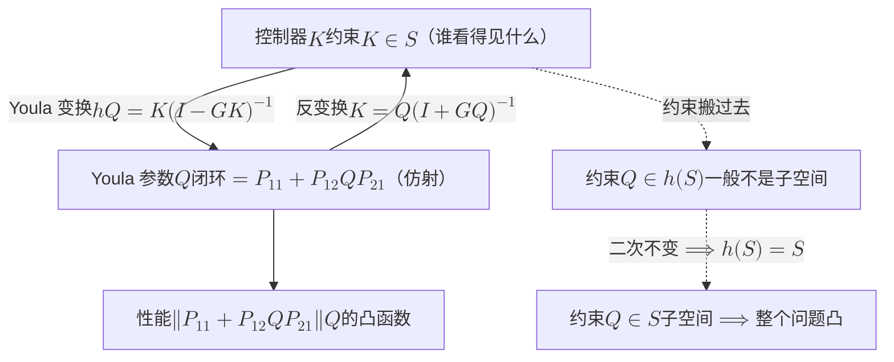
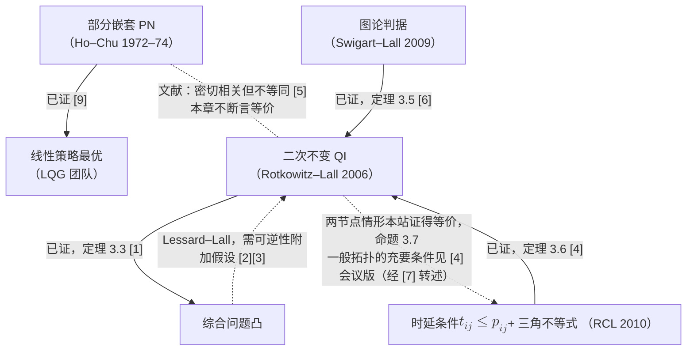

# 3 · 信息结构相图：什么时候问题是凸的

两个人抬一张长桌过门。桌子一头晃一下，晃动传到另一头要半秒。如果两人靠喊话协调，而喊话从出口到对方耳朵、再到对方手上做出反应，也要半秒左右——那么每一次"我这边歪了，你往左一点"都恰好赶在桌子晃过去之前送到，两人可以真正**配合**。如果喊话要一秒，情况就变了：对方听到的永远是半秒前的桌子，按过时的信息做出的动作会与桌子的当前状态打架。这时两人不再是在配合，而是各自在**猜**——猜对方看到了什么、猜对方会怎么动、猜对方怎么猜自己。第一种情形，"怎么抬"是一个可以坐下来算出最优方案的问题；第二种情形，同一个问题会长出无穷多层"我猜你猜我"，正是[第 1 章](01-one-counterexample.md)里 Witsenhausen 反例统治了六十年的那片深渊。

这一章要说的，就是这条**时延与传播的赛跑**如何决定一个多决策者问题是"可以算"还是"深渊"。它是本部结构轴的收尾：[第 1 章](01-one-counterexample.md)给了深渊的存在（非经典信息结构下最优解可以非线性且至今未解），第 2 章给了最好的可解区（Ho–Chu：部分嵌套 $\Longrightarrow$ 线性策略最优）。两块之间的中间地带，六十年只画出了零星几块，其中最干净的一块叫**二次不变性**（quadratic invariance, QI）：它不追求"最优解是线性的"，只追求"**求解最优解这件事是凸的**"。Rotkowitz–Lall 2006 [1] 用它圈出了分布式控制里可凸化的那一类，Rotkowitz–Cogill–Lall 2010 [4] 把它翻译成一条能用秒表量的判据：**控制器之间的通信，不能比被控对象之间的影响传播得慢**。

本章做四件事。第一，把 Youla 参数化与二次不变性这两件控制论工具从零教会，每一步都算给读者看（3.2–3.3 节）。第二，证明时延判据，并把它搬到两个小区的干扰耦合上，算出一条相边界：回传时延不超过耦合时标，协作问题就是凸的（3.4–3.5 节）；工程界"联合传输需要理想回传、非理想回传只能做较松的协调"这句常识，在这里不再是经验，而是相边界的位置。第三，交代相图右侧不只是"非凸"而是"已被证难"（3.6 节），然后把结构轴上已证的三块区域重排成一张相图（3.7 节）。第四，提出"信息结构可以被设计"——网络可以花钱改自己的信息结构，于是"一条回传链路值多少"成了一个新问题，它把本章与第三部的 $C(\varepsilon)$ 相乘（3.8 节）。

!!! note "本章预备知识"
    只需线性代数（矩阵乘法与逆、子空间）、概率论（方差、线性最小均方估计）、信号与系统（$z$ 变换、传递函数、"延迟 $d$ 步"记作 $z^{-d}$）。用到的前文：

    - 凸集、凸函数、范数是凸函数：[预备篇 7.2](../part0/07-optimization-basics.md)（范数一行在该节的凸函数速查表里）。
    - 线性最小均方预测与正交性原理（算例 3.6 要用）：[预备篇 4.10](../part0/04-information-theory-basics.md)。
    - 蜂窝网络、小区间干扰与 CoMP 的基本图像：[预备篇 6](../part0/06-wireless-networks.md)。预备篇没有专讲**回传**（backhaul，基站之间或基站到核心网的传输链路）与 **X2 接口**（LTE 基站之间直接交换协调信息的接口，NR 中对应 Xn）；本章只用到它们的一个量——单向时延，具体数字见 3.5 节算例 3.5。
    - 信息结构按"划分"口径写："划分"的定义见[第二部第 3 章](../part2/03-task-knowledge-lattice.md)定义 3.2，把它用到多决策者上的是本部[第 1 章](01-one-counterexample.md)定义 1.2（本章的连续情形只需一句等价说明：每个决策者的信息是"它能区分哪些世界状态"，有限情形就是状态集的一个划分）。
    - Witsenhausen 反例与"经典 / 非经典信息结构"：[第 1 章](01-one-counterexample.md)。
    - 部分嵌套与 Ho–Chu 定理：[第 2 章](02-team-decision-theory.md)定义 2.4 与定理 2.5 [9]（本章只引用其结论）。
    - 第三部两小区最小 CSI 交换 $C(\varepsilon)$：[第三部第 6 章](../part3/06-communication-lower-bounds.md)。

    不需要测度论，也不需要 $\mathcal{H}_2/\mathcal{H}_\infty$ 控制的背景：本章把"性能指标"统一写成闭环映射的某个范数 $\|\cdot\|$，唯一用到的性质是范数是凸函数。

---

## 3.1 抬桌子过门：两种"可解"，一条赛跑

先把开场的故事拆成两个可以精确化的量。

**传播时延** $p$：决策者 $j$ 的动作，要过多久才会改变决策者 $i$ 看到的东西。抬桌子时是"晃动从一头传到另一头的半秒"；两个小区里是"小区 2 的发射功率变了，小区 1 的干扰测量过几个时隙才反映出来"。

**通信时延** $t$：决策者 $j$ 看到的东西，要过多久才能送到决策者 $i$ 手里。抬桌子时是喊话的时延；两个小区里是回传 / X2 接口的单向时延。

故事里的直觉是：$t\le p$ 时能配合，$t>p$ 时只能猜。本章要做的是把这句话变成定理，而为此先要澄清"可解"有两种含义——这是全章的第一个概念转折。

| "可解"的含义 | 问的是什么 | 代表定理 | 本部位置 |
|---|---|---|---|
| **解的形状** | 最优策略是不是线性（仿射）的 | Ho–Chu：部分嵌套 $\Longrightarrow$ 线性最优 [9] | 第 2 章 |
| **求解的难度** | 找最优策略的优化问题是不是凸的 | Rotkowitz–Lall：二次不变 $\Longrightarrow$ 综合问题凸 [1] | 本章 |
| **计算复杂度** | 离散化后有没有多项式算法 | Tsitsiklis–Athans、Papadimitriou–Tsitsiklis：离散版 NP-complete [10][11] | 本章 3.6 节 |

三行是三个不同的问题。"线性最优"是关于**答案**的陈述：在**所有**策略（包括非线性的）里，最好的那个恰好是线性的。"凸"是关于**找答案的过程**的陈述：本章只在线性时不变（LTI）控制器里搜索，问的是这个搜索问题凸不凸，并不回答非线性策略能否做得更好。所以两者各管一件事：凸化之后找到的最优 LTI 控制器可以是阶数很高的动态滤波器（最优 $Q$ 可以是任意稳定传递矩阵），却不保证它在全体策略里最优；反过来，线性最优的问题也未必被本章的机制凸化。第 2 章的部分嵌套[^pn]与本章的二次不变性因此是**两条判据、两个结论**，文献一直把它们当作"密切相关但不等同"的概念（Rotkowitz 2008 [5] 专论二者关系）；本章不断言它们在任何模型上等价（3.3 节末的蕴含图里把未核的箭头画成虚线）。

[^pn]: "部分嵌套"（partially nested）在文献中的别名：拟经典（quasiclassical）信息结构、overlapping 信息结构。本站一律用"部分嵌套"。

为什么要引入第二种"可解"？因为工程上真正要的往往不是"最优解长什么样"，而是"能不能可靠地算出来"。一个凸问题，哪怕最优解是阶数很高的动态滤波器，也能用现成的凸优化工具可靠地求解（把问题离散化成有限维之后，可以在多项式时间内求到任意精度）；一个非凸问题，哪怕最优解恰好是线性的，一般也没有可靠的算法保证找到它。本章的口号是：**把"谁知道什么"从给定变成变量，然后问：变量取什么值时，问题是凸的。**

**到此为止我们得到了什么：一对可量化的时延（传播 $p$、通信 $t$），以及"可解"的三种含义的分工——本章负责中间那种，即综合问题的凸性。**

---

## 3.2 一句话 Youla：闭环是控制器的什么函数

### 直觉：换一个坐标系

设计控制器的困难在于，我们关心的量（闭环性能）是控制器 $K$ 的一个**很不好看**的函数——里面有 $(I-GK)^{-1}$ 这样的逆。Youla 参数化的想法极其朴素：既然难看，就换坐标。把 $K$ 换成另一个变量 $Q$，使闭环性能变成 $Q$ 的**仿射**函数（"一次函数"），那么在 $Q$ 坐标下，无约束的最优控制就是一个凸问题。全部麻烦被推到了一处：**约束**。分布式控制里，"控制器 $i$ 只能用它看得见的测量"是对 $K$ 的约束，写成 $K\in\mathcal{S}$（$\mathcal{S}$ 是某个子空间，比如"下三角矩阵"或"非对角元至少延迟 $d$ 步"）。这条约束换到 $Q$ 坐标后还是子空间约束吗？一般不是。二次不变性就是回答"什么时候是"的条件。

### 模型与记号

本章的对象全部是**离散时间、线性时不变**（LTI）系统。一个信号是一个序列 $u(0),u(1),\dots$；延迟一步的算子写成 $z^{-1}$；一个因果传递函数是形式幂级数 $F(z)=\sum_{n\ge0}f_nz^{-n}$，系数 $f_n$ 是它的脉冲响应。多输入多输出时 $F$ 是矩阵，每个元都是这样的级数。**读者只需把 $z^{-n}$ 读成"延迟 $n$ 个时隙"，把矩阵乘法按通常规则做，不需要复变函数。**

"**形式**"二字是说：我们只把 $F$ 当作一串系数 $(f_0,f_1,f_2,\dots)$ 来记账，从不把某个具体的 $z$ 代进去求和，所以根本不问级数收不收敛。两个级数相乘就是系数做卷积：$F_1F_2$ 的 $z^{-n}$ 系数是 $\sum_{k=0}^{n}f^{(1)}_kf^{(2)}_{n-k}$，只涉及有限多项，永远算得出来——这正是"两个系统串联，脉冲响应做卷积"。**因果**（causal）指级数里只有 $z^{0},z^{-1},z^{-2},\dots$，没有 $z$ 的正幂：输出不依赖未来的输入。零阶系数 $f_0$ 是"当下的输入立刻影响当下的输出"的直通部分，下面的"严格因果"就是要求它为零。

被控对象记为 $G$（$m$ 个输入 $u$，$m$ 个输出 $y$），控制器记为 $K$（把 $y$ 映到 $u$）。外部扰动 $w$ 与我们要压小的性能输出 $\zeta$ 通过

$$
\zeta=P_{11}w+P_{12}u,\qquad y=P_{21}w+Gu,\qquad u=Ky
$$

进入系统。$P_{11},P_{12},P_{21}$ 是给定的传递矩阵（它们描述扰动怎么进来、性能怎么定义）。全章假设 $G$ **稳定且严格因果**（strictly proper）：$G$ 的每个元都至少延迟一步，$G=\sum_{n\ge1}g_nz^{-n}$。物理上这就是"动作至少要过一个时隙才影响测量"，对两小区模型自然成立（3.5 节会显式算出来）；不稳定对象的情形 Rotkowitz–Lall [1] 用一般的 Youla 参数化处理，本章省略。

!!! abstract "定义 3.1（闭环映射与 Youla 参数）"
    在上述模型中，控制器 $K$ 的 **Youla 参数**（Youla parameter）定义为

    $$
    Q:=h(K):=K(I-GK)^{-1}.
    $$

    从扰动 $w$ 到性能输出 $\zeta$ 的**闭环映射**（closed-loop map）记为 $T_{\zeta w}(K)$。

**这个定义在说什么。** $Q$ 就是"从测量端注入的扰动 $P_{21}w$ 到控制输入 $u$"的整个闭环传递：$u=Ky=K(P_{21}w+Gu)$，移项得 $(I-KG)u=KP_{21}w$，直接解出的是 $u=(I-KG)^{-1}KP_{21}w$，再用下面引理 3.1（1）的推穿恒等式 $(I-KG)^{-1}K=K(I-GK)^{-1}$ 换成 $u=K(I-GK)^{-1}P_{21}w=QP_{21}w$。可见 $Q$ 不是一个人为构造，它是闭环里一段真实存在的通路。（记号提醒：[第 2 章](02-team-decision-theory.md)里的 $Q$ 是团队代价中的耦合矩阵；本章的 $Q$ 一律指 Youla 参数，两者无关。）

先用最小的数字例子看一眼这个映射长什么样，再证性质。取常数矩阵（相当于所有传递函数都是零阶的，只看代数结构）：

!!! example "算例 3.1（Youla 映射的一次往返：$2\times2$ 常数矩阵）"
    取

    $$
    G=\begin{pmatrix}0.5&0\\0.3&0.4\end{pmatrix},\qquad K=\begin{pmatrix}0.2&0\\0.1&0.3\end{pmatrix}.
    $$

    第一步算 $GK$（逐元乘加）：$(GK)_{11}=0.5\times0.2+0\times0.1=0.1$，$(GK)_{12}=0$，$(GK)_{21}=0.3\times0.2+0.4\times0.1=0.06+0.04=0.10$，$(GK)_{22}=0.4\times0.3=0.12$。于是

    $$
    I-GK=\begin{pmatrix}0.9&0\\-0.10&0.88\end{pmatrix}.
    $$

    第二步求逆。下三角矩阵的逆仍是下三角：对角元取倒数 $1/0.9=10/9$、$1/0.88=25/22$；左下元为 $-(-0.10)/(0.9\times0.88)=0.10/0.792=25/198$。

    第三步 $Q=K(I-GK)^{-1}$：

    $$
    Q=\begin{pmatrix}0.2\times\tfrac{10}{9}&0\\[2pt]0.1\times\tfrac{10}{9}+0.3\times\tfrac{25}{198}&0.3\times\tfrac{25}{22}\end{pmatrix}=\begin{pmatrix}\tfrac{2}{9}&0\\[2pt]\tfrac{59}{396}&\tfrac{15}{44}\end{pmatrix}\approx\begin{pmatrix}0.2222&0\\0.1490&0.3409\end{pmatrix}.
    $$

    （左下元：$\tfrac{1}{9}+\tfrac{7.5}{198}=\tfrac{22+7.5}{198}=\tfrac{29.5}{198}=\tfrac{59}{396}$。）注意 $Q$ 与 $K$ 一样是下三角——这不是巧合，3.3 节会解释。

    **校验：** 用引理 3.1 的反变换 $K=Q(I+GQ)^{-1}$ 回算。$GQ$：$(GQ)_{11}=0.5\times0.2222=0.1111$，$(GQ)_{21}=0.3\times0.2222+0.4\times0.1490=0.0667+0.0596=0.1263$，$(GQ)_{22}=0.4\times0.3409=0.1364$，$(GQ)_{12}=0$。$I+GQ=\begin{pmatrix}1.1111&0\\0.1263&1.1364\end{pmatrix}$，其逆为 $\begin{pmatrix}0.9&0\\-0.1263/(1.1111\times1.1364)&0.88\end{pmatrix}=\begin{pmatrix}0.9&0\\-0.1000&0.88\end{pmatrix}$。于是 $Q(I+GQ)^{-1}$ 第一行 $=(0.2222\times0.9,\ 0)=(0.2,\ 0)$，第二行 $=(0.1490\times0.9-0.3409\times0.1,\ 0.3409\times0.88)=(0.1341-0.0341,\ 0.3)=(0.1,\ 0.3)$，与原 $K$ 逐元吻合（数值计算残差 $3\times10^{-17}$）。

!!! abstract "引理 3.1（Youla 参数的三条性质）【已解决（经典）】"
    设 $G$ 稳定且严格因果。则

    1. **推穿恒等式**：$(I-KG)^{-1}K=K(I-GK)^{-1}$。
    2. **一一对应**：$h$ 是因果控制器集合到自身的双射，反变换为 $K=Q(I+GQ)^{-1}$。
    3. **仿射性**：闭环映射是 $Q$ 的仿射函数，$T_{\zeta w}=P_{11}+P_{12}QP_{21}$。

**证明。**

（1）从恒等式 $K(I-GK)=K-KGK=(I-KG)K$ 出发（两边都等于 $K-KGK$，这一步只是把 $K$ 分别从左右提出）。左乘 $(I-KG)^{-1}$、右乘 $(I-GK)^{-1}$，得 $(I-KG)^{-1}K=K(I-GK)^{-1}$。两个逆存在，因为 $G$ 严格因果使 $GK$ 与 $KG$ 的零阶系数为零，$I-GK$ 的零阶系数是 $I$，形式幂级数意义下必可逆。理由是逆的系数可以逐阶解出来：记 $I-GK=I-\sum_{n\ge1}m_nz^{-n}$，要找 $R=\sum_{n\ge0}r_nz^{-n}$ 使 $(I-GK)R=I$。比较两边 $z^{0}$ 的系数得 $r_0=I$；比较 $z^{-n}$（$n\ge1$）的系数得 $r_n-\sum_{k=1}^{n}m_kr_{n-k}=0$，即 $r_n=\sum_{k=1}^{n}m_kr_{n-k}$。右边只用到已经解出的 $r_0,\dots,r_{n-1}$，所以每个 $r_n$ 都能一步步算出来。标量小例子：$(1-0.5z^{-1})^{-1}$ 的系数依次是 $1,\,0.5,\,0.25,\dots$。零阶系数为 $I$ 这一条不能少：$z^{-1}$ 本身就没有因果的逆，它的逆是"提前一步"的 $z$。这样解出的逆就是 3.3 节将用到的级数 $\sum_{n\ge0}(GK)^n$，每个系数只由有限项决定。

（2）先把 $Q$ 的定义式两边右乘 $(I-GK)$：$Q(I-GK)=K$，展开得 $Q-QGK=K$，移项 $Q=K+QGK=(I+QG)K$（这一步把右边的 $K$ 提出来）。左乘 $(I+QG)^{-1}$：$K=(I+QG)^{-1}Q$。再对 $Q$ 与 $-G$ 用推穿恒等式（把（1）里的 $K$ 换成 $Q$、$G$ 换成 $-G$）：$(I+QG)^{-1}Q=Q(I+GQ)^{-1}$。这给出反变换。反变换与正变换互逆，可以直接验证。从 $K$ 出发，令 $Q=K(I-GK)^{-1}$，则

$$
I+GQ=I+GK(I-GK)^{-1}=\big[(I-GK)+GK\big](I-GK)^{-1}=(I-GK)^{-1},
$$

所以 $(I+GQ)^{-1}=I-GK$，$Q(I+GQ)^{-1}=K(I-GK)^{-1}(I-GK)=K$，回到原处。反过来从 $Q$ 出发令 $K=Q(I+GQ)^{-1}$，同样算得 $I-GK=\big[(I+GQ)-GQ\big](I+GQ)^{-1}=(I+GQ)^{-1}$，于是 $K(I-GK)^{-1}=Q(I+GQ)^{-1}(I+GQ)=Q$。算例 3.1 的校验里 $(I+GQ)^{-1}$ 恰好等于第一步的 $I-GK$，就是这个恒等式的数值体现。两个方向都回到原处，故 $h$ 是双射。

（3）把 $u=Ky$ 与 $y=P_{21}w+Gu$ 联立：$u=KP_{21}w+KGu$，即 $(I-KG)u=KP_{21}w$，解出 $u=(I-KG)^{-1}KP_{21}w$。用（1）换成 $u=K(I-GK)^{-1}P_{21}w=QP_{21}w$。代入 $\zeta=P_{11}w+P_{12}u$ 得 $\zeta=(P_{11}+P_{12}QP_{21})w$。$\blacksquare$

**物理意义。** 引理说的是：闭环性能这个原本带逆的函数，在 $Q$ 坐标下变成"常数加线性"。为什么换个坐标就能拉直？$K$ 是"反馈规则"，它的效果要沿回路绕无穷多圈（$K+KGK+KGKGK+\cdots$，3.3 节会展开）才定下来，所以闭环对 $K$ 高度非线性；$Q$ 则直接就是闭环里"测量端扰动 → 控制输入"的总响应，性能只是把这段总响应夹在两个固定的传递矩阵 $P_{12}$、$P_{21}$ 之间。设计 $Q$ 等于**直接设计闭环响应**，再用反变换 $K=Q(I+GQ)^{-1}$ 反解出实现它的反馈规则。于是**无约束**的最优控制

$$
\min_{Q}\ \|P_{11}+P_{12}QP_{21}\|
$$

是凸问题：范数是凸函数，$Q\mapsto P_{11}+P_{12}QP_{21}$ 是仿射映射，凸函数复合仿射映射仍凸（若 $f$ 凸、$A$ 仿射，则 $f(A(\lambda x+(1-\lambda)y))=f(\lambda A(x)+(1-\lambda)A(y))\le\lambda f(A(x))+(1-\lambda)f(A(y))$）。这对 $\mathcal{H}_2$、$\mathcal{H}_\infty$ 或任何范数都成立——Rotkowitz–Lall 框架的一般性正来自这里。

**行为分析。** 麻烦在约束。分布式控制要求 $K\in\mathcal{S}$，而在 $Q$ 坐标下这条约束变成 $Q\in h(\mathcal{S})$。$h$ 是非线性映射（含逆），子空间 $\mathcal{S}$ 的像 $h(\mathcal{S})$ 一般是一个弯曲的集合，不再是子空间，甚至不凸。整个"信息结构 → 凸不凸"的问题于是被压缩成一个纯代数问题：**$h(\mathcal{S})$ 何时等于 $\mathcal{S}$？**

**一个看得见的弯曲。** 取常数矩阵（与算例 3.1 一样只看代数结构）$G=\begin{pmatrix}0.5&0.2\\0.3&0.4\end{pmatrix}$，$\mathcal{S}$ = 对角矩阵（各控制器只看自己）。两个对角控制器 $K_a=\mathrm{diag}(1,0)$、$K_b=\mathrm{diag}(0,1)$ 的像是 $h(K_a)=\mathrm{diag}(2,0)$、$h(K_b)=\mathrm{diag}(0,\tfrac53)$，都在 $h(\mathcal{S})$ 里。它们的中点 $Q_m=\mathrm{diag}(1,\tfrac56)$ 呢？$h$ 是双射，能映到 $Q_m$ 的控制器只有一个：$K=Q_m(I+GQ_m)^{-1}\approx\begin{pmatrix}0.684&-0.085\\-0.128&0.641\end{pmatrix}$，它不是对角的。所以 $Q_m\notin h(\mathcal{S})$：两个端点在集合里，连线的中点却不在，$h(\mathcal{S})$ 不凸。

*怎么读这张图：实线那一路是无约束的 Youla 参数化——把 $K$ 换成 $Q$ 后性能变成凸函数，这一步永远成立。虚线那一路是分布式带来的麻烦——约束 $K\in\mathcal{S}$ 经过 $h$ 变成 $Q\in h(\mathcal{S})$，一般不再是子空间；标着"二次不变"的那条虚线箭头是本章的枢纽：二次不变性正是让 $h(\mathcal{S})=\mathcal{S}$ 的条件。*

**到此为止我们得到了什么：一个坐标变换和一个纯代数问题。Youla 参数把闭环性能变成凸函数（对任何范数都成立），代价是把信息结构约束 $K\in\mathcal{S}$ 变形为 $Q\in h(\mathcal{S})$；分布式控制"凸不凸"于是等价于问 $h(\mathcal{S})$ 是否等于 $\mathcal{S}$。**

---

## 3.3 二次不变性：让约束穿过 Youla 变换

### 直觉：把 $h(K)$ 展开一次，看 $KGK$ 从哪冒出来

对严格因果的 $G$，$(I-GK)^{-1}=\sum_{n\ge0}(GK)^n$（这是矩阵版的 $\frac{1}{1-x}=1+x+x^2+\cdots$，3.3.2 节会证明它在形式幂级数意义下总是成立）。于是

$$
h(K)=K(I-GK)^{-1}=K+KGK+KGKGK+KGKGKGK+\cdots .
$$

第一项 $K\in\mathcal{S}$ 没问题。第二项 $KGK$ 是"控制器通过对象再回到控制器"的一圈——控制器 $i$ 的动作经过 $G$ 影响到某个测量，那个测量又经控制器进入别人的动作。**如果 $\mathcal{S}$ 允许的每一个 $K$，绕这一圈之后仍然落在 $\mathcal{S}$ 里，那么后面所有项都会落在 $\mathcal{S}$ 里，级数和也就落在 $\mathcal{S}$ 里。** 这就是二次不变性。

!!! abstract "定义 3.2（二次不变性，Rotkowitz–Lall [1]）"
    设 $\mathcal{S}$ 是控制器的一个闭子空间，$G$ 是被控对象。称 $\mathcal{S}$ **关于 $G$ 二次不变**（quadratically invariant under $G$），若

    $$
    KGK\in\mathcal{S}\quad\text{对一切}\ K\in\mathcal{S}\ \text{成立}.
    $$

    注意量词：是**一切** $K\in\mathcal{S}$，不是某个特定的控制器。

    "闭"指对逐系数极限封闭：一列属于 $\mathcal{S}$ 的控制器，若每个脉冲响应系数都收敛，极限仍在 $\mathcal{S}$ 里。本章的稀疏约束（某些元恒为零）与时延约束（某些元的前若干个系数为零）都是对单个系数的条件，自动是闭的。

**这个定义在说什么。** 二次不变性不是控制器的性质，也不是对象的性质，而是**约束集合与对象之间关系**的性质：同一个 $\mathcal{S}$ 对一个 $G$ 可以是二次不变的，对另一个 $G$ 就不是。这正是本部贯穿命题"网络是信息结构的生成器"的技术形式——无线拓扑与时延生成 $G$ 的稀疏 / 时延模式，而"谁能看见谁"生成 $\mathcal{S}$，两者是否匹配决定问题凸不凸。

**小例子。** $m=2$，$\mathcal{S}$ = 下三角矩阵（决策者 2 能看见决策者 1 的测量，反之不能），$G$ 也下三角（子系统 1 影响 2，2 不影响 1）。任取 $K=\begin{pmatrix}k_{11}&0\\k_{21}&k_{22}\end{pmatrix}$，下三角乘下三角还是下三角，所以 $KGK$ 下三角，$\mathcal{S}$ 二次不变。换 $G$ 满（1、2 互相影响）而 $\mathcal{S}$ 仍下三角：$(KGK)_{12}=\sum_{a,b}k_{1a}g_{ab}k_{b2}$，$k_{1a}$ 只在 $a=1$ 非零，$k_{b2}$ 只在 $b=2$ 非零，故 $(KGK)_{12}=k_{11}g_{12}k_{22}\ne0$——不再下三角，**不**二次不变。同一个 $\mathcal{S}$，换了 $G$ 结论就翻了。

### 3.3.1 从 $KGK$ 到所有高阶项

!!! abstract "引理 3.2（二次不变蕴含所有高阶项不变）【已解决（经典）·本站给出初等证明】"
    若 $\mathcal{S}$ 关于 $G$ 二次不变，则对一切 $K\in\mathcal{S}$ 与一切 $n\ge0$，$K(GK)^n\in\mathcal{S}$。

**思路。** 二次不变性只直接管"同一个 $K$ 左右夹住 $G$"的二次式 $KGK$；而归纳要的下一项 $K(GK)^{n+1}=K\,G\,\big[K(GK)^{n}\big]$ 是**两个不同的**元素 $K$ 与 $K(GK)^n$ 夹住 $G$ 的交叉项。从平方里挖出交叉项有个老办法，叫极化（polarization）：$(a+b)^2-a^2-b^2=2ab$。所以把两者之和代进二次不变性，再减掉两个"平方项"，剩下的就是交叉项；这里两个交叉项恰好相等，除以 2 即可。

**证明。** 对 $n$ 归纳。$n=0$ 是 $K\in\mathcal{S}$；$n=1$ 是定义。设结论对某个 $n\ge1$ 成立，即 $K_2:=K(GK)^n\in\mathcal{S}$。记 $K_1:=K$。因为 $\mathcal{S}$ 是子空间，$K_1+K_2\in\mathcal{S}$；对它用二次不变性：

$$
(K_1+K_2)G(K_1+K_2)=K_1GK_1+K_1GK_2+K_2GK_1+K_2GK_2\in\mathcal{S}.
$$

（这一步只是把乘法展开成四项。）其中 $K_1GK_1\in\mathcal{S}$ 与 $K_2GK_2\in\mathcal{S}$ 都由二次不变性直接给出——它对 $\mathcal{S}$ 的**每个**元素成立，$K_2$ 也是 $\mathcal{S}$ 的元素。子空间对减法封闭，所以

$$
K_1GK_2+K_2GK_1\in\mathcal{S}.
$$

现在算这两项：$K_1GK_2=KGK(GK)^n=K(GK)^{n+1}$；$K_2GK_1=K(GK)^nGK=K(GK)^{n+1}$。两项相同，故 $2K(GK)^{n+1}\in\mathcal{S}$，除以 2（子空间对数乘封闭）得 $K(GK)^{n+1}\in\mathcal{S}$。$\blacksquare$

**物理意义。** 这个证明用的只是"子空间"与"二次不变"两条性质，没有用到 $G$ 或 $K$ 的任何具体结构；它说的是：只要**绕一圈**回到约束集，绕任意多圈都回到约束集。

### 3.3.2 主定理：二次不变 ⟹ 凸

!!! abstract "定理 3.3（Rotkowitz–Lall：二次不变性蕴含凸性）【已解决】"
    设 $G$ 稳定且严格因果，$\mathcal{S}$ 是控制器的闭子空间，且关于 $G$ 二次不变。则

    $$
    h(\mathcal{S})=\mathcal{S},
    $$

    从而带信息结构约束的最优控制器综合

    $$
    \min_{K\in\mathcal{S}}\ \|T_{\zeta w}(K)\|\;=\;\min_{Q\in\mathcal{S}}\ \|P_{11}+P_{12}QP_{21}\|
    $$

    是凸优化问题（目标凸、可行集是子空间）。结论对连续 / 离散时间、稳定 / 不稳定对象、任意范数成立 [1]；本章证明离散时间、稳定、严格因果的版本，其余情形的证明见 [1]。

**证明。** 分三步。

*第一步：级数展开在形式幂级数意义下总成立。* $G$ 严格因果，故 $GK$ 的每个元至少延迟一步，$(GK)^n$ 的每个元至少延迟 $n$ 步。于是级数 $\sum_{n\ge0}(GK)^n$ 中，$z^{-N}$ 的系数只由 $n\le N$ 的有限多项贡献，级数逐系数收敛，定义一个合法的因果传递矩阵 $R$。验证它是逆：

$$
(I-GK)R=\sum_{n\ge0}(GK)^n-\sum_{n\ge0}(GK)^{n+1}=I,
$$

（两个和逐系数相减，除 $n=0$ 项外全部抵消。）同理 $R(I-GK)=I$。故 $(I-GK)^{-1}=\sum_{n\ge0}(GK)^n$，从而 $h(K)=\sum_{n\ge0}K(GK)^n$。

*第二步：$h(\mathcal{S})\subseteq\mathcal{S}$。* 取 $K\in\mathcal{S}$。由引理 3.2，每一项 $K(GK)^n\in\mathcal{S}$；部分和 $\sum_{n=0}^{N}K(GK)^n\in\mathcal{S}$（子空间对有限和封闭）；部分和逐系数收敛到 $h(K)$，而 $\mathcal{S}$ 闭（本章用到的约束——某些元为零、某些元至少延迟 $t$ 步——都是对单个系数的条件，逐系数极限自动满足），故 $h(K)\in\mathcal{S}$。

*第三步：$\mathcal{S}\subseteq h(\mathcal{S})$。* 取 $Q\in\mathcal{S}$，要找 $K\in\mathcal{S}$ 使 $h(K)=Q$。由引理 3.1（2），候选是 $K=Q(I+GQ)^{-1}=Q\big(I-(-G)Q\big)^{-1}$，即**把 $G$ 换成 $-G$ 后的 Youla 变换** $h_{-G}(Q)$。注意 $\mathcal{S}$ 关于 $-G$ 也二次不变：$Q(-G)Q=-(QGQ)\in\mathcal{S}$（子空间对数乘封闭）；$-G$ 同样稳定且严格因果。把第二步用于 $-G$，得 $K=h_{-G}(Q)\in\mathcal{S}$，且由引理 3.1（2）$h(K)=Q$。故 $Q\in h(\mathcal{S})$。

两个包含合起来即 $h(\mathcal{S})=\mathcal{S}$。最后，$\min_{K\in\mathcal{S}}\|T_{\zeta w}(K)\|$ 中令 $Q=h(K)$，由引理 3.1（3）目标变成 $\|P_{11}+P_{12}QP_{21}\|$，由 $h(\mathcal{S})=\mathcal{S}$ 可行集变成 $Q\in\mathcal{S}$；目标是凸函数复合仿射映射（3.2 节已证凸），可行集是子空间，问题凸。$\blacksquare$

**省略了什么。** 有限维常数矩阵版本（算例 3.1 那种）不能用"每项多延迟一步"保证级数收敛，需要 $\|GK\|<1$；此时可先在小球内用级数证明，再用"多项式在开集上恒为零则恒为零"把结论延拓到整个 $\mathcal{S}$。具体做法：$h(K)\in\mathcal{S}$ 等价于有限多个线性泛函 $L$ 满足 $L(h(K))=0$，例如"某个元为零"。由伴随矩阵求逆公式 $(I-GK)^{-1}=\operatorname{adj}(I-GK)/\det(I-GK)$，伴随矩阵的每个元是 $I-GK$ 的元的多项式，所以 $L(h(K))\det(I-GK)=L\big(K\operatorname{adj}(I-GK)\big)$ 是 $K$ 的元的多项式。它在小球内恒为零，因而在整个 $\mathcal{S}$ 上恒为零；凡是 $\det(I-GK)\ne0$ 的 $K$，两边除以行列式即得 $L(h(K))=0$。不稳定对象需要一般 Youla 参数化，见 [1]。

**物理意义。** 定理把"分布式问题凸不凸"变成一个可以机械检验的代数条件：拿 $\mathcal{S}$ 里一个一般元 $K$，算 $KGK$，看它还在不在 $\mathcal{S}$。而且它是一句关于**约束集**的话，与你用什么范数、什么算法无关。

**行为分析。** 两个极端。$\mathcal{S}$ = 全体（集中式，谁都看得见一切）：$KGK$ 当然在全体里，二次不变，问题凸——这是经典最优控制。$\mathcal{S}$ = 对角（完全分散，谁都只看自己）而 $G$ 满：小例子已算出 $(KGK)_{12}=k_{11}g_{12}k_{22}\ne0$，不二次不变。中间地带就是本章要画的相图。

!!! example "算例 3.2（二次不变性的矩阵检验：两决策者）"
    **情形 A（1 影响 2、2 不影响 1；2 看得见 1）。**

    $$
    G=\begin{pmatrix}0.5&0\\0.3&0.4\end{pmatrix},\qquad \mathcal{S}=\{\text{下三角}\},\qquad K=\begin{pmatrix}2&0\\1&3\end{pmatrix}.
    $$

    $GK$：$(GK)_{11}=0.5\times2=1$，$(GK)_{12}=0$，$(GK)_{21}=0.3\times2+0.4\times1=1.0$，$(GK)_{22}=0.4\times3=1.2$。$KGK=K\,(GK)$：第一行 $(2\times1+0,\ 0)=(2,\ 0)$；第二行 $(1\times1+3\times1.0,\ 1\times0+3\times1.2)=(4,\ 3.6)$。

    $$
    KGK=\begin{pmatrix}2&0\\4&3.6\end{pmatrix}\in\mathcal{S}.\quad\checkmark
    $$

    **情形 B（1、2 互相影响；各只看自己）。**

    $$
    G=\begin{pmatrix}0.5&0.2\\0.3&0.4\end{pmatrix},\qquad \mathcal{S}=\{\text{对角}\},\qquad K=\begin{pmatrix}2&0\\0&3\end{pmatrix}.
    $$

    $GK=\begin{pmatrix}1.0&0.6\\0.6&1.2\end{pmatrix}$，$KGK=\begin{pmatrix}2\times1.0&2\times0.6\\3\times0.6&3\times1.2\end{pmatrix}=\begin{pmatrix}2&1.2\\1.8&3.6\end{pmatrix}\notin\mathcal{S}$。$\quad\times$

    **校验：** 情形 B 的 $(1,2)$ 元按闭式 $k_{11}g_{12}k_{22}=2\times0.2\times3=1.2$，与逐元乘法结果一致；情形 A 若把 $g_{12}$ 从 0 改成任意非零 $\epsilon$，则 $(KGK)_{12}=k_{11}\epsilon k_{22}=6\epsilon\ne0$，二次不变性立刻失效——说明情形 A 的 ✓ 完全依赖"2 不影响 1"这条对象结构，而不是数字的巧合。

### 3.3.3 反方向：凸的分布式问题只有这一类

!!! abstract "定理 3.4（Lessard–Lall：二次不变性的必要性）【已解决】"
    设 $\mathcal{S}$ 是闭子空间，且满足一条保证 $h$ 处处有定义的技术条件（LTI 版要求 $\mathcal{S}$ 关于 $G$ 是 inert 的，离散时间下大意是 $GK$ 的脉冲响应在零时刻的谱半径小于 1，$G$ 严格因果时该值为零，条件自动成立；Banach 版是一条关于 $I-GK$ 可逆性的类似条件）。则 Youla 参数集 $h(\mathcal{S})$ 为凸集**当且仅当** $\mathcal{S}$ 关于 $G$ 二次不变（[3] 推论 8、11）。进一步，若 $P_{12}$ **左可逆**、$P_{21}$ **右可逆**（Banach 版另要求对一切 $K\in\mathcal{S}$，$I-GK$ 可逆），则可达闭环映射集 $\{T_{\zeta w}(K):K\in\mathcal{S}\}$ 为凸集当且仅当 $\mathcal{S}$ 二次不变（[3] 推论 9、12）。$H_2$ 综合的经典假设（可镇定可检测、两组满秩条件）正好保证这两个可逆性；[3] 第 IV 节用例子说明可逆性条件去不掉。两个版本：Banach 空间上有界线性算子版，与（可能不稳定的）因果 LTI 版。出处 [2][3]。

**证明**略（见 [2][3]；本章不重现）。**它为什么重要。** 定理 3.3 说二次不变**够用**；定理 3.4 说它**必须**——若 $\mathcal{S}$ 不二次不变，$h(\mathcal{S})$ 就不凸，Youla 参数化这条路上不存在别的办法把问题变凸。于是相图里"凸区"的边界不是我们不会证的地方，而是被证明的边界（在 Lessard–Lall 的附加假设范围内）。

### 3.3.4 图论判据：把"谁看见谁"画成图

对最常见的一类约束——**稀疏约束**（每个控制器用一部分测量、不用其余的）——二次不变性可以直接在图上读出来。

!!! abstract "定义 3.3（稀疏信息结构、信息图与对象图）"
    $N$ 个子系统、$N$ 个控制器。**信息图** $\mathcal{I}$：顶点 $1,\dots,N$，有边 $l\to k$ 当且仅当控制器 $k$ 允许使用子系统 $l$ 的测量（即 $K_{kl}$ 可以非零）。**对象图** $\mathcal{G}$：有边 $j\to i$ 当且仅当 $G_{ij}\ne0$（子系统 $j$ 的输入影响子系统 $i$ 的输出）。约定两张图都含全部自环（每个控制器看自己，每个子系统影响自己）。稀疏约束集 $\mathcal{S}_{\mathcal{I}}:=\{K:\ K_{kl}=0\ \text{若}\ \mathcal{I}\ \text{无边}\ l\to k\}$。一张图的**传递闭包**（transitive closure）是把"有路可达"的所有顶点对都补上直接边后的图。

先看判据为什么长这样。把 $(KGK)_{kl}=\sum_{i,j}K_{ki}G_{ij}K_{jl}$ 的每一项读成一条链：子系统 $l$ 的测量 → 控制器 $j$（$K_{jl}$）→ 控制器 $j$ 的动作经对象影响子系统 $i$（$G_{ij}$）→ 子系统 $i$ 的测量 → 控制器 $k$（$K_{ki}$）。走完这条链，控制器 $k$ 的动作就**间接**依赖上了子系统 $l$ 的测量。二次不变要求：凡是能这样间接依赖上的，直接看也必须被允许。

!!! abstract "定理 3.5（稀疏约束的二次不变性判据：代数形式 [1] 与图论形式 [6]）【已解决】"
    $\mathcal{S}_{\mathcal{I}}$ 关于 $G$ 二次不变，当且仅当对一切下标 $k,i,j,l$：

    $$
    \big(K_{ki}\ \text{允许}\big)\ \wedge\ \big(G_{ij}\ne0\big)\ \wedge\ \big(K_{jl}\ \text{允许}\big)\ \Longrightarrow\ \big(K_{kl}\ \text{允许}\big).
    $$

    等价地（含自环约定下）：**信息图 $\mathcal{I}$ 等于自身的传递闭包，且 $\mathcal{I}$ 包含对象图 $\mathcal{G}$ 的传递闭包**（Swigart–Lall [6]）。

**证明。**

*代数形式，充分性。* 取 $K\in\mathcal{S}_{\mathcal{I}}$，$(KGK)_{kl}=\sum_{i,j}K_{ki}G_{ij}K_{jl}$。每个非零项都要求 $K_{ki}$ 允许、$G_{ij}\ne0$、$K_{jl}$ 允许，由条件推出 $K_{kl}$ 允许。所以 $\mathcal{I}$ 不允许的位置上 $(KGK)_{kl}$ 的每一项都是零，$KGK\in\mathcal{S}_{\mathcal{I}}$。

*代数形式，必要性。* 反设存在 $k,i,j,l$ 使前提成立而 $K_{kl}$ 不允许。取 $K=\alpha E_{ki}+\beta E_{jl}\in\mathcal{S}_{\mathcal{I}}$（$E_{ab}$ 是只有 $(a,b)$ 位为 1 的矩阵，$\alpha,\beta$ 任意标量）。直接展开：

$$
(KGK)_{kl}=\alpha\beta\,G_{ij}+\alpha^{2}[l=i]\,G_{ik}+\beta^{2}[k=j]\,G_{lj}+\alpha\beta\,[k=j][l=i]\,G_{lk},
$$

其中 $[\cdot]$ 为指示（真取 1、假取 0）。

**四项从哪里来。** $(KGK)_{kl}=\sum_{a,b}K_{ka}G_{ab}K_{bl}$ 只用到 $K$ 的第 $k$ 行和第 $l$ 列。$K$ 只在 $(k,i)$ 与 $(j,l)$ 两个位置可能非零：第 $k$ 行里一定有 $(k,i)$ 处的 $\alpha$，当 $k=j$ 时还有 $(j,l)=(k,l)$ 处的 $\beta$，即 $K_{ka}=\alpha[a=i]+\beta[k=j][a=l]$；第 $l$ 列里一定有 $(j,l)$ 处的 $\beta$，当 $l=i$ 时还有 $(k,i)=(k,l)$ 处的 $\alpha$，即 $K_{bl}=\beta[b=j]+\alpha[l=i][b=k]$。行里挑一个、列里挑一个，共 $2\times2=4$ 种搭配：

| 第 $k$ 行取 | 第 $l$ 列取 | 夹在中间的 $G$ 元 | 贡献 |
|---|---|---|---|
| $\alpha$（位置 $(k,i)$） | $\beta$（位置 $(j,l)$） | $G_{ij}$ | $\alpha\beta\,G_{ij}$ |
| $\alpha$（位置 $(k,i)$） | $\alpha$（位置 $(k,l)$，需 $l=i$） | $G_{ik}$ | $\alpha^2[l=i]\,G_{ik}$ |
| $\beta$（位置 $(k,l)$，需 $k=j$） | $\beta$（位置 $(j,l)$） | $G_{lj}$ | $\beta^2[k=j]\,G_{lj}$ |
| $\beta$（位置 $(k,l)$，需 $k=j$） | $\alpha$（位置 $(k,l)$，需 $l=i$） | $G_{lk}$ | $\alpha\beta\,[k=j][l=i]\,G_{lk}$ |

**后三项在反设下其实全为零。** 若 $l=i$，则 $K_{kl}$ 就是 $K_{ki}$，而 $K_{ki}$ 是允许的，与"$K_{kl}$ 不允许"矛盾；同理若 $k=j$，$K_{kl}$ 就是允许的 $K_{jl}$。所以 $l\ne i$、$k\ne j$，三个指示全为 0，只剩 $(KGK)_{kl}=\alpha\beta\,G_{ij}$。取 $\alpha=\beta=1$ 得 $(KGK)_{kl}=G_{ij}\ne0$，而 $(k,l)$ 是 $\mathcal{S}_{\mathcal{I}}$ 不允许的位置，故 $KGK\notin\mathcal{S}_{\mathcal{I}}$，与二次不变矛盾。（所以也不必再按 $(k,l)$ 是否等于 $(j,i)$ 分情形讨论：后一种情形要求 $k=j$ 且 $l=i$，在反设下根本不会出现。）

*图论翻译。* 先对齐方向：$K_{kl}$ 允许 $\Longleftrightarrow$ 信息图有边 $l\to k$（测量从 $l$ 流到控制器 $k$）；$G_{ij}\ne0$ $\Longleftrightarrow$ 对象图有边 $j\to i$（影响从 $j$ 流到 $i$）。两张图里箭头都从第二个下标指向第一个下标。含自环约定下，取 $i=k$（此时 $K_{ki}=K_{kk}$ 总允许，前提里这一条自动成立）：条件变成"$G_{kj}\ne0$ 且 $K_{jl}$ 允许 $\Longrightarrow$ $K_{kl}$ 允许"；再取 $j=l$（$K_{ll}$ 同样总允许）：得"$G_{kl}\ne0$ $\Longrightarrow$ $K_{kl}$ 允许"，即对象图的每条边 $l\to k$ 都在信息图里，$\mathcal{I}\supseteq\mathcal{G}$。另取 $j=i$ 并用对象图自环 $G_{ii}\ne0$：条件变成"$K_{ki}$、$K_{il}$ 允许 $\Longrightarrow$ $K_{kl}$ 允许"，也就是"有边 $l\to i$ 与 $i\to k$ 就必须有边 $l\to k$"，即 $\mathcal{I}$ 传递闭合。传递闭合且包含 $\mathcal{G}$ 的图必包含 $\mathcal{G}$ 的传递闭包。反之，若 $\mathcal{I}$ 传递闭合且包含 $\mathcal{G}$，则前提中的 $K_{ki}$、$G_{ij}$、$K_{jl}$ 给出信息图中的路 $l\to j\to i\to k$（中间一段用 $\mathcal{I}\supseteq\mathcal{G}$），传递闭合给出边 $l\to k$。$\blacksquare$

**物理意义。** 二次不变性在稀疏情形就是两句话：**（甲）如果 $j$ 的动作影响 $i$，那么 $i$ 必须看得见 $j$；（乙）"看得见"必须传递——我看得见你、你看得见他，则我必须看得见他。** 违反（甲）的典型是"两个小区互相干扰但互不交换信息"；违反（乙）的典型是链式共享——3 号只从 2 号那里拿信息、2 号只从 1 号那里拿，3 号却拿不到 1 号的原始测量。

!!! example "算例 3.3（三节点链：传递性缺一条边）"
    三个子系统排成链，$1\to2\to3$（对象图边），控制器 2 看 1、控制器 3 看 2，但 3 **不看** 1。取

    $$
    K=\begin{pmatrix}1&0&0\\0.5&1&0\\0&0.5&1\end{pmatrix},\qquad
    G=\begin{pmatrix}0.5&0&0\\0.3&0.4&0\\0&0.2&0.6\end{pmatrix}.
    $$

    $(KGK)_{31}=\sum_{a,b}K_{3a}G_{ab}K_{b1}$。$K_{3a}$ 在 $a=2,3$ 非零，$K_{b1}$ 在 $b=1,2$ 非零，共四个候选项：$K_{32}G_{21}K_{11}=0.5\times0.3\times1=0.15$；$K_{32}G_{22}K_{21}=0.5\times0.4\times0.5=0.10$；$K_{33}G_{31}K_{11}=0$（$G_{31}=0$）；$K_{33}G_{32}K_{21}=1\times0.2\times0.5=0.10$。合计 $(KGK)_{31}=0.35\ne0$，但信息图不允许 $K_{31}$——不二次不变。

    补一条边 $1\to3$（让 3 也看 1）后，信息图成为"下三角全允许"，它传递闭合且包含对象图，由定理 3.5 二次不变；此时 $\mathcal{S}$ 是下三角子空间，与算例 3.2 情形 A 同理。

    **校验：** 用整矩阵乘法复算，$KGK=\begin{pmatrix}0.5&0&0\\0.75&0.4&0\\0.35&0.7&0.6\end{pmatrix}$，$(3,1)$ 元 0.35 与逐项求和一致；且 $(1,2),(1,3),(2,3)$ 元为零，说明违反的只有传递性这一条，与图论判据的诊断一致。

### 3.3.5 谁蕴含谁：一张诚实的小图

*怎么读这张图：实线是本章证明或有明确文献陈述的蕴含；虚线是有附加假设、只在特例证得、或文献未核的关系。最重要的两条虚线是"凸 $\Longrightarrow$ QI"（有附加假设）与"PN ↔ QI"（本章不断言）——它们决定了 3.7 节相图里哪些边界是定理、哪些是示意。*

**到此为止我们得到了什么：全章的枢纽。二次不变性是"约束集绕对象一圈仍回到自身"的代数条件；它蕴含综合问题凸（定理 3.3，完整证明），在附加假设下也是凸的必要条件（定理 3.4）；稀疏情形它就是信息图的两条规则——影响者必须被看见、看见必须传递（定理 3.5）。**

---

## 3.4 时延定理：信息必须跑得比影响快

### 直觉

回到抬桌子。稀疏约束回答的是"谁**能不能**看见谁"，时延约束回答的是"看见要**多久**"。把 3.3 节的判据（甲）"如果 $j$ 影响 $i$，$i$ 必须看得见 $j$"加上时间维度，自然变成：**如果 $j$ 的动作 $p_{ij}$ 步后影响 $i$，那么 $i$ 必须在 $t_{ij}\le p_{ij}$ 步内看到 $j$ 的测量。** 影响还没到，信息先到，控制器就能"迎着"影响做出反应；反过来，影响先到而信息后到，控制器只能事后补救，而且它补救的动作又成了别人要猜的东西。

### 记号：传递函数的延迟

对因果传递函数 $F(z)=\sum_{n\ge0}f_nz^{-n}$，定义其**延迟** $\operatorname{del}(F):=\min\{n:f_n\ne0\}$（$F\equiv0$ 时记为 $+\infty$）。两条显然要用的规则（由级数乘法直接得到）：$\operatorname{del}(F_1F_2)\ge\operatorname{del}(F_1)+\operatorname{del}(F_2)$，$\operatorname{del}(F_1+F_2)\ge\min\{\operatorname{del}(F_1),\operatorname{del}(F_2)\}$。理由各一句：$F_1F_2$ 的 $z^{-n}$ 系数是 $\sum_{k=0}^{n}f^{(1)}_kf^{(2)}_{n-k}$，当 $n<\operatorname{del}(F_1)+\operatorname{del}(F_2)$ 时，每一项里要么 $k<\operatorname{del}(F_1)$、要么 $n-k<\operatorname{del}(F_2)$，总有一个因子为零；$F_1+F_2$ 的前 $\min\{\cdot\}$ 个系数都是零加零。加法写 $\ge$ 是因为两个最低次项可能恰好抵消（如 $z^{-1}+(-z^{-1})=0$）。

给定非负整数矩阵 $(t_{ij})$（**传输时延**，控制器 $i$ 收到子系统 $j$ 测量的时延，$t_{ii}=0$）与 $(p_{ij})$（**传播时延**，$\operatorname{del}(G_{ij})=p_{ij}$，$G$ 严格因果故 $p_{ij}\ge1$；若 $G_{ij}\equiv0$ 取 $p_{ij}=+\infty$），定义时延约束集

$$
\mathcal{S}_t:=\{K:\ \operatorname{del}(K_{ij})\ge t_{ij}\ \text{对一切}\ i,j\}.
$$

它是闭子空间（条件是"前 $t_{ij}$ 个系数为零"，对加法、数乘、逐系数极限封闭）。

!!! abstract "定理 3.6（Rotkowitz–Cogill–Lall：时延条件蕴含凸性）【部分结果：充分性已证；一般拓扑下 $t_{ij}\le p_{ij}$ 的必要性见第 9 章引理 9.2，三角不等式本身不必要】"
    设传输时延满足**三角不等式** $t_{ik}\le t_{ij}+t_{jk}$（对一切 $i,j,k$），且任两子系统间**传输时延不超过传播时延**：$t_{ij}\le p_{ij}$（对一切 $i,j$）。则 $\mathcal{S}_t$ 关于 $G$ 二次不变，从而带时延约束的最优控制器综合问题可重述为凸优化 [4]。

    ⚠ 出处 [4] 的摘要只说"if a simple condition holds"，即**充分条件**。必要方向文献里其实已有：据 Rotkowitz–Martins [7] 第 IV-A 节对 [4] 的会议版（CDC 2005）的转述，时延约束集二次不变的**充要条件**是 $t_{ki}+p_{ij}+t_{jl}\ge t_{kl}$（对一切 $i,j,k,l$）；传输时延满足三角不等式时，它化为逐对的 $p_{ij}\ge t_{ij}$，用的是"不超过"——通信至少要和传播一样快【二手已核：[7] 与 [4] 的第一作者是同一人，[4] 全文未取得】。[第 9 章](09-research-agenda.md)引理 9.2 的结论与之一致：在充要条件里取 $k=i$、$l=j$，由 $t_{ii}=t_{jj}=0$ 即得 $t_{ij}\le p_{ij}$；取 $i=j$ 即得带松弛的 $t_{kl}\le t_{ki}+p_{ii}+t_{il}$，三角不等式本身不必要。

**证明（离散时间版本；[4] 的设定更一般）。** 取 $K\in\mathcal{S}_t$。对任意 $i,j$，

$$
(KGK)_{ij}=\sum_{a,b}K_{ia}G_{ab}K_{bj}.
$$

对每一项用延迟的乘法规则：

$$
\operatorname{del}(K_{ia}G_{ab}K_{bj})\ \ge\ t_{ia}+p_{ab}+t_{bj}\ \ge\ t_{ia}+t_{ab}+t_{bj}\ \ge\ t_{ib}+t_{bj}\ \ge\ t_{ij}.
$$

第一个不等号是延迟的乘法规则，加上 $K\in\mathcal{S}_t$（$\operatorname{del}(K_{ia})\ge t_{ia}$、$\operatorname{del}(K_{bj})\ge t_{bj}$）与 $\operatorname{del}(G_{ab})=p_{ab}$；第二个是假设 $p_{ab}\ge t_{ab}$；第三个是三角不等式 $t_{ia}+t_{ab}\ge t_{ib}$（$b$ 的测量经 $a$ 转发到 $i$，不比直达快）；第四个是三角不等式 $t_{ib}+t_{bj}\ge t_{ij}$（$j$ 的测量经 $b$ 转发到 $i$）。于是每一项的延迟都 $\ge t_{ij}$，用加法规则，$\operatorname{del}((KGK)_{ij})\ge t_{ij}$，即 $KGK\in\mathcal{S}_t$。这对一切 $K\in\mathcal{S}_t$ 成立，$\mathcal{S}_t$ 二次不变；由定理 3.3 综合问题凸。$\blacksquare$

**物理意义。** 三角不等式说的是"转发不比直达快"——信息从 $k$ 经 $j$ 到 $i$ 的时延不小于直达时延，这是任何真实通信网络自然满足的（如果转发更快，你就把直达链路定义成那条转发路径）。核心条件 $t_{ij}\le p_{ij}$ 就是抬桌子的一句话：**信息必须跑得比影响快。**

**行为分析。** 令所有 $t_{ij}\to0$（理想即时通信）：条件自动满足，问题凸——这是集中式。令某个 $t_{ij}\to\infty$（$i$ 永远收不到 $j$）：条件要求 $p_{ij}=\infty$，即 $j$ 根本不影响 $i$；否则出界。中间：$G$ 的传播越慢（$p$ 大），网络允许的通信越慢（$t$ 可大）——**耦合越松，越容忍慢回传。**

### 两节点：等价成立

一般拓扑下的必要方向本章不主张，但两节点时可以完整地证出"当且仅当"：

!!! abstract "命题 3.7（两节点时延约束的二次不变性：充要）【本站演算】"
    $N=2$，$G$ 严格因果，$p_{12}=\operatorname{del}(G_{12})<\infty$，$p_{21}=\operatorname{del}(G_{21})<\infty$，$t_{11}=t_{22}=0$，$t_{12},t_{21}\ge0$ 为整数。则

    $$
    \mathcal{S}_t\ \text{关于}\ G\ \text{二次不变}\quad\Longleftrightarrow\quad t_{12}\le p_{12}\ \text{且}\ t_{21}\le p_{21}.
    $$

**证明。** （$\Longleftarrow$）两节点时三角不等式 $t_{ik}\le t_{ij}+t_{jk}$ 的下标只能取 1、2，逐一检查：若 $j=i$ 或 $j=k$，它变成 $t_{ik}\le t_{ik}+0$（如 $t_{12}\le t_{11}+t_{12}$）；剩下的情形只有 $i=k\ne j$，它变成 $0=t_{ii}\le t_{ij}+t_{ji}$。两种都自动成立，所以两节点时只需 $t_{ij}\le p_{ij}$，定理 3.6 直接给出充分性。为了让读者亲眼看到项从哪里来，把 $(KGK)_{12}$ 的四项写全：

$$
(KGK)_{12}=\underbrace{K_{11}G_{11}K_{12}}_{\ge\,0+p_{11}+t_{12}}+\underbrace{K_{11}G_{12}K_{22}}_{\ge\,0+p_{12}+0}+\underbrace{K_{12}G_{21}K_{12}}_{\ge\,t_{12}+p_{21}+t_{12}}+\underbrace{K_{12}G_{22}K_{22}}_{\ge\,t_{12}+p_{22}+0}.
$$

（下标写的是各项延迟下界。）第一、三、四项延迟都 $\ge t_{12}$，**只有第二项 $K_{11}G_{12}K_{22}$ 的延迟下界是 $p_{12}$**，与 $t_{12}$ 无关——它是"1 的控制器动作 → 经对象传到 2 → 2 的控制器动作"这条不经过回传的物理通路。要它落在 $\mathcal{S}_t$ 里，需要 $p_{12}\ge t_{12}$。$(2,1)$ 元对称。

（$\Longrightarrow$）设 $t_{12}>p_{12}$。取 $K=I$（对角元为常数 1，延迟 0，满足 $t_{ii}=0$；非对角元为 0，延迟 $+\infty$，满足任何下界），$K\in\mathcal{S}_t$。则 $KGK=G$，而 $\operatorname{del}(G_{12})=p_{12}<t_{12}$，故 $G\notin\mathcal{S}_t$，二次不变失效。$t_{21}>p_{21}$ 同理。$\blacksquare$

**物理意义。** 必要性的证明只用了一个控制器——"各自做纯本地比例控制"（$K=I$）。它说的是：只要 1 的本地动作会在 $p_{12}$ 步后被 2 的测量看到，而 2 要 $t_{12}>p_{12}$ 步才能从回传得知 1 当时看到了什么，那么 2 的测量里就混进了"1 根据 2 尚不知道的信息做出的动作"——这正是 Witsenhausen 式"动作即信号"的结构，[第二部第 5 章](../part2/05-cognitive-triangle.md)定义 5.2 的对偶效应（控制动作除了推动状态，还会改变日后对状态估计的准确度）在多决策者版本里的样子。

!!! example "算例 3.4（两节点时延推导的具体数字）"
    取 $G_{12}=0.3\,z^{-1}$（传播时延 $p_{12}=1$），$G_{11}=0.5\,z^{-1}$，$G_{22}=0.4\,z^{-1}$，$G_{21}=0.3\,z^{-1}$。控制器 $K_{11}=2$，$K_{22}=3$（本地即时比例控制），非对角元带回传时延 $t$：$K_{12}=0.1\,z^{-t}$，$K_{21}=0.1\,z^{-t}$。

    **情形 $t=2$（回传比传播慢）。** $(KGK)_{12}$ 的四项：
    $K_{11}G_{11}K_{12}=2\times0.5z^{-1}\times0.1z^{-2}=0.1\,z^{-3}$；
    $K_{11}G_{12}K_{22}=2\times0.3z^{-1}\times3=1.8\,z^{-1}$；
    $K_{12}G_{21}K_{12}=0.1z^{-2}\times0.3z^{-1}\times0.1z^{-2}=0.003\,z^{-5}$；
    $K_{12}G_{22}K_{22}=0.1z^{-2}\times0.4z^{-1}\times3=0.12\,z^{-3}$。
    合计 $(KGK)_{12}=1.8\,z^{-1}+0.22\,z^{-3}+0.003\,z^{-5}$，最低次幂 $z^{-1}$，延迟 $1<t=2$——**出界**，不二次不变。

    **情形 $t=1$（回传与传播同步）。** 同样四项变为 $0.1z^{-2}$、$1.8z^{-1}$、$0.003z^{-3}$、$0.12z^{-2}$，合计 $1.8\,z^{-1}+0.22\,z^{-2}+0.003\,z^{-3}$，延迟 $1\ge t=1$——**在界内**。

    **校验：** 用时域脉冲响应复算 $t=2$ 情形的首个非零样本。在子系统 2 的测量端于时隙 0 打一个单位脉冲：控制器 2 立刻输出 $u_2(0)=3$（$K_{22}=3$，延迟 0）；经 $G_{12}=0.3z^{-1}$，时隙 1 到达子系统 1 的输出，幅度 $0.9$；控制器 1 立刻响应 $u_1(1)=2\times0.9=1.8$。所以"2 的测量 → 1 的动作"这条通路的脉冲响应首个非零样本在时隙 1，幅度 1.8，与频域的 $1.8\,z^{-1}$ 完全一致；而回传路径 $K_{12}=0.1z^{-2}$ 最早在时隙 2 才动作——物理通路比信息通路快了一个时隙，这就是出界的全部原因。

### 补一句 2025 年的新动态

时延不只把问题推出凸区，还会改变凸区内最优解的**形状**。Ballotta 等 2025 [14]【预印本·未评审】研究空间不变系统在带时延的状态测量下的最优比例反馈：结论是时延使最优增益变小、卷积核变平——远处测量的相对权重上升，"把控制器截断成只用近邻信息"这条工程捷径在时延变大时反而**需要更远的通信**。对本章的意义是：3.7 节相图的横轴不只决定"凸不凸"，在凸区内部它还在把最优解推向更非局部。

**到此为止我们得到了什么：一条能用秒表量的判据。传输时延不超过传播时延（加三角不等式）$\Longrightarrow$ 二次不变 $\Longrightarrow$ 凸（定理 3.6，完整证明）；两节点时反方向也成立（命题 3.7）。出界的机制只有一个——那条不经回传的物理通路 $K_{11}G_{12}K_{22}$ 比信息跑得快。**

---

## 3.5 两小区：CoMP 的工程常识是一条相边界

### 模型

两个小区，各有一个一阶状态 $x_i(k)$：可以读成小区 $i$ 在时隙 $k$ 的队列积压偏差，或滤波后的干扰功率相对目标值的偏差。动作 $u_i(k)$ 是小区 $i$ 在时隙 $k$ 的发射功率调整。小区 $j$ 的功率通过干扰耦合进入小区 $i$ 的状态，写成

$$
\begin{aligned}
x_1(k+1)&=a_1x_1(k)+b_1u_1(k)+c_{12}u_2(k)+w_1(k),\\
x_2(k+1)&=a_2x_2(k)+c_{21}u_1(k)+b_2u_2(k)+w_2(k),
\end{aligned}
$$

$a_i\in(0,1)$ 是遗忘因子（状态自身的记忆），$b_i$ 是自身功率的增益，$c_{ij}$ 是跨小区干扰增益（与路径增益比成正比），$w_i$ 是外部扰动（业务到达、信道起伏）。信息结构：小区 $i$ 的控制器在时隙 $k$ 看得到自己的 $x_i(k)$，通过回传看得到对方的 $x_j(k-d)$，$d$ 是**回传时延（以时隙计）**。写成约束集就是 $\mathcal{S}_t$，$t_{11}=t_{22}=0$，$t_{12}=t_{21}=d$。

先算 $G$。对状态方程做 $z$ 变换（$x(k+1)\leftrightarrow zX(z)$），忽略扰动：$zX=AX+BU$，$A=\mathrm{diag}(a_1,a_2)$，$B=\begin{pmatrix}b_1&c_{12}\\c_{21}&b_2\end{pmatrix}$。解出 $X=(zI-A)^{-1}BU$，而 $(zI-A)^{-1}=\mathrm{diag}\big(\tfrac{1}{z-a_1},\tfrac{1}{z-a_2}\big)$，于是

$$
G(z)=\begin{pmatrix}\dfrac{b_1}{z-a_1}&\dfrac{c_{12}}{z-a_1}\\[6pt]\dfrac{c_{21}}{z-a_2}&\dfrac{b_2}{z-a_2}\end{pmatrix}.
$$

把每个元展成 $z^{-1}$ 的级数：$\tfrac{1}{z-a}=\tfrac{z^{-1}}{1-az^{-1}}=z^{-1}+az^{-2}+a^2z^{-3}+\cdots$。所以 $G_{12}=c_{12}(z^{-1}+a_1z^{-2}+\cdots)$，只要 $c_{12}\ne0$ 就有 $\operatorname{del}(G_{12})=1$：**传播时延 $p_{12}=1$ 个时隙**，同理 $p_{21}=1$，$p_{11}=p_{22}=1$。$G$ 严格因果，符合 3.4 节的假设。

更一般地，若干扰要 $p$ 个时隙才进入状态（例如状态是 $p$ 时隙窗口的平均量），把 $c_{12}u_2(k)$ 换成 $c_{12}u_2(k-p+1)$，则 $G_{12}=c_{12}z^{-p}/(1-a_1z^{-1})$，$\operatorname{del}(G_{12})=p$。

!!! abstract "命题 3.8（两小区干扰耦合团队的相图判据）【本站演算】"
    在上述两小区模型中（$c_{12},c_{21}\ne0$，耦合传播时延 $p$ 个时隙，回传时延 $d$ 个时隙），

    1. 协作控制器约束集 $\mathcal{S}_t$ 关于 $G$ **二次不变 $\Longleftrightarrow$ $d\le p$**；特别地，一阶模型 $p=1$ 时，**二次不变 $\Longleftrightarrow$ $d\le1$**。
    2. 因此 $d\le p$ $\Longrightarrow$ 协作控制器综合问题**凸**（对任意范数性能指标）。
    3. 反方向：若 Youla 参数集凸，则 $d\le p$——定理 3.4 第一部分的技术条件在这里自动满足（$G$ 严格因果）。若说的是可达闭环映射集凸，还要 $P_{12}$ 左可逆、$P_{21}$ 右可逆（定理 3.4 第二部分）；本模型没有指定性能输出与扰动如何进入，故本章不无条件主张"时延不等式 $\Longleftrightarrow$ 闭环映射集凸"。

**证明。** （1）$N=2$，$p_{12}=p_{21}=p$，$t_{12}=t_{21}=d$，$t_{ii}=0$，$G$ 严格因果，命题 3.7 的全部前提满足；其结论 $t_{12}\le p_{12}$ 且 $t_{21}\le p_{21}$ 就是 $d\le p$。（2）由（1）与定理 3.3。（3）由定理 3.4：若综合问题的 Youla 参数集凸则 $\mathcal{S}_t$ 二次不变，再由（1）得 $d\le p$；"综合问题凸"与"Youla 参数集凸"之间的衔接依赖 [2][3] 的附加假设。$\blacksquare$

**物理意义。** 这就是本部贯穿命题"无线网络是信息结构的生成器"的定理形式：**拓扑**（谁干扰谁）生成 $G$ 的稀疏模式与 $p$，**回传**（谁多久能告诉谁）生成 $\mathcal{S}_t$ 的 $d$；两者的一个不等式决定协作问题凸不凸。据本站检索，把 [1][4] 的判据实例化为"耦合时标 = 调度时隙、通信时延 = X2/回传时延"的蜂窝协作命题未见先例【本站提法】；控制侧的一般版本（"控制器通信快于动力学传播"）在 [1] 中已作为例子出现、在 [4] 中给出网络时延版。

### 把数字代进去

!!! example "算例 3.5（承重算例：回传时延对耦合时标的三档）"
    **耦合时标**取一个调度时隙 $T_s$。NR 的时隙长度随子载波间隔变化：15 kHz 对应 1 ms，30 kHz 对应 0.5 ms（3GPP TS 38.211 表 4.2-1 与表 4.3.2-1：子载波间隔 $15\cdot2^{\mu}$ kHz 时，每个 1 ms 子帧含 $2^{\mu}$ 个时隙）。**回传时延**取 3GPP TR 36.932 §6.1.3 [15] 的分类：理想回传单向时延 **< 2.5 μs（不含光纤 / 电缆的传播时延）**；非理想回传按接入方式分档，**最快的一档（光纤接入 3）单向 2–5 ms**，其余更慢（光纤接入 2：5–10 ms；光纤接入 1：10–30 ms；无线回传：5–35 ms；DSL：15–60 ms）。下表取非理想回传**最有利**的 2 ms 与 5 ms 两个端点——它们出界，更慢的各档只会更出界。

    以时隙计的回传时延 $d=\lceil d_{\text{时间}}/T_s\rceil$（必须等到下一个时隙边界才能用；若能在同一时隙内处理则为 0，两种取法都不改变下面的结论）。

    | 回传类型 | $d_{\text{时间}}$ | $T_s=0.5$ ms：$d_{\text{时间}}/T_s$ → $d$ | $T_s=1$ ms：$d_{\text{时间}}/T_s$ → $d$ | 对一阶耦合 $p=1$ |
    |---|---|---|---|---|
    | 理想（同站 / 光纤直连） | 2.5 μs | $0.0025/0.5=0.005$ → $d\le1$ | $0.0025/1=0.0025$ → $d\le1$ | **二次不变，凸** |
    | 非理想最快档下限（光纤接入 3） | 2 ms | $2/0.5=4$ → $d=4$ | $2/1=2$ → $d=2$ | 出界 |
    | 非理想最快档上限（光纤接入 3） | 5 ms | $5/0.5=10$ → $d=10$ | $5/1=5$ → $d=5$ | 出界 |

    三档比值 $d_{\text{时间}}/T_s\approx0.0025$–$0.005$ / $2$–$4$ / $5$–$10$：理想回传落在 $d\le1$ 的凸区，非理想回传两档在两种时隙下**全部**出界。

    **校验：** （i）边界处代回命题 3.7：$d=1=p$，$t_{12}=1\le p_{12}=1$，成立，二次不变——所以边界本身属于凸区（闭边界）；$d=2$ 时 $K=I$ 给出 $KGK=G$，$\operatorname{del}(G_{12})=1<2$，出界，与表一致。（ii）比值的一致性：同一回传在两种时隙下的 $d$ 相差恰好 2 倍（$4/2=10/5=2=1\,\mathrm{ms}/0.5\,\mathrm{ms}$），且 2 ms 与 5 ms 两档之比 $10/4=5/2=2.5$，与原始时延之比一致。（iii）理想回传的 2.5 μs 若加上 10 km 光纤传播时延（约 $10\ \mathrm{km}\,/\,(2\times10^5\ \mathrm{km/s})=50$ μs），比值升到 $0.05$–$0.1$，仍远小于 1——"不含光纤传播时延"这个括号不改变结论，但行家会检查它是否被漏掉。

### 工程常识变成相边界

**CoMP 联合传输（JT）**要求各站在**同一个时隙**内对同一用户的数据做联合预编码：被协调的量是瞬时信道与瞬时发射信号，耦合是**时隙内即时**的——在本章的模型里这相当于 $p=0$（把 $c_{12}u_2(k)$ 直接加进小区 1 在时隙 $k$ 的测量）。注意 $p=0$ 已超出命题 3.7、3.8 的前提（它们假设 $G$ 严格因果，即 $p\ge1$），这里是把相边界 $d\le p$ 形式地外推到 $p=0$。按这个外推需要 $d\le0$：只有理想回传（同站基带、光纤直连 CU），**而且**在同一时隙内处理完（$d=0$），才让协作设计留在凸区；若按算例 3.5 的上取整口径 $d=\lceil d_{\text{时间}}/T_s\rceil$，哪怕 2.5 μs 也会记成 $d=1$，JT 就出界了。**协调调度 / 协调波束（CS/CB）**协调的是每时隙的调度决策与波束方向，耦合传播 1 个时隙（$p=1$），需要 $d\le1$，即回传 $\le T_s$：2–5 ms 的非理想回传仍然出界。**半静态干扰协调**（如以数十毫秒为周期更新的资源划分模式）协调的是慢变量，取耦合时标 $T_c=40$ ms 作示意，则 $p=T_c/T_s=40$–$80$ 个时隙，非理想回传 $d=2$–$10\le p$，回到凸区。

| 协作方式 | 被协调的量 | 耦合时标 $p$（时隙） | 凸区条件 | 理想回传 2.5 μs | 非理想 2–5 ms |
|---|---|---|---|---|---|
| CoMP-JT | 同时隙联合预编码 | 0 | $d=0$ | ✓ | ✗ |
| CoMP-CS/CB | 每时隙调度 / 波束 | 1 | $d\le1$ | ✓ | ✗ |
| 半静态干扰协调 | 数十 ms 的资源模式（$T_c=40$ ms 示意） | 40–80 | $d\le40$ | ✓ | ✓ |

"联合传输需要理想回传、非理想回传只能做较松的协调"是无线工程师人人知道的常识。本章的读法【本站提法】是：**它不是经验之谈，而是命题 3.8 的相边界 $d=p$ 在三种协作方式上的三个截面。** 按上表还能把这句常识说得更准：2–5 ms 的非理想回传连每时隙一次的协调调度也落在凸区之外，能保住凸性的只有半静态协调；工程上用非理想回传做的协调调度，要么放慢节奏、把协调信息的有效期拉长到多个时隙，要么接受出界后的启发式设计（见下面的陷阱框）。决定一种协作能否"可靠地算出最优方案"的，不是回传的绝对时延，而是回传时延与被协调量的耦合时标之比。

!!! warning "陷阱：相边界是可解性的边界，不是增益消失的位置"
    出了凸区，协作增益不会突然归零——工程上非理想回传的 CoMP 仍有增益，只是设计问题不再凸、最优方案一般找不到、只能用启发式。两件事必须分开：**可解性**（本章相图）随 $d$ 在 $d=p$ 处跳变；**信息的价值**随 $d$ 连续衰减。下面的算例给后者一条可算的曲线，标明是示意模型。

!!! example "算例 3.6（示意：信息过期的价值衰减，AR(1) 模型）【本站演算】"
    设跨小区干扰的慢变分量是一阶自回归过程 $x(k)=\rho x(k-1)+n(k)$，$n(k)$ 独立同分布、方差 $\sigma_n^2$，平稳方差 $\sigma^2=\sigma_n^2/(1-\rho^2)$。小区 1 想在时隙 $k$ 抵消 $x(k)$，但只拿到 $d$ 时隙前的 $x(k-d)$。把递推展开 $d$ 次：

    $$
    x(k)=\rho^dx(k-d)+\sum_{i=0}^{d-1}\rho^in(k-i).
    $$

    右端第二项只含 $n(k-d+1),\dots,n(k)$，它们都在 $x(k-d)$ 之后才产生，所以与 $x(k-d)$ 独立、均值为零。于是预测 $\hat{x}(k)=\rho^dx(k-d)$ 的误差恰好就是这第二项，它与观测 $x(k-d)$ 正交；由正交性原理（[预备篇 4.10](../part0/04-information-theory-basics.md)），$\rho^dx(k-d)$ 就是线性最小均方预测。误差是 $d$ 个独立噪声的加权和，方差逐项相加，再用等比数列求和与 $\sigma_n^2=\sigma^2(1-\rho^2)$，得预测误差方差

    $$
    \sigma_n^2\sum_{i=0}^{d-1}\rho^{2i}=\sigma_n^2\,\frac{1-\rho^{2d}}{1-\rho^2}=\sigma^2\,(1-\rho^{2d}).
    $$

    若协作增益与被抵消的方差成正比（线性抵消高斯干扰时确实如此），则"可实现的协作增益份额"为 $\rho^{2d}$：能被抵消掉的方差是总方差减去预测误差方差，$\sigma^2-\sigma^2(1-\rho^{2d})=\sigma^2\rho^{2d}$，占总方差的 $\rho^{2d}$。取 $\rho=0.9$（相关时间 $1/(1-\rho)=10$ 个时隙）：$d=0,1,2,4,5,10$ 时份额为 $1,\ 0.81,\ 0.656,\ 0.430,\ 0.349,\ 0.122$。取 $\rho=0.7$（相关时间约 3 时隙）：$1,\ 0.49,\ 0.240,\ 0.058,\ 0.028,\ 0.0008$。

    **校验：** 两个极限。$d=0$：误差方差 $\sigma^2(1-1)=0$，份额 1——拿到当前值就能完全抵消，正确。$d\to\infty$：$\rho^{2d}\to0$，误差方差 $\to\sigma^2$——等于不用任何信息、直接用均值 0 预测时的方差，正确。中间一点：$d=1$，$\rho=0.9$，闭式 $1-0.81=0.19$，直接算 $\sigma_n^2/\sigma^2=1-\rho^2=0.19$，一致。

{ .chart loading=lazy }
{ .chart loading=lazy }

*怎么读这张图：数据来自算例 3.6 的闭式 $\rho^{2d}$，上线 $\rho=0.9$、下线 $\rho=0.7$。它画的是"信息过期让协作值多少"，是一条连续衰减的曲线；本章的相边界 $d=p$（一阶耦合时在 $d=1$）是另一件事——它标的是"设计问题从凸变成非凸"的位置，在曲线上没有任何可见的拐点。非理想回传的 $d=2$–$10$ 落在两条曲线的中后段：增益还在（$\rho=0.9$ 时仍有 12%–66%），但已经出了凸区。这是示意模型，不是最优控制代价的精确计算。*

**到此为止我们得到了什么：本部第一条无线实例化的定理形式。两小区干扰耦合团队二次不变 $\Longleftrightarrow$ 回传时延 $d\le$ 耦合时标 $p$（命题 3.8，本站演算）；代入 3GPP 的回传分类：理想回传比值 0.0025–0.005 在凸区、非理想回传 2–10 全部出界；CoMP 三种协作方式的工程常识是这条相边界的三个截面。**

---

## 3.6 相图的右侧：不只是非凸，是难

出了凸区，问题会变成什么？"非凸"只是说我们手里的这把工具（Youla 参数化 + 凸优化）不再适用，并不排除有别的巧妙方法。复杂度理论给出的回答更狠：对离散化版本，**已经证明**不存在多项式时间算法（除非 P = NP）。

先用白话交代这几个术语。**NP** 是这样一类是非题：若答案为"是"，别人递给你一个候选解（比如一组策略），你能在多项式时间内验证它确实满足要求（比如代价不超过给定阈值）。**NP-complete**（NP 完全）是 NP 里最难的那些题：任何 NP 题都能在多项式时间内改写成它。所以只要有一道 NP-complete 题有多项式时间算法，所有 NP 题就都有，即 P = NP；普遍相信这不成立，但至今既未证明也未否定。**NP-hard** 指"至少和 NP-complete 一样难"，不要求它本身是是非题。求最小代价的优化问题通过它的是非题版本（"是否存在代价不超过 $c$ 的策略"）进入这个框架，[第 1 章](01-one-counterexample.md)定理 1.3 就是这样陈述的。下文的"双指数时间"指运行时间形如 $2^{2^{n}}$，比指数时间 $2^{n}$ 还高一层。

!!! abstract "定理 3.9（Tsitsiklis–Athans 1985：离散团队决策与分布式检测的复杂度）【已解决（离散版）】"
    团队决策问题的**离散版本**（有限状态、有限观测、有限动作，求使期望代价最小的一组策略），以及分布式检测问题（两个互不通信的传感器各向中心处理器发送 $l$ 比特消息，中心据此在两个假设间二选一，求使错误概率最小的传感器策略）是 NP-complete，因此除非 P = NP 不存在多项式算法。作者并指出这类问题的最坏情形算法很可能需要**双指数**时间 [10]。

!!! abstract "定理 3.10（Papadimitriou–Tsitsiklis 1986：离散 Witsenhausen 问题 NP-complete）【已解决（离散版）】"
    Witsenhausen 反例（[第 1 章](01-one-counterexample.md)）的离散对应问题是 NP-complete [11]。控制论中 NP-hard 与不可判定结果的系统总览见 Blondel–Tsitsiklis 2000 [12]。

**这两条定理在说什么。** 3.2 节的 Youla 变换把凸区的问题变成凸优化（离散化成有限维之后，可以在多项式时间内求到任意精度）；这两条定理说，一旦信息结构离开可解区（Witsenhausen 反例是典型：决策者 2 看不到决策者 1 的观测，决策者 1 的动作却在 1 步后进入决策者 2 的观测——用 3.4 节的话说是 $t_{21}=\infty>p_{21}=1$），哪怕把一切离散化成有限个格点，最坏情形也没有高效算法。**第 1 章说"解不出来"，本章说"证明了难"——同一个反例，两个不同性质的结论。**

!!! warning "陷阱：NP-hard 只挂在离散版上"
    连续版 Witsenhausen 问题（高斯扰动、二次代价、实数动作）至今**既没有被证明难、也没有被解出**【开放】；已被证明 NP-complete 的是它的离散对应问题。两个状态标签必须分开写。同样，"团队决策 NP-hard"指的是离散版本，连续 LQG 团队在部分嵌套下反而是可解的（第 2 章）。

**对无线的含义。** 复杂度结论是**最坏情形**的：它不说明每一个非理想回传的 CoMP 实例都难，只说明不存在对所有实例都高效的通用算法。工程上大量启发式（分簇、迭代、把慢变量当常数）之所以"能用"，是因为具体实例往往不在最坏情形附近——但没有任何保证。相图右下角的"深渊"不是修辞：那里没有通用算法，只有实例。

**到此为止我们得到了什么：相图右侧的性质。离开凸区不只是失去一把工具——离散版团队决策、分布式检测与 Witsenhausen 问题都已被证 NP-complete（定理 3.9、3.10）；连续版 Witsenhausen 仍开放，标签必须分开。**

---

## 3.7 信息结构相图

### 纵轴必须可计算

相图的横轴已经有了：通信时延与耦合时标之比 $d/p$，相边界在 $d/p=1$。纵轴要度量"拓扑嵌套度"——但"嵌套度"若只是形容词，相图就画不出来。3.3.4 节的图论判据给了一个现成抓手。

!!! abstract "定义 3.4（二次不变闭包与嵌套亏欠）【本站提法；稀疏约束下最近二次不变超集的存在唯一性与显式公式见 Rotkowitz–Martins [7] 定理 6】"
    给定信息图 $\mathcal{I}$ 与对象图 $\mathcal{G}$（含自环）。$\mathcal{I}$ 的**二次不变闭包** $\overline{\mathcal{I}}$ 定义为包含 $\mathcal{I}$ 的最小二次不变信息图（即使 $\mathcal{S}_{\overline{\mathcal{I}}}\supseteq\mathcal{S}_{\mathcal{I}}$ 二次不变的最小者）。**嵌套亏欠**（nesting deficiency）定义为需要补的链路数

    $$
    \nu(\mathcal{I};\mathcal{G}):=\big|E(\overline{\mathcal{I}})\setminus E(\mathcal{I})\big|,
    $$

    $E(\cdot)$ 为边集。$\nu=0\iff\mathcal{S}_{\mathcal{I}}$ 二次不变。（第 2 章猜想 2.6 的嵌套亏损 $\nu_{\mathrm{b}}$ 以**比特**计、本定义以**链路数**计，是同一缺口的两种度量；把每条链路的比特话费加起来就从 $\nu$ 走到 $\nu_{\mathrm{b}}$，那是第 4 章的事。）相图纵轴取 $\nu$ 除以可补链路总数 $N(N-1)-|E(\mathcal{I})\setminus\{\text{自环}\}|$，落在 $[0,1]$。

!!! abstract "命题 3.11（闭包的显式公式）【本站演算】"
    $\overline{\mathcal{I}}$ 存在、唯一，且等于 $\mathcal{I}\cup\mathcal{G}$ 的传递闭包。

**证明。** 记 $\mathcal{C}$ 为 $\mathcal{I}\cup\mathcal{G}$ 的传递闭包。（i）$\mathcal{C}$ 二次不变：它传递闭合（传递闭包的定义），且包含 $\mathcal{G}$，由定理 3.5 二次不变。（ii）任何二次不变的 $\mathcal{I}'\supseteq\mathcal{I}$ 都包含 $\mathcal{C}$：由定理 3.5，$\mathcal{I}'$ 传递闭合且 $\mathcal{I}'\supseteq\mathcal{G}$，故 $\mathcal{I}'\supseteq\mathcal{I}\cup\mathcal{G}$；传递闭合的图包含其任何子图的传递闭包，故 $\mathcal{I}'\supseteq\mathcal{C}$。（i）（ii）合起来，$\mathcal{C}$ 是包含 $\mathcal{I}$ 的最小二次不变图，且由"最小"的定义唯一。$\blacksquare$

**物理意义。** 纵轴现在是一个可算的整数：**要让协作问题变凸，最少还得多铺几条信息链路。** 算例 3.3 的三节点链 $\nu=1$（补 $1\to3$）；两小区互相干扰但互不交换信息 $\nu=2$（补两条）；部分嵌套或集中式 $\nu=0$。Rotkowitz–Martins 2012 [7] 讨论"最近的二次不变信息约束"：时延约束下化为凸规划；稀疏约束下其定理 6 证明最小二次不变超集存在且唯一，等于布尔代数下的 $\sum_{s=0}^{n-1}K(GK)^s$，迭代 $Z_{m+1}=Z_m+Z_mGZ_m$ 在 $\lceil\log_2 n\rceil$ 步内到达。在本章"两张图都含自环"的约定下，这个和式恰是 $\mathcal{I}\cup\mathcal{G}$ 的传递闭包，所以命题 3.11 是该定理的图论改写，不是新结果；本站的提法在于把 $\nu$ 立为相图纵轴。

注意纵轴与横轴的分工：纵轴（$\nu$）说的是"**有没有**这条链路"，横轴（$d/p$）说的是"链路**有多快**"。一条时延 $d>p$ 的链路在稀疏图上算"有"（$\nu$ 不增），但在时延约束集 $\mathcal{S}_t$ 上仍出界——这就是为什么两条轴都需要。

### 相图

{ .chart loading=lazy }
{ .chart loading=lazy }

*怎么读这张图：横轴是通信时延与被协调量耦合时标之比，$0.5$ 处对应相边界 $d/p=1$；纵轴是定义 3.4 的嵌套亏欠（上方为 0）。**四区中只有三处有文献支撑**：左上"QI 凸区"由定理 3.3、3.6 给出（其边界在 Lessard–Lall 附加假设下是定理 3.4 的必要性）；部分嵌套的"线性最优区"是左上区内 $\nu=0$ 且按第 2 章 Ho–Chu 判据成立的子集（图上未单独画）；右下"深渊"有离散版 NP-complete 的锚点（定理 3.9、3.10）。右上与左下两区的名字、以及所有区间边界的形状都是本站示意，不是已证曲线。各系统点为本站定性定位：横坐标按 3.5 节与下文的时标比估算，纵坐标按该场景通常的信息共享拓扑估算，均非测量值。*

各点的定位依据（全部为定性估算）：

| 系统点 | 通信时延 | 被协调量的耦合时标 | 比值 | 拓扑 | 支撑 |
|---|---|---|---|---|---|
| 同站 CoMP-JT | 理想回传 < 2.5 μs [15] | 时隙 0.5–1 ms（JT 严格说 $p=0$） | 0.0025–0.005 | 簇内全共享 | 算例 3.5 |
| 跨站 CoMP-CS | 非理想 2–5 ms [15] | 时隙 0.5–1 ms | 2–10 | 簇内全共享 | 算例 3.5 |
| 半静态干扰协调 | 非理想 2–5 ms | 数十 ms（40 ms 示意） | 0.05–0.125 | 邻区共享 | 3.5 节表 |
| O-RAN 近实时 RIC（流量引导） | 控制环 10 ms–1 s [16] | 负载变化 ~100 ms–1 s（示意） | < 1 | 经 E2 汇聚 | 时标口径 [16] |
| O-RAN 近实时 RIC（时隙级调度） | 10 ms–1 s [16] | 时隙 0.5–1 ms | 10–2000 | 经 E2 汇聚 | 时标口径 [16] |
| O-RAN 非实时 RIC | > 1 s [16] | 策略 / 训练，分钟级 | < 1 | 全局 | 时标口径 [16] |
| LEO 星间协作 | 轨道高度 550 km 示意：$550/(3\times10^{5})\ \mathrm{s}\approx1.8$ ms 单向【本站演算】 | 波束 / 切换时标 ms 级 | ~1 | 邻星共享 | 物理估算 |
| D2D 无回传 | $\infty$（无交换） | 任意 | $\infty$ | 互不相见 | 定义 |
| Witsenhausen 反例 | $t_{21}=\infty$ | $p_{21}=1$ | $\infty$ | 2 看不到 1 | 第 1 章、[11] |

关于 O-RAN 的一个必须写明的事实：非实时 RIC（> 1 s）与近实时 RIC（10 ms–1 s）是现行架构口径 [16]；**"< 10 ms 的实时 RIC / dApp"是 O-RAN nGRG 的研究性提案，不是现行规范**。相图上没有为它标点，因为它还不是一个已部署的系统点。

### 猜想：完整刻画

!!! abstract "猜想 3.12（无线信息结构相图的完整刻画）【开放·本站提法】"
    对由无线拓扑（干扰图）、回传时延矩阵 $(t_{ij})$ 与耦合时标矩阵 $(p_{ij})$ 生成的时延–稀疏混合约束集 $\mathcal{S}_{\mathcal{I},t}$，存在一个仅依赖于 $(\mathcal{I},\mathcal{G},t,p)$ 的可计算判据，完整刻画综合问题的三个相：凸 / 非凸但多项式可近似 / 离散版 NP-hard。

    **已知的边界。** 凸区：$\nu(\mathcal{I};\mathcal{G})=0$ 且 $t_{ij}\le p_{ij}$（加三角不等式）$\Longrightarrow$ 凸（定理 3.5、3.6）；两节点时反方向成立（命题 3.7）；在 Lessard–Lall 附加假设下凸 $\Longrightarrow$ QI（定理 3.4）。NP-hard 区：至少包含离散 Witsenhausen 型结构（定理 3.10）。

    **未知的边界。** （i）~~一般拓扑下 QI $\Longrightarrow$ 时延条件的必要方向~~——已由[第 9 章](09-research-agenda.md)引理 9.2 解决（逐对不等式必要、三角不等式不必要）；（ii）"非凸但多项式可近似"这一相是否非空、如何刻画——目前没有任何定理支撑，相图中间两区的名字是本站示意；（iii）部分嵌套区与 QI 区在时延 LTI 模型上的精确关系（[5] 专论，本站未核）；（iv）把 $\nu$ 与 $d/p$ 合成一个单一的"到凸区的距离"（Rotkowitz–Martins [7] 的方向）并证明它与最优代价的差有定量关系。

    **可证伪的第一步。** 三节点链（算例 3.3）加时延：预期"补一条链路"与"把一条链路加快"在某些参数下可以互换——若能算出二者的代价并比较，就得到第 9 章"一条链路值多少"的第一个数字。

**信息结构 → 可解性：六十年的路标**

| 年份 | 工作 | 要点 |
|---|---|---|
| 1968 | Witsenhausen 反例 | 非经典信息结构下 LQG 最优解非线性、至今未解（第 1 章） |
| 1972–1974 | Ho–Chu 部分嵌套 | PN $\Longrightarrow$ 线性策略最优（第 2 章） |
| 1985 | Tsitsiklis–Athans | 离散团队决策与分布式检测 NP-complete |
| 1986 | Papadimitriou–Tsitsiklis | 离散 Witsenhausen 问题 NP-complete |
| 2000 | Blondel–Tsitsiklis 综述 | 控制中的复杂度结果总览 |
| 2006 | Rotkowitz–Lall 二次不变性 | QI $\Longrightarrow$ 综合凸；稀疏判据；"通信快于传播"例 |
| 2008–2009 | Rotkowitz；Swigart–Lall | PN 与 QI 的关系专论；QI 的图论判据 |
| 2010 | Rotkowitz–Cogill–Lall | 网络时延版：传输时延 $\le$ 传播时延 + 三角不等式 $\Longrightarrow$ 凸 |
| 2011–2016 | Lessard–Lall | QI 是凸的必要条件（附加假设） |
| 2012 | Rotkowitz–Martins；Mahajan 等 | 最近的 QI 约束；信息结构分类综述 |
| 2025 | Ballotta 等 | 时延使最优反馈核变平、需要更远通信（预印本·未评审） |
| 2026 | 本站第四部 | 把判据实例化为回传时延 / 调度时隙，重排为相图 |

*怎么读这张表：上半段是两端——深渊的存在（1968）与最好可解区（1972–74）；中段（1985–86）证明右侧不只是非凸而是难；2006–2016 十年把中间地带的凸区圈出并封住边界；2025 说明凸区内部时延仍在改变最优解形状。本站在最后一行，做的是翻译与重排，不是新定理。*

**到此为止我们得到了什么：一张有可计算坐标的相图。横轴 $d/p$、纵轴嵌套亏欠 $\nu$（定义 3.4，命题 3.11 给出闭式）；四区中三处有定理或 NP-complete 锚点，其余边界为示意；猜想 3.12 写清了已知与未知的边界。**

---

## 3.8 信息结构可以被设计：一条链路值多少

### 从"给定"到"变量"

整个控制论传统把信息结构当**给定**：$\mathcal{S}$ 是题目的一部分，设计者只能在它里面找 $K$。无线网络的特殊之处在于，它**自己生成**信息结构，因此也可以**花钱改**它：加一条光纤直连让 $d$ 从 4 个时隙降到 0；把子载波间隔从 30 kHz 改回 15 kHz让 $T_s$ 翻倍、同一回传的 $d$ 减半；把 CoMP 簇画小让簇内 $\nu=0$ 而把簇间干扰当作扰动；把被协调的量从每时隙调度换成数十毫秒的资源模式让 $p$ 增大 40–80 倍。每一项都是在相图上**移动系统点**。

这就把一个新问题摆到了台面上【本站提法】：**一条链路值多少？** 更精确地——把系统点从相图右侧搬到左侧，能换来多少性能？这个问题在文献里没有名字，因为控制论不问"结构的价格"，而无线工程虽然天天在做这个决定（要不要铺光纤、簇要多大），却没有一个理论告诉它这个决定的价值上界在哪。

### 与第三部 $C(\varepsilon)$ 的乘积关系

第三部第 6 章问的是：两个小区为把功率控制解到 $\varepsilon$ 精度，最少要交换多少比特——$C(\varepsilon)\lesssim56$ 比特（[第三部第 6 章](../part3/06-communication-lower-bounds.md)）。那是**假定问题可解**之后的话费。本章问的是**问题可不可解**。两者的关系【本站提法】：

$$
\text{真实代价}\ \approx\ \underbrace{\mathbf{1}\{(\mathcal{I},t,p)\in\text{凸区}\}}_{\text{结构：可不可解}}\ \times\ \underbrace{C(\varepsilon)}_{\text{话费：解得多贵}}\ +\ \underbrace{\text{启发式损失}\cdot\mathbf{1}\{\notin\text{凸区}\}}_{\text{出界后的代价}}.
$$

这不是定理，是一个组织性的等式：**结构决定可不可解，话费决定解得多贵。** 在凸区内，第三部的通信复杂度工具直接适用——问题是凸的，"解到 $\varepsilon$"有明确含义，比特数可以算。出了凸区，"解到 $\varepsilon$"本身没有定义（不知道最优值在哪），$C(\varepsilon)$ 无从谈起，代价变成不可控的启发式损失。于是"一条链路值多少"至少有一个下界式的回答：**它值的是"把 $C(\varepsilon)$ 变得有意义"**。第 4 章会把 $C(\varepsilon)$ 升级为多方协调容量，第 9 章的定理一将把本章的两小区判据作为第一步引理。

### 场景

**CoMP 簇设计。** 簇大小就是信息结构：簇内 $\nu=0$，簇间无交换。命题 3.11 说把两个簇合并需要补的链路数是两簇间干扰边的传递闭包；每补一条链路是一次"花钱改结构"。而簇能否合并还受横轴约束——合并后的簇若跨站，回传时延决定它落在哪一侧。

**Open RAN 的分层控制。** RIC 的两个时标——非实时 > 1 s、近实时 10 ms–1 s [16]——在相图上是横轴的两个刻度带。它们能凸地协调的，只是耦合时标不低于自身控制环的量：近实时 RIC 做流量引导、切换参数优化落在左侧，做时隙级调度落在右侧。这给"哪些功能应放进 RIC、哪些必须留在基站"一个结构性的回答：**看被协调量的耦合时标是否长于控制环**。

**LEO 星座。** 星间链路的传播时延本身就是毫秒级（550 km 高度约 1.8 ms 单向，本站示意估算），与波束切换、多普勒补偿的时标同量级——星座协作天然坐在相边界附近，是相图上最值得做实验的系统点。

**AI 空口的两侧模型。** CSI 压缩的编码器（终端侧）与解码器（基站侧）是两个决策者：解码器看到的只是编码器输出的一个 garbling（后处理：对已有观测再加工，只会让信息变少不会变多；定义见[第二部第 2 章](../part2/02-blackwell.md)定义 2.2），信息结构自动嵌套，$\nu=0$，且训练是离线的（$d/p\ll1$）——两侧模型的联合训练之所以"能做"，从本章看是因为它落在凸区。真正的困难在 3GPP 讨论的"两侧模型互操作"：第三部把它读成建立公共知识的通信复杂度问题，本章补一句——那是**凸区内的话费问题**，而不是可解性问题。

**ISAC 组网感知。** 多站协作感知一个运动目标，被协调量是目标状态，耦合时标是目标运动的相关时间；回传时延与它之比决定协作感知的融合设计是否凸。目标越快（相关时间越短），同一回传越容易出界——这与算例 3.6 的 $\rho$ 越小衰减越快是同一件事的两面。

### 方法盘点

| 方法谱系 | 解决了什么 | 回答不了什么 | 缺口落在哪 |
|---|---|---|---|
| QI / 分布式控制综合 [1][4] | 凸区内任意范数的最优综合；相边界的定理形式 | 只对 LTI 与范数型指标；出界后无话可说；不问结构的价格 | 猜想 3.12 的（ii）（iv） |
| 系统级综合（SLS）一支（本章未收录原始文献，仅点名） | 绕开 QI，直接对闭环映射施加局部性约束 | 局部性与时延的联合刻画；与 QI 边界的关系 | 猜想 3.12 的（i） |
| 分布式 MPC | 有可实现的算法与稳定性保证 | 没有最优性；不告诉你问题凸不凸 | 相图右侧的"启发式损失"无界 |
| 多智能体强化学习（MARL） | 不需要模型；出界后仍能训练 | 把信息结构当黑箱：不知道自己在相图哪一区，成败无法归因 | 缺"结构 → 可学性"的定理 |
| 图神经网络（GNN）策略 | 隐式编码拓扑（纵轴） | 不编码时延（横轴）；无法表达 $d>p$ 的出界 | 缺时延感知的结构归纳偏置 |
| 复杂度理论 [10][11][12] | 右下角"难"的证明 | 只覆盖离散版；不给近似算法的边界 | 猜想 3.12 的"多项式可近似"相 |

每一行的"回答不了什么"恰好落在同一处：**没有一条定理把（拓扑、时延、耦合时标）映到（凸 / 可近似 / 难）三相的完整边界上。** 这正是本部第 9 章要立的缺失定理一，本章的两小区判据（命题 3.8）与闭包公式（命题 3.11）是它的两块第一步引理。

**到此为止我们得到了什么：一个新问题与一条乘积关系。无线网络可以花钱改自己的信息结构（加链路、缩时隙、画簇、换被协调量），于是"一条链路值多少"成为可问的问题；它与第三部的 $C(\varepsilon)$ 相乘——结构决定可不可解，话费决定解得多贵；六类方法各自的盲区都落在同一条缺失定理上。**

!!! info "跨部连线"
    本章所在的线索：[时间尺度](../guide/05-eight-threads.md#1-时间尺度这个旋钮该转多快)、[信息结构](../guide/05-eight-threads.md#2-信息结构谁在什么时候知道什么)。

    - [第二部 5.6 节](../part2/05-cognitive-triangle.md#56-多时间尺度t_mathrmenv-不止一个知识应分层折旧)：相图横轴里的耦合时标由环境决定；环境本身的多时间尺度见那里的分层表。

---

## 开放问题

1. **一般拓扑下时延条件的必要方向【部分结果】。** 定理 3.6 是充分条件；命题 3.7 只在两节点证得等价。**更新**：[第 9 章](09-research-agenda.md)引理 9.2 用同一个 $K=I$ 论证证明逐对不等式 $t_{ij}\le p_{ij}$ 对任意 $N$ 都是二次不变的必要条件，三角不等式则不必要（必要的只是带松弛 $p_{jj}$ 的版本 $t_{ik}\le t_{ij}+p_{jj}+t_{jk}$）；因此在"回传时延满足三角不等式"这一网络假设下，QI $\Longleftrightarrow$ $t_{ij}\le p_{ij}$。仍开放的是 [4] 全文（定理编号与三角不等式的精确形式）的核对。
2. **Lessard–Lall 附加假设的内容【已解决】。** 已核 [3]：定理 3.4 第二部分所需的附加假设是 $P_{12}$ 左可逆、$P_{21}$ 右可逆（$H_2$ 经典假设下自动成立），第一部分只需一条保证 $h$ 有定义的技术条件。于是命题 3.8（3）对 Youla 参数集是定理；对闭环映射集，要看具体模型是否满足可逆性。
3. **部分嵌套与二次不变在时延 LTI 模型上的关系【开放·表述待核】。** 两条判据、两个结论。Rotkowitz 2008 [5] 专论二者的联系（据其摘要：部分嵌套保证线性控制器最优，二次不变保证求最优线性控制器是凸问题），全文未取得；另有文献在稀疏约束、有限时域的线性时变模型上给出"Youla 参数集凸 $\Longleftrightarrow$ 信息结构部分嵌套"，并称可由 [5] 定理 1 与 [2] 直接推出（Lin–Bitar，arXiv:1708.03991 引理 1）。时延 LTI 模型上的精确关系仍未核，相图上"线性最优区"与"凸区"的相对位置因此只能画成示意。
4. **"非凸但多项式可近似"相是否存在【开放】。** 相图中间两区目前没有任何定理支撑；哪怕一个反例（出界但可多项式近似到常数因子的团队问题族）都会改变相图的形状。
5. **结构的价格【开放·本站提法】。** 把 $\nu$（补几条链路）与 $d/p$（链路多快）合成一个到凸区的距离，并证明最优代价差被它控制——Rotkowitz–Martins [7] 的"最近 QI 约束"是起点；第一步是三节点链加时延的显式算例。
6. **凸区内部时延对最优解形状的影响【预印本·未评审】。** Ballotta 等 [14] 的"时延使核变平、需要更远通信"若在有限网络（非空间不变）上成立，意味着相图横轴在凸区内部还有第二层结构：可解，但最优解越来越不局部。
7. **连续 Witsenhausen 的复杂度【开放】。** 离散版 NP-complete（定理 3.10）；连续版既未证难也未解出。它是相图右下角唯一没有标签的点。
8. **RCL 2010 示例网络的时延数字【表述待核】。** NR 时隙长度 0.5 / 1 ms 已核 TS 38.211（见算例 3.5）；[4] 全文未取得，其示例网络的时延数字仍未核。

---

## 参考文献

1. M. Rotkowitz, S. Lall, 《A characterization of convex problems in decentralized control》, IEEE Transactions on Automatic Control, 51(2):274–286, 2006. DOI: 10.1109/TAC.2005.860365
2. L. Lessard, S. Lall, 《Quadratic invariance is necessary and sufficient for convexity》, Proc. American Control Conference, pp. 5360–5362, 2011. https://ieeexplore.ieee.org/abstract/document/5990928/
3. L. Lessard, S. Lall, 《Convexity of decentralized controller synthesis》, IEEE Transactions on Automatic Control, 61(10):3122–3127, 2016. https://arxiv.org/abs/1305.5859
4. M. Rotkowitz, R. Cogill, S. Lall, 《Convexity of optimal control over networks with delays and arbitrary topology》, International Journal of Systems, Control and Communications, 2(1/2/3):30–54, 2010. https://www.inderscience.com/info/inarticle.php?artid=31157
5. M. Rotkowitz, 《On information structures, convexity, and linear optimality》, Proc. IEEE Conference on Decision and Control, pp. 1642–1647, 2008.
6. J. Swigart, S. Lall, 《A graph-theoretic approach to distributed control over networks》, Proc. IEEE CDC/CCC, 2009.
7. M. C. Rotkowitz, N. C. Martins, 《On the nearest quadratically invariant information constraint》, IEEE Transactions on Automatic Control, 57(5):1314–1319, 2012.
8. A. Mahajan, N. C. Martins, M. C. Rotkowitz, S. Yüksel, 《Information structures in optimal decentralized control》, Proc. IEEE Conference on Decision and Control, pp. 1291–1306, 2012. https://ieeexplore.ieee.org/document/6425819/
9. Y.-C. Ho, K.-C. Chu, 《Information structure in dynamic multi-person control problems》, Automatica, 10(4):341–351, 1974.
10. J. N. Tsitsiklis, M. Athans, 《On the complexity of decentralized decision making and detection problems》, IEEE Transactions on Automatic Control, 30(5):440–446, 1985.
11. C. H. Papadimitriou, J. N. Tsitsiklis, 《Intractable problems in control theory》, SIAM Journal on Control and Optimization, 24(4):639–654, 1986.
12. V. D. Blondel, J. N. Tsitsiklis, 《A survey of computational complexity results in systems and control》, Automatica, 36(9):1249–1274, 2000.
13. S. Yüksel, T. Başar, 《Stochastic Networked Control Systems: Stabilization and Optimization under Information Constraints》, Springer, 2013.
14. L. Ballotta, J. Arbelaiz, V. Gupta, L. Schenato, M. R. Jovanović, 《The role of communication delays in the optimal control of spatially invariant systems》, IEEE Transactions on Automatic Control, 2025（arXiv:2509.09269）【预印本·未评审】. https://arxiv.org/abs/2509.09269
15. 3GPP TR 36.932 / ETSI TR 136 932, 《Scenarios and requirements for small cell enhancements for E-UTRA and E-UTRAN》（§6.1.3 回传时延分类）. https://www.etsi.org/deliver/etsi_tr/136900_136999/136932/12.01.00_60/tr_136932v120100p.pdf
16. M. Polese 等, 《Intelligence and Learning in O-RAN for Data-driven NextG Cellular Networks》, arXiv:2012.01263（RIC 时标口径）. https://arxiv.org/pdf/2012.01263
