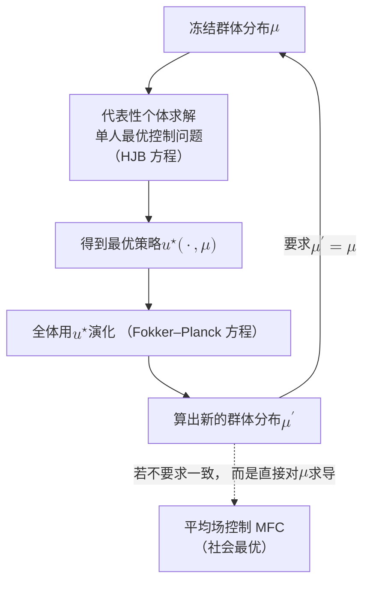

# 7 · 大群体极限：平均场

[第 6 章](06-learning-dynamics.md)问的是"一群人反复学习会走向哪里"，答案是一张相图：势博弈里有收敛的动力学，但你选的那个学习算法未必收敛。那一章的人数 $N$ 是固定的、不大的：两个基站、两条路。

本章把 $N$ 推到大。**人多到什么程度，问题反而变简单？**

这不是修辞。$N$ 个决策者的博弈，策略空间是 $N$ 个函数的笛卡尔积，均衡是一个 $N$ 维不动点。$N=3$ 就已经很难，$N=100$ 无从下手。但当 $N$ 大到每个个体只感受到"其余所有人的平均"时，$N$ 体问题会塌成一个代表性个体对一个分布的问题。这就是**平均场**（mean field）。塌下来之后，$N$ 从"维数"变成"一个出现在误差项里的参数"。

无线里到处是这个结构：

- 密集小区功控里，一个小区感受到的是几十上百个邻区功率的加权和。
- 海量随机接入里，一个终端感受到的是全网活跃度。
- 大规模星座调度里，一颗星感受到的是同波束覆盖内的总负载。

工程上大家早就在用"平均干扰""平均负载"这类量做设计。那就是平均场，只是没写成定理。

本章要立的东西有三样，而且全部算成数：

1. **MFG $\ne$ MFC 是 $O(1)$ 的。** 平均场有两个化身：平均场博弈（mean field game，MFG，各人自私，纳什）与平均场控制（mean field control，MFC，中央调度，社会最优）。它们一般不相等，而且这个差不随 $N\to\infty$ 消失。本章的算例 7.1 在一个能算到底的二次模型上给出：$u^{\mathrm{MFG}}=1.000$ 对 $u^{\mathrm{MFC}}=0.667$，代价差 12.5%，与 $N$ 无关。
2. **有限 $N$ 的修正是 $O(1/N)$ 或 $O(1/\sqrt N)$ 的。** 算例 7.2 给出同一模型里有限 $N$ 精确 Nash 的闭式，与平均场解的相对偏差是 $-\beta\lambda/[N(1+\lambda-\beta)]$，$N=100$ 时为 0.25%。算例 7.3 把三个尺度并排成表。
3. **平均场在无线规模下的有效人数不是 $N$。** 算例 7.4 考虑一个 $201\times201$ 的密集小区栅格（$N=40{,}400$）。路径损耗指数 $\alpha=3.7$ 时，干扰耦合的有效人数只有 $N_{\mathrm{eff}}\approx9.8$，涨落被低估了 64 倍，一个越限概率从 $10^{-15}$ 变成 21.7%。相边界是 $\alpha=2$。

把 1 和 2 混为一谈，是本章要防的最大误读，也是无线文献里"平均场近似很准"这句话最容易骗人的地方。平均场作为"$N$ 体纳什的近似"确实很准。但"纳什"本身离社会最优差 12.5%，而这个差跟 $N$ 一点关系都没有。

!!! note "本章预备知识"
    需要：一元二次函数的最小化、大数定律与中心极限定理、方差的线性组合公式、标准正态尾概率 $Q(z)$。不需要随机分析。本章把平均场做成**静态/单步**的版本，全程初等微积分；HJB–Fokker–Planck 那一对偏微分方程只在 7.2 节用一句话交代。

    用到的站内内容：

    - 团队问题（目标一致、信息分散）、Radner 定理（凸性 + 平稳性 $\Longrightarrow$ 人各最优即团队最优，定理 2.1）、分散化代价 3.02% / 8.00%（算例 2.2）：[第 2 章](02-team-decision-theory.md)。本章的 MFC 正是一个 $N\to\infty$ 的团队问题。
    - 相边界 $d\le p$（命题 3.8）：[第 3 章](03-information-structure-phase-diagram.md)。本章的"耦合局域性"是同一个"网络生成信息结构"命题的另一条轴。
    - 协调价签 $1-h(\epsilon)$、$\epsilon=0.1$ 对应 0.531 比特/时隙（命题 4.4）；"解概念决定话费的量级"（定理 4.6、4.7）：[第 4 章](04-coordination-information-theory.md)。本章 7.8 节会问：平均场把话费降到多少。
    - 参与比 $N_{\mathrm{eff}}=(\sum a_n^2)^2/\sum a_n^4$ 的构造：[第一部第 9 章](../part1/09-exchange-and-universality.md)（那里作用在多径幅度上）。本章 7.7 节把同一个构造搬到干扰权重上。
    - PoA / PoS / PoL 的价格家族：[第三部第 7 章](../part3/07-price-of-layering.md)与本部[第 8 章](08-network-games.md)。本章的"MFG/MFC 分歧比"就是 $N\to\infty$ 极限下的 PoA。

    **本部统一符号**：$N$ = 决策者数，$m$ = 动作数。平均场文献常用 $n$ 或 $N$ 记粒子数、用 $\mu$ 记群体分布，本章沿用 $N$ 与 $\mu$。

---

## 7.1 高峰期的地铁口：人多为什么反而简单 {#71-高峰期的地铁口人多为什么反而简单}

早高峰走出地铁闸机，前面是三个出口。你要选一个。

如果站里只有五个人，你会真的去看那四个人各自往哪走。他们的选择直接影响你的排队时间，你的选择也明显影响他们。这是一个五人博弈，每个人都要推测另外四个人的推测，层层套娃。

如果站里有五千人，你不会去看任何一个具体的人。你只看三个出口各自的人流密度，也就是一个分布。你对这个分布做最优反应，而这个分布是五千个人各自最优反应的叠加。你自己的选择对密度的影响是 $1/5000$，可以忽略。

这个"忽略"，就是平均场的全部内容。它换来两样东西：

- **降维**：五千人的联合策略塌成"一个代表性个体的策略 + 一个分布"。$N$ 从维数变成参数。
- **解耦**：个体之间不再直接互相看，只通过一个共同的中介量（密度）耦合。你不需要知道"张三往哪走"，只需要知道"多少比例的人往哪走"。

代价也有两样，本章的重点全在这里：

- **你忽略掉的 $1/5000$ 不是零。** 它带来一个有限 $N$ 的修正。这个修正多大，是本章 7.4、7.5 节的内容。
- **每个人都对密度做最优反应，不等于这个密度是最好的密度。** 五千人各自选最短的队，最终未必是总排队时间最小的配置。这是拥塞博弈的老故事，在平均场里它变成 MFG 与 MFC 的差。这个差跟人数没关系，$N=5000$ 和 $N=\infty$ 一样大。这是本章 7.3 节的内容，也是最容易被"$N$ 大所以近似很好"这句话盖住的东西。

!!! tip "直觉：三种"大 $N$ 极限"不是同一件事"
    工程师说"$N$ 很大所以可以用平均场"时，往往同时相信三件独立的事，而它们的成立条件完全不同：

    1. **经验分布收敛**（大数定律）：$\frac1N\sum_i\delta_{x_i}\to\mu$。需要弱耦合 + 交换可换性。这条通常对。
    2. **个体之间渐近独立**（传播混沌）：任取两个个体，它们的联合分布趋于乘积分布。需要 1，且耦合只通过经验分布。这条通常也对。
    3. **平均场解 $\approx$ 好的解**。需要 1、2，再加上"纳什就是你要的解"。这条经常错，而错的原因与 $N$ 无关。

    本章把 1 和 2 用一节讲完（7.2 节），把全部火力放在 3 上。

**小结**：一句可以量化的口号。人多让"求解"变简单（维数塌了），但不让"求得对"变容易（自私与最优的差不随人数消失）。剩下的工作是把"简单多少"与"差多少"分别算成数。

---

## 7.2 从 $N$ 体到平均场的两步 {#72-从-n-体到平均场的两步}

### 7.2.1 第一步：经验分布收敛（传播混沌） {#第一步经验分布收敛传播混沌}

先把"个体只感受到平均"写成模型。设有 $N$ 个决策者，个体 $i$ 的状态是 $x_i$（可以是位置、信道、队列长度），动作是 $u_i$。

!!! abstract "定义 7.1（平均场型耦合与经验分布）"
    记**经验分布**（empirical measure）

    $$
    \mu_N:=\frac1N\sum_{j=1}^{N}\delta_{x_j},
    $$

    其中 $\delta_x$ 是集中在 $x$ 的点质量。称一个 $N$ 体系统是**平均场型耦合**（mean-field coupling）的，若每个个体的动力学与代价只通过 $(x_i,u_i)$ 与**经验分布 $\mu_N$** 依赖于他人，即

    $$
    L_i=\ell(x_i,u_i,\mu_N),\qquad \dot x_i=b(x_i,u_i,\mu_N)+\sigma\,\dot W_i,
    $$

    且 $\ell,b$ 不依赖于 $i$（**对称性 / 交换可换性**）。

**这个定义在说什么**

先交代记号。$\dot x_i$ 是状态对时间的导数，$\sigma\dot W_i$ 是加在个体 $i$ 身上、彼此独立的白噪声扰动（$W_i$ 为布朗运动，$\sigma$ 为噪声强度）。7.3 节起的静态模型用不到它。

定义里有三个限制，缺一不可：

1. **只通过 $\mu_N$**：个体 $j$ 是"张三"还是"李四"无关紧要，只有"有多少比例的人处在状态 $x$"要紧。这是"匿名性"。
2. **$1/N$ 的权重**：$\mu_N$ 里每个人的权重都是 $1/N$，没有谁特别重要。这是"弱耦合"。
3. **函数 $\ell,b$ 与 $i$ 无关**：所有人用同一套规则。这是"同质性"。

7.7 节会逐条打破它们，看平均场在哪一条上先垮。

有了这个结构，第一步是纯概率论的：

!!! abstract "定理 7.1（传播混沌，Sznitman 1991 [5]）【已解决（经典）】"
    考虑平均场型耦合的 $N$ 个个体，初值 i.i.d. 于 $\mu_0$，噪声 $W_i$ 独立，系数 $b,\sigma,\ell$ 关于 $(x,\mu)$ Lipschitz（$\mu$ 上用 Wasserstein 距离）。固定所有个体使用同一个（关于 $\mu$ 的）反馈策略。则当 $N\to\infty$：

    1. 经验分布 $\mu_N(t)$ 依概率弱收敛到一个**确定性**的流 $\mu(t)$，$\mu(t)$ 是 McKean–Vlasov 方程（等价地，Fokker–Planck 方程）的解；
    2. 任取固定的 $k$ 个个体，它们的联合分布收敛到 $\mu(t)^{\otimes k}$，即**渐近独立同分布**。

    【表述待核：Lipschitz 条件的精确形式与收敛速率的页码，本站未直接打开原文 [5]。】

**定理里的几个术语**

- **Wasserstein 距离**度量两个概率分布相差多远：把一堆"沙子"（分布 $\mu$）搬成另一堆（分布 $\nu$）所需的最小平均搬运距离。
- **Lipschitz**：定理要求系数关于 $\mu$ Lipschitz，意思是群体分布挪动一点，个体受到的影响也只变一点。
- **McKean–Vlasov 方程**是"系数依赖于自身分布"的随机微分方程。代表性个体按 $b(x,u,\mu)$ 运动，而 $\mu$ 恰好是这个个体自己状态的分布。
- **Fokker–Planck 方程**是同一件事的群体视角。它不追踪单个个体，而写出状态密度随时间怎样流动、怎样被噪声抹开。
- **反馈策略**指按当前状态（和分布）决定动作的规则 $u_i=\phi(x_i,\mu_N)$。$\mu^{\otimes k}$ 是 $k$ 个相互独立、各自服从 $\mu$ 的个体的联合分布。
- **传播混沌**（propagation of chaos）里的"混沌"是统计物理的旧称，指"个体之间相互独立的无序状态"，"传播"是说初值的独立性在 $N\to\infty$ 时被动力学一直保持下去。它与[第 6 章](06-learning-dynamics.md)的动力学混沌（正 Lyapunov 指数）无关。

**物理意义**

这条定理是"平均场"这个词合法的概率基础，而且它给的东西比"大数定律"更强。大数定律只说"平均值收敛"，传播混沌说的是"个体之间的相关性被稀释掉了"。

为什么会稀释？因为个体 $i$ 影响个体 $j$ 只有一条通路：先影响 $\mu_N$（贡献 $1/N$），再由 $\mu_N$ 影响 $j$。走一趟就掉一个 $1/N$。$N$ 个人里任意两个人之间的"直接联系强度"是 $O(1/N)$，$k$ 个人两两之间共 $\binom k2$ 对，总相关性 $O(k^2/N)\to0$。

**行为分析**

三个极限值得记住：

- （i）$k$ 固定、$N\to\infty$：独立性成立。
- （ii）$k$ 与 $N$ 同阶（比如你关心"全部 $N$ 个人的联合分布"）：不成立。$\mu_N$ 与 $\mu$ 之间还差一个 $O(1/\sqrt N)$ 的中心极限型涨落，这是 7.5 节的主角。
- （iii）耦合不是 $1/N$ 权重，而是"只跟固定的 $k$ 个邻居耦合"：那条 $1/N$ 通路变成 $1/k$，不随 $N$ 变小，定理的结论整个失效。这是 7.7 节的主角。

### 7.2.2 第二步：固定点 {#第二步固定点}

传播混沌说的是"给定策略，群体分布怎么演化"。但策略本身是要解出来的，而每个人的最优策略又依赖于群体分布。于是有第二步，一个不动点：

*怎么读这张图：实线闭环是平均场博弈（MFG）的定义。先固定 $\mu$ 解单人问题（HJB 向后解），再把解出来的策略代回去算群体分布（FP 向前解），要求前后一致，这就是 MFG 系统的"HJB + FP 耦合"。*

*虚线岔出去的是平均场控制（MFC）：中央调度者不做这个一致性闭环，而是把 $\mu$ 当成自己能选的变量直接求导。两条路径的分岔点就在"$\mu$ 对我是给定的，还是我能动的"这一句话上。7.3 节会把这句话变成两个不同的数。*

MFG 系统可以用一句话说清：向后解一个 HJB 方程，给出个体的最优策略；向前解一个 Fokker–Planck 方程，给出群体的分布。两者首尾相接，构成一个耦合的边值问题。

这个系统由 Lasry–Lions 2007 [3] 提出。Huang–Caines–Malhamé 2006 [1] 把同一思路称为"纳什确定性等价"（Nash Certainty Equivalence，NCE）。系统的存在唯一性、收敛性与主方程的完整处理，见 Carmona–Delarue 的两卷专著 [8]。

本章不解这个偏微分方程组。静态版本就足以把三件事全部算清楚，而且不掉一分信息。

这里的 **HJB 方程**（Hamilton–Jacobi–Bellman）是动态规划在连续时间里的形态。[预备篇 8.3 节](../part0/08-reinforcement-learning.md)的 Bellman 方程说"一个状态的价值 = 这一步的收益 + 下一状态的价值"。把时间步长缩到零，就得到关于"从时刻 $t$、状态 $x$ 出发的最优剩余代价" $V(t,x)$ 的偏微分方程。

HJB 从终点时刻的已知代价出发往回算，所以叫"向后"。Fokker–Planck 方程从初始分布 $\mu_0$ 出发往前推，所以叫"向前"。一个知道终点，一个知道起点，而且彼此依赖（HJB 里含 $\mu$，FP 里含 HJB 解出的策略），这就是"耦合的边值问题"难解的原因。

### 7.2.3 静态版本：本章的工作模型 {#静态版本本章的工作模型}

去掉时间之后，HJB 退化成一次"对自己的动作求导令零"，Fokker–Planck 退化成"把所有人的动作取平均"。MFG 的固定点结构与 MFC 多出的那项导数都原样保留。群体分布在静态模型里只通过平均动作 $\bar u$ 进入代价。

!!! abstract "定义 7.2（静态平均场解：MFG 与 MFC）"
    设 $N$ 个决策者，动作 $u_i\in\mathbb{R}$，个体代价

    $$
    L_i(u_1,\dots,u_N)=\ell\big(u_i,\bar u\big),\qquad \bar u:=\frac1N\sum_{j=1}^{N}u_j.
    $$

    **平均场博弈解（MFG）** $u^{\mathrm{MFG}}$ 定义为下列两条的解：

    1. （最优反应）$u^{\mathrm{MFG}}\in\arg\min_{u}\ \ell(u,\bar m)$，其中 $\bar m$ 被视为**外生给定**；
    2. （一致性 / 固定点）$\bar m=u^{\mathrm{MFG}}$。

    **平均场控制解（MFC）** $u^{\mathrm{MFC}}$ 定义为

    $$
    u^{\mathrm{MFC}}\in\arg\min_{u}\ \ell(u,u),
    $$

    即在**对称配置的整条曲线上**最小化，$\bar u$ 随 $u$ 一起动。

**这个定义在说什么**

两个式子长得几乎一样，差别只有一处：MFG 里，$\bar m$ 在求导时是常数；MFC 里，$\bar u$ 在求导时跟着 $u$ 一起变。

用链式法则的语言：MFG 算的是**偏导数** $\partial_1\ell$，MFC 算的是**全导数** $\partial_1\ell+\partial_2\ell$。多出来的那一项 $\partial_2\ell$ 就是**外部性**（externality），即"我的动作对别人的影响"。自私的个体不把它记进账，社会调度者要记。

用地铁口的话说：MFG 是"每个人都去最短的队"，MFC 是"如果所有人同时改变行为，哪种配置总时间最短"。前者算的是"我多走一步的边际收益"，后者算的是"我多走一步给所有人加了多少边际拥堵"。

!!! warning "陷阱：MFC 不是"多了一个上帝"，而是"多了一项导数""
    很容易把 MFG 与 MFC 的差归因于"MFC 知道得更多"。这样想是错的。在本章 7.6 节的异质版本里，MFC 的调度者与 MFG 的个体拥有**完全相同的信息**（各自只知道自己的目标 $\theta_i$），MFC 依然不同于 MFG。差别在目标函数的导数里多了一项，不在信息里。

    这一点把本章与[第 2 章](02-team-decision-theory.md)接上了：MFC 就是一个 $N\to\infty$ 的 Marschak–Radner 团队问题（目标一致、信息分散），而 MFG 是同一信息结构下的博弈。两者之差是纯粹的"目标是否一致"，与"谁知道什么"无关。

    第 2 章算的是"信息分散要付多少钱"（分散化代价 3.02%），本章算的是"目标不一致要付多少钱"。两笔账在同一个模型上并列，才能看清哪笔更贵。

**小结**：平均场的两步已经拆干净。第一步（传播混沌）是概率论，把 $N$ 体的相关性稀释成独立。第二步（固定点）是博弈论，而且在这一步上分岔成 MFG 与 MFC 两条路。分岔的原因是一项导数，不是一份信息。

---

## 7.3 同一个模型，两个答案：MFG $\ne$ MFC 是 $O(1)$ 的 {#73-同一个模型两个答案mfg-ne-mfc-是-o1-的}

### 7.3.1 模型：功率军备竞赛 {#模型功率军备竞赛}

$N$ 个共信道的小基站，每个选一个**功率偏移** $u_i$（相对某个标称值，可正可负，单位任意但统一）。代价

$$
L_i=\big(u_i-\theta-\beta\bar u\big)^2+\lambda u_i^2,\qquad \bar u=\frac1N\sum_{j=1}^{N}u_j.
$$

三项的物理含义：

- $\theta$：**公共的性能目标**（例如达到某个 SINR 所需的名义功率），所有小区一样。
- $\beta\bar u$：**干扰跟随项**。别人平均功率越高，我的干扰底噪越高，我要达到同样的 SINR 就得把功率抬得更高。$\beta>0$ 时这是一个**策略互补**（strategic complements），典型的军备竞赛结构。
- $\lambda u_i^2$：**能耗罚项**。功率不是免费的。

约束：$\lambda>0$，$D:=1+\lambda-\beta>0$（否则军备竞赛发散，博弈没有有限解）。

这个模型的好处是每一步都能手算，而且三个参数各自对应一个可辨识的物理量。它的局限也要说清：它是静态、对称、一维、二次的。7.6、7.7 节会逐条检查这些假设在无线里成立到什么程度。

### 7.3.2 MFG 的解 {#mfg-的解}

!!! abstract "命题 7.2（静态 LQ 模型的 MFG 与 MFC 显式解）【本站演算】"
    在上述模型中，设 $\lambda>0$、$D=1+\lambda-\beta>0$。则

    $$
    u^{\mathrm{MFG}}=\frac{\theta}{1+\lambda-\beta},\qquad
    u^{\mathrm{MFC}}=\frac{\theta(1-\beta)}{(1-\beta)^2+\lambda},
    $$

    且对称配置下的每人代价分别为

    $$
    J^{\mathrm{MFG}}=\frac{\lambda(1+\lambda)\theta^2}{(1+\lambda-\beta)^2},\qquad
    J^{\mathrm{MFC}}=\frac{\lambda\theta^2}{(1-\beta)^2+\lambda}.
    $$

**证明（MFG，四步）**

**第 1 步（冻结平均）。** 把 $\bar u$ 换成外生常数 $\bar m$。个体 $i$ 的代价 $\ell(u_i)=(u_i-\theta-\beta\bar m)^2+\lambda u_i^2$ 是 $u_i$ 的二次函数，二阶导 $2+2\lambda>0$，严格凸，最小值由一阶条件唯一确定。

**第 2 步（一阶条件）。** 求导并令其为零：

$$
2\big(u_i-\theta-\beta\bar m\big)+2\lambda u_i=0
\ \Longrightarrow\ u_i(1+\lambda)=\theta+\beta\bar m
\ \Longrightarrow\ u_i=\frac{\theta+\beta\bar m}{1+\lambda}.
$$

这一步只用了"求导 = 0"，没有任何博弈论内容。注意 $\bar m$ 在这里是一个数，不是一个函数。

**第 3 步（固定点）。** 所有个体面对同一个 $\bar m$、用同一个规则，所以解是对称的。一致性要求 $\bar m$ 等于这个共同的解：

$$
\bar m=\frac{\theta+\beta\bar m}{1+\lambda}
\ \Longrightarrow\ \bar m(1+\lambda)-\beta\bar m=\theta
\ \Longrightarrow\ \bar m(1+\lambda-\beta)=\theta.
$$

**第 4 步（解出）。** $D=1+\lambda-\beta>0$ 保证可除，得 $u^{\mathrm{MFG}}=\theta/D$。$\blacksquare$

**证明（MFC，五步）**

这一次不能只看对称点，要先证对称点确实是全局最优。

**第 1 步（目标）。** 社会代价是

$$
J=\frac1N\sum_{i}\big[(u_i-\theta-\beta\bar u)^2+\lambda u_i^2\big]
$$

它是 $(u_1,\dots,u_N)$ 的二次型，是若干平方项的非负组合再加 $\lambda\|u\|^2/N$（$\lambda>0$），所以**严格凸**，驻点唯一且是全局最小。

**第 2 步（对每个分量求导）。** 记 $e_i:=u_i-\theta-\beta\bar u$。注意 $\partial\bar u/\partial u_k=1/N$，所以 $\partial e_i/\partial u_k=\mathbb{1}[i=k]-\beta/N$。这里 $i=k$ 时第一项取 1，否则取 0。

换句话说，$u_k$ 直接出现在自己的误差 $e_k$ 里，又通过 $\bar u$ 以 $\beta/N$ 的份额出现在每一个人的 $e_i$ 里。对 $J=\frac1N\sum_i(e_i^2+\lambda u_i^2)$ 逐项求导，得

$$
\frac{\partial J}{\partial u_k}=\frac2N\big[\sum_ie_i\,(\mathbb{1}[i=k]-\beta/N)+\lambda u_k\big]
$$

两边乘 $N/2$：

$$
\frac{N}{2}\cdot\frac{\partial J}{\partial u_k}
=\underbrace{e_k}_{\text{自己那一项}}\;\underbrace{-\;\frac{\beta}{N}\sum_{i=1}^{N}e_i}_{\text{我抬高 }\bar u\text{ 给所有人添的麻烦}}\;+\;\lambda u_k .
$$

中间那一项就是**外部性**。MFG 的一阶条件里没有它。

**第 3 步（引入平均）。** 记 $\bar e:=\frac1N\sum_ie_i=(1-\beta)\bar u-\theta$。一阶条件写成

$$
e_k+\lambda u_k=\beta\bar e\qquad(\forall k).
$$

右端与 $k$ 无关，左端 $e_k+\lambda u_k=u_k(1+\lambda)-\theta-\beta\bar u$ 中只有 $u_k$ 依赖于 $k$，所以所有 $u_k$ 相等。对称性是解出来的，不是假设的。记共同值为 $u$，则 $\bar u=u$，$\bar e=(1-\beta)u-\theta$。

**第 4 步（代入求解）。**

$$
\begin{aligned}
u(1+\lambda)-\theta-\beta u&=\beta\big[(1-\beta)u-\theta\big]\\
u\big(1+\lambda-\beta-\beta+\beta^2\big)&=\theta-\beta\theta\\
u\big[(1-\beta)^2+\lambda\big]&=\theta(1-\beta).
\end{aligned}
$$

第二行到第三行用了 $1-2\beta+\beta^2=(1-\beta)^2$。

**第 5 步。** $(1-\beta)^2+\lambda>0$ 恒成立（$\lambda>0$），所以 $u^{\mathrm{MFC}}=\theta(1-\beta)/[(1-\beta)^2+\lambda]$。$\blacksquare$

**代价的闭式**

对称配置下 $J(u)=\big[(1-\beta)u-\theta\big]^2+\lambda u^2$。

先看 MFC。记 $c:=1-\beta$，代入 $u^{\mathrm{MFC}}$，则 $cu^{\mathrm{MFC}}-\theta=\frac{c^2\theta}{c^2+\lambda}-\theta=-\frac{\lambda\theta}{c^2+\lambda}$，于是

$$
J^{\mathrm{MFC}}=\frac{\lambda^2\theta^2+\lambda c^2\theta^2}{(c^2+\lambda)^2}=\frac{\lambda\theta^2}{c^2+\lambda}
$$

这是"最小二乘 + 岭"问题的标准最小值。

再看 MFG。代入 $u^{\mathrm{MFG}}=\theta/D$ 得 $(1-\beta)\theta/D-\theta=-\lambda\theta/D$，故

$$
J^{\mathrm{MFG}}=\lambda^2\theta^2/D^2+\lambda\theta^2/D^2=\lambda(1+\lambda)\theta^2/D^2
$$

$\blacksquare$

**物理意义**

两个解的差别可以一眼看出来：

- MFG 的分母是 $1+\lambda-\beta$。$\beta$ 出现在分母里减号的位置，耦合越强，分母越小，功率越高，这就是军备竞赛。
- MFC 的分母是 $(1-\beta)^2+\lambda$。$\beta$ 出现在平方里，$\beta\to1$ 时分母不掉到零而是趋于 $\lambda$，分子却趋于零，所以社会最优的功率反而趋于零。

物理上完全说得通：当干扰跟随系数接近 1 时，"大家一起抬功率"是纯粹的自我抵消。理性的调度者应该让所有人一起降功率，因为抬功率只买到能耗，买不到 SINR。

**行为分析**

- **$\beta=0$（无耦合）**：$u^{\mathrm{MFG}}=u^{\mathrm{MFC}}=\theta/(1+\lambda)$，两者重合。没有外部性就没有分歧，这是本章最重要的退化检查。
- **$\beta\to1^-$**：$u^{\mathrm{MFG}}\to\theta/\lambda$（有限但大），$u^{\mathrm{MFC}}\to0$。分歧最大。
- **$\beta\to(1+\lambda)^-$**：$D\to0$，$u^{\mathrm{MFG}}\to\infty$，博弈解爆炸，而 $u^{\mathrm{MFC}}$ 依然有限且为负。这是"自私解不存在但社会最优存在"的区域，工程上对应"不加协调的功控发散"。
- **$\lambda\to\infty$（能耗极贵）**：两者都 $\to0$，分歧消失（谁也不敢发功率）。
- **$N$ 在哪里？** 不在任何一个式子里。这就是"$O(1)$ 效应"的确切含义：MFG 与 MFC 的差是两条不同的极限路径的差，不是有限 $N$ 的误差。

### 7.3.3 分歧比：一个闭式与一个不等式 {#分歧比一个闭式与一个不等式}

!!! abstract "命题 7.3（MFG/MFC 分歧比的闭式与其下界）【本站演算】"
    在命题 7.2 的模型中，定义**分歧比**（即 $N\to\infty$ 极限下对称配置的无序代价 PoA）

    $$
    \rho:=\frac{J^{\mathrm{MFG}}}{J^{\mathrm{MFC}}}
    =\frac{(1+\lambda)\big[(1-\beta)^2+\lambda\big]}{(1+\lambda-\beta)^2}.
    $$

    则 $\rho\ge1$，等号成立**当且仅当** $\beta=0$；且 $\rho\to\infty$ 当 $\beta\to(1+\lambda)^-$。

**证明（三步）**

**第 1 步（代入）。** 由命题 7.2，

$$
\rho=\frac{\lambda(1+\lambda)\theta^2}{D^2}\cdot\frac{(1-\beta)^2+\lambda}{\lambda\theta^2}
=\frac{(1+\lambda)\big[(1-\beta)^2+\lambda\big]}{D^2}.
$$

$\theta^2$ 与前面那个公共因子 $\lambda$ 约掉了，所以分歧比与目标水平 $\theta$ 无关。但 $\lambda$ 仍通过 $(1+\lambda)$ 与 $(1-\beta)^2+\lambda$ 留在式中。例如 $\beta=0.5$ 时，$\lambda=0.5$ 给 $\rho=1.125$，$\lambda=2$ 给 $\rho=1.080$。

**第 2 步（Cauchy–Schwarz）。** 取两个二维向量 $\mathbf{a}=(1,\sqrt\lambda)$ 与 $\mathbf{b}=(1-\beta,\sqrt\lambda)$。

选这两个向量，是因为它们的模方恰好是 $\rho$ 分子的两个因子：$\|\mathbf a\|^2=1+\lambda$，$\|\mathbf b\|^2=(1-\beta)^2+\lambda$。它们的内积是 $\langle\mathbf a,\mathbf b\rangle=(1-\beta)+\sqrt\lambda\cdot\sqrt\lambda=(1-\beta)+\lambda$。

Cauchy–Schwarz 不等式 $\langle\mathbf a,\mathbf b\rangle^2\le\|\mathbf a\|^2\|\mathbf b\|^2$ 给出

$$
\big[(1-\beta)+\lambda\big]^2\le(1+\lambda)\big[(1-\beta)^2+\lambda\big].
$$

**第 3 步（认出左端）。** 左端的 $(1-\beta)+\lambda=1+\lambda-\beta=D$，正是 $\rho$ 的分母。故 $\rho\ge1$。等号成立当且仅当 $\mathbf a\parallel\mathbf b$。两者的第二个分量都是 $\sqrt\lambda>0$，所以比例系数必为 1，于是 $1=1-\beta$，即 $\beta=0$。$\blacksquare$

**物理意义**

这个证明把"外部性造成损失"变成了一条几何陈述：MFG 与 MFC 的差就是向量 $(1,\sqrt\lambda)$ 与 $(1-\beta,\sqrt\lambda)$ 的**夹角**。

记夹角为 $\varphi$，则 $\cos\varphi=\langle\mathbf a,\mathbf b\rangle/(\|\mathbf a\|\|\mathbf b\|)$，于是 $\rho=1/\cos^2\varphi$，夹角为零时恰好 $\rho=1$。$\beta$ 是这两个向量第一分量的落差，$\lambda$ 是它们共有的第二分量。

夹角随 $\lambda$ 先增后减：

- $\lambda\to0$ 时两个向量都躺在横轴上，夹角为零。没有能耗罚，MFG 与 MFC 都把目标跟踪得毫无误差（$u=\theta/(1-\beta)$），分歧自然消失。
- $\lambda\to\infty$ 时两个向量都被第二分量拉向竖直方向，夹角又趋于零：谁都不敢发功率。
- 夹角最大、分歧最大的地方在 $\lambda=1-\beta$。$\beta=0.5$ 时它恰好就是本章的参数点 $\lambda=0.5$（$\rho=1.125$）。

所以能耗价格只在 $\lambda>1-\beta$ 这一侧起"协调"作用：再加价，自私解会向社会最优靠拢。在 $\lambda<1-\beta$ 一侧加价，分歧反而扩大。

**行为分析**

固定 $\lambda=0.5$，扫 $\beta$：

| $\beta$ | 0 | 0.2 | 0.4 | 0.5 | 0.6 | 0.8 | 1.0 | 1.2 |
|---|---|---|---|---|---|---|---|---|
| $u^{\mathrm{MFG}}$ | 0.667 | 0.769 | 0.909 | **1.000** | 1.111 | 1.429 | 2.000 | 3.333 |
| $u^{\mathrm{MFC}}$ | 0.667 | 0.702 | 0.698 | **0.667** | 0.606 | 0.370 | 0.000 | $-0.370$ |
| 分歧比 $\rho$ | 1.000 | 1.012 | 1.066 | **1.125** | 1.222 | 1.653 | 3.000 | 9.000 |

三行读出三件事：

1. $u^{\mathrm{MFG}}$ 单调上升（军备竞赛），$u^{\mathrm{MFC}}$ 先微升后掉头向下，并在 $\beta=1$ 处穿零。社会最优在强耦合下会要求所有人一起降到标称值以下。
2. 分歧比在 $\beta\le0.4$ 时只有百分之几，工程上可以不管。到 $\beta=0.8$ 已经 65%，到 $\beta=1$ 是 3 倍。
3. $\rho$ 在 $\beta=1+\lambda=1.5$ 处发散。

!!! example "算例 7.1（功率军备竞赛：MFG 与 MFC 的两个数）【本站演算】"
    取 $\theta=1$、$\beta=0.5$、$\lambda=0.5$（中等耦合、中等能耗罚）。$D=1+0.5-0.5=1$，$(1-\beta)^2+\lambda=0.25+0.5=0.75$。

    **MFG。**

    $$
    u^{\mathrm{MFG}}=\frac{1}{1}=1.000,\qquad
    J^{\mathrm{MFG}}=\big(0.5\times1-1\big)^2+0.5\times1^2=0.25+0.50=\mathbf{0.750}.
    $$

    **MFC。**

    $$
    u^{\mathrm{MFC}}=\frac{1\times0.5}{0.75}=\frac23=0.6667,\qquad
    J^{\mathrm{MFC}}=\Big(0.5\times\tfrac23-1\Big)^2+0.5\times\Big(\tfrac23\Big)^2=\tfrac49+\tfrac29=\tfrac23=\mathbf{0.6667}.
    $$

    **两个数。** 自私解的功率比社会最优高 50%（$1.000$ 对 $0.667$），代价高 12.5%（$0.750$ 对 $0.6667$，$\rho=1.125$）。

    这 12.5% 与 $N$ 无关：$N=10$、$N=10^4$、$N=\infty$，只要用平均场的记账方式，它都是 12.5%。

    作为对照，[第 2 章](02-team-decision-theory.md)算例 2.2 里"信息分散"的代价是 3.02%（$\eta^2=0.5,c=0.1$）到 8.00%（$\eta=1,c=1$）。在这个参数点上，"目标不一致"比"信息不共享"更贵。

    **校验**

    - **(i) 退化检查**：令 $\beta=0$，$u^{\mathrm{MFG}}=1/1.5=0.6667=u^{\mathrm{MFC}}=1\times1/1.5$，两式给出同一个数，$\rho=(1.5)(1.5)/1.5^2=1$。没有耦合就没有分歧，与命题 7.3 的等号条件一致。
    - **(ii) 把 MFC 解代回社会规划者的一阶条件**：$\frac{\mathrm d}{\mathrm du}\big[((1-\beta)u-\theta)^2+\lambda u^2\big]=2(1-\beta)\big[(1-\beta)u-\theta\big]+2\lambda u$。在 $u=2/3$ 处为 $2(0.5)(1/3-1)+2(0.5)(2/3)=-2/3+2/3=0$ ✓。在 $u=1$（MFG 解）处为 $2(0.5)(0.5-1)+2(0.5)(1)=-0.5+1=+0.5>0$，说明规划者想减小 $u$，方向与 $u^{\mathrm{MFC}}<u^{\mathrm{MFG}}$ 一致 ✓。
    - **(iii) 代价的第二条算法**：用闭式 $J^{\mathrm{MFC}}=\lambda\theta^2/[(1-\beta)^2+\lambda]=0.5/0.75=0.6667$ ✓，$J^{\mathrm{MFG}}=\lambda(1+\lambda)\theta^2/D^2=0.5\times1.5/1=0.750$ ✓，与直接代入数值一致。

!!! warning "陷阱：不要把 12.5% 说成"平均场近似的误差""
    12.5% 是**两个平均场解之间**的差，两个解各自都是 $N\to\infty$ 的精确答案。它衡量的是"自私 vs 协调"，不是"近似 vs 精确"。

    真正的"平均场近似误差"是下一节的东西，在同样的参数点上它是 0.25%（$N=100$），比 12.5% 小 50 倍。把两者混在一起，就会得出"$N$ 大所以平均场解已经足够好"这个错误结论。$N$ 大只保证你算出的纳什解准，不保证纳什解好。

**小结**：在一个能手算的模型上，我们得到了 MFG 与 MFC 的两个闭式、分歧比的闭式、一条用 Cauchy–Schwarz 两行证出的 $\rho\ge1$（等号 $\iff$ 无耦合），以及一组钉死的数字：功率高 50%、代价高 12.5%、与 $N$ 无关。

---

## 7.4 有限 $N$ 的精确 Nash：$1/N$ 的修正 {#74-有限-n-的精确-nash1n-的修正}

上一节的 MFG 解是在"我对 $\bar u$ 的影响可以忽略"的前提下算的。但在真实的 $N$ 体博弈里，我确实有 $1/N$ 的影响。把它捡回来，就得到**有限 $N$ 的精确 Nash 均衡**。

### 7.4.1 闭式与 $1/N$ 展开

!!! abstract "命题 7.4（有限 $N$ 对称 Nash 的闭式与 $1/N$ 展开）【本站演算】"
    在 7.3 节模型中，记 $a_N:=1-\beta/N$。若 $a_N(1-\beta)+\lambda>0$，则存在唯一的对称 Nash 均衡

    $$
    u^{(N)}=\frac{a_N\,\theta}{a_N(1-\beta)+\lambda},\qquad a_N=1-\frac{\beta}{N},
    $$

    且

    1. $u^{(1)}=u^{\mathrm{MFC}}$（单人博弈就是社会最优）；
    2. $\lim_{N\to\infty}u^{(N)}=u^{\mathrm{MFG}}$；
    3. 相对偏差的一阶展开

        $$
        \frac{u^{(N)}-u^{\mathrm{MFG}}}{u^{\mathrm{MFG}}}=-\frac{\beta\lambda}{N(1+\lambda-\beta)}+O\!\left(\frac1{N^2}\right).
        $$

**证明（五步）**

**第 1 步（正确的一阶条件）。** 个体 $i$ 把 $u_{-i}$ 当作固定，但知道 $\bar u=\frac1N\sum_ju_j$ 含有自己的 $u_i/N$。链式法则：

$$
\frac{\partial}{\partial u_i}\big(u_i-\theta-\beta\bar u\big)=1-\frac{\beta}{N}=a_N .
$$

于是

$$
\frac{\partial L_i}{\partial u_i}=2a_N\big(u_i-\theta-\beta\bar u\big)+2\lambda u_i=0 .
$$

二阶导 $2a_N^2+2\lambda>0$，故这是最小值。

**第 2 步（对称化）。** 所有个体的问题相同，寻找对称解 $u_i=u$，此时 $\bar u=u$：

$$
a_N\big[(1-\beta)u-\theta\big]+\lambda u=0 .
$$

**第 3 步（解出）。** 整理得 $u\big[a_N(1-\beta)+\lambda\big]=a_N\theta$，即闭式。分母的正性是解存在的条件。

**第 4 步（两个端点）。**

- $N=1$：$a_1=1-\beta$，代入得 $u^{(1)}=(1-\beta)\theta/[(1-\beta)^2+\lambda]=u^{\mathrm{MFC}}$ ✓。
- $N\to\infty$：$a_N\to1$，得 $\theta/[(1-\beta)+\lambda]=\theta/D=u^{\mathrm{MFG}}$ ✓。

**第 5 步（展开）。** 把 $u^{(N)}$ 看成 $a$ 的函数 $f(a)=a\theta/[a(1-\beta)+\lambda]$。商法则：

$$
f'(a)=\frac{\theta\big[a(1-\beta)+\lambda\big]-a\theta(1-\beta)}{\big[a(1-\beta)+\lambda\big]^2}=\frac{\theta\lambda}{\big[a(1-\beta)+\lambda\big]^2}.
$$

在 $a=1$ 处 $f'(1)=\theta\lambda/D^2$，而 $a_N-1=-\beta/N$，于是

$$
u^{(N)}-u^{\mathrm{MFG}}=f'(1)\cdot\Big(-\frac\beta N\Big)+O\!\left(\frac1{N^2}\right)=-\frac{\beta\theta\lambda}{ND^2}+O\!\left(\frac1{N^2}\right).
$$

除以 $u^{\mathrm{MFG}}=\theta/D$ 得第 3 条。$\blacksquare$

### 7.4.2 外部性是怎样被稀释的

**物理意义**

这个结果有三件事值得说。

第一，**$u^{(N)}<u^{\mathrm{MFG}}$，而且随 $N$ 单调上升**（因为 $f'>0$ 且 $a_N$ 随 $N$ 上升）。人越多，自私的解越"放肆"。原因很直白：$N$ 小的时候，我抬功率有 $1/N$ 的份额会打到我自己头上，我会克制。$N$ 大的时候这份自我惩罚被稀释，我就放开了。

第二，**$u^{(1)}=u^{\mathrm{MFC}}$ 不是巧合**，它是"外部性"这个概念的定义式。一个人的时候，"别人"就是自己，外部性内部化了，纳什等于社会最优。所以整条曲线 $N\mapsto u^{(N)}$ 就是外部性被稀释的过程，从 $u^{\mathrm{MFC}}$ 一路爬到 $u^{\mathrm{MFG}}$。

第三，分子里的 $\beta\lambda$ 说明修正需要两个条件同时成立：既要有耦合（$\beta\ne0$），又要有能耗罚（$\lambda\ne0$）。$\lambda=0$ 时 $f'(a)\equiv0$，$u^{(N)}=\theta/(1-\beta)$ 对所有 $N$ 相同，有限 $N$ 修正精确为零。这个退化情形很有教育意义："有限 $N$ 修正"的大小是代价函数曲率的性质，不是几何性质。

### 7.4.3 数值表：从 $N=1$ 到 $N=10^4$

!!! example "算例 7.2（有限 $N$ 的偏差：从 $N=1$ 到 $N=10^4$）【本站演算】"
    仍取 $\theta=1$、$\beta=0.5$、$\lambda=0.5$。$a_N=1-0.5/N$，分母 $=0.5a_N+0.5$。

    | $N$ | $a_N$ | 分母 | $u^{(N)}$ | 相对 $u^{\mathrm{MFG}}=1$ 的偏差 | 一阶预测 $-0.25/N$ |
    |---|---|---|---|---|---|
    | 1 | 0.5000 | 0.7500 | 0.66667 | $-33.33\%$ | $-25\%$（已失效） |
    | 2 | 0.7500 | 0.8750 | 0.85714 | $-14.29\%$ | $-12.5\%$ |
    | 5 | 0.9000 | 0.9500 | 0.94737 | $-5.263\%$ | $-5.0\%$ |
    | 10 | 0.9500 | 0.9750 | 0.97436 | $-2.564\%$ | $-2.5\%$ |
    | 100 | 0.9950 | 0.9975 | 0.99749 | $-0.2506\%$ | $-0.25\%$ |
    | 1000 | 0.9995 | 0.99975 | 0.99975 | $-0.02501\%$ | $-0.025\%$ |
    | $10^4$ | 0.99995 | 0.999975 | 0.999975 | $-0.002500\%$ | $-0.0025\%$ |

    一阶系数：$\beta\lambda/D=0.5\times0.5/1=0.25$，故相对偏差 $\approx-0.25/N$。

    **读法**

    $N=10$ 时平均场解已经只差 2.6%，$N=100$ 时差 0.25%，$N=10^4$ 时差 0.0025%。在无线关心的 $N=10^2$–$10^4$ 区间，"用平均场解代替有限 $N$ 纳什解"的误差在千分之几到十万分之几，好得几乎不需要讨论。

    **校验**

    - **(i) 端点恒等式**：$N=1$ 的值 $0.66667$ 与算例 7.1 独立算出的 $u^{\mathrm{MFC}}=2/3$ 逐位相同 ✓。这是两条完全不同的推导路径（一个是单人纳什，一个是 $N\to\infty$ 的社会规划）撞在同一个数上。
    - **(ii) 残差的阶**：一阶预测的误差为 $N=10$ 时 $0.0641$ 个百分点、$N=100$ 时 $0.000627$ 个百分点、$N=1000$ 时 $0.00000625$ 个百分点。相邻比值 $102.3$ 与 $100.2$，都约等于 $100=(10)^2$，确认残差是 $\Theta(1/N^2)$，与命题 7.4 第 3 条的 $O(1/N^2)$ 一致 ✓。
    - **(iii) 单调性与夹逼**：整列 $u^{(N)}$ 严格递增，且始终落在 $[u^{\mathrm{MFC}},u^{\mathrm{MFG}}]=[0.6667,1.0]$ 内 ✓，符合"外部性逐步稀释"的物理图像。

{ .chart loading=lazy }
{ .chart loading=lazy }

*怎么读这张图：横轴是 $\log_{10}N$，纵轴是把 $u^{\mathrm{MFG}}=1.000$ 归一化成 100% 之后的功率水平。中间那条平线是 MFG（$100\%$），底下那条平线是 MFC（$66.67\%$）。*

*爬升的那条是有限 $N$ 的精确 Nash $u^{(N)}$。它从 $N=1$ 处恰好落在 MFC 线上（外部性完全内部化），然后在两个数量级之内就贴上了 MFG 线。数据来自算例 7.2 的表（$\theta=1,\beta=0.5,\lambda=0.5$）。*

*这张图要看的是：两条平线之间那条 33 个百分点的鸿沟永远不会被填上。爬升的曲线趋向的是上面那条线，不是下面那条。*

**小结**：我们得到了有限 $N$ 纳什解的闭式、它在两端分别落到 MFC 与 MFG 上的恒等式，以及 $-\beta\lambda/(ND)$ 这个一阶系数。在无线规模上它是千分之几量级，比上一节的 12.5% 小两个数量级。两个效应的分离，到此已经是数字上的事实，不再是措辞。

---

## 7.5 涨落与 $\varepsilon$-Nash：$1/\sqrt N$ 从哪里来 {#75-涨落与-varepsilon-nash1sqrt-n-从哪里来}

上一节的模型是**确定性**的：所有人一样，$\bar u$ 精确等于共同值。现实里个体不一样，经验均值会涨落，而涨落的尺度是 $1/\sqrt N$。这才是文献里那个著名的 $O(1/\sqrt N)$ 的来源。

### 7.5.1 异质版模型 {#异质版模型}

把公共目标 $\theta$ 换成个体目标

$$
\theta_i=\theta+\xi_i,\qquad \xi_i\ \text{i.i.d.},\ \mathbb E[\xi_i]=0,\ \mathrm{Var}(\xi_i)=\sigma^2,
$$

$\xi_i$ 是个体 $i$ 的**私有信息**（例如本小区的负载、用户分布、阴影衰落偏置），别人不知道。代价

$$
L_i=\big(u_i-\theta_i-\beta\bar u\big)^2+\lambda u_i^2 .
$$

平均场策略仍然是"对期望的最优反应"：

$$
u_i^{\mathrm{MF}}=\frac{\theta_i+\beta m}{1+\lambda},\qquad m=\frac{\theta}{1+\lambda-\beta}=u^{\mathrm{MFG}},
$$

固定点方程与 7.3 节完全一样，因为取期望后 $\mathbb E[\theta_i]=\theta$。

记号提醒：

- 这里的 $m$ 是平均场下的群体平均功率，即定义 7.2 中 $\bar m$ 在固定点上的取值。它与本章预备知识框里"$m$ = 动作数"的本部统一符号无关，本章不再用到动作数。
- 这里的 $\sigma$ 是个体目标的异质性标准差，不是定义 7.1 里的噪声强度。

现在算**实际的**经验均值。所有人用 $u^{\mathrm{MF}}$：

$$
\bar u_N=\frac1N\sum_j\frac{\theta+\xi_j+\beta m}{1+\lambda}=m+\frac{\bar\xi_N}{1+\lambda},\qquad \bar\xi_N=\frac1N\sum_j\xi_j .
$$

记涨落 $\Delta_N:=\bar u_N-m=\bar\xi_N/(1+\lambda)$，则

$$
\mathbb E[\Delta_N]=0,\qquad \mathrm{Var}(\Delta_N)=\frac{\sigma^2}{N(1+\lambda)^2},\qquad
\mathrm{sd}(\Delta_N)=\frac{\sigma}{(1+\lambda)\sqrt N}.
$$

$1/\sqrt N$ 的唯一来源是中心极限定理。它不来自博弈论，而来自这样一件事：$N$ 个独立随机数的平均值，标准差是 $\sigma/\sqrt N$。

### 7.5.2 文献的 $\varepsilon$-Nash 定理 {#文献的-varepsilon-nash-定理}

!!! abstract "定理 7.5（$\varepsilon$-Nash：平均场解在有限 $N$ 博弈中的近似最优性；Huang–Caines–Malhamé 2006 [1]、2007 [2]；Lasry–Lions 2007 [3]）【已解决】"
    在标准的线性二次高斯（LQG）大群体随机动态博弈中（个体动力学线性、代价二次、噪声独立、耦合通过状态的经验均值、时长 $T$ 有限），设 $\{u_i^{\mathrm{MF}}\}$ 为由平均场（纳什确定性等价 NCE）系统给出的分散式策略。则它构成 $N$ 体博弈的 **$\varepsilon_N$-Nash 均衡**：对每个 $i$，

    $$
    J_i\big(u_i^{\mathrm{MF}},u_{-i}^{\mathrm{MF}}\big)\ \le\ \inf_{u_i}J_i\big(u_i,u_{-i}^{\mathrm{MF}}\big)+\varepsilon_N,
    $$

    其中 $\varepsilon_N\le C/\sqrt N$，常数 $C$ 依赖于模型的 Lipschitz 常数、时长 $T$、噪声强度与初值矩，**不依赖于 $N$**。

    **状态说明**

    定理本身【已解决】。$C$ 的显式表达式本站未能从原文取得（[1][2] 的全文均需付费）。能查到的二手转述，例如 Wang–Zhang–Fu–Liang 2022（arXiv:2206.05754）对经典平均场策略的复述，也只写 $\varepsilon=O(1/\sqrt N)$、不给常数，这一点【表述待核】。

    因此本章**不引用任何文献给出的"$N=100$ 时误差 $x\%$"**。下面的百分比全部在本章自设的模型上自己推导，标【本站演算】。

**物理意义**

这条定理是平均场的"回程票"。7.2 节的传播混沌是去程，从 $N$ 体走到极限。$\varepsilon$-Nash 是回程：把极限里算出来的策略拿回 $N$ 体博弈里用，问它离真最优差多少。没有回程票，平均场就只是一个漂亮的极限，不能用来做设计。

**行为分析**

$\varepsilon_N\le C/\sqrt N$ 是一个**上界**，而且是用 Lipschitz 型（一阶）估计得到的。

具体做法是：把"个体面对的实际均值"与"平均场均值"之差 $\|\Delta_N\|$ 用 $\mathbb E\|\Delta_N\|\le\sqrt{\mathbb E\|\Delta_N\|^2}=O(1/\sqrt N)$ 一记，再乘上代价对均值的 Lipschitz 常数。其中第一个不等号是一阶矩不超过二阶矩的平方根，即 Jensen 不等式。因 $\mathbb E[\Delta_N]=0$，右端就是上面算出的标准差。

这个记账方式没有用到"平均场策略恰好是对期望的最优反应"这个事实。下面这条命题说明：一旦把这个事实用上，在光滑代价下阶数会改善到 $1/N$。

### 7.5.3 在本章模型上把 $\varepsilon_N$ 算出来 {#在本章模型上把-varepsilon_n-算出来}

!!! abstract "命题 7.6（静态 LQ 上的两个尺度：策略偏差 $1/\sqrt N$、代价遗憾 $1/N$）【本站演算】"
    在上述异质模型中，设个体 $i$ **能观测到**实际的经验均值 $\bar u_N$（工程上即：能测到实际干扰水平），其余人使用平均场策略。则

    1. **策略偏差**（真最优反应与平均场策略之差）

        $$
        u_i^{\mathrm{BR}}-u_i^{\mathrm{MF}}=\frac{\beta\,\Delta_N}{1+\lambda},\qquad
        \mathrm{sd}\big(u_i^{\mathrm{BR}}-u_i^{\mathrm{MF}}\big)=\frac{\beta\sigma}{(1+\lambda)^2\sqrt N}=\Theta\!\left(\frac1{\sqrt N}\right);
        $$

    2. **代价遗憾**

        $$
        \varepsilon_N:=\mathbb E\big[L_i(u_i^{\mathrm{MF}})\big]-\mathbb E\big[L_i(u_i^{\mathrm{BR}})\big]
        =\frac{\beta^2\sigma^2}{N(1+\lambda)^3}=\Theta\!\left(\frac1N\right).
        $$

**证明（四步）**

**第 1 步（真最优反应）。** 给定观测到的 $\bar u_N$（忽略自身 $1/N$ 份额，那一项已在命题 7.4 里单独记过），个体 $i$ 最小化 $(u_i-\theta_i-\beta\bar u_N)^2+\lambda u_i^2$，一阶条件给出

$$
u_i^{\mathrm{BR}}=\frac{\theta_i+\beta\bar u_N}{1+\lambda}.
$$

**第 2 步（作差）。** 与 $u_i^{\mathrm{MF}}=(\theta_i+\beta m)/(1+\lambda)$ 相减，$\theta_i$ 精确抵消：

$$
u_i^{\mathrm{BR}}-u_i^{\mathrm{MF}}=\frac{\beta(\bar u_N-m)}{1+\lambda}=\frac{\beta\Delta_N}{1+\lambda}.
$$

代入 $\mathrm{sd}(\Delta_N)=\sigma/[(1+\lambda)\sqrt N]$ 得第 1 条。

**第 3 步（二次函数的遗憾公式）。** $L_i$ 作为 $u_i$ 的函数是二次的，二阶导恒为 $2(1+\lambda)$。对任何二次函数 $g$，若 $u^\star$ 是其最小点，则 $g(u)-g(u^\star)=\tfrac12g''\cdot(u-u^\star)^2=(1+\lambda)(u-u^\star)^2$。这一步是精确的，不是近似：二次函数的泰勒展开在二阶截断。

**第 4 步（取期望）。**

$$
\varepsilon_N=(1+\lambda)\,\mathbb E\Big[\Big(\frac{\beta\Delta_N}{1+\lambda}\Big)^{\!2}\Big]
=(1+\lambda)\cdot\frac{\beta^2}{(1+\lambda)^2}\cdot\frac{\sigma^2}{N(1+\lambda)^2}
=\frac{\beta^2\sigma^2}{N(1+\lambda)^3}. \qquad\blacksquare
$$

**物理意义**

两个阶数不同，而差别的原因非常干净：平均场策略是对 $\mathbb E[\bar u_N]$ 的最优反应，所以代价对涨落的一阶敏感度为零。数学上就是"在最小点处一阶导为零，误差从二阶开始"。

$1/\sqrt N$ 是涨落本身的尺度，$1/N$ 是涨落的平方。所以代价遗憾是策略偏差的平方。

**行为分析**

- **和定理 7.5 矛盾吗？** 不矛盾。定理 7.5 给的是上界 $C/\sqrt N$，本命题在一个光滑对称的特例上给出 $\Theta(1/N)$，比上界更好。上界不禁止某些模型更快收敛。
- **什么时候 $1/\sqrt N$ 才是真的？** 当"代价对涨落的一阶敏感度不为零"时。三种典型情形：
    - (i) 代价在最优点处**有折角**，如 $|\cdot|$ 型的绝对误差、$\max$ 型的最坏用户准则。
    - (ii) 动作是**离散**的（开/关、波束档位）。此时"最优反应"是一个阈值函数，涨落跨过阈值就整档跳。
    - (iii) 关心的不是平均代价而是**尾事件**（越限、掉话、时延违约）。这类量的尺度直接由 $\mathrm{sd}(\Delta_N)$ 定，即 $1/\sqrt N$。

    第 (iii) 种在无线里最常见，7.7 节的算例 7.4 会把它算成一个吓人的数。
- **一个量化对照。** 把代价的跟踪项从 $(\cdot)^2$ 换成 $|\cdot|$，遗憾变成 $\beta\,\mathbb E|\Delta_N|=\beta\sqrt{2/\pi}\,\sigma/[(1+\lambda)\sqrt N]$。来由分两步：
    1. 涨落把个体的跟踪误差平移了 $\beta\Delta_N$，而 $|\cdot|$ 在折角处对平移是一阶增长的，所以遗憾的量级是 $\beta|\Delta_N|$，不是它的平方。
    2. $\Delta_N$ 由中心极限定理近似高斯，高斯变量满足 $\mathbb E|Z|=\sqrt{2/\pi}\,\mathrm{sd}(Z)$，代入 $\mathrm{sd}(\Delta_N)$ 即得。

    取 $\beta=0.5,\sigma=0.3,\lambda=0.5,N=100$：折角情形 $7.98\times10^{-3}$，光滑情形 $6.67\times10^{-5}$，相差 120 倍，且随 $N$ 的衰减率从 $1/N$ 变成 $1/\sqrt N$。代价函数光不光滑，比 $N$ 大不大更能决定平均场准不准。

!!! success "【本站提法】三个尺度不可混"
    同一个平均场模型上，至少有三笔账，量纲相同但阶数完全不同：

    | 名称 | 度量的是 | 阶 | 本章参数下 $N=100$ 的值 |
    |---|---|---|---|
    | **MFG$-$MFC 分歧** | 自私 vs 社会最优 | $O(1)$，与 $N$ 无关 | $12.5\%$ |
    | **有限 $N$ 纳什偏差** | 自身 $1/N$ 份额被忽略 | $O(1/N)$ | $0.25\%$（策略） |
    | **涨落遗憾** | 经验均值的随机偏离 | $O(1/\sqrt N)$（策略）/ $O(1/N)$（光滑代价） | $2.0\%$（均值涨落 $\mathrm{sd}(\Delta_N)/m$；策略偏差是它的 $\beta/(1+\lambda)$ 倍，即 $0.67\%$）/ $0.0085\%$（代价） |

    据本站检索，把这三笔账在同一个显式模型上并排算成数、并指出前者与 $N$ 无关的写法未见先例【本站提法】。三条结论各自的来源都是经典的（分别是外部性、链式法则、中心极限定理）。本站的贡献是把它们放在一张表里，并把常数算出来。

**小结**：$1/\sqrt N$ 的出处是中心极限定理，不是博弈论。在光滑二次代价下，代价遗憾其实是 $1/N$ 而不是 $1/\sqrt N$，原因是平均场策略恰好是对期望的最优反应，一阶项消失。另有一条判据：只要代价有折角、动作离散、或你关心的是尾事件，$1/\sqrt N$ 就回来了，而且大 120 倍。

---

## 7.6 无线读法：$N=10^2$–$10^4$ 到底差多少 {#76-无线读法n102104-到底差多少}

现在把上面三笔账放进一个无线场景，把百分比算出来。

### 7.6.1 密集小区功控的百分比表

**先说明一点**

本站检索未取得任何无线平均场文献给出的"有限 $N$ 数值对照"：

- Tembine 等 GameNets 2009 [6] 给的是马尔可夫决策演化博弈的**弱收敛定理**，没有有限 $N$ 误差。
- Mériaux–Varma–Lasaulce Asilomar 2012 [7] 给的是能效 MFG 的框架与 illustrative 仿真，未见 $N$ 与近似误差的对照表。

文献给了框架，没给数。下面这张表是本站在自设模型上补的数。所有参数都写明，所有常数都依赖模型，所以它是量级，不是普适常数。

!!! example "算例 7.3（密集小区功控：三个尺度在 $N=10$–$10^4$ 的百分比表）【本站演算】"
    **参数（本站自设，写明来由）。** 沿用 7.3–7.5 节模型：

    - $\theta=1$：归一化的名义功率目标。
    - $\beta=0.5$：干扰跟随系数，取"邻区功率涨 1 dB、我要跟涨 0.5 dB"这一中等耦合。
    - $\lambda=0.5$：能耗罚与 SINR 跟踪罚同量级。
    - $\sigma=0.3$：个体目标的异质性标准差，取名义目标的 30%，对应小区间负载/阴影差异。

    平均场量：$m=u^{\mathrm{MFG}}=1.000$，$u^{\mathrm{MFC}}=0.6667$。含异质性的每人期望代价

    $$
    J^{\mathrm{MFG}}_\sigma=\frac{\lambda(1+\lambda)\theta^2}{D^2}+\frac{\lambda\sigma^2}{1+\lambda}=0.750+\frac{0.5\times0.09}{1.5}=0.750+0.030=0.780,
    $$

    $$
    J^{\mathrm{MFC}}_\sigma=\frac{\lambda\theta^2}{(1-\beta)^2+\lambda}+\frac{\lambda\sigma^2}{1+\lambda}=0.6667+0.030=0.6967 .
    $$

    多出来的 $\lambda\sigma^2/(1+\lambda)$ 这样来：

    1. 两种解的个体策略都是"共同值 $u$ + $\xi_i/(1+\lambda)$"。MF 策略见 7.5 节。MFC 的一阶条件 $u_k(1+\lambda)=\theta_k+\beta\bar u+\beta\bar e$ 同样给出 $\xi_k/(1+\lambda)$。
    2. 代入代价，跟踪误差变成 $[(1-\beta)u-\theta]-\frac{\lambda\xi_i}{1+\lambda}$，功率项变成 $\lambda\big(u+\frac{\xi_i}{1+\lambda}\big)^2$。
    3. 取期望时，交叉项因 $\mathbb E[\xi_i]=0$ 消失，两个平方项共贡献 $\frac{\lambda^2\sigma^2}{(1+\lambda)^2}+\frac{\lambda\sigma^2}{(1+\lambda)^2}=\frac{\lambda\sigma^2}{1+\lambda}$。这里略去了 $\bar u$ 自身涨落的影响，它对期望代价只贡献 $O(1/N)$。

    分歧比 $\rho_\sigma=0.780/0.6967=1.1196$，即 **11.96%**。异质性给两边加了同一个常数 $0.03$，把 12.5% 稀释到 11.96%。

    | $N$ | 有限 $N$ 纳什的功率偏差 | 经验均值涨落 $\mathrm{sd}(\Delta_N)/m$ | 涨落造成的代价遗憾 $\varepsilon_N/J^{\mathrm{MFG}}_\sigma$ | MFG$-$MFC 代价差 |
    |---|---|---|---|---|
    | 10 | $-2.564\%$ | $6.325\%$ | $0.0855\%$ | $\mathbf{11.96\%}$ |
    | $10^2$ | $-0.2506\%$ | $2.000\%$ | $0.00855\%$ | $\mathbf{11.96\%}$ |
    | $10^3$ | $-0.02501\%$ | $0.6325\%$ | $0.000855\%$ | $\mathbf{11.96\%}$ |
    | $10^4$ | $-0.00250\%$ | $0.2000\%$ | $0.0000855\%$ | $\mathbf{11.96\%}$ |

    计算式：

    - 第二列：$-\beta\lambda/[N D]\times100\%=-25/N$（%），精确值见算例 7.2。
    - 第三列：$\sigma/[(1+\lambda)\sqrt N]/m\times100\%=20/\sqrt N$（%）。
    - 第四列：$\beta^2\sigma^2/[N(1+\lambda)^3 J^{\mathrm{MFG}}_\sigma]\times100\%=0.8547/N$（%）。
    - 第五列：常数。

    **结论（三句）**

    1. "平均场解 $\approx$ 有限 $N$ 纳什解"这句话在无线规模上是对的，而且好得离谱：$N=100$ 时策略差 0.25%、代价遗憾 0.0086%。谁也不会为这个量级改设计。
    2. "平均场解 $\approx$ 好解"这句话在同一个参数点上错了 12%，而且这 12% 在表里是一条水平线，加多少小区都不会变。
    3. 因此"平均场在 $N=10^2$–$10^4$ 是好近似还是自欺"这个问题问错了。正确的问法是：你要近似的是哪个东西？近似纳什：极好。近似最优：差一个与 $N$ 无关的常数。

    **校验**

    - **(i) 三条不同幂律的自洽性**：
        - 从 $N=10$ 到 $N=100$，第二列应缩小 $10$ 倍。实测 $2.564/0.2506=10.23$，与 $1/N$ 律的 $10$ 一致，残差来自 $O(1/N^2)$ 项。
        - 第三列应缩小 $\sqrt{10}=3.162$ 倍。实测 $6.325/2.000=3.162$ ✓，逐位相符。
        - 第四列应缩小 $10$ 倍。实测 $0.0855/0.00855=10.00$ ✓。
        - 第五列应不变 ✓。

        四条列各按自己的幂律走，互不串味。
    - **(ii) 代价遗憾的第二条推导途径**：不用"曲率 $\times$ 偏差平方"，而直接代数展开。$L_i(u^{\mathrm{MF}})-L_i(u^{\mathrm{BR}})$ 中 $\theta_i$ 抵消后只剩 $\beta^2\Delta_N^2/(1+\lambda)$，取期望得 $\beta^2\sigma^2/[(1+\lambda)\cdot N(1+\lambda)^2]$，与命题 7.6 的 $\beta^2\sigma^2/[N(1+\lambda)^3]$ 逐字相同 ✓。
    - **(iii) 异质性项的守恒**：$\lambda\sigma^2/(1+\lambda)=0.03$ 在 $J^{\mathrm{MFG}}_\sigma$ 与 $J^{\mathrm{MFC}}_\sigma$ 中是同一个数，因为两种解的个体偏离都是 $\xi_i/(1+\lambda)$。异质性的处理方式相同，差别只在共同的平移量。由此 $\sigma\to0$ 时 $\rho_\sigma\to1.125$ ✓，$\sigma\to\infty$ 时 $\rho_\sigma\to1$（异质性淹没耦合）✓，两个极限都合理。

{ .chart loading=lazy }
{ .chart loading=lazy }

*怎么读这张图：三条线来自算例 7.3 的表。*

- *最上面那条水平线是 MFG 与 MFC 的代价差（11.96%），它是 $O(1)$ 的。横轴走三个数量级，它一动不动。*
- *中间那条从 6.32% 掉到 0.20% 的是经验均值的涨落，斜率对应 $1/\sqrt N$（每十倍 $N$ 掉 $\sqrt{10}=3.16$ 倍）。*
- *最下面那条从 2.56% 掉到几乎贴地的是有限 $N$ 纳什偏差，斜率对应 $1/N$（每十倍 $N$ 掉 10 倍）。*

*这张图就是本章的中心论点：两条会消失的线和一条不会消失的线，画在同一张纸上，不能混为一谈。*

### 7.6.2 另外三个场景 {#另外三个场景}

**海量随机接入。** $N$ 个终端各自决定"这一帧发不发"，每个终端感受到的是全网的活跃比例。这是标准的平均场型耦合，而且是真正全局的（所有人共用一个信道，权重精确是 $1/N$），是本章模型最贴合的场景。

分歧比在这里的物理含义是：自私的接入概率高于社会最优的接入概率，全网吞吐低于可达值。这与 slotted ALOHA 的经典结论同构，平均场只是把它推广到有状态、有信道的版本。

**大规模星座调度。** 一颗低轨卫星的可见用户与同波束干扰源随时间变化，但"同时可见的同频波束数"在统计上稳定。这里的 $N$ 不是星座总数（数千），而是同一时刻互相干扰的波束数（数十）。7.7 节会把这个区别变成一个定义。

**大量 agent 的资源竞价（边缘推理 / 语义通信）。** $N$ 个边缘节点向同一个推理服务竞价带宽或算力，每个节点的代价依赖于自己的出价与总出价（拥塞价格）。这就是 $\beta>0$ 的策略互补结构。此处的 MFG$-$MFC 差就是"竞价机制的效率损失"。

在 $\lambda>1-\beta$ 这一侧，它可以通过定价（相当于加大 $\lambda$）被压缩：命题 7.3 的几何图像给出 $\rho\to1$ 当 $\lambda\to\infty$。但在 $\lambda<1-\beta$ 一侧，加价反而会放大效率损失（见命题 7.3 的物理意义）。

**小结**：一张把三个尺度在 $N=10$–$10^4$ 上算成百分比的表（$0.25\%$ / $2.0\%$ / $12.0\%$ 三档），一条诚实声明（文献给框架、本站补数），以及一句可以直接用于设计评审的话：先问"你要近似的是纳什还是最优"，再问 $N$ 有多大。

---

## 7.7 平均场什么时候失效：有效人数不是 $N$ {#77-平均场什么时候失效有效人数不是-n}

定义 7.1 里有三个限制：匿名、$1/N$ 弱耦合、同质。逐条打破，看哪条最先致命。

### 7.7.1 打破同质：多类型平均场 {#打破同质多类型平均场}

若个体分成 $K$ 类（宏站/微站/毫米波站；不同厂商的 AI 模型），每类内部同质、类间不同，平均场依然成立。只是"一个分布"变成"$K$ 个分布"，固定点方程变成 $K$ 个方程的联立。

代价是维数从 1 涨到 $K$，但不是本质困难，只要 $K$ 固定而 $N\to\infty$。真正的困难是 $K$ 随 $N$ 增长（每个个体都不一样），此时不存在有限维的固定点。

### 7.7.2 打破匿名与 $1/N$：耦合是局部的 {#打破匿名与-1n耦合是局部的}

这一条是致命的，而且恰恰是无线的常态。

一个小区感受到的不是"全网平均功率"，而是**加权**的邻区功率和，权重按路径损耗衰减。写成

$$
v_i=\sum_{n\ne i}a_n\,u_n,\qquad a_n\ge0,\ \sum_n a_n=1 .
$$

平均场对应 $a_n\equiv1/N$。真实的 $a_n$ 是极不均匀的：最近的几个邻区占了绝大部分权重。

!!! abstract "定义 7.3（耦合的有效人数 $N_{\mathrm{eff}}$）【本站提法】"
    对归一化的耦合权重 $\{a_n\}_{n=1}^{N}$（$a_n\ge0$，$\sum_na_n=1$），定义

    $$
    N_{\mathrm{eff}}:=\frac{\big(\sum_na_n\big)^2}{\sum_na_n^2}=\frac{1}{\sum_na_n^2}.
    $$

    称之为**耦合的有效人数**。

**这个定义在说什么**

它是**参与比**（participation ratio）。同一个构造在[第一部第 9 章](../part1/09-exchange-and-universality.md)被用在多径幅度上（那里写成 $(\sum a_n^2)^2/\sum a_n^4$，作用在幅度平方上），这里作用在耦合权重上。它的操作意义只有一句话：

> 如果 $u_n$ 是方差为 $\sigma_u^2$ 的独立随机变量，那么 $\mathrm{Var}(v_i)=\sigma_u^2\sum_na_n^2=\sigma_u^2/N_{\mathrm{eff}}$。

也就是说，在涨落这件事上，一个权重不均匀的 $N$ 人系统，等价于一个权重均匀的 $N_{\mathrm{eff}}$ 人系统。7.5 节所有含 $N$ 的公式，只要把 $N$ 换成 $N_{\mathrm{eff}}$ 就依然成立。

三个立即的检查：

- 均匀权重 $a_n=1/N$ 给 $N_{\mathrm{eff}}=1/(N\cdot N^{-2})=N$。
- 只有一个邻居 $a_1=1$ 给 $N_{\mathrm{eff}}=1$。
- 两个等权邻居给 $N_{\mathrm{eff}}=2$。

都对。

### 7.7.3 幂律耦合与 $\alpha=2$ 相边界

!!! abstract "命题 7.7（幂律耦合下的有效人数与 $\alpha=2$ 相边界）【本站演算】"
    设小区排布在二维栅格上（间距归一化为 1），耦合权重按路径损耗幂律 $a_n\propto d_n^{-\alpha}$，$d_n$ 为归一化距离，$\alpha>1$。取 $L$ 层邻居（$N=(2L+1)^2-1$）。则当 $L\to\infty$：

    1. $\alpha>2$：$\sum_nd_n^{-\alpha}$ 与 $\sum_nd_n^{-2\alpha}$ **都收敛**，故 $N_{\mathrm{eff}}$ **有界**，与 $N$ 无关；
    2. $\alpha=2$：分子对数发散，$N_{\mathrm{eff}}=\Theta\big(\ln^2N\big)$；
    3. $1<\alpha<2$：$N_{\mathrm{eff}}=\Theta\big(N^{\,2-\alpha}\big)\to\infty$。

    **$\alpha=2$ 是平均场适用性的相边界。**

**证明（三步）**

**第 1 步（把和化成积分）。** 二维栅格上距离在 $[r,r+\mathrm dr)$ 的格点数 $\approx2\pi r\,\mathrm dr$。每个格点"占"一块面积为 1 的单位方格，所以一个区域里的格点数约等于它的面积，而半径 $r$、宽 $\mathrm dr$ 的圆环面积是 $2\pi r\,\mathrm dr$。例如 $10\le d<11$ 的格点实有 68 个，圆环面积 $\pi(11^2-10^2)\approx66.0$。

把正方形 $[-L,L]^2$ 近似成半径 $L$ 的圆盘，只改变常数因子。下文的 $\asymp$ 表示两边之比在 $L\to\infty$ 时夹在两个正常数之间，即同阶。于是

$$
S_1:=\sum_{n}d_n^{-\alpha}\asymp\int_1^{L}r^{-\alpha}\cdot2\pi r\,\mathrm dr=2\pi\int_1^{L}r^{1-\alpha}\mathrm dr,
$$

$$
S_2:=\sum_{n}d_n^{-2\alpha}\asymp2\pi\int_1^{L}r^{1-2\alpha}\mathrm dr .
$$

**第 2 步（判敛）。** $\int^\infty r^{1-\alpha}\mathrm dr$ 收敛 $\iff1-\alpha<-1\iff\alpha>2$。$\int^\infty r^{1-2\alpha}\mathrm dr$ 收敛 $\iff\alpha>1$。所以在 $\alpha>1$ 的全部范围内 $S_2$ 收敛，而 $S_1$ 在 $\alpha=2$ 处换相。

**第 3 步（代入）。** 归一化权重是 $a_n=d_n^{-\alpha}/S_1$，于是 $\sum_na_n^2=S_2/S_1^2$，由定义 7.3 得 $N_{\mathrm{eff}}=S_1^2/S_2$。

换算到 $N$ 时只需记住 $N=(2L+1)^2-1\asymp L^2$，所以 $L^{2(2-\alpha)}=(L^2)^{2-\alpha}=\Theta(N^{2-\alpha})$，$\ln L=\tfrac12\ln N+O(1)$。分三种情形：

- $\alpha>2$：分子分母都是常数，$N_{\mathrm{eff}}=O(1)$。
- $\alpha=2$：$S_1\asymp2\pi\ln L$，$N_{\mathrm{eff}}\asymp(2\pi\ln L)^2/S_2=\Theta(\ln^2L)=\Theta(\ln^2N)$（因 $N\asymp4L^2$）。
- $1<\alpha<2$：$S_1\asymp\frac{2\pi}{2-\alpha}L^{2-\alpha}$，$N_{\mathrm{eff}}\asymp cL^{2(2-\alpha)}=\Theta(N^{2-\alpha})$。

$\blacksquare$

**物理意义**

$\alpha=2$ 就是**自由空间**的路径损耗指数。这条相边界说的是：

> 只有当干扰衰减不快于自由空间时，"远处无数个弱干扰源的总和"才能压过"近处几个强干扰源"，平均场才是渐近精确的。任何比自由空间更快的衰减（也就是几乎所有真实的地面部署），干扰都由最近的少数几个邻区支配，有效人数被钉死在一个常数上，加多少小区都不会涨。

这句话在随机几何里以另一种形式是常识（"干扰由最近邻支配"）。本站的贡献是把它写成平均场适用性的判据，并给出 $N_{\mathrm{eff}}$ 这个可直接代入 7.5 节全部公式的标量【本站提法】。

**行为分析**

$\alpha$ 的典型值：

- 自由空间：2.0。
- 视距城市峡谷：2.0–2.5。
- 3GPP 城市微蜂窝非视距：约 3.67（$36.7\log_{10}d$）。
- 密集城区非视距：3.5–4.0。
- 室内穿墙：可达 4–5。

全部落在相边界的"坏"一侧。

### 7.7.4 算例：四万个小区，有效人数不到十个

!!! example "算例 7.4（$201\times201$ 密集小区栅格：$N=40{,}400$ 但 $N_{\mathrm{eff}}\approx9.8$）【本站演算】"
    栅格 $L=100$（即 $201\times201$ 减去中心），$N=201^2-1=40{,}400$。权重 $a_n\propto d_n^{-\alpha}$，$d_n=\sqrt{i^2+j^2}$，$(i,j)\in[-100,100]^2\setminus\{(0,0)\}$。数值求和：

    | $\alpha$ | $N_{\mathrm{eff}}$ | $1/\sqrt{N_{\mathrm{eff}}}$ | 局部均值涨落 $\mathrm{sd}/m$ | 涨落代价遗憾 |
    |---|---|---|---|---|
    | 1.5 | 1690.7 | 0.0243 | $0.49\%$ | $0.0005\%$ |
    | 2.0 | 172.5 | 0.0761 | $1.52\%$ | $0.0050\%$ |
    | 2.5 | 38.78 | 0.1606 | $3.21\%$ | $0.0220\%$ |
    | 3.0 | 17.30 | 0.2404 | $4.81\%$ | $0.0494\%$ |
    | **3.7** | **9.82** | **0.3191** | $\mathbf{6.38\%}$ | $0.0870\%$ |
    | 4.0 | 8.48 | 0.3433 | $6.87\%$ | $0.1008\%$ |

    后两列用算例 7.3 的参数 $\sigma=0.3,\lambda=0.5,\beta=0.5,J^{\mathrm{MFG}}_\sigma=0.780$，把 7.5 节公式里的 $N$ 换成 $N_{\mathrm{eff}}$。

    **三个数**

    1. $\alpha=3.7$ 时 $N_{\mathrm{eff}}=9.82$。四万个小区，有效人数不到十个。
    2. 天真地用 $N=40{,}400$ 会把涨落标准差低估 $\sqrt{40400/9.82}=\mathbf{64.1}$ 倍。
    3. 权重集中度：最强的 4 个邻区占总耦合权重的 61.1%，最强的 8 个占 78.1%，最强的 12 个占 82.8%。$N_{\mathrm{eff}}\approx10$ 与"十来个邻区说了算"的工程直觉完全吻合。

    **一个吓人的推论：越限概率**

    设网络规划要求实际干扰水平不超过平均场预测值的 $1+\tau$，取 $\tau=5\%$。越限概率是 $\Pr[\Delta>\tau m]=Q\big(\tau m/\mathrm{sd}(\Delta)\big)$。

    这里把 $\Delta$ 当作零均值高斯，$\xi_i$ 服从高斯分布时这是精确的。$Q(z)$ 是标准正态的右尾概率，见[预备篇第 3 章](../part0/03-digital-communications.md)。

    | 用哪个人数 | $\mathrm{sd}(\Delta)/m$ | $z=0.05/(\mathrm{sd}/m)$ | 越限概率 |
    |---|---|---|---|
    | 天真 $N=10^3$ | $0.632\%$ | 7.91 | $1.3\times10^{-15}$ |
    | 天真 $N=10^4$ | $0.200\%$ | 25.0 | $<10^{-100}$ |
    | **正确 $N_{\mathrm{eff}}=9.82$** | $\mathbf{6.38\%}$ | **0.783** | $\mathbf{21.7\%}$ |

    用错人数，一个"永远不会发生"的事件变成"五次里有一次"，差了十几个数量级。这属于命题 7.6 行为分析里第 (iii) 类情形：尾事件的尺度由 $1/\sqrt{N_{\mathrm{eff}}}$ 直接定，没有平方来救。

    **校验**

    - **(i) 均匀权重退化**：把同一段求和代码的权重换成 $a_n=1/N$，得 $N_{\mathrm{eff}}=N$ 逐位相同（$N=10,100,1000$ 分别给 $10.000,100.00,1000.0$）✓，说明定义 7.3 的归一化没有写错。
    - **(ii) 恒等式复核**：$\alpha=3.7$ 时直接算 $\sum_na_n^2=0.101822$，而 $1/N_{\mathrm{eff}}=1/9.8210=0.101822$ ✓。两条路径（先算比值 vs 先算平方和）逐位一致。
    - **(iii) 收敛性检查（相边界的直接验证）**：把 $L$ 从 3 加到 100（$N$ 从 48 涨到 40400，近 1000 倍），$\alpha=3.7$ 的 $N_{\mathrm{eff}}$ 只从 8.77 涨到 9.82（涨 12%）。这是饱和，与命题 7.7 第 1 条一致。同一区间内，$\alpha=2.0$ 的 $N_{\mathrm{eff}}$ 从 21.5 涨到 172.5，$\alpha=1.5$ 的从 29.7 涨到 1690.7（涨 57 倍，接近 $\sqrt{1000}=31.6$ 与 $L$ 的线性律之间）。三种 $\alpha$ 各自走命题 7.7 预言的三条不同规律 ✓。

### 7.7.5 相图 {#相图}

{ .chart loading=lazy }
{ .chart loading=lazy }

*怎么读这张图：横轴是命题 7.7 与定义 7.3 给出的可计算量，即 $N_{\mathrm{eff}}$ 是否随 $N$ 增长。纵轴是类型数是否随 $N$ 增长。四个象限的含义如下。*

- *右下（第四象限）是经典平均场的正确战场：定理 7.1 的传播混沌与定理 7.5 的 $\varepsilon$-Nash 都在这里成立。*
- *左下需要按图重做（图上博弈 / graphon 极限）。*
- *右上只是维数上涨。*
- *左上两条都破，没有现成理论。*

*三个系统点的位置来自本章的计算。海量随机接入的权重精确是 $1/N$（最右）。密集小区功控由算例 7.4 定位在 $N_{\mathrm{eff}}\approx9.8$（最左）。多厂商 AI 空口两侧模型的"类型数"是厂商数与模型版本数的乘积，随部署规模增长，故置于最上。*

*这张图与[第 3 章](03-information-structure-phase-diagram.md)的信息结构相图是同一句话的两个切面：网络拓扑决定信息结构，也决定耦合结构。*

### 7.7.6 三尺度分解的猜想

!!! abstract "猜想 7.8（无线平均场的三尺度分解判据）【开放·本站提法】"
    对一个 $N$ 体、耦合权重 $\{a_{in}\}$、类型数 $K$ 的网络化决策问题，令

    $$
    N_{\mathrm{eff}}:=\min_i\frac{\big(\sum_na_{in}\big)^2}{\sum_na_{in}^2},
    $$

    并设代价关于动作二阶连续可微、且平均场策略是对期望的最优反应。猜想存在只依赖于代价的曲率与 Lipschitz 常数的常数 $C_1,C_2,C_3$，使得用平均场策略在真实网络中运行时，与真实 $N$ 体纳什的偏离满足

    $$
    \underbrace{\text{代价遗憾}}_{\le\,C_1/N_{\mathrm{eff}}}\;+\;\underbrace{\text{自身份额修正}}_{\le\,C_2\max_ia_{ii}}\;\;\text{（策略偏差为 }\Theta(N_{\mathrm{eff}}^{-1/2})\text{）},
    $$

    而与**社会最优**的偏离另有一项 $\rho-1$，**与 $N$、$N_{\mathrm{eff}}$、$K$ 全部无关**，只由代价的外部性结构决定。

    式中 $a_{ii}$ 是个体 $i$ 自己的动作在它所感受的耦合量里占的权重。在 7.4 节的全局模型里，它就是 $\bar u$ 中自己的那一份 $1/N$，对应命题 7.4 的 $O(1/N)$ 修正。

    **已知的边界**

    本章命题 7.4、7.6、7.7 在一维静态二次模型上把三项全部算成闭式，$C_1=\beta^2\sigma^2/(1+\lambda)^3$、$\rho-1$ 由命题 7.3 给出。定理 7.5 给了动态 LQG 下第一项的 $C/\sqrt N$ 上界 [1][2]（一阶记账）。

    **未知的部分**：

    - (i) 动态、多维、非二次情形下，"光滑代价把 $1/\sqrt N$ 改善到 $1/N$"是否仍成立、需要什么条件。
    - (ii) $N_{\mathrm{eff}}$ 能否严格地替换定理 7.5 中的 $N$。本章只在静态模型上验证了方差替换是精确的。动态情形下权重会随时间传播（$k$ 跳之后的有效邻域会变大），是否要用"多跳有效人数"未知。
    - (iii) 类型数 $K$ 进入常数的方式。

    **第一步可证的引理**

    在两类型（宏站/微站）、一维静态、权重按类内类间两档取值的模型上，把三项全部算成闭式，验证 $N_{\mathrm{eff}}$ 是否仍然是唯一进入误差项的人数量。这个模型只有五个参数，可以完全手算。

    **为什么值得做**

    它是[第 9 章](09-research-agenda.md)"协同增益 scaling law"那条缺失定理的一半。那条定理要问的是"$N$、通信预算 $B$、耦合度 $\kappa$ 三者如何决定协作增益的天花板"，而本章给出了"$N$"这一维的正确刻度不是 $N$ 而是 $N_{\mathrm{eff}}$。

    剩下的一半（$B$ 与 $\kappa$）分别在[第 4 章](04-coordination-information-theory.md)与[第 8 章](08-network-games.md)。读这两章与第 9 章时注意记号：本章的 $\alpha$ 是路径损耗指数（$\alpha=2$ 为自由空间），第 8、9 章 Wyner 线性模型里的 $\alpha\in(0,1)$ 是相邻小区的泄漏比，两者不是同一个量。

!!! warning "陷阱：$N_{\mathrm{eff}}$ 小不等于平均场"没用""
    算例 7.4 的表里，$\alpha=3.7$ 的**代价遗憾**只有 $0.087\%$。即使有效人数只有 9.8，光滑代价下的平均场近似依然很准。真正被 $N_{\mathrm{eff}}$ 打穿的是**尾事件**（21.7% 的越限概率）与**折角代价**。

    所以正确的结论不是"密集小区不能用平均场"，而是：平均场可以用来算平均代价，不能用来算越限概率、掉话率、时延违约率这些尾指标，除非把 $N$ 换成 $N_{\mathrm{eff}}$。这是一条可以直接写进设计规范的话，而它的全部内容就是定义 7.3 的一个标量。

**小结**：我们得到了一个可计算的判据 $N_{\mathrm{eff}}$（定义 7.3），一条相边界 $\alpha=2$（命题 7.7），一个把四万小区打回九点八人的数字（算例 7.4），一个差十几个数量级的越限概率对照，以及一条把三个尺度写成猜想的分解式（猜想 7.8）。

---

## 7.8 场景与方法盘点：谁解决了什么，谁答不上来 {#78-场景与方法盘点谁解决了什么谁答不上来}

### 7.8.1 路标 {#路标}

**平均场从概率论走到无线：六个路标与一个空白**

| 年份 | 工作 | 要点 |
|---|---|---|
| 1991 | Sznitman 传播混沌讲义 | 经验测度收敛与渐近独立（概率论基础） |
| 2006 | Huang–Caines–Malhamé 纳什确定性等价 | $\varepsilon$-Nash，$\varepsilon = O(1/\sqrt{N})$ |
| 2007 | Lasry–Lions 平均场博弈 | HJB + Fokker–Planck 耦合系统 |
| 2009 | Tembine 等 马尔可夫决策演化博弈 | 无线里的弱收敛定理（无有限 $N$ 误差） |
| 2012 | Mériaux–Varma–Lasaulce 无线能量平均场博弈 | 功控/能效框架（illustrative 仿真） |
| 2013 | Carmona–Delarue–Lachapelle MFG vs MFC | 两条极限路径给出不同的解 |
| 2026 | 本站 | 三个尺度算成数 + 有效人数 $N_{\mathrm{eff}}$ + $\alpha=2$ 相边界 |

*怎么读这张表：从上到下是"从概率论到博弈论到无线"的三段。*

- *1991 与 2006–2007 是骨架（传播混沌 + 固定点 + 回程票）。*
- *2013 是本章的反差（MFG $\neq$ MFC）。*
- *2009 与 2012 是无线侧的两次搬运。注意它们都停在"框架"层面：Tembine 等给的是弱收敛定理（$N\to\infty$，没有有限 $N$ 误差），Mériaux 等给的是能效增益的示意仿真。*

*"$N=10^2$–$10^4$ 时误差多大"这一格在文献侧是空的，本章算例 7.3、7.4 补的正是这一格。表中的年份与归属来自本章参考文献 [1][3][5][4][6][7]。*

### 7.8.2 四个当代场景各自缺什么 {#四个当代场景各自缺什么}

| 场景 | 平均场给了什么 | 答不上来的部分 | 落点 |
|---|---|---|---|
| **密集小区功控 / ICIC**（小区间干扰协调，见[预备篇第 6 章](../part0/06-wireless-networks.md)） | 一个可解的对称固定点，功控发散条件 $\beta<1+\lambda$ | 干扰是局部的，$N_{\mathrm{eff}}\approx10$；尾指标（越限、掉话）被低估几个数量级 | 猜想 7.8(ii)：$N_{\mathrm{eff}}$ 能否严格替换定理 7.5 的 $N$ |
| **海量随机接入 / RedCap**（3GPP 定义的低能力、低成本终端） | 耦合精确是 $1/N$，本章模型最贴合；MFG$-$MFC 差 = 接入机制的效率损失 | 动作是离散的（发/不发），命题 7.6 的光滑性假设破裂，$1/\sqrt N$ 回来 | 折角/离散动作下 $\varepsilon_N$ 的精确阶【开放】 |
| **AI 空口两侧模型（CSI 压缩、波束管理）** | 若所有 UE 用同一模型，"UE 群体"是一个平均场 | 多厂商 = 类型数随部署增长（相图左上角）；且两侧模型的不一致本身是[第 5 章](05-shared-world-model.md)的 KL 罚项，不是平均场能处理的量 | 相图左上区无理论 |
| **边缘推理 / 语义通信的算力竞价** | 拥塞价格是标准的平均场耦合；定价（加大 $\lambda$）按命题 7.3 把 $\rho\to1$ | 需求异质且有时间相关（不独立），中心极限定理的 $1/\sqrt N$ 要换成相关序列的版本 | 相关涨落下的 $N_{\mathrm{eff}}$【开放】 |

### 7.8.3 方法谱系 {#方法谱系}

**平均场博弈 / 控制（MFG / MFC）**

- *解决了*：把 $N$ 体的维数灾难塌成一个固定点；给出回程票（定理 7.5）；把"自私 vs 协调"的差写成两个可比的解。
- *回答不了*：耦合局域时（$N_{\mathrm{eff}}=O(1)$）整套论证的前提破裂；类型数随 $N$ 增长时不存在有限维固定点；有限 $N$ 误差的常数在无线模型上没有人算过（本章补的就是这一格）。

**图上博弈 / graphon 极限**

- *解决了*：当耦合有图结构、且图有稠密极限时，把 $N$ 体塌成"图子（graphon）上的连续体博弈"，这是相图左下区的正确工具。
- 图子是稠密图序列的极限对象：一个对称函数 $W:[0,1]^2\to[0,1]$，$W(x,y)$ 读作"位置 $x$ 的个体与位置 $y$ 的个体之间的连接概率（或耦合强度）"。平均场相当于 $W$ 取常数的特例。
- *回答不了*：无线的干扰图是**稀疏**的（$N_{\mathrm{eff}}=O(1)$，度不随 $N$ 增长），而 graphon 极限刻画的是稠密图。稀疏图的极限理论要另起炉灶。
- 原始文献：静态的图子博弈见 Parise–Ozdaglar [9]，它证明图子均衡能逼近从图子抽样得到的大网络博弈的均衡。动态的图子平均场博弈见 Caines–Huang [10]，给出 GMFG 方程的存在唯一性与 $\varepsilon$-Nash 理论的梗概。

**多智能体强化学习（MARL）**

- *解决了*：不需要模型，直接从交互中学；小 $N$ 时工程上可用（[第 6 章](06-learning-dynamics.md)的收敛/混沌相图正是它的理论侧）。
- *回答不了*：$N$ 大时联合动作空间指数爆炸，训不动。即使用平均场近似（mean-field MARL）来降维，也继承了本章的全部问题：它学到的是 MFG（每个 agent 自私），不是 MFC，那 12% 的差不会因为训练得更久而消失。

这是本章送给第 6、9 章的一句话：把奖励设成个体奖励，学得再好也只能到纳什。

**随机几何**

- *解决了*：干扰分布的精确刻画（本章 $N_{\mathrm{eff}}$ 的物理内容"干扰由最近邻支配"在那里是标准结果）。
- *回答不了*：它算的是**给定策略下**的干扰统计，不含决策与均衡。它是本章第一步（传播混沌）的精细版，不覆盖第二步（固定点）。

把两者接起来，即用随机几何算出的权重去定 $N_{\mathrm{eff}}$，再喂进平均场的误差项，正是猜想 7.8 的路线。

### 7.8.4 与协调话费的接口 {#与协调话费的接口}

[第 4 章](04-coordination-information-theory.md)给了协调的价签：两基站要让动作服从给定联合分布，允许 10% 偏差的话费是 $1-h(0.1)=0.531$ 比特/时隙。平均场提供了另一种降价方式：如果耦合真的是平均场型的，那么每个人需要知道的只是一个标量 $\bar u$，而不是 $N-1$ 个动作。话费从 $O(N)$ 降到 $O(1)$。这是平均场在通信预算上的红利，也是它在无线里真正吸引人的地方。

但要收下这份红利，必须先付定义 7.3 的检查费：如果 $N_{\mathrm{eff}}=O(1)$，那个标量就代表不了你真正面对的干扰，你需要知道的是最近那十个邻区各自的功率，话费又回到 $O(N_{\mathrm{eff}})$。所以

> 【本站提法】平均场的通信红利与它的近似精度是同一个量 $N_{\mathrm{eff}}$ 的两面：$N_{\mathrm{eff}}$ 大，红利大且近似准；$N_{\mathrm{eff}}$ 小，红利小且近似差。二者不会一好一坏。

这句话把本章接进[第 9 章](09-research-agenda.md)的"协同增益 scaling law"：那条定理的三个变量 $(N,B,\kappa)$ 里，$N$ 的正确刻度是 $N_{\mathrm{eff}}$，而 $B$（通信预算）与 $N_{\mathrm{eff}}$ 不独立。

**小结**：一条时间线（骨架 1991–2007、无线搬运 2009–2012、本章补数 2026），四个场景各自缺的那一块，四条方法谱系的边界，以及一句把平均场的通信红利与近似精度绑在同一个标量上的提法。

!!! info "跨部连线"
    本章所在的线索：[代价](../guide/05-eight-threads.md#5-代价要付的到底是什么)。

---

## 开放问题 {#开放问题}

1. **光滑性把 $1/\sqrt N$ 改善到 $1/N$ 的一般条件【开放】。**

    命题 7.6 在静态二次模型上证明了代价遗憾是 $\Theta(1/N)$ 而非 $\Theta(1/\sqrt N)$，机制是"平均场策略是对期望的最优反应，一阶项消失"。定理 7.5 [1][2] 的 $C/\sqrt N$ 是一阶（Lipschitz）记账，在动态 LQG 上没有做这一步改善。

    **问题**：在动态、多维、非二次的模型上，需要什么条件才能把阶改善到 $1/N$？

    **第一步可证引理**：两步（$T=2$）线性二次高斯模型上把两种记账都算出来，看一阶项是否精确抵消。

2. **$N_{\mathrm{eff}}$ 能否严格替换定理 7.5 中的 $N$【开放·本站提法】（猜想 7.8(ii)）。**

    本章只证明了在静态模型里方差替换 $\mathrm{Var}=\sigma_u^2/N_{\mathrm{eff}}$ 是**精确**的。动态情形下，$k$ 步之后个体受到的影响会通过图传播到更远的邻域，有效人数应随时间增长。

    **问题**：正确的量是"$k$ 跳有效人数" $N_{\mathrm{eff}}^{(k)}$ 吗？它与图的谱有什么关系？

3. **离散动作 / 折角代价下的精确阶【开放】。**

    海量随机接入的动作是二元的（发/不发），此时最优反应是阈值规则，涨落跨阈值造成整档跳变。命题 7.6 的行为分析给出量级对照（$N=100$ 时相差 120 倍），但没有给出定理。

    **第一步**：两档功率、单阈值的模型上算出 $\varepsilon_N$ 的精确常数，验证它确实是 $\Theta(1/\sqrt N)$ 而不是 $\Theta(1/N)$。这条直接接[第 8 章](08-network-games.md)的两小区两档功率算例。

4. **相关涨落下的有效人数【开放】。**

    中心极限定理给出 $1/\sqrt N$ 的前提是个体独立。真实网络里个体的负载、信道在空间与时间上都相关。

    **问题**：若 $\{\xi_i\}$ 有相关矩阵 $R$，$N_{\mathrm{eff}}$ 是否要改为 $(\mathbf a^{\!\top}\mathbf 1)^2/(\mathbf a^{\!\top}R\,\mathbf a)$ 这样的形式？这个量与[第一部第 8 章](../part1/08-dimension-and-prediction.md)的有效维度 $d_{\mathrm{eff}}$ 是不是同一族？

5. **稀疏图上的群体极限【开放】。**

    无线干扰图的度不随 $N$ 增长（命题 7.7 的 $\alpha>2$ 情形），这既不是平均场（要求 $1/N$ 权重），也不是 graphon（要求稠密图）。

    **问题**：稀疏、局部有限的图上，是否存在一个可计算的"局部弱极限"版本的均衡概念，使得 $\varepsilon_N$ 有界？这是相图（7.7 节）左下区的空白。

6. **MFG$-$MFC 差与机制设计的定量关系【部分结果】。**

    命题 7.3 给出 $\rho$ 的闭式，并显示 $\lambda\to\infty$ 时 $\rho\to1$，即在 $\lambda>1-\beta$ 一侧"加大能耗定价可以把自私解推向社会最优"。$\lambda<1-\beta$ 时加价反而扩大分歧，分歧最大点在 $\lambda=1-\beta$。

    **问题**：在给定的 $\rho$ 目标下，最小需要多大的定价（或多少比特的协调信息，接[第 4 章](04-coordination-information-theory.md)命题 4.12）？这是"用价格换协调"与"用比特换协调"的兑换率，与[第 2 章](02-team-decision-theory.md)猜想 2.6 是同一族问题。

7. **Carmona–Delarue–Lachapelle 最简 LQ 例的系数对应【已解决】。**

    已对照原文：本条的 $\bar q$、$\hat q$ 分别是原文终端代价里的 $q$ 与 $\bar q$。原文第 3 节末的 A Simple Example 给出 MFG 路径 $\bar\mu_T=x^{(0)}/(1+q(q+\bar q)T)$（式 (49)）。第 4 节末的 Simple Example 给出 MFC 路径 $\mathbb E\{x_T\}=x^{(0)}/(1+(q+\bar q)^2T)$，并写明它与式 (49) 不同。原文 $\bar q=0$ 时两式重合。本章仍用算例 7.1 的静态模型把差算成数。

8. **$\varepsilon$-Nash 常数 $C$ 的显式形式【表述待核】。**

    定理 7.5 的 $\varepsilon_N\le C/\sqrt N$ 中，$C$ 依赖于 Lipschitz 常数、时长 $T$、噪声强度与初值矩，但 [1][2] 全文未取得。可查到的二手转述（如 Wang–Zhang–Fu–Liang 2022）也只写 $O(1/\sqrt N)$，未见显式常数。

    本章因此**不引用任何文献侧的百分比**，全部数字自算并标【本站演算】。这一条同时是给读者的提醒：文献里遍地的"$O(1/\sqrt N)$"在工程上不可直接使用，因为常数没写出来。

9. **无线平均场的有限 $N$ 数值对照在文献侧是空白【开放】。**

    本站检索未取得任何无线 MFG 论文给出 $N$ 与近似误差的对照表 [6][7]。算例 7.3、7.4 是本站在自设模型上补的第一组数，**它们依赖模型、只是量级**。

    这一格值得一篇专门的仿真论文：在 3GPP 部署模型上把真实 $N$ 体纳什与平均场解都数值解出来，给出误差随 $N$、$\alpha$、异质性的曲面。

---

## 参考文献 {#参考文献}

1. M. Huang, P. E. Caines, R. P. Malhamé, 《Large population stochastic dynamic games: closed-loop McKean–Vlasov systems and the Nash certainty equivalence principle》, *Communications in Information and Systems*, 6(3):221–252, 2006. <https://projecteuclid.org/journals/communications-in-information-and-systems/volume-6/issue-3>
2. M. Huang, P. E. Caines, R. P. Malhamé, 《Large-population cost-coupled LQG problems with nonuniform agents: individual-mass behavior and decentralized ε-Nash equilibria》, *IEEE Transactions on Automatic Control*, 52(9):1560–1571, 2007. <https://doi.org/10.1109/TAC.2007.904450>
3. J.-M. Lasry, P.-L. Lions, 《Mean field games》, *Japanese Journal of Mathematics*, 2:229–260, 2007. <https://doi.org/10.1007/s11537-007-0657-8>
4. R. Carmona, F. Delarue, A. Lachapelle, 《Control of McKean–Vlasov dynamics versus mean field games》, *Mathematics and Financial Economics*, 7:131–166, 2013. <https://arxiv.org/abs/1210.5771>
5. A.-S. Sznitman, 《Topics in propagation of chaos》, *École d'Été de Probabilités de Saint-Flour XIX*, Lecture Notes in Mathematics 1464:165–251, Springer, 1991.
6. H. Tembine, J.-Y. Le Boudec, R. El-Azouzi, E. Altman, 《Mean field asymptotics of Markov decision evolutionary games and teams》, Proc. GameNets, 2009. <https://arxiv.org/abs/1109.2724>
7. F. Mériaux, V. Varma, S. Lasaulce, 《Mean field energy games in wireless networks》, Proc. Asilomar Conference on Signals, Systems and Computers, 2012. <https://arxiv.org/abs/1301.6793>
8. R. Carmona, F. Delarue, 《Probabilistic Theory of Mean Field Games with Applications I–II》, Springer, 2018.
9. F. Parise, A. Ozdaglar, 《Graphon games: A statistical framework for network games and interventions》, *Econometrica*, 91(1):191–225, 2023. <https://doi.org/10.3982/ECTA17564>
10. P. E. Caines, M. Huang, 《Graphon mean field games and the GMFG equations》, Proc. IEEE Conference on Decision and Control, pp. 4129–4134, 2018. <https://doi.org/10.1109/CDC.2018.8619367>
