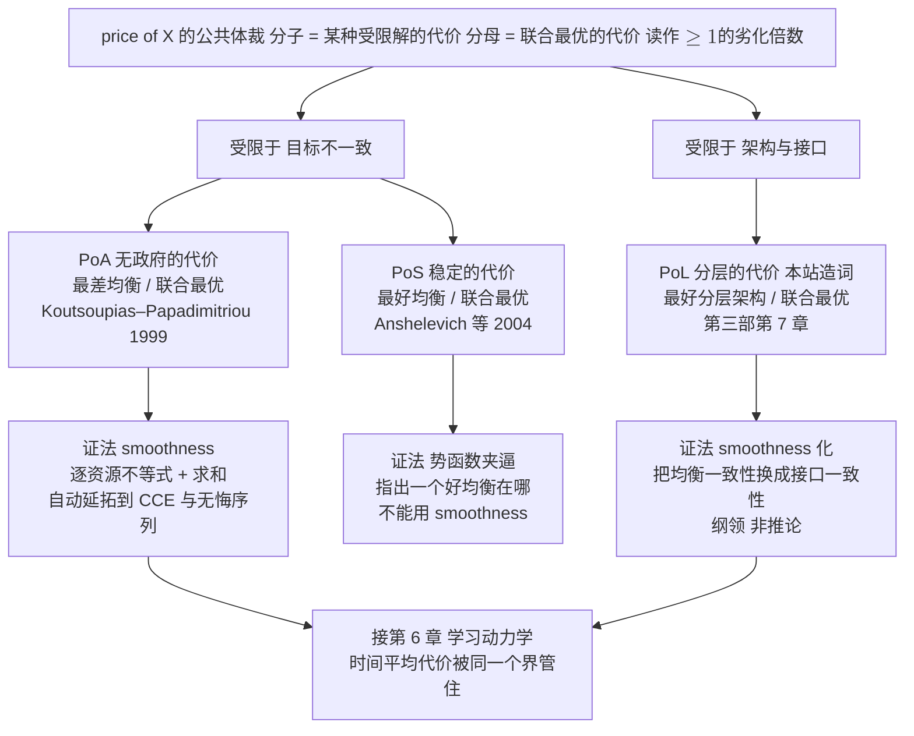

# 8 · 网络博弈与无线实例

[第 2 章](02-team-decision-theory.md)的分水岭表格里有一格一直空着。那张表把"团队"与"博弈"并排：

- 团队里信息多不坏（命题 2.4），博弈里可能更坏。
- 团队里"人各最优"在凸性下等于团队最优（定理 2.1），博弈里"人各最优"只是 Nash 均衡。
- 团队里两者的差距叫**分散化代价**（算例 2.2 算出 3.02% 与 8.00%），博弈里那个差距叫**无政府的代价**（price of anarchy, PoA）。

这一格当时写的是"第 8 章"。本章来填这一格，做四件事：

1. **把目标不一致算成数。**两小区两档功率的干扰博弈，把 Nash、社会最优、PoA、PoS 四个数逐个手算出来（算例 8.1）。
2. **说清什么样的自私会收敛。**干扰博弈在什么条件下是**势博弈**（potential game）？势函数一存在，纯策略均衡、有限改进路径、异步最优响应收敛就都成立。同步更新则不收敛，这是[第 6 章](06-learning-dynamics.md)分岔现象在无线里的现实版。
3. **把 PoA 讲成一台证明机器，而不只是一个比值。**Roughgarden 的 smoothness 框架：证一次 $(\lambda,\mu)$ 不等式，界自动覆盖混合均衡、相关均衡、粗相关均衡与一切无悔学习序列。这接住了[第 6 章](06-learning-dynamics.md)"no-regret $\Longrightarrow$ CCE"的下游，也让[第三部第 7 章](../part3/07-price-of-layering.md)的 PoL 与 PoA 排进同一个 "price of X" 家族。
4. **给"协作增益"立一块硬天花板。**Lozano–Heath–Andrews 2013：即使发射端全协作，也存在**与发射功率无关**的谱效上界。这是[第 9 章](09-research-agenda.md)"协同增益 scaling law"那条缺失定理唯一一块已证的地基，本章把它写成"耦合度 $\kappa$"的形状。

贯穿全章的，是本部那句话的第三次出现：无线网络既是多智能体问题的实例，又是信息结构的生成器。

[第 3 章](03-information-structure-phase-diagram.md)用回传时延与耦合时标的比值 $d/p$，生成了"可解不可解"的相边界（命题 3.8）。本章用**干扰图**生成"谁的动作进谁的效用"，用**簇外干扰占比**生成"协作还能不能再赚"。

!!! note "本章预备知识"
    需要：

    - Shannon 容量公式（[预备篇 4.6](../part0/04-information-theory-basics.md)）与 SINR 的定义（[预备篇 6.1](../part0/06-wireless-networks.md)）。
    - 蜂窝复用、CoMP 与非授权频段共存的常识（[预备篇第 6 章](../part0/06-wireless-networks.md)）。
    - 凸优化中"最优解代回一阶条件"的检验习惯。

    不需要博弈论基础。Nash 均衡、势博弈、PoA/PoS 的定义都在本章现给。

    均衡概念的完整阶梯（Nash $\subset$ CE $\subset$ CCE）与学习动力学在[第 6 章](06-learning-dynamics.md)。无悔学习作为在线凸优化的多智能体版，见[第三部第 4 章](../part3/04-sequential-uncertainty.md)与[预备篇第 8 章](../part0/08-reinforcement-learning.md)。

**从"最坏均衡"到"协作的天花板"：本章的十块路标**

| 年份 | 路标 |
|---|---|
| 1999 | Koutsoupias–Papadimitriou 定义 price of anarchy |
| 2001 | Kearns–Littman–Singh 图博弈 收益只依赖邻居 |
| 2002 | Roughgarden–Tardos 非原子仿射路由 $\mathrm{PoA}=4/3$ |
| 2004 | Anshelevich 等 定义 price of stability |
| 2005 | Christodoulou–Koutsoupias 原子仿射 $\mathrm{PoA}=5/2$ |
| 2006 | Scutari–Barbarossa–Palomar 功控写成势博弈 |
| 2007 | Etkin–Parekh–Tse 频谱共享 一次博弈低效可以任意大 重复博弈救回来 |
| 2013 | Lozano–Heath–Andrews 存在与发射功率无关的谱效上界 |
| 2015 | Roughgarden robust PoA smoothness 自动延拓到无悔动力学 |
| 2026 | 本站 把 PoA / PoS / PoL 排成一族 把簇外干扰占比立为耦合度 $\kappa$ |

*怎么读这张表：上半段（1999–2005、2015）是算法博弈论侧把"自私的代价"变成可复用证明模板的过程。下半段（2006–2013）是无线侧把干扰问题写成博弈、并给协作增益封顶的过程。*

*两条线在本章合流：8.4 节的 smoothness 是上半段的成果，8.9 节的天花板是下半段的成果，8.8 节的价格家族表是本站把两条线接起来的地方。年份与归属来自本章参考文献 [1][2][3][5][6][7][8][11]。*

---

## 8.1 会议室里的音量战争：先把"差多少"定义清楚 {#81-会议室里的音量战争先把差多少定义清楚}

### 8.1.1 目标不一致会出什么问题

一间会议室，几桌人同时聊天。每桌为了让自己人听清，都把音量抬高一点。抬高之后别人更听不清，于是所有人再抬高一点。最后每桌都在喊，每桌听到的清晰度反而不如大家都轻声说话的时候。

没有人做错：每个人在别人的音量给定时，都选了对自己最好的音量。出问题的是"各自最优"这个解概念本身，个体的决策并没有错。

无线里这幕戏天天在演：

- 非授权频段的 Wi-Fi AP 与 NR-U 基站抢同一段 5 GHz 频谱。
- 两个运营商的小基站装在同一栋楼的两侧。
- D2D 链路与蜂窝上行共用资源块。
- 边缘算力市场里几个推理任务同时竞价同一块 GPU 的时间片。

共同点是：每个决策者的动作进入别人的效用，而目标不一致。

[第 2 章](02-team-decision-theory.md)研究的团队没有这个麻烦。目标一致，"我多做一点还是你多做一点"最多是协调问题，损失有限（算例 2.2 的 3.02%）。目标一分歧，损失的上界就不再由信息量决定，而由**博弈的结构**决定。要把"差多少"说清楚，先要三个定义。

!!! abstract "定义 8.1（策略式博弈与 Nash 均衡）"
    一个**策略式博弈**（strategic-form game）是三元组 $\Gamma=(\mathcal{N},\{A_i\},\{u_i\})$：玩家集合 $\mathcal{N}=\{1,\dots,N\}$；玩家 $i$ 的动作集 $A_i$（$|A_i|\le m$）；效用 $u_i:A\to\mathbb{R}$，其中 $A=A_1\times\cdots\times A_N$。记 $a=(a_i,a_{-i})$，$a_{-i}$ 是除 $i$ 之外所有人的动作。

    动作组合 $a^{\mathrm{ne}}\in A$ 是**纯策略 Nash 均衡**，若对每个 $i$ 与每个 $a_i'\in A_i$：

    $$
    u_i\big(a_i^{\mathrm{ne}},a_{-i}^{\mathrm{ne}}\big)\;\ge\;u_i\big(a_i',a_{-i}^{\mathrm{ne}}\big).
    $$

    **社会福利**取效用之和 $W(a)=\sum_{i}u_i(a)$，**社会最优** $W^\star=\max_{a\in A}W(a)$。

**这个定义在说什么**

Nash 均衡是一个没有人想单方面改主意的动作组合。它不要求任何人知道别人的效用函数，只要求"给定别人现在这样做，我这样做最好"。

它与[第 2 章](02-team-decision-theory.md)定义 2.2 的**人各最优**（person-by-person optimal）形式上一模一样，差别全在效用：团队里所有人用同一个 $u$，博弈里各用各的 $u_i$。这一个下标，就是本部"目标是否一致"那一维的全部技术内容。

### 8.1.2 PoA 与 PoS：两个方向的问法

!!! abstract "定义 8.2（无政府的代价与稳定的代价）"
    设 $\mathrm{NE}(\Gamma)\ne\varnothing$ 为博弈 $\Gamma$ 的（纯策略）Nash 均衡集合，$\mathcal{G}$ 是一族博弈。**无政府的代价**（price of anarchy）与**稳定的代价**（price of stability）定义为

    $$
    \mathrm{PoA}(\mathcal{G}):=\sup_{\Gamma\in\mathcal{G}}\ \frac{W^\star(\Gamma)}{\min_{a\in \mathrm{NE}(\Gamma)}W(a)},
    \qquad
    \mathrm{PoS}(\mathcal{G}):=\sup_{\Gamma\in\mathcal{G}}\ \frac{W^\star(\Gamma)}{\max_{a\in \mathrm{NE}(\Gamma)}W(a)} .
    $$

    两者都 $\ge1$，读作"**劣化倍数**"。代价最小化型的博弈（如拥塞博弈）把分子分母对调，$\mathrm{PoA}=\sup \max_{a\in\mathrm{NE}}C(a)/C^\star$，同样 $\ge1$。恒有 $1\le\mathrm{PoS}\le\mathrm{PoA}$。

**记号约定（与全站一致）**

方向约定沿用[第三部第 7 章](../part3/07-price-of-layering.md)：效用最大化问题取"联合最优比受限解"的倒数方向，一切 price of X 都读成"$\ge1$ 的劣化倍数"。

这条约定有实际用处。PoA 的原始文献用代价口径，无线文献用速率口径，两边混写会把 $1.35$ 写成 $0.74$，是这个题目上最常见的低级错误。

**物理意义**

- $\mathrm{PoA}$ 是**悲观**的问法："如果他们自己乱来，最坏能坏到什么程度？"
- $\mathrm{PoS}$ 是**乐观**的问法："如果我能替他们挑一个均衡（比如通过一次广播把大家推到某个约定上），最好能好到什么程度？"

两者之差恰好是"协调值多少钱"。而"一次广播要多少比特"，是[第 4 章](04-coordination-information-theory.md)算过的东西：命题 4.4 的协调价签曲线是 $R^\star(\epsilon)=1-h(\epsilon)$，$\epsilon=0.1$ 时为 0.531 比特/时隙。PoA 与 PoS 的间隙，就是第 4 章那条曲线的买家。

**行为分析**

三个极限值得先记住。

- (i) $\mathrm{PoS}=1$：社会最优本身就是一个均衡，此时只需"选中它"，不需要强制。协调的全部内容就是打破对称。
- (ii) $\mathrm{PoA}=\mathrm{PoS}$：均衡唯一（或所有均衡等价），协调无用，只能改机制或改效用。
- (iii) $\mathrm{PoA}=\infty$：自私可以任意坏。8.5 节会看到高斯干扰博弈就是这一档，而 8.4 节的拥塞博弈只有 $5/2$。

PoA 的量级由模型决定，没有普适常数。这一点本章会反复用到。

**到此为止我们得到了什么**

- 一个与第 2 章定义 2.2 只差一个下标的均衡概念。
- 两个方向统一为"$\ge1$ 的劣化倍数"的价格量。
- 一句读法：PoA 与 PoS 的间隙就是"协调"这件商品的市场规模，而它的价签在第 4 章。

---

## 8.2 两小区两档功率：把四个数算到底 {#82-两小区两档功率把四个数算到底}

抽象定义要立刻落到能手算的数字上。下面这个 $2\times2$ 博弈的每一个参数都有出处。信道系数取自 Etkin–Parekh–Tse 2007 [3] 第 4.1 节场景 (d)：直连增益 $c_{11}=c_{22}=1$，交叉增益 $c_{12}=c_{21}=1/4$，$W=1$，$N_0=1$。

本站的改动只有三处：

- 把连续功率离散成两档。
- 把小区 2 的直连增益从 1 降为 0.8，让两个小区不对称，即下面的 $g_{22}$。
- 给功率加一个线性价格。

### 8.2.1 算例：四个数怎么算

!!! example "算例 8.1（两小区两档功率的干扰博弈：Nash、社会最优、PoA、PoS）【本站演算】"
    **模型。**两个共信道小区，基站 $i$ 选发射功率 $P_i\in\{P_{\mathrm{hi}},P_{\mathrm{lo}}\}=\{10,1\}$（归一化功率）。接收端把对方当噪声，小区 $i$ 的速率

    $$
    r_i(P_i,P_j)=\log_2\!\Big(1+\frac{g_{ii}P_i}{1+\tfrac14 P_j}\Big),
    \qquad i\ne j,
    $$

    其中 $g_{11}=1$（宏站，直连链路好）、$g_{22}=0.8$（边缘小站，直连链路差 1 dB 左右）。效用是速率减功率账单

    $$
    u_i(P_i,P_j)=r_i(P_i,P_j)-c\,P_i,\qquad c=0.22 .
    $$

    这里 $c$ 是"每单位功率折算成多少 b/s/Hz"的兑换率，能耗、干扰罚款、电费都可以塞进它。

    取 $c=0.22$，使高功率的账单 $2.2$ 与"独占频谱时高低功率的速率差"（$3.170-0.848=2.322$）同量级，博弈才有内容。$c$ 太小则高功率是占优策略，$c$ 太大则低功率是占优策略，两种极端都退化成单点均衡。

    **第 1 步：算四个格子的速率。**逐格代入（保留四位小数）：

    | $(P_1,P_2)$ | 小区 1 的 SINR | $r_1$ | 小区 2 的 SINR | $r_2$ |
    |---|---|---|---|---|
    | (hi, hi) | $10/3.5=2.8571$ | 1.9475 | $8/3.5=2.2857$ | 1.7162 |
    | (hi, lo) | $10/1.25=8$ | 3.1699 | $0.8/3.5=0.2286$ | 0.2970 |
    | (lo, hi) | $1/3.5=0.2857$ | 0.3626 | $8/1.25=6.4$ | 2.8875 |
    | (lo, lo) | $1/1.25=0.8$ | 0.8480 | $0.8/1.25=0.64$ | 0.7137 |

    **第 2 步：减去功率账单，得效用矩阵。**账单：高功率 $0.22\times10=2.2$，低功率 $0.22\times1=0.22$。

    | $u_1,u_2$ | 小区 2：hi | 小区 2：lo |
    |---|---|---|
    | **小区 1：hi** | $-0.2525,\ -0.4838$ | $\mathbf{0.9699},\ \mathbf{0.0770}$ |
    | **小区 1：lo** | $\mathbf{0.1426},\ \mathbf{0.6875}$ | $0.6280,\ 0.4937$ |

    **第 3 步：找纯 Nash。**逐行逐列比：

    - 小区 1 对 hi 的最优响应：$u_1(\mathrm{hi},\mathrm{hi})-u_1(\mathrm{lo},\mathrm{hi})=-0.2525-0.1426=-0.3950<0$ $\Longrightarrow$ 选 lo。
    - 小区 1 对 lo 的最优响应：$0.9699-0.6280=+0.3419>0$ $\Longrightarrow$ 选 hi。
    - 小区 2 对 hi 的最优响应：$-0.4838-0.0770=-0.5608<0$ $\Longrightarrow$ 选 lo。
    - 小区 2 对 lo 的最优响应：$0.6875-0.4937=+0.1938>0$ $\Longrightarrow$ 选 hi。

    这是一个**反协调博弈**（anti-coordination game）：对方喊我就让，对方让我就喊。两个纯 Nash：$(\mathrm{hi},\mathrm{lo})$ 与 $(\mathrm{lo},\mathrm{hi})$。

    **第 4 步：算社会福利。**

    $$
    W(\mathrm{hi},\mathrm{hi})=-0.7363,\quad
    W(\mathrm{hi},\mathrm{lo})=1.0469,\quad
    W(\mathrm{lo},\mathrm{hi})=0.8301,\quad
    W(\mathrm{lo},\mathrm{lo})=1.1217 .
    $$

    社会最优是 $(\mathrm{lo},\mathrm{lo})$，$W^\star=1.1217$。两家都轻声说话最好，而它偏偏不是均衡。

    **第 5 步：两个价格。**

    $$
    \mathrm{PoA}=\frac{1.1217}{0.8301}=\mathbf{1.3513},
    \qquad
    \mathrm{PoS}=\frac{1.1217}{1.0469}=\mathbf{1.0714}.
    $$

    自私最坏损失 35.1%，最好的均衡也还差 7.1%。

    **校验**

    三条独立途径。

    - **(i) 速率数字的独立复核。**$(\mathrm{hi},\mathrm{lo})$ 格的 SINR 恰好是整数 8，故 $r_1=\log_2 9=2\log_2 3=2\times1.58496=3.16993$，与表中 3.1699 一致。这一格不依赖任何浮点求解，直接取对数与拆成 $2\log_2 3$ 两条路径，得到同一个数。

    - **(ii) 均衡的第二条判定路径：序势函数。**构造 $\Phi(\mathrm{hi},\mathrm{hi})=0$、$\Phi(\mathrm{lo},\mathrm{lo})=1$、$\Phi(\mathrm{hi},\mathrm{lo})=\Phi(\mathrm{lo},\mathrm{hi})=2$。第 3 步的四个符号逐条对上：

        - $u_1(\mathrm{hi},\mathrm{hi})<u_1(\mathrm{lo},\mathrm{hi})$ 对 $\Phi(\mathrm{hi},\mathrm{hi})=0<2=\Phi(\mathrm{lo},\mathrm{hi})$ ✓。
        - $u_1(\mathrm{hi},\mathrm{lo})>u_1(\mathrm{lo},\mathrm{lo})$ 对 $2>1$ ✓。
        - $u_2(\mathrm{hi},\mathrm{hi})<u_2(\mathrm{hi},\mathrm{lo})$ 对 $0<2$ ✓。
        - $u_2(\mathrm{lo},\mathrm{hi})>u_2(\mathrm{lo},\mathrm{lo})$ 对 $2>1$ ✓。

        所以 $\Phi$ 是**序势函数**，而它的全局极大点集恰是 $\{(\mathrm{hi},\mathrm{lo}),(\mathrm{lo},\mathrm{hi})\}$，与第 3 步逐格比较得到的均衡集合完全相同（命题 8.2 第 3 条）。两条路径互不依赖。

    - **(iii) 方向关系与退化极限。**$1\le\mathrm{PoS}=1.0714\le\mathrm{PoA}=1.3513$ ✓（定义 8.2 要求）。把 $c$ 推向两端复核退化：
        - $c=0.1$ 时高功率成为**占优策略**，唯一均衡 $(\mathrm{hi},\mathrm{hi})$，$\mathrm{PoA}=\mathrm{PoS}$（均衡唯一时两价格必相等）。
        - $c\to\infty$ 时低功率占优，唯一均衡 $(\mathrm{lo},\mathrm{lo})$ 同时是社会最优，$\mathrm{PoA}=\mathrm{PoS}=1$。

        两端都退化成"均衡唯一 $\Longrightarrow$ $\mathrm{PoA}=\mathrm{PoS}$"，与定义 8.2 的一般结论一致。

### 8.2.2 四个数说明了什么

**物理意义**

这张 $2\times2$ 表把三件事一次说清：

- **社会最优可以完全不是均衡。**$(\mathrm{lo},\mathrm{lo})$ 谁都不肯待着，因为对方轻声时自己喊一嗓子净赚 $0.34$。
- **均衡可以有多个，且好坏不同。**$(\mathrm{hi},\mathrm{lo})$ 与 $(\mathrm{lo},\mathrm{hi})$ 都稳定，但福利差 $1.0469$ 对 $0.8301$，差在"该让路的是谁"。让宏站喊、小站让，网络整体更好；反过来就浪费。
- **PoS 与 PoA 的间隙有明确的工程对应物。**把系统从坏均衡挪到好均衡，只需要一次"这轮你让"的协调信号，不需要任何人放弃自私。

**行为分析**

参数怎么影响这三个数？

- (a) 交叉增益 $1/4$ 变小（比如加装隔离、错开波束），$(\mathrm{hi},\mathrm{hi})$ 格的效用抬升，博弈从反协调滑向"高功率占优"，$\mathrm{PoA}\to1$。把干扰做小，自私就不再有害。
- (b) $g_{22}$ 从 0.8 降到 0.5（小站更边缘），小站在任何情形下都不值得喊，均衡唯一化为 $(\mathrm{hi},\mathrm{lo})$，$\mathrm{PoA}=\mathrm{PoS}$。非对称性消灭了协调问题，也消灭了协调的价值。
- (c) 功率价格 $c$ 是唯一的机制旋钮。它是无线网络里"干扰定价"的雏形，也是 8.8 节机制设计一栏的入口。

**到此为止我们得到了什么**

- 一个每个参数都可追溯的 $2\times2$ 干扰博弈：两个纯 Nash，一个不是均衡的社会最优。
- 两个算到小数点后四位的价格：$\mathrm{PoA}=1.3513$、$\mathrm{PoS}=1.0714$。
- 一条会在下一节兑现的线索：这个博弈的均衡集合可以由一个"序势函数"的极大点独立复算出来。

---

## 8.3 势博弈：什么样的自私会收敛 {#83-势博弈什么样的自私会收敛}

### 8.3.1 势函数是一本公共账本

算例 8.1 的校验 (ii) 露出了一个更深的结构。逐格比较最优响应是 $O(m^N)$ 的笨办法。如果存在一个**标量函数** $\Phi$，使得"每个人自私地改动作"等价于"$\Phi$ 上升"，那么均衡的存在性、可达性、收敛性就全部化归为一个标量函数的爬山问题。这就是 Monderer–Shapley 1996 [9] 的势博弈。

把功控问题写成势博弈的早期无线工作是 Scutari–Barbarossa–Palomar 2006 [4]。本站文献核对确认了该文的存在与题名会议，但**全文未取得**，因此本节不引用其“耦合约束下势函数的充分条件”，改用一条本站可以初等证明、且与已核实文献 [10] 的势函数与命题一致的判据。

!!! abstract "定义 8.3（精确势博弈与序势博弈，Monderer–Shapley [9]）"
    博弈 $\Gamma$ 称为**精确势博弈**（exact potential game），若存在 $\Phi:A\to\mathbb{R}$ 使对每个玩家 $i$、每个 $a_{-i}$、每对 $a_i,a_i'$：

    $$
    u_i(a_i',a_{-i})-u_i(a_i,a_{-i})\;=\;\Phi(a_i',a_{-i})-\Phi(a_i,a_{-i}).
    $$

    若把等号换成同号（$>0\iff>0$），称为**序势博弈**（ordinal potential game）。$\Phi$ 称为势函数。

**这个定义在说什么**

势函数是一本**公共账本**。每个人只关心自己那一栏的变化，但账本保证：任何人任何一次单方面改动，自己赚了多少，账本就涨多少。

于是 $N$ 个各怀心思的决策者，在动力学上等价于一个爬同一座山的单一优化器。

### 8.3.2 干扰效用的精确势

无线里最自然的势结构来自"干扰"，而不是"速率"。下面这条定理给出精确条件，证明是初等的，值得逐步走一遍。

!!! abstract "定理 8.1（双向计入的干扰效用是精确势博弈）【已解决·本站给出初等证明；对称性条件与"自私即势"的边界见 [10] 式 (14) 与命题 7】"
    设玩家 $i$ 的动作 $a_i$（信道、功率档、波束方向或它们的组合）决定了它与每个 $j$ 之间的干扰。记 $w_{ij}(a_i,a_j)\ge0$ 为"发射机 $j$ 在接收机 $i$ 处造成的干扰功率"。若每个玩家的效用是**自己收到的干扰加上自己制造的干扰**的负数：

    $$
    u_i(a)\;=\;-\sum_{j\ne i}\Big[\underbrace{w_{ij}(a_i,a_j)}_{\text{我收到的}}+\underbrace{w_{ji}(a_j,a_i)}_{\text{我造成的}}\Big],
    $$

    则 $\Gamma$ 是**精确**势博弈，势函数

    $$
    \Phi(a)\;=\;-\sum_{i<j}\Big[w_{ij}(a_i,a_j)+w_{ji}(a_j,a_i)\Big]
    $$

    即"全网总干扰的负数"。

    进一步，设交叉增益对称，即 $w_{ij}(x,y)=w_{ji}(y,x)$ 对一切 $i,j$ 与一切动作成立。（[10] 命题 7：所有 AP 用同一发射功率、覆盖半径相同、**不做功控**时成立。）这时纯自私效用 $u_i^{\mathrm{sel}}(a)=-\sum_{j\ne i}w_{ij}(a_i,a_j)$ 满足 $u_i=2u_i^{\mathrm{sel}}$，于是**纯自私行为本身就构成精确势博弈**。

**证明。**分三步。

1. **只有含 $i$ 的项会动。**固定 $a_{-i}$，把 $a_i$ 换成 $a_i'$。$\Phi$ 的求和是对无序对 $\{k,l\}$ 取的。不含 $i$ 的对 $\{k,l\}$（$k,l\ne i$）的项 $w_{kl}(a_k,a_l)+w_{lk}(a_l,a_k)$ 完全不依赖 $a_i$，差分中相消。

2. **含 $i$ 的项恰好凑成 $u_i$。**剩下的是所有形如 $\{i,j\}$（$j\ne i$）的对：

    $$
    \Phi(a_i',a_{-i})-\Phi(a_i,a_{-i})
    =-\sum_{j\ne i}\Big[w_{ij}(a_i',a_j)+w_{ji}(a_j,a_i')\Big]
    +\sum_{j\ne i}\Big[w_{ij}(a_i,a_j)+w_{ji}(a_j,a_i)\Big].
    $$

3. **右边就是效用差。**按题设 $u_i(a)=-\sum_{j\ne i}[w_{ij}(a_i,a_j)+w_{ji}(a_j,a_i)]$，上式右边恰为 $u_i(a_i',a_{-i})-u_i(a_i,a_{-i})$。定义 8.3 的等式成立。

    再看定理的最后一句。若 $w_{ij}(x,y)=w_{ji}(y,x)$，则 $\sum_{j\ne i}w_{ji}(a_j,a_i)=\sum_{j\ne i}w_{ij}(a_i,a_j)$，故 $u_i=2u_i^{\mathrm{sel}}$。效用整体乘以正常数不改变最优响应，也不改变势结构（势函数同乘 $2$）。$\blacksquare$

**物理意义**

这条定理说的事很朴素：每个人为"我造成的麻烦"负同等的责任时，个体的自私就在优化一个全局量，也就是总干扰。势函数不是数学装饰，它就是网络的总干扰功率。

对称这个条件为什么关键？对称的物理含义是**互惠**，即我给你添的麻烦等于你给我添的麻烦。互惠让"只看自己收到的干扰"这种彻底自私的行为，在数值上与"计入双方"完全一致，责任被自动内部化了。

等功率、等覆盖、不做功控的同构 AP 群（家用 Wi-Fi 的信道自选就是典型）落在这一档 [10]。

**行为分析**

三个边界必须写清楚，否则这条定理会被滥用。

!!! warning "陷阱：势结构在三个地方会碎"
    1. **一做功控，对称就没了。**$w_{ij}$ 依赖发射功率 $P_j$ 与路径增益 $g_{ij}$。物理上 $g_{ij}=g_{ji}$（互易性）可以成立，但 $w_{ij}=g_{ij}P_j$ 与 $w_{ji}=g_{ji}P_i$ 在 $P_i\ne P_j$ 时不相等。[10] 命题 7 的三个前提（同功率、同覆盖、不做功控）缺一不可。
    2. **只看"我收到的干扰"一般不收敛，而且低效。**如果效用只写成 $-\sum_j w_{ij}$ 且不对称，[10] 已核实：这样的纯自私信道选择一般**不收敛**，其均衡也**很低效**。修法只有一条：把"我给别人造成的干扰"写进效用，也就是回到定理 8.1 的形式。这在工程上就是干扰定价、LBT 的退避惩罚、或者运营商间的干扰协调协议。
    3. **以 Shannon 速率为效用的高斯干扰博弈是不是势博弈，本站未核，不作断言。**算例 8.1 提醒了这一点。那里的效用是 $\log_2(1+\mathrm{SINR})-cP$，不是"双向计入的干扰"，所以**精确**势结构失效。沿四格环路把效用差加起来：

        $$
        0.3419+(-0.5608)+0.3950+(-0.1938)=-0.0176\ne0,
        $$

        这条环路是 $(\mathrm{lo},\mathrm{lo})\to(\mathrm{hi},\mathrm{lo})\to(\mathrm{hi},\mathrm{hi})\to(\mathrm{lo},\mathrm{hi})\to(\mathrm{lo},\mathrm{lo})$，每一步只有一人改动作（依次是小区 1、2、1、2）。四个数是改动者当步的效用变化，取自算例 8.1 第 3 步（符号按行进方向取）。

        若存在精确势函数，定义 8.3 让每一步的效用变化都等于 $\Phi$ 的变化，四步相加就是 $\Phi(\mathrm{lo},\mathrm{lo})-\Phi(\mathrm{lo},\mathrm{lo})=0$。这里的和不为零，所以精确势函数不存在。它只是**序**势博弈（校验 (ii) 已构造 $\Phi$）。

        Etkin 等 [3] 处理连续功率的高斯干扰博弈时，用的是注水与最优响应论证，不是势函数论证。

### 8.3.3 收敛性：异步收敛，同步不收敛

有了势函数，收敛性几乎是白送的。

!!! abstract "命题 8.2（有限势博弈的四条性质）【已解决（经典）；第 4 条的"同步不收敛"见 [10]】"
    设 $\Gamma$ 是动作集有限的序势博弈，势函数 $\Phi$。则：

    1. **纯策略 Nash 均衡存在**。
    2. **有限改进性质（FIP）**：任何"每步恰有一人严格改善"的路径长度有限，必在有限步终止。
    3. **$\Phi$ 的任一全局极大点是纯 Nash 均衡**。反之不成立：只要是"任何一人单独改动都不能让 $\Phi$ 上升"的点（$\Phi$ 的局部极大）就已经是均衡，它未必是全局极大。
    4. **异步动力学收敛**：轮询（round-robin）、随机选一人、或任何一次只让一人更新的最优响应（换到最好的动作）或更优响应（换到任何一个更好的动作即可），有限步到达纯 Nash。而**同步更新**（所有人在同一时刻用上一轮的信息一起更新）**一般不收敛**。

**证明思路**

- **第 2 条**：每一步严格改善使 $\Phi$ 严格上升，$\Phi$ 在有限集上取值有限，不能无限上升，故路径有限。
- **第 1 条**：由第 2 条，从任意点出发跑改进路径，终点无人想改，即 Nash。
- **第 3 条**：若 $a$ 是 $\Phi$ 的全局极大而某人想改，则该人的改善蕴含 $\Phi$ 上升，矛盾。
- **第 4 条**：异步即改进路径，用第 2 条。同步更新时"每步恰有一人改"的前提被破坏：两人同时按对方的旧动作做最优响应，可能同时跳到对方刚离开的位置，$\Phi$ 不再单调。$\blacksquare$

**物理意义**

第 4 条是无线工程师最该记住的一条，却几乎总被忽略。"所有基站在同一个 TTI 边界一起更新自己的功率或信道"，就是同步更新。这是标准化默认的做法，也最容易实现。

势博弈的收敛保证在这里失效。两个 AP 会一起从信道 1 跳到信道 2，再一起跳回来，永远振荡。

算例 8.1 可以演示这一点：

- 从 $(\mathrm{hi},\mathrm{hi})$ 出发，两小区同时对"对方喊"做最优响应，都改成 lo，到达 $(\mathrm{lo},\mathrm{lo})$。
- 下一轮同时对"对方让"做最优响应，又都改回 hi，回到 $(\mathrm{hi},\mathrm{hi})$。序势 $\Phi$ 在 $0\to1\to0$ 之间来回，永不停下。
- 改成轮流更新，从 $(\mathrm{hi},\mathrm{hi})$ 只让小区 1 动一步就到 $(\mathrm{lo},\mathrm{hi})$，它已是 Nash，一步停住。

修法是工程上熟悉的：

- 随机化退避：随机选一人更新。
- 错开更新周期：轮询。
- 加惯性：只以概率 $p$ 采纳最优响应。

**行为分析**

这条性质与[第 6 章](06-learning-dynamics.md)的主线严丝合缝。第 6 章的结论是：即使在势博弈里，常步长的乘性权重更新（MWU）也会随步长从收敛分岔到极限环再到混沌（Palaiopanos 等 2017）。

命题 8.2 第 4 条是同一现象在离散更新规则上的最简版本。收敛性由"博弈类 × 更新规则 × 步长"共同决定，不由博弈类单独决定。势结构只保证存在一条下山的路，没保证你走的那条路会下山。这就是第 6 章那张相图（博弈类 × 步长/观测噪声 → 收敛/循环/混沌）的必要性。

**到此为止我们得到了什么**

- 一条可以初等证明的判据：效用写成"我收到的 + 我造成的干扰"就是精确势博弈，势函数是全网总干扰。
- 对称（同功率、同覆盖、不做功控）时，纯自私行为自动落入这一档。
- 三条边界：功控破坏对称；只看自己收到的干扰不收敛且低效；Shannon 速率效用不作断言。
- 一条工程警告：同步更新让势博弈的收敛保证失效。

---

## 8.4 无政府的代价：smoothness 是一台可搬运的证明机器 {#84-无政府的代价smoothness-是一台可搬运的证明机器}

### 8.4.1 smoothness 的定义

算例 8.1 的 $\mathrm{PoA}=1.3513$ 是一个实例的数字。真正有用的问法是：一整族博弈的 PoA 最坏是多少？逐个实例算显然不行。Roughgarden 2015 [2] 给的答案是：不用找最坏实例，只需在每个实例上证一条代数不等式。

[第三部第 7 章](../part3/07-price-of-layering.md)已经搬过这台机器的**逐资源版本**。代价函数 $d$ 满足 $y\,d(x)\le\lambda y\,d(y)+\mu x\,d(x)$，仿射情形 $(\lambda,\mu)=(1,\tfrac14)$，得非原子 PoA $\le4/3$。本章要用的是**博弈级**的原始定义，因为只有它才能延拓到无悔动力学。

!!! abstract "定义 8.4（$(\lambda,\mu)$-smooth 博弈，Roughgarden 2015 [2] 定义 2.1）"
    代价最小化博弈 $\Gamma$（社会代价 $C(a)=\sum_i C_i(a)$）称为 $(\lambda,\mu)$-**smooth**（$\lambda>0$，$\mu<1$），若对**任意两个动作组合** $a$ 与 $a^*$：

    $$
    \sum_{i=1}^{N} C_i\big(a_i^{*},a_{-i}\big)\;\le\;\lambda\,C(a^{*})+\mu\,C(a).
    $$

    量词是"任意 $a$"，不只是均衡。界能外推的技术来源就在这里。

**这个定义在说什么**

左边是一个**假想**的量：每个人都单方面偏离到"最优解里自己的那个动作"，但其他人保持现状。它既不是均衡的代价，也不是最优的代价，而是把两者混在一起的一个中间量。

smoothness 要求这个混合量能被"最优代价"与"当前代价"的一个线性组合压住。

**一个两人两链路的数字例子**

两名玩家各选链路 $e_1$ 或 $e_2$，每人的代价等于所在链路上的人数（$d(x)=x$），社会代价 $C=\sum_e x_e^2$。先借用定理 8.5 将给出的 $(\lambda,\mu)=(\tfrac53,\tfrac13)$。

- (i) $a=(e_1,e_2)$，$a^*=(e_2,e_1)$（两人互换）：$C(a)=C(a^*)=2$。左边是玩家 1 单独换到 $e_2$、与玩家 2 挤在一起，代价 2；玩家 2 单独换到 $e_1$ 同理，代价 2；合计 $4$，比 $C(a)$ 与 $C(a^*)$ 都大，确实是个"假想量"。右边 $\tfrac53\cdot2+\tfrac13\cdot2=4$，恰好取等。
- (ii) $a=(e_1,e_1)$，$a^*=(e_1,e_2)$：$C(a)=4$，$C(a^*)=2$。左边 $2+1=3$，右边 $\tfrac{10}{3}+\tfrac43=\tfrac{14}{3}$，成立。这个 $a$ 根本不是均衡（玩家 2 换到 $e_2$，代价从 2 降到 1），不等式照样要成立，这就是"量词是任意 $a$"。

### 8.4.2 robust PoA 与延拓定理

!!! abstract "定理 8.3（robust PoA，Roughgarden 2015 [2] 定义 2.2 与式 (3)–(5)）【已解决】"
    若 $\Gamma$ 是 $(\lambda,\mu)$-smooth 且 $\mu<1$，则其任意纯 Nash 均衡 $a$ 与任意 $a^*$ 满足

    $$
    C(a)\;\le\;\frac{\lambda}{1-\mu}\,C(a^{*}).
    $$

    取 $a^*$ 为社会最优即得 $\mathrm{PoA}\le\lambda/(1-\mu)$。**robust PoA** 定义为 $\inf\{\lambda/(1-\mu):\Gamma\ \text{是}\ (\lambda,\mu)\text{-smooth},\ \mu<1\}$。

**证明**

三行，每行说明这一步做了什么：

$$
\begin{aligned}
C(a)&=\sum_{i} C_i(a) &&\text{（社会代价的可加性，定义）}\\
&\le\sum_{i} C_i\big(a_i^{*},a_{-i}\big) &&\text{（Nash：谁都不想偏离到 }a_i^{*}\text{，故偏离后代价不减）}\\
&\le\lambda\,C(a^{*})+\mu\,C(a) &&\text{（对这一对 }(a,a^{*})\text{ 用一次 smoothness）}
\end{aligned}
$$

移项：$(1-\mu)C(a)\le\lambda C(a^*)$，两边除以 $1-\mu>0$。$\blacksquare$

**物理意义**

证明里"均衡"只出现了一次，在第二行。这是整台机器的关键。均衡假设只用在一个极窄的地方，即"没有人想偏离到 $a_i^*$"，其余全是与均衡无关的代数。

把第二行的条件换成别的，机器照转。Roughgarden 正是这样把界延拓出去的。

!!! abstract "定理 8.4（延拓定理，Roughgarden 2015 [2] 定理 3.2）【已解决】"
    由 smoothness 论证得到的上界 $\lambda/(1-\mu)$ **自动**适用于：混合 Nash 均衡、相关均衡（CE）、粗相关均衡（CCE），以及任何**无悔学习序列**的时间平均代价。

    收益最大化的版本（[2] 第 2.3.2 节）：若 $\sum_i\Pi_i(a_i^{*},a_{-i})\ge\lambda W(a^{*})-\mu W(a)$，则均衡福利 $\ge\dfrac{\lambda}{1+\mu}W^\star$。

    原文推导时取社会福利等于各玩家收益之和。按原文注 2.3，这一前提可放宽为 $W(a)\ge\sum_i\Pi_i(a)$，[2] 例 2.6 的 valid utility 博弈用的正是这一放宽（其定义条件 (ii)）。

**为什么能自动延拓（以 CCE 为例）**

混合 Nash、CE、CCE 的定义与包含关系见[第 6 章](06-learning-dynamics.md) 6.2 节（定义 6.1–6.3）。三者中 CCE 最大，对它成立，其余自动成立。

CCE 是动作组合上的一个分布 $\sigma$，要求每个玩家 $i$ 对任何固定动作 $a_i'$ 都有

$$
\mathbb{E}_{a\sim\sigma}[C_i(a)]\le\mathbb{E}_{a\sim\sigma}[C_i(a_i',a_{-i})]
$$

这就是 CCE 的条件。

把定理 8.3 证明的三行都换成对 $\sigma$ 取期望：

- 第一行照旧。
- 第二行对每个 $i$ 取 $a_i'=a_i^*$，用 CCE 条件代替 Nash 条件。
- 第三行的 smoothness 对每一个 $a$ 都成立，取期望后仍成立。

于是

$$
\mathbb{E}_\sigma[C(a)]\le\lambda C(a^*)+\mu\,\mathbb{E}_\sigma[C(a)]
$$

移项得同一个界 $\lambda/(1-\mu)$。无悔序列的经验分布是近似 CCE（第 6 章定理 6.3），界上只多一个随轮数 $T\to\infty$ 消失的误差项。

收益版同理。以社会福利等于收益之和（$W=\sum_i\Pi_i$）为例：

$$
W(a)=\sum_i\Pi_i(a)\ge\sum_i\Pi_i(a_i^*,a_{-i})\ge\lambda W(a^*)-\mu W(a)
$$

移项得 $(1+\mu)W(a)\ge\lambda W(a^*)$。

**物理意义**

这条定理把 8.4 节与[第 6 章](06-learning-dynamics.md)焊在一起，也是本部"结构轴"与"动力学轴"之间最实的一根钉子。

第 6 章会证：任何无悔算法的时间平均收敛到 CCE，但逐轮迭代可以永不收敛，甚至混沌。工程上这听起来像灾难：一群自学的基站永远在震荡。

定理 8.4 说，震荡不要紧。只要每个基站用的是无悔算法，它们的**时间平均代价**仍然被同一个 $\lambda/(1-\mu)$ 界住，一分钱都不多花。

**行为分析**

这给出了一条罕见的、可以写进系统设计准则的话：

> 在一个已证 $(\lambda,\mu)$-smooth 的资源分配博弈里，把"收敛到 Nash"作为验收标准是过度要求。验收标准应该是"每个节点跑的是无悔算法"。它更弱、更容易实现（不需要对方的效用信息），而最坏情况保证一模一样。

这与[第 4 章](04-coordination-information-theory.md)那句"解概念决定话费的量级"是同一件事的两次出现。定理 4.6 与 4.7 的对照是：到纯 Nash 需指数比特，到相关均衡有多项式程序。

便宜的解概念，恰好是学习动力学自然到达的解概念，而且它的最坏保证不比贵的差。这是 smoothness 的量词"对任意 $a$"带来的结果，并非巧合。

### 8.4.3 拥塞博弈里的具体数字

现在给一个已核实到原文的具体数字。先说清它所在的博弈类。

**拥塞博弈**（congestion game）：有一组资源 $e$（链路、信道、服务器），每个玩家选一组资源来用。资源 $e$ 上有 $x_e$ 个人时，每个使用者付单位代价 $d_e(x_e)$，玩家的代价是它所用资源的 $d_e$ 之和，社会代价 $C=\sum_e x_e\,d_e(x_e)$。上面两人两链路的例子就是最小的一个。

四个常用的限定词：

- **原子**：玩家个数有限，每人是一份不可再分的负载。
- **非原子**：无穷多个无穷小的玩家，负载可以连续地分（Pigou 路由例属于这一类）。
- **非加权**：每人给资源贡献的负载都是 1。
- **加权**：各人负载不同。

!!! abstract "定理 8.5（原子非加权拥塞博弈的 robust PoA，[2] 例 2.5；关键不等式出自 Christodoulou–Koutsoupias [8]）【已解决】"
    仿射代价 $d_e(x)=\alpha_e x+\beta_e$（$\alpha_e,\beta_e\ge0$）的**原子非加权**拥塞博弈是 $\big(\tfrac53,\tfrac13\big)$-smooth，故

    $$
    \mathrm{PoA}\;\le\;\frac{5/3}{1-1/3}\;=\;\frac{5}{2}.
    $$

    核心是一条初等不等式：对一切非负整数 $y,z$，

    $$
    y\,(z+1)\;\le\;\tfrac53\,y^{2}+\tfrac13\,z^{2}.
    $$

**证明思路（为什么那条不等式就够）**

记 $y_e$、$z_e$ 分别为最优解 $a^*$ 与当前解 $a$ 里用资源 $e$ 的人数，于是 $C(a^*)=\sum_e(\alpha_e y_e^2+\beta_e y_e)$，$C(a)=\sum_e(\alpha_e z_e^2+\beta_e z_e)$。分三步。

1. **单个偏离者看到的负载至多 $z_e+1$。**玩家 $i$ 单独换成 $a_i^*$、别人不动时，$a_i^*$ 里的资源 $e$ 上除了 $i$ 自己，至多还有当前解的 $z_e$ 个人。$d_e$ 不减，故 $C_i(a_i^*,a_{-i})\le\sum_{e\in a_i^*}d_e(z_e+1)$。
2. **按资源重新求和。**对 $i$ 求和时，资源 $e$ 恰好被 $a^*$ 里用它的 $y_e$ 个玩家各计一次：$\sum_i C_i(a_i^*,a_{-i})\le\sum_e y_e\,d_e(z_e+1)=\sum_e\big[\alpha_e\,y_e(z_e+1)+\beta_e y_e\big]$。
3. **逐资源套不等式。**$\alpha_e y_e(z_e+1)\le\tfrac53\alpha_e y_e^2+\tfrac13\alpha_e z_e^2$，截距项 $\beta_e y_e\le\tfrac53\beta_e y_e$。相加得上式 $\le\tfrac53\sum_e(\alpha_e y_e^2+\beta_e y_e)+\tfrac13\sum_e\alpha_e z_e^2\le\tfrac53C(a^*)+\tfrac13C(a)$，最后一步用了 $\alpha_e z_e^2\le\alpha_e z_e^2+\beta_e z_e$。这是定义 8.4 的形式。截距项只被 $\lambda C(a^*)$ 吸收，不影响 $\mu$。$\blacksquare$

**行为分析（把不等式验一遍）**

- 取 $y=z=1$：左 $2$，右 $\tfrac53+\tfrac13=2$，等号成立，说明这个不等式是紧的。
- 取 $y=1,z=2$：左 $3$，右 $\tfrac53+\tfrac43=3$，又是等号。
- 取 $y=2,z=1$：左 $4$，右 $\tfrac{20}{3}+\tfrac13=7$，松。
- 取 $y=0$：左 $0\le\tfrac13 z^2$。

两个等号点说明 $(\tfrac53,\tfrac13)$ 不能再改进。最坏实例正长在 $y\in\{1\},z\in\{1,2\}$ 这一带。

!!! warning "陷阱：$(\lambda,\mu)$ 参数不能抄二手，PoA 数字与参数要分开引"
    本站文献核对发现：一份自动生成的二手摘要给出的"smoothness 参数表"，把 $4/3$、$5/2$、$(3+\sqrt5)/2$ 当成 $\lambda$，把 $\mu$ 一律填成 $1/2$。这些全错。原子非加权仿射的 $(\tfrac53,\tfrac13)$ 与非原子仿射的 $(1,\tfrac14)$ 均已核到 [2] 原文，加权仿射的参数则按 [14] 的条件算出。

    因此本章的口径是：

    | 博弈类 | PoA | $(\lambda,\mu)$ | 状态 |
    |---|---|---|---|
    | 非原子拥塞 · 仿射（Pigou 是最坏例） | $4/3$ | $(1,\tfrac14)$ | 数字【已解决（经典）】[11]；参数已核 [2] 第 6 节 |
    | 原子非加权拥塞 · 仿射 | $5/2$ | $(\tfrac53,\tfrac13)$ | 【已解决·已核 [2] 例 2.5】 |
    | 原子加权拥塞 · 仿射 | $(3+\sqrt5)/2\approx2.618$ | $\big(\tfrac{5+\sqrt5}{4},\tfrac{\sqrt5-1}{4}\big)\approx(1.809,0.309)$【本站演算】 | 数字【已解决】[14]；参数按 [14] 式 (2) 求最优 |
    | 收益最大化（valid utility 型） | 福利 $\ge\lambda/(1+\mu)$ 倍最优 | — | 【已解决·[2] 例 2.6】 |

    [第三部第 7 章](../part3/07-price-of-layering.md)用的是**逐资源**版本的 smoothness，那里仿射代价的 $(\lambda,\mu)=(1,\tfrac14)$ 给出 $4/3$，正是上表第一行的参数。对拥塞博弈，逐资源（逐代价函数）的不等式对各资源求和，就给出整局博弈的 smoothness 界，两者是同一对参数（[2] 命题 5.2；非原子情形见第 6 节的对应陈述）。

    真正不能混填的是**原子与非原子**。原子情形的逐资源条件左边是 $c(x+1)\,x^*$，偏离者自己还要占一份负载。非原子情形玩家无穷小，没有这个 $+1$。所以同是仿射代价，原子非加权的参数是 $(\tfrac53,\tfrac13)$，非原子的是 $(1,\tfrac14)$。

**到此为止我们得到了什么**

- 一台三行就跑完的证明机器（定理 8.3）。
- 一条延拓定理（定理 8.4）：把机器的输出自动送给混合均衡、相关均衡、粗相关均衡与一切无悔学习序列。
- 一个核到原文的数字 $5/2$ 与它的紧参数 $(\tfrac53,\tfrac13)$（定理 8.5）。
- 一条设计准则：smooth 的博弈里，"跑无悔算法"是比"收敛到 Nash"更弱、更省话费、而最坏保证相同的验收标准。

---

## 8.5 连续功率：PoA 可以是无穷 {#85-连续功率poa-可以是无穷}

上一节的 $4/3$、$5/2$ 容易给人一个错觉：自私最多也就贵个两三成。这一节把这个错觉打碎。把动作从"两档功率"放宽成"整个频段上的功率谱密度"，同一类干扰问题的 PoA 立刻变成**无界**。

### 8.5.1 高斯干扰博弈的均衡结构

Etkin–Parekh–Tse 2007 [3] 研究的是非授权频段：$K$ 个互不隶属的系统共享带宽 $W$，系统 $i$ 选一个功率谱密度 $p_i(f)\ge0$，受总功率约束 $\int_0^W p_i(f)\,\mathrm{d}f\le P_i$。效用是自己的 Shannon 速率

$$
R_i=\int_0^{W}\log_2\!\Big(1+\frac{c_{ii}\,p_i(f)}{N_0+\sum_{j\ne i}c_{ji}\,p_j(f)}\Big)\mathrm{d}f .
$$

记号提醒：$c_{ji}$ 沿用 [3] 的写法，是发射机 $j$ 到接收机 $i$ 的信道功率增益，与算例 8.1 里的功率价格 $c$ 不是一个量。

!!! abstract "定理 8.6（高斯干扰博弈的均衡结构，Etkin–Parekh–Tse 2007 [3]）【已解决】"
    1. （事实 1）**频率平坦分配** $p_i(f)=P_i/W$ 是该博弈的 Nash 均衡。理由如下：

        - 对手功率固定时，系统 $i$ 的最优响应是以"有效噪声" $\big(N_0+\sum_{j\ne i}c_{ji}p_j(f)\big)/c_{ii}$ 为河床做注水（[预备篇 7.5](../part0/07-optimization-basics.md)）。
        - 对手平坦时河床是平的，平的河底上注出来的水面也平，水深处处相等，正好是 $P_i/W$。

        括号里的"事实 1""定理 3""定理 4"是 [3] 原文的编号。

    2. （定理 3）该博弈**只有纯策略 Nash 均衡**，任何混合均衡都退化为单点。
    3. （定理 4）若对每个 $i$ 有 $\sum_{j\ne i}c_{ji}/c_{ii}<1$（弱干扰条件），则**全展开均衡是唯一的 Nash 均衡**。
    4. 该均衡一般不是 **Pareto 有效**（Pareto efficient）的。Pareto 有效指找不到另一种分配，能让至少一个系统更好、同时不让任何系统变差。下面算例 8.2 的正交分带在 $P=10$ 时让两个系统的速率**同时**从 1.948 升到 2.196，所以全展开均衡不是 Pareto 有效。原文明确指出由此产生的**低效可以任意大**。

**物理意义**

第 1 条的直觉一句话就够：没有理由留白。你把功率从某段频率撤走，对手不会因此礼让，只会把自己的功率注满。所以每个人都把功率摊满全带宽，谁也不肯先退。这就是会议室音量战争的连续版本，也是非授权频段"大家都全带宽发"的现实。

第 3 条说，弱干扰下这个均衡是唯一的，不存在多重均衡里"碰巧最坏"的问题。连"协调到好均衡"这条退路都没有，$\mathrm{PoS}=\mathrm{PoA}$。

### 8.5.2 算例：PoA 可以任意大

现在把"任意大"算成数。

!!! example "算例 8.2（Etkin 场景 (d)：全展开均衡与正交分带的速率差，PoA 的一条下界曲线）【本站演算·模型与参数取自 [3] 第 4.1 节场景 (d)】"
    **参数。**$c_{11}=c_{22}=1$，$c_{12}=c_{21}=1/4$，$W=1$，$N_0=1$，$P_1=P_2=P$。弱干扰条件 $\sum_{j\ne i}c_{ji}/c_{ii}=1/4<1$ 成立，故由定理 8.6 第 3 条，全展开是**唯一** Nash。

    **均衡点（全展开）。**每人功率谱密度 $P$，收到的干扰谱密度 $P/4$，噪声 $1$：

    $$
    R_i^{\mathrm{FS}}=\log_2\!\Big(1+\frac{P}{1+P/4}\Big),
    \qquad
    W^{\mathrm{FS}}=2R_i^{\mathrm{FS}} .
    $$

    $P\to\infty$ 时 $R_i^{\mathrm{FS}}\to\log_2 5=2.3219$ b/s/Hz。均衡速率有限，无论功率多大。

    **一个可行点（正交分带）。**各占一半带宽、功率不变，故本带内谱密度 $2P$，另一半为零：

    $$
    R_i^{\mathrm{OR}}=\tfrac12\log_2(1+2P),
    \qquad
    W^{\mathrm{OR}}=\log_2(1+2P)\ \xrightarrow[P\to\infty]{}\ \infty .
    $$

    **比值。**社会最优 $W^\star\ge W^{\mathrm{OR}}$，故 $\mathrm{PoA}\ge W^{\mathrm{OR}}/W^{\mathrm{FS}}$：

    | $P$ | $P$ (dB) | Nash 和速率 $W^{\mathrm{FS}}$ | 正交和速率 $W^{\mathrm{OR}}$ | $\mathrm{PoA}$ 下界 |
    |---|---|---|---|---|
    | 1 | 0 | 1.6960 | 1.5850 | 0.935（无信息，见校验 ii） |
    | 10 | 10 | 3.8951 | 4.3923 | **1.128** |
    | 100 | 20 | 4.5537 | 7.6511 | **1.680** |
    | 1000 | 30 | 4.6346 | 10.9665 | **2.366** |
    | $10^4$ | 40 | 4.6429 | 14.2878 | **3.077** |

    比值随 $P$ 单调增且无上界（分子 $\sim\log_2 P$，分母趋于常数 $2\log_2 5$），故该博弈族的

    $$
    \mathrm{PoA}=\infty .
    $$

    **校验**

    三条独立途径。

    - **(i) 极限值的闭式复核。**$P\to\infty$ 时 $P/(1+P/4)\to4$，故 $W^{\mathrm{FS}}\to2\log_2 5=4.6439$。表中 $P=10^4$ 行给出 $4.6429$，与极限差 $0.0010$（相对 $0.02\%$），单调逼近 ✓。另一条路：直接算 $2\log_2(1+4P/(4+P))$ 在 $P=1000$ 处 $=2\log_2 4.98406=4.6346$，与表一致 ✓。

    - **(ii) 低功率端的退化检验（说明表中数字只是下界）。**$P=1$ 行的比值 $0.935<1$，即正交分带此时**劣于**全展开。这与"低 SNR 下干扰不是瓶颈、平摊带宽最优"的常识一致。它也说明，正交分带只是一个**可行点**，$W^{\mathrm{OR}}/W^{\mathrm{FS}}$ 只能给 $\mathrm{PoA}$ 的**下界**。比值小于 1 时这条下界不含信息（$\mathrm{PoA}\ge1$ 恒成立）。高功率端下界发散，已足以断定 $\mathrm{PoA}=\infty$。

    - **(iii) 和速率的第二种参数化。**正交情形每人 $\tfrac12\log_2(1+2P)$，两人相加恰为 $\log_2(1+2P)$，这与"把两条各占一半带宽的链路合成一条等效链路"的算法一致。$P=1000$ 时 $\log_2 2001=10.9665$，与表中逐人计算 $2\times5.4832$ 一致到小数点后四位 ✓。

{ .chart loading=lazy }
{ .chart loading=lazy }

*怎么读这张图：下面那条平掉的曲线是唯一 Nash（全展开）的和速率，它在 $2\log_2 5=4.644$ b/s/Hz 处封顶。加功率完全无效，因为对手同步加。*

*上面那条是正交分带的和速率 $\log_2(1+2P)$，每 3 dB 涨约 1 b/s/Hz，永不封顶。两条线的垂直间距就是"自私的代价"，它随功率的 dB 值线性发散，即随 $\log P$ 增长，每 10 dB 约多 3.3 b/s/Hz。*

*数据点由算例 8.2 的两条闭式在 $P=0,5,\dots,40$ dB 逐点代入得到（$35$ dB 处两值分别为 4.641 与 12.627）。*

### 8.5.3 怎么读这个无穷

!!! warning "陷阱：这个无穷不能和 $4/3$、$5/2$ 摆进同一张表"
    读者极容易得出"PoA 是个小常数"的印象：8.4 节的表格全是 $4/3$、$5/2$、$2.618$。但本节的高斯干扰博弈 PoA $=\infty$。正确的读法是：PoA 的量级由模型决定，没有普适常数。

    差别在哪里？

    - 拥塞博弈的代价函数是**仿射**的，个体的边际外部性被这条仿射线性地界住。
    - 高斯干扰博弈的效用是 $\log(1+\mathrm{SINR})$。干扰把它压成常数上限，而正交化能让它以 $\log P$ 增长。自私造成的损失与"可用资源的规模"同阶发散。

    凡是"资源可以被分割成互不干扰的份额、而自私行为拒绝分割"的问题，都在这一档：非授权频段共存、多运营商共享、D2D 与蜂窝共存。

**行为分析**

这条无穷有直接的工程读法。

- (a) **LBT（先听后说）不是礼貌，是必需。**Wi-Fi 的 CSMA/CA 与 NR-U 的 LBT，作用是把"全展开"这个均衡从解空间里删掉。这套机制的价值，等于本节这条发散曲线。
- (b) **功率越大越糟。**算例 8.2 说明，同一个协议在小功率室内场景可能几乎无损（$P=1$ 行比值 $<1$），在大功率场景损失三倍以上。所以"频谱共享协议的效率"必须报功率区间。
- (c) **协调信号救不了。**$\mathrm{PoS}=\mathrm{PoA}=\infty$（均衡唯一），意味着再多的协调信号也救不了。不能靠 8.1 节"选一个好均衡"的办法，只能改博弈本身。下一节就是改法。

**到此为止我们得到了什么**

- 一个 PoA 无界的干扰博弈实例：唯一均衡、全带宽展开、速率封顶在 $2\log_2 5=4.644$ b/s/Hz，而正交分带随 $\log_2 P$ 发散。
- 一条必须记住的读法：PoA 的量级由效用的形状决定，$4/3$ 与 $\infty$ 之间没有任何普适常数。

---

## 8.6 重复博弈：把无界的损失救回来 {#86-重复博弈把无界的损失救回来}

Etkin–Parekh–Tse 的论文有两半。第一半是上一节的坏消息，第二半是好消息。好消息的机制，是本部"动力学轴"对"结构轴"的补偿：一次性博弈里做不到的事，长期重复的博弈里可以自执行。

直觉是每个人都懂的：一次性交易可以骗人，长期合作不能。如果两个系统要在同一栋楼里共存十年，"这次我占前半带、你占后半带"这个约定就可以靠**惩罚**支撑。谁破坏约定，对方接下来若干时隙全展开报复，破坏者的长期收益反而更低。只要贴现因子足够大（未来足够重要），遵守约定就是每个人的最优选择。

**贴现因子** $\delta\in(0,1)$ 的意思是：下一期的收益只按今天的 $\delta$ 倍计入，与[预备篇第 8 章](../part0/08-reinforcement-learning.md)强化学习里的折扣因子 $\gamma$ 是同一个概念。$\delta$ 越接近 1，此后若干期挨罚的损失在账上越重，一次违约多赚的那一点就越不划算。命题 8.7 标题里的"折扣因子"指的也是它。

!!! abstract "命题 8.7（重复频谱共享博弈的效率恢复，Etkin–Parekh–Tse 2007 [3] 定理 5、6）【已解决】"
    在长期共存的重复博弈中，声誉与惩罚使**自执行**（self-enforcing）的结果集合扩大。**当该集合包含最优工作点时**，高效、公平且激励相容的频谱共享成为可能。

    精确地说：

    - 记 $R_i^{\mathrm{FS}}$ 为所有系统都把功率铺满全带宽（这是一次性博弈的一个 Nash 均衡）时系统 $i$ 的速率。
    - 定理 5：任何可达速率向量，只要每个分量都严格大于 $R_i^{\mathrm{FS}}$，就能在贴现因子 $\delta$ **充分接近 1** 时由子博弈完美均衡支撑。
    - 定理 6：反过来，$R_i^{\mathrm{FS}}$ 是系统 $i$ 的保留效用，一次性博弈与重复博弈的任何均衡都给不出更低的速率，所以结果是紧的。

    支撑均衡的是触发策略：上一期人人守约就继续按约定分配功率，一旦有人违约，所有系统从此永久铺满全带宽。

**物理意义**

这条命题把上一节的 $\infty$ 变回了 $1$。代价从"自私"转移到了"记忆与承诺"。要让惩罚可信，系统必须：

- (i) 能观测到对方是否违约。
- (ii) 能记住。
- (iii) 愿意为惩罚承担自己的损失。

三条都是通信与状态开销。效率不是免费恢复的，是用"可观测性 + 记忆"买回来的。

这与[第 4 章](04-coordination-information-theory.md)那张三切面话费表是同一账本的两页：那里买的是"协调到某个联合分布"，这里买的是"检测到偏离并执行报复"。

**行为分析**

三个当代落点。

- **非授权频段共存（Wi-Fi / NR-U）。**LBT 的能量检测门限就是"观测对方是否违约"的物理实现，退避窗口的指数增长就是轻量级的惩罚。3GPP 与 IEEE 关于共存的争论，技术上就是在争"惩罚是否可信、门限是否对称"。
- **多运营商频谱共享。**运营商之间有长期合同关系，天然满足"重复 + 贴现因子大"，所以现实里共享确实能谈成。难点在 (i)：跨运营商的干扰观测需要交换测量，这是[第三部第 6 章](../part3/06-communication-lower-bounds.md)那条 $C(\varepsilon)\lesssim56$ 比特的两小区 CSI 交换问题的商业版。
- **边缘算力市场的竞价。**几个推理任务竞价同一块 GPU 的时间片，一次性拍卖会被抢占式出价拖垮。长期信誉机制（历史履约率进入定价）就是这里的重复博弈实现。

!!! warning "陷阱：重复博弈的"可以"是存在性，不是构造性"
    命题说的是"**当**自执行集合包含最优点时"。原文留下三个缺口：

    - 门槛只写到"$\delta$ 充分接近 1"（定理 5 借用 Friedman 的无名氏定理），没有给出具体数值。
    - 惩罚用的是把违约者压到保留效用的那一种，即所有系统永久铺满全带宽。
    - 模型假设每期结束后所有系统都能看到上一期的结果。观测误差多大时机制崩溃，原文没有讨论。

    因此本章不给任何具体数字。工程上的教训反而更硬：在观测有噪声、贴现因子未知、参与者会进出的真实网络里，"重复博弈能救回来"是一个需要重新证明的命题，不是一个可以引用的结论。

**到此为止我们得到了什么**

- 一条把 PoA 无穷拉回有限的机制：长期重复 + 惩罚 + 声誉。
- 它的三个必要条件（可观测、可记忆、愿执行）全都是通信与状态开销。
- 一句诚实的边界：这是存在性结果，原文给了触发策略的构造，门槛却只写到"$\delta$ 充分接近 1"。

---

## 8.7 图结构：干扰只来自邻居 {#87-图结构干扰只来自邻居}

到此为止的博弈都是"所有人对所有人"。真实无线网络不是这样：干扰按距离衰减，一个基站的动作只显著影响它的少数邻居。**干扰图**就是这件事的数学形式。它也是本部贯穿命题的又一次兑现：拓扑生成了"谁的动作进谁的效用"。

!!! abstract "定义 8.5（图博弈，Kearns–Littman–Singh 2001 [5]）"
    一个**图博弈**由无向图 $G=(\mathcal{N},E)$ 与 $N$ 个**局部**收益函数给出：玩家 $i$ 的效用只依赖自己与图上邻居 $\mathcal{N}(i)=\{j:(i,j)\in E\}$ 的动作，

    $$
    u_i(a)=u_i\big(a_i,\ a_{\mathcal{N}(i)}\big).
    $$

    表示复杂度从 $O(N\,m^N)$（$N$ 个玩家各一张 $m^N$ 格的表）降到 $O(N\,m^{\Delta+1})$，$\Delta$ 为最大度。

    [5] 的主技术结果是：在**树**（或少量结点合并后可化为树）上，存在计算 Nash 均衡的高效算法。

**这个定义在说什么**

博弈的**表示**从一张指数大的表，压缩成 $N$ 张小表加一张图。玩家 $i$ 的小表只需为"自己 + 邻居"的动作组合各记一个数，至多 $m^{\Delta+1}$ 格，$N$ 张合计 $N\,m^{\Delta+1}$。完整的表则每个玩家都要为全部 $m^N$ 种动作组合记数。

例如 $N=20$ 个 AP、每个 2 个信道、每个 AP 至多 3 个邻居：每个玩家的表从 $2^{20}\approx10^6$ 格缩到 $2^{4}=16$ 格。

这与[第 3 章](03-information-structure-phase-diagram.md)定义 3.3 的稀疏信息结构，是同一种压缩手法用在了不同对象上。那里压的是"谁看见谁"（信息图 $\mathcal{I}$），这里压的是"谁影响谁"（对象图 $\mathcal{G}$，本章的干扰图）。

!!! success "【本站提法】两张图，两个问题，一条并排读法"
    | | 第 3 章（团队 / 控制） | 第 8 章（博弈） |
    |---|---|---|
    | 影响图 $\mathcal{G}$ | 谁的动作进谁的动力学 | 干扰图：谁的功率进谁的 SINR |
    | 信息图 $\mathcal{I}$ | 谁能看见谁的观测 | 谁能观测谁的动作（重复博弈的可执行性，8.6 节） |
    | 图关系决定什么 | $\mathcal{I}\supseteq$ 传递闭包 $\Rightarrow$ 二次不变 $\Rightarrow$ **凸**（定理 3.5、命题 3.11） | 度 $\Delta$ 决定**表示**大小；树 $\Rightarrow$ Nash **可算** [5] |
    | 缺口的度量 | 嵌套亏欠 $\nu$（定义 3.4，补几条链路） | 本章未给出对应量【开放】 |

    两边都在说"图决定难度"，但决定的是不同的难度。第 3 章决定优化问题凸不凸，本章决定均衡好不好算、以及好不好。

    把这两种难度接起来，即同一张无线拓扑上，凸性亏欠 $\nu$ 与均衡质量之间有没有关系，是本站看到的一个空位，见开放问题。

!!! warning "陷阱：不要给"度 → 均衡质量"硬填常数"
    直觉上"最大度 $\Delta$ 越大、干扰耦合越强、PoA 越差"很有说服力，相关方向的工作也确实存在（图博弈的局部/全局 PoA、聚类博弈的拓扑界）。但本站文献核对**未取得可精确引用的定理陈述与常数**。

    因此本章只做定性叙述与表示复杂度的引用 [5]，**定量关系写成【开放】**，不硬引数字。

    算例 8.1 是 $N=2$ 的完全图。把它扩到环、星、完全图三种拓扑上比较 PoA，是一个可以自己动手的练习。但那时得到的是三个**实例**的数字，不是一族博弈的界，两者不能混。

**行为分析**

图结构对工程有三条实际含义。

- (a) **表示压缩即协议压缩。**图博弈把"我需要知道全网状态"降成"我需要知道 $\Delta$ 个邻居的状态"，这直接决定了分布式协议要交换多少信息，与[第 4 章](04-coordination-information-theory.md)的话费表同一量纲。
- (b) **树 = 可算，环 = 未必。**蜂窝网的干扰图既不是树也不是完全图，而是准平面的、度约 6 的图。这解释了为什么实际的干扰协调算法总是"启发式 + 局部搜索"。
- (c) **图是可以设计的。**波束赋形、频率复用、隔离墙都在删边。删边把博弈往"低度"推，同时兑现 8.2 节行为分析里的 (a)：干扰做小，$\mathrm{PoA}\to1$。

这是本部"网络是信息结构的生成器"最直接的一个反向用法：设计拓扑来改善均衡，而不是被动接受拓扑。

**到此为止我们得到了什么**

- 干扰图作为博弈的表示压缩（$O(m^N)\to O(Nm^{\Delta+1})$），以及树上 Nash 可算的经典结果。
- 一张把第 3 章的影响图/信息图与本章的干扰图并排的对照表。
- 一条诚实的空白："度或着色数如何界定均衡质量"本站未核到可引用的定理，写成开放问题而不是填一个数字。

---

## 8.8 价格家族：PoA、PoS、PoL 排成一族 {#88-价格家族poapospol-排成一族}

现在把散落各处的 "price of X" 收成一张表。这件事值得做，因为它们共享同一个体裁：分子是某种受限解，分母是联合最优。体裁一旦看清，就能判断哪些证明方法可以搬、哪些不能。

### 8.8.1 PoS 的证法：势函数夹逼

先补上 PoS 的证法，因为它恰恰是**不能**搬 smoothness 的那个。

!!! abstract "命题 8.8（势函数夹逼给出 PoS 上界）【已解决（经典）·论证骨架】公平代价分摊网络设计的 $H_k$ 界见 Anshelevich 等 [6] 定理 2.1，有向图上是紧的"
    设 $\Gamma$ 是代价最小化的精确势博弈，势函数 $\Phi$，社会代价 $C$。若存在常数 $A\ge1$ 使

    $$
    \frac{1}{A}\,C(a)\;\le\;\Phi(a)\;\le\;C(a)\qquad\text{对一切 }a,
    $$

    则 $\mathrm{PoS}\le A$。

**证明（三步）**

1. 取 $\hat a\in\arg\min_a\Phi(a)$。由命题 8.2 第 3 条（此处是代价版，取极小），$\hat a$ 是纯 Nash 均衡。
2. 用左边不等式与 $\Phi$ 的极小性：$\dfrac{1}{A}C(\hat a)\le\Phi(\hat a)\le\Phi(a^\star)$，其中 $a^\star$ 是社会最优。
3. 用右边不等式：$\Phi(a^\star)\le C(a^\star)$。串起来 $C(\hat a)\le A\,C(a^\star)$。由于 $\hat a$ 是**某个**均衡，最好的均衡不会更差，故 $\mathrm{PoS}\le A$。$\blacksquare$

**物理意义**

证明用的是"势函数的极小点是一个特别好的均衡"。这也是 PoS 与 PoA 的分野：PoA 要管住所有均衡，PoS 只要找到一个好的。找一个好的，需要一个能"指出它在哪"的对象，势函数就是这个对象。

标题里的 $H_k=1+\tfrac12+\dots+\tfrac1k$ 是第 $k$ 个调和数（$k$ 为玩家数），与 $\ln k$ 同阶，增长很慢（$H_{10}\approx2.93$）。

!!! warning "陷阱（本节最重要的一条）：PoS 不能靠 smoothness"
    定理 8.3 的三行证明，第二行用的是"**这个**均衡不想偏离到 $a_i^*$"。这条性质**每个**均衡都有，所以结论对每个均衡都成立。它天然是"所有均衡都不太坏"的上界，也就是 PoA 侧。它给不出"存在一个特别好的均衡"这种存在性陈述。

    因此价格家族表里"可复用 smoothness 方法论"这一栏，只能写 PoA 与 PoL，PoS 必须单列。这是本站在文献核对中确认的一条边界：写"PoA 与 PoL 同族、可共享 smoothness 模板"可以，写"PoS 也可复用"会错。

### 8.8.2 三个价格并排

*怎么读这张图：从上往下是"同一个体裁 → 两种受限来源 → 三个具体的价格 → 两条互不通用的证法"。共享 smoothness 模板的是 PoA 与 PoL 两支，因此它们都能把界延拓到只保证无悔的学习者。PoS 那一支必须靠势函数，延拓性不适用。*

*图中"PoL 的 smoothness 化"是[第三部第 7 章](../part3/07-price-of-layering.md)开放问题里的纲领，不是已证结果，故节点上写明"纲领 非推论"。*

!!! success "【本站提法】价格家族对照表"
    | | PoA | PoS | PoL |
    |---|---|---|---|
    | 分子（受限解） | **最差**均衡 | **最好**均衡 | 最好的分层架构实得 |
    | 分母 | 联合最优 | 联合最优 | 联合最优 |
    | 受限于什么 | 目标不一致（自私） | 目标不一致 + 无法指定均衡 | 接口维度 / 时标 / 信息划分 |
    | 主证法 | smoothness（定理 8.3） | 势函数夹逼（命题 8.8） | 逐资源不等式【纲领】 |
    | 能否延拓到无悔学习 | **能**（定理 8.4） | **不能**（证法结构不允许） | 若 smoothness 化则能【开放】 |
    | 典型值 | 仿射拥塞 $4/3$、$5/2$；高斯干扰博弈 $\infty$ | 公平代价分摊 $H_k$（有向图上紧，[6] 定理 2.1） | 接口降维族 $=d$；批处理族 $\le1+O(m/n)$ |
    | 文献地位 | 教科书标准 [7] | 教科书标准 [6] | **本站造词，未见先例**（第三部第 7 章） |
    | 消除它的手段 | 机制设计、定价、LBT | 一次协调信号（第 4 章的价签） | 加宽接口、打穿层 |

    **三条并排读出来的东西**

    1. PoA 与 PoL 的分子都是"受限于某种局部性的解"，只是局部性的来源不同：一个是**动机**的局部（我只关心自己），一个是**信息与接口**的局部（我只看得到价格）。所以证法可以共享：smoothness 的第二行只需要一条"局部最优性"，动机局部与接口局部都能填进去。
    2. PoS 的分子是"存在性"，与前两者不同类，证法必须换。
    3. 本站在第三部提出的 PoL 与本章的 PoA 可以在同一张网络上并排量。[第三部第 7 章](../part3/07-price-of-layering.md)的 U1 接口降维族（$d$ 种互补资源、标量利用率接口、$\mathrm{PoL}=d$）与本章的干扰博弈，说的是同一个边缘系统的两种损失：一种来自"层与层之间只传一个数"，一种来自"节点与节点之间目标不同"。二者可以同时发生，且目前没有任何理论说它们如何叠加。

**行为分析（一个必须点破的巧合）**

第三部第 7 章算过一个 $\mathrm{PoL}=4/3$（两个原子任务争一份算力，整数性导致），本章 8.4 节的非原子仿射拥塞 PoA 也是 $4/3$。这两个 $4/3$ 毫无关系：一个来自整数性，价格装不下组合约束；一个来自自私，用户忽略自己施加的边际拥塞。

第三部第 7 章已经点破过一次，本章再点一次：price of X 家族共享体裁与部分证法，不共享数值。

**到此为止我们得到了什么**

- PoS 的势函数夹逼证法（命题 8.8），以及它为什么不能换成 smoothness。
- 一张把 PoA、PoS、PoL 按"分子、受限来源、证法、可否延拓、典型值、文献地位"六栏排开的对照表。
- 一个空位：接口的代价与自私的代价在同一个系统里如何叠加，没有理论。

---

## 8.9 协作增益的天花板：耦合度 $\kappa$ 的第一个候选 {#89-协作增益的天花板耦合度-kappa-的第一个候选}

前面八节都在算"自私有多贵"。最后一节问相反的问题：假如大家完全不自私、彻底协作，能好到什么程度？

工程直觉说"越多越好"：把更多基站拉进一个 CoMP 簇，联合预编码、联合译码，簇内干扰全部变成有用信号。Lozano–Heath–Andrews 2013 [1] 证明这个直觉在高功率区是错的，而且错得很有结构。

### 8.9.1 协作的基本限度

!!! abstract "定理 8.9（协作的基本限度，Lozano–Heath–Andrews 2013 [1]）【已解决】"
    在导频辅助信道估计的蜂窝下行/上行协作模型中：

    1. **存在与发射功率无关的谱效上界。**高功率区被切成两段：

        - **DoF 区**：谱效随 $\log P$ 增长。
        - **饱和区**：撞上一个不依赖 $P$ 的天花板。

        DoF 即自由度（degrees of freedom）：高功率下谱效随 $\log_2 P$ 以固定斜率增长，这个斜率就是自由度，功率每翻一倍谱效多出这么多 b/s/Hz（[预备篇 5.5](../part0/05-mimo.md)）。饱和区的自由度为零。

    2. 因此，**即使发射端全协作，一般也不能把干扰受限网络变成噪声受限网络。**
    3. **机理**：导频开销使协作只能在有限规模的簇内进行。簇外干扰功率随簇内信号功率同比例增长，比值不随 $P$ 改变。原文另证**非相干通信**下上界同样存在。非相干通信指收发两端都不估计信道，也就不发导频，所以这不是导频的副产品。

!!! warning "陷阱：定理与数值必须分栏"
    定理 8.9 说的是"**存在与发射功率无关的谱效上界**"。它没有说"协作增益随簇大小饱和到某个常数"。后者是同一篇论文数值例（Example 3、图 4）里的**现象**，由簇几何、导频开销与簇外干扰共同造成。

    把两者混写会让下游（[第 9 章](09-research-agenda.md)的 scaling law）建在错误的地基上。下面的数值表与定理框严格分开。

**数值栏**

[1] Example 3/4 的参数如下：

- 六边形三扇区，路径损耗指数 $\gamma=3.8$。
- 天线前后比 $Q=20$ dB，归一化常数 $D=0.157R$。
- 用户距基站 $2R/3$。
- 块衰落长度 $L=20000$ 符号。
- 导频开销对每个簇大小与功率单独优化。

| 簇 | 含义 | 高 SNR 谱效上限（b/s/Hz/user） | 出处 |
|---|---|---|---|
| $K=N=1$ | 无协作，单用户检测 | 约 **1.5** | 图 4 读数 |
| $K=N=3$ | 3 个相对扇区 | **2.54** | 正文精确值 $C_\infty$ |
| $K=N=21$ | 中心小区 + 第一圈共 7 小区 | 约 **2.4**（**低于 $K=3$**） | 图 4 读数 |

关键的那个数在式 (22)(23)。记 $G_{nk}$ 为基站（扇区）$k$ 到用户 $n$ 的平均功率增益。编号 $k=1,2,3$ 是簇内的 3 个扇区，$k\ge4$ 是簇外。$K=N=3$ 时：

$$
\mathrm{SIR}_n=\frac{\sum_{k=1}^{3}G_{nk}}{\sum_{k=4}^{\infty}G_{nk}}=9.2\ \text{dB},
$$

这个比值恰好就是图 5 中 DoF 区与饱和区的分界 $\mathrm{SNR}_{\mathrm{sat}}=9.2$ dB。也就是说，簇内信号与簇外干扰的功率比，同时回答了两件事：天花板有多高，以及什么时候撞上天花板。

由此可算：$1\to3$ 的协作增益约 $2.54/1.5\approx1.69$ 倍，而 $3\to21$ 为**负**。

工业侧的旁证在同一篇论文的引言：实际 CoMP 的协作增益"通常不超过 30%"，引自 3GPP TR 36.819 [12] 与外场试验 [13]。有团队计入空口开销后净亏损。

### 8.9.2 给它一个名字：耦合度 $\kappa$

这个 $\mathrm{SIR}$ 太好用了，本站给它一个名字。

!!! abstract "定义 8.6（耦合度 $\kappa$）【本站提法：Lozano 参数改名 + 推广】"
    对一个协作簇 $\mathcal{K}$ 与其中的用户 $n$，定义**耦合度**

    $$
    \kappa_n(\mathcal{K}):=\frac{\text{簇外干扰功率}}{\text{簇内信号功率}}=\frac{\sum_{k\notin\mathcal{K}}G_{nk}}{\sum_{k\in\mathcal{K}}G_{nk}}=\frac{1}{\mathrm{SIR}_n},
    $$

    簇的耦合度取最坏用户 $\kappa(\mathcal{K}):=\max_n\kappa_n(\mathcal{K})$。

    **诚实标注**

    这个量的**构件已经存在**于 [1] 的式 (22)(23)，且论文已把它与饱和点一一对应（$\mathrm{SNR}_{\mathrm{sat}}$ 等于该 SIR）。本站做的是两件事：

    - **命名**：把它立成一个跨模型的量。
    - **推广**：把它当作"协同增益 scaling law"里与 $N$、通信预算 $B$ 并列的第三个自变量。

    代入 [1] 的数值：$K=3$ 时 $\kappa=10^{-0.92}=\mathbf{0.120}$。

    另一个候选定义是**干扰图的谱隙**，即把 8.7 节的干扰图拉普拉斯谱隙当作耦合度。据本站检索未见先例，本章只作为候选提一句，不展开。

### 8.9.3 Wyner 型线性蜂窝：把天花板写成闭式

要说明 $\kappa$ 确实是"天花板"的正确变量，最好的办法是在一个能算到底的模型上把天花板写成 $\kappa$ 的闭式。

!!! example "算例 8.3（Wyner 型线性蜂窝：簇边缘的谱效天花板是 $\log_2(1+1/\alpha)$）【本站演算】"
    **模型。**一维无限小区阵列 $\dots,-1,0,1,2,\dots$，每小区一个基站、一个用户。基站 $k$ 到用户 $n$ 的**功率**增益取几何衰减 $G_{nk}=\alpha^{|n-k|}$，$0<\alpha<1$。$\alpha$ 是相邻小区的泄漏比，$\alpha=0.2$ 约 $-7$ dB，$\alpha=0.5$ 约 $-3$ dB。

    记号提醒：这里的 $\alpha$ 是一个**功率比**，不是[第 7 章](07-mean-field.md)的路径损耗指数 $\alpha$。本节数值栏里路径损耗指数记作 $\gamma$，也与定理 8.5 拥塞代价的斜率 $\alpha_e$ 无关。

    取连续 $K$ 个小区 $\{1,\dots,K\}$ 组成协作簇：簇内联合处理，簇内信号全部有用，簇外当作噪声。高功率极限下噪声可忽略，谱效由簇内/簇外功率比决定。

    这是 Wyner 1994 [15] 线性蜂窝的变体。原模型只计相邻两小区的干扰、强度由单一参数 $\alpha$ 刻画【二手已核：据 Xu–Zhang–Andrews 的转述（arXiv:1009.5900）】，这里改为全阵列几何衰减。

    **第 1 步：算簇内信号。**用户 $n\in\{1,\dots,K\}$：

    $$
    S_n=\sum_{k=1}^{K}\alpha^{|n-k|}
    =\underbrace{\sum_{j=0}^{n-1}\alpha^{j}}_{\text{左侧含自己}}+\underbrace{\sum_{j=1}^{K-n}\alpha^{j}}_{\text{右侧}}
    =\frac{1-\alpha^{n}}{1-\alpha}+\frac{\alpha-\alpha^{K-n+1}}{1-\alpha}
    =\frac{1+\alpha-\alpha^{n}-\alpha^{K+1-n}}{1-\alpha}.
    $$

    **第 2 步：算簇外干扰。**左边（$k\le0$）距离为 $n,n+1,\dots$，右边（$k\ge K+1$）距离为 $K+1-n,K+2-n,\dots$，两条几何级数：

    $$
    I_n=\sum_{m=n}^{\infty}\alpha^{m}+\sum_{m=K+1-n}^{\infty}\alpha^{m}
    =\frac{\alpha^{n}+\alpha^{K+1-n}}{1-\alpha}.
    $$

    **第 3 步：相除，$1-\alpha$ 约掉。**

    $$
    \mathrm{SIR}_n(K)=\frac{S_n}{I_n}=\frac{1+\alpha-\alpha^{n}-\alpha^{K+1-n}}{\alpha^{n}+\alpha^{K+1-n}},
    \qquad
    \kappa_n=\frac{1}{\mathrm{SIR}_n}.
    $$

    **第 4 步：一个漂亮的恒等式。**$1+\mathrm{SIR}_n=(S_n+I_n)/I_n$ 的分子是 $S_n+I_n$，它等于全部基站到用户 $n$ 的功率之和：

    $$
    \sum_{k=-\infty}^{\infty}\alpha^{|n-k|}=1+2\sum_{j\ge1}\alpha^{j}=\frac{1+\alpha}{1-\alpha}
    $$

    这个和与用户位置、簇怎么划都无关，所以分子是常数：

    $$
    1+\mathrm{SIR}_n(K)=\frac{1+\alpha}{\alpha^{n}+\alpha^{K+1-n}} .
    $$

    于是簇内每小区谱效上界（高功率极限）

    $$
    C_\infty(K)=\frac1K\sum_{n=1}^{K}\log_2\!\big(1+\mathrm{SIR}_n(K)\big)
    =\frac1K\sum_{n=1}^{K}\log_2\frac{1+\alpha}{\alpha^{n}+\alpha^{K+1-n}} .
    $$

    **第 5 步：数字。**

    | $K$ | 1 | 2 | 3 | 4 | 5 | 6 | 7 | 8 |
    |---|---|---|---|---|---|---|---|---|
    | $C_\infty$，$\alpha=0.2$ | 1.585 | 2.322 | 2.988 | 3.609 | 4.219 | 4.815 | 5.411 | 5.999 |
    | $C_\infty$，$\alpha=0.5$ | 0.585 | 1.000 | 1.370 | 1.708 | 2.021 | 2.319 | 2.604 | 2.882 |
    | **边缘小区** $\log_2(1+\mathrm{SIR}_1)$，$\alpha=0.2$ | 1.585 | 2.322 | 2.528 | 2.574 | 2.583 | 2.585 | 2.585 | 2.585 |

    **第 6 步：边缘小区的天花板（本节的承重结论）。**取 $n=1$：

    $$
    1+\mathrm{SIR}_1(K)=\frac{1+\alpha}{\alpha+\alpha^{K}}
    \ \nearrow\ \frac{1+\alpha}{\alpha}=1+\frac{1}{\alpha}\qquad(K\to\infty),
    $$

    单调增且有上确界。所以簇边缘小区的谱效存在一个上界，既与发射功率无关，也与簇大小无关：

    $$
    C_{\text{edge}}\;\le\;\log_2\!\Big(1+\frac1\alpha\Big),
    $$

    $\alpha=0.2$ 时 $=\log_2 6=2.585$ b/s/Hz，$\alpha=0.5$ 时 $=\log_2 3=1.585$ b/s/Hz。

    用定义 8.6 的语言：边缘用户的耦合度 $\kappa_1(K)\downarrow\alpha$，永远降不到零。把簇做得再大，边缘用户永远紧贴着簇外第一圈。

    **校验**

    三条独立途径。

    - **(i) 闭式对数值求和。**把 $S_n$、$I_n$ 用直接级数求和（左右各截断 4000 项）逐点计算，与第 3 步闭式对比。$\alpha=0.5,K=7,n=1$ 两法均得 $\mathrm{SIR}=1.953846$；$\alpha=0.2,K=3,n=1$ 两法均得 $4.769231$。闭式与暴力求和逐位一致 ✓。

    - **(ii) 恒等式与对称性。**第 4 步的 $1+\mathrm{SIR}_n=(1+\alpha)/(\alpha^n+\alpha^{K+1-n})$ 用两种参数化复核：$\alpha=0.5,K=5$ 时逐 $n$ 得 $2.8235,4.8,6,4.8,2.8235$，两式给出同一列数 ✓。同时可见 $\mathrm{SIR}_n=\mathrm{SIR}_{K+1-n}$，与"簇关于中心对称"的几何一致 ✓。

    - **(iii) 退化极限。**$K=1$ 时 $C_\infty=\log_2\frac{1+\alpha}{2\alpha}$：
        - $\alpha\to0$（小区完全隔离）给 $+\infty$，正确。
        - $\alpha\to1$（所有小区等强、无法分辨）给 $\log_2 1=0$，也正确。

        没有衰减就没有蜂窝，也就没有协作可言。两个极限都退化到已知的物理图像 ✓。

{ .chart loading=lazy }
{ .chart loading=lazy }

*怎么读这张图：四条线，按 $K=8$ 处的高低排序依次是：*

- *每小区平均谱效 $\alpha=0.2$：5.999，仍在线性上升。*
- *每小区平均谱效 $\alpha=0.5$：2.882。*
- *簇边缘小区 $\alpha=0.2$：2.585，从 $K=5$ 起已经贴住 $\log_2 6$ 不动。*
- *Lozano 等 [1] 六边形三扇区模型在 $K=3$ 处的精确值 $C_\infty=2.54$，作为水平参考线。*

*数据全部来自算例 8.3 的闭式（前三条）与 [1] 正文（第四条）。这张图要看的是两条曲线的不同命运：平均值还在涨，边缘值已经封顶，天花板先落在簇的边界上。*

**物理意义**

算例 8.3 复现了定理 8.9 的**一半**，而且复现得很干净：

- 对每个固定的 $K$，谱效有一个与发射功率无关的上界，因为高功率极限下 SIR 与 $P$ 无关。
- 对边缘用户，这个上界连 $K$ 都甩不掉，硬顶在 $\log_2(1+1/\alpha)$。

耦合度 $\kappa$ 就是这个天花板的唯一自变量，这也是定义 8.6 想立的东西。

**行为分析（也是本算例最诚实的一段）**

几何衰减的 Wyner 模型没有复现定理 8.9 数值栏的另一半："$K$ 再大也不再赚"。表里的每小区平均谱效随 $K$ 一路线性上涨，$\alpha=0.5$ 时渐近斜率约 $\tfrac14\log_2(1/\alpha)=0.25$ b/s/Hz per cell。

??? note "渐近斜率的来历"
    记 $m_n=\min(n,K+1-n)$ 为用户 $n$ 到簇边界的距离。第 4 步的分母 $\alpha^{n}+\alpha^{K+1-n}$ 由较大的一项 $\alpha^{m_n}$ 主导，故 $\log_2(1+\mathrm{SIR}_n)\approx\log_2(1+\alpha)+m_n\log_2(1/\alpha)$。

    而 $\sum_{n=1}^{K}m_n\approx K^2/4$，除以 $K$ 得 $C_\infty(K)\approx\tfrac K4\log_2(1/\alpha)$，每多一个小区涨 $\tfrac14\log_2(1/\alpha)$。

原因很清楚：几何衰减太快，簇内部深处的小区几乎收不到簇外干扰，平均值被这些"受庇护的内部小区"抬起来。

真实网络里有三个因素：

- 路径损耗按 $d^{-\gamma}$ 多项式衰减。
- 二维几何让干扰源数量随距离平方增长。
- 导频开销随簇规模上升。

三者合起来，才有 [1] 图 4 里"$K=3$ 最好、$K=21$ 反而更差"的现象。

所以本章的诚实结论分两层：

- **可证的一层（命题级）**：在 Wyner 型线性模型上，簇边缘的谱效天花板 $=\log_2(1+1/\kappa_{\min})$，与功率、与簇大小都无关。这是算例 8.3 第 6 步的严格结果【本站演算】。
- **只能引用的一层**：真实二维蜂窝里"协作增益随簇大小停止增长甚至反转"是 [1] 的数值现象，本站没有独立复现的模型，不得写成定理。

### 8.9.4 猜想：协同增益的 scaling law

**行为分析（接第 9 章）**

这两层恰好构成[第 9 章](09-research-agenda.md)第四条缺失定理的第一步与目标：

!!! abstract "猜想 8.10（协同增益的 scaling law：$\kappa$ 是正确的第三个自变量）【开放·本站提法】"
    设 $N$ 个节点、总通信预算 $B$ 比特/协作周期、耦合度 $\kappa$（定义 8.6）。猜想协同增益（相对无协作基线的谱效倍数）

    $$
    G(N,B,\kappa)\ \le\ \frac{\log_2\!\big(1+1/\kappa\big)}{\log_2\!\big(1+1/\kappa_0\big)},
    $$

    其中 $\kappa_0$ 是无协作时的耦合度。并且 $N$ 与 $B$ **只通过 $\kappa$ 的有效值 $\kappa_{\mathrm{eff}}(N,B)$ 进入**。也就是说，"人多"与"话多"都只是把耦合度降低的两种手段，天花板本身只认 $\kappa$。

    **已知的边界**

    - 算例 8.3 第 6 步在 Wyner 线性模型的边缘用户上，证明了这条不等式的右端形式：$\kappa_{\mathrm{eff}}\ge\alpha$，故 $C_{\text{edge}}\le\log_2(1+1/\alpha)$。
    - [1] 的 $K=3$ 数值点（$\kappa=0.120$，$C_\infty=2.54$）落在同一形状上。但六边形模型下 $\log_2(1+1/0.120)=3.22>2.54$，说明二维几何还有额外的损失（多用户共享同一批自由度、导频开销）。不等式的方向一致，但不紧。

    **未知的边界**

    - **(a) $B$ 如何进入 $\kappa_{\mathrm{eff}}$。**[第 9 章](09-research-agenda.md)命题 9.6 在含导频开销的 Wyner 模型上发现，$B$ 从两处进入：既降低 $\kappa_{\mathrm{eff}}$，又以乘性开销因子 $(1-B/L)$ 直接吃掉可用符号。所以本猜想"只通过 $\kappa_{\mathrm{eff}}$ 进入"这一句要改成双因子形态（猜想 9.7）。此外，本站至今未检到任何以 $(N,B,\kappa)$ 三参数给协同增益标度的结果，2024–2026 的 MARL/CoMP 文献只有定性可扩展性。这是文献侧的空缺，不是本站没查到。
    - **(b) $\kappa$ 的正确定义是否唯一。**功率比与干扰图谱隙是否给出同一条标度律。
    - **(c) 与[第 4 章](04-coordination-information-theory.md)猜想 4.13"协商的最小话费"的接口。**$B$ 的下界应当由那里给出。

**到此为止我们得到了什么**

- 一条已证的定理：存在与发射功率无关的谱效上界，且定理与数值严格分栏。
- 一个被命名并推广的量：$\kappa=$ 簇外干扰/簇内信号（$K=3$ 时 $\kappa=0.120$）。
- 一个能算到底的模型上的闭式天花板 $\log_2(1+1/\alpha)$（$\alpha=0.2$ 时 2.585 b/s/Hz），它连簇大小都甩不掉。
- 一条把 $N$、$B$、$\kappa$ 收成一个不等式的猜想，以及它已经站住的第一步和三个未知边界。

---

## 8.10 场景与方法盘点：谁解决了什么，谁答不上来 {#810-场景与方法盘点谁解决了什么谁答不上来}

### 8.10.1 四个当代场景 {#四个当代场景}

**非授权频段共存（Wi-Fi / NR-U）**

这是本章的核心场景。8.5 节说明它的一次博弈 PoA 无界且均衡唯一，协调救不了，只能改机制。8.6 节说明 LBT 与退避是把"全展开"从解空间删掉的机制。

**理论侧空缺**：LBT 参数（能量门限、退避窗口）与最终效率之间没有闭式关系，标准化靠仿真。

这是 8.4 节 smoothness 框架应该用、但目前还没有用上的位置。如果能证明"带 LBT 的共存博弈是 $(\lambda,\mu)$-smooth"，就一次性得到"任何无悔的自适应 LBT 算法的时间平均效率保证"。

**多运营商共享与 CKM 建库**

两个运营商共享频谱，需要交换干扰测量。这既是 8.6 节重复博弈的可观测性前提，也是[第一部第 7 章](../part1/07-channel-cartography.md)信道知识地图的多方版本。

这里有三个问题，分别对应本部的三个维度：

- 谁去测：动作划分。
- 测多密：通信预算。
- 测完给不给对方看：目标是否一致。

地图是**耐用品**：一次测量长期复用，所以"给对方看"的收益与损失都要按长期贴现算，正好是 8.6 节的框架。

**理论侧空缺**：[第一部第 9 章](../part1/09-exchange-and-universality.md) Q3 的"知识汇率" $\Delta C(R_{\mathrm{env}})$ 至今只有两个端点，多方版本连端点都没有。

**边缘推理的特征传输与算力竞价**

几个设备把中间特征传到同一个边缘节点做推理，既争带宽（干扰博弈）又争算力（拥塞博弈）。这是本章与[第三部第 7 章](../part3/07-price-of-layering.md)唯一会**同时**发作的场景：接口降维的 $\mathrm{PoL}=d$ 与自私的 $\mathrm{PoA}$ 叠在一起，而 8.8 节已经指出，没有理论说它们如何叠加。

工程上的表现就是"调度器换了、模型换了，端到端时延还是不达标，说不清是谁的锅"。

**AI 空口的两侧模型**

3GPP 的 CSI 压缩两侧模型（网络侧解码器、终端侧编码器）表面上是团队问题（目标一致），实际上编码器与解码器分属不同厂商，商业目标不一致。它是一个博弈，不是一个团队。

[第三部第 6 章](../part3/06-communication-lower-bounds.md)把互操作性问题写成了建立公共知识的通信复杂度问题（两小区 $C(\varepsilon)\lesssim56$ 比特）。本章补上另一半：即使话费付得起，双方是否愿意付，取决于 8.8 节表里"消除 PoA 的手段"这一栏。需要机制，不只是协议。

### 8.10.2 方法盘点：五条路各自解决了什么 {#方法盘点四条路各自解决了什么}

| 方法 | 解决了什么 | 回答不了什么 | 缺失定理的落点 |
|---|---|---|---|
| **均衡分析**（Nash、势博弈） | 均衡的**存在性**与结构（定理 8.1、8.6）；势结构给出收敛的更新规则（命题 8.2） | 存在 $\ne$ 可算：一般博弈找纯 Nash 的通信话费是指数的（[第 4 章](04-coordination-information-theory.md)定理 4.6）；同步更新还不收敛 | 便宜的解概念（CE/CCE）与可学性的一致性——第 4、6 章 |
| **机制设计**（定价、拍卖、LBT） | 把坏均衡从解空间里删掉；算例 8.1 的功率价格 $c$ 就是最小的机制旋钮 | **要有中央**：谁来定价、谁来执法？跨运营商、非授权频段里根本没有这个中央 | 分布式机制的话费下界【开放】 |
| **多智能体强化学习（MARL）** | 在没有模型的情况下也能跑；工程上唯一能直接落地的方法 | **没有最坏保证**；[第 6 章](06-learning-dynamics.md)证明它甚至可能混沌 | 定理 8.4 是唯一的救援通道：只要博弈 smooth，无悔学习者的时间平均代价自动被界住——**把无线博弈证成 smooth 是可做而未做的工作** |
| **smoothness 框架** | 一次证明覆盖所有均衡概念与无悔动力学（定理 8.3、8.4） | 只给**最坏**界，不给典型性能；且 PoA 侧独占，PoS 拿不到（命题 8.8 的陷阱框） | 平均情形版本 / 分布式版本【开放】 |
| **协作上界**（Lozano 等） | 给协作增益封顶，并指出天花板由簇内外功率比决定（定理 8.9） | 只对特定几何与导频模型；$N$、$B$、$\kappa$ 三参数的标度律没有 | 猜想 8.10，[第 9 章](09-research-agenda.md)第四条缺失定理 |

**一句话总结这张表**

无线侧有大量"算法能跑"的成果，理论侧有大量"最坏能多坏"的成果。把两者接起来的那一步，即证明具体的无线博弈满足某个 $(\lambda,\mu)$，几乎无人做。

这一步的回报很大：一旦做成，所有跑无悔算法的分布式基站就自动继承了最坏情况保证，不需要任何收敛性证明。这是本章看到的、最接近"能做且没人做"的位置。

**到此为止我们得到了什么**

- 四个场景各自的理论缺口：LBT 参数无闭式、多方知识汇率无端点、PoL 与 PoA 无叠加理论、两侧模型缺机制。
- 一张五行方法盘点表。
- 一个具体的可攻位置：把无线干扰博弈证成 $(\lambda,\mu)$-smooth。

!!! info "跨部连线"
    本章所在的线索：[代价](../guide/05-eight-threads.md#5-代价要付的到底是什么)、[极限与基线](../guide/05-eight-threads.md#7-极限与基线离墙还有多远)。

---

## 开放问题 {#开放问题}

1. **【开放】把干扰博弈证成 $(\lambda,\mu)$-smooth。**

    最小可攻实例是算例 8.1 那族两小区两档功率博弈。参数有直连增益 $g_{11},g_{22}$、交叉增益（算例 8.1 取 $1/4$）和功率价格 $c$。

    目标是找出一族参数下成立的 $(\lambda,\mu)$，从而由定理 8.4 得到"任何无悔的分布式功控算法，其时间平均福利不低于最优的 $\lambda/(1+\mu)$ 倍"。若成功，这是无线自适应功控第一次拿到与算法无关的最坏保证。

    难点：$\log(1+\mathrm{SINR})$ 不是仿射代价，8.5 节已表明其 PoA 在连续功率下无界。所以只能对**离散档 + 有界功率**的子族证，边界在哪本身就是问题。

2. **【开放】干扰图的结构与均衡质量的定量关系。**

    8.7 节已说明：最大度 $\Delta$、着色数与 PoA/收敛速度之间的定量界，本站文献核对未取得可引用的定理与常数。

    第一步可证引理：在环、星、完全图三种 $N=4$ 的干扰图上，把算例 8.1 的效用族推广并算出各自的 PoA，看是否随 $\Delta$ 单调。

3. **【开放·本站提法】接口的代价与自私的代价如何叠加。**

    同一个边缘系统同时受制于 $\mathrm{PoL}$（[第三部第 7 章](../part3/07-price-of-layering.md)，接口降维族 $=d$）与 $\mathrm{PoA}$（本章）。二者是相乘、相加、还是有交互项？8.8 节的表格并排了它们的体裁，但没有任何结果说它们如何复合。

    第一步：在 U1 接口降维族上加一层自私的准入决策，算出复合比值。

4. **【开放·本站提法】猜想 8.10 的三个未知边界。**

    - (a) 通信预算 $B$ 如何进入有效耦合度 $\kappa_{\mathrm{eff}}(N,B)$。
    - (b) $\kappa$ 的定义是否唯一：功率比（定义 8.6）与"干扰图谱隙"（未见先例，只作候选）是否给出同一条标度律。
    - (c) 二维几何下 $\log_2(1+1/\kappa)$ 与实际 $C_\infty$ 的间隙（$3.22$ vs $2.54$）由什么补上。

    第一步可证引理：在算例 8.3 的 Wyner 模型上，把导频开销 $1-\tau K/L$ 显式写进 $C_\infty(K)$，求内点最优簇大小的闭式，看它是否只依赖 $\alpha$ 与 $\tau/L$。

5. **【开放】势结构的鲁棒性。**

    定理 8.1 要求交叉增益严格对称。真实网络里对称只是近似（不同的天线增益、不同的发射功率）。

    问：若 $|w_{ij}-w_{ji}|\le\epsilon$，势博弈的四条性质（命题 8.2）以什么速率退化？是否存在"$\epsilon$-势博弈"的收敛半径？这条与[第 6 章](06-learning-dynamics.md)的步长分岔是同一张相图的两个坐标。

6. **【开放】重复频谱共享博弈在观测噪声下的鲁棒性。**

    8.6 节的命题已核到 [3] 第 4.2 节（期刊定稿 PDF 的编号）：门槛只写到"$\delta$ 充分接近 1"，惩罚是永久铺满全带宽的触发策略，且假设每期结果人人可见。观测有噪声、惩罚会被误触发时效率还剩多少，原文没有讨论。

    **第一步**：在两系统对称的例子上，用单次偏离原则写出触发策略成立的最小 $\delta$（违约者一期的最优偏离收益，对比此后永久挨罚的损失），得到一个显式门槛。

7. **【已解决】非原子仿射 $4/3$ 与加权原子 $(3+\sqrt5)/2$ 的博弈级 $(\lambda,\mu)$。**

    非原子仿射的数字 $4/3$ 见 [11]、参数 $(1,\tfrac14)$ 核到 [2] 第 6 节。加权原子仿射的数字核到 [14]，按其式 (2) 的条件求最优参数得 $\big(\tfrac{5+\sqrt5}{4},\tfrac{\sqrt5-1}{4}\big)$，比值正是 $(3+\sqrt5)/2$【本站演算】。

    8.4 节的表格即按此口径列出，本部后续章节引用时沿用同一口径。

8. **【已解决】Wyner 1994 线性蜂窝模型的出处。**

    题名卷期已核（[15]）。原模型只计相邻两小区的干扰、强度由单一参数 $\alpha$ 刻画【二手已核】，算例 8.3 的"一维几何衰减蜂窝"是它的变体。[第 9 章](09-research-agenda.md)若以此模型作第一步引理，应注明用的是变体。

9. **【开放】PoS 的分布式实现。**

    命题 8.8 说"势函数的极小点是一个好均衡"，但谁去找那个极小点？在分布式系统里这本身是一个优化问题，其话费应当由[第 4 章](04-coordination-information-theory.md)的框架定价。把"PoS 的实现代价"写成比特数，是价格家族表里唯一还完全空白的一格。

---

## 参考文献 {#参考文献}

1. A. Lozano, R. W. Heath Jr., J. G. Andrews, "Fundamental limits of cooperation", *IEEE Transactions on Information Theory* 59(9):5213–5226, 2013. <https://arxiv.org/abs/1204.0011>
2. T. Roughgarden, "Intrinsic robustness of the price of anarchy", *Journal of the ACM* 62(5), 2015. <https://theory.stanford.edu/~tim/papers/robust.pdf>
3. R. Etkin, A. Parekh, D. Tse, "Spectrum sharing for unlicensed bands", *IEEE Journal on Selected Areas in Communications* 25(3):517–528, 2007. <https://web.stanford.edu/~dntse/papers/Jsac_Etkin-Parekh-Tse_final.pdf>
4. G. Scutari, S. Barbarossa, D. P. Palomar, "Potential games: a framework for vector power control problems with coupled constraints", *ICASSP 2006*, Toulouse.（本站文献核对确认论文存在与题名会议，**全文未取得**，故本章不引用其耦合约束下势函数的精确条件）
5. M. Kearns, M. Littman, S. Singh, "Graphical models for game theory", *UAI 2001*, pp. 253–260. <https://arxiv.org/abs/1301.2281>
6. E. Anshelevich, A. Dasgupta, J. Kleinberg, É. Tardos, T. Wexler, T. Roughgarden, "The price of stability for network design with fair cost allocation", *FOCS 2004*；*SIAM Journal on Computing* 38(4):1602–1623, 2008. <https://doi.org/10.1137/070680096>
7. E. Koutsoupias, C. Papadimitriou, "Worst-case equilibria", *STACS 1999*.
8. G. Christodoulou, E. Koutsoupias, "The price of anarchy of finite congestion games", *STOC 2005*. <https://www.math.uwaterloo.ca/~cswamy/courses/co759/agt-material/christodoulouk-atcongstoc.pdf>
9. D. Monderer, L. S. Shapley, "Potential games", *Games and Economic Behavior* 14:124–143, 1996.
10. "A potential game for power and frequency allocation in large-scale wireless networks", arXiv:1212.0724.（本站逐页核读；提供显式精确势函数、对称性条件与"异步收敛 / 同步不收敛"的陈述。**其仿真参数表与正文自相矛盾，本章只用其势函数与命题，不用其仿真数字。**）
11. T. Roughgarden, É. Tardos, "How bad is selfish routing?", *Journal of the ACM* 49(2):236–259, 2002.（非原子仿射 $4/3$ 的出处；本站未取一手 PDF）
12. 3GPP TR 36.819, *Coordinated multi-point operation for LTE physical layer aspects (Release 11)*, 2011.（[1] 引言中 CoMP 实际增益上限的工业侧出处）
13. R. Irmer 等, "Coordinated multipoint: concepts, performance, and field trial results", *IEEE Communications Magazine* 49(2):102–111, 2011.（[1] 引用的外场试验出处）
14. K. Bhawalkar, M. Gairing, T. Roughgarden, "Weighted congestion games: the price of anarchy, universal worst-case examples, and tightness", *ACM Transactions on Economics and Computation* 2(4):1–23, 2014. <https://doi.org/10.1145/2629666>
15. A. D. Wyner, "Shannon-theoretic approach to a Gaussian cellular multiple-access channel", *IEEE Transactions on Information Theory* 40(6):1713–1727, 1994. <https://doi.org/10.1109/18.340450>
