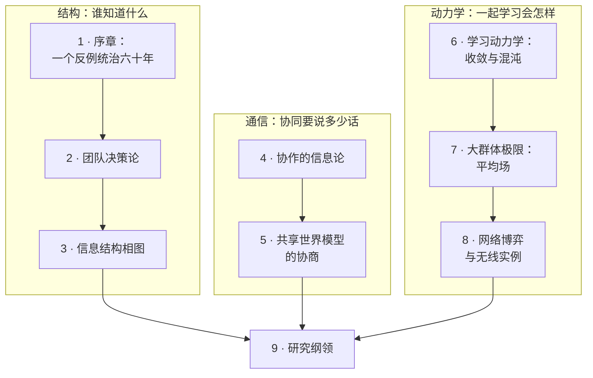

# 第四部 · 群体的决策论

!!! success "本部已完稿"
    九章全部完成（2026-09）。每章都经过逐章通读复核与关键数字独立重算，并通过三项质量检查：公式格式、站点构建、浏览器渲染。第 9 章末节给出全站四部的合成体系表、元命题与闭环图。

**总论题：多智能体协同的一切工程困难，都能追溯到几个六十年未解的数学根源——信息结构、协调的通信量、共同学习的动力学。把它们画成相图，是"网络智能/多智能体系统"的地基工程。**

单个智能体的决策论（MDP、最优控制）是成熟的科学；**许多个**智能体、**各自只看到一部分世界**、**必须通过有代价的通信协同**——这门科学只有孤岛：Witsenhausen 反例（1968）宣判了一般问题的深渊，团队决策论圈出了零星可解区，博弈学习动力学被证明可以混沌。本部把孤岛连成地图，并指出无线网络的特殊地位：**它既是多智能体问题的实例，又是信息结构的生成器**（拓扑决定谁看见什么，时延决定何时看见）。

## 本部地图

| 章 | 主题 | 性质 |
|---|---|---|
| [1 · 序章](01-one-counterexample.md) | Witsenhausen 反例完整算一遍：仿射最优精确 $0.96$（新闭式）对符号策略 $0.404253$；动作即信号；六十年上界序列；本部地图与三块警示牌 | 导读 + 本站演算 |
| [2 · 团队决策论](02-team-decision-theory.md) | Radner 两定理、Ho–Chu 部分嵌套、两基站功控团队算例（分散化代价 3.02%／8.00%）、嵌套亏损定价猜想 | 经典 + 本站演算 |
| [3 · 信息结构相图](03-information-structure-phase-diagram.md) | Youla 参数化、二次不变性、时延判据、两小区相边界 $d\le p$、NP-complete 一侧、相图与嵌套亏欠 | 经典 + 开放 |
| [4 · 协作的信息论](04-coordination-information-theory.md) | 协调容量（两基站错开的价签 $1-h(\epsilon)$）、均衡的通信复杂度（解概念决定量级）、GK/Wyner 公共信息、分栏话费表 | 经典工具 + 本站演算 |
| [5 · 共享模型协商](05-shared-world-model.md) | 三级共享阶梯、Newman、KL 罚项、推测解码接受率 $1-\mathrm{TV}$、协商话费猜想 | 探索章 |
| [6 · 学习动力学](06-learning-dynamics.md) | Nash $\subset$ CE $\subset$ CCE、no-regret $\Longrightarrow$ CCE（完整证明）、势博弈、MWU 两变体、无线版分岔阈值 $\eta^\star=7.45$、时间平均 vs 末迭代的可算分离 | 经典 + 本站演算 |
| [7 · 平均场](07-mean-field.md) | MFG $\neq$ MFC 是 $O(1)$（12.5%）、有限 $N$ 修正 $-0.25/N$、$1/\sqrt N$ 的来源、有效人数 $N_{\mathrm{eff}}$ 与 $\alpha=2$ 相边界 | 经典 + 本站演算 |
| [8 · 网络博弈](08-network-games.md) | 两小区博弈 PoA=1.35/PoS=1.07、势博弈判据、smoothness 与 $5/2$、Etkin $\mathrm{PoA}=\infty$、价格家族、Lozano 天花板与耦合度 $\kappa$ | 经典 + 本站提法 |
| [9 · 研究纲领](09-research-agenda.md) | 四条缺失定理的四件套（引理 9.2 补时延判据必要方向、命题 9.3–9.6 五条新算例）、接口表、打分、路线图；**全站收尾**：四部合成表、元命题"缺的不是算法，是 converse"、闭环图 | 纲领 + 全站收尾 |
